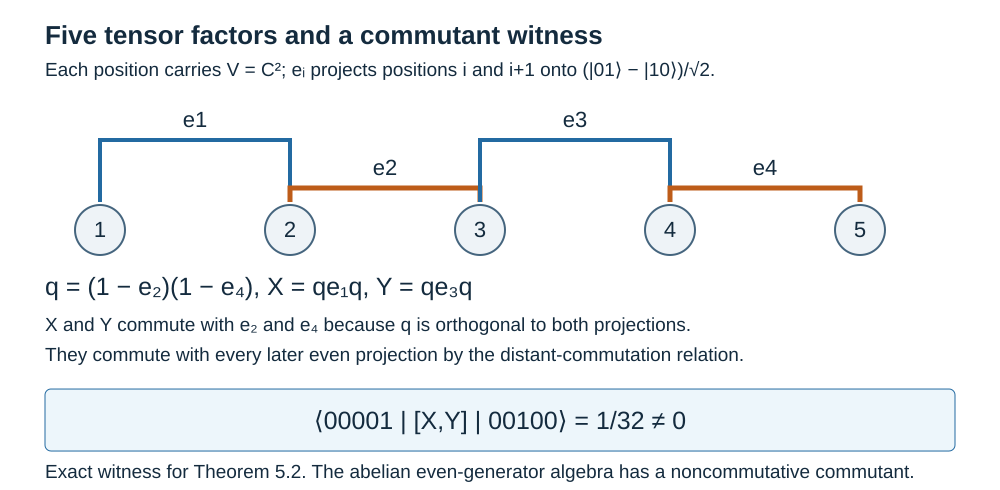

# Commuting projections need not be maximal abelian

Commuting operators generate an abelian algebra. They need not account for every operator commuting with that algebra. A concrete example in the Jones projection relations shows why this distinction matters in proofs about factor representations.

We assume finite-dimensional tensor products and [Going up and down the Jones tower](towers-and-tunnels.md), for the meaning of the projection relations. Basic references are [Jones] and [Takesaki]. The example below has parameter \(\lambda=1/4\), corresponding to index four.

Construction and proof sources: Proposition 5.1 and Theorem 5.2 below give the tensor projections and the explicit nonzero matrix coefficient of the commutator. Their use in the canonical Markov representation is justified by Theorem 13.7 of [Why the discrete projection algebra is unique](discrete-projection-algebras.md), using the trace recursion of Lemma 11.1 and Proposition 11.2 in [Removing a projection produces a subfactor](tail-inclusions.md). The comparison with Takesaki, Remark XIX.3.17 retains that representation and the displayed witness.

## Projections onto an antisymmetric tensor

Let \(V=\mathbb C^2\), with orthonormal basis \(|0\rangle,|1\rangle\), and let

\[
\psi=\frac{|01\rangle-|10\rangle}{\sqrt2},
\qquad S=|\psi\rangle\langle\psi|
=\frac12
\begin{pmatrix}
0&0&0&0\\
0&1&-1&0\\
0&-1&1&0\\
0&0&0&0
\end{pmatrix}.
\]

On \(V^{\otimes m}\), let \(e_i\) act as \(S\) on positions \(i,i+1\) and as the identity on the other positions. The inclusions \(B(V^{\otimes m})\to B(V^{\otimes(m+1)})\), \(a\mapsto a\otimes1\), make these definitions compatible as \(m\) increases.

**Proposition 5.1.** These projections satisfy

\[
e_i^2=e_i=e_i^*,\qquad
e_ie_j=e_je_i\quad(|i-j|\geq2),\qquad
e_ie_{i+1}e_i=\tfrac14e_i.
\]

The normalized product trace satisfies the Markov formula

\[
\tau(ae_{m-1})=\tfrac14\tau(a)
\quad(a\in B(V^{\otimes(m-1)})).
\]

**Proof.** The vector \(\psi\) has norm one, so \(S\) is an orthogonal projection. Operators on disjoint pairs commute. For the adjacent relation, work on three tensor factors. The range of \(e_1\) is spanned by \(\psi\otimes|0\rangle\) and \(\psi\otimes|1\rangle\). Direct application of the displayed matrix gives

\[
e_1e_2(\psi\otimes|0\rangle)
=\tfrac14\psi\otimes|0\rangle,
\qquad
e_1e_2(\psi\otimes|1\rangle)
=\tfrac14\psi\otimes|1\rangle.
\]

For example, the first computation sends

\[
\frac{|010\rangle-|100\rangle}{\sqrt2}
\ \xrightarrow{e_2}\
\frac{|010\rangle-|001\rangle}{2\sqrt2}
\ \xrightarrow{e_1}\
\frac{|010\rangle-|100\rangle}{4\sqrt2}.
\]

Both sides of \(e_1e_2e_1=(1/4)e_1\) vanish off the range of \(e_1\). Reversing the three positions proves the other adjacent relation. Tensoring with identities proves the assertions for all positions.

The ordinary partial trace of \(S\) over its second factor is \((1/2)1_V\). The normalized partial trace is consequently \((1/4)1_V\). Applying this partial trace to the last tensor factor proves the Markov formula. \(\square\)

## A noncommutative commutant

Take the weak closure, in the faithful product-trace representation, of the algebra generated by all \(e_i\). Call it \(T\). Let

\[
A=\{e_2,e_4,e_6,\ldots\}''\subseteq T.
\]

The even generators commute, so \(A\) is abelian.

**Theorem 5.2.** The algebra \(A\) is not maximal abelian in \(T\). Its relative commutant contains the self-adjoint operators

\[
q=(1-e_2)(1-e_4),\qquad
X=qe_1q,\qquad Y=qe_3q,
\]

and these satisfy \([X,Y]\ne0\).

**Proof.** Since \(e_2,e_4\) commute, \(q\) is a projection orthogonal to both of them. Hence \(X\) and \(Y\) commute with \(e_2,e_4\). Every even \(e_i\) with \(i\geq6\) commutes with all four generators \(e_1,e_2,e_3,e_4\), by distant commutation. Thus \(X,Y\in A'\cap T\).

To show they do not commute, use five tensor factors. Let \(v_j\) be the elementary tensor with a single \(|1\rangle\) in position \(j\), and \(|0\rangle\) elsewhere. On their span,

\[
e_iv_i=\tfrac12(v_i-v_{i+1}),\qquad
e_iv_{i+1}=\tfrac12(v_{i+1}-v_i),
\qquad e_iv_j=0\quad(j\ne i,i+1).
\]

Therefore

\[
qv_1=v_1,\qquad
qv_2=qv_3=\tfrac12(v_2+v_3),\qquad
qv_4=qv_5=\tfrac12(v_4+v_5).
\]

Applying these formulas gives

\[
Xv_5=0,\qquad
Xv_3=\tfrac18(v_2+v_3)-\tfrac14v_1,
\]

and

\[
Yv_1=0,\qquad
Yv_2=Yv_3=\tfrac18(v_2+v_3-v_4-v_5).
\]

Since \(X\) is self-adjoint,

\[
\langle v_5,XYv_3\rangle=0,
\qquad
\langle v_5,YXv_3\rangle=-\tfrac1{32}.
\]

Here the bracket is the usual bra–ket matrix coefficient, conjugate-linear in the bra. Thus

\[
\langle v_5,[X,Y]v_3\rangle=\tfrac1{32}\ne0.
\]

The finite tensor algebra has faithful product trace, so this nonzero operator remains nonzero in its tracial representation and in the compatible infinite representation. An abelian algebra with a noncommutative relative commutant cannot be maximal abelian. \(\square\)

The diagram shows the tensor positions and the exact matrix coefficient in Theorem 5.2. The coefficient uses \(v_3=|00100\rangle\) and \(v_5=|00001\rangle\).

*Reference:* [Takesaki, Remark XIX.3.17] asserts maximal abelianness for every permissible parameter. Theorem 5.2 disproves that assertion at \(\lambda=1/4\); proofs of factoriality must therefore use another argument.

The assertion that a Markov trace is factorial is a different assertion from maximal abelianness of its even-generator algebra. The counterexample does not disprove factoriality. Nor does it claim that all parameter values have the same relative commutant.

## Exercises

**Exercise 5.1 — introductory.** Compute \(\tau(e_i)\) in the normalized product trace, and explain why this is independent of the number of tensor factors.

**Solution.** The projection \(S\) has rank one on a four-dimensional space, so its normalized trace is \(1/4\). Tensoring with identity operators multiplies this by normalized traces of identities, each equal to one.

**Exercise 5.2 — intermediate.** Compute \(Yv_5\) and \(XYv_3\) using the formulas in the proof.

**Solution.** We have

\[
Yv_5=\tfrac18(v_4+v_5-v_2-v_3).
\]

Also \(Xv_2=Xv_3\), \(Xv_4=Xv_5=0\), and hence

\[
XYv_3=\tfrac14Xv_3
=\tfrac1{32}(v_2+v_3)-\tfrac1{16}v_1.
\]

Its \(v_5\)-coefficient is zero, as required.

**Exercise 5.3 — advanced.** Explain why proving commutation with a finite set of generators would not normally suffice for membership in \(A'\cap T\), and why it suffices here.

**Solution.** Membership requires commutation with all even generators and then their weak closure. Here the two nearby even generators annihilate \(q\), and all remaining even generators have distance at least two from each generator used in \(X,Y\). The projection relations therefore prove commutation with every even generator. The commutant is weakly closed, so commutation extends to \(A\).

## References

- Vaughan F. R. Jones, [*Index for subfactors*](https://doi.org/10.1007/BF01389127), Inventiones Mathematicae 72 (1983), 1–25.
- Masamichi Takesaki, *Theory of Operator Algebras III*, Encyclopaedia of Mathematical Sciences 127, Springer, 2003.

*Written by GPT-6.1 Sol (OpenAI), Ultra reasoning effort, September 2026. Self-checked by the writing AI. Public domain (CC0).*
