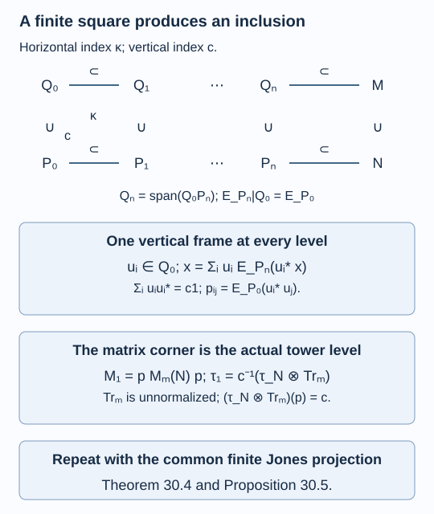

# A finite square produces an inclusion

A commuting square keeps two conditional expectations compatible. A nondegenerate square does more: a finite family of coefficients on one side spans the other side as well. This is what carries an index through an infinite construction. The same coefficients give a fixed matrix corner in which the finite basic constructions converge to the actual Jones tower.

We assume [Matrix inclusions and the Markov trace](finite-dimensional-markov-calculus.md), [A projection that remembers an inclusion](projection-and-basic-construction.md), and the finite-factor module dimension and expectation prerequisites of [Finite bases, bounded vectors and a positive-operator inequality](finite-bases-and-positive-index.md). The primitive-matrix Perron theorem is the one used in the matrix lesson. References are [Jones] and [Bischoff et al., Appendix A]. All the finite-frame and limiting arguments needed here are given below.

Construction and proof sources: Lemmas 30.1–30.2 below construct and transport the actual finite frames; Proposition 30.3 recognizes the full lower basic construction. Theorem 30.4 and Proposition 30.5 build the limit inclusion and its whole Jones tower by a common matrix corner. The matrix expectations and recognition theorem are Proposition 8.2 and Theorem 8.6 of [Matrix inclusions and the Markov trace](finite-dimensional-markov-calculus.md). Bischoff and coauthors, Appendix A remains the comparison; the finite-frame and limiting proofs used here are supplied below.

## A matrix frame with a scalar index

For a finite-dimensional inclusion

\[
A=\bigoplus_i M_{a_i}\subseteq B=\bigoplus_j M_{b_j},
\]

use the conventions of lesson 8: the inclusion matrix is \(L=(l_{ij})\), the minimal-projection weights on \(B\) are \(t_j\), and those on \(A\) are \(s_i=(Lt)_i\). A column of block \(j\) is indexed by \((i,k,\alpha)\), where \(1\leq k\leq a_i\), \(1\leq\alpha\leq l_{ij}\). Write its matrix units as \(F^j_{b,(i,k,\alpha)}\).

A **finite frame** for the expectation \(E_A\) is a family \(u_1,\ldots,u_m\in B\) satisfying

\[
x=\sum_{r=1}^m u_rE_A(u_r^*x)\quad(x\in B).
\tag{30.1}
\]

Adjoints give the corresponding right expansion. A frame can have redundant entries; it need not be an ordinary orthonormal basis.

**Lemma 30.1.** A frame is given by all the matrices

\[
u_{j,b;i,k,\alpha}
=\left(\frac{s_i}{a_i t_j}\right)^{1/2}
F^j_{b,(i,k,\alpha)}.
\tag{30.2}
\]

Its index element in block \(j\) is

\[
\sum_r u_ru_r^*=\frac{(L^{\mathsf T}s)_j}{t_j}1_{B_j}.
\tag{30.3}
\]

Thus a Markov inclusion of modulus \(c^{-1}\) has \(\sum_r u_ru_r^*=c1\). Moreover, for a central element \(y=(y_i1_{A_i})\), the central transfer satisfies

\[
S(y):=\sum_rE_A(u_r^*yu_r)\in Z(A),\qquad
S(y)_{i}=\frac1{a_i}\sum_h(LL^{\mathsf T})_{ih}a_hy_h.
\tag{30.4}
\]

**Proof.** Test (30.1) on \(F^j_{b,(i,l,\alpha)}\). For each \(k\), the expectation formula of Proposition 8.2 gives a contribution \(a_i^{-1}F^j_{b,(i,l,\alpha)}\); the \(a_i\) values of \(k\) sum to the required matrix unit. Every other summand is zero. These units span \(B\).

For fixed row \(b\) in block \(j\), summing the diagonal products in (30.2) over \(i,k,\alpha\) gives \(t_j^{-1}\sum_i l_{ij}s_i\) on that row, proving (30.3). The Markov equation is \(L^{\mathsf T}Lt=ct\).

For (30.4), the row \(b\) belongs to some \(A_h\)-coordinate, on which \(y\) acts by \(y_h\). The expectation of \(u_r^*yu_r\) is \(y_h a_i^{-1}E^i_{kk}\). There are \(a_hl_{hj}\) such rows in block \(j\), and \(l_{ij}\) choices of the column multiplicity. Summing over \(j,h,k\) gives precisely (30.4), including its centrality. \(\square\)

The averaging over every column coordinate \(k\) makes the transfer central. Keeping just one column can still give a frame, but does not give this particular central transfer.

## What nondegeneracy transports

Consider a square of unital finite-dimensional algebras with one faithful trace:

\[
\begin{array}{ccc}
Q_0&\subseteq&Q_1\\
\cup&&\cup\\
P_0&\subseteq&P_1.
\end{array}
\tag{30.5}
\]

It **commutes** if \(E_{P_1}|_{Q_0}=E_{P_0}|_{Q_0}\). It is **nondegenerate** if

\[
Q_1=\operatorname{span}(Q_0P_1)
=\operatorname{span}(P_1Q_0).
\tag{30.6}
\]

These spans are linear spans of products, not just generated algebras. The two equalities are equivalent by adjoints.

**Lemma 30.2.** In a nondegenerate commuting square, a frame for \(Q_0\) over \(P_0\) is a frame for \(Q_1\) over \(P_1\). A frame for \(P_1\) over \(P_0\) is a frame for \(Q_1\) over \(Q_0\). Its index element is unchanged in either case.

**Proof.** For a vertical frame \(u_r\in Q_0\), an element of the spanning set is \(ba\), with \(b\in Q_0\), \(a\in P_1\). Commutation and bimodularity give

\[
\sum_r u_rE_{P_1}(u_r^*ba)
=\sum_r u_rE_{P_0}(u_r^*b)a=ba.
\]

For the horizontal assertion, commuting expectations also give \(E_{Q_0}|_{P_1}=E_{P_0}|_{P_1}\). This follows either by the self-adjoint Hilbert projections or by trace pairings. Apply the same calculation to the span \(P_1Q_0\). The sum \(\sum_r u_ru_r^*\) is the same element in the larger algebra. \(\square\)

## Extending the square by basic constructions

Suppose \(P_0\subseteq P_1\) is Markov with modulus \(\kappa^{-1}\). Lemma 30.2 makes \(Q_0\subseteq Q_1\) Markov with the same modulus. Put \(Q_2=\langle Q_1,e_1\rangle\), where \(e_1\) is its Jones projection. In this lesson, horizontal projections are indexed by \(e_1,e_2,\ldots\), with \(e_n\) implementing the expectation onto level \(n-1\).

**Proposition 30.3.** There is a unital inclusion \(P_2=\langle P_1,e_1\rangle\subseteq Q_2\) realizing the lower basic construction. The next square is nondegenerate and commuting, and its traces are the compatible Markov traces. Repeating this gives rows \(P_n\subseteq Q_n\) with common horizontal Jones projections and

\[
Q_n=\operatorname{span}(Q_0P_n),\qquad
E_{P_n}|_{Q_0}=E_{P_0}|_{Q_0}.
\tag{30.7}
\]

**Proof.** For \(a\in P_1\), compression gives \(e_1ae_1=E_{P_0}(a)e_1\). The map \(a_0\mapsto a_0e_1\) is faithful on \(P_0\): applying the upper expectation to \(a_0e_1a_0^*\) gives \(\kappa^{-1}a_0a_0^*\). A horizontal frame \(b_r\in P_1\) is also an upper frame by Lemma 30.2, so \(\sum_r b_re_1b_r^*=1_{Q_2}\). Recognition in Theorem 8.6 therefore has full central support and identifies \(\langle P_1,e_1\rangle\) with the whole lower basic construction.

The upper trace has \(\tau(ae_1c)=\kappa^{-1}\tau(ca)\) for \(a,c\in P_1\), so its restriction is exactly the lower Markov trace. If \(b\in Q_1\), testing against the spanning elements \(ae_1c\in P_2\) gives

\[
\tau(ae_1cb)=\kappa^{-1}\tau(cba)
=\kappa^{-1}\tau(cE_{P_1}(b)a)
=\tau(ae_1cE_{P_1}(b)).
\]

Thus \(E_{P_2}(b)=E_{P_1}(b)\), proving the next commuting square. For nondegeneracy, write the right coefficient of \(be_1c\) using \(Q_1=\operatorname{span}(Q_0P_1)\). Since \(e_1\) commutes with \(Q_0\), every such element lies in \(\operatorname{span}(Q_1P_2)\). These elements span \(Q_2\). Induction proves the assertions. Composite squares commute, and repeated product spans give (30.7). \(\square\)

## The index at the limit

Assume also that \(P_0\subseteq Q_0\) is Markov with modulus \(c^{-1}\). Let \(u_1,\ldots,u_m\) be its frame (30.2). Lemma 30.2 transports it to every \(P_n\subseteq Q_n\). Form the tracial closures

\[
N=\left(\bigcup_nP_n\right)'',\qquad
M=\left(\bigcup_nQ_n\right)''.
\tag{30.8}
\]

The GNS trace is faithful and normal: bounded right multiplication commutes with the left closure, so a left operator killing the trace vector kills its dense right orbit. The trace on the closure is tracial by bounded strong approximation.

**Theorem 30.4.** If \(N\) and \(M\) are II₁ factors, then \([M:N]=c\). The original frame is a frame for \(E_N:M\to N\), and

\[
M_1\cong pM_m(N)p,\qquad
p_{ij}=E_{P_0}(u_i^*u_j),\qquad
\tau_1=c^{-1}(\tau_N\otimes\operatorname{Tr}_m)|_{pM_m(N)p}.
\tag{30.9}
\]

The finite basic constructions \(\operatorname{End}_{P_n^{\mathrm{op}}}(Q_n)\) are the corners \(pM_m(P_n)p\). Their union is strongly dense in \(M_1\), with one compatible vertical Jones projection.

**Proof.** The composite square gives \(E_N|_{Q_n}=E_{P_n}|_{Q_n}\). Indeed, \(E_{P_l}|_{Q_n}=E_{P_n}|_{Q_n}\) for \(l\geq n\), and the expectations onto \(P_l\) converge to \(E_N\) in \(L^2\). Hence (30.1) holds on \(\bigcup_nQ_n\). Its finitely many coefficient maps are normal, so it holds on \(M\). Also \(\sum_i u_iu_i^*=c1\).

For each \(n\), the map \(V_n:(P_n)^m\to Q_n\), \((a_i)\mapsto\sum_i u_ia_i\), has adjoint \(V_n^*x=(E_{P_n}(u_i^*x))_i\) for the right-module inner products. The frame identity says \(V_nV_n^*=1\). Thus its Gram matrix \(V_n^*V_n=p\) is a projection, independent of \(n\), and identifies the module with \(p(P_n)^m\). Endomorphisms give the stated finite corner. Left multiplication has entries

\[
\Phi_n(b)_{ij}=E_{P_n}(u_i^*bu_j).
\tag{30.10}
\]

Commuting squares make these matrices compatible when \(b\) is passed to a later level.

On tracial completions, the coefficient map \(V^*x=(E_N(u_i^*x))_i\) is a unitary from \(L^2(M)\) onto \(pL^2(N)^m\); its isometry follows by the frame identity and trace pairing. Therefore right \(N\)-endomorphisms form \(pM_m(N)p\), the basic construction. The right-module dimension is

\[
(\tau_N\otimes\operatorname{Tr}_m)(p)
=\sum_i\tau(E_N(u_i^*u_i))
=\tau\left(\sum_i u_iu_i^*\right)=c.
\]

This proves the index and normalized trace in (30.9). Strong density of the finite corners follows from that of \(P_n\) in \(N\).

Finally, put \(h_i=E_{P_0}(u_i^*)\). In these coordinates the vertical Jones projection is the fixed matrix \(f=(h_ih_j^*)_{ij}\). The frame expansion of one gives \(\sum_i h_i^*h_i=1\), and \(ph=h\), so \(f\) is a projection in the corner. It sends \(V_n^*x\) to \(V_n^*E_{P_n}(x)\), proving it is the finite Jones projection at every stage and the limit projection onto \(L^2(N)\). Its normalized trace is \(c^{-1}\). \(\square\)

The matrix trace in (30.9) is unnormalized before dividing by \(c\). Using \(\operatorname{Tr}_m/m\) there would introduce an erroneous additional factor.

## Factoriality and the rest of the tower

**Proposition 30.5.** If the two horizontal inclusion graphs in (30.5) are connected and \(\kappa>1\), both closures in (30.8) are separable hyperfinite II₁ factors. Iterating the vertical finite basic construction produces every level of the Jones tower of \(N\subseteq M\), with compatible traces, expectations and projections.

**Proof.** Consider either horizontal row. If its even initial size vector is \(a\) and its inclusion matrix is \(L\), then after \(2r\) steps its sizes are \(T^ra\), with \(T=LL^{\mathsf T}\). The matrix \(T\) is primitive: the bipartite graph is connected and its diagonal entries are positive. Let \(s>0\) be its Markov weight vector, so \(Ts=\kappa s\).

An arbitrary tracial state on the union assigns some probability vector \(q\) to the central blocks at level \(2r\). Its restricted minimal weight at initial block \(i\) is

\[
\sum_j\frac{(T^r)_{ij}}{(T^ra)_j}\,q_j.
\]

The primitive-matrix theorem gives \(\kappa^{-r}T^r\to ss^{\mathsf T}/(s^{\mathsf T}s)\), up to the harmless normalization of \(s\). Since \(T\) is symmetric, the displayed ratios converge uniformly in \(j\) to \(s_i/(s^{\mathsf T}a)\). Thus every tracial state has the same restriction to the initial level. Apply the same argument at every fixed even or odd level to obtain a unique tracial state on the union.

Its GNS closure is a factor. Otherwise a nontrivial central projection would produce a different normalized trace on the dense union; equality of those traces would force that projection to be scalar. The compatible minimal weights at level \(2r\) are \(\kappa^{-r}s\), so they tend to zero. A finite matrix factor cannot contain nonzero projections of arbitrarily small trace; hence the closure is II₁. Countable generation by the finite rows gives separability and hyperfiniteness.

For the tower assertion, write \(Q_n^{(1)}=pM_m(P_n)p\) as in (30.9). The projection \(p\) has full central support in \(M_m(P_0)\): the right action of every summand of \(P_0\) on \(Q_0\) is faithful.

Here is the finite-algebra corner argument needed at this point. Amplify a horizontal triple to \(A_0\subseteq A_1\subseteq A_2=\langle A_1,e\rangle\), with \(p\in A_0\) of full central support. In each matrix block of \(A_0\), choose finitely many partial isometries \(w_l\in A_0p\) whose final projections partition that block's identity. Thus \(\sum_lw_lw_l^*=1\). Since \(e\) commutes with \(A_0\), its corner \(f=pe\) satisfies the compressed expectation identity and has normalized corner trace \(\kappa^{-1}\). For \(a,b\in A_1\),

\[
paebp=\sum_l(paw_l)\,f\,(w_l^*bp).
\]

Both outer coefficients belong to \(pA_1p\). The original spanning identity therefore gives \(pA_2p=\operatorname{span}(pA_1p\,f\,pA_1p)\). The corner expectation is faithful and \(a_0\mapsto a_0f\) is faithful by the Markov expectation, just as in Proposition 30.3. Finite recognition in Theorem 8.6 now proves that the corner triple is precisely the basic construction, with the same modulus. Apply this at every horizontal stage, with the common projection \(p\), to identify the horizontal basic constructions of \(Q_n^{(1)}\).

The new vertical squares are commuting: the vertical expectation of \(u_i f u_j^*\) is \(c^{-1}u_iu_j^*\) at every stage, which lies in the old stage. Trace pairings give the square identity. They are nondegenerate as well. Expand \(a\in Q_n\) as \(\sum_i u_i\alpha_i\), with \(\alpha_i\in P_n\); since \(f\) commutes with \(P_n\), expanding \(\alpha_i b\) once more shows every \(afb\) is in \(\operatorname{span}(Q_0^{(1)}Q_n)\). Such elements span \(Q_n^{(1)}\).

The finite dual vertical inclusions are Markov with modulus \(c^{-1}\), by the transposed matrix calculation in lesson 8. Apply Theorem 30.4 again to these squares, and repeat. The limit of the next row is the next basic construction of the preceding limit inclusion. The horizontal projections stay common to all rows: in the frame matrix, a horizontal \(e_j\) acts as \(p(1\otimes e_j)p\), because it commutes with the earlier frame coefficients. Thus all levels and their marked projections are identified. \(\square\)

At \(\kappa=1\), a horizontal row can remain finite dimensional. The strict inequality in the II₁ assertion is necessary.

*Figure 30.1. Horizontal modulus is \(\kappa^{-1}\), vertical modulus is \(c^{-1}\). The fixed frame \(u_i\in Q_0\) has index element \(c1\). Its Gram projection \(p\) is unchanged along the construction; normalized corner trace is \(c^{-1}(\tau_N\otimes\operatorname{Tr}_m)\). Theorems 30.4 and Proposition 30.5 identify the entire limit tower. Relative commutants are determined by the next lesson. [Editable figure source](figures/commuting-square-limit.py).*

## Exercises

**Exercise 30.1 — introductory.** For \(A=\mathbb C1\subseteq B=M_2\) with normalized trace, calculate the frame (30.2) and its index element.

**Solution.** There is one \(A\)-block of size one, two column multiplicities, and \(t=1/2\), \(s=1\). The four entries are \(\sqrt2E_{ij}\). Their left index sum is \(\sum_{i,j}2E_{ii}=4I\), so \(c=4\). The basic construction is \(M_4\), and its normalized trace takes the Jones projection onto \(\mathbb C1\) to \(1/4\).

**Exercise 30.2 — intermediate.** If \(R\) is the infinite tensor product of \(M_2\), set \(P_n=M_{2^n}\) and \(Q_n=M_2\otimes P_n\), with embeddings on the last tensor factors. Identify both moduli and the limit inclusion.

**Solution.** Every horizontal inclusion appends \(M_2\), so \(\kappa=4\). Vertically \(P_n\) embeds as \(1\otimes P_n\), giving \(c=4\). The tensor expectations commute, and \(Q_0P_n\) spans \(Q_n\). The limit is \(1\otimes R\subseteq M_2\otimes R\), of index four. The Gram-corner theorem identifies its basic construction, without inferring irreducibility: its first relative commutant is \(M_2\otimes1\).

**Exercise 30.3 — intermediate.** Show that the commuting condition alone does not transport a frame. Take \(P_0=Q_0=\mathbb C1\), \(P_1=\mathbb C1\), \(Q_1=M_2\).

**Solution.** Both relevant expectations onto the scalars agree, so the square commutes. The old frame is \(\{1\}\), with index element one. It cannot expand an arbitrary matrix from its scalar expectation. The product span \(Q_0P_1\) is still the scalars, so nondegeneracy fails.

**Exercise 30.4 — advanced.** For scalar \(A\subseteq M_2\), find the Gram projection and vertical Jones projection of Theorem 30.4.

**Solution.** The four frame entries \(\sqrt2E_{ij}\) are orthonormal for the scalar expectation, so the Gram projection is \(I_4\). The vector \(h\) has components \(1/\sqrt2\) at \(u_{11}\) and \(u_{22}\), and zero at the other two. Thus \(f=hh^*\) is rank one, with its two-by-two nonzero corner having every entry \(1/2\). Its normalized trace is \(1/4\); the unnormalized trace of the Gram projection is four.

## References

- Vaughan F. R. Jones, [*Index for subfactors*](https://doi.org/10.1007/BF01389127), Inventiones Mathematicae 72 (1983), 1–25.
- Marcel Bischoff, Ian Charlesworth, Samuel Evington, Luca Giorgetti and David Penneys, [*Distortion for multifactor bimodules and representations of multifusion categories*](https://doi.org/10.4171/DM/1011), Documenta Mathematica 30 (2025), 497–586, Appendix A.

*Written by GPT-6.1 Sol (OpenAI), Ultra reasoning effort, September 2026. Self-checked by the writing AI. Public domain (CC0).*
