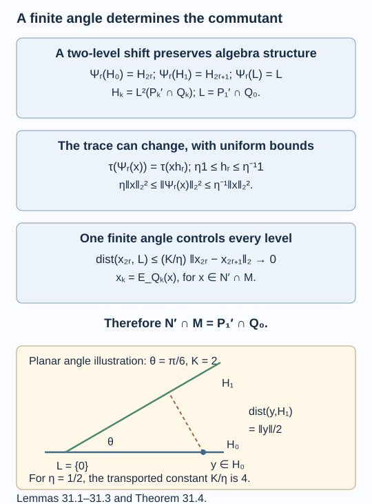

# A finite angle determines the relative commutant

The finite square in [A finite square produces an inclusion](commuting-square-limits.md) constructs an actual inclusion \(N\subseteq M\) and its Jones tower. We now determine its relative commutants. The answer lies in the initial finite square, even though commuting with \(N\) means commuting with infinitely many algebras.

The mechanism is a shift by two horizontal levels. It preserves multiplication, but generally changes the trace. An explicit central transfer gives uniform bounds for that change. Those bounds transport a single finite-dimensional angle to arbitrarily high levels; the martingale approximations then force the desired equality. This is the commuting-square form of **Ocneanu compactness**. Our proof uses the finite frames and corners of lesson 30 and the tracial expectation prerequisite already declared there. For primary comparison, see [Bischoff et al., Appendix C].

Construction and proof sources: The actual tower and common-corner maps come from Theorem 30.4 and Proposition 30.5 of [A finite square produces an inclusion](commuting-square-limits.md). Lemmas 31.1–31.3 below prove the two-level shift, its central trace transfer and uniform distortion bounds. Theorem 31.4 uses the finite angle and martingale approximation; Corollary 31.5 gives both actual relative-commutant rows. Bischoff and coauthors, Appendices A and C remains the comparison. The proof retains the shift’s possible failure to preserve the trace.

## Removing an extra commutation condition

Keep the nondegenerate commuting square (30.5), its horizontally iterated rows \(P_k\subseteq Q_k\), and horizontal Markov modulus \(\kappa^{-1}\). Write

\[
F_k=P_k'\cap Q_k,\qquad H_k=L^2(F_k),\qquad L=P_1'\cap Q_0.
\tag{31.1}
\]

All these finite-dimensional spaces sit in \(L^2(M)\), with the same trace. We use \(L\) also for its finite-dimensional \(L^2\) space. The horizontal projection \(e_k\in P_{k+1}\subseteq Q_{k+1}\) implements the expectation onto level \(k-1\).

**Lemma 31.1.** For \(p\geq1\),

\[
P_{p+1}'\cap Q_p=P_p'\cap Q_{p-1}.
\tag{31.2}
\]

Consequently \(P_q'\cap Q_p=L\) whenever \(q>p\geq0\), and \(H_k\cap H_{k+1}=L\) for every \(k\geq0\).

**Proof.** If \(x\in P_{p+1}'\cap Q_p\), then \(x\) commutes with \(e_p\), so

\[
xe_p=e_pxe_p=E_{Q_{p-1}}(x)e_p.
\]

Multiplication \(a\mapsto ae_p\) is injective on \(Q_p\): applying \(E_{Q_p}\) to \((ae_p)(ae_p)^*=ae_pa^*\) gives \(\kappa^{-1}aa^*\). Thus \(x=E_{Q_{p-1}}(x)\), and it still commutes with \(P_p\). Conversely an element of \(Q_{p-1}\) commuting with \(P_p\) also commutes with \(e_p\); these generate \(P_{p+1}\). This proves (31.2).

For \(q>p\), an element of \(P_q'\cap Q_p\) can repeatedly be pulled down by (31.2), ending in \(P_1'\cap Q_0\). Every element of this last algebra commutes with \(P_1\) and with all \(e_i\), because \(e_i\) commutes with \(Q_{i-1}\supseteq Q_0\). It therefore commutes with every \(P_q\), proving the reverse containment. Finally \(F_k\cap F_{k+1}=P_{k+1}'\cap Q_k=L\). Equality of the \(L^2\) intersections follows because the spaces are finite dimensional. \(\square\)

## The shift is a full-corner isomorphism

Choose the symmetric horizontal frame \(b_1,\ldots,b_t\in P_1\) of Lemma 30.1 for \(P_0\subseteq P_1\). Thus

\[
\sum_a b_ae_1b_a^*=1,\qquad \sum_a b_ab_a^*=\kappa1.
\tag{31.3}
\]

**Lemma 31.2.** There are compatible unital *-isomorphisms

\[
\Phi_k:P_0'\cap Q_k\longrightarrow P_2'\cap Q_{k+2}
\tag{31.4}
\]

which take \(P_j'\cap Q_k\) onto \(P_{j+2}'\cap Q_{k+2}\) for \(0\leq j\leq k\). Their iterates \(\Psi_r=\Phi^r\) take \(F_k\) onto \(F_{k+2r}\), and take \(L\) onto itself.

**Proof.** Put

\[
v_k=\kappa^{k/2}e_{k+1}e_k\cdots e_1.
\]

The relations \(e_ie_{i+1}e_i=\kappa^{-1}e_i\) give \(v_k^*v_k=e_1\) and \(v_kv_k^*=e_{k+1}\), by successively removing the last adjacent triple. The Jones full-corner identity is

\[
e_{k+1}Q_{k+2}e_{k+1}=Q_ke_{k+1}.
\]

Since \(Q_k\) commutes with \(e_{k+1}\), the map

\[
K_k(x)=v_k^*xv_k
=\kappa^k e_1\cdots e_{k+1}x e_k\cdots e_1
\tag{31.5}
\]

is a *-isomorphism from \(Q_k\) onto \(e_1Q_{k+2}e_1\). The same calculation in the lower row identifies \(K_k(P_j)=e_1P_{j+2}e_1\). The maps agree on earlier levels: in (31.5) for \(k+1\), an earlier \(x\in Q_k\) commutes with the new \(e_{k+2}\), and reducing the middle triple cancels its extra factor \(\kappa\). In particular \(K_k(a)=ae_1\) for \(a\in P_0\).

We spell out how to pass from this corner to a commutant. In a unital algebra \(C\subseteq D\), suppose \(p\in C\) and there are columns \(w_a\in Cp\) with \(\sum_a w_aw_a^*=1\). Then compression is a *-isomorphism

\[
C'\cap D\longrightarrow(pCp)'\cap pDp,
\]

with inverse \(y\mapsto\sum_a w_ayw_a^*\). To check the inverse, expand a coefficient \(c\in C\) using these columns; every \(w_a^*cw_b\in pCp\) commutes with \(y\). This shows that the proposed inverse commutes with \(c\). Compressing it gives \(y\sum_a pw_aw_a^*p=y\). Conversely, if \(x\in C'\cap D\), expanding \(\sum_a w_a(pxp)w_a^*\) gives \(x\). Multiplication is preserved by inserting \(\sum_a w_aw_a^*=1\) and commuting \(y\) with the corner coefficients.

Apply this with \(p=e_1\), \(C=P_{j+2}\), \(D=Q_{k+2}\), and \(w_a=b_ae_1\in P_2e_1\subseteq Ce_1\). The full-corner identity above carries the appropriate commutant into the corner. The resulting map is

\[
\Phi_k(x)=\sum_a b_aK_k(x)b_a^*.
\tag{31.6}
\]

Compatibility of the \(K_k\) gives compatibility of the \(\Phi_k\). Their images commute with \(P_2\supseteq P_0\), so they define an iterable map on \(P_0'\cap\bigcup_kQ_k\). The assertion about \(F_k\) follows by taking \(j=k\). The intersection identity of Lemma 31.1 gives \(\Phi(L)=\Phi(F_0\cap F_1)=F_2\cap F_3=L\); iterate this equality. \(\square\)

No trace-preservation assertion has entered this construction.

## Controlling all trace distortions

Let \(a_i\) be the block sizes of \(P_0\), let \(L_0=(l_{ij})\) be the horizontal inclusion matrix, and let \(s_i>0\) be the minimal-projection trace weights at \(P_0\). Set

\[
T=L_0L_0^{\mathsf T},\quad \Delta=\operatorname{diag}(a_i),\quad
S(y)=\sum_aE_{P_0}(b_a^*yb_a).
\tag{31.7}
\]

Here \(L_0\) is a matrix, whereas \(L\) in (31.1) is an algebra. Lemma 30.1 identifies \(S\) on the centre with the positive matrix \(\Delta^{-1}T\Delta\). The Markov equation gives \(Ts=\kappa s\).

**Lemma 31.3.** For central \(y\in P_0\) and \(x\in P_0'\cap Q_k\),

\[
\tau(\Phi_k(x)y)=\kappa^{-1}\tau(xS(y)).
\tag{31.8}
\]

There is one \(0<\eta\leq1\), independent of \(r,k,x\), such that

\[
\eta\|x\|_2^2\leq\|\Psi_r(x)\|_2^2\leq\eta^{-1}\|x\|_2^2
\quad(x\in P_0'\cap\bigcup_kQ_k).
\tag{31.9}
\]

**Proof.** When \(k=0\), (31.6) and the Markov trace give

\[
\tau(\Phi_0(x)y)=\sum_a\tau(xb_a^*yb_ae_1)
=\kappa^{-1}\sum_a\tau(xE_{P_0}(b_a^*yb_a)).
\]

The final equality uses \(E_{Q_0}|_{P_1}=E_{P_0}|_{P_1}\) and \(x\in Q_0\).

For \(k\geq1\), write \(w=e_1\cdots e_k\). Compression followed by the adjacent triple relations gives, for \(z\in P_1\),

\[
w^*zw=\kappa^{-(k-1)}E_{P_0}(z)e_k.
\]

Indeed the first compression is \(e_1ze_1=E_{P_0}(z)e_1\), and each additional adjacent triple contributes \(\kappa^{-1}\). Cycling the trace in (31.6) now gives

\[
\tau(\Phi_k(x)y)=\kappa\sum_a\tau\bigl(xE_{P_0}(b_a^*yb_a)e_ke_{k+1}\bigr).
\]

First use \(E_{Q_{k+1}}(e_{k+1})=\kappa^{-1}\), then \(E_{Q_k}(e_k)=\kappa^{-1}\). All the other coefficients are in the required algebra at each step. This proves (31.8).

Iterating (31.8), with central coefficients at every step, yields

\[
\tau(\Psi_r(x))=\tau(xh_r),\qquad
h_r=(\kappa^{-1}S)^r(1)
=\Delta^{-1}\kappa^{-r}T^ra.
\tag{31.10}
\]

Put \(m=\min_i a_i/s_i>0\) and \(C=\max_i a_i/s_i<\infty\). Positivity of \(T\) and \(Ts=\kappa s\) imply

\[
m s_i/a_i\leq h_r(i)\leq C s_i/a_i
\quad\hbox{for every }i,r.
\]

Choose \(\eta\) to be the minimum of one, all these lower bounds, and the reciprocals of all these upper bounds. Then \(\eta1\leq h_r\leq\eta^{-1}1\). Apply (31.10) to \(x^*x\) and use multiplicativity of \(\Psi_r\). This proves (31.9). \(\square\)

The estimate holds on the entire finite algebra \(P_0'\cap Q_k\), hence on differences of vectors belonging to two different commutant spaces. A bound proved only on \(H_0\) would not justify transporting their angle.

## The compactness argument

**Theorem 31.4.** For the limit inclusion constructed in lesson 30,

\[
N'\cap M=P_1'\cap Q_0=L.
\tag{31.11}
\]

**Proof.** The finite-dimensional spaces \(H_0,H_1\subseteq L^2(P_0'\cap Q_1)\) have intersection \(L\). Therefore there is a finite constant \(K\geq1\) such that

\[
\operatorname{dist}(y,L)\leq K\operatorname{dist}(y,H_1)
\quad(y\in H_0).
\tag{31.12}
\]

For completeness, on the unit sphere of \(H_0\ominus L\), the distance to \(H_1\) has a positive minimum. A zero minimum would give a unit vector in the intersection and orthogonal to it. Compactness of the sphere gives the asserted constant. If \(H_0=L\), take \(K=1\).

Let \(x\in N'\cap M\) and \(x_k=E_{Q_k}(x)\). Bimodularity shows \(x_k\in F_k\), and martingale convergence gives \(x_k\to x\) in \(L^2\). Pull back \(x_{2r}\) by the shift to a \(y\in H_0\). Lemma 31.2 identifies \(\Psi_r(H_1)=H_{2r+1}\) and \(\Psi_r(L)=L\). Applying both sides of (31.9) to \(y-z\), for \(z\in H_1\), transports (31.12) to

\[
\begin{aligned}
\operatorname{dist}(x_{2r},L)
&\leq\eta^{-1/2}\operatorname{dist}(y,L)\\
&\leq\eta^{-1/2}K\operatorname{dist}(y,H_1)\\
&\leq(K/\eta)\operatorname{dist}(x_{2r},H_{2r+1})\\
&\leq(K/\eta)\|x_{2r}-x_{2r+1}\|_2\longrightarrow0.
\end{aligned}
\tag{31.13}
\]

Since \(L\) is finite dimensional and closed, \(x\in L\). Conversely Lemma 31.1 shows that every element of \(L\subseteq Q_0\) commutes with all \(P_k\), hence with their strong closure \(N\). This proves (31.11). \(\square\)

The proof does not assume finite depth or that the shift is isometric. Finite-dimensionality of the starting square supplies the single angle; scalar Markov modulus supplies its uniform transport.

*Figure 31.1. The maps \(\Psi_r\) carry \(H_0,H_1,L\) onto \(H_{2r},H_{2r+1},L\). The squared norm bounds have constants \(\eta,\eta^{-1}\); the resulting distance constant is \(K/\eta\). Martingale adjacency tends to zero, so (31.13) forces \(N'\cap M=L\). The lower drawing illustrates (31.12) for a planar angle, not a model of the algebras. [Editable figure source](figures/compactness-angle.py).* 

## Every higher relative commutant is finite data

Write \(Q_n^{(0)}=Q_n\), and let \(Q_n^{(k)}\) be the \(k\)-th vertical basic-construction row from Proposition 30.5. Its limit is \(M_k\), where \(M_0=M\).

**Corollary 31.5.** For every \(k\geq0\), and for \(k\geq1\) in the second formula,

\[
N'\cap M_k=P_1'\cap Q_0^{(k)},\qquad
M'\cap M_k=Q_1'\cap Q_0^{(k)}.
\tag{31.14}
\]

These identifications preserve inclusions, restricted traces, expectations and the marked vertical Jones projections.

**Proof.** Compose the vertical squares from \(P_n\) to \(Q_n^{(k)}\). Each constituent square is commuting and nondegenerate by Proposition 30.5. Composite expectations still commute, and products of the transported frames span the composite square. Its horizontal Markov modulus remains \(\kappa^{-1}\); summing the left index products of a product frame multiplies the scalar index elements, giving finite vertical modulus \(c^{-(k+1)}\). Its limits are \(N\subseteq M_k\), so Theorem 31.4 gives the first formula. For the second, start the composite at the original \(Q_n\) row. Its limits are \(M\subseteq M_k\), and the same argument applies.

All equalities are equalities of subalgebras inside the actual tower constructed in lesson 30. Inclusions and traces are therefore inherited, rather than newly assigned. Its vertical expectations agree with the finite ones on every finite row, and its Jones projections are the same fixed finite projections. This proves the remaining assertions. \(\square\)

Thus a candidate finite grid becomes an actual standard invariant once its initial squares and its finite commutants are checked. For a grid defined by connection coefficients, one must still prove nondegeneracy, trace compatibility and the precise identification of the finite commutants with the claimed flat path spaces. A graph and a numerical check of its coefficients do not establish those assertions.

## Exercises

**Exercise 31.1 — introductory.** For the tensor inclusion in Exercise 30.2, identify \(P_1'\cap Q_0\), and check the answer in the limit.

**Solution.** Here \(P_0=\mathbb C\), \(P_1=M_2\) is the next tensor factor, and \(Q_0=M_2\otimes1\) is the first factor. They commute, so the finite commutant is \(M_2\otimes1\). The limit is \(1\otimes R\subseteq M_2\otimes R\). Since \(R\) is a factor, its commutant inside this tensor product consists exactly of the first \(M_2\) factor, as predicted by (31.11).

**Exercise 31.2 — intermediate.** For \(\mathbb C^2\subseteq M_2\) as the diagonal algebra with normalized trace, compute the central transfer and all \(h_r\).

**Solution.** The size vector is \(a=(1,1)\), the inclusion matrix is \(L_0=(1,1)^{\mathsf T}\), and \(T\) has all four entries one. Thus \(\kappa=2\), \(S(y_1,y_2)=(y_1+y_2,y_1+y_2)\), and \(h_r=(1,1)\) for all \(r\geq0\). Formula (31.10) therefore makes the shift trace preserving. This is a special balanced case of the uniform estimate.

**Exercise 31.3 — advanced.** Take \(P_0=\mathbb C\oplus M_2\subseteq P_1=M_3\oplus M_2\) with

\[
L_0=\begin{pmatrix}1&0\\1&1\end{pmatrix},\quad
a=(1,2),\quad \varphi=(1+\sqrt5)/2.
\]

Choose the Markov trace. Show that the shift need not preserve it, and give an explicit uniform \(\eta\).

**Solution.** Here \(T=\left(\begin{smallmatrix}1&1\\1&2\end{smallmatrix}\right)\), \(\kappa=\varphi^2\), and \(s=(1,\varphi)/(1+2\varphi)\). The central transfer matrix is \(S=\left(\begin{smallmatrix}1&2\\1/2&2\end{smallmatrix}\right)\). Thus

\[
h_1=(3/\kappa,\ 5/(2\kappa))\neq(1,1).
\]

For the first central projection \(z\in P_0\subseteq Q_0\), (31.8) gives \(\tau(\Phi_0(z))=3/[\kappa(1+2\varphi)]\neq\tau(z)\). In the comparison of Lemma 31.3, \(m=1+2\varphi\) and \(C=2(1+2\varphi)/\varphi\). Consequently every component of every \(h_r\) lies between \(\varphi/2\) and \(2/\varphi\). We may take \(\eta=\varphi/2\). The proof of compactness applies with this constant.

**Exercise 31.4 — intermediate.** In a planar Hilbert-space example, let \(H_0\) be the horizontal line and \(H_1\) make angle \(\pi/6\) with it. What are \(L\) and the optimal constant \(K\) in (31.12)? If the shift estimate has \(\eta=1/2\), what constant transports the distance inequality?

**Solution.** The intersection is zero. For \(y\in H_0\), its distance to \(H_1\) is \(\|y\|\sin(\pi/6)=\|y\|/2\), so \(K=2\). The transported constant is \(K/\eta=4\). The square roots in the two norm comparisons multiply to \(\eta^{-1}\), not \(\eta^{-1/2}\). This is an angle illustration, not an assertion that these lines themselves form a commuting square of algebras.

## References

- Marcel Bischoff, Ian Charlesworth, Samuel Evington, Luca Giorgetti and David Penneys, [*Distortion for multifactor bimodules and representations of multifusion categories*](https://doi.org/10.4171/DM/1011), Documenta Mathematica 30 (2025), 497–586, Appendices A and C.

*Written by GPT-6.1 Sol (OpenAI), Ultra reasoning effort, September 2026. Self-checked by the writing AI. Public domain (CC0).*
