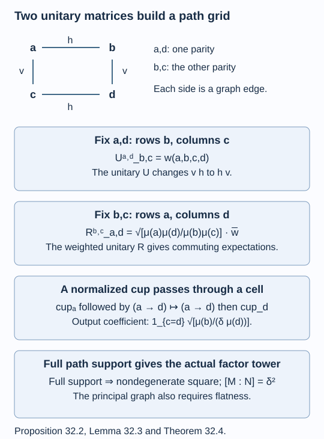

# Two unitary matrices build a path grid

A connection assigns coefficients to elementary squares in a graph. One unitary matrix changes the order of a horizontal and a vertical step. A second, weighted unitary matrix makes the corresponding expectations commute. These two roles are distinct. We give their complete finite algebra construction and then apply the limit theorem of lesson 30.

Our graphs are finite, connected, simple and bipartite. This is the case needed for the Dynkin constructions. We assume the matrix and path calculus of [lessons 8–9](path-models.md), [A finite square produces an inclusion](commuting-square-limits.md), and the primitive-matrix prerequisite declared there. No flat-connection realization theorem is assumed. The primary comparison is [Kawahigashi, Sections 1–2]; conventions below specify every conjugation explicitly.

Construction and proof sources: The path matrix units, weights and local projections are proved in Propositions 9.1–9.2 and Theorem 9.3 and Theorems 9.4–9.5 of [Paths, local projections and a faithful trace](path-models.md). Lemma 32.1 and Proposition 32.2 below construct the coloured-path reorder maps and traced commuting squares; Lemma 32.3 proves cup transport. Theorem 32.4 applies the full-support limit construction of [A finite square produces an inclusion](commuting-square-limits.md), and Proposition 32.5 supplies explicit cells. Kawahigashi, Sections 1–2 remains the comparison, with all four orientations and weighted conjugations specified here.

## A coefficient and its rotation

Let \(\Gamma\) have even and odd vertices and a positive vector \(\mu\) such that

\[
\sum_{b\sim a}\mu(b)=\delta\mu(a),\qquad \delta>1.
\tag{32.1}
\]

Choose an even root \(*\). Use four labelled copies of the vertices, according to the parities of the numbers of vertical and horizontal steps. The copy at coordinate \((i,j)\) contains the vertices of parity \(i+j\); both kinds of edge use \(\Gamma\).

A cell has corners

\[
\begin{matrix}a&\longrightarrow&b\\
\downarrow&&\downarrow\\c&\longrightarrow&d.\end{matrix}
\]

Every side must be an edge of \(\Gamma\). Initially \(a,d\) are even. Assign a number \(w(a,b,c,d)\). The two requirements are that all matrices

\[
U^{a,d}_{b,c}=w(a,b,c,d),\qquad
R^{b,c}_{a,d}
=\sqrt{\frac{\mu(a)\mu(d)}{\mu(b)\mu(c)}}\,
\overline{w(a,b,c,d)}
\tag{32.2}
\]

are unitary. In the first matrix, \(a,d\) are fixed and \(b,c\) run through their common neighbours. In the second, \(b,c\) are fixed and \(a,d\) run through their common neighbours. Empty matrices impose no condition.

Define the cells at the other three coordinate parities by

\[
\begin{aligned}
W_{00}(a,b,c,d)&=w(a,b,c,d),\\
W_{01}(a,b,c,d)&=
\sqrt{\frac{\mu(b)\mu(c)}{\mu(a)\mu(d)}}\,
\overline{w(b,a,d,c)},\\
W_{10}(a,b,c,d)&=
\sqrt{\frac{\mu(b)\mu(c)}{\mu(a)\mu(d)}}\,
\overline{w(c,d,a,b)},\\
W_{11}(a,b,c,d)&=w(d,c,b,a).
\end{aligned}
\tag{32.3}
\]

The subscripts are taken modulo two. At \(01\) and \(10\), \(a,d\) are odd. Each path-order matrix \(W_{ij}^{a,d}\) is unitary: they are respectively \(U,R\), a transpose of an \(R\), and a transpose of a \(U\), with relabelled endpoints. The formulas also give the reversal identities

\[
\begin{aligned}
W_{ij}(a,b,c,d)
&=\sqrt{\frac{\mu(b)\mu(c)}{\mu(a)\mu(d)}}\,
\overline{W_{i,j+1}(b,a,d,c)},\\
W_{ij}(a,b,c,d)
&=\sqrt{\frac{\mu(b)\mu(c)}{\mu(a)\mu(d)}}\,
\overline{W_{i+1,j}(c,d,a,b)}.
\end{aligned}
\tag{32.4}
\]

**Lemma 32.1.** A horizontal step followed by a vertical step can be interchanged with a vertical step followed by a horizontal step, unitarily and with the same endpoints. Reordering any word with \(n\) vertical and \(m\) horizontal steps gives a well-defined unitary between the two block orders.

**Proof.** For fixed endpoints \(a,d\), send the basis path \(a\overset v\longrightarrow c\overset h\longrightarrow d\) to

\[
\sum_bW_{ij}(a,b,c,d)\,
(a\overset h\longrightarrow b\overset v\longrightarrow d).
\tag{32.5}
\]

Unitarity is precisely the first assertion following (32.3). To reorder a word, label the vertical steps in their order and likewise the horizontal steps. Each inverted horizontal–vertical pair must cross exactly once. The allowed crossings form a partially ordered set: a given step encounters the other steps in their preserved order. Any two orders of performing the crossings are connected by interchanging adjacent incomparable crossings. Such crossings act on disjoint adjacent positions in the word, so their matrices commute, including their endpoint labels. Thus the resulting product is independent of the order. Equivalently one can induct on the number of inverted pairs, commuting the two possible first disjoint swaps. No interchange of two steps of the same kind occurs.

Every coefficient of the resulting unitary is a sum of products of cells, one for each filling of the rectangle with the prescribed boundary paths. This follows by matrix multiplication of the elementary swaps. \(\square\)

## Matrix units for coloured paths

For a word \(\omega\) in \(v,h\), let \(\mathcal H_\omega(a)\) have orthonormal basis the paths starting at \(*\), ending at \(a\), and carrying that word. Put

\[
\mathcal A_\omega=\bigoplus_a
\operatorname{End}\mathcal H_\omega(a).
\tag{32.6}
\]

The matrix unit \([p,q]\) is allowed when \(p,q\) have the same endpoint. Its product is \([p,q][r,s]=\mathbf1_{q=r}[p,s]\), and its adjoint is \([q,p]\). If \(|\omega|=r\), define

\[
\tau([p,q])=
\mathbf1_{p=q}\frac{\mu(r(p))}{\delta^r\mu(*)}.
\tag{32.7}
\]

The sum of the diagonal weights is one by (32.1). Thus this is a faithful trace. Appending an edge embeds a matrix unit by

\[
[p,q]\longmapsto\sum_{e:\,s(e)=r(p)}[pe,qe].
\tag{32.8}
\]

The same equation (32.1) makes this embedding trace preserving. Its conditional expectation, on an appended matrix unit, is

\[
E([pe,qf])=
\begin{cases}
\displaystyle\frac{\mu(r(e))}{\delta\mu(s(e))}[p,q],
&e=f,\ r(p)=r(q),\\[4pt]
0,&\text{otherwise}.
\end{cases}
\tag{32.9}
\]

This is the finite multiplicity/trace formula of lesson 8; it also follows immediately by pairing against (32.8).

Write \(A_{n,m}=\mathcal A_{v^nh^m}\). Horizontal embedding appends \(h\). Vertical embedding first appends \(v\), then uses Lemma 32.1 to move that new step to the end of the vertical block. Conjugate the appended algebra by this unitary.

**Proposition 32.2.** These maps define a unital, trace-preserving double grid. Every elementary square commutes. If the starting path multiplicities are positive at every vertex of the relevant parity, that square is also nondegenerate and both inclusions are Markov with modulus \(\delta^{-2}\).

**Proof.** For the grid identity, compare appending \(h,v\) with appending \(v,h\). The extra final interchange acts on the two appended edges and commutes with the original prefix algebra. All remaining interchanges are the same, by Lemma 32.1. Thus both embeddings of the original algebra agree. Conjugations preserve (32.7), since every interchange preserves the final endpoint. This proves the trace assertion.

To check expectations, reorder the common prefix into any fixed word \(\omega\). The square then has the form

\[
\mathcal A_\omega\subseteq\mathcal A_{\omega h},
\qquad
\mathcal A_{\omega v}\subseteq\mathcal A_{\omega hv},
\tag{32.10}
\]

with the other upper embedding changed by the last cell. This reduction is again the grid identity just proved. Let \(p,p'\) be prefix paths ending at \(a,a'\). Test a horizontal matrix unit with appended edges \(a\to b,a'\to b\) against a vertical one with edges \(a\to c,a'\to c\). Distinct prefix row or column labels give zero on both sides of the desired trace pairing. When those labels agree, the pairing in the upper algebra is

\[
\frac1{\delta^{r+2}\mu(*)}
\sum_d\mu(d)\,
W_{ij}(a,b,c,d)\,
\overline{W_{ij}(a',b,c,d)}.
\tag{32.11}
\]

Weighted rotated unitarity makes this zero unless \(a=a'\), and then gives
\(\mu(b)\mu(c)/[\delta^{r+2}\mu(*)\mu(a)]\).
For \(i=j=0\), this is the row orthogonality of \(R\) in (32.2); the other cases follow from (32.3). Formula (32.9) gives exactly the same value for the pairing of their two expectations in \(\mathcal A_\omega\). Since the matrix units span, the trace Hilbert projections onto the two sides have product equal to the projection onto the common prefix. This proves that the square commutes.

For nondegeneracy, put \(h_a=\dim\mathcal H_\omega(a)\), and let \(L\) be the adjacency matrix from this parity to the other. Let \(T=LL^{\mathsf T}\). The two side block-size vectors are \(L^{\mathsf T}h\), and the upper size vector is \(Th\). Assuming every \(h_a>0\), the balanced product space has dimension

\[
\dim\bigl(\mathcal A_{\omega v}
\otimes_{\mathcal A_\omega}\mathcal A_{\omega h}\bigr)
=\sum_a(Th)_a^2
=\dim\mathcal A_{\omega hv}.
\tag{32.12}
\]

To see the first equality explicitly, the multiplicity of the right simple \(M_{h_a}\)-module in the vertical algebra is \(\sum_c l_{ac}(L^{\mathsf T}h)_c=(Th)_a\). The analogous left multiplicity in the horizontal algebra is the same. A right simple row module tensored over \(M_{h_a}\) with its left column module has dimension one. Summing their multiplicity products gives (32.12).

Multiplication from this balanced space into the upper algebra is injective. Give the balanced space its finite induced Hilbert inner product
\(\langle c\otimes b,c'\otimes b'\rangle=\tau(b^*E_{\mathcal A_\omega}(c^*c')b')\).
It is positive definite on the algebraic balanced tensor product: on each \(M_{h_a}\) component, it is the tensor product of two faithful positive inner products on the finite multiplicity spaces, as the row-column description above shows. Commutation of the square makes multiplication an isometry for this inner product, by cycling the trace and taking the expectation of \(c^*c'\). Equality of dimensions now proves surjectivity. Adjoints give both product spans.

Finally the minimal weights of the prefix and appended algebras are \(\delta^{-r}\mu(a)/\mu(*)\) and \(\delta^{-(r+1)}\mu(b)/\mu(*)\). Full support allows all neighbours in the matrix equation; (32.1) gives \(L^{\mathsf T}s=\delta^2t\). The Markov criterion of lesson 8 proves the last assertion. \(\square\)

Without full support, (32.12) sums only over the active prefix blocks; new upper endpoints can make that dimension smaller. The square still commutes, but nondegeneracy must not be inferred.

## A cup passes through a cell

At a vertex \(a\), the normalized backtracking vector is

\[
\operatorname{cup}_a
=\sum_{t\sim a}\sqrt{\frac{\mu(t)}{\delta\mu(a)}}\,
(a\longrightarrow t\longrightarrow a).
\tag{32.13}
\]

Its squared norm is one by (32.1). The path Jones projection is the rank-one projection onto this vector, repeated for each earlier prefix.

**Lemma 32.3.** Reordering a vertical cup and a horizontal edge takes \(\operatorname{cup}_a\) followed by \(a\to d\) to that edge followed by \(\operatorname{cup}_d\). Consequently every vertical path Jones projection commutes with the entire horizontal row, and the horizontal assertion holds with the two directions interchanged.

**Proof.** The coefficient of \(a\overset h\longrightarrow c\overset v\longrightarrow b\overset v\longrightarrow d\), after moving the horizontal edge across the two vertical steps, is

\[
\sum_t\sqrt{\frac{\mu(t)}{\delta\mu(a)}}\,
W_{ij}(a,c,t,b)W_{i+1,j}(t,b,a,d).
\tag{32.14}
\]

Vertical reversal (32.4) rewrites the second cell as
\(\sqrt{\mu(a)\mu(b)/[\mu(t)\mu(d)]}\,
\overline{W_{ij}(a,d,t,b)}\).
The square-root factor in the summand becomes the constant
\(\sqrt{\mu(b)/[\delta\mu(d)]}\).
Row orthogonality of the first cell matrix then makes (32.14) equal to

\[
\mathbf1_{c=d}\sqrt{\frac{\mu(b)}{\delta\mu(d)}}.
\tag{32.15}
\]

This is exactly the output cup. Taking its rank-one projection proves the local slide. Moving through successive horizontal edges proves the assertion for any horizontal word. Earlier vertical prefixes are carried along identically, so the same proof applies to each Jones projection position. In the order \(h^mv^n\), such a projection acts as the identity on the horizontal prefix and as the appropriate cup projection on the vertical suffix. It therefore commutes with the horizontal algebra. Horizontal reversal proves the symmetric statement. \(\square\)

## The actual limit and its tower

Let \(r\) be the greatest distance from the root to a vertex. Choose an even \(m_0\geq r+2\), and put

\[
P_j=A_{0,m_0+j},\qquad Q_j=A_{1,m_0+j}.
\tag{32.16}
\]

Every vertex of the correct parity occurs at these lengths: a shortest root path can be lengthened by repeated backtracking by two. Thus all squares here have full support.

**Theorem 32.4.** The row closures

\[
N=A_{0,\infty}\subseteq M=A_{1,\infty}
\tag{32.17}
\]

are separable hyperfinite II₁ factors, with \([M:N]=\delta^2\). Their entire Jones tower is \(M_k=A_{k+1,\infty}\), with the vertical path Jones projections and the traces (32.7).

**Proof.** Proposition 32.2 gives a nondegenerate commuting square in (32.16), with both moduli \(\delta^{-2}\). Its horizontal rows are path basic constructions from this point onward. Indeed, once both parities have full support, the transposed multiplicity matrix and the cup compression, Markov trace and spanning identities in lessons 8–9 recognize each next level as its basic construction. The same recognition applies to every vertical column starting at \(m_0\). Alternatively, reorder each such column as \(h^{m_0}v^n\); its vertical embeddings are ordinary path appending, by Lemma 32.1.

Lemma 32.3 identifies its Jones projections with the vertically embedded projections from \(A_{k+1,0}\), at every horizontal position. The two directions therefore have exactly the common projections required for iterating the square. Theorem 30.4 gives the index \(\delta^2\); Proposition 30.5 gives factoriality and all actual tower levels, since the horizontal graphs are connected and \(\delta^2>1\). Omitting finitely many horizontal levels does not change any row closure. The finite identifications preserve their traces, projections and embeddings, as asserted. \(\square\)

## An explicit family of biunitary coefficients

The hypotheses above are concrete. Suppose \(1<\delta\leq2\), and choose \(|\zeta|=1\) such that

\[
\delta=-(\zeta^2+\zeta^{-2}).
\]

For any permitted cell, put

\[
w(a,b,c,d)=
\zeta\,\mathbf1_{b=c}
+\zeta^{-1}\mathbf1_{a=d}
\frac{\sqrt{\mu(b)\mu(c)}}{\mu(a)}.
\tag{32.18}
\]

**Proposition 32.5.** These coefficients satisfy both unitarity conditions (32.2), and their four orientations (32.3) are all given by the same formula (32.18).

**Proof.** For \(a\neq d\), the endpoint matrix is \(\zeta I\) on the common neighbours. For \(a=d\), put \(v_b=\sqrt{\mu(b)/\mu(a)}\). Then the matrix is \(\zeta I+\zeta^{-1}vv^*\), with \(v^*v=\delta\). It has eigenvalue \(\zeta\) on \(v^\perp\), and eigenvalue
\(\zeta+\delta\zeta^{-1}=-\zeta^{-3}\) on \(v\). Both have modulus one.

Multiplying the conjugate formula by the weight in (32.2) gives

\[
R^{b,c}_{a,d}
=\zeta\mathbf1_{a=d}
+\zeta^{-1}\mathbf1_{b=c}
\frac{\sqrt{\mu(a)\mu(d)}}{\mu(b)}.
\]

This has exactly the same rank-one form for the opposite parity, and is unitary by the same argument. Substitution in (32.3) gives (32.18) in all orientations. \(\square\)

Biunitarity constructs the inclusion. Recovering \(\Gamma\) as its principal graph also requires **flatness**, proved separately in the next lesson and in any subsequent graph-specific construction.

*Figure 32.1. \(U^{a,d}\) changes the order of two steps; \(R^{b,c}\) has the displayed conjugation and positive weight. Formula (32.11) proves the commuting square, while full path support supplies nondegeneracy. Cup transport (32.14)–(32.15) makes the vertical Jones projections common along the horizontal direction. Theorem 32.4 gives index \(\delta^2\); it does not infer a principal graph before flatness. [Editable figure source](figures/connection-path-grid.py).*

## Exercises

**Exercise 32.1 — introductory.** On \(A_3\) rooted at an endpoint, use weights \((1,\sqrt2,1)\). Give the two matrices in (32.2) for the coefficients (32.18).

**Solution.** Here \(\delta=\sqrt2\). Choose \(\zeta=e^{3\pi i/8}\). The even endpoints \(0,2\) each have the single common neighbour \(1\). For equal endpoints, the scalar is \(\zeta+\sqrt2\zeta^{-1}=-\zeta^{-3}\); for different endpoints it is \(\zeta\). The rotated matrix for \(b=c=1\), on endpoints \(0,2\), is
\(\zeta I_2+\zeta^{-1}J_2/\sqrt2\).
Its eigenvalues are \(\zeta\) and \(-\zeta^{-3}\), both of modulus one.

**Exercise 32.2 — intermediate.** At the root of \(A_3\), compare the dimension of the product span in the initial square with the dimension of its upper algebra.

**Solution.** The prefix algebra at length zero is \(\mathbb C\), and both length-one algebras are \(\mathbb C\). Their balanced product has dimension one. The length-two algebra has one path to each even endpoint, so it is \(\mathbb C^2\), of dimension two. The initial square commutes but is degenerate. At even length two, both even endpoints occur; (32.12) then gives nondegeneracy. A far enough starting square, rather than the length-zero one, is needed in Theorem 32.4.

**Exercise 32.3 — intermediate.** On \(D_4\) rooted at a leaf, normalize the three leaf weights to one and the centre weight to \(\sqrt3\). Calculate the rotated matrix and the index supplied by Theorem 32.4.

**Solution.** Put \(\zeta=e^{5\pi i/12}\). The rotated matrix at the centre is
\(\zeta I_3+\zeta^{-1}J_3/\sqrt3\).
Its eigenvalue on the constant vector is \(-\zeta^{-3}\) and its other two eigenvalues are \(\zeta\). The limit index is \(\delta^2=3\). This verifies the construction data, but establishing its principal graph as \(D_4\) still requires the flatness argument.

**Exercise 32.4 — advanced.** Identify exactly where the conjugation in (32.4) is used in the cup slide.

**Solution.** It turns the product of the two cells in (32.14) into a positive scalar times
\(W_{ij}(a,c,t,b)\overline{W_{ij}(a,d,t,b)}\).
Summing over \(t\) is then the inner product of two rows of one unitary matrix. Without the conjugation it would be a bilinear row pairing, to which unitary orthogonality does not apply. The positive factor cancels the input \(\sqrt{\mu(t)}\), leaving the normalized output cup coefficient.

## References

- Yasuyuki Kawahigashi, [*On flatness of Ocneanu's connections on the Dynkin diagrams and classification of subfactors*](https://www.ms.u-tokyo.ac.jp/~yasuyuki/flat.pdf), Sections 1–2.

*Written by GPT-6.1 Sol (OpenAI), Ultra reasoning effort, September 2026. Self-checked by the writing AI. Public domain (CC0).*
