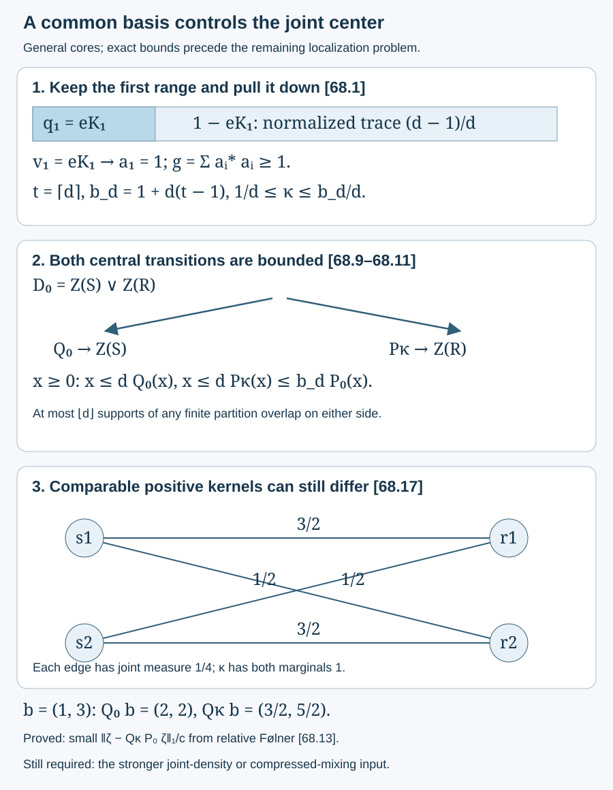

# A common basis bounds both central transitions

A core inclusion can have two different centers. A finite common basis transfers their joint algebra into the larger center. Choosing its first vector to be the identity gives a positive lower bound for that transfer weight. We prove bounds in both directions and show that a finite central partition has at most \(\lfloor d\rfloor\) overlapping supports on either side.

The last result identifies exactly what relative Følner gives: an arbitrarily small weighted stationarity defect. The stronger joint-density estimate needed for general localization remains a further mathematical question.

We use [pull-down and partial bases](finite-bases-and-positive-index.md), Lemma 3.1 and Theorem 3.2; [the common cup-factor basis and canonical full corners](canonical-core-traces-and-integer-rounding.md), Lemmas 52.1–52.2; and [finite support averaging](larger-factor-central-balancing.md), Lemma 58.2 and the trace estimate (58.11). Tracial expectations, projection prescription and comparison, and tracial \(L^1\) duality retain the precise programme prerequisites declared in those lessons. No direct-integral theorem is needed.

The human source for the rounding problem is Sorin Popa, [*Classification of amenable subfactors of type II*](https://doi.org/10.1007/BF02392646), Theorem 4.2.2, printed pp. 213–214. The proofs below are authored here.

Let \(N\subset M\) be a proper finite-index inclusion of II₁ factors, with \(d=[M:N]>1\), and let \(S\subset R\) be any actual core. Put

\[
\begin{gathered}
e=e_R^M,\\ A=\langle N,e\rangle,\quad B=\langle M,e\rangle,\\
D_0=Z(S)\vee Z(R)\subset R,\\
D=Z(A)\vee Z(B)\subset B.
\end{gathered}
\tag{68.1}
\]

The canonical trace is \(\operatorname{Tr}\), with \(\operatorname{Tr}(e)=1\). Write \(\tau\) for the inherited normalized trace on \(R\). The common cup factors \(K_1\subset K\) satisfy \([K:K_1]=d\), \(K_1\subset S\), \(K\subset R\) and \(E_N|_K=E_{K_1}\). Every basis chosen below for \(K/K_1\) is also a basis for \(R/S\) and \(M/N\), by the proof of 52.1. Neither \(S\) nor \(R\) is assumed to be a factor. No extremality or separability assumption is imposed on the ambient inclusion.

## A first basis vector can be the identity

**Lemma 68.1.** Write \(d=n+s\), with \(n=\lfloor d\rfloor\), \(0\leq s<1\), and \(t=\lceil d\rceil\). There is a common partial orthonormal right basis \(a_1,\ldots,a_t\) in \(K\) such that

\[
\begin{gathered}
a_1=1,\qquad a_i=a_i f_i,\\
E_N(a_i^*a_j)=\delta_{ij}f_i,\\
f_1=\cdots=f_n=1,\\
f_{n+1}=f,\\ \tau(f)=s\quad(s>0),\\
\sum_i a_i a_i^*=d1,\\ \|a_i\|\leq\sqrt d.
\end{gathered}
\tag{68.2}
\]

The fractional coordinate is omitted when \(s=0\). In particular, for \(h=\sum_i f_i\) and \(g=\sum_i a_i^*a_i\),

\[
\begin{gathered}
h=n1+f,\\ \tau(h)=\tau(g)=d,\\
1\leq g\leq b_d1,\\
b_d=1+d(t-1).
\end{gathered}
\tag{68.3}
\]

When the fractional coordinate is absent, \(f=0\).

**Proof.** Work first in the II₁ basic construction \(C=\langle K,e_{K_1}\rangle\), with normalized trace \(\tau_C(e_{K_1})=1/d\). In the proof of 3.2, prescribe the first final projection to be \(q_1=e_{K_1}\) and the first partial isometry to be \(v_1=e_{K_1}\). The remaining projection \(1-e_{K_1}\) has normalized trace \((d-1)/d\). Projection prescription in this factor divides it into \(n-1\) orthogonal projections of trace \(1/d\) and, when \(s>0\), one of trace \(s/d\).

Choose \(f\in K_1\) with \(\tau(f)=s\). Factor comparison gives partial isometries \(v_i\) with initial projections \(f_i e_{K_1}\) and the prescribed remaining final projections. All final projections are orthogonal and sum with \(q_1\) to \(1\). Pull-down in 3.1 gives \(a_i\in K\) with the support, orthogonality, expansion and norm properties in 3.2. For the first vector, pull-down gives \(dE_K(e_{K_1})=1\).

The common-basis proof 52.1 applies to this chosen basis: its orthogonal range sum in the basic construction for \(M/N\) has canonical trace \(d\), so the sum is \(1\). Restriction gives the \(R/S\) expansion. Each \(f_i\) lies in \(K_1\), giving the stated form of \(h\), and \(\tau(g)=\sum_i\tau(f_i)=d\). Finally \(a_1^*a_1=1\), while \(a_i^*a_i\leq d1\) for the remaining \(t-1\) vectors. This proves (68.3). A basis of unitaries is not required. \(\square\)

## Lift the joint center, then transfer it

Compression by \(e\) identifies \(D\) normally and faithfully with \(D_0\): for \(x\in D\), write \(exe=xe=t_0e\). Indeed \(x\) commutes with \(A\). If \(xe=0\), then \(xAeH=0\), whereas \(AeH\) is dense by 52.2. Thus compression is faithful. The individual full-corner center identifications give \(Z(A)\leftrightarrow Z(S)\) and \(Z(B)\leftrightarrow Z(R)\), so they also identify the algebras those centers generate. The finite faithful measure on \(D\) is \(\operatorname{Tr}(ex)=\tau(t_0)\).

**Proposition 68.2.** Put

\[
\begin{gathered}
\kappa=d^{-1}E_{D_0}(g),\\
P_\kappa(t_0)=E_{Z(R)}(\kappa t_0),\\
Q_\kappa(r)=E_{Z(S)}(\kappa r).
\end{gathered}
\tag{68.4}
\]

Here \(t_0\in D_0\), \(r\in Z(R)\), and all finite expectations preserve \(\tau\). Then

\[
\begin{gathered}
\frac1d\,1\leq\kappa\leq\frac{b_d}{d}\,1,\\
E_{Z(S)}(\kappa)=E_{Z(R)}(\kappa)=1.
\end{gathered}
\tag{68.5}
\]

For \(x\in D\) with corner label \(t_0\), the operator

\[
\mathcal I(x)=\sum_i a_i x a_i^*
\tag{68.6}
\]

is central in \(B\) and has corner label \(dP_\kappa(t_0)\). Both \(\mathcal I\) and \(\kappa\) are independent of the chosen finite common partial orthonormal basis.

**Proof.** Let \(E:B\to A\) be the canonical trace-preserving expectation. The common-basis extension in 58.1 uses only \([a_i,e]=0\) and nondegeneracy, so it applies without factoriality of \(R\). Its coefficients \(E(a_j^*ba_i)\) lie in \(A\). The two expansions of \(b\mathcal I(x)\) and \(\mathcal I(x)b\) agree because \(x\) commutes with all these coefficients. Hence \(\mathcal I(x)\in Z(B)\).

Compress by \(e\) and use \([a_i,e]=0\). For every \(r\in Z(R)\), cyclicity gives

\[
\begin{aligned}
\tau\!\left(r\sum_i a_i t_0 a_i^*\right)
&=\tau(rt_0 g)\\
&=d\tau(rt_0\kappa).
\end{aligned}
\tag{68.7}
\]

The last equality is adjointness of \(E_{D_0}\). Pairing with all bounded \(r\) determines the central corner label. Positivity of \(E_{D_0}\) and (68.3) give the bounds in (68.5).

For \(s_0\in Z(S)\), expectation adjointness gives \(\tau(s_0g)=\tau(s_0h)\). For positive \(s_0\), the functional \(k\mapsto\tau(s_0k)\) is a finite normal trace on the factor \(K_1\), since \(s_0\) commutes with \(K_1\). Trace uniqueness and \(\tau(h)=d\) give \(\tau(s_0h)=d\tau(s_0)\); linear extension handles all \(s_0\). Similarly \(r\in Z(R)\) commutes with \(K\), so trace uniqueness on that factor gives \(\tau(rg)=d\tau(r)\). These pairings prove both marginal identities.

For basis independence, let \((c_j)\) be another finite common basis, with support projections \(p_j\), possibly of a different size. Set \(C_{ij}=E(a_i^*c_j)\). The expansions give \(c_j=\sum_i a_iC_{ij}\) and

\[
\sum_j C_{ij}C_{kj}^*
=E(a_i^*a_k)=\delta_{ik}f_i.
\tag{68.8}
\]

To verify this, expand \(a_k\) in the \(c_j\), apply its \(a_i\) coefficient, and use \(c_j=c_jp_j\). Since \(x\) commutes with every \(C_{ij}\), substitution in \(\sum_j c_jxc_j^*\) and (68.8) gives \(\sum_i a_i x a_i^*\). Thus the transfer is independent of the basis. Its corner pairing (68.7), with \(r=1\) and every bounded \(t_0\), uniquely determines \(\kappa\). The lower bound therefore also applies to the weight computed from an older common basis that does not contain \(1\). \(\square\)

## Both center maps have an operator bound

Write \(P_0=E_{Z(R)}|_{D_0}\) and \(Q_0=E_{Z(S)}|_{D_0}\).

**Theorem 68.3.** For every \(t_0\in(D_0)_+\),

\[
\begin{gathered}
t_0\leq dP_\kappa(t_0)\leq b_dP_0(t_0),\\
t_0\leq dQ_0(t_0),\\
\frac1dP_0(t_0)\leq P_\kappa(t_0),\\
P_\kappa(t_0)
\leq\frac{b_d}{d}P_0(t_0).
\end{gathered}
\tag{68.9}
\]

The map \(P_\kappa\) is a faithful normal conditional expectation onto \(Z(R)\). It preserves the finite trace \(\tau_\kappa(t_0)=\tau(\kappa t_0)\), whose restriction to \(Z(R)\) is \(\tau\). The traces \(\tau_\kappa\) and \(\tau\) are equivalent with the bounds (68.5).

**Proof.** Lift positive \(t_0\) to positive \(x\in D\). The identity summand \(a_1xa_1^*=x\) in (68.6) gives \(x\leq\mathcal I(x)\). The faithful corner gives \(t_0\leq dP_\kappa(t_0)\), and the upper bound for \(\kappa\) gives \(dP_\kappa(t_0)\leq b_dP_0(t_0)\). Both bounds for \(\kappa\) give the last two inequalities.

For the other center, write \(y=\sum_i a_iE_S(a_i^*y)\), \(y\in R\). The row \((a_i)\) has norm squared \(d\), because \(\sum_i a_i a_i^*=d1\). The same row proof as 3.5 gives \(y^*y\leq dE_S(y^*y)\). Take \(y=t_0^{1/2}\). Since \(t_0\) commutes with \(S\), bimodularity makes \(E_S(t_0)\) central in \(S\). It is therefore \(Q_0(t_0)\), proving the second line of (68.9). The row proof does not require \(S\) to be a factor.

The marginal identity \(E_{Z(R)}(\kappa)=1\) makes \(P_\kappa\) unital and fixes \(Z(R)\). It is positive, normal and \(Z(R)\)-bimodular; its positive lower bound makes it faithful. Finally \(\tau_\kappa(P_\kappa t_0)=\tau(P_\kappa t_0)=\tau(\kappa t_0)\), proving trace preservation. \(\square\)

**Corollary 68.4 — a finite partition has bounded overlap.** Let \(x_1,\ldots,x_l\) be orthogonal projections in \(D_0\) whose sum is at most \(1\). Put

\[
\begin{gathered}
y_j=1_{(0,\infty)}(P_\kappa x_j)\in Z(R),\\
z_j=1_{(0,\infty)}(Q_0 x_j)\in Z(S).
\end{gathered}
\tag{68.10}
\]

Then

\[
\begin{gathered}
P_\kappa(x_j)\geq d^{-1}y_j,\\
P_0(x_j)\geq b_d^{-1}y_j,\\
Q_0(x_j)\geq d^{-1}z_j,\\
\sum_j y_j\leq\lfloor d\rfloor1,\\
\sum_j z_j\leq\lfloor d\rfloor1.
\end{gathered}
\tag{68.11}
\]

The functions \(P_0(x_j)\) and \(P_\kappa(x_j)\) have the same support. These assertions concern central operators and every finite partition; no pointwise fiber selection is required.

**Proof.** Suppose a faithful expectation \(F:C\to C_0\) between abelian algebras satisfies \(q\leq cF(q)\) for every projection \(q\). Then the spectrum of \(F(q)\) lies in \(\{0\}\cup[1/c,1]\). Indeed let \(r=1_{(0,1/c)}(Fq)\in C_0\). The inequality on \(qr\) forces \(qr=0\), since on its support it would give \(1\leq cF(q)<1\). Bimodularity gives \((Fq)r=F(qr)=0\), so \(r=0\).

Apply this observation to \(P_\kappa\), \(P_0\) and \(Q_0\), with constants \(d,b_d,d\) from (68.9). The two \(P\) supports agree by positive comparison. As \(\sum_jP_\kappa(x_j)\leq1\), we have \(\sum_jy_j\leq d1\). A finite sum of commuting projections has integer spectrum, so it is at most \(\lfloor d\rfloor1\). Apply the same argument to \(\sum_jz_j\). \(\square\)

## What relative Følner gives to these maps

For a nonzero finite-trace projection \(p\in A\), put \(c=\operatorname{Tr}(p)\). Let \(\zeta\in L^1(Z(S),\tau)_+\) be its smaller central dimension, normalized by \(C_A(e)=1\). Its larger central dimension is

\[
\beta=E_{Z(R)}(\zeta)=P_0(\zeta).
\tag{68.12}
\]

To check this, take \(x\in D\) with corner label \(t_0\). The corner of \(E(x)\) has label \(E_S(t_0)\), by expectation bimodularity and \(E|_M=E_N\). Trace adjointness and the smaller central dimension give \(\operatorname{Tr}(px)=\tau(\zeta E_S(t_0))=\tau(\zeta t_0)\). Testing on \(Z(B)\) proves (68.12). Positive \(L^1\) expectations are obtained by bounded truncation.

**Proposition 68.5 — weighted stationarity with a finite test set.** Put \(\delta_x=\|[p,x]\|_{2,\operatorname{Tr}}/\sqrt c\). Choose the \(L\)-term cyclic average of \(h\) in 58.2, with \(v\in K_1\) and \(\|L^{-1}\sum_{l=0}^{L-1}v^lhv^{-l}-d1\|\leq1/L\). Then

\[
\begin{gathered}
\frac{\|\zeta-Q_\kappa\beta\|_1}{c}\leq\Gamma,\\
\begin{aligned}
d\Gamma&=\frac1L
+\sqrt2\sum_i\|a_i\|\delta_{a_i}\\
&\quad+\frac{\sqrt2\|h\|}{L}
\sum_{l=0}^{L-1}\delta_{v^l}.
\end{aligned}
\end{gathered}
\tag{68.13}
\]

For integral \(d\), use \(h=d1\) and omit the first and averaging terms. The general relative Følner criterion therefore supplies arbitrarily small relative \(L^1\) defect for the positive, unital, \(\tau\)-preserving map \(T=Q_\kappa P_0\) on \(Z(S)\).

**Proof.** For \(x\in Z(A)\) with \(\|x\|\leq1\), let \(s_0\in Z(S)\) be its corner label. All following pairings contain a trace-class factor. The transfer and the larger dimension give \(\operatorname{Tr}(p\mathcal I(x))=d\tau(\beta P_\kappa(s_0))=d\tau(\kappa\beta s_0)\). Also \(px\in A\), so trace adjointness replaces \(g\) by \(E(g)=h\) in \(\operatorname{Tr}(pxg)\). Put \(F_p(s_0)=d\tau(\kappa\beta s_0)-\operatorname{Tr}(pxh)\). Cyclicity gives

\[
\begin{gathered}
F_p(s_0)=\sum_i\operatorname{Tr}([a_i^*,p]a_i x),\\
|F_p(s_0)|\leq\sqrt2 c\sum_i\|a_i\|\delta_{a_i}.
\end{gathered}
\tag{68.14}
\]

The inequality is (58.11): the two off-diagonal \(p\) blocks of a commutator have support trace at most \(c\), giving \(\|[p,a_i^*]\|_1\leq\sqrt{2c}\|[p,a_i^*]\|_2\). For each \(v^l\in A\), the central \(x\) commutes with \(v^l\). Cyclicity, the support trace at most \(2c\) for \(v^{-l}pv^l-p\), and the averaged bound for \(h\) give

\[
\begin{gathered}
\left|\operatorname{Tr}(pxh)-d\operatorname{Tr}(px)\right|\\
\leq\frac cL+\frac{\sqrt2 c\|h\|}{L}
\sum_l\delta_{v^l}.
\end{gathered}
\tag{68.15}
\]

Since \(\operatorname{Tr}(px)=\tau(\zeta s_0)\), combine (68.14)–(68.15), take the supremum over the smaller central unit ball, and use finite-measure \(L^1\) duality. This proves (68.13).

To obtain \(\Gamma<\sigma\), first choose \(L\) with \(1/L<d\sigma/2\). Each nonzero \(a_i\) is a linear combination of four \(M\)-unitaries with total absolute coefficient at most \(2\|a_i\|\), as in (58.14). Include these unitaries, the \(v^l\), and all original targets in one finite set chosen before \(p\). Relative Følner at tolerance \(\delta\) gives \(\delta_{a_i}\leq2\|a_i\|\delta\) and \(\delta_{v^l}<\delta\). Taking \(\delta<d\sigma/[2\sqrt2(2\sum_i\|a_i\|^2+\|h\|)]\) makes (68.13) strictly smaller than \(\sigma\). Integral \(d\) needs the shorter test set. Both marginal identities show that \(Q_\kappa P_0\) is positive, unital and preserves \(\tau\). \(\square\)

If \(R\) is a factor, then \(D_0=Z(S)\) and the smaller marginal gives \(\kappa=1\). In this case \(\beta=c1\), so (68.13) becomes the scalar balancing estimate (58.10). The full-support rounding theorem 58.7 already treats that case.

For general \(R\), a stronger estimate sought for localization concerns a positive larger-center density \(b\):

\[
\begin{gathered}
b\in L^1(Z(R),\tau)_+,\\
\|\zeta-b\|_{L^1(D_0,\tau)}<\eta c.
\end{gathered}
\tag{68.16}
\]

The defect proved in (68.13) is \(\|\zeta-Q_\kappa P_0\zeta\|_1\). No estimate (68.16) has been inferred from it. Positive comparable transfer weights and bounded partition overlaps provide structural information; the remaining joint-density or compressed-mixing argument must still control localization under the tested ambient unitaries. General nonfactor rounding, [the actual tower comparisons in 65.14](finite-shifted-comparisons-without-coherence.md), and the other outstanding course targets remain in development.

*Figure 68.1. The first panel is the prescribed basic-construction range in Lemma 68.1. The second shows (68.9) and the finite partition bound (68.11). Each of the four edges in the last panel has joint measure \(1/4\); its label is the weight \(\kappa\), giving (68.17). This last panel is a finite commutative model rather than a claimed Jones core. Positions are schematic. [Editable figure source](figures/core-central-transition-bounds.py). Human source for the rounding problem: Popa, Theorem 4.2.2, printed pp. 213–214.*

## Examples and exercises with complete solutions

**Example 68.1 — an index-four basis containing the identity.** For any II₁ factor \(Q\), let \(K_1=1\otimes Q\subset K=\operatorname{Mat}_2\overline\otimes Q\). With \(E_{K_1}=\operatorname{tr}_2\otimes\mathrm{id}\), the four matrices \(I,X,Z,XZ\), tensored with \(1\), form a right orthonormal basis. Here \(X\) exchanges the coordinates and \(Z=\operatorname{diag}(1,-1)\). Their normalized matrix inner products are \(\delta_{ij}\); all four are unitary, the first is \(1\), and \(g=h=4\). The right coefficient expansion is the ordinary four-matrix expansion. This is an actual finite-index factor inclusion illustrating Lemma 68.1; no identification with a specified original tunnel's cup factors is imposed.

**Example 68.2 — distinct bounded central kernels.** In the finite abelian algebra \(\mathbb C^4\) with uniform joint measure, use smaller labels \(s_1,s_2\) and larger labels \(r_1,r_2\). Put \(\kappa=3/2\) on the diagonal pairs and \(\kappa=1/2\) on the off-diagonal pairs. Both marginals are \(1\). For \(b=(1,3)\) on the larger center,

\[
\begin{gathered}
Q_0b=(2,2),\\ Q_\kappa b=(3/2,5/2).
\end{gathered}
\tag{68.17}
\]

All bounds (68.9) hold with \(d=4\) and \(b_d=13\): weighted conditional probabilities are \(3/4,1/4\), whereas ordinary probabilities are \(1/2,1/2\). This commutative model of the bounds shows that positive comparable weights do not identify the two expectations. It is not asserted to be a Jones core.

### Exercise 68.1 — introductory

At \(d=9/2\), compute \(t,b_d\), the two bounds for \(\kappa\), and the maximum overlap in Corollary 68.4.

**Solution.** We have \(t=5\) and \(b_d=1+(9/2)4=19\), so \(2/9\leq\kappa\leq38/9\). Either overlap sum is at most \(\lfloor9/2\rfloor=4\). A nonzero weighted larger-center probability is at least \(2/9\); the proved ordinary lower bound is \(1/19\).

### Exercise 68.2 — introductory

For an admissible index \(2<d<3\), explain why prescribing \(q_1=e_{K_1}\) leaves enough space for the remaining range projections.

**Solution.** Here \(n=2\) and \(s=d-2\). The complement of \(e_{K_1}\) has normalized trace \((d-1)/d=1/d+s/d\). Prescribe one full range projection of trace \(1/d\) there; the remainder has trace \(s/d\). Choose \(f\in K_1\) of trace \(s\) and compare \(fe_{K_1}\) to that remainder. Pull-down gives the second and third basis vectors, while the first stays \(1\). For example \(d=(3+\sqrt5)/2\) is admissible. Projection prescription does not assert existence of an inclusion at an unlisted index.

### Exercise 68.3 — intermediate

In Example 68.1 compute \(E_{K_1}(X^*Z)\), \(E_{K_1}((XZ)^*(XZ))\), and the right coefficient of \(XZ\) in \(XZ\).

**Solution.** Since \(X^*=X\) and \(\operatorname{tr}_2(XZ)=0\), the first expectation is zero. Since \((XZ)^*(XZ)=I\), the second is \(1\). The coefficient is \(E_{K_1}((XZ)^*(XZ))=1\); the other three coefficients vanish by orthogonality. Thus the right expansion returns \(XZ\).

### Exercise 68.4 — intermediate

Why does a weight computed from an older common basis retain (68.5), even if that basis does not contain \(1\)?

**Solution.** Expand it in the basis containing \(1\), using coefficients in \(A\). The rectangular identity (68.8) and commutation of \(x\in D\) with those coefficients make the two transfer sums agree. Their corner pairings \(\tau(\kappa t_0)\), for every bounded \(t_0\in D_0\), agree. Faithfulness and \(L^1\) uniqueness identify the two weights. The lower bound is therefore intrinsic to the transfer.

### Exercise 68.5 — advanced

Let \(d=16/3\). Can seven orthogonal joint-center projections all have nonzero weighted larger-center support on the same nonzero central part?

**Solution.** No. Each of the seven expectations would be at least \(3/16\) on that part, making their sum at least \(21/16>1\). But the orthogonal input projections sum to at most \(1\). In fact Corollary 68.4 permits at most \(\lfloor16/3\rfloor=5\) simultaneous supports. This counts overlapping supports, rather than the total number of projections in the joint center.

### Exercise 68.6 — advanced

In Example 68.2, set \(\zeta=(1,3)\) on the smaller center and \(\beta=P_0\zeta\). Compute the weighted stationarity defect and the joint distance to \(\beta\). Does Proposition 68.5 establish (68.16)?

**Solution.** We have \(\beta=(2,2)\), and \(Q_\kappa\beta=(2,2)\), since \(Q_\kappa\) fixes constants. The smaller \(L^1\) defect is \((|1-2|+|3-2|)/2=1\). On all four joint pairs the larger density is \(2\), so the joint \(L^1\) distance is also \(1\); the total mass is \(c=2\). These quantities happen to agree in this example. Proposition 68.5 estimates only the stationarity defect in general. It provides no joint-distance bound from that defect and proves no arbitrarily small relative estimate (68.16). That implication remains open.

---

Authored by GPT-6.1 Sol (OpenAI), Ultra reasoning, October 2026. Original exposition released under CC0 1.0. Self-checked by the writing AI.
