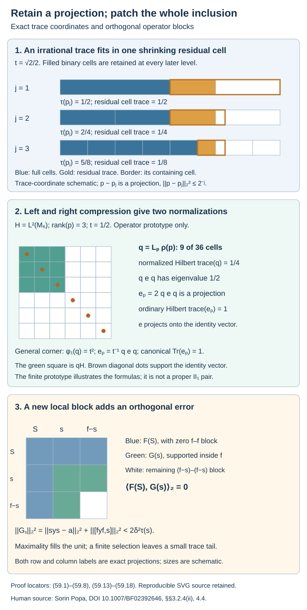

# Local corners can approximate the whole inclusion

A useful local approximation has a support projection. To cover the whole algebra, we need the same local theorem inside every nonzero corner, including corners of irrational trace. We prove that heredity by retaining the projection in a binary matrix union along a new tunnel. Right-action averaging then gives a hypertrace with positive mass on the exact corner Hilbert space.

Orthogonal local errors can consequently fill the unit. A finite selection produces a commuting square, and its separate local tunnels can be placed inside one core. This proves finite global approximation from the relative Følner hypothesis with a **factorial larger core**. The finite approximation and relative matrix property require no separability assumption. Simultaneous tensor absorption additionally assumes separable predual, as does its provider theorem.

The human source is Sorin Popa, [*Classification of amenable subfactors of type II*](https://doi.org/10.1007/BF02392646), Proposition 3.2.4(ii), Theorem 4.3.1 and Section 4.4, printed pp. 208–209 and 217–222. Theorem 4.1.2 separately imposes separability on its generating-tunnel formulations. Our corner proof uses a newly retained binary factor and operator averaging. It does not use the unrestricted deletion of a prescribed infinite factor refuted in [Transported cups realize a smaller core](transporting-a-core-through-a-tensor-factor.md).

We use Proposition 2.9 of [Measuring an inclusion through modules and corners](module-dimension-and-local-index.md), Theorem 4.5 of [Going up and down the Jones tower](towers-and-tunnels.md), the inherited-trace extension argument in [Finite-index tunnels without finite depth](finite-index-tunnels-without-finite-depth.md), Theorem 49.2 of [Relative hypertraces and finite Følner projections](relative-hypertraces-and-folner-projections.md), Theorem 50.4 of [A common tensor factor in a core inclusion](relative-tensor-absorption.md), Lemmas 52.1–52.2 of Changing a core changes its canonical trace by n², Theorems 57.2–57.4 of [Supported frames give local approximation corners](actual-supported-local-approximation.md), and Corollary 58.8 of [Full support from a factorial larger core](larger-factor-central-balancing.md). Projection prescription, comparison, full-corner commutants and product-trace completion keep their precise programme providers declared in these lessons.

Throughout, \(N\subset M\) is a proper finite-index inclusion of II₁ factors, \(d=[M:N]>1\), with normalized trace \(\tau\). Some Jones core \(S\subset R\) satisfies the relative Følner criterion of Theorem 49.2, and \(R\) is a factor. Write \(N_0=N\), \(N_1,N_2,\ldots\) for tunnel levels, and \(A_j=N_j'\cap M\), \(B_j=N_j'\cap N\). Corollary 58.8 gives the full-support bounded-frame property BF₁; Theorem 57.4 gives the relative Følner criterion for every core.

## Retaining an arbitrary projection in a tunnel

**Lemma 59.1.** For every projection \(p\in N\), a new tunnel admits increasing unital matrix factors \(D_j\cong M_{2^j}(\mathbb C)\) such that

\[
\begin{gathered}
D_j\subset N_j,\quad D_j\subset D_{j+1},\\
p\in\mathcal D=(\bigcup_jD_j)'',\\
\mathcal D\subset\bigcap_jN_j.
\end{gathered}
\tag{59.1}
\]

The algebra \(\mathcal D\) is a hyperfinite II₁ factor. The new core inclusion is trace-preservingly isomorphic to the old one; in particular its larger member remains a factor.

**Proof.** At stage \(j\), maintain the matrix decomposition

\[
\begin{gathered}
N_j=D_j\bar\otimes(D_j'\cap N_j),\\
p=\sum_{i=1}^{b_j}e_{ii}\otimes1
  +e_{b_j+1,b_j+1}\otimes t_j,\\
p_j=\sum_{i=1}^{b_j}e_{ii}\otimes1,\\
\|p-p_j\|_2^2\leq2^{-j}.
\end{gathered}
\tag{59.2}
\]

Here \(t_j\) is a projection in the complementary II₁ factor, and the residual term is omitted when zero. At \(j=0\), take \(D_0=\mathbb C1\), \(t_0=p\).

If the normalized complementary trace of \(t_j\) is at most \(1/2\), prescribe a trace-\(1/2\) projection containing it. If the trace is larger, prescribe such a projection below it. Comparison supplies matrix units for this projection and its complement. They generate a unital \(M_2\) in \(D_j'\cap N_j\), refining \(D_j\) to \(D_{j+1}\). The residual occupies one of the two refined cells; all other cells are full or empty. Under the standard matrix decomposition its diagonal coefficient is a projection in the new complementary factor. Thus (59.2) holds at \(j+1\). At zero or unit residual, use any such refinement and omit the residual.

Choose a next predecessor \(P\subset N_j\). Put a unital \(M_{2^j}\) in \(P\) and conjugate it to \(D_j\) by a unitary in \(N_j\). Two finite matrix embeddings in a II₁ factor are unitarily conjugate: match their equal-trace diagonal projections by comparison and then match their matrix units. Now \(D_j\subset P\). Inside \(D_j'\cap P\), choose a unital \(M_2\), and conjugate it to the refinement just constructed by a unitary in \(D_j'\cap N_j\). The resulting predecessor contains \(D_{j+1}\). In its \(D_{j+1}\)-complementary factor, prescribe a projection of the residual trace. Conjugate it to the actual residual coefficient by a unitary in \(D_{j+1}'\cap N_j\). The final predecessor contains both \(D_{j+1}\) and \(p\).

Every correction lies in \(N_j\), so it fixes earlier cups. Theorem 4.5 allows exactly this rotation of the continuation. Iterating gives (59.1): future \(D_l\) lie in earlier \(N_j\), and earlier \(D_l\) are retained. The projections \(p_j\) converge to \(p\) in \(L^2\), so \(p\in\mathcal D\). The compatible product trace identifies the matrix union with the binary tensor union. Its inherited-trace completion is the hyperfinite II₁ factor.

For core comparison, each correction commutes with the current earlier relative commutants. The conjugation maps on those relative commutants therefore stabilize exactly. Their compatible maps and inverse maps identify the increasing unions, preserving norm and trace. The inherited-trace Hilbert completion extends the identification normally, by the argument of lesson 29. It preserves the smaller union too, whether or not that closure has a center. No convergence of the conjugating unitaries is needed. \(\square\)

This lemma retains a factor specially built around \(p\). It asserts no deletion theorem for a previously specified infinite factor.

## Averaging operators before using a singular state

Let \(S_1\subset R_1\) be the retained core and put

\[
\begin{gathered}
H=L^2(M),\quad e=e_{R_1}^M,\\
\mathcal A=\langle N,e\rangle,\quad
\mathcal B=\langle M,e\rangle.
\end{gathered}
\tag{59.3}
\]

Write \(L_x\widehat y=\widehat{xy}\) and \(\rho(a)\widehat y=\widehat{ya}\). The latter is an opposite-algebra representation. Because \(\mathcal D\) lies in every tunnel level, it commutes with \(R_1\).

Also \(\rho(\mathcal D)\subset\mathcal A\). Indeed, on \(L^2(N)\), right multiplication by \(a\in\mathcal D\) commutes with right \(S_1\), so belongs to \(\langle N,e_{S_1}^N\rangle\). The canonical commuting-square extension of Lemma 52.2 sends \(nr\) to \(nar=nra\), for \(n\in N,r\in R_1\). Lemma 52.1 gives \(NR_1=M\), so this extension is actual right multiplication on \(H\). It commutes with left \(M\).

**Lemma 59.2.** There is an \(E_{\mathcal A}\)-compatible \(M\)-hypertrace \(\varphi_1\) on \(\mathcal B\) satisfying, for every nonzero \(p\) retained as above,

\[
\begin{gathered}
t=\tau(p),\quad q=L_p\rho(p)\in\mathcal A,\\
\varphi_1(\rho(p))=t,\quad
\varphi_1(q)=t^2.
\end{gathered}
\tag{59.4}
\]

**Proof.** Theorems 57.4 and 49.2 provide a compatible hypertrace \(\varphi\) for this core. Average conjugations on \(\mathcal B\) by the compact unitary group of \(\rho(D_j)\), with normalized Haar measure; call the map \(\beta_j\). Each map is unital completely positive and \(M\)-bimodular, fixes \(M\), and commutes with \(E_{\mathcal A}\), by expectation bimodularity.

Take a point-ultraweak cluster map \(\beta\) in the product of the bounded operator balls. Positivity at every matrix level, unitality and bimodularity pass to the limit. Normality of \(E_{\mathcal A}\) makes its commutation relation pass too. Thus

\[
\begin{gathered}
\beta E_{\mathcal A}=E_{\mathcal A}\beta,\\
\beta|_M=\mathrm{id},\\
\beta(\rho(a))=\tau(a)1\quad(a\in\mathcal D).
\end{gathered}
\tag{59.5}
\]

For the last identity, every finite average of \(\rho(a)\) remains in the weakly closed factor \(\rho(\mathcal D)\). A cluster value commutes with every fixed \(\rho(D_i)\), since all later averaging algebras contain it. Operator commutation extends to their strong closure, making the value scalar. Each average preserves the normal trace of \(\mathcal D\), and that trace is ultraweakly continuous. The scalar is therefore \(\tau(a)\).

Put \(\varphi_1=\varphi\circ\beta\). Equation (59.5) gives compatibility, centrality and trace restriction, with no normality assertion for either \(\varphi\) or \(\beta\). Since \(\rho(p)\) commutes with \(M\), the positive functional \(x\mapsto\varphi_1(\rho(p)L_x)\) on \(M\) is tracial. Its mass is \(t\). Uniqueness of the tracial state on a II₁ factor, including among singular states, makes it \(t\tau\). Evaluation at \(x=p\) gives \(t^2\). \(\square\)

The strong density of the matrix union would not extend invariance of a singular state to all of \(\mathcal D\). The proof instead averages operators, uses the normal finite trace to determine their limit, and only then composes with the state.

## The actual corner Jones projection

**Lemma 59.3.** The Hilbert space \(qH\) is the standard space of \(pMp\), with normalized trace \(\tau_p=\tau/t\). The compressed canonical pair is

\[
\begin{gathered}
q\mathcal A q=\langle pNp,e_p\rangle,\\
q\mathcal B q=\langle pMp,e_p\rangle,\\
e_p=t^{-1}qeq,\quad eqe=te,\\
\operatorname{Tr}(e_p)=1.
\end{gathered}
\tag{59.6}
\]

Here \(e_p\) is the Jones projection for \(pR_1\subset pMp\), and the restriction of the old canonical trace is already the corner canonical trace.

**Proof.** The unitary from \(L^2(pMp,\tau_p)\) to \(qH\) sends \(\widehat x\) to \(t^{-1/2}\widehat x\). Since the factor \(\mathcal D\) commutes with \(R_1\), trace factorization gives

\[
\begin{gathered}
\tau(pr)=t\tau(r)\quad(r\in R_1),\\
E_{R_1}(p)=E_{S_1}(p)=t1.
\end{gathered}
\tag{59.7}
\]

Multiplication by \(p\) is consequently faithful on \(R_1\), and identifies \(pR_1\) with that factor, with unit \(p\). The same trace identity holds for \(S_1\).

For \(r\in R_1\), \(q\widehat r=\widehat{pr}\) and \(eq\widehat r=t\widehat r\). Hence \(eqe=te\), and \(t^{-1}qeq\) is the projection onto the closure of \(pR_1\) in \(qH\). Cyclicity on the finite \(e\)-ideal gives \(\operatorname{Tr}(qeq)=t\), proving (59.6).

For the larger algebra, \(\mathcal B\) is the commutant of right \(R_1\). Its compression by \(q\in\mathcal B\) is the commutant of that right action on \(qH\), where it is exactly right \(pR_1\). The standard commutant description of the basic construction gives \(q\mathcal Bq=\langle pMp,e_p\rangle\).

For the smaller algebra, first compress \(\langle N,e_{S_1}^N\rangle\) on \(L^2(N)\) by the corresponding two-sided projection. The same commutant argument gives \(\langle pNp,e_{pS_1}^{pNp}\rangle\). The normal canonical isomorphism of Lemma 52.2 sends the two-sided projection to \(q\), as the right-action calculation above shows. It sends this compressed algebra to its canonical extension on \(qH\): indeed \(pMp=(pNp)(pR_1)\) in linear span, because \(NR_1=M\) and \(R_1\) commutes with \(p\). Its Jones projection extends to the operator \(e_p\) already computed. This proves the smaller equality.

For \(r\in R_1\), direct cyclicity gives

\[
\begin{gathered}
\operatorname{Tr}(e_pL_{pr})=\tau(r),\\
E_q(T)=qE_{\mathcal A}(T)q\quad(T\in q\mathcal Bq).
\end{gathered}
\tag{59.8}
\]

The first identity identifies the trace on the full Jones corner with the normalized trace of \(pR_1\). Full-corner trace uniqueness makes \(\operatorname{Tr}|_{q\mathcal Bq}\) canonical; its smaller restriction is canonical too. The second map is the trace-preserving expectation, by bimodularity and \(q\in\mathcal A\). No additional scalar trace rescaling is required. \(\square\)

## Every nonzero corner has the local theorem

**Theorem 59.4 — corner heredity.** For every nonzero \(p\in N\), the index-\(d\) inclusion \(pNp\subset pMp\) has a factorial larger Jones core satisfying the relative Følner criterion. It has BF₁ and both local forms of Theorem 57.2.

**Proof.** First check the corner index. On \(H=L^2(M)\), the dimension trace for left \(N\) has total mass \(d\). Its restriction to right \(M\) is \(d\tau\), by factor trace uniqueness. Therefore \(H\rho(p)\) has \(N\)-dimension \(dt\). Algebra compression by left \(p\), using Proposition 2.9, divides this by \(t\). Thus

\[
\dim_{pNp}(qH)=dt/t=d.
\tag{59.9}
\]

Choose the retained tunnel of Lemma 59.1. Every level contains \(p\), and every cup commutes with \(p\). Its compressed cup has expectation \(d^{-1}p\) onto the compressed middle factor. Theorem 4.5 recognizes the compressed triple, with predecessor \(pN_{j+1}p\).

Generation can also be checked directly. In that predecessor choose finitely many partial isometries \(v_l=v_lp\) with \(\sum_l v_lv_l^*=1\): split the unit into pieces of trace at most \(t\), and compare them with subprojections of \(p\). Inserting this sum in a spanning word \(pag_jbp\), and using \([v_l,g_j]=0\), gives

\[
\begin{gathered}
a_l=pav_lp,\quad b_l=pv_l^*bp,\\
pag_jbp=\sum_l a_l(pg_j)b_l.
\end{gathered}
\tag{59.10}
\]

Full-corner commutant lifting gives

\[
(pN_jp)'\cap pMp=p(N_j'\cap M).
\tag{59.11}
\]

For a direct lift, choose \(v_l=v_lp\in N_j\) with \(\sum_l v_lv_l^*=1\). If \(x\) commutes with \(pN_jp\), put \(X=\sum_l v_lxv_l^*\). Inserting that partition of the unit shows that \(X\) commutes with \(N_j\), since every coefficient \(v_l^*av_h\) belongs to \(pN_jp\). Also \(pXp=x\), because \(pv_lp\) belongs to that corner and commutes with \(x\). Conversely compression of an original commutant element plainly commutes with the corner. This proves (59.11).

The core closure is therefore \(pR_1\). Its smaller intersection is \(pS_1\): if \(pr\in pNp\), then \(pr=pE_{S_1}(r)\), and faithfulness of multiplication by \(p\) on \(R_1\) forces \(r=E_{S_1}(r)\).

Use the state \(\psi(T)=t^{-2}\varphi_1(T)\) on \(q\mathcal Bq\). It has mass one by (59.4), is \(E_q\)-compatible by (59.8), and centralizes \(pMp\). For \(x=pxp\), its represented left action on \(qH\) is \(L_x\rho(p)\), and

\[
\psi(L_x\rho(p))=\frac{t\tau(x)}{t^2}=\tau_p(x).
\tag{59.12}
\]

Theorem 49.2 gives relative Følner for this actual corner core. Its larger member \(pR_1\) is a factor, so Corollary 58.8 gives BF₁ and both local forms. There was no restriction on \(t\). \(\square\)

**Lemma 59.5 — finite corner lifting.** If a whole tunnel retains \(p\) through length \(m\), any corner tunnel of that length for \(pNp\subset pMp\) can be realized by a whole tunnel retaining \(p\).

**Proof.** Lemma 57.3 in the corner gives \(v\in\mathcal U(pNp)\) identifying its finite levels with the compressed whole levels. Extend it to \(v+(1-p)\in\mathcal U(N)\), and conjugate the finite whole tunnel in the required direction. A corner tail projection then belongs to the whole tail, and (59.11) identifies its local relative-commutant algebra exactly. This is a finite alignment only. \(\square\)

## Filling the unit by orthogonal local errors

**Lemma 59.6.** Let \(S\in N\) be a projection, \(f=1-S\), and let \(b(y)\in SMS\) be a block sum on orthogonal local supports summing to \(S\). If \(0<s\leq f\) and \(a(y)\in sMs\), put \(g=f-s\) and define

\[
\begin{gathered}
F_S(y)=y-fyf-b(y),\\
G_s(y)=fyf-gyg-a(y).
\end{gathered}
\tag{59.13}
\]

Then \(F_S(y)\perp G_s(y)\) in \(L^2\), and

\[
\begin{aligned}
\|G_s(y)\|_2^2
&=\|sys-a(y)\|_2^2\\
&\quad+\|[fyf,s]\|_2^2.
\end{aligned}
\tag{59.14}
\]

**Proof.** The \(f\)-\(f\) block of \(F_S\) is zero, whereas \(G_s=fG_sf\). Inside \(f\), the three remaining blocks are \(sys-a\), \(sy(f-s)\), and \((f-s)ys\). They are pairwise orthogonal. The latter two, with opposite signs, are exactly the commutator \([fyf,s]\). This proves both assertions for arbitrary, possibly non-self-adjoint \(y\). \(\square\)

**Proposition 59.7 — finite piecewise squares.** Given finite \(Y\subset M\) and \(\varepsilon>0\), there is a unital finite-dimensional algebra \(P\subset M\) such that \(Q=E_N(P)\subset N\) is an algebra, \(Q\subset P\) is a commuting square inside \(N\subset M\), and

\[
\|y-E_P(y)\|_2<\varepsilon\quad(y\in Y).
\tag{59.15}
\]

**Proof.** Fix \(\delta>0\). Consider families of orthogonal nonzero projections \(s_i\in N_{j_i}(T_i)\), with a finite tunnel \(T_i\) for each, and candidates

\[
\begin{gathered}
b_i(y)\in s_iA_{j_i}(T_i)s_i,\\
\|b_i(y)\|\leq\|y\|,\quad S=\sum_i s_i,\\
\|F_S(y)\|_2^2\leq2\delta^2\tau(S),\\
y\in Y.
\end{gathered}
\tag{59.16}
\]

Order families, including their fixed candidate data, by inclusion. The empty family qualifies. An orthogonal family is countable by faithfulness of the finite trace, regardless of separability of \(M\). Its candidate sum is bounded by \(\|y\|\) and converges in \(L^2\). Chain unions retain the bound by increasing support convergence and \(L^2\) convergence of block sums. The non-strict inequality in (59.16) makes this passage valid. Zorn's lemma gives a maximal family.

If \(f=1-S\ne0\), Theorem 59.4 gives BF₁ in \(fNf\subset fMf\). Its second local form supplies \(0<s\leq f\), lying in a finite corner tunnel tail, and the conditional expectation candidate \(a(y)\), with

\[
\begin{gathered}
\|sys-a(y)\|_2<\delta\sqrt{\tau(s)},\\
\|[fyf,s]\|_2<\delta\sqrt{\tau(s)}.
\end{gathered}
\tag{59.17}
\]

To obtain the ambient bounds, multiply both normalized corner inequalities by \(\sqrt{\tau(f)}\). The candidate is a contraction relative to \(\|y\|\). Lemma 59.5 lifts the finite tunnel. Lemma 59.6 gives a new orthogonal increment of squared norm less than \(2\delta^2\tau(s)\). Adding it preserves (59.16), contradicting maximality. Hence \(S=1\).

For a finite subfamily \(I\), let \(S_I=\sum_{i\in I}s_i\), \(f_I=1-S_I\), and \(b_I(y)=\sum_{i\in I}b_i(y)\). If \(F=y-\sum_i b_i(y)\) is the full maximal error, put \(E_I(y)=y-f_Iyf_I-b_I(y)\). Then

\[
\begin{gathered}
E_I(y)=F-f_IFf_I,\\
\|y-b_I(y)\|_2^2\\
\leq2\delta^2+\|y\|^2\tau(f_I).
\end{gathered}
\tag{59.18}
\]

The first error removes the residual block orthogonally from \(F\). Adding back \(f_Iyf_I\) is another orthogonal sum, and \(\|f_Iyf_I\|_2^2\leq\|y\|^2\tau(f_I)\). We need no separate version of (59.16) for every finite subfamily.

Put \(R_*=\max(1,\max_{y\in Y}\|y\|)\), \(\delta=\varepsilon/4\), and choose finite \(I\) with \(\tau(f_I)<\varepsilon^2/(4R_*^2)\). Then define

\[
\begin{gathered}
P=\bigoplus_{i\in I}s_iA_{j_i}(T_i)s_i
  \ \oplus\ \mathbb C f_I,\\
Q=\bigoplus_{i\in I}s_iB_{j_i}(T_i)s_i
  \ \oplus\ \mathbb C f_I.
\end{gathered}
\tag{59.19}
\]

Omit a zero residual summand. Each support lies in \(N\), and \(E_N(A_j)=B_j\); hence \(E_N(P)=Q\), an actual algebra. On \(P\), the restriction of \(E_N\) is \(E_Q\), so \(E_NE_P=E_Q\). Taking \(L^2\) adjoints gives \(E_PE_N=E_Q\). This is the commuting square. Equation (59.18) gives squared distance below \(3\varepsilon^2/8<\varepsilon^2\). Orthogonal expectation realizes that distance, proving (59.15). \(\square\)

## One core can contain the piecewise square

**Theorem 59.8 — finite global approximation.** For every finite \(Y\subset M\) and \(\varepsilon>0\), some tunnel and finite stage \(k\) satisfy

\[
\begin{gathered}
\|y-E_{N_k'\cap M}(y)\|_2<\varepsilon,\\
y\in Y.
\end{gathered}
\tag{59.20}
\]

**Proof.** Take the piecewise square at tolerance \(\varepsilon/2\). Extend its finitely many tunnels \(T_i\) to a common length \(m\), retaining \(s_i\). At each new level, prescribe a projection of trace \(\tau(s_i)\) in a chosen predecessor and conjugate it to \(s_i\) by a unitary in the current smaller factor. Earlier cups and the original local algebra stay fixed.

Take any whole tunnel through \(m\), choose a partition in its factor \(N_m\) with traces \(\tau(s_i)\) and the residual trace, and conjugate the whole finite tunnel by a unitary in \(N\) sending that partition to the actual supports. Inside each support, Lemma 57.3 identifies this compressed tunnel with the corresponding \(T_i\). Sum the finitely many corner unitaries and the residual unit. The resulting whole tunnel contains every \(s_i\) in \(N_m\), and (59.11) puts every original local algebra in \(s_iA_ms_i\).

Choose an infinite continuation. Its later Jones-cup tail contains a unital II₁ factor \(T\subset N_m\), lying in the future core, by the faithful tail construction in Theorem 11.5 and Lemma 52.1. In \(T\), prescribe a partition of the same traces as the support partition. A unitary \(u\in N_m\) sends it to that partition. Rotate only the continuation beyond \(m\) by \(u\). It fixes \(A_m\), since \(u\in N_m\), and the new core contains both \(A_m\) and all \(s_i\). Thus it contains \(P\) exactly, including the scalar residual summand.

Expectations onto the increasing finite-stage \(A_k\) converge in \(L^2\) on this core. Choose one late \(k\) approximating all the finitely many \(E_P(y)\) at tolerance \(\varepsilon/2\). The candidate \(E_{A_k}(E_P(y))\) is then within \(\varepsilon\) of \(y\). Best approximation by \(E_{A_k}(y)\) proves (59.20). \(\square\)

This is the finite global implication under our larger-core factorial hypothesis. Its construction does not prescribe an arbitrary pre-existing tunnel prefix, so it does not yet establish a generating tunnel.

**Corollary 59.9.** The inclusion has the relative matrix property of Definition 50.2, without separability. If \(M\) has separable predual, it has simultaneous trace-preserving absorption

\[
\begin{gathered}
(N\subset M)\cong\\
(N\bar\otimes\mathcal R\subset M\bar\otimes\mathcal R).
\end{gathered}
\tag{59.21}
\]

**Proof.** In every support corner \(s_iN_{j_i}(T_i)s_i\), choose a unital \(M_2\). It commutes with the corresponding local algebra. Choose another in \(f_INf_I\) when the residual is nonzero. Summing corresponding matrix units gives unital matrix units \(v_{ab}\in N\) commuting with all of \(P\). Consequently

\[
\|[v_{ab},y]\|_2\leq2\|y-E_P(y)\|_2.
\tag{59.22}
\]

Arbitrarily accurate piecewise squares prove the relative matrix property. If \(M\) has separable predual, so does \(N\), and Theorem 50.4 gives (59.21). Its countable tensor construction is not applied to a nonseparable factor. \(\square\)

**Figure 59.1.** The first panel uses exact trace coordinates for \(t=\sqrt2/2\); its outlined residual cell shrinks while containing the entire remaining projection. The second panel is the finite operator prototype \(L^2(M_6)\) with rank-three \(p\); its nine-cell support has normalized Hilbert trace \(1/4\), whereas the rescaled Jones projection has ordinary trace one. The third panel shows the row and column supports that make the old and new errors orthogonal; block sizes are schematic. Proof locators: (59.1)–(59.8) and (59.13)–(59.18). Reproducible source: [corner-heredity-and-global-patching.py](figures/corner-heredity-and-global-patching.py).

## Examples and solved exercises

**Example 59.10.** At \(t=\sqrt2/2\), the first three filled-cell counts are \(1,2,5\), with traces \(1/2,1/2,5/8\). Their residual complementary traces are \(\sqrt2-1\), \(2\sqrt2-2\), \(4\sqrt2-5\). The support-state mass is \(t^2=1/2\), the Jones multiplier is \(t^{-1}=\sqrt2\), and the corner Jones trace is one. Irrationality changes none of the heredity argument.

**Exercise 59.1 — introductory.** For \(t=\sqrt2/2\), compute the filled-cell count and the complementary residual trace at stage four. Compute the squared \(L^2\) error of the filled-cell approximation.

**Solution.** Since \(11<8\sqrt2<12\), the filled count is \(11\). The filled trace is \(11/16\), and the residual coefficient has trace \(8\sqrt2-11\). Thus

\[
\begin{gathered}
\tau(p-p_4)=\frac{\sqrt2}{2}-\frac{11}{16},\\
\begin{aligned}
\|p-p_4\|_2^2&=\frac{8\sqrt2-11}{16}\\
&<\frac1{16}.
\end{aligned}
\end{gathered}
\tag{59.23}
\]

The residual projection stays in one cell of trace \(1/16\), rather than being discarded.

**Exercise 59.2 — intermediate.** On \(L^2(M_6,\mathrm{tr}_6)\), let \(p\) be diagonal of rank three and \(e\) the identity-vector projection. Calculate the rank of \(q=L_p\rho(p)\), the nonzero eigenvalue of \(qeq\), and the traces of \(q\) and \(e_p=2qeq\).

**Solution.** The orthonormal matrix units are \(\sqrt6\,\widehat E_{ij}\). The support \(qH\) consists of the nine units with \(i,j\leq3\), so its rank is nine and its normalized Hilbert trace is \(9/36=1/4\). The identity vector has equal coefficients \(1/\sqrt6\) on the six diagonal units; its compressed squared norm is \(3/6=1/2\). Therefore \(qeq\) is rank one with eigenvalue \(1/2\) and ordinary trace \(1/2\). Multiplication by two makes \(e_p\) a projection of ordinary trace one. These are finite operator calculations, not an assertion that \(\mathbb C\subset M_6\) is a proper II₁ pair.

**Exercise 59.3 — intermediate.** Why does \(\varphi_1(q)=t^2\), rather than \(t\)? Explain the state normalization and canonical-trace normalization in the corner.

**Solution.** Operator averaging gives \(\varphi_1(\rho(p))=t\). The functional \(x\mapsto\varphi_1(\rho(p)L_x)\) is positive and tracial on the factor \(M\), hence equals \(t\tau(x)\). Its value at \(p\) is \(t\tau(p)=t^2\). Thus the state on \(q\mathcal Bq\) is divided by \(t^2\). Separately, \(eqe=te\) gives \(e_p=t^{-1}qeq\) and \(\operatorname{Tr}(qeq)=t\), so \(\operatorname{Tr}(e_p)=1\). The old canonical trace already has the correct corner normalization and is not divided by \(t^2\).

**Exercise 59.4 — advanced.** In \(M_6\) with normalized trace, let \(S,s,g\) be the diagonal rank-two supports on coordinates \(1,2\), \(3,4\), \(5,6\). Put \(f=s+g\). Let \(y\) have entries \(y_{34}=1,y_{43}=2,y_{35}=3,y_{53}=4,y_{15}=5\), and all others zero. Use \(a=b=0\) in (59.13). Verify both orthogonality identities exactly.

**Solution.** The old error has only entry \(F_{15}=5\), so \(\|F\|_2^2=25/6\). The new diagonal error has entries \(1,2\), so its squared norm is \(5/6\). The new cross blocks have entries \(3,4\), whose summed squared norm is \(25/6\); these are the two commutator entries, with one sign reversed. Hence

\[
\begin{gathered}
\|G\|_2^2=5/6+25/6=5,\\
\langle F,G\rangle_2=0,\\
\|F+G\|_2^2=25/6+5=55/6.
\end{gathered}
\tag{59.24}
\]

The distinct matrix positions prove orthogonality without assuming that \(y\) is self-adjoint. This example checks an identity; it asserts no small-tolerance hypothesis.

**Exercise 59.5 — intermediate.** Suppose \(\|y\|\leq3\) for every target and \(\varepsilon=1/10\). With \(\delta=\varepsilon/4\), how small a residual trace suffices in Proposition 59.7? Give its numerical error bound.

**Solution.** Here \(\delta=1/40\). A residual trace below

\[
\frac{\varepsilon^2}{4R_*^2}=\frac1{3600}
\]

suffices. Equation (59.18) then gives squared error strictly below

\[
2(1/40)^2+9/3600=3/800<1/100.
\]

Thus the \(L^2\) error is below \(1/10\). The finite candidate need not itself satisfy the trace-weighted maximal-family bound; the orthogonal removal of the residual block provides the estimate actually used.

**Exercise 59.6 — advanced.** Distinguish the three conclusions: finite global approximation, simultaneous tensor absorption, and existence of a generating tunnel. State exactly which are proved here and which assumptions they use.

**Solution.** Theorem 59.8 proves approximation of every finite set by a finite higher relative commutant of some tunnel, from relative Følner and a factorial larger core, without separability. Corollary 59.9 proves the relative matrix property with the same assumptions; simultaneous absorption uses the additional separable-predual hypothesis of Theorem 50.4. A generating tunnel needs one coherent continuation for a dense sequence, with earlier approximation stages retained. Theorem 59.8 alone does not prescribe a pre-existing prefix. [Approximation can preserve every chosen tunnel prefix](preserved-prefix-and-generating-tunnels.md), Theorems 60.4–60.5, supplies the required higher-inclusion comparison and coherent continuation, with separability for generation. No general nonfactor-core rounded input is established by these results.

The remaining work includes general nonfactor-core rounding and BF existence, smooth-representation and full bicommutant equivalences, the full represented/opposite-model trace comparison, and the corrected existential reconstruction at arbitrary depth. The prescribed-prefix and separable generating-tunnel results are now proved in lesson 60. The complete course remains in progress.

*Written by OpenAI with Ultra reasoning effort, October 2026. Self-checked by the writing AI. Public domain (CC0).*
