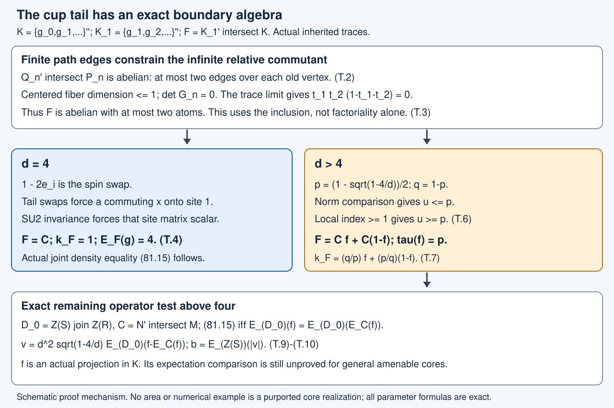

# Cup-tail commutants and the remaining central comparison

The actual Jones cup-tail inclusion has a boundary algebra that can be computed exactly. At index four its relative commutant is scalar. At every index strictly above four it has two atoms, with precisely determined inherited traces and reversed canonical commutant weights. This closes the central-density comparison at four and reduces the general case above four to one expectation identity for an actual projection.

We use the complete path and Markov arguments in [Paths, local projections and a faithful trace](path-models.md), [The trace and the tail of a path](path-trace-factoriality.md), and [Removing a projection produces a subfactor](tail-inclusions.md),9.5–9.6 and11.1–11.5; the actual infinite-depth construction in [A weighted-spin tunnel and its two traces](weighted-spin-tunnel.md),47.1–47.4; and the common cup-factor and basis identifications in [A common tensor factor in a core inclusion](relative-tensor-absorption.md),50.5, [Transported cups realize a smaller core](transporting-a-core-through-a-tensor-factor.md),51.2, and [Changing a core changes its canonical trace by n²](canonical-core-traces-and-integer-rounding.md),52.1. The exact trace reflection and basis density are [Canonical rescaling of Jones cups](canonical-rescaling-of-jones-cups.md),63.1–63.3. The local-index formula is [Measuring an inclusion through modules and corners](module-dimension-and-local-index.md),2.4. The expectation step uses [Relative norm averaging and central densities](relative-norm-averaging-and-central-density.md),81.2, through the complete proof of [Finite cup densities and a positive central cost](finite-cup-densities-and-positive-cost.md),82.5. Their stated programme prerequisites remain in force.

Human-source context is Masamichi Takesaki, *Theory of Operator Algebras III*, ChapterXIX §3, Theorem3.16 and Remark3.17, printed pp.463–464. The finite covariance limit, critical spin proof and two-atom comparison are proved in full below. The even-cup maximal-abelian assertion discussed in that source is not used; its precise counterexample remains in [Commuting projections need not be maximal abelian](commuting-projection-laboratory.md). This computation does not supply the unrestricted generating-tunnel or common-support approximation results.

## Actual inputs and the expectation already available

Let \(N\subset M\) be the assigned proper finite-index II₁ inclusion, with any actual Jones tunnel and core \(S\subset R\). In the notation51.1,52.1,

\[
\begin{gathered}
d=[M:N],\quad
K=\{g_0,g_1,\ldots\}'',\quad
K_1=\{g_1,g_2,\ldots\}'',\\
F=K_1'\cap K,\quad
C=N'\cap M,\quad
C_0=S'\cap R,\quad D_0=Z(S)\vee Z(R),\\
g=\sum_i a_i^*a_i\in K,\qquad
\tau(g)=d .
\end{gathered}
\tag{T.1}
\]

The common finite basis \(a_i\in K\) is the actual basis of52.1 or68.1. By50.5 and51.2, its cup sequence is normally trace-isomorphic, generator by generator, to the faithful path Markov model. Theorem11.5 proves \([K:K_1]=d\) without computing its relative commutant.

The exact proposed expectation route is already established in the current course: Theorem82.5, with its complete proof, says
\(E_Y(g)=E_Y(E_F^K(g))\) for every \(Y\subset K_1'\cap M\). The joint physical center \(D_0\), \(C\) and \(C_0\) are such algebras. Its proof uses the admitted norm averaging81.2 inside \(K_1\subset K\). We do not reprove that norm theorem.

Put \(k_F=d^{-1}E_F^K(g)\). The finite basis trace computation63.11–63.13, equivalently82.1, identifies \(k_F\) with the positive invertible central density of the normalized commutant trace \(\rho_F\):
\(\rho_F(x)=\tau(k_Fx)\) for \(x\in F\), and \(\tau(k_F)=1\).
Thus the remaining new question is the actual algebra \(F\) and this particular density, rather than existence of the relative expectation.

Lesson25 identifies the finite-graph path invariant using finite-depth trace reflection. That proof does not include \(A_\infty\) at four or above four, and cannot be used to assert scalar \(F\) there. Below we work directly in the faithful Markov completion.

## At most two atoms: the finite edge calculation and its limit

Write the abstract Markov generators as \(e_i\), and set
\[
P=\{e_1,e_2,\ldots\}'',\quad
Q=\{e_2,e_3,\ldots\}'',\quad
P_n=C^*(1,e_1,\ldots,e_{n-1}),\quad
Q_n=C^*(1,e_2,\ldots,e_{n-1}).
\]
Empty lists mean scalars. Under the actual identification \(P=K,Q=K_1\).

**Finite calculation.** For \(n\ge2\), the inclusion \(Q_n\subset P_n\) is multiplicity free, with at most two outgoing edges over each block of \(Q_n\). Indeed reflection of the generator list \(e_i\mapsto e_{n-i}\) defines a trace-preserving *-automorphism of \(P_n\). The right-end and left-end Markov word recursions11.1–11.3 give equality of every reflected polynomial's trace, including its squared norm. Faithfulness makes their kernels agree, so reflection is well defined; reflecting twice is its inverse. It carries the initial path inclusion \(P_{n-1}\subset P_n\) to \(Q_n\subset P_n\). Formula9.5 gives an edge exactly when the two path endpoints are neighbors, each with multiplicity one. A line vertex has at most two neighbors.

It follows, block by block, that
\[
\begin{gathered}
D_n:=Q_n'\cap P_n\text{ is abelian},\\
D_n=\bigoplus_{v\in Z(Q_n)}
       \mathbb C^{\,r_v},\qquad r_v\le2,\\
E_{Q_n}|_{D_n}:D_n\longrightarrow Z(Q_n)
 \text{ is a faithful scalar state on each }v\text{-fiber}.
\end{gathered}
\tag{T.2}
\]
The notation for the finite sum means the minimal central projections of \(Q_n\). The trace weights on every retained edge are strictly positive by9.6. Centering by this fiber state leaves a real vector space of dimension at most one in each fiber.

**The limiting relative commutant is abelian.** If \(x\in Q'\cap P\), the finite expectation \(x_n=E_{P_n}(x)\) commutes with \(Q_n\) by bimodularity, so \(x_n\in D_n\). The expectations are norm bounded and converge in \(L^2\). For \(x,y\in Q'\cap P\), the commuting pairs \(x_n,y_n\in D_n\) therefore converge in their bounded products to \(x,y\) in \(L^2\). Thus \([x,y]=0\).

**It cannot have three nonzero orthogonal projections.** Suppose \(f_1,f_2,f_3\in Q'\cap P\) are nonzero orthogonal projections; they need not exhaust the unit. Put \(t_i=\tau(f_i)>0\) for \(i=1,2\), so \(t_1+t_2<1\). Since \(Q\) is a factor, \(E_Q(f_i)=t_i1\). Let
\(a_{i,n}=E_{P_n}(f_i)\) and \(b_{i,n}=a_{i,n}-t_i1\).
They are selfadjoint elements of \(D_n\), bounded uniformly, and
\(E_{Q_n}(b_{i,n})=0\); nested expectations give this last equality exactly.

The fiber Gram entries
\(G_{ij,n}=E_{Q_n}(b_{i,n}b_{j,n})\) lie in \(Z(Q_n)\).
Their two centered vectors live in a real space of dimension at most one by(T.2), so their determinant vanishes in every fiber:
\[
\begin{gathered}
G_{11,n}G_{22,n}-G_{12,n}^2=0,\\
G_{ij,n}\longrightarrow
 (\delta_{ij}t_i-t_it_j)1
 \quad\text{in }L^1,\\
0=t_1(1-t_1)t_2(1-t_2)-t_1^2t_2^2
 =t_1t_2(1-t_1-t_2)>0 .
\end{gathered}
\tag{T.3}
\]
For the convergence, \(a_{i,n}\to f_i\) in \(L^2\) with uniform operator bounds, so their products converge in \(L^1\). Conditional \(L^1\) contraction and
\(E_{Q_n}((f_i-t_i)(f_j-t_j))
=(\delta_{ij}t_i-t_it_j)1\)
give the second line. The entries \(G_{ij,n}\) are uniformly bounded, so products also converge in \(L^1\); their varying finite centers cause no problem. This proves the last line and contradiction.

An abelian von Neumann algebra with at most two nonzero orthogonal projections is either \(\mathbb C\) or \(\mathbb C^2\). A diffuse part or a third atom would give three such projections. Hence \(F\) has at most two atoms. The argument is an actual inclusion calculation and does not infer irreducibility from factoriality.

## The critical endpoint \(d=4\)

At \(\delta=2\), realize the generators in the infinite tensor product of \(M_2\)'s with its faithful normalized product trace, using the antisymmetric projection \(S\) of Lesson5 on each adjacent pair. Let \(\mathcal R_{\mathrm{spin}}\) be the tracial von Neumann completion of this full tensor algebra. By5.1 and the Markov recursion, the cup algebra generated there is trace-isomorphic to \(P\), and its shifted tail is \(Q\). Equality of squared polynomial traces and the GNS unitary justify the normal faithful identification, as in11.2. No claim about the even-cup algebra being maximal abelian is used.

For \(i\ge2\), \(1-2e_i\in Q\) is the ordinary swap of spin sites \(i,i+1\). These unitaries implement all finite permutations of sites \(2,3,\ldots\). We first show
\(Q'\cap\mathcal R_{\mathrm{spin}}=M_2^{(1)}\), the first-site matrix algebra.

If \(x\) commutes with \(Q\), approximate it in \(L^2\) by
\(a=E_{M_2^{\otimes m}}(x)\), with error below \(\varepsilon\).
Swap sites \(2,\ldots,m\) with \(m+1,\ldots,2m-1\), leaving site1 fixed; this is implemented by a unitary in \(Q\). Its conjugate \(a'\) also has distance below \(\varepsilon\) from \(x\). Put \(c=E_{M_2^{(1)}}(a)\). Product trace independence of the two remaining disjoint blocks, checked on first-site matrix coefficients, gives
\(\langle a-c,a'-c\rangle_2=0\) and equal squared norms of these two differences. Hence
\[
2\|a-c\|_2^2=\|a-a'\|_2^2<4\varepsilon^2.
\]
Thus \(x\) has distance below \((1+\sqrt2)\varepsilon\) from the first-site algebra. Its finite-dimensional \(L^2\) closure is itself, proving the claimed equality.

For every \(U\in SU(2)\), simultaneous conjugation by \(U\) on all spin sites defines a normal trace-preserving automorphism of \(\mathcal R_{\mathrm{spin}}\). The antisymmetric two-spin vector is fixed, so this automorphism fixes every \(e_i\), hence fixes \(P\) pointwise. An element of \(P\cap M_2^{(1)}\) must therefore commute with every defining \(SU(2)\) matrix. Diagonal \(SU(2)\) matrices make it diagonal, and an off-diagonal \(SU(2)\) matrix makes its two diagonal entries equal. It is scalar. We have proved
\[
F=\mathbb C,\qquad k_F=1,\qquad E_F(g)=4\,1
\quad(d=4).
\tag{T.4}
\]

Applying the already proved82.5 with \(Y=D_0,C,C_0\) gives
\(E_{D_0}(g)=E_C(g)=E_{C_0}(g)=4\,1\).
In particular(81.15) holds for every actual index-four core, with no depth or ambient separability assumption. The ambient canonical density is also1, so extremality follows; it was not an input to the proof. The positive central cost82.11 is zero. This does not by itself complete every remaining rounding, common-support BF, full-partition or generating-tunnel obligation.

## Above four: exact atom weights and canonical density

Fix \(d>4\), and define
\[
p=\frac{1-\sqrt{1-4/d}}2,\qquad q=1-p.
\tag{T.5}
\]
Then \(0<p<1/2<q<1\), \(p+q=1\), \(pq=1/d\).
The actual weighted-spin tunnel47.1–47.4 with these parameters is an II₁ inclusion of index \(d\), for which
\(C=\mathbb CP_0\oplus\mathbb CP_1\),
\(\tau(P_0)=p,\tau(P_1)=q\), and the normalized commutant weights are \(q,p\).
Thus its ambient density is
\(k_C=(q/p)P_0+(p/q)P_1\).

This is an actual generating infinite-depth Jones tunnel, not an abstract numerical model. Its cup factor \(P\) and tail \(Q\) have the same faithful Markov trace as any actual pair \(K,K_1\) at this \(d\), by50.5/51.2. Therefore their abstract relative commutant and canonical density are those we seek.

Choose the common basis in this cup pair, and use it in the weighted-spin ambient inclusion, as justified by52.1. The transfer computation63.13 identifies
\(d^{-1}E_C(g)=k_C\).
The already proved82.5 gives
\(E_C(k_F)=k_C\).
Since \(k_C\ne1\), \(F\) cannot be scalar. The preceding two-atom result makes \(F=\mathbb C^2\).

**Its two commutant weights reverse the inherited weights.** Let \(Q^{(2)}=\{e_3,e_4,\ldots\}''\). Theorem11.5 identifies \(Q^{(2)}\subset Q\subset P\) as the actual tracial basic-construction triple. Shift \(s:P\to Q\), \(s(e_i)=e_{i+1}\), is a normal trace-preserving isomorphism of the pair \(Q\subset P\) onto \(Q^{(2)}\subset Q\). Finite basic-construction reflection63.1 is an anti-isomorphism
\(\eta:(Q^{(2)})'\cap Q\to Q'\cap P=F\).
Consequently \(\alpha=\eta s|_F\) permutes the two atoms of \(F\). Its trace satisfies
\(\tau_P(\alpha(x))=\rho_F(x)\):
the reflected inherited upper trace is the lower normalized commutant trace63.2, and the shifted pair preserves that canonical trace. This uses only one finite basic construction and pair isomorphism, never an infinite tower trace identification.

If \(\alpha\) fixed both atoms, the two traces would agree and \(k_F=1\), contradicting \(E_C(k_F)=k_C\ne1\). Hence \(\alpha\) swaps them. Write their inherited weights as \(u,1-u\), with \(u\le1/2\). Their commutant weights are \(1-u,u\), so the larger eigenvalue of \(k_F\) is \((1-u)/u\). In particular \(u<1/2\).

**The actual weighted inclusion and the local index fix \(u\).** Norm contraction of \(E_C\) and the local formula2.4 give
\[
\begin{gathered}
\frac qp=\|k_C\|\le\|k_F\|=\frac{1-u}{u}
 \quad\Longrightarrow\quad u\le p,\\
d=\frac{\delta_1}{u}+\frac{\delta_2}{1-u}
 \ge\frac1u+\frac1{1-u}
 =\frac1{u(1-u)}
 \quad\Longrightarrow\quad u\ge p .
\end{gathered}
\tag{T.6}
\]
Here \(\delta_i\) is the index of the local factor inclusion under the \(i\)-th atom; each is at least1. The last implication uses the strict increase of \(x(1-x)\) on \((0,1/2]\), and \(p(1-p)=1/d\). Therefore \(u=p\), and equality also forces \(\delta_1=\delta_2=1\).

We have established, for every actual cup pair at this \(d\), a unique smaller-trace atom \(f\in F\) satisfying
\[
\begin{gathered}
F=\mathbb Cf\oplus\mathbb C(1-f),\qquad
\tau(f)=p,\quad\tau(1-f)=q,\\
\rho_F(f)=q,\quad\rho_F(1-f)=p,\\
k_F=\frac qp f+\frac pq(1-f),\qquad
E_F(g)=d k_F .
\end{gathered}
\tag{T.7}
\]
The local corner indices are1. Thus the density is nonconstant for every \(d>4\). Any proposed shortcut \(E_F(g)=d1\) above four is false for the actual cup-tail model, independently of the assigned ambient inclusion.

**The weighted-spin realization identifies the atom physically.** In that realization(T.7) and \(E_C(k_F)=k_C\) imply \(E_C(f)=P_0\): subtract the common smaller eigenvalue \(p/q\) and divide by the positive eigenvalue gap. Since \(\tau(f)=\tau(P_0)=p\),
\[
\|f-P_0\|_2^2
=2p-2\tau(fP_0)
=2p-2\tau(E_C(f)P_0)=0.
\]
Therefore \(f=P_0\) as actual operators. In fact the cup algebra equals the entire balanced-word factor there when \(p\ne q\). The shifted atoms give every site-diagonal projection; cutting the adjacent cup47.11 by the \(01\) and \(10\) diagonals gives the balanced exchange matrix unit, with nonzero coefficient \(\sqrt{pq}\). Finite adjacent exchanges connect all binary words of the same charge. Multiplying by their full word-diagonal projections produces every matrix unit of \(C_n\). Thus all \(C_n\) lie in the cup algebra, proving equality of the closures. This confirms the realization at the operator level. The four endpoint remains the different scalar-commutant case(T.4).

## The remaining central comparison is one actual projection

Return to the assigned actual inclusion and any actual core. The atom \(f\) in(T.7) is transported through the verified normal generator-preserving Markov identification; it is a projection of the actual \(K\subset R\), rather than a numerical weight or a projection asserted to lie in the ambient relative commutant.

By82.5,
\[
\begin{gathered}
E_{D_0}(g)=dE_{D_0}(k_F),\\
E_C(g)=dE_C(k_F),\\
k_0=E_{C_0}(k_F),\qquad k=E_C(k_F).
\end{gathered}
\tag{T.8}
\]
For \(d>4\) the positive gap
\(q/p-p/q=(q-p)/(pq)=d\sqrt{1-4/d}\)
is nonzero. Hence(81.15) is equivalent to the exact actual operator comparison
\[
\begin{gathered}
E_{D_0}(f)=E_{D_0}(E_C(f)),\\
v=E_{D_0}(g-E_C(g))\\
=d^2\sqrt{1-4/d}\,
 E_{D_0}(f-E_C(f)).
\end{gathered}
\tag{T.9}
\]
Correspondingly the positive central cost of82.11 is exactly
\[
b=d^2\sqrt{1-4/d}\,
 E_{Z(S)}\!\left(
  \left|E_{D_0}(f-E_C(f))\right|
 \right).
\tag{T.10}
\]

The smaller-center and larger-center marginals68.5 give
\(E_{Z(S)}(f)=E_{Z(R)}(f)=p1\).
The primed smaller-center marginal proved in81.4 also gives
\(E_{Z(S)}(E_C(f))=p1\).
These are exact marginal identities; they do not prove the joint comparison(T.9). No primed larger-center marginal is silently added.

In the weighted-spin generating example, \(f=P_0\in C\) and \(D_0=\mathbb C\), so(T.9) holds and \(b=0\). Its nonconstant cup density is therefore not a counterexample to joint localization. In a general assigned core, \(f\in C\) has not been established by this argument. Membership in \(C\), or the displayed joint expectation identity without membership, would settle the density route. Membership in \(C_0\) alone does not supply that expectation identity. Establishing the identity from general relative amenability remains the exact outstanding operator obligation. No appeal to factoriality, a fine central mesh, or the finite atom count establishes that comparison.

*FigureT1.* The finite path rank calculation, critical spin proof and actual weighted-spin comparison compute the canonical tail algebra and density. The bottom equality retains the unproved general comparison of the joint centers. Shapes and areas are schematic; all parameters, coefficients and proof locators(T.2)–(T.10) are exact. Human-source context: TakesakiIII, ChapterXIX §3, pp.463–464. [Editable figure source](figures/cup-tail-density-v3.py).

## Exercises with complete solutions

### Exercise T1 — the first continuous example

At \(d=9/2\), compute the two atom traces, the canonical density and the coefficient multiplying the projection discrepancy in(T.9). Check both trace normalizations.

**Solution.** Equation(T.5) gives \(p=1/3\), \(q=2/3\). Thus \(k_F=2f+\tfrac12(1-f)\), and \(\tau(k_F)=2/3+(1/2)(2/3)=1\). The canonical weights are \(\rho_F(f)=2/3\) and \(\rho_F(1-f)=1/3\), whose sum is1. The unnormalized expectation is \(E_F(g)=9f+\tfrac94(1-f)\), with trace \(3+(9/4)(2/3)=9/2\). Finally \(d^2\sqrt{1-4/d}=(81/4)(1/3)=27/4\). The precise discrepancy is therefore \((27/4)E_{D_0}(f-E_C(f))\), not the nonconstant density by itself.

### Exercise T2 — the tail-swap estimate

In the index-four proof, explain why \(Q'\cap\mathcal R_{\mathrm{spin}}\) is the first-site matrix algebra. If \(\|x-a\|_2<\varepsilon\), justify the exact constant \(1+\sqrt2\) in the approximation by that algebra.

**Solution.** The first-site algebra commutes with all tail cups. Conversely, a tail permutation unitary sends the sites2 through \(m\) of \(a\) to a disjoint block, leaving site1 fixed. Since \(x\) commutes with that unitary, its conjugate \(a'\) still satisfies \(\|x-a'\|_2<\varepsilon\). Both expectations onto the first-site algebra are \(c\). Product trace independence gives \(\langle a-c,a'-c\rangle_2=0\), and the permutation gives equal norms of the two terms. Hence \(2\|a-c\|_2^2=\|a-a'\|_2^2<4\varepsilon^2\), so \(\|x-c\|_2<\varepsilon+\sqrt2\varepsilon\). Letting \(\varepsilon\) tend to zero puts \(x\) in the finite-dimensional closed first-site algebra. Its intersection with the cup algebra is then scalar by simultaneous \(SU(2)\) invariance.

### Exercise T3 — recognizing the atom as an operator

In the weighted-spin realization, suppose \(E_C(f)=P_0\), where \(f\) and \(P_0\) are projections of trace \(p\). Prove that \(f=P_0\), without assuming they commute. Explain why this conclusion is not obtained in a general core from(T.9) alone.

**Solution.** Trace adjointness gives \(\tau(fP_0)=\tau(E_C(f)P_0)=p\). Cyclicity gives the same value for \(\tau(P_0f)\). Thus \(\|f-P_0\|_2^2=\tau(f)+\tau(P_0)-\tau(fP_0)-\tau(P_0f)=0\). Faithfulness yields equality of the operators, without a commutation hypothesis. The weighted model obtains the projection-valued expectation from its exact two-eigenvalue density identity. Equation(T.9) in a general core only compares expectations onto the joint centers; it does not assert that \(E_C(f)\) is a projection or that \(f\) belongs to \(C\).

## Scope and the remaining original work

This computation applies to every actual proper cup-tail inclusion at four and above four, without depth, extremality or ambient representation-cardinality restrictions. The below-four finite-graph route remains separate. At four the density input81.15 is proved. Above four the unrestricted expectation identity(T.9) remains assigned; general relative amenability has not supplied it. Full common-support BF, unrestricted finite whole-tunnel partitions, common-stage and prefix alignment, unrestricted generation, finite pair/cup matching, represented/opposite canonical models and every other original residual remain assigned.

Authored by GPT-6.1 Sol (OpenAI), Ultra reasoning, October2026. Original exposition CC0-1.0. The complete course remains in development.
