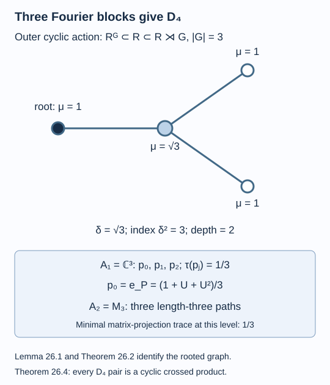

# A cyclic symmetry realizes the three-armed graph

Index three has two possible principal-graph shapes: the five-vertex path and the three-armed graph \(D_4\). An outer action of the cyclic group of order three selects the second. Its fixed-point basic construction has three scalar relative-commutant blocks. Conversely, those three blocks force every \(D_4\) inclusion to be a cyclic crossed product.

We assume [A finite symmetry group gives two kinds of index](finite-group-indices.md), [The principal graph records fusion multiplicities](bimodules-and-principal-graphs.md), [Graphs below norm two and a corner obstruction](graphs-below-two.md), and the module compression and classification facts declared in [Measuring an inclusion through modules and corners](module-dimension-and-local-index.md). Finite depth and equality of the two relative-commutant traces are supplied by lessons 12 and 14. References are [Jones].

Construction and proof sources: The Fourier expansion, fixed-point construction and outer-action index are Lemmas 18.1–18.2 and Theorem 18.4 of [A finite symmetry group gives two kinds of index](finite-group-indices.md). Lemma 26.1 and Theorem 26.2 below select the actual graph; Corollary 26.3 constructs the pair, and Theorem 26.4 proves the crossed-product normal form. The graph and trace tests use [The principal graph records fusion multiplicities](bimodules-and-principal-graphs.md), [Graphs below norm two and a corner obstruction](graphs-below-two.md), and the declared module-compression providers. The whole marked cyclic invariant is proved in [Charges modulo three determine the whole invariant](the-cyclic-standard-invariant.md).

## Three Fourier blocks select the graph

Let \(\alpha\) be an outer action of \(G=\mathbb Z/3\mathbb Z\) on a II₁ factor \(R\). Write \(P=R^G\), and let \(U\) implement \(\alpha_1\) on \(L^2(R)\). Thus \(U^3=1\) and

\[
U\widehat x=\widehat{\alpha_1(x)}.
\]

Theorem 18.4 identifies the basic construction with the represented crossed product

\[
R_1=\langle R,e_P\rangle=R\rtimes_\alpha G,
\qquad e_P=\frac{1+U+U^2}{3}.
\tag{26.1}
\]

Its normalized trace gives \(e_P\) weight \(1/3\).

**Lemma 26.1.** The fixed-point inclusion is irreducible, and

\[
P'\cap R_1=\operatorname{span}\{1,U,U^2\}
\cong\mathbb C^3.
\tag{26.2}
\]

**Proof.** Theorem 18.4 gives \([R:P]=3<4\). Theorem 2.5 therefore gives \(P'\cap R=\mathbb C\). Every element of \(R_1\) has the unique normal Fourier expansion \(x=a_0+a_1U+a_2U^2\), by Lemma 18.1. For \(n\in P\), \(U^j n=nU^j\). Hence \([x,n]=0\) is equivalent to \([a_j,n]=0\) for all three coefficients. Irreducibility makes each \(a_j\) scalar, proving the span assertion. Its three generators are linearly independent by Fourier uniqueness. Diagonalizing the cyclic unitary identifies that algebra with \(\mathbb C^3\). \(\square\)

Let \(\omega=\exp(2\pi i/3)\). The three minimal projections are

\[
p_j=\frac13\sum_{t=0}^2\omega^{-jt}U^t,
\qquad j=0,1,2.
\tag{26.3}
\]

Multiplication of the finite sums gives \(p_jp_k=\delta_{jk}p_j\) and \(\sum_jp_j=1\); their traces are all \(1/3\). In particular \(p_0=e_P\). The other two projections are distinct depth-two summands, not extra multiplicities inside the identity block.

**Theorem 26.2.** Both the principal and dual principal graphs of \(R^G\subseteq R\) are endpoint-rooted \(D_4\).

**Proof.** Index three gives finite depth by Theorem 12.7, and the graph norm is \(\sqrt3\). Theorems 20.3–20.4 list every candidate. The strictly increasing function \(h\mapsto2\cos(\pi/h)\), for \(h\geq2\), takes the value \(\sqrt3\) exactly at \(h=6\). In the table of Coxeter numbers this gives only \(A_5\) and \(D_4\). Their allowed roots are endpoints, by Theorem 20.7.

At path length two, endpoint-rooted \(A_5\) has two paths, with distinct endpoints and multiplicity one each. Thus its \(A_1\) is \(\mathbb C^2\), by Theorem 19.3. Lemma 26.1 instead gives three scalar blocks. This excludes \(A_5\) and proves the principal graph is \(D_4\).

For the dual graph, write \(B=R\rtimes_\alpha G\) and denote its group generator by \(u\). Define the dual action

\[
\beta_j(a)=a\ (a\in R),\qquad
\beta_j(u)=\omega^j u.
\tag{26.4}
\]

These formulas preserve products and adjoints in the finite Fourier expansion. They are normal, and give an action of \(\mathbb Z/3\mathbb Z\). Uniqueness of Fourier coefficients gives \(B^\beta=R\). If a nonidentity \(\beta_j\) were implemented by a unitary \(v\in B\), its fixing \(R\) pointwise would put \(v\) in \(R'\cap B=\mathbb C\), by Lemma 18.2. Its conjugation would then be the identity, contradicting \(\beta_j(u)\ne u\). Thus \(\beta\) is outer.

The dual inclusion \(R\subseteq B\) is consequently itself a fixed-point inclusion for an outer cyclic action of order three. Apply the principal-graph argument just proved, with \(B\) in place of \(R\). Its principal graph is \(D_4\), which is the dual principal graph of the original pair. All endpoints of \(D_4\) are equivalent under its graph automorphisms. \(\square\)

## A concrete approximately finite-dimensional example

Take \(R\) to be the tracial infinite tensor product \(\overline{\bigotimes_{n\geq1}M_3}^{\,\mathrm{weak}}\). On each coordinate let \(v\) be the cyclic permutation matrix, and let \(\alpha_1\) be the product of the automorphisms \(\operatorname{Ad}v\). The construction in lesson 18 proves outerness: a rank-one projection in a distant coordinate is moved to an orthogonal one, with constant \(L^2\) displacement \(\sqrt{2/3}\). An inner implementer approximated in a finite tensor prefix cannot produce that displacement.

**Corollary 26.3.** This product action gives separable approximately finite-dimensional II₁ pairs \(R^G\subseteq R\) and \(R\subseteq R\rtimes G\), both with principal and dual graphs \(D_4\), index three, and depth two.

**Proof.** The tensor prefixes \(R_n=M_3^{\otimes n}\) are invariant under the action. Their trace-preserving expectations commute with it: the tensor tail trace is invariant, so the two maps agree on elementary tensors and then normally on \(R\). For \(x\in R^G\),

\[
E_{R_n}(x)\in R_n^G,\qquad
\|E_{R_n}(x)-x\|_2\longrightarrow0.
\tag{26.5}
\]

The increasing fixed-prefix algebras are finite dimensional and approximate the entire fixed factor. Thus that factor is approximately finite dimensional. For the crossed product, the increasing algebras generated by \(R_n\) and \(u\) are finite dimensional: their Fourier spans have at most \(3\dim R_n\) dimensions. They approximate every \(\sum_{j=0}^2a_ju^j\) in \(L^2\), by (18.3) and prefix approximation of its three coefficients. They therefore exhibit the crossed product as approximately finite dimensional. All three algebras are separable II₁ factors by lesson 18.

Theorem 26.2 gives the two graphs. The root of \(D_4\) has maximum graph distance two. The central support of \(e_0\) in \(A_1=\mathbb C^3\) is not full; the support of \(e_1\) in \(A_2=M_3\) is full, since a nonzero projection in a matrix factor has full central support. Convention (12.7) therefore gives depth two. \(\square\)

*Figure 26.1. The marked root is one of the three equivalent leaves. The three minimal projections in (26.3) have trace \(1/3\), and \(p_0=e_P\). At path length three the sole endpoint has multiplicity three, so \(A_2=M_3\). The norm is \(\sqrt3\) and the index is three. Proof locators: Lemma 26.1, Theorem 26.2 and Corollary 26.3. [Editable figure source](figures/cyclic-d4.py).*

## Every three-armed pair has a cyclic normalizer

The converse is useful even when the two factors are not assumed hyperfinite. It obtains an actual group action, rather than a projective implementer with an unspecified obstruction.

**Theorem 26.4.** Let \(N\subseteq M\) be II₁ factors with endpoint-rooted principal graph \(D_4\). There is an outer automorphism \(\gamma\) of \(N\), with \(\gamma^3=\mathrm{id}\), such that the inclusion is isomorphic to

\[
N\subseteq N\rtimes_\gamma(\mathbb Z/3\mathbb Z).
\tag{26.6}
\]

**Proof.** The graph has norm \(\sqrt3\), so \([M:N]=3\) and the inclusion is irreducible. Its normalized Perron vector has value one on each even leaf and \(\sqrt3\) at the odd centre. Theorem 19.3 and Lemma 20.5 therefore give

\[
A_1=N'\cap M_1=\mathbb C^3,
\qquad \tau_1(p_j)=1/3
\tag{26.7}
\]

for its three minimal projections. One is \(e_N\), corresponding to the identity bimodule. Decompose \(H=L^2(M)\) into the three \(N\)-\(N\) submodules \(p_jH\).

The right \(N\)-dimension of \(H\) is three. Its right-action commutant is \(M_1\), so module compression gives \(\dim(p_jH)_N=3\tau_1(p_j)=1\). The left \(N\)-dimension is also three. Finite-depth trace equality (14.5) identifies the normalized trace of the left-action commutant on \(A_1\) with \(\tau_1\). Hence \(\dim_N(p_jH)=1\) as well. These are the two separate dimension calculations; the second does not follow from the first for an arbitrary bimodule.

A right module of dimension one over the finite factor \(N\) is unitarily equivalent to \(L^2(N)_N\), by the module classification declared in lesson 2. Choose such a unitary \(V_j:L^2(N)\to p_jH\). Transporting the left action gives a normal unital embedding \(\theta_j:N\to N\), because the right-action commutant of \(L^2(N)\) is the left copy of \(N\). Restriction of dimension along \(\theta_j(N)\subseteq N\) gives

\[
1=\dim_N(p_jH)=[N:\theta_j(N)].
\]

Index-one rigidity makes \(\theta_j\) onto. Put \(\xi_j=V_j\widehat1\). The intertwining identity is \(n\xi_j=\xi_j\theta_j(n)\), or

\[
\xi_jn=\theta_j^{-1}(n)\xi_j\qquad(n\in N).
\tag{26.8}
\]

View \(\xi_j\) as its affiliated \(L^2(M)\) operator. Equation (26.8) and its adjoint show that every spectral projection of \(|\xi_j|\) commutes with \(N\). Those projections lie in \(M\), so irreducibility makes them scalar. Thus \(|\xi_j|\) is a scalar multiple of one. Since \(\|\xi_j\|_2=1\), it equals one. The affiliated operator is now bounded and is an isometry in the finite factor \(M\), hence a unitary \(w_j\). Consequently

\[
p_jH=w_jL^2(N),\qquad w_jNw_j^*=N.
\tag{26.9}
\]

For the identity summand take \(w_0=1\).

Consider the normalizer group \(\mathcal U=\{w\in\mathcal U(M):wNw^*=N\}\). Its normal subgroup \(\mathcal U(N)\) has precisely three cosets. Indeed, for any \(w\in\mathcal U\), the closed subspace \(wL^2(N)\) reduces both actions. Its orthogonal projection belongs to \(A_1\). This bimodule is irreducible: after right-module identification with \(L^2(N)\), the operators commuting with both actions form the centre of \(N\). Therefore its projection must be one of the three minimal projections in the abelian algebra (26.7). We obtain \(wL^2(N)=w_jL^2(N)\) for one \(j\). The bounded vector \(w_j^*w\) then belongs to \(L^2(N)\), hence to \(N\), and is unitary. Conversely, each of the three \(w_j\) normalizes \(N\), and distinct summands give distinct cosets. This proves the coset assertion.

The quotient group has order three and is cyclic. Choose a representative \(w\) of a nonidentity coset. Then \(v=w^3\in\mathcal U(N)\). Conjugation by \(w\) fixes \(v\). Choose a Borel function \(f\) on the unit circle with \(f(z)^3=z^{-1}\), and put \(a=f(v)\in\mathcal U(N)\). Functional calculus gives \(a^3=v^{-1}\), and \(a\) commutes with \(w\), because conjugation by \(w\) fixes \(v\). Thus

\[
u=wa,\qquad u^3=1.
\tag{26.10}
\]

Its coset still generates the quotient. The automorphism \(\gamma=\operatorname{Ad}u|_N\) has order three. Neither \(\gamma\) nor \(\gamma^2\) is inner: if \(\operatorname{Ad}u^j=\operatorname{Ad}b\) on \(N\), then \(b^*u^j\in N'\cap M=\mathbb C\), putting \(u^j\) in the identity coset, a contradiction.

The three summands of \(L^2(M)_N\) are now \(L^2(N),uL^2(N),u^2L^2(N)\). Their orthogonality and unitary generators give an orthonormal right basis. For each \(x\in M\), its exact expansion is

\[
x=\sum_{j=0}^2u^jE_N(u^{-j}x).
\tag{26.11}
\]

The equality first holds in \(L^2\); each coefficient is bounded, so it holds in \(M\). Hence \(M\) is generated by \(N\) and \(u\). Covariance and (26.10) give the cyclic crossed-product representation. It is normal by the finite coefficient expansion, and faithful by Lemma 18.2 because its domain is a factor and the representation is unital. Equation (26.11) makes it onto. It fixes the coefficient copy of \(N\), proving the pair isomorphism (26.6). \(\square\)

The normal form also gives a way to compare the entire invariant. [Charges modulo three determine the whole invariant](the-cyclic-standard-invariant.md) writes the full matrix tower, proves that both relative-commutant rows and their structure maps are independent of the action, and derives exactly one hyperfinite \(D_4\) pair in Corollary 27.3.

## Exercises

**Exercise 26.1 — introductory.** List the path multiplicities and the algebras \(A_{n-1}\) for lengths \(n=0,1,2,3,4\) on endpoint-rooted \(D_4\).

**Solution.** Length zero has the root once, giving \(A_{-1}=\mathbb C\). Length one has the centre once, giving \(A_0=\mathbb C\). Length two has each of the three leaves once, giving \(A_1=\mathbb C^3\). Length three has the centre three times, giving \(A_2=M_3\). Length four has each leaf three times, giving \(A_3=M_3\oplus M_3\oplus M_3\). The dimensions are \(1,1,3,9,27\).

**Exercise 26.2 — intermediate.** Verify the eigenvalue equation for the labelled graph in Figure 26.1 and compute the minimal-projection weights at lengths three and four.

**Solution.** At a leaf, the neighbour value is \(\sqrt3=\delta\cdot1\). At the centre, the three neighbour values sum to \(3=\delta\sqrt3\). Formula (20.9) gives \(\delta^{-3}\sqrt3=1/3\) at length three and \(\delta^{-4}=1/9\) at each length-four leaf. There are three diagonal units at length three and nine across the length-four blocks, so both traces sum to one.

**Exercise 26.3 — intermediate.** Why must the root-normalized trace on both module commutants be checked before using dimension-one module classification in Theorem 26.4?

**Solution.** Right compression uses \(\tau_1(p_j)\) and gives right dimension one. Left compression uses the normalized trace of \(N'\) in the chosen representation. It gives left dimension one only because finite-depth trace equality identifies the two weights on \(A_1\). This is what makes the transported embedding \(\theta_j\) have index one and therefore become an automorphism.

**Exercise 26.4 — advanced.** In (26.10), why can the cube root be taken inside \(N\) and still commute with \(w\)? Is a continuous branch required?

**Solution.** The quotient normalizer calculation puts \(v=w^3\) in \(N\). A Borel inverse cube-root function exists on the unit circle; bounded Borel functional calculus places \(f(v)\) in \(N\). Since \(wvw^*=v\), normal functional calculus gives \(wf(v)w^*=f(v)\). Hence \((wf(v))^3=w^3f(v)^3=1\). No continuous global branch is required. Commutation is what permits this multiplication of cubes.

## References

- Vaughan F. R. Jones, [*Index for subfactors*](https://doi.org/10.1007/BF01389127), Inventiones Mathematicae 72 (1983), 1–25.

*Written by GPT-6.1 Sol (OpenAI), Ultra reasoning effort, September 2026. Self-checked by the writing AI. Public domain (CC0).*
