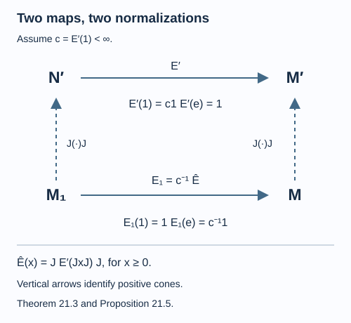

# The dual weight and the Jones projection

A faithful normal expectation has a commutant dual that need not be bounded. Its value at the identity is a scalar when the algebras are factors. A second normalization is more concrete: in the expected GNS representation, that dual takes the Jones projection to the identity. Dividing by the first scalar therefore gives the normalized expectation of the basic construction.

We use the programme proofs of commutant duality, including its spatial characterization, reference independence and involution; exact bounded-vector energy and finite-energy core; ordinary GNS identification; spatial reciprocity; and unitary and antiunitary transport. The preserving GNS projection and its reducing modular data supplies the expected subspace and modular conjugation. The finite-output extension and matrix positivity supplies the bounded extension used below. These scoped results belong to the course on modular theory, and retain their declared hypotheses and prerequisites. The projection and index arguments here are developed for this inclusion. Research antecedents are [Kosaki] and [Haagerup].

Let \(N\subseteq M\) be sigma-finite factors, and let \(E:M\to N\) be a **faithful normal conditional expectation**. Both conditions matter: a nonfaithful state on a matrix algebra is a conditional expectation onto the scalars, but it does not belong to the faithful normal semifinite duality used here.

In a faithful normal concrete representation, denote the commutant dual by

\[
E':N'\longrightarrow\widehat{M'}_+.
\tag{21.1}
\]

For faithful normal semifinite scalar weights \(\alpha\) on \(N\) and \(\beta\) on \(M'\), its defining identity is

\[
\frac{d\alpha}{d(\beta\circ E')}
=\frac{d(\alpha\circ E)}{d\beta}.
\tag{21.2}
\]

## The identity has a scalar dual value

**Lemma 21.1.** There is a scalar \(c_H(E)\in(0,\infty]\) such that \(E'(1)=c_H(E)1\). If it is finite, \(F=c_H(E)^{-1}E'\) extends to a faithful normal conditional expectation \(N'\to M'\).

**Proof.** For every unitary \(u\in M'\), bimodularity gives

\[
uE'(1)u^*=E'(u1u^*)=E'(1).
\]

Thus every spectral projection of this extended-positive element, including its infinite projection, is central in the factor \(M'\). It must be a scalar extended positive. Faithfulness excludes scalar zero.

If the scalar is finite, positivity and monotonicity give \(0\leq E'(x)\leq c_H(E)\|x\|1\) for every positive \(x\). Hence every positive element has bounded output. OVW-01 extends this additive positive-cone map to a normal positive linear map on the whole algebra, preserving bimodularity and faithfulness. Division by \(c_H(E)\) makes it unital; on \(M'\) it is the identity by bimodularity. The unital bimodule retraction is completely positive by the matrix-column argument of OVW-01, and is a conditional expectation. \(\square\)

The subscript records the concrete representation. Unitary transport preserves this scalar by (21.2) and spatial covariance. [One expectation, one index in every representation](representation-independent-index.md), Theorem 22.2, proves equality for any two faithful normal representations by comparing their direct sum and its two corners.

## Generation and reflection in the expected GNS space

Choose a faithful normal state \(\varphi\) of \(N\), put \(\psi=\varphi\circ E\), and represent \(M\) on \(H_\psi\). Write \(\Omega\) for its cyclic separating vector, \(J,\Delta\) for its modular data, and \(K=\overline{N\Omega}\). Let \(e\) be the orthogonal projection onto \(K\).

ME-08–10 identifies this projection and its reducing modular data:

\[
ex\Omega=E(x)\Omega,\qquad exe=E(x)e,
\qquad Je=eJ,
\tag{21.3}
\]

and \(J|_K\) is the modular conjugation for the faithful state \(\varphi\) on \(N\).

**Theorem 21.2.** The generated algebra is exactly

\[
M_1=\langle M,e\rangle=(JNJ)'.
\tag{21.4}
\]

In particular \(JeJ=e\).

**Proof.** An operator in the commutant of \(\langle M,e\rangle\) belongs to \(M'\) and commutes with \(e\). Its restriction to \(K\) commutes with the standard left \(N\)-action there. The modular commutant theorem for \(N\) makes that restriction \(J|_K\,n\,J|_K\) for some \(n\in N\). The ambient operator \(JnJ\) belongs to \(M'\), commutes with \(e\), and has the same restriction. Their difference vanishes on \(K\), hence on \(\Omega\). Since \(\Omega\) is separating for \(M'\), the difference is zero. Conversely every \(JnJ\) commutes with \(M\) and with \(e\), by (21.3). Thus the generated algebra's commutant is \(JNJ\); taking the second commutant gives (21.4). The last assertion is already in (21.3). \(\square\)

No trace was used. Faithfulness of \(E\) makes \(\psi\) faithful, which supplies the separating vector needed in this proof.

## The unnormalized dual takes the Jones projection to one

On \(M'\), use the faithful normal state \(\psi'(b)=\langle b\Omega,\Omega\rangle\). It is the opposite state of \(\psi\). SI-12 identifies \(d\psi/d\psi'=\Delta\). Let \(\eta=\psi'\circ E'\), a faithful normal semifinite weight on \(N'\). Equation (21.2) and reciprocity give

\[
\frac{d\eta}{d\varphi}=\Delta^{-1}.
\tag{21.5}
\]

**Theorem 21.3.** In this GNS representation,

\[
E'(e)=1,
\qquad c_{H_\psi}(E)\geq1.
\tag{21.6}
\]

**Proof.** The isometry \(V:L^2(N,\varphi)\to H_\psi\), \(V\Lambda_\varphi(n)=n\Omega\), has range \(K\). Thus \(\Omega\) is \(\varphi\)-bounded and its coefficient is \(VV^*=e\). For any \(b\in M'\), the vector \(b\Omega\) is also \(\varphi\)-bounded, with bounded-vector operator \(bV\) and coefficient \(beb^*\).

The exact bounded-vector energy formula SC-07, including its domain statement, now gives

\[
\eta(beb^*)=\|\Delta^{-1/2}b\Omega\|^2
=\|b^*\Omega\|^2=\psi'(bb^*).
\tag{21.7}
\]

The middle equality uses the closed Tomita map of \(M'\), namely \(J\Delta^{-1/2}\), on its GNS core \(M'\Omega\). Thus the energy is finite for every such vector. Bimodularity makes the left side \(\psi'(bE'(e)b^*)\).

Put \(h=E'(e)\). For any spectral projection \(q\) of \(h\), (21.7) with \(b=q\) says \(\psi'(qhq)=\psi'(q)\). A nonzero spectral projection in \((1+\varepsilon,\infty]\) contradicts this equality, since \(\psi'\) is faithful and its left side is at least \((1+\varepsilon)\psi'(q)\). The same argument on \([0,1-\varepsilon]\) excludes a value below one. Hence \(h=1\), including the exclusion of an infinite part. Finally \(e\leq1\) and positivity of \(E'\) imply \(1=E'(e)\leq E'(1)=c_{H_\psi}(E)1\). \(\square\)

This also fixes the two common normalizations. The unnormalized dual has value one on \(e\); the normalized dual expectation has value \(1/c\) on \(e\).

## The tracial specialization is the Jones index

**Theorem 21.4.** If \(N\subseteq M\) are II₁ factors and \(E\) is the trace-preserving expectation, then on \(L^2(M)\)

\[
E'(1)=[M:N]1,
\tag{21.8}
\]

including infinite index.

**Proof.** Choose \(\varphi=\tau_N\), so \(\psi=\tau_M\), \(\psi'=\tau_{M'}\), and \(\Delta=1\). Equation (21.5) gives spatial derivative one for \(\eta=\tau_{M'}\circ E'\) relative to \(\tau_N\). Its modular group is consequently trivial by the spatial modular action theorem; the KMS characterization makes \(\eta\) a faithful normal semifinite trace on \(N'\).

For \(n\in N\), its right multiplication \(r(n)\) belongs to \(M'\) and commutes with \(e\). Theorem 21.3 and bimodularity give

\[
\eta(e\,r(n^*n)e)=\tau_{M'}(r(n^*n))=\tau_N(n^*n).
\]

The corner \(eN'e\) is the standard right copy of \(N\) on \(L^2(N)\). Thus \(\eta\) restricts there to its normalized trace. The projection \(e\) has full central support in the factor \(N'\). Uniqueness of the normal semifinite trace with that full-corner normalization, the trace-kernel theorem used in lesson 1, identifies \(\eta\) with the dimension trace \(T_N\). In particular

\[
\tau_{M'}(E'(1))=\eta(1)=T_N(1)=[M:N].
\]

The left side is the scalar from Lemma 21.1 because \(\tau_{M'}(1)=1\). This proves (21.8). \(\square\)

## The normalized expectation of the basic construction

Assume \(c=c_{H_\psi}(E)<\infty\). For \(x\in(M_1)_+\), define

\[
\widehat E(x)=J E'(JxJ)J,
\qquad E_1(x)=c^{-1}\widehat E(x).
\tag{21.9}
\]

The two conjugations make these maps complex linear on their linear domains. The domain of the inside weight is \(N'\), since \(JM_1J=N'\); its outputs conjugate from \(M'\) into \(M\).

*Figure 21.1. The vertical arrows act on positive elements by \(x\mapsto JxJ\). After those identifications, the lower path is \(1/c\) times the upper path. The values on the identity and the Jones projection follow from (21.6), (21.9) and (21.10). [Editable figure source](figures/dual-normalization.py).*

**Proposition 21.5.** The map \(E_1:M_1\to M\) is a faithful normal conditional expectation. It satisfies

\[
\widehat E(e)=1,\qquad E_1(e)=c^{-1}1.
\tag{21.10}
\]

Its commutant dual in this concrete representation has value \(c1\) at the identity.

**Proof.** Lemma 21.1 normalizes \(E'\) to a faithful normal expectation. Transporting that expectation by \(J\) gives exactly \(E_1\). Positivity, normality, bimodularity and unitality are preserved; complete positivity follows by the same antiunitary transport on matrix amplifications. Equation (21.10) follows from \(JeJ=e\) and Theorem 21.3.

For the last assertion, first record the scaling rule

\[
(sT)'=s^{-1}T'\qquad(s>0).
\tag{21.11}
\]

Indeed, scaling the numerator scalar weight by \(s\) scales its spatial derivative by \(s\), while scaling the denominator by \(s^{-1}\) does the same. Substitution in (21.2) and uniqueness of the dual prove (21.11).

Spatial transport SI-03 and the same defining identity show that commutant duality commutes with transport by \(J\). Apply (21.11) and OD-04's involution to \(c^{-1}E'\): its dual is \(cE\). Therefore the dual of \(E_1\), on \(M'=JMJ\) with values in \(M_1'=JNJ\), is the transported map

\[
E_1'(y)=cJ E(JyJ)J\qquad(y\in(M')_+).
\tag{21.12}
\]

Evaluation at one gives \(E_1'(1)=c1\), as claimed. \(\square\)

## Adjacent projections without a trace argument

**Lemma 21.6.** Suppose \(N\subseteq M\subseteq M_1\) is the construction above, and represent the next expected inclusion \(M\subseteq M_1\) in the GNS space of \(\psi\circ E_1\). Let \(f\) project onto its \(M\)-GNS subspace. Then

\[
fef=c^{-1}f,\qquad efe=c^{-1}e.
\tag{21.13}
\]

**Proof.** The first equality is the projection relation \(fef=E_1(e)f\) and (21.10). For the second, write \(\Omega_1\) for the new cyclic vector. The span of \(M\) and \(MeM\) is a unital *-algebra generating \(M_1\); its GNS vectors are dense by bounded strong approximation. For \(x\in M\),

\[
efe\,x\Omega_1=eE_1(ex)\Omega_1=c^{-1}ex\Omega_1.
\]

For \(x,y\in M\), the relation \(exe=E(x)e\) gives

\[
\begin{aligned}
efe\,(xey)\Omega_1
&=ef\,(E(x)ey)\Omega_1\\
&=c^{-1}eE(x)y\Omega_1\\
&=c^{-1}E(x)ey\Omega_1\\
&=c^{-1}e(xey)\Omega_1.
\end{aligned}
\]

The second line uses bimodularity of \(E_1\); the third uses commutation of \(e\) with \(N\). Equality on the dense GNS vectors proves the second relation. \(\square\)

Theorem 22.4 proves that the expected tower can be iterated with this same constant \(c\), using representation independence at each new GNS stage. Projections at distance at least two commute because the later projection commutes with the smaller algebra that already contains the earlier one. Thus the tower satisfies the Temperley–Lieb relations with \(\lambda=c^{-1}\). Theorem 22.5 applies Proposition 13.6 and identifies the complete range of expectation indices, including infinity.

## A matrix example distinguishes the constants

Let \(N=\mathbb C1\subseteq M_k\), and let \(E(x)=\operatorname{Tr}(\rho x)1\), where \(\rho\) is positive invertible and \(\operatorname{Tr}\rho=1\). In the defining representation on \(\mathbb C^k\), OD-06's scalar-weight formula gives

\[
E'(x)=\operatorname{Tr}(\rho^{-1}x),\qquad
c_{\mathbb C^k}(E)=\operatorname{Tr}(\rho^{-1}).
\tag{21.14}
\]

If \(\rho=k^{-1}1\), this scalar is \(k^2\). For \(k=2\) and \(\rho=\operatorname{diag}(t,1-t)\), it is \(1/t+1/(1-t)\). The normalized dual is \(c^{-1}\operatorname{Tr}(\rho^{-1}\,·)\). The sum of reciprocal eigenvalues, rather than the number of eigenvalues, records the chosen expectation.

## Exercises

**Exercise 21.1 — introductory.** Compute the scalar in (21.14) for \(\rho=\operatorname{diag}(1/3,2/3)\).

**Solution.** It is \(3+3/2=9/2\). The normalized dual state has density \(\operatorname{diag}(2/3,1/3)\). The example is a matrix inclusion and does not assert that its algebras are II₁.

**Exercise 21.2 — intermediate.** A finite-index normalized basic-construction expectation satisfies \(E_1(e)=1\). What does this force?

**Solution.** Equation (21.10) forces \(c=1\). For the trace-preserving II₁ case, Theorem 21.4 gives index one, hence the identity inclusion. For a proper finite-index inclusion, value one belongs to the unnormalized map \(\widehat E\), while \(E_1(e)=1/c\).

**Exercise 21.3 — intermediate.** Explain why checking only \(\psi'(E'(e))=1\) would not prove Theorem 21.3.

**Solution.** A faithful state can have value one on many positive elements other than the identity. The proof uses all cuts \(\psi'(bE'(e)b^*)\); spectral projections among those cuts force every spectral value to be exactly one and exclude an infinite part.

**Exercise 21.4 — advanced.** Where does normality enter the generated-algebra proof, and where does faithfulness enter?

**Solution.** Normality gives the expected GNS projection and its modular reducing data through ME, and identifies the represented algebras with their von Neumann images. Faithfulness gives a faithful state \(\psi=\varphi E\) and a cyclic separating vector; separation for \(M'\) makes the operator determined by its restriction to \(\overline{N\Omega}\). Both are used before any finite-index assumption.

## References

- Hideki Kosaki, [*Extension of Jones' theory on index to arbitrary factors*](https://doi.org/10.1016/0022-1236(86)90085-6), Journal of Functional Analysis 66 (1986), 123–140.
- Uffe Haagerup, *Operator-valued weights in von Neumann algebras* [I](https://doi.org/10.1016/0022-1236(79)90053-3) and [II](https://doi.org/10.1016/0022-1236(79)90072-7), Journal of Functional Analysis 32 (1979), 175–206, and 33 (1979), 339–361.
- Hideki Kosaki, [*作用素環の指数理論*](https://www.jstage.jst.go.jp/article/sugaku1947/41/4/41_4_289/_article/-char/ja/) (Index theory for operator algebras, in Japanese), Sūgaku 41 (1989), 289–304.

*Written by GPT-6.1 Sol (OpenAI), Ultra reasoning effort, September 2026. Self-checked by the writing AI. Public domain (CC0).*
