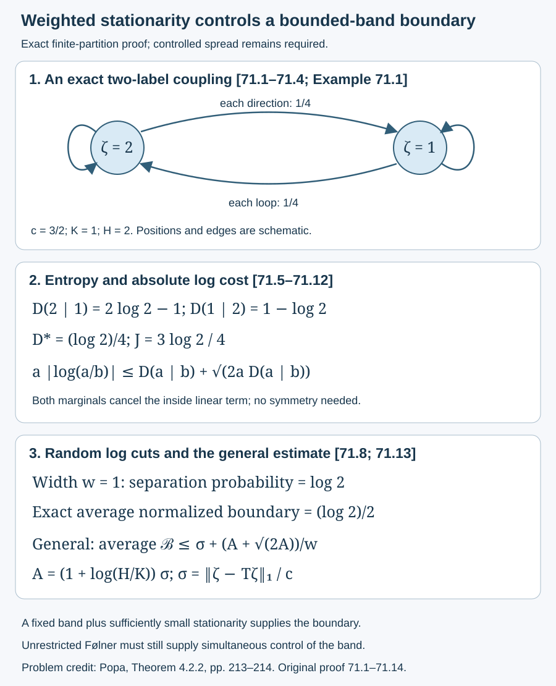
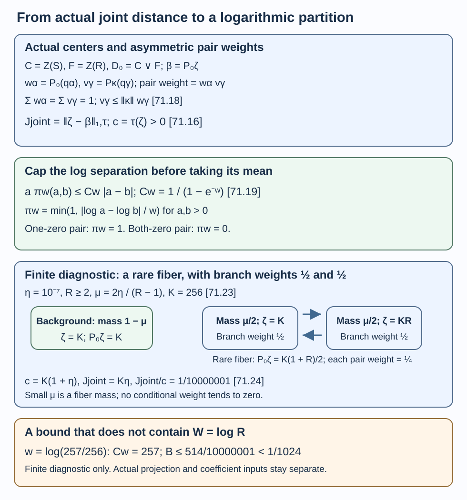

# Entropy bounds the central partition boundary

[Lesson 70](joint-projection-transfer-and-partition-flow.md) proves a complete rounding theorem from a dimension band and a small scalar boundary. We now obtain the boundary from weighted stationarity inside a specified band. The estimate depends on the logarithmic spread of that band. It does not produce a band with this quantitative control from unrestricted relative Følner.

The motivating human source remains Sorin Popa, *Classification of amenable subfactors of type II*, [DOI 10.1007/BF02392646](https://doi.org/10.1007/BF02392646), Theorem 4.2.2, printed pp. 213–214. The scalar estimates, finite-partition proof and diagram below are original. We use the actual centers, weighted expectations and normal trace formulas of [68.1–68.5](core-central-transition-bounds.md), and the full projection and rounding proofs of [70.1–70.5](joint-projection-transfer-and-partition-flow.md). All their exact programme prerequisites remain in force. No direct-integral or joint tensor-product measure theorem is assumed.

A second route, Theorem 71.5 below, obtains the boundary directly from the actual joint distance with a constant independent of logarithmic spread. It uses a stronger input than stationarity. The two inputs and their remaining original construction obligations are stated separately.

## A positive coupling on finite central partitions

Write \(C=Z(S)\), \(F=Z(R)\), and \(D_0=C\vee F\). Retain \(P_0,P_\kappa,Q_\kappa\) from Lesson 68, and put \(T=Q_\kappa P_0:C\to C\). Both marginal identities in (68.5) make \(T\) positive, unital and \(\tau\)-preserving.

For bounded \(f,h\in C\), define the bilinear pairing

\[
\begin{gathered}
\omega(f,h)=\tau(P_0(f)P_\kappa(h))\\
=\tau((Tf)h),\\
\omega(f,1)=\tau(f),\\
\omega(1,h)=\tau(h).
\end{gathered}
\tag{71.1}
\]

**Lemma 71.1.** For any finite orthogonal partition \(s_0,\ldots,s_l\) in \(C\), the numbers \(v_{ij}=\omega(s_i,s_j)\) are nonnegative and satisfy

\[
\begin{gathered}
\sum_jv_{ij}=\tau(s_i),\\
\sum_iv_{ij}=\tau(s_j).
\end{gathered}
\tag{71.2}
\]

**Proof.** Both expectations are positive, and their outputs lie in the same abelian algebra \(F\). Their product is positive, so its trace is nonnegative. Summing one argument gives (71.2) by (71.1). No symmetry of \(v_{ij}\) is asserted. The second equality in (71.1) follows from expectation adjointness: \(\tau((Q_\kappa P_0f)h)=\tau(\kappa P_0f\,h)=\tau(P_0f\,P_\kappa h)\). \(\square\)

For a finite-trace projection \(p\in A\) with dimension \(\zeta\) and \(c=\operatorname{Tr}(p)=\tau(\zeta)>0\), the boundary in (70.7) is exactly

\[
\begin{gathered}
\mathcal B_p(Z)\\
=\frac1c\sum_{i\ne j}\omega(\zeta s_i,s_j).
\end{gathered}
\tag{71.3}
\]

Indeed \(P_\kappa(s_j)\in F\), so taking \(P_0\) in the other factor does not change the trace in (70.7).

## An elementary entropy inequality controls absolute log differences

For positive real numbers \(a,b\), set

\[
D(a\mid b)=a\log(a/b)-a+b.
\tag{71.4}
\]

**Lemma 71.2.** This number is nonnegative, and

\[
\begin{gathered}
a|\log(a/b)|\\
\leq D(a\mid b)+\sqrt{2aD(a\mid b)}.
\end{gathered}
\tag{71.5}
\]

**Proof.** Put \(r=\log(a/b)\) and \(\phi(r)=r-1+e^{-r}\), so \(D(a\mid b)=a\phi(r)\). For \(r\leq0\), the exponential inequality \(e^t\geq1+t+t^2/2\), \(t=-r\geq0\), gives \(\phi(r)\geq r^2/2\). It proves both assertions and \(|r|\leq\sqrt{2\phi(r)}\).

For \(r\geq0\), put \(u=1-e^{-r}\in[0,1)\). Then

\[
\begin{gathered}
\phi(r)=-\log(1-u)-u\\
=\int_0^u\frac{t}{1-t}\,dt
\geq\frac{u^2}{2},\\
r=\phi(r)+u\\
\leq\phi(r)+\sqrt{2\phi(r)}.
\end{gathered}
\tag{71.6}
\]

Multiply by \(a\). This proves (71.5) without a bounded-ratio assumption on \(a,b\). \(\square\)

## Stationarity supplies a logarithmic partition

Assume the actual projection dimension has a finite band

\[
\begin{gathered}
K\leq\zeta\leq H<\infty,\\
\hbox{on }z=\operatorname{supp}\zeta,\\
K>0,\quad W=\log(H/K),\\
\sigma=\|\zeta-T\zeta\|_1/c.
\end{gathered}
\tag{71.7}
\]

Thus \(\zeta=0\) on \(1-z\). For \(w>0\) and \(0\leq\theta<w\), partition \(z\) by the logarithmic intervals with lower endpoints \(K e^{\theta+jw}\), and add \(1-z\) as one cell. Only finitely many intervals meet the band; call this partition \(Z_\theta\).

**Theorem 71.3.** Some such shift has

\[
\begin{gathered}
\mathcal B_p(Z_\theta)\leq
\sigma+\frac{A+\sqrt{2A}}{w},\\
A=(1+W)\sigma.
\end{gathered}
\tag{71.8}
\]

In particular, the boundary can be made arbitrarily small when the band is fixed and stationarity tends to zero. The estimate uses no factoriality, extremality or ambient separability.

**Proof for a finite spectral step function.** First let \(\zeta=\sum_{i=1}^l a_i s_i\) with \(a_i\in[K,H]\); put \(s_0=1-z\) and \(a_0=0\). Use the finite coupling of Lemma 71.1. Its outward loss is

\[
\begin{gathered}
L=\sum_{i\geq1}a_i v_{i0}
=\tau((1-z)T\zeta)\\
\leq\|\zeta-T\zeta\|_1=\sigma c.
\end{gathered}
\tag{71.9}
\]

Set \(f=\log(\zeta/K)\) on \(z\) and \(f=0\) on \(1-z\), so \(0\leq f\leq W\). Then

\[
\begin{gathered}
E=\tau((\zeta-T\zeta)f),\\
|E|\leq W\sigma c.
\end{gathered}
\tag{71.10}
\]

By the two equal marginals, the inside linear sum is

\[
\begin{gathered}
\sum_{i,j\geq1}(a_i-a_j)v_{ij}\\
=\sum_{j\geq1}a_jv_{0j}-L.
\end{gathered}
\]

Expanding \(E\), and then subtracting this linear sum, gives the exact identity

\[
\begin{gathered}
D_*=\sum_{i,j\geq1}D(a_i\mid a_j)v_{ij}\\
=E-\sum_{i\geq1}a_i\log(a_i/K)v_{i0}\\
\quad-\sum_{j\geq1}a_jv_{0j}+L.
\end{gathered}
\tag{71.11}
\]

Both subtracted terms are nonnegative. Lemma 71.2 and (71.9)–(71.10) therefore give \(0\leq D_*\leq (1+W)\sigma c=Ac\). Apply (71.5), sum, and use scalar Cauchy–Schwarz and \(\sum_{i,j\geq1}a_i v_{ij}\leq c\). The total absolute log cost satisfies

\[
\begin{gathered}
J=\sum_{i,j\geq1}
a_i|\log(a_i/a_j)|v_{ij}\\
\leq D_*+\sqrt{2cD_*}\\
\leq c(A+\sqrt{2A}).
\end{gathered}
\tag{71.12}
\]

For two real log values, the probability that a uniform shift \(\theta\in[0,w)\) separates them into different width-\(w\) cells is \(\min(1,|\log(a_i/a_j)|/w)\). To see this, translate one value to zero modulo \(w\): an interval of length equal to their separation crosses a boundary; it covers a fraction separation/\(w\) of a period until the separation reaches \(w\), after which every shift separates them.

The zero complement is always a separate cell. Its outward contribution is \(L/c\), while its incoming term is weighted by \(a_0=0\) and vanishes. Thus

\[
\begin{gathered}
\frac1w\int_0^w\mathcal B_p(Z_\theta)\,d\theta\\
\leq\frac{L}{c}+\frac{J}{wc}\\
\leq\sigma+\frac{A+\sqrt{2A}}w.
\end{gathered}
\tag{71.13}
\]

A shift with at most this average exists.

**Passage to an arbitrary bounded dimension.** Approximate \(\zeta\) uniformly by finite spectral step functions \(\zeta_n\), equal to zero on \(1-z\), with all positive values in \([K,H]\). Positivity and trace preservation make \(T\) an \(L^1\) contraction, so \(c_n\to c\) and \(\sigma_n=\|\zeta_n-T\zeta_n\|_1/c_n\to\sigma\).

The scalar spectral distribution of \(\log(\zeta/K)\) on \(z\) under \(\tau\) has at most countably many atoms. Except for a countable set of shifts, every bin endpoint has zero mass. At each such shift, the corresponding finitely many cell projections for \(\zeta_n\) converge in \(L^1(\tau)\) to those for \(\zeta\). All cells remain in one fixed finite range of integer labels. The map \(P_\kappa:C\to F\) is positive and \(\tau\)-preserving, hence an \(L^1\) contraction. Boundedness of \(\zeta_n\) and normality give convergence of every scalar term in (71.3). Therefore \(\mathcal B_{\zeta_n}(Z_{\theta,n})\to\mathcal B_\zeta(Z_\theta)\) for almost every shift.

Every normalized boundary lies in \([0,1]\), by (70.7). Bounded convergence passes (71.13) to the limit and proves (71.8). This finite-partition argument neither asserts a normal measure on \(C\overline\otimes C\) nor uses a direct integral. \(\square\)

## Rounding from controlled-spread stationarity

**Corollary 71.4.** Retain all actual target/basis/coefficient hypotheses of 70.4–70.5. Let the band satisfy (71.7) with the integer \(K\) required there. For a desired scalar boundary tolerance \(b>0\), it suffices that

\[
\begin{gathered}
\sigma<\frac b4,\\
\sigma<\frac{bw}{4(1+W)},\\
\sigma<\frac{(bw)^2}{32(1+W)}.
\end{gathered}
\tag{71.14}
\]

Then some logarithmic partition has \(\mathcal B_p(Z_\theta)<b\). In particular choose \(b=\alpha^2/(8mtd^2)\), together with the independent commutator tolerance in (70.20); 70.4 supplies the rounded projection and its complete error estimate.

**Proof.** In (71.8), the three summands \(\sigma\), \(A/w\), and \(\sqrt{2A}/w\) are respectively less than \(b/4,b/4,b/4\) under (71.14). Hence the boundary is less than \(3b/4<b\). Theorem 70.4 selects and rounds a single nonzero bin using all target errors simultaneously. \(\square\)

This removes the separate boundary hypothesis once the band and the stated stationarity bound hold. The unrestricted problem is still to obtain an actual Følner projection with these simultaneous quantitative conditions, including every cost of low/high central cuts and changes of core. The spread \(W\) is part of the hypothesis; it cannot be chosen after the stationarity tolerance without checking (71.14).

## Joint distance supplies a partition without a spread factor

Weighted stationarity and joint distance are different inputs. The preceding proof estimates the boundary from \(\sigma\) and \(W\). We now use the actual joint distance

\[
\begin{gathered}
\beta=P_0\zeta,\qquad
J_{\mathrm{joint}}=\|\zeta-\beta\|_{L^1(D_0,\tau)},\\
c=\tau(\zeta)>0,\qquad
C_w=(1-e^{-w})^{-1}.
\end{gathered}
\tag{71.16}
\]

Here \(\zeta\) is bounded, positive and lies in \(C=Z(S)\); its positive spectrum is contained in \([K,H]\), with \(0<K\leq H<\infty\). For an actual projection it is the smaller canonical dimension used above. The estimate below does not involve \(W=\log(H/K)\).

**Theorem 71.5.** Some width-\(w\) logarithmic shift, including the zero complement as a separate cell, satisfies

\[
\mathcal B_\zeta(Z_\theta)
\leq C_w(1+\|\kappa\|)\frac{J_{\mathrm{joint}}}{c}.
\tag{71.17}
\]

For an actual projection \(p\), \(\mathcal B_\zeta=\mathcal B_p\). All expectations and measures are the inherited maps of Lesson 68. The theorem holds for nonfactor centers and makes no finite unit-capacity assumption.

**Proof — the actual finite branches.** By (68.9), \(x\leq b_dP_0(x)\) for \(x\in(D_0)_+\). Apply only the abelian branch construction [72.1–72.2](finite-central-branches-and-joint-tests.md) to \(F\subset D_0\) with its faithful normal, \(\tau\)-preserving expectation \(P_0\). It gives finitely many orthogonal projections \(q_\alpha\), summing to one, with \(q_\alpha D_0=q_\alpha F\). There are at most \(\lfloor b_d\rfloor\) branches. That branch construction is independent of the boundary estimates in this lesson.

Put \(r_\alpha=\operatorname{supp}P_0(q_\alpha)\), \(w_\alpha=P_0(q_\alpha)\), and \(v_\alpha=P_\kappa(q_\alpha)\). The map \(r_\alpha F\to q_\alpha D_0\), given by multiplication by \(q_\alpha\), is a faithful normal *-isomorphism. Thus \(q_\alpha\zeta=q_\alpha\zeta_\alpha\) for a unique \(\zeta_\alpha\in r_\alpha F\), extended by zero off \(r_\alpha\). The resulting identities are

\[
\begin{gathered}
\sum_\alpha w_\alpha=\sum_\alpha v_\alpha=1,
\qquad 0\leq v_\alpha\leq\|\kappa\|w_\alpha,\\
\beta=\sum_\alpha w_\alpha\zeta_\alpha,
\qquad J_{\mathrm{joint}}
=\sum_\alpha\tau(w_\alpha|\zeta_\alpha-\beta|),\\
c\mathcal B_\zeta(Z_\theta)
=\sum_{\alpha,\gamma}\tau\left(
w_\alpha v_\gamma\zeta_\alpha
1_{\{\zeta_\alpha,\zeta_\gamma\text{ in different cells}\}}
\right).
\end{gathered}
\tag{71.18}
\]

For the last line, apply \(P_0\) to \(\zeta s_i\), apply \(P_\kappa\) to \(s_j\), and expand their product in the common abelian algebra \(F\). A branch coefficient off its support can be set to zero because both of its weights vanish there. The pair weight is \(w_\alpha v_\gamma\); it need not be symmetric or uniform.

**Proof — the capped logarithm.** For \(a,b\geq0\), let \(\pi_w(a,b)\) be \(\min(1,|\log a-\log b|/w)\) when both are positive, one when exactly one is zero, and zero when both vanish. Then

\[
a\pi_w(a,b)\leq C_w|a-b|.
\tag{71.19}
\]

If \(0<a\leq b\), use \(a\log(b/a)\leq b-a\) and \(1/w\leq C_w\), the latter following from \(1-e^{-w}\leq w\). If \(a>b>0\), set \(x=\log(a/b)\). For \(x\geq w\), \(a/(a-b)=(1-e^{-x})^{-1}\leq C_w\). For \(0<x<w\), the function \(x/(1-e^{-x})\) is increasing: its derivative has positive numerator \(1-e^{-x}(1+x)\), since \(e^x>1+x\). Consequently \(x/[w(1-e^{-x})]\leq C_w\). When one value is zero, (71.19) follows from \(C_w\geq1\); both-zero terms vanish.

First take \(\zeta\) to be a finite spectral step function. The finitely many branch coefficients have a common finite spectral partition in \(F\). For each pair of their scalar values, the proportion of separating shifts is precisely \(\pi_w(a,b)\), by the modulo-\(w\) argument in Theorem 71.3, with zero always separate. Thus (71.18) can be integrated as a finite sum. Using (71.19) and the lattice triangle inequality around the actual \(\beta\) gives

\[
\begin{aligned}
\frac1w\int_0^w\mathcal B_\zeta(Z_\theta)\,d\theta
&\leq\frac{C_w}{c}\sum_{\alpha,\gamma}
\tau(w_\alpha v_\gamma|\zeta_\alpha-\zeta_\gamma|)\\
&\leq\frac{C_w}{c}\left[
\sum_\alpha\tau(w_\alpha|\zeta_\alpha-\beta|)
+\sum_\gamma\tau(v_\gamma|\zeta_\gamma-\beta|)
\right]\\
&\leq C_w(1+\|\kappa\|)\frac{J_{\mathrm{joint}}}{c}.
\end{aligned}
\tag{71.20}
\]

The first triangle contribution sums \(v_\gamma\) to one; the second sums \(w_\alpha\) to one and then uses \(v_\gamma\leq\|\kappa\|w_\gamma\). This is why both inherited weights must be retained.

For arbitrary bounded \(\zeta\) in the stated band, take finite spectral step approximations \(\zeta_n\to\zeta\) uniformly, preserving the zero complement and \([K,H]\). The \(L^1\) contraction of \(P_0\) gives \(J_{\mathrm{joint},n}\to J_{\mathrm{joint}}\), and \(c_n\to c\). Except at a countable set of shifts, all bin boundaries have zero mass for the scalar spectral distribution of \(\zeta\). At every other shift, the finitely many cell projections converge in \(L^1\); the number and range of integer bin labels have a common finite bound. Normality, boundedness and the \(L^1(\tau)\) contraction of \(P_\kappa:C\to F\) give convergence of each boundary term, exactly as in the passage following (71.13). Every normalized boundary is between zero and one. Bounded convergence therefore passes (71.20) to the limit. A shift at most its average proves (71.17). This argument uses finite partitions and single-variable spectral distributions, with no direct-integral assumption. \(\square\)

## A rounding input independent of the logarithmic spread

**Corollary 71.6.** Retain the actual projection, dimension band, targets and prior coefficient tests of 70.4–70.5. For any \(b>0\), it suffices that

\[
\frac{J_{\mathrm{joint}}}{c}
<\frac{b(1-e^{-w})}{1+\|\kappa\|}.
\tag{71.21}
\]

Then some finite logarithmic partition has \(\mathcal B_p(Z_\theta)<b\). In particular, choose

\[
\begin{gathered}
b=\frac{\alpha^2}{8mtd^2},\qquad
\delta<\frac{\alpha}{\sqrt{2m(1+16t^2d^2)}},\\
\frac{J_{\mathrm{joint}}}{c}
<\frac{\alpha^2(1-e^{-w})}
{8mtd^2(1+\|\kappa\|)}.
\end{gathered}
\tag{71.22}
\]

Here \(m\geq1\) is the number of target unitaries, \(t\) is the common basis size, and \(\delta\) controls all target and coefficient-decomposition unitary commutators chosen before \(p\). Theorem 70.4 then selects one nonzero cell and prescribes an actual smaller canonical projection of dimension \(kz\), with the target error bound (70.17) and relative trimming bound (70.18).

**Proof.** The strict inequality (71.21) and Theorem 71.5 give the boundary bound. Equation (70.19) bounds the prior coefficient and target contribution by \(m(1+16t^2d^2)\delta^2<\alpha^2/2\). Equation (70.14) bounds the boundary contribution by \(4mtd^2b=\alpha^2/2\). Their sum is strictly less than \(\alpha^2\). The full simultaneous selection and feasible central prescription in 70.4 apply. \(\square\)

The new input is \(J_{\mathrm{joint}}\), rather than the stationarity defect \(\sigma\). No implication from small \(\sigma\) to small joint distance has been added. Producing the required actual projection from unrestricted amenability remains a separate obligation. The selected label lies in \(Z(S)\); the larger dimension is \(kP_0z\) by (68.12). Equality with \(kz\) requires \(z\in Z(R)\), and that stronger common-center support is not supplied by this estimate.

## Three exact examples

**Example 71.1 — the two-label matrix model.** In (70.21), \(\zeta=(2,1)\), \(c=3/2\), \(\kappa=1\), and every coupling entry is \(1/4\). Set \(K=1,H=2,w=1\). The inside entropy sum is
\(D_*=(\log2)/4\), because \(D(2\mid1)=2\log2-1\) and \(D(1\mid2)=1-\log2\). There is no zero cell loss. The absolute log cost is \(J=3\log2/4\); the average normalized boundary is exactly \((\log2)/2\), since \(\log2<1\). This is the finite matrix model already specified in Lesson 70, not a Jones-core realization.

**Example 71.2 — a quantitative rounding input.** Suppose \(d=t=2,m=1,\alpha=1/4\), \(K=256,H=1024\), \(w=\log(257/256)\), and the actual projection satisfies \(\sigma\leq10^{-12}\). Then \(W=\log4<2\), \(w\geq1/257\), and (71.8) gives

\[
\begin{gathered}
b_*=3\cdot10^{-12}+\tfrac52\,10^{-6},\\
\mathcal B_p(Z_\theta)
<10^{-12}+257b_*\\
<\frac1{1024}
=\frac{\alpha^2}{8mtd^2}.
\end{gathered}
\tag{71.15}
\]

Here \(\sqrt6<5/2\) bounds the square-root term. If the prior target/coefficient unitary commutators also have tolerance \(10^{-3}\), their total in (70.19) is at most \(257\cdot10^{-6}<\alpha^2/2\). Thus the complete conditional rounding theorem applies. No assertion that unrestricted Følner supplies this particular band is made.

**Example 71.3 — an arbitrarily wide band with fixed joint error.** This is a finite commutative diagnostic, not an asserted Jones core or an actual projection construction. Let \(C=D_0\) have three atoms: a background atom of mass \(1-\mu\), and two rare atoms of mass \(\mu/2\) each. The algebra \(F\) separates the background from the rare pair, while forgetting the distinction within that pair. Set \(\kappa=1\), \(K=256\), \(R\geq2\),

\[
\eta=10^{-7},\qquad
\mu=\frac{2\eta}{R-1},\qquad
\zeta=(K,K,KR).
\tag{71.23}
\]

The ordinary branch weights are one on the background and \(1/2,1/2\) on the rare fiber. Thus \(x\leq2P_0x\) for \(x\geq0\), uniformly in \(R\). Small \(\mu\) is the mass of a larger-center fiber, not a small conditional branch weight. The actual finite expectations give

\[
\begin{gathered}
P_0\zeta=K\text{ on the background},\\
P_0\zeta=K(1+R)/2\text{ on the rare fiber},\\
c=K(1+\eta),\qquad J_{\mathrm{joint}}=K\eta,\\
\frac{J_{\mathrm{joint}}}{c}=\frac1{10000001}.
\end{gathered}
\tag{71.24}
\]

Take \(w=\log(257/256)\), so \(C_w=257\) exactly. Theorem 71.5 yields

\[
\mathcal B_\zeta(Z_\theta)
\leq\frac{514}{10000001}
<\frac1{1024}.
\tag{71.25}
\]

This bound is uniform as \(W=\log R\) becomes arbitrarily large. Indeed the rare labels are separated for every shift because \(\log R>w\), and their two off-diagonal pair weights are \(1/4\) within that fiber. The exact boundary is

\[
\mathcal B_\zeta(Z_\theta)
=\frac{\mu(1+R)}{4(1+\eta)}
=\frac{\eta(1+R)}{2(R-1)(1+\eta)}.
\tag{71.26}
\]

For an actual projection with the separate hypotheses \(d=t=2,m=1,\alpha=1/4\), the bound \(1/1024\) is the required scalar budget in (71.22). Those physical hypotheses and its prior coefficient tests must still be established; this diagnostic does not supply them.

*Figure 71.1. Both directions and both loops have coupling weight \(1/4\) in Example 71.1. The two directional entropy costs sum to \((\log2)/4\); absolute log cost is \(3\log2/4\). A width-one randomly shifted log partition separates the labels with probability \(\log2\), so its average normalized boundary is \((\log2)/2\). The final panel states the exact general bound (71.8) and retains the controlled-band obligation. Coordinates are schematic. [Editable figure source](figures/entropy-and-logarithmic-partition-boundary.py). Problem source: Popa, Theorem 4.2.2, pp. 213–214.*

*Figure 71.2. The inherited pair weights are those in (71.18). The capped-log bound (71.19) yields (71.17) without a spread factor. The three atoms illustrate exactly (71.23)–(71.26), with conditional rare-branch weights one half. Positions are schematic; this finite commutative diagnostic is not asserted to be a Jones core. [Editable figure source](figures/spread-free-joint-partition.py). Human-source problem: Popa, Theorem 4.2.2, printed pp. 213–214; the new estimate is proved in Theorem 71.5.*

## Exercises with complete solutions

### Exercise 71.1 — introductory

Why are both marginals needed in the finite-partition proof?

**Solution.** The row marginal sums outgoing \(v_{ij}\) to \(\tau(s_i)\), and the column marginal sums incoming \(v_{ij}\) to \(\tau(s_j)\). Together they convert the inside linear sum of \(a_i-a_j\) to incoming zero-cell weight minus outward loss. This exact cancellation is used in (71.11). Symmetry is unnecessary.

### Exercise 71.2 — introductory

Evaluate the two directional entropy costs for \(a=2,b=1\).

**Solution.** They are \(D(2\mid1)=2\log2-1\) and \(D(1\mid2)=1-\log2\), both nonnegative. Multiplying each by \(1/4\) and adding cancels the constants and leaves \((\log2)/4\).

### Exercise 71.3 — intermediate

Why can the zero dimension be treated without taking its logarithm?

**Solution.** Define \(f=0\) on \(1-z\). The outward coupling contribution is \(\sum_{i\geq1}a_i v_{i0}=L\), bounded by stationarity outside the support. The incoming boundary contribution has coefficient \(a_0=0\). All logarithmic differences in \(J\) use only positive \(a_i,a_j\), and both zero-cell terms in (71.11) are explicit.

### Exercise 71.4 — intermediate

Derive the probability of separation when two log values differ by \(w/3\), by \(w\), and by \(2w\).

**Solution.** Uniform translation modulo \(w\) places a cell boundary between the values for a fraction \(1/3\), \(1\), and \(1\) of shifts, respectively. These are the three values of \(\min(1,\text{separation}/w)\). Equality at an endpoint has zero shift measure.

### Exercise 71.5 — advanced

Verify all three terms of the strict bound (71.14).

**Solution.** Its first condition gives \(\sigma<b/4\). The second gives \(A/w=(1+W)\sigma/w<b/4\). The third gives \(2A<(bw)^2/16\), hence \(\sqrt{2A}/w<b/4\). Adding yields the strict boundary bound \(3b/4\), which is smaller than \(b\).

### Exercise 71.6 — advanced

In Lesson 69's normalized escaping family, compute \((1+W_L)\sigma_L\). Does this theorem supply a vanishing boundary at fixed width?

**Solution.** The positive density values have ratio \(2^{L-1}\), so \(W_L=(L-1)\log2\). The stationarity defect is \(\sigma_L=4/[3(2L-1)]\). Therefore

\[
\begin{gathered}
(1+W_L)\sigma_L\\
=\frac{4(1+(L-1)\log2)}{3(2L-1)}\\
\longrightarrow\frac{2\log2}{3}>0.
\end{gathered}
\]

The bound in (71.8) does not tend to zero at fixed width. A finite band for each individual member is insufficient when its spread grows this way. No stationarity-only modulus refuted in Lesson 69 has been restored.

### Exercise 71.7 — introductory

Check (71.19) when \(a=0<b\), when \(a>0=b\), and when \(a=b=0\).

**Solution.** The left sides are respectively zero, \(a\), and zero. The right sides are \(C_wb\), \(C_wa\), and zero. All inequalities hold because \(C_w\geq1\). No logarithm of zero is used.

### Exercise 71.8 — intermediate

Explain why \(w_\alpha v_\gamma\) cannot be replaced by \(w_\alpha w_\gamma\) in (71.18).

**Solution.** The boundary pairs \(P_0(\zeta s_i)\) with \(P_\kappa(s_j)\), so their expansions use different coefficients. For example, conditional branch probabilities \((1/2,1/2)\) and branch values of \(\kappa\) equal to \((3/2,1/2)\) give \(v=(3/4,1/4)\). The outgoing pair weights are then \(1/8\) and \(3/8\); replacing both by \(1/4\) changes the pairing. The proof only uses \(v\leq\|\kappa\|w\) after the exact expansion.

### Exercise 71.9 — intermediate

Compute the joint error in Example 71.3 and verify its ordinary expectation bound. What is small in this example?

**Solution.** There is no background error. Both rare atoms have deviation \(K(R-1)/2\) from their common conditional mean, so their total error is \(\mu K(R-1)/2=K\eta\). Their contribution to the mass, combined with the background, gives \(c=K(1+\eta)\). On the rare fiber, \(P_0x=(x_1+x_2)/2\), hence each \(x_i\leq2P_0x\); on the background \(P_0x=x\). The small parameter is the total rare-fiber mass \(\mu\), while each nonzero conditional branch probability is at least \(1/2\).

### Exercise 71.10 — advanced

What does \(J_{\mathrm{joint}}=0\) prove about a bounded \(\zeta\in Z(S)\)? Does a sequence with positive joint errors tending to zero prove the same exact center membership for each member?

**Solution.** Faithfulness of \(\tau\) makes zero \(L^1\) distance imply \(\zeta=P_0\zeta\) as operators. Therefore \(\zeta\in Z(S)\cap Z(R)\), and all of its spectral projections belong to both centers. The bound (71.17) then gives zero boundary. Positive errors, however small, do not imply equality. To see this with one fixed expectation and trace, keep the three-atom algebra and the two-atom subalgebra of Example 71.3, fix \(\mu=1/2\), and put \(\zeta_n=(K,K,K(1+1/n))\), \(n\geq1\). Then \(c_n=K(1+1/(4n))\), \(J_n=K/(4n)\), and \(J_n/c_n=1/(4n+1)>0\) tends to zero. The two rare values remain distinct for every finite \(n\), so \(\zeta_n\notin F\). All members have a common band \([K,2K]\). This finite commutative diagnostic makes no claim about realization by an actual Jones core.

---

Authored by GPT-6.1 Sol (OpenAI), Ultra reasoning, October 2026. Original exposition CC0 1.0. Author self-check. The course remains in development.
