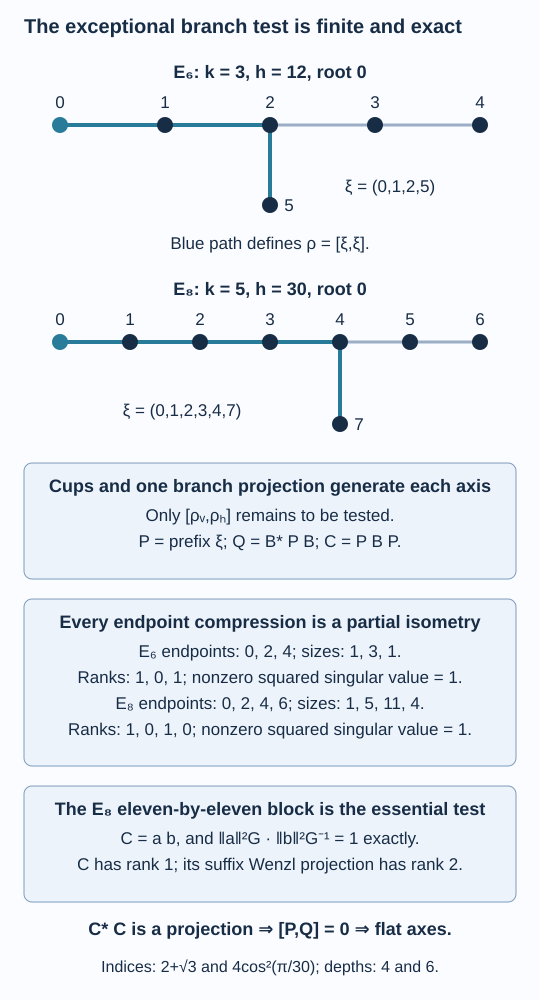

# Exact certificates make the exceptional graphs flat

The E6 and E8 connections have one extra axis generator beyond their Jones projections. Flatness therefore reduces to two projections in one finite rectangle. We prove that reduction and compute its entire compression in exact cyclotomic fields. This produces hyperfinite inclusions with both exceptional principal graphs and an anti-isomorphism between their conjugate constructions.

We assume [Two unitary matrices build a path grid](connections-and-path-grids.md), [Flat paths recover the principal graph](flat-paths-and-realization.md), [A branching matrix determines the connection](tree-connections-and-gauge.md), and [An inclusion determines its connection](reconstructing-the-connection.md). The matrix-unit identity (9.11), rather than its rooted-line conclusion, supplies the generation argument below. References are [Kawahigashi, Section 6] and [Izumi]. Our computation is an exact finite proof: [the standalone checker](computations/exceptional-flatness.py) uses rational polynomial arithmetic, and [the coefficient certificate](computations/exceptional-flatness-certificate.json) supplies every compression entry and its factorization.

## One projection separates the branch

Use the following numbering. For \(E_6\), take the chain \(0-1-2-3-4\) and attach vertex \(5\) to \(2\). For \(E_8\), take \(0-1-2-3-4-5-6\) and attach vertex \(7\) to \(4\). The root is \(0\). Write

\[
(b,h,k,s)=
\begin{cases}
(2,12,3,5),&E_6,\\
(4,30,5,7),&E_8,
\end{cases}
\tag{38.1}
\]

where \(b\) is the branch, \(s\) its short tip, \(k=b+1\), and \(h\) the Coxeter number. Put

\[
\delta=2\cos(\pi/h),\qquad
\zeta=e^{2\pi i/(4h)},\qquad
\varepsilon=\zeta^{h-1}.
\tag{38.2}
\]

Then \(-(\varepsilon^2+\varepsilon^{-2})=\delta\). Use the universal cells (32.18) with parameter \(\varepsilon\).

For explicit weights, let \(q_0=0,q_1=1,q_{j+1}=\delta q_j-q_{j-1}\). Normalize \(\mu(0)=1\) and set

\[
\begin{aligned}
\mu(j)&=q_{j+1}\quad(0\leq j\leq b),&
\mu(s)&=\mu(b)/\delta,\\
\mu(b+2)&=\mu(b)/(\delta^2-1),&
\mu(b+1)&=\delta\mu(b+2).
\end{aligned}
\tag{38.3}
\]

These are the positive Perron weights of lesson 20. Substitution verifies the neighbour equation at each vertex; the exact checker verifies that same equation in the cyclotomic field.

Let \(\xi=(0,1,\ldots,b,s)\), the unique shortest path to the short tip, and let

\[
\rho=[\xi,\xi]\in P_k
\tag{38.4}
\]

be its scalar endpoint-block projection.

**Lemma 38.1 — one extra generator.** Each exceptional rooted path tower is generated by its Jones projections and \(\rho\). Its universal connection is flat at this root if and only if the vertical and horizontal copies of \(\rho\) commute in \(A_{k,k}\).

**Proof.** Up to length \(k-1=b\), each level has at most one new endpoint, reached by one shortest path. The identity (9.11) obtains every old endpoint matrix unit from the preceding algebra and the new cup; the remaining scalar block is supplied by subtraction from one. Thus cups generate these early levels.

At length \(k\), exactly two new endpoints appear, \(s\) and \(b+1\), each with one shortest path. Identity (9.11) still supplies every old block. Adjoining \(\rho\) supplies one of the two new scalar blocks; subtraction from one supplies the other. At length \(k+1\), only the remaining vertex \(b+2\) is new, so the same identity and subtraction supply its scalar block. Every later endpoint is old, so (9.11) supplies all blocks. This proves generation at every finite level, with no assertion that cups alone separate the branch.

Every vertical Jones projection commutes with the whole horizontal axis, and conversely, by Lemma 32.3. Consequently the only remaining pair of generators to test is \(\rho^v,\rho^h\). If they commute at \(A_{k,k}\), their images commute at every larger rectangle because grid embeddings are homomorphisms. Both generated axis algebras then commute. Necessity follows from the definition of flatness. \(\square\)

## A compression detects the commutator

Write \(B=S_{k,k}\) for the unitary reordering \(v^kh^k\) as \(h^kv^k\). In either block order, let \(P\) be the diagonal projection onto paths whose first \(k\) steps are \(\xi\). In the vertical-first order the two axis projections are \(P\) and

\[
Q=B^*PB.
\]

For each final endpoint \(x\), let

\[
C_x=(PBP)|_{\operatorname{ran}P,\ x}.
\tag{38.5}
\]

Its rows and columns are the length-\(k\) suffix paths from \(s\) to \(x\).

**Lemma 38.2 — projection criterion.** The projections \(P,Q\) commute if and only if every \(C_x\) is a partial isometry.

**Proof.** On \(\operatorname{ran}P\),

\[
PQP=PB^*PBP=C^*C.
\]

Since \(Q^2=Q\),

\[
PQ(1-P)QP=PQP-(PQP)^2.
\tag{38.6}
\]

The left side is the positive square of \((1-P)QP\). Thus \(C^*C\) is a projection exactly when \((1-P)QP=0\). Its adjoint then gives \(PQ(1-P)=0\), which is equivalent to \(PQ=QP\). All operators preserve the final endpoint, so the assertion can be tested block by block. \(\square\)

In particular we need the singular values of the compression, not its trace. A rank-one partial isometry can have a trace of modulus smaller than one.

## Computing every coefficient without radicals

The universal cell matrix at adjacent position \(i\) is

\[
\varepsilon I+\delta\varepsilon^{-1}e_i.
\]

For a length-\(2k\) path \(p\), change its basis scale by

\[
D_p=\prod_{j=1}^{2k-1}\sqrt{\mu(p_j)}.
\tag{38.7}
\]

In the new basis, the swap has the radical-free coefficients

\[
\widetilde S_i(p',p)=
\varepsilon\mathbf1_{p'=p}
+\mathbf1_{p_{i-1}=p_{i+1}}\,
\varepsilon^{-1}\frac{\mu(p_i)}{\mu(p_{i-1})}
\tag{38.8}
\]

when \(p'\) differs only by replacing \(p_i\) by any neighbour of \(p_{i-1}\); other entries are zero. If both terms apply, they are added. This is \(D^{-1}S_iD\), as follows directly by dividing the square-root cell coefficient by \(D_{p'}/D_p\).

The product is specified completely by the successive swap positions

\[
k,k-1,\ldots,1;\quad
k+1,k,\ldots,2;\quad\ldots;\quad
2k-1,2k-2,\ldots,k.
\tag{38.9}
\]

Each segment moves the next horizontal step to the left; there are \(k^2\) swaps. Multiply the corresponding matrices in that chronological order on an input column.

For clarity, the entire entry recurrence is as follows. Start a column at the path \(\xi\eta\), with coefficient one there and zero elsewhere. At each position \(i\), an input coefficient \(a_p\) contributes \(\varepsilon a_p\) to the same path. If \(p_{i-1}=p_{i+1}=v\), it additionally contributes

\[
\varepsilon^{-1}\frac{\mu(p_i)}{\mu(v)}a_p
\]

to every path obtained by replacing \(p_i\) by a neighbour of \(v\). Add contributions. After (38.9), retain only output paths \(\xi\eta'\). Their coefficients are \(\widetilde C_x(\eta',\eta)\). This finite recurrence calculates every entry, including zeros.

On a selected suffix \(\eta=(s,\eta_1,\ldots,\eta_k=x)\), the positive metric is

\[
g_\eta=\prod_{j=1}^{k-1}\mu(\eta_j).
\tag{38.10}
\]

The factors in (38.7) coming from the fixed prefix are common to the whole compression and cancel. Thus adjoint in these coordinates is

\[
(T^\sharp)_{ij}=\frac{g_j}{g_i}\overline{T_{ji}}.
\tag{38.11}
\]

All weights, swaps and metrics lie in \(\mathbb Q(\zeta)\). Their polynomial moduli, written in increasing powers, are

\[
\begin{aligned}
\Phi_{48}(z)&=z^{16}-z^8+1,\\
\Phi_{120}(z)&=z^{32}+z^{28}-z^{20}-z^{16}-z^{12}+z^4+1.
\end{aligned}
\tag{38.12}
\]

Addition and multiplication reduce rational coefficient vectors modulo these monic polynomials. Inversion solves the rational multiplication matrix. Conjugation substitutes \(z^{-1}\). These operations specify the exact arithmetic in the checker; no tolerance or approximate eigenvalue is used.

**Proposition 38.3 — complete finite certificate.** Recurrences (38.3), (38.8) and (38.9) give the following complete list of compressions:

| Graph | Endpoint \(x\) | Matrix size | Rank of \(C_x\) | Nonzero squared singular values |
|---|---:|---:|---:|---|
| \(E_6\) | 0 | 1 | 1 | 1 |
| \(E_6\) | 2 | 3 | 0 | none |
| \(E_6\) | 4 | 1 | 1 | 1 |
| \(E_8\) | 0 | 1 | 1 | 1 |
| \(E_8\) | 2 | 5 | 0 | none |
| \(E_8\) | 4 | 11 | 1 | 1 |
| \(E_8\) | 6 | 4 | 0 | none |

In the one-by-one nonzero blocks the coefficients are, respectively, \(\zeta_{48}^3,\zeta_{48}^{39},\zeta_{120}^5\).

**Proof.** Enumerating all suffix paths gives the matrix sizes in the table; these are all possible endpoints. Apply the displayed column recurrence to every suffix. The certificate records their ordered paths and every resulting rational polynomial entry. The zero blocks have every coefficient zero modulo (38.12), not just zero trace.

For each nonzero block choose its first nonzero entry \(C_{i_0j_0}\), put \(a_i=C_{ij_0}\), and \(b_j=C_{i_0j}/C_{i_0j_0}\). Entrywise reduction gives

\[
\widetilde C_{ij}=a_i b_j
\quad\text{for every }i,j.
\tag{38.13}
\]

The certificate lists both vectors. This proves rank one, including every zero row and column. In the positive metric (38.10), its sole nonzero squared singular value is

\[
\left(\sum_i g_i|a_i|^2\right)
\left(\sum_j |b_j|^2/g_j\right).
\tag{38.14}
\]

For the scalar blocks this is one because their listed coefficients are roots of unity. For the eleven-by-eleven block it can be checked with a short polynomial identity. Put \(t=\zeta_{120}^4\). Direct reduction of the two sums in (38.14) gives

\[
\begin{aligned}
L(t)&=6+13t+15t^2+10t^3+3t^4-5t^5-8t^6-5t^7,\\
R(t)&=-4-t+2t^2+3t^3+t^4+t^5-4t^7.
\end{aligned}
\]

Both values are positive real numbers because they are the displayed squared norms. Ordinary integer polynomial multiplication gives

\[
\begin{aligned}
L(t)R(t)-1
={}&(t^8+t^7-t^5-t^4-t^3+t+1)\\
&\cdot(-25-33t-28t^2-8t^3+3t^4+12t^5+20t^6).
\end{aligned}
\tag{38.15}
\]

The first factor is \(\Phi_{30}(t)\), and \(t\) is a primitive thirtieth root. Thus (38.14) is exactly one. Equations (38.13)–(38.15) prove the partial-isometry assertion for the large block. The checker verifies every entry factorization and the integer coefficient identity and regenerates the complete certificate using only the stated recurrences. \(\square\)

As an additional algebra check, the certificate computes the suffix Wenzl projection from

\[
F_{j+1}=F_j-\frac{q_j}{q_{j+1}}F_jU_jF_j,\qquad U_j=\delta e_j.
\]

It verifies \(F_k^2=F_k\), and that every \(U_j\) annihilates both \(F_k\) and the compression on both sides. In E8's endpoint-four block, \(F_5\) has rank two whereas \(C_4\) has rank one. Therefore replacing the compression by a scalar multiple of the entire Wenzl projection would be incorrect. The full entry factorization above is the needed calculation.

*Figure 38.1. The numbering is (38.1); the blue path reaches the short tip and defines \(\rho\). Cups and this projection generate each axis. The complete compression lists have no singular values between zero and one, so Lemma 38.2 proves that the two branch projections commute. In particular the E8 eleven-by-eleven block is a rank-one partial isometry inside a two-dimensional suffix Wenzl range. Lemma 38.1 and Proposition 38.3. [Editable figure source](figures/exceptional-branch-certificates.py).*

## Realization and the opposite construction

**Theorem 38.4 — exceptional realization.** The universal connections and their complex conjugates are flat at the endpoint root on \(E_6\) and \(E_8\). They construct inclusions of separable hyperfinite II₁ factors with the specified principal graphs, indices and depths

\[
\begin{array}{c|c|c}
&[M:N]&\operatorname{depth}\\ \hline
E_6&4\cos^2(\pi/12)=2+\sqrt3&4\\
E_8&4\cos^2(\pi/30)&6.
\end{array}
\tag{38.16}
\]

**Proof.** Proposition 38.3 and Lemma 38.2 give the finite branch commutator zero. Lemma 38.1 extends this to all axis algebras. Theorem 32.4 gives the actual factor inclusion and its full Jones tower, with index \(\delta^2\). Theorem 33.2 identifies its actual principal graph and rooted depth. The greatest root distances in our two trees are four and six.

Complex conjugation fixes the positive weights and sends every path-order matrix to its coefficientwise conjugate. It therefore conjugates the commutator identity. The conjugate connection is flat as well, and the same construction and graph identification apply. \(\square\)

**Proposition 38.5 — opposite pairs.** The inclusion built from the conjugate connection is anti-isomorphic to that built from the original connection.

**Proof.** In every finite endpoint-block algebra use the linear transpose

\[
\Theta([p,q])=[q,p].
\tag{38.17}
\]

It reverses products, preserves adjoints and the real diagonal trace weights. It also commutes with ordinary edge appending. If an embedding is expressed by conjugation with a path-order matrix \(S\), then

\[
(SxS^*)^{\mathsf T}
=\overline S\,x^{\mathsf T}\,(\overline S)^*.
\]

The right side is exactly the embedding for the conjugate connection. Thus these transposes intertwine both complete grids, including their cups and row inclusions. They give a trace-preserving anti-isomorphism of the dense row unions. On their tracial Hilbert completions this map is an isometry; coefficient conjugation followed by adjoint gives its concrete implementation. It consequently extends to a normal anti-isomorphism of the two row-closure factor pairs. \(\square\)

The two constructed pairs are therefore opposite to one another. Distinguishing their isomorphism classes requires more than this anti-isomorphism.

**Proposition 38.6 — at most two exceptional classes.** There are at most two isomorphism classes of separable hyperfinite II₁ inclusions with principal graph \(E_6\), and at most two with principal graph \(E_8\).

**Proof.** The original and dual graphs have the same norm, and conjugation of odd alternating words preserves their class counts and first appearances. At Coxeter number twelve the possible graphs are \(A_{11},D_7,E_6\), with respectively five, four and three odd vertices at the permitted endpoint roots. Hence an E6 inclusion has dual graph E6. At Coxeter number thirty the candidates are \(A_{29},D_{16},E_8\), with respectively fourteen, seven and four odd vertices, so the E8 dual is likewise E8.

The odd vertices on each exceptional graph are distinguished by first distance and weight. At distance \(k\), the two new odd neighbours of the branch have weights \(\mu(b)/\delta\) and \(\delta\mu(b)/(\delta^2-1)\); their ratio is \(\delta^2/(\delta^2-1)>1\). Earlier odd vertices have distinct first distances. Each even vertex has its own first distance. Conjugation therefore identifies all four graph copies of the reconstruction, retaining their separate unit roots. Neither rooted exceptional graph has a nontrivial automorphism fixing its root: the branch and the remaining arm lengths determine every vertex. For E6 the unrooted exchange of its equal long arms moves the root and is not permitted.

Theorem 37.5 reconstructs the complete marked invariant of any such inclusion from a connection on these four labelled copies. Theorem 36.4 gives only two labelled gauge classes. If two inclusions supply the same class, the path gauge maps preserve their first two actual invariant rows, traces and cups. They fix the unit-\(N\) block marking \(e_0\); the higher-left commutants are then recovered by intersecting \(B_m\) with the commutants of \(e_0,\ldots,e_{j-1}\), as in Corollary 37.6. Thus the full structured invariants are isomorphic. Theorem 17.6 makes the original hyperfinite inclusions isomorphic. Each of the two connection classes can therefore account for at most one inclusion class. \(\square\)

Realization and this upper bound require a further argument to distinguish the two opposite constructions. The intrinsic ordered trace in [An ordered trace distinguishes the opposite exceptional inclusions](opposite-exceptional-inclusions.md) supplies that distinction and completes both exact counts.

## Exercises

**Exercise 38.1 — introductory.** At the branch level, why does adjoining just \(\rho\), rather than two new projections, suffice?

**Solution.** The old blocks are already generated by (9.11). The two new blocks are scalar. After adjoining one of their identity projections, subtract it and the old-block identities from one to obtain the other. There is then no missing block. The following level adds only one new scalar endpoint.

**Exercise 38.2 — intermediate.** Show that a rank-one matrix \(C=ab\) in a positive diagonal metric \(G\) is a partial isometry precisely when its nonzero squared singular value in (38.14) is one.

**Solution.** In orthonormal coordinates it is \((G^{1/2}a)(bG^{-1/2})\). Its only nonzero squared singular value is the product of the squared norms of that column and row. Its adjoint product is a positive rank-one matrix with that eigenvalue. It is a projection precisely when the eigenvalue is one.

**Exercise 38.3 — intermediate.** Enumerate the E6 suffixes from its short tip \(5\), of length three, and give the three compression sizes.

**Solution.** The paths are \((5,2,1,0)\), the three paths \((5,2,1,2),(5,2,3,2),(5,2,5,2)\), and \((5,2,3,4)\). Thus the endpoint-zero and endpoint-four blocks have size one, while the endpoint-two block has size three. Their compressions are respectively \(\zeta_{48}^3\), zero and \(\zeta_{48}^{39}\).

**Exercise 38.4 — advanced.** Explain both why (38.15) proves exact flatness and why substituting “the compression is a scalar times \(F_5\)” would not prove the same result for E8.

**Solution.** The entry factorization (38.13) gives rank one. Equation (38.15) gives its nonzero squared singular value exactly one, so its adjoint product is a projection. Lemma 38.2 then gives the commutator zero, and Lemma 38.1 extends it to all axes. The E8 endpoint-four suffix Wenzl projection has rank two, so a nonzero scalar multiple of it has rank two; the actual compression has rank one. That proposed substitution describes a different operator and omits the essential entry calculation.

## References

- Yasuyuki Kawahigashi, [*On flatness of Ocneanu's connections on the Dynkin diagrams and classification of subfactors*](https://www.ms.u-tokyo.ac.jp/~yasuyuki/flat.pdf), Section 6 and its two conditional rectangle equations.
- Masaki Izumi, [*On flatness of the Coxeter graph E8*](https://msp.org/pjm/1994/166-2/pjm-v166-n2-p05-p.pdf), Pacific Journal of Mathematics 166 (1994), 305–327, an alternative exact E8 proof.

*Written by GPT-6.1 Sol (OpenAI), Ultra reasoning effort, September 2026. Self-checked by the writing AI. Public domain (CC0).*
