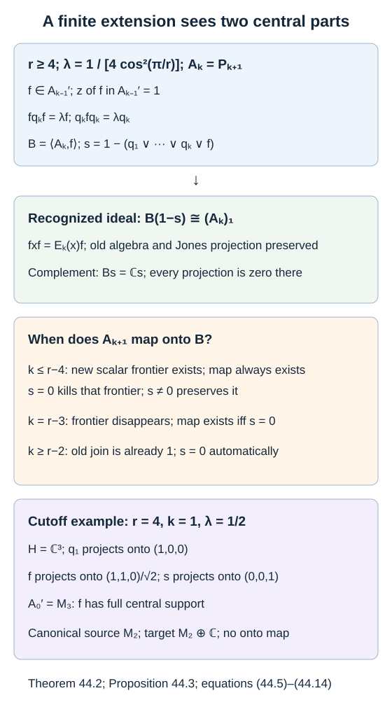

# Extending a finite projection algebra through the cutoff

Compressing by a new Jones projection determines the basic-construction part of an extension. It does not detect a common kernel on which every projection is zero. Before the end of a finite path, the canonical algebra has a scalar block that can accommodate this kernel. At the first step beyond the end, that block disappears. This is the one step at which a separate support condition is needed.

We use the full finite-dimensional recognition theorem, Theorem 8.6 of [Matrix inclusions and the Markov trace](finite-dimensional-markov-calculus.md), the path matrix units and faithful Markov trace in [Paths, local projections and a faithful trace](path-models.md), and the word reduction in [Removing a projection produces a subfactor](tail-inclusions.md). [Why the discrete projection algebra is unique](discrete-projection-algebras.md) proves a stronger conclusion for an infinite nondegenerate sequence. The present theorem treats a single finite extension on an arbitrary Hilbert space.

Construction and proof sources: The actual path matrix units, projection relations and faithful trace are proved in Propositions 9.1–9.2 and Theorem 9.3 and Theorems 9.4–9.5 of [Paths, local projections and a faithful trace](path-models.md). Lemma 44.1 and Theorem 44.2 below use Theorem 8.6 of [Matrix inclusions and the Markov trace](finite-dimensional-markov-calculus.md) to recognize the basic-construction part and separately account for the common kernel. Proposition 44.3 supplies the cutoff obstruction, and Proposition 44.4 explains the infinite-continuation condition. Takesaki, Lemma XIX.3.14, printed pages 460–462 is the compared finite-extension statement; the support correction and scalar endpoint are retained here.

## The earlier compression is faithful

Fix \(r\geq4\), and put
\[
\delta=2\cos(\pi/r),\qquad \lambda=\delta^{-2}.
\tag{44.1}
\]
Let \(P_j\) be the length-\(j\) path algebra of the endpoint-rooted graph \(A_{r-1}\), whose vertex distances are \(0,\ldots,r-2\). Write
\[
A_k=P_{k+1}=C^*(1,q_1,\ldots,q_k),\qquad A_0=\mathbb C1.
\tag{44.2}
\]
The generators in this formula are the canonical path projections. The canonical trace is faithful at every finite level.

For a represented algebra \(D\), the **central support** \(z_{D'}(f)\) of a projection \(f\in D'\) is the smallest central projection of \(D'\) dominating \(f\). Support in this commutant is different from support in the algebra generated by \(D\) and \(f\).

**Lemma 44.1.** Let a finite-dimensional algebra \(D\) act faithfully and unitally on an arbitrary Hilbert space. For a projection \(f\in D'\),
\[
z_{D'}(f)=1
\quad\Longleftrightarrow\quad
\bigl[d\mapsto df\bigr]\text{ is faithful on }D.
\tag{44.3}
\]

**Proof.** Decompose the representation as
\[
H=\bigoplus_i\mathbb C^{d_i}\otimes K_i,\quad
D=\bigoplus_i M_{d_i}\otimes1_{K_i},\quad
D'=\bigoplus_i1_{d_i}\otimes B(K_i).
\]
Every \(K_i\) is nonzero by faithfulness, with no restriction on its dimension. Write \(f=\bigoplus_i1_{d_i}\otimes f_i\). Each \(B(K_i)\) is a factor, so the central support of \(f\) is one precisely when every \(f_i\ne0\). The representation of \(M_{d_i}\) on \(\mathbb C^{d_i}\otimes f_iK_i\) is faithful precisely when \(f_i\ne0\). This proves both implications. \(\square\)

Let \(E_k:A_k\to A_{k-1}\) preserve the canonical trace. Word reduction gives
\[
A_k=A_{k-1}+\operatorname{span}(A_{k-1}q_kA_{k-1}).
\]
For \(a,b,c\in A_{k-1}\), the path Markov identity gives
\[
E_k(a)=a,\qquad E_k(bq_kc)=\lambda bc.
\tag{44.4}
\]
Indeed Theorem 9.5 gives \(E_{A_{k-1}}^{A_k}(q_k)=\lambda1\), and bimodularity gives the second formula. The statement for \(k=1\) uses the trace from \(A_1=P_2\) to the scalar \(A_0=P_1\). Since \(E_k\) is a faithful expectation, (44.4) is a well-defined formula even when a reduced word has several different expressions.

## The exact finite extension theorem

**Theorem 44.2.** Represent \(A_k\), \(k\geq1\), faithfully and unitally on a nonzero Hilbert space \(H\). Suppose a nonzero projection \(f\) satisfies
\[
f\in A_{k-1}',\qquad z_{A_{k-1}'}(f)=1,\qquad
fq_kf=\lambda f,\qquad q_kfq_k=\lambda q_k.
\tag{44.5}
\]
Put
\[
B=C^*(A_k,f),\qquad
s=1-(q_1\vee\cdots\vee q_k\vee f).
\tag{44.6}
\]
Then \(B\) is finite dimensional. If \((A_k)_1\) denotes the basic construction of \(A_{k-1}\subseteq A_k\) with its canonical trace, then
\[
B(1-s)\cong(A_k)_1,\qquad Bs=\mathbb Cs.
\tag{44.7}
\]
The first isomorphism sends \(x(1-s)\) to \(x\), for \(x\in A_k\), and sends \(f\) to the Jones projection.

There exists a unital onto *-homomorphism
\[
\Phi:A_{k+1}\longrightarrow B,\qquad
\Phi(x)=x\ (x\in A_k),\quad \Phi(q_{k+1})=f,
\tag{44.8}
\]
exactly in the following cases:

| Stage | Condition and conclusion |
| --- | --- |
| \(1\leq k\leq r-4\) | The map always exists. It is an isomorphism if \(s\ne0\); if \(s=0\), its kernel is exactly the canonical new scalar frontier block. |
| \(k=r-3\) | The map exists if and only if \(s=0\), and then is an isomorphism. |
| \(k\geq r-2\) | One has \(s=0\) automatically, and the map is an isomorphism. |

The map, when it exists, is unique. For \(r=4\), the first range of stages is empty.

**Proof.** For a reduced word \(x=a+\sum b_jq_kc_j\), commutation and the first sandwich relation give
\[
fxf=\left(a+\lambda\sum_jb_jc_j\right)f=E_k(x)f.
\tag{44.9}
\]
Lemma 44.1 makes \(a\mapsto af\) faithful on \(A_{k-1}\). Thus Theorem 8.6 applies to the finite inclusion \(A_{k-1}\subseteq A_k\), with its faithful canonical trace and compression (44.9). In particular \(B\) is finite dimensional. If \(z=z_B(f)\), that theorem gives
\[
Bz\cong(A_k)_1,\qquad B(1-z)=A_k(1-z).
\tag{44.10}
\]
It identifies \(xz\) with the canonical left action of \(x\in A_k\), and \(f\) with the Jones projection. Consequently the old algebra is represented faithfully on this part; no old matrix block is lost.

Write \(t=1-z\), which is central in \(B\). Since \(tf=0\), the second sandwich relation gives
\[
\lambda tq_k=tq_kfq_k=0.
\]
The adjacent relations then give, successively,
\(\lambda tq_i=tq_iq_{i+1}q_i=0\) for \(i=k-1,\ldots,1\). All the generators vanish on \(tH\), so \(Bt=\mathbb Ct\).

Conversely, the orthogonal projection \(s\) onto the common kernel of \(q_1,\ldots,q_k,f\) commutes with each of these selfadjoint projections. Since their algebra is finite dimensional, their join and its complement belong to \(B\); hence \(s\) is central in \(B\). It annihilates \(f\), so \(sf=0\) implies \(s\leq1-z=t\). We already proved that \(t\) is in that common kernel, giving \(s=t\). This proves (44.7), including the identity in (44.6).

Apply the same recognition argument to the canonical new path projection \(q_{k+1}\in A_{k+1}\). Its compression is (44.9). Its multiplication map on \(A_{k-1}\) is faithful: for \(a\in A_{k-1}\), Theorem 9.5 gives
\[
\tau(a^*a q_{k+1})=\lambda\tau(a^*a);
\]
thus \(aq_{k+1}=0\) implies \(a=0\). This identifies the canonical ideal generated by \(q_{k+1}\) with \((A_k)_1\), respecting the old algebra and the projection.

Identity (9.11) identifies that ideal directly with all the endpoint blocks reachable at length \(k\). At length \(k+2\), the only possible additional endpoint is vertex \(k+2\), reached by the unique strictly increasing path. Its block is scalar, and every \(q_i\), \(i\leq k+1\), is zero on it. It exists precisely when \(k+2\leq r-2\). If its identity is \(c\), use \(c=0\) when this inequality fails. We have proved the generator-preserving decomposition
\[
A_{k+1}(1-c)\cong(A_k)_1,\qquad
A_{k+1}c=\mathbb Cc,\qquad
c\ne0\ \Longleftrightarrow\ k\leq r-4.
\tag{44.11}
\]

When \(c\ne0\), define \(\Phi\) by the basic-construction isomorphism on \(1-c\) and by \(\alpha c\mapsto\alpha s\) on the scalar block. If \(s=0\), this second map is zero. If \(s\ne0\), the restriction of each old \(x\in A_k\) to \(sH\) is its all-zero-generator character; the same character is its restriction to \(c\). Thus the combined map fixes every old \(x\), sends \(q_{k+1}\) to \(f\), and sends the identity to \(1-s+s=1\). It is onto by (44.7), with exactly the kernel and isomorphism properties stated.

When \(c=0=s\), the basic-construction isomorphism alone gives (44.8). When \(c=0\) but \(s\ne0\), no such map exists: the canonical projections \(q_1,\ldots,q_{k+1}\) join to one, whereas their proposed images join to \(1-s<1\). A unital *-homomorphism between finite-dimensional algebras preserves a finite join of projections. For example, that join is the support projection of their sum, obtained by applying a polynomial that is zero at zero and one at each nonzero spectral value. This proves necessity without assuming injectivity.

Finally \(A_k\) itself has a common-kernel scalar block only when \(k+1\leq r-2\), by the same path argument. If \(k\geq r-2\), its \(k\) old projections already join to one in every faithful representation. Equation (44.6) therefore forces \(s=0\). The unique stage at which \(c=0\) but this old common kernel can still be present is \(k=r-3\). The table follows. Uniqueness of \(\Phi\) follows from the generating list in (44.8). \(\square\)

For the endpoint \(r=3\), all the canonical algebras are scalar and each \(q_k=1\). Here \(\lambda=1\), and \(q_kfq_k=\lambda q_k\) forces \(f=1\). The finite extension is therefore the scalar identity map, at every stage.

*Figure 44.1. The parameter, stage inequalities, two central parts and the explicit \(r=4,\ k=1\) obstruction are those of Theorem 44.2 and Proposition 44.3. Full support in the earlier commutant determines the basic-construction part; it allows the extra common-kernel block at the cutoff. Coordinates and diagram are authored here. The path construction used here is proved in Propositions 9.1–9.2 and Theorems 9.3–9.5 of [Paths, local projections and a faithful trace](path-models.md); the compared finite-extension statement is [Takesaki], Lemma XIX.3.14. [Editable figure source](figures/finite-extension-cutoff.py).*

## An extra line satisfies the hypotheses

**Proposition 44.3.** At each cutoff \(k=r-3\), \(r\geq4\), the hypotheses (44.5) allow \(s\ne0\). Thus this condition cannot be deduced from full support in \(A_{k-1}'\).

**Proof.** The old algebra \(A_k=P_{r-2}\) still has its scalar frontier character \(\chi\), with \(\chi(q_i)=0\). Represent the canonical next algebra \(A_{k+1}=P_{r-1}\) faithfully on a finite-dimensional space \(H_0\), and represent \(A_k\) on \(H_0\oplus\mathbb C\) by
\[
x\longmapsto x|_{H_0}\oplus\chi(x),\qquad
f=q_{k+1}|_{H_0}\oplus0.
\tag{44.12}
\]
This representation of \(A_k\) is faithful because its first component is. Both sandwiches and commutation hold on the first component and are zero on the second. The map \(a\mapsto af\) is faithful on \(A_{k-1}\), by the canonical Markov trace calculation in the proof of Theorem 44.2. Lemma 44.1 gives \(z_{A_{k-1}'}(f)=1\), including in this enlarged representation.

The common kernel in \(H_0\) is zero because the canonical new frontier has disappeared. The extra line is exactly the common kernel in the enlarged representation. Its projection is in \(B\) as a complement of a finite join, so
\[
B\cong A_{k+1}\oplus\mathbb C,\qquad s=0\oplus1\ne0.
\]
The necessity part of Theorem 44.2 excludes the required onto homomorphism. \(\square\)

For \(r=4,\ k=1\), this is visible in rational matrices on \(\mathbb C^3\):
\[
q_1=\begin{pmatrix}1&0&0\\0&0&0\\0&0&0\end{pmatrix},
\qquad
f=\frac12\begin{pmatrix}1&1&0\\1&1&0\\0&0&0\end{pmatrix},
\qquad s=E_{33}.
\tag{44.13}
\]
Both are nonzero projections, and \(q_1fq_1=q_1/2,\ fq_1f=f/2\). The old algebra \(A_1=\mathbb Cq_1\oplus\mathbb C(1-q_1)\) is represented faithfully. Since \(A_0' = B(\mathbb C^3)\) is a factor, \(f\) has full central support there. Nevertheless
\[
A_2=P_3=M_2,\qquad
C^*(1,q_1,f)=M_2\oplus\mathbb C.
\tag{44.14}
\]
To verify the target equality, \(2q_1f-q_1=E_{12}\); its adjoint and their products give all matrix units on the first two coordinates, and \(1-E_{11}-E_{22}=E_{33}\). A quotient of the simple algebra \(M_2\) cannot be this five-dimensional algebra. Equivalently the canonical join is one, while the target join is \(E_{11}+E_{22}\).

This identifies a precise correction to [Takesaki], Lemma XIX.3.14, printed pages 460–462: even with its discrete parameter corrected, the assertion needs the cutoff support condition in Theorem 44.2. The proof's first step explicitly allows both \(M_2\) and \(M_2\oplus\mathbb C\). For its \(n=3\), only \(M_2\) is the canonical next algebra. The example addresses that finite statement; it does not contradict the infinite nondegenerate uniqueness theorem.

## The parameter and the infinite continuation

There is a separate parameter issue in the same printed statement. With the source notation \(n=r-1\), its two displayed coefficients are \(1/(4\cos^2(1/(n+1)))\), whereas its proof and canonical construction use
\[
\lambda=\frac1{4\cos^2(\pi/(n+1))}.
\tag{44.15}
\]
The missing \(\pi\) changes the hypothesis mathematically. For \(n=3\), set
\[
t=\frac1{4\cos^2(1/4)},\qquad
p=\begin{pmatrix}1&0\\0&0\end{pmatrix},\qquad
g=\begin{pmatrix}t&\sqrt{t(1-t)}\\
\sqrt{t(1-t)}&1-t\end{pmatrix}.
\tag{44.16}
\]
Since \(0<1/4<\pi/4\), strict monotonicity of cosine gives \(1/4<t<1/2\). The matrix \(g\) is the projection onto the unit vector \((\sqrt t,\sqrt{1-t})\). Thus \(pgp=tp,\ gpg=tg\), and \(g\) has full central support in the earlier scalar algebra's commutant \(M_2\). The old two-summand algebra is faithful. A map from the canonical \(A_2\) fixing \(p\) and sending its next projection to \(g\) would preserve its \(1/2\) sandwich relation, contradicting \(t\ne1/2\). This example isolates the parameter discrepancy even with no extra target kernel. Repairing (44.15) and repairing the cutoff support are distinct requirements.

**Proposition 44.4.** If the projections in a cutoff extension satisfying (44.5) are the initial segment of an infinite sequence at the same parameter, then their common kernel \(s\) annihilates every later projection. Consequently an infinite nondegenerate continuation forces \(s=0\).

**Proof.** The initial list \(q_1,\ldots,q_{r-3},f\) has \(r-2\) projections. Put \(q_{r-2}=f\). Its common-kernel projection is the recursively constructed \(f_{r-1}\) of Lemma 13.1; that recursion is the largest joint-kernel projection and uses only these generators. In an infinite continuation, identity (13.4) at \(n=r-1\) reads
\[
U_{r-1}sU_{r-1}
=\frac{[r]}{[r-1]}f_{r-2}U_{r-1}=0,\qquad U_j=\delta q_j.
\]
Hence \(sU_{r-1}=0\). Every still later generator commutes with \(s\) by distance from all its defining generators. The adjacent relations successively force \(sq_j=0\) for all \(j\geq r\), as in Lemma 13.1. Thus \(s\) annihilates the whole sequence. If its range projections join to one, \(s=0\). \(\square\)

Theorem 13.4 therefore has exactly the extra information needed at the critical finite step. It also ensures that every earlier scalar frontier actually occurs, so all its finite maps are isomorphisms. Theorem 44.2 assumes only a single extension and consequently allows an earlier frontier to be killed.

## Exercises

**Exercise 44.1 — introductory.** For \(r=6\), list the stages at which the target can lose a canonical scalar frontier, the critical stage, and the stages at which the join condition is automatic.

**Solution.** Here \(r-4=2\). At \(k=1,2\), the source \(A_{k+1}=P_{k+2}\) has its new scalar frontier, and a target with \(s=0\) is the quotient killing just that block. At \(k=3\), the canonical new frontier is absent but the old \(A_3=P_4\) still has one: \(s=0\) is necessary and sufficient. At every \(k\geq4\), the old projections already join to one, so \(s=0\) follows from faithfulness.

**Exercise 44.2 — intermediate.** For \(r=4,\ k=1\), use the matrices (44.13) to verify compression on all of \(A_1\), and show why faithful compression on \(A_0\) does not give full support in \(B\).

**Solution.** Write \(x=a q_1+b(1-q_1)\). Direct multiplication gives \(fxf=(a+b)f/2\). The canonical expectation to \(A_0=\mathbb C1\) is \(E_1(x)=(a+b)1/2\). Multiplication by \(f\) is faithful on scalars, since \(f\ne0\). But \(E_{33}\) is a nonzero central projection of the generated \(B\) and annihilates \(f\). Thus its central support in \(B\) is \(E_{11}+E_{22}\), even though its central support in \(A_0'=M_3\) is one.

**Exercise 44.3 — intermediate.** Suppose \(r\geq5,\ k=1\). Represent \(A_1=\mathbb C^2\) on \(\mathbb C^2\), with \(q_1=E_{11}\), and use the matrix \(g\) from (44.16) with \(t=\lambda\). Describe the map in (44.8).

**Solution.** Here \(0<\lambda<1\). Both sandwiches hold and full support in the scalar commutant is automatic. The two projection ranges span \(\mathbb C^2\), so \(s=0\). Their product gives a nonzero multiple of \(E_{12}\) after subtracting its \(E_{11}\) component, hence \(B=M_2\). Since \(k=1\leq r-4\), the canonical \(A_2=P_3=M_2\oplus\mathbb C\) has a scalar frontier. The map is the quotient onto its \(M_2\) part, followed by the generator-preserving isomorphism to these two matrices. Its scalar kernel is nonzero. Faithfulness of the old algebra thus does not imply faithfulness of the new extension map.

**Exercise 44.4 — advanced.** In (44.13), can a faithful tracial state \(\sigma\) on \(B\) extend the canonical trace on \(A_1\) and satisfy \(\sigma(f)=\lambda=1/2\)?

**Solution.** Write \(\sigma(X,c)=w\operatorname{Tr}_2(X)+vc\), where faithfulness requires \(w,v>0\) and normalization requires \(2w+v=1\). The old canonical value \(\sigma(q_1)=1/2\) forces \(w=1/2\), since \(q_1\) has rank one in the matrix summand and zero scalar component. Normalization then forces \(v=0\), a contradiction. Also \(f\) has the same rank-one trace \(w\). Thus even extension of the old canonical trace already rules out a faithful trace on this enlarged algebra. There is a nonfaithful tracial state with \(w=1/2,v=0\); the failed property is faithfulness, not positivity or the compression formula.

**Exercise 44.5 — advanced.** Retain the hypotheses (44.5) and additionally require \(z_B(f)=1\). Which stages necessarily give an isomorphism, and which give a proper quotient?

**Solution.** Equation (44.10) gives \(s=1-z_B(f)=0\). For \(k\leq r-4\), the canonical next algebra still has a nonzero scalar frontier while the target has none, so the map is a proper quotient with exactly that scalar kernel. For every \(k\geq r-3\), neither algebra has this complement, and their common basic-construction part gives an isomorphism. Full support in the target therefore removes a target block; it does not assert that every canonical source block survives.

## References

- Vaughan F. R. Jones, [*Index for subfactors*](https://doi.org/10.1007/BF01389127), Inventiones Mathematicae 72 (1983), 1–25.
- Masamichi Takesaki, [*Theory of Operator Algebras III*](https://doi.org/10.1007/978-3-662-10453-8), Springer, 2003, Chapter XIX, Lemma 3.14.

*Written by GPT-6.1 Sol (OpenAI), Ultra reasoning effort, October 2026. Self-checked by the writing AI. Public domain (CC0).*
