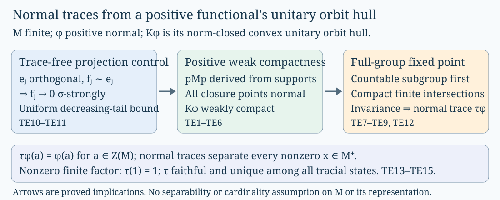

# Finite algebras and normal traces

Every finite von Neumann algebra has enough bounded normal traces to detect its nonzero positive elements. Every nonzero finite factor consequently has a faithful normal normalized trace, unique even among tracial states that were not initially assumed normal. We construct the traces by taking a fixed point in a positive normal functional's unitary orbit hull. The compactness and fixed-point arguments are proved below with no separability or representation-cardinality restriction.

## Prerequisites and the trace-free starting point

The construction starts with normal vector functionals and finite projections, before assuming any scalar trace. The exact preceding arguments used here are:

| Symbol | Complete programme argument used |
| --- | --- |
| UE | Universal enveloping von Neumann algebras, Section10 for the normal/singular splitting, Lemma11.1 for positive normal supports, Theorem11.2 and Corollary11.5 for complete additivity. The positive normality implication is expanded immediately below. |
| SP | Spatial tensor products, Proposition3.1(4), for the complete positive vector-series argument on a faithful normal representation. |
| PR | Projections and types, Lemma3.3 for orthogonal partial-isometry sums, Proposition4.4 for the parallelogram law, Theorem5.5 for central comparison, Lemma6.2(1) for finite subprojections and Proposition14.2 for equivalent complements. TE10 spells out the finite-algebra consequences. |
| HB | Hahn–Banach and Baire, Corollary2.3 for extension and norming functionals, and Theorem3.1 for Baire. |
| WT | Weak topologies and compactness, Theorem3.1 for Banach–Alaoglu and Theorem4.1 for Mazur. |

The trace construction and its three equivalent conditions are the scope of Traces on von Neumann algebras, part A, Theorem4.7. TE1–TE6 prove the positive weak compactness criterion that this construction consumes; TE7–TE9 prove its group fixed-point input. The broader arbitrary-functional compactness criterion remains available with its complete proof in Polar decomposition and predual compactness, Theorem10.2(3)⇒(1). This reading supplies an additional positive route, while preserving that broader result.

### Positive complete additivity really implies normality

Let \(N\) be any von Neumann algebra and \(\theta\in N^*_+\) completely additive on arbitrary orthogonal projection families. The already proved UE normal/singular splitting writes
\[
\theta=\theta_{\rm n}+\theta_{\rm s},\qquad
\theta_{\rm n}\in N_*^+,\quad \theta_{\rm s}\geq0\text{ singular}.
\]
The normal part is completely additive by bounded monotone convergence. Thus the positive singular part is also completely additive.

For clarity, the singular-null-projection input has the following complete argument, using precisely the UE universal-bidual splitting. Let \(z_0\) be the central projection in \(N^{**}\) with \(N_*=N^*z_0\). If a singular positive \(\rho\) and a nonzero projection \(e\) satisfy \(\rho(e)>0\), choose a normal positive \(\rho_0\) with \(\rho_0(e)>\rho(e)\), by scaling a vector functional at a nonzero vector in \(eH\). The projections \(a\leq e\) with \(\rho_0(a)\leq\rho(a)\) have a maximal member by Zorn: for a chain, positivity of \(\rho\) and normality of \(\rho_0\) give the same inequality at its supremum. That maximal member \(a\) is not \(e\), so \(r=e-a\neq0\). For each nonzero projection \(b\leq r\), maximality applied to \(a+b\) gives \(\rho(b)<\rho_0(b)\). Spectral approximation in \(rNr\) yields
\[
0\leq r\rho r\leq r\rho_0r .
\]
Pass to normal extensions on \(N^{**}\) and cut by \(1-z_0\). The left functional is singular, so this cut leaves it unchanged; the right is normal, so this cut is zero. Consequently \(r\rho r=0\), and \(\rho(r)=0\). When \(\rho(e)=0\), take \(r=e\). Thus every nonzero projection majorises a nonzero \(\rho\)-null projection.

Now fix a projection \(e\in N\) and choose a maximal orthogonal family of nonzero \(\theta_{\rm s}\)-null projections under \(e\). Its sum is \(e\), since a nonzero remainder would contain another null projection by the preceding argument. Complete additivity gives \(\theta_{\rm s}(e)=0\). Spectral norm approximation by linear combinations of projections then gives \(\theta_{\rm s}=0\). Hence \(\theta=\theta_{\rm n}\in N_*\). This is the positive part of UE11.5 with its consumed UE11.2 argument made explicit; universal biduals and the normal/singular splitting remain exact earlier programme providers.

## 1. The consumed positive compactness theorem

**TE1 (statement).** Let \(M\) be any von Neumann algebra and \(K\subseteq M_*^+\) bounded. Assume
\[
\sup_{\kappa\in K}\kappa(r_n)\longrightarrow0
\quad\text{whenever}\quad r_n\downarrow0
\]
is a sequence of projections. Then \(K\) is relatively compact in \(\sigma(M_*,M)\). If \(K\) is also norm closed and convex, it is weakly compact.

**TE2 (orthogonal families and the common corner).** For an orthogonal sequence \(e_j\), the tail projections
\[
r_n=\sum_{j\geq n}e_j
\]
decrease to zero. Therefore
\[
0\leq\sup_{\kappa\in K}\kappa(e_n)
 \leq\sup_{\kappa\in K}\kappa(r_n)\longrightarrow0.
\tag{TE2.1}
\]

Let
\[
p=\bigvee_{\kappa\in K}s(\kappa),
\]
using normal-positive supports from UE11.1; the zero functional has support zero. Every \(\kappa\in K\) satisfies \(\kappa(x)=\kappa(pxp)\). If \(p=0\), then \(K\) consists of zero functionals and the conclusion follows. Suppose \(p\neq0\).

For every nonzero projection \(e\leq p\), some \(\kappa\in K\) has \(\kappa(e)>0\). Otherwise \(e\leq1-s(\kappa)\) for every \(\kappa\), by UE11.1, giving \(e\leq1-p\), a contradiction. Let \((e_i)_{i\in I}\) be any orthogonal family of nonzero projections under \(p\), and put
\[
b_i=\sup_{\kappa\in K}\kappa(e_i)>0 .
\]
For each positive integer \(m\), the set \(\{i:b_i\geq1/m\}\) is finite: an infinite set would supply an orthogonal sequence contradicting (TE2.1). Their countable union covers \(I\). Thus **every orthogonal family of nonzero projections of \(pMp\) is countable**. This property was derived from \(K\), not assumed for \(M\). No global faithful state has been chosen.

**TE3 (the entire weak-star closure).** Let \(L\) be the \(\sigma(M^*,M)\)-closure of \(K\) in \(M^*\). It is compact by boundedness and Banach–Alaoglu. Every \(\psi\in L\) is positive and satisfies
\[
\psi(x)=\psi(pxp),\qquad
0\leq\psi(r_n)\leq\sup_{\kappa\in K}\kappa(r_n)\longrightarrow0.
\tag{TE3.1}
\]
Each assertion passes to the closure by continuity of the relevant evaluation at a fixed element of \(M\). The empty \(K\) case is immediate and can be omitted from the rest.

**TE4 (complete additivity in the corner).** Restrict \(\psi\) to \(pMp\). Any orthogonal family of its nonzero projections is countable, by TE2. For such a family \((e_j)\), with sum \(q\leq p\), let
\[
t_n=q-\sum_{j<n}e_j\downarrow0 .
\]
Equation (TE3.1) gives
\[
\psi(q)=\lim_n\sum_{j<n}\psi(e_j).
\]
Finite families require only linearity; zero projections do not affect the sum. This proves complete additivity for **every** orthogonal family in \(pMp\), not just a preselected sequence. The positive complete-additivity proof in the prerequisite discussion above, equivalently the actual UE11.5 provider, makes \(\psi|_{pMp}\) normal.

**TE5 (normal extension to \(M\)).** Represent \(M\) faithfully and normally on \(H\), with arbitrary dimension. By the complete positive vector-functional proof SP3.1(4), normality on the corner gives vectors \(\eta_j\in pH\) with
\[
\psi(y)=\sum_j\langle y\eta_j,\eta_j\rangle
 \quad(y\in pMp),\qquad
\sum_j\|\eta_j\|^2=\psi(p)<\infty .
\]
Hence
\[
\psi(x)=\psi(pxp)
 =\sum_j\langle x\eta_j,\eta_j\rangle\quad(x\in M)
\]
is normal on \(M\). This proves \(L\subseteq M_*\). The restricted \(\sigma(M^*,M)\) topology is exactly \(\sigma(M_*,M)\), so \(L\) is a weakly compact subset of \(M_*\) containing \(K\). This proves relative compactness.

**TE6 (closed convex hulls).** A norm-closed convex \(K\) is weakly closed by the actual Mazur proof WT4.1. It is therefore a weakly closed subset of the compact \(L\), and is weakly compact. \(\square\)

This is the full positive criterion that AT4.7 consumes, with arbitrary algebra cardinality. It neither replaces nor falsely certifies the additional nonpositive assertions of PD10.2.

## 2. The exact fixed-point theorem, with complete proof

**TE7 (statement and countable subgroup reduction).** Let \(E\) be a real or complex Banach space, let \(Q\subseteq E\) be nonempty, convex and weakly compact, and let \(G\) be a group of linear isometries of \(E\) with \(gQ\subseteq Q\) for every \(g\in G\). Then \(Q\) contains a point fixed by all of \(G\).

Because inverses belong to the group, \(gQ=Q\), and each action is a weak homeomorphism. Fix a countable subgroup \(\Gamma\subseteq G\) and a point \(x_0\in Q\). Put
\[
C_0=\overline{\operatorname{co}}^{\|\cdot\|}
        \{\gamma x_0:\gamma\in\Gamma\},\qquad
E_0=\overline{\operatorname{span}}^{\|\cdot\|}C_0 .
\]
The countable orbit gives norm separability of \(E_0\). Mazur gives weak closedness of \(C_0\), so \(C_0\) is a nonempty weakly compact \(\Gamma\)-invariant subset of \(Q\). The weak topology of \(E_0\) is inherited from \(E\), because each bounded functional on \(E_0\) extends to \(E\) by HB2.3(1).

Zorn's lemma and compactness give a minimal nonempty weakly compact \(\Gamma\)-invariant set \(K\subseteq C_0\), without requiring it to be convex: every decreasing chain has nonempty compact invariant intersection. For every \(x\in K\), the weak closure of \(\Gamma x\) is again such an invariant subset, and so equals \(K\). Thus every orbit is weakly dense in \(K\).

**TE8 (why the minimal set is norm compact).** If \(E_0=0\), the fixed point is already zero. Otherwise choose a sequence \((u_j)\) dense in the unit sphere of \(E_0\). HB2.3(2) provides \(f_j\in E_0^*\) with \(\|f_j\|=1\) and \(f_j(u_j)=1\). These functionals separate points: for a unit \(v\), choose \(u_j\) with \(\|v-u_j\|<1/2\), giving \(|f_j(v)|>1/2\).

On the weakly compact, bounded \(K\), the coordinate map \(x\mapsto(f_j(x))_j\) is a continuous injection into a countable product of compact scalar disks. A continuous injection from compact to Hausdorff is a homeomorphism onto its image. Thus \(K\) with its weak topology is a compact metrizable space, and has a compatible complete metric. The Baire theorem HB3.1 therefore applies to \(K\).

Fix \(\varepsilon>0\). A countable norm-dense set of centres in \(E_0\) gives a countable cover of \(K\) by intersections with closed norm balls of radius \(\varepsilon/2\). Closed norm balls are weakly closed, since
\[
\|x-a\|=\sup_{\|f\|\leq1}|f(x-a)|
\]
by HB2.3. Baire gives a nonempty relatively weakly open \(U\subseteq K\) contained in one of these balls, so \(\operatorname{diam}_{\|\cdot\|}U\leq\varepsilon\).

Every orbit meets \(U\), because its weak closure is \(K\). Hence the sets \(\gamma U\), \(\gamma\in\Gamma\), cover \(K\). Weak compactness supplies a finite subcover. Since each \(\gamma\) is an isometry, each set in this subcover has norm diameter at most \(\varepsilon\); choosing one point in each gives a finite norm \(\varepsilon\)-net in \(K\). This holds for every \(\varepsilon>0\), so \(K\) is norm totally bounded. It is norm closed, because it is weakly closed, and \(E\) is complete. Therefore \(K\) is norm compact.

The norm-closed convex hull
\[
V=\overline{\operatorname{co}}^{\|\cdot\|}K
\]
is also norm compact. Indeed, a finite norm \(\varepsilon\)-net in \(K\) approximates every convex combination within \(\varepsilon\); the convex hull of the finite net is compact in its finite-dimensional span. This gives total boundedness of \(\operatorname{co}K\), and its closure is complete. Also \(V\subseteq C_0\subseteq Q\), and \(V\) is \(\Gamma\)-invariant.

**TE9 (a compact convex invariant set has an invariant singleton).** By Zorn and norm compactness, choose a minimal nonempty closed convex \(\Gamma\)-invariant subset \(A\subseteq V\). If its diameter \(D\) were positive, compactness of \(A\times A\) would give two points at distance \(D\). Choose \(0<\varepsilon<D\), a finite norm \(\varepsilon\)-net \(x_1,\ldots,x_n\) in \(A\), and let
\[
z=\frac1n\sum_{i=1}^n x_i,\qquad
r=\frac{(n-1)D+\varepsilon}{n}<D .
\]
For every \(y\in A\), some \(x_i\) is within \(\varepsilon\) of \(y\), and all other distances are at most \(D\). Therefore
\[
\|z-y\|\leq\frac1n\sum_i\|x_i-y\|\leq r .
\]
Consequently
\[
A_r=\{a\in A:\sup_{y\in A}\|a-y\|\leq r\}
\]
is nonempty. It is closed, convex and \(\Gamma\)-invariant: convexity is the triangle inequality, and invariance follows from \(\gamma A=A\) and the isometry property. It is a proper subset of \(A\), because either endpoint of a diameter-realizing pair has supremum distance \(D>r\). This contradicts minimality. Thus \(D=0\), and \(A\) is a singleton fixed by \(\Gamma\).

Finally, for each finite \(F\subseteq G\), the subgroup generated by \(F\) is countable, so the preceding proof supplies a point of \(Q\) fixed by every member of \(F\). For each \(g\), the set
\[
\operatorname{Fix}_Q(g)=\{x\in Q:gx=x\}
\]
is weakly closed. These sets have the finite intersection property. Compactness of \(Q\) gives a point in their intersection over **all** \(g\in G\). This proves TE7 for arbitrary groups and arbitrary Banach spaces. \(\square\)

The finite-net inequality is the strict diameter reduction; merely choosing a point of minimal norm in \(Q\) would not prove the result. Neither strict convexity of the norm nor reflexivity of \(E\) is assumed.

The human source consulted for the fixed-point background was I. Namioka and E. Asplund, [A geometric proof of Ryll-Nardzewski's fixed point theorem](https://doi.org/10.1090/S0002-9904-1967-11779-8), Bulletin of the American Mathematical Society73(1967),443–445. Its broader locally convex semigroup theorem is not a premise of this proof. TE7–TE9 are independently expressed in the exact group/isometry scope consumed by AT4.7.

## 3. Projection control before constructing a trace

**TE10 (equivalent projections of an orthogonal sequence disappear).** Let \(M\) be a finite von Neumann algebra. If \((e_n)\) is an orthogonal sequence of projections and \(f_n\sim e_n\), then \(f_n\to0\) \(\sigma\)-strongly.

Here are the complete trace-free steps needed from AT4.1/4.4. They use only projection comparison, orthogonal sums and finiteness.

**(a) Equivalent complements in a finite algebra.** In a finite algebra \(P\), suppose \(e\sim f\). Apply central comparison PR5.5 to \(1-e\) and \(1-f\), giving a central projection \(w\) with
\[
w(1-e)\precsim w(1-f),\qquad
(1-w)(1-f)\precsim(1-w)(1-e).
\]
Choose \(h\leq w(1-f)\) equivalent to \(w(1-e)\). Equivalence is preserved by central cuts, so \(we\sim wf\). Orthogonal additivity gives
\[
w=we+w(1-e)\sim wf+h\leq w.
\]
The projection \(w\leq1\) is finite by PR6.2(1). Hence \(wf+h=w\), and \(h=w(1-f)\). This proves equivalent complements on the \(w\) cut; the reverse comparison proves the same on the \(1-w\) cut. Orthogonal additivity gives \(1-e\sim1-f\). This is the finite-algebra specialization of the actual PR14.2 proof and does not consume a trace or the theorem that finite projections form a lattice.

**(b) Increasing sequence under a fixed projection.** Suppose \(a_n\uparrow a\) in a finite algebra \(P\), and \(a_n\precsim b\) for every \(n\). Put
\[
d_0=a_1,\qquad d_n=a_{n+1}-a_n\quad(n\geq1).
\]
Construct orthogonal \(c_n\leq b\) with \(c_n\sim d_n\). Choose \(c_0\sim a_1\) under \(b\). If \(c_0,\ldots,c_{n-1}\) have been chosen, their sum \(b_n\) is equivalent to \(a_n\). Choose a partial isometry \(v\) with \(v^*v=a_{n+1}\) and \(vv^*\leq b\). Then
\[
b'_n=va_nv^*\sim a_n\sim b_n,\qquad
vd_nv^*\leq b-b'_n.
\]
In the finite corner \(bPb\), part(a) gives \(b-b'_n\sim b-b_n\). A partial isometry implementing this equivalence transports \(vd_nv^*\) to a projection \(c_n\leq b-b_n\), orthogonal to all previous \(c_j\), and equivalent to \(d_n\). The strong sum of the corresponding orthogonal partial isometries has initial projection \(\sum_nd_n=a\) and final projection \(\sum_nc_n\leq b\). Hence \(a\precsim b\). If \(b=0\), each \(a_n=0\), and the assertion is immediate.

**(c) Joins and tails.** If \(a_1\precsim b_1\), \(a_2\precsim b_2\) and \(b_1\perp b_2\), the parallelogram law gives
\[
a_1\vee a_2-a_2\sim a_1-a_1\wedge a_2
 \precsim b_1 .
\]
Adding this projection orthogonally to \(a_2\precsim b_2\) gives
\[
a_1\vee a_2\precsim b_1+b_2.
\]
Induction and part(b) therefore give
\[
F_m=\bigvee_{k\geq m}f_k
 \precsim E_m=\sum_{k\geq m}e_k .
\]
Choose \(F'_m\leq E_m\) equivalent to \(F_m\). Part(a) gives
\[
1-F_m\sim1-F'_m\geq1-E_m,
\]
so \(1-E_m\precsim1-F_m\). Put \(F=\bigwedge_mF_m\). Since \(1-E_m\uparrow1\) and
\[
1-E_m\precsim1-F_m\leq1-F,
\]
part(b) gives \(1\precsim1-F\). Finiteness of \(1\) forces \(F=0\). Thus \(F_m\downarrow0\), and \(0\leq f_m\leq F_m\).

For every positive normal \(\omega\), monotone convergence gives
\[
0\leq\omega(f_m^*f_m)=\omega(f_m)
 \leq\omega(F_m)\longrightarrow0 .
\]
These are exactly the defining seminorms for \(\sigma\)-strong convergence, by the actual predual/vector-functional providers. Hence \(f_m\to0\) \(\sigma\)-strongly. \(\square\)

No step in TE10 assumes a scalar trace, a centre-valued trace, a faithful normal state, or a countable orthogonal decomposition of the identity.

## 4. Complete finite-algebra and finite-factor trace construction

**TE11 (the orbit hull is weakly compact).** Let \(M\) be any finite von Neumann algebra and \(\varphi\in M_*^+\). Define
\[
(u\cdot\psi)(x)=\psi(u^*xu),\qquad
K_\varphi=\overline{\operatorname{co}}^{\|\cdot\|}
       \{u\cdot\varphi:u\in\mathcal U(M)\}.
\]
Inner conjugation preserves normality; directly, the positive vector series SP3.1(4) replaces each vector \(\eta_j\) by \(u\eta_j\). For arbitrary normal functionals the same follows by the two-vector series. Each map \(u\cdot\) is a linear isometry of \(M_*\), with inverse \(u^*\cdot\), and
\[
u\cdot(v\cdot\psi)=(uv)\cdot\psi .
\]
It preserves the norm-closed convex \(K_\varphi\). Every member of that set is positive and has value \(\varphi(1)\) at1, hence norm \(\varphi(1)\). The positive cone and that evaluation level are norm closed. Thus \(K_\varphi\) is nonempty and bounded.

For any orthogonal projection sequence \((e_n)\), the supremum of \(\psi(e_n)\) over the hull equals its supremum over the orbit: evaluation at \(e_n\) is linear, norm continuous and nonnegative on the hull. If the suprema failed to tend to zero, there would be \(\delta>0\), increasing indices \(n_j\), and unitaries \(u_j\) with
\[
\varphi(u_j^*e_{n_j}u_j)\geq\delta .
\]
But \(f_j=u_j^*e_{n_j}u_j\sim e_{n_j}\), so TE10 gives \(f_j\to0\) \(\sigma\)-strongly and then \(\varphi(f_j)\to0\). This is a contradiction. Therefore
\[
\sup_{\psi\in K_\varphi}\psi(e_n)\longrightarrow0.
\tag{TE11.1}
\]

If \(r_n\downarrow0\), the nonnegative numbers \(\sup_{\psi\in K_\varphi}\psi(r_n)\) decrease. Suppose their limit were positive and fix a positive lower bound \(\delta\). Choose \(n_1\) and \(\psi_1\in K_\varphi\) with \(\psi_1(r_{n_1})>\delta/2\). Normality gives \(n_2>n_1\) with \(\psi_1(r_{n_2})<\delta/4\). Choose \(\psi_2\) with \(\psi_2(r_{n_2})>\delta/2\), then \(n_3>n_2\) with \(\psi_2(r_{n_3})<\delta/4\), and continue. The projections
\[
e_j=r_{n_j}-r_{n_{j+1}}
\]
are mutually orthogonal and \(\psi_j(e_j)>\delta/4\), contradicting (TE11.1). Thus the hypothesis of TE1 holds. TE1–TE6 make \(K_\varphi\) weakly compact.

**TE12 (a normal trace with the same central values).** Apply TE7–TE9 to \(E=M_*\), \(Q=K_\varphi\), and the unitary action. There is \(\tau_\varphi\in K_\varphi\) with
\[
\tau_\varphi(u^*xu)=\tau_\varphi(x)
\quad(u\in\mathcal U(M),\ x\in M).
\]
It is positive and normal, and \(\tau_\varphi(1)=\varphi(1)\). Taking \(ux\) as the argument of invariance gives
\[
\tau_\varphi(xu)
 =\tau_\varphi\bigl(u^*(ux)u\bigr)
 =\tau_\varphi(ux).
\]
Every element of a unital \(C^*\)-algebra is a linear combination of at most four unitaries: for a self-adjoint contraction \(h\),
\[
v=h+i(1-h^2)^{1/2}
\]
is unitary and \(h=(v+v^*)/2\); apply this to the scaled real and imaginary parts. Linearity gives \(\tau_\varphi(xy)=\tau_\varphi(yx)\) for all \(x,y\in M\). This is a bounded finite normal trace. For \(a\in Z(M)\), each orbit member has value \(\varphi(a)\), so the convex hull and its norm closure do as well:
\[
\tau_\varphi|_{Z(M)}=\varphi|_{Z(M)}.
\tag{TE12.1}
\]

**TE13 (the full AT4.7 separation statement).** For any von Neumann algebra \(M\), the following are equivalent: (i) \(1\) is finite; (ii) bounded positive normal traces separate \(M_+\); (iii) bounded positive traces separate \(M_+\), without a normality assumption. Separation means that every nonzero \(x\in M_+\) has strictly positive value under at least one trace in the family. In the finite case the additional orbit-hull and central-value assertion is TE12.

For the proof, the support \(s=s(\tau_\varphi)\) is central. Indeed, unitary invariance and uniqueness of the normal-positive support give \(usu^*=s\) for every unitary \(u\); the four-unitary decomposition makes \(s\) commute with every element. The zero trace has support zero. UE11.1 proves that a nonzero \(\tau_\varphi\) is faithful on \(sMs\).

Given \(0\neq x\in M_+\), choose \(\xi\) with \(x\xi\neq0\), let \(\eta=x\xi\), and apply TE12 to \(\varphi=\omega_\eta|_M\). Since \(1-s\) is central, (TE12.1) gives
\[
0=\tau_\varphi(1-s)=\varphi(1-s)
 =\|(1-s)\eta\|^2 .
\]
Consequently \(sx\xi=x\xi\neq0\), and \(sx=x^{1/2}sx^{1/2}\) is a nonzero positive element of \(sMs\). Faithfulness there yields
\[
\tau_\varphi(x)\geq\tau_\varphi(sx)>0.
\]
Thus the finite normal traces separate \(M_+\), preserving the arbitrary finite-algebra scope of AT4.7.

Conversely, if finite traces, without a normality assumption, separate \(M_+\) and \(v^*v=1\), then every such trace satisfies
\[
\tau(1-vv^*)=\tau(1)-\tau(v^*v)=0.
\]
Separation gives \(vv^*=1\). Hence \(1\) is finite. Normal traces are traces, so all three original AT4.7 clauses are now proved. The \(M=0\) case is vacuous and consistent.

**TE14 (faithful normalized trace on every nonzero finite factor).** Let \(M\) be a nonzero finite factor, with arbitrary representation cardinality. Choose a unit vector in any faithful nondegenerate representation and restrict its vector state to \(M\). TE12 gives a positive normal trace \(t\) with \(t(1)=1\). The support of \(t\) is a nonzero central projection by TE13, and the factor condition makes it1. Therefore \(t\) is faithful.

There is also a useful trace-free packing proof of the last step, preserving the earlier BC argument. For any nonzero projection \(q\), factor comparison repeatedly either packs another projection equivalent to \(q\) into the remaining complement, or gives a remainder subequivalent to \(q\). Infinitely many orthogonal copies \(q_j\sim q\) are impossible: choose partial isometries from \(q_j\) to \(q_{j+1}\); their strong sum has initial projection \(r=\sum_jq_j\) and final projection \(r-q_1\), contradicting finiteness of \(r\leq1\). Hence
\[
1=q_1+\cdots+q_m+r_0,\qquad
q_j\sim q,\quad r_0\precsim q
\]
for finitely many copies and a possible zero remainder. If \(t(q)=0\), traciality and positivity give \(t(q_j)=t(r_0)=0\), contrary to \(t(1)=1\). Any nonzero positive \(x\) has a nonzero spectral projection \(q=1_{[\varepsilon,\infty)}(x)\) for some \(\varepsilon>0\), so \(t(x)\geq\varepsilon t(q)>0\). This proves faithfulness without relying on the support route.

**TE15 (uniqueness, including among nonnormal tracial states).** Retain the preceding constructed faithful normal \(t\), and let \(s\) be any tracial state on the finite factor \(M\). For each \(n\geq1\), define
\[
t_n((x_{ij}))=\frac1n\sum_{i=1}^nt(x_{ii}),\qquad
s_n((x_{ij}))=\frac1n\sum_{i=1}^ns(x_{ii}).
\]
These are tracial states of the factor \(M_n(M)\). Positivity follows by writing a positive matrix as \(Y^*Y\), and the trace identity follows by summing entries and using \(t(ab)=t(ba)\), respectively \(s(ab)=s(ba)\). The trace \(t_n\) is faithful: if \(t_n(Y^*Y)=0\), then each positive term \(t(y_{ki}^*y_{ki})\) is zero, so all entries of \(Y\) are zero. Normality is finite coordinatewise normality. The matrix algebra is a factor: commuting with its matrix units forces a central matrix to be \(a1_n\), and commuting with \(M1_n\) gives \(a\in Z(M)=\mathbb C1\).

For projections \(P,Q\) of this factor, comparison and faithfulness show
\[
t_n(P)\leq t_n(Q)\quad\Longrightarrow\quad P\precsim Q.
\]
Indeed, the reverse comparison would give \(Q\sim R\leq P\); if \(P-R\neq0\), then \(t_n(P)>t_n(R)=t_n(Q)\). Therefore either \(P\precsim Q\) already, or \(P=R\sim Q\). Traciality then implies \(s_n(P)\leq s_n(Q)\).

For any projection \(p\in M\), compare \(P=p\otimes1_n\) with \(Q\), the diagonal projection having \(k\) identity entries, \(0\leq k\leq n\). Their \(t_n\)-values are \(t(p)\) and \(k/n\), and their \(s_n\)-values are \(s(p)\) and \(k/n\). We obtain
\[
t(p)\leq k/n\ \Longrightarrow\ s(p)\leq k/n,\qquad
k/n\leq t(p)\ \Longrightarrow\ k/n\leq s(p).
\]
Rational bounds force \(s(p)=t(p)\). Spectral norm approximation gives equality on every self-adjoint element and hence on \(M\). Thus the normalized trace is unique even among all tracial states. This is the actual BC1.4a argument now placed after, rather than before, trace existence. \(\square\)

*FigureTE1.* The first arrow uses the orthogonal projection tails and sliding-hump argument of TE10–TE11. The second uses the derived common corner, complete additivity and normal extension of TE1–TE6. The last box combines the minimal-set proof with compact finite intersections for the full unitary group. The lower panel states the preserved central values and the full finite-algebra and finite-factor conclusions. The boxes are schematic logical steps. Human fixed-point background: Namioka–Asplund, pp.443–445, cited above. [Editable figure source](figures/finite-trace-existence-v3.py).

## How the center determines traces and densities

The trace construction above does not require a factor. In a general finite algebra, the center records the part of a trace that can vary. The relevant complete programme arguments are [Traces on von Neumann algebras, Theorems 5.2 and 5.5](../../OA-FOUND-REMAINDER/reader/supplements/traces-on-von-neumann-algebras-part-a-def-v-2-1-to-def-v-2-17.html#oa-fnd-ta-13), including the center-valued trace construction and its finite-trace factorization proof, and [Trace densities and noncommutative integration](../../OA-MOD/OA-MOD-TI.html#the-trace-pairing-fills-the-whole-predual), TI-01–TI-06. The latter constructs actual trace-measurable operators, proves that their integrable space is complete, and proves that trace pairing fills the whole predual. Its trace may be semifinite and its Hilbert space arbitrary. These are linked programme lessons outside this course's offline download.

**TE16 — central trace factorization and comparison.** Let \(M\) be any finite von Neumann algebra and \(Z=Z(M)\). There is a unique normalized faithful normal center-valued trace \(T_M:M\to Z\). Every finite positive trace \(\sigma\), including a trace not initially assumed normal, satisfies

\[
 \sigma(x)=\sigma|_Z(T_M(x))\qquad(x\in M).
 \tag{TE16.1}
\]

Its normality is equivalent to normality of \(\sigma|_Z\). For projections,

\[
 p\precsim q\iff T_M(p)\leq T_M(q),
 \qquad p\sim q\iff T_M(p)=T_M(q).
 \tag{TE16.2}
\]

**Proof.** Theorem 5.2 of the linked trace lesson constructs \(T_M\) on every finite algebra by its orthogonal central pieces; it assumes neither a global faithful state nor countable decomposability. Theorem 5.5 proves (TE16.1), uniqueness and the normality correspondence. Its projection comparison is Corollary 5.4, whose converse uses central comparison and faithfulness of \(T_M\). Thus both implications in (TE16.2) use the actual central order, rather than an arbitrarily chosen scalar trace.

When a faithful normal finite trace \(\tau\) is given, this \(T_M\) is the normal \(\tau\)-preserving expectation onto \(Z\) constructed in M1–M5 of [Finite traces and Jones projections](finite-traces-and-jones-projections.md). Indeed, applying (TE16.1) to the finite normal traces \(x\mapsto\tau(zx)\), for \(z\in Z_+\), gives \(\tau(zT_M(x))=\tau(zx)\). Linearity in \(z\) and the trace-pairing uniqueness in M5 identify the two maps. This identifies their actual domains and normalizations. \(\square\)

**TE17 — a normal functional on a finite center has an actual integrable density.** Let \(D\) be an abelian von Neumann algebra with faithful normal finite trace \(\nu\). For every \(\psi\in D_*^+\) there is a unique positive \(\nu\)-integrable affiliated operator \(h\) such that

\[
 \psi(a)=\nu(ha)\quad(a\in D),\qquad
 \nu(h)=\psi(1)=\|\psi\|.
 \tag{TE17.1}
\]

Here \(h\) can be unbounded; its spectral projections belong to \(D\), and the pairing is the integrable-operator pairing. For \(C\geq0\),

\[
 \psi\leq C\nu\iff 0\leq h\leq C1.
 \tag{TE17.2}
\]

In particular, a dominated normal central component has a bounded density in its original center. No change of representation or replacement of its inherited trace is needed.

**Proof.** Apply TI-06, equations (TI.19)–(TI.20), to \((D,\nu)\). That theorem is an onto isometry between the actual integrable operators and the entire predual, and identifies their positive cones. It gives (TE17.1), positivity and uniqueness. Since \(\nu(1)<\infty\), \(C1-h\) is also integrable. The inequality \(C\nu-\psi\geq0\) is equivalent, by the same positive-cone identification, to \(C1-h\geq0\). This proves both directions of (TE17.2), including \(C=0\).

For the centers in Lesson 52, \(\nu\) is the faithful finite measure in (52.6). The normal functional \(z\mapsto\operatorname{Tr}(qz)\) associated with any finite-trace projection \(q\) therefore has precisely the positive density (52.7). For a finite algebra carrying a faithful normal finite trace \(\tau\), TE16 and TE17 also give every finite normal trace in the form

\[
 \sigma(x)=\nu(hT_M(x)),\qquad \nu=\tau|_{Z(M)}.
 \tag{TE17.3}
\]

The normality assumption in TE17 matters. For example, on \(D=\ell^\infty(\mathbb N)\) with \(\nu(a)=\sum_{n\geq1}2^{-n}a_n\), a free-ultrafilter state vanishes on every coordinate projection but has value one at the unit. An integrable density with those coordinate values would vanish at every coordinate and hence have integral zero. Such a singular state has no density relative to \(\nu\). TE16 still factors a singular trace through the center, without making it normal. \(\square\)

**TE18 — expectations on integrable densities.** Let \(A\subseteq B\) be unital von Neumann algebras with a faithful normal semifinite trace \(\tau\) on \(B\), whose restriction to \(A\) is semifinite. Suppose \(E:B\to A\) is a normal trace-preserving conditional expectation. There is a unique positive contraction

\[
 E^{(1)}:L^1(B,\tau)\longrightarrow L^1(A,\tau),\qquad
 \tau(E^{(1)}(h)a)=\tau(ha)\quad(a\in A).
 \tag{TE18.1}
\]

It agrees with \(E\) on the bounded trace ideal, preserves the integral and satisfies

\[
 \|E^{(1)}(h)\|_1\leq\|h\|_1,
 \qquad \tau(E^{(1)}(h))=\tau(h).
 \tag{TE18.2}
\]

**Proof.** Restriction of normal functionals from \(B\) to its normal unital subalgebra \(A\) is a positive contraction \(r:B_*\to A_*\). The two onto isometries \(J_B,J_A\) of TI-06 define \(E^{(1)}=J_A^{-1}rJ_B\). Their positive-cone identifications prove positivity, and their norm equalities prove the contraction bound. Evaluation at the common unit proves integral preservation and (TE18.1).

For a bounded positive \(h\) of finite trace, trace preservation puts \(E(h)\) in the bounded trace ideal of \(A\). That ideal is complex linearly spanned by its positive finite-trace elements, as proved in TI-04. Trace preservation on positives therefore extends to its complex-linear trace. For every \(a\in A\), bimodularity gives

\[
 \tau(aE(h))=\tau(E(ah))=\tau(ah)=\tau(ha).
 \tag{TE18.3}
\]

The positive finite elements span the bounded trace ideal of \(B\), so the same identity identifies \(E^{(1)}\) with \(E\) throughout that ideal. TI-05 makes the ideal dense in the actual \(L^1\), proving uniqueness of its continuous extension. For positive \(h\), bounded finite-support spectral approximants converge in \(L^1\); their expectations consequently converge to this same \(E^{(1)}(h)\). Thus the truncation convention in the central fixed-point calculations of Lesson 83 is the normal trace-pairing extension, with its exact integral and norm control. No sequence exhausting the entire semifinite algebra has been assumed. \(\square\)

## Exercises with complete solutions

### Exercise TE1 — why the common corner is derived

Let \(I\) be uncountable, \(M=\ell^\infty(I)\), and \(K=\{\delta_i:i\in I\}\), where \(\delta_i(x)=x_i\). Can TE2 be applied to conclude that the identity corner is countably decomposable? Test the hypothesis on an explicit decreasing sequence.

**Solution.** Each \(\delta_i\) is positive and normal and has norm1, and their supports have join1. Choose distinct \(i_j\in I\), and let \(r_n\) be the characteristic function of \(\{i_j:j\geq n\}\). Then \(r_n\downarrow0\), but \(\sup_{i\in I}\delta_i(r_n)=1\) for every \(n\). Thus TE1's uniform-smallness hypothesis fails. The identity has an uncountable orthogonal family of coordinate projections, exactly as expected. TE2 derives countable decomposability from the uniform bound; it does not assert it for every represented algebra.

### Exercise TE2 — from countable groups to the full unitary group

Suppose every countable subgroup of a group \(G\) acting as in TE7 has a fixed point in \(Q\). Explain why an arbitrarily large \(G\) has a common fixed point, and specify where compactness is used.

**Solution.** For a finite \(F\subseteq G\), all finite words in \(F\cup F^{-1}\) form a countable subgroup \(\Gamma_F\). Its fixed point belongs to \(\bigcap_{g\in F}\operatorname{Fix}_Q(g)\). Each fixed-point set is weakly closed, since \(g-1\) is a bounded linear map and hence weakly continuous. The resulting family has the finite intersection property. Weak compactness of \(Q\) gives a point in the intersection of all these sets. This step uses neither a countable enumeration of \(G\) nor a sequential limit of subgroup fixed points.

### Exercise TE3 — a quantitative uniqueness estimate

In TE15 let \(t\) be the constructed faithful normal trace and \(s\) an arbitrary tracial state. Prove \(\lvert s(p)-t(p)\rvert\leq1/n\) for every projection \(p\) and every positive integer \(n\). Identify the hypothesis on \(s\) that the proof does not need.

**Solution.** Put \(k=\lfloor nt(p)\rfloor\). If \(k<n\), the rational comparison bounds give \(k/n\leq s(p)\leq(k+1)/n\), and \(t(p)\) belongs to the same interval. Thus the difference is at most \(1/n\). If \(k=n\), then \(t(p)=1\) and the lower bound and normalization force \(s(p)=1\). Taking all \(n\) yields equality on projections. Spectral norm approximation yields equality on self-adjoint elements and linearity on all elements. The proof uses positivity and traciality of \(s\), without assuming its normality; equality with \(t\) then supplies normality.

### Exercise TE4 — two different central weights

On \(M=M_2(\mathbb C)\oplus M_3(\mathbb C)\), use normalized matrix traces and set

\[
 \tau=\tfrac13\operatorname{tr}_2\oplus\tfrac23\operatorname{tr}_3,
 \qquad \sigma=\tfrac34\operatorname{tr}_2\oplus\tfrac14\operatorname{tr}_3.
\]

Find the central density of \(\sigma\) relative to \(\tau\), and the least \(C\) such that \(\sigma\leq C\tau\).

**Solution.** The center-valued trace is \(T_M(x,y)=(\operatorname{tr}_2(x),\operatorname{tr}_3(y))\). The ratios of its two trace weights give

\[
 h=\tfrac94\,1_2\oplus\tfrac38\,1_3,
 \qquad \tau(h)=\tfrac13\tfrac94+\tfrac23\tfrac38=1.
\]

Thus \(\sigma(x,y)=\tau(h(x,y))\). TE17.2 gives the least constant \(C=9/4\); equality on the first central summand proves sharpness. The dimension of a matrix block and the scalar weight of its trace are distinct data.

### Exercise TE5 — restriction of a normal density

For normalized trace on \(M_2(\mathbb C)\), let \(A\) be the diagonal algebra and

\[
 h=\begin{pmatrix}3/2&1/2\\1/2&1/2\end{pmatrix}.
\]

Verify that \(h\) defines a normal state, and compute the density of its restriction to \(A\).

**Solution.** The eigenvalues of \(h\) are \(1\pm1/\sqrt2\), both positive, and \(\tau(h)=1\). For \(a=\operatorname{diag}(a_1,a_2)\),

\[
 \tau(ha)=\tfrac34a_1+\tfrac14a_2
 =\tau\!\left(\operatorname{diag}(3/2,1/2)a\right).
\]

Hence \(E^{(1)}(h)=E(h)=\operatorname{diag}(3/2,1/2)\). Its integral and its positive \(L^1\) norm are both one. This is restriction of the actual normal functional, with no assumption that \(h\) commutes with every element of the original factor.

Written by GPT-6.1 Sol (OpenAI), October2026. Text and exercises: CC0-1.0. The complete course remains in development.
