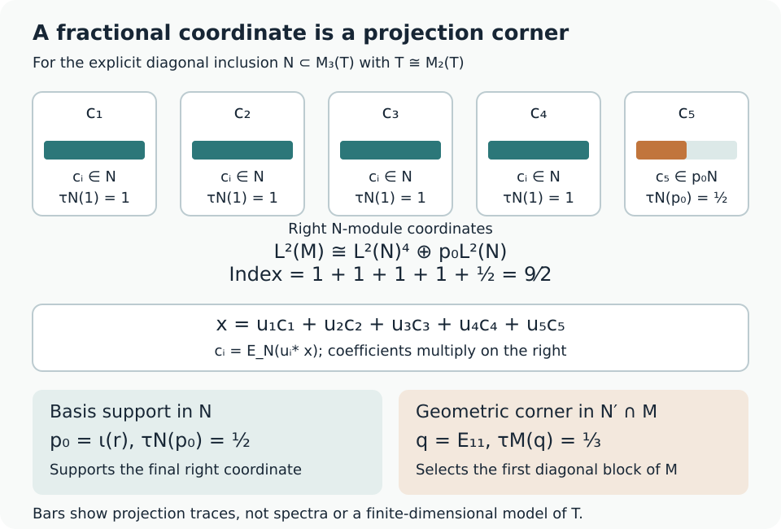

# Finite bases, bounded vectors and a positive-operator inequality

A finite-index inclusion behaves like a finite-dimensional vector space with coefficients in an algebra. The last coordinate may occupy only a projection corner. This is why a nonintegral index is possible, and why an ordinary basis of unitaries is too restrictive.

We use the basic-construction identities and trace normalization proved in [A projection that remembers an inclusion](projection-and-basic-construction.md), Theorems 1.2 and 1.4 and Corollary 1.5. The [finite-trace supporting reading](finite-traces-and-jones-projections.md), M1–M6, M9 and M10, supplies the normal trace-preserving expectations, positivity and finite tracial commutation. Projection comparison and halving are proved in [Projections and types of von Neumann algebras](https://kokunoyumeto.github.io/open-math-courses-public/courses/foundations-of-von-neumann-algebras/projections-and-types-of-von-neumann-algebras.html#oa-fnd-ty-08), Theorem 5.5 and Proposition 13.3. We explain their precise trace consequences below. The final example constructs its tensor factors and computes the index through a supported six-by-six corner. The finite basis itself proves the bounded-vector comparison directly in every normal representation.

Basic references are [Anantharaman–Popa], [Pimsner–Popa] and [Jones]. For a freely readable comparison, see Claire Anantharaman and Sorin Popa, [*An introduction to II₁ factors*](https://www.math.ucla.edu/~popa/Books/IIun.pdf), Section 9.4, especially Proposition 9.4.5 and Proposition 9.4.8. The arguments below also give an explicit fractional final support and the uniform norm bound for the basis vectors. Except in the section explicitly treating every index, \(N\subseteq M\) are II₁ factors of finite index \(d\). Put \(B=\langle M,e_N\rangle\), \(e=e_N\), and \(\tau_1=d^{-1}\operatorname{Tr}\). All expectations below preserve their normalized traces.

## Recovering a coefficient from an operator

**Lemma 3.1 — pull-down.** Let \(E_M:B\to M\) be the trace-preserving expectation. Then

\[
E_M(e)=d^{-1}1.
\]

The normal linear map

\[
R:B\longrightarrow M,\qquad R(X)=dE_M(Xe)
\]

satisfies

\[
R(X)e=Xe,\qquad \|R(X)\|\leq\sqrt d\,\|X\|.
\]

In particular, \(Be=Me\).

**Proof.** For \(a\in M\), the trace formula in the first lesson gives

\[
\tau(aE_M(e))=\tau_1(ae)=d^{-1}\tau(a).
\]

Faithfulness gives the first identity. For \(X=\sum_i a_i e b_i\),

\[
Xe=\sum_i a_i E_N(b_i)e,
\qquad
dE_M(Xe)=\sum_i a_iE_N(b_i).
\]

Thus \(R(X)e=Xe\) on \(\operatorname{span}(MeM)\). This algebra is ultraweakly dense in \(B\), by M7/(M11) of the finite-trace supporting reading: its ultraweak closure is the closed ideal generated by the full projection \(e\). Both sides are ultraweakly continuous in \(X\), so the equality holds on \(B\). Normality of \(R\) follows from its formula.

Now \(XeX^*=R(X)eR(X)^*\). Applying the positive expectation \(E_M\) gives

\[
d^{-1}R(X)R(X)^*=E_M(XeX^*)
\leq\|X\|^2 1.
\]

Taking norms proves the bound. Finally, \(Me\subseteq Be\), and the equality \(Xe=R(X)e\) proves the reverse inclusion. \(\square\)

The coefficient \(R(X)\) is unique: if \(ae=0\) with \(a\in M\), evaluation on \(\widehat1\) gives \(a=0\).

## A basis with a fractional final coordinate

Here are the trace consequences of the projection prerequisites. In a finite factor, comparison says that one of two projections is equivalent to a subprojection of the other. Equivalence preserves a faithful trace; if the two traces agree, the unused complement has trace zero and is zero. Thus equal trace gives equivalence, and smaller trace gives subequivalence.

In a II\(_1\) factor, Proposition 13.3 halves every projection into two equivalent orthogonal projections. Repeating this in each corner gives a nested dyadic partition of the identity. For any \(t\in[0,1]\), let \(r_m\) be the sum of the first \(\lfloor2^mt\rfloor\) pieces at level \(m\), ordered so that each piece's children are consecutive. Then \(r_m\leq r_{m+1}\) and \(\tau(r_m)=2^{-m}\lfloor2^mt\rfloor\). The supremum \(r=\bigvee_mr_m\) has trace \(t\) by normality. Applying the same construction with the normalized trace in a nonzero corner gives every trace between zero and that corner's trace. In particular, any finite list of nonnegative trace values summing to one is realized by orthogonal projections summing to one: choose each projection in the unused corner, and use the final remainder for the last entry.

Write \(d=n+s\), where \(n=\lfloor d\rfloor\) and \(0\leq s<1\). The preceding construction gives a projection \(p\in N\) with \(\tau(p)=s\). If \(s=0\), take \(p=0\). Let

\[
p_i=1\quad(1\leq i\leq n),\qquad p_{n+1}=p.
\]

**Theorem 3.2 — partial orthonormal basis.** There are \(u_1,\ldots,u_{n+1}\in M\) such that

\[
u_i=u_ip_i,\qquad
E_N(u_i^*u_j)=\delta_{ij}p_i,
\qquad
\sum_i u_i e u_i^*=1.
\]

They satisfy

\[
\sum_i u_i u_i^*=d1,
\qquad
x=\sum_i u_i E_N(u_i^*x)\quad(x\in M).
\]

The expansion is unique among expressions \(x=\sum_i u_i c_i\) with \(c_i\in p_iN\). Each \(u_i\) has norm at most \(\sqrt d\). If \(p=0\), the last element is zero and can be omitted.

Conversely, any family satisfying the displayed inner-product identities, with these support projections and traces, satisfies all the expansion identities.

**Proof.** Since \(\tau_1(e)=1/d\), choose orthogonal projections \(q_i\in B\) summing to one with

\[
\tau_1(q_i)=1/d\quad(i\leq n),\qquad
\tau_1(q_{n+1})=s/d.
\]

Projection comparison in the II₁ factor \(B\) gives partial isometries \(v_i\) with

\[
v_i^*v_i=p_ie,\qquad v_iv_i^*=q_i.
\]

Put \(u_i=R(v_i)\). Lemma 3.1 gives \(u_ie=v_i\) and \(\|u_i\|\leq\sqrt d\). Orthogonality of the \(q_i\) gives \(v_i^*v_j=0\) for \(i\ne j\). Hence

\[
E_N(u_i^*u_j)e=e u_i^*u_j e
=v_i^*v_j=\delta_{ij}p_ie.
\]

Faithfulness of \(a\mapsto ae\) on \(N\) gives the inner-product identities. Also \(u_i(1-p_i)e=v_i(1-p_i)=0\), so \(u_i=u_ip_i\). Summing the final projections gives \(\sum_i u_ie u_i^*=1\).

Applying \(E_M\) proves \(\sum_i u_i u_i^*=d1\). Multiplying the projection identity by \(xe\) gives

\[
xe=\sum_i u_ie u_i^*xe
=\sum_i u_iE_N(u_i^*x)e.
\]

The injectivity of \(a\mapsto ae\) on \(M\) proves the expansion. Its coefficients belong to \(p_iN\), since \(u_i^*=p_iu_i^*\). Applying \(E_N(u_j^*\,\cdot\,)\) proves uniqueness.

For the converse, put \(w_i=u_ie\). The inner-product identities give \(w_i^*w_j=\delta_{ij}p_ie\), so each \(w_i\) is a partial isometry with initial projection \(p_ie\), and their ranges are mutually orthogonal. Thus \(w_i=w_ip_i\); injectivity of \(a\mapsto ae\) on \(M\) gives \(u_i=u_ip_i\). Their range sum is a projection with normalized trace

\[
\sum_i\tau_1(p_ie)=\frac{n+\tau(p)}d=1.
\]

Faithfulness forces that sum to equal one. Applying \(E_M\) and multiplying by \(xe\) give the scalar sum and expansion exactly as above; applying \(E_N(u_j^*\,\cdot\,)\) recovers each coefficient in \(p_jN\), proving uniqueness. Pull-down uniqueness gives \(R(w_i)=u_i\), and \(\|w_i\|\leq1\) gives \(\|u_i\|\leq\sqrt d\). If \(p_i=0\), then \(w_i=u_i=0\). \(\square\)

The theorem uses a **right** module convention: coefficients stand on the right, and are recovered as \(E_N(u_i^*x)\). Taking adjoints gives the corresponding left-coordinate formula

\[
x=\sum_iE_N(xu_i)u_i^*.
\]

Switching the placement of coefficients without taking adjoints would generally be wrong.

For a direct test, let \(N=M=M_2(\mathbb C)\overline\otimes Q\), with \(Q\) a II₁ factor, and use the one-element basis
\[
u=\begin{pmatrix}0&1\\1&0\end{pmatrix}\otimes1.
\]
It is an orthonormal right basis at index one. For \(x=E_{11}\otimes1\), the prescribed right coefficient is \(c=E_N(u^*x)=u^*x\). Thus \(uc=x\), whereas
\[
cu=u^*xu=E_{22}\otimes1\ne x.
\]
The correct left coefficient for the adjoint basis is \(E_N(xu)\), as in the preceding formula.

This also diagnoses the coefficient order in *Theory of Operator Algebras III*, Chapter XIX, Theorem 2.27(ii)(g), printed page 436: with coefficients determined by \(E_N(a_i^*x)\), the expansion is \(\sum_i a_i c_i\). The calculation in its proof on printed page 438 uses this right order. The displayed left order in the statement fails even in the identity inclusion above.

**Proposition 3.3 — change of basis.** If \((u_i)\) and \((v_j)\) are two such bases with the same support projection \(p\), then

\[
C_{ij}=E_N(u_i^*v_j),\qquad
v_j=\sum_i u_iC_{ij}
\]

defines a unitary in the corner

\[
P M_{n+1}(N)P,\qquad P=\operatorname{diag}(1,\ldots,1,p).
\]

Here a unitary in the corner means \(C^*C=CC^*=P\).

**Proof.** The coefficient formula gives \(C_{ij}=p_iC_{ij}p_j\), so \(C=PCP\). Using the expansions and the inner-product identities gives

\[
(C^*C)_{jk}
=\sum_iE_N(v_j^*u_i)E_N(u_i^*v_k)
=E_N(v_j^*v_k)=\delta_{jk}p_j.
\]

Interchanging the bases gives \(CC^*=P\). \(\square\)

**Corollary 3.4.** The map

\[
U:\bigoplus_i p_iL^2(N)\longrightarrow L^2(M),
\qquad (c_i)\longmapsto\sum_i u_ic_i
\]

is a unitary of right \(N\)-modules. The algebraic right module \(M_N\) is isomorphic to \(\bigoplus_i p_iN\), and is finite projective.

**Proof.** For bounded coefficients, the squared norm of the image is

\[
\tau\left(\sum_{i,j}c_j^*u_j^*u_ic_i\right)
=\sum_i\tau(c_i^*p_ic_i)=\sum_i\|c_i\|_2^2.
\]

The expansion proves dense range. Thus the isometry extends to a unitary. The bounded-coordinate expansion and uniqueness prove the algebraic assertion; each \(p_iN\) is a direct summand of the free module \(N\). \(\square\)

## The inequality supplied by a finite basis

**Theorem 3.5 — positive-operator bound.** For every \(x\in M_+\),

\[
E_N(x)\geq d^{-1}x.
\]

Consequently,

\[
\|E_N(x)\|_2^2\geq d^{-1}\|x\|_2^2
\quad(x\in M_+).
\]

**Proof.** Let \(a\in M\), write \(a=\sum_i u_ic_i\), and form the row \(U=(u_1,\ldots,u_{n+1})\). Theorem 3.2 gives \(UU^*=d1\), so \(U^*U\leq d1\). Therefore

\[
a^*a=c^*U^*Uc\leq d\sum_i c_i^*c_i
=dE_N(a^*a).
\]

Every positive \(x\) is \(a^*a\) for \(a=x^{1/2}\), proving the first assertion. Multiplying \(E_N(x)-d^{-1}x\geq0\) by \(x^{1/2}\) on both sides and taking the trace gives

\[
\tau(xE_N(x))\geq d^{-1}\tau(x^2).
\]

Bimodularity and trace preservation identify the left side with \(\tau(E_N(x)^2)\). \(\square\)

**Corollary 3.5a — the exact constant.** The largest constant \(c\) such that \(E_N(x)\geq cx\) for every \(x\in M_+\) is \(c=d^{-1}\). There is a projection \(r\in M\) with
\[
\tau(r)=d^{-1},\qquad E_N(r)=d^{-1}1,
\qquad
\frac{\|E_N(r)\|_2^2}{\|r\|_2^2}=d^{-1}.
\]

**Proof.** Choose a projection \(q\in M\) with \(\tau(q)=1/d\), using the trace-range construction above. Since \(\tau_1|_M=\tau\) and \(\tau_1(e)=1/d\), comparison in the II₁ factor \(B\) gives a partial isometry \(v\in B\) with
\[
v^*v=e,\qquad vv^*=q.
\tag{PP1}
\]
Its initial projection gives \(ve=v\). Pull-down supplies \(u\in M\) with \(ue=v\). Jones compression and injectivity on \(N\) give
\[
E_N(u^*u)e=eu^*ue=v^*v=e,\qquad E_N(u^*u)=1.
\]
Applying \(E_M\) to \(ueu^*=q\), using bimodularity and \(E_M(e)=d^{-1}1\), gives
\[
uu^*=dq.
\tag{PP2}
\]
Set \(w=d^{-1/2}u\), so \(ww^*=q\). The equality
\((1-q)ww^*(1-q)=0\) implies \((1-q)w=0\), hence \(qw=w\). Therefore
\[
r=w^*w,\qquad r^2=w^*ww^*w=w^*qw=r.
\]
This is a nonzero projection with \(\tau(r)=\tau(ww^*)=\tau(q)=1/d\), and
\[
E_N(r)=d^{-1}E_N(u^*u)=d^{-1}1.
\tag{PP3}
\]
If \(E_N(x)\geq cx\) holds for every positive \(x\), apply it to \(r\) and compress by \(r\):
\[
r(E_N(r)-cr)r=(d^{-1}-c)r\geq0.
\]
Since \(r\ne0\), this forces \(c\leq d^{-1}\). Theorem 3.5 proves that \(d^{-1}\) works. Finally,
\[
\|E_N(r)\|_2^2=d^{-2},\qquad
\|r\|_2^2=d^{-1},\qquad
\frac{\|E_N(r)\|_2^2}{\|r\|_2^2}=d^{-1}.
\tag{PP4}
\]
The argument includes \(d=1\), when \(q=e=r=1\) may be chosen. \(\square\)

A positive bound \(E_N(x)\geq cx\), with \(c>0\), also forces finite index, as the following argument proves. The downward basic construction provides a further structural explanation in the later tower theory.

## The optimal constants at every index

Let \(N\subseteq M\) be II₁ factors with normalized trace \(\tau\), let \(E=E_N\), \(B=\langle M,e_N\rangle\), \(e=e_N\), and \(d=\operatorname{Tr}(1_B)\in[1,\infty]\), where \(\operatorname{Tr}(xe)=\tau(x)\) for \(x\in N\). Put \(d^{-1}=0\) when \(d=\infty\). Define

\[
\begin{aligned}
\lambda_{\rm op}&=\sup\{c\geq0:E(x)\geq cx\text{ for every }x\in M_+\},\\
\lambda_2&=\inf_{0\neq x\in M_+}\frac{\|E(x)\|_2^2}{\|x\|_2^2}.
\end{aligned}
\tag{PI1}
\]

**Theorem 3.5b — both optimal constants at every index.** For every such inclusion,

\[
\lambda_{\rm op}=\lambda_2=d^{-1},\qquad
\inf_{0\neq x\in M_+}\frac{\|E(x)\|_2}{\|x\|_2}=d^{-1/2}.
\tag{PI2}
\]

If \(d<\infty\), a nonzero projection attains both norm infima. If \(d=\infty\), there is a sequence of nonzero bounded positive elements for which both norm ratios tend to zero. The finite proof is Theorem 3.5 and Corollary 3.5a, (PP1)–(PP4): projection comparison and pull-down construct \(r\in M\) with \(\tau(r)=1/d\) and \(E(r)=d^{-1}1\), giving optimality and equality. We supply the infinite case in full.

### Small ambient supports with one standard coordinate

Assume \(d=\infty\). The basic-construction reading proves that \(B\) is a semifinite II∞ factor and that

\[
\operatorname{Tr}(e)=1,\qquad
\operatorname{Tr}(q)=\infty\quad(0\neq q\in\operatorname{Proj}(M)).
\tag{PI3}
\]

The second assertion is its Exercise 1.5, equation BC8: finite matrix amplification of the given possibly infinite trace and factor comparison transfer the infinite identity trace to every nonzero projection of the finite subfactor \(M\).

Choose any \(0<t\leq1\) and a projection \(q\in M\) of trace \(t\), by the written dyadic trace-range construction. Factor projection comparison in \(B\) makes either \(e\) subequivalent to \(q\) or \(q\) subequivalent to \(e\). The latter would contradict (PI3), because a trace preserves equivalence and is monotone on projections. Therefore there is \(v\in B\) with

\[
v^*v=e,\qquad vv^*\leq q.
\tag{PI4}
\]

Let \(\xi=v\widehat1\). Then \(\|\xi\|_2=1\), \(q\xi=\xi\), and the map \(\widehat n\mapsto\xi n\) from \(L^2(N)\) to \(L^2(M)\) is the restriction of \(v\) to \(eL^2(M)\), hence has norm at most one. Indeed \(B=R(N)'\), so \(v\) commutes with every bounded right \(N\)-action. No bounded element of \(M\) is assumed to represent \(\xi\).

### A positive lower bound would make that vector bounded

Suppose \(E(x)\geq cx\) for all positive \(x\), for some \(c>0\). The positive normal functional

\[
\varphi(x)=\langle R_x\xi,\xi\rangle\quad(x\in M)
\]

is well defined by the normal right action in the finite-trace reading M10. Although that action is antimultiplicative, it is linear, positive and normal; those are the properties used here. For \(n\in N_+\),

\[
\varphi(n)=\|\xi n^{1/2}\|_2^2\leq\tau(n).
\]

Thus positivity, the assumed inequality and trace preservation give

\[
c\varphi(x)\leq\varphi(E(x))\leq\tau(E(x))=\tau(x)
\quad(x\in M_+).
\tag{PI5}
\]

For \(a\in M\), antimultiplicativity gives \(R_a^*R_a=R_{aa^*}\), so

\[
\|\xi a\|_2^2=\varphi(aa^*)\leq c^{-1}\tau(aa^*)=c^{-1}\|a\|_2^2.
\]

Consequently \(T:\widehat a\mapsto\xi a\) extends to a bounded operator on \(L^2(M)\) of norm at most \(c^{-1/2}\). For \(a,b\in M\), \(TR_b\widehat a=\xi ab=R_bT\widehat a\), and density gives commutation on the completed space. The finite tracial commutation theorem M10.1 therefore gives \(T=L_u\) for a bounded \(u\in M\), with \(\|u\|\leq c^{-1/2}\), and \(\xi=\widehat u\). Since \(q\xi=\xi\), trace faithfulness gives \(qu=u\). Now

\[
1=\|\xi\|_2^2=\tau(u^*u)=\tau(uu^*)
\leq\|u\|^2\tau(q)\leq c^{-1}t.
\tag{PI6}
\]

Choosing \(t<c\) (and \(t\leq1\)) is a contradiction. Therefore \(\lambda_{\rm op}=0\). This proves the implication from an operator lower bound to finite index directly, without assuming that an arbitrary \(L^2\) vector is an affiliated operator.

### Bounded positive witnesses for the norm constants

Let \(\mathcal I=\operatorname{span}(MeM)\). It is a *-algebra: products reduce by \(eae=E(a)e\). The basic-construction reading Theorem 1.2 proves that its closure acts nondegenerately and is strongly dense in \(B\). [Kaplansky's density theorem, Theorem 7.1(1)](https://kokunoyumeto.github.io/open-math-courses-public/courses/foundations-of-von-neumann-algebras/kaplansky-s-density-theorem-and-its-consequences.html#oa-fnd-kd-07), applicable to a possibly nonunital and nonclosed *-algebra, therefore supplies contractions \(z_k\in\mathcal I\) such that

\[
\|z_k\widehat1-v\widehat1\|_2<1/k.
\tag{PI7}
\]

Only this one-vector approximation is required, so no separability of \(L^2(M)\) is used. Since \(z_ke\in Me\), write

\[
qz_ke=a_ke,\qquad a_k\in M,\qquad qa_k=a_k.
\tag{PI8}
\]

For an explicit formula, if \(z_k=\sum_j b_jec_j\), take \(a_k=q\sum_j b_jE(c_j)\). The norm of \(a_ke\) is at most one, and compression gives

\[
E(a_k^*a_k)e=e a_k^*a_ke\leq e,
\qquad 0\leq E(a_k^*a_k)\leq1.
\tag{PI9}
\]

The implication from the compressed inequality uses the faithful standard action of \(N\) on \(eL^2(M)=L^2(N)\). Also \(a_k\widehat1=qz_k\widehat1\to qv\widehat1=\xi\), so

\[
\tau(a_k^*a_k)\longrightarrow1.
\tag{PI10}
\]

Put \(x_k=a_k^*a_k\). For large \(k\), this is a nonzero bounded positive element. [Bounded polar decomposition, Proposition 7.2](https://kokunoyumeto.github.io/open-math-courses-public/courses/foundations-of-von-neumann-algebras/the-double-commutant-theorem.html#oa-fnd-bi-09), applied to \(a_k\) inside \(M\), shows that the support \(s_k\) of \(x_k\) is equivalent to the range support of \(a_k\), which is at most \(q\). Thus \(\tau(s_k)\leq t\). Trace Cauchy–Schwarz, applied to \(x_k=s_kx_k\), gives

\[
\tau(x_k)^2\leq\tau(s_k)\tau(x_k^2)\leq t\|x_k\|_2^2.
\]

Equation (PI9) gives \(E(x_k)^2\leq E(x_k)\), and therefore

\[
\frac{\|E(x_k)\|_2^2}{\|x_k\|_2^2}
\leq\frac{\tau(x_k)}{\tau(x_k)^2/t}
=\frac{t}{\tau(x_k)}\longrightarrow t.
\tag{PI11}
\]

For each integer \(m\geq1\), choose \(t=1/(4m)\), construct the corresponding \(q,v\), and choose an approximant with \(\tau(x_k)\geq1/2\). The resulting nonzero bounded positive \(y_m\) satisfies \(\|E(y_m)\|_2^2/\|y_m\|_2^2\leq1/(2m)\). Hence the squared infimum is zero, and taking square roots gives the unsquared infimum zero. In the finite case PP4 gives the unsquared constant \(d^{-1/2}\). This proves (PI2) at finite index, infinite index and the index-one endpoint.

Theorem 3.5b supplies the infinite-index converse and both sharp constants. Its norm convention also clarifies Takesaki, *Theory of Operator Algebras III*, XIX.4.14, printed pages 475–477: the operator bound is \(d^{-1}\), while the best nonsquared \(L^2\) bound is \(d^{-1/2}\). The projection in (PP3) tests the distinction for every finite \(d>1\). With squared norms, (PI2) gives \(d^{-1}\), including zero at infinite index. The later tower lesson retains a separate downward-construction route.

## When an apparently unbounded vector is bounded

A vector \(\xi\in L^2(M)\) may be represented by an unbounded affiliated operator. Call it **right \(N\)-bounded** if the map

\[
\widehat n\longmapsto \xi n\qquad(n\in N)
\]

extends to a bounded operator \(T_\xi:L^2(N)\to L^2(M)\).

**Theorem 3.6.** If \(\xi\) is right \(N\)-bounded, then \(\xi=\widehat a\) for an element \(a\in M\), and

\[
\|a\|\leq\sqrt d\,\|T_\xi\|.
\]

The operator \(X=T_\xi e\) belongs to \(B\), has norm \(\|T_\xi\|\), and satisfies

\[
X=ae,\qquad E_M(X)=d^{-1}a.
\]

**Proof.** The map \(T_\xi\) intertwines the right \(N\)-actions on its domain and range. Thus \(X=T_\xi e\) commutes with the right \(N\)-action and belongs to \(B=R(N)'\). As \(eH=L^2(N)\), its norm is exactly \(\|T_\xi\|\). Also \(Xe=X\). Pull-down gives \(X=R(X)e\); put \(a=R(X)\). Evaluating on \(\widehat1\) gives \(\widehat a=X\widehat1=\xi\). The remaining identities follow from Lemma 3.1. \(\square\)

This also proves that any right-module unitary with the direction in Corollary 3.4 can recover a basis without first assuming that its coordinate vectors belong to \(M\). Put
\[
\xi_i=U(0,\ldots,\widehat p_i,\ldots,0),\qquad
T_i(\widehat n)=U(0,\ldots,\widehat{p_in},\ldots,0).
\]
Right \(N\)-linearity gives \(T_i(\widehat n)=\xi_i n\). The supported coordinate embedding has norm at most one, so \(\|T_i\|\leq1\). Theorem 3.6 gives \(\xi_i=\widehat{a_i}\) with \(a_i\in M\) and \(\|a_i\|\leq\sqrt d\). For \(n,m\in N\), unitarity yields
\[
\tau(m^*E_N(a_i^*a_j)n)
=\langle\xi_j n,\xi_i m\rangle
=\delta_{ij}\tau(m^*p_i n).
\]
Taking \(n=1\) and then \(m\) equal to the difference of the two \(N\)-valued coefficients proves \(E_N(a_i^*a_j)=\delta_{ij}p_i\). Theorem 3.2's converse gives all remaining basis identities. This includes the zero final coordinate. With a unitary in the opposite direction, use its inverse in these formulas.

For a normal left \(M\)-representation on \(K\), define

\[
\begin{gathered}
C_P(\eta)=\sup\{\|a\eta\|:\\
a\in P,\ \tau_P(a^*a)\leq1\},\\
P=N,M.
\end{gathered}
\]

**Theorem 3.7.** For every \(\eta\in K\),

\[
C_N(\eta)\leq C_M(\eta)\leq\sqrt d\,C_N(\eta).
\]

In particular, boundedness of this vector does not depend on which of the two algebras is used.

**Proof.** The first inequality is immediate from \(N\subseteq M\). If \(C_N(\eta)=\infty\), the second inequality is automatic. Otherwise put \(C=C_N(\eta)\). For any \(a\in M\), the partial orthonormal basis in Theorem 3.2 gives

\[
\begin{gathered}
a=\sum_i u_i c_i,\qquad c_i=E_N(u_i^*a)\in N,\\
\sum_i\tau(c_i^*c_i)=\tau(a^*a),\\
\sum_i u_i u_i^*=d1.
\end{gathered}
\]

The last identity makes the row operator \((u_1,\ldots,u_r):K^{\oplus r}\to K\) have norm at most \(\sqrt d\) in the given representation. The definition of \(C\) gives \(\|c_i\eta\|\leq C\,\tau(c_i^*c_i)^{1/2}\). Applying the row estimate to the vector with coordinates \(c_i\eta\) yields

\[
\begin{gathered}
\|a\eta\|^2
\leq d\sum_i\|c_i\eta\|^2\\
\leq dC^2\sum_i\tau(c_i^*c_i)\\
=dC^2\tau(a^*a).
\end{gathered}
\]

Taking the supremum over the \(M\) trace unit ball proves the second inequality. The partial final support is already included in the coefficient identity, and no finite-commutant restriction is used. \(\square\)

## A concrete fractional basis

The finite-basis theorem allows a fractional last coordinate. We now construct an inclusion for which that fraction is exactly \(1/2\), compute its index directly, and exhibit all five bounded basis vectors.

### Constructing the tensor factors and their traces

Let \(A_k=M_2^{\otimes k}\otimes M_3^{\otimes k}\), embedded into \(A_{k+1}\) by adjoining identities in the two new factors, and let \(A=\bigcup_k A_k\). Finite factor labels may be permuted; thus \(A_k\) is a full matrix algebra of size \(6^k\). Its normalized matrix trace \(t_k\) restricts to \(t_{k-1}\), so there is a well-defined positive faithful tracial state \(t\) on \(A\). Give \(A\) inner product \(\langle a,b\rangle=t(b^*a)\), complete it to \(H\), and write \(\Omega=\widehat1\). Inner products are linear in the first variable.

For \(a,b\in A\), put \(L_a\widehat b=\widehat{ab}\) and \(R_a\widehat b=\widehat{ba}\). In any common finite matrix stage, positivity and the trace identity give

\[
\|L_a\widehat b\|^2=t(b^*a^*ab)\leq\|a\|^2t(b^*b),\qquad
\|R_a\widehat b\|^2=t(a^*b^*ba)=t(b^*baa^*)\leq\|a\|^2t(b^*b).
\tag{TF1}
\]

Hence these maps extend to bounded operators on \(H\). The finite-stage representation \(a\mapsto L_a\) is faithful (apply it to \(\Omega\)); a faithful matrix *-representation preserves the matrix norm. One can verify the last assertion without an abstract representation theorem: a spectral projection for a largest eigenvalue of \(a^*a\) is nonzero in that stage, and on its range \(L_{a^*a}\) has that eigenvalue, while (TF1) gives the reverse bound. Thus the stage embeddings and their operator norms are compatible. Set

\[
\mathcal T=L(A)''\subseteq B(H),\qquad
\tau(x)=\langle x\Omega,\Omega\rangle\quad(x\in\mathcal T).
\tag{TF2}
\]

The algebra contains the identity and acts nondegenerately. Every \(R_a\) commutes with \(L(A)\), and consequently with \(\mathcal T=L(A)''\). The vectors \(R_a\Omega=\widehat a\) are dense. If \(x\Omega=0\) for \(x\in\mathcal T\), then \(xR_a\Omega=R_ax\Omega=0\) for every \(a\); hence \(x=0\). Thus \(\Omega\) is separating as well as cyclic.

The functional \(\tau\) is a normal positive state: it is the restriction of a vector functional on \(B(H)\), and \(\|\Omega\|=1\). It is faithful, because for \(x\geq0\), \(\tau(x)=0\) implies \(x^{1/2}\Omega=0\) and therefore \(x^{1/2}=0\) by separation.

It is also tracial on the entire von Neumann closure. For \(a\in A\) and \(x\in\mathcal T\), the commuting right action gives
\[
\begin{aligned}
\tau(xL_a)
 &=\langle xR_a\Omega,\Omega\rangle
 =\langle R_ax\Omega,\Omega\rangle\\
 &=\langle x\Omega,R_{a^*}\Omega\rangle
 =\langle x\Omega,L_{a^*}\Omega\rangle
 =\tau(L_ax).
\end{aligned}
\tag{TF3}
\]
By [the double commutant theorem, Theorem 4.4](https://kokunoyumeto.github.io/open-math-courses-public/courses/foundations-of-von-neumann-algebras/the-double-commutant-theorem.html#oa-fnd-bi-07), \(L(A)\) is ultraweakly dense in \(\mathcal T\). For fixed \(x\), the two functionals of \(y\) are \(\langle y\Omega,x^*\Omega\rangle\) and \(\langle y(x\Omega),\Omega\rangle\), so both are normal vector functionals. Equation (TF3) therefore extends to every \(y\in\mathcal T\). The map \(\widehat x\mapsto x\Omega\) identifies \(L^2(\mathcal T,\tau)\) with \(H\): it is an isometry whose range contains the dense finite-stage vectors.

For completeness, \(\mathcal T\) is a factor. The finite-trace expectation reading M1–M6 supplies the trace-preserving conditional expectation \(E_k:\mathcal T\to L(A_k)\), with its orthogonal \(L^2\) projection property. For \(z\in Z(\mathcal T)\), bimodularity shows that \(E_k(z)\) commutes with every element of the full matrix stage. Its center is scalar, so trace preservation gives

\[
E_k(z)=\tau(z)1.
\tag{TF4}
\]

The finite-stage vector spaces are nested with dense union in \(H\). Their orthogonal projections therefore converge strongly to the identity (approximate a given vector by one in a fixed stage). Thus \(E_k(z)\Omega\to z\Omega\). Equation (TF4) and separation give \(z=\tau(z)1\).

There are nonzero projections of trace \(6^{-k}\) in the stages. No nonzero projection of \(\mathcal T\) can be minimal: if \(q\) were minimal with \(\tau(q)=c>0\), choose such a stage projection \(f\) with \(0<\tau(f)<c\). Factor projection comparison makes \(f\) equivalent to a subprojection of \(q\); minimality makes that nonzero subprojection \(q\), contradicting the trace inequality. In a factor an abelian projection would be minimal: if it had a proper nonzero subprojection \(h\), commutativity of \(q\mathcal Tq\) would give \(h\mathcal T(q-h)=0\), contradicting Lemma 5.3 of the projection reading for the two nonzero projections \(h,q-h\). Thus there is no nonzero abelian projection. Its identity is finite: any isometry \(w\) has \(\tau(1-ww^*)=\tau(w^*w)-\tau(ww^*)=0\), so faithfulness gives \(ww^*=1\). Therefore \(\mathcal T\) is a II₁ factor. The comparison proof is Theorem 5.5 of the projection reading.

The same construction works for any countable sequence of nontrivial finite full matrix factors with their normalized traces, including just the \(M_2\) factors, just the \(M_3\) factors, and the \(M_2\) factors combined with the \(M_3\) tail. In the two-family case, the diagonal finite stages used above are cofinal among all finite sets of factor labels. They therefore give precisely the closure used in the fractional example.

A relabelling of factors and a splitting of the first \(M_2\) factor preserve the algebraic product trace and the inner products. They extend to inverse Hilbert-space unitaries fixing the identity vector. On each finite tensor, the unitaries intertwine left multiplication. Conjugation therefore maps the bicommutant of one finite-tensor algebra onto the other, normally and multiplicatively, and preserves the vector trace. In particular, for the factor \(T\) made of the \(M_2\) family and the \(M_3\) tail, splitting the first \(M_2\) factor gives the normal trace-preserving isomorphism

\[
\alpha:T\longrightarrow M_2(T)
\]

with the normalized two-by-two trace. This constructs the isomorphism used below for this particular tensor factor.

More explicitly, write
\[
R_2=\overline{\bigotimes}_{k\geq1}(M_2,\operatorname{tr}_2),\qquad
R_3=\overline{\bigotimes}_{k\geq1}(M_3,\operatorname{tr}_3).
\]
The finite-tensor map \(\widehat{a\otimes b}\mapsto\widehat a\otimes\widehat b\) preserves inner products and has dense range in \(L^2(R_2)\otimes L^2(R_3)\). It extends to a unitary intertwining the left actions, so the combined closure is the spatial tensor product \(M=R_2\bar\otimes R_3\), with the faithful normal product trace just constructed. The diagonal finite stages \(A_k\) are cofinal among all finite sets of factor labels.

Let \(R_{3,\mathrm{tail}}\) denote the \(M_3\) factors after the first, and put \(T=R_2\bar\otimes R_{3,\mathrm{tail}}\). Permuting finite tensor labels identifies \(M\) with \(M_3(T)\). On finite tensors the preceding shift is
\[
\alpha\bigl((a_1\otimes\cdots\otimes a_k)\otimes b\bigr)
=a_1\otimes\bigl((a_2\otimes\cdots\otimes a_k)\otimes b\bigr),
\tag{TF5}
\]
with the remaining \(M_2\) factors reindexed from one. Appending identity factors makes the formula independent of the chosen stage; inserting the first factor gives its inverse. Thus the concrete \(T\) and \(\alpha\) meet every hypothesis in the following calculation. This construction is also treated by Anantharaman–Popa in §1.6.

### The diagonal inclusion and its trace conventions

Let \(T\) be a II\(_1\) factor with faithful normal tracial state \(\tau\). Assume that

\[
\alpha:T\longrightarrow M_2(T)
\]

is a unital normal *-isomorphism satisfying

\[
\tau_2(\alpha(n))=\tau(n),\qquad
\tau_2([a_{ij}])=\frac12\bigl(\tau(a_{11})+\tau(a_{22})\bigr).
\tag{DI1}
\]

Set

\[
M=M_3(T),\qquad
\tau_M([x_{ij}])=\frac13\sum_{i=1}^3\tau(x_{ii}),\qquad
\iota(n)=\operatorname{diag}(n,\alpha(n)),\qquad N=\iota(T).
\tag{DI2}
\]

The finite matrix traces in (DI1)–(DI2) are faithful normal tracial states: their positivity and faithfulness follow by expanding a matrix square, their trace identity by interchanging two finite sums and using the trace identity of \(\tau\), and their normality by applying normality of \(\tau\) to each increasing diagonal entry. The same argument is written fully for the six-by-six corner in the trace calculation below. Commutation with the matrix units forces every central element of \(M_3(T)\) to be a scalar diagonal matrix with entry in \(Z(T)\); the faithful tracial state makes its identity finite, as above. Hence \(M\) is a finite factor. It has no nonzero minimal projection: the earlier trace-range construction in \(T\) gives projections \(\operatorname{diag}(f,0,0)\) of arbitrarily small positive \(M\)-trace, and comparison would make such a projection equivalent to a proper nonzero subprojection of any proposed minimal projection. Thus \(M\) is of type II\(_1\).

The normal embedding \(\iota\) has a normal inverse on its image, namely the first diagonal compression. Its image is ultraweakly closed: a net of diagonal matrices in the image whose entries converge ultraweakly has limiting first entry \(n\), and ultraweak continuity of the normal map \(\alpha\) forces its lower block to be \(\alpha(n)\). Equivalently, its image is the closed graph of the continuous map \(\alpha\) in the block diagonal algebra. Hence \(N\) is a unital II\(_1\) von Neumann subfactor. Directly,

\[
\tau_M(\iota(n))=\frac13\tau(n)+\frac23\tau_2(\alpha(n))=\tau(n).
\tag{DI3}
\]

In particular the standard tracial Hilbert spaces of \(N\) and \(T\) are identified by \(\widehat{\iota(n)}\leftrightarrow\widehat n\). We use inner products linear in the first variable throughout.

Let \(f_{ij}\) be the two-by-two scalar matrix units, and put

\[
r=\alpha^{-1}(f_{11}),\qquad
t=\alpha^{-1}(f_{22})=1-r,\qquad
s=\alpha^{-1}(f_{12}).
\tag{DI4}
\]

Then

\[
\tau(r)=\tau(t)=\frac12,\quad ss^*=r,\quad s^*s=t,
\quad rs=s=st,\quad sr=0,\quad rs^*=0,\quad s^*r=s^*.
\tag{DI5}
\]

All identities follow by applying the *-isomorphism \(\alpha^{-1}\) to matrix-unit identities. In particular \(s\) transports the \(t\) corner to the \(r\) corner; \(s^*\) transports the \(r\) corner to the \(t\) corner. The distinction between \(r\) and \(t\) will matter in the coordinate repackaging.

### Six supported right coordinates

Write \(H_0=L^2(T,\tau)\). For \(x,y\in T\), define

\[
\beta(x,y)=\alpha^{-1}\begin{pmatrix}x&y\\0&0\end{pmatrix}\in rT.
\tag{DI6}
\]

This linear map is onto \(rT\), because \(\alpha(rT)=f_{11}M_2(T)\), precisely the matrices with zero second row. Its two essential identities are

\[
\begin{aligned}
\|\beta(x,y)\|_2^2
 &=\frac12\bigl(\tau(x^*x)+\tau(y^*y)\bigr),\\
\beta\bigl((x,y)\alpha(n)\bigr)&=\beta(x,y)n.
\end{aligned}
\tag{DI7}
\]

Here the notation in the second line means apply \(\beta\) to the two entries of the resulting row. The first line follows from (DI1) applied to

\[
\begin{pmatrix}x&y\\0&0\end{pmatrix}^{\!*}
\begin{pmatrix}x&y\\0&0\end{pmatrix}
=\begin{pmatrix}x^*x&x^*y\\y^*x&y^*y\end{pmatrix}.
\]

The second follows from multiplication before applying \(\alpha^{-1}\). Thus a last-two-column row is identified with a left-supported subspace \(rH_0\), with its usual right \(T\) action. It is not a right-supported subspace \(H_0r\).

For a bounded matrix \(X=[x_{ij}]\in M\), set

\[
U\widehat X=
\left(
\frac{\widehat{x_{11}}}{\sqrt3},
\frac{\widehat{x_{21}}}{\sqrt3},
\frac{\widehat{x_{31}}}{\sqrt3},
\sqrt{\frac23}\,\widehat{\beta(x_{12},x_{13})},
\sqrt{\frac23}\,\widehat{\beta(x_{22},x_{23})},
\sqrt{\frac23}\,\widehat{\beta(x_{32},x_{33})}
\right).
\tag{DI8}
\]

Its target is

\[
K=H_0^{\oplus3}\oplus(rH_0)^{\oplus3}
=P H_0^{\oplus6},\qquad
P=\operatorname{diag}(1,1,1,r,r,r),
\tag{DI9}
\]

where projections act by bounded left multiplication. Expanding \(\tau_M(X^*X)\) gives

\[
\|X\|_{2,M}^2=\frac13\sum_{i,j=1}^3\tau(x_{ij}^*x_{ij})
=\|U\widehat X\|_K^2.
\tag{DI10}
\]

Therefore \(U\) extends to an isometry on \(L^2(M)\). It is onto. Indeed, any bounded coordinate tuple \((a_1,a_2,a_3,b_1,b_2,b_3)\), with \(a_i\in T\) and \(b_i\in rT\), is the image of the unique matrix whose first column is \(\sqrt3(a_i)_i\) and whose last-two-column row \(i\) is \(\sqrt{3/2}\) times the first row of \(\alpha(b_i)\). These bounded coordinate tuples are dense in \(K\): \(T\) is dense in \(H_0\), and applying the bounded projection \(L_r\) shows that \(rT\) is dense in \(rH_0\). An isometry has closed range, so the dense range is all of \(K\).

Under right multiplication by \(\iota(n)\), the first column of \(X\) is multiplied on the right by \(n\), and each last-two-column row is multiplied on the right by \(\alpha(n)\). Equation (DI7) proves

\[
U R_{\iota(n)}U^*=\rho(n):=
\operatorname{diag}(R_n,R_n,R_n,R_n|_{rH_0},R_n|_{rH_0},R_n|_{rH_0}).
\tag{DI11}
\]

The restrictions exist because right multiplication commutes with the left projection \(L_r\). Thus \(U\) is a unitary intertwining the specified right actions.

### The algebra acting on the six coordinates

Put \(p_1=p_2=p_3=1\) and \(p_4=p_5=p_6=r\). We prove directly that

\[
\rho(T)'\cong A:=P M_6(T)P.
\tag{DI12}
\]

Let \(S\in B(K)\) commute with every \(\rho(n)\). Its coordinate block \(S_{ij}:p_jH_0\to p_iH_0\) is bounded, with \(\|S_{ij}\|\leq\|S\|\). Extend it to \(H_0\) by first applying \(L_{p_j}\) and then including its image in \(H_0\); call the extension \(\widetilde S_{ij}\). This extension is bounded with the same norm and satisfies

\[
\widetilde S_{ij}=L_{p_i}\widetilde S_{ij}L_{p_j},\qquad
\widetilde S_{ij}R_n=R_n\widetilde S_{ij}\quad(n\in T).
\tag{DI13}
\]

The commutation equality follows from the block equality for \(S\) and from \(L_{p_i}R_n=R_nL_{p_i}\), on both the retained and discarded source components. Apply [the finite-trace reading](finite-traces-and-jones-projections.md), Theorem M10.1, specifically \(R(T)'=L(T)\) in (FC1). There is a unique bounded \(a_{ij}\in T\) with

\[
\widetilde S_{ij}=L_{a_{ij}},\qquad
\|a_{ij}\|=\|\widetilde S_{ij}\|\leq\|S\|.
\]

Faithfulness of the same representation turns the support identity in (DI13) into

\[
a_{ij}=p_i a_{ij}p_j.
\tag{DI14}
\]

Consequently \(a=[a_{ij}]\in P M_6(T)P\), and it acts on \(K\) as \(S\). Conversely every supported matrix \(a\in A\) acts on \(K\) and commutes with \(\rho(T)\), since each of its entries acts by left multiplication. No boundedness assertion is hidden in this direction: for \(\xi=(\xi_j)\in H_0^6\),

\[
\left\|\left(\sum_j a_{ij}\xi_j\right)_i\right\|^2
\leq\left(\sum_{i,j}\|a_{ij}\|^2\right)\sum_j\|\xi_j\|^2.
\tag{DI15}
\]

This is the triangle inequality followed by the scalar Cauchy–Schwarz inequality in each row. Support preserves \(K\).

Finite matrix multiplication and adjoints now show that \(a\mapsto[L_{a_{ij}}]|_K\) is a faithful unital *-isomorphism onto \(\rho(T)'\), with unit \(P\). Its faithfulness can also be checked entrywise: if it vanishes on \(K\), each zero-extended block \(L_{a_{ij}}\) vanishes on \(H_0\), hence \(a_{ij}=0\).

This isomorphism and its inverse are normal. For the forward map, finite matrix-entry compressions are normal, and \(L:T\to B(H_0)\) is normal by M10.1, (FC8). Thus the forward map preserves bounded increasing positive suprema: an increasing positive matrix net converges strongly to its supremum; its entries converge ultraweakly, the normal left actions converge ultraweakly, and the finite block action has that same supremum. For the inverse, a *-isomorphism is an order bijection. If \(S_\lambda\uparrow S\) in the target, let \(a_\lambda\) be its increasing preimages and \(a=\sup_\lambda a_\lambda\) in \(A\). Forward normality gives \(\pi(a)=S\), so the inverse preserves the supremum too. The positive-map normality criterion used in M10 upgrades both assertions to ultraweak continuity. This argument uses six finite blocks; it introduces no general Hilbert-module commutant theorem.

By Theorem 1.2 of [the basic-construction reading](projection-and-basic-construction.md),

\[
B:=\langle M,e_N\rangle=R(N)'.
\]

Combining this equality with (DI11)–(DI12) identifies \(UBU^*\) normally and faithfully with \(A\).

### The trace on the supported corner

For \(a=[a_{ij}]\in A\), define the unnormalized finite matrix trace

\[
\Theta(a)=\sum_{i=1}^6\tau(a_{ii}).
\tag{DI16}
\]

This is a linear functional. If \(a\geq0\), write \(a=b^*b\) with its bounded square root \(b\in A\). Then

\[
\Theta(a)=\sum_{i,j=1}^6\tau(b_{ji}^*b_{ji})\geq0.
\tag{DI17}
\]

If the value is zero, every nonnegative summand is zero; faithfulness of \(\tau\) gives \(b_{ji}=0\) for every \(i,j\), hence \(a=0\). This proves faithfulness. For arbitrary \(a,b\in A\),

\[
\Theta(ab)=\sum_{i,j}\tau(a_{ij}b_{ji})
=\sum_{i,j}\tau(b_{ji}a_{ij})=\Theta(ba).
\tag{DI18}
\]

For a bounded increasing net \(0\leq a_\lambda\uparrow a\) in \(A\), each diagonal compression increases to the corresponding diagonal compression of \(a\). This follows by bounded monotone strong convergence and fixed coordinate compression; it is an increasing-supremum assertion, not a claim that every strong limit preserves an arbitrary normal functional. Normality of \(\tau\) and the finite sum give

\[
\Theta(a_\lambda)\uparrow\Theta(a).
\tag{DI19}
\]

The usual positive-functional criterion therefore gives full ultraweak normality. Finally,

\[
\Theta(P)=3\tau(1)+3\tau(r)=3+\frac32=\frac92.
\tag{DI20}
\]

For \(a\geq0\), \(a\leq\|a\|P\), so \(\Theta(a)\leq(9/2)\|a\|<\infty\). Thus \(\Theta\) is a faithful normal finite trace, in particular a semifinite trace. Its normalized tracial state is \((2/9)\Theta\). Neither the trace nor its normalization has been inferred from a dimension count.

### The Jones projection and the trace of its entire corner

Under (DI8), the identity vector is the bounded coordinate column

\[
v:=U\widehat{1_M}
=\left(\frac1{\sqrt3},0,0,0,\sqrt{\frac23}r,\sqrt{\frac23}s\right)^{\!t}.
\tag{DI21}
\]

The zero fourth coordinate is the zero first-row pair of the identity matrix; its fifth pair is \((1,0)\), with preimage \(r\); its sixth pair is \((0,1)\), with preimage \(s\). Thus no adjoint of \(s\) occurs in the column itself. Moreover \(Pv=v\), and

\[
v^*v=\frac13 1+\frac23(r+s^*s)=\frac13 1+\frac23(r+t)=1.
\tag{DI22}
\]

The bounded map \(W:H_0\to K\), \(W\xi=v\xi\), is therefore an isometry, with \(W^*(\eta_i)=\sum_i v_i^*\eta_i\). For \(n\in T\),

\[
U\widehat{\iota(n)}=v\widehat n.
\tag{DI23}
\]

Its range is exactly \(U L^2(N)\), by density of \(T\) and closedness of the range of the isometry. Hence the Jones projection is

\[
Ue_NU^*=WW^*=vv^*\in A.
\tag{DI24}
\]

For an entrywise check, all rows and columns numbered \(2,3,4\) are zero, and its block on coordinate indices \((1,5,6)\) is

\[
\begin{pmatrix}
\frac13 1&\frac{\sqrt2}3 r&\frac{\sqrt2}3 s^*\\
\frac{\sqrt2}3 r&\frac23 r&0\\
\frac{\sqrt2}3 s&0&\frac23 r
\end{pmatrix}.
\tag{DI25}
\]

The two displayed zeros use \(rs^*=0\) and \(sr=0\). Equation (DI22) proves directly that this matrix is self-adjoint and idempotent. Its finite matrix trace is

\[
\Theta(vv^*)=\frac13+\frac23\tau(r)+\frac23\tau(r)=1.
\tag{DI26}
\]

To identify the canonical basic-construction trace, the full corner restriction must also be checked. Let \(e'=vv^*\). Finite multiplication gives

\[
e'Ae'=\{v c v^*:c\in T\},\qquad
v^*(v c v^*)v=c.
\tag{DI27}
\]

Indeed, \(e'ae'=v(v^*av)v^*\) for every \(a\in A\), and every \(v c v^*\) is in \(A\). On the range of \(W\), left multiplication by \(\iota(n)\) transports to left multiplication by \(n\) on \(H_0\). Therefore

\[
U\bigl(L_{\iota(n)}e_N\bigr)U^*=v n v^*.
\tag{DI28}
\]

Both sides are zero on the orthogonal complement of the range of \(W\); on \(W\widehat m\) they have value \(W\widehat{nm}\). Finally, the finite trace identity of \(\tau\) gives

\[
\Theta(v n v^*)
=\sum_i\tau(v_i n v_i^*)
=\tau\left(n\sum_i v_i^*v_i\right)
=\tau(n)=\tau_M(\iota(n)).
\tag{DI29}
\]

Thus the pullback of \(\Theta\) to \(B\) restricts to the original normalized trace on \(e_NBe_N\cong N\). Theorem 1.2 of [the basic-construction reading](projection-and-basic-construction.md) supplies the full central support of \(e_N\). Its Lemma 1.2a, especially the uniqueness calculation (BC4), or equivalently Theorem 1.4, says that this corner restriction uniquely determines the faithful normal semifinite trace \(\operatorname{Tr}\) on \(B\). Consequently the pullback of \(\Theta\) is exactly \(\operatorname{Tr}\). We have proved

\[
\boxed{[M:N]=\operatorname{Tr}(1_B)=\Theta(P)=\frac92},\qquad
\boxed{\tau_1=\frac29\operatorname{Tr}},\qquad
\tau_1(e_N)=\frac29.
\tag{DI30}
\]

In the matrix model, \(\tau_1\) is precisely \((2/9)\Theta\). Corollary 1.5 of the basic-construction reading identifies its restriction to \(M\) with \(\tau_M\). Equation (DI29) supplies the normalization on every element of the Jones corner; equation (DI26) is its value at the corner identity.

### Four full coordinates and one half-supported coordinate

Define

\[
D:rH_0\oplus rH_0\longrightarrow H_0,\qquad
D(a,b)=a+s^*b.
\tag{DI31}
\]

The two summands on the right have orthogonal left supports \(r\) and \(t\). The second has norm \(\|s^*b\|_2=\|b\|_2\), since \(ss^*=r\) and \(rb=b\). More explicitly,

\[
\|a+s^*b\|_2^2
=\|a\|_2^2+\|b\|_2^2,
\qquad
D^{-1}(c)=(rc,sc).
\tag{DI32}
\]

For the inverse, \(r c\) and \(s c\) belong to \(rH_0\); \(r c+s^*s c=(r+t)c=c\). Conversely, \(r(a+s^*b)=a\), and \(s(a+s^*b)=b\), because \(rs^*=0\), \(sr=0\) and \(ss^*=r\). All maps are bounded left multiplications, so they commute with every right \(T\) action. Thus \(D\) is a right-action unitary, including on the Hilbert completions. These formulas are also mutually inverse maps \(rT\oplus rT\leftrightarrow T\) on bounded coordinates.

Apply \(D\) to the first two of the three \(rH_0\) summands and retain the third. Equations (DI8)–(DI11) then give a concrete unitary

\[
L^2(M)_N\cong H_0^{\oplus4}\oplus rH_0
\cong L^2(N)^{\oplus4}\oplus p_0L^2(N),\qquad
p_0=\iota(r),\quad\tau_N(p_0)=\frac12.
\tag{DI33}
\]

The last identification uses (DI3) and intertwines left support \(r\) with left support \(p_0\) under the standard Hilbert-space identification of \(T\) and \(N\). Thus the fractional projection belongs to \(N\). It differs from the geometric corner \(E_{11}\in N'\cap M\), whose \(M\)-trace is \(1/3\).

The matrix-unit identities give this repackaging directly; the trace computation (DI30) already gives its index.

### Five bounded basis vectors

Let \(E_{ij}\) now denote the three-by-three scalar matrix units in \(M\), to distinguish them from \(f_{ij}\) in (DI4). The inverse of the repackaged unitary in the coordinate repackaging sends its four full coordinate unit vectors and its final supported vector \(r\) to the following bounded elements:

\[
u_1=\sqrt3E_{11},\qquad
u_2=\sqrt3E_{21},\qquad
u_3=\sqrt3E_{31},\qquad
u_4=\sqrt{\frac32}(E_{12}+E_{23}),\qquad
u_5=\sqrt{\frac32}E_{32}.
\tag{DI34}
\]

For the fourth coordinate, \(D^{-1}(1)=(r,s)\); applying the inverse of (DI8) gives rows \(\sqrt{3/2}(1,0)\) and \(\sqrt{3/2}(0,1)\), which explains the two entries in \(u_4\). The fifth coordinate \(r\) gives the third-row entry of \(u_5\). This is a direct bounded-coordinate calculation, with no bounded-vector comparison theorem.

One can check the basis inner products using only the finite-trace expectation provider. If \(X\in M\) has lower-right two-by-two block \(Y\), then

\[
E_N(X)=\iota\left(\frac13x_{11}+\frac23\alpha^{-1}(Y)\right).
\tag{DI35}
\]

Indeed, for every \(n\in T\),

\[
\tau_M(\iota(n)^*X)
=\frac13\tau(n^*x_{11})
+\frac23\tau_2(\alpha(n)^*Y)
=\tau\left(n^*\left(\frac13x_{11}+\frac23\alpha^{-1}(Y)\right)\right).
\]

The displayed pairing says that \(X-\iota(c)\) is orthogonal to every bounded vector of \(N\), where \(c=(1/3)x_{11}+(2/3)\alpha^{-1}(Y)\). Since \(\iota(c)\in N\), it is the orthogonal projection of \(\widehat X\) onto \(L^2(N)\). Proposition 1.1 of the basic-construction reading identifies this projection with \(\widehat{E_N(X)}\), proving (DI35). Applying (DI35) to the bounded products in (DI34) gives

\[
E_N(u_i^*u_j)=\delta_{ij}p_i,\qquad
p_1=p_2=p_3=p_4=1_N,\quad p_5=p_0,
\qquad u_5=u_5p_0.
\tag{DI36}
\]

Here \(u_i^*u_i=3E_{11}\) for \(i\leq3\), \(u_4^*u_4=(3/2)(E_{22}+E_{33})\), and \(u_5^*u_5=(3/2)E_{22}\). Every cross product either is zero or is in an off-diagonal first-row/first-column block annihilated by (DI35). Finally,

\[
\sum_{i=1}^5u_i u_i^*
=3( E_{11}+E_{22}+E_{33})
+\frac32(E_{11}+E_{22})+\frac32E_{33}
=\frac92 1_M.
\tag{DI37}
\]

The right-action unitary explicitly says that the maps \(p_iL^2(N)\to L^2(M)\), \(\widehat n\mapsto\widehat{u_i n}\), are isometries with mutually orthogonal ranges whose sum is all of \(L^2(M)\). Their range projections are \(u_ie_Nu_i^*\): each acts as the identity on its range by (DI36), its adjoint composition is \(p_i\) on the source by the Jones compression identity, and it vanishes on the other ranges. Hence

\[
\sum_{i=1}^5u_ie_Nu_i^*=1_B.
\tag{DI38}
\]

The range identity, or the converse in Theorem 3.2, gives

\[
X=\sum_{i=1}^5u_iE_N(u_i^*X)\qquad(X\in M),
\tag{DI39}
\]

with the coefficients on the right and uniquely constrained to \(p_iN\). Multiplying (DI38) by \(Xe_N\) and using the Jones compression identity proves (DI39), because \(ae_N=0\) for bounded \(a\in M\) implies \(a=0\) by evaluation on \(\widehat{1_M}\). Applying \(E_N(u_j^*\,\cdot\,)\) proves uniqueness. Thus the same model gives a complete concrete fractional basis in addition to the direct index proof.

*Figure 3.1. The inclusion in (DI2) has index \(9/2\) by the full corner trace calculation (DI16)–(DI30). Equations (DI31)–(DI33) give four standard right \(N\)-module coordinates and one coordinate with support \(p_0\in N\), where \(\tau_N(p_0)=1/2\). Each bar shows the trace of a support projection. The support \(p_0\) differs from the ambient projection \(E_{11}\in M\), whose trace is \(1/3\). The explicit basis (DI34) has unique right coefficients \(E_N(u_i^*X)\), and (DI36)–(DI39) proves its inner products, scalar sum, range sum and reconstruction. The general partial-basis theorem is compared with Anantharaman–Popa §9.4 and Takesaki XIX.2.27–2.28.*

## Exercises

**Exercise 3.1 — introductory.** Show that a basis satisfying \(E_N(u_i^*u_j)=\delta_{ij}1\) and spanning \(M_N\) has integral index. If all the \(u_i\) are unitaries, verify the same conclusion directly.

**Solution.** Put \(w_i=u_ie\). The inner-product identities make the \(w_i\) partial isometries with common initial projection \(e\) and mutually orthogonal final projections \(q_i=w_iw_i^*\). Spanning \(M_N\) makes \(\sum_iq_i\) act as the identity on every \(\widehat x\), and therefore on \(L^2(M)\). The trace normalized by \(\operatorname{Tr}(e)=1\) gives
\[
d=\operatorname{Tr}(1)=\sum_{i=1}^r\operatorname{Tr}(q_i)
=r.
\]
Equivalently, the basis makes \(L^2(M)_N\) a sum of \(r\) standard modules. Applying \(E_M\) to \(\sum_i u_ie u_i^*=1\) gives \(\sum_i u_i u_i^*=d1\). For a unitary basis this is \(r1=d1\). Hence a nonintegral index cannot have such a basis.

**Exercise 3.2 — intermediate.** For \(N=Q\otimes1\subseteq Q\bar\otimes M_2\), use \(u_{ij}=\sqrt2(1\otimes e_{ij})\) to expand \(x=\sum_{a,b}x_{ab}\otimes e_{ab}\). Compute the coefficients and the scalar sum.

**Solution.** Direct multiplication and \(\operatorname{tr}_2(e_{jb})=\delta_{jb}/2\) give

\[
E_N(u_{ij}^*x)=2^{-1/2}x_{ij}\otimes1.
\]

Thus \(\sum_{i,j}u_{ij}E_N(u_{ij}^*x)=x\). Also
\(\sum_{i,j}u_{ij}u_{ij}^*=\sum_{i,j}2(1\otimes e_{ii})=4\cdot1\), agreeing with index four.

**Exercise 3.3 — intermediate.** A right \(N\)-bounded vector has multiplication-operator norm three, and \([M:N]=9/2\). Give its guaranteed operator-norm bound and explain why merely being in \(L^2(M)\) would not give a bound.

**Solution.** Theorem 3.6 gives \(\|a\|\leq3\sqrt{9/2}=9/\sqrt2\). To see directly why an \(L^2\)-vector need not come from a bounded element, choose orthogonal projections \(f_k\in M\) of trace \(2^{-k}\), by repeatedly halving the unused projection. The sum
\[
\xi=\sum_{k\geq1}k\widehat{f_k}
\]
converges in \(L^2(M)\), since \(\sum_k k^22^{-k}<\infty\). Bounded right multiplication gives \(\xi f_k=k\widehat{f_k}\). If \(\xi=\widehat a\) for bounded \(a\), then \(\|a\|\|f_k\|_2\geq\|af_k\|_2=k\|f_k\|_2\) for every \(k\), which is impossible. The bounded multiplication map in Theorem 3.6 is the additional hypothesis that excludes such vectors.

**Exercise 3.4 — advanced.** Let \(C\) be the change-of-basis matrix in Proposition 3.3. Show that if the last support projection is changed to an equivalent projection \(q\in N\), then a corner partial isometry transports the fractional coordinate before the same unitary-change formula applies.

**Solution.** Choose \(w\in N\) with \(ww^*=p\), \(w^*w=q\). Replace the final basis vector \(u_{n+1}\) by \(u_{n+1}w\). It has right support \(q\), because \(wq=w\), and its inner product is \(w^*pw=q\). The cross inner products remain zero. Since \(w\in N\) commutes with \(e\), its range projection is
\[
u_{n+1}w e w^*u_{n+1}^*=u_{n+1}p e u_{n+1}^*=u_{n+1}e u_{n+1}^*.
\]
Thus the new family has the same orthogonal ranges summing to one and is a basis with final support \(q\). At the matrix level, put
\[
P_p=\operatorname{diag}(1,\ldots,1,p),\quad
P_q=\operatorname{diag}(1,\ldots,1,q),\quad
D=\operatorname{diag}(1,\ldots,1,w).
\]
Then \(DD^*=P_p\), \(D^*D=P_q\), and \(A\mapsto D^*AD\) is an isomorphism from \(P_pM_{n+1}(N)P_p\) onto \(P_qM_{n+1}(N)P_q\), with inverse \(B\mapsto DBD^*\). Both maps are normal, by ultraweak continuity of fixed multiplication. Proposition 3.3 now applies to the transported basis in the corner with identity \(P_q\).

## References

- Claire Anantharaman and Sorin Popa, [*An introduction to II₁ factors*](https://www.math.ucla.edu/~popa/Books/IIun.pdf), public author draft, Sections 1.6 and 9.4.
- Mihai Pimsner and Sorin Popa, [*Entropy and index for subfactors*](https://www.numdam.org/item/ASENS_1986_4_19_1_57_0/), Annales scientifiques de l'École normale supérieure 19 (1986), 57–106.
- Vaughan F. R. Jones, [*Index for subfactors*](https://doi.org/10.1007/BF01389127), Inventiones Mathematicae 72 (1983), 1–25.
- Masamichi Takesaki, [*Theory of Operator Algebras III*](https://doi.org/10.1007/978-3-662-10453-8), Springer, 2003, Chapter XIX, Theorem 2.27 and Remark 2.28; Theorem 4.14.

*Written by GPT-6.1 Sol (OpenAI), Ultra reasoning effort, September–October 2026. Author self-check; the diagonal matrix model and the all-index positive bounds received separate internal checks by GPT-6.1 Sol, Ultra. Public domain (CC0). Linked human works retain their own rights.*
