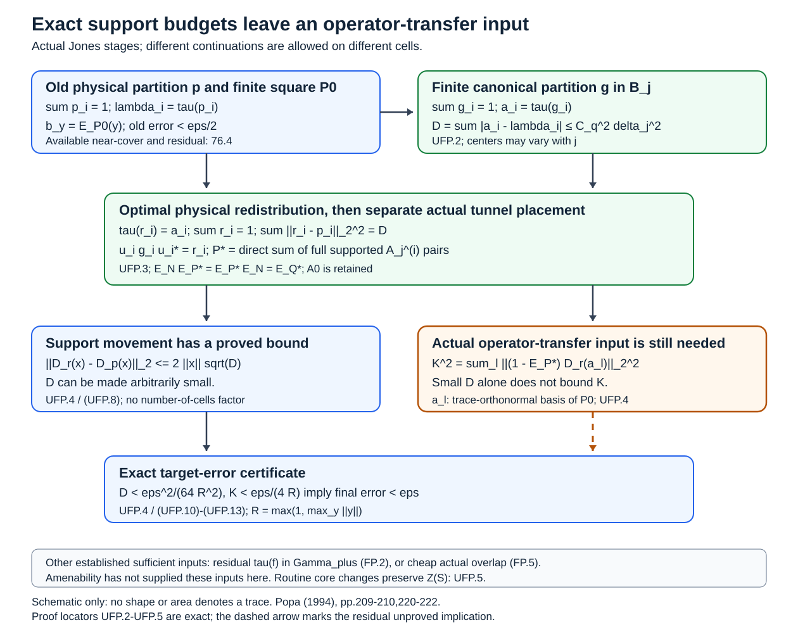

# Finite budgets and whole-tunnel operator transfer

We retain the unrestricted full-partition outcome of Popa’s Theorem 4.4.1(1). The [finite residual-cell reading](finite-residual-cells-and-canonical-overlap.md), FP.1–FP.5, supplies the established completion and overlap criteria. The new result is an actual simultaneous trace-budget placement theorem, with a dimension-free physical compression estimate and a finite orthonormal-basis certificate for transferring the approximating operators. It separates exact support realization from target retention. It does **not** complete the unrestricted amenability implication.

## The original obligation stays unchanged

Let \(N\subsetneq M\) be an amenable finite-index inclusion of II₁ factors, with inherited normalized trace \(\tau\). For every finite \(Y\subset M\) and \(\varepsilon>0\), Popa4.4.1(1), printed p.222, asserts unital finite-dimensional \(Q\subset P\subset M\), \(Q\subset N\), satisfying

\[
 E_PE_N=E_Q,\qquad
 \|y-E_P(y)\|_2<\varepsilon\quad(y\in Y),
 \tag{UFP.0}
\]

and a **finite** orthogonal partition \(\sum_i r_i=1\), where each cell has its own actual finite tunnel and

\[
\begin{gathered}
 r_i\in (N_{j_i}^{(i)})'\cap N,\\
 P=\bigoplus_i r_i((N_{j_i}^{(i)})'\cap M)r_i,\\
 Q=\bigoplus_i r_i((N_{j_i}^{(i)})'\cap N)r_i.
\end{gathered}
\tag{UFP.1}
\]

No finite depth, separability, extremality, ergodic core or unique norm trace is added. Different actual continuations and lengths are permitted. Hilbert-space adjoints give the other expectation order. The existing FP.2 theorem says that an already selected finite family can be retained unchanged and its residual completed with finitely many cells exactly when that residual trace belongs to \(\Gamma_+\). That criterion remains distinct from the construction below, which can change the old support budgets and does not automatically retain their finite algebras.

## The source argument and exact support memberships

Compare Popa’s printed pages 185–187, 191–192, 206–210 and 218–222. The printed cross-reference on page 222 is “2.1.7”. Section 2.1 ends at 2.1.3 on page 192. The actual reduced-algebra heredity statement is Proposition3.2.3(iii), printed pp.206–208, and the relative-core version is3.2.4(ii), printed pp.208–209. Correcting that locator does not supply the missing finite realization step.

The precise replay is as follows.

| Printed mechanism | Exact membership or hypothesis | What it supplies |
| --- | --- | --- |
| 4.1.1(v), pp.209–210 | \(s\in N_m'\cap N\) | A nonzero supported whole-stage finite algebra and normalized local estimates. |
| 4.1.1(vi), p.210 | \(s=s_0f_0\), \(s_0\in N_m'\cap N\), \(f_0\in N_m\cap R\) with scalar central trace there, and \(z_0\in Z(R\cap N)\) | A stronger central form with an explicit near-central comparison; the first local form alone does not supply it. |
| 4.4, p.220 | \(s_i\in N(T_i)\), where \(N(T_i)\) is a **tail factor**; relative amenability plus ergodic core | A maximal countable family covers the unit, using heredity in each physical residual corner. |
| 4.4, p.221 | Equal-trace projections chosen in one later tail factor, then corner-tunnel conjugacy | Amalgamation of finitely many tail-supported corners, followed by **approximate** inclusion of their supports in a later finite relative commutant. |
| 4.4.1(1), p.222 | A finite full partition with \(r_i\in (N_{j_i}^{(i)})'\cap N\), without ergodicity | The original endpoint, whose proof is compressed to the preceding maximality and heredity reference. |

Programme76.2 instead produces supports in finite smaller relative commutants. Its whole-stage support is generally **not** in the tail factor. Programme75.3 proves actual corner heredity with the correct retained core; it does not make an arbitrary residual trace a finite whole-stage trace. Programme76.4 therefore gives a finite near-cover with an explicit residual, rather than (UFP.1). The countable maximal-family argument and finite truncation remain valid at that near-cover endpoint. No source statement is rejected here; the additional step still has to be reconstructed at its actual membership boundary.

## Simultaneously approximate every scalar support budget

Fix one actual tunnel and write

\[
 B_j=N_j'\cap N,\qquad A_j=N_j'\cap M,
 \qquad S=(\bigcup_j B_j)''.
\]

The actual cup-tail factor of11.5, transported as in50.5/51.2 and used in52.1 and57.1, is a unital II₁ subfactor of \(S\). Only its existence and diffuse projection prescription are used here; no assertion about its relative commutant, canonical density or the unresolved above-four projection identity is used. Lemma53.1 supplies \(L^2\) convergence of the finite expectations. All finite stages and their varying centers are the actual inherited-trace stages.

**Lemma UFP.2 — simultaneous finite budgets.** Let \(q\ge1\), \(\lambda_i\ge0\), \(\sum_{i=1}^q\lambda_i=1\), and \(\zeta>0\). There are a finite actual stage \(j\) and orthogonal projections \(g_1,\ldots,g_q\in B_j\), summing exactly to one, such that

\[
 a_i=\tau(g_i),\qquad
 D:=\sum_i|a_i-\lambda_i|<\zeta.
 \tag{UFP.2}
\]

For \(q\ge2\), the following explicit finite-stage check suffices. Choose a partition \(h_i\) with \(\tau(h_i)=\lambda_i\) in the unital cup-tail II₁ factor, and let

\[
\begin{gathered}
 \delta_j=\max_i\|E_{B_j}(h_i)-h_i\|_2,\\
 C_q^2=\frac{25^{q-1}-1}{6}
       +\left(\frac{5^{q-1}-1}{2}\right)^2.
\end{gathered}
\tag{UFP.3}
\]

Then \(D\le C_q^2\delta_j^2\). Thus \(C_q^2\delta_j^2<\zeta\) is a reproducible sufficient certificate. For \(q=1\), take \(g_1=1\), with \(D=0\).

**Proof.** Prescribe the orthogonal \(h_i\) inside that II₁ factor. Put \(x_i=E_{B_j}(h_i)\). For \(i<q\), recursively set

\[
\begin{gathered}
 k_i=1-\sum_{t<i}g_t,\\
 g_i=1_{[1/2,1]}(k_ix_ik_i),\\
 g_q=1-\sum_{t<q}g_t.
\end{gathered}
\tag{UFP.4}
\]

Functional calculus is inside the finite algebra \(B_j\). Since its threshold excludes zero, \(g_i\le k_i\). These are therefore orthogonal projections with exact unit sum.

For completeness, the half-threshold estimate in57.1 is valid against any ambient projection \(h\): if \(0\le x\le1\) and \(g=1_{[1/2,1]}(x)\), then \(g\) minimizes \(\|x-e\|_2\) over all projections \(e\). Expand the squared distances and use the positive and negative spectral parts of \(2x-1\). Consequently \(\|g-h\|_2\le2\|x-h\|_2\).

Write \(d_i=\|g_i-h_i\|_2\) and \(k_i^0=1-\sum_{t<i}h_t\). The contraction product estimate and \(k_i^0h_ik_i^0=h_i\) give

\[
\begin{gathered}
 \|k_ix_ik_i-h_i\|_2
 \le\delta_j+2\|k_i-k_i^0\|_2,\\
 d_i\le2\delta_j+4\sum_{t<i}d_t
       \le2\,5^{i-1}\delta_j\quad(i<q),\\
 d_q\le\sum_{t<q}d_t
       \le\frac{5^{q-1}-1}{2}\delta_j.
\end{gathered}
\tag{UFP.5}
\]

For projections, \(|\tau(g)-\tau(h)|\le\|g-h\|_2^2\), because \(\tau(gh)\le\min(\tau(g),\tau(h))\). Summing the squared bounds in(UFP.5) yields(UFP.3). Lemma53.1 gives \(\delta_j\to0\), so one finite stage passes the check. This argument uses neither stationary centers nor unique norm trace. \(\square\)

In particular, actual finite canonical partition trace vectors are dense in every finite scalar probability simplex. Also \(T\) is countable and dense in \([0,1]\), and \(\Gamma_+\) is countable and dense in \([0,\infty)\). Density does not establish exact membership of any specified residual. All statements here concern actual finite Jones stages, rather than an abstract scalar array.

## Move the physical budgets at their optimal trace cost

**Theorem UFP.3 — actual full partitions near any physical partition.** Let \(p_1,\ldots,p_q\in N\) be an orthogonal partition of one, and put \(\lambda_i=\tau(p_i)\). Apply UFP.2. There are an orthogonal partition \(r_1,\ldots,r_q\in N\), and separate actual whole-inclusion tunnels, such that

\[
\begin{gathered}
 \tau(r_i)=a_i,\qquad [r_i,p_h]=0\quad\text{for every }i,h,\\
 \|r_i-p_i\|_2^2=|a_i-\lambda_i|,\\
 \sum_i\|r_i-p_i\|_2^2=D<\zeta.
\end{gathered}
\tag{UFP.6}
\]

The full supported pairs of those tunnels form finite-dimensional \(Q_*\subset P_*\) satisfying(UFP.1), \(E_NE_{P_*}=E_{P_*}E_N=E_{Q_*}\), and \(A_0=N'\cap M\subset P_*\). Amenability is not needed for this theorem. It makes no target approximation claim.

**Proof.** Cells with \(a_i<\lambda_i\) donate a subprojection of trace \(\lambda_i-a_i\); cells with \(a_i>\lambda_i\) receive trace \(a_i-\lambda_i\). Total donation and demand are equal since both vectors sum to one. Split each donating projection into finitely many pieces of the demanded traces, using continuous projection prescription in the II₁ factor \(N\). The elementary greedy supply-and-demand algorithm gives a finite allocation. Remove the donated pieces from each donor and add its assigned pieces to each recipient. The resulting \(r_i\) are orthogonal, sum to one, and commute with every \(p_h\), since all pieces lie in individual old cells. A donor is a subprojection of its old cell; a recipient contains its old cell. This proves the exact symmetric-difference formula(UFP.6), including cells of trace zero. That cost is minimal for any projections with these two traces, by the projection inequality used in UFP.2.

Equal-trace comparison gives \(u_i\in\mathcal U(N)\) with \(u_ig_iu_i^*=r_i\). Conjugate the fixed whole tunnel separately by each \(u_i\), and put

\[
\begin{gathered}
 A_j^{(i)}=u_iA_ju_i^*,\quad B_j^{(i)}=u_iB_ju_i^*,\\
 P_*=\bigoplus_i r_iA_j^{(i)}r_i,\quad
 Q_*=\bigoplus_i r_iB_j^{(i)}r_i.
\end{gathered}
\tag{UFP.7}
\]

Omit zero cells. This is exactly78.2 applied separately at the **same finite canonical length**; the actual continuations differ. Each supported stage satisfies \(E_N(r_iA_j^{(i)}r_i)=r_iB_j^{(i)}r_i\), by53.1 and bimodularity. Trace pairing characterizes both expectation orders as \(E_{Q_*}\). Every \(u_i\in N\) fixes \(A_0\) pointwise, and every support commutes with \(A_0\), so \(A_0\subset P_*\). No unitary conjugates a physical target. The separate \(u_i\) are not claimed to be near one or to preserve the old finite algebras. \(\square\)

## A finite operator certificate isolates target retention

For any orthogonal unit partition \(v=(v_i)\), define its physical pinching

\[
 \mathcal D_v(x)=\sum_i v_ixv_i.
\]

**Lemma UFP.4 — dimension-free movement and the exact transfer defect.** For the partitions \(p,r\) of UFP.3 and every bounded \(x\in M\),

\[
 \|\mathcal D_r(x)-\mathcal D_p(x)\|_2
 \le2\|x\|\sqrt D.
 \tag{UFP.8}
\]

Suppose an existing finite square \(Q_0\subset P_0\) is supported on the old physical partition \(p\), with \(\|y-E_{P_0}(y)\|_2<\epsilon_0\) for \(y\in Y\). The residual cell from76.4 is included as one of the \(p_i\), so this hypothesis is exactly available. Put \(b_y=E_{P_0}(y)\), \(R=\max(\{1\}\cup\{\|y\|:y\in Y\})\), and define the **actual** finite operator defect

\[
 \eta_y=\|\mathcal D_r(b_y)-E_{P_*}\mathcal D_r(b_y)\|_2.
 \tag{UFP.9}
\]

Then

\[
 \|y-E_{P_*}(y)\|_2
 <\epsilon_0+\sqrt{4R^2D+\eta_y^2}.
 \tag{UFP.10}
\]

Let \(a_1,\ldots,a_L\) be any trace-orthonormal linear basis of the finite algebra \(P_0\), and set

\[
 K^2=\sum_{l=1}^L
 \|\mathcal D_r(a_l)-E_{P_*}\mathcal D_r(a_l)\|_2^2.
 \tag{UFP.11}
\]

For an actual finite matrix decomposition of \(P_0\), let \(e_{ab}^{(v)}\) be its matrix units and \(\nu_v\) the inherited trace of a minimal projection. The explicit basis is \(a_{vab}=\nu_v^{-1/2}e_{ab}^{(v)}\); these are actual minimal-projection weights. The finite certificate \(\eta_y\le\|y\|_2K\le RK\) is valid for all targets. In particular, the concrete checks

\[
 \epsilon_0<\varepsilon/2,\qquad
 D<\frac{\varepsilon^2}{64R^2},\qquad
 K<\frac{\varepsilon}{4R}
 \tag{UFP.12}
\]

suffice for the original approximation bound(UFP.0). UFP.2 supplies arbitrarily small \(D\), including its explicit finite-stage test. No argument here supplies small \(K\) from unrestricted amenability.

**Proof.** Expand

\[
\begin{aligned}
 \mathcal D_r(x)-\mathcal D_p(x)
 &=\sum_i(r_i-p_i)xr_i
   +\sum_i p_ix(r_i-p_i).
\end{aligned}
\]

The first summands have orthogonal right supports, and the second have orthogonal left supports. Each sum has \(L^2\) norm at most \(\|x\|\sqrt D\), using contraction of multiplication and(UFP.6). This proves(UFP.8) with no factor depending on the number of cells.

The map \(\mathcal D_r\) is the trace-orthogonal projection onto the block-diagonal von Neumann algebra. Since \(P_*\) is contained in that algebra, \(E_{P_*}\mathcal D_r=E_{P_*}=\mathcal D_rE_{P_*}\). Since \(b_y\in P_0\), \(\mathcal D_p(b_y)=b_y\). The two components below are orthogonal:

\[
\begin{gathered}
 (1-E_{P_*})b_y
 =b_y-\mathcal D_r(b_y)
  +(1-E_{P_*})\mathcal D_r(b_y),\\
 \|(1-E_{P_*})b_y\|_2^2
 =\|b_y-\mathcal D_r(b_y)\|_2^2+\eta_y^2
 \le4R^2D+\eta_y^2.
\end{gathered}
\tag{UFP.13}
\]

Expectation contraction applied to \(y-b_y\), followed by the triangle inequality, proves(UFP.10). Expand \(b_y=\sum_l\beta_la_l\). Cauchy–Schwarz gives \(\eta_y\le(\sum_l|\beta_l|^2)^{1/2}K=\|b_y\|_2K\le\|y\|_2K\). Finally(UFP.12) bounds the square root by strictly less than \(\varepsilon/(2\sqrt2)<\varepsilon/2\). This proves the asserted sufficient certificate. \(\square\)

The condition \(K=0\) is exactly \(\mathcal D_r(P_0)\subset P_*\). Small budget changes alone do not imply this inclusion, a small positive \(K\), near-identity comparison unitaries, or preservation of old matrix units. This is the precise finite operator realization obstruction in this new route. It is an assertion about actual chosen tunnels, their supported finite algebras and finitely many explicit operators. It is not an abstract numerical counterexample or a claim that amenability is insufficient.

## A smaller factor core cannot be created by the proposed routine operations

**Proposition UFP.5 — retain the actual smaller center.** Changing the whole tunnel preserves the actual inherited-trace core pair normally, without requiring either core endpoint to be a factor. Removing a finite unital matrix factor \(D\cong M_n\subset S\) preserves its smaller center. Under the present amenability hypothesis, every actual core of a physical corner inclusion supplied by75.3 is normally trace-isomorphic to the original actual core. Thus these operations cannot turn a nonfactor smaller core into a factor.

**Proof.** The proof of29.1 compares the tunnels by unitaries \(w_j\in N\), with the next correction in \(N_j\). Each next correction fixes \(A_j\) and \(B_j\) pointwise. Their conjugations and inverses therefore stabilize on every finite stage and define compatible trace-preserving *-isomorphisms of both algebraic unions. The tracial Hilbert completions give a unitary implementing a normal isomorphism of the von Neumann closures. This part of29.1 uses no finite index of the larger core in \(M\), no separability, no core factoriality and no finite depth. It is already used with that exact unrestricted scope in75.1. In particular \(Z(S)\) maps normally onto the other smaller center.

For the finite deletion, write \(S=D\bar\otimes S_0\), \(R=D\bar\otimes R_0\), as in51.5/52.3. Then \(Z(S)=1_D\otimes Z(S_0)\), so \(S_0\) is a factor exactly when \(S\) is. The canonical trace multiplier \(n^2\) changes neither this conclusion nor the actual center.

For a physical \(0<p\in N\),75.1 first constructs a retained factor containing \(p\) in every tail level. It commutes with the new actual core \(S_1\subset R_1\). The corner core is \(pS_1\subset pR_1\), with \(x\mapsto px\) a normal isomorphism and \(\tau_p(px)=\tau(x)\), by75.6 and75.11. It has the original smaller center. Comparing any other actual corner tunnel by the preceding compatible argument preserves that center again. \(\square\)

This must be distinguished from an arbitrary compression \(pSp\) in the **old** core. For \(p\in S\), its center is the compression of \(Z(S)c_S(p)\); its normalized central trace measure is reweighted by \(E_{Z(S)}(p)/\tau(p)\). For example, conditionally on an actual \(S\) with more than one central atom, choosing \(p\) supported in just one factorial atom can make \(pSp\) a factor, while the actual physical-corner core in UFP.5 still has the original nontrivial center. Such a compression therefore cannot be identified with that actual corner core. This conditional observation asserts no unconstructed amenable Jones example.

A new factor-core route would need a new actual construction, a proof of smaller-core factoriality, and transfer of the physical target operators. Physical factoriality of \(N,M\), factoriality of an auxiliary path trace, deletion of finite matrices, or ordinary projection compression provides none of these missing identifications.

## Bounded outcome and reproducible checks

The new UFP.2–UFP.4 construction places all scalar support budgets near any given physical partition into an **exact finite full whole-tunnel partition**, and isolates target retention in the finite operator quantity(UFP.11), with the constants in(UFP.3),(UFP.8),(UFP.12). UFP.5 proves why the proposed routine factor-core modification cannot create the needed smaller factor. The unrestricted theorem(UFP.0)–(UFP.1) remains unresolved here: one still needs amenability to supply a selected family with residual trace in \(\Gamma_+\), the established sufficiently cheap actual overlap/cut route, or a full budget placement with small actual operator-transfer defect \(K\).

The [editable figure and finite-check source](figures/finite-budget-operator-transfer-v3.py) reproduces the schematic and the observed finite-matrix checks. The finite-matrix check verifies the optimal redistribution cost, dimension-free pinching bound and exact orthogonal transfer identity. It does not stand in for a Jones model or infer a trace geometry from a diagram. The separate singular-state and above-four central-density obligations remain open.

S. Popa, *Classification of amenable subfactors of type II*, Acta Mathematica 172 (1994), 163–255, [DOI](https://doi.org/10.1007/BF02392646), [Project Euclid](https://projecteuclid.org/euclid.acta/1485890776). Immediate mathematical dependencies:11.5,29.1 in its replayed compatible scope,50.5/51.2 for actual cup identification,52.1 only for the unital cup-tail subfactor,53.1,57.1's half-threshold estimate,75.1/75.3,76.2/76.4,78.1/78.2, and the completed FP.1–FP.5 criterion. Their existing declared prerequisite obligations remain in force.

## Reproducible schematic

Figure UFP.1. Actual finite budget placement supplies the exact full support structure. The small actual operator-transfer K needed for target approximation remains unproved under unrestricted amenability. All shapes are schematic; no trace areas or geometry are inferred. [Editable figure and finite-check source](figures/finite-budget-operator-transfer-v3.py). Source context: Popa (1994), pages 209–210 and 220–222; exact proof locators UFP.2–UFP.13.

## Solved learner checks

**Exercise UFP.1 — one stage, three budgets, and the minimum movement cost.** Let an actual physical partition have traces \(\lambda=(1/2,1/4,1/4)\). For \(q=3\), compute the sufficient simultaneous budget bound when \(\delta_j<1/256\). Suppose a checked actual stage has trace vector \(a=(2047/4096,1025/4096,1/4)\). Construct the optimal physical redistribution, give all three squared support errors, and explain what this calculation proves about the supported algebras and the physical targets.

**Solution.** The recurrence bounds are \(d_1\le2\delta_j\), \(d_2\le10\delta_j\), \(d_3\le12\delta_j\). Hence \(C_3^2=4+100+144=248\), and

\[
 D\le248\delta_j^2<248/65536=31/8192<1/256.
\]

For the observed vector, cell 1 donates a projection \(t\le p_1\) of trace \(1/4096\) to cell 2. Take \(r_1=p_1-t\), \(r_2=p_2+t\), \(r_3=p_3\). They sum to one, are orthogonal, and commute with every \(p_h\). Their squared errors are \(1/4096,1/4096,0\), with total \(D=1/2048\). Every competing projection of each specified trace has squared error at least its trace difference, so the total cost is optimal. Unitary comparison with the checked canonical stage provides all full supported whole-tunnel pairs and both expectation identities. Target approximation still requires the actual operator-transfer check. The stated exact vector is conditional on an observed actual stage; its occurrence for an arbitrary inclusion is not inferred from density.

**Exercise UFP.2 — quantify transfer and separate it from support movement.** Suppose actual old and new pairs satisfy UFP.4 with \(R=2\), \(\varepsilon=1/10\), \(\epsilon_0=1/40\), observed \(D=1/51200\), and observed \(K=1/160\). Compute a uniform final error bound and verify every strict certificate. Then, as a finite tracial algebra illustration only, take \(P_0=M_2(\mathbb C)\), \(P_* =\mathbb C1\), the unchanged single support1, and normalized trace. Compute \(K^2\) using the four actual trace-orthonormal matrix units. Does this illustrate a Jones counterexample or settle general amenability?

**Solution.** The thresholds are \(\epsilon_0<1/20\), \(D<1/25600\), and \(K<1/80\), all strictly satisfied. The transfer bound gives \(\eta_y\le RK=1/80\). The squared new error contribution is bounded by

\[
 4R^2D+R^2K^2
 =16/51200+4/25600
 =3/6400.
\]

Therefore every final error is strictly less than \(1/40+\sqrt3/80=(2+\sqrt3)/80<1/10\). The strictness comes from the old error bound, even if the two new contribution bounds attain equality.

In the illustration, the minimal-projection trace is \(1/2\), so the basis is \(\sqrt2E_{ab}\). Pinching is the identity, \(D=0\), and \(E_{P_*}(x)=\operatorname{tr}_2(x)1\). Each of the two diagonal basis vectors has residual squared norm \(1/2\), and each off-diagonal vector has residual squared norm1. Thus \(K^2=1/2+1/2+1+1=3\). For \(y=E_{12}\), the transfer defect and final error are both \(1/\sqrt2\) despite zero support movement. This proves that support movement alone does not control an arbitrary finite operator transfer. It is only a finite-algebra illustration: no identification with actual Jones stages, no counterexample to amenability, and no conclusion about the existence of a different low-\(K\) choice is made.

Original independently written programme text and figure: public domain, CC0 1.0.
