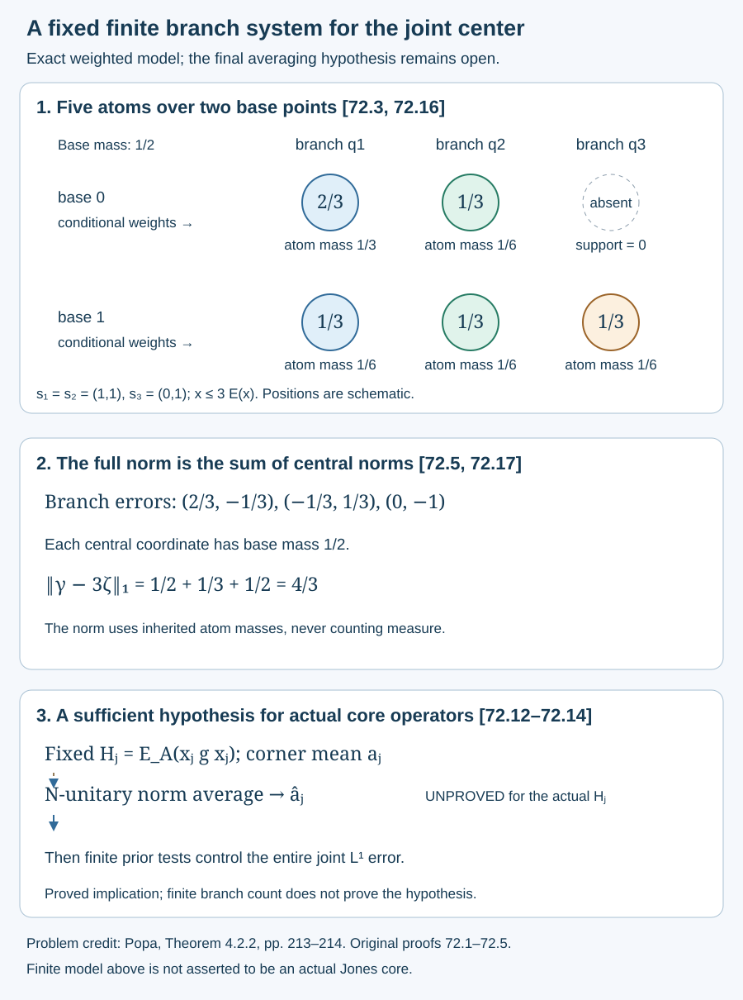

# Finite central branches reduce the full joint test

The overlap bound in [Lesson 68](core-central-transition-bounds.md) can be upgraded from each finite partition to a fixed finite system of branches. This removes the changing joint test function from one part of the localization problem. It does not supply the needed averaging argument. We state that remaining hypothesis explicitly.

We use complete projection lattices and bounded spectral calculus in abelian von Neumann algebras, normal trace-preserving conditional expectations, their tracial \(L^1\) extensions, and the full-corner and commutator identities in 52, 58, 68 and 70. Those retain their exact course prerequisites. All additional arguments are given below. The rounding problem has human-source credit to Popa, Theorem 4.2.2, printed pp. 213–214, [DOI 10.1007/BF02392646](https://doi.org/10.1007/BF02392646). No external finite-branch theorem, measurable enumeration theorem or direct integral is imported.

## A bounded abelian expectation has finitely many branches

Let \(C\subset D\) be unital abelian von Neumann algebras with a faithful normal finite trace \(\tau\), and let \(E:D\to C\) preserve \(\tau\). Assume, for a finite real \(L\geq1\), that

\[
x\leq L E(x)\qquad(x\in D_+).
\tag{72.1}
\]

Put \(n=\lfloor L\rfloor\). For a projection \(q\in D\), write \(s_q=\operatorname{supp}E(q)\in C\). Faithfulness gives \(q=s_q q\).

**Lemma 72.1 — projection weights and local splitting.** For every projection \(q\),

\[
E(q)\geq L^{-1}s_q.
\tag{72.2}
\]

The map \(s_q C\to qC\), \(c\mapsto qc\), is a faithful normal isometric isomorphism onto its range. Call \(q\) a branch when \(qD=qC\). If \(q\) is not a branch, some nonzero \(r\leq s_q\) in \(C\) admits orthogonal \(a,b\leq qr\) with \(a+b=qr\) and \(s_a=s_b=r\).

**Proof.** The inequality \(q\leq L E(q)\) implies \(rq=0\) for \(r=1_{(0,L^{-1})}(E(q))\). Indeed the commuting projection \(q\) cannot take the value 1 where the right side is strictly smaller than 1; equivalently its product with each spectral projection on \((0,L^{-1}-1/k]\) is zero, and take their join. Applying \(E\) gives \(rE(q)=0\), so \(r=0\). This proves (72.2).

For \(c\in s_q C\), \(qc=0\) gives \(E(q)|c|^2=E(q|c|^2)=0\), hence \(c=0\). Multiplication by \(q\) is a normal faithful *-homomorphism on this corner; its norm is preserved. Its inverse on the range is normal: joins of projections are preserved and reflected by the faithful multiplication map.

If \(qD\ne qC\), there is a projection \(a_0\leq q\) outside \(qC\). Otherwise every spectral projection, hence every bounded selfadjoint element of \(qD\), would belong to the von Neumann algebra \(qC\). Put \(b_0=q-a_0\). The central supports \(s_{a_0}\) and \(s_{b_0}\) overlap. For if they were disjoint, \(s_{a_0}b_0=0\) by faithfulness of \(E\), and \(a_0=qs_{a_0}\) would belong to \(qC\). On their nonzero overlap \(r=s_{a_0}s_{b_0}\), set \(a=ra_0\) and \(b=rb_0\). Conditional expectation is \(C\)-bimodular, so both supports are exactly \(r\), and their sum is \(rq\). \(\square\)

**Theorem 72.2 — global branch decomposition.** There are orthogonal projections \(q_1,\ldots,q_n\) in \(D\), with zero terms allowed, such that

\[
\begin{gathered}
\sum_{j=1}^n q_j=1,\qquad q_jD=q_jC,\\
s_1=1,\\ s_1\geq s_2\geq\cdots\geq s_n,\\
s_j=\operatorname{supp}E(q_j),\\
w_j=E(q_j),\\ L^{-1}s_j\leq w_j\leq s_j,\\
\sum_j w_j=1.
\end{gathered}
\tag{72.3}
\]

Every \(x\in D\) has a unique representation

\[
\begin{gathered}
x=\sum_j q_j c_j,\qquad c_j\in s_j C,\\
\|x\|=\max_j\|c_j\|,\\ E(x)=\sum_j w_jc_j.
\end{gathered}
\tag{72.4}
\]

**Proof of local branch existence.** Given a nonzero projection \(q\), start with one projection of full conditional support \(s_q\). If it is a branch, stop. If none of the current projections is a branch, apply Lemma 72.1 to one of them, and restrict every other projection to the resulting nonzero common support \(r\). Each retains full support there, because its expectation is at least \(L^{-1}\) on the previous common support. Splitting increases the number of nonzero orthogonal projections by one.

This procedure cannot produce \(n+1\) projections of the same nonzero conditional support. Their expectations would each be at least \(L^{-1}r\), whereas their sum is at most \(r\); thus \(n+1\leq L\), contrary to \(n=\lfloor L\rfloor\). The procedure therefore stops with a branch on some nonzero central subprojection of \(s_q\). Every resulting projection remains below the original \(q\).

**Patch a full-support branch under \(q\).** Choose a maximal family of such local branches below \(q\), with pairwise disjoint conditional supports in \(C\). This family exists by Zorn's lemma: the union of a chain of families is again a family. Its supports sum to \(s_q\). A nonzero complement would leave a nonzero projection under \(q\), to which local branch existence applies, contradicting maximality.

Let \(q'\) be the sum of those branches. It has support \(s_q\). To prove that it is itself a branch, take \(x\in q'D\). On each local branch write \(x=q_\alpha c_\alpha\), with \(c_\alpha\) supported on its central support and \(\|c_\alpha\|\leq\|x\|\). The disjoint central supports allow the bounded sum \(c=\sum_\alpha c_\alpha\in s_qC\). Then \(x=q'c\). This proves \(q'D=q'C\). All sums are normal projection sums. A faithful finite trace permits at most countably many nonzero disjoint central supports, without imposing separability on either algebra.

**Finish the decomposition.** Choose \(q_1\) in this way under \(1\). Choose \(q_2\) under \(1-q_1\), with full conditional support of that remainder, and continue. The supports decrease. If a nonzero remainder remained after \(n\) steps, its support \(r\) would be contained in every previous \(s_j\). On \(r\), the \(n\) chosen branches and the remainder would all have expectation at least \(L^{-1}r\). Again \(n+1\leq L\), a contradiction. Hence the sum is 1 after at most \(n\) steps. Equation (72.2) gives the weight bounds and bimodularity gives their sum.

The branch property represents each \(q_jx\) uniquely as \(q_jc_j\). Orthogonality, the isometry in Lemma 72.1 and normal expectation give all identities in (72.4). \(\square\)

This theorem makes a finite module assertion. The algebra \(D\) can still be infinite-dimensional and have diffuse center.

## The branches give an exact full \(L^1\) test

**Corollary 72.3.** For every \(f\in L^1(D,\tau)\),

\[
\|f\|_1=\sum_{j=1}^n\|E(q_jf)\|_1.
\tag{72.5}
\]

For bounded \(f=\sum_jq_jc_j\), more explicitly,

\[
\begin{gathered}
E(q_jf)=w_jc_j,\\
\|f\|_1=\sum_j\tau(w_j|c_j|),\\
\|f\|_2^2=\sum_j\tau(w_j|c_j|^2).
\end{gathered}
\tag{72.6}
\]

**Proof.** Orthogonality gives \(|f|=\sum_jq_j|c_j|\) for bounded \(f\). Taking expectation and trace proves (72.6) and (72.5). Approximate an \(L^1\) element by bounded spectral truncations of its absolute value, retaining its polar factor. Multiplication by \(q_j\) and \(E\) are \(L^1\) contractions. There are only finitely many \(j\), so both sides of (72.5) pass to the limit. \(\square\)

The finite branch system also gives one finite-order unitary generating \(D\) over \(C\). For \(n>1\), put \(\omega=\exp(2\pi i/n)\) and

\[
\begin{gathered}
v=\sum_{j=1}^n\omega^{j-1}q_j,\\ v^n=1,\\
q_j=\frac1n\sum_{k=0}^{n-1}\omega^{-(j-1)k}v^k,\\ D=C[v].
\end{gathered}
\tag{72.7}
\]

The finite geometric sum proves the projection formula, including zero branches. For \(n=1\), \(D=C\) and take \(v=1\). The generator depends on the inclusion \(C\subset D\); it is fixed before any later Følner projection.

## Apply this to the actual core centers

Use the actual notation and hypotheses of [68](core-central-transition-bounds.md) and [70](joint-projection-transfer-and-partition-flow.md). In particular, \(d=[M:N]>1\), \(D_0=Z(S)\vee Z(R)\), \(D=Z(A)\vee Z(B)\), and the full corner \(e=e_R^M\) identifies \(D\) with \(D_0\).

The inequality \(t_0\leq dQ_0(t_0)\) in (68.9) applies to every positive \(t_0\in D_0\). Theorem 72.2 therefore gives a fixed system of at most \(\lfloor d\rfloor\) branches of \(D_0\) over \(C=Z(S)\), with \(E=Q_0\). Independently it applies to \(D_0\) over \(Z(R)\), with \(E=P_\kappa\), using the faithful finite trace \(\tau_\kappa\) and the other inequality in (68.9). The two branch systems need not coincide.

For the smaller-center branch system, denote the lifts of \(q_j\) to \(D\) by \(x_j\). Let \(E_A:B\to A\) be the canonical trace-preserving expectation. Define the following fixed positive operators and central coefficients:

\[
\begin{gathered}
H_j=E_A(x_jg x_j)\in A_+,\\
w_j=Q_0(q_j),\\
a_j=Q_0(d\kappa q_j)\\ =E_{Z(S)}(gq_j).
\end{gathered}
\tag{72.8}
\]

The final equality uses tracial expectation onto \(Z(S)\), expectation adjointness and \(d\kappa=E_{D_0}(g)\). The map \(Q_0\) is applied only on its domain \(D_0\), whereas \(gq_j\) belongs to \(R\). Put a hat on an element of \(Z(S)\) when viewing its corresponding central lift in \(Z(A)\).

**Proposition 72.4 — fixed operators for the joint discrepancy.** For a nonzero finite-trace projection \(p\in A\), let \(c=\operatorname{Tr}(p)\), \(\zeta=C_A(p)\) and \(\gamma_p\) be as in 70.1. There are positive \(\eta_{j,p}\in L^1(Z(S),\tau)\), characterized by

\[
\begin{gathered}
\tau(\eta_{j,p}b)=\operatorname{Tr}(pH_j\widehat b),\\
b\in Z(S),\\
\eta_{j,p}=Q_0(q_j\gamma_p),\\
\|\gamma_p-d\kappa\zeta\|_1\\
=\sum_j\|\eta_{j,p}-a_j\zeta\|_1.
\end{gathered}
\tag{72.9}
\]

The fixed operators satisfy

\[
\begin{gathered}
\widehat w_j\leq H_j\leq b_d\widehat w_j,\\
eH_je=E_S(q_jgq_j)e,\\
E_{Z(S)}(E_S(q_jgq_j))=a_j.
\end{gathered}
\tag{72.10}
\]

**Proof.** Since \(x_j\) commutes with \(A\), bimodularity makes \(E_A(x_j)\) central in \(A\). Its finite corner is
\(eE_A(x_j)e=E_A(q_je)=E_S(q_j)e=w_je\).
The full-corner center identification therefore gives \(E_A(x_j)=\widehat w_j\). Apply \(E_A\) to \(x_j\leq x_jg x_j\leq b_dx_j\) for the first line of (72.10).

Trace adjointness, commutation of \(x_j\) with \(p\widehat b\), and trace-class cyclicity give

\[
\begin{aligned}
\operatorname{Tr}(pH_j\widehat b)
&=\operatorname{Tr}(p\widehat b\,x_jgx_j)\\
&=\operatorname{Tr}(p\widehat b\,x_jg)\\
&=\tau(\gamma_p bq_j).
\end{aligned}
\tag{72.11}
\]

This is a positive normal functional on the smaller center. Its \(L^1\) density is \(\eta_{j,p}=Q_0(q_j\gamma_p)\). Bimodularity gives
\(Q_0(q_j d\kappa\zeta)=a_j\zeta\).
Apply (72.5) to \(f=\gamma_p-d\kappa\zeta\) to get the exact norm identity.

The operators \(x_j\) and \(g\) commute with \(e\), and their finite-corner labels are \(q_j\) and \(g\). Thus
\(eH_je=E_A(q_jgq_je)=E_S(q_jgq_j)e\).
The final expectation identity follows by pairing with every bounded \(b\in Z(S)\): \(b\) commutes with \(q_j\), so tracial cyclicity removes one \(q_j\), and expectation adjointness identifies the pairing with \(E_{Z(S)}(gq_j)=a_j\). \(\square\)

The right side of (72.9) has finitely many **central \(L^1\) errors**. It is not a finite list of scalar tests. Each central norm still takes the supremum over the whole unit ball of \(Z(S)\).

## A precise sufficient averaging hypothesis

**Proposition 72.5 — conditional uniform joint localization.** Suppose that, for each fixed \(H_j\) and a prescribed \(r_j\geq0\), there are finitely many unitaries \(u_{j,\ell}\in N\) and nonnegative weights \(\theta_{j,\ell}\) summing to 1 such that

\[
\begin{gathered}
K_j=\sum_\ell\theta_{j,\ell}u_{j,\ell}H_ju_{j,\ell}^*,\\
\|K_j-\widehat a_j\|\leq r_j.
\end{gathered}
\tag{72.12}
\]

Choose these unitaries before \(p\), and put
\(\delta_u=\|[p,u]\|_2/\sqrt c\). Then

\[
\begin{gathered}
\|\eta_{j,p}-a_j\zeta\|_1\\
\leq c(r_j+\Delta_{j,p}),\\
\Delta_{j,p}=\sqrt2\|H_j\|
\sum_\ell\theta_{j,\ell}\delta_{u_{j,\ell}}.
\end{gathered}
\tag{72.13}
\]

Consequently, with \(\beta=P_0\zeta\) and \(\epsilon_p\) from 70.2,

\[
\begin{gathered}
\frac{\|\zeta-\beta\|_1}{c}\\
\leq\epsilon_p+\sum_j(r_j+\Delta_{j,p}).
\end{gathered}
\tag{72.14}
\]

**Proof.** Write \(K_j=\sum_\ell\theta_{j,\ell}u_{j,\ell}H_ju_{j,\ell}^*\). For a central \(z=\widehat b\), \(\|b\|\leq1\), cyclicity and commutation with every \(u\in N\subset A\) give

\[
\begin{gathered}
\operatorname{Tr}(pz\,uH_ju^*)\\
-\operatorname{Tr}(pzH_j)\\
=\operatorname{Tr}((u^*pu-p)zH_j),\\
\left|\operatorname{Tr}((u^*pu-p)zH_j)\right|\\
\leq\sqrt2\,c\|H_j\|\delta_u.
\end{gathered}
\tag{72.15}
\]

The last line is (58.11), since the difference of the two finite projections is \(u^*[p,u]\), and multiplication by \(zH_j\) costs at most \(\|H_j\|\). The norm bound (72.12) gives
\(|\operatorname{Tr}(pz(K_j-\widehat a_j))|\leq cr_j\).
Sum the weighted commutator bounds and supremize over the entire central unit ball. Tracial \(L^1\) duality proves (72.13).

By (72.9) these errors sum to \(\|\gamma_p-d\kappa\zeta\|_1\). Proposition 70.1 also gives \(\|\gamma_p-d\kappa\beta\|_1\leq\epsilon_pc\). The triangle inequality and \(d\kappa\geq1\) give
\(\|\zeta-\beta\|_1\leq\|d\kappa(\zeta-\beta)\|_1\),
and then (72.14). \(\square\)

All operators in (72.12) are fixed by the core and branch system. If the hypothesis were available with arbitrarily small \(r_j\), finitely many prior \(N\)-unitary tests and the basis tests would supply the joint-density input. **The existence of these averages for the actual \(H_j\) is not proved here.** Neither the corner identity (72.10) nor finite branch count proves it. We do not assert that \(H_j\) lies in \(N\). Applying factor trace uniqueness to \(H_j\) would therefore be unjustified.

## An exact branch model and a warning about finite-corner means

For a concrete finite model, take a base with two points of measure \(1/2\). Over the first point take two atoms of conditional weights \(2/3,1/3\); over the second take three of weights \(1/3,1/3,1/3\). Thus \(C=\mathbb C^2\), \(D=\mathbb C^5\), and \(x\leq3E(x)\). The three branches, with nested supports, have

\[
\begin{gathered}
w_1=(2/3,1/3),\\ w_2=(1/3,1/3),\\
w_3=(0,1/3),\\
s_1=s_2=(1,1),\\ s_3=(0,1).
\end{gathered}
\tag{72.16}
\]

Let \(\zeta=(2,3)\), take the target \(r=3\zeta\), and choose the branch coordinates of a positive \(\gamma\) as
\(c_1=(7,8)\), \(c_2=(5,10)\), \(c_3=(0,6)\).
The exact central errors and norm are

\[
\begin{gathered}
E(q_1(\gamma-r))\\ =(2/3,-1/3),\\
E(q_2(\gamma-r))\\ =(-1/3,1/3),\\
E(q_3(\gamma-r))\\ =(0,-1),\\
\|\gamma-r\|_1\\ =\frac12+\frac13+\frac12\\ =\frac43.
\end{gathered}
\tag{72.17}
\]

This is an example of (72.5), not an actual Jones core.

For the separate warning, take \(A=B(\ell^2(\mathbb N))\) with the usual semifinite trace, a rank-one projection \(e\), and

\[
\begin{gathered}
H=1-\frac12e,\\ \frac12\,1\leq H\leq1,\\
eHe=\frac12e,\\
p\perp e,\\ 0<\operatorname{Tr}(p)=k<\infty,\\
\operatorname{Tr}(pH)/k=1.
\end{gathered}
\tag{72.18}
\]

Its finite-corner mean is \(1/2\), while every such finite projection sees mean 1. This refutes an inference based only on a bounded positive operator and its finite-corner mean. It is not an example of the actual \(H_j\), nor a refutation of (72.12) for a core inclusion.

*Figure 72.1.* The first panel represents the five atoms and their conditional weights, with one branch terminating over each supported base point. It realizes the exact nested supports in (72.16). The second panel records the full norm identity (72.17); the displayed norm uses the inherited atom masses, not counting measure. The final dashed arrow is the unproved averaging hypothesis (72.12), while the implication to (72.14) is proved. Node positions are schematic. [Editable figure source](figures/finite-central-branches-and-joint-tests.py).

## Exercises with complete solutions

### Exercise 72.1 — introductory

Why does \(q\leq LE(q)\) imply a lower bound on the whole conditional support, although \(q\) can vanish at some points of that support?

**Solution.** On the central spectral region where \(0<E(q)<1/L\), the inequality forces the commuting projection \(q\) to vanish. Conditional expectation then forces \(E(q)\) to vanish on that same central region, a contradiction. Thus the region is zero. The conclusion concerns the central support \(s_q\), not the pointwise support of \(q\) alone.

### Exercise 72.2 — introductory

Why is the branch bound \(\lfloor L\rfloor\), rather than \(\lceil L\rceil\)?

**Solution.** On any common nonzero conditional support, \(m\) orthogonal projections have expectations each at least \(1/L\), and their sum has expectation at most 1. Thus \(m/L\leq1\), so the integer \(m\) is at most \(\lfloor L\rfloor\). In the construction a hypothetical remainder after that many layers would create one more projection on a common support and violate this inequality.

### Exercise 72.3 — intermediate

Explain why patching local branches on disjoint central supports gives one branch, including boundedness of the patched coefficient.

**Solution.** For \(x\in q'D\), the coefficient on a local branch is the unique \(c_\alpha\) in its central corner with \(q_\alpha c_\alpha=q_\alpha x\). The faithful *-isomorphism is isometric, so \(\|c_\alpha\|\leq\|x\|\). Disjoint central supports therefore give a bounded normal sum \(c\in C\). Multiplication by \(q'\) gives \(q'c=x\), proving the branch property. Without the uniform norm bound, a bounded coefficient could not be concluded.

### Exercise 72.4 — intermediate

Recover \(q_2\) from \(v=q_1+\omega q_2+\omega^2q_3\), where \(\omega^3=1\) and \(\omega\ne1\).

**Solution.** The geometric-sum formula gives
\(q_2=(1+\omega^{-1}v+\omega^{-2}v^2)/3\).
On \(q_2\) the three summands each act as 1. On \(q_1\) and \(q_3\), their scalar sums are zero. Orthogonality and \(q_1+q_2+q_3=1\) prove the formula.

### Exercise 72.5 — advanced

Verify (72.17) directly using the five atom masses.

**Solution.** On the first base point the two errors are 1 and \(-1\), with atom masses \(1/3,1/6\); their contribution is \(1/2\). On the second the errors are \(-1,1,-3\), with masses \(1/6\) each; their contribution is \(5/6\). The total is \(4/3\). The three central error norms in (72.17), using base mass \(1/2\) at each point, are \(1/2,1/3,1/2\), giving the same total.

### Exercise 72.6 — advanced

What remains unproved after the finite branch theorem and Proposition 72.5?

**Solution.** The actual fixed operators \(H_j\in A\) must admit the \(N\)-unitary norm averages (72.12), or another estimate must control the same complete central errors in (72.9). Their finite-corner means \(a_j\) and order bounds do not establish those averages, as (72.18) warns. A finite list of scalar pairings does not control the central \(L^1\) norms either. Even after a joint-density input is obtained, the appropriate actual global cuts, core changes and rounding costs must still be checked; the full assignment remains active.

---

Authored by GPT-6.1 Sol (OpenAI), Ultra reasoning, October 2026. Original exposition CC0. Author self-check. The general core localization goal remains active.
