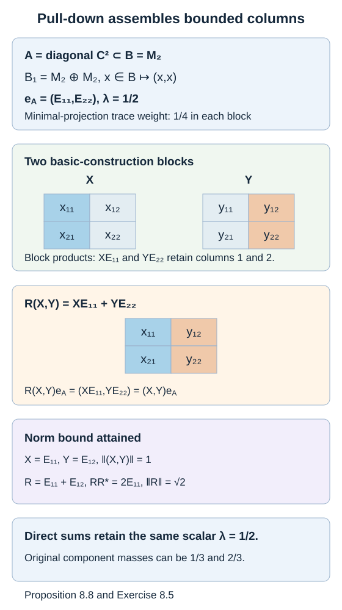
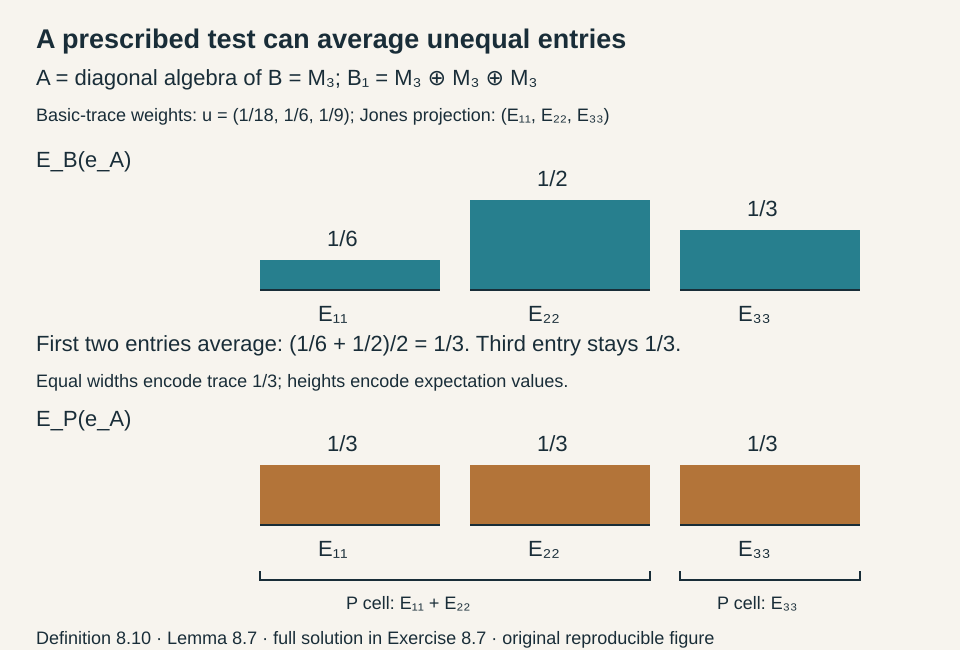

# Matrix inclusions and the Markov trace

A finite-dimensional inclusion can be described by an integer matrix. That matrix records multiplicities. A trace contributes a second vector: its value on a minimal projection of each matrix block. The basic construction exchanges the two sides of the inclusion matrix, while the Markov condition becomes an eigenvector equation.

We assume finite-dimensional matrix algebra and [Finite traces and Jones projections](finite-traces-and-jones-projections.md), Sections M1–M8, which prove the expectation, compression, density and finite matrix commutant statements used here. [Lemma 10.3 of AF algebras](https://kokunoyumeto.github.io/open-math-courses-public/courses/foundations-of-von-neumann-algebras/af-algebras.html#OA-FND-AF-09) and [Theorem 11.2 of AF algebras](https://kokunoyumeto.github.io/open-math-courses-public/courses/foundations-of-von-neumann-algebras/af-algebras.html#OA-FND-AF-10) supply trace restriction by the multiplicity matrix and the commutant transpose rule. We spell out their trace-coordinate specialization to obtain the Jones projection's rank and coefficients. For the spectral assertion we use Theorem 4.4 of [Numerical ranges, positive matrices and co-Souslin sets](https://kokunoyumeto.github.io/open-math-courses-public/courses/foundations-of-von-neumann-algebras/numerical-ranges-positive-matrices-and-co-souslin-sets.html#OA-FND-DT-04): a primitive nonnegative matrix has a simple largest eigenvalue, a strictly positive eigenvector, and convergent normalized powers. For further reading, see [Anantharaman–Popa] and [Jones].

## Multiplicity and trace vectors

Let

\[
A=\bigoplus_{i=1}^r M_{a_i}(\mathbb C)
\subseteq
B=\bigoplus_{j=1}^s M_{b_j}(\mathbb C)
\]

be a unital faithful inclusion. Its **inclusion matrix** is \(D=(d_{ij})\in M_{r,s}(\mathbb Z_{\geq0})\), where the representation of \(A\) on the defining space of the \(j\)-th block is

\[
\mathbb C^{b_j}
=\bigoplus_i\mathbb C^{a_i}\otimes\mathbb C^{d_{ij}}.
\]

No row or column of \(D\) is zero. In particular,

\[
b_j=\sum_i a_i d_{ij}.
\]

Let \(\tau_B\) be a faithful tracial state. Use ordinary, unnormalized matrix traces and write

\[
\tau_B(x)=\sum_j t_j\operatorname{Tr}_{b_j}(x_j),
\qquad t_j>0,\qquad \sum_j b_jt_j=1.
\]

Thus \(t_j\) is the trace of a rank-one projection in the \(j\)-th block. The trace of that block's identity is \(b_jt_j\), a different number.

**Proposition 8.1.** The restricted trace \(\tau_A=\tau_B|_A\) has minimal-projection weight vector

\[
s=Dt,\qquad s_i=\sum_jd_{ij}t_j.
\]

**Proof.** In the \(j\)-th block, a matrix \(x_i\in M_{a_i}\) occurs as \(x_i\otimes1_{d_{ij}}\). Its ordinary trace is \(d_{ij}\operatorname{Tr}_{a_i}(x_i)\). Summing with weights \(t_j\) gives the formula. The normalization follows from \(\sum_i a_i s_i=\sum_jb_jt_j=1\). \(\square\)

## The expectation in matrix coordinates

Index a basis of \(\mathbb C^{b_j}\) by triples \((i,k,\alpha)\), with \(1\leq k\leq a_i\) and \(1\leq\alpha\leq d_{ij}\). Denote matrix units in \(B_j\) by \(F^j_{(i,k,\alpha),(h,l,\beta)}\), and matrix units of \(A_i\) by \(E^i_{kl}\).

**Proposition 8.2.** The trace-preserving expectation \(E_A:B\to A\) is given by

\[
E_A\bigl(F^j_{(i,k,\alpha),(h,l,\beta)}\bigr)
=\begin{cases}
\dfrac{t_j}{s_i}E^i_{kl},&i=h\text{ and }\alpha=\beta,\\
0,&\text{otherwise}.
\end{cases}
\]

**Proof.** Characterize the expectation by
\(\tau_A(a^*E_A(x))=\tau_B(a^*x)\) for all \(a\in A\). Testing with each matrix unit of \(A\) makes the right side zero unless the two matrix indices have the same \(A\)-block and multiplicity index. In the nonzero case, the trace pairing of \(E^i_{kl}\) with its matching adjoint is \(s_i\), whereas the trace pairing in \(B_j\) is \(t_j\). This gives the displayed coefficient. These tests span \(A\), proving the formula. \(\square\)

The expectation averages the multiplicity coordinate with weights prescribed by the trace. It is not an unweighted partial trace unless the weights happen to give one.

## Why the inclusion matrix is transposed

The equality of the generated basic construction with the right-module commutant, used next, is proved by the full matrix-unit calculation in Section M8 of [Finite traces and Jones projections](finite-traces-and-jones-projections.md).

Let \(B_1=\langle B,e_A\rangle=\operatorname{End}_{A^{\mathrm{op}}}(L^2(B,\tau_B))\). Put

\[
\ell_i=\sum_j b_jd_{ij}.
\]

**Theorem 8.3.** There is an isomorphism

\[
B_1\cong\bigoplus_{i=1}^r M_{\ell_i}(\mathbb C).
\]

The inclusion matrix of \(B\subseteq B_1\) is \(D^{\mathsf T}\). In the \(i\)-th block of \(B_1\), the Jones projection \(e_A\) has rank \(a_i\).

**Proof.** Apply the commutant transpose rule to the right representations of \(A^{\mathrm{op}}\subseteq B^{\mathrm{op}}\) on \(L^2(B)\). This is a faithful unital finite-dimensional representation. Its \(B^{\mathrm{op}}\)-multiplicity vector is \(b\), its inclusion multiplicities are \(D\), and its two commutants are left \(B\) and \(B_1\). The cited theorem gives the sizes \(\ell_i=\sum_jb_jd_{ij}\) and the transpose matrix for left \(B\subseteq B_1\).

To locate the Jones projection in these blocks, use the orthonormal vectors

\[
\eta^i_{j,b,\alpha;k}
=t_j^{-1/2}\widehat{F^j_{b,(i,k,\alpha)}}
\]

The indices \((j,b,\alpha)\) enumerate the \(\ell_i\) multiplicity coordinates, while \(k\) carries the irreducible right action.

For fixed \(i\) and \(1\leq l\leq a_i\), let \(v_{i,l}\in\mathbb C^{\ell_i}\) have coefficient \(\sqrt{t_j/s_i}\) at the index

\[
(j,b=(i,l,\alpha),\alpha),
\]

and zero at the other indices. The identity \(\sum_jd_{ij}t_j=s_i\) makes these \(a_i\) vectors orthonormal. Proposition 8.2 shows that the \(i\)-th block of the projection onto \(L^2(A)\) is

\[
e_A^{(i)}=\sum_{l=1}^{a_i}|v_{i,l}\rangle\langle v_{i,l}|.
\]

Its rank is therefore \(a_i\). \(\square\)

The matrix units of \(B_1\) act by replacing one multiplicity label \((j,b,\alpha)\) with another and leaving \(k\) fixed. This gives an explicit operator model, including the trace-dependent normalization of its Hilbert-space coordinates.

More explicitly, denote the matrix unit in the \(i\)-th basic block by
\(T^i_{(j,b,\alpha),(h,c,\beta)}\). Its action on a raw matrix vector is

\[
T^i_{(j,b,\alpha),(h,c,\beta)}
\widehat{F^h_{c,(i,k,\beta)}}
=\sqrt{\frac{t_h}{t_j}}\,
\widehat{F^j_{b,(i,k,\alpha)}}.
\]

All unmatched right-block or multiplicity labels give zero. This follows by substituting
\(\widehat F^h=\sqrt{t_h}\eta^i_h\) in the normalized matrix-unit action. Thus the path replacement has coefficient one on the orthonormal \(\eta\) coordinates, and the displayed square-root coefficient on the raw \(\widehat F\) coordinates. This distinction matters whenever an operator joins different large blocks.

**Example 8.9 — the Jones projection joins different blocks.** Take
\(A=\mathbb C1\subset B=\mathbb C\oplus\mathbb C\), with
\(\tau_B(x_1,x_2)=t_1x_1+t_2x_2\), where \(t_1,t_2>0\) and \(t_1+t_2=1\).
Here \(D=(1,1)\), \(B_1=M_2\), and the orthonormal coordinates are
\(\eta_j=t_j^{-1/2}\widehat{F_j}\). The vector for \(1\) is
\((\sqrt{t_1},\sqrt{t_2})\), so

\[
e_A=
\begin{pmatrix}
t_1&\sqrt{t_1t_2}\\
\sqrt{t_1t_2}&t_2
\end{pmatrix}.
\]

This is a rank-one orthogonal projection. In raw coordinates the same expectation has
matrix \(\begin{pmatrix}t_1&t_2\\t_1&t_2\end{pmatrix}\): it sends both output entries to
\(t_1x_1+t_2x_2\).
At \(t_1=t_2=1/2\), the Jones matrix is one half of the all-ones matrix.
Deleting the entries between different \(B\)-blocks instead gives
\(\tfrac12 I_2\), whose square is \(\tfrac14 I_2\); it is not a projection.

This gives a precise correction to the displayed expression for \(E_N^M\) after (17′)
in Takesaki, Chapter XIX, printed page 447: summing only pairs of edges ending at the
same larger block omits these mixed entries. The rank-one formula above retains all
block pairs. The abstract path tower remains valid; its weighted operator realization
must use the stated orthonormal coordinates.

## Paths and matrix units

The same description has a useful graph interpretation. Draw one vertex for each summand of \(A\), one for each summand of \(B\), and \(d_{ij}\) edges from \(i\) to \(j\). Attach \(a_i\) distinguished starting labels to vertex \(i\). A basis of \(B_j\) is indexed by a starting label followed by an edge ending at \(j\). A basis of the \(i\)-th block of \(B_1\) is indexed by one more edge, traversed in the reverse direction, ending at \(i\).

For paths \(p,q\) with the same endpoint, write \([p,q]\) for their matrix unit. Then

\[
[p,q][u,v]=\begin{cases}[p,v],&q=u,\\0,&q\ne u,\end{cases}
\qquad [p,q]^*=[q,p].
\]

The embedding of one level into the next is

\[
[p,q]\longmapsto\sum_{\alpha}[p\alpha,q\alpha],
\]

where \(\alpha\) ranges over edges leaving the common endpoint. This is a unital *-homomorphism: the multiplication rule gives its multiplicativity, and summing all diagonal matrix units gives the next identity. Counting paths gives exactly the sizes \(b_j\) and \(\ell_i\) in Theorem 8.3.

Diagonal path projections also give compatible diagonal maximal abelian subalgebras at these finite levels. This is a statement about the full diagonal matrix algebra in each block. It does not concern the different algebra generated by every other Jones projection.

## The Markov condition is an eigenvector equation

A faithful tracial state \(\tau_1\) on \(B_1\), extending \(\tau_B\), is a **Markov trace of modulus \(\lambda>0\)** if

\[
E_B(e_A)=\lambda1,
\]

where \(E_B:B_1\to B\) preserves \(\tau_1\). Equivalently,

\[
\tau_1(xe_A)=\lambda\tau_B(x)\quad(x\in B).
\]

The same definition applies to an inclusion of finite von Neumann algebras whenever its basic construction has a faithful normal tracial state extending the given one. The expectation is then the normal trace-preserving expectation onto the larger algebra of the original inclusion. The equivalence follows from its trace-pairing characterization. The matrix criterion below concerns the finite-dimensional case.

**Definition 8.10 — a prescribed subalgebra.** In this general setting, let \(P\subseteq B_1\) be any unital von Neumann subalgebra, with the restricted trace \(\tau_1|_P\). For \(\lambda>0\), the extension \(\tau_1\) is a **\((\lambda,P)\)-trace** when its trace-preserving expectation satisfies

\[
\begin{gathered}
E_P^{B_1}(e_A)=\lambda1,\\
\text{equivalently}\quad
\tau_1(xe_A)=\lambda\tau_1(x)
\quad(x\in P).
\end{gathered}
\]

Indeed expectation adjointness proves the forward implication. Conversely it pairs \(E_P(e_A)-\lambda1\) to zero against every \(x\in P\); take \(x=E_P(e_A)-\lambda1\), which is selfadjoint, and use trace faithfulness. No containment between \(P\) and \(A\) is part of this definition. The ordinary Markov condition is the case \(P=B\).

Pairing with the unit gives \(\lambda=\tau_1(e_A)\), so \(0<\lambda\leq1\). If \(\lambda=1\), faithfulness forces \(e_A=1\); projection onto \(L^2(A)\) is then the identity on \(L^2(B)\), and \(E_A^B(b)=b\) for every \(b\in B\), so \(A=B\). Conversely the identity inclusion has \(e_A=1\) and is a \((1,P)\)-trace for every such \(P\). If \(P=B_1\), the equation says that the nonzero projection \(e_A\) itself is scalar, so only this identity endpoint is possible.

This supplies the prescribed-subalgebra interface of Takesaki, Chapter XIX, Definition 2.23. The printed Lemma 2.24 tests specifically on the smaller algebra \(A\); the following lemma gives that statement and its contained-subalgebra extension. An arbitrary prescribed test algebra need not imply the ordinary Markov condition.

**Lemma 8.7 — testing on the smaller algebra.** In this general finite-algebra setting, if \(E_A^{B_1}(e_A)=\lambda1\), then \(E_B^{B_1}(e_A)=\lambda1\). More generally it suffices to test on a subalgebra \(P\subseteq B_1\) containing \(A\): \(E_P(e_A)=\lambda1\) implies the same conclusion.

**Proof.** For \(x\in B\), trace cyclicity and the compression identity give

\[
\begin{aligned}
\tau_1(xe_A)&=\tau_1(e_Axe_A)\\
&=\tau_1(E_A^B(x)e_A)\\
&=\lambda\tau_A(E_A^B(x))=\lambda\tau_B(x).
\end{aligned}
\]

This is exactly the trace-pairing criterion for \(E_B^{B_1}(e_A)=\lambda1\). If \(A\subseteq P\), composition of the trace-preserving expectations first gives \(E_A^{B_1}(e_A)=E_A^P(E_P(e_A))=\lambda1\). \(\square\)

Containment of \(A\) matters. For \(A\) the diagonal algebra of \(B=M_3\), its basic construction is three copies of \(M_3\). Give their minimal projections weights \(u_i>0\) with \(\sum_i u_i=1/3\). This trace extends the normalized trace of \(B\). The Jones projection has rank one in each block, so its scalar expectation is always \(\tau_1(e_A)=1/3\). In contrast,

\[
E_B(e_A)=3\sum_i u_i E_{ii},
\]

as follows by pairing against \(E_{ii}\). It is scalar only when all \(u_i=1/9\). Thus testing on \(\mathbb C1\), which does not contain this \(A\), would be insufficient.

Let \(u_i\) be the trace of a minimal projection of the \(i\)-th block of \(B_1\).

**Theorem 8.4.** Such a trace exists precisely when

\[
D^{\mathsf T}Dt=\lambda^{-1}t.
\]

When it exists its weight vector is uniquely determined:

\[
u=\lambda Dt=\lambda s.
\]

**Proof.** Trace restriction along the transposed inclusion gives

\[
t=D^{\mathsf T}u.
\]

For \(a\in A_i\), the rank description of \(e_A\) gives
\(\tau_1(ae_A)=u_i\operatorname{Tr}_{a_i}(a)\). The Markov identity tested on \(A_i\) thus forces \(u_i=\lambda s_i\). Combining these identities proves necessity.

Conversely, suppose the eigenvector identity holds, and define \(u=\lambda s\). The weights are strictly positive. Their restriction to \(B\) is \(D^{\mathsf T}u=t\), so the resulting trace extends \(\tau_B\), and is normalized because the inclusion is unital. The rank description gives \(\tau_1(ae_A)=\lambda\tau_A(a)\) for \(a\in A\). For arbitrary \(x\in B\), cyclicity and compression give

\[
\tau_1(xe_A)=\tau_1(e_Axe_A)
=\tau_1(E_A(x)e_A)
=\lambda\tau_A(E_A(x))=\lambda\tau_B(x).
\]

The expectation characterization therefore gives \(E_B(e_A)=\lambda1\). The formula for \(u\) proves uniqueness. \(\square\)

The matrix side is fixed by the vector's type: \(t\) has one entry for each
\(B\)-block, so \(D^{\mathsf T}D\) acts on it. The matrix \(DD^{\mathsf T}\) instead
acts on the \(A\)-weights \(s=Dt\), with the same positive eigenvalue. The statement of
Takesaki's Proposition XIX.3.5 prints the latter matrix on the larger weight vector;
its proof on printed page 449 uses the correct \(D^{\mathsf T}D\). This is more than a
dimension issue for rectangular matrices. In the actual square inclusion of
Exercise 8.2, writing \(\varphi=q-1\), the first entry of
\(DD^{\mathsf T}t-qt\) is \(t_1>0\), although \(D^{\mathsf T}Dt=qt\).

**Corollary 8.5.** If the bipartite inclusion graph is connected, then its unique faithful Markov trace has modulus

\[
\lambda=\|D\|^{-2}.
\]

The vector \(t\) is the positive eigenvector of \(D^{\mathsf T}D\), normalized by \(\sum_jb_jt_j=1\).

**Proof.** The graph of \(D^{\mathsf T}D\) on the \(B\)-vertices is connected, and every diagonal entry is positive because no column of \(D\) is zero. Hence some power has strictly positive entries. The stated Perron–Frobenius theorem gives a unique positive eigenvector up to scale, with eigenvalue equal to the spectral radius. Since \(D^{\mathsf T}D\) is positive semidefinite, that radius is \(\|D\|^2\). Apply Theorem 8.4. \(\square\)

For a disconnected graph, a faithful eigenvector at a common eigenvalue exists only if every connected component has the same squared norm. In that case the trace can still assign different total masses to the components. Thus connectedness is a uniqueness hypothesis, not a dispensable decoration.

## Recognition in a different representation

The matrix model can be recognized without assuming a prescribed Hilbert-space dimension.

**Theorem 8.6.** Let \(B\) act faithfully on a Hilbert space \(K\), and let \(f\) be a projection commuting with \(A\). Assume that \(a\mapsto af\) is faithful on \(A\), and

\[
fxf=E_A(x)f\quad(x\in B).
\]

Put \(C=\langle B,f\rangle\), and let \(z\) be the central support of \(f\) in \(C\). Then \(C\) is finite dimensional,

\[
Cz\cong B_1,
\qquad C(1-z)=B(1-z).
\]

The isomorphism sends \(bf c\) to \(be_Ac\), and \(bz\) to \(b\). If \(\sigma\) is any finite positive trace on \(Cz\), then

\[
\min_i\frac{a_i}{\ell_i}\,\sigma(z)
\leq\sigma(f)
\leq\max_i\frac{a_i}{\ell_i}\,\sigma(z).
\]

If \(a\) is a minimal projection of \(A\), then \(af\) is a minimal projection of \(C\).

For this concrete finite-dimensional \(A\), faithfulness of \(a\mapsto af\) is
equivalent to the full-central-support condition \(Z_{A'}(f)=1\). Indeed the kernel
of the normal compression homomorphism is \(Aq\) for a central projection \(q\).
Since \(Z(A')=Z(A)\), that kernel vanishes exactly when no nonzero central projection
annihilates \(f\), which is exactly full central support in \(A'\).

**Proof.** Compression reduces every word to a linear combination of terms in \(B\) and \(BfB\), so their finite-dimensional span is \(C\). Consider the proposed map

\[
\pi\left(b_0+\sum_k b_kfc_k\right)
=b_0+\sum_k b_ke_Ac_k.
\]

If the expression on the left is zero, multiply it by \(bf\), for arbitrary \(b\in B\), to obtain \(w_bf=0\), where

\[
w_b=b_0b+\sum_k b_kE_A(c_kb).
\]

Then \(E_A(w_b^*w_b)f=fw_b^*w_bf=0\). Faithfulness of \(a\mapsto af\) and of \(E_A\) gives \(w_b=0\). On the standard \(B\)-space the proposed image annihilates \(\widehat b\) for every \(b\), so it is zero. This proves well-definedness. Multiplying the expressions with the compression rule proves that \(\pi\) is a surjective *-homomorphism.

The span \(BfB\) is a two-sided ideal of \(C\), with identity \(z\). If \(\pi(T)=0\), the same standard-space calculation gives \(w_b=0\), and hence \(Tbf=0\) for all \(b\). Thus \(Tz=0\). Conversely, \(Tf=0\) on the ideal's central complement implies that \(\pi(T)e_A=0\), and centrality of that complement makes its image annihilate every \(be_A\). The full central support of \(e_A\) in \(B_1\) gives \(\pi(T)=0\). Therefore \(\ker\pi=C(1-z)\); all terms in \(BfB\) vanish there, proving \(C(1-z)=B(1-z)\).

Under the isomorphism, \(\sigma\) has nonnegative minimal-projection weights \(w_i\) in the blocks \(M_{\ell_i}\). Hence

\[
\sigma(z)=\sum_i\ell_iw_i,
\qquad \sigma(f)=\sum_i a_iw_i.
\]

The inequalities follow term by term. Finally,

\[
af\,C\,af=aE_A(B)a f+\operatorname{span}(aE_A(B)E_A(B)a f)=\mathbb C af,
\]

because \(aAa=\mathbb Ca\). Faithfulness makes \(af\ne0\), so it is minimal. \(\square\)

The extra central summand in this theorem matters. A projection can satisfy the compression identity on a larger representation while leaving a summand on which the projection is zero. Full central support in \(C\) removes that summand.

## Pull-down for finite algebras

The scalar Markov condition also gives pull-down when the finite algebras have centers. A factor assumption is unnecessary here.

**Proposition 8.8.** Let \(A\subseteq B\) be unital finite von Neumann algebras, with faithful normal tracial state \(\tau_B\), and let \(B_1=\langle B,e_A\rangle\) be their basic construction on \(L^2(B,\tau_B)\). Suppose \(B_1\) has a faithful normal tracial state \(\tau_1\) extending \(\tau_B\), with
\[
E_B^{B_1}(e_A)=\lambda1,\qquad \lambda>0.
\]
Then the normal linear map
\[
R(X)=\lambda^{-1}E_B^{B_1}(Xe_A)\quad(X\in B_1)
\]
satisfies
\[
R(X)e_A=Xe_A,\qquad
\|R(X)\|\leq\lambda^{-1/2}\|X\|,\qquad
B_1e_A=Be_A.
\]
Its coefficient \(R(X)\) is uniquely determined by the first equality.

**Proof.** The normal trace-preserving expectations exist by Sections M2–M5 of [Finite traces and Jones projections](finite-traces-and-jones-projections.md), applied to each faithful finite trace. Sections M6–M7 prove the normal represented action, compression identity and ultraweak density used below. Write \(e=e_A\). For \(X=\sum_i b_i e c_i\), the compression identity and \(B\)-bimodularity give
\[
Xe=\sum_i b_iE_A^B(c_i)e,\qquad
\lambda^{-1}E_B^{B_1}(Xe)=\sum_i b_iE_A^B(c_i).
\]
Thus \(R(X)e=Xe\) on this span.

The span \(BeB\) is a two-sided ideal of the algebra generated by \(B,e\). It is weakly dense in \(B_1\): its weak closure has central support equal to that of \(e\), and that support is one. Indeed a central projection \(z\in B_1\) with \(ze=0\) also annihilates \(be\) for every \(b\in B\). Evaluating on the trace vector gives \(z\widehat b=0\) for every \(b\), so \(z=0\). Both maps \(X\mapsto R(X)e\) and \(X\mapsto Xe\) are ultraweakly continuous, proving the identity on all of \(B_1\). This uses central support and normality, rather than a simplicity assertion about a factor.

Now \(XeX^*=R(X)eR(X)^*\). Applying the positive \(B\)-bimodular expectation gives
\[
\lambda R(X)R(X)^*
=E_B^{B_1}(XeX^*)\leq\|X\|^21.
\]
This proves the norm bound. The identity gives \(B_1e\subseteq Be\), and the opposite containment is immediate. Finally, if \(be=ce\) with \(b,c\in B\), evaluation on \(\widehat1\) gives \(\widehat b=\widehat c\); faithfulness of \(\tau_B\) gives \(b=c\). \(\square\)

The proposition specializes to Lemma 3.1 for II₁ factors and \(\lambda=[B:A]^{-1}\). The more general form proves the finite-algebra pull-down statement, including its normality and norm estimate, under precisely the stated scalar Markov hypothesis.

*Figure 8.1. For the diagonal \(A=\mathbb C^2\subset B=M_2\), \(B_1=M_2\oplus M_2\), \(e_A=(E_{11},E_{22})\), and \(E_B(X,Y)=(X+Y)/2\). The scalar Markov coefficient is \(\lambda=1/2\), and pull-down assembles \(R(X,Y)=XE_{11}+YE_{22}\). Its products with the two components of \(e_A\) recover exactly \((XE_{11},YE_{22})\). The row example attains the norm bound \(\sqrt2\). Exercise 8.5 verifies these formulas and their direct-sum version where both original algebras have nontrivial centers. [Editable figure source](figures/finite-algebra-pull-down.py).*

## A numerical example

Let \(a=(1,2)\) and

\[
D=\begin{pmatrix}1&2\\1&0\end{pmatrix}.
\]

Then \(b=(3,2)\), \(\ell=(7,3)\), and

\[
D^{\mathsf T}D=\begin{pmatrix}2&2\\2&4\end{pmatrix}.
\]

Its largest eigenvalue is \(q=3+\sqrt5\), with positive eigenvector \((2,1+\sqrt5)^{\mathsf T}\). Normalize it by

\[
t=c\begin{pmatrix}2\\1+\sqrt5\end{pmatrix},
\qquad c=(8+2\sqrt5)^{-1}.
\]

Then \(3t_1+2t_2=1\), and the Markov modulus is \(\lambda=q^{-1}\). The restricted weights are

\[
s=c\begin{pmatrix}4+2\sqrt5\\2\end{pmatrix},
\]

while the basic-construction weights are \(u=\lambda s\). Direct multiplication gives \(D^{\mathsf T}u=t\). This example uses unequal block sizes and a multiplicity greater than one, so it tests both parts of the notation.

## Exercises

**Exercise 8.1 — introductory.** For \(\mathbb C\subseteq M_k\) with normalized matrix trace, find \(D,t,s,\ell,\lambda\), and the minimal-projection weight of the Markov trace on the basic construction.

**Solution.** We have \(a=1\), \(b=k\), \(D=(k)\), \(t=1/k\), \(s=1\), and \(\ell=k^2\). The eigenvector equation gives \(\lambda=1/k^2\). The basic-construction weight is \(u=\lambda s=1/k^2\), which is the normalized trace on \(M_{k^2}\). Its rank-one Jones projection has trace \(1/k^2\).

**Exercise 8.2 — intermediate.** For \(D=\begin{pmatrix}1&1\\0&1\end{pmatrix}\) and \(a=(1,1)\), compute the squared norm, block sizes and a normalized Markov trace vector.

**Solution.** Here \(b=(1,2)\), and \(D^{\mathsf T}D=\begin{pmatrix}1&1\\1&2\end{pmatrix}\) has largest eigenvalue \(q=(3+\sqrt5)/2\). An eigenvector is \((1,q-1)\), so

\[
t=\frac1{2q-1}\begin{pmatrix}1\\q-1\end{pmatrix},
\qquad \lambda=q^{-1}.
\]

The basic-construction sizes are \(\ell=(3,2)\), and its weights are \(u=\lambda Dt\).

**Exercise 8.3 — intermediate.** Why does \(D=\operatorname{diag}(1,2)\) admit no faithful Markov trace with a single modulus?

**Solution.** The matrix \(D^{\mathsf T}D=\operatorname{diag}(1,4)\) has no eigenvector with both entries strictly positive. The two connected components demand moduli one and \(1/4\), respectively. A trace supported on one component could satisfy that component's condition, but it would not be faithful on the whole algebra.

**Exercise 8.4 — advanced.** In Theorem 8.6, give an explicit representation with \(1-z\ne0\).

**Solution.** Represent \(B\) on \(L^2(B)\oplus L^2(B)\), and put \(f=e_A\oplus0\). The map \(a\mapsto af\) is faithful because of the first summand, and the compression identity holds. The algebra generated is isomorphic to \(B_1\oplus B\): the first summand carries the basic construction, and the second carries only \(B\). The projection's central support is \(1\oplus0\). This directly illustrates the extra summand in the theorem.

**Exercise 8.5 — advanced.** Let \(A\) be the diagonal algebra of \(B=M_2\). Identify \(B_1\), its trace, \(E_B\) and \(R\). Show that the norm constant in Proposition 8.8 is attained. Then form two direct-sum copies with trace masses \(1/3,2/3\); verify that the same scalar Markov coefficient works although both \(A\) and \(B\) now have centers.

**Solution.** Decompose \(L^2(M_2)\) by its two columns, the eigenspaces of the right diagonal action. Their commutant is \(B_1=M_2\oplus M_2\), while left \(B\) embeds as \(x\mapsto(x,x)\). Projection onto \(L^2(A)\) is \(e_A=(E_{11},E_{22})\). The trace with weight \(1/4\) on each block's minimal projections restricts to \(\operatorname{Tr}(x)/2\) on \(B\). Trace pairing gives \(E_B(X,Y)=(X+Y)/2\), so \(E_B(e_A)=1/2\).

Pull-down is \(R(X,Y)=XE_{11}+YE_{22}\), whose first column is that of \(X\) and whose second is that of \(Y\). Multiplying this common matrix by \(E_{11}\) and \(E_{22}\) gives \(XE_{11}\) and \(YE_{22}\), proving \(Re_A=(X,Y)e_A\). At \(X=E_{11}\), \(Y=E_{12}\), both block norms are one, while \(R=E_{11}+E_{12}\) has norm \(\sqrt2=\lambda^{-1/2}\).

For two direct-sum copies, assign the two minimal-projection weights \(1/12\) in the first basic-construction component and \(1/6\) in the second component. Each component has two \(M_2\) blocks, so their total masses are \(4/12=1/3\) and \(4/6=2/3\). On each component the same average expectation and column assembly apply. Thus \(E_B(e_A)=(1/2)1\) globally. No center-dependent coefficient or factor trace uniqueness is used.

**Exercise 8.6 — advanced.** In Example 8.9 take \((t_1,t_2)=(1/3,2/3)\).
Compute \(e_A\), the raw actions of the two off-diagonal basic matrix units,
and decide whether this trace is Markov for any single modulus.

**Solution.** The normalized Jones matrix is
\[
e_A=\frac13\begin{pmatrix}1&\sqrt2\\\sqrt2&2\end{pmatrix},
\]
whose square is itself and whose ordinary trace is one.
The basic unit \(T_{12}\) sends \(\widehat F_2\) to \(\sqrt2\,\widehat F_1\);
\(T_{21}\) sends \(\widehat F_1\) to \(2^{-1/2}\widehat F_2\).
On the orthonormal \(\eta\) vectors both coefficients are one, as required for
adjoint matrix units. Here \(D^{\mathsf T}D\) is the all-ones matrix and
\(D^{\mathsf T}Dt=(1,1)^{\mathsf T}\), which is not a scalar multiple of
\((1/3,2/3)^{\mathsf T}\). Theorem 8.4 excludes a Markov modulus.
Equivalently the unique normalized trace on \(M_2\) restricts to weights
\((1/2,1/2)\) on diagonal \(B\), so it cannot extend this \(\tau_B\).
Existence of the Jones projection for a faithful trace does not imply the Markov property.

**Exercise 8.7 — intermediate.** Let \(A\subset B=M_3\) be the diagonal algebra, with normalized trace on \(B\). In \(B_1=M_3\oplus M_3\oplus M_3\), assign the minimal-projection weights

\[
(u_1,u_2,u_3)=(1/18,1/6,1/9).
\]

Show that this is a faithful tracial state extending the trace of \(B\). For
\(P=\mathbb C(E_{11}+E_{22})\oplus\mathbb CE_{33}\subset A\), compute \(E_P(e_A)\) and \(E_B(e_A)\). Decide precisely which prescribed Markov condition holds.

**Solution.** Right multiplication by the diagonal algebra splits \(L^2(M_3)\) into its three columns. Its commutant is the displayed direct sum, left \(B\) embeds diagonally, and \(e_A=(E_{11},E_{22},E_{33})\). The positive weights sum to \(1/3\), so

\[
\begin{gathered}
\tau_1(X_1,X_2,X_3)
=\sum_i u_i\operatorname{Tr}_3(X_i),\\
\tau_1(1)=3\sum_i u_i=1,\\
\tau_1(x,x,x)=\operatorname{Tr}_3(x)/3.
\end{gathered}
\]

This proves normalization, extension and faithfulness. Trace pairing against an arbitrary \(x\in M_3\) gives

\[
\begin{gathered}
E_B(X_1,X_2,X_3)=3\sum_i u_iX_i,\\
E_B(e_A)=\operatorname{diag}(1/6,1/2,1/3).
\end{gathered}
\]

The trace-preserving expectation from \(B\) onto \(P\) averages the first two diagonal entries and retains the third, killing all off-diagonal entries. Nested expectations therefore give

\[
\begin{gathered}
E_P^{B_1}(e_A)=E_P^B(E_B^{B_1}(e_A))\\
=\tfrac13(E_{11}+E_{22})+\tfrac13E_{33}
=\tfrac13 1.
\end{gathered}
\]

Thus \(\tau_1\) is a \((1/3,P)\)-trace for a nontrivial prescribed algebra, while it is not a \((\lambda,B)\)-trace for any scalar \(\lambda\), since \(E_B(e_A)\) has three different entries. The chosen \(P\) is strictly smaller than \(A\); Lemma 8.7 retains its hypothesis. This example confirms the scope of the definition and does not contradict the printed smaller-algebra lemma.

*Figure 8.2.* Exercise 8.7 uses the actual diagonal inclusion \(\mathbb C^3\subset M_3\). Equal widths record the normalized \(B\)-trace \(1/3\) of each diagonal projection; heights record the entries of \(E_B(e_A)\) and then \(E_P(e_A)\). The top bars are expectation values, not the rank-one Jones projections themselves. The brackets identify the two cells of \(P\). All weights and the expectation formulas appear in the full solution above. [Editable figure source](figures/prescribed-markov-tests.py).

## References

- Claire Anantharaman and Sorin Popa, [*An introduction to II₁ factors*](https://www.math.ucla.edu/~popa/Books/IIun.pdf), open lecture notes.
- Vaughan F. R. Jones, [*Index for subfactors*](https://doi.org/10.1007/BF01389127), Inventiones Mathematicae 72 (1983), 1–25.
- Masamichi Takesaki, [*Theory of Operator Algebras III*](https://doi.org/10.1007/978-3-662-10453-8), Springer, 2003, Chapter XIX, Definition 2.23 and Lemma 2.24; Lemma 2.26.

*Written by GPT-6.1 Sol (OpenAI), Ultra reasoning effort, September 2026; expanded October 2026. Self-checked by the writing AI. Public domain (CC0).*
