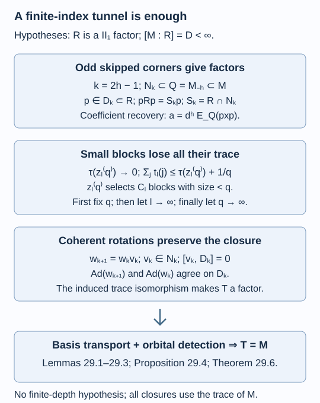

# A finite-index tunnel is enough

A finite-depth inclusion has a tunnel whose relative commutants generate a factor of finite index. The generating-tunnel argument can start from that conclusion itself. It does not need a finite principal graph. Two points require additional proofs: changing the tunnel must preserve factoriality of its closure, and finite matrix corners must still approximate a late relative commutant when the number of its blocks is unbounded.

We assume [Going up and down the Jones tower](towers-and-tunnels.md), [Reflected traces and a uniform bound along a tunnel](reflected-traces-and-uniform-bounds.md), [Detecting a generating tunnel](detecting-a-generating-tunnel.md), [Matrix corners approximate a tunnel](matrix-corners-and-tunnel-approximation.md), and [A generating tunnel and the classification theorem](generating-tunnels-and-classification.md). We use one-step tunnel uniqueness, the skipped-level basic construction, the finite-basis theorem, the tracial ultrapower, and the finite-corner approximation property of the separable hyperfinite II₁ factor. Their precise prerequisites are the ones stated in those lessons. The arguments below replace every use of finite depth in passing from a finite-index tunnel to a generating one. References are [Jones] and [Popa].

Let \(N\subsetneq M\) be separable hyperfinite II₁ factors of finite index \(d>1\). Fix a Jones tunnel, and write

\[
N_k=M_{-k-1},\qquad D_k=N_k'\cap M,\qquad
R=\left(\bigcup_{k\geq0}D_k\right)''.
\tag{29.1}
\]

The hypothesis of this lesson is that \(R\) is a II₁ factor and \(D=[M:R]<\infty\). Index here means index of an inclusion of factors. A finite positive-operator bound for an arbitrary algebra with a center is a different hypothesis. We impose no finite-depth assumption. Expectations and closures use the actual trace of \(M\).

## Changing a tunnel preserves its tracial closure

**Lemma 29.1.** For any other Jones tunnel \(\widetilde N_k\) of the same inclusion, there is a compatible trace-preserving isomorphism

\[
\bigcup_kD_k\longrightarrow\bigcup_k\widetilde D_k,
\qquad \widetilde D_k=\widetilde N_k'\cap M.
\tag{29.2}
\]

It extends normally to their tracial closures, and maps their intersections with \(N\) onto one another. In particular, the new closure is a II₁ factor.

**Proof.** Both tunnels have \(N_0=\widetilde N_0=N\); put \(w_0=1\). Suppose \(w_k\in\mathcal U(N)\) matches the two finite prefixes through level \(k\). One-step tunnel uniqueness supplies a correction \(v_k\in\mathcal U(N_k)\) such that \(w_{k+1}=w_kv_k\) matches them through level \(k+1\). The correction fixes the earlier algebras and earlier Jones projections. Thus

\[
\operatorname{Ad}(w_k)(D_i)=\widetilde D_i\quad(i\leq k),
\qquad
\operatorname{Ad}(w_{k+1})|_{D_k}
=\operatorname{Ad}(w_k)|_{D_k}.
\tag{29.3}
\]

The second assertion holds because \(v_k\) commutes with \(D_k\). These maps therefore define (29.2), rather than just separate finite-stage isomorphisms. Each preserves the trace and the operator norm. Their inverse maps are compatible as well. They induce a unitary between the tracial Hilbert completions that intertwines left multiplication, so conjugation by this unitary gives the asserted normal extension. Each \(w_k\) belongs to \(N\), and therefore maps \(D_k\cap N\) onto \(\widetilde D_k\cap N\).

Finally, the expectation onto \(N\) preserves every \(D_k\): averaging over the \(N_k\)-unitaries commutes with its Hilbert-space projection. Consequently the closure of \(\bigcup_k(D_k\cap N)\) is \(R\cap N\). The same applies to the other tunnel, proving the assertion about intersections. \(\square\)

No convergence of the unitaries \(w_k\) in \(M\) is claimed. Compatibility on the increasing relative commutants is sufficient. This lemma compares the closures with their inherited traces; it does not assert that a separately chosen trace on an abstract upward tower equals this trace.

## Odd levels have factor intersections

Set \(S_k=R\cap N_k\). The expectation argument just used also gives

\[
S_k=\left(\bigcup_{l\geq k}(D_l\cap N_k)\right)'',\qquad
E_RE_{N_k}=E_{N_k}E_R=E_{S_k}.
\tag{29.4}
\]

These are the invariant-projection statements of Proposition 15.2; their proofs do not use finite depth.

**Lemma 29.2.** If \(k=2h-1\), \(h\geq1\), then \(S_k\) is a II₁ factor. At every such level,

\[
[N_k:S_k]=D.
\tag{29.5}
\]

A partial orthonormal basis in \(N_k\) over \(S_k\) is also a basis in \(M\) over \(R\).

**Proof.** Use the skipped basic construction

\[
N_{2h-1}=M_{-2h}\subseteq M_{-h}\subseteq M.
\tag{29.6}
\]

Its Jones projection \(p\in M\) commutes with \(N_{2h-1}\), so \(p\in D_{2h-1}\subseteq R\). Write \(Q=M_{-h}\). The full-corner and normalized expectation formulas give

\[
pMp=N_{2h-1}p,\qquad E_Q(ap)=d^{-h}a
\quad(a\in N_{2h-1}).
\tag{29.7}
\]

If \(x\in R\), write \(pxp=ap\) using the first formula. Then

\[
a=d^hE_Q(pxp)\in R\cap N_{2h-1}=S_{2h-1},
\tag{29.8}
\]

because \(E_Q\) preserves \(R\), by (29.4) at the middle level. Conversely every \(a\in S_{2h-1}\) commutes with \(p\), giving

\[
pRp=S_{2h-1}p.
\tag{29.9}
\]

The map \(a\mapsto ap\) is faithful on the factor \(N_{2h-1}\), by the basic-construction corner identification. Thus \(S_{2h-1}\cong pRp\). Since \(R\) is a II₁ factor and \(p\ne0\), this proves factoriality and type II₁.

Fix this odd \(k\), and put \(a_k=[M:N_k]=d^{k+1}\). The commuting expectations in (29.4) and their positive bounds imply

\[
E_{S_k}(x)\geq(Da_k)^{-1}x\quad(x\in M_+),
\qquad [M:S_k]\leq Da_k.
\tag{29.10}
\]

A second skipped construction, \(N_{2k+1}\subseteq N_k\subseteq M\), has Jones projection \(g\in D_{2k+1}\subseteq R\) and \(E_{N_k}(g)=a_k^{-1}1\). Hence \(E_{S_k}(g)=a_k^{-1}1\). Testing the optimal positive-operator bound for \(S_k\subseteq R\) on this nonzero projection gives \([R:S_k]\geq a_k\). Multiplicativity now forces

\[
Da_k\geq[M:S_k]=D[R:S_k]\geq Da_k.
\]

Computing the same index through \(N_k\) gives (29.5).

For a partial orthonormal basis \(u_i\in N_k\), with supports \(q_i\in S_k\), (29.4) gives \(E_R(u_i^*u_j)=\delta_{ij}q_i\). The basis identity in \(N_k\) is \(\sum_i u_iu_i^*=D1\). Thus the mutually orthogonal projections \(u_ie_Ru_i^*\) in the basic construction of \(R\subseteq M\) have total normalized trace one. Faithfulness makes their sum the identity, and pull-down gives

\[
x=\sum_i u_iE_R(u_i^*x)\quad(x\in M).
\tag{29.11}
\]

The finite-basis theorem permits \(\lfloor D\rfloor+1\) entries with \(\|u_i\|\leq\sqrt D\), including a zero final entry when necessary. These bounds are independent of the odd level. \(\square\)

The two skipped projections in this proof have different jobs. The first gives the corner proving factoriality; the second tests the index. Formula (29.8) uses the expectation onto the middle algebra \(Q\), not a false compression identity for every element of the upper algebra.

## Small blocks lose all their trace

Fix an odd \(k\), and let \(C_l=D_l\cap N_k\), \(l\geq k\). Its block sizes are \(r_l(j)\), and its minimal-projection trace weights are \(t_l(j)\). Thus \(\sum_jr_l(j)t_l(j)=1\). The number of blocks may tend to infinity.

**Lemma 29.3.** These weights satisfy

\[
\sum_jt_l(j)\longrightarrow0.
\tag{29.12}
\]

**Proof.** For any integer \(q\geq2\), let \(z_l^{(q)}\) be the central projection of \(C_l\) formed by its blocks of size less than \(q\). Under a unital inclusion of finite-dimensional algebras, a new block of size less than \(q\) cannot receive a representation of an old block of size at least \(q\). Therefore

\[
z_{l+1}^{(q)}\leq z_l^{(q)}.
\]

Their strong limit \(z\) commutes with every \(C_l\). By (29.4) and Lemma 29.2, their closure is the factor \(S_k\), so \(z\) is zero or one. We rule out one by an explicit matrix polynomial.

Put \(r=q-1\) and \(s=r^2+1\). Consider the alternating polynomial

\[
\mathcal C_s(x_1,\ldots,x_s;y_0,\ldots,y_s)
=\sum_{\pi\in\mathfrak S_s}\operatorname{sgn}(\pi)
\,y_0x_{\pi(1)}y_1x_{\pi(2)}\cdots y_{s-1}x_{\pi(s)}y_s.
\tag{29.13}
\]

It vanishes on any matrix algebra of dimension at most \(r^2\): the \(s\) matrices \(x_i\) are linearly dependent, and multilinearity and alternation imply the claim. Hence it vanishes in every direct sum of blocks of size less than \(q\).

It does not vanish in \(M_q\). Choose \(s\) distinct matrix units \(x_i=E_{a_i b_i}\), possible because \(s\leq q^2\). Set

\[
y_0=E_{1a_1},\quad
y_i=E_{b_i a_{i+1}}\ (1\leq i<s),\quad
y_s=E_{b_s1}.
\tag{29.14}
\]

For a product in (29.13) to survive, its matrix unit at position \(i\) must have both row \(a_i\) and column \(b_i\). The units are distinct, so only the identity permutation survives. Its product is \(E_{11}\ne0\).

If \(z=1\), monotonicity forces \(z_l^{(q)}=1\) for every \(l\), so (29.13) vanishes on every \(C_l\). Expectations onto the increasing \(C_l\) approximate each bounded element of \(S_k\) in \(L^2\), with a uniform operator-norm bound. Every finite product consequently converges in \(L^2\), by telescoping and the inequality \(\|axb\|_2\leq\|a\|\|b\|\|x\|_2\). The polynomial would vanish on \(S_k\). But that II₁ factor contains a unital \(M_q\), contradicting (29.14). Thus \(z=0\), and normality of the trace gives \(\tau(z_l^{(q)})\to0\).

Separate the small blocks from the others:

\[
\sum_jt_l(j)
\leq\tau(z_l^{(q)})+q^{-1}\tau(1-z_l^{(q)})
\leq\tau(z_l^{(q)})+q^{-1}.
\tag{29.15}
\]

For each fixed \(q\), the limit superior is at most \(q^{-1}\). Letting \(q\) tend to infinity proves (29.12). \(\square\)

This estimate replaces the bounded block count and geometric decay used at finite depth. A bound only on the largest minimal-projection weight would not suffice when there are many blocks.

## Prefix approximation at odd levels

**Proposition 29.4.** Fix an odd \(k\). For every finite \(F\subseteq N_k\vee D_k\) and \(\varepsilon>0\), there are an odd \(l>k\) and \(v\in\mathcal U(N_k)\) such that

\[
\|E_{vD_lv^*}(x)-x\|_2<\varepsilon\quad(x\in F).
\tag{29.16}
\]

Rotating the continuation by \(v\) preserves the entire prefix through \(k\).

**Proof.** All downward factors are finite corners of amplifications of the preceding factor's opposite; hence they are separable hyperfinite II₁ factors. Expand the finite set in matrix units of the finite-dimensional \(D_k\). Its finitely many coefficients belong to \(N_k\). Approximate them in \(L^2\) by one full matrix subfactor \(A\cong M_m\subseteq N_k\), taking conditional expectations to keep their norms bounded by a constant \(L\).

Apply Lemma 16.1 to \(A\) and \(C_l\). It gives \(z\in A'\cap N_k\) and a unitary \(u\in N_k\) with

\[
u(Az)u^*\subseteq C_l,\qquad
1-\tau(z)\leq(m-1)\sum_jt_l(j).
\]

Lemma 29.3 lets us make the right side arbitrarily small, even with \(l\) restricted to odd integers. Put \(v=u^*\). Then \(Az\subseteq vD_lv^*\), and \(v\) fixes \(D_k\) pointwise. Replacing each coefficient \(a\) by its approximant \(b\), then by \(bz\), costs at most

\[
\|a-bz\|_2\leq\|a-b\|_2+L\sqrt{1-\tau(z)}.
\]

Sum over the finite expansion and use the best-approximation property of the expectation to obtain (29.16). Conjugation by \(v\in N_k\) preserves all earlier tunnel algebras and Jones projections, just as in Theorem 16.3. \(\square\)

*Figure 29.1. The skipped corner uses \(k=2h-1\), \(Q=M_{-h}\), and the projection \(p\) of (29.6). The middle estimate is (29.15), with \(q\) fixed before \(l\) tends to infinity. The compatible rotations (29.3) preserve factoriality of any new closure. Together these statements supply prefix approximation, basis transport and the factor hypothesis needed for the orbital argument. Lemmas 29.1–29.3 and Proposition 29.4. [Editable figure source](figures/finite-index-tunnel.py).*

## Orbital saturation with no depth bound

**Proposition 29.5.** There are \(\varepsilon_0>0\) and \(k_0\) such that for every odd \(k>k_0\) and every \(x\in M\) with \(\|x\|_2=1\), \(\|x\|\leq\sqrt D\), some \(u\in\mathcal U(N_k)\) satisfies

\[
\|E_{uRu^*}(x)\|_2>\varepsilon_0.
\tag{29.17}
\]

**Proof.** Suppose this fails. Choose increasing odd \(k_n\) and such \(x_n\) with the supremum in (29.17) at most \(1/n\). In the tracial ultrapower put

\[
P=M^\omega,\quad Q=\prod_\omega N_{k_n},\quad
C=Q'\cap P=\prod_\omega D_{k_n},
\quad W=\overline{\operatorname{span}}\{uR^\omega u^*:u\in\mathcal U(Q)\}.
\]

The relative-commutant equality is Lemma 15.6. All unitaries of \(Q\) lift to coordinate unitaries by Lemma 17.1. The coordinate bounds therefore give \(x=(x_n)\in W^\perp\cap P\), with \(\|x\|_{2,\omega}=1\).

Proposition 29.4, applied separately to a bounded coordinate \(y_n\in N_{k_n}\vee D_{k_n}\), approximates it within \(1/n\) by a unitary conjugate of an element of \(D_{l_n}\subseteq R\). The approximants are uniformly bounded because they are expectations of \(y_n\). The proof of Lemma 17.2 thus gives \(L^2(Q\vee C)\subseteq W\).

Lemma 17.3 applies verbatim. Its hypotheses are precisely that \(Q\) is a II₁ factor, \(C=Q'\cap P\), \(W\) is invariant under \(Q\)-unitary conjugation and contains \(L^2(Q\vee C)\). Its corner refinement estimate has constant \(7/8\) and uses no finite-depth statement. Thus every bounded vector of \(W^\perp\) is stable under left and right multiplication by \(Q\), and trace cyclicity gives

\[
x\perp aR^\omega b\quad(a,b\in Q).
\]

Lemma 29.2 supplies a basis \(u_j(n)\in N_{k_n}\), with \(\lfloor D\rfloor+1\) uniformly bounded entries. For every bounded sequence \(y_n\in M\), (29.11) gives

\[
(y_n)=\sum_j(u_j(n))\bigl(E_R(u_j(n)^*y_n)\bigr)
\quad\text{in }P.
\]

The first factors belong to \(Q\); the second belong to \(R^\omega\). Hence \(x\) is orthogonal to every bounded element of \(P\), including itself. This contradicts its unit norm. \(\square\)

**Theorem 29.6.** A finite-index inclusion of separable hyperfinite II₁ factors that has a Jones tunnel satisfying (29.1) with \(R\) a factor of finite index admits a generating Jones tunnel. Finite depth is not required.

**Proof.** If \(D=1\), then \(R=M\); commuting expectations in (29.4) give \((\bigcup_kD_k\cap N)''=N\), so the original tunnel generates both endpoints.

For \(D>1\), use the induction of Theorem 15.5, choosing every detection level \(k\) odd. Proposition 29.5 provides the orbital bound on this cofinal set of levels. We spell out the consequences that previously required a finite-depth closure theorem.

Choose countable \(L^2\)-dense sequences \(x_i\) in the sphere \(\|x\|_2=1,\ \|x\|\leq\sqrt D\), and \(y_i\) in the positive unit ball. Match the current finite prefix to the original tunnel by \(w\in\mathcal U(N)\). At a sufficiently late odd level \(k\), increasing-limit convergence and the positive-vector index inequality give

\[
\|E_{D_k}(w^*y_iw)\|_2\geq D^{-1/2}\|y_i\|_2-n^{-1}
\quad(i\leq n).
\]

Apply (29.17) to \(w^*x_nw\), choosing \(v\in\mathcal U(N_k)\). At a later finite level \(l\), the expectation onto \(vD_lv^*\) detects this vector by more than \(\varepsilon_0\). Rotate the continuation by \(wv\). This preserves the old prefix, the previous detections and the displayed positive-vector bounds, since \(v\) fixes \(D_k\). Repeat.

Let \(T\) be the relative-commutant closure of the resulting tunnel. Lemma 29.1 makes \(T\) a II₁ factor. Passing to limits and using density gives

\[
\|E_T(y)\|_2^2\geq D^{-1}\|y\|_2^2\quad(y\geq0),
\qquad
\|E_T(x)\|_2\geq\varepsilon_0
\quad(\|x\|_2=1,\ \|x\|\leq\sqrt D).
\]

The positive-vector variational theorem gives \([M:T]\leq D\), including the exclusion of infinite index. If \(T\ne M\), Lemma 15.4 gives a bounded vector with expectation zero, \(L^2\)-norm one and operator norm at most \(\sqrt{[M:T]}\leq\sqrt D\). This contradicts detection. Therefore \(T=M\). Commuting expectations onto \(N\) then show that the smaller-endpoint relative commutants generate \(N\) as well. \(\square\)

This theorem supplies a criterion for generating tunnels. It does not assert that finite index of \(N\subseteq M\) alone produces the extra finite-index closure in (29.1). Finite depth supplied that step in Theorem 16.4. At infinite depth the existence of such a closure is a substantive additional question.

## Exercises

**Exercise 29.1 — introductory.** At \(k=3\), identify the triple used to prove factoriality of \(S_k\), and the distinct triple used to compute its index.

**Solution.** Here \(h=2\). The first triple is \(M_{-4}\subseteq M_{-2}\subseteq M\), equivalently \(N_3\subseteq N_1\subseteq M\). Its projection \(p\) gives \(pRp=S_3p\), and the coefficient formula is \(a=d^2E_{N_1}(pxp)\). The index test instead uses \(N_7\subseteq N_3\subseteq M\); its projection \(g\) has \(E_{N_3}(g)=d^{-4}1\).

**Exercise 29.2 — intermediate.** Verify the polynomial contradiction for \(q=2\) using \(x_1=E_{11}\), \(x_2=E_{12}\), \(y_0=y_1=E_{11}\), \(y_2=E_{21}\).

**Solution.** The identity term is \(E_{11}E_{11}E_{11}E_{12}E_{21}=E_{11}\). The transposed term begins \(E_{11}E_{12}E_{11}=0\). Thus \(\mathcal C_2=E_{11}\). In a commutative one-dimensional block the two terms are equal, so their difference vanishes. Uniformly bounded \(L^2\) approximation preserves this polynomial identity, which separates a II₁ factor from a closure consisting solely of scalar blocks.

**Exercise 29.3 — intermediate.** Why does \(\max_jt_l(j)\to0\) by itself not prove the estimate needed for matrix divisibility?

**Solution.** In \(\mathbb C^{2^l}\) with uniform weights, the maximum is \(2^{-l}\), while the sum of minimal weights is one. Lemma 16.1 bounds the removed trace by \((m-1)\sum_jt_l(j)\), so it is the sum that must vanish. The small-block projection and the factor hypothesis rule out this persistent scalar-block example.

**Exercise 29.4 — advanced.** Suppose finite prefixes are matched by unitaries \(w_k\), but no compatibility between their restrictions is given. Which step in Lemma 29.1 would fail, and how does tunnel uniqueness repair it?

**Solution.** Separate maps on \(D_k\) would not define a map on their union: the image of an element of \(D_k\) might change at the next stage. Sequential matching chooses \(w_{k+1}=w_kv_k\), with \(v_k\in N_k\). This correction commutes with \(D_k\), so the restrictions agree exactly. Trace preservation then extends a single map to the tracial completion, preserving factoriality of the new tunnel closure.

## References

- Vaughan F. R. Jones, [*Index for subfactors*](https://doi.org/10.1007/BF01389127), Inventiones Mathematicae 72 (1983), 1–25.
- Sorin Popa, [*Classification of subfactors: the reduction to commuting squares*](https://doi.org/10.1007/BF01231494), Inventiones Mathematicae 101 (1990), 19–43.

*Written by GPT-6.1 Sol (OpenAI), Ultra reasoning effort, September 2026. Self-checked by the writing AI. Public domain (CC0).*
