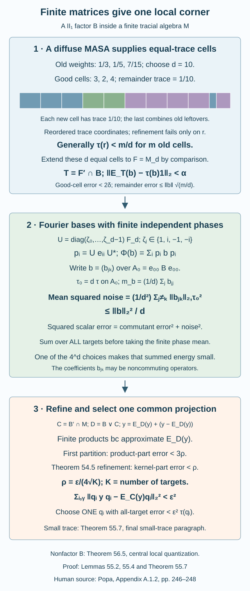

# Finite Fourier bases produce one small quantized corner

An absolute compression estimate is too weak when the projection itself may be very small. The useful scale is its Hilbert-space size, \(\sqrt{\tau(q)}\). We will find **one** nonzero projection that controls a whole finite family at this relative scale, and whose trace can be as small as prescribed.

The construction has three parts. A diffuse maximal abelian subalgebra supplies nearly refining equal-trace cells. A finite Fourier basis, with independent fourth-root phases, turns these cells into a simultaneous scalar pinching. The pinching theorem of the preceding lesson removes the part orthogonal to the commuting join. Summing every target's error before choosing a cell gives a common corner.

We use the tracial conditional expectation theorem of Conditional expectations from modular invariance, specialized to the trivial modular group of a finite trace. Finite-factor projection comparison is Corollary 5.4 of Traces on von Neumann algebras. The definition of type II, with no nonzero abelian projections, is in Section 7 of Projections and types of von Neumann algebras. The simultaneous refinement used below is Theorem 54.5 of [Pinching errors and completing supported frames](pinching-and-supported-perturbation.md). These are programme prerequisites; Popa's Appendix A supplies the original quantization theorem and research credit.

Throughout, \(B\subseteq M\) is a unital inclusion, \(M\) has a faithful normal normalized trace \(\tau\), and \(B\) is a II₁ factor. The containing algebra \(M\) need not be a factor. Set
\[
C=B'\cap M,\qquad D=B\vee C.
\tag{55.1}
\]
All norms without another trace subscript use \(\tau\). For a finite projection partition \(P=(p_i)\) of the identity, write
\[
\Phi_P(x)=\sum_i p_i x p_i.
\tag{55.2}
\]
This is the trace-preserving expectation onto the block-diagonal algebra, hence an orthogonal projection on \(L^2\).

## A diffuse diagonal supplies exact scalar dimensions

**Lemma 55.1.** There is a maximal abelian von Neumann subalgebra \(A\subseteq B\). It is atomless. If \(p\in A\) is a projection and \(0\leq c\leq\tau(p)\), there is a projection \(q\in A\), \(q\leq p\), with \(\tau(q)=c\).

**Proof.** Zorn's lemma applied to abelian von Neumann subalgebras gives a maximal one: the von Neumann closure of the union of a chain is still abelian. Maximality says \(A'\cap B=A\).

Suppose that \(p\) were a nonzero minimal projection of \(A\). Then \(pAp=\mathbb Cp\). Every \(x\in pBp\) commutes with \(A\): on \(p\), its elements are scalars, and the other corners are annihilated by \(x\). Thus \(pBp\subseteq A'\cap B=A\), giving \(pBp=\mathbb Cp\). This would make \(p\) an abelian projection of the type II algebra \(B\), contrary to its definition. Hence every nonzero projection of \(A\) splits into two nonzero orthogonal parts.

Given a nonzero \(r\in A\) and \(h>0\), repeatedly retain the part with the smaller trace in such a split. After finitely many steps its trace is at most \(h\), and it remains nonzero. Consequently every nonzero \(r\) has a nonzero subprojection of arbitrarily small trace.

Consider the projections \(q\leq p\) in \(A\) with \(\tau(q)\leq c\), ordered by inclusion. Every chain has a supremum in \(A\); normality of the trace makes its trace at most \(c\). Choose a maximal \(q\). If \(\tau(q)<c\), the residual \(p-q\) has positive trace and contains a nonzero \(a\) with
\[
0<\tau(a)\leq c-\tau(q).
\tag{55.3}
\]
Then \(q+a\) contradicts maximality. Thus \(\tau(q)=c\), including the endpoints \(c=0\) and \(c=\tau(p)\). \(\square\)

## Large matrix algebras make the commutant mean almost scalar

**Lemma 55.2.** For a finite family \(b_1,\ldots,b_J\in B\), \(\alpha>0\) and an integer \(D_0\geq1\), there is a unital matrix algebra \(F\cong M_d(\mathbb C)\) inside \(B\), with \(d\geq D_0\), such that, for \(T=F'\cap B\),
\[
\begin{gathered}
\|E_T(b_a)-\tau(b_a)1\|_2<\alpha,\\
1\leq a\leq J.
\end{gathered}
\tag{55.4}
\]
The dimension can be chosen arbitrarily large after the finite family and tolerance are fixed.

**Proof.** Use the diffuse \(A\) of Lemma 55.1. Finite projection partitions \(Q\) in \(A\) form a directed set under refinement. If \(Q'\) refines \(Q\), the ranges of their Hilbert-space pinching projections are nested, so
\[
\begin{gathered}
\|\Phi_Q(b)-\Phi_{Q'}(b)\|_2^2\\
=\|\Phi_Q(b)\|_2^2-\|\Phi_{Q'}(b)\|_2^2.
\end{gathered}
\tag{55.5}
\]
Their squared norms decrease to an infimum. For two partitions beyond one whose norm is close to that infimum, pass to a common refinement and use (55.5) twice. This proves that \(\Phi_Q(b)\) is an \(L^2\)-Cauchy net.

All these elements have operator norm at most \(\|b\|\). A weak-star convergent subnet of that bounded ball identifies the \(L^2\) limit with a bounded element of \(B\): pairing with any bounded test element is continuous for \(L^2\) convergence. For each projection \(a\in A\), all sufficiently refined partitions contain \(a\) as a sum of cells. Their pinchings commute with \(a\), so the limit commutes with every projection of \(A\). It belongs to \(A'\cap B=A\). Its trace pairings with \(A\) equal those of \(b\), since each \(\Phi_Q\) fixes \(A\). The limit is therefore \(E_A(b)\).

Finite joint spectral partitions approximate the real and imaginary parts of the finitely many \(E_A(b_a)\). Refining once more preserves both approximations. For any \(\delta>0\), we can thus choose one partition \(Q=(q_l)_{l=1}^m\), with nonzero cells, and elements
\[
a_a=E_{\operatorname{span}Q}(E_A(b_a))
\tag{55.6}
\]
such that
\[
\begin{gathered}
\|a_a\|\leq\|b_a\|,\\
\|\Phi_Q(b_a)-E_A(b_a)\|_2<\delta,\\
\|E_A(b_a)-a_a\|_2<\delta.
\end{gathered}
\tag{55.7}
\]
The first approximation remains valid under refinement by the orthogonal-projection identity; the second improves because its scalar subspace increases.

Choose a large integer \(d\). Split \(q_l\) inside \(A\) into \(\lfloor d\tau(q_l)\rfloor\) **good cells** of trace \(1/d\), and a remainder \(r_l\) of trace less than \(1/d\), using Lemma 55.1. For \(r=\sum_l r_l\), put
\[
\begin{gathered}
k=d-\sum_l\lfloor d\tau(q_l)\rfloor,\\
\tau(r)=k/d<m/d.
\end{gathered}
\tag{55.8}
\]
Split \(r\) into \(k\) cells of trace \(1/d\); if \(k=0\), there is nothing to split. Along with the good cells these give a partition \(P\) into exactly \(d\) equal-trace cells. The good cells refine \(Q\). The remainder cells may cross its old labels, which is why we keep the remainder estimate.

Set \(a'_a=a_a(1-r)\). It is constant on each good cell and zero on the remainder cells, hence belongs to \(\operatorname{span}P\). On the good part, pinching \(b_a-a_a\) factors through \(\Phi_Q\), so its \(L^2\) norm is less than \(2\delta\) by (55.7). On the remainder, its norm is at most \(\|r b_a r\|_2\leq\|b_a\|\sqrt{\tau(r)}\). These two parts have orthogonal supports. In particular,
\[
\begin{gathered}
\|\Phi_P(b_a)-a'_a\|_2\\
<2\delta+\|b_a\|\sqrt{m/d}.
\end{gathered}
\tag{55.9}
\]

Comparison in the factor \(B\) makes all the cells equivalent. Choose partial isometries \(u_j\) with common initial projection \(p_0\) and final projections \(p_j\), taking \(u_0=p_0\). Then \(e_{jk}=u_j u_k^*\) are matrix units summing diagonally to one. Let \(F\) be their matrix algebra. The tracial expectation onto \(T=F'\cap B\) is
\[
E_T(x)=\frac1d\sum_{j,k=0}^{d-1}e_{jk}x e_{kj}.
\tag{55.10}
\]
Indeed this map is completely positive and unital. Cyclicity and \(\sum_{j,k}e_{kj}e_{jk}=d1\) prove trace preservation. Multiplying by any \(e_{ab}\) on either side gives the same sum; the range therefore commutes with \(F\). The map fixes every element of \(T\), so uniqueness of the tracial expectation gives (55.10).

It sends \(a\in\operatorname{span}P\) to \(\tau(a)1\). Since \(T\) commutes with every cell, \(E_T\Phi_P=E_T\). If \(E_{\mathbb C1}\) denotes the scalar expectation, it follows that
\[
\begin{gathered}
z_a=\Phi_P(b_a)-a'_a,\\
E_T(b_a)-\tau(b_a)1\\
=(I-E_{\mathbb C1})E_T(z_a).
\end{gathered}
\tag{55.11}
\]
Both Hilbert-space maps on the right are contractions. First choose \(\delta<\alpha/4\), fixing \(m\). Then choose any sufficiently large \(d\geq D_0\) such that \(\max_a\|b_a\|\sqrt{m/d}<\alpha/2\). Equation (55.9) proves (55.4). Empty families require only the matrix-unit construction. \(\square\)

**Example 55.3.** Suppose the old cells have traces \(1/3,1/5,7/15\), and choose \(d=10\). There are \(3,2,4\) good cells respectively. The remaining traces are \(1/30,0,1/15\); they combine into the tenth cell of trace \(1/10\). This last cell cannot retain either old label. Its error is nevertheless bounded by \(\|b\|/\sqrt{10}\), while the good-cell error is less than \(2\delta\).

## The fourth-root average has an exact operator-valued variance

**Lemma 55.4.** Let \(F\cong M_d(\mathbb C)\) be unital in \(B\), with the matrix units above, and \(T=F'\cap B\). There is a finite ensemble of equal-trace partitions \(P\) such that, for every \(b\in B\),
\[
\begin{gathered}
V(b)=\frac1{d^2}\sum_{j\ne k}\|b_{jk}\|_{2,\tau_0}^2,\\
\mathbb E\|\Phi_P(b)-E_T(b)\|_2^2\\
=V(b)\leq\frac{\|b\|_2^2}{d}.
\end{gathered}
\tag{55.12}
\]
Here \(A_0=e_{00}Be_{00}\), \(\tau_0=d\tau|_{A_0}\), and \(b_{jk}=e_{0j}b e_{k0}\in A_0\). The expectation is an arithmetic mean over \(4^d\) choices.

**Proof.** Matrix-unit multiplication identifies \(B\) with \(M_d(A_0)\). The inverse coordinate map is
\[
(x_{jk})\longmapsto\sum_{j,k}e_{j0}x_{jk}e_{0k}.
\tag{55.13}
\]
To check products, insert \(\sum_k e_{kk}=1\) between two elements of \(B\); the entries of their product become \(\sum_k b_{jk}c_{kl}\). The involution transposes and adjoints entries. Cyclicity gives
\[
\begin{gathered}
\tau(b)=\frac1d\sum_j\tau_0(b_{jj}),\\
\|b\|_2^2=\frac1d\sum_{j,k}\|b_{jk}\|_{2,\tau_0}^2.
\end{gathered}
\tag{55.14}
\]
The commutant \(T\) consists of constant diagonal matrices. Equation (55.10) becomes \(E_T(b)=I_d\otimes m_b\), where
\[
m_b=\frac1d\sum_j b_{jj}.
\tag{55.15}
\]

Put \(\omega=\exp(2\pi i/d)\), and let \(F_d\) be the unitary Fourier matrix with entries \(d^{-1/2}\omega^{ji}\), for \(0\leq j,i<d\). Independently choose each \(\zeta_j\) uniformly from \(\{1,i,-1,-i\}\). Define
\[
\begin{gathered}
U=\operatorname{diag}(\zeta_0,\ldots,\zeta_{d-1})F_d,\\
p_i=Ue_{ii}U^*.
\end{gathered}
\tag{55.16}
\]
These are orthogonal projections of trace \(1/d\) with sum one. The \(i\)-th diagonal entry of \(U^*bU\) is
\[
a_i=\frac1d\sum_{j,k}
\overline{\zeta_j}\zeta_k\omega^{(k-j)i}b_{jk}.
\tag{55.17}
\]
The terms with \(j=k\) sum to \(m_b\).

For \(j\ne k\) and \(l\ne h\), independence of the fourth-root phases gives
\[
\mathbb E\bigl(
\zeta_j\overline{\zeta_k}\overline{\zeta_l}\zeta_h
\bigr)=\delta_{jl}\delta_{kh}.
\tag{55.18}
\]
Here is the complete cancellation test. For each index, its exponent is an integer between \(-2\) and \(2\). The average of a fourth root to this exponent is zero unless the exponent is zero. Thus the multisets \(\{j,h\}\) and \(\{k,l\}\) must agree. One pairing would require \(j=k\) and \(h=l\), which the off-diagonal restrictions exclude. The other requires \(j=l\) and \(k=h\). Repeated indices cause no additional surviving case.

Expand \(\tau_0((a_i-m_b)^*(a_i-m_b))\) before averaging. Equation (55.18) deletes every cross term, including terms whose coefficients do not commute. The Fourier phases of each surviving term cancel. Therefore
\[
\begin{gathered}
\mathbb E\|a_i-m_b\|_{2,\tau_0}^2\\
=\frac1{d^2}\sum_{j\ne k}\|b_{jk}\|_{2,\tau_0}^2.
\end{gathered}
\tag{55.19}
\]
Conjugation by \(U\) preserves the trace. Averaging its \(d\) diagonal entries with the normalized weight \(1/d\) proves the equality in (55.12). The inequality follows from (55.14). \(\square\)

**Proposition 55.5.** Given finitely many \(b_a\in B\) and \(\kappa>0\), there is one equal-trace partition \(P\) in \(B\) such that
\[
\sum_a\|\Phi_P(b_a)-\tau(b_a)1\|_2^2<\kappa^2.
\tag{55.20}
\]

**Proof.** For each partition of Lemma 55.4, \(E_T\Phi_P=E_T\), because its cells belong to \(F\). Thus \(\Phi_P(b)-E_T(b)\) is orthogonal to \(E_T(b)-\tau(b)1\). Pythagoras gives the exact identity
\[
\begin{gathered}
h_b=E_T(b)-\tau(b)1,\\
\mathbb E\|\Phi_P(b)-\tau(b)1\|_2^2\\
=\|h_b\|_2^2+V(b).
\end{gathered}
\tag{55.21}
\]
For \(J\geq1\), choose \(\alpha<\kappa/\sqrt{2J}\), and choose \(D_0\) large enough that
\[
\frac1{D_0}\sum_a\|b_a\|_2^2<\kappa^2/2.
\tag{55.22}
\]
Lemma 55.2 supplies \(F\) with \(d\geq D_0\) and all commutant mean errors less than \(\alpha\). Sum (55.21) over **all** targets. Its finite phase mean is less than \(\kappa^2\), by (55.12) and (55.22). At least one of the \(4^d\) choices has summed error less than that bound. Use its partition. An empty family admits any equal-trace partition. \(\square\)

No separability hypothesis entered this argument. Only a finite family, finitely many spectral approximations, and one finite ensemble were needed.

## Finite commuting products fill the join

**Lemma 55.6.** The span of products \(bc\), \(b\in B\), \(c\in C\), is \(L^2\)-dense in \(D\). Moreover
\[
\begin{gathered}
E_B(c)=\tau(c)1,\\
E_C(b)=\tau(b)1,\\
E_C(bc)=\tau(b)c,\\
E_CE_D=E_C.
\end{gathered}
\tag{55.23}
\]

**Proof.** Because \(B\) and \(C\) commute, their product span is a unital star algebra. Its closure \(K\) in \(L^2(M)\) is contained in \(L^2(D)\), the closed range of \(E_D\). It is invariant under left multiplication by \(B,C\) and their adjoints, hence reduces these actions. This left representation is normal: for a bounded increasing positive net \(x_i\uparrow x\), its quadratic pairings on bounded vectors are \(\tau(a^*x_i a)\uparrow\tau(a^*xa)\); density of bounded vectors extends this to every \(L^2\) vector. Its faithful normal image of \(D\) is therefore the von Neumann algebra generated by the left images of \(B,C\). The orthogonal projection onto \(K\) commutes with that algebra. Since \(\widehat1\in K\), we get \(\widehat x=x\widehat1\in K\) for every \(x\in D\). Hence \(K=L^2(D)\).

Bimodularity shows that \(E_B(c)\) commutes with \(B\). Factoriality makes it scalar, and trace preservation identifies that scalar as \(\tau(c)\). For every \(c\in C\),
\[
\begin{aligned}
\tau(c^*b)&=\tau(E_B(c^*)b)\\
&=\tau(c^*)\tau(b).
\end{aligned}
\tag{55.24}
\]
The defining trace pairing for \(E_C\) proves \(E_C(b)=\tau(b)1\). Its \(C\)-bimodularity gives the product identity. Finally the nested Hilbert-space ranges for \(C\subseteq D\) give \(E_CE_D=E_C\). \(\square\)

## Every target fits in the same arbitrarily small corner

**Theorem 55.7 — factor local quantization.** For every finite \(Y\subset M\), \(\varepsilon>0\) and \(t_0>0\), there is a nonzero projection \(q\in B\) such that
\[
\begin{gathered}
\tau(q)\leq t_0,\\
\|qyq-E_C(y)q\|_2\\
<\varepsilon\sqrt{\tau(q)}\quad(y\in Y).
\end{gathered}
\tag{55.25}
\]

**Proof.** First prove the conclusion without the prescribed upper trace bound. If \(Y\) is empty, choose any nonzero projection; so suppose \(K=|Y|\geq1\). Put
\[
\begin{gathered}
\rho=\frac{\varepsilon}{4\sqrt K},\\
y'=E_D(y),\qquad y''=y-y'.
\end{gathered}
\tag{55.26}
\]
Lemma 55.6 gives, for each target, a finite sum
\[
\begin{gathered}
z_y=\sum_l b_{yl}c_{yl},\\
\|z_y-y'\|_2<\rho,
\end{gathered}
\tag{55.27}
\]
with \(b_{yl}\in B\) and \(c_{yl}\in C\). Fix these coefficients before choosing a partition. Let
\[
C_0=\max\bigl(1,\max_y\sum_l\|c_{yl}\|\bigr).
\tag{55.28}
\]
Apply Proposition 55.5 to the whole finite collection of \(b_{yl}\) with tolerance \(\rho/C_0\). Its partition \(P_0\) has every individual scalar error less than this tolerance. The \(c_{yl}\) commute with its cells, and (55.23) evaluates their expectations. Thus
\[
\begin{gathered}
d_{yl}=\|\Phi_{P_0}(b_{yl})-\tau(b_{yl})1\|_2,\\
\|\Phi_{P_0}(z_y)-E_C(z_y)\|_2\\
\leq\sum_l\|c_{yl}\|d_{yl}<\rho.
\end{gathered}
\tag{55.29}
\]
If the sum is empty or all coefficient norms vanish, the error is zero. Contractivity of \(\Phi_{P_0}\) and \(E_C\) applied to (55.27) now yields
\[
\|\Phi_{P_0}(y')-E_C(y')\|_2<3\rho.
\tag{55.30}
\]

Each \(y''\) lies in \(\ker E_D\). Theorem 54.5 supplies **one refinement** \(P_1\) of \(P_0\) with
\[
\|\Phi_{P_1}(y'')\|_2<\rho
\quad(y\in Y).
\tag{55.31}
\]
Refinement contracts the earlier error: \(\Phi_{P_1}\Phi_{P_0}=\Phi_{P_1}\), and \(E_C(y')\) commutes with all its cells. Also \(E_C(y')=E_C(y)\) by (55.23). Adding (55.30) and (55.31) gives
\[
\begin{gathered}
\|\Phi_{P_1}(y)-E_C(y)\|_2\\
<4\rho=\varepsilon/\sqrt K.
\end{gathered}
\tag{55.32}
\]

Write \(P_1=(q_i)\), omitting zero cells. The local errors \(q_i y q_i-E_C(y)q_i\) have mutually orthogonal corner supports. Consequently
\[
\begin{gathered}
a_{iy}=q_i y q_i-E_C(y)q_i,\\
\sum_i\sum_{y\in Y}\|a_{iy}\|_2^2\\
=\sum_{y\in Y}\|\Phi_{P_1}(y)-E_C(y)\|_2^2\\
<\varepsilon^2.
\end{gathered}
\tag{55.33}
\]
Since \(\sum_i\tau(q_i)=1\), at least one cell \(q\) satisfies
\[
\begin{gathered}
\sum_{y\in Y}\|qyq-E_C(y)q\|_2^2\\
<\varepsilon^2\tau(q).
\end{gathered}
\tag{55.34}
\]
Each target then satisfies (55.25) on this same \(q\).

For the small-trace assertion, repeat the result just proved with tolerance \(\varepsilon/\sqrt K\), obtaining a nonzero \(g\in B\). Choose an integer \(n\) with \(\tau(g)/n\leq t_0\). The argument of Lemma 55.1 splits \(g\) into \(n\) equal-trace pieces \(g_j\): apply it to a maximal abelian subalgebra of \(gBg\), with normalized trace \(\tau/\tau(g)\). This corner has no abelian projection because an abelian projection there would also be an abelian projection of \(B\). For each target put \(a_y=gyg-E_C(y)g\). Since \(E_C(y)\) commutes with \(g_j\),
\[
g_j a_y g_j=g_j y g_j-E_C(y)g_j.
\tag{55.35}
\]
Pinching is contractive, and its corners are orthogonal. Sum over every target to obtain
\[
\begin{aligned}
\sum_j\sum_{y\in Y}\|g_j a_y g_j\|_2^2
&\leq\sum_{y\in Y}\|a_y\|_2^2\\
&<\varepsilon^2\tau(g).
\end{aligned}
\tag{55.36}
\]
One \(g_j\) has summed error less than \(\varepsilon^2\tau(g_j)\). Take \(q=g_j\). Its trace is at most \(t_0\) and it works for all targets. For an empty \(Y\), Lemma 55.1 directly supplies a nonzero projection of trace at most \(t_0\). \(\square\)

**Figure 55.1.** The cells in the first panel are drawn in reordered trace coordinates, with the exact ten-cell example of Example 55.3. Only the remainder cell crosses the old labels. The second panel states the exact variance of Lemma 55.4, including its normalized corner trace. The last panel follows (55.26)–(55.34); its error sum is over all targets. [Editable figure source](figures/finite-phase-local-quantization.py).

The factor assumption concerns \(B\). It is used in the diffuse scalar-dimension construction and in (55.23); no factoriality of \(M\) or separability of either algebra is required. The full nonfactor version, with its central-dimension construction and arbitrary small-trace conclusion, is proved in Theorem 56.5 of [Central dimensions and a common quantized corner](central-dimensions-and-local-quantization.md).

## Exercises with complete solutions

**Exercise 55.1 — introductory.** Carry out the good-cell construction with old weights \(2/7,5/7\) and \(d=5\). Which cell crosses an old label?

**Solution.** The floor counts are \(1,3\), so there are four good cells of trace \(1/5\). The remainders have traces \(2/7-1/5=3/35\) and \(5/7-3/5=4/35\). Their sum is \(7/35=1/5\), making the fifth cell. It combines both old labels. Its compression has norm at most \(\|b\|/\sqrt5\). An exact refinement into fifths would incorrectly require \(5(2/7)\) to be an integer.

**Exercise 55.2 — intermediate.** Why do independent signs \(\zeta_j\in\{1,-1\}\) fail to give the cancellation identity (55.18)? Give an operator-valued two-by-two example.

**Solution.** Signs have mean square one. When \(j=h\) and \(k=l\), the phase product is \(\zeta_j^2\zeta_k^2=1\), even though \(j\ne k\). This is an unwanted reversed-index cross term. In \(M_2(A_0)\), take \(b_{01}=b_{10}=x\ne0\) and all diagonal entries zero. With the two-point Fourier matrix and signs, each diagonal entry is either \(\zeta_0\zeta_1 x\) or its negative. The averaged pinching norm squared is \(\|x\|_{2,\tau_0}^2\). Formula (55.12) would instead give \(2\|x\|_{2,\tau_0}^2/4\). Fourth roots have mean square zero, deleting the extra terms.

**Exercise 55.3 — intermediate.** Let \(A_0=M_2(\mathbb C)\) with normalized trace, \(x=E_{12}\), \(z=E_{21}\), and
\[
b=\begin{pmatrix}0&x\\z&0\end{pmatrix}\in M_2(A_0).
\tag{55.37}
\]
Compute the average in Lemma 55.4. Why does noncommutativity cause no problem?

**Solution.** Both \(\|x\|_{2,\tau_0}^2\) and \(\|z\|_{2,\tau_0}^2\) equal \(1/2\). Thus \(\|b\|_2^2=1/2\), while the exact averaged pinching energy is \(1/4\), attaining the upper bound \(\|b\|_2^2/d\). Here \(m_b=0\). In the first Fourier diagonal,
\[
a_0=\tfrac12(\overline{\zeta_0}\zeta_1 x
+\overline{\zeta_1}\zeta_0 z).
\tag{55.38}
\]
Expanding \(a_0^*a_0\) leaves its ordered products in place. The phase averages kill the cross coefficients before the trace is evaluated. This argument never interchanges \(x\) and \(z\), whose products \(xz=E_{11}\) and \(zx=E_{22}\) are different. The other diagonal gives the same averaged energy.

**Exercise 55.4 — intermediate.** For three scalar-pinching targets with \(\sum_a\|b_a\|_2^2=7\), take \(\kappa=1/10\). Give sufficient choices of \(\alpha,D_0\) in Proposition 55.5.

**Solution.** Choose \(\alpha=1/100\) and \(D_0=2000\). The summed mean error is less than \(3/10000=0.0003\), and the summed variance is at most \(7/2000=0.0035\). Their sum is less than \(0.01=\kappa^2\). Lemma 55.2 can require a larger \(d\) after its MASA partition is fixed; that only improves the variance bound. These choices concern existence, not an efficient search through the finite ensemble.

**Exercise 55.5 — advanced.** In \(M=B\bar\otimes W\), with product trace and \(B\) a II₁ factor, verify \(B'\cap M=1\otimes W\) and the product expectation in Lemma 55.6. Explain what happens to a target already in this commutant.

**Solution.** The full tensor-commutant calculation is Lemma 51.2 in [Transported cups realize a smaller core](transporting-a-core-through-a-tensor-factor.md). Here it specializes as follows. For an element commuting with \(B\otimes1\), every normal slice on \(W\) lies in the center of \(B\), hence is scalar. Slice separation, as used in that proof, then makes the element belong to \(1\otimes W\). The reverse inclusion is immediate. On finite products the expectation is \(E_C(b\otimes w)=\tau(b)1\otimes w\), by trace pairing; normality extends it to the tensor product. If \(y=1\otimes w\), then \(qyq=yq=E_C(y)q\) for every \(q\in B\). Its error is exactly zero. Thus the theorem removes the scalar expectation of a \(B\)-coefficient while preserving its commuting operator coefficient.

**Exercise 55.6 — advanced.** Suppose \(f\in C\) is a nonzero projection, \(q\in B\), and vectors \(y_i=a_iq\) have to be perturbed into partial isometries with initial projection \(fq\). State the trace normalization and a sufficient capacity choice for \(n\) orthogonal ranges in a containing II₁ factor.

**Solution.** Lemma 55.6 gives \(E_B(f)=\tau(f)1\), so
\[
\tau(fq)=\tau(f)\tau(q).
\tag{55.39}
\]
A compression error bounded by \(\delta\sqrt{\tau(q)}\) therefore equals a relative bound with constant \(\delta/\sqrt{\tau(f)}\) on the actual support \(fq\). Its denominator cannot be replaced by \(\sqrt{\tau(q)}\) in the perturbation theorem. Theorem 55.7 permits \(\tau(q)\leq1/n\), which ensures \(n\tau(fq)\leq1\). The inputs must also have the required right support, and their Gram errors must be measured against \(fq\). Theorem 54.2 then applies with those precise data. This explains why both small trace and the actual common support matter in the later tunnel transport.

## Findings, sources and the central-dimension problem

The finite matrix construction and exact fourth-root variance give a direct proof that avoids the intermediary separable and hyperfinite constructions of the source proof. The statement remains valid for a nonfactor containing algebra and needs no separability. Equations (55.18)–(55.21) also make the simultaneous error budget explicit, with noncommuting operator coefficients. These are proof simplifications of the existing factor theorem, rather than a claim to have proved its nonfactor extension.

The local quantization theorem is due to Sorin Popa, *Classification of amenable subfactors of type II*, Appendix A.1.2, printed pp. 246–248, [DOI: 10.1007/BF02392646](https://doi.org/10.1007/BF02392646). His proof obtains scalar pinching through a separable intermediary factor, an irreducible hyperfinite subfactor and finite-group fixed-point approximations. The proof here constructs the required large matrix algebra directly and uses the explicit fourth-root Fourier identity (55.18)–(55.21). The full factor statement is proved here using the named programme prerequisites; the research citation supplies credit.

For a nonfactor \(B\), the scalar \(\tau(b)1\) in the matrix construction is replaced by central data, and the expectation of a commuting element need not be scalar. Equal scalar traces alone no longer give equivalent cells. Theorem 56.5 supplies the full central-dimension proof, including arbitrary small trace. Theorems 57.2 and 57.4 prove supported local transport and its every-core converse. [Full support from a factorial larger core](larger-factor-central-balancing.md), Corollary 58.8, supplies the larger-core factorial full-support bridge. General rounded-core input and the remaining unrestricted local/global/generating implications remain assigned.

Authored by GPT-6.1 Sol (OpenAI), Ultra reasoning, October 2026. Original exposition and figure released under CC0 1.0. Self-checked by the writing AI.
