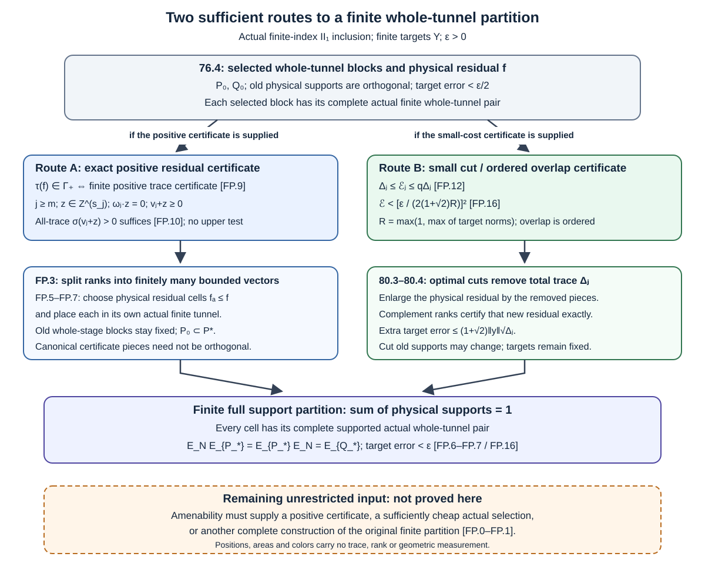

# Finite completion with separate tunnel cells

An exact finite partition may use a different tunnel on each supported cell. This makes finite positive sums of projection traces the right certificates for completing a residual while retaining the selected old blocks. We prove that criterion, then relate the central capacity cost to the ordered overlap of finite-stage representatives. These are two sufficient construction routes; the unrestricted amenability input remains to be proved.

## The original finite full-partition statement

Popa's Theorem 4.4.1(1), printed p.222, concerns finite-index inclusions of II₁ factors. The hypothesis is that \(N\subset M\) is an **amenable inclusion**; part (1) additionally assumes \(N\ne M\). For every \(\varepsilon>0\) and finite \(x_1,\ldots,x_n\in M\), it asserts finite-dimensional unital \(Q\subset P\subset M\), \(Q\subset N\), with

\[
 E_PE_N=E_Q,
 \qquad \|E_P(x_j)-x_j\|_2<\varepsilon\quad(1\le j\le n),
 \tag{FP.0}
\]

and a **finite** set \(I_0\), an actual tunnel \(M\supset N\supset N_1^i\supset\cdots\supset N_{k_i}^i\) for each \(i\in I_0\), and projections

\[
\begin{gathered}
 s_i\in (N_{k_i}^i)'\cap N,\qquad \sum_{i\in I_0}s_i=1,\\
 Q=\bigoplus_{i\in I_0}s_i\bigl((N_{k_i}^i)'\cap N\bigr)s_i,\\
 P=\bigoplus_{i\in I_0}s_i\bigl((N_{k_i}^i)'\cap M\bigr)s_i.
\end{gathered}
\tag{FP.1}
\]

The source permits different continuations and different finite lengths. Orthogonality follows from the projection sum: \(s_i(1-s_i)s_i=\sum_{h\ne i}s_is_hs_i=0\), a sum of positive operators, so \(s_hs_i=0\). No separability, finite depth, extremality, ergodic core or unique norm trace is imposed in part (1). Those hypotheses belong to other statements and are not inserted here. Taking \(L^2\) adjoints of (FP.0) gives \(E_NE_P=E_Q\).

The source's proof refers to the preceding maximality argument and reduced-algebra heredity. That preceding ergodic-core amalgamation, printed pp.220–221, starts with supports in tail **factors**. The whole-stage supports of 76.2 instead lie in finite smaller **relative commutants**. Replacing one membership by the other is not a justified replay of that amalgamation.

Exact human source: Sorin Popa, *Classification of amenable subfactors of type II*, Acta Mathematica **172** (1994), 163–255, [DOI](https://doi.org/10.1007/BF02392646), 4.1.1–4.1.2, printed pp.209–210, and 4.4, printed pp.220–222.

## What the existing providers actually supply

| Provider | Actual scope used here |
| --- | --- |
| [76.2–76.4](whole-relative-commutant-blocks.md) | Whole-stage local pieces in every nonzero residual corner; a finite commuting square retaining the prescribed prefix, with selected support trace arbitrarily close to one and an explicit residual. Its residual is not given a whole-stage origin. |
| [77.5–77.6](relative-entropy-and-extremal-graph-norm.md) | The graph-norm/entropy conclusion, with extremality only for equality. Its residual finite algebra is sufficient for that argument. The exact whole-stage partition is not used or proved there. |
| [78.1–78.3](trace-certificates-and-exact-finite-partitions.md) | The **single** residual-cell finite trace criterion and enlargement of the old square. |
| [78.4–78.6](trace-certificates-and-exact-finite-partitions.md) | Primitive finite-depth promotion, an already proved special case; not substituted for the original statement. |
| [79.1–79.3](finite-trace-order-and-path-residuals.md) | Compatible norm traces and the finite order test; unique norm trace is another special case. |
| [79.7](finite-trace-order-and-path-residuals.md) | A factorial path-AF trace diagnostic; neither an actual smaller Jones-core identification nor an amenable Jones counterexample is supplied. |
| [80.1–80.4](central-capacity-and-small-support-cuts.md) | Exact fixed-family central capacity cost, physical cuts and the square/error estimate after those cuts. |
| [80.5](central-capacity-and-small-support-cuts.md) | Factorial smaller-core sufficiency; it is not an unrestricted relative-amenability implication. |

The immediate auxiliary inputs are [8.1, inherited trace weights](finite-dimensional-markov-calculus.md), [53.1, finite-stage expectations](bounded-frames-with-central-support.md), and [57.3, finite tunnel alignment](actual-supported-local-approximation.md). The existing finite central extraction theorem 85.7 does not itself supply the full partition. The present proofs use finite-factor projection prescription and comparison with their existing programme scope; they claim no blanket transitive prerequisite closure.

## The positive trace monoid allows several residual cells

Fix one actual ordinary tunnel of the proper finite-index inclusion and put

\[
 B_j=N_j'\cap N=\bigoplus_{\ell=1}^{s_j}\operatorname{Mat}_{n_{j\ell}},
 \qquad A_j=N_j'\cap M.
\]

Let \(\omega_{j\ell}>0\) be the **ambient trace of a minimal projection**, so \(\sum_\ell n_{j\ell}\omega_{j\ell}=1\). Write \(T_j,T\) exactly as in 78.2, and define the finite positive trace monoid

\[
\begin{gathered}
 \Gamma_+=\left\{\sum_{a=1}^{L}t_a:L<\infty, t_a\in T\right\},\\
 \Gamma_+=\bigcup_j
 \left\{\omega_j\cdot h:h\in\mathbb Z_{\ge0}^{s_j}\right\}.
\end{gathered}
\tag{FP.2}
\]

The empty sum is zero. In the second formula the ranks have **no unit-capacity bound**. This is a scalar certificate monoid, not a projection-rank set at one common stage.

**Lemma FP.1 — exact finite decomposition of a positive certificate.** The two formulas in (FP.2) agree. They are independent of the fixed tunnel. For \(t\in\Gamma_+\cap[0,1]\), a finite list of certificates \(t_a\in T_j\), all at one finite canonical length, can be produced with \(t=\sum_a t_a\).

**Proof.** Move the finitely many projection certificates of a monoid sum to one common level using the actual inclusions. Their rank vectors add to a nonnegative integer vector, giving the second formula. Conversely fix \(h\ge0\) at level \(j\), and put

\[
 L=\max_\ell\left\lceil h_\ell/n_{j\ell}\right\rceil,
 \qquad
 h^{(a)}_\ell=\min\{n_{j\ell},(h_\ell-(a-1)n_{j\ell})_+\},
 \quad 1\le a\le L.
\tag{FP.3}
\]

For each coordinate, successive removal of \(n_{j\ell}\) units shows that \(\sum_a h^{(a)}_\ell=h_\ell\). Every \(h^{(a)}\) has integer ranks between zero and \(n_j\), hence gives a projection certificate \(t_a=\omega_j\cdot h^{(a)}\in T_j\), by 78.1. Their sum is \(t\). If \(h=0\), use the empty list. If \(t\le1\), positivity also gives \(t_a\le t\le1\); omit zero vectors. Finite alignment 57.3 preserves all \(T_j\), hence the monoid. \(\square\)

The canonical projections in this certificate list need not be orthogonal. The actual residual cells will be placed separately. Imposing orthogonality on these canonical representatives would reintroduce an unnecessary common-stage capacity requirement.

**Theorem FP.2 — exact multi-cell residual completion.** Suppose a finite square from 76.4 at \(k=0\) has physical orthogonal supports \(r_1,\ldots,r_q\in N\), residual \(f=1-\sum_i r_i\), and

\[
\begin{gathered}
 P_0=\bigoplus_i r_iA_{m_i}^{(i)}r_i\ \oplus\ fA_0,\\
 Q_0=\bigoplus_i r_iB_{m_i}^{(i)}r_i\ \oplus\ \mathbb Cf,
 \qquad A_0=N'\cap M.
\end{gathered}
\tag{FP.4}
\]

The following are equivalent:

1. The old selected blocks can be retained exactly and the residual split into finitely many new physical cells, each having an actual whole-tunnel origin as in (FP.1).
2. \(\tau(f)\in\Gamma_+\).

When they hold, the enlarged \(Q_*\subset P_*\) retains \(A_0\), satisfies both expectation orders, contains \(Q_0\subset P_0\) in its respective rows, and preserves or improves every approximation estimate to the original physical targets. The old and new cells may use separate continuations. No amenability, depth or trace-uniqueness hypothesis is needed beyond existence of the square being completed.

**Proof of necessity.** A finite new residual family \(f_1,\ldots,f_L\) has \(\sum_a f_a=f\). Each \(f_a\) belongs to the smaller algebra of some actual finite tunnel, so 78.1 gives \(\tau(f_a)\in T\). Summing gives \(\tau(f)\in\Gamma_+\). This uses neither a common continuation nor joint canonical orthogonality.

**Proof of sufficiency.** Use FP.1 to write \(\tau(f)=\sum_a t_a\) as a finite sum of positive finite projection traces. In the II₁ factor \(N\), choose successive orthogonal projections \(f_a\le f\) of these traces. At every step the available trace is the sum of the remaining \(t_a\)'s, so finite-factor projection prescription applies. The final complement in \(f\) has trace zero, hence is zero by faithfulness. For each \(a\), exact placement 78.2 gives an actual finite tunnel, with

\[
 f_a\in\widetilde B_{j_a}^{(a)},\qquad
 P_a=f_a\widetilde A_{j_a}^{(a)}f_a,\qquad
 Q_a=f_a\widetilde B_{j_a}^{(a)}f_a.
\tag{FP.5}
\]

This construction conjugates its canonical tunnel by a unitary in \(N\). Such a unitary fixes \(A_0\) pointwise, while every actual \(A_j\) contains \(A_0\). Since every \(f_a\in N\) commutes with \(A_0\), \(f_aA_0\subset P_a\). Therefore

\[
 P_*=\bigoplus_i r_iA_{m_i}^{(i)}r_i\ \oplus\ \bigoplus_aP_a,
 \qquad
 Q_*=\bigoplus_i r_iB_{m_i}^{(i)}r_i\ \oplus\ \bigoplus_aQ_a
\tag{FP.6}
\]

are finite unital direct sums whose identities form a finite partition of one. For \(c\in A_0\), \(fc=\sum_a f_ac\in P_*\), and \(f=\sum_a f_a\in Q_*\). This proves \(P_0\subset P_*\), \(Q_0\subset Q_*\), and retention of \(A_0\subset P_0\).

Finite-stage expectation gives \(E_N(\widetilde A_j)=\widetilde B_j\). One can obtain this also by taking \(L^2\) adjoints of 53.1's restriction \(E_{A_j}|_N=E_{B_j}\). Equivariance under \(N\)-unitaries and bimodularity over \(f_a\in N\) give \(E_N(P_a)=Q_a\). The same holds on each old block, so \(E_N(P_*)=Q_*\). Pairing \(E_NE_{P_*}(x)\) with \(b\in Q_*\) gives \(\tau(b^*x)\), hence

\[
 E_NE_{P_*}=E_{Q_*}=E_{P_*}E_N.
\tag{FP.7}
\]

The last equality follows by taking Hilbert-space adjoints. Finally \(P_0\subset P_*\) gives \(\|x-E_{P_*}(x)\|_2\le\|x-E_{P_0}(x)\|_2\). If \(f=0\), no new cell is needed. For \(f=1\), the unit certificate already supplies the needed residual block. No physical old block or target is conjugated. \(\square\)

Thus failure of the **single-cell** criterion \(\tau(f)\in T\) does not by itself obstruct the printed endpoint. The exact unchanged-family obstruction is \(\tau(f)\notin\Gamma_+\). It concerns finitely many new residual cells; no countable residual family is being counted as finite.

## A one-sided finite-order reduction

Place the canonical representatives of the old support traces in \(B_m\), with ranks \(h_i\). Define the signed residual vector

\[
 v=n_m-\sum_i h_i,
 \qquad \omega_m\cdot v=\tau(f).
\tag{FP.8}
\]

Let \(D_{m,j}\) be the actual multiplicity matrix to level \(j\ge m\), and write \(v_j=D_{m,j}v\). Let \(F=\overline{\bigcup_jB_j}^{\|\cdot\|}\), with the inherited trace denoted by \(\tau\). All norm tracial states of \(F\), including nonfaithful ones, enter the following test.

**Lemma FP.3 — the exact trace-fiber test and a sufficient order test.** The following are equivalent:

\[
\begin{gathered}
 \tau(f)\in\Gamma_+,\\
 \exists j\ge m,\ z\in\mathbb Z^{s_j}:
 \omega_j\cdot z=0,\quad v_j+z\ge0.
\end{gathered}
\tag{FP.9}
\]

In particular, it is sufficient that, at some fixed finite level, a trace-zero kernel correction \(z\) makes every compatible norm trace strictly positive on \(v_j+z\). For \(z=0\), the sufficient condition is simply \(\sigma(v)>0\) for every \(\sigma\in T(F)\). **No upper bound** \(\sigma(v)<1\) is needed.

**Proof.** If a positive integer vector \(w\) at any finite level represents \(\tau(f)\), move it and \(v\) to a common later level and take \(z=w-v_j\). Trace compatibility gives \(\omega_j\cdot z=0\). Conversely the vector \(v_j+z\ge0\) is exactly a positive certificate in FP.2. This proves the equivalence.

For the sufficient test apply the minimum half of [79.2, the finite order test](finite-trace-order-and-path-residuals.md). At the fixed starting level, for \(w=v_j+z\),

\[
 a_k(w)=\min_\ell\frac{(D_{j,k}w)_\ell}{n_{k\ell}}
 \uparrow \min_{\sigma\in T(F)}\sigma(w).
\tag{FP.10}
\]

The trace space is compact by 79.1 and evaluation is continuous. Strict positivity at every trace therefore gives a strictly positive attained minimum. At a sufficiently late finite stage all the promoted coordinates are nonnegative integers. Their ambient trace is still \(\tau(f)\); apply FP.1 and FP.2. Unlike a single unit-capacity projection certificate, multiple cells do not require these coordinates to be at most \(n_k\). For zero residual use the empty certificate directly; strict positivity is a sufficient condition, not a characterization at that endpoint or for positive vectors vanishing under some norm traces. \(\square\)

The trace-zero correction can be nonzero even if the originally chosen vector fails order tests. Conversely positive ambient trace alone does not supply a kernel correction or norm-trace positivity. This is the precise arithmetic step still to be derived from actual amenable-inclusion data if one pursues an unchanged-family completion.

## Canonical overlap measures the fixed-family cut route

The following independent reduction concerns the fixed representatives and extensions in 80.11–80.12. It is useful when FP.9 is not available; it is not a necessary condition for every multi-cell completion.

Fix canonical projections \(g_1,\ldots,g_q\in B_m\), \(q\ge1\). At stage \(j\ge m\), let \(h_{ij\ell}\) be their ranks, \(H_{j\ell}=\sum_i h_{ij\ell}\), and define \(\Delta_j\) as in 80.2. Set

\[
\begin{gathered}
 \mathcal E_j=\min_{w_i\in\mathcal U(B_j)}
 \sum_{i\ne h}\|\widetilde g_i\widetilde g_h\|_2^2,
 \qquad \widetilde g_i=w_i g_iw_i^*.
\end{gathered}
\tag{FP.11}
\]

The sum is **ordered**. All norms and weights are inherited from the actual finite core. The minimum exists since the finite product of finite-dimensional unitary groups is compact and the objective is continuous.

**Lemma FP.4 — overlap/capacity equivalence with explicit constants.** At every finite stage,

\[
 \Delta_j\le\mathcal E_j\le q\Delta_j.
\tag{FP.12}
\]

Both quantities decrease under passage to later stages. Consequently, with \(T=E_{Z(S)}^S\),

\[
\begin{gathered}
 \Delta_\infty=\tau\bigl((\sum_iT(g_i)-1)_+\bigr),\\
 \Delta_\infty\le\mathcal E_\infty\le q\Delta_\infty,\\
 \mathcal E_\infty=0\quad\Longleftrightarrow\quad
 \sum_iT(g_i)\le1.
\end{gathered}
\tag{FP.13}
\]

**Proof of the lower bound.** In a block of size \(n\), put \(X=\sum_i\widetilde g_i\), with total rank sum \(H=\operatorname{Tr}(X)\). Each product has nonnegative trace, and

\[
 \sum_{i\ne h}\operatorname{Tr}(\widetilde g_i\widetilde g_h)
 =\operatorname{Tr}(X^2)-H\ge H^2/n-H.
\tag{FP.14}
\]

The inequality is ordinary matrix Cauchy–Schwarz. If \(H>n\), its right side is \(H(H-n)/n\ge H-n\). If \(H\le n\), nonnegativity bounds it below by zero. Multiply by the actual minimal-projection weight and sum over blocks. Since \(\|pq\|_2^2=\tau(pq)\) for projections, every rotated family has ordered energy at least \(\Delta_j\). Taking the minimum proves the first inequality.

**Proof of the upper bound.** The attaining cuts of 80.3 choose \(g_i'\le g_i\) with total removed trace \(\Delta_j\), and orthogonal representatives \(q_i=w_i g_i'w_i^*\). With the same unitary, write

\[
 \widetilde g_i=q_i+d_i,
 \qquad d_i=w_i(g_i-g_i')w_i^*,
 \quad q_id_i=0,
 \quad \sum_i\tau(d_i)=\Delta_j.
\]

For each \(h\), orthogonality gives \(\sum_{i\ne h}q_i\le1-q_h\). Expanding the ordered overlap once, using \(q_iq_h=0\), gives

\[
\begin{aligned}
 \sum_{i\ne h}\tau(\widetilde g_i\widetilde g_h)
 &=\sum_h\tau\bigl((\sum_{i\ne h}q_i)d_h\bigr)
   +\sum_i\sum_{h\ne i}\tau(d_i\widetilde g_h)\\
 &\le\sum_h\tau(d_h)+(q-1)\sum_i\tau(d_i)
 =q\Delta_j.
\end{aligned}
\tag{FP.15}
\]

All inequalities are finite positive trace pairings; no commutativity between different tails is assumed. This constructs an actual family satisfying the asserted upper bound. Unitaries available at level \(j\) remain available at later levels, and inherited trace preserves their energy, so \(\mathcal E_j\) decreases. Monotonicity and the limit of \(\Delta_j\) were proved in 80.3 without stationarity. Taking limits proves FP.13; faithfulness of the central trace identifies zero positive-part trace with the central inequality. \(\square\)

**Corollary FP.5 — a concrete finite selection certificate.** Let a square in FP.4 approximate a finite \(Y\subset M\) with error less than \(\varepsilon/2\), and let \(R=\max(1,\max_{y\in Y}\|y\|)\). Align its old cells individually by 57.3 and extend them as in 80.11. If some finite canonical stage permits rotations with ordered overlap

\[
 \mathcal E<[\varepsilon/(2(1+\sqrt2)R)]^2,
\tag{FP.16}
\]

then an exact full finite whole-tunnel partition approximating the same targets within \(\varepsilon\) follows.

**Proof.** FP.14 gives \(\Delta_j\le\mathcal E\). The physical cuts and residual certificate in 80.4 give a finite full square and error at most

\[
 \|y-E_{P_0}(y)\|_2+(1+\sqrt2)\|y\|\sqrt{\Delta_j}<\varepsilon.
\]

The old targets remain fixed. Canonical rotations do not introduce a new physical conjugation error: at the chosen stage \(w_i\in B_j\subset A_j\) normalizes both \(B_j\) and \(A_j\). Replacing \(g_i\) by \(w_i g_iw_i^*\) and its alignment \(U_i\) by \(U_iw_i^*\) therefore gives the same physical support and same full supported pair at that stage. FP.12 shows equivalently that vanishing fixed-family central cost is exactly the possibility of making these canonical representatives almost orthogonal by such finite-stage rotations. The rotations need not preserve an arbitrary earlier ordinary prefix, and that is not part of this corollary. \(\square\)

## A finite diagnostic that separates the two routes

Take the abstract finite algebra \(B=\mathbb C^3\), with minimal weights \(3/15,5/15,7/15\). Its projection trace set is

\[
 T_B=\{0,1/5,1/3,7/15,8/15,2/3,4/5,1\}.
\]

Three disjoint physical projections of trace \(1/5\) in an ambient II₁ factor have residual trace \(2/5\notin T_B\), while \(2/5=1/5+1/5\in\Gamma_+(B)\). The residual can be split into two cells of trace \(1/5\); each is unitarily conjugate in the ambient factor to the first minimal projection. The corresponding canonical triple consists of three copies of that minimal projection. It has

\[
 \Delta=2/5,
 \qquad \mathcal E=6/5=3\Delta.
\tag{FP.17}
\]

Thus a positive fixed-family capacity cost need not forbid unchanged multi-cell scalar completion. This is an exact finite-algebra illustration of FP.1, FP.2 and the sharp constant in FP.12, **not** an asserted Jones relative-commutant system or a counterexample to the source theorem. The new theorems above apply to actual Jones data only when their stated actual finite-stage inputs are present.

Reproducible checks used Python's standard library, exact fractions and a fixed seed. They verified the eight traces, the two-cell sum, the sharp ordered factor \(q=3\), and 1680 integer cut/rotation constructions for \(1\le n\le12\), \(1\le q\le7\). The checks supplement the proofs; they do not infer a Jones realization.

[Reproduce the exact fraction and 1680 cut checks with the editable figure source](figures/finite-residual-cell-completion-v3.py).

*Figure FP.1. Route A uses the positive trace-fiber certificate (FP.9), decomposes its ranks by (FP.3), and places every residual cell through (FP.5)–(FP.7). Route B uses the ordered overlap/capacity bound (FP.12) and the strict tolerance (FP.16), then the physical-cut proof 80.4. Both produce exact finite support sum one and both expectation orders. The orange panel records the unresolved input from unrestricted amenability. Box positions, widths and colors are schematic; they measure no trace, rank or geometry. [Editable figure and exact-check source](figures/finite-residual-cell-completion-v3.py). Human-source endpoint: Sorin Popa, Theorem 4.4.1(1), printed p.222; all sufficient-route proofs are supplied here.*

## Exact remaining obligation

FP.2 improves the current residual route in an essential way: the printed endpoint requires a finite positive **sum** of finite traces, not necessarily a single finite projection of the residual trace. FP.9 is the exact finite-support realization obstruction for a completion that keeps the chosen old blocks unchanged. FP.12–FP.16 give a different quantitative sufficient route that permits small cuts.

The original unrestricted theorem would follow from a construction, for each target family and tolerance, of a 76.4-type selected family whose residual lies in \(\Gamma_+\), or of a family satisfying the small-cut certificate, or from another complete argument producing FP.1 directly. The arguments here do **not** prove that arbitrary amenability supplies any of these alternatives. A negative coordinate of one signed representative, a positive central cost for one fixed family, or an abstract trace diagnostic is not an actual counterexample to Popa 4.4.1(1). No change in its original hypotheses or finite full-support conclusion is made.

Common ordinary stage, retained higher prefix, nested approximations, generating tunnels, the second central local form, unrestricted common-support BF and represented/opposite models remain separate original mathematical obligations. The above-four operator projection expectation identity is also a separate input; no implication from general amenability to that identity is used.

## Exercises with complete solutions

**Exercise FP.1 — one residual cell or finitely many?** In the abstract algebra \(B=\mathbb C^3\), give the three minimal projections the inherited weights \(3/15,5/15,7/15\). List its projection trace set. In an ambient II₁ factor choose three disjoint physical supports of trace \(1/5\). Compute the remaining trace, prove that it has no single projection certificate in \(B\), and produce a finite multi-cell certificate. Compute the signed residual vector and an ambient-trace-zero kernel correction giving a nonnegative vector. Explain precisely what would still be required to apply the construction to an actual Jones tunnel.

**Solution.** The identity has trace \((3+5+7)/15=1\). A projection in \(\mathbb C^3\) has a rank vector in \(\{0,1\}^3\), so its eight traces are

\[
T_B=\{0,1/5,1/3,7/15,8/15,2/3,4/5,1\}.
\]

The physical support sum has trace \(3/5\), leaving \(\tau(f)=2/5=6/15\). This is absent from the eight-element set: a single bounded rank vector cannot represent it. Nevertheless \(2/5=1/5+1/5\). The positive certificate vector \(w=(2,0,0)\) splits into \(h^{(1)}=h^{(2)}=(1,0,0)\) by (FP.3). These two canonical representatives coincide; canonical orthogonality is not required. In the ambient factor split the physical \(f\) into two orthogonal projections \(f_1,f_2\) of trace \(1/5\). Their sum is \(f\) by faithfulness. Each is unitarily conjugate in that factor to the first minimal projection.

The three old canonical supports have rank sum \((3,0,0)\), while the identity ranks are \(n=(1,1,1)\). Thus \(v=(-2,1,1)\) and \(\omega\cdot v=(-6+5+7)/15=2/5\). Put \(z=(4,-1,-1)\). Then

\[
\omega\cdot z=(12-5-7)/15=0,
\qquad v+z=(2,0,0)=w\ge0.
\]

The first coordinate of \(w\) exceeds the unit capacity one. Its two bounded pieces supply the finite multi-cell certificate; demanding \(w\le n\) would lose that route. The second and third characters of \(B\) evaluate \(w\) at zero, so the strict all-trace positivity test is not necessary for this exact positive certificate. The first character evaluates it at two, explaining why an upper all-trace bound below one is not part of the multi-cell criterion.

These are finite-algebra and factor-comparison calculations. They do not identify \(B\) with an actual smaller Jones relative commutant, prove amenability of an inclusion, or produce its full larger row. To invoke Theorem FP.2 one must supply the actual finite whole-tunnel pairs and their inherited weights, the old selected square, and the actual finite-alignment/exact-placement inputs. With those hypotheses, each new physical cell can use its own actual continuation and the theorem gives both expectation identities and preserves the old target errors. No Jones realization or counterexample is inferred from this numerical example.

**Exercise FP.2 — check the two sufficient certificates.** Let an actual selected square and its canonical finite-stage data have all the hypotheses of FP.2–FP.5.

(a) At some level suppose \(w=v_j+z\) is an integer vector with \(\omega_j\cdot z=0\), \(0<\omega_j\cdot w<1\), and \(\sigma(w)\ge a>0\) for every compatible norm tracial state. Explain how the one-sided order test yields finitely many residual cells. Must every \(\sigma(w)\) be below one?

(b) Independently, suppose a finite stage has \(q=3\), \(\Delta_j=1/128\), and a proposed rotated family has ordered overlap \(\mathcal E=1/64\). Suppose the target norms are at most one and the original target errors are strictly below \(1/2\). Verify the overlap/cut inequalities and the strict certificate for final tolerance \(\varepsilon=1\). Give an explicit final error bound and describe which physical supports may change.

(c) Explain why neither part proves that general amenability supplies its assumed certificate.

**Solution.** For (a), the minimum limit (FP.10) is at least \(a\). Choose a finite later level \(k\) with \(a_k(w)>a/2\). Every coordinate of \(D_{j,k}w\) is then positive; it remains an integer vector and its actual ambient trace remains \(\omega_j\cdot w=\tau(f)\). If some coordinates exceed their block sizes, apply the explicit finite decomposition (FP.3). Each piece has bounded valid ranks, and the sum of its traces is exactly \(\tau(f)\). Theorem FP.2 places the corresponding finitely many orthogonal physical residual cells separately. No upper all-trace bound is required: the certificate is a finite sum, not a single unit-capacity projection. Compactness and the stated uniform positivity justify the finite choice; positive ambient trace alone would not justify it.

For (b), the minimum \(\mathcal E_j\) is at most the proposed \(\mathcal E\). The lower bound applies to every proposed rotated family, while the upper bound constructs a possibly different family. The supplied numbers are consistent with

\[
\Delta_j=1/128\le\mathcal E=2/128\le q\Delta_j=3/128.
\]

The last inequality here is strict, illustrating why the proof says that the constructed family **satisfies** the upper bound rather than always attaining equality. With \(R=1\), the required threshold is

\[
\mathcal E<\left[\frac{1}{2(1+\sqrt2)}\right]^2.
\]

Indeed \(\sqrt{\mathcal E}=1/8\), and \(2(1+\sqrt2)<6<8\), so the strict threshold holds. By \(\Delta_j\le\mathcal E\), the extra target error is at most

\[
(1+\sqrt2)\sqrt{\Delta_j}
\le \frac{1+\sqrt2}{8}<\frac38.
\]

Together with the original strict error below \(1/2\), the final error is strictly below \(7/8<1\). The sharper bound using the given capacity is \((1+\sqrt2)/(8\sqrt2)\), but the overlap certificate already suffices. Optimal physical cuts remove total trace \(\Delta_j\) from the old supports. Their remainder is enlarged by that exact amount, and the finite canonical complement supplies its trace certificate. A cut old support can change or disappear; zero cells are omitted. Every resulting cell has a full actual whole-tunnel pair and their sum is exactly one. Both expectation orders hold. The targets remain fixed; no earlier ordinary-prefix retention is asserted.

For (c), part (a) assumes a particular actual kernel correction and positivity on every compatible norm trace. Part (b) assumes a particular actual finite selection with verified small overlap and capacity. The proofs convert those data into finite exact partitions; they do not derive either dataset from unrestricted amenability. Supplying such data for every target family and tolerance, or constructing the original partition by another complete argument, is the residual input of (FP.0)–(FP.1).

*Original programme proof text: GPT-6.1 Sol (OpenAI), Ultra reasoning effort, October 2026; CC0 1.0. Human mathematical context and exact source credit are retained above.*
