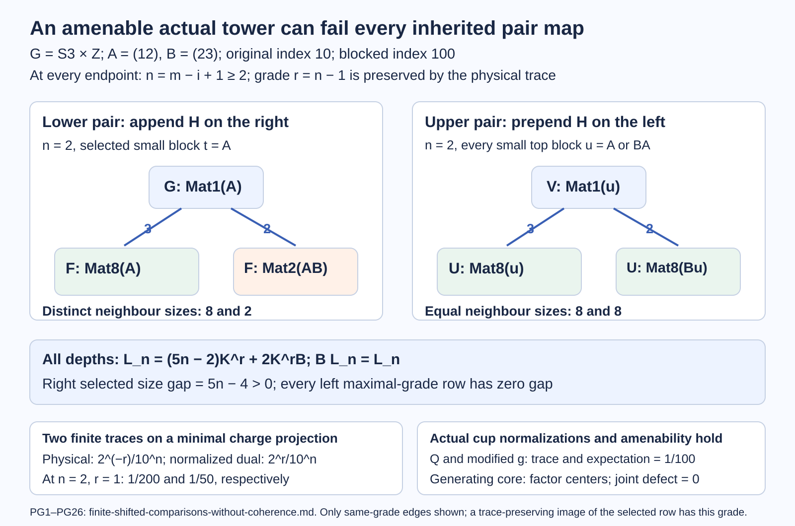
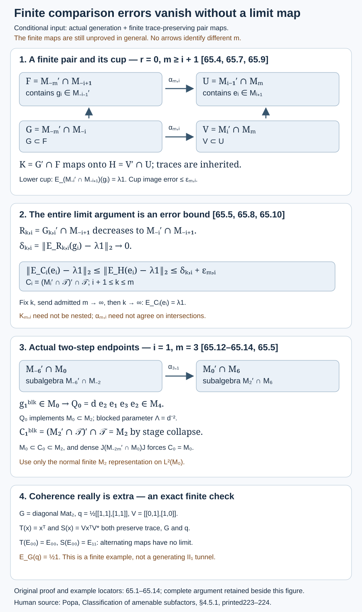

# Finite comparisons suffice without a coherent limit map

Suitable finite comparisons and actual generation imply the tower bicommutant equality and the compatible smooth hypertrace. The finite maps may be independent and may have cup images with vanishing errors. We prove the complete analytic implication, including a fixed extra shift and the two-step blocked version. The finite maps are an additional hypothesis: the actual amenable example PG1–PG26 below shows that (65.14) can fail at every required depth and for every ordinary tracial tunnel of the same inclusion.

The primary reference is Sorin Popa, [*Classification of amenable subfactors of type II*](https://doi.org/10.1007/BF02392646), printed pp.223–224, the general nonextremal paragraph of 4.5.1. Printed223 has \(M\supset N\supset N_1\supset\cdots\), so \(N_0=N\) and \(N_i=M_{-i-1}\). Uniformly, the source cup \(\epsilon_t\) is our \(e_{t-1}\): in particular \(\epsilon_{-i}=e_{-i-1}\). Reindexing the source's \(m,i\) by \(m+1,i+1\) therefore gives exactly the unshifted course comparison (65.9) with \(r=0\). Its written upward endpoint \(M_{m+1}\) does not constitute an extra shift after that reindexing. The earlier 62.4 unshifted endpoint criterion remains correct.

We use [abstract blocking](reflected-traces-and-uniform-bounds.md),14.8, which supplies the skipped basic-construction triple.[64.1](two-step-cups-and-composed-densities.md) identifies its normalized four-cup word, and 64.2–64.3 prove the modified composition, common basis and sharp squared index. None of these results supplies the finite trace comparison. We use [scalar cup placement](canonical-rescaling-of-jones-cups.md),63.5; [finite normal tower representation](reflected-traces-and-uniform-bounds.md),14.2; and [stage collapse](smooth-representations-and-tower-compression.md),61.4. The elementary expectation estimates needed below are proved here. Finite-dimensionality of relative commutants follows from 2.5.

## Generation at every fixed lower endpoint

Let \(N\subset M\) be a finite-index inclusion of II₁ factors, of index \(d\), with actual Jones tunnel \(M_{-1}=N,M_0=M\). Put \(\lambda=d^{-1}\) and

\[
\begin{gathered}
D_m=M_{-m}'\cap M,\\
M=\left(\bigcup_mD_m\right)''.
\end{gathered}
\tag{65.1}
\]

For \(m\ge i\ge0\), put \(D_{m,i}=M_{-m}'\cap M_{-i}\). Then

\[
\begin{gathered}
E_{M_{-i}}(D_m)=D_{m,i},\\
M_{-i}=\left(\bigcup_{m\ge i}D_{m,i}\right)''.
\end{gathered}
\tag{65.2}
\]

Indeed \(M_{-m}\subset M_{-i}\), so bimodularity sends a commuting element to a commuting element. Every element of \(D_{m,i}\) is already in \(D_m\) and is fixed by the expectation, proving the range equality. Kaplansky density for the increasing finite-dimensional union in (65.1) supplies uniformly bounded approximants to every element of \(M\). Apply the normal expectation to these approximants. Their images have weak closure \(M_{-i}\), proving (65.2). This step requires actual generation, without a separately imposed trace comparison.

## A lower estimate for nonnested finite commutants

Fix \(i\ge1\), set \(P=M_{-i}\), \(Q=M_{-i+1}\), and choose an actual projection \(g_i\in Q\) satisfying

\[
\begin{gathered}
g_i\in M_{-i-1}',\\
E_{P'\cap Q}(g_i)=\lambda1.
\end{gathered}
\tag{65.3}
\]

Such projections are supplied by 63.5 in every prescribed tunnel. For \(m\ge i+1\), write

\[
\begin{gathered}
F_{m,i}=D_{m,i-1},\quad G_{m,i}=D_{m,i},\\
K_{m,i}=G_{m,i}'\cap F_{m,i},\\
R_{k,i}=G_{k,i}'\cap Q .
\end{gathered}
\tag{65.4}
\]

The projection \(g_i\) belongs to \(F_{m,i}\) by its deeper commutation. Although the \(K_{m,i}\) need not form a nested family, for \(m\ge k\ge i+1\) one has \(K_{m,i}\subset R_{k,i}\). Consequently

\[
\begin{gathered}
\|E_{K_{m,i}}(g_i)-\lambda1\|_2
\le \delta_{k,i},\\
\delta_{k,i}:=\|E_{R_{k,i}}(g_i)-\lambda1\|_2,\\
\delta_{k,i}\longrightarrow0\quad(k\longrightarrow\infty).
\end{gathered}
\tag{65.5}
\]

All expectations and norms here use the inherited normalized trace of \(Q\).

**Proof of the limit.** The algebras \(R_{k,i}\) decrease, and (65.2) gives
\(\bigcap_kR_{k,i}=P'\cap Q\). For a bounded \(x\in Q\), put \(x_k=E_{R_{k,i}}(x)\). If \(l\ge k\), orthogonal projection in \(L^2(Q)\) gives
\[
\|x_k-x_l\|_2^2=\|x_k\|_2^2-\|x_l\|_2^2.
\]
The squared norms decrease to an infimum, so \(x_k\) is \(L^2\)-Cauchy. Its uniform bound \(\|x_k\|\le\|x\|\) supplies an ultraweak cluster in \(Q\). Every cluster lies in each \(R_{k,i}\); pairing with bounded elements identifies it with the \(L^2\) limit. For \(a\in P'\cap Q\), one has \(\tau(a^*x_k)=\tau(a^*x)\). These identities characterize the limit as \(E_{P'\cap Q}(x)\). Apply this to \(g_i\) and use (65.3).

For the inequality, nested expectations give
\[
E_{K_{m,i}}(g_i-\lambda1)
=E_{K_{m,i}}E_{R_{k,i}}(g_i-\lambda1).
\]
The last expectation is an \(L^2\) contraction. This proves (65.5), including the nonnested case. No commutant-continuity assertion for the \(K_{m,i}\) is needed.

## Finite compression bounds an infinite expectation

Let \(\mathcal T\) be a finite tracial von Neumann algebra, \(A\subset\mathcal T\) a unital von Neumann subalgebra, and \(C\subset\mathcal T\) another such algebra. Suppose \(H\subset A\) and \(E_A(C)\subset H\). For \(x\in A\) and a scalar \(s\),

\[
\begin{gathered}
\|E_C(x)-s1\|_2\\
\le\|E_H(x)-s1\|_2.
\end{gathered}
\tag{65.6}
\]

**Proof.** Put \(c=E_C(x)-s1\) and \(h=E_A(c)\in H\). Orthogonal projection, then trace adjointness and Cauchy–Schwarz, give
\[
\begin{aligned}
\|c\|_2^2
&=\langle x-s1,c\rangle
=\langle x-s1,h\rangle\\
&=\langle E_H(x)-s1,h\rangle\\
&\le\|E_H(x)-s1\|_2\,\|h\|_2\\
&\le\|E_H(x)-s1\|_2\,\|c\|_2 .
\end{aligned}
\]
Divide when \(c\ne0\); the other case is immediate. This proof covers arbitrary complex \(x,s\).

For the canonical tracial tower completion \(\mathcal T\), fix an integer \(r\ge0\) and put
\[
\begin{gathered}
B_j=M_j'\cap\mathcal T,\quad C_j=B_j'\cap\mathcal T,\\
U_{m,i}^{(r)}=M_{i-1+r}'\cap M_{m+r},\\
V_{m,i}^{(r)}=M_{i+r}'\cap M_{m+r},\\
H_{m,i}^{(r)}=(V_{m,i}^{(r)})'\cap U_{m,i}^{(r)}.
\end{gathered}
\tag{65.7}
\]

The cup \(e_{i+r}\in M_{i+r+1}\) implements \(M_{i+r-1}\subset M_{i+r}\); it belongs to \(U_{m,i}^{(r)}\) for \(m\ge i+1\). For \(c\in C_{i+r}\cap B_{i+r-1}\), the element \(E_{M_{m+r}}(c)\) belongs to \(U_{m,i}^{(r)}\) by \(M_{i+r-1}\)-bimodularity. It commutes with \(V_{m,i}^{(r)}\), by the same bimodularity and \(V_{m,i}^{(r)}\subset B_{i+r}\). Thus it lies in \(H_{m,i}^{(r)}\).

For \(x=e_{i+r}\), the expectation \(E_{C_{i+r}}(x)\) belongs to \(B_{i+r-1}\): \(M_{i+r-1}\subset C_{i+r}\) and \(x\in M_{i+r-1}'\). Applying the preceding pairing proof with this \(c\), and with \(E_{M_{m+r}}\) as the finite compression, therefore gives

\[
\begin{gathered}
\|E_{C_{i+r}}(e_{i+r})-\lambda1\|_2\\
\le\|E_{H_{m,i}^{(r)}}(e_{i+r})-\lambda1\|_2.
\end{gathered}
\tag{65.8}
\]

One need not assert \(E_{U_{m,i}^{(r)}}(C_{i+r})\subset H_{m,i}^{(r)}\) for arbitrary elements of \(C_{i+r}\): the proof only uses the element \(c\in C_{i+r}\cap B_{i+r-1}\), whose finite compression was just checked.

## Independent finite pair maps give scalar upper cups

For every \(i\ge1\), suppose there are arbitrarily large integers \(m\) and unital trace-preserving linear *-anti-isomorphisms

\[
\begin{gathered}
\alpha_{m,i}:F_{m,i}\longrightarrow U_{m,i}^{(r)},\\
\alpha_{m,i}(G_{m,i})=V_{m,i}^{(r)},\\
\|\alpha_{m,i}(g_i)-e_{i+r}\|_2
\le\varepsilon_{m,i}\longrightarrow0 .
\end{gathered}
\tag{65.9}
\]

The maps may be chosen independently for different \(m,i\). The exact cup image in the source is the special case \(\varepsilon_{m,i}=0\). The norms on the last line use the inherited tower trace.

Then, for every \(m\) admitted in (65.9) and every \(i+1\le k\le m\),

\[
\begin{gathered}
\|E_{C_{i+r}}(e_{i+r})-\lambda1\|_2\\
\le\delta_{k,i}+\varepsilon_{m,i},\\
E_{C_j}(e_j)=\lambda1\\
(j\ge r+1).
\end{gathered}
\tag{65.10}
\]

**Proof.** Reversing products preserves the condition of commuting with a subalgebra, so \(\alpha_{m,i}(K_{m,i})=H_{m,i}^{(r)}\). A trace-preserving *-anti-isomorphism is an \(L^2\) isometry: \(\tau(\alpha(x)^*\alpha(x))=\tau(\alpha(xx^*))=\tau(xx^*)=\tau(x^*x)\). It carries the orthogonal projection onto \(L^2(K_{m,i})\) to the projection onto \(L^2(H_{m,i}^{(r)})\). Hence it intertwines their expectations. Equation (65.5), triangle inequality and contraction give
\[
\begin{aligned}
\|E_{H_{m,i}^{(r)}}(e_{i+r})-\lambda1\|_2
&\le\|E_{H_{m,i}^{(r)}}(\alpha_{m,i}(g_i))-\lambda1\|_2\\
&\quad+\|e_{i+r}-\alpha_{m,i}(g_i)\|_2\\
&\le\delta_{k,i}+\varepsilon_{m,i}.
\end{aligned}
\]
Use (65.8). First fix \(k\), then take an unbounded admitted subsequence of \(m\) with \(\varepsilon_{m,i}\to0\); finally send \(k\to\infty\). This proves the exact scalar identity. No common subsequence for all \(i\), no comparison between two finite maps, and no extension of any \(\alpha_{m,i}\) is used.

The same proof works for *-isomorphisms, but the source asks for anti-isomorphisms and (65.9) keeps that orientation explicit.

## Collapse above the initial factor, then recover it

Under (65.1), (65.3) and (65.9),

\[
(M'\cap\mathcal T)'\cap\mathcal T=M.
\tag{65.11}
\]

**Proof.** Apply 61.4 to the tower starting at \(M_{r+1}\), with \(B=B_{r+1}=M_{r+1}'\cap\mathcal T\). Its successive tail commutants are exactly \(B_j\), \(j\ge r+1\), and (65.10) supplies every required cup condition. Thus \(C_{r+1}=M_{r+1}\).

Since \(B_{r+1}\subset B_0\), one has \(M\subset C_0\subset C_{r+1}=M_{r+1}\). For \(y\in C_0\) and \(m\ge r+1\), the finite reflected algebra \(J D_mJ\) belongs to \(M'\cap M_m\subset B_0\), by 14.2. Therefore \(y\) commutes with it. Transport this finite relation to the coherent faithful normal representation of \(M_m\) on \(L^2(M)\), where \(J\widehat x=\widehat{x^*}\). Generation (65.1) makes the union of \(J D_mJ\) weakly dense in \(JMJ=M'\). Commutation with the fixed bounded operator \(y\) is weakly closed. Hence \(y\in(M')'=M\). This proves (65.11). Only finite stages are represented normally; the whole tracial limit is not assumed to act normally on \(L^2(M)\).

Generation also makes \(N\) a weak closure of its increasing finite-dimensional algebras \(M_{-m}'\cap N\), by (65.2). The explicit construction 61.8 therefore gives the injective projections for \(M,N\) and every finite tower factor;61.7 gives the projection onto \(\mathcal T\). Combine this with (65.11) and 61.6. Every smooth nondegenerate expected representation \(N\subset M\subset(U\subset_E V)\) has a UCP conditional expectation \(F:V\to M\) with \(F(U)\subset N\) and \(E_NF=FE\). The state \(\tau_MF\) is the compatible \(M\)-hypertrace. These projections can be nonnormal. No extra separability hypothesis is added: the actual generating finite-dimensional sequence is the input.

## Exact two-step application in the original tower

Keep an original index-\(d\) tower \((M_t)\), and block it by \(L_t=M_{2t}\). Its adjacent index is \(D=d^2\), and its cup parameter is \(\Lambda=d^{-2}\).64.1 gives
\[
\begin{gathered}
Q_a=d\,e_{a+2}e_{a+1}e_{a+3}e_{a+2}\\
\in M_{a+4},\\
\text{implementing }M_a\subset M_{a+2},\\
b_j=Q_{2j-2}\in L_{j+1}.
\end{gathered}
\tag{65.12}
\]

Use63 directly on this actual blocked tracial inclusion. For \(i\ge1\), let \(\kappa_i^{\mathrm{blk}}\in Z(M_{-2i-2}'\cap M_{-2i})\) be its own canonical density, put \(c_i=(\kappa_i^{\mathrm{blk}})^{1/2}\), and set
\[
\begin{gathered}
g_i^{\mathrm{blk}}=c_iQ_{-2i-2}c_i\\
\in M_{-2i+2}\cap M_{-2i-2}',\\
E_{M_{-2i}'\cap M_{-2i+2}}(g_i^{\mathrm{blk}})
=d^{-2}1 .
\end{gathered}
\tag{65.13}
\]

This uses the canonical density of the blocked inclusion itself. It does not require identifying it with a product of adjacent densities.

The exact remaining finite comparison input is, for each \(i\ge1\), at arbitrarily large \(m\ge i+1\),
\[
\begin{gathered}
\alpha_{m,i}:
M_{-2m}'\cap M_{-2i+2}\\
\longrightarrow M_{2i-2}'\cap M_{2m},\\
\alpha_{m,i}(M_{-2m}'\cap M_{-2i})\\
=M_{2i}'\cap M_{2m},\\
\alpha_{m,i}(g_i^{\mathrm{blk}})=Q_{2i-2},
\end{gathered}
\tag{65.14}
\]
with the inherited traces and anti-isomorphism orientation. A vanishing \(L^2\) cup error also suffices by (65.9).

The even downward subsequence is cofinal, so (65.1) remains actual generation for the blocked tunnel. The even upward subsequence has the same tracial closure \(\mathcal T\). Apply 65.1–65.5 to \((L_t)\) with \(\Lambda\) and \(r=0\). Its collapse starts at \(L_1=M_2\), after which the finite normal representation of \(M_2\) and the original generating union recover \(M\), exactly as in 65.5. This proves the original bicommutant (65.11). For a smooth expected representation of the original one-step inclusion \(N\subset M\), use the original tower and 61.6–61.8 to obtain its compatible hypertrace. Thus the blocked criterion suffices for the original inclusion without assuming one-step finite comparisons.

## Exact examples and the limit-map distinction

**An incoherent family.** In \(\operatorname{Mat}_2\) with normalized trace, let \(G\) be the diagonal algebra,
\[
q=\tfrac12\begin{pmatrix}1&1\\1&1\end{pmatrix},
\qquad V=\begin{pmatrix}0&1\\1&0\end{pmatrix}.
\]
Both \(T(x)=x^{\mathsf T}\) and \(S(x)=Vx^{\mathsf T}V^*\) are linear trace-preserving *-anti-automorphisms, preserve \(G\), and fix \(q\). Moreover \(E_{G'\cap\operatorname{Mat}_2}(q)=\tfrac121\). Alternate \(T,S\) on a constant chain. Their values on \(E_{00}\) alternate between \(E_{00},E_{11}\), so they have no pointwise limit and do not define a common map on the union. This finite example demonstrates that coherence is genuinely extra. It is not asserted to be a generating II₁ tunnel.

**A lower quantitative check.** In \(\operatorname{Mat}_2\otimes\operatorname{Mat}_2\), let \(P=\operatorname{Mat}_2\otimes1\) and let \(q\) be the rank-one projection onto \((|00\rangle+|11\rangle)/\sqrt2\). Then \(E_{P'}(q)=\tfrac141\). At the preceding scalar stage, \(R_0\) is the entire algebra and
\(\|q-\tfrac141\|_2^2=3/16\); at the full \(P\)-stage, \(\delta^2=0\). Any finite \(K\subset P'\) has \(E_K(q)=\tfrac141\), exactly as (65.5) requires. These are finite algebra checks, not a substitute for generation or (65.14).

**Endpoint example.** For \(i=1,m=3\), (65.14) has domain \(M_{-6}'\cap M_0\), subalgebra \(M_{-6}'\cap M_{-2}\), range \(M_0'\cap M_6\), and image subalgebra \(M_2'\cap M_6\). It sends \(g_1^{\mathrm{blk}}\in M_0\) to \(Q_0\in M_4\). The target cup implements \(M_0\subset M_2\). The eventual scalar condition is onto \((M_2'\cap\mathcal T)'\cap\mathcal T\), and the first collapse is at \(M_2\).

## An actual amenable inclusion failing every inherited pair comparison

**Theorem PG.** There is a separable hyperfinite nonextremal index-ten inclusion with an actual generating ordinary tunnel and amenability for every smooth expected representation, for which the inherited-trace pair maps (65.14) fail for every \(i\ge1,m\ge i+1\), before any cup-image condition. The obstruction survives every other ordinary tracial tunnel for this same inclusion. The following independent construction proves the full assertion. The conditional implication above is retained.

## PG1. Concrete balanced-word algebras and a faithful physical trace

Let \(G=S_3\times\mathbb Z\). Put \(A=(12)\), \(B=(23)\), and write \(z\) for the central generator of \(\mathbb Z\). The three site labels are
\[
x_0=1,\qquad x_1=Az,\qquad x_2=B,\qquad \mu(sz^r)=2^r.
\tag{PG1}
\]
At each integer site use \(\operatorname{Mat}_3\). Assign sign \(\epsilon_j=-1\) at odd sites and \(+1\) at even sites, and normalized diagonal weights
\[
t=(1/4,1/2,1/4)\quad\text{at odd sites},\qquad
\widetilde t=(2/5,1/5,2/5)\quad\text{at even sites}.
\tag{PG2}
\]
For a word \(u\) on \([a,b]\), its charge is the **ordered** product
\(c(u)=x_{u_a}^{\epsilon_a}\cdots x_{u_b}^{\epsilon_b}\).
Define \(C_{[a,b]}\) to be the span of the matrix units \(E_{uv}\) with \(c(u)=c(v)\). It is a direct sum of full matrix blocks, one per reachable charge.

The weight of \(u\) is
\[
\tau(E_{uu})=(1/4)^{n_o}(2/5)^{n_e}\mu(c(u))^{-1},
\tag{PG3}
\]
where \(n_o,n_e\) count odd and even sites. Therefore equal-charge minimal projections have equal positive weights, making the restricted product state a faithful trace. Identity embeddings at either end preserve both balance and trace. Weighted partial trace at an end is the trace expectation onto the shorter balanced algebra: equal removed indices cancel in the ordered charge equality, and unequal removed indices have zero partial trace.

Take the compatible tracial GNS closure of the finite interval union and call it \(T\). All finite algebras embed faithfully. Within this concrete finite tracial algebra set
\[
M_b=\left(\bigcup_{a\le b}C_{[a,b]}\right)'',\qquad
R_a=\left(\bigcup_{b\ge a}C_{[a,b]}\right)''.
\tag{PG4}
\]
The increasing sequence \(C_{[-l,l]}\) generates \(T\). These definitions do not assume factoriality or promote a diagram to a tower.

## PG2. Mixing and the exact relative commutants

In the group ring put
\[
X=1+Az+B,\quad H=X^*X=Kz+(3\,1+2B)+K^*z^{-1},\quad K=A+BA.
\tag{PG5}
\]
An odd-even pair has multiplicities \(H\) and charge probability \(p(g)=H_g\mu(g)^{-1}/10\); an even-odd pair has \(H'=XX^*\) and the analogous probability. Both sum to one. Exact finite convolution, obtainable by multiplying the displayed finite group-ring polynomial eight times, gives in both phases
\[
\varepsilon=12\min_{s\in S_3,\ r\in\{0,1\}}p^8(sz^r)
=\frac{57357}{1562500}>0.
\tag{PG6}
\]
Thus \(p^8=\varepsilon\nu+(1-\varepsilon)\eta\), where \(\nu\) is uniform on \(S_3\) times the equal Bernoulli measure on \(\{0,1\}\). This \(\nu\) is central. In the binomial convolution expansion of \((p^8)^n\), the number of \(\nu\)-factors tends to infinity in probability. Their convolution is uniform on \(S_3\) times \(\operatorname{Binomial}(j,1/2)\). Its distance from a fixed integer translate tends to zero: for a unit translation it is bounded by twice the maximal binomial mass, and a fixed translation follows by telescoping. Those maximal masses tend to zero; the central even-stage masses have consecutive ratio \(1-1/(2l+2)\). Convolution is a total-variation contraction, and centrality allows \(\nu^j\) on either needed side. The remaining seven phases follow by contraction. Consequently \(p^n\) becomes invariant under every fixed left or right translate in \(G\). This proves the required mixing, rather than invoking a group amenability slogan.

For \(c<b\), a bounded \(x\in M_c'\cap M_b\) has finite trace expectations \(x_a\in C_{[a,b]}\) commuting with \(C_{[a,c]}\). On a prefix charge block \(g\), that commutant is
\[
x_a=\bigoplus_g1_{n_g}\otimes f_a(g),\qquad
f_a(g)\in C_{[c+1,b]},\quad\|f_a(g)\|\le\|x\|.
\tag{PG7}
\]
Indeed central prefix projections exclude different prefix charges, and a full prefix matrix algebra forces identity on its multiplicity space. The residual equality \(gu=gv\) cancels \(g\), leaving exactly the suffix balance condition.

Expecting after a two-site prefix extension gives
\(f_a(g)=\sum_h p(h)f_{a-2}(hg)\).
Iterating and comparing two fixed reachable prefix charges uses right-translation mixing to force \(f_a(g)=f_a(g')\). All contributing arguments are charges of actual extended words; equivalently the bounded field may be extended arbitrarily off the union of those supports for the total-variation estimate. Thus \(x_a\) lies in the single fixed finite suffix algebra. Since \(x_a\to x\) in physical \(L^2\),
\[
M_c'\cap M_b=C_{[c+1,b]}.
\tag{PG8}
\]
The empty suffix argument makes \(Z(M_c)=\mathbb C\). Interchanging prefix and suffix, using left-translation mixing, proves
\[
R_c'\cap R_a=C_{[a,c-1]}\quad(a<c),\qquad Z(R_a)=\mathbb C.
\tag{PG9}
\]
Each such algebra has arbitrarily small nonzero diagonal projection traces, because every site weight is at most \(1/2\); hence these infinite-dimensional finite factors are II₁, and hyperfinite by their finite-dimensional generating unions. For a central element of \(T\), its expectations onto \(M_b\) are scalar and converge in \(L^2\); therefore \(T\) is also a factor. All assertions concern actual operators and normal trace expectations.

## PG3. The actual ordinary Jones tower and its generating tunnel

Let \(w^k\) be the weights of site \(k\), and define
\[
e_k=\left|\sum_{j=0}^2\sqrt{w_j^k}\,jj\right\rangle
\left\langle\sum_{j=0}^2\sqrt{w_j^k}\,jj\right|
\in C_{[k,k+1]}\subset M_{k+1}.
\tag{PG10}
\]
Every \(jj\) has charge one. Since \(w_j^kw_j^{k+1}=1/10\), finite matrix compression and weighted partial trace prove
\[
e_kxe_k=E_{M_{k-1}}(x)e_k,\quad
E_{M_k}(e_k)=1/10,\quad\tau(e_k)=1/10.
\tag{PG11}
\]
On a local word, compression keeps precisely the balanced prefix, also proving
\(e_kM_{k+1}e_k=M_{k-1}e_k\).
The formulas extend normally to the closures.

To prove generation, set \(D=\langle M_k,e_k\rangle\subset M_{k+1}\). Its center lies in the actual diagonal algebra \(M_k'\cap M_{k+1}=C_{[k+1,k+1]}\). Commutation with the full-support cup forces all three diagonal coefficients equal, so \(D\) is a factor. Its \(e_k\)-corner is the same as that of \(M_{k+1}\). Since \(e_k\) has full central support in this finite factor, choose a finite partial-isometry frame \(v_r\in De_k\), with \(\sum_rv_rv_r^*=1\). For \(y\in M_{k+1}\), all \(v_r^*yv_s\) belong to the common corner. Expanding \(y\) in this frame puts it in \(D\).

The map \(\widehat x\mapsto\sqrt{10}\,\widehat{xe_k}\) identifies \(L^2(M_k)\) isometrically with \(L^2(M_{k+1})e_k\). Its surjectivity follows from the weakly dense Jones ideal span \(M_ke_kM_k\), whose support is one. Left \(M_k\) acts standardly; left \(e_k\) acts as the expectation projection onto \(L^2(M_{k-1})\). Left \(M_{k+1}\) acts faithfully and normally on this nonzero right ideal. This recognizes the actual tracial basic construction and proves, for **every integer** \(k\),
\[
M_{k+1}=\langle M_k,e_k\rangle,\qquad[M_k:M_{k-1}]=10.
\tag{PG12}
\]
Adjacent cups have Jones parameter \(1/10\), by the same finite multiplication; cups at distance at least two have disjoint supports. These identities are independently checked in exact \(\mathbb Q(\sqrt2)\) arithmetic.

For \(N=M_{-1}\subset M=M_0\), the negative factors and cups are therefore an actual marked ordinary tunnel. Equation PG8 gives
\[
M=\left(\bigcup_{l\ge1}M_{-l}'\cap M\right)'',\qquad
N=\left(\bigcup_{l\ge1}M_{-l}'\cap N\right)''.
\tag{PG13}
\]
These follow from the defining left intervals, not from a finite-depth assertion.

## PG4. Bicommutant equality and amenability in every smooth representation

Normal expectations onto \(M_b\), together with PG8, give \(M'\cap T=R_1\). To compute its commutant, expect an element of \(R_1'\cap T\) onto \(R_a\), with \(a\to-\infty\). PG9 puts each expectation in \(C_{[a,0]}\), and they converge in \(L^2\). Hence
\[
(M'\cap T)'\cap T=M.
\tag{PG14}
\]
This direct proof does not use a finite pair reflection.

We prove amenability for every smooth representation, with the actual hypotheses verified. For the increasing finite-dimensional \(H_l=C_{[-l,l]}\subset T\), compress an operator in \(B(L^2(T))\) to \(L^2(H_l)\), Haar-average conjugation by the right unitary group, and regard the output as left \(H_l\subset T\). This is UCP, including when \(H_l\) has several blocks: independent central phases remove cross-block operators, and the right matrix commutants are the left matrix blocks. On **every** physical left \(x\in T\), its value is \(E_{H_l}(x)\), converging ultraweakly to \(x\). A point-ultraweak cluster consequently gives a UCP projection
\(\Theta:B(L^2(T))\to T\)
fixing all of \(T\), not just its algebraic union. It is \(T\)-bimodular by the multiplicative domain.

Now let \(\mathcal U\subset_E\mathcal V\) be any normal faithful nondegenerate expected representation of \(N\subset M\), smooth in the source sense: the original \(N'\cap M_j\) commutes with \(\mathcal U\), \(E|_M=E_N\), and the ultraweak span of \(M\mathcal U\) is \(\mathcal V\). No finiteness or separability of the represented algebras is imposed. The finite matrix construction [61.2](smooth-representations-and-tower-compression.md) builds their expected tower with the original cups. Explicitly, for a finite physical partial basis \(a_i\), its next stage is
\(p\operatorname{Mat}_n(\mathcal U)p\), with
\(L(v)_{ij}=E(a_i^*va_j)\), \(p=\operatorname{diag}(f_i)\),
cup \(e=\eta\eta^*\), \(\eta_i=E(a_i^*)\), and dual expectation
\(E_1(C)=10^{-1}\sum_{i,j}a_iC_{ij}a_j^*\).
The finite row identity proves faithfulness, multiplication, the projection, spanning and restriction to the original tower. The dual basis \(\sqrt{10}a_ie\) permits iteration. Thus the normal expected stages and their physical traces used below are actual, not assumed from a picture. Initial smoothness and nondegeneracy imply that each original \(M_i'\cap M_j\) commutes with the represented stage at \(i\), as in the complete proof 61.3.

Extend \(\tau_N\) to a normal state \(\psi\) on \(\mathcal U\), using [61.5](smooth-representations-and-tower-compression.md) and its linked normal vector-functional extension proof, valid on arbitrary Hilbert spaces. Composing with the represented tower expectations gives compatible normal states on its finite stages, restricting to the original normalized tower traces. Their state on the norm-closed stage union has a GNS representation \(\pi\) normal on each finite stage: coefficients at a vector from a later stage are normal, and polarization and predual-norm approximation by those dense vectors prove the assertion for all vectors.

The original-tower cyclic subspace is exactly \(L^2(T)\). Its projection \(r\) commutes with every original stage and cup. Set
\[
F(v)=\Theta\bigl(r\pi(v)r|_{L^2(T)}\bigr).
\tag{PG15}
\]
This map is UCP and fixes \(M\). For \(c\in M'\cap M_j\), smoothness and nondegeneracy give \([c,v]=0\). Compression and \(T\)-bimodularity of \(\Theta\) give \([c,F(v)]=0\). The normal physical expectations show that \(\bigcup_j(M'\cap M_j)\) is ultraweakly dense in \(M'\cap T\): they preserve commutation with \(M\), are uniformly bounded, and converge in \(L^2\). PG14 now forces \(F(v)\in M\).

For \(u\in\mathcal U\), smoothness gives \([u,e_0]=0\). Therefore \([F(u),e_0]=0\). If \(x\in M\) commutes with this actual cup, then
\(xe_0=E_N(x)e_0\). The actual Markov trace gives
\(\|(x-E_Nx)e_0\|_2^2=10^{-1}\|x-E_Nx\|_2^2\),
so \(x\in N\). Thus \(F(\mathcal U)\subset N\). The UCP projection is \(M\)-bimodular.

For completeness, a finite physical basis \(b_i\) gives the normal row
\(v=\sum_i b_iE(b_i^*v)\)
on the whole \(\mathcal V\), since it holds on its ultraweakly dense \(M\mathcal U\). With \(u_i=E(b_i^*v)\), finite bimodularity gives
\[
E_NF(v)=\sum_iE_N(b_i)F(u_i)=FE(v).
\tag{PG16}
\]
Consequently \(\varphi=\tau_MF\) is a state, is \(M\)-central, restricts to the physical trace, and satisfies \(\varphi E=\varphi\). This proves the **every-smooth-representation** quantifier of Definition 3.1.1. The expectation and state can be nonnormal. No normal representation of a whole infinite represented tower, tracial state on the representation, or group-kernel classification is assumed.

## PG5. Both finite traces and the exact all-depth pair obstruction

The initial actual commutant is the three-dimensional diagonal algebra at site zero. Its physical weights are \((2/5,1/5,2/5)\). Compression to a fixed site label cancels that final charge and identifies each corner inclusion with \(N\) itself. Thus all three local indices are one. The [local module formula2.4](module-dimension-and-local-index.md) gives normalized dual weights \((1/4,1/2,1/4)\), with density \((5/8,5/2,5/8)\). This is actual nonextremality.

More generally, on any odd-even interval of length \(2n\), a charge block \(sz^r\) has matrix size \((H^n)_{sz^r}\). Every minimal projection in that block has physical trace
\[
\tau(p_{s,r})=\frac{2^{-r}}{10^n}.
\tag{PG17}
\]
The inclusion between its initial and final factors has index \(10^{2n}\), by the actual tower. Compressing by a fixed full word again cancels its final group charge, so that minimal corner's local index is one. The same local module formula gives the normalized finite-module dual trace and central density
\[
\rho(p_{s,r})=\frac{2^r}{10^n},\qquad k_n|_{sz^r}=4^r1.
\tag{PG18}
\]
Both trace masses are one; evaluation of \(H\) under either \(\mu\) or \(\mu^{-1}\) is ten. These are finite-module traces on actual finite relative commutants, not the core's scalar canonical traces.

Fix **any** \(i\ge1\), \(m\ge i+1\), and put \(n=m-i+1\ge2\). PG8 identifies the precise pairs of (65.14) as
\[
\begin{array}{ll}
F_{m,i}=C_{[-2m+1,-2i+2]},&G_{m,i}=C_{[-2m+1,-2i]},\\
U_{m,i}=C_{[2i-1,2m]},&V_{m,i}=C_{[2i+1,2m]}.
\end{array}
\tag{PG19}
\]
Both large algebras have \(H^n\) multiplicities and trace PG17. Both small ones have \(H^{n-1}\), with denominator \(10^{n-1}\). The lower embedding appends \(H\) on the **right**, while the upper embedding prepends it on the **left**. This description is the actual tensor embedding of the finite matrix units. A trace-preserving pair (anti-)isomorphism must preserve block sizes, minimal-projection traces and inclusion multiplicities. PG17 therefore forces it to preserve integer grade \(r\) on both rows.

At the maximal small grade \(r=n-1\), the small block sizes are \(K^r\). The large coefficients at that same grade are
\[
L_n=(5n-2)K^r+2K^rB.
\tag{PG20}
\]
Indeed only one of the \(n\) factors can have grade zero; all others have grade one. Since \(BK=K\), every zero-grade factor with a \(K\)-factor to its right contributes \(5K^r\); the last position contributes \(3K^r+2K^rB\). This proves PG20 for every \(n\), without a finite computational cutoff.

Every maximal-grade small block \(t\) in the **left** embedding has same-grade neighbours \(t\) with multiplicity three and \(Bt\) with multiplicity two. Their large sizes are equal, because \(BL_n=L_n\). In the **right** embedding those uniquely weighted neighbours are \(t\) and \(tB\), with size difference
\[
L_n(t)-L_n(tB)=(5n-4)\bigl(K^r(t)-K^r(tB)\bigr).
\tag{PG21}
\]
Writing \(\Omega=\sum_{s\in S_3}s\), direct group multiplication gives
\(K^3=K+\Omega\) and \(K^2=1+B+AB+ABA\). Consequently
\[
K^{r+2}=K^r+2^{r-1}\Omega\quad(r\ge1).
\tag{PG22}
\]
For odd \(r\) choose \(t=A\); for even \(r\) choose \(t=AB\). The first two powers have \(K^r(t)>0\) and \(K^r(t)-K^r(tB)=1\); PG22 preserves the difference, since \(\Omega\) is right-\(B\) invariant. Thus a genuine positive small block in the right embedding has unequal neighbour sizes with gap \(5n-4>0\). Every candidate image block in the left embedding has equal sizes. Grade preservation and the distinct multiplicities three and two make this an invariant contradiction. Anti-isomorphisms do not evade it: transposing the finite matrix blocks preserves their sizes and their inclusion multiplicities.

There is therefore no inherited-trace pair (anti-)isomorphism in PG19 for **any** \(i\ge1,m\ge i+1\). At \(n=2\), the selected right neighbours have sizes eight and two, whereas every maximal-grade left row has sizes eight and eight. Independent exact computations through \(n=40\) check the base identities and constants; PG20–PG22, rather than those computations, prove the unbounded assertion.

## PG6. All actual designated cup conditions are present

Use the original \(d=10\) cups. For every integer \(a\), the normalized blocked cup is
\[
Q_a=10e_{a+2}e_{a+1}e_{a+3}e_{a+2}\in M_{a+4},
\qquad\tau(Q_a)=1/100.
\tag{PG23}
\]
The [Theorem64.1](two-step-cups-and-composed-densities.md) applies to the actual PG12 factors, and proves the tracial basic construction for \(M_a\subset M_{a+2}\), its index 100, expectation \(E_{M_{a+2}}Q_a=1/100\), compression, generation and adjacent/distant blocked Jones relations. Its projection calculation uses only the already verified cup relations. Our exact local four-site check independently verifies the projection, trace and Markov expectation. The bare four-cup word has trace \(1/1000\) and is not used as a projection.

For \(i\ge1\), PG18 with \(n=1\) gives the actual blocked canonical density
\(\kappa_i\in Z(M_{-2i-2}'\cap M_{-2i})\),
whose charge-\(sz^r\) value is \(4^r\). Put
\[
g_i=\kappa_i^{1/2}Q_{-2i-2}\kappa_i^{1/2}.
\tag{PG24}
\]
The [63.1–63.5](canonical-rescaling-of-jones-cups.md), applied directly to this actual blocked tower, gives
\[
\begin{gathered}
g_i=g_i^*=g_i^2\in M_{-2i+2}\cap M_{-2i-2}',\quad\tau(g_i)=1/100,\\
E_{M_{-2i}'\cap M_{-2i+2}}(g_i)=1/100,\\
g_ixg_i=E_{M_{-2i-2}}(\kappa_i^{1/2}x\kappa_i^{1/2})g_i
\quad(x\in M_{-2i}),\\
\langle M_{-2i},g_i\rangle=M_{-2i+2}.
\end{gathered}
\tag{PG25}
\]
The modified blocked cups also have parameter \(1/100\) and the corresponding distant commutations. This uses their own canonical density; no composed-density identity is inferred from index equality. In the local four-site matrix model, \(\kappa_i^{1/2}\) is the diagonal \(2^{-\mathbf1_{u=1}+\mathbf1_{v=1}}\) on the first pair. Exact arithmetic checks PG24's projection, physical trace and expectation onto the last pair as \(1/100\).

The target in (65.14) is the actual ordinary \(Q_{2i-2}\), also of physical trace \(1/100\). The lower \(g_i\) lies in the stated domain for every \(m\ge i+1\). All projections, placements and scalar relative expectations therefore exist with their exact required normalization. The failure is the **pair map itself**. Hence its exact designated cup image, or a vanishing physical \(L^2\) error in that image, cannot be imposed on an unbounded subsequence.

**Figure PG.1.** At \(n=2\), only the selected grade-one small row and its grade-one neighbours are drawn. Edge labels are actual inclusion multiplicities, and box labels are actual matrix-block sizes. Other edges and grades exist but cannot replace these neighbours under a trace-preserving pair map, because the selected row's grade is fixed and its two same-grade multiplicities are distinct. The all-depth size difference, both normalized finite traces and actual cup constants are PG17–PG25. The boxes do not depict areas proportional to trace. [Reproducible CC0 figure source](figures/amenable-path-pair-obstruction-v10.py).

## PG7. Exact correction, and the separate fixed-core target

The corrected unconditional statement is: the specified inherited-trace pair comparisons are a sufficient additional input for Lesson 65's analytic implication, and are not a consequence of amenability plus a prescribed generating ordinary tunnel. They fail in this actual amenable example at every fixed \(i\) and all sufficiently large depths (indeed all admissible depths). Any route requiring them unconditionally needs a changed theorem or an actually proved different comparison construction. Merely changing a trace or cup label would change the original required input.

This obstruction also survives **every other ordinary tracial tunnel** for the same fixed \(N\subset M\). The [recognition and uniqueness theorem4.5](towers-and-tunnels.md) says that two downward Jones projections in the same upper factor, with the same scalar expectation onto its smaller factor, are conjugate by a unitary of that smaller factor. Inductively align two finite negative prefixes. Once the factors through depth \(r\) agree, apply this uniqueness to the next downward cup in the already aligned pair; the correcting unitary lies in the factor at depth \(r\). It therefore preserves each shallower factor as an algebra. Multiplying these finitely many correcting unitaries yields one unitary of \(N\) carrying all factors of the old prefix through depth \(2m\) onto those of the new prefix. Its inner conjugation is trace preserving and identifies the old and new lower pairs in PG19. A pair anti-isomorphism for the new tunnel, composed with this finite-prefix isomorphism, would therefore give the forbidden map for the old tunnel into the fixed canonical upper pair. This argument does not require a coherent infinite conjugating unitary and applies separately at every finite depth. Ordinary-tunnel selection, even when allowed to depend on \(m\), cannot evade PG21.

For clarity, an algebraic reflection on finite words reverses the word and transposes its matrix unit, sending charge \(sz^r\) to its inverse. It exchanges right and left endpoint embeddings but exchanges PG17's physical weights with PG18's dual weights. This explains a real trace distinction; it does **not** supply the inherited-trace maps or the marked modified-cup condition of (65.14), and is not substituted for them.

Popa, *Classification of amenable subfactors of type II*, §4.5.1, printed pp.223–224, passes to a two-step inclusion, modifies downward cups and invokes [Po12] for a finite comparison. PG1–PG25 refute the literal universal inherited-trace endpoint-pair requirement (65.14). This result does not refute the complete source theorem or identify the conventions of its cited construction.

By PG13 the displayed full ordinary core is \(S=N,R=M\). Both are factors, so both centers and their lifts are scalar. Its actual canonical Jones projection is \(e_R^M=1\), its canonical pair is \(\mathcal A=N\subset\mathcal B=M\), and
\[
\operatorname{Tr}_{\mathcal A}=\tau_N,\quad
\operatorname{Tr}_{\mathcal B}=\tau_M,\quad
\operatorname{Tr}_{\mathcal B}|_{\mathcal A}=\operatorname{Tr}_{\mathcal A},\quad
\operatorname{Tr}_{\mathcal A}(e)=\operatorname{Tr}_{\mathcal B}(e)=1.
\tag{PG26}
\]
Both generalized central trace functions are the corresponding scalar traces. The joint algebra \(D_0=Z(S)\vee Z(R)=\mathbb C\), its lift is the scalar identity, and \(P_0\) is the identity. Every joint-state defect is therefore zero. The nonextremality and the failed finite pair maps concern PG17–PG18 and PG19; they do not refute that scalar joint target. No statement about all other cores is made.

## Exercises with complete solutions

**Exercise 65.1 — source indices.** Translate the source finite comparison with source \(i=2,m=5\) into the original one-step course notation. Locate both cups.

**Solution.** Since \(N_t=M_{-t-1}\), its domain \(N_5'\cap N_1\) is \(M_{-6}'\cap M_{-2}\), and its subalgebra \(N_5'\cap N_2\) is \(M_{-6}'\cap M_{-3}\). The range is \(M_2'\cap M_6\), and the image subalgebra is \(M_3'\cap M_6\). These are (65.9) with course \(i=3,m=6,r=0\). The source cup \(\epsilon_{-2}'\) is the modified \(g_3\in M_{-2}\); its image \(\epsilon_4\) is \(e_3\in M_4\), implementing \(M_2\subset M_3\). This calculation alone does not establish existence of that comparison.

**Exercise 65.2 — nonnested expectations.** In \(\operatorname{Mat}_2\), set \(p=E_{00}\), \(\lambda=1/2\). Let \(K_1=K_3\) be the diagonal algebra and \(K_2\) the algebra diagonal in the orthonormal basis \((1,1)/\sqrt2,(1,-1)/\sqrt2\). Compute \(\|E_{K_j}(p)-\lambda1\|_2^2\). Explain why (65.5) uses the decreasing reference algebras.

**Solution.** For \(j=1,3\), the expectation fixes \(p\), giving squared norm \(1/4\). The two diagonal entries of \(p\) in the second basis are both \(1/2\), so \(E_{K_2}(p)=\tfrac121\), giving zero. The three errors are \(1/4,0,1/4\), and are not monotone. Taking the containing reference algebra \(R=\operatorname{Mat}_2\) bounds all three errors by \(1/4\), but does not make them tend to zero. The limit in (65.5) instead uses \(G_{k,i}\) increasing to the actual lower factor, which makes \(R_{k,i}\) decrease to the relative commutant on which the cup expectation is scalar.

**Exercise 65.3 — an approximate cup image.** Suppose a finite family exists on an unbounded subsequence and has \(\varepsilon_{m,i}\le1/m\), with no prescribed rate for \(\delta_{k,i}\to0\). Prove the exact upper scalar expectation without interchanging limits.

**Solution.** Let \(\eta>0\). Choose \(k\ge i+1\) with \(\delta_{k,i}<\eta/2\). Then choose an admitted \(m\ge k\) with \(1/m<\eta/2\). Equation (65.10) makes the fixed upper norm smaller than \(\eta\). Since \(\eta\) was arbitrary, that norm is zero. Faithfulness of the finite trace gives \(E_{C_{i+r}}(e_{i+r})=\lambda1\). Each \(i\) can use its own unbounded subsequence.

**Exercise 65.4 — the inherited traces matter.** On \(\mathbb C\oplus\mathbb C\), put \(\tau(x,y)=x/4+3y/4\). Show that the block exchange is a unital linear *-anti-isomorphism but is not an \(L^2\) isometry.

**Solution.** The algebra is commutative, so the *-isomorphism \((x,y)\mapsto(y,x)\) also reverses multiplication. For \(p=(1,0)\), its squared norm is \(\tau(p)=1/4\), whereas its image has squared norm \(3/4\). Thus algebraic anti-isomorphism alone cannot justify the transfer in 65.4. The traces specified in (65.9) must actually agree through the map. This example supplies no generating tunnel.

**Exercise 65.5 — where collapse starts.** For the general theorem with \(r=2\), locate the first scalar cup and the factor at which 61.4 starts. Give the corresponding answer for (65.14).

**Solution.** The first index is \(i=1\), giving \(e_3\in M_4\) and \(E_{C_3}(e_3)=\lambda1\). The tower starts at \(M_3\), so 61.4 gives \(C_3=M_3\). The finite representation of \(M_3\) then recovers \(C_0=M\) from generation. For (65.14), the blocked tower has \(r=0\), so its first cup is \(b_1=Q_0\in M_4\) and collapse starts at \(L_1=M_2\). Its parameter is \(d^{-2}\), rather than \(d^{-1}\).

**Exercise 65.6 — a density identity is not a completion gate.** Does (65.13) require the product \(K\) in 64.2 to be the general blocked canonical density? What remains to be proved after (65.13)?

**Solution.** Apply 63.1–63.5 directly to the actual tracial inclusion \(L_{-i-1}\subset L_{-i}\) and its blocked basic construction supplied by 14.8/64.1. Its own central canonical density \(\kappa_i^{\mathrm{blk}}\) supplies (65.13) without a product identity. If one wants to identify that cup with the composed adjacent modified cups in 64.2, their densities must be compared separately; unchanged scalar index alone does not identify them. [Theorem 66.3 and Corollary 66.4](canonical-density-transitivity.md) now prove that separate general identity. For the bicommutant route proved here, the outstanding input is the finite inherited-trace pair comparison (65.14), with the stated cup image or a vanishing \(L^2\) cup error. A coherent family and a normal comparison limit are not additional requirements.

**Exercise 65.7 — actual traces and the first obstruction.** In PG19 take \(i=2,m=3\). Determine \(n\), the selected maximal small grade, both minimal-projection traces in the large algebra, and the selected right-neighbour size gap. Can a trace-preserving anti-isomorphism exchange that grade with grade zero?

**Solution.** Here \(n=m-i+1=2\), so the small grade is \(r=1\). PG17–PG18 give physical trace \(1/200\) and normalized dual trace \(1/50\) on a large minimal projection of this grade. Its right-neighbour sizes are eight and two, with gap \(5n-4=6\). Grade-zero minimal projections have physical trace \(1/100\), so preservation of the inherited physical trace forbids that exchange. Every same-grade row in the left embedding has equal neighbour sizes, which already excludes the pair map.

**Exercise 65.8 — changing the downward tunnel.** Suppose a different ordinary tracial tunnel for the PG inclusion admitted one of the pair maps (65.14). Explain why it would give a forbidden map for the constructed tunnel, without assuming an infinite conjugating unitary.

**Solution.** Fix that map's finite depth \(2m\). Theorem4.5 successively conjugates the finite downward prefixes by correcting unitaries in the already aligned smaller factors. Each correction preserves all shallower factors. Their finite product, a unitary in \(N\), identifies the constructed lower pair with the new one and preserves the inherited trace. Composing its inner isomorphism with the hypothetical anti-isomorphism yields a trace-preserving pair anti-isomorphism from the constructed pair to the fixed upward pair. PG20–PG22 exclude it. No comparison between different depths or infinite product is used.

*Figure 65.1.* The actual pairs and cup endpoints are (65.4), (65.7), (65.9) and (65.14). The error bound is (65.10); the decreasing reference error is (65.5). The endpoint example is \(i=1,m=3\). The last implication uses the finite representation in 65.5. Boxes denote algebras and maps, not spatial geometry. [Reproducible figure source](figures/finite-shifted-comparisons-without-coherence.py). Compare Popa 4.5.1.

PG1–PG26 show that the inherited-trace pair maps (65.14) cannot be deduced from unrestricted amenability, even after choosing another ordinary tracial tunnel for this inclusion. This lesson proves the full analytic implication from the specified finite input to the bicommutant and compatible smooth hypertrace. The finite maps need neither a coherent family nor a normal comparison limit. [Lesson 66](canonical-density-transitivity.md) gives the separate general blocked density identity and identifies the lower cup explicitly.
