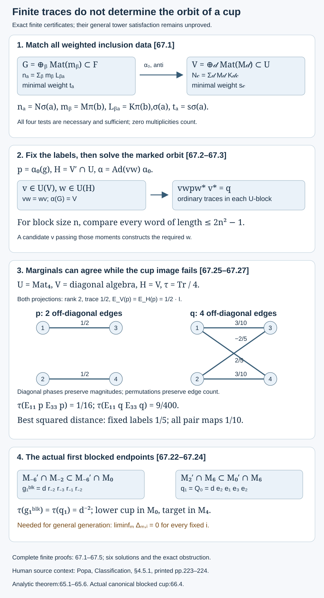

# Finite trace correction and the orbit of a cup

Two finite algebra pairs can be anti-isomorphic without admitting an anti-isomorphism that preserves their inherited traces. Even when their traces agree, a prescribed projection need not have the prescribed image. These are separate finite questions. We prove an exact criterion for the first, an explicit compact orbit for the second, and a finite list of moment equations that certifies a cup image. We then apply those criteria to the independent finite comparisons of Lesson 65.

We use finite matrix decomposition, matrix units and the finite tracial expectation, together with [the analytic comparison criterion](finite-shifted-comparisons-without-coherence.md), 65.1–65.6. [Corollary 66.4](canonical-density-transitivity.md) supplies the canonical blocked lower cups. The finite criteria below are proved here; whether a general tower satisfies them remains an additional mathematical question.

## The weighted multiplicity criterion

Let \(G\subset F\) and \(V\subset U\) be unital inclusions of finite-dimensional complex \(C^*\)-algebras, with faithful normalized traces inherited from \(F\) and \(U\). Write
\[
\begin{gathered}
F=\bigoplus_{a\in A}\operatorname{Mat}_{n_a},\\
G=\bigoplus_{b\in B}\operatorname{Mat}_{m_b},\\
U=\bigoplus_{c\in C}\operatorname{Mat}_{N_c},\\
V=\bigoplus_{d\in D}\operatorname{Mat}_{M_d}.
\end{gathered}
\tag{67.1}
\]
All traces below use the unnormalized ordinary matrix trace \(\operatorname{Tr}\). If a minimal projection of the \(a\)-block of \(F\) has weight \(t_a>0\), then
\[
\begin{gathered}
\tau_F(x)=\sum_a t_a\operatorname{Tr}(x_a),\\
\sum_a n_at_a=1.
\end{gathered}
\tag{67.2}
\]
Define the target weights \(s_c>0\) in the same way. Let \(L_{ba}\) and \(K_{dc}\) be the multiplicities of the two embeddings. Thus
\[
\begin{gathered}
n_a=\sum_b m_bL_{ba},\\
N_c=\sum_d M_dK_{dc}.
\end{gathered}
\tag{67.3}
\]
Zero multiplicities are retained. Every small block occurs in at least one large block.

**Theorem 67.1 — finite pair criterion.** A complex-linear, unital, trace-preserving *-anti-isomorphism
\[
\alpha:F\longrightarrow U,\qquad \alpha(G)=V
\tag{67.4}
\]
exists if and only if there are bijections \(\sigma:A\to C\) and \(\pi:B\to D\) satisfying, for every \(a,b\),
\[
\begin{gathered}
n_a=N_{\sigma(a)},\\ m_b=M_{\pi(b)},\\
L_{ba}=K_{\pi(b),\sigma(a)},\\
t_a=s_{\sigma(a)}.
\end{gathered}
\tag{67.5}
\]

**Proof.** An anti-isomorphism sends minimal central projections to minimal central projections. A full matrix block and its opposite have the same size, giving \(\sigma\) and its size equality; restriction to \(G\) gives \(\pi\) and the other equality. In a large block the image of a minimal projection in the \(b\)-block of \(G\) has ordinary rank \(L_{ba}\). Its anti-isomorphic image has the same rank, namely \(K_{\pi(b),\sigma(a)}\). Finally, every minimal projection of the large block has the trace in (67.2), forcing the weight equality.

For sufficiency, choose matrix units \(e^b_{ij}\) in \(G\). In the \(a\)-block of \(F\), choose an orthonormal basis of the range of each \(e^b_{11}\); its size is \(L_{ba}\). Apply \(e^b_{i1}\) to those basis vectors. These vectors, over all \(b,i\), give an orthonormal basis of \(\mathbb C^{n_a}\): orthogonality follows from the matrix-unit relations, and completeness follows from unitality. In this basis the inclusion is
\[
x\longmapsto\bigoplus_b(x_b\otimes1_{L_{ba}}).
\tag{67.6}
\]
Use the same construction for \(V\subset U\), and label its basis in the matched order \(\pi(b),i,\ell\). Dimensions and multiplicities agree by (67.5). Matrix transpose in these coordinates gives \(\alpha_0(x)_{{\sigma(a)}}=x_a^{\mathsf T}\), transported back by the two chosen unitaries. It sends \(e^b_{ij}\) to the chosen \(e^{\pi(b)}_{ji}\) in every large block. It is a complex-linear *-anti-isomorphism of the pairs. Ordinary matrix trace is invariant under transpose and unitary conjugation; the final equality of (67.5) therefore proves trace preservation. \(\square\)

In particular, dimensions of the abstract algebras do not suffice. The trace of a minimal projection in the small \(b\)-block is
\[
t_b^G=\sum_a L_{ba}t_a.
\tag{67.7}
\]
It follows by applying (67.6) to a small minimal projection. This trace agrees with its matched target automatically when all of (67.5) holds; a separate small-block trace condition is unnecessary.

## Every remaining comparison is a finite unitary orbit

Fix one successful pair of bijections in (67.5), and one constructed map \(\alpha_0\). Put
\[
H=V'\cap U.
\tag{67.8}
\]

**Theorem 67.2 — all maps with these central labels.** The trace-preserving pair anti-isomorphisms with the fixed block bijections \(\sigma,\pi\) are precisely
\[
\begin{gathered}
\alpha=\operatorname{Ad}(vw)\alpha_0,\\
v\in\mathcal U(V),\\ w\in\mathcal U(H).
\end{gathered}
\tag{67.9}
\]
The two unitaries commute. They need not be unique.

**Proof.** Each displayed map has the required central labels and sends \(G\) onto \(V\). Inner conjugation preserves every trace. Conversely, \(\gamma=\alpha\alpha_0^{-1}\) is a *-automorphism of \(U\), fixes its center pointwise and preserves \(V\) with its center pointwise. Its restriction to each full matrix block of \(V\) is inner. For completeness, if \(f_{ij}\) is the image of matrix units, choose a unit vector in the range of \(f_{11}\) and apply \(f_{i1}\); this gives an orthonormal basis and a unitary implementing the automorphism. Taking the direct sum produces \(v\in\mathcal U(V)\) with \(\gamma|_V=\operatorname{Ad}(v)|_V\).

The automorphism \(\operatorname{Ad}(v^*)\gamma\) fixes \(V\) pointwise and the center of \(U\) pointwise. The same matrix-unit argument in each block of \(U\) makes it \(\operatorname{Ad}(w)\) for a block unitary \(w\in U\). Pointwise fixation of \(V\) gives \(wx=xw\) for every \(x\in V\); thus \(w\in H\). This proves (67.9). \(\square\)

Let \(g\in F\) and \(q\in U\) be projections of a common trace \(\Lambda\). Put \(p=\alpha_0(g)\), and abbreviate the orbit element by \(\mathcal O(v,w)=vwpw^*v^*\). All minima and maxima below run over \(v\in\mathcal U(V)\), \(w\in\mathcal U(H)\). For these labels the least cup-image error is
\[
\begin{gathered}
\Delta_{\sigma,\pi}\\
=\min_{v,w}\|\mathcal O(v,w)-q\|_2,\\
\Delta_{\sigma,\pi}^2\\
=2\Lambda-2\max_{v,w}\tau_U(q\mathcal O(v,w)).
\end{gathered}
\tag{67.10}
\]
The groups are finite products of compact unitary groups, so both extrema are attained. To prove the second identity, expand the square of the \(L^2\)-norm and use \(p^2=p,q^2=q\) and the trace. The mixed trace is real and nonnegative: it equals the trace of the positive compression \(qvwpw^*v^*q\). Changing \(\alpha_0\) changes no minimum because 67.2 describes the entire set of maps.

Take the minimum over the finitely many successful \(\sigma,\pi\). If there are none, set \(\Delta=+\infty\). Then
\[
\begin{gathered}
\Delta=0\quad\Longleftrightarrow\\
\exists\alpha:\ \alpha(G)=V,\\
\tau_U\alpha=\tau_F,\quad\alpha(g)=q.
\end{gathered}
\tag{67.11}
\]
The quantified \(\alpha\) in (67.11) is a unital *-anti-isomorphism \(F\to U\). Compactness makes the zero case an actual attained map. Merely having maps with small error at one fixed finite stage cannot evade an exact positive minimum.

## A finite moment certificate for the marked projection

Fix successful labels and \(v\in\mathcal U(V)\). Set \(q_v=v^*qv\). Choose all matrix units of \(V\) as fixed generators, including their adjoints. In a large block \(c\), restrict those generators to \(\mathbb C^{N_c}\); some are zero. A word below is a product of these matrices and either the additional letter \(p_c\) or the additional letter \((q_v)_c\). The empty word is the identity.

**Theorem 67.3 — bounded word test.** There exists \(w\in\mathcal U(H)\) with \(wpw^*=q_v\) if and only if, in every \(c\)-block,
\[
\operatorname{Tr}(W(p_c))
=\operatorname{Tr}(W((q_v)_c))
\tag{67.12}
\]
for every word \(W\) of length at most \(2N_c^2-1\). Consequently an exact cup image is equivalent to the existence of successful labels and a unitary \(v\in V\) satisfying these finitely many equations. The proof constructs the remaining \(w\).

**Proof.** Necessity follows because \(w\) fixes every generator from \(V\) and conjugates \(p\) to \(q_v\).

For sufficiency, work in one \(n=N_c\) dimensional block. In
\(\operatorname{Mat}_n\oplus\operatorname{Mat}_n\), let \(\mathcal L_\ell\) be the linear span of the simultaneous evaluated words
\((W(p_c),W((q_v)_c))\) of length at most \(\ell\). Its ambient dimension is \(2n^2\), and \(\mathcal L_0\) has dimension one. If \(\mathcal L_{\ell+1}=\mathcal L_\ell\), multiplication by any generator preserves \(\mathcal L_\ell\), so every longer word belongs to it. Otherwise its dimension increases by at least one. It follows that
\[
\mathcal L_{2n^2-1}=\mathcal L_\infty.
\tag{67.13}
\]
Here \(\mathcal L_\infty\) is the span of all simultaneous evaluated word pairs, with no length bound. The functional \((x,y)\mapsto\operatorname{Tr}(x)-\operatorname{Tr}(y)\) vanishes on that whole span by (67.12). Hence all word traces, and all polynomial traces, agree.

If a noncommutative polynomial \(f\) vanishes at \(p_c\) and the fixed \(V\) generators, equality for the polynomial \(f^*f\) gives
\(\operatorname{Tr}(f(q_v)^*f(q_v))=0\), so it vanishes at \(q_v\) also. Reverse the roles to get equality of the two kernels. Evaluation therefore defines a *-isomorphism
\[
\begin{gathered}
\phi_c:C^*(V_c,p_c)\\
\longrightarrow C^*(V_c,(q_v)_c)
\end{gathered}
\tag{67.14}
\]
fixing \(V_c\), sending \(p_c\) to \((q_v)_c\), and preserving ordinary matrix trace. Here \(V_c\) denotes the image of \(V\) in the block, not a separate target block.

To implement \(\phi_c\), choose matrix units \(a^\ell_{ij}\) for its domain algebra, with sizes \(d_\ell\), and put \(b^\ell_{ij}=\phi_c(a^\ell_{ij})\). Equality of ordinary traces gives equal ranks for \(a^\ell_{11}\) and \(b^\ell_{11}\); call the common rank \(k_\ell\). Choose orthonormal bases \(\xi^\ell_r,\eta^\ell_r\) for their ranges. The vectors \(a^\ell_{i1}\xi^\ell_r\), over \(\ell,i,r\), form an orthonormal basis of \(\mathbb C^n\), as do \(b^\ell_{i1}\eta^\ell_r\). The unitary sending the first basis to the second implements \(\phi_c\). Since \(\phi_c\) fixes \(V_c\), that unitary commutes with \(V_c\). The direct sum over \(c\) is the required \(w\in H\). \(\square\)

This is a finite certificate with finite unitary parameters. It makes no claim about the cost of solving those equations, or about computability of unspecified real input weights. If exact matrices and a candidate \(v\) are provided, the stated finite moment list and matrix-unit construction suffice; no infinite-dimensional theorem is needed.

## Three quantitative obstructions

Write \(r_c=\operatorname{rank}(p_c)\), \(h_c=\operatorname{rank}(q_c)\).
Any unitary of \(U\), even one that fails to preserve \(V\), satisfies
\[
\begin{gathered}
\|upu^*-q\|_2^2\\
\ge\sum_c s_c|r_c-h_c|.
\end{gathered}
\tag{67.15}
\]
Indeed \(\operatorname{Tr}(q_cu_cp_cu_c^*)\le\min(r_c,h_c)\); insert this in the expanded square. This bound is sharp for unrestricted \(U\)-unitaries by putting the smaller range inside the larger in each block. Sharpness for pair-preserving unitaries is not asserted.

There are also obstructions from the two trace-preserving expectations. The normal form gives
\[
\begin{gathered}
H\cong
\bigoplus_{\substack{c,d\\K_{dc}>0}}\operatorname{Mat}_{K_{dc}},
\\
t_d^V=\sum_cK_{dc}s_c,\\
t_{c,d}^H=M_ds_c.
\end{gathered}
\tag{67.16}
\]
The last expression is the weight of a minimal projection of the indicated \(H\)-block: it is \(1_{M_d}\) tensored with a rank-one multiplicity projection. Different pairs \((c,d)\) are separate blocks.

For selfadjoint matrices \(A,B\in\operatorname{Mat}_n\), let
\(\mu_1\ge\cdots\ge\mu_n\) and \(\nu_1\ge\cdots\ge\nu_n\) be their eigenvalues. Then
\[
\begin{gathered}
\min_{u\in\mathcal U(n)}
\operatorname{Tr}((uAu^*-B)^2)
\\=\sum_{j=1}^n(\mu_j-\nu_j)^2.
\end{gathered}
\tag{67.17}
\]
Here is an elementary proof. Diagonalize both matrices. The cross trace has form
\(\sum_{i,j}\mu_i\nu_jD_{ij}\), where \(D_{ij}=|u_{ji}|^2\) has row and column sums one. For the first \(k\) rows, the column sums are numbers in \([0,1]\) with total \(k\), so their pairing with the decreasing \(\nu_j\) is at most \(\sum_{j\le k}\nu_j\). Summation by parts with the nonnegative differences \(\mu_k-\mu_{k+1}\) gives cross trace at most \(\sum_j\mu_j\nu_j\), including negative eigenvalues. Matching the decreasing eigenbases attains it. Expanding the square proves (67.17).

In each \(d\)-block of \(V\), let \(\mu^V_{d,j},\nu^V_{d,j}\) be the decreasing eigenvalues of \(E_V(p),E_V(q)\). In each \((c,d)\)-block of \(H\), define \(\mu^H_{c,d,j},\nu^H_{c,d,j}\) similarly. Then
\[
\begin{gathered}
b_d^V=\sum_{j=1}^{M_d}
(\mu^V_{d,j}-\nu^V_{d,j})^2,\\
b_{c,d}^H=\sum_{j=1}^{K_{dc}}
(\mu^H_{c,d,j}-\nu^H_{c,d,j})^2,\\
B_V=\sum_d t_d^V b_d^V,\\
B_H=\sum_{c,d:K_{dc}>0}M_ds_c b_{c,d}^H.
\end{gathered}
\tag{67.18}
\]

**Proposition 67.4 — marginal bounds.** For the fixed successful labels,
\[
\begin{gathered}
B_{\mathrm{rank}}=\sum_cs_c|r_c-h_c|,\\
\Delta_{\sigma,\pi}^2\\
\ge\max\{B_{\mathrm{rank}},B_V,B_H\}.
\end{gathered}
\tag{67.19}
\]
These necessary conditions need not be sufficient, even together.

**Proof.** If \(w\in H\), then \(E_V(wpw^*)=E_V(p)\). Pair with any \(a\in V\), use cyclicity and \(w^*aw=a\), and use faithfulness of the trace pairing on \(V\). Expectation bimodularity gives
\[
E_V(vwpw^*v^*)=vE_V(p)v^*.
\tag{67.20}
\]
The roles reverse for \(E_H\), since \(v\) commutes with \(H\):
\[
\begin{gathered}
E_H(vwpw^*v^*)\\
=wE_H(p)w^*.
\end{gathered}
\tag{67.21}
\]
Both expectations are orthogonal \(L^2\) projections, so each output error is at most the original error. Minimize using (67.17) and the actual weights (67.16). Combine with (67.15). Taking a maximum is justified; adding the three bounds would require a separate orthogonality argument and is not done. \(\square\)

## Actual finite endpoints in the blocked tower

Use the actual tracial tower and tunnel of Lesson 65, with adjacent index \(d\). For each fixed \(i\ge1\) and \(m\ge i+1\), take
\[
\begin{gathered}
F_{m,i}=M_{-2m}'\cap M_{-2i+2},\\
G_{m,i}=M_{-2m}'\cap M_{-2i},\\
U_{m,i}=M_{2i-2}'\cap M_{2m},\\
V_{m,i}=M_{2i}'\cap M_{2m}.
\end{gathered}
\tag{67.22}
\]
These are finite-dimensional with their inherited factor traces. The lower projection and target are
\[
\begin{gathered}
\begin{aligned}
g_i^{\mathrm{blk}}&=d\,r_{-2i}r_{-2i-1}\\
&\quad{}\cdot r_{-2i+1}r_{-2i},
\end{aligned}\\
\begin{aligned}
q_i=Q_{2i-2}&=d\,e_{2i}e_{2i-1}\\
&\quad{}\cdot e_{2i+1}e_{2i},
\end{aligned}\\
\tau(g_i^{\mathrm{blk}})=\tau(q_i)=d^{-2}.
\end{gathered}
\tag{67.23}
\]
The \(r_j\) are the canonical modified adjacent cups of 66.4. That theorem places \(g_i^{\mathrm{blk}}\) in \(M_{-2i-2}'\cap M_{-2i+2}\) and gives
\(E_{M_{-2i}'\cap M_{-2i+2}}(g_i^{\mathrm{blk}})=d^{-2}1\).
Since \(-2m\le-2i-2\), this cup belongs to \(F_{m,i}\). The target belongs to \(U_{m,i}\), because it commutes with \(M_{2i-2}\) and lies in \(M_{2i+2}\subseteq M_{2m}\). Both normalizations are proved projection normalizations, not bare products.

Define \(\Delta_{m,i}\) by 67.1–67.2 for this pair and these projections, using \(+\infty\) when the weighted pair test fails.

**Corollary 67.5 — finite certificate for the analytic criterion.** Assume that the actual tunnel relative commutants generate \(M\). The sufficient finite input of 65.14 is equivalent to
\[
\begin{gathered}
\text{for every fixed }i,\\
\liminf_{m\to\infty}\Delta_{m,i}=0.
\end{gathered}
\tag{67.24}
\]
If (67.24) holds, the bicommutant and the compatible smooth hypertrace conclusions of 65.5–65.6 follow. Exact maps at unbounded stages can instead be certified by 67.3.

**Proof.** A sequence of the comparisons in 65.14 with errors tending to zero bounds \(\Delta_{m,i}\) by those errors. Conversely, a zero liminf selects unbounded \(m\) with finite minima tending to zero; 67.2 and compactness produce maps attaining each minimum. Their endpoints and cups are exactly (67.22)–(67.23). The analytic theorem 65.5–65.6 applies with the blocked index \(d^2\). It requires no relationship among the chosen maps. \(\square\)

This corollary does not prove (67.24) for a general subfactor. Its weighted block test and the marked-cup moment equations are now explicit remaining finite assertions. Failure of this sufficient test would not refute a bicommutant theorem by another route.

*Figure 67.1. Left: 67.1 matches matrix sizes, inclusion multiplicities and inherited minimal weights. Middle: after a matched map is constructed, 67.2 gives precisely the remaining two commuting unitary groups. Right: 67.3 certifies a cup image by ordinary block traces of words of bounded length. The bottom row displays the actual \(i=1,m=3\) pair from (67.22), with lower cup in \(M_0\) and target in \(M_4\subset M_6\). Layout is schematic; no unproved map for this tower is drawn as an established comparison. [Editable figure source](figures/finite-trace-correction-and-cup-orbits.py).*

## Worked examples

1. **Trace correction is a block permutation.** For \(F=U=\mathbb C\oplus\mathbb C\), let source weights be \((1/4,3/4)\) and target weights \((3/4,1/4)\), with \(G=V=\mathbb C1\). The sizes and multiplicities are all one. The identity permutation fails the final equality of (67.5); the swap succeeds. The swap is a unital trace-preserving anti-isomorphism, because these algebras are commutative. Multiplying the two coordinates by positive density coefficients would not fix this failure: a unital algebra map must send the two minimal projections to minimal projections.

2. **Multiplicity can obstruct a pair while the large algebra agrees.** Let \(F=U=\operatorname{Mat}_8\) with normalized trace, and \(G,V\cong\mathbb C\oplus\mathbb C\). Embed \(G\) with multiplicities \((2,6)\), and \(V\) with \((4,4)\). The large blocks have the same size and weight \(1/8\). No permutation matches the small-block multiplicities, so no pair anti-isomorphism exists. In particular, an arbitrary transpose of the large algebra is not a comparison of these pairs.

3. **All marginal tests can pass while the cup orbit fails.** Let \(U=\operatorname{Mat}_4\), \(\tau=\operatorname{Tr}/4\), and \(V\) its full diagonal algebra. Then \(H=V\). In \(2+2\) block notation, put
\[
\begin{gathered}
T=\frac15\begin{pmatrix}3&4\\-4&3\end{pmatrix},\\
p=\frac12\begin{pmatrix}I_2&I_2\\I_2&I_2\end{pmatrix},\\
q=\frac12\begin{pmatrix}I_2&T\\T^*&I_2\end{pmatrix}.
\end{gathered}
\tag{67.25}
\]
Both are rank-two projections, with trace \(1/2\), and \(E_V(p)=E_V(q)=I_4/2\). Thus the rank, \(V\)-marginal and \(H\)-marginal bounds all vanish. For fixed small-block labels the allowed conjugations are diagonal, and preserve absolute values of individual matrix entries. But \(|p_{13}|^2=1/4\) and \(|q_{13}|^2=9/100\), so the cups cannot match. Even allowing every permutation of the four small blocks fails: \(p\) has two nonzero unordered off-diagonal edges, whereas \(q\) has four. Diagonal conjugation and permutation preserve that count. Since \(p^{\mathsf T}=p\), an anti-isomorphism instead of an automorphism offers no additional orbit here. A finite moment witnessing the failure of the fixed labels is
\[
\begin{gathered}
\tau(E_{11}pE_{33}p)=\frac1{16},\\
\tau(E_{11}qE_{33}q)=\frac9{400}.
\end{gathered}
\tag{67.26}
\]
The exact orbit minima can also be computed. A diagonal conjugate of \(p\) has the same two disjoint edges, each of absolute value \(1/2\). Their matching target edges have absolute value \(3/10\); phases can align both. The maximum mixed ordinary trace is the diagonal contribution \(1\) plus \(2\cdot2\cdot(1/2)(3/10)=3/5\), so the maximum normalized overlap is \(2/5\). Formula (67.10) gives the fixed-label squared distance \(1/5\). With arbitrary small-block permutations, those two disjoint edges can match the two target edges of absolute value \(2/5\). No matching can have larger total absolute weight. Both phases can again align, giving normalized overlap \((1+4/5)/4=9/20\), and the minimum over all pair comparisons is
\[
\Delta^2=\frac1{10}.
\tag{67.27}
\]
This example is a finite matrix obstruction to an inference from marginals; it is not asserted to be a subfactor tower or a counterexample to the general bicommutant conclusion.

## Exercises with complete solutions

### Exercise 67.1 — the small trace column (basic)

Let \(F=\operatorname{Mat}_3\oplus\operatorname{Mat}_2\) have minimal weights \(t=(1/6,1/4)\). Embed \(G=\mathbb C\oplus\mathbb C\) with multiplicity columns \((1,2)\) and \((1,1)\). Compute its two minimal weights and check normalization.

**Solution.** The large weights normalize because \(3/6+2/4=1\). Formula (67.7) gives \(1/6+1/4=5/12\) for the first small projection, and \(2/6+1/4=7/12\) for the second. They sum to one. Equal abstract small matrix sizes do not make these two inherited weights equal.

### Exercise 67.2 — why the second unitary commutes (intermediate)

In 67.2, show that the implementing \(w\) really belongs to \(V'\cap U\), and explain why one cannot replace the two groups in (67.9) by all of \(\mathcal U(U)\).

**Solution.** After removing \(\operatorname{Ad}(v)\), the remaining automorphism fixes every \(x\in V\). If its block unitary is \(w\), then \(wxw^*=x\), hence \(wx=xw\). Thus \(w\in H\), and it commutes with \(v\in V\). A general \(U\)-unitary need not preserve \(V\). It would change the endpoint subalgebra. Example 3 has unrestricted unitary conjugacy of its two rank-two projections, while every allowed pair comparison fails.

### Exercise 67.3 — the word-length bound (advanced)

For a target block of size three, give the sufficient word-length bound and prove that a plateau in the simultaneous word spans persists.

**Solution.** The bound is \(2\cdot3^2-1=17\). If \(\mathcal L_{\ell+1}=\mathcal L_\ell\), prepend any generator to a word of length at most \(\ell\); the result belongs to \(\mathcal L_{\ell+1}=\mathcal L_\ell\). Linear extension makes the space invariant under every generator. Induction therefore includes all longer words. Starting with dimension one, at most \(17\) strict increases are possible in the dimension-\(18\) ambient space. At that length the span is consequently stable or already full. This proves the bound without counting exponentially many independent words.

### Exercise 67.4 — a sharp rank bound (intermediate)

In \(\operatorname{Mat}_5\) with normalized trace, let two projections have ranks one and three. What is the least possible \(L^2\)-distance under arbitrary unitary conjugation? Does this calculate the pair-preserving minimum for a specified subalgebra?

**Solution.** Formula (67.15) gives squared distance at least \((3-1)/5=2/5\). Conjugate the rank-one range into the rank-three range to attain it, so the unrestricted minimum is \(\sqrt{2/5}\). This does not calculate a pair-preserving minimum. The needed conjugating unitary might move the specified subalgebra; 67.2 restricts the orbit, which can increase the minimum.

### Exercise 67.5 — a moment beyond the marginals (advanced)

Verify (67.26) and explain why the rank and both expectation spectra do not detect it.

**Solution.** For a selfadjoint matrix \(a\), \(\operatorname{Tr}(E_{11}aE_{33}a)=a_{13}a_{31}=|a_{13}|^2\). In (67.25), \(p_{13}=1/2\) and \(q_{13}=3/10\). Divide the squares by four to obtain \(1/16\) and \(9/400\). Both matrices have diagonal entries \(1/2\), and the trace-preserving expectation onto \(V=H\) retains only these entries. Their ranks both equal two. Those data erase the off-diagonal correlation retained by this length-four word.

### Exercise 67.6 — the first blocked endpoints (advanced)

Set \(i=1,m=3\) in (67.22)–(67.23). Give the two finite pairs, the lower cup and target placements, their common trace, and the exact remaining hypothesis after this lesson.

**Solution.** The lower pair is
\((M_{-6}'\cap M_{-2})\subset(M_{-6}'\cap M_0)\);
the upper pair is
\((M_2'\cap M_6)\subset(M_0'\cap M_6)\).
The lower cup is \(d\,r_{-2}r_{-3}r_{-1}r_{-2}\in M_{-4}'\cap M_0\).
The target is \(Q_0=d\,e_2e_1e_3e_2\in M_0'\cap M_4\subset M_0'\cap M_6\).
Their traces are \(d^{-2}\). The remaining sufficient hypothesis for a general generating tunnel is (67.24) for every fixed \(i\). 67.1 and 67.3 provide explicit finite tests for that assertion, but this lesson does not prove that a general tower passes them. No compatibility among the finite maps or normal infinite extension is required.

## Source locators and retained scope

- Course 8, finite-dimensional matrix blocks, inherited trace weights and multiplicity columns: context for 67.1 and (67.7). The normal-form and anti-isomorphism proofs above are explicit.
- Course 65.1–65.6 and 65.14: the already proved analytic passage used in 67.5, including approximate cup images, unbounded finite stages, collapse and the original smooth hypertrace.
- Course 66.3–66.4: the general canonical density and actual normalized lower blocked cup used in (67.23).
- Sorin Popa, [*Classification of amenable subfactors of type II*](https://doi.org/10.1007/BF02392646), Section 4.5.1, printed pp. 223–224: the source finite comparison whose traces, endpoints and projection image motivate these finite certificates. No finite-map existence theorem cited there is silently admitted by this lesson.

The finite weighted pair criterion, full fixed-label orbit, bounded moment certificate, quantitative obstructions and conditional application are proved here. General finite tower comparison, unrestricted bicommutant equivalence, general nonfactor rounding from relative Følner, all other original assignment clauses and the final payload remain active obligations. Previous specified-reflection refutations remain valid. The full course remains in development.
