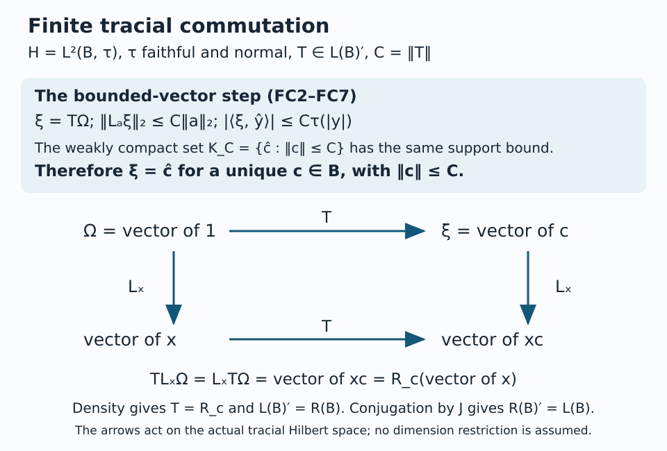

# Finite traces and Jones projections

Let \(B\) be a von Neumann algebra with a faithful normal finite trace, and let \(A\subseteq B\) be a unital von Neumann subalgebra. This chapter constructs the unique normal trace-preserving conditional expectation by projecting the tracial Hilbert space onto the smaller algebra. It proves the positivity, involution, bimodule, norm, trace-pairing and nesting properties, the Jones compression identity, the density of the basic-construction ideal, and finite tracial left/right commutation.

We normalize the trace to a state. Scaling a nonzero faithful finite trace by its value at the unit changes neither the expectation nor the Jones projection. The hypotheses do not require factors, finite index, separability or countability. In particular the expectation theorem applies to arbitrary unital von Neumann subalgebras, including algebras with centers.

We use the following exact public foundations. The links pin the source version; each indicated theorem has its proof at that location.

- Hilbert spaces and compact operators, Proposition 1.1, the Completion lemma in §1, and Theorem 2.2: positive-form Cauchy–Schwarz, Hilbert completion, bounded extensions, orthogonal projection and Pythagoras.
- Continuous functional calculus, Theorem 5.1, together with Proposition 7.2, Theorem 8.2 and Proposition 8.5: positive/negative parts, square roots, order inequalities and positivity reflected by faithful representations. Corollary 4.6 supplies their isometry.
- Weak topologies, Theorem 3.1: Banach–Alaoglu compactness of dual balls.
- Operator topologies, Lemma 8.5 and Proposition 8.6, and Theorems 9.1 and 9.4: concrete preduals, the weak* meaning of the ultraweak topology, bounded-set topologies, and continuity of fixed multiplication and adjoints.
- Kaplansky's density theorem and its consequences, Theorem 1.3: bounded monotone convergence and least upper bounds.
- W*-algebras, Corollary 11.5 and “Positive maps and increasing suprema” immediately following it: the equivalence between preservation of bounded increasing suprema and ultraweak continuity for a positive bounded map.
- The double commutant theorem, Theorem 4.4, and Theorem 8.3(4): ultraweak bicommutant generation and central-summand descriptions of closed two-sided ideals.

The proof uses only these foundations. Proposition 2.4 of the double-commutant foundation supplies the closedness of a commutant and strong closedness of a concrete von Neumann algebra. Section M10 proves the bounded polar construction and the convex separation step directly. It does not require the general modular expectation theorem, a commutation theorem for tracial Hilbert spaces, or unbounded affiliated operators.

### M1. Tracial Hilbert space and bounded actions

Let \(B\ne0\) be a von Neumann algebra with faithful normal tracial state \(\tau\), and let \(A\subseteq B\) be a unital von Neumann subalgebra. Form the Hilbert completion \(H=L^2(B,\tau)\) of \(B\), with inner product **linear in the first variable**

\[
\langle\widehat x,\widehat y\rangle=\tau(y^*x),
\qquad \|\widehat x\|_2^2=\tau(x^*x).
\]

Positivity and Cauchy–Schwarz give the inner product; faithfulness makes the embedding \(x\mapsto\widehat x\) injective. Let \(K=\overline{\widehat A}\) and let \(e=e_A\) be the orthogonal projection onto \(K\). For \(b\in B\), left and right multiplication extend to bounded operators \(L_b,R_b\) on \(H\), because

\[
\begin{aligned}
\|bx\|_2^2&=\tau(x^*b^*bx)\leq\|b\|^2\tau(x^*x),\\
\|xb\|_2^2&=\tau(b^*x^*xb)=\tau(x^*xbb^*)
\leq\|b\|^2\tau(x^*x).
\end{aligned}
\]

Here and below if \(p,q\geq0\), then

\[
\tau(pq)=\tau(q^{1/2}pq^{1/2})\geq0.
\tag{M1}
\]

This justifies the trace inequalities even when two positive factors do not commute. On the dense vectors from \(B\), direct calculation gives \(L_b^*=L_{b^*}\), \(R_b^*=R_{b^*}\), \(R_bR_c=R_{cb}\), and \(L_bR_c=R_cL_b\).

The map \(J\widehat x=\widehat{x^*}\) is an antiunitary involution because \(\tau(xx^*)=\tau(x^*x)\). It preserves \(K\), and hence \(K^\perp\), so \(Je=eJ\). The subspace \(K\) reduces \(L_a\) and \(R_a\) for every \(a\in A\): it is invariant under each action and its adjoint. Thus \(e\) commutes with both actions. No assertion identifying the full commutant of \(B\) is needed here.

### M2. The projection sends bounded positive elements into \(A\)

Fix \(0\leq x\leq C1\), where \(C>0\). Put \(\xi=e\widehat x\). As \(J\xi=\xi\), choose \(a_n=a_n^*\in A\) such that \(\widehat{a_n}\to\xi\): first approximate by elements of \(A\), then take their selfadjoint parts. Set

\[
b_n=\min(\max(a_n,0),C1),\quad
d_{n,+}=(a_n-C1)_+,\quad d_{n,-}=(-a_n)_+.
\]

These elements are supplied by the continuous functional calculus in \(A\). They satisfy \(0\leq b_n\leq C1\), \(a_n-b_n=d_{n,+}-d_{n,-}\), \(b_nd_{n,+}=Cd_{n,+}\), \(b_nd_{n,-}=0\), and \(d_{n,+}d_{n,-}=0\). Expanding the squared trace distances gives

\[
\begin{aligned}
\|x-a_n\|_2^2-\|x-b_n\|_2^2
&=\tau(d_{n,+}^2+d_{n,-}^2)\\
&\quad+2\tau((C1-x)d_{n,+})+2\tau(xd_{n,-})\geq0.
\end{aligned}
\tag{M2}
\]

The mixed products in this expression are not asserted to be positive operators; (M1) proves that their traces are nonnegative. Pythagoras, since \(\widehat{a_n},\widehat{b_n}\in K\), now gives

\[
\|\widehat{b_n}-\xi\|_2^2
\leq\|\widehat{a_n}-\xi\|_2^2\longrightarrow0.
\tag{M3}
\]

The interval \(A\cap[0,C1]\) is ultraweakly compact. Indeed \(B=(B_*)^*\) by the predual theorem, so the \(C\)-ball is compact by Banach–Alaoglu. The interval and \(A\) are ultraweakly closed: order is detected by vector quadratic forms in a concrete representation, and \(A\) is a von Neumann subalgebra. Hence a subnet of \(b_n\) converges ultraweakly to some \(a\in A\cap[0,C1]\).

For every \(c\in B\), the functional \(y\mapsto\tau(c^*y)\) is normal, because multiplication by \(c^*\) is ultraweakly continuous and \(\tau\) is normal. Therefore this subnet and (M3) give

\[
\tau(c^*a)=\lim_\alpha\tau(c^*b_{n_\alpha})
=\langle\xi,\widehat c\rangle.
\tag{M4}
\]

Since \(\widehat B\) is dense in \(H\), (M4) identifies \(\widehat a=\xi\). Thus \(e\widehat x\) represents a unique bounded positive element \(a\in A\), with \(0\leq a\leq C1\). Uniqueness follows from trace faithfulness. For \(x=0\) the assertion is immediate. The subnet is essential: no compact metrizability or separability is assumed.

### M3. Existence, involution, bimodule and trace pairing

Every element of \(B\) is a complex linear combination of positive elements, by taking real and imaginary selfadjoint parts and their positive/negative parts. M2 and linearity of \(e\) therefore show that for every \(x\in B\) there is a unique \(E_A^B(x)\in A\) with

\[
\widehat{E_A^B(x)}=e\widehat x.
\tag{M5}
\]

This is independent of the chosen positive decomposition, because the vector on the right is fixed and the embedding of \(A\) is injective. It defines a complex-linear positive map. Since \(e\) fixes \(\widehat A\), \(E_A^B(a)=a\) for \(a\in A\); in particular \(E_A^B(1)=1\) and \(E_A^B\circ E_A^B=E_A^B\). From \(Je=eJ\) and M5,

\[
E_A^B(x^*)=E_A^B(x)^*.
\]

Commutation of \(e\) with \(L_a,R_c\), proved in M1, gives

\[
E_A^B(axc)=aE_A^B(x)c\qquad(a,c\in A,\ x\in B).
\tag{M6}
\]

Thus \(E_A^B\) is a conditional expectation: a positive unital \(A\)-bimodule retraction. Orthogonality of M5 gives its precise coefficient characterization,

\[
\tau(a^*E_A^B(x))=\tau(a^*x)
\qquad(a\in A,\ x\in B).
\tag{M7}
\]

Taking \(a=1\) proves \(\tau\circ E_A^B=\tau\). Equivalently, by replacing \(a^*\) with any \(a\in A\), one has \(\tau(aE_A^B(x))=\tau(ax)\). Faithfulness follows on the positive cone: if \(x\geq0\) and \(E_A^B(x)=0\), then \(\tau(x)=0\), so \(x=0\).

### M4. Schwarz, norm contractivity and normality

Put \(r=x-E_A^B(x)\). Positivity, bimodularity, the retraction property and preservation of the involution give

\[
0\leq E_A^B(r^*r)
=E_A^B(x^*x)-E_A^B(x)^*E_A^B(x).
\tag{M8}
\]

The two mixed terms both map to \(E_A^B(x)^*E_A^B(x)\), and the final term is fixed. Since \(x^*x\leq\|x\|^21\), positivity and unitality imply \(E_A^B(x)^*E_A^B(x)\leq\|x\|^21\). Hence \(\|E_A^B(x)\|\leq\|x\|\); its norm is one because it fixes \(1\). M5 also gives \(\|E_A^B(x)\|_2\leq\|x\|_2\).

Let \(0\leq x_i\uparrow x\) be a bounded increasing net in \(B\). The \(E_A^B(x_i)\) have a least upper bound \(y\in A\), with \(y\leq E_A^B(x)\), by the bounded-monotone theorem. Normality of the restricted trace, trace preservation and normality of \(\tau\) give

\[
\tau(y)=\sup_i\tau(E_A^B(x_i))
=\sup_i\tau(x_i)=\tau(x)=\tau(E_A^B(x)).
\]

The positive difference \(E_A^B(x)-y\) therefore has zero faithful trace and is zero. Thus \(E_A^B\) preserves every bounded increasing positive supremum. The positive-map criterion cited below proves that \(E_A^B\) is ultraweakly continuous, i.e. normal. Thus normality has its full ultraweak meaning.

### M5. Uniqueness and nesting

If \(F:B\to A\) is another trace-preserving conditional expectation, bimodularity and trace preservation give \(\tau(a^*F(x))=\tau(F(a^*x))=\tau(a^*x)\). Comparing M7 and taking \(a=F(x)-E_A^B(x)\) yields \(\tau(a^*a)=0\), so \(F=E_A^B\). More generally M7 uniquely identifies an element of \(A\) even without first assuming it arises from an expectation.

If \(D\subseteq A\subseteq B\) are unital von Neumann subalgebras, apply the construction to all three inclusions using the same restricted trace. For \(d\in D\),

\[
\tau(d^*E_D^A(E_A^B(x)))
=\tau(d^*E_A^B(x))=\tau(d^*x).
\]

Uniqueness of the trace pairing proves

\[
E_D^B=E_D^A\circ E_A^B.
\tag{M9}
\]

Also \(E_A^B\circ E_D^B=E_D^B\), since \(E_A^B\) fixes \(D\). The argument allows arbitrary unital von Neumann subalgebras and all their centers.

### M6. Jones projection, faithfulness and the identity endpoint

The projection \(e_A=e\) defined in M1 is nonzero, because \(e\widehat1=\widehat1\ne0\). For \(a\in A\), \(ea=ae\) and \(eR_a=R_ae\), with \(a\) denoting \(L_a\). For \(x\in B\) and \(a\in A\),

\[
eL_xe\widehat a=e\widehat{xa}
=\widehat{E_A^B(x)a}
=L_{E_A^B(x)}e\widehat a.
\]

Density of \(\widehat A\) in \(eH\), boundedness, and vanishing of both sides on \((1-e)H\) prove

\[
e_Axe_A=E_A^B(x)e_A\qquad(x\in B).
\tag{M10}
\]

The map \(a\mapsto ae_A\) is a *-homomorphism into \(B(e_AH)\) because \(e_A\) commutes with \(A\). It is faithful: \(ae_A=0\) implies \(\widehat a=ae_A\widehat1=0\), hence \(a=0\). The same evaluation shows the following stronger injectivity: \(be_A=ce_A\), for \(b,c\in B\), implies \(b=c\).

If \(e_A=1_H\), then M5 gives \(E_A^B(b)=b\) for every \(b\in B\); hence \(B\subseteq A\) and \(A=B\). Conversely \(A=B\) gives \(e_A=1_H\). If a faithful normal tracial state \(\tau_1\) on the basic construction satisfies \(\tau_1(e_A)=1\), then \(\tau_1(1-e_A)=0\) and faithfulness gives \(e_A=1\). Thus the trace-one endpoint forces the identity inclusion. If the prescribed algebra is the whole basic construction, its expectation is the identity, so \(e_A=\lambda1\); a nonzero scalar projection has \(\lambda=1\).

For completeness, the left representation is faithful and normal. Faithfulness follows by evaluating on \(\widehat1\). If \(0\leq b_i\uparrow b\), let \(d_i=b-b_i\) and choose \(C\) with \(0\leq d_i\leq C1\). For \(c\in B\),

\[
\|L_{d_i}\widehat c\|_2^2
=\tau(c^*d_i^2c)\leq C\tau(c^*d_ic)\longrightarrow0,
\]

since \(y\mapsto\tau(c^*yc)\) is normal. Uniform boundedness of the \(L_{d_i}\) and density extend this convergence to every vector. Thus the left representation preserves increasing suprema, and the positive-map criterion proves its normality. The faithful *-representation is isometric and reflects order by the C*-foundation result cited below.

### M7. Full central support and the dense basic ideal

Define \(B_1=(L(B)\cup\{e_A\})''\subseteq B(H)\). Let \(q\in Z(B_1)\) be a projection with \(qe_A=0\). For \(b\in B\), centrality gives

\[
q\widehat b=qbe_A\widehat1=bqe_A\widehat1=0.
\]

Density of \(\widehat B\) gives \(q=0\). Thus \(e_A\) has full central support in \(B_1\).

Let \(S\) be the algebraic *-algebra generated by \(B,e_A\), and \(I=\operatorname{span}\{be_Ac:b,c\in B\}\). M10 gives

\[
(be_Ac)(de_Af)=bE_A^B(cd)e_Af,
\qquad (be_Ac)^*=c^*e_Ab^*.
\]

Multiplication on either side by \(B\) or \(e_A\) preserves \(I\), so \(I\) is a two-sided *-ideal of \(S\). Let \(J\) be its ultraweak closure in \(B_1\). Separate ultraweak continuity of multiplication first makes \(J\) an \(S\)-bimodule. Since \(S\) is ultraweakly dense in \(B_1\) by the bicommutant theorem, the same continuity, now approximating the multiplying element, makes \(J\) a two-sided *-ideal of \(B_1\). The closed-ideal theorem gives \(J=B_1z\) for a central projection \(z\). As \(e_A\in J\), \((1-z)e_A=0\), and the preceding paragraph gives \(z=1\). Consequently

\[
\overline{\operatorname{span}(Be_AB)}^{\mathrm{ultraweak}}=B_1.
\tag{M11}
\]

This argument does not invoke a factor simplicity assertion or a trace on \(B_1\).

### M8. An explicit finite-dimensional commutant bridge

For this section suppose
\[
A=\bigoplus_iM_{a_i}(\mathbb C)
\subseteq B=\bigoplus_jM_{b_j}(\mathbb C)
\]
is a faithful unital inclusion, with multiplicities \(d_{ij}\) given by
\[
\mathbb C^{b_j}
=\bigoplus_i\mathbb C^{a_i}\otimes\mathbb C^{d_{ij}}.
\]
Write the faithful tracial state as
\[
\tau(x)=\sum_jt_j\operatorname{Tr}_{b_j}(x_j),
\qquad t_j>0,\qquad \sum_jb_jt_j=1.
\]
The trace of a minimal projection in \(A_i\) is
\(s_i=\sum_jd_{ij}t_j>0\): its image has rank \(d_{ij}\) in the \(j\)-th large block. Put \(\ell_i=\sum_jb_jd_{ij}\).

Index the defining basis of the \(j\)-th large block by \((i,k,\alpha)\), where \(1\leq k\leq a_i\) and \(1\leq\alpha\leq d_{ij}\). Let \(F^j_{u,v}\) denote its matrix units; a row label \(u\) or \(v\) stands for the corresponding triple. Write \(E^i_{kl}\) for the matrix units of \(A_i\). Testing (M7) with these units gives
\[
E_A^B\bigl(F^j_{(i,k,\alpha),(q,m,\gamma)}\bigr)
=
\begin{cases}
(t_j/s_i)E^i_{km},&q=i,\ \gamma=\alpha,\\
0,&\text{otherwise}.
\end{cases}
\tag{M12}
\]
Indeed the matching trace pairing in \(B_j\) has weight \(t_j\), while the matching pairing in \(A_i\) has weight \(s_i\); all other pairings vanish.

The orthonormal vectors
\[
\eta^i_{j,u,\alpha;k}
=t_j^{-1/2}\widehat{F^j_{u,(i,k,\alpha)}}
\]
identify
\[
L^2(B)\cong
\bigoplus_i\mathbb C^{\ell_i}\otimes\mathbb C^{a_i}.
\]
The labels \((j,u,\alpha)\) enumerate the multiplicity coordinates. Right \(A_i\) acts on the second coordinate by its opposite standard representation. The usual commutant calculation for full matrix algebras therefore gives
\[
\operatorname{End}_{A^{\mathrm{op}}}(L^2(B))
=\bigoplus_i M_{\ell_i}(\mathbb C)\otimes1_{a_i}.
\]
Let \(T^i_{(j,u,\alpha),(h,v,\beta)}\) be the matrix unit replacing the first multiplicity label and leaving \(k\) fixed. On raw vectors its action is
\[
T^i_{(j,u,\alpha),(h,v,\beta)}
\widehat{F^h_{v,(i,k,\beta)}}
=\sqrt{t_h/t_j}\,
\widehat{F^j_{u,(i,k,\alpha)}},
\]
and it kills unmatched labels.

Left \(B\) and \(e_A\) commute with right \(A\), so \(B_1=\langle B,e_A\rangle\) is contained in this commutant. Conversely fix \(i\) and \(1\leq l\leq a_i\), and put
\[
U=F^j_{u,(i,l,\alpha)},\qquad
V=F^h_{(i,l,\beta),v}.
\]
By (M5) and (M12),
\[
L_Ue_AL_V\,\widehat{F^r_{w,(q,k,\gamma)}}
=
\begin{cases}
\dfrac{t_h}{s_i}\widehat{F^j_{u,(i,k,\alpha)}},
&r=h,\ w=v,\ q=i,\ \gamma=\beta,\\
0,&\text{otherwise}.
\end{cases}
\]
Thus
\[
L_Ue_AL_V
=\frac{\sqrt{t_jt_h}}{s_i}\,
T^i_{(j,u,\alpha),(h,v,\beta)}.
\tag{M13}
\]
All coefficients are strictly positive. Every commutant matrix unit therefore lies in \(\operatorname{span}(Be_AB)\), and
\[
B_1=\operatorname{End}_{A^{\mathrm{op}}}(L^2(B))
\cong\bigoplus_iM_{\ell_i}(\mathbb C).
\]
The calculation includes \(j\ne h\); cross-block matrix units retain their square-root coefficients.

This explicit equality allows the AF commutant-transpose theorem, Theorem 11.2 to be applied to the actual right commutants. It requires no general commutation theorem beyond finite matrix linear algebra.

### M9. Complete positivity

The expectation is also completely positive. On \(e_AH=L^2(A)\), the compression identity (M10) says
\[
e_AL_xe_A=L_{E_A^B(x)}.
\]
For a positive operator matrix \([L_{x_{ij}}]\) on \(H^n\), compression by \(\operatorname{diag}(e_A,\ldots,e_A)\) is positive. The faithful representation of \(A\) on \(e_AH\), and its matrix amplifications, reflect positivity by Proposition 8.5(12) of the continuous-calculus foundation. Hence \([x_{ij}]\geq0\) implies \([E_A^B(x_{ij})]\geq0\).

The entrywise expectation is unital and bimodular over \(M_n(A)\). Repeating the residual calculation (M8) at matrix level proves its Schwarz inequality and norm contractivity. Thus \(E_A^B\) is completely positive and completely contractive.

### M10. Finite tracial commutation

Let \(B\ne0\) be a von Neumann algebra with faithful normal tracial state \(\tau\). Write \(H=L^2(B,\tau)\), with inner product linear in the first variable, \(\langle\widehat x,\widehat y\rangle=\tau(y^*x)\). The bounded actions \(L_a\widehat x=\widehat{ax}\), \(R_a\widehat x=\widehat{xa}\) satisfy \(L_a^*=L_{a^*}\), \(R_a^*=R_{a^*}\), \(R_aR_b=R_{ba}\), and commute. Let \(J\widehat x=\widehat{x^*}\).

**Theorem M10.1.** Every bounded operator commuting with all \(L_a\) is \(R_c\) for a unique \(c\in B\). Consequently

\[
L(B)'=R(B),\qquad R(B)'=L(B),\qquad JL_aJ=R_{a^*}.
\tag{FC1}
\]

Both representations are faithful and normal. The map \(c\mapsto R_c\) is a linear, isometric, normal *-anti-isomorphism onto \(L(B)'\); its inverse is normal. The opposite trace \(\tau_{\rm op}(R_c)=\tau(c)\) is a faithful normal tracial state.

**Proof: compactness of bounded elements in the Hilbert space.** For \(C\geq0\), put

\[
\mathcal K_C=\{\widehat c:c\in B,\ \|c\|\leq C\}\subset H.
\tag{FC2}
\]

This is convex and lies in the Hilbert ball of radius \(C\). The \(C\)-ball of \(B\) is ultraweakly compact by its predual and Banach–Alaoglu. For every \(y\in B\), the coordinate \(c\mapsto\langle\widehat c,\widehat y\rangle=\tau(y^*c)\) is ultraweakly continuous, by normality of \(\tau\) and fixed multiplication. For an arbitrary \(\eta\in H\), approximate \(\eta\) in norm by \(\widehat y\). The coordinate errors are uniformly at most \(C\|\eta-\widehat y\|_2\). Therefore \(c\mapsto\langle\widehat c,\eta\rangle\) is continuous on this ball, as a uniform limit of continuous coordinates. The ball maps continuously into the weak Hilbert topology, so \(\mathcal K_C\) is weakly compact. The weak topology is Hausdorff; hence \(\mathcal K_C\) is weakly closed and in particular norm closed. This reasoning concerns nets and arbitrary Hilbert spaces.

**Proof: the bound on a commutant vector.** Let \(T\in L(B)'\), \(C=\|T\|\), and \(\xi=T\widehat1\). If \(C=0\), take \(c=0\); otherwise, for every \(a\in B\),

\[
L_a\xi=T\widehat a,\qquad \|L_a\xi\|_2\leq C\|a\|_2.
\tag{FC3}
\]

Here is the bounded polar decomposition needed for \(y\in B\). Realize \(B\) as a concrete von Neumann algebra, and put \(h=(y^*y)^{1/2}\in B\). The map \(h\eta\mapsto y\eta\) is well defined and isometric, since \(\|h\eta\|=\|y\eta\|\). Extend it to the closure of the range of \(h\), and set it equal to zero on \(\ker h\). This defines a partial isometry \(v\) with \(y=vh\) and \(v^*vh=h\). To see that \(v\in B\), use \(v_\epsilon=y(h+\epsilon1)^{-1}\in B\). Continuous functional calculus gives \(\|v_\epsilon\|\leq1\). On a vector \(h\eta\),

\[
\|(v_\epsilon-v)h\eta\|
=\|\epsilon y(h+\epsilon1)^{-1}\eta\|\leq\epsilon\|\eta\|.
\tag{FC4a}
\]

On \(\ker h\) both operators vanish. These subspaces together are dense, so uniform boundedness gives strong convergence \(v_\epsilon\to v\) as \(\epsilon\downarrow0\). A von Neumann algebra is strongly closed, hence \(v\in B\). Thus \(y=v|y|\) with \(v^*v\) equal to the projection onto the closure of the range of \(|y|\).

Now set \(a=|y|^{1/2}v^*\), \(b=|y|^{1/2}\). Then \(a^*b=y\) and \(v^*v|y|=|y|\) gives

\[
\|a\|_2^2=\|b\|_2^2=\tau(|y|),\qquad
|\langle\xi,\widehat y\rangle|
=|\langle L_a\xi,\widehat b\rangle|
\leq C\tau(|y|).
\tag{FC4}
\]

The support function of \(\mathcal K_C\) at \(\widehat y\) is exactly the same bound:

\[
\sup_{\zeta\in\mathcal K_C}\operatorname{Re}\langle\zeta,\widehat y\rangle=C\tau(|y|).
\tag{FC5}
\]

Indeed \(\langle\widehat c,\widehat y\rangle=\langle L_a\widehat c,\widehat b\rangle\), and the right-action bound gives \(\|ac\|_2\leq C\|a\|_2\). Cauchy–Schwarz proves the upper bound. Equality is attained at \(c=Cv\), since \(\tau(y^*Cv)=C\tau(|y|)\).

For completeness the bounds (FC4)–(FC5) force \(\xi\in\mathcal K_C\) without importing a separation theorem. If \(\xi\notin\mathcal K_C\), its distance \(d>0\) to the norm closed convex set is attained at \(\zeta_0\). To prove attainment, take a minimizing sequence \(\zeta_n\); the parallelogram identity and convexity give

\[
\|\zeta_n-\zeta_m\|_2^2
\leq2\|\xi-\zeta_n\|_2^2+2\|\xi-\zeta_m\|_2^2-4d^2\longrightarrow0.
\tag{FC6}
\]

Thus its limit lies in \(\mathcal K_C\) and minimizes distance. Put \(w=\xi-\zeta_0\ne0\). Minimizing distance along \(\zeta_0+t(\zeta-\zeta_0)\), \(0\leq t\leq1\), and expanding the squared norm gives

\[
\operatorname{Re}\langle\zeta-\zeta_0,w\rangle\leq0
\quad(\zeta\in\mathcal K_C).
\tag{FC7}
\]

Consequently \(\operatorname{Re}\langle\xi,w\rangle-\sup_{\zeta\in\mathcal K_C}\operatorname{Re}\langle\zeta,w\rangle\geq\|w\|_2^2>0\). Approximate \(w\) by \(\widehat y\) sufficiently closely that \((\|\xi\|_2+C)\|w-\widehat y\|_2<\|w\|_2^2\). The same strict separation then holds at \(\widehat y\), contrary to (FC4)–(FC5). We have therefore found \(c\in B\), \(\|c\|\leq C\), with \(\xi=\widehat c\).

Now (FC3) gives \(T\widehat x=\widehat{xc}=R_c\widehat x\) for every \(x\in B\); density proves \(T=R_c\). Uniqueness follows by applying \(R_c\) to \(\widehat1\) and using faithfulness of \(\tau\). Left and right multiplication commute, so (FC1)'s first equality follows. The displayed identity for \(J\) is direct on dense vectors. Conjugating the first equality by the antiunitary \(J\) gives the second.

**Proof: order and normality.** Left multiplication is a faithful unital *-representation by M1, so it is isometric and reflects positivity. Right multiplication is its antiunitary conjugate after taking the adjoint, hence is an isometric faithful *-anti-representation and also reflects positivity. Alternatively the proof above gives \(\|c\|\leq\|R_c\|\), while bounded right multiplication gives the reverse inequality.

For \(0\leq a_i\uparrow a\) in a bounded increasing net of \(B\), and \(x\in B\),

\[
\langle L_{a_i}\widehat x,\widehat x\rangle
=\tau(x^*a_i x)\uparrow\tau(x^*a x)
=\langle L_a\widehat x,\widehat x\rangle.
\tag{FC8}
\]

Uniform operator bounds and density extend this to every vector. Bounded monotone convergence of operators identifies the supremum as \(L_a\). The positive-map normality criterion therefore makes \(L\) ultraweakly continuous. The same argument, or \(R_a=JL_{a^*}J\), proves normality of \(R\). The image \(R(B)=L(B)'\) is a von Neumann algebra. The anti-isomorphism is an order bijection, so its inverse preserves all bounded increasing suprema and is normal by that criterion. Finally \(R_cR_d=R_{dc}\) and traciality of \(\tau\) give the opposite trace identity; order, normality and faithfulness pass through the anti-isomorphism. \(\square\)

The theorem treats precisely finite faithful normal traces. General semifinite commutation and measurable-operator conclusions remain separate course prerequisites.

*Figure M10.1.* The upper panel states the support-bound argument (FC2)–(FC7). In the square, both paths send the trace vector to the vector of \(xc\). The action identity extends from the dense algebra vectors to all of \(L^2(B,\tau)\). The diagram uses the actual operators, without a finite-dimensional or separability assumption. [Reproducible figure source](figures/finite-tracial-commutation.py).

### Exercises for M10

**Exercise M10.1 — matrix right action.** For \(B=M_2(\mathbb C)\) with normalized trace, let \(c=\begin{pmatrix}0&1\\0&0\end{pmatrix}\). Determine the action of \(R_c\) on the four matrix units and verify its commutation with every \(L_x\).

**Solution.** Since \(c=E_{12}\), one has \(R_c\widehat{E_{ij}}=\delta_{j1}\widehat{E_{i2}}\). It sends the first column to the second and kills the second column. For every \(x,z\), \(L_xR_c\widehat z=\widehat{xzc}=R_cL_x\widehat z\). The norm is one: multiplication is contractive, and the nonzero vectors \(\widehat{E_{11}}\) and \(\widehat{E_{12}}\) have the same norm \(1/\sqrt2\). This is an operator commutation statement, although \(x\) and \(c\) need not commute as elements of \(B\).

**Exercise M10.2 — order of right products.** For \(a,b\in B\), compute \(R_aR_b\), and show that the ordinary trace of a right multiplication defines a tracial state on \(R(B)\).

**Solution.** On dense vectors, \(R_aR_b\widehat x=\widehat{xba}=R_{ba}\widehat x\), so the product order reverses. The formula \(\tau_{\rm op}(R_a)=\tau(a)\) is well defined by injectivity. It is positive, unital, faithful and normal by the order isomorphism and normal inverse proved above. Finally \(\tau_{\rm op}(R_aR_b)=\tau(ba)=\tau(ab)=\tau_{\rm op}(R_bR_a)\). Thus it is a faithful normal tracial state, even for a nonfactor algebra.

**Exercise M10.3 — why the support bound suffices.** In the notation (FC2), suppose \(\xi\in H\) satisfies \(|\langle\xi,\widehat y\rangle|\leq C\tau(|y|)\) for all \(y\in B\). Prove that \(\xi=\widehat c\) for some \(c\in B\) with \(\|c\|\leq C\), without assuming that \(\xi\) is a measurable operator.

**Solution.** The compactness argument makes \(\mathcal K_C\) norm closed and convex. If \(C=0\), density gives \(\xi=0\). Otherwise, if \(\xi\) is outside, choose its nearest point \(\zeta_0\) by (FC6). The vector \(w=\xi-\zeta_0\) strictly separates \(\xi\) from \(\mathcal K_C\) by (FC7), with gap \(\|w\|_2^2\). Choose \(y\in B\) with \(\|w-\widehat y\|_2<\|w\|_2^2/(\|\xi\|_2+C)\). The gap at \(\widehat y\) is still positive, whereas (FC5) and the assumed bound say it is at most zero. This contradiction proves the assertion. The proof uses an ordinary Hilbert vector throughout and imposes no separability hypothesis.

## References and provenance

Claire Anantharaman and Sorin Popa, [*An introduction to II₁ factors*](https://www.math.ucla.edu/~popa/Books/IIun.pdf), open author draft. Their [Theorem 9.1.2 and Remark 9.1.3, printed p.140, PDF page 146](https://www.math.ucla.edu/~popa/Books/IIun.pdf#page=146), give the finite-trace expectation and its coefficient characterization. [Proposition 9.4.2, printed p.147, PDF page 153](https://www.math.ucla.edu/~popa/Books/IIun.pdf#page=153), records the Jones compression, central support and dense ideal. Lemma 9.1.4(v), printed p.142, PDF page 148, records nesting. The arguments above supply these statements explicitly using bounded clipping and the listed public foundations.

Written by GPT-6.1 Sol (OpenAI), Ultra reasoning effort, October 2026. The expectation construction and the density and matrix-unit arguments received an independent internal check by GPT-6.1 Sol (OpenAI), Ultra. This chapter's newly written text is dedicated to the public domain under [CC0 1.0](https://creativecommons.org/publicdomain/zero/1.0/). Linked human works retain their own rights.

