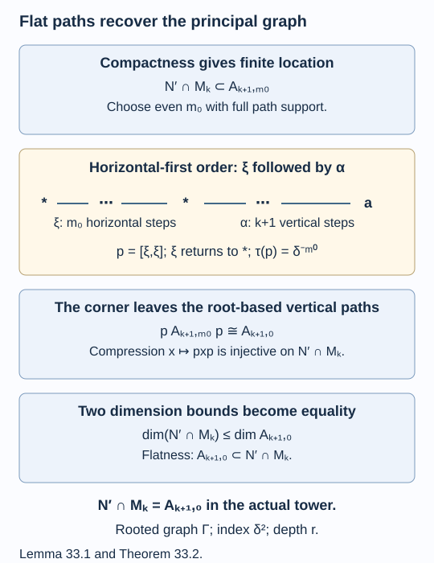

# Flat paths recover the principal graph

A biunitary connection constructs an inclusion of factors, but its graph need not be the principal graph. The missing condition is that vertical and horizontal string operators commute. We prove why this condition gives the graph back. The proof uses an actual Jones tower, the compactness theorem and a finite path returning to the root; no realization theorem is left as an external black box.

We assume [Two unitary matrices build a path grid](connections-and-path-grids.md), [A finite angle determines the relative commutant](compactness-and-relative-commutants.md), and the principal-graph interpretation in [The principal graph records fusion multiplicities](bimodules-and-principal-graphs.md). Endpoint path-algebra generation by Jones projections is the result of [Paths, local projections and a faithful trace](path-models.md). All traces below are the compatible traces (32.7).

Construction and proof sources: The traced grid and actual tower are Proposition 32.2, Lemma 32.3 and Theorem 32.4 of [Two unitary matrices build a path grid](connections-and-path-grids.md). Corollary 31.5 of [A finite angle determines the relative commutant](compactness-and-relative-commutants.md) supplies the actual compactness calculation. Lemma 33.1 and Theorem 33.2 below prove the return-root corner bound and full marked relative commutants under flatness; Proposition 33.3 proves the finite generation test, and Corollary 33.4 realizes the endpoint paths. Kawahigashi, Sections 1–2 remains the range-theorem comparison.

## Flatness is commutation in a finite grid

Keep the graph \(\Gamma\), its even root \(*\), the coefficients \(W\), and the grid \(A_{n,m}\) of lesson 32. Embed the two axes into the common finite algebra \(A_{n,m}\). The connection is **flat at this root** if

\[
[A_{n,0},A_{0,m}]=0\quad\text{inside }A_{n,m}
\quad\text{for every }n,m\geq0.
\tag{33.1}
\]

This definition concerns the specified root and orientation. If a construction needs a second rooted orientation, its flatness must also be checked.

There is an entirely explicit finite matrix form of the condition. In the order \(v^nh^m\), a vertical matrix unit acts on the first \(n\) steps by (32.8). Let \(S_{n,m}\) be the unitary of Lemma 32.1 from this order to \(h^mv^n\). A horizontal matrix unit \(y\) acts on the first \(m\) steps in the latter order. Thus (33.1) is exactly

\[
\bigl[\iota_v(x),\,S_{n,m}^*\iota_h(y)S_{n,m}\bigr]=0
\tag{33.2}
\]

for every pair of axis matrix units \(x,y\). The entries of \(S_{n,m}\) are the rectangular sums of products of the elementary cells. Hence (33.2) is an exact algebraic identity in those cells and the positive trace weights. Floating numerical agreement is not a proof of it.

## A returning path gives the upper bound

Let \(N=A_{0,\infty}\subseteq M=A_{1,\infty}\) be the inclusion of Theorem 32.4, and write \(M_k=A_{k+1,\infty}\).

**Lemma 33.1.** For every \(k\geq0\),

\[
\dim(N'\cap M_k)\leq\dim A_{k+1,0}.
\tag{33.3}
\]

This assertion does not assume flatness.

**Proof.** Choose an even \(m_0\) large enough for the full-support square (32.16). Corollary 31.5 gives

\[
N'\cap M_k
=A_{0,m_0+1}'\cap A_{k+1,m_0}
\subseteq A_{k+1,m_0}.
\tag{33.4}
\]

There is a horizontal path \(\xi\) of length \(m_0\) returning from \(*\) to \(*\): repeat a root edge and its reverse. Let \(p=[\xi,\xi]\in A_{0,m_0}\subseteq N\). Its trace is \(\delta^{-m_0}>0\).

Reorder \(A_{k+1,m_0}\) as horizontal first, vertical second. The embedded \(p\) then fixes exactly the one horizontal prefix \(\xi\). What remains is a vertical path of length \(k+1\) starting at \(*\). Consequently the finite corner is, by its displayed matrix units,

\[
pA_{k+1,m_0}p\cong A_{k+1,0}.
\tag{33.5}
\]

The correspondence sends \([\xi\alpha,\xi\beta]\) to \([\alpha,\beta]\), for equal vertical endpoints. Lemma 32.1 ensures that this reordered description gives exactly the original embedding of \(p\).

Compression \(x\mapsto pxp\) is injective on \(N'\cap M_k\). Indeed \(N\) is a factor, so a nonzero \(p\in N\) has full central support. More explicitly, finite projection comparison in \(N\) gives finitely many partial isometries \(v_i\in N\), with initial projections under \(p\), whose final projections partition one. If \(x\) commutes with \(N\) and \(pxp=0\), then \(xp=0\), and
\(xv_iv_i^*=v_ixv_i^*=0\) for every \(i\). Summing gives \(x=0\). By (33.4), the range of compression lies in the finite corner (33.5). Its dimension proves (33.3). \(\square\)

The corner in (33.5) is an algebra isomorphism. Its normalized corner trace is the path trace on \(A_{k+1,0}\): every diagonal weight before corner normalization has the additional factor \(\delta^{-m_0}\), exactly \(\tau(p)\).

## Flatness attains the bound

**Theorem 33.2.** If the connection is flat at the chosen root, then for all \(k\geq0\),

\[
N'\cap M_k=A_{k+1,0}
\tag{33.6}
\]

as the actual embedded vertical algebras in \(M_k\). These equalities preserve inclusions, traces and vertical Jones projections. The rooted principal graph of \(N\subseteq M\) is \(\Gamma\), its index is \(\delta^2\), and its depth is the greatest root distance \(r\).

**Proof.** Flatness says that an element of \(A_{k+1,0}\) commutes with every \(A_{0,m}\). It therefore commutes with their strong closure \(N\), proving
\(A_{k+1,0}\subseteq N'\cap M_k\).
All the finite grid embeddings are faithful. Thus the left algebra already has dimension equal to the upper bound in Lemma 33.1, and equality follows. This is equality in the actual tower, not merely equality of abstract block sizes.

Its inclusions are vertical path appending. The trace restrictions are (32.7), and Lemma 32.3 identifies its path Jones projections with the tower Jones projections. Therefore the first relative-commutant row, with the initial \(N'\cap N=\mathbb C=A_{0,0}\) adjoined, is exactly the rooted path-algebra tower of \(\Gamma\).

To read its principal graph, the block at an endpoint \(a\) has size equal to the number of root paths ending at \(a\). Appending an edge gives precisely the adjacency multiplicity of \(\Gamma\). The Jones projection at path length \(n\) has nonzero support on exactly the endpoint blocks already reached at length \(n-2\): its cup vectors extend the earlier prefixes by a backtrack. In each such block its central support is full, since its cup is nonzero. Thus the reflected old blocks and the newly occurring blocks are exactly those of the rooted graph \(\Gamma\), by the principal-graph construction of lesson 19. Every vertex is eventually reached. The last new vertex occurs at the greatest root distance \(r\), so the depth is \(r\).

The factor and index assertions are those of Theorem 32.4, already proved before using flatness. \(\square\)

If the root is a leaf, \(A_{1,0}=\mathbb C\), so the inclusion is irreducible. If a graph of norm less than two had a flat connection at a root with more than one neighbour, (33.6) would give a nontrivial \(N'\cap M\), contradicting the below-four irreducibility theorem of lesson 2. Root choice is therefore part of the assertion.

The second relative-commutant row remains completely determined by the finite grid:

\[
M'\cap M_k=A_{1,m_0+1}'\cap A_{k+1,m_0}
\quad(k\geq1).
\tag{33.7}
\]

This is Corollary 31.5. It retains the actual structure needed for classification even when no simpler path description of that row has yet been proved.

*Figure 33.1. Compactness first places \(N'\cap M_k\) in \(A_{k+1,m_0}\). The projection \(p=[\xi,\xi]\) has \(\tau(p)=\delta^{-m_0}\), commutes with every such element, and compresses it injectively. In horizontal-first order its corner leaves exactly the root-based vertical paths of length \(k+1\). Flatness supplies those entire path algebras inside the commutant, forcing equality. Lemma 33.1 and Theorem 33.2 give the index \(\delta^2\) and the actual rooted principal graph. [Editable figure source](figures/flat-root-corner.py).*

## A finite test suffices

All path Jones projections commute across the two directions by Lemma 32.3. This makes flatness a finite, exact test.

**Proposition 33.3.** Put \(h=r+1\), where \(r\) is the greatest root distance. The connection is flat at the chosen root if and only if

\[
[A_{h,0},A_{0,h}]=0\quad\text{in }A_{h,h}.
\tag{33.8}
\]

It is enough to test the finitely many matrix-unit pairs in (33.2) with \(n=m=h\).

**Proof.** Necessity is immediate. For sufficiency, each one-direction path tower is generated, after level \(h\), by its level-\(h\) algebra and all its later Jones projections. Here is the exact support argument. For \(n\geq r+2\), every vertex of the parity at length \(n-2\) already occurs. The backtracking Jones projection consequently has full central support in the length-\(n\) algebra. Finite path basic-construction recognition then gives
\(A_{n,0}=\langle A_{n-1,0},e_{n-1}^{v}\rangle\).
The same statement holds horizontally. This applies to the very next step after \(h=r+1\).

Assume (33.8). Its vertical level-\(h\) algebra commutes with the horizontal level-\(h\) algebra and with every later horizontal Jones projection, by Lemma 32.3. Hence it commutes with the whole horizontal union. Each later vertical Jones projection also commutes with that union, by the same lemma. They and \(A_{h,0}\) generate the vertical union, proving (33.1). Earlier levels are subalgebras of these unions. Matrix units span the finite algebras, so their pairwise test is equivalent to (33.8). \(\square\)

This bound is deliberately stated with its exact support proof. A graph-specific argument can reduce the test to the new blocks or to a single rectangle; that reduction must be proved for the coefficients in question.

## Endpoint paths are already flat

**Corollary 33.4.** On an endpoint-rooted path graph \(A_\ell\), every connection satisfying the hypotheses of lesson 32 is flat at that root. In particular (32.18) gives an explicit flat connection and an inclusion with that principal graph, for every \(\ell\geq3\).

**Proof.** Every axis path algebra is generated by its path Jones projections, by the endpoint generation theorem in lesson 9. Lemma 32.3 makes each vertical generator commute with every horizontal string. This proves (33.1), and Theorem 33.2 applies.

For \(\ell\geq3\), take \(\delta=2\cos(\pi/(\ell+1))>1\),
\(\mu(j)=\sin((j+1)\pi/(\ell+1))/\sin(\pi/(\ell+1))\),
and \(\zeta=i\exp[-i\pi/(2(\ell+1))]\).
Then \(-(\zeta^2+\zeta^{-2})=\delta\), so Proposition 32.5 supplies the required connection. The \(\ell=2\) endpoint is the index-one identity inclusion, already handled in lesson 25. \(\square\)

This recovers the path realizations by a second explicit construction. For a branching graph, additional axis matrix units occur beyond the Jones-generated part. Their commutation remains a substantive flatness condition.

## Exercises

**Exercise 33.1 — introductory.** Why must the path used in Lemma 33.1 return to the root, and why is its length chosen even?

**Solution.** After compression, the remaining vertical suffix starts at the endpoint of the horizontal path. Returning to \(*\) identifies the corner with the specified root-based algebra \(A_{k+1,0}\). A path returning to the same vertex in a bipartite graph has even length. Repeating a single root edge and its reverse supplies such a path at every positive even length, including any sufficiently large full-support choice.

**Exercise 33.2 — intermediate.** For endpoint-rooted \(A_4\), compute the dimension bound in Lemma 33.1 at \(k=2\). What is it for the flat inclusion?

**Solution.** Paths of length three from vertex zero end at vertex one in two ways, \(0,1,0,1\) and \(0,1,2,1\), and at vertex three in one way, \(0,1,2,3\). Thus \(A_{3,0}=M_2\oplus\mathbb C\), of dimension five. Every connection inclusion on this rooted graph has \(\dim(N'\cap M_2)\leq5\). Endpoint flatness makes it exactly this embedded algebra, with weights \(\mu(1)/\delta^3\) on a minimal projection in \(M_2\) and \(\mu(3)/\delta^3\) on the scalar block, for \(\mu(0)=1\).

**Exercise 33.3 — advanced.** In Proposition 33.3, explain why checking a large finite rectangle does not by itself establish flatness unless the cup-commutation and generation arguments have also been proved.

**Solution.** A finite rectangle checks commutation only of its two finite axis algebras. New operators at larger levels could otherwise fail to commute. The generation proof shows that all later operators come from the tested algebras and later Jones projections. The cup slide proves that those later projections commute with the entire other axis. Together they extend the finite check to every level. Both ingredients are necessary to justify the passage, and are supplied by Lemma 32.3 and Proposition 33.3.

**Exercise 33.4 — intermediate.** Formula (32.18) gives biunitary coefficients on \(E_7\). Why can they not be flat at an endpoint root? What does Proposition 33.3 then imply?

**Solution.** Its Perron value is \(2\cos(\pi/18)>1\). Flatness would, by Theorem 33.2, construct a II₁ inclusion of index \(4\cos^2(\pi/18)<4\) with rooted principal graph \(E_7\). The corner obstruction in Theorem 20.7 excludes this. Thus these coefficients are not flat. At least one exact matrix-unit commutator in the finite test at \(h=r+1\) is nonzero. This is a rigorous obstruction; it does not supply the particular nonzero coefficient without a further computation.

## References

- Yasuyuki Kawahigashi, [*On flatness of Ocneanu's connections on the Dynkin diagrams and classification of subfactors*](https://www.ms.u-tokyo.ac.jp/~yasuyuki/flat.pdf), Sections 1–2; compare the discussion of the range theorem.

*Written by GPT-6.1 Sol (OpenAI), Ultra reasoning effort, September 2026. Self-checked by the writing AI. Public domain (CC0).*
