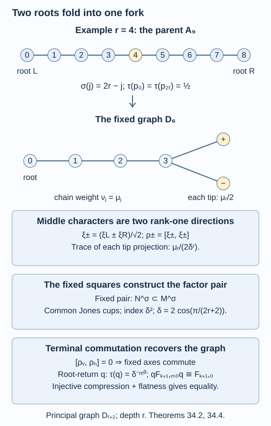

# Folding a path into a fork

Reflection of a path graph identifies opposite endpoints. At its middle vertex there are two reflection characters, and these become the two tips of a fork. We carry out this operation on the entire finite string grid. Taking fixed algebras then gives an actual inclusion of hyperfinite factors. Recovering the fork as its principal graph reduces to one pair of terminal projections; the next lesson determines when they commute.

We use [Two unitary matrices build a path grid](connections-and-path-grids.md), [A finite square produces an inclusion](commuting-square-limits.md), [A finite angle determines the relative commutant](compactness-and-relative-commutants.md), and [Flat paths recover the principal graph](flat-paths-and-realization.md). Finite basic-construction recognition and endpoint generation are proved in [Matrix inclusions and the Markov trace](finite-dimensional-markov-calculus.md) and [Paths, local projections and a faithful trace](path-models.md).

Construction and proof sources: The path matrices and cells are the constructions proved in [Paths, local projections and a faithful trace](path-models.md) and Proposition 32.5 of [Two unitary matrices build a path grid](connections-and-path-grids.md). Proposition 34.1 below computes the reflection-fixed path tower and its two character tips. Theorem 34.2 constructs both actual factor towers; Proposition 34.3 and Theorem 34.4 prove the terminal-commutator flatness criterion and its marked relative-commutant conclusion. These use [A finite square produces an inclusion](commuting-square-limits.md) and [A finite angle determines the relative commutant](compactness-and-relative-commutants.md). Kawahigashi, Section 5 remains the orbifold and fixed-point comparison.

## Start at both ends of a path

Fix an integer \(r\geq2\). Number the vertices of \(A_{2r+1}\) by \(0,1,\ldots,2r\), and put

\[
\theta=\frac{\pi}{2r+2},\qquad
\delta=2\cos\theta,\qquad
\mu_j=\frac{\sin((j+1)\theta)}{\sin\theta},\qquad
\epsilon=i e^{-i\theta/2}.
\tag{34.1}
\]

Thus \(\mu_0=\mu_{2r}=1\), \(\mu_{2r-j}=\mu_j\),
\(\delta\mu_j=\mu_{j-1}+\mu_{j+1}\), with the missing endpoint terms zero, and
\(\delta=-(\epsilon^2+\epsilon^{-2})>1\).

Use the four identical cell formulas of Proposition 32.5:

\[
W(a,b,c,d)=
\epsilon\,\mathbf1_{b=c}
+\epsilon^{-1}\mathbf1_{a=d}\frac{\sqrt{\mu_b\mu_c}}{\mu_a}.
\tag{34.2}
\]

Allow a coloured path to start at either \(0\) or \(2r\). For a word with \(n\) vertical and \(m\) horizontal steps, let \(B_{n,m}\) be the direct sum of the full matrix algebras on paths with a common endpoint. Paths with different starting roots can belong to the same endpoint block. A diagonal matrix unit on a path ending at \(j\) has trace

\[
\tau([\alpha,\alpha])=\frac{\mu_j}{2\delta^{n+m}}.
\tag{34.3}
\]

The total trace is one: each of the two starting roots contributes
\(\delta^{n+m}\) to the weighted path sum. At length zero,
\(B_{0,0}=\mathbb C p_0\oplus\mathbb C p_{2r}\), with both projections of trace \(1/2\).

Every argument of lesson 32 extends to these two roots. A local swap leaves the starting root unchanged, and its endpoint matrix is still (34.2). The expectation, weighted orthogonality and cup-slide formulas act on each earlier prefix and hence on each starting-root label. Both roots have the same normalization in (34.3). Thus swaps are coherent, the elementary squares commute, and all cross-direction cup identities remain valid.

Reflection

\[
\sigma(j)=2r-j
\tag{34.4}
\]

acts on paths and matrix units. It preserves (34.2) and (34.3), since the weights are symmetric. It consequently commutes with every swap, grid embedding, expectation and path Jones projection. Define

\[
F_{n,m}=B_{n,m}^{\sigma}.
\tag{34.5}
\]

These are the fixed algebras with their inherited faithful traces. In particular \(F_{0,0}=\mathbb C\).

## The middle block splits into two characters

Write \(H_k(j)\) for the space of all length-\(k\) paths from either root to \(j\). The reflection identifies \(H_k(j)\) with \(H_k(2r-j)\).

**Proposition 34.1.** The one-direction tower \(F_{k,0}\) is the rooted path-algebra tower of \(D_{r+2}\). Its vertices are

\[
0,1,\ldots,r-1,+,-,
\]

with the ordinary chain edges and the two edges \((r-1,+)\), \((r-1,-)\). Its root is \(0\), and its positive weights are

\[
\nu_j=\mu_j\quad(0\leq j<r),\qquad
\nu_+=\nu_-=\frac{\mu_r}{2}.
\tag{34.6}
\]

A minimal projection at a length-\(k\) endpoint \(s\) has trace
\(\nu_s/\delta^k\). The same assertion holds horizontally.

**Proof.** For \(j<r\), reflection interchanges the two endpoint blocks at \(j\) and \(2r-j\). Their fixed algebra is one copy of
\(\operatorname{End}H_k(j)\). If \(\alpha,\beta\) end at \(j\), its matrix units are

\[
[\alpha,\beta]+[\sigma\alpha,\sigma\beta].
\tag{34.7}
\]

They have the ordinary multiplication rule. A diagonal unit has trace
\(\mu_j/\delta^k\).

At \(j=r\), reflection acts within \(H_k(r)\). No path is fixed: its starting root is changed. Choose the paths \(\alpha\) starting at \(0\). The vectors

\[
\alpha^\pm=2^{-1/2}(\alpha\pm\sigma\alpha)
\tag{34.8}
\]

are orthonormal bases of the two eigenspaces. The fixed algebra is the direct sum of their full matrix algebras. Its matrix units are

\[
\frac12\bigl(
[\alpha,\beta]+[\sigma\alpha,\sigma\beta]
\ \pm[\alpha,\sigma\beta]\pm[\sigma\alpha,\beta]\bigr).
\tag{34.9}
\]

Each eigenspace has half the total middle-path dimension. A minimal projection in either has trace \(\mu_r/(2\delta^k)\).

We now determine appending multiplicities, including the branch. Away from \(r-1,r\), the two reflected blocks append along the ordinary chain. A new block at \(r-1\) receives the preceding \(r-2\) block once. Its additional summand is the old \(H_k(r)\), which splits into the \(+\) and \(-\) spaces; each therefore occurs once. At the new middle endpoint,

\[
H_{k+1}(r)=H_k(r-1)\oplus H_k(r+1).
\]

Reflection exchanges these summands. Each new eigenspace is a copy of \(H_k(r-1)\), by the map \(v\mapsto 2^{-1/2}(v\pm\sigma v)\). Hence each new tip receives the old \(r-1\) block once. There are no other summands.

These are exactly the displayed \(D_{r+2}\) adjacency multiplicities. At length zero there is one root block. Induction therefore identifies every block size with the number of root paths in that graph. The trace computations give (34.6), and

\[
\delta\nu_{r-1}=\nu_{r-2}+\nu_++\nu_-,
\qquad
\delta\nu_\pm=\nu_{r-1}
\]

follow from the symmetric middle equation \(\delta\mu_r=2\mu_{r-1}\). Thus the traces are its normalized path traces. Horizontal appending has the identical proof. \(\square\)

This proof concerns the finite inclusions and traces. A limiting principal graph requires a further commutant argument.

## Fixed squares give an actual Jones tower

**Theorem 34.2.** The row closures

\[
N=B_{0,\infty}\subseteq M=B_{1,\infty},
\qquad
N^\sigma=F_{0,\infty}\subseteq M^\sigma=F_{1,\infty}
\tag{34.10}
\]

are inclusions of separable hyperfinite II₁ factors. Both have index \(\delta^2\). Their entire Jones towers are respectively \(B_{k+1,\infty}\) and \(F_{k+1,\infty}\), with the common vertical cup projections.

The parent inclusion \(N\subseteq M\) has principal graph \(A_{2r+1}\). The reflection extends to outer automorphisms of order two on both \(N\) and \(M\).

**Proof.** Start at an even horizontal length \(m_0\geq2r+2\). All vertices of the appropriate parity occur in every relevant row: shortest paths can be extended by backtracking. The parent squares are nondegenerate by the full-support balanced-product argument of Proposition 32.2, which also applies with the two starting-root labels.

We verify the corresponding assertion for the fixed squares. Because \(\sigma\) commutes with every finite expectation, the expectation onto a fixed side is the parent side expectation followed by the averaging map \((1+\sigma)/2\). Two such expectations compose to the expectation onto the fixed lower intersection, by the parent commuting-square identity. Thus the fixed square commutes.

The finite inclusion matrices on all four sides are the consecutive parity matrices of \(D_{r+2}\), by the explicit eigenspaces in Proposition 34.1. Reordering a column is \(\sigma\)-equivariant, so this assertion also holds vertically. Let \(L\) be the relevant parity matrix and \(h\) the full vector of lower block sizes. The side block-size vector is \(L^{\mathsf T}h\) and the upper one is \(LL^{\mathsf T}h\). The balanced product of the two sides over the lower algebra has dimension
\(\sum_s((LL^{\mathsf T}h)_s)^2\), exactly the upper dimension. Multiplication of that balanced product is isometric for the trace inner product, by the commuting-square identity: the inner product of \(xy\) and \(x'y'\) is
\(\tau(y^*E(x^*x')y')\). It is therefore injective. Equality of dimensions makes it onto. This proves nondegeneracy, rather than assuming that fixed points preserve it.

The parent cup projection \(g\) is fixed by \(\sigma\). Its finite compression identity \(gB_{\mathrm{new}}g=B_{\mathrm{old}}g\) is equivariant. Taking fixed points gives

\[
gF_{\mathrm{new}}g=F_{\mathrm{old}}g.
\tag{34.11}
\]

In a paired block its rank is the old paired block size. In a middle character block its rank is the corresponding old character block size: the cup extends each earlier \(+\) or \(-\) vector and preserves its character. Once support is full these ranks are positive in every upper block. The trace of \(g\) is \(\delta^{-2}\), and its trace pairing with the old algebra is the same Markov identity. Finite recognition from lesson 8 now identifies the next fixed algebra as the basic construction. This works in both directions. The cup slide of Lemma 32.3 supplies the common projections along the other direction.

Theorems 30.4 and 30.5 apply to both far enough grids. Their connected finite inclusion graphs and modulus \(\delta^{-2}<1\) give factor row closures, index \(\delta^2\), and the asserted actual towers. Their increasing finite-dimensional unions also prove separability and hyperfiniteness.

Reflection preserves the trace, hence extends normally in each tracial representation. The fixed algebra of a row closure equals the closure of its finite fixed algebras: conditional expectations onto the finite row algebras approximate in \(L^2\), commute with \(\sigma\), and send a fixed element to a fixed element. This justifies the notation in (34.10).

To identify the parent graph, use \(p=p_0\in N\), of trace \(1/2\). The corner \(pB_{n,m}p\) selects exactly the paths starting at \(0\). Its normalized trace is \(\mu_j/\delta^{n+m}\); its embeddings and cells are the single-root path grid of lessons 32–33. Hence \(pNp\subseteq pMp\) has principal graph \(A_{2r+1}\), by Corollary 33.4.

Since \(N\) is a factor and \(p,1-p\) have equal trace, choose matrix units in \(N\) with \(e_{11}=p\), \(e_{22}=1-p\). They identify the parent pair with
\(M_2(pNp)\subseteq M_2(pMp)\). They similarly identify every tower level with \(M_2\) of its corner, since the Jones projections commute with \(N\). The relative commutants become \(1_2\) tensored with the corner relative commutants. Their inclusions, traces and marked projections are preserved, proving the asserted parent graph.

Finally \(\sigma(p_0)=p_{2r}\), so its restriction to \(N\), and therefore to \(M\), is nontrivial. If a nontrivial order-two automorphism of a factor were inner, its implementing unitary could be rescaled to a self-adjoint unitary. Both spectral projections would be nonzero and central in its fixed algebra, because fixed elements commute with the implementer. That fixed algebra would not be a factor. Both fixed algebras here are factors, so the two restrictions are outer. \(\square\)

## Only the new tip needs a flatness test

At level \(r\), let

\[
\xi_L=(0,1,\ldots,r),\qquad
\xi_R=(2r,2r-1,\ldots,r).
\]

They are the two shortest paths to the middle. Define the two character projections

\[
\rho_\pm=\frac12
([\xi_L,\xi_L]+[\xi_R,\xi_R]
\ \pm[\xi_L,\xi_R]\pm[\xi_R,\xi_L])
\in F_{r,0}.
\tag{34.12}
\]

Let \(\rho_v=\rho_-\) on the vertical axis and \(\rho_h=\rho_-\) on the horizontal axis. They have trace \(\mu_r/(2\delta^r)\). Opposite root labels in (34.12) are essential; deleting their off-diagonal units changes the fixed algebra.

**Proposition 34.3.** The two fixed axes commute at every level if and only if

\[
[\rho_v,\rho_h]=0\quad\text{in }F_{r,r}.
\tag{34.13}
\]

**Proof.** The vertical axis is generated by its Jones projections and \(\rho_v\). To prove this generation, before distance \(r\) the rooted fork has just one new scalar frontier at each level. The matrix-unit argument of Theorem 9.4 generates every old endpoint block with the preceding algebra and the next cup. Subtracting their block identities from one gives that single frontier.

At distance \(r\), there are exactly two new scalar blocks, the \(+\) and \(-\) tips of Proposition 34.1. The same argument generates all old blocks. Adjoining \(\rho_-\) gives the \(-\) block, and subtracting it and the old block identities from one gives \(\rho_+\). At every later level, all endpoints already occurred two levels earlier, so the cup has full central support. Finite basic-construction recognition generates the whole next algebra. Induction proves the claim. The horizontal claim is identical.

All vertical Jones projections commute with the entire horizontal parent axis, and conversely, by Lemma 32.3. In particular they commute with the opposite terminal projection. Thus commutation of the two terminal projections makes all the displayed generators commute across directions. It implies commutation of both unions. Conversely, commutation of the unions includes (34.13). \(\square\)

*Figure 34.1. The parent grid starts at both ends of \(A_{2r+1}\), each with trace \(1/2\). Paired endpoint blocks fold into one block. The middle splits into the vectors \((\xi_L\pm\xi_R)/\sqrt2\), with weights \(\mu_r/2\). Proposition 34.1 proves the finite \(D_{r+2}\) inclusion matrices. Theorem 34.2 supplies the factor inclusion of index \(\delta^2\); Proposition 34.3 and Theorem 34.4 specify the remaining terminal commutation needed to recover that graph. [Editable figure source](figures/folded-path-grid.py).*

## A fixed root-return corner recovers the fork

**Theorem 34.4.** If (34.13) holds, then

\[
(N^\sigma)'\cap F_{k+1,\infty}=F_{k+1,0}
\quad(k\geq0)
\tag{34.14}
\]

as actual embedded algebras, preserving inclusions, traces and Jones projections. The fixed inclusion has rooted principal graph \(D_{r+2}\), depth \(r\), and index \(4\cos^2(\pi/(2r+2))\).

**Proof.** Corollary 31.5 applies to the fixed nondegenerate grid at \(m_0\), giving

\[
(N^\sigma)'\cap F_{k+1,\infty}
=F_{0,m_0+1}'\cap F_{k+1,m_0}
\subseteq F_{k+1,m_0}.
\tag{34.15}
\]

Choose a horizontal path \(\xi\) of even length \(m_0\) from \(0\) back to \(0\), and put

\[
q=[\xi,\xi]+[\sigma\xi,\sigma\xi]\in F_{0,m_0}.
\]

It has trace \(\delta^{-m_0}\).

In horizontal-first order, \(qB_{k+1,m_0}q\) fixes either prefix \(\xi\) or prefix \(\sigma\xi\). Its remaining suffix starts at the corresponding endpoint \(0\) or \(2r\). The corner is therefore exactly \(B_{k+1,0}\), by its matrix units, and the identification intertwines reflection. Taking fixed algebras gives

\[
qF_{k+1,m_0}q\cong F_{k+1,0}.
\tag{34.16}
\]

Normalized corner traces agree with the path traces: the added prefix factor is exactly \(\tau(q)\).

Compression by \(q\) is injective on the left side of (34.15), because it commutes with \(q\) and \(q\) has full central support in the factor \(N^\sigma\). The partial-isometry proof of Lemma 33.1 applies verbatim. Equations (34.15)–(34.16) therefore bound its dimension by \(\dim F_{k+1,0}\).

By Proposition 34.3, (34.13) gives commutation of the fixed axes. Hence the embedded \(F_{k+1,0}\) commutes with the strong closure \(N^\sigma\). It attains the dimension bound, proving (34.14).

Proposition 34.1 identifies this first commutant row and its inclusions with the rooted \(D_{r+2}\) path tower. The cup ranks in (34.11) distinguish precisely the old and new blocks. Reading the principal graph as in Theorem 33.2 gives the claimed rooted graph and last new distance \(r\). The index was already proved in Theorem 34.2. \(\square\)

The second row is also determined, with no additional identification assumed:

\[
(M^\sigma)'\cap F_{k+1,\infty}
=F_{1,m_0+1}'\cap F_{k+1,m_0}\quad(k\geq1).
\tag{34.17}
\]

Thus both rows are retained for classification. This construction does not assert uniqueness of a fork invariant; that requires comparing all possible invariants.

## Exercises

**Exercise 34.1 — introductory.** Explain the factor \(1/2\) in the middle weights and its absence in a paired endpoint weight.

**Solution.** Each parent minimal projection has trace \(\mu_j/(2\delta^k)\). A paired unit (34.7) adds two such projections, giving \(\mu_j/\delta^k\). A middle character vector is a normalized sum or difference of two paths inside one parent block. Its rank-one projection still has the trace of one parent minimal projection, \(\mu_r/(2\delta^k)\). There are two character blocks, so their weights add to \(\mu_r\), as required at the branch.

**Exercise 34.2 — intermediate.** For \(r=4\), name the parent graph, folded graph and candidate index. Give all folded weights.

**Solution.** The parent is \(A_9\) and the folded graph is \(D_6\). Put \(\theta=\pi/10\). The chain weights are \(\sin((j+1)\pi/10)/\sin(\pi/10)\), for \(j=0,1,2,3\), and each tip weight is \(1/(2\sin(\pi/10))\). The already constructed factor inclusion has index
\(4\cos^2(\pi/10)=(5+\sqrt5)/2\). Its principal graph is \(D_6\) once the terminal projections commute, by Theorem 34.4. The next lesson proves that condition.

**Exercise 34.3 — advanced.** Why does the parent commuting square not alone prove nondegeneracy of the fixed square?

**Solution.** Averaging need not turn every parent product decomposition into a product decomposition using fixed factors. The proof instead identifies the fixed side inclusion matrices and their full block-size vector. It computes the balanced-product dimension, proves multiplication is isometric using the fixed commuting expectation identity, and compares that dimension with the upper fixed algebra. This supplies the required surjectivity directly.

**Exercise 34.4 — intermediate.** If (34.13) holds, why does the corner (34.16) establish equality in (34.14), rather than just an abstract isomorphism?

**Solution.** Compactness bounds the actual relative commutant inside \(F_{k+1,m_0}\). Compression injects that algebra into a finite corner of dimension \(\dim F_{k+1,0}\). Flatness places the actual embedded \(F_{k+1,0}\) in the relative commutant. Its dimension already reaches the bound, so the embedded subalgebra must be the entire commutant. The corner is used to prove the bound, not to replace the embedded equality.

## References

- Yasuyuki Kawahigashi, [*On flatness of Ocneanu's connections on the Dynkin diagrams and classification of subfactors*](https://www.ms.u-tokyo.ac.jp/~yasuyuki/flat.pdf), Section 5, especially the orbifold construction and its fixed-point interpretation.

*Written by GPT-6.1 Sol (OpenAI), Ultra reasoning effort, September 2026. Self-checked by the writing AI. Public domain (CC0).*
