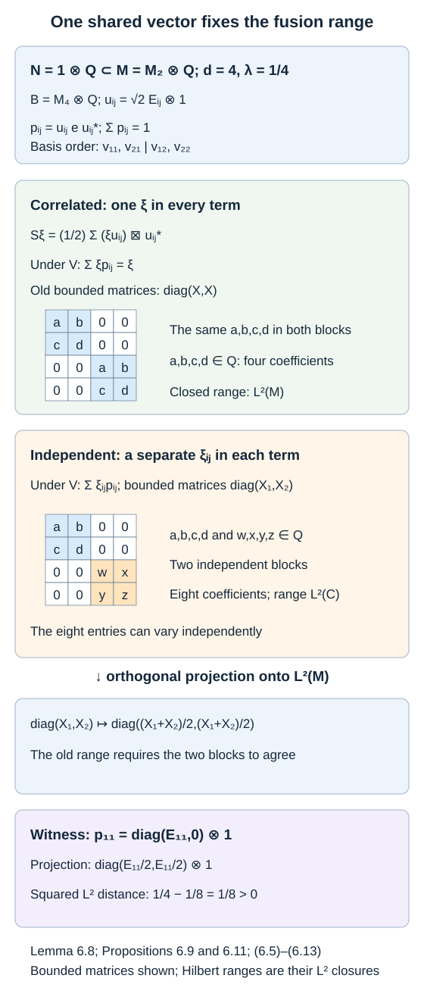

# Fusion as a concrete operator algebra

Fusion combines two correspondences by balancing the right action of one algebra against the left action of the same algebra. For a finite-index inclusion, the result is not merely an abstract Hilbert space: it is the tracial Hilbert space of the basic construction. This identification explains the normalization, the conjugation, and the adjunction behind principal graphs.

We assume [Finite bases, bounded vectors and a positive-operator inequality](finite-bases-and-positive-index.md) and [Going up and down the Jones tower](towers-and-tunnels.md). The general construction, full-radical quotient, functoriality, unit maps, associativity and conjugate reversal are developed in Relative tensor products and fusion. We apply those results to finite factors with their normalized traces. Basic references are [Anantharaman–Popa], [Connes] and [Popa].

Let \(N\subseteq M\) be II₁ factors of finite index \(d\), and put \(B=M_1=\langle M,e_N\rangle\). All tracial inner products are linear in the first variable. Write \(\boxtimes_N\) for fusion over \(N\).

## The coefficient form

For \(a\in M\), multiplication gives a bounded right \(N\)-module map

\[
T_a:L^2(N)\longrightarrow L^2(M),\qquad T_a\widehat n=\widehat{an}.
\]

**Lemma 6.1.** For \(a,b\in M\),

\[
T_b^*T_a=E_N(b^*a)
\]

as a left-multiplication operator on \(L^2(N)\). Consequently the fusion inner product on elementary bounded vectors is

\[
\langle x\boxtimes y,x'\boxtimes y'\rangle
=\tau\bigl(y'^*E_N(x'^*x)y\bigr).
\]

**Proof.** For \(n,m\in N\),

\[
\langle T_a\widehat n,T_b\widehat m\rangle
=\tau(m^*b^*an)
=\tau(m^*E_N(b^*a)n).
\]

This proves the coefficient identity. Substitution into the general bounded-intertwiner form for fusion gives the second formula. Bounded multiplication vectors from \(M\) suffice here: the partial basis of the third lesson identifies the right \(N\)-module with a finite sum of standard corners, on which bounded coefficients are dense. \(\square\)

## The normalization of the basic-construction Hilbert space

**Theorem 6.2.** The formula

\[
V(x\boxtimes_N y)=\sqrt d\,\widehat{xe_Ny}
\]

extends to a unitary of \(M\)-\(M\) correspondences

\[
V:L^2(M)\boxtimes_N L^2(M)\longrightarrow L^2(B,\tau_1),
\qquad \tau_1=d^{-1}\operatorname{Tr}.
\]

The tracial conjugation on \(L^2(B)\) corresponds to

\[
x\boxtimes y\longmapsto y^*\boxtimes x^*.
\]

**Proof.** The basic-construction trace formula gives

\[
\begin{aligned}
\langle\widehat{xe_Ny},\widehat{x'e_Ny'}\rangle_{L^2(B)}
&=\tau_1(y'^*e_Nx'^*xe_Ny)\\
&=d^{-1}\tau\bigl(y'^*E_N(x'^*x)y\bigr).
\end{aligned}
\]

Thus the factor \(\sqrt d\) gives exactly the fusion form. The map vanishes on its whole radical, and therefore is well-defined on the quotient. The spanning algebra \(Me_NM\) is strongly dense in \(B\) and dense in its finite-trace \(L^2\)-space, so the isometry is onto. Left and right multiplication by \(M\) commute with the formula. Finally,

\[
(xe_Ny)^*=y^*e_Nx^*,
\]

which proves the conjugation assertion on a dense subspace and then everywhere. \(\square\)

The factor \(\sqrt d\) concerns **normalized** \(\tau_1\). With the trace normalized instead by \(\operatorname{Tr}(e_N)=1\), the same formula has no square-root factor.

**Corollary 6.3.** Under \(V\), the next basic-construction algebra has the description

\[
M_2=\operatorname{End}_{M^{\mathrm{op}}}(L^2(B))
\cong\operatorname{End}_{M^{\mathrm{op}}}
\bigl(L^2(M)\boxtimes_N L^2(M)\bigr),
\]

where the right \(M\)-action on fusion is the action on its second factor.

**Proof.** The first lesson, applied to \(M\subseteq B\), identifies its basic construction with the commutant of the right \(M\)-action on \(L^2(B)\). Theorem 6.2 intertwines that action. \(\square\)

This is a one-sided endomorphism algebra. Imposing the additional left \(M\)-action gives its relative commutant \(M'\cap M_2\), rather than all of \(M_2\).

## Multiplication and its adjoint

Define initially

\[
m(x\boxtimes_N y)=xy.
\]

This algebraic multiplication extends boundedly even though fusion vectors are not pointwise products in general.

**Proposition 6.4.** The map \(m\) is a bounded \(M\)-\(M\) module map with norm \(\sqrt d\). For a partial orthonormal basis \((u_i)\),

\[
m^*z=\sum_i u_i\boxtimes_N u_i^*z,
\qquad mm^*=d1.
\]

Moreover,

\[
V^{-1}\widehat z=d^{-1/2}m^*z
\quad(z\in M\subseteq L^2(B)).
\]

**Proof.** The expectation \(E_M:B\to M\) is an orthogonal projection on tracial \(L^2\)-spaces. The trace formula gives

\[
E_MV(x\boxtimes y)=\sqrt d\,E_M(xe_Ny)
=d^{-1/2}xy.
\]

Thus \(m=\sqrt d\,E_MV\) is bounded. To compute its adjoint, use the left-coordinate expansion \(x^*=\sum_i E_N(x^*u_i)u_i^*\). For bounded \(x,y,z\),

\[
\begin{aligned}
\left\langle\sum_i u_i\boxtimes u_i^*z,x\boxtimes y\right\rangle
&=\sum_i\tau\bigl(y^*E_N(x^*u_i)u_i^*z\bigr)\\
&=\tau(y^*x^*z)=\langle z,xy\rangle.
\end{aligned}
\]

The finite sum therefore gives \(m^*z\); boundedness extends it to every \(z\in L^2(M)\). Applying \(m\) gives \(\sum_i u_iu_i^*z=dz\), so \(mm^*=d1\) and \(\|m\|=\sqrt d\). The last formula follows from
\(\sum_i u_ie_Nu_i^*=1\). \(\square\)

In particular, the adjoint formula is independent of the chosen basis, since it specifies the adjoint of a fixed bounded operator.

## Duality maps and reciprocity

Let \(X={}_NL^2(M)_M\). Its conjugate correspondence is identified, by tracial adjunction, with \(\overline X={}_ML^2(M)_N\). Fusion over \(M\) identifies \(X\boxtimes_M\overline X\) with \({}_NL^2(M)_N\) through the standard-module unit map.

Let \(\iota:L^2(N)\to L^2(M)\) be inclusion. Define

\[
R=d^{1/4}\iota:
L^2(N)\longrightarrow X\boxtimes_M\overline X,
\]

\[
\overline R=d^{-1/4}m^*:
L^2(M)\longrightarrow\overline X\boxtimes_N X.
\]

**Theorem 6.5.** These maps intertwine both outer actions, have squared norms \(\sqrt d\), and satisfy the conjugate equations

\[
(1_X\boxtimes\overline R^*)(R\boxtimes1_X)=1_X,
\qquad
(1_{\overline X}\boxtimes R^*)(\overline R\boxtimes1_{\overline X})
=1_{\overline X}.
\]

The unit and associator maps in these formulas are the specified standard fusion maps.

**Proof.** Inclusion is an \(N\)-\(N\) map, and multiplication and its adjoint are \(M\)-\(M\) maps. Their norms follow from Proposition 6.4. In the first conjugate equation, inclusion inserts the vector \(1\), and \(\overline R^*=d^{-1/4}m\) multiplies it with the original vector. The factors \(d^{1/4}\) and \(d^{-1/4}\) cancel, giving the identity on bounded vectors.

For the second equation, \(R^*=d^{1/4}E_N\). The adjoint multiplication formula inserts \(\sum_i u_i\boxtimes u_i^*\). The resulting map on a bounded vector \(x\in M\) is

\[
x\longmapsto\sum_i u_i E_N(u_i^*x)=x.
\]

These calculations use the associative balanced products specified by the fusion unit maps. Bounded-vector density and boundedness of all displayed module maps extend both equations to the full Hilbert spaces. \(\square\)

**Corollary 6.6 — reciprocity of intertwiners.** If \(U\) is a correspondence ending in \(N\) and \(W\) is a correspondence ending in \(M\), with the same left algebra, then

\[
\operatorname{Hom}(U\boxtimes_N X,W)
\cong
\operatorname{Hom}(U,W\boxtimes_M\overline X).
\]

The correspondence is linear and preserves the space of bounded bimodule maps.

**Proof.** Send \(f\) to

\[
(f\boxtimes1_{\overline X})(1_U\boxtimes R).
\]

The inverse sends \(g\) to

\[
(1_W\boxtimes\overline R^*)(g\boxtimes1_X).
\]

Functoriality of fusion makes both formulas bounded module maps. The conjugate equations give their two inverse identities. \(\square\)

When these spaces are finite dimensional, their dimensions are equal. In the principal graph this will say that an edge multiplicity read from tensoring with \(X\) equals the reverse multiplicity read from tensoring with \(\overline X\).

## Irreducibility and the relative commutant

**Proposition 6.7.** The canonical correspondence \({}_NL^2(M)_M\) has endomorphism algebra \(N'\cap M\). Its conjugate \({}_ML^2(M)_N\) has endomorphism algebra \((N'\cap M)^{\mathrm{op}}\). Both are irreducible exactly when \(N'\cap M=\mathbb C\).

**Proof.** On the first correspondence, the commutant of the right \(M\)-action is left multiplication by \(M\). Requiring also commutation with the left \(N\)-action leaves \(N'\cap M\). On the conjugate correspondence, the commutant of left multiplication by \(M\) is \(R(M)\); its operators commute with \(R(N)\) exactly when their coefficients lie in \(N'\cap M\). Since right multiplication reverses products, this is the opposite algebra. A Hilbert correspondence is irreducible precisely when its bounded bimodule endomorphisms are scalar. \(\square\)

## Mixed vectors and the embedded range

Set \(\lambda=d^{-1}\), let \(U=V^{-1}\), and write \(S\) for the restriction of \(U\) to the embedded \(L^2(M)\subseteq L^2(B)\). Thus \(S=d^{-1/2}m^*\) by Proposition 6.4. An \(L^2\) vector need not be a bounded vector for fusion in its first leg. The following norm estimates explain the mixed-leg notation we shall use.

**Lemma 6.8.** For \(a,b\in M\), the maps initially defined on \(\eta\in M\) by
\[
\eta\longmapsto\eta\boxtimes_N b,\qquad
\eta\longmapsto a\boxtimes_N\eta
\]
extend boundedly from \(L^2(M)\) to fusion, with
\[
\|\eta\boxtimes_N b\|\leq\|b\|\|\eta\|_2,\qquad
\|a\boxtimes_N\eta\|\leq\|a\|\|\eta\|_2.
\tag{6.1}
\]
Here the first expression for arbitrary \(\eta\) denotes this extension, independently of any particular approximating sequence.

**Proof.** For bounded \(\eta\), Theorem 6.2, trace cyclicity and \(bb^*\leq\|b\|^2 1\) give
\[
\begin{aligned}
\|\eta\boxtimes b\|^2
&=d\,\tau_1(b^*e_N\eta^*\eta e_Nb)\\
&=d\,\tau_1(\eta e_Nbb^*e_N\eta^*)\\
&\leq d\|b\|^2\tau_1(\eta e_N\eta^*)
=\|b\|^2\tau(\eta^*\eta).
\end{aligned}
\tag{6.2}
\]
The last equality is the Markov identity
\(\tau_1(e_Nx)=\lambda\tau(x)\). For the other leg, Lemma 6.1 gives
\[
\|a\boxtimes\eta\|^2
=\tau(\eta^*E_N(a^*a)\eta)
\leq\|a\|^2\|\eta\|_2^2.
\]
Both maps therefore extend uniquely by the density of \(M\) in \(L^2(M)\), retaining the bounds. For the second map this is the usual bounded-first-leg fusion map. For the first map, Theorem 3.6 identifies the right \(N\)-bounded vectors of this particular \(L^2(M)\) with \(M\); thus on the usual bounded-first-leg domain our extension agrees with the original map by definition. \(\square\)

**Proposition 6.9.** Suppose \(a_i,b_i\in M\), \(1\leq i\leq k\), are any finite family satisfying
\[
\sum_i a_i e_N b_i=1_B.
\tag{6.3}
\]
They need not be an orthonormal basis, and no relation \(b_i=a_i^*\) is assumed. Then
\[
U\widehat1=S\widehat1
=\sqrt\lambda\sum_i a_i\boxtimes_N b_i.
\tag{6.4}
\]
For every \(\xi\in L^2(M)\),
\[
S\xi
=\sqrt\lambda\sum_i(\xi a_i)\boxtimes_N b_i
=\sqrt\lambda\sum_i a_i\boxtimes_N(b_i\xi).
\tag{6.5}
\]
Each mixed tensor is defined by Lemma 6.8. Both sums use the same \(\xi\). In particular, the closed embedded range is precisely
\[
\operatorname{ran}S
=\left\{\sqrt\lambda\sum_i(\xi a_i)\boxtimes_N b_i:
                 \xi\in L^2(M)\right\}
=\left\{\sqrt\lambda\sum_i a_i\boxtimes_N(b_i\xi):
                 \xi\in L^2(M)\right\}.
\tag{6.6}
\]

Let \(e_M\) be the orthogonal projection of \(L^2(B)\) onto \(L^2(M)\), the Jones projection for \(M\subseteq B\). Its transported projection is
\[
\begin{aligned}
P=Ue_MU^*&=SS^*=\lambda m^*m,\\
P(x\boxtimes_Ny)
&=\lambda\sum_i xa_i\boxtimes_N b_i y
=\lambda\sum_i a_i\boxtimes_N b_i xy
\qquad(x,y\in M).
\end{aligned}
\tag{6.7}
\]
All these formulas are independent of the identity family.

**Proof.** Applying \(V\) to the right side of (6.4) gives
\(\sqrt{\lambda d}\sum_i\widehat{a_i e_Nb_i}=\widehat1\).
Theorem 6.2 intertwines both outer \(M\)-actions. For \(\xi\in M\), multiplying (6.4) on the left or right therefore gives (6.5).

Right multiplication by \(a_i\) and left multiplication by \(b_i\) are bounded on tracial \(L^2(M)\). Lemma 6.8 bounds the corresponding terms in (6.5) by
\(\|a_i\|\|b_i\|\|\xi\|_2\). There are finitely many terms, so both formulas extend continuously to every \(\xi\in L^2(M)\). This proves (6.5) with the stated meaning of each leg. It also shows
\[
\left\|\sum_i(\xi a_i)\boxtimes b_i\right\|
=\left\|\sum_i a_i\boxtimes(b_i\xi)\right\|
=\lambda^{-1/2}\|\xi\|_2.
\tag{6.8}
\]
Indeed \(S\) is an isometry. Thus the ranges in (6.6) are closed and equal to \(\operatorname{ran}S\); no additional closure or independent choices of \(\xi\) are intended.

On \(L^2(B)\), the projection \(e_M\) is the \(L^2\) extension of \(E_M\). Consequently
\[
e_M V(x\boxtimes y)
=\sqrt d\,\widehat{E_M(xe_Ny)}
=\sqrt d\,\lambda\,\widehat{xy}.
\]
Applying \(U\) and (6.5) gives the second expression for \(P\) in (6.7). The first expression follows by multiplying (6.4) by \(x\) on the left and \(y\) on the right. Since \(e_M\) is a projection onto the old subspace, its transport is \(SS^*\); Proposition 6.4 identifies this with \(\lambda m^*m\). In particular it is selfadjoint and idempotent. The definitions of \(S\) and \(P\) involve no family, proving independence. \(\square\)

A partial basis always supplies one identity family in (6.3). Proposition 6.9 also covers every other finite identity decomposition. This is the form of the mixed-vector identities following Proposition XIX.4.11 in [Takesaki]. Formula (6.6) spells out the correlated range: replacing one shared \(\xi\) by separate \(\xi_i\) in different terms can enlarge it, as the next example shows.

**Corollary 6.10.** The closed subspace
\[
\mathcal T=\{\xi\boxtimes_N1:\xi\in L^2(M)\}
\]
equals \(\operatorname{ran}S\) when \(d=1\), and differs from it when \(d>1\).

**Proof.** The map \(\xi\mapsto\xi\boxtimes1\) is isometric: on bounded vectors Lemma 6.1 gives
\(\|\xi\boxtimes1\|^2=\tau(E_N(\xi^*\xi))=\|\xi\|_2^2\), and density extends this equality. Its range is thus closed. Under \(V\), that range is \(\sqrt d\,L^2(M)e_N\), contained in the closed right ideal \(L^2(B)e_N\). Right multiplication by \(e_N\) is an orthogonal projection on \(L^2(B)\), so the ideal is closed.

If \(d>1\), then \(\tau_1(e_N)=\lambda<1\). Hence \(\widehat1\) is outside that ideal: its distance to it is
\(\|\widehat{1-e_N}\|_2=\sqrt{1-\lambda}>0\).
But \(VS\widehat1=\widehat1\). Thus \(S\widehat1\notin\mathcal T\), proving the two subspaces differ.

If \(d=1\), faithfulness and \(\tau_1(e_N)=1\) imply \(e_N=1\). The projection onto \(L^2(N)\) is then the identity on \(L^2(M)\), whence \(N=M\), and \(B=M\). Fusion over \(M\) has its standard unit identification \(\xi\boxtimes_M1=\xi\); both subspaces are the whole space. \(\square\)

## Independent terms can enlarge the range

Let \(Q\) be any II₁ factor, and take
\[
N=1\otimes Q\subseteq M=M_2(\mathbb C)\,\overline\otimes\,Q,
\qquad E_N=\operatorname{tr}_2\otimes\operatorname{id}_Q.
\tag{6.9}
\]
Here \(d=4\): as a right \(Q\)-module, \(L^2(M)\) is four copies of \(L^2(Q)\). Put \(u_{ij}=\sqrt2 E_{ij}\otimes1\), for \(i,j=1,2\). Direct multiplication gives
\[
E_N(u_{ij}^*u_{kl})=\delta_{ik}\delta_{jl}1,\qquad
\sum_{i,j}u_{ij}u_{ij}^*=4\,1.
\]
These are the four basis vectors in the finite matrix coordinate.

On \(H_0=L^2(M_2,\operatorname{tr}_2)\), order the orthonormal vectors as
\[
(v_{11},v_{21},v_{12},v_{22}),\qquad v_{ij}=\sqrt2 E_{ij}.
\]
Then \(L^2(M)=H_0\otimes L^2(Q)\). Operators commuting with right \(Q\) are \(4\)-by-\(4\) matrices with entries in left \(Q\), so
\[
B=M_4(\mathbb C)\,\overline\otimes\,Q,\qquad
e_N=|\Omega\rangle\langle\Omega|\otimes1,\quad
\Omega=\widehat{1_{M_2}}.
\]
The old \(M\) acts as two identical \(2\)-by-\(2\) blocks, one for each fixed column \(j\). Its normalized trace is the restriction of \(\operatorname{tr}_4\otimes\tau_Q\). The identity family is
\[
\sum_{i,j}u_{ij}e_Nu_{ij}^*=1_B.
\]
In fact
\[
p_{ij}=u_{ij}e_Nu_{ij}^*
=|v_{ij}\rangle\langle v_{ij}|\otimes1
\tag{6.10}
\]
are the four orthogonal coordinate projections.

**Proposition 6.11.** Allowing an independent vector in each term of either sum in (6.5) gives, under \(V\), the whole \(L^2\) space of the block-diagonal algebra
\[
C=\left\{\begin{pmatrix}X_1&0\\0&X_2\end{pmatrix}:
      X_1,X_2\in M_2\,\overline\otimes\,Q\right\}.
\tag{6.11}
\]
The actual correlated range maps onto \(L^2(M)\), where \(X_1=X_2\). Thus the independent sums strictly enlarge the range.

**Proof.** Scalar factors do not change a linear range. Under \(V\), the term
\((\xi_{ij}u_{ij})\boxtimes u_{ij}^*\) is \(2\,\xi_{ij}p_{ij}\), defined by \(L^2\) continuity. For a fixed \(p_{ij}\), left multiplication by \(M\) moves its range to either of the two row vectors with the same column \(j\). It gives all matrix entries in that one column of the corresponding block, with arbitrary \(L^2(Q)\) coefficients. Summing over the four \(p_{ij}\), with independent \(\xi_{ij}\), therefore gives exactly \(L^2(C)\). The right-hand tensor expression gives \(2p_{ij}\xi_{ij}\); summing these rows gives the same \(L^2(C)\).

With a shared \(\xi\), instead, \(\sum_{ij}\xi p_{ij}=\xi\), and \(\sum_{ij}p_{ij}\xi=\xi\). These are precisely the old \(L^2(M)\) vectors. For strictness use \(p_{11}=\operatorname{diag}(E_{11}\otimes1,0)\), which lies in \(C\) but not in the old diagonal copy of \(M\). Trace pairing against that copy gives
\[
E_M(p_{11})
=\operatorname{diag}\left(\tfrac12E_{11}\otimes1,
                           \tfrac12E_{11}\otimes1\right).
\tag{6.12}
\]
Indeed on \(C\) the expectation is the average of its two blocks, repeated in both blocks. Consequently
\[
\|p_{11}-E_M(p_{11})\|_{2,\tau_1}^2
=\tau_1(p_{11})-\|E_M(p_{11})\|_2^2
=\frac14-\frac18=\frac18>0.
\tag{6.13}
\]
The old \(L^2(M)\) is the closed range of the trace-preserving expectation, so this positive distance proves that the independent sums contain a vector outside the correlated range. The argument is an actual II₁ inclusion, with its full \(Q\) coefficients, rather than a claim based only on finite matrix dimensions. \(\square\)

*Figure 6.1. For the index-four inclusion (6.9), the four coordinate projections (6.10) resolve the basic-construction identity. Correlated terms give the old block pair \((X,X)\); independent terms give \((X_1,X_2)\). The trace-preserving projection averages the blocks. The rank-one witness has squared \(L^2\) distance \(1/8\) from the old range, as in Proposition 6.11. Only the bounded matrix coordinates are pictured; each entry also carries its \(Q\) coefficient, and the Hilbert spaces are their stated \(L^2\) closures. Diagram and coordinates authored here; compare [Takesaki], the formulas following XIX.4.11. [Editable figure source](figures/correlated-fusion-range.py).*

## Exercises

**Exercise 6.1 — introductory.** In a tensor inclusion of index nine, compute the fusion norm of \(1\boxtimes1\), and the normalized \(L^2(B)\)-norm of \(e_N\).

**Solution.** The coefficient formula gives \(\|1\boxtimes1\|^2=\tau(E_N(1))=1\). The normalized trace gives \(\|e_N\|_2^2=\tau_1(e_N)=1/9\). Multiplication by \(\sqrt9=3\) in Theorem 6.2 reconciles these norms.

**Exercise 6.2 — intermediate.** Show that \(d^{-1/2}m^*\) is an isometry and that the orthogonal projection onto its range is \(d^{-1}m^*m\).

**Solution.** Proposition 6.4 gives \((d^{-1/2}m^*)^*(d^{-1/2}m^*)=d^{-1}mm^*=1\). For an isometry \(S\), its range projection is \(SS^*\); this gives \(d^{-1}m^*m\). Under \(V\), it is the projection of \(L^2(B)\) onto the embedded \(L^2(M)\).

**Exercise 6.3 — advanced.** Give a formula for that projection on \(x\boxtimes y\), and verify idempotence using the scalar basis identity.

**Solution.** The formula is

\[
P(x\boxtimes y)=d^{-1}\sum_i u_i\boxtimes u_i^*xy.
\]

Applying it twice gives

\[
P^2(x\boxtimes y)
=d^{-2}\sum_{i,j}u_j\boxtimes u_j^*u_iu_i^*xy
=d^{-1}\sum_j u_j\boxtimes u_j^*xy=P(x\boxtimes y),
\]

since \(\sum_i u_iu_i^*=d1\). Self-adjointness also follows from \(P=d^{-1}m^*m\).

**Exercise 6.4 — intermediate.** Starting with an identity family \(a_i,b_i\) as in (6.3), choose arbitrary nonzero complex scalars \(c_i\) and set \(a_i'=c_i a_i,\ b_i'=c_i^{-1}b_i\). Verify the identity decomposition and all formulas in Proposition 6.9. Must the new family be orthonormal or satisfy \(b_i'=(a_i')^*\)?

**Solution.** In each product \(a_i'e_Nb_i'\) the two scalar factors cancel, so the sum remains \(1_B\). In each mixed tensor and each transported-projection term they cancel by complex bilinearity of fusion, giving the same vector or operator. If the starting family is \(u_i,u_i^*\), choose, for example, \(c_1=2\). Then \(E_N((a_1')^*a_1')\) is four times its original projection, so the family is not orthonormal. Also \(b_1'=u_1^*/2\ne2u_1^*=(a_1')^*\). The identity-family formulas require neither property.

**Exercise 6.5 — advanced.** Use any identity family (6.3) to prove the idempotence in (6.7) directly. State the scalar identity that the proof uses.

**Solution.** Applying \(E_M\) to (6.3) gives \(1=\lambda\sum_i a_i b_i\), hence \(\sum_i a_i b_i=d1\). Use the second formula for \(P\) in (6.7):
\[
P^2(x\boxtimes y)
=\lambda^2\sum_{i,j}a_j\boxtimes b_j a_i b_i xy
=\lambda\sum_j a_j\boxtimes b_jxy
=P(x\boxtimes y).
\]
The products occur in exactly that order; no positivity of the individual identity-family terms was used. Elementary bounded tensors are dense, and \(P\) is bounded by Proposition 6.9, so the identity holds everywhere. Selfadjointness follows separately from \(P=SS^*\).

**Exercise 6.6 — advanced.** In the tensor model, let \(p\) be the projection onto \(v_{11}\), and let \(r\) be right multiplication by \(E_{12}\) on \(H_0\). Show directly that \(p\) is outside the old matrix algebra, and compute its distance to the image under \(V\) of \(\mathcal T\).

**Solution.** One has \(rv_{11}=v_{12}\), so \(rpv_{11}=v_{12}\), while \(prv_{11}=0\). Thus \(p\) fails to commute with right multiplication by \(E_{12}\). Every old left matrix commutes with right multiplication, so \(p\) is outside that algebra. For the second distance, \(V\mathcal T=M_4e_N\) in this finite coordinate: left \(M_2\) sends \(\Omega\) to every vector of \(H_0\), so \(M_2e_N\) is the whole right ideal \(M_4e_N\). Orthogonal projection onto it is \(Z\mapsto Ze_N\). Since \(|\langle v_{11},\Omega\rangle|^2=1/2\),
\[
\|p-pe_N\|_{2,\operatorname{tr}_4}^2
=\frac14\operatorname{Tr}_4(p-pe_Np)
=\frac14\left(1-\frac12\right)=\frac18.
\]
The tensor \(Q\) coefficients do not change this constant-coordinate calculation. The witness is outside both \(V\operatorname{ran}S\) and \(V\mathcal T\); equal distances here do not identify the two subspaces.

## References

- Claire Anantharaman and Sorin Popa, [*An introduction to II₁ factors*](https://www.math.ucla.edu/~popa/Books/IIun.pdf), open lecture notes.
- Alain Connes, [*Noncommutative Geometry*](https://alainconnes.org/wp-content/uploads/book94bigpdf.pdf), Academic Press, 1994.
- Sorin Popa, [*Correspondences*](https://www.math.ucla.edu/~popa/popa-correspondences.pdf), INCREST preprint 56/1986.
- Masamichi Takesaki, [*Theory of Operator Algebras III*](https://doi.org/10.1007/978-3-662-10453-8), Springer, 2003, Chapter XIX, Proposition 4.11 and the formulas following it.

*Written by GPT-6.1 Sol (OpenAI), Ultra reasoning effort, September 2026; expanded October 2026. Self-checked by the writing AI. Public domain (CC0).*
