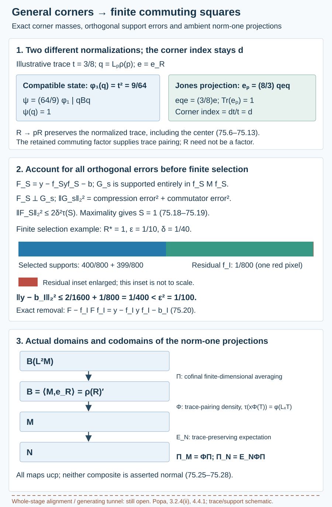

# General corners and piecewise commuting squares

The first finite local approximation theorem now applies to an actual core whose algebras may have centers. We extend its input to every nonzero corner, retaining the exact corner Hilbert space and its compatible hypertrace. Orthogonal local errors can then cover the unit and produce finite-dimensional commuting squares. A common matrix algebra commuting with the resulting finite square proves relative tensor absorption in the separable case.

These finite squares have blocks from actual relative commutants of **corner inclusions**. We retain that endpoint explicitly. Placing them in a single prescribed whole-inclusion relative-commutant stage, or constructing a generating tunnel, still needs its supported lifting argument.

We use [2.9 (algebra compression of dimension)](module-dimension-and-local-index.md), [4.5 (rotating and recognizing tunnel triples)](towers-and-tunnels.md), [29.1 (compatible core comparisons)](finite-index-tunnels-without-finite-depth.md), [49.2 (relative Følner and compatible hypertraces)](relative-hypertraces-and-folner-projections.md), 52.1–52.2 (canonical nondegenerate core pairs), 53.1 (finite-stage expectations), [59.6 (orthogonal block errors)](corner-heredity-and-global-patching.md), and [74.3–74.4 (the unrestricted first local form and every-core equivalence)](unequal-supports-and-finite-local-approximation.md). The relative matrix property and its separable tensor construction are [50.2–50.4](relative-tensor-absorption.md). Projection prescription/comparison, standard commutant descriptions, tracial Radon–Nikodym identification and trace-preserving expectations retain their exact programme providers in those lessons. No infinite-factor deletion, new relative norm-averaging theorem or common-support BF is assumed.

For the final injectivity and hyperfiniteness statements, the exact existing-course providers are Theorem 2.1 of *Injective von Neumann algebras* (a norm-one projection characterizes injectivity) and Theorems 1.5–1.6 with their complete Section 9 assembly in *Uniqueness of the injective II₁ factor*. The latter require separability for the conclusion that an injective II₁ factor is the hyperfinite factor. Their declared operator-algebra prerequisites retain their original programme scope; this application admits no blanket prerequisite closure.

Let \(N\subsetneq M\) be a finite-index inclusion of \(\mathrm{II}_1\) factors, with normalized trace \(\tau\) and index \(d>1\). Suppose one actual core satisfies relative Følner. By 74.4 every actual core does. Until the final separable conclusions, no separability, factoriality of a core algebra, or extremality is assumed.

## Retain the projection without changing the core pair

**Lemma 75.1.** For every projection \(p\in N\), one can choose a tunnel \(N_0=N,N_1,\ldots\) and an increasing binary matrix union \(D_j\cong M_{2^j}(\mathbb C)\), with

\[
\begin{gathered}
D_j\subset N_j,\quad D_j\subset D_{j+1},\\
p\in\mathcal D=(\bigcup_jD_j)'',\\
\mathcal D\subset\bigcap_jN_j.
\end{gathered}
\tag{75.1}
\]

The algebra \(\mathcal D\) is a hyperfinite II₁ factor. The new actual core pair \(S_1\subset R_1\) is normally trace-preservingly isomorphic to the original pair. This statement does not require either original endpoint to be a factor.

**Proof.** We give the construction to identify the scope of the reuse in 59.1. At stage \(j\), maintain a matrix decomposition of the factor \(N_j\) in which \(p\) is a sum of full diagonal cells and at most one residual cell, with residual coefficient a projection in \(D_j'\cap N_j\). The filled-cell projection \(p_j\in D_j\) satisfies

\[
\begin{gathered}
0\leq p-p_j,\\
\|p-p_j\|_2^2\leq2^{-j}.
\end{gathered}
\tag{75.2}
\]

Start with \(D_0=\mathbb C1\). If the residual coefficient has normalized trace at most \(1/2\), choose a half-trace projection containing it; if its trace is larger, choose a half-trace projection below it. Comparison supplies the matrix units for this projection and its complement. Refining by this \(M_2\) leaves only one residual cell and halves its containing-cell trace. At a zero or unit residual, use any refinement and omit that residual.

A next predecessor of \(N_j\) can be chosen to contain this prescribed refinement and \(p\). First conjugate a copy of \(M_{2^j}\) in a chosen predecessor onto \(D_j\), using equal-trace matrix-unit comparison in \(N_j\). Inside the \(D_j\)-complement, conjugate a copy of \(M_2\) onto the prescribed refinement, by a unitary in \(D_j'\cap N_j\). Finally prescribe the residual coefficient's trace in the predecessor's complementary factor and conjugate that projection to the actual residual by a unitary in \(D_{j+1}'\cap N_j\). The resulting predecessor contains both \(p\) and \(D_{j+1}\). All these corrections are in \(N_j\), so they fix the previous cups; 4.5 permits the continuation rotation.

Iteration proves 75.1, and 75.2 proves \(p\in\mathcal D\). The binary product trace identifies the inherited-trace completion with the hyperfinite II₁ factor. Each correction fixes the earlier relative commutants. Their conjugation maps and inverse maps therefore stabilize on every fixed finite stage. They identify both increasing core unions, preserving the trace. The inherited-trace Hilbert completion argument of 29.1 extends them to normal isomorphisms of both closures. That argument uses neither endpoint factoriality nor convergence of the correcting unitaries. \(\square\)

The retained factor is constructed around \(p\). It is not a previously specified infinite factor being deleted from a tunnel.

## Average operators before restricting the singular state

Write \(H=L^2(M,\tau)\), \(L_x\widehat y=\widehat{xy}\), and \(\rho(a)\widehat y=\widehat{ya}\); \(\rho\) is an opposite representation. Let

\[
\begin{gathered}
e=e_{R_1}^M,\\
\mathcal A=\langle N,e\rangle,\\
\mathcal B=\langle M,e\rangle.
\end{gathered}
\tag{75.3}
\]

The factor \(\mathcal D\) commutes with \(R_1\), since it lies in every tunnel level. Also \(\rho(\mathcal D)\subset\mathcal A\). To verify this, on \(L^2(N)\) right multiplication by \(a\in\mathcal D\) commutes with right \(S_1\), so is in \(\langle N,e_{S_1}^N\rangle\). The canonical extension of 52.2 sends \(nr\) to \(nar=nra\). Since \(NR_1=M\) in linear span by 52.1, this extension is actual right multiplication on \(H\). It commutes with left \(M\).

**Lemma 75.2.** Put \(t=\tau(p)>0\), and \(q=L_p\rho(p)\in\mathcal A\). There is a compatible \(M\)-hypertrace \(\varphi_1\) on \(\mathcal B\) such that

\[
\begin{gathered}
\varphi_1(L_x\rho(p))=t\tau(x)\\
\quad(x\in M),\\
\varphi_1(\rho(p))=t,\\
\varphi_1(q)=t^2.
\end{gathered}
\tag{75.4}
\]

**Proof.** By 74.4 and 49.2 the retained core has a compatible hypertrace \(\varphi\). Let \(\beta_j\) average conjugations on \(\mathcal B\) by the compact unitary group of \(\rho(D_j)\), with Haar probability measure. These maps are unital completely positive, \(M\)-bimodular, fix \(M\), and commute with \(E_{\mathcal A}\). The last property follows from expectation bimodularity, since the averaging unitaries lie in \(\mathcal A\).

Take a cofinal point-ultraweak cluster map \(\beta\) in the product of the bounded operator balls. Matrix positivity, unitality and bimodularity pass to the limit. Normality of \(E_{\mathcal A}\) also passes its commutation relation. For each \(a\in\mathcal D\), every average of \(\rho(a)\) lies in the weakly closed factor \(\rho(\mathcal D)\). For all \(j\geq i\) it commutes with \(\rho(D_i)\). A cluster value therefore commutes with all of \(\rho(\mathcal D)\) and is scalar. The normal trace of this factor is ultraweakly continuous and preserved by every average, so that scalar is \(\tau(a)\). Thus

\[
\begin{gathered}
\beta E_{\mathcal A}=E_{\mathcal A}\beta,\qquad
\beta|_M=\mathrm{id},\\
\beta(\rho(a))=\tau(a)1\quad(a\in\mathcal D).
\end{gathered}
\tag{75.5}
\]

Set \(\varphi_1=\varphi\circ\beta\). It retains compatibility, \(M\)-centrality and the normalized trace restriction. By \(M\)-bimodularity, \(\beta(L_x\rho(p))=tL_x\); composing with \(\varphi\) proves 75.4 directly. No normality of either \(\varphi\) or \(\beta\) is claimed. \(\square\)

Strong density alone does not extend invariance of a singular state. The construction averages operators, identifies their limit using a normal finite trace, and then composes with the state.

## The exact corner pair and its compatible hypertrace

**Theorem 75.3 — general corner heredity.** For every nonzero \(p\in N\), the proper index-\(d\) inclusion \(pNp\subset pMp\) has an actual core satisfying relative Følner. That core is trace-preservingly isomorphic to the original core pair. Every actual core of the corner inclusion satisfies relative Følner and the first local form of 74.3, with any positive normalized trace cap.

**Proof.** Factor trace pairing with the commuting \(\mathcal D\) gives

\[
\begin{gathered}
\tau(pr)=t\tau(r)\quad(r\in R_1),\\
E_{R_1}(p)=E_{S_1}(p)=t1.
\end{gathered}
\tag{75.6}
\]

Indeed for fixed positive \(r\in R_1\), the normal positive functional \(a\mapsto\tau(ar)\) is tracial on the factor \(\mathcal D\), hence is \(\tau(r)\tau|_{\mathcal D}\); linearity covers all \(r\). Consequently multiplication by \(p\) is a faithful normal *-isomorphism \(R_1\to pR_1\), with unit \(p\), preserving normalized traces. It likewise identifies \(S_1\) with \(pS_1\). No factoriality of \(R_1\) was used.

The corner space \(qH\) is \(L^2(pMp,\tau_p)\), where \(\tau_p=\tau/t\), via \(\widehat x\mapsto t^{-1/2}\widehat x\). Its actual Jones projection is

\[
\begin{gathered}
e_p=t^{-1}qeq,\\
eqe=te,\\
\operatorname{Tr}(e_p)=1.
\end{gathered}
\tag{75.7}
\]

For \(r\in R_1\), \(q\widehat r=\widehat{pr}\), and \(eq\widehat r=t\widehat r\) by 75.6. Hence \(eqe=te\), and \(t^{-1}qeq\) is the projection onto the closure of \(pR_1\) in \(qH\). The partial isometry \(t^{-1/2}qe\) has initial projection \(e\) and final projection \(e_p\); alternatively finite-ideal trace cyclicity gives \(\operatorname{Tr}(qeq)=t\). Both calculations give the stated normalization.

The standard commutant description of a basic construction now gives

\[
\begin{gathered}
q\mathcal Bq=\langle pMp,e_p\rangle,\\
q\mathcal Aq=\langle pNp,e_p\rangle,\\
E_q(T)=qE_{\mathcal A}(T)q\\
(T\in q\mathcal Bq).
\end{gathered}
\tag{75.8}
\]

For the larger algebra, \(\mathcal B=\rho(R_1)'\); compression by \(q\in\mathcal B\) is the commutant of the restricted right action, which is right \(pR_1\). For the smaller algebra, first perform the same two-sided compression of \(\langle N,e_{S_1}^N\rangle\) on \(L^2(N)\). It gives \(\langle pNp,e_{pS_1}^{pNp}\rangle\). The canonical normal extension of 52.2 carries this pair to \(q\mathcal Aq\) on \(qH\). This is nondegenerate because \(pMp=(pNp)(pR_1)\) in linear span: use \(NR_1=M\) and \([p,R_1]=0\). Its Jones projection is exactly 75.7. Since \(q\in\mathcal A\), compression of \(E_{\mathcal A}\) is a normal conditional expectation onto this smaller algebra. The restriction of the original canonical trace is already the corner canonical trace, by \(\operatorname{Tr}(e_p)=1\) and

\[
\begin{gathered}
\operatorname{Tr}(e_p L_{pr})=\tau(r)\\
=\tau_p(pr)\quad(r\in R_1).
\end{gathered}
\tag{75.9}
\]

For 75.9, finite-ideal cyclicity reduces the left side to \(t^{-1}\operatorname{Tr}(eqL_{pr}e)\), and 75.6 identifies this compression with \(tL_re\).

We check that \(pS_1\subset pR_1\) is an **actual corner core**. Every tunnel level contains \(p\), and every cup commutes with it. The compressed cups have expectation \(d^{-1}p\) onto the compressed middle factors. The generation condition follows directly: choose finitely many \(v_l=v_lp\) in the predecessor, with \(\sum_l v_lv_l^*=1\), by splitting the unit into pieces of trace at most \(t\) and comparing them with subprojections of \(p\). Inserting this sum into a spanning word \(pag_jbp\), and using \([v_l,g_j]=0\), gives

\[
\begin{gathered}
a_l=pav_lp,\qquad b_l=pv_l^*bp,\\
pag_jbp=\sum_l a_l(pg_j)b_l.
\end{gathered}
\tag{75.10}
\]

The triple recognition in 4.5 therefore gives the tunnel \(pN_jp\). Full-corner commutant lifting identifies its finite endpoints:

\[
\begin{gathered}
(pN_jp)'\cap pMp\\
=p(N_j'\cap M),\\
(pN_jp)'\cap pNp\\
=p(N_j'\cap N).
\end{gathered}
\tag{75.11}
\]

For a direct lift of \(x\) in the first left-hand commutant, choose \(v_l=v_lp\in N_j\) with \(\sum_lv_lv_l^*=1\), and put \(X=\sum_lv_lxv_l^*\). Inserting that partition shows that \(X\) commutes with \(N_j\), since its coefficients \(v_l^*av_h\) lie in \(pN_jp\). Moreover \(pXp=x\), since \(pv_lp\) lies in that corner and commutes with \(x\). Conversely compression of a whole commutant element commutes with the corner. The proof in \(N\) is identical. Closure gives \(pR_1\), and its intersection with \(pNp\) is \(pS_1\): if \(pr\in pNp\), then \(pr=pE_{S_1}(r)\), and faithfulness in 75.6 gives \(r=E_{S_1}(r)\).

The original left \(N\)-dimension trace on \(H\) has mass \(d\) and restricts to \(d\tau\) on right \(M\), by normal factor trace uniqueness. Thus \(H\rho(p)\) has \(N\)-dimension \(dt\). Algebra compression by left \(p\), using 2.9, gives

\[
\begin{gathered}
\dim_{pNp}(qH)=dt/t\\
=d=[pMp:pNp].
\end{gathered}
\tag{75.12}
\]

Finally put \(\psi=t^{-2}\varphi_1|_{q\mathcal Bq}\). Its unit has mass one by 75.4. It centralizes the represented \(pMp\), is \(E_q\)-compatible by 75.8, and satisfies

\[
\begin{gathered}
\psi(L_x\rho(p))=t^{-2}(t\tau(x))\\
=\tau_p(x)\quad(x\in pMp).
\end{gathered}
\tag{75.13}
\]

Here the represented left action on \(qH\) is \(L_x\rho(p)\). Compatibility follows from \(q\in\mathcal A\) and \(\varphi_1E_{\mathcal A}=\varphi_1\); centrality follows from its old \(M\)-centrality because every operator in this corner is supported by \(q\). The criterion 49.2 gives relative Følner for the actual corner core. Apply 74.4 and 74.3 to obtain every-core Følner and the capped first local form. This establishes the whole statement without a BF₁ step. \(\square\)

## Finite squares from orthogonal local corners

**Theorem 75.4 — general piecewise commuting-square approximation.** For every finite \(Y\subset M\) and \(\varepsilon>0\), there are unital finite-dimensional algebras \(Q\subset P\subset M\), with \(Q\subset N\), satisfying

\[
\begin{gathered}
E_N(P)=Q,\\
E_NE_P=E_PE_N=E_Q,\\
\|y-E_P(y)\|_2<\varepsilon\\
(y\in Y).
\end{gathered}
\tag{75.14}
\]

Each nontrivial block of \(Q\subset P\) is a supported finite relative-commutant pair of an actual tunnel for a corner inclusion. Moreover every block has a commuting II₁ subfactor in its smaller ambient corner. These statements do not place all blocks in one whole-inclusion tower stage.

**Proof.** First describe an available local block. Let \(0<f\in N\) be a projection. Apply 75.3 and 74.3 in \(fNf\subset fMf\), with normalized trace \(\tau_f=\tau/\tau(f)\), to the finite set \(fyf\) at tolerance \(\delta>0\). For some actual corner tunnel, write its factor level as \(K_j\), and its finite pair as

\[
\begin{gathered}
A_j^f=K_j'\cap fMf,\\
B_j^f=K_j'\cap fNf.
\end{gathered}
\tag{75.15}
\]

The theorem gives \(0<s\in B_j^f\), \(s\leq f\), and finite algebras

\[
\begin{gathered}
P_s=sA_j^fs,\\
Q_s=sB_j^fs=E_N(P_s).
\end{gathered}
\tag{75.16}
\]

Indeed \(E_N|_{fMf}=E_{fNf}\), and 53.1 applied to this actual corner tunnel gives \(E_N(A_j^f)=B_j^f\). The support \(s\in B_j^f\subset N\) supplies bimodularity. Put \(a(y)=E_{P_s}^{sMs}(sys)\). It has norm at most \(\|y\|\), and conversion from the normalized corner norms gives the **ambient** estimates

\[
\begin{gathered}
\|sys-a(y)\|_2<\delta\sqrt{\tau(s)},\\
\|[fyf,s]\|_2<\delta\sqrt{\tau(s)}.
\end{gathered}
\tag{75.17}
\]

For later use, \(T_s=sK_j\subset sNs\) is a II₁ factor with unit \(s\), commuting with \(P_s\). Multiplication \(x\mapsto sx\) is a normal *-homomorphism because \(s\) commutes with \(K_j\). It is faithful: normalized factor trace pairing gives \(\tau_f(sx^*x)=\tau_f(s)\tau_f(x^*x)\). Since \(A_j^f\) commutes with \(K_j\), its supported corner commutes with \(sK_j\).

Consider families of such orthogonal nonzero supports \(s_i\), with their finite pairs and fixed candidates \(b_i(y)\), satisfying \(\|b_i(y)\|\leq\|y\|\). Let

\[
\begin{gathered}
S=\sum_i s_i,\quad f_S=1-S,\\
b(y)=\sum_i b_i(y),\\
F_S(y)=y-f_Syf_S-b(y),\\
\|F_S(y)\|_2^2\leq2\delta^2\tau(S)\\
\quad(y\in Y).
\end{gathered}
\tag{75.18}
\]

Order these families, including their fixed data, by inclusion. The empty family qualifies. Faithfulness of the finite trace makes every orthogonal nonzero family countable: only finitely many supports can have trace at least \(1/n\), and their union over \(n\) contains all supports. The bounded block sums have strong and \(L^2\) limits. Chain unions retain 75.18, since their increasing supports converge in \(L^2\), the fixed block sums converge there, and the bound is non-strict. Zorn's lemma gives a maximal family.

If \(f_S\ne0\), 75.17 supplies a new support \(s\leq f_S\) and its data. With \(g=f_S-s\), the orthogonal block identity 59.6 gives

\[
\begin{gathered}
G_s(y)=f_Syf_S\\
-gyg-a(y),\\
F_S(y)\perp G_s(y),\\
\|G_s(y)\|_2^2\\
=\|sys-a(y)\|_2^2\\
\quad+\|[f_Syf_S,s]\|_2^2\\
<2\delta^2\tau(s).
\end{gathered}
\tag{75.19}
\]

Adding the new block therefore preserves 75.18 with \(S+s\), contradicting maximality. Thus \(S=1\) and the full error \(F=y-\sum_i b_i(y)\) has squared norm at most \(2\delta^2\).

Choose a finite subfamily \(I\), let \(f_I=1-\sum_{i\in I}s_i\), and put \(b_I(y)=\sum_{i\in I}b_i(y)\). The exact identity

\[
\begin{gathered}
y-f_Iyf_I-b_I(y)\\
=F-f_IFf_I,\\
\|y-b_I(y)\|_2^2\\
\leq2\delta^2+\|y\|^2\tau(f_I)
\end{gathered}
\tag{75.20}
\]

uses orthogonality of the removed \(f_I\)-\(f_I\) block to all remaining blocks. We do not assume the full maximal-family estimate separately for every finite subfamily. Put \(R_* =\max(1,\max_{y\in Y}\|y\|)\), choose \(\delta=\varepsilon/4\), and take \(I\) large enough that \(\tau(f_I)<\varepsilon^2/(4R_*^2)\). Then the right side of 75.20 is less than \(3\varepsilon^2/8\).

Define

\[
\begin{gathered}
P=\bigoplus_{i\in I}P_{s_i}\ \oplus\ \mathbb Cf_I,\\
Q=\bigoplus_{i\in I}Q_{s_i}\ \oplus\ \mathbb Cf_I.
\end{gathered}
\tag{75.21}
\]

Omit a zero residual summand. Both algebras have unit one. Since all supports lie in \(N\), 75.16 gives \(E_N(P)=Q\). The map \(E_NE_P\) has range in \(Q\) and has the trace pairing of \(E_Q\) against all \(q\in Q\); it is therefore \(E_Q\). Taking \(L^2\) adjoints gives \(E_PE_N=E_Q\). Finally \(b_I(y)\in P\), so the nearest-point property of \(E_P\), combined with 75.20, proves 75.14. For an empty \(Y\), take \(P=Q=\mathbb C1\). \(\square\)

## A matrix algebra commuting with the whole finite square

**Corollary 75.5 — relative matrix property and tensor absorption.** The original inclusion has the relative matrix property 50.2, without a separability assumption. If \(M\) has separable predual, it has simultaneous trace-preserving tensor absorption

\[
\begin{gathered}
(N\subset M)\cong\\
(N\bar\otimes\mathcal R\\
\subset M\bar\otimes\mathcal R),\\
(N\subset M)\cong\\
(N\bar\otimes M_n\subset M\bar\otimes M_n),\\
n\geq1.
\end{gathered}
\tag{75.22}
\]

**Proof.** In every local factor \(T_{s_i}\subset s_iNs_i\) from 75.4, choose a unital \(M_2\) with matrix units \(v_{ab}^{(i)}\). It commutes with \(P_{s_i}\). If \(f_I\ne0\), choose another unital \(M_2\subset f_INf_I\); it commutes with the scalar residual block. The finite sums of corresponding matrix units are unital matrix units \(v_{ab}\in N\), commuting with all of \(P\). Consequently

\[
\begin{gathered}
\|[v_{ab},y]\|_2\\
\leq2\|y-E_P(y)\|_2.
\end{gathered}
\tag{75.23}
\]

Arbitrarily accurate squares in 75.4 give exactly 50.2. When \(M\) has separable predual, so does its expected subalgebra \(N\). The complete simultaneous complementary-factor construction of 50.4 gives 75.22. Its countable construction is used only in that separable scope. \(\square\)

## Norm-one projections onto both ambient factors

**Theorem 75.6.** There are unital completely positive norm-one projections

\[
\begin{gathered}
\Pi_M:B(L^2M)\to M,\\
\Pi_N:B(L^2M)\to N.
\end{gathered}
\tag{75.24}
\]

Thus both factors are injective by the exact norm-one projection criterion. If \(M\) has separable predual, both \(N\) and \(M\) are isomorphic, separately, to the hyperfinite II₁ factor. These conclusions do not identify the inclusion by its finite-depth invariant.

**Proof.** Choose any actual core \(S\subset R\), and write \(\mathcal B=\langle M,e_R\rangle=\rho(R)'\) on \(L^2M\). The core \(R\) is the weak closure of an increasing sequence of finite-dimensional relative commutants \(A_j\), even when \(M\) is nonseparable. Average conjugations on \(B(L^2M)\) by the compact unitary groups of \(\rho(A_j)\). Each map is unital completely positive and fixes \(\mathcal B\). A cofinal point-ultraweak cluster map \(\Pi\) retains those properties and has range in \(\rho(R)'\): a cluster value commutes with each \(\rho(A_i)\), hence with their strong closure. Therefore

\[
\begin{gathered}
\Pi:B(L^2M)\to\mathcal B,\\
\Pi|_{\mathcal B}=\mathrm{id}.
\end{gathered}
\tag{75.25}
\]

Only finite-dimensional averaging and bounded operator compactness were used; \(R\) need not be a factor. By 49.2 take a compatible \(M\)-hypertrace \(\varphi\) on \(\mathcal B\). Its conditional expectation \(\Phi:\mathcal B\to M\) is the density construction of 60.1, whose proof has no use of factoriality of the core. Explicitly, for \(0\leq T\leq1\),

\[
\begin{gathered}
0\leq\varphi(L_xT)\leq\tau(x)\\
(x\in M_+).
\end{gathered}
\tag{75.26}
\]

This positive functional is normal, since it is dominated by the normal trace. The tracial Radon–Nikodym identification gives a unique \(0\leq\Phi(T)\leq1\) satisfying

\[
\begin{gathered}
\tau(x\Phi(T))=\varphi(L_xT)\\
(x\in M).
\end{gathered}
\tag{75.27}
\]

Uniqueness gives a positive unital linear extension; \(M\)-centrality gives \(M\)-bimodularity by trace pairing, and \(\Phi|_M=\mathrm{id}\). Matrix positivity follows from \(\sum c_i^*\Phi(T_{ij})c_j=\Phi(\sum c_i^*T_{ij}c_j)\geq0\) for every positive operator matrix and every column \((c_i)\subset M\). Hence \(\Phi\) is a ucp conditional expectation. Compatibility also gives \(E_N\Phi=\Phi E_{\mathcal A}\), by the full pairing calculation in 60.4; this is retained, not needed for the following composition.

Set

\[
\begin{gathered}
\Pi_M=\Phi\Pi,\\
\Pi_N=E_N\Phi\Pi.
\end{gathered}
\tag{75.28}
\]

These are ucp maps, fixing every element of their respective target algebras. They are therefore norm-one projections, proving 75.24. Neither map is asserted normal. Theorem 2.1 of the stated injectivity provider gives injectivity in these faithful normal representations. In the separable-predual case, Theorems 1.5–1.6 of the stated uniqueness provider apply in the separable standard representation and give \(N\cong\mathcal R\), \(M\cong\mathcal R\). Their full proof assembly is in that provider's Section 9. No separable conclusion was applied to a nonseparable factor. \(\square\)

*Figure 75.1. The first panel records the exact constants 75.4 and 75.7–75.13. Its illustrative trace \(t=3/8\) has corner support-state mass \(9/64\) and Jones rescaling \(8/3\); these are different normalizations. The second panel depicts the orthogonal error supports of 75.18–75.20 and the exact finite selection with \(R_*=1\), \(\varepsilon=1/10\), \(\delta=1/40\), residual trace \(1/800\). The one-pixel red cell has its exact trace; it is enlarged only in the labelled inset. The final panel gives the actual domains/codomains and order of the norm-one projections in 75.25–75.28. Dashed text retains the unproved whole-stage/generating conclusion. The blocks are trace and support schematics, not a geometric model of an arbitrary subfactor. [Editable source](figures/general-corners-and-piecewise-commuting-squares.py). Human source: Sorin Popa, Proposition 3.2.4(ii) and Theorem 4.4.1, printed pp. 208–209 and 222; the retained-factor, corner and block-error arguments are supplied above.*

## Exercises with complete solutions

**Exercise 75.1 — different corner normalizations.** For \(\tau(p)=3/8\), compute \(\varphi_1(q)\), the factor defining \(\psi\), the Jones rescaling defining \(e_p\), and the corner index. Which factors can be interchanged?

**Solution.** The support-state mass is \(t^2=9/64\). The state is normalized by \(t^{-2}=64/9\); the Jones compression is normalized by \(t^{-1}=8/3\). The corner index remains \(d\), since the dimension is \(dt/t\). The state and Jones factors cannot be interchanged: the state must give the identity \(q\) mass one, while \(e_p\) must satisfy the projection identity obtained from \(eqe=te\).

**Exercise 75.2 — a nonfactor does not spoil trace pairing.** Let \(\mathcal D\) be a II₁ factor and \(R=\mathbb C^2\), with weights \(1/3,2/3\). In their product algebra, let \(p\in\mathcal D\) have trace \(3/8\), and let \(r=(a,b)\in R\). Compute \(\tau(pr)\), \(\tau_p(pr)\), and decide whether \(R\to pR\) is faithful. Does this algebra itself purport to be the ambient factor in 75.3?

**Solution.** Product trace gives \(\tau(pr)=(3/8)(a/3+2b/3)\), hence \(\tau_p(pr)=a/3+2b/3\). For positive \(r^*r\), this vanishes only if both coordinates vanish, so multiplication by \(p\) is faithful. The center of \(R\) is unchanged. The product example illustrates the commuting-factor trace identity; it is not the ambient II₁ factor or an actual Jones-core counterexample.

**Exercise 75.3 — countability needs no separability.** Prove that an orthogonal family of nonzero projections in a finite algebra with faithful normalized trace is countable. Can the approximating tunnel or maximal family in 75.4 consequently be chosen in a separable ambient factor without an additional hypothesis?

**Solution.** For each positive integer \(n\), at most \(n\) projections can have trace at least \(1/n\). Every nonzero projection has positive trace and belongs to one such finite set. Their countable union contains the family. This does not make the whole algebra separable: the countability argument concerns only the supports of one family. No separability conclusion about \(M\) follows.

**Exercise 75.4 — the finite-selection budget.** Take \(R_*=1\), \(\varepsilon=1/10\), \(\delta=1/40\), and residual trace \(1/800\). Evaluate the right side of 75.20. Why must the omitted residual block be added after removing the full error's residual corner?

**Solution.** The bound is \(2/1600+1/800=1/400\), so the distance is at most \(1/20<1/10\). The full error already contains contributions from all omitted local candidates. The exact relation \(F-f_IFf_I=y-f_Iyf_I-b_I\) removes the entire residual corner as an orthogonal projection. Adding \(f_Iyf_I\) then gives the displayed squared-norm sum. Applying the maximal-family bound directly to the truncated family would not have been justified.

**Exercise 75.5 — one matrix algebra across all blocks.** Suppose the finite square has two supported blocks and a nonzero scalar residual block. Let \(v_{ab}^{(i)}\), \(i=1,2,3\), be unital \(M_2\) units in their three smaller corner factors. Show that \(v_{ab}=\sum_i v_{ab}^{(i)}\) are unital matrix units. Give two anticommuting unitaries and their commutator bounds on a target \(y\).

**Solution.** Orthogonal supports kill cross terms, so \(v_{ab}v_{cd}=\delta_{bc}v_{ad}\), \(v_{ab}^*=v_{ba}\), and \(v_{11}+v_{22}=1\). The operators \(u=v_{11}-v_{22}\), \(w=v_{12}+v_{21}\) satisfy \(u^2=w^2=1\) and \(uw=-wu\); thus both are self-adjoint unitaries. They commute with \(P\). Consequently \(\|[u,y]\|_2,\|[w,y]\|_2\leq2\|y-E_P(y)\|_2\), by applying the same expansion as 75.23 to these contractions. The residual unit is needed for the total matrix algebra to be unital.

**Exercise 75.6 — distinguish the endpoints.** Which of the following have been proved: (a) compatible relative Følner in every nonzero corner; (b) finite global approximation by commuting squares whose blocks come from corner relative commutants; (c) simultaneous tensor absorption under separability; (d) one finite whole-inclusion tunnel stage containing all those blocks; (e) a generating tunnel? Where do the norm-one projections fit?

**Solution.** Statements (a), (b) and (c) are 75.3, 75.4 and 75.5. Statements (d) and (e) are not inferred: the local support supplied by 74 is in a corner relative commutant and is not generally a projection in its tunnel tail factor. The tail-retention step in 59.8 therefore cannot simply be copied. 75.6 separately supplies norm-one projections onto both ambient factors, hence injectivity and, with the precise separable uniqueness provider, individual hyperfiniteness. Individual hyperfiniteness does not supply the missing inclusion-specific finite-stage or generating alignment.

## References and the exact remaining obligations

Sorin Popa, *Classification of amenable subfactors of type II*, [DOI 10.1007/BF02392646](https://doi.org/10.1007/BF02392646), Proposition 3.2.4(ii), Theorem 4.3.1 and Theorem 4.4.1, printed pp. 208–209, 217–219 and 222, provide the corner and approximation problems. The proof above supplies the general compatible corner state without an infinite-factor deletion, retains the whole orthogonal error budget, and constructs the projections onto both ambient factors.

The unrestricted first local form and its every-core equivalence are 74.3–74.4. General corner heredity, the finite piecewise square, relative matrix property, separable simultaneous tensor absorption and ambient injectivity are now proved here. The second local form near one central support, constant-multiplicity rounding/common-support BF, exact origin of all blocks in the required **whole-inclusion** relative commutants, the single-stage/preserved-prefix/global-generating implication, full bicommutant equivalence, general represented/opposite canonical-trace identification and corrected arbitrary-depth reconstruction remain assigned. The finite-depth and factorial specializations already written remain unchanged. All original source clauses, exercises, notes and precise prerequisite closure remain part of the full course goal.

*Written by GPT-6.1 Sol (OpenAI), Ultra reasoning effort, October 2026. Author self-check. Public domain (CC0).*
