# General tail supports and controlled tunnels

We construct the larger-depth full corner inside an actual ordinary tunnel, compute both of its support traces, and retain the old physical operators after cutting. We then prove an exact criterion for replacing a whole-stage cell by a tail-supported cell through an actual corner tunnel. Exact retention of the entire selected finite block can fail at every finite length, even in an explicit amenable tensor inclusion. Controlled approximation in that same physical corner supplies a valid quantitative return. The unrestricted finite-partition theorem remains unproved by these constructions and is not refuted.

## The original finite-partition theorem

Popa4.4.1(1), printed p.222, assumes an amenable proper finite-index inclusion \(N\subsetneq M\) of II₁ factors. For every finite \(Y\subset M\) and \(\varepsilon>0\), it asserts unital finite-dimensional \(Q_*\subset P_*\subset M\), \(Q_*\subset N\), satisfying

\[
 E_{P_*}E_N=E_NE_{P_*}=E_{Q_*},\qquad
 \|y-E_{P_*}(y)\|_2<\varepsilon\quad(y\in Y),
 \tag{GTB.0}
\]

and a finite orthogonal partition \(\sum_i s_i=1\), with an individual actual whole-inclusion finite tunnel for every cell, such that

\[
\begin{gathered}
 s_i\in (N_{k_i}^{(i)})'\cap N,\\
 P_*=\bigoplus_i s_i((N_{k_i}^{(i)})'\cap M)s_i,\\
 Q_*=\bigoplus_i s_i((N_{k_i}^{(i)})'\cap N)s_i.
\end{gathered}
\tag{GTB.1}
\]

The source prints the first expectation order; its \(L^2\) adjoint gives the other. Orthogonality follows from the projection sum, as in [FP.0–FP.1](finite-residual-cells-and-canonical-overlap.md). No separability, finite depth, extremality, factorial core or unique norm trace is added. A common stage, retention of an arbitrary ordinary prefix and generation are separate obligations. The original residual must be covered by finitely many actual cells, not left as an arbitrary finite-dimensional summand.

Popa's §1.3.2 states the skipped basic construction; the complete finite representation proof is [14.1–14.2 and 14.8](reflected-traces-and-uniform-bounds.md). The preceding §4.4 argument selects supports in tail **factors**, compresses their tunnels and uses actual corner-tunnel uniqueness. Its unrestricted finite-partition statement does not identify the whole-stage supports of [76.2](whole-relative-commutant-blocks.md) with tail-factor supports. [OT.1](tail-supports-and-compressed-tunnel-depth.md) gives the finite completion once an actual tail-supported near-cover is available. We examine the missing change of support class.

## Earlier proofs used in this reading

| Proof scope | Earlier reading |
| --- | --- |
| 1.2, actual basic construction and strong generation | [The projection and basic construction](projection-and-basic-construction.md) |
| 2.1, 2.4 and 2.9, module restriction, two local traces and common compression | [Module dimension and local index](module-dimension-and-local-index.md) |
| 4.4–4.5, actual downward construction and finite marked uniqueness | [Towers and tunnels](towers-and-tunnels.md) |
| 14.1–14.2 and 14.8, finite reflected representations and skipped triples | [Reflected traces and uniform bounds](reflected-traces-and-uniform-bounds.md) |
| 53.1, both expectation orders | [Bounded frames with central support](bounded-frames-with-central-support.md) |
| 57.3, finite marked tunnel alignment | [Actual supported local approximation](actual-supported-local-approximation.md) |
| 61.1–61.2, complete nondegenerate expected and smooth representation definitions | [Smooth representations and tower compression](smooth-representations-and-tower-compression.md) |
| 76.2–76.4, whole-stage near-covers and exact residual scope | [Whole relative-commutant blocks](whole-relative-commutant-blocks.md) |
| OT.1–OT.2, finite tail-family return and both whole-support traces | [Tail supports and compressed tunnel depth](tail-supports-and-compressed-tunnel-depth.md) |
| FP.0–FP.1, the original full finite-partition scope | [Finite residual cells and canonical overlap](finite-residual-cells-and-canonical-overlap.md) |
| HB2.1–HB2.3 and WT2.1–WT3.1, complete state extension and dual compactness | [Finite algebras and normal traces: supporting proofs](finite-algebras-and-normal-traces.md) |

## A full-corner identity, with its actual maps

**Lemma GTB.1 — common-corner comparison.** Let \(A\subset B\) be II₁ factors of finite index \(I\), and \(0\ne r\in A\) a projection. Common compression gives \([rBr:rAr]=I\). If \(A\subset B\subset B_1\subset\cdots\) is its canonical Jones tower, then \(rAr\subset rBr\subset rB_1r\subset\cdots\), with projections \(re_j\), is its canonical common-corner tower. On every higher relative commutant the map

\[
 A'\cap B_j\longrightarrow (rAr)'\cap rB_jr,
 \qquad x\longmapsto rxr=rx,
 \tag{GTB.2}
\]

is a normal unital trace-preserving *-isomorphism. It carries the actual Jones projections to their common compressions and commutes with the inherited expectations. The same assertion holds for rectangles of this tower when \(r\) belongs to their smaller factor.

**Proof.** Right compression of \(L^2(B)\) by \(r\) multiplies its left-\(B\) dimension by \(\tau(r)\). Restriction to \(A\) multiplies this by \(I\). Left algebra compression by \(r\in A\) divides by \(\tau(r)\), giving \(I\). These are the actual module maps and trace normalizations of2.1/2.9, so this argument does not equate two different relative-commutant traces.

For the commutant assertion, choose finitely many partial isometries \(v_a\in A\) with \(v_a^*v_a\le r\) and mutually orthogonal final projections summing to1. Such a finite cover follows from projection comparison in a finite factor: split1 into finitely many projections of trace at most \(\tau(r)\), then compare each with a subprojection of \(r\). If \(z\in(rAr)'\cap rB_jr\), define

\[
 \widetilde z=\sum_a v_a z v_a^*\in B_j.
 \tag{GTB.3}
\]

For \(a\in A\), each \(v_i^*av_j\in rAr\) commutes with \(z\); inserting the covering sum on both sides proves \(a\widetilde z=\widetilde z a\). Furthermore, using \(rv_a\in rAr\) and the same covering sum gives \(r\widetilde z r=z\). Conversely, any \(x\in A'\cap B_j\) obeys \(\sum_a v_a(rxr)v_a^*=x\). Thus(GTB.2) has the displayed inverse. It is a *-homomorphism because \(x\) commutes with \(r\); the constructions are normal. For positive \(x\) commuting with the factor \(A\), the normal functional \(a\mapsto\tau(ax)\) on \(A\) is tracial, so \(\tau(rx)=\tau(r)\tau(x)\). This proves the normalized corner-trace assertion.

Every Jones projection commutes with \(A\), hence with \(r\). Compressing \(e_jbe_j=E_{B_{j-1}}(b)e_j\) gives the corner identity, and the compressed expectation is \(b\mapsto rE_{B_{j-1}}(b)r\) on the corner, by bimodularity and trace pairing. The compressed projection has its original Jones weight: \(\tau(re_j)/\tau(r)=\tau(e_j)\). The spanning identity survives: insert the finite covering sum \(\sum_a v_av_a^*=1\) on both sides of each uncompressed middle-algebra multiple of \(e_j\), and move \(v_a\) past \(e_j\). This expresses the whole larger corner as the weak span of corner-middle multiples of \(re_j\). Basic-construction recognition now fixes all projections and expectations. Iteration proves the tower and rectangle assertions. \(\square\)

## The correct skipped full corner does not change the compressed local index

Fix an actual ordinary tunnel \(N=N_0\supset N_1\supset\cdots\), with \(d=[M:N]>1\). Write \(A_m=N_m'\cap M\), \(B_m=N_m'\cap N\). Take \(m\ge1\), \(F=N_m\), and a nonzero projection \(p\in B_m\). Let \(\rho_F\) denote the intrinsic left-\(F\) commutant dimension trace on \(L^2(N)\), normalized to total mass1. Put

\[
 t=\tau(p),\quad u=\rho_F(p),\quad
 \theta=tu,\quad I_p=d^m\theta=[pNp:Fp].
 \tag{GTB.4}
\]

The factor \(Fp\subset pNp\), its normalized trace, and the exact identities \((Fp)'\cap pMp=pA_mp\), \((Fp)'\cap pNp=pB_mp\), are established in [OT.2](tail-supports-and-compressed-tunnel-depth.md). The two numbers \(t,u\) are not silently identified. The trace \(T_F\) is the intrinsic faithful normal finite trace on \(F'\subset B(L^2(N))\), with \(T_F(1)=d^m\); \(\rho_F=T_F/d^m\) is its normalized trace. These traces are evaluated on the actual left support projection, not on an abstract matrix rank.

**Theorem GTB.2 — actual cup padding.** For \(h\ge1\), set \(S=N_{m+h}\), \(T=N_{m+2h}\). The actual skipped triple \(T\subset S\subset F\) has a Jones projection \(q_h\in F\) such that

\[
\begin{gathered}
 q_h\in T'\cap F,\quad
 q_h x q_h=E_T^S(x)q_h\quad(x\in S),\\
 E_S^F(q_h)=d^{-h}1,\quad
 \tau(q_h)=d^{-h},\quad q_hFq_h=Tq_h.
\end{gathered}
\tag{GTB.5}
\]

For the actual support \(r=pq_h\), all of the following hold:

\[
\begin{gathered}
 0\ne r\in T'\cap N,\quad r\le p,\quad
 \tau(r)=td^{-h},\\
 \rho_T(r)=ud^{-h},\quad
 \tau(r)\rho_T(r)=\theta d^{-2h},\\
 r(Fp)r=Tr,\quad
 [rNr:Tr]=I_p,\quad [rMr:rNr]=d,\\
 rA_mr\subset r(T'\cap M)r,\quad
 rB_mr\subset r(T'\cap N)r.
\end{gathered}
\tag{GTB.6}
\]

Both the standard invariant of \(Fp\subset pNp\), with index \(I_p\), and that of the physical inclusion \(pNp\subset pMp\), with index \(d\), are preserved by their respective common-corner maps. These are two different towers; neither is being identified with the other, even when their index values happen to agree.

**Proof.** The finite proof of14.8 uses the tracial standard representation at the middle level \(S\). Its coherently identified larger level is \((J_STJ_S)'\), the basic construction of \(T\subset S\), by1.2. Lemma14.1 and the repeated finite identifications14.2 match the marked ordinary Jones triples of the given tunnel with this representation. They preserve the factor traces and actual marked projections, rather than merely the index. This supplies the actual skipped projection \(q_h\), its compression identity, its middle expectation and the spanning identity \(F=\overline{Sq_hS}^{\,w}\). Compressing that span and using \(q_hSq_h=Tq_h\) proves the last equality in(GTB.5). This finite argument uses no finite-depth/trace-uniqueness part of14.3–14.7 and no assertion about an infinite representation. For \(h=1\), \(q_h\) is the specified ordinary marked cup at this triple.

Since \(p\) commutes with all of \(F\), \(r=pq_h\) is a projection and commutes with \(T\). The functional \(x\mapsto\tau(px)\) is normal tracial on the factor \(F\); hence \(\tau(px)=t\tau(x)\). This gives \(\tau(r)=td^{-h}>0\). The map \(F\to Fp\), \(x\mapsto xp\), is an actual faithful normal trace-preserving factor isomorphism, so

\[
 r(Fp)r=pq_hFq_hp=T(pq_h)=Tr.
 \tag{GTB.7}
\]

Here \(r\in Fp\). Apply GTB.1 to \(Fp\subset pNp\): its common corner is exactly \(Tr\subset rNr\), with index \(I_p\), and with the marked tower/trace identifications proved there. Also apply GTB.1 to \(pNp\subset pMp\), using \(r\in pNp\), to retain its physical index \(d\) and its own marked tower.

The larger inclusion \(T\subset N\) has index \(d^{m+2h}\). Local formula2.4 at its actual relative-commutant projection \(r\) therefore reads

\[
 d^{m+2h}\tau(r)\rho_T(r)
 =[rNr:Tr]=d^mtu.
 \tag{GTB.8}
\]

Substitution of \(\tau(r)=td^{-h}\) and cancellation of the strictly positive \(t\) prove \(\rho_T(r)=ud^{-h}\). Thus the second support trace is computed through the proved actual corner construction, not guessed by a tensor model or an assumed extremality. Finally \(A_m\subset T'\cap M\), \(B_m\subset T'\cap N\), and \(r\) commutes with \(pA_mp\). This proves the physical operator inclusions in(GTB.6). \(\square\)

If \(p\) is proper, OT.2 gives \(\theta<1\). For the padded smaller factor \(Tr\) to be a terminal factor at length \(k\ge0\) in an actual tunnel of \(rNr\subset rMr\), it is necessary that

\[
 I_p=d^k,
 \qquad\theta=d^{-(m-k)}.
 \tag{GTB.9}
\]

This condition is independent of \(h\). In the padded whole stage the support product becomes \(\theta d^{-2h}\), while its level becomes \(m+2h\); the two changes cancel in the compressed index. A larger-depth full-corner cup does not repair a failed resonance. If(GTB.9) holds, it is still insufficient: the actual corner chain and its marked Jones identities remain necessary. Nothing here infers such a chain from equality of two numerical traces.

## Arbitrarily small physical mass loss is possible, but the support class stays whole-stage

**Corollary GTB.3 — actual finite orthogonal refinement.** For one \(p\) as above, let \(L=\lfloor d^h\rfloor\). Inside the factor \(F\), choose mutually orthogonal projections \(q_1,\ldots,q_L\) of trace \(d^{-h}\). Each is unitarily conjugate in \(F\) to the actual \(q_h\). Conjugate the continuation separately for each \(q_a\), fixing the older prefix, and put \(r_a=pq_a\). These are actual whole-stage cells with individual continuations, and

\[
\begin{gathered}
 \sum_{a=1}^Lr_a\le p,\qquad
 0\le\tau\left(p-\sum_a r_a\right)<td^{-h},\\
 [r_aNr_a:T_a r_a]=I_p,\qquad
 r_aA_mr_a\subset r_a(T_a'\cap M)r_a.
\end{gathered}
\tag{GTB.10}
\]

If \(d^h\) is an integer, this refinement covers \(p\) exactly. This assertion covers an already realized whole cell, not the original arbitrary residual.

**Proof.** Prescribe the projections successively in \(F\), using \(Ld^{-h}\le1\), and use finite-factor unitary comparison. If \(q_a=v_aq_hv_a^*\), \(v_a\in\mathcal U(F)\), rotate all future factors and cups by this specified unitary. It fixes \(p\), \(A_m\), \(B_m\) and the older tunnel factors, since \(p,A_m,B_m\) commute with \(F\) and \(v_a\) belongs to those older factors. The new terminal factor is \(T_a=v_aTv_a^*\). GTB.2 applies literally to it and \(q_a\); orthogonality is physical because the \(q_a\) commute with \(p\). The residual trace is \(t(1-Ld^{-h})<td^{-h}\). Its vanishing in the integer case gives exact coverage by faithfulness. \(\square\)

For a finite old family \(p_i\), these refinements may discard total additional trace less than any prescribed \(\kappa>0\), by selecting finite \(h_i\) with \(\sum_i\tau(p_i)d^{-h_i}<\kappa\). If its old finite algebra has residual \(fA_0\), \(A_0=N'\cap M\), let \(b_y=E_{P_0}(y)\), \(R=\max(\{1\}\cup\{\|y\|:y\in Y\})\). All \(r_{ia}\) commute with \(b_y\). The retained candidate \(c_y=\sum_{i,a}r_{ia}b_yr_{ia}\) lies in the enlarged full supported relative-commutant cells, and

\[
 \|y-c_y\|_2
 \le\|y-E_{P_0}(y)\|_2
       +R\sqrt{\tau(f)+\kappa}.
 \tag{GTB.11}
\]

Indeed the difference from \(b_y\) is exactly \(f'b_yf'\), with \(\tau(f')<\tau(f)+\kappa\). Both expectation orders hold for the refined square with its displayed residual summand, by53.1 and trace pairing. Its supported \(A_0\) pieces reconstruct \(A_0\). This is a proved fixed-operator estimate with actual finite cells, but \(f'\) has not acquired a full finite origin. Nor have the new good cells acquired tail-factor membership. Thus(GTB.11) does not settle(GTB.0)–(GTB.1).

## The exact finite operator/tower criterion for a tail reclassification

For a physical projection \(0\ne p\in N\), let \(G\subset pMp\) be finite dimensional with unit \(p\), and set \(C_G=G'\cap pNp\). No factoriality of \(C_G\) is inferred.

**Theorem GTB.4 — exact tail-retention equivalence at a finite length.** For an integer \(k\ge0\), the following two actual constructions are equivalent:

1. An ordinary finite whole tunnel \(M\supset N\supset T_1\supset\cdots\supset T_k\), with \(p\in T_k\) and \(G\subset p(T_k'\cap M)p\).
2. An actual finite corner tunnel \(pMp\supset pNp\supset S_1\supset\cdots\supset S_k\), with every ordinary Jones projection, expectation and generation identity, such that \(S_k\subset C_G\).

At \(k=0\), these mean \(G\subset pA_0p\). In direction2→1 the lifted supported algebra contains the **same physical operators** of \(G\). Equal indices or an abstract isomorphism of standard invariants alone are not the input in2.

**Proof.** For1→2, compress the actual whole chain by its common smaller-factor projection \(p\in T_k\). GTB.1 proves all the corner Jones identities and gives

\[
 (pT_kp)'\cap pMp=p(T_k'\cap M)p.
 \tag{GTB.12}
\]

Thus \(S_j=pT_jp\) is the required actual chain and commutes with \(G\).

For2→1 with \(k\ge1\), choose any ordinary whole tunnel to length \(k\). Its terminal factor is II₁, so prescribe a projection there of trace \(\tau(p)\). A unitary in \(N\) sends that projection to the physical \(p\); conjugating this reference tunnel makes \(p\) belong to every factor of the finite chain. GTB.1 compresses it to an actual corner tunnel of the **fixed** physical inclusion \(pNp\subset pMp\).

The finite uniqueness4.5, iterated as in57.3, supplies one unitary \(w\in\mathcal U(pNp)\) aligning that compressed chain with the specified chain in2, including its marked Jones projections. This is a comparison of two already constructed actual tunnels of the same physical inclusion, not a comparison inferred from their index. Extend \(w\) to \(w+(1-p)\in\mathcal U(N)\) and conjugate the reference whole tunnel. Denote its terminal factor by \(T_k\). It still contains \(p\), and satisfies \(pT_kp=S_k\) exactly. Apply(GTB.12), proved by the explicit common-corner map, to conclude

\[
 G\subset S_k'\cap pMp=p(T_k'\cap M)p.
 \tag{GTB.13}
\]

The comparison is the identity on the physical operators in(GTB.13): the tunnel was changed and the candidates were kept fixed. The placement unitary need not be close to1. The case \(k=0\) is immediate. \(\square\)

**Corollary GTB.5 — one concrete sufficient missing input.** Suppose the actual finite nonempty near-cover of76.4 at zero prefix has \(\tau(f)<\varepsilon^2/(16R^2)\), and has its displayed residual \(fA_0\) and candidates \(b_y\in P_0\) with \(\|y-b_y\|_2<\varepsilon/2\), \(\|b_y\|\le R\). For each good cell \(p_i\), let \(G_i\) be the finite algebra with unit \(p_i\) generated by its blocks \(p_ib_yp_i\) and their adjoints. If actual corner tunnels as in GTB.4(2) are supplied in every \(C_{G_i}\), then the original full finite conclusion(GTB.0)–(GTB.1) follows.

**Proof.** Lift each of these finitely many chains by GTB.4. The physical supports \(p_i\) now belong to individual actual tail factors. Their full supported relative-commutant algebras contain all the retained blocks \(p_ib_yp_i\), while the residual \(fA_0\) retains \(fb_yf\). Thus the new tail-supported square has the same candidates \(b_y\), so its expectation errors are below \(\varepsilon/2\). Its \(A_0\) is retained: every \(p_iA_0p_i\) commutes with \(p_iNp_i\), and hence belongs to the lifted supported algebra by(GTB.12); \(A_0\) commutes with all physical support projections. The inherited expectation onto \(N\) maps each good algebra \(p_i(T_i'\cap M)p_i\) onto \(p_i(T_i'\cap N)p_i\), by bimodularity and finite-stage trace pairing; it maps \(fA_0\) onto \(\mathbb Cf\). Taking \(L^2\) adjoints proves the other order. This checks the entire actual tail-family input of [OT.1](tail-supports-and-compressed-tunnel-depth.md). Apply that established construction, with its unchanged strict error constants, to cut only controlled physical mass, place its finite cup-certified residual, and obtain the exact finite full partition. The physical \(y\) have never been conjugated. \(\square\)

A sufficient stronger version of this input would give the actual corner chains inside \(N_{m_i}^{(i)}p_i\), since that factor commutes with the whole old supported algebra. GTB.2 shows that simply padding that factor by skipped cups does not furnish such a chain: it preserves its actual local index \(I_{p_i}\). More generally GTB.4 allows another actual terminal factor inside \(C_{G_i}\), and therefore does not declare the numerical resonance necessary for every conceivable construction of the original theorem.

## A genuine Jones calculation where padding preserves a nonresonant index

This example tests the proposed padding mechanism, not the unrestricted theorem. Let \(\mathcal R\) be any II₁ factor, take \(n=3\), and label four matrix legs \(a,b,c,e\). Set

\[
\begin{gathered}
 M=\operatorname{Mat}_3^{(a)}\bar\otimes
   \operatorname{Mat}_3^{(b)}\bar\otimes
   \operatorname{Mat}_3^{(c)}\bar\otimes
   \operatorname{Mat}_3^{(e)}\bar\otimes\mathcal R,\\
 N=1_a\bar\otimes\operatorname{Mat}_3^{(b)}\bar\otimes
   \operatorname{Mat}_3^{(c)}\bar\otimes
   \operatorname{Mat}_3^{(e)}\bar\otimes\mathcal R,\\
 F=N_1=1_a\bar\otimes1_b\bar\otimes
   \operatorname{Mat}_3^{(c)}\bar\otimes
   \operatorname{Mat}_3^{(e)}\bar\otimes\mathcal R,\\
 S=N_2=1_a\bar\otimes1_b\bar\otimes1_c\bar\otimes
   \operatorname{Mat}_3^{(e)}\bar\otimes\mathcal R,
 \qquad T=N_3=\mathcal R.
\end{gathered}
\tag{GTB.14}
\]

For each adjacent pair of legs define its actual marked cup

\[
 e_{uv}=\frac13\sum_{i,j=1}^3E_{ij}^{(u)}\otimes E_{ij}^{(v)}.
 \tag{GTB.15}
\]

Each is the rank-one Bell projection. Matrix multiplication gives \(e_{uv}^2=e_{uv}=e_{uv}^*\), middle expectation \(1/9\), and the Jones compression identity. For the generic triple \(\mathcal R\subset\operatorname{Mat}_3\otimes\mathcal R\subset\operatorname{Mat}_3\otimes\operatorname{Mat}_3\otimes\mathcal R\), the spanning identity is

\[
 3(E_{ui}\otimes1)e(E_{jv}\otimes1)
 =E_{uv}\otimes E_{ij}.
 \tag{GTB.16}
\]

Thus the three consecutive triples in(GTB.14), with cups \(e_{ab},e_{bc},e_{ce}\), are actual basic constructions, with \(d=9\). This supplies their marked projections, expectations and generation; it is not a numerical index assignment.

Take \(p=(E_{11}^{(b)}+E_{22}^{(b)})\otimes1\in F'\cap N\), \(q=e_{ce}\in F\), and \(r=pq\). The actual supported factors are

\[
\begin{gathered}
 pNp\cong\operatorname{Mat}_2\bar\otimes F,
 \qquad Fp\cong F,\qquad [pNp:Fp]=4,\\
 rNr\cong\operatorname{Mat}_2\bar\otimes\mathcal R,
 \qquad Tr\cong\mathcal R,\qquad [rNr:Tr]=4,\\
 rMr\cong\operatorname{Mat}_3\bar\otimes
                  \operatorname{Mat}_2\bar\otimes\mathcal R,
 \qquad [rMr:rNr]=9.
\end{gathered}
\tag{GTB.17}
\]

The indices4 and9 can also be checked by restricting the standard modules: \(L^2(\operatorname{Mat}_2)\) has dimension4 over its scalar base, and the removed \(\operatorname{Mat}_3\) leg contributes9. On the original standard \(F\)-module, left \(p\) has normalized rank \(2/3\), so \(\tau(p)=\rho_F(p)=2/3\). On the standard \(T\)-module, left \(r\) has normalized rank \(2/27\), so \(\tau(r)=\rho_T(r)=2/27\). Consequently

\[
 9\cdot\frac49=4,
 \qquad 9^3\cdot\frac4{729}=4.
 \tag{GTB.18}
\]

The old physical supported pair is retained **exactly**:

\[
 rA_1r=rA_3r\cong\operatorname{Mat}_3\otimes\operatorname{Mat}_2,
 \qquad rB_1r=rB_3r\cong\operatorname{Mat}_2.
 \tag{GTB.19}
\]

These equalities follow from the rank-one \(ce\)-corner, not a conjectural transfer. Yet4 is not \(9^k\) for any integer \(k\ge0\) (the value is1 at \(k=0\), and at least9 thereafter), so neither \(Fp\) nor \(Tr\) can be the stipulated terminal factor of an actual ordinary tunnel of its physical corner inclusion. They are nevertheless perfectly valid whole-stage cells of the displayed original tunnel. This is an actual example of the failure of that **particular tail reclassification**, not a Jones counterexample to(GTB.0)–(GTB.1), not a claim that every possible \(S_k\subset C_G\) fails, and not an extra general amenability assumption.

## Exact retention can fail at every finite depth in the same Jones example

**Theorem GTB.6 — the finite matrix divisibility obstruction.** In the actual example (GTB.14)–(GTB.19), choose \(\mathcal R\) to be the tracial von Neumann closure of \(\bigotimes_{j\ge1}\operatorname{Mat}_3\). Retain the same rank-two projection \(p\), and let

\[
\begin{gathered}
 D=pNp=\operatorname{Mat}_2\bar\otimes F,\\
 C=pMp=\operatorname{Mat}_3\bar\otimes D,\\
 G=pA_1p=\operatorname{Mat}_3\otimes\operatorname{Mat}_2\otimes1_F,
 \qquad [C:D]=9.
\end{gathered}
\tag{GTB.20}
\]

There is no actual finite tunnel of \(D\subset C\), of any length \(j\ge0\), whose terminal factor commutes with all of the same physical \(G\). Equivalently, GTB.4's exact input fails for this \(p,G\) at every finite length. This strengthens the analysis of the **same** marked Jones example; it is not a second counterexample, nor a refutation of the original global approximation theorem.

**Proof.** The finite tensor expectations of \(\mathcal R\) converge in \(L^2\). A central element has scalar expectation at every finite tensor stage, hence is scalar. The unbounded matrix sizes exclude a finite-dimensional factor. Thus \(\mathcal R\) is an actual II₁ factor. Removing its first tensor leg identifies it as \(\operatorname{Mat}_3\bar\otimes\mathcal R_1\), with the product trace and an explicitly specified remaining tail. The same holds after any finite number of legs. No abstract isomorphism is used to move a fixed target.

For the fixed corner inclusion \(D\subset C\), choose the reference downward tunnel by successively removing the actual \(\operatorname{Mat}_3\) legs of \(F=\operatorname{Mat}_3^{(c)}\bar\otimes\operatorname{Mat}_3^{(e)}\bar\otimes\mathcal R\), leaving the \(\operatorname{Mat}_2\) leg in its terminal factor. The Bell cups (GTB.15), at each successive pair of removed legs, satisfy compression, scalar expectation and generation by (GTB.16). Hence this is an actual marked tunnel of index nine. If \(D_j\) is its terminal factor at length \(j\), its smaller relative commutant is

\[
 D_j'\cap D\cong\operatorname{Mat}_{3^j},\qquad j\ge0,
\tag{GTB.21}
\]

with the normalized matrix trace. The identification sends matrix units to the actual first \(j\) removed legs; it is a unital trace-preserving *-isomorphism. Here \(\operatorname{Mat}_{3^0}=\mathbb C\).

Every other actual tunnel of this fixed physical inclusion through length \(j\) is carried to this reference tunnel by a unitary in \(D\), by the complete finite uniqueness proof 4.5/57.3. Taking commutants transfers (GTB.21) to its terminal factor \(S_j\). If \(G\subset S_j'\cap C\), then its physical unital \(\operatorname{Mat}_2\subset D\) is contained in \(S_j'\cap D\). This would give a unital *-embedding

\[
 \operatorname{Mat}_2\longrightarrow\operatorname{Mat}_{3^j}.
\tag{GTB.22}
\]

The images of the two diagonal matrix units are orthogonal equal-rank projections summing to the identity: their ranks agree because the off-diagonal matrix unit is a partial isometry between them. Therefore \(3^j\) would be even. It is odd for every \(j\), a contradiction. The argument covers \(j=0\) too.

The tensor-strip core has a compatible relative hypertrace, but that one-core calculation alone does not prove Popa's full amenability hypothesis, which quantifies every smooth representation. The full hypothesis for this example is established by the explicit smooth-representation construction below. The obstruction refutes only the additional universal exact-retention input for arbitrary already selected whole cells, and does not refute the original global theorem. \(\square\)

## Full amenability of this explicit tensor model

**Lemma GTB.6a — every smooth representation has the required hypertrace.** Let \(D\) be a II₁ factor with an increasing sequence of unital finite matrix factors \(F_l\) whose union is \(L^2\)-dense. Let \(C=\operatorname{Mat}_n\bar\otimes D\), \(n\ge2\), with its normalized product trace and smaller inclusion \(D=1_n\otimes D\). Then \(D\subset C\) satisfies **full** amenability as defined in Popa3.1.1, not only amenability relative to its tensor-strip core.

**Proof.** Fix an arbitrary smooth representation \(\mathcal A\subset\mathcal B\) of this physical inclusion, with conditional expectation \(\mathscr E:\mathcal B\to\mathcal A\). Thus \(D\subset\mathcal A\), \(C\subset\mathcal B\), \(\mathscr E|_C=E_D\), the weak span of \(C\mathcal A\) equals \(\mathcal B\), and smoothness at the first level gives

\[
 C\cap D'=\operatorname{Mat}_n\otimes1
 \subset\mathcal A'\cap\mathcal B.
\tag{GTB.32}
\]

The higher smoothness conditions need not be weakened or omitted: they are assumed, while these first-level consequences already suffice for the construction. Denote the actual matrix units of this commuting \(\operatorname{Mat}_n\) by \(e_{uv}\).

The multiplication map

\[
 \Xi:\operatorname{Mat}_n\bar\otimes\mathcal A\longrightarrow\mathcal B,
 \qquad [a_{uv}]\longmapsto\sum_{u,v}e_{uv}a_{uv}
\tag{GTB.33}
\]

is a normal unital *-isomorphism. Here finite matrices over \(\mathcal A\) use their ordinary von Neumann matrix-algebra topology. Products and adjoints are preserved because the matrix units commute with \(\mathcal A\). Its actual inverse coefficients are

\[
 a_{uv}(T)=\sum_{k=1}^n e_{ku}T e_{vk},\qquad T\in\mathcal B.
\tag{GTB.34}
\]

For \(T=\sum e_{rs}a_{rs}\), matrix multiplication proves that (GTB.34) recovers exactly \(a_{uv}\). The coefficient maps are ultraweakly continuous. Since \(C\mathcal A=\operatorname{Mat}_n\mathcal A\) has weakly dense span, the coefficients lie in the ultraweakly closed \(\mathcal A\) for every \(T\in\mathcal B\); the finite recombination identity then passes to that weak closure. This proves surjectivity, injectivity and normality of both maps without an abstract invariant identification. Bimodularity and \(\mathscr E(e_{uv})=\delta_{uv}1/n\) give the actual expectation

\[
 \mathscr E\Xi([a_{uv}])=\frac1n\sum_u a_{uu}.
\tag{GTB.35}
\]

Construct a \(D\)-central state \(\psi\) on the arbitrary \(\mathcal A\). First extend \(\tau_D\) to a state \(\psi_0\) on \(\mathcal A\). Explicitly extend its norm-one real functional on \(D_{\rm sa}\) to \(\mathcal A_{\rm sa}\) by Hahn–Banach, keeping value one at the identity. For \(0\le x\le1\), the extension's value is \(1-\psi_0(1-x)\ge0\), since \(\|1-x\|\le1\). Scaling gives positivity, and complexification gives a unital positive linear state. Positivity's elementary Cauchy–Schwarz inequality proves boundedness and norm one.

Write \(F_l=\operatorname{Mat}_{m_l}\). In its actual matrix units choose the clock and cyclic shift unitaries \(U_l,V_l\), with \(U_lV_l=\zeta_lV_lU_l\), \(\zeta_l=\exp(2\pi i/m_l)\). Define states

\[
 \psi_l(T)=\frac1{m_l^2}\sum_{r,s=0}^{m_l-1}
 \psi_0\bigl(U_l^rV_l^s T V_l^{-s}U_l^{-r}\bigr),
 \qquad T\in\mathcal A.
\tag{GTB.36}
\]

The sum is finite. Conjugation by \(U_l\) or \(V_l\) permutes its terms, with scalar phases cancelling. Hence \(\psi_l\) is invariant under those conjugations, and central for their powers and products. The \(m_l^2\) Weyl matrices span \(F_l\): diagonal clock powers separate the diagonal coordinates by the finite Fourier sum, and shift powers then give every off-diagonal matrix unit. Thus \(\psi_l(xT)=\psi_l(Tx)\) for all \(x\in F_l\). Also \(\psi_l|_D=\tau_D\), because \(\tau_D\) is invariant under these unitaries.

The state extension uses the full Hahn–Banach proofs HB2.1–HB2.3. Compactness uses the complete ultrafilter/Tychonoff and Banach–Alaoglu arguments WT2.1–WT3.1. The earlier [finite-algebra reading](finite-algebras-and-normal-traces.md) identifies these programme prerequisites and their full proofs. The states lie in the weak-star compact state space in \(\mathcal A^*\), by Banach–Alaoglu and closed positivity/unitality. Take a cluster subnet of the sequence, with indices tending to infinity. Its state \(\psi\) restricts to \(\tau_D\) and is central for every \(F_l\). For arbitrary \(x\in D\), put \(x_l=E_{F_l}^D(x)\). Increasing orthogonal expectation ranges give \(\|x-x_l\|_{2,\tau_D}\to0\). Cauchy–Schwarz for this possibly nonnormal state, using its **exact** restriction to \(D\), gives

\[
\begin{gathered}
 |\psi(xT)-\psi(Tx)|\le
 2\|T\|\|x-x_l\|_{2,\tau_D}\longrightarrow0,
 \qquad T\in\mathcal A.
\end{gathered}
\tag{GTB.37}
\]

Indeed bound each term involving \(x-x_l\) by \(\|T\|\|x-x_l\|_2\); traciality of \(\psi|_D\) equates the two possible squared trace norms. This extends centrality to all of \(D\), without passing an ultraweak limit through \(\psi\) or asserting its normality.

Finally define a state on the original smooth representation by

\[
 \varphi\bigl(\Xi([a_{uv}])\bigr)=\frac1n\sum_u\psi(a_{uu}).
\tag{GTB.38}
\]

A positive matrix has positive diagonal entries, so the formula is positive and unital. It restricts to \(\tau_C\). For \(x\in D\), matrix multiplication and \(\psi(xa)=\psi(ax)\) prove
\(\varphi((e_{uv}x)T)=\varphi(T(e_{uv}x))\). Every element of the physical \(C\) is a finite sum of these matrix entries, so \(\varphi\) is \(C\)-central. Equation (GTB.35) gives \(\varphi\mathscr E=\varphi\) on every \(T\in\mathcal B\). This is the required compatible hypertrace for the **arbitrary** smooth representation. Therefore the full definition holds.

For (GTB.14), \(N\) has the concrete increasing matrix factors \(\operatorname{Mat}_{3^{l+3}}\). Its rank-two corner \(D=pNp=\operatorname{Mat}_2\bar\otimes F\) has \(F_l=\operatorname{Mat}_{2\cdot3^{l+2}}\). Apply this proof directly, with \(n=3\), to both physical inclusions. The exact all-depth rank obstruction of GTB.6 thus satisfies the original full amenability hypothesis. \(\square\)

Compatibility in one generating core does not by itself establish full amenability. Equations (GTB.32)–(GTB.38) give the universal representation argument. No converse from one-core amenability in Popa's Theorem4.1.1 is used.

## A controlled approximation in that actual corner

**Lemma GTB.7 — odd matrix stages can approximate the retained block.** Keep the fixed inclusion (GTB.20) and its normalized corner trace \(\tau_D\). For every \(j\ge1\), put \(L=3^j\), \(q=(L-1)/2\). There is an actual finite tunnel of \(D\subset C\) whose full stage pair \(Q_j\subset P_j\) has

\[
\begin{gathered}
 Q_j\cong\operatorname{Mat}_L,\qquad
 P_j=\operatorname{Mat}_3\otimes Q_j,\\
 E_D E_{P_j}=E_{P_j}E_D=E_{Q_j},\\
 \operatorname{dist}_{2,\tau_C}
 (E_{uv}^{(a)}\otimes E_{ab}^{(b)},P_j)
 \le (6L)^{-1/2}
\end{gathered}
\tag{GTB.23}
\]

for every \(1\le u,v\le3\), \(1\le a,b\le2\), with the identity on all unlisted factors. The physical targets remain fixed. No exact embedding (GTB.22) is asserted.

**Proof.** In the diffuse factor \(F\), choose \(z\) of trace \(1-1/L\). Split it into \(q\) equivalent projections of trace \(2/L\), and complete matrix units \((h_{rs})\) with unit \(z\). Then
\(E_{ab}^{(b)}\otimes h_{rs}\), indexed by \((a,r),(b,s)\), are actual \(L-1\) matrix units in \(D\), each diagonal of normalized trace \(1/L\), with sum \(1_2\otimes z\). The residual \(t=1_2\otimes(1-z)\) also has trace \(1/L\). Factor comparison supplies partial isometries connecting it to these diagonal projections. Explicitly, label them \(f_1,\ldots,f_{L-1}\), choose \(v_1=f_1\), \(v_i^*v_i=f_1,v_iv_i^*=f_i\) realizing the existing units, and choose \(v_L^*v_L=f_1,v_Lv_L^*=t\). The units \(v_iv_l^*\) extend the existing units and generate a unital \(Q_j\cong\operatorname{Mat}_L\) in the **same physical** \(D\).

The candidates \(E_{ab}^{(b)}\otimes z=\sum_{r=1}^q E_{ab}^{(b)}\otimes h_{rr}\) belong to \(Q_j\). Their differences from the fixed \(E_{ab}^{(b)}\otimes1\) have squared \(D\)-norm

\[
 \tau_D\bigl((E_{ab}\otimes(1-z))^*
                    (E_{ab}\otimes(1-z))\bigr)=\frac1{2L}.
\tag{GTB.24}
\]

The physical \(\operatorname{Mat}_3\) matrix unit has squared norm \(1/3\), giving (GTB.23)'s \(1/(6L)\). In the original inherited \(M\)-norm the squared error is \(\tau(p)/(6L)=1/(9L)\), because \(\tau(p)=2/3\).

Both \(Q_j\) and the reference smaller stage of (GTB.21) are unital matrix factors of size \(L\) in \(D\). An actual unitary in \(D\) sends the reference matrix units to those just constructed: compare their first diagonal projections, use a partial isometry between them, and sum the resulting matrix-unit transports over their \(L\) diagonal supports. Conjugate the **reference tunnel**, including its Bell cups, by this unitary. Its full smaller stage becomes \(Q_j\). Its full larger stage is exactly \(\operatorname{Mat}_3\otimes Q_j\), since the unitary belongs to \(D\) and commutes with the physical first matrix leg. This proves actual tunnel origin, not merely an abstract matrix-algebra fit. The inherited expectation onto \(D\) removes that first leg and maps \(P_j\) onto \(Q_j\); trace pairing and adjoints give both displayed orders.

This realizes a controlled return for this explicit amenable corner. The whole-corner lifting of GTB.4 applies to these **approximating candidates**, not to all of the exact \(G\). It gives a tail-supported near-cover when combined with the other selected cells and their error budgets. No universal construction for a general centered standard invariant follows from this tensor calculation. \(\square\)

## Quantitative return to the original full partition

**Proposition GTB.8 — approximate corner-chain input is sufficient.** Take an actual finite nonempty near-cover supplied by 76.4 at zero prefix. Such a nonempty finite selection can always be taken from its nonempty maximal orthogonal family. When the target set is empty, adjoin the target1 for the construction; its conclusion also answers the original empty target request. Write its orthogonal good supports as \(p_i\), residual as \(f=1-\sum_i p_i\), and its norm-contracting candidates as \(b_y=E_{P_0}(y)\), \(y\in Y\). Put \(R=\max(\{1\}\cup\{\|y\|:y\in Y\})\). Suppose

\[
 \tau(f)<\frac{\varepsilon^2}{16R^2},\qquad
 \max_{y\in Y}\|y-b_y\|_2<\varepsilon_0.
\tag{GTB.25}
\]

For each good support, suppose an **actual** finite tunnel of the fixed corner inclusion \(p_iNp_i\subset p_iMp_i\) is constructed, with terminal factor \(S_i\). Let

\[
 \mathcal P_i=S_i'\cap p_iMp_i,\qquad
 \mathcal Q_i=S_i'\cap p_iNp_i.
\tag{GTB.26}
\]

The corner expectations have these finite-dimensional ranges. Assume actual physical error bounds

\[
\begin{gathered}
 \|p_i b_yp_i-E_{\mathcal P_i}(p_i b_yp_i)\|_2
 \le\delta_i(y),\\
 \varepsilon_0+
 \max_{y\in Y}\Bigl(\sum_i\delta_i(y)^2\Bigr)^{1/2}
 <\varepsilon/2.
\end{gathered}
\tag{GTB.27}
\]

Then the original finite full conclusion (GTB.0)–(GTB.1) follows. The norms in (GTB.25)–(GTB.27) are the inherited physical \(M\)-norms, not normalized corner norms. A normalized corner bound \(\eta_i(y)\) gives \(\delta_i(y)=\sqrt{\tau(p_i)}\eta_i(y)\).

**Proof.** Each \(\mathcal P_i\) commutes with its actual terminal factor \(S_i\). Use GTB.4 with \(G=\mathcal P_i\): it lifts this already constructed corner tunnel to a whole tunnel retaining the physical \(p_i\) in its terminal factor \(T_i\). The explicit common-corner comparison gives equalities of the **same** finite algebras

\[
 \mathcal P_i=p_i(T_i'\cap M)p_i,\qquad
 \mathcal Q_i=p_i(T_i'\cap N)p_i.
\tag{GTB.28}
\]

The equality follows from \(p_iT_ip_i=S_i\) and GTB.1's typed commutant map; no trace-product or abstract invariant fit is used in place of the actual chain.

Define the tail-family algebras and candidates

\[
\begin{gathered}
 P'=\bigoplus_i\mathcal P_i\ \oplus\ fA_0,\\
 Q'=\bigoplus_i\mathcal Q_i\ \oplus\mathbb Cf,\\
 c_y=\sum_iE_{\mathcal P_i}(p_i b_yp_i)+fb_yf.
\end{gathered}
\tag{GTB.29}
\]

Omit a zero residual summand. The supports remain the original orthogonal physical projections, and the candidates have norm at most \(R\) by positivity and unitality in each block. On \(p_iMp_i\), the normalized corner expectation onto \(p_iNp_i\) is \(x\mapsto p_iE_N(x)p_i\). Its bimodularity over \(S_i\) makes its image on \(\mathcal P_i\) exactly \(\mathcal Q_i\). Multiplying normalized corner traces by \(\tau(p_i)\) identifies these expectations with the inherited-trace block restrictions. The residual expectation maps \(fA_0\) onto \(\mathbb Cf\). Trace pairing and self-adjointness of the \(L^2\) projections therefore give

\[
 E_NE_{P'}=E_{P'}E_N=E_{Q'}.
\tag{GTB.30}
\]

Every physical \(p_iA_0p_i\) commutes with all of \(p_iNp_i\), hence with \(S_i\), and belongs to \(\mathcal P_i\). Since \(A_0\) commutes with all the projections in \(N\), the good pieces and \(fA_0\) sum to each element of \(A_0\). Thus \(A_0\subset P'\), as required by OT.1.

The old \(b_y\) is block diagonal for these same supports. Its residual block is unchanged. Orthogonality of the good block differences proves

\[
\begin{gathered}
 \|b_y-c_y\|_2^2
 =\sum_i\|p_i b_yp_i-E_{\mathcal P_i}(p_i b_yp_i)\|_2^2,\\
 \|y-c_y\|_2
 \le\|y-b_y\|_2+\Bigl(\sum_i\delta_i(y)^2\Bigr)^{1/2}
 <\varepsilon/2.
\end{gathered}
\tag{GTB.31}
\]

The first identity concerns only mutually orthogonal block supports. It does not incorrectly assert that the old expectation error is orthogonal to the new finite algebras. Best approximation bounds the new expectation error by the candidate error. Equations (GTB.25), (GTB.28)–(GTB.31) supply every actual tail-family hypothesis of [OT.1](tail-supports-and-compressed-tunnel-depth.md). Apply its already proved finite cup-budget cutting and residual placement to obtain an exact finite whole-cell partition of one with both expectation orders and strict final target error. The physical \(y\) were kept fixed throughout. \(\square\)

GTB.6 refutes the universal **exact** version of the input for arbitrary selected blocks. GTB.7 verifies the **approximate** version in one explicit amenable tensor model. MR.1–MR.29 below refute deriving (GTB.26)–(GTB.27) for an arbitrary selected good-cell near-cover from plain amenability. The conditional GTB.8 implication remains valid. A general construction proving (GTB.0)–(GTB.1) through controlled reselection or another whole-family return remains substantive unfinished mathematics. The sufficient input is not substituted for the original theorem.

## Finite columns, an actual projection and a retained Jones prefix

We now construct a nonzero finite projection from the actual compatible hypertrace, in a realized matrix complement of the same physical core. The construction controls any prescribed finite physical target list, retains any prescribed finite ordinary Jones prefix and charges the full cost of a central band cut. The matrix size may depend on the finite column count. It also preserves the later common-basis tests approximately, with an explicit physical error. Its joint defect converges to the actual defect of the density; proving that this defect can be made small from unrestricted amenability remains part of the original problem.

Use [49.3–49.4](relative-hypertraces-and-folner-projections.md) for expectation compatibility and convex separation, [50.1–50.5](relative-tensor-absorption.md) for local repair and common-factor absorption, [51.4–51.5](transporting-a-core-through-a-tensor-factor.md) for specified-map realization and the entire new core, and [52.1–52.3](canonical-core-traces-and-integer-rounding.md) for common bases, both canonical traces and their actual tensor models. The analytic cutoff estimate is the existing [trace-inequality provider, Theorem 3.1 and Proposition 4.3](../../injective-factors/trace-inequalities-for-finite-von-neumann-algebras.html). That provider is outside this course download; its complete proof is available in the linked programme. No new copy of that proof is needed here.

The following proof uses the actual expected canonical pair

\[
 e=e_R^M,\qquad A=\langle N,e\rangle\subset
 B=\langle M,e\rangle,
 \qquad E_A:B\longrightarrow A,
 \tag{FC.3}
\]

with its canonical faithful normal semifinite trace Tr, Tr(e)=1, and inherited finite-corner traces. The actual core S⊂R may have nonfactor centers. The representation is on H=L²(M,τ); H_N=L²(N,τ) reduces A. Its restriction is the faithful canonical A≅⟨N,e_S^N⟩. These are the existing actual canonical providers, not consequences of the new approximation argument.

For clarity, faithfulness of the restriction follows directly from the full corner. The kernel of the normal restriction to H_N is Az for a central projection z of A. If it vanishes there, its e-corner is s e with s∈S and s annihilates Ω. Faithfulness of τ on S gives s=0; hence ze=0. Fullness of e in A forces z=0. On either full corner,

\[
 eTe=E_R^M(T)e\quad(T\in M),\qquad
 \operatorname{Tr}(xe)=\tau(x)\quad(x\in R).
 \tag{FC.4}
\]

For arbitrary bounded T∈B, eTe=r_Te with r_T∈R, and therefore

\[
 \operatorname{Tr}(eTe)=\langle T\Omega,\Omega\rangle.
 \tag{FC.5}
\]

This bounded corner identity is used below instead of an unproved affiliated Radon–Nikodym correction.

### Finite Jones columns with an exact physical trace

**Theorem.** Let φ be an actual M-central E_A-compatible state on B, φ|M=τ. For every finite U⊂U(M), every η>0, and every finite bounded test list T₁,…,T_q∈B, there are finitely many a₁,…,a_L∈N satisfying

\[
 \sum_{i=1}^L a_i a_i^*=1,\qquad
 h=\sum_i a_i e a_i^*\in A,
 \qquad 0\le h\le1,\quad \operatorname{Tr}(h)=1,
 \tag{FC.6}
\]

such that the normal state ψ_h(T)=Tr(hT) has

\[
 \psi_h E_A=\psi_h,\qquad
 \psi_h|_M=\tau,\qquad
 \|\psi_h\circ\operatorname{Ad}(u)-\psi_h\|<\eta
 \quad(u\in U).
 \tag{FC.7}
\]

The finite test values ψ_h(T_j) can simultaneously be made arbitrarily close to φ(T_j). All norm errors in(FC.7) are full predual/state norms on B, not tests only on the listed T_j. Neither φ nor the represented-center restrictions are assumed normal.

**Proof, first step: finite columns are weak-star sufficient.** For n∈N, put h_n=n e n* and normalize by τ(nn*) if n≠0. Equation(FC.5) gives

\[
 \operatorname{Tr}(n e n^*T)
 =\langle Tn\Omega,n\Omega\rangle.
 \tag{FC.8}
\]

For T=T*∈A, its upper spectral bound is the same in the faithful restriction to H_N. Unit vectors in NΩ are dense in the unit sphere of H_N. Thus the supremum of the normalized evaluations(FC.8) is maxσ(T). It is also the supremum over all states of A. If a state of A were outside the weak-star closed convex hull of these column states, the real Hahn–Banach separating functional would be evaluation at a self-adjoint element of A, contradicting these equal suprema. Hence finite convex sums of the column states are weak-star dense in the state space of A.

Write a finite convex sum as a positive bounded finite-column density

\[
 h_0=\sum_i n_i e n_i^*,\qquad
 \operatorname{Tr}(h_0)=\sum_i\tau(n_i^*n_i)=1.
 \tag{FC.9}
\]

The coefficients absorb the square roots of the convex weights. By 49.3 and h₀∈A, ψ_{h₀}E_A=ψ_{h₀}. Since φ=φ|A∘E_A, the same finite-column states, viewed on B through E_A, converge weak-star to φ. This argument has no countability or σ-finiteness requirement.

**Second step: keep a marginal coordinate in the Day argument.** Put

\[
 f_0=\sum_i n_i n_i^*\in N_+.
 \tag{FC.10}
\]

For every x∈M, the physical-corner trace in(FC.4) gives

\[
 \psi_{h_0}(x)=\sum_i\tau(n_i^*xn_i)=\tau(f_0x).
 \tag{FC.11}
\]

In particular the restriction is a normal functional with a bounded density in N, and

\[
 \|\psi_{h_0}|_N-\tau|_N\|=\tau(|f_0-1|).
 \tag{FC.12}
\]

Consider the finite product Banach space of the B-predual commutator coordinates ψ∘Ad(u)−ψ, the N-predual marginal coordinate ψ|N−τ, and the finitely many scalar coordinates ψ(T_j)−φ(T_j). As ψ ranges over the convex finite-column states, this is a convex set. Weak-star convergence to φ makes its coordinates converge weakly to zero: the duality of each predual is with its actual von Neumann algebra, centrality kills the commutator coordinates, and φ|N=τ kills the marginal. The scalar coordinates also tend to zero. Hahn–Banach separation proves that weak and norm closures of a convex subset of this Banach space coincide, exactly as in 49.4. Therefore, for any δ>0, one finite-column h₀ can be chosen with

\[
 \|\psi_{h_0}\circ\operatorname{Ad}(u)-\psi_{h_0}\|<\delta,
 \quad \tau(|f_0-1|)<\delta,
 \quad |\psi_{h_0}(T_j)-\varphi(T_j)|<\delta.
 \tag{FC.13}
\]

This strengthens 49.4 by retaining the physical marginal coordinate, and already keeps expectation compatibility exactly.

**Third step: a bounded correction inside N.** Choose 0<δ<1, mix h₀ with the existing normal column e:

\[
 h_1=(1-\delta)h_0+\delta e,
 \qquad f_1=(1-\delta)f_0+\delta1\ge\delta1.
 \tag{FC.14}
\]

Both are bounded; τ(f₁)=Tr(h₁)=1. The inverse x=f₁^{-1/2} is an ordinary bounded element of N. Put

\[
 h=xh_1x,
 \quad a_i=\sqrt{1-\delta}\,xn_i,
 \quad a_{L}=\sqrt\delta\,x
 \tag{FC.15}
\]

with the last coefficient added to the old list. Then

\[
 \sum_i a_i a_i^*=xf_1x=1,
 \qquad h=\sum_i a_i e a_i^*.
 \tag{FC.16}
\]

Since 0≤e≤1, summing the positive inequalities a_i e a_i*≤a_i a_i* proves 0≤h≤1. Cyclicity and the corner normalization give Tr(h)=τ(Σa_i a_i*)=1. Formula(FC.11) now proves ψ_h|M=τ exactly, not merely on a finite target set. Since x∈N⊂A, h∈A and 49.3 still gives ψ_hE_A=ψ_h exactly.

**Fourth step: the correction has a quantitative state bound.** Represent ψ_{h₁} as the finite vector sum with vectors b_iΩ, where b_i are its mixed columns; their squared norms sum to one. Represent ψ_h by xb_iΩ; their squared norms also sum to one. In the finite direct-sum Hilbert space their vector difference has squared norm

\[
 \sum_i\|b_i\Omega-xb_i\Omega\|^2
 =\tau\bigl(f_1(1-f_1^{-1/2})^2\bigr)
 =\tau\bigl((\sqrt{f_1}-1)^2\bigr)
 \le\tau(|f_1-1|)<\delta.
 \tag{FC.17}
\]

The last inequality is the scalar inequality (√t−1)²≤|t−1|, applied by bounded functional calculus. No noncommuting square-root inequality or affiliated density is needed. Expanding the difference of the quadratic vector forms gives

\[
 \|\psi_h-\psi_{h_1}\|<2\sqrt\delta.
 \tag{FC.18}
\]

The e-state can have commutator norm at most two; mixing adds at most2δ to(FC.13). The correction adds at most twice(FC.18) to a commutator. Hence

\[
 \|\psi_h\circ\operatorname{Ad}(u)-\psi_h\|
 <3\delta+4\sqrt\delta.
 \tag{FC.19}
\]

For the finite test list,

\[
 |\psi_h(T_j)-\varphi(T_j)|
 <\delta+(2\delta+2\sqrt\delta)\|T_j\|.
 \tag{FC.20}
\]

Taking δ sufficiently small proves all claims. For η′=min(η,1), the explicit choice δ=(η′/16)² makes(FC.19) strictly less than η. This completes the proof. □

The theorem uses the compatible hypertrace supplied by amenability in the actual smooth canonical representation. The physical inclusion and inherited trace are unchanged.

### The two center profiles of the same columns

The bounded coisometric row has a second physical sum

\[
 g=\sum_i a_i^*a_i\in N_+,
 \qquad 0\le g\le L1,\quad \tau(g)=1.
 \tag{FC.21}
\]

Each a_i is a contraction because a_i a_i*≤1. That proves the bound. The left identity in(FC.6) does not imply g=1.

Let s∈Z(S) and r∈Z(R), and let ŝ∈Z(A), r̂∈Z(B) be their actual canonical full-corner lifts from 52.2. The two traces below are the actual canonical traces on A and B, whose restrictions agree; they are not identified by changing the inherited physical trace. Since both lifts commute with N and eŝ=se, er̂=re, cyclicity gives

\[
 \operatorname{Tr}_A(h\widehat s)=\tau(gs),
 \qquad
 \operatorname{Tr}_B(h\widehat r)=\tau(gr).
 \tag{FC.22}
\]

Thus, relative to the inherited finite center measures specified in 52.2,

\[
 C_A(h)=E_{Z(S)}^N(g),\qquad
 C_B(h)=E_{Z(R)}^M(g).
 \tag{FC.23}
\]

Both are normal positive integrable profiles of total mass one. Since g∈N and the actual square has E_R|N=E_S, the larger profile is the larger-center expectation of the smaller one. This is a trace-disintegration statement, not their equality as physical operators in different centers.

The proof of(FC.22) is fully finite. For example,

\[
 \operatorname{Tr}(a_i e a_i^*\widehat s)
 =\operatorname{Tr}(e a_i^*a_i\widehat s e)
 =\tau(E_S(a_i^*a_i)s)=\tau(a_i^*a_i s).
 \tag{FC.24}
\]

Sum over i; the r version uses E_R. This is the precise center information available from the new exact physical marginal. It supplies no identity E_{Z(S)}g=1, no joint-center equality, and no vanishing of the original actual canonical cost.

There is an exact compactness boundary here. If the column counts of an approximating net could all be bounded by one fixed L, then(FC.21)–(FC.23) would give ψ_h(ŝ)≤Lτ(s) for all positive s∈Z(S). Every cluster state's smaller represented-center restriction would retain that inequality and would be normal: for positive projections s_α decreasing to zero, its values are at most Lτ(s_α), which tends to zero by normality of the inherited trace. The same assertion holds for the larger center. The proof above supplies a finite L for each finite test/tolerance; it supplies no uniform L. An unproved uniform column bound cannot be used to eliminate the actual singular-center branch, and contraction0≤h≤1 by itself gives no such bound on a semifinite represented center. This identifies the precise failure of a proposed compactness shortcut while retaining the genuine exact marginal.

For a fixed actual φ whose smaller represented-center restriction ν is a nonzero purely singular state, the failure can be witnessed by a **finite** test. For each proposed bound L, ν is not dominated by Lτ: such domination would make it normal by the preceding decreasing-projection argument, contradicting pure singularity and ν(1)=1. Choose a positive contraction s∈Z(S) and c>0 with ν(s)>Lτ(s)+2c. Include the one actual bounded operator ŝ in the test list and require |ψ_h(ŝ)−φ(ŝ)|<c. A row with at most L columns would give ψ_h(ŝ)≤Lτ(s), contradicting that test. Thus this actual singular φ forces unbounded finite column counts under complete state approximation. It does not exclude selection of a different suitable hypertrace or refute the original amenability-to-partition theorem.

## V8.1. The finite-column support is genuinely finite

Use the actual canonical pair and the finite-column normalization:
\[
\begin{gathered}
e=e_R^M,\qquad A=\langle N,e\rangle\subset B=\langle M,e\rangle,\\
h=\sum_{\ell=1}^{L}a_\ell e a_\ell^*,\quad a_\ell\in N,\quad
\sum_\ell a_\ell a_\ell^*=1,\quad
0\le h\le1,\quad\operatorname{Tr}(h)=1.
\end{gathered}
\tag{V8.1}
\]
The density h and exact physical M-trace and expectation compatibility are supplied by the finite-column theorem above from an actual compatible hypertrace. For each finite physical unitary target \(u\), write
\[
\epsilon_u=\|uhu^*-h\|_{1,\operatorname{Tr}}.
\tag{V8.2}
\]
The finite-column Day/correction argument makes these errors arbitrarily small for a prescribed finite target list.

Let \(q=\operatorname{supp}h\) and \(\ell=\operatorname{Tr}(q)\). Then
\[
1\le\ell\le L,\qquad C_A(q)\le L1.
\tag{V8.3}
\]
To prove this, the polar decomposition of \(a_\ell e\in A\) makes the support of \(a_\ell e a_\ell^*\) equivalent to a projection below e. Its trace is at most1 and its canonical central dimension is at most1. The support of the sum is the join of these finitely many supports. The projection parallelogram law gives scalar trace subadditivity under joins. The same law tested against every positive central element gives central-dimension subadditivity. Therefore q has trace at most L and central dimension at most L. Finally h≤q and Tr(h)=1 give the lower bound.

Thus the mesh estimate below uses an actual finite support and a known finite column count. It does not bound the count uniformly across the amenability net.

## V8.2. A right matrix ancilla in the actual changed core

Choose a unital \(D\cong\operatorname{Mat}_n\) in S and put \(S^0=D'\cap S\), \(R^0=D'\cap R\). Corollary 51.5 constructs this as the core of an actual new marked tunnel of the same N⊂M. In the exact tensor model of 52.3,
\[
\begin{gathered}
H=L^2(M^0)\otimes L^2(D),\quad M=M^0\bar\otimes D,\\
A=A^0\bar\otimes L(D),\quad B=B^0\bar\otimes L(D),\\
\widetilde A=A^0\bar\otimes B(L^2(D)),\quad
\widetilde B=B^0\bar\otimes B(L^2(D)).
\end{gathered}
\tag{V8.4}
\]
Here \(\widetilde A=\langle N,e_{R^0}^M\rangle\) and similarly for \(\widetilde B\). Both old represented centers remain the identical operator algebras.

Define the right action \(\rho_D(b)\widehat x=\widehat{xb}\); it is a *-anti-representation. Choose its n orthogonal rank-n Hilbert-space projections
\[
r_j=\rho_D(E_{jj}),\quad 0\le j<n,\qquad \sum_jr_j=1.
\tag{V8.5}
\]
The r_j commute with old B and with physical M, since left and right multiplication commute. The algebras L(D) and \(\rho_D(D)\) generate all \(B(L^2(D))\), as follows by applying their matrix units to the basis \(\sqrt n\,\widehat{E_{ab}}\). Thus these r_j belong to the new smaller algebra; this is an actual n-fold commuting ancilla inside the realized core deletion.

The trace factor on one right coordinate is n, not \(n^2\). For any positive old integrable T,
\[
\widetilde{\operatorname{Tr}}(T r_j)
=n\,\operatorname{Tr}(T).
\tag{V8.6}
\]
Indeed on the n-dimensional right-coordinate subspace, the ordinary Hilbert-space trace of \(L_b r_j\) is \(\operatorname{Tr}_n(b)=n\operatorname{tr}_n(b)\). Combine this with the exact first-leg trace of 52.14 and extend normally from finite tensor sums. Summing j recovers the old-to-new \(n^2\) factor. Testing the same equality on old represented central elements proves, in both rows,
\[
C_{\widetilde A}(t r_j)=nC_A(t),\quad
C_{\widetilde B}(t r_j)=nC_B(t)
\tag{V8.7}
\]
for old finite projections t. Neither trace is normalized away.

## V8.3. One actual spectral stack, with the complete estimates

For \(0<\theta<1\) and \(0\le j<n\), put
\[
t_j=(j+\theta)/n,\quad p_{t_j}=1_{(t_j,\infty)}(h),\quad
P_{n,\theta}=\sum_{j=0}^{n-1}p_{t_j}r_j.
\tag{V8.8}
\]
This is an actual projection in \(\widetilde A\), because the two families commute and the right supports are orthogonal. It has finite new trace. Also put the old density
\[
H_{n,\theta}=\frac1n\sum_jp_{t_j}.
\tag{V8.9}
\]
For each scalar eigenvalue \(0\le a\le1\), counting the n thresholds gives error at most1/n between a and its count divided by n. The spectral calculus therefore gives
\[
|H_{n,\theta}-h|\le q/n,\qquad
\|H_{n,\theta}-h\|_1\le\ell/n.
\tag{V8.10}
\]
This holds for every shift, including all endpoint conventions. Let \(\eta=\ell/n<1\) and \(s_{n,\theta}=\operatorname{Tr}(H_{n,\theta})\). Then
\[
1-\eta\le s_{n,\theta}\le1+\eta,\quad
\widetilde{\operatorname{Tr}}(P_{n,\theta})=n^2s_{n,\theta}>0.
\tag{V8.11}
\]

Write \(\zeta_h=C_A(h)\), \(\beta_h=P_0\zeta_h\) and \(J_h=\|\zeta_h-\beta_h\|_{L^1(D_0,\tau)}\). The central trace extends linearly on the positive trace ideal, by its pairing definition 52.7. Its L1 norm is contractive: for self-adjoint x in that ideal, positivity gives \(|C_A(x)|\le C_A(|x|)\) in the abelian center. Thus (V8.10), (V8.7), ordinary P0 contraction and the triangle inequality prove
\[
\begin{gathered}
\frac{C_{\widetilde A}(P_{n,\theta})}{n^2}
=C_A(H_{n,\theta}),\qquad
\frac{C_{\widetilde B}(P_{n,\theta})}{n^2}
=P_0 C_A(H_{n,\theta}),\\
\frac{\|C_{\widetilde A}(P_{n,\theta})
-P_0C_{\widetilde A}(P_{n,\theta})\|_1}
{\widetilde{\operatorname{Tr}}(P_{n,\theta})}
\le \frac{J_h+2\eta}{1-\eta},\\
0\le C_{\widetilde A}(P_{n,\theta})\le n^2L1.
\end{gathered}
\tag{V8.12}
\]
The physical centers and their inherited probability measures agree before and after deletion, so P0 is the same actual ordinary map. This is not an equality of the two profiles; their actual difference is retained.

For the physical targets, because every u commutes with every r_j, orthogonality and (V8.6) give
\[
\frac{\|[u,P_{n,\theta}]\|_{2,\widetilde{\operatorname{Tr}}}^2}{n^2}
=\frac1n\sum_j\|[u,p_{t_j}]\|_{2,\operatorname{Tr}}^2.
\tag{V8.13}
\]
Integrating theta from0 to1 turns the right side into the integral over t from0 to1. The Powers–Størmer and integrated spectral-cutoff inequalities used and proved by the providers of 49.12 give
\[
\int_0^1\|[u,p_t]\|_2^2\,dt
\le 2\sqrt{\epsilon_u}.
\tag{V8.14}
\]
Here \(\|\sqrt h\|_2=1\), and the square-root difference has squared norm at most \(\epsilon_u\); the sum norm is at most2. This is the correct integrated estimate, not the generally false direct trace-norm bound for projection cutoffs.

Sum over the entire finite list U before selecting theta. At some single theta,
\[
\sum_{u\in U}
\frac{\|[u,P_{n,\theta}]\|_{2,\widetilde{\operatorname{Tr}}}^2}
{\widetilde{\operatorname{Tr}}(P_{n,\theta})}
\le \frac{2\sum_{u\in U}\sqrt{\epsilon_u}}{1-\eta}.
\tag{V8.15}
\]
The joint estimate (V8.12) holds for every theta, so the same selected theta satisfies both statements. Measurability follows from the scalar spectral measures, or normal trace pairings, exactly as in 49.15–49.17.

The normalized projection state is exactly compatible with the new canonical expectation, since the projection belongs to \(\widetilde A\). On the old B, its restriction is the state with old density \(H_{n,\theta}/s_{n,\theta}\). Consequently
\[
\left\|
\frac{\widetilde{\operatorname{Tr}}(P_{n,\theta}\,\cdot)}
{\widetilde{\operatorname{Tr}}(P_{n,\theta})}\bigg|_B
-\operatorname{Tr}(h\,\cdot)
\right\|
\le\frac{2\eta}{1-\eta}.
\tag{V8.16}
\]
In particular its physical M restriction is within this norm of the original exact tau marginal; all finite old test values are retained with this bound. No assertion of a whole-Btilde state-distance bound is made.

For any one h supplied by the finite-column theorem and any \(\eta_0>0\), choose n after h with \(n>L/\eta_0\). Then \(\eta<\eta_0\). This solves the density-to-actual-projection amplification with a varying finite column count. It requires no relation between the initially requested centrality tolerance and an unknown uniform L.

## V8.4. The finite deletion can retain a prescribed ordinary prefix

Fix the original ordinary prefix through \(N_k\), and put \(F=N_k'\cap M\). This is a finite-dimensional algebra by the actual finite-index relative-commutant theorem. It contains all marked cups needed to determine that prefix. The actual tail factor \(T_k\subset S\cap N_k\) of 50.5 commutes with F. Choose the prescribed finite D inside T_k, so \(D\) commutes with \(F\), and \(F\subset R^0\).

The relative tensor-absorption construction 50.4 can be carried out for \(S^0\subset R^0\) with its common hyperfinite tensor factor commuting with F exactly. Here is the required repair of its local step, rather than an invocation of an unspecified fixed-pair isomorphism.

At any stage let D_m be the existing finite matrix algebra in S⁰∩F′. For a finite list \(G\subset R^0\), approximate its elements and the matrix units of the original physical D and D_m by one sufficiently late original finite relative commutant \(N_l'\cap M\), with l≥k. Choose raw binary units in the actual later tail factor T_l. They commute with F exactly, and have arbitrarily small commutators with G and the finite matrix units. Average these raw units over the already fixed finite matrix algebra \(D\vee D_m\). This algebra is a matrix tensor product because D_m⊂D'. The explicit finite average 50.7 preserves F-commutation and puts the approximants in
\[
S\cap F'\cap D'\cap D_m'=S^0\cap F'\cap D_m'.
\tag{V8.17}
\]
Their matrix defects and commutators with G tend to zero, by 50.8 and the bounded product estimates. This containing algebra is type II: S∩F' contains the unital II₁ factor T_k and hence has no typeI central summand by the explicit argument of 50.5; deleting the finite matrix algebra D∨D_m makes a type II corner. Lemma 50.1's polar and complementary-halving repair therefore occurs inside (V8.17). The exact repaired units still commute with F and every earlier chosen unit.

Repeat the complete coefficient/back-and-forth construction 50.4 with these units. Its summable estimates, dense sequences in S0 and R0, bounded limits and simultaneous multiplication isomorphisms are unchanged. They produce
\[
S^0=P_S\bar\otimes\mathcal R_0,\quad
R^0=P_R\bar\otimes\mathcal R_0,\quad
\mathcal R_0\subset F'\cap S^0,\quad F\subset P_R.
\tag{V8.18}
\]
Core preduals are separable because their defining finite relative commutants form a countable union; no ambient separability assumption was added.

Absorb Mat_n in the last common hyperfinite factor exactly as in 50.10. The resulting trace-preserving pair isomorphism
\[
\theta_0:(S^0\bar\otimes D\subset R^0\bar\otimes D)
\longrightarrow(S^0\subset R^0)
\tag{V8.19}
\]
fixes F⊗1 pointwise, because it is identity on P_R and acts only on the common last factor. Composing with the actual physical matrix decomposition gives \(\theta:(S\subset R)\to(S^0\subset R^0)\) fixing F. In Corollary 51.5's specified map
\[
\sigma=\mu\circ(\theta\bar\otimes\mathrm{id}_D),
\tag{V8.20}
\]
one consequently has \(\sigma(x\otimes1)=x\) for every x∈F.

Thus every old marked cup needed for the chosen prefix is fixed by the transported cup formula 51.11. The actual predecessor recurrence and the complete recognition/generation proof 51.13–51.21 produce a tunnel whose prefix is the original one and whose complete core is \(S^0\subset R^0\). There is no inference of an exact finite-pair embedding from a trace budget or index equality.

This proof retains an arbitrary finite prefix during the actual amplification used in V8.3. It does not claim that the newly produced tunnel is globally generating or that the separate corner-chain maps of GTB.26 have been constructed.

## V8.5. A band can be obtained without an uncounted central-cut cost

For the projection P produced above, put \(c=\widetilde{\operatorname{Tr}}(P)\), \(\zeta=C_{\widetilde A}(P)\), \(J=\|\zeta-P_0\zeta\|_1\). Its upper bound \(n^2L\) is already actual. Choose a>0 and cut \(z=1_{[a,\infty)}(\zeta)\), \(P'=P\widehat z\). The lost trace t is at most a because the inherited center measure is a probability measure. If \(r=t/c<1\), then
\[
\begin{gathered}
\widetilde{\operatorname{Tr}}(P')=c(1-r),\\
\frac{\|C_{\widetilde A}(P')-P_0C_{\widetilde A}(P')\|_1}
{\widetilde{\operatorname{Tr}}(P')}
\le\frac{J/c+2r}{1-r},\\
\left(\sum_{u\in U}\frac{\|[u,P']\|_2^2}
{\widetilde{\operatorname{Tr}}(P')}\right)^{1/2}
\le
\frac{\left(\sum_{u\in U}\|[u,P]\|_2^2/c\right)^{1/2}
+2\sqrt{|U|r}}{\sqrt{1-r}}.
\end{gathered}
\tag{V8.21}
\]
The first estimate follows from removing a positive central dimension of mass t and ordinary P0 contraction. For the commutators, use the direct-sum triangle inequality and \(\|[u,P-P']\|_2\le2\sqrt t\). Thus the cut is charged in the actual inherited new trace; it is not dismissed because its label is central in the smaller algebra.

The positive spectrum after this cut is in [a,n²L]. A further finite matrix deletion multiplies both dimensions and scalar trace by b² and preserves the old relative commutator and normalized joint estimates exactly. Choose b with b²a≥K for any required positive integer K. The prefix-preserving argument V8.4 applies again. This gives an actual dimension band, with every cut and trace factor charged. To use 71.5–71.6 and 70.4 one must also control the common-basis and coefficient tests of the changed core; V8.7–V8.8 below prove that additional step. Small joint defect remains necessary.

### Equality of prefix algebras is different from pointwise fixation by the tensor map

The map \(\sigma\) fixes \(F\) pointwise and fixes the required marked cups. Their ambient predecessor recurrence gives equality of every embedded prefix algebra. It need not fix all of \(N_k\) pointwise: \(N_k\) need not even be in its domain \(R\).

There is an exact counterexample to that stronger assertion even when \(R=M\). In the actual index-four Bell-cup tunnel of [51.6](transporting-a-core-through-a-tensor-factor.md), \(M=\bar\bigotimes_{s\ge1}M_2\), \(N=1\otimes\bar\bigotimes_{s\ge2}M_2\), and each predecessor is the corresponding tensor tail. The finite relative commutants generate \(M\) and \(N\), so this core is generating. Choose a noncommutative \(D\cong M_2\) in \(T_k\subset N_k\). Since \(\sigma(R\otimes1)=D'\cap R\), pointwise fixation of \(N_k\) would force \(D\subset D'\cap R\), making \(D\) commutative. Its matrix units contradict this. The valid prefix conclusion in V8.4 is preserved.

## V8.7. Choosing the physical tests before either deletion

The common basis can change when the core is deleted. We now control that change quantitatively. This is needed to apply [Theorem 70.4 and Corollary 70.5](joint-projection-transfer-and-partition-flow.md), whose coefficient tests are physical operators depending on the common basis. The argument also controls the basis tests in [Theorem 71.5](entropy-and-logarithmic-partition-boundary.md). No later coefficient is declared to have been tested in advance.

Fix a common bounded basis \(b_1=1,b_2,\ldots,b_t\in R\), \(t=\lceil d\rceil\), as in [68.1](core-central-transition-bounds.md), with \(\|b_i\|\le\sqrt d\). Fix physical target unitaries \(u_a\). Before choosing the finite density \(h\), form

\[
n_{ia}=E_N(b_i^*u_a)\in N.
\tag{V8.24}
\]

Take four-unitary decompositions of the \(b_i\) in \(M\), and of all nonzero \(n_{ia}\) in \(N\). Include all these unitaries and all \(u_a\) in the finite list used by the finite-column theorem. The decomposition has sum of absolute coefficients at most twice the operator norm, by (58.14). Thus the projection and band estimates control these fixed operators as well as the original target unitaries.

**Lemma V8.7 — approximate basis preservation.** For every \(\delta>0\), the first deletion can retain the prescribed prefix and have a common basis \(b_i^0\) satisfying

\[
\|b_i^0-b_i\|_{2,\tau}<2\delta,
\qquad \|b_i^0\|=\|b_i\|,
\qquad b_1^0=1.
\tag{V8.25}
\]

A second deletion can retain that prefix and have a common basis \(b_i^{00}\) with

\[
\|b_i^{00}-b_i\|_{2,\tau}<4\delta,
\qquad \|b_i^{00}\|=\|b_i\|,
\qquad b_1^{00}=1.
\tag{V8.26}
\]

**Proof.** The increasing finite relative commutants have closure \(R\). Choose a stage \(k\), at least as long as the prescribed prefix, and \(f_i\in F=N_k'\cap M\) with \(\|b_i-f_i\|_2<\delta\). V8.4 supplies a trace-preserving normal pair isomorphism \(\theta:(S\subset R)\to(S^0\subset R^0)\) fixing \(F\). Set \(b_i^0=\theta(b_i)\). Since \(\theta(f_i)=f_i\),

\[
\|\theta(b_i)-b_i\|_2
\le\|\theta(b_i-f_i)\|_2+\|f_i-b_i\|_2
<2\delta.
\tag{V8.27}
\]

Trace preservation makes \(\theta\) an isometry for these inherited \(L^2\) norms. It preserves operator norms and the identity. Uniqueness of the trace-preserving expectation gives \(\theta E_S=E_{S^0}\theta\), so it transports the right basis and its supports exactly. This is an exact basis for \(R^0/S^0\), despite its merely approximate agreement with the old physical vectors.

It is also a basis for the unchanged \(M/N\). Indeed \(E_N|_{R^0}=E_{S^0}\), so it has the same physical partial orthonormality relations. In \(\langle M,e_N\rangle\), its orthogonal range sum \(\sum_i b_i^0e_N(b_i^0)^*\) is a projection of canonical trace \(\sum_i\tau(\theta(f_i^{\mathrm{supp}}))=d=\operatorname{Tr}(1)\). Faithfulness makes this projection \(1\), exactly as in 52.1. Here \(f_i^{\mathrm{supp}}\) denotes the original basis support, not the finite approximation \(f_i\). The expansion therefore holds on all of \(M\).

For the second deletion, approximate the finitely many \(b_i^0\) in a sufficiently long finite relative commutant of the new tunnel. Retain that longer prefix and repeat the same argument. The two physical errors add to less than \(4\delta\). The retained new prefix already contains the original chosen prefix. This proves (V8.26). \(\square\)

**Proposition V8.8 — the later tests have a charged error.** Let \(P'\) be the band projection from V8.5, retained as an old projection under the second deletion. Its normalized state \(\psi\) has

\[
\|\psi|_M-\tau\|\le\chi,
\qquad \chi=\frac{2\eta}{1-\eta}+2r.
\tag{V8.28}
\]

The second deletion multiplies its trace and state numerator equally, so this physical state and bound are unchanged. For any physical \(x\in M\), put \(D_{P'}(x)=\|[x,P']\|_2/\sqrt{\operatorname{Tr}(P')}\), using the current canonical trace. Then

\[
D_{P'}(x)
\le\sqrt{\psi(x^*x)}+\sqrt{\psi(xx^*)}
\le2\sqrt{\|x\|_{2,\tau}^2+\chi\|x\|^2}.
\tag{V8.29}
\]

Consequently, for the actual final coefficients
\(n_{ia}^{00}=E_N((b_i^{00})^*u_a)\),

\[
\begin{gathered}
D_{P'}(b_i^{00})
\le D_{P'}(b_i)+4\sqrt{4\delta^2+\chi d},\\
D_{P'}(n_{ia}^{00})
\le D_{P'}(n_{ia})+4\sqrt{4\delta^2+\chi d}.
\end{gathered}
\tag{V8.30}
\]

**Proof.** The difference between the normalized states of \(P\) and \(P'\) is exactly \(2r\). Their densities on the orthogonal projections \(P'\) and \(P-P'\) have opposite signs; the sum of the absolute trace masses is \(2r\). Combine this with (V8.16) to obtain (V8.28).

The triangle inequality applied to \(xP'-P'x\), followed by trace cyclicity, gives the first inequality of (V8.29). The physical state estimate bounds each positive term by its \(\tau\)-value plus \(\chi\|x\|^2\). The two \(\tau\)-values coincide by traciality. No estimate of the entire new state by an old state is used.

For \(x=b_i^{00}-b_i\), (V8.26) gives \(\|x\|_2<4\delta\) and \(\|x\|\le2\sqrt d\). For \(x=n_{ia}^{00}-n_{ia}\), multiplication by the unitary \(u_a\) and the expectation \(E_N\) are \(L^2\) contractions, and \(E_N\) is an operator-norm contraction. The same two bounds follow. Substitution into (V8.29), and the commutator triangle inequality, prove (V8.30). \(\square\)

The choices now have a valid order. Fix the old basis, targets and coefficient decompositions; choose \(h\) with their small centrality errors; choose \(\delta\) and a long prefix; choose the first deletion size with small \(\eta\); charge a small relative band loss \(r\); then enlarge the dimension band by a second deletion retaining a sufficiently long new prefix. The errors in (V8.30) tend to zero as \(\delta,\eta,r\) do. This supplies all actual later finite tests for the rounding estimates. Their joint-distance hypothesis still requires small \(J_h\); test scheduling does not establish that hypothesis.

## V8.9. The exact missing joint-state input

Write \(D_0=Z(S)\vee Z(R)\), and let \(\iota:D_0\to Z(A)\vee Z(B)\) be the actual full-corner lift. For a compatible state \(\varphi\), define \(\alpha_\varphi(t)=\varphi(\iota(t))\). The following equivalence describes the remaining input without assuming it follows from amenability:

- There is an actual compatible \(M\)-central state \(\varphi\), \(\varphi|_M=\tau\), satisfying \(\alpha_\varphi=\alpha_\varphi P_0\) on the original bounded \(D_0\).
- For every finite physical unitary list and tolerance, the finite-column theorem can supply \(h\) with both its full centrality errors and \(J_h\) smaller than that tolerance.

**Proof.** For the forward direction, add the coordinate
\(\alpha_{h_0}-\alpha_{h_0}P_0\in(D_0)_*\)
to the same finite product Banach space used for the column theorem. Both maps \(\iota\) and \(\iota P_0\) are fixed normal contractions, so every coordinate is normal and converges weakly to zero when the finite-column states approximate this particular \(\varphi\). Its vanishing limit uses precisely the displayed joint-state identity. Convex separation then gives \(J_{h_0}<\delta\) simultaneously with the old coordinates.

The mixed column \(e\) has \(C_A(e)=1=P_01\), so mixing adds no joint defect. The bounded marginal correction changes state norm by less than \(2\sqrt\delta\); restriction along the two contractive maps changes joint norm by less than \(4\sqrt\delta\). Thus the corrected density has

\[
J_h<\delta+4\sqrt\delta,
\qquad \max_u\|uhu^*-h\|_1<3\delta+4\sqrt\delta.
\tag{V8.31}
\]

For the reverse direction, direct the finite lists by inclusion and let the tolerance tend to zero. Weak-star compactness of the actual state space of \(B\) gives a cluster state. Exact expectation compatibility and the exact physical marginal pass to the limit; full state-norm centrality gives \(M\)-centrality. Full-corner trace adjointness gives

\[
\operatorname{Tr}(h\iota(t))=\tau(\zeta_h t),
\qquad
\operatorname{Tr}(h\iota(P_0t))=\tau((P_0\zeta_h)t).
\tag{V8.32}
\]

Their difference is bounded by \(J_h\|t\|\), so the cluster state satisfies the original joint-state identity. Neither this state nor its central restriction is required to be normal. \(\square\)

For an arbitrary amenability-supplied state, the extra coordinate need not have zero limit. Putting it into a separation argument and declaring that limit zero would assume the missing conclusion. Nor does amplification remove it: in addition to (V8.12), the actual stack satisfies

\[
\frac{\|C_{\widetilde A}(P)-P_0C_{\widetilde A}(P)\|_1}
{\widetilde{\operatorname{Tr}}(P)}
\ge\frac{\max(0,J_h-2\eta)}{1+\eta}.
\tag{V8.33}
\]

This follows by the reverse triangle inequality and the same two contractive profile maps. It is an exact obstruction for a specified density, not a counterexample to the unrestricted finite-partition theorem. That theorem still requires construction of the suitable joint state or another general route, the actual marked corner chains, the full residual partition and the separately stated generating-tunnel conclusions.

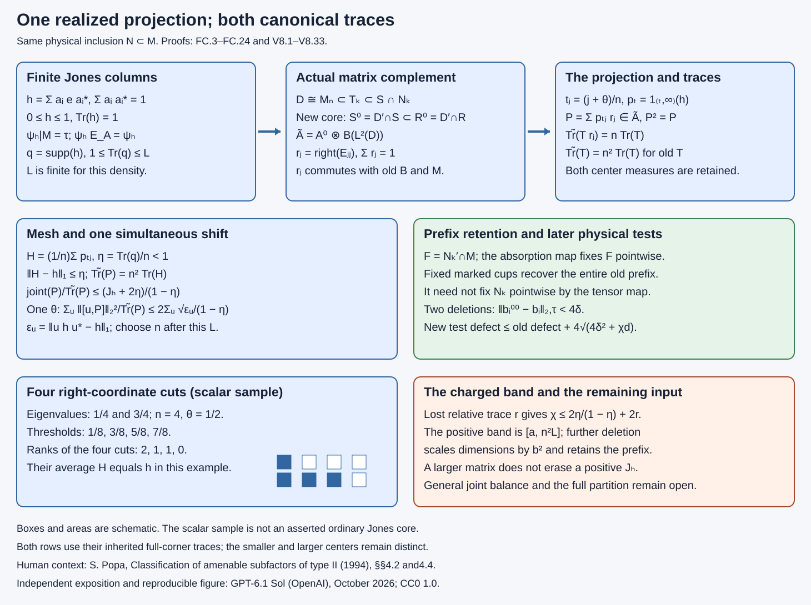

Figure V8.1. A right-coordinate stack realizes the sum of spectral cuts as one actual projection. The two trace factors are \(n\) per right coordinate and \(n^2\) on the old algebra. The lower panels state the prefix and test-preservation mechanisms and the remaining joint input. Rectangles are coordinate diagrams, not areas proportional to canonical trace. Proofs: FC.3–FC.24 and V8.1–V8.33. Human context: Popa (1994), §§4.2 and4.4, printed pp.213–217 and220–222. [Open the full figure](figures/spectral-stack-and-prefix-v8.svg) or use its [editable source](figures/spectral-stack-and-prefix-v8.py).

## V9.1. The joint defect is the norm of the original state discrepancy

Retain the actual core and the original expectations:
\(U=Z(S)\), \(V=Z(R)\), \(D_0=U\vee V\), \(Q=E_U\), and \(P_0=E_V\).
The full-corner identification is \(\iota:D_0\to Z(A)\vee Z(B)\).
For an actual compatible \(M\)-central state \(\varphi\), put
\(\alpha(t)=\varphi(\iota(t))\) and \(\gamma=\alpha P_0\).
These are bounded functionals on the original algebra, including when they are singular.
For a common identity-containing basis \((b_i)\), set
\[
\begin{gathered}
g=\sum_i b_i^*b_i,\quad z=E_{N'\cap M}(g),\\
w=d^{-1}E_{D_0}(g),\quad \ell=d^{-1}E_{D_0}(z),\\
\mathfrak a=\iota\bigl(dQ(|w-\ell|)\bigr).
\end{gathered}
\tag{V9.1}
\]
These are the original cost and density labels of [82.11–82.13](finite-cup-densities-and-positive-cost.md). In particular \(d^{-1}1\le w\le (b_d/d)1\), where \(b_d=1+d(\lceil d\rceil-1)\).

**Proposition V9.1.** Every such state satisfies
\[
\begin{gathered}
\gamma(t)=\alpha((\ell/w)t),\\
\Delta(\varphi):=\|\alpha-\alpha P_0\|
=\alpha(|1-\ell/w|),\\
\Delta(\varphi)\le\varphi(\mathfrak a)
=d\alpha\bigl(w|1-\ell/w|\bigr)
\le b_d\Delta(\varphi).
\end{gathered}
\tag{V9.2}
\]
Thus zero original cost and zero original joint discrepancy are exactly the same requirement. Together with V8.9, this identifies the missing input for simultaneous small \(J_h\) and physical centrality, without assuming that it exists.

**Proof.** Compatibility gives \(\alpha=\nu Q\). The actual basis transfer of68.2 sends \(\iota(t)\) to the central lift of \(dP_0(wt)\). Physical centrality turns its state value into \(\varphi(\iota(t)g)\). The norm averages of81.2 replace \(g\) by \(z\): \(\iota(t)\) commutes with \(N\), each conjugate has the same state pairing, and a bounded functional is norm continuous even when singular. Since \(z\in N'\cap M\subset R\), it commutes with both generators of \(A\). Canonical corner compression followed by compatibility gives \(\varphi(\iota(t)z)=d\alpha(\ell t)\). Consequently \(\gamma(wt)=\alpha(\ell t)\); the bounded inverse of \(w\) gives the first line of(V9.2).

For a bounded real \(v\) in an abelian von Neumann algebra, the functional \(t\mapsto\alpha(vt)\) has norm \(\alpha(|v|)\). Its positive and negative parts give the upper bound; evaluation at the bounded sign function gives equality. Apply this to \(v=1-\ell/w\). Compatibility gives \(\varphi(\mathfrak a)=d\alpha(|w-\ell|)\), and the bounds on \(w\) give the last line. All tests are bounded original-algebra elements. \(\square\)

## V9.2. Endpoint density forces an actual physical projection

An unequal-trace diagonal inclusion does not provide a positive-defect counterexample. Its physical dual density forces a stronger operator identity, for every ordinary tunnel.

**Lemma V9.2 — projection rigidity.** In a finite tracial von Neumann algebra, if \(f\) is a projection and the trace-preserving conditional expectation onto a subalgebra \(C\) satisfies \(E_C(f)=c\) for a projection \(c\in C\), then \(f=c\).

**Proof.** Trace preservation gives \(\tau(f)=\tau(c)\), and trace adjointness gives \(\tau(fc)=\tau(E_C(f)c)=\tau(c)\). Hence
\[
\|f-c\|_{2,\tau}^2
=\tau(f)+\tau(c)-2\operatorname{Re}\tau(fc)=0.
\tag{V9.3}
\]
Faithfulness gives equality of the physical operators. No state normality or amenability hypothesis is used. \(\square\)

For \(d>4\), write \(t=(1-\sqrt{1-4/d})/2\) and \(s=1-t\).
The actual cup density computed in [T.5–T.7](cup-tail-commutants-and-central-comparison.md) is
\[
k_F=(s/t)f+(t/s)(1-f),\qquad \tau(f)=t.
\tag{V9.4}
\]
The complete finite cup reduction82.5 gives \(E_C(k_F)=k_C\), where \(C=N'\cap M\) and \(k_C\) is the ambient normalized dual-trace density.

**Theorem V9.3 — endpoint correction in every actual core.** Suppose this actual ambient density is
\[
k_C=(s/t)c+(t/s)(1-c)
\quad\text{for a projection }c\in C.
\tag{V9.5}
\]
Then the actual smaller-trace cup atom is \(f=c\), for every ordinary tunnel. Moreover
\[
\begin{gathered}
k_F=k_C=k_0,\quad k_0=E_{S'\cap R}(k_F),\\
w=\ell,\quad \mathfrak a=0,\quad
\alpha=\alpha P_0
\end{gathered}
\tag{V9.6}
\]
for every available compatible \(M\)-central state, including singular states. The canonical rescaled core expectation and the restricted ambient rescaled expectation agree on all of \(R\).

**Proof.** Subtract the common scalar term in \(E_C(k_F)=k_C\). Since \(s/t\ne t/s\), (V9.4)–(V9.5) give \(E_C(f)=c\). Lemma V9.2 proves \(f=c\). Since \(C\subset S'\cap R\), conditional expectation onto that relative commutant fixes \(k_C\), proving the first line of(V9.6). The two original joint labels are therefore identical, so the cost vanishes. Proposition V9.1 gives the state identity. Equality of the two rescaled expectations is precisely82.4, now with its actual density equality proved. \(\square\)

This applies to the concrete inclusion of [HC9, C15–C17](hyperfinite-corners-and-diagonal-indices.md). Let \(\mathcal H\) be the separable hyperfinite II₁ factor, \(\tau(c)=t\), and let \(\vartheta:c\mathcal Hc\to(1-c)\mathcal H(1-c)\) preserve normalized corner traces. Put
\[
N=\{x+\vartheta(x):x\in c\mathcal Hc\}
\subset M=\mathcal H.
\tag{V9.7}
\]
Its index is \(d=1/t+1/s\). Its relative commutant is \(\mathbb Cc\oplus\mathbb C(1-c)\): the diagonal corners are scalar because the corresponding physical corner inclusions are identities. A nonzero off-diagonal commuting operator would, by polar decomposition, yield a partial isometry with initial projection \(1-c\) and final projection \(c\); their unequal traces rule this out.

The module dimensions C17 are \(1/t\) and \(1/s\). Standard conjugation transfers them to the corresponding right-module projection dimensions. Dividing by \(d\) gives the normalized dual weights \(s,t\), whereas the physical weights are \(t,s\). Thus its density is exactly(V9.5). The table records both traces without renormalizing either corner separately:

| Physical projection | Inherited \(\tau\) | Normalized ambient dual trace |
| --- | ---: | ---: |
| \(c\) | \(t\) | \(s\) |
| \(1-c\) | \(s\) | \(t\) |

The conclusion(V9.6) is unconditional for these actual operators; it does not depend on a universal-amenability argument for(V9.7). Theorem V9.5 below constructs a compatible hypertrace for every smooth representation of this family. V8.9 then supplies finite coisometric Jones columns with simultaneous small \(J_h\) and physical centrality in this example. It supplies neither the marked corner chains nor the full residual partition for an arbitrary inclusion. For \(d=4\), T.4 already gives \(k_F=k_C=1\) and zero cost.

## V9.3. The singular abelian identities alone still allow positive defect

The endpoint proof uses an actual physical projection and a faithful inherited trace. Those are extra data beyond the marginal and twisted state identities. Here is an exact counterexample to deriving zero defect from those identities alone.

Let \(D_0=\ell^\infty(\mathbb N_0\times\{0,1\})\), with probability trace
\[
\mu(j,0)=2^{-j}/3,\qquad \mu(j,1)=2^{-j-1}/3.
\tag{V9.8}
\]
The smaller label of \((j,0)\) is \(s_j\), and that of \((j,1)\) is \(s_{j+1}\). Both atoms have larger label \(r_j\). Their label algebras \(U,V\) generate \(D_0\). The inherited expectations are
\[
\begin{gathered}
(P_0x)(r_j)=\tfrac23x(j,0)+\tfrac13x(j,1),\\
(Qx)(s_0)=x(0,0),\\
(Qx)(s_k)=\tfrac12x(k,0)+\tfrac12x(k-1,1)\quad(k\ge1).
\end{gathered}
\tag{V9.9}
\]
Put \(w=1\) and
\[
\ell(0,0)=1,\quad\ell(j,0)=4/3\ (j\ge1),
\quad\ell(j,1)=2/3\ (j\ge0).
\tag{V9.10}
\]
Then \(Qw=P_0w=Q\ell=1\), while \(P_0\ell\) equals \(8/9\) at \(r_0\) and \(10/9\) at every other \(r_j\).

For \(L\ge2\), let \(f_L(s_k)=2^k\) for \(k<L\), and zero otherwise. Its mass is \(c_L=(2L-1)/3\). The normal states \(\alpha_L(x)=\tau(f_Lx)/c_L\) satisfy \(\alpha_L=\alpha_LQ\), and
\[
\begin{gathered}
\|\alpha_LP_0-\ell\alpha_L\|
=\frac4{3(2L-1)},\\
\alpha_L(|1-\ell|)
=\frac{2(L-1)}{3(2L-1)}.
\end{gathered}
\tag{V9.11}
\]
Here \(\ell\alpha_L\) denotes \(x\mapsto\alpha_L(\ell x)\). Before division by \(c_L\), the densities \(P_0f_L\) and \(\ell f_L\) differ on exactly \((0,0),(L-1,0),(L-1,1)\); their absolute weighted differences are \(1/9,2/9,1/9\). Every other atom cancels. The second formula counts \(L-1\) active atoms of each type, each contributing \(1/9\). This proves both identities, including the case \(L=2\).

A weak-star cluster state \(\alpha\) therefore satisfies the exact identities
\[
\alpha=\alpha Q,\qquad
\alpha P_0=\ell\alpha,\qquad
\|\alpha-\alpha P_0\|=1/3.
\tag{V9.12}
\]
The last equality follows from the sign-test norm formula and the fixed bounded test \(|1-\ell|\) in(V9.11). Every finite set of atoms has mass tending to zero; hence \(\alpha\) is singular relative to the inherited atomic trace. A normal state would be the sum of its point masses, which here all vanish.

In its abelian GNS completion, quotienting by the common null ideal makes both \(\alpha\) and \(\ell\alpha\) faithful normal traces, since \(2/3\le\ell\le4/3\). The original discrepancy remains \(1/3\) on the original bounded tests. Normality in that completion does not identify the original \(P_0\) with the \(\alpha\)-preserving expectation. This model supplies no physical \(N\subset M\), actual Jones core or smooth representation. It refutes the abelian-only deduction, and leaves the original unrestricted amenability assertion intact.

## V9.4. Two further constraints use the actual finite ambient density

**Proposition V9.4 — scalar density and a quantitative bound.** In the actual index-above-four pair, put \(r=t/s>0\), \(k_C=E_C(k_F)\), and \(\Delta_C=\tau(|k_C-1|)\). Every compatible \(M\)-central state satisfies
\[
\varphi(\mathfrak a)
\le d\bigl(\sqrt{\Delta_C/r}+\Delta_C\bigr).
\tag{V9.13}
\]
In particular \(k_C=1\) forces zero original cost and exact original joint balance, even for singular states and nonfactor cores. Amenability then supplies the required finite columns through V8.9 in this scalar-density branch.

**Proof.** Put \(\delta=\alpha(|\ell-1|)\). The actual cup spectrum gives \(w=E_{D_0}(k_F)\ge r1\). Since \(Qw=1\), \(\alpha=\alpha Q\) and \(\alpha(\ell/w)=1\),
\[
0\le\alpha((w-1)^2/w)
=\alpha((1-\ell)/w)\le\delta/r.
\tag{V9.14}
\]
State Cauchy–Schwarz applied to \(|w-1|/\sqrt w\) and \(\sqrt w\) gives \(\alpha(|w-1|)\le\sqrt{\delta/r}\). Thus(V9.2) and the triangle inequality bound the cost by \(d(\sqrt{\delta/r}+\delta)\). Positivity gives \(|\ell-1|\le E_{D_0}|k_C-1|\). Because \(|k_C-1|\in C\), its expectation onto the factor \(N\) is the scalar \(\Delta_C\). Expectation onto \(U\subset N\), followed by \(\alpha=\alpha Q\), therefore gives \(\delta\le\Delta_C\). This proves(V9.13) with original bounded tests throughout. \(\square\)

The abelian witness cannot simply be promoted to a matching physical model with two ambient density values. Suppose a faithful tracial extension of its \(D_0\) had \(C\) commuting with \(D_0\), projections \(c_++c_-=1\),
\(k_C=(4/3)c_++(2/3)c_-\), and an actual cup projection \(f\), satisfying
\[
E_{D_0}(k_C)=\ell,\qquad
E_C(f)=\frac{k_C-r}{R_*-r},\qquad
E_{D_0}(f)=\frac{1-r}{R_*-r}1,
\quad 0<r<1<R_*.
\tag{V9.15}
\]
Trace normalization forces \(\tau(c_+)=\tau(c_-)=1/2\). For \(z=1_{\{\varepsilon=1\}}\in D_0\), \(\tau(z)=1/3\) and \(E_{D_0}(c_+)z=0\), because \(\ell=2/3\) there. Faithfulness and commutation give \(z\le c_-\). Positivity now forces
\[
\frac{1-r}{3(R_*-r)}=\tau(zf)
\le\tau(c_-f)
=\frac{2/3-r}{2(R_*-r)}
\quad\Longrightarrow\quad r/6\le0.
\tag{V9.16}
\]
This contradicts the actual positive lower radius \(r>0\). The comparison follows by sandwiching \(c_--z\ge0\) with \(f\), so it does not assume that \(f\) commutes with either algebra. It rules out this precise physical realization; other ambient spectra and the unrestricted joint-state problem remain to be analyzed.

## V9.5. The diagonal family satisfies the full smooth-representation hypothesis

We can also verify amenability for the actual hyperfinite diagonal family(V9.7), rather than assume it from amenability in one chosen core. Let
\(\mathcal U\subset_E\mathcal V\) be **any** smooth normal nondegenerate expected representation of this physical \(N\subset M\). Thus \(E|_M=E_N\), \(\overline{\operatorname{span}(M\mathcal U)}^{\,w}=\mathcal V\), and the original \(N'\cap M_j\) commutes with \(\mathcal U\) at every represented physical tower level. The exact source definition is Popa (1994), Definition3.1.1, printed p.203; the representation convention is Definition2.1.1, printed p.191.

**Theorem V9.5.** For every such representation there is a possibly nonnormal conditional expectation \(F:\mathcal V\to M\) such that
\[
F(\mathcal U)\subset N,\qquad E_NF=FE.
\tag{V9.17}
\]
Consequently \(\tau F\) is a compatible \(M\)-central state with the exact physical trace. The diagonal inclusion is amenable under the unrestricted all-smooth quantifier. Its simultaneous finite-column joint-balance input follows from V9.3 and V8.9 in every actual ordinary core.

**Proof of the represented corner maps.** Write \(c'=1-c\) and retain the physical corner isomorphism \(\vartheta\). Smoothness at degree zero gives \([c,\mathcal U]=0\). Since \(cMc=Nc\), nondegeneracy gives \(c\mathcal Vc=\mathcal Uc\): on a spanning term \(mu\), compression is \((cmc)(uc)\), which lies in \(\mathcal Uc\). The map \(u\mapsto uc\) is a faithful normal homomorphism. Indeed \(E(c)=t1\), so \(uc=0\) implies \(0=E(u^*cu)=tu^*u\). Its range is therefore ultraweakly closed. The same argument gives \(c'\mathcal Vc'=\mathcal Uc'\). Hence
\(\widetilde\vartheta(uc)=uc'\) is a normal isomorphism between these represented corners, extending the physical \(\vartheta\).

**Proof of the semifinite expectation.** Stabilize with \(\mathcal B=B(\ell^2(\mathbb N))\), and write \(M^\infty=M\bar\otimes\mathcal B\), \(\mathcal V^\infty=\mathcal V\bar\otimes\mathcal B\), \(c^\infty=c\otimes1\), and similarly \(c'^\infty\). There is \(v\in M^\infty\) with \(v^*v=c^\infty\) and \(vv^*=c'^\infty\). To construct it even for irrational \(t\), match the ordered finite projections \(c\otimes e_{nn}\) and \(c'\otimes e_{nn}\). At each step cut the larger remaining piece to the smaller piece's trace and compare the two in a finite matrix corner over \(M\). At least one piece is exhausted at each step; no finite piece can absorb infinitely many complete opposite pieces of fixed positive trace. The matched pieces exhaust both infinite projections. The strong sum of their partial isometries is \(v\).

Put \(P=c^\infty M^\infty c^\infty\) and \(\widetilde P=c^\infty\mathcal V^\infty c^\infty\). We first construct a UCP projection \(\beta_0:\widetilde P\to P\). The complete HC4–HC7 construction gives increasing full matrix algebras \(H_j\) generating the finite hyperfinite corner \(cMc\). Decompose \(c\mathcal Vc=H_j\bar\otimes(H_j'\cap c\mathcal Vc)\). Extend the normalized trace of \(H_j'\cap cMc\) to a state on the larger complementary algebra. Applying that state to finite matrix coefficients gives a UCP map into \(H_j\), whose restriction to \(cMc\) is its trace expectation onto \(H_j\). A point-ultraweak cluster has range in \(cMc\) and fixes every physical element, because those trace expectations converge in physical \(L^2\), hence ultraweakly. It gives a UCP projection \(\beta^{\mathrm{fin}}:c\mathcal Vc\to cMc\). Apply it entrywise to the \(\mathcal B\)-matrix coefficients. Complete positivity bounds every finite compression by the original norm, so the entries define one bounded operator in \(P\). This constructs \(\beta_0\) and shows it fixes all of \(P\). No tracial state on the type II∞ algebra is needed.

**Proof of the cyclic averaging and finite return.** The automorphism
\(\widetilde a=\operatorname{Ad}(v^*)\circ(\widetilde\vartheta\bar\otimes\mathrm{id})\) of \(\widetilde P\) restricts to an automorphism \(a\) of \(P\). Its physical semifinite trace scale is \(s/t\). Define
\[
\beta_L=\frac1L\sum_{n=0}^{L-1}a^{-n}\beta_0\widetilde a^n,
\qquad
\|a^{-1}\beta_L\widetilde a(X)-\beta_L(X)\|
\le\frac{2\|X\|}{L}.
\tag{V9.18}
\]
Each map is UCP and fixes \(P\). Product weak-star compactness of output balls gives a point-ultraweak cluster \(\beta\). Normality of \(a\) passes the displayed relation to \(\beta\widetilde a=a\beta\). The resulting UCP projection is \(P\)-bimodular by the multiplicative-domain identity for a map fixing a unital star subalgebra.

The two columns \(v_1=c^\infty,v_2=v\) have orthogonal range projections summing to one and the same initial projection. Their coefficients identify the stabilized algebras with \(M_2(\widetilde P)\) and \(M_2(P)\). Thus
\[
F^\infty(X)=\sum_{i,j=1}^2
v_i\beta(v_i^*Xv_j)v_j^*
\tag{V9.19}
\]
is a UCP projection onto \(M^\infty\). For \(u\in\mathcal U\bar\otimes\mathcal B\), the off-diagonal coefficients vanish because \(u\) commutes with \(c^\infty\). The diagonal coefficients are \(uc^\infty\) and \(\widetilde a(uc^\infty)\). Equivariance gives
\(F^\infty(u)=\beta(uc^\infty)+(\vartheta\bar\otimes\mathrm{id})(\beta(uc^\infty))\in N\bar\otimes\mathcal B\).
Compress by \(h=1\otimes e_{00}\in N\bar\otimes\mathcal B\). Since \(F^\infty\) fixes \(M^\infty\), bimodularity makes its restriction to \(h\mathcal V^\infty h\) a UCP conditional expectation \(F:\mathcal V\to M\), with \(F(\mathcal U)\subset N\).

Finally choose a complete finite partial orthonormal physical basis \((b_i)\) for \(M/N\), and put \(u_i=E(b_i^*X)\in\mathcal U\). The normal finite basis row fixes \(M\mathcal U\), so nondegeneracy gives \(X=\sum_i b_i u_i\) on all of \(\mathcal V\). Bimodularity and \(F(u_i)\in N\) yield
\[
E_NF(X)=\sum_i E_N(b_i)F(u_i)
=F\left(\sum_iE_N(b_i)u_i\right)=FE(X).
\tag{V9.20}
\]
The state \(\tau F\) is \(M\)-central because \(F\) is \(M\)-bimodular, and is compatible by(V9.20). This proves the full source definition for the arbitrary smooth representation. The same argument works at \(t=1/2\); the trace scale is then one. The endpoint cost uses T.4 there, as already stated. \(\square\)

The stabilization, state extension, multiplicative domain and compactness used here retain their standard programme prerequisites. The argument constructs the expectations and the actual finite return; it does not infer full amenability merely from a generating core or from the hyperfiniteness of the two physical factors. It closes this diagonal example and leaves the unrestricted nonextremal problem for other inclusions, marked corner chains and full residual partition at their original scope.

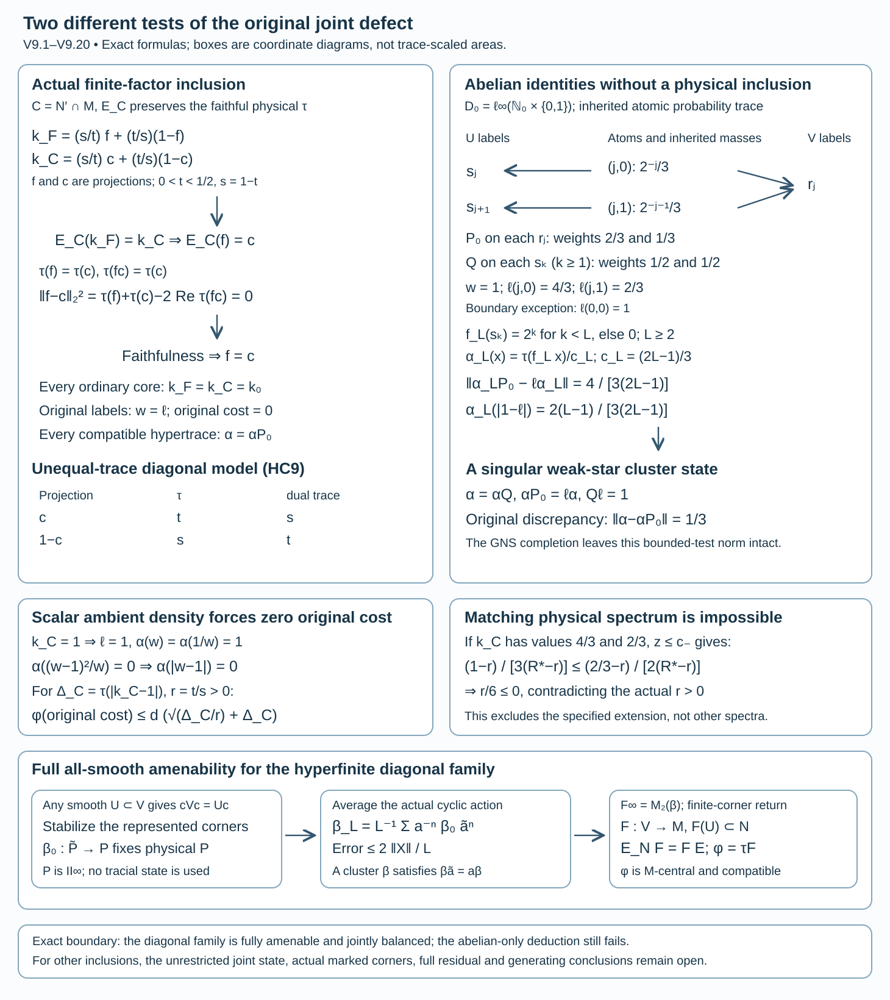

Figure V9.1. The left panel uses actual physical projections and the inherited trace; the right panel is an abelian witness with no physical inclusion. The lower panels show the scalar-density bound and the obstruction to its matching physical realization. The weights, expectation coefficients and defect formulas are exact. The arrows identify maps and deductions, not geometric lengths or trace-scaled areas. Proof locators: V9.1–V9.20, including the full smooth-representation averaging in the lower panel. Mathematical context and exact programme providers are linked above. [Full figure](figures/joint-endpoint-and-singular-witness-v9.svg), [editable source](figures/joint-endpoint-and-singular-witness-v9.py).

## V10.1. Right moves act on Jones rows, and can destroy physical centrality

The finite-column proof allows a varying finite number of columns. Requiring their right sum to equal one is stronger than the original joint condition. A proposed right-column averaging argument must also retain the physical targets. We give an actual fully amenable Jones model in which an arbitrary such move fails to do so.

Retain the original expected pair \(A\subset_{E_A}B\), the cup \(e=e_R^M\), and a coisometric row \(a=(a_i)_{i=1}^L\subset N\). Put
\[
\begin{gathered}
\sum_i a_i a_i^*=1,\qquad h_a=\sum_i a_i e a_i^*,\\
g_a=\sum_i a_i^*a_i,\qquad
\zeta_a=E_{Z(S)}^N(g_a),\\
J_a=\|\zeta_a-P_0\zeta_a\|_1.
\end{gathered}
\tag{V10.1}
\]
The original trace, expected-square identities and full-center norm are those of FC.3–FC.7 and V8.8. If \(v\in\mathcal U(N)\), the row \(av=(a_i v)_i\) remains coisometric and \(g_{av}=v^*g_av\). A probability-weighted concatenation of such rows has right sum equal to the corresponding convex average of these conjugates. It preserves the exact physical marginal and expectation compatibility. These identities alone give no estimate for a previously controlled physical commutator.

When \(v\in S\), the cup commutes with \(v\), so \(h_{av}=h_a\). Trace pairing against every \(z\in Z(S)\) also gives \(\tau(v^*g_avz)=\tau(g_az)\); thus \(\zeta\) and \(J\) are unchanged. A right move that changes the joint profile must therefore use additional operators or data.

### An ordinary index-four tensor-strip tunnel

Let
\[
\begin{gathered}
Q=\overline{\bigotimes_{j\ge0}(M_2^{(q_j)},\operatorname{tr}_2)}^{\,w},\qquad
D=\overline{\bigotimes_{j\ge1}(M_2^{(d_j)},\operatorname{tr}_2)}^{\,w},\\
M=Q\bar\otimes D,\qquad
N=1_{q_0}\otimes Q_{\ge1}\bar\otimes D.
\end{gathered}
\tag{V10.2}
\]
The closures are in the product-trace GNS representations. These are hyperfinite II₁ factors: finite tensor expectations converge in \(L^2\), and the expectation of a central element onto each finite full matrix algebra is scalar. The unbounded matrix degrees exclude finite-dimensional factors. The inclusion has index four, by the four-dimensional scalar-base space \(L^2(M_2,\operatorname{tr}_2)\). It has full all-smooth amenability by GTB.6a, applied with the physical factor \(Q_{\ge1}\bar\otimes D\), which has an increasing \(L^2\)-dense sequence of full matrix algebras. That lemma constructs a compatible state for every smooth expected representation.

Set \(L_j=1_{q_0,\ldots,q_{j-1}}\otimes Q_{\ge j}\bar\otimes D\), so \(L_0=M,L_1=N\). The adjacent cups are the actual Bell projections
\[
f_j=\frac12\sum_{a,b=1}^2 E_{ab}^{(q_j)}E_{ab}^{(q_{j+1})}.
\tag{V10.3}
\]
Compression of \(1\otimes x\) in these two coordinates gives \(f_j(1\otimes x)f_j=\operatorname{tr}_2(x)f_j\), and partial trace gives \(E_{L_{j+1}}(f_j)=1/4\). Moreover

\[
(1\otimes E_{ai})f_j(1\otimes E_{jb})
=\tfrac12E_{ij}\otimes E_{ab}.
\tag{V10.4}
\]
Together with the untouched tail, these words generate \(L_j\). Thus each triple is the actual tracial basic construction, with its inherited Markov trace and index four. The relative commutants are the removed finite \(Q\)-legs; their closures give the ordinary core
\[
R=Q\otimes1_D,\qquad S=1_{q_0}\otimes Q_{\ge1}\otimes1_D.
\tag{V10.5}
\]
Both centers are scalar. Consequently every coisometric row in this example has \(J_a=0\).

On \(L^2(M)=L^2(Q)\otimes L^2(D)\), the core cup is \(e=1\otimes e_{\mathbb C}^D\), where \(e_{\mathbb C}^D\) projects onto the trace vector. Left \(D\) and this projection generate \(B(L^2(D))\): their commutant is contained in right \(D\), and commutation with the trace-vector projection forces the right multiplier to be scalar. Hence the actual pair is
\[
\begin{gathered}
A=1_{L^2(M_2^{(q_0)})}\otimes L(Q_{\ge1})\bar\otimes B(L^2(D)),\\
B=L(Q)\bar\otimes B(L^2(D)).
\end{gathered}
\tag{V10.6}
\]
Its canonical traces are \(\tau_{Q_{\ge1}}\otimes\operatorname{Tr}_{L^2(D)}\) and \(\tau_Q\otimes\operatorname{Tr}_{L^2(D)}\), respectively. They agree on \(A\) and give \(\operatorname{Tr}(e)=1\). The canonical \(E_A\) is normalized partial trace on the left \(q_0\)-leg.

### Balanced rows with vanishing physical defects

Let \(F_m=\bigotimes_{j=1}^m M_2^{(d_j)}\cong M_{k_m}\), \(k_m=2^m\), and let \(W_{m,r,t}\), \(0\le r,t<k_m\), be its clock-and-shift Weyl unitaries. The row \(a_{m,r,t}=k_m^{-1}W_{m,r,t}\) has both physical sums one. Its \(k_m^2\) vectors \(W_{m,r,t}\Omega_D\) form an orthonormal basis of \(L^2(F_m)\), so
\[
\begin{gathered}
h_m=k_m^{-2}q_m,\\
q_m=1_{L^2(Q)}\otimes P_{L^2(F_m)\otimes\Omega_{D_{>m}}},\\
\operatorname{Tr}(q_m)=k_m^2,\qquad\operatorname{Tr}(h_m)=1.
\end{gathered}
\tag{V10.7}
\]
These densities commute with physical \(Q\bar\otimes F_m\), and have exact physical marginal and expectation compatibility.

For every fixed physical unitary \(u\in M\), put \(x_m=E_{Q\bar\otimes F_m}^M(u)\). Then \(x_m\to u\) in \(L^2(\tau)\) and \([x_m,h_m]=0\). The existing finite trace inequalities and the exact marginal give
\[
\begin{gathered}
\|(u-x_m)h_m\|_1\le\|u-x_m\|_{2,\tau},\\
\|h_m(u-x_m)\|_1\le\|u-x_m\|_{2,\tau},\\
\|u h_m u^*-h_m\|_1
\le2\|u-x_m\|_{2,\tau}\longrightarrow0.
\end{gathered}
\tag{V10.8}
\]
For example, the first inequality factors through \(h_m^{1/2}\): its two Hilbert-Schmidt norms are \(\|u-x_m\|_{2,\tau}\) and one. The second uses \(\tau(xx^*)=\tau(x^*x)\). The same sequence controls every finite target list. Its finite column count varies with \(m\).

Fix \(s=\operatorname{diag}(1,-1)\) in the \(q_1\)-leg. Let \(v_m\in N\) be the flip of that defining coordinate with the fresh \(d_{m+1}\)-leg, and let \(z_m\) be the corresponding trace-zero diagonal unitary in that fresh leg. Then \(v_m^*sv_m=z_m\), and \(v_m\) commutes with all the old \(W_{m,r,t}\). Applying this right move to the actual row gives
\[
h_m'=v_m h_m v_m^*=k_m^{-2}q_m',\qquad q_m'=v_mq_mv_m^*.
\tag{V10.9}
\]
It still has both row sums one, \(J=0\), exact compatibility and the physical marginal. But the fresh trace-vector coordinate gives \(q_mz_mq_m=0\), hence \(q_m'sq_m'=0\). The projections \(q_m'\) and \(sq_m's^*\) are therefore orthogonal, each of canonical trace \(k_m^2\). Thus
\[
\|s h_m's^*-h_m'\|_1=2\quad\text{for every }m.
\tag{V10.10}
\]
Before the move the same target has defect zero, and (V10.8) makes every other fixed finite-list defect tend to zero. This disproves a target-preservation estimate tending to zero for an arbitrary right move chosen after the row. It does not say that every useful choice of a move must fail.

There is also a failure at the level of the proposed map. The rows \(a_m\) and \(s a_m\) have the identical initial density, because \(s\) commutes with \(h_m\). After the same right move they give \(h_m'\) and \(s h_m's^*\), at distance two. Right-column multiplication therefore acts on rows, rather than on their density alone. A compact state argument must retain the row or another object that determines the operation.

## V10.2. Right-sum-one rows miss actual compatible balanced states

Use the same fully amenable ordinary core. Split \(D=M_2^{(d_1)}\bar\otimes D_{>1}\), and put \(p=E_{11}^{(d_1)}\), \(c_1=E_{11}^{(d_1)}\), \(c_2=E_{21}^{(d_1)}\). Then
\[
\sum_i c_ic_i^*=1,\qquad \sum_i c_i^*c_i=2p.
\tag{V10.11}
\]
Concatenate these columns with the Weyl row on the first \(m\) legs of \(D_{>1}\). Directly on the first matrix standard space, \(\sum_i c_i e_{\mathbb C}c_i^*=\tfrac12\rho_{d_1}(p)\). Thus its density is
\[
\bar h_m=1_{L^2(Q)}\otimes\tfrac12\rho_{d_1}(p)
\otimes k_m^{-2}P_{L^2(F_m)\otimes\Omega_{\mathrm{rest}}}.
\tag{V10.12}
\]
Here \(\rho\) denotes right multiplication, and \(F_m\) now lies in \(D_{>1}\). The right projection has ordinary rank two, so this density has canonical trace one. It commutes with physical \(Q\), the entire left \(d_1\)-matrix leg and left \(F_m\). Its exact left row sum gives the physical marginal and compatibility. Applying the proof of (V10.8) to these increasing physical algebras gives vanishing defects for every fixed physical target.

The fixed bounded projection \(T=\rho_D(p)\) belongs to \(A\subset B\), since the \(D\)-coordinate in (V10.6) is all of \(B(L^2(D))\). We have
\[
\operatorname{Tr}(\bar h_mT)=1.
\tag{V10.13}
\]
For any finite coisometric row \(a\subset N\), the finite vector identity (FC.5), and commutation of \(T\) with left \(M\), instead give
\[
\operatorname{Tr}(h_aT)=\tau(g_ap).
\tag{V10.14}
\]
In particular every row with right sum \(g_a=1\) gives value \(1/2\). Random-unitary rows \((\sqrt{\theta_j}u_j)_j\) are a special case of this stronger class.

A weak-star cluster of the states of \(\bar h_m\) is compatible, \(M\)-central, and restricts to the original physical trace. Its value on the single fixed \(T\) is one. It therefore lies outside the weak-star closure of every right-sum-one row, including every random-unitary row. Since the actual core centers are scalar, it already satisfies the original joint identity. Equation (V10.7) supplies a different suitable balanced state in this same inclusion. The counterexample concerns approximation of an arbitrary state by the stronger row class; it does not refute existence of a suitable joint-balanced state.

## V10.3. The exact compact obstruction retains the unrestricted target

Return to the original arbitrary core, with potentially singular center states and arbitrary finite column count. Let \(\mathcal X\) be the normal states of all coisometric finite Jones rows, and define
\[
K_\epsilon=\overline{\{\psi_a\in\mathcal X:J_a\le\epsilon\}}^{\,w^*},\qquad
K_{\mathrm{bal}}=\bigcap_{\epsilon>0}K_\epsilon.
\tag{V10.15}
\]
Each set is nonempty, compact and convex. The single row \(a=1\) has zero joint defect; concatenation with square-root probability weights preserves coisometry and makes \(J\) a convex norm of its linear center coordinate. Exact physical marginal and expectation compatibility pass to weak-star limits. The actual center pairing of V8.8 proves that every \(\varphi\in K_{\mathrm{bal}}\) satisfies
\[
\varphi(\iota(t))=\varphi(\iota(P_0t))\quad(t\in D_0).
\tag{V10.16}
\]

Conversely, every compatible original-trace state satisfying (V10.16) lies in \(K_{\mathrm{bal}}\). Use the full finite-column weak-star approximation of FC.8–FC.9. Include both its physical marginal discrepancy and its original joint discrepancy in the predual coordinate list, along with any chosen finite scalar tests. Their targets are zero, by the hypotheses on this particular state. Convex weak/norm closure equality makes both predual norms arbitrarily small. The mixed cup column has zero joint coordinate. The exact left-row correction of FC.14–FC.18 costs at most \(2\sqrt\delta\) in state norm, hence at most \(4\sqrt\delta\) in the difference of two bounded center restrictions. Therefore rows can approximate the finite tests with \(J<\delta+4\sqrt\delta\). Letting \(\delta\) be small enough for each \(\epsilon>0\) proves the converse. This argument applies to a singular state; it does not declare the joint coordinate of an arbitrary central state to have target zero.

There is an exact finite alternative. Either \(K_{\mathrm{bal}}\) contains an \(M\)-central state, or there are finitely many physical unitaries \(u_j\), self-adjoint \(T_j\in B\), and \(\epsilon_0,c_0>0\) such that every finite coisometric row with \(J_a\le\epsilon_0\) satisfies
\[
\operatorname{Tr}\left(h_a H\right)\ge c_0,
\qquad H=\sum_j(u_j^*T_ju_j-T_j).
\tag{V10.17}
\]

**Proof.** Centrality is the family of closed real affine equations \(\varphi(u^*Tu-T)=0\). If their intersection with the compact \(K_{\mathrm{bal}}\) is empty, a finite family is already inconsistent. Its image in finite real coordinate space is compact and convex and misses zero. Strict finite-dimensional separation gives a real linear combination positive by \(c>0\); absorb its coefficients into the self-adjoint \(T_j\). For this fixed \(H\), some \(K_{\epsilon_0}\) already has \(\varphi(H)\ge c/2\) throughout. Otherwise states with value below \(c/2\) in the nested \(K_{1/n}\) have a cluster in their intersection, contradicting separation there. This proves (V10.17) with \(c_0=c/2\). Conversely an \(M\)-central state in \(K_{\mathrm{bal}}\) precludes (V10.17), by the converse approximation above with the fixed test \(H\). \(\square\)

For a finite approximation of a central member, convex separation applied also to its physical commutator predual coordinates gives the simultaneous estimates of V8.9:
\[
J_a<\eta,\qquad
\|u h_a u^*-h_a\|_1<\eta
\quad(u\text{ in the prescribed finite physical list}).
\tag{V10.18}
\]
Thus the compact formulation retains the exact original target, every singular branch and varying finite row length. The unrestricted all-smooth hypothesis must still exclude the actual separator (V10.17) or furnish another actual construction of (V10.18). Separate nonempty compact sets of balanced and central states do not establish their intersection. Neither the separator alternative nor the concrete tensor example is substituted for that missing unrestricted proof. Actual marked corner return, the full residual partition and the entire generating-tunnel scope remain assigned.

Figure V10.1. The displayed algebras and Bell cups are the actual ordinary Jones model (V10.2)–(V10.6). The upper construction has \(k_m^2=4^m\) columns and canonical trace one. The right move exchanges a core defining coordinate with a fresh physical tail coordinate; its fixed physical defect is exactly two. The lower fixed-test values are (V10.13)–(V10.14). The compact alternative is (V10.15)–(V10.18), with no assertion that its separator exists or is excluded in the general amenable case. The boxes are algebra schematics. Human context is Popa's all-smooth amenability definition cited in this lesson. [Editable CC0 figure source](figures/right-column-moves-and-balanced-states-v10.py).

## Physical spectral corners and the original state data

A return from a corner must retain the original expectation and physical trace. The following complete arguments identify two false localization steps and give an actual amenable interior-spectrum model. They retain the unrestricted state question.

## IF.0 — the exact objects retained

Let \(N\subset M\) be the original finite-index II₁ inclusion, with index \(d\), a specified ordinary tunnel, and its actual core \(S\subset R\). On \(L^2(M)\), retain

\[
A=\langle N,e_R^M\rangle\subset B=\langle M,e_R^M\rangle,
\qquad E_A:B\longrightarrow A.
\tag{IF.1}
\]

The physical embeddings of \(N,M\), the original normal expectation \(E_A\), and both inherited canonical semifinite traces are retained. Put \(C=N'\cap M\), \(U=Z(S)\), \(V=Z(R)\), \(D_0=U\vee V\), \(Q=E_U\), \(P_0=E_V\), and let \(\iota:D_0\to Z(A)\vee Z(B)\) be the original full-corner identification. For a common identity-containing finite frame, the original bounded labels and cost are

\[
g=\sum_i b_i^*b_i,\quad z=E_C(g),\quad
w=d^{-1}E_{D_0}(g),\quad \ell=d^{-1}E_{D_0}(z),\quad
\mathfrak a=\iota\bigl(dQ(|w-\ell|)\bigr)\in Z(A)_+.
\tag{IF.2}
\]

The labels are those of [Finite cup densities and a positive central cost](finite-cup-densities-and-positive-cost.md), (82.11)–(82.13), and [General tail supports and controlled tunnels](general-tail-supports-and-controlled-tunnels.md), V9.1. The expectations retain their inherited tracial measures. A compatible hypertrace means a state \(\psi\in B^*\) with

\[
\psi E_A=\psi,\qquad \psi|_M=\tau_M,
\qquad \psi(mx)=\psi(xm)\quad(m\in M, x\in B).
\tag{IF.3}
\]

It may be singular. If the Jones-ideal face is imposed, it remains an additional requirement; no result below replaces it by another support. The physical \(C\) commutes with \(A\): it commutes with \(N\), and \(C\subset R\) commutes with the Jones projection onto \(L^2(R)\). Also \(E_A|_M=E_N\), so for any projection \(c\in C\),

\[
E_A(c)=\tau(c)1.
\tag{IF.4}
\]

For \(d>4\), [The cup, its tail commutants and central comparison](cup-tail-commutants-and-central-comparison.md), T.5–T.8, and [Finite cup densities and a positive central cost](finite-cup-densities-and-positive-cost.md), (82.5), give the actual two-atom universal cup density

\[
k_F=R_* f+r(1-f),\quad R_*r=1,\quad R_*+r+2=d,
\quad E_C(k_F)=k_C.
\tag{IF.5}
\]

The inherited trace is faithful; \(E_C\) is its original normal tracial expectation. No hypertrace is asserted normal relative to that trace.

## IF.1 — every proper physical face has zero reducing part

**Proposition IF.1.** Let \(\mathcal D\) be any unital von Neumann overrepresentation containing the original physical factor \(M\), or its enveloping bidual. If \(c\in M\) is a projection with \(0<t=\tau(c)<1\), then

\[
r\in\mathcal D\cap M',\quad r=r^*=r^2,\quad r\le c
\quad\Longrightarrow\quad r=0.
\tag{IF.6}
\]

The same statement holds if an extra cost spectral constraint \(r\le 1_{[0,\varepsilon]}(\mathfrak a)\), a normal-band constraint, or a Jones-ideal support constraint is imposed.

**Proof.** Commutation with \(M\) gives \(r\le ucu^*\) for every physical unitary \(u\). Hence \(r\le T(c)\) for every finite convex average \(T\) of such conjugations. Norm averaging in the finite factor, as proved in [Relative norm averaging and central densities](relative-norm-averaging-and-central-density.md), Theorem 81.2, with the smaller algebra equal to \(M\), gives averages converging in operator norm to \(t1\). Positivity is norm closed, so \(r\le t1\). If \(r\ne0\), compression by \(r\) gives \(r\le tr\), impossible for \(t<1\). This uses the original norm on bounded physical elements, and remains valid after any faithful normal represented inclusion into a tower or after the canonical embedding into a bidual. Additional support inequalities cannot enlarge the set. \(\square\)

There is also a state obstruction: a state supported by \(c\) has value one on \(c\), whereas every state satisfying the original physical marginal has value \(t\). Thus a literal joint face of a cost cut and a proper physical \(k_C\)-spectral projection cannot carry the desired state. This is true even when \(\mathfrak a=0\). A nonzero **cost-only** reducing face is a different question; IF.6 does not settle it.

## IF.2 — physical conditioning leaves the cost unchanged

**Proposition IF.2.** Let \(\psi\) satisfy IF.3, let \(c\in C\) be a projection, and put \(0<t=\tau(c)<1\). The normalized compressed state

\[
\psi_c(x)=t^{-1}\psi(cxc),\qquad x\in B,
\tag{IF.7}
\]

satisfies the exact identities

\[
\begin{gathered}
\psi_c|_A=\psi|_A,\qquad \psi_cE_A=\psi,
\qquad \psi_c(\mathfrak a)=\psi(\mathfrak a),\\
\psi_c|_M(m)=t^{-1}\tau(cm),\\
\|\psi_c-\psi_cE_A\|=\|\psi_c-\psi\|=2(1-t),\\
\|\psi_c|_M-\tau\|=2(1-t).
\end{gathered}
\tag{IF.8}
\]

In particular, conditioning a positive-cost compatible hypertrace on a physical density atom does not lower its original cost. It creates a fixed full-norm compatibility defect.

**Proof.** Since \(c\in M\), physical centrality puts \(c\) in the centralizer of \(\psi\), and \(\psi(cxc)=\psi(cx)\). If \(y\in A\), normal expectation bimodularity and IF.4 give

\[
\psi_c(y)=t^{-1}\psi(cy)
=t^{-1}\psi(E_A(cy))=\psi(y).
\]

This proves the first and cost identities. For every \(x\in B\),

\[
\psi_c(E_Ax)=\psi(E_Ax)=\psi(x).
\]

The physical marginal follows by restriction to \(M\). For the norm, decompose

\[
\psi_c-\psi
=\frac{1-t}{t}\,\psi(c\,\cdot)-\psi((1-c)\,\cdot).
\tag{IF.9}
\]

The two summands are positive functionals carried by the orthogonal projections \(c\) and \(1-c\). Each has mass \(1-t\). Their norm is the sum of those masses; the test \(2c-1\) attains it. The same decomposition and test in \(M\) prove the last identity. Positivity and the decomposition only use the centralizer property, so the argument includes singular \(\psi\). \(\square\)

If \(c_1+\cdots+c_s=1\) is a physical spectral partition and \(t_j=\tau(c_j)\), then

\[
\sum_jt_j\psi_{c_j}=\psi,
\qquad \psi_{c_j}(\mathfrak a)=\psi(\mathfrak a)\quad\hbox{for every }j.
\tag{IF.10}
\]

Indeed centralizer orthogonality kills every \(\psi(c_ixc_j)\) with \(i\ne j\). Recombining the conditional states restores the original state and its original cost. Finite physical spectral induction therefore has no cost descent through these maps.

## IF.3 — two all-smooth permanence proofs used by the actual example

The following lemmas concern the full quantifier, not one core. Throughout, a smooth representation is a normal nondegenerate expected inclusion \(\mathcal U\subset_E\mathcal V\), with the original physical pair embedded, expectation restriction equal to the physical tracial expectation, and all physical higher relative commutants equal to those of the represented smaller algebra. This is the amenability definition in Sorin Popa, [Classification of amenable subfactors of type II](https://doi.org/10.1007/BF02392646), Definition 3.1.1, p.203, together with the smoothness definitions in §2.3.

**Lemma IF.3a — a larger finite matrix leg.** If \(N_0\subset M_0\) is amenable for every smooth representation, then

\[
N_0\bar\otimes1\subset M_0\bar\otimes\operatorname{Mat}_n
\tag{IF.11}
\]

is also amenable for every smooth representation. Its index is \(n^2[M_0:N_0]\). This differs from a common matrix amplification, which preserves index.

**Proof.** In any smooth expected representation \(\mathcal U\subset_E\mathcal V\) of IF.11, the physical matrix units \(e_{ij}\) commute with \(\mathcal U\) by degree-zero smoothness. They give an exact matrix decomposition

\[
\mathcal V\cong\mathcal V_0\bar\otimes\operatorname{Mat}_n,
\qquad\mathcal U\cong\mathcal U_0\bar\otimes1,
\quad\mathcal V_0=e_{11}\mathcal V e_{11},\quad\mathcal U_0=\mathcal Ue_{11}.
\tag{IF.12}
\]

The map \(u\mapsto ue_{11}\) is faithful: \(E(e_{11})=n^{-1}1\) gives \(E(u^*ue_{11})=n^{-1}u^*u\). It is a normal isomorphism onto \(\mathcal U_0\). Define

\[
E_0:\mathcal V_0\longrightarrow\mathcal U_0,
\qquad E_0(X)=nE(X)e_{11}.
\tag{IF.13}
\]

This is a normal faithful expectation fixing \(\mathcal U_0\), and it restricts to \(E_{N_0}^{M_0}\) on the faithful physical corner \(M_0e_{11}\). Nondegeneracy descends to this corner by expanding a weakly dense span \(M\mathcal U\) in the physical matrix units. Expectation restriction and \(\mathcal U\)-bimodularity on that span give the exact original decomposition \(E=E_0\otimes\operatorname{tr}_n\).

For completeness, smoothness also descends at every tower level. The basic construction of a tensor product of finite-index expected inclusions is the tensor product of their basic constructions: on the product right module the Jones projection is the tensor product of the two Jones projections, and the spanning terms \(x e y\) are finite sums of elementary product terms. Consequently the represented and physical towers for IF.12 are \(\mathcal V_{0,j}\bar\otimes T_j\) and \(M_{0,j}\bar\otimes T_j\), where \(T_j\) is the finite-dimensional tower of \(\mathbb C\subset\operatorname{Mat}_n\). Every \(x\in N_0'\cap M_{0,j}\) appears as the physical \(x\otimes1\). Original smoothness says it commutes with \(\mathcal U_0\otimes1\), which is exactly the required equality \(\mathcal U_0'\cap M_{0,j}=N_0'\cap M_{0,j}\). The reverse containment follows from the physical embedding of \(N_0\) in \(\mathcal U_0\). Thus \(\mathcal U_0\subset_{E_0}\mathcal V_0\) is a genuine smooth representation of the original pair.

Take its compatible \(M_0\)-central state \(\chi_0\). The state \(\chi_0\otimes\operatorname{tr}_n\) on IF.12 has original physical marginal \(\tau_{M_0}\otimes\operatorname{tr}_n\), is \(M_0\otimes\operatorname{Mat}_n\)-central, and is compatible with the original \(E\). A complete physical right frame tensored with the orthonormal trace frame \(\sqrt n E_{ab}\) proves the index formula. \(\square\)

**Lemma IF.3b — a common hyperfinite factor.** If a finite-index II₁ inclusion \(N_1\subset M_1\) is amenable for every smooth representation, then so is

\[
N_1\bar\otimes F\subset M_1\bar\otimes F,
\quad F=\bar\bigotimes_{j\ge1}(\operatorname{Mat}_2,\operatorname{tr}_2).
\tag{IF.14}
\]

**Proof.** Let \(\mathcal U\subset_E\mathcal V\) be any smooth representation of IF.14. Define the actual commutants

\[
\mathcal U^F=\mathcal U\cap F',\qquad\mathcal V^F=\mathcal V\cap F',
\qquad E^F=E|_{\mathcal V^F}.
\tag{IF.15}
\]

Because physical \(F\subset\mathcal U\), expectation bimodularity makes \(E^F\) a normal faithful expectation onto \(\mathcal U^F\). The normal physical copies of \(N_1,M_1\) lie in these commutants. Choose a complete finite physical right frame \(b_i\in M_1\), regarded as \(b_i\otimes1\). Nondegeneracy lifts this frame to the represented inclusion: \(X=\sum_i b_i E(b_i^*X)\) for \(X\in\mathcal V\), first on the physical spanning module and then by normality. For \(X\in\mathcal V^F\), all coefficients \(E(b_i^*X)\) commute with \(F\). This proves nondegeneracy of IF.15.

Here is the tower identification, so no compression is being mistaken for smoothness. Write \(p=[E(b_i^*b_j)]\). The represented basic construction is the corner \(p\operatorname{Mat}_s(\mathcal U)p\), with \(F\) acting diagonally; its frame projection has entries in physical \(N_1\), so commutes with \(F\). Taking the \(F\)-commutant gives exactly \(p\operatorname{Mat}_s(\mathcal U^F)p\), the basic construction of IF.15 with its inherited expectation. The Jones projection commutes with \(F\) as well. The identical argument with physical frames at the subsequent finite tower levels proves inductively

\[
(\mathcal V^F)_j=\mathcal V_j\cap F',
\qquad (M_1\bar\otimes F)_j=M_{1,j}\bar\otimes F.
\tag{IF.16}
\]

If \(x\in N_1'\cap M_{1,j}\), its physical image \(x\otimes1\) belongs to the full physical relative commutant of IF.14 and therefore commutes with \(\mathcal U\), by its smoothness. Hence it commutes with \(\mathcal U^F\). The converse follows from \(N_1\subset\mathcal U^F\). Thus IF.15 is a genuine smooth representation of \(N_1\subset M_1\). Its all-smooth amenability supplies an \(M_1\)-central state \(\chi\), with physical marginal \(\tau_{M_1}\), and \(\chi E^F=\chi\).

To return this state to the **original** expectation, let \(F_k=\bigotimes_{j=1}^k\operatorname{Mat}_2\), and Haar-average its finite-dimensional unitary group:

\[
\Gamma_k(X)=\int_{\mathcal U(F_k)}uXu^*\,du,
\qquad\Gamma_k:\mathcal V\longrightarrow\mathcal V\cap F_k'.
\tag{IF.17}
\]

These normal UCP maps are \(M_1\)-bimodular, fix \(\mathcal V^F\), and satisfy \(E\Gamma_k=\Gamma_kE\). A subnet in the product of ultraweakly compact output balls gives a point-ultraweak cluster \(\Gamma\). Normality of \(E\) passes the last identity to the cluster. For each fixed \(k\), all later averages have range commuting with \(F_k\), so \(\Gamma(\mathcal V)\subset\mathcal V^F\); the algebraic prefixes strongly generate \(F\). The map \(\Gamma\) fixes \(\mathcal V^F\), is UCP, and is \(M_1\)-bimodular. It need not be normal. On the physical algebra it is exactly

\[
\Gamma|_{M_1\bar\otimes F}=\mathrm{id}_{M_1}\bar\otimes\tau_F.
\tag{IF.18}
\]

Indeed the averages there are the normal trace expectations onto \(M_1\bar\otimes(F_k'\cap F)\). Finite tensor prefixes show convergence to the right side in \(L^2\), and boundedness turns this into ultraweak convergence in the finite physical algebra. Its given representation is normal, so the same convergence holds in \(\mathcal V\).

Set \(\sigma=\chi\Gamma\). Equations IF.15–IF.18 give \(\sigma E=\sigma\), the exact original physical marginal \(\tau_{M_1}\otimes\tau_F\), and \(M_1\)-centrality. For \(u\in F_k\), every \(\Gamma_l\) with \(l\ge k\) is invariant under \(\operatorname{Ad}u\); hence \(\sigma\) is \(F_k\)-central. This extends to the whole physical factor using its normal marginal, without asserting normality of \(\sigma\). For \(m\in M_1\bar\otimes F\), take uniformly bounded \(m_k\in M_1\bar\otimes F_k\) with \(\|m-m_k\|_{2,\tau}\to0\). State Cauchy–Schwarz gives, for \(X\in\mathcal V\),

\[
|\sigma((m-m_k)X)|+|\sigma(X(m-m_k))|
\le2\|X\|\,\|m-m_k\|_{2,\tau}.
\tag{IF.19}
\]

Since each \(m_k\) is in the centralizer, the limiting identity proves centrality for every \(m\). This proves the full quantifier with the original \(E\) and inherited physical trace. \(\square\)

## IF.4 — an actual generating interior-spectrum model

Use the weighted balanced-word inclusion \(N_0\subset M_0\) of [A generating tunnel with incompatible reflected traces](weighted-spin-tunnel.md), Lesson 47, with zero/one weights \(p_0=1/3,q_0=2/3\). Its finite algebras are

\[
C_j^0=\bigoplus_{r=0}^j\operatorname{Mat}_{\binom jr},
\quad\tau(E_{uu})=(1/3)^{j-|u|}(2/3)^{|u|}.
\tag{IF.20}
\]

Its actual tail factors \(N_j^0\) have \(N_0^0=M_0,N_1^0=N_0\), relative commutants \((N_j^0)'\cap M_0=C_j^0\), and shifted two-spin rank-one Jones projections of [Lesson 47](weighted-spin-tunnel.md), (47.10). The expectation of each cup is \(p_0q_0=2/9\). Proposition 47.2 and Theorem 47.4 prove index \(d_0=9/2\), all Jones triples, and generation of both endpoints. Its physical commutant is \(C_0=\mathbb Cc_0\oplus\mathbb C(1-c_0)\); its corner inclusions are identities, with unequal inherited weights \(1/3,2/3\). It is the unequal-trace hyperfinite diagonal family covered by [General tail supports and controlled tunnels](general-tail-supports-and-controlled-tunnels.md), Theorem V9.5, which constructs a compatible hypertrace for every smooth expected representation.

Take the index-four Bell inclusion \(N_B\subset M_B\) of [Transporting a core through a tensor factor](transporting-a-core-through-a-tensor-factor.md), Proposition 51.6:

\[
M_B=\bar\bigotimes_{j\ge1}\operatorname{Mat}_2
=\operatorname{Mat}_2\bar\otimes F,\qquad
N_B=1\bar\otimes F.
\tag{IF.21}
\]

Its tail factors \(L_j\) remove \(j\) initial sites. The Bell cups have expectation \(1/4\); the commutants \(L_j'\cap M_B=\operatorname{Mat}_2^{\otimes j}\) generate \(M_B\), and their intersections with \(N_B\) generate \(N_B\).

Form the physical tensor-product inclusion and its product tunnel:

\[
\begin{gathered}
N=N_0\bar\otimes N_B\subset M=M_0\bar\otimes M_B,\\
T_j=N_j^0\bar\otimes L_j,\qquad d=(9/2)\cdot4=18.
\end{gathered}
\tag{IF.22}
\]

It is a genuine Jones tunnel, not just a nested sequence: the expectations are tensor products and the Jones projections are the products of the specified two cups. The basic-construction spanning identity used in IF.3a identifies every consecutive triple with its required full tensor-product basic construction. Factor relative-commutant slicing gives

\[
T_j'\cap M=C_j^0\bar\otimes\operatorname{Mat}_2^{\otimes j}.
\tag{IF.23}
\]

The diagonal union in IF.23 contains each pair of finite prefixes once \(j\) is sufficiently large, so its weak closure is \(M\). The shifted intersections with \(N\) similarly generate \(N\). Thus its actual core is exactly \(S=N\subset R=M\), both factors. The original represented pair IF.1 is \(A=N\subset B=M\), with its actual inherited traces \(\tau_N,\tau_M\), original Jones projection \(e_R=1\), and original expectation \(E_N\). Both centers are scalar, hence

\[
U=V=D_0=\mathbb C1,\quad w=\ell=1,
\quad\mathfrak a=0.
\tag{IF.24}
\]

This inclusion is amenable for **every** smooth expected representation: apply [Theorem V9.5](general-tail-supports-and-controlled-tunnels.md) to \(N_0\subset M_0\), IF.3a with \(n=2\), and then IF.3b with the physical common tail \(F\). These maps preserve the physical trace and each representation's original expectation. One-core hyperfiniteness is not being substituted for the definition.

## IF.5 — exact physical density, interior cup, and nonzero variance

For IF.22,

\[
C=N'\cap M=C_0\bar\otimes\operatorname{Mat}_2,
\qquad c_+=c_0\otimes1,\quad c_-=1-c_+.
\tag{IF.25}
\]

The Bell leg is extremal. Its frame \(\sqrt2E_{ab}\otimes1\) has left-square sum \(4\cdot1\). Tensoring a physical frame of \(M_0/N_0\) with this frame gives \(z=4z_0\otimes1\), hence the physical normalized dual density is

\[
k_C=2c_++\tfrac12c_-.
\tag{IF.26}
\]

Both inherited traces are explicit:

| Physical central block | Original physical trace | Normalized ambient dual trace | Density |
| --- | ---: | ---: | ---: |
| \(c_+\) | \(1/3\) | \(2/3\) | \(2\) |
| \(c_-\) | \(2/3\) | \(1/3\) | \(1/2\) |

Within each matrix block both traces restrict to its normalized matrix trace times the displayed mass. Neither of these distinct physical trace vectors is replaced by a common vector.

At index \(18\), the actual universal cup endpoints are

\[
R_*=8+3\sqrt7,\qquad r=8-3\sqrt7,
\tag{IF.27}
\]

so \(r<1/2<2<R_*\). The original identity IF.5 determines

\[
\begin{gathered}
E_C(f)=\eta_+c_++\eta_-c_-,\\
\eta_+=\frac12-\frac1{\sqrt7},\qquad
\eta_-=\frac12-\frac5{4\sqrt7},\qquad
0<\eta_-<\eta_+<1.
\end{gathered}
\tag{IF.28}
\]

This expectation is not a projection. Thus the actual \(f\notin C\), despite exact zero original cost IF.24. Its conditional variance is strictly positive in both physical blocks:

\[
\begin{gathered}
E_C\bigl((f-E_Cf)^2\bigr)
=E_Cf-(E_Cf)^2
=\tfrac3{28}c_++\tfrac3{112}c_-,\\
\|f-E_Cf\|_{2,\tau}^2=\tfrac3{56},\qquad
\tau(f)=\tfrac12-\tfrac{\sqrt7}{6}.
\end{gathered}
\tag{IF.29}
\]

The variance is an inherited-trace operator calculation, not a hypertrace cost. It rules out trying to extend endpoint projection rigidity by proving that an arbitrary zero-cost core must have \(f\in C\). The desired joint identity concerns the center coordinates of IF.2, and does not require that stronger assertion. Scalar center expectations of \(k_F\) and \(k_C\) are both one in this actual core.

## IF.6 — the physical corner really changes the problem

For \(c=c_+\) or \(c_-\), put \(t=\tau(c)\). The compressed physical inclusion is

\[
Nc\subset cMc,\qquad
E^{(c)}(x)=t^{-1}E_N(x)c\quad(x\in cMc).
\tag{IF.30}
\]

This is its normal faithful normalized-trace-preserving expectation: \(c\) commutes with \(N\), \(E_N(c)=t1\), and the normalized corner trace is \(\tau_c=t^{-1}\tau\). It is not the uncompressed \(E_N\). In the present example the weighted-spin local inclusion is an identity; the compressed pair is

\[
(N_0c_0)\bar\otimes F
\subset (N_0c_0)\bar\otimes\operatorname{Mat}_2\bar\otimes F
\tag{IF.31}
\]

for \(c_+\), and the analogous pair for \(c_-\). Both have index \(4\), consistent with the exact physical local-index formula of [Measuring an inclusion through modules and corners](module-dimension-and-local-index.md), Theorem 2.4:

\[
18(1/3)^2\cdot2=4,
\qquad18(2/3)^2\cdot(1/2)=4.
\tag{IF.32}
\]

Each has scalar ambient density one. Passing to these valid local pairs has therefore changed the original index, expectation, inherited trace normalization, and physical marginal. It is not a smooth representation of the original index-eighteen inclusion with those data retained. Popa's [Proposition 3.2.3](https://doi.org/10.1007/BF02392646), p.206, grants heredity for \(p\in N\) and common finite matrix amplifications; it does not identify these \(c\in N'\cap M\) compressions with the original pair.

The normalized corner traces pulled back by \(x\mapsto cxc\) are precisely IF.7 for \(\psi=\tau_M\). Their original compatibility and marginal defects are \(4/3\) on \(c_+\) and \(2/3\) on \(c_-\), by IF.8. And their maximal original-\(M\)-reducing supports are zero, by IF.6. Thus the failure occurs in an actual globally amenable Jones core with interior density, even though the uncut core already has zero cost. It refutes the proposed joint-face/nonvanishing reduction, not the original unrestricted theorem.

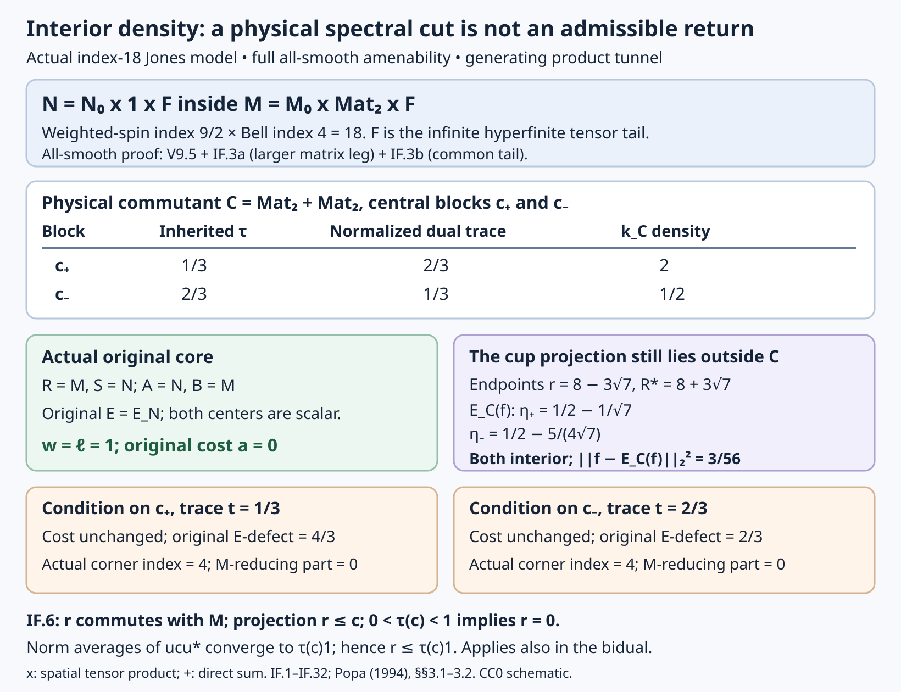

*Figure IF.1. Algebra boxes are schematics of the actual product model IF.20–IF.26. The traces, cup endpoints, variance, and defects are exact values from IF.27–IF.32. The bottom implication is the universal original-\(M\)-reducing obstruction IF.6. The figure does not depict a positive original cost or a proof for arbitrary cores. Reproducible figure sources: [Python source](figures/interior-physical-faces-v10.py) and [SVG](figures/interior-physical-faces-v10.svg).*

The obstruction to a physical spectral-face reduction is independent of factoriality of the core, finiteness of either canonical capacity, and normality of the compatible state. It leaves the original general zero-cost problem, the marked-corner return and full residual partition unresolved. The inherited expectations, both canonical traces, the Jones-ideal face when required, and the distinct \(Z(R)\) and \(Z(S)\) support conditions remain part of that problem.

### Sources and prerequisite proofs for IF.1–IF.32

- Sorin Popa, [*Classification of amenable subfactors of type II*](https://doi.org/10.1007/BF02392646), Acta Mathematica **172** (1994), 163–255. Sections 2.3 and 3.1 give smooth expected representations and the all-smooth amenability definition; Proposition 3.2.3, p.206, specifies the corner and common-amplification heredity used for comparison.
- [Relative norm averaging and central densities](relative-norm-averaging-and-central-density.md), Theorem 81.2; [Finite cup densities and a positive central cost](finite-cup-densities-and-positive-cost.md), (82.5) and (82.11)–(82.13); and [The cup, its tail commutants and central comparison](cup-tail-commutants-and-central-comparison.md), T.5–T.8, supply the original norm averages, cost coordinates and physical cup-density identity.
- [A generating tunnel with incompatible reflected traces](weighted-spin-tunnel.md), (47.1)–(47.14), Proposition 47.2 and Theorem 47.4, supplies the weighted-spin factor, expectation, cups, full tail commutants and generating tunnel.
- [Transporting a core through a tensor factor](transporting-a-core-through-a-tensor-factor.md), Proposition 51.6 and (51.24)–(51.25), supplies the Bell inclusion and its generating tunnel.
- [General tail supports and controlled tunnels](general-tail-supports-and-controlled-tunnels.md), V9.1 and Theorem V9.5, supplies the original state-cost comparison and the complete all-smooth unequal-trace diagonal construction. [Measuring an inclusion through modules and corners](module-dimension-and-local-index.md), Theorem 2.4, supplies the physical local-index formula.

*Independent mathematical exposition, proofs and illustration released under CC0 1.0.*

## State balance and operator balance have different consequences

Joint balance is a condition on a state. Imposing it as an operator identity can require a stronger zero-variance condition. We prove the exact obstruction using the original finite common basis, give a finite quantitative version, and explain why the balanced cyclic GNS representation preserves the original expected pair. The exposition, proofs and diagram are independently authored CC0 1.0 material.

### BC3.1. The original core and its center transfer

Let \(N\subset M\) be the original proper finite-index inclusion of II₁ factors, with inherited probability trace \(\tau\) and index \(d>1\). Let \(S\subset R\) be an actual ordinary Jones core, with no factoriality or extremality assumption. On \(L^2(M,\tau)\) put

\[
e=e_R^M,\qquad A=\langle N,e\rangle,\qquad
B=\langle M,e\rangle,\qquad E_A:B\longrightarrow A.
\tag{BC3.1}
\]

The last map is the original normal faithful trace-preserving expectation. Its restriction to \(M\) is \(E_N\), and its canonical trace is \(\operatorname{Tr}\), with \(\operatorname{Tr}(e)=1\). Keep the actual normal full-corner isomorphism

\[
\iota:D_0=Z(S)\vee Z(R)\longrightarrow D=Z(A)\vee Z(B).
\]

Put \(V=Z(R)\) and \(P_0=E_V|_{D_0}\), where this finite expectation preserves the original \(\tau\). A compatible original-trace state \(\varphi\) is joint balanced when

\[
\varphi\iota=\varphi\iota P_0 .
\tag{BC3.2}
\]

No normality of \(\varphi\) or its center restriction is required. The finite rows retain arbitrary finite length \(L\): \(a_i\in N\), \(\sum_i a_i a_i^*=1\), \(h_a=\sum_i a_i e a_i^*\). Their exact physical marginal is \(\tau\); their exact expectation compatibility is \(\psi_a E_A=\psi_a\), where \(\psi_a(T)=\operatorname{Tr}(h_aT)\). Their joint norm is the original \(J_a\).

[V10.15–V10.18 of Lesson99, *General tail supports and controlled tunnels*](general-tail-supports-and-controlled-tunnels.md) identify the compact set \(K_{\mathrm{bal}}\) of all compatible original-trace states satisfying (BC3.2), and give the exact alternative: either this set has an \(M\)-central state, or one fixed finite sum

\[
H=\sum_j(u_j^*T_j u_j-T_j)
\]

has strictly positive evaluation, uniformly on all sufficiently small-\(J_a\) rows. Here the \(u_j\) are physical \(M\)-unitaries and \(T_j=T_j^*\in B\). That is functional positivity on a constrained state set. It is not a strict operator lower bound in \(B\).

The unrestricted amenability hypothesis quantifies over every smooth nondegenerate normal faithful expected representation of the original inclusion. It supplies a possibly singular compatible physical hypertrace in every such representation. The returned hypertrace is not required by that hypothesis to satisfy (BC3.2).

We use [68.1–68.2, the complete common-basis center transfer](core-central-transition-bounds.md). Choose its identity-containing partial orthonormal right basis \(b_1,\ldots,b_r\in R\subset M\), also a basis for \(M/N\), with

\[
\sum_i b_i b_i^*=d1,\qquad
g=\sum_i b_i^*b_i,\qquad
\kappa=d^{-1}E_{D_0}(g).
\]

Its proven conclusions are

\[
\begin{gathered}
d^{-1}1\le\kappa\le (b_d/d)1,\qquad
b_d=1+d(\lceil d\rceil-1),\\
P_0(\kappa)=1,\qquad E_{Z(S)}(\kappa)=1,\\
P_\kappa(t)=P_0(\kappa t),\\
\mathcal I(X)=\sum_i b_i X b_i^*,\qquad
\mathcal I(\iota(t))=d\,\iota(P_\kappa(t))\quad(t\in D_0).
\end{gathered}
\tag{BC3.3}
\]

Thus \(P_\kappa:D_0\to V\) is normal UCP and contractive, and \(\mathcal I/d:B\to B\) is UCP. The right side of the last line lies in \(Z(B)\). The larger-center lift \(\iota(V)\), unlike the whole smaller-center lift, commutes with every physical \(M\)-element. All hypotheses, including the original weight \(\kappa\), remain in the following arguments.

### BC3.2. Exact obstruction to an operator balancing channel

Write

\[
q_\kappa=P_0((\kappa-1)^2)\in V_+ .
\tag{BC3.4}
\]

This is a bounded original-center element. Faithfulness of \(\tau\) and preservation of \(\tau\) by \(P_0\) give
\(\tau(q_\kappa)=\tau((\kappa-1)^2)\). In particular \(q_\kappa=0\) if and only if \(\kappa=1\).

**Theorem BC3.1.** Let \(C\) be any nonzero unital C*-algebra, \(j:M\to C\) a unital *-homomorphism, and \(\Phi:B\to C\) a UCP map satisfying \(\Phi|_M=j\). Suppose operator balance is imposed:

\[
\Phi(\iota(t))=\Phi(\iota(P_0t))\qquad(t\in D_0).
\tag{BC3.5}
\]

Then

\[
\Phi(\iota(q_\kappa))=0.
\tag{BC3.6}
\]

Consequently a map with these properties that is faithful on positive elements of \(\iota(V)\) can exist only if \(\kappa=1\). If \(q_\kappa\ge c1\) for some \(c>0\), there is no such UCP map, even without faithfulness.

The assertion allows nonnormal maps, arbitrary target algebras, nonfactor centers and singular states on the target. A faithful physical embedding \(j\) by itself does not imply faithfulness on \(\iota(V)\); that hypothesis must not be suppressed.

**Proof.** A UCP map agreeing with a *-homomorphism on \(M\) has \(M\) in its multiplicative domain. Thus

\[
\Phi(aXb)=j(a)\Phi(X)j(b)\qquad(a,b\in M,\ X\in B).
\tag{BC3.7}
\]

For completeness, define \(D_\Phi(a,b)=\Phi(a^*b)-\Phi(a)^*\Phi(b)\). Apply complete positivity to the Gram matrix of \((a,b,1)\), then take the Schur complement of its final identity entry. The resulting \(2\times2\) matrix with entries \(D_\Phi(a,a),D_\Phi(a,b),D_\Phi(b,a),D_\Phi(b,b)\) is positive. Positivity, tested on two vectors with a scalar parameter, gives
\(\|D_\Phi(a,b)\|^2\le\|D_\Phi(a,a)\|\|D_\Phi(b,b)\|\).
For \(a\in M\), both \(D_\Phi(a,a)\) and \(D_\Phi(a^*,a^*)\) vanish because \(\Phi|_M=j\). This proves both sides of (BC3.7).

Take \(t=\kappa-1\). Its \(P_0\)-expectation is zero by (BC3.3), so (BC3.5) gives \(\Phi(\iota(t))=0\). Equations (BC3.3) and (BC3.7) now imply

\[
\begin{aligned}
d\,\Phi(\iota(P_\kappa(t)))
&=\Phi(\mathcal I(\iota(t)))\\
&=\sum_i j(b_i)\Phi(\iota(t))j(b_i)^*=0.
\end{aligned}
\]

But
\[
P_\kappa(\kappa-1)
=P_0(\kappa^2-\kappa)
=P_0((\kappa-1)^2)=q_\kappa,
\]
again using \(P_0(\kappa)=1\). This proves (BC3.6). Faithfulness on the indicated positive center elements forces \(q_\kappa=0\), hence \(\kappa=1\). If \(q_\kappa\ge c1\), positivity and unitality instead give \(0=\Phi(\iota(q_\kappa))\ge c1_C\), a contradiction. \(\square\)

There is an important distinction between this operator identity and the requested state identity. The original balanced state

\[
\psi_e(T)=\operatorname{Tr}(eT)
\]

has \(\psi_e(\iota(t))=\tau(t)=\tau(P_0t)\) for every \(t\in D_0\), and is exactly \(E_A\)-compatible with physical marginal \(\tau\). If \(\kappa\ne1\), it nevertheless has

\[
\psi_e(\iota(q_\kappa))=\tau((\kappa-1)^2)>0.
\tag{BC3.8}
\]

Thus no map satisfying (BC3.5) and fixing the physical \(M\) can carry this balanced state as a pullback from \(C\). Operator balance imposes an additional zero-variance support condition; it cannot be substituted for the state condition defining the whole \(K_{\mathrm{bal}}\).

This theorem does not prove that all possible balancing maps fail. A map that selects a singular larger-center support can be nonfaithful there; an operation that balances only one returned hypertrace need not satisfy (BC3.5) as an operator identity. These possibilities remain distinct from the map refuted here.

### BC3.3. A finite physical test budget for approximate channels

The obstruction also survives approximate physical fixation, with all tests chosen before the channel. Let \(C,j\) be as above and let
\(r:V\to C\) be a faithful unital *-homomorphism whose image commutes with \(j(M)\). It is the faithfully retained larger-center label map; it need not have image in all of \(Z(C)\).

Write each \(b_i\) as a fixed finite unitary sum

\[
b_i=\sum_\ell c_{i\ell}v_{i\ell},\qquad
A_i=\sum_\ell|c_{i\ell}|,\qquad
C_b=\frac2d\sum_i A_i^2 .
\tag{BC3.9}
\]

These physical \(v_{i\ell}\in\mathcal U(M)\) form one fixed finite test list. Such a decomposition always exists with \(A_i\le2\|b_i\|\): write \(b_i/\|b_i\|=h+ik\) for self-adjoint contractions, and express \(h=(u_h+u_h^*)/2\), where \(u_h=h+i(1-h^2)^{1/2}\), and similarly for \(k\). Zero basis vectors can be omitted. In particular \(C_b\le8b_d/d\).

**Theorem BC3.2.** Let \(\epsilon,\delta\ge0\). Suppose a UCP map \(\Phi:B\to C\) satisfies

\[
\begin{gathered}
\|\Phi(v_{i\ell})-j(v_{i\ell})\|\le\epsilon,\\
\|\Phi(\iota(t))-r(P_0t)\|\le\delta\|t\|
\qquad(t\in D_0).
\end{gathered}
\tag{BC3.10}
\]

Then

\[
\|P_\kappa-P_0\|
\le 2\delta+C_b(\sqrt{2\epsilon}+\epsilon).
\tag{BC3.11}
\]

The norm on the left is the operator norm of the fixed map \(D_0\to V\). When \(\kappa\ne1\), it is positive and satisfies the more explicit bound

\[
\frac{\|q_\kappa\|}{\|\kappa-1\|}
\le2\delta+C_b(\sqrt{2\epsilon}+\epsilon).
\tag{BC3.12}
\]

There is no row length \(L\), averaging length or retrospective tolerance choice in this estimate.

**Proof.** For a tested unitary \(v\), contraction of \(\Phi(v)\) and \(\|\Phi(v)-j(v)\|\le\epsilon\) give

\[
\|1-\Phi(v)^*\Phi(v)\|\le2\epsilon,\qquad
\|1-\Phi(v)\Phi(v)^*\|\le2\epsilon.
\]

The same kernel inequality used above yields, for any two tested unitaries \(u,v\) and any \(X\in B\),

\[
\|\Phi(uXv^*)-j(u)\Phi(X)j(v)^*\|
\le2(\sqrt{2\epsilon}+\epsilon)\|X\|.
\tag{BC3.13}
\]

Indeed first remove the left product by \(D_\Phi(u^*,Xv^*)\), at cost \(\sqrt{2\epsilon}\|X\|\); then remove the right product by \(D_\Phi(X^*,v^*)\), at the same cost. Replacing the remaining two factors \(\Phi(u),\Phi(v)^*\) by \(j(u),j(v)^*\) costs at most \(2\epsilon\|X\|\).

Expand the two \(b_i\) factors using (BC3.9), and sum the absolute coefficients. This gives

\[
\left\|\Phi(\mathcal I(X))
-\sum_i j(b_i)\Phi(X)j(b_i)^*\right\|
\le 2\sum_i A_i^2(\sqrt{2\epsilon}+\epsilon)\|X\|.
\tag{BC3.14}
\]

Now let \(X=\iota(t)\). The left term is \(d\Phi(\iota(P_\kappa t))\). By the center estimate in (BC3.10), its distance to \(d\,r(P_\kappa t)\) is at most \(d\delta\|P_\kappa t\|\). The sum on the right has distance at most \(d\delta\|t\|\) from

\[
\sum_i j(b_i)r(P_0t)j(b_i)^*
=d\,r(P_0t).
\]

Here \(\|\mathcal I/d\|=1\), \(\sum_i j(b_i)j(b_i)^*=d1_C\), and the commutation hypothesis on \(r(V)\) justify both the norm estimate and the equality. Since \(r\) is faithful it is isometric. Divide by \(d\), use contraction of \(P_\kappa\), and take the supremum over \(\|t\|\le1\). This proves (BC3.11).

Finally \((P_\kappa-P_0)(\kappa-1)=q_\kappa\). Testing on this one bounded element proves (BC3.12). Its left side is positive whenever \(\kappa\ne1\), by (BC3.4). \(\square\)

The corresponding finite version of the proof needs the center estimates only at \(t\) and \(P_\kappa t\), together with the fixed basis-unitary tests. Uniform convergence on the whole center is therefore unnecessary to detect a fixed nonzero variance obstruction. Conversely, weak-star balance of one state is much weaker than either of the operator-norm bounds in (BC3.10).

### BC3.4. The balanced cyclic GNS representation retains the original problem

The state \(\psi_e\) is normal on \(B\), its support projection is \(e\), and \(e\) has full central support in both \(A\) and \(B\). These are the original full-corner facts, rather than an auxiliary finite model.

**Proposition BC3.3.** Its GNS representation \(\pi:B\to B(H_{\psi_e})\) is normal and faithful. Transporting \(A\subset_{E_A}B\) through this representation gives an isomorphic expected pair

\[
\pi(A)\subset_{\bar E_A}\pi(B),\qquad
\bar E_A(\pi(T))=\pi(E_A(T)).
\tag{BC3.15}
\]

It retains the physical inclusion, every represented tower stage, smoothness, normal faithfulness of the expectation and nondegeneracy. Its compatible physical hypertraces are in exact bijection with those of the original pair, by pullback through \(\pi\). The balancing of the cyclic vector imposes no new restriction on that set.

**Proof.** For \(y\in B\), the coefficient of \(\pi(x)\) at \(\pi(y)\xi\) is \(\psi_e(y^*xy)\), normal in \(x\). Polarization gives mixed normal coefficients on a dense set of vectors. Approximating arbitrary vectors gives predual-norm limits of these coefficients, so all coefficients are normal. Thus \(\pi\) is normal.

The kernel of a normal von Neumann algebra representation is \(Bz\) for a central projection \(z\in Z(B)\). If \(z\) belongs to this kernel, then
\[
0=\|\pi(z)\xi\|^2=\psi_e(z)
=\operatorname{Tr}(ez).
\]
Faithfulness of the canonical trace gives \(ez=0\), and full central support of \(e\) gives \(z=0\). Hence \(\pi\) is faithful. The same reasoning applies to its restriction to \(A\).

Consequently \(\pi\) is a normal *-isomorphism onto its von Neumann image, with normal inverse. Conjugating the expectation by that isomorphism defines (BC3.15), still normal and faithful, with the original \(E_N\) on the physical image. Transporting the [finite matrix tower in Theorem61.2](smooth-representations-and-tower-compression.md) gives all original and represented stages and their cups. Commutants and ultraweak spanning identities are invariant under these normal *-isomorphisms, so smoothness and nondegeneracy are unchanged.

For any state \(\rho\) on \(\pi(B)\), the physical centrality equations, exact trace restriction and compatibility are precisely the original equations for \(\rho\pi\); the converse uses \(\pi^{-1}\). This includes singular states. The joint identity also pulls back exactly, when it is present. The cyclic vector state is the one pre-existing balanced state \(\psi_e\), and amenability does not require its returned hypertrace to agree with that vector state. \(\square\)

In particular, if the original pair has an amenability-supplied compatible \(M\)-central state \(\varphi_0\), then every finite commutator sum \(H\) above satisfies \(\varphi_0(H)=0\). Therefore \(H\not\ge c1\) in \(B\) for any \(c>0\). A hypothetical positive functional separator on \(K_{\mathrm{bal}}\) cannot become the operator inequality \(\pi(H)\ge c1\) in this faithful GNS representation: faithfulness preserves order, and the transported \(\varphi_0\) still evaluates it at zero.

This is the precise failed implication in the GNS route. Constructing the balanced cyclic representation and applying the full all-smooth amenability quantifier is allowed; it returns exactly the original central-state existence assertion. Treating its cyclic center marginal as a restriction on every returned hypertrace would add the missing conclusion.

### BC3.5. Joint state balance is not a C*-quotient relation

There is a separate obstruction even before imposing physical fixation.

**Proposition BC3.4.** Let \(P_0:D_0\to V\) be the original trace-preserving expectation. If \(P_0\ne\mathrm{id}_{D_0}\), no unital *-homomorphic quotient \(q:B\to C\) can simultaneously have these properties:

1. Every state on \(C\) pulls back to a state satisfying the joint identity (BC3.2).
2. The balanced state \(\psi_e\) factors through \(q\).

In particular \(K_{\mathrm{bal}}\), which contains \(\psi_e\), cannot be identified with the whole pullback state space of such a C*-quotient. This does not prevent other operator-system constructions.

**Proof.** States separate self-adjoint elements of a unital C*-algebra. The first property therefore implies
\[
q(\iota(t))=q(\iota(P_0t))\qquad(t\in D_0).
\tag{BC3.16}
\]
Choose a real \(t\in D_0\) with \(t\ne P_0t\), and put
\[
v_t=P_0(t^2)-(P_0t)^2
=P_0((t-P_0t)^2)\in V_+ .
\]
Trace preservation and faithfulness give
\(\tau(v_t)=\|t-P_0t\|_{2,\tau}^2>0\).
Apply (BC3.16) to \(t\) and to \(t^2\). Multiplicativity of \(q\iota\) gives
\[
q(\iota(P_0(t^2)))
=q(\iota(t))^2
=q(\iota((P_0t)^2)),
\]
so \(q(\iota(v_t))=0\). If \(\psi_e=\rho q\), then
\[
0=\rho(q(\iota(v_t)))=\psi_e(\iota(v_t))=\tau(v_t)>0,
\]
a contradiction. \(\square\)

Only the last proposition uses multiplicativity on the joint algebra. A UCP map is allowed to have zero value at \(t-P_0t\) and positive value at its square. The physically fixed UCP-map obstruction in Theorem BC3.1 is different: its zero variance follows from the exact actual finite-basis transfer (BC3.3), not from treating a CP map as multiplicative.

The maximal tensor product and normal-part cut of the source's §2.4 produce actual expected representations from an auxiliary algebra acting in the physical commutant. They do not make the joint conditional expectation a *-homomorphism. If that construction is used to encode (BC3.16), its quotient relations must still be checked against the variance calculation above. A construction of a smooth expected representation with a suitable state-dependent transfer remains an additional proof obligation.

### BC3.6. Consequences and the unrestricted state question

Functional balance and operator balance have different consequences. A physically fixed UCP balancing map must annihilate the actual larger-center variance \(q_\kappa\). A faithful retained-center map therefore forces flat transfer weight, and approximate maps obey the finite physical bound (BC3.11). This provides a testable obstruction for that proposed representation/CP-map route, without using an auxiliary matrix as an actual Jones core.

The balanced cyclic GNS route is exactly the original expected pair in a normal faithful representation; it does not enlarge the amenability conclusion. Turning joint state constraints into quotient relations also loses the faithful inherited center variance and cannot represent the full balanced state set.

These results do not assert that a finite separator exists for an amenable inclusion. They do not rule out a state-dependent, nonfaithful-center or other valid construction. They do not establish the unrestricted \(M\)-central joint-balanced state, simultaneous small \(J_h\), full original finite partition, marked corner return, residual bound, zero endpoint or generating conclusion.

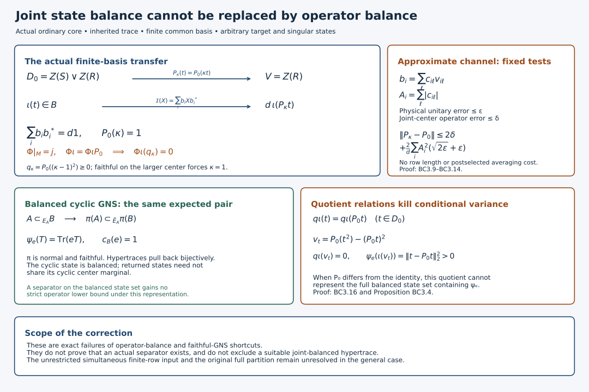

*Figure BC3.1.* The upper square is in the actual original core and its physical basis; the lower panels show the unchanged expected pair under faithful GNS and the variance killed by a quotient. Arrows are typed maps, not trace-scaled areas. The exact constants and hypotheses are those of BC3.3–BC3.16. The separate four-point check in the reproducible source is an abelian illustration only; it is not asserted to be a Jones core. [Full figure](figures/operator-balance-obstruction-v10.svg), [editable CC0 figure source](figures/operator-balance-obstruction-v10.py).

Human mathematical context: Sorin Popa, *Classification of amenable subfactors of type II*, Acta Mathematica 172 (1994), 163–255, [DOI 10.1007/BF02392646](https://doi.org/10.1007/BF02392646), §2.4, printed pp.198–200, and Definition 3.1.1, printed p.203. The prerequisite proofs are [52.1–52.2, common bases and canonical full corners](canonical-core-traces-and-integer-rounding.md), [61.1–61.2, expected representations and their finite matrix towers](smooth-representations-and-tower-compression.md), [68.1–68.2, the weighted center transfer](core-central-transition-bounds.md), and [FC.3–FC.24, V8.9 and V10.15–V10.18 of Lesson99](general-tail-supports-and-controlled-tunnels.md). These last providers retain finite column normalization, the normal and singular state branches, and the exact compact separating alternative.

## A finite physical budget controls the original joint norm

The identity V9.2 assumes exact \(M\)-centrality. The following estimate retains the same joint algebra and both inherited trace measures when the state has only finitely many controlled physical commutators. It applies before taking any limiting state and before either matrix deletion.

Retain \(A,B,E_A,D_0,U,V,Q,P_0,\iota\), the common basis \(b_1,\ldots,b_{t_0}\), and \(g,z,w,\ell,\mathfrak a\) from IF.1–IF.2 and V9.1. Thus

\[
\begin{gathered}
\sum_i b_i b_i^*=d1,\qquad
g=\sum_i b_i^*b_i,\qquad z=E_{N'\cap M}(g),\\
w=d^{-1}E_{D_0}(g),\qquad
\ell=d^{-1}E_{D_0}(z),\\
w\ge d^{-1}1,\qquad
\mathfrak a=\iota(dQ(|w-\ell|)).
\end{gathered}
\tag{JB.1}
\]

Let \(\sigma\) be a state on the **original** \(B\), satisfying

\[
\sigma E_A=\sigma,\qquad
\sigma|_M=\tau_M,\qquad
\sigma(nT)=\sigma(Tn)\quad(n\in N,\ T\in B).
\tag{JB.2}
\]

Exact \(M\)-centrality is not assumed. For its original joint restrictions and finite physical errors put

\[
\begin{gathered}
\alpha_\sigma(t)=\sigma(\iota(t)),\qquad
\gamma_\sigma=\alpha_\sigma P_0,\\
r_i(\sigma)=
\bigl\|\,T\longmapsto\sigma(b_iT-Tb_i)\,\bigr\|_{B^*},\\
\mathcal E_\sigma=
\frac{\|w^{-1}\|}{d}\sum_i\|b_i\|r_i(\sigma).
\end{gathered}
\tag{JB.3}
\]

These are full bounded-functional norms. A test against one specified \(T\), or a norm on the smaller physical algebra alone, cannot replace \(r_i\).

**Theorem JB.1 — approximate original density identity.** With no normality assumption on \(\sigma\) or its center restrictions,

\[
\begin{gathered}
\left\|\gamma_\sigma-
\alpha_\sigma\bigl((\ell/w)\,\cdot\bigr)\right\|
\le\mathcal E_\sigma,\\
\left|
\|\alpha_\sigma-\gamma_\sigma\|
-\alpha_\sigma(|1-\ell/w|)
\right|\le\mathcal E_\sigma,\\
\|\alpha_\sigma-\alpha_\sigma P_0\|
\le\sigma(\mathfrak a)+\mathcal E_\sigma .
\end{gathered}
\tag{JB.4}
\]

**Proof.** For \(t\in D_0\), write \(x=\iota(t)\). The original finite-basis transfer of [68.2](core-central-transition-bounds.md) has

\[
\mathcal I(x)=\sum_i b_i x b_i^*
=d\,\iota(P_0(wt)).
\tag{JB.5}
\]

Moving just the left basis factor in each state pairing gives

\[
\begin{gathered}
\left|\sigma(\mathcal I(x))-\sigma(xg)\right|\\
\le\sum_i r_i(\sigma)\|xb_i^*\|
\le\|t\|\sum_i\|b_i\|r_i(\sigma).
\end{gathered}
\tag{JB.6}
\]

The lift \(x\) commutes with \(N\). Consequently exact \(N\)-centrality gives \(\sigma(xvgv^*)=\sigma(xg)\) for every \(v\in\mathcal U(N)\). The actual relative norm averages of [81.2](relative-norm-averaging-and-central-density.md) converge to \(z\). Norm continuity of the bounded state, including a singular state, therefore gives \(\sigma(xg)=\sigma(xz)\).

For completeness, the last compatible corner calculation uses no \(M\)-centrality. Since \(z\in N'\cap M\subset R\), it commutes with \(A\). Both \(x\) and \(xz\) commute with \(A\), so \(E_A(xz)\in Z(A)\). Compressing by the original full corner \(e\) gives its label \(E_S(tz)=dQ(\ell t)\). The equality follows by trace adjointness through \(D_0\): the \(Z(S)\)-expectation of \(tz\) equals that of \(tE_{D_0}(z)\). Fullness of the corner identifies the central lift uniquely. Compatibility and \(\alpha_\sigma=\alpha_\sigma Q\) now give

\[
\sigma(xz)=d\alpha_\sigma(\ell t),\qquad
\sigma(\mathcal I(x))=d\gamma_\sigma(wt).
\tag{JB.7}
\]

Substitute \(t=w^{-1}s\) in (JB.6), for every \(\|s\|\le1\), and divide by \(d\). This proves the first norm estimate. The functional \(s\mapsto\alpha_\sigma((1-\ell/w)s)\) has norm \(\alpha_\sigma(|1-\ell/w|)\), by positive and negative parts in the original abelian algebra. The triangle and reverse triangle inequalities prove the second estimate. Finally \(dw\ge1\) and compatibility give
\(\alpha_\sigma(|1-\ell/w|)\le d\alpha_\sigma(|w-\ell|)=\sigma(\mathfrak a)\).
This proves the third estimate. \(\square\)

## The exact norm price of a smaller-center cost cut

Let \(\psi\) be an available compatible \(M\)-central state with the original physical trace. For \(f\in Z(A)\), \(0\le f\le1\), and \(t=\psi(f)>0\), use the actual reweighting

\[
\psi_f(T)=t^{-1}\psi(fT).
\tag{JB.8}
\]

[AS.2–AS.3, exact bounded reweighting](selecting-a-compatible-hypertrace.md) proves positivity, domination \(\psi_f\le t^{-1}\psi\), exact compatibility, \(N\)-centrality and the physical marginal \(\psi_f|_M=\tau_M\). Those results apply even when the original center restrictions are singular. They also preserve Jones-ideal annihilation when it is present. Thus \(\psi_f\) satisfies all of (JB.2); its remaining physical commutators are charged explicitly.

**Proposition JB.2 — exact bounded-functional defects.** For every physical unitary \(u\in M\),

\[
\begin{gathered}
\|\psi_f-\psi\|=\psi(|f/t-1|),\\
\|\psi_f\operatorname{Ad}u-\psi_f\|
=t^{-1}\psi(|u^*fu-f|).
\end{gathered}
\tag{JB.9}
\]

If \(f=c\) is a projection of mass \(t\), then

\[
\|\psi_c-\psi\|=2(1-t),\qquad
\|\psi_c\operatorname{Ad}u-\psi_c\|\le4(1-t).
\tag{JB.10}
\]

For a general contraction weight, the first norm in (JB.9) is at most \(2(1-t)\). If \(f\le1_{[0,\varepsilon]}(\mathfrak a)\), then \(\psi_f(\mathfrak a)\le\varepsilon\), and hence

\[
\|\alpha_{\psi_f}-\alpha_{\psi_f}P_0\|
\le \varepsilon+
\frac{\|w^{-1}\|}{d}\sum_i\|b_i\|r_i(\psi_f).
\tag{JB.11}
\]

**Proof.** The centralizer of \(\psi\) is a norm-closed star algebra. It contains \(M\) and \(Z(A)\), by AS.2, so it contains the two selfadjoint elements \(f/t-1\) and \(u^*fu-f\). For any selfadjoint element \(a\) of this centralizer, the functional \(T\mapsto\psi(aT)\) has norm \(\psi(|a|)\). Its positive and negative parts give the upper bound. The continuous contraction tests \(a(|a|+\delta)^{-1}\), \(\delta>0\), give the reverse bound because their products with \(a\) converge uniformly to \(|a|\). Thus the argument does not require ultraweak continuity of \(\psi\), or centralizer membership of a discontinuous sign function.

The first identity in (JB.9) follows immediately. Original \(u\)-centrality gives
\(\psi(fuTu^*)=\psi(u^*fuT)\), proving the second. For a projection \(c\), evaluate \(|c/t-1|\) on \(c,1-c\) to get \(2(1-t)\). Since conjugation is an isometry on \(B^*\) and fixes \(\psi\), the two distances to \(\psi\) give (JB.10). For \(0\le f\le1\), positivity gives the exact decomposition \(\psi=t\psi_f+(1-t)\psi_{1-f}\), when \(t<1\), so the first distance is at most \(2(1-t)\). The case \(t=1\) follows from domination and zero mass of \(1-f\).

The spectral support condition gives \(0\le f\mathfrak a\le\varepsilon f\), in the original smaller center. Apply \(\psi\), divide by \(t\), and then use Theorem JB.1. \(\square\)

A low-cost cut has therefore kept the expectation and physical trace while paying an exact price in the original physical commutators. It has not cut down either represented algebra or changed either canonical trace. Formula (JB.11) quantifies that price in the original joint norm. It does not assert that unrestricted amenability supplies a positive-mass low-cost cut with a small price. In particular, replacing the state by its GNS representation still requires an actual normal smooth expected representation and a compatible return, as in [61.1–61.2](smooth-representations-and-tower-compression.md).

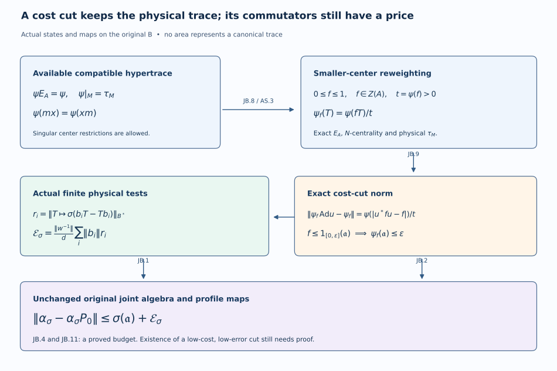

Figure JB.1. The arrows give actual reweighting and bounded-functional estimates on the original \(B\). The lower box retains the two original joint profile maps; it is a proved estimate, not an assertion that a suitable cut exists. Rectangles are a diagram of maps, not areas proportional to either canonical trace. Proofs: JB.1–JB.11; prerequisite reweighting: AS.2–AS.4. Human context: Popa (1994), §2.4 and Definition3.1.1, printed pp.198–200 and203. [Editable figure source](figures/cost-localization-and-state-return-v11.py).

## A fixed averaging list can miss one physical target

### BC4.1. What genuine left averaging preserves

Keep the original proper finite-index II₁ inclusion \(N\subset M\), probability trace \(\tau\), actual ordinary core \(S\subset R\), projection \(e=e_R^M\), and canonical expected pair

\[
A=\langle N,e\rangle\subset B=\langle M,e\rangle,\qquad E_A:B\to A.
\]

No factoriality of the cores or normality of an amenability-supplied state is imposed. The canonical trace has \(\operatorname{Tr}(e)=1\). For any finite coisometric row \((a_i)_{i=1}^L\subset N\), put

\[
\sum_i a_i a_i^*=1,\qquad h_a=\sum_i a_i e a_i^*,\qquad
g_a=\sum_i a_i^*a_i,\qquad
J_a=\|E_{Z(S)}(g_a)-P_0E_{Z(S)}(g_a)\|_1.
\tag{BC4.1}
\]

Here \(P_0=E_{Z(R)}\) retains the inherited finite trace. The full finite-column normalization, exact physical marginal \(\operatorname{Tr}(h_a\,\cdot)|_M=\tau\), and exact compatibility are the original [FC.3–FC.24](general-tail-supports-and-controlled-tunnels.md).

**Lemma BC4.1.** For any finite convex average
\[
\mathcal T(X)=\sum_{j=1}^s\theta_j v_jXv_j^*,
\qquad v_j\in\mathcal U(N),\quad \theta_j\ge0,\quad \sum_j\theta_j=1,
\tag{BC4.2}
\]
the row \((\sqrt{\theta_j}v_j a_i)_{j,i}\) is coisometric, represents \(\mathcal T(h_a)\), and has exactly the old right sum \(g_a\) and exactly the old \(J_a\). Its physical marginal and expectation compatibility remain exact. For a physical unitary \(u\in M\),

\[
\begin{gathered}
\|\mathcal T(h_a)-h_a\|_1
\le\sum_j\theta_j\|v_jh_av_j^*-h_a\|_1,\\
\|u\mathcal T(h_a)u^*-\mathcal T(h_a)\|_1
\ge\|uh_au^*-h_a\|_1-2\|\mathcal T(h_a)-h_a\|_1.
\end{gathered}
\tag{BC4.3}
\]

**Proof.** The left row sum is
\(\sum_j\theta_jv_j(\sum_i a_i a_i^*)v_j^*=1\).
The right row sum is
\(\sum_{j,i}\theta_j a_i^*v_j^*v_j a_i=g_a\).
The represented density is precisely (BC4.2); the finite-column theorem therefore gives both exact state conditions. Convexity gives the first inequality. Subtract the two commutators, use unitary invariance of the tracial \(L^1\) norm, and apply the reverse triangle inequality for the second. \(\square\)

Thus the right norm is preserved without a row-length factor. The lemma alone does not say that any fixed finite choice of the \(v_j\) improves all original \(M\)-targets. The example below disproves that stronger assertion with all the original representation hypotheses present.

### BC4.2. The physical index-two inclusion

Let

\[
Q=\overline{\bigotimes}_{j\ge0}(\operatorname{Mat}_2^{(q_j)},\operatorname{tr}_2),
\qquad
\alpha=\bigotimes_{j\ge0}\operatorname{Ad}Z_j,
\qquad N_0=Q^\alpha ,
\tag{BC4.4}
\]

where \(X_j=\begin{pmatrix}0&1\\1&0\end{pmatrix}\) and
\(Z_j=\operatorname{diag}(1,-1)\) are the Pauli matrices in the indicated defining matrix coordinate. Set \(u=X_0\). The product trace is always used.

For \(F_l=\bigotimes_{j=0}^{l-1}\operatorname{Mat}_2^{(q_j)}\), the finite expectations \(E_{F_l}\) commute with \(\alpha\), converge in \(L^2\) on every physical element, and have uniformly bounded outputs. The fixed algebra \(F_l^\alpha\) is the two full parity blocks; its center is spanned by \(1\) and \(W_{l-1}=Z_0\cdots Z_{l-1}\).

The factor and index assertions can be checked directly. An element commuting with every \(F_l\) is scalar, because its finite expectations are scalar; thus \(Q\) is a factor. If \(x\in N_0'\cap Q\), its finite expectation commutes with \(F_l^\alpha\), so
\[
E_{F_l}(x)=\tau(x)1+b_lW_{l-1}.
\]
Indeed the commutant of the two full parity blocks inside \(F_l\) is exactly their two-dimensional center. Applying \(E_{F_l}\) to the corresponding formula at \(l+1\) kills \(W_l\), because its last \(Z_l\)-coordinate has trace zero. Hence every \(b_l=0\), and \(L^2\) convergence gives \(x=\tau(x)1\). Consequently \(N_0\) is a factor as well. It is generated by its increasing finite-dimensional \(F_l^\alpha\), and is II₁ since their matrix block sizes are unbounded.

The automorphism \(\alpha\) is outer. If it were implemented by a unitary \(w\in Q\), approximate \(w\) in \(L^2\) by \(E_{F_l}(w)\). The latter commutes with the fresh \(X_l\), whereas \(\alpha(X_l)=-X_l\). The bound
\(\|[w,X_l]\|_2\le2\|w-E_{F_l}(w)\|_2\)
would then tend to zero, contradicting \(\|[w,X_l]\|_2=2\).

The physical expectation is
\[
E_{N_0}=\tfrac12(\mathrm{id}+\alpha).
\]
Every \(x\in Q\) has the exact expansion
\[
x=E_{N_0}(x)+uE_{N_0}(u^*x).
\tag{BC4.5}
\]
Its odd part is \(u\) times an even element. Thus \(1,u\) are a full unitary right basis, \(u^2=1\), and \([Q:N_0]=2\). Equivalently \(E_{N_0}(x)\ge x/2\) for \(x\ge0\), and the nonzero projection \((1+u)/2\) has expectation \(1/2\), giving the exact optimal constant. Conjugation by \(u\) normalizes \(N_0\).

### BC4.3. An explicit ordinary Jones tunnel, with its actual core

Write \(Q_{\ge j}\) for the product beginning at coordinate \(j\), and \(\alpha_j\) for its product parity automorphism. For \(x\in Q_{\ge j+1}\), write \(x=x_{\mathrm e}+x_{\mathrm o}\) for its even and odd parts, and define the normal trace-preserving *-embedding

\[
\beta_j(x)=1_{q_j}\otimes x_{\mathrm e}
+X_j\otimes x_{\mathrm o}
\quad:Q_{\ge j+1}\longrightarrow Q_{\ge j}^{\alpha_j}.
\tag{BC4.6}
\]

Graded multiplication verifies multiplicativity: the even product consists of even-even and odd-odd terms, and the odd product of the two mixed terms. Adjoint preservation is immediate, and trace preservation makes the map faithful.

Define, inside \(Q\),

\[
\begin{gathered}
L_0=Q,\\
L_{2j+1}=1_{\{0,\ldots,j-1\}}\otimes Q_{\ge j}^{\alpha_j},\\
L_{2j+2}=1_{\{0,\ldots,j-1\}}\otimes\beta_j(Q_{\ge j+1})
\qquad(j\ge0).
\end{gathered}
\tag{BC4.7}
\]

All these algebras are II₁ factors, and \(L_1=N_0\). The cups are

\[
g_0=\tfrac12(1+X_0),\qquad
g_{2j}=\tfrac12(1+X_{j-1}X_j)\ (j\ge1),\qquad
g_{2j+1}=\tfrac12(1+Z_j).
\tag{BC4.8}
\]

**Proposition BC4.2.** The sequence (BC4.7) is an ordinary index-two Jones tunnel: every consecutive triple \(L_{k+2}\subset L_{k+1}\subset L_k\), with the indicated \(g_k\), is its actual full basic construction. Its larger and smaller cores are \(Q\) and \(N_0\).

**Proof.** It suffices to check two triples on \(Q_{\ge j}\). Put
\[
A_j=Q_{\ge j}^{\alpha_j},\quad
T_j=\beta_j(Q_{\ge j+1}),\quad
B_j=1_{q_j}\otimes Q_{\ge j+1}^{\alpha_{j+1}}.
\]
Inside \(A_j\), the fixed algebra of \(\operatorname{Ad}X_j\) is \(T_j\): its matrix decomposition contains the \(1_j\)-coefficient with an even tail and the \(X_j\)-coefficient with an odd tail, while the \(Y_j\) and \(Z_j\) coefficients are removed. The original trace-preserving expectation onto \(T_j\) is their two-term conjugation average.

Let \(p_X=(1+X_j)/2\). It commutes with \(T_j\), satisfies \(E_{A_j}(p_X)=1/2\), and for \(a\in A_j\),
\[
p_X a p_X=E_{T_j}(a)p_X .
\]
The algebra generated by \(A_j\) and \(p_X\) is \(Q_{\ge j}\): adjoining \(X_j\) lets us recover a physical odd element from its product with \(X_j\), while the even elements were already in \(A_j\). Thus \(T_j\subset A_j\subset Q_{\ge j}\) has the Jones compression, generation and inherited Markov normalization.

For the other triple use \(p_Z=(1+Z_j)/2\in A_j\). Its expectation onto \(T_j\) is \(1/2\). The compression of \(\beta_j(x)\) is
\[
p_Z\beta_j(x)p_Z=(1_j\otimes x_{\mathrm e})p_Z,
\]
which implements \(B_j\subset T_j\). The algebra generated by \(T_j,p_Z\) is all \(A_j\): multiplication by \(Z_j\) recovers the \(Z_j\)-even and \(Y_j\)-odd coefficients as well. Both smaller algebras are factors of index two, by the same even/odd unitary-basis computation (BC4.5).

Here is also a direct verification of fullness. A unitary right basis for \(A_j/T_j\) is \(1,Z_j\), since \(E_{T_j}=(\mathrm{id}+\operatorname{Ad}X_j)/2\) and \(Z_j\) is odd for this involution. The two range projections \(p_X\) and \(Z_jp_XZ_j=1-p_X\) are orthogonal and sum to one. The operators \(b_i p_X t b_k^*\), \(b_0=1,b_1=Z_j,t\in T_j\), therefore form the full \(2\times2\) matrix algebra over \(T_j\): compression gives the matrix-unit multiplication, and the identity range sum gives its unit. The corner map \(t\mapsto tp_X\) is faithful, because \(\tau(tp_X)=\tau(t)/2\) for positive \(t\in T_j\). The finite basis expansion places \(A_j\) in this matrix algebra, so its generation with \(p_X\) proves that it is all \(Q_{\ge j}\).

For \(T_j/B_j\) use the unitary basis \(1,X_jX_{j+1}\), obtained by applying \(\beta_j\) to the even/odd tail basis \(1,X_{j+1}\). Its two \(p_Z\)-range projections are \(p_Z\) and \(1-p_Z\). The identical matrix calculation gives all \(A_j\). The inherited Markov pairings are
\(\tau(ap_Xb)=\tau(ab)/2\) for \(a,b\in A_j\), and
\(\tau(ap_Zb)=\tau(ab)/2\) for \(a,b\in T_j\).
For the first pairing the extra \(X_j\)-term is odd under \(\alpha_j\); for the second the \(Z_j\)-coefficient is orthogonal to both matrix coefficients of \(\beta_j\). Thus the canonical trace is exactly \(2\tau\), and both matrix algebras are the actual full basic constructions with their original trace and expectations.

Transport the first triple through \(\beta_{j-1}\) when \(j\ge1\). Its cup becomes \((1+X_{j-1}X_j)/2\). Transport the second through the identity on the previous coordinates. This gives precisely every triple and every cup in (BC4.7)–(BC4.8), including the initial \(g_0\).

Finally the fixed algebra \(Q_{\ge j}^{\alpha_j}\) is irreducible in \(Q_{\ge j}\), by the finite-expectation proof above applied to that tail. Consequently
\[
L_{2j+1}'\cap Q=F_j,\qquad
L_{2j+1}'\cap N_0=F_j^\alpha .
\tag{BC4.9}
\]
Their increasing unions are dense in \(Q,N_0\), respectively. Thus the actual ordinary cores are those full factors. \(\square\)

Now let \(D=\overline{\bigotimes}_{l\ge0}\operatorname{Mat}_2^{(d_l)}\) with its original product trace, and take the physical inclusion and tunnel

\[
N=N_0\bar\otimes D\subset M=Q\bar\otimes D,
\qquad \widehat L_k=L_k\bar\otimes D.
\tag{BC4.10}
\]

Every consecutive triple is the tensor product of the proved triple with the identical \(D\)-inclusion. The cups are \(g_k\otimes1\); the same compression and full spanning identities prove they are the actual Jones triples. Relative-commutant slicing, since \(D\) is a factor, gives the ordinary cores

\[
S=N_0\otimes1,\qquad R=Q\otimes1.
\tag{BC4.11}
\]

Thus on \(L^2(Q)\otimes L^2(D)\) their actual canonical pair is

\[
\begin{gathered}
e=1_{L^2(Q)}\otimes e_{\mathbb C}^{D},\\
A=L(N_0)\bar\otimes B(L^2(D)),\qquad
B=L(Q)\bar\otimes B(L^2(D)),\\
\operatorname{Tr}=\tau_Q\otimes\operatorname{Tr}_{\mathrm{Hilbert},D},\qquad
E_A=E_{N_0}^{Q}\otimes\mathrm{id}.
\end{gathered}
\tag{BC4.12}
\]

The rank-one terms \(d_1e_{\mathbb C}^Dd_2\) span all finite-rank operators on the dense physical \(D\)-vectors, proving the full \(D\)-operator algebra displayed here. Both core centers are scalar, and \(J_a=0\) for every row in this example. The common physical basis is exactly \(1,u\), contained in \(R\), so the actual finite-basis transfer weight is \(1\). The trace in (BC4.12) is the canonical trace; it is not Hilbert trace on the infinite \(Q\)-coordinate.

The canonical pair is itself smooth and nondegenerate. If \(M_{0,j}\) denotes the finite physical tower of \(N_0\subset Q\), then the physical tower of (BC4.10) is \(M_{0,j}\bar\otimes D\), whereas the represented tower of (BC4.12) is \(M_{0,j}\bar\otimes B(L^2(D))\). These identities follow by iterating the same finite basis matrix construction [61.2](smooth-representations-and-tower-compression.md). Its physical relative commutant is \((N_0'\cap M_{0,j})\otimes1\), and therefore commutes with \(A\) at every stage. The common two-term physical basis spans \(B\) over \(A\), proving nondegeneracy.

### BC4.4. Full amenability for every smooth expected representation

The counterexample must retain the all-smooth hypothesis, not merely have a hypertrace in (BC4.12).

**Proposition BC4.3.** The inclusion (BC4.10) is amenable for every smooth nondegenerate normal faithful expected representation, with the original physical trace and expectation.

**Proof.** Let \(\mathcal U\subset_E\mathcal V\) be any such representation. Its common physical basis \(1,u\otimes1\) extends to
\[
x=E(x)+uE(u^*x)\quad(x\in\mathcal V),
\]
by the normal finite-row proof [61.1](smooth-representations-and-tower-compression.md). We still write \(u\) for the physical \(u\otimes1\).

In its finite matrix basic construction [61.2](smooth-representations-and-tower-compression.md), the original cup \(e_0\) and physical \(u\) are
\[
e_0=\begin{pmatrix}1&0\\0&0\end{pmatrix},\qquad
u=\begin{pmatrix}0&1\\1&0\end{pmatrix}.
\]
Hence \(u e_0u^*=1-e_0\). Smoothness makes \(e_0\) commute with \(\mathcal U\). Therefore \(u\mathcal Uu^*\) commutes with \(e_0\) too. The cup compression and faithfulness imply
\(\mathcal V\cap\{e_0\}'=\mathcal U\): if \(x\) commutes with \(e_0\), then \((x-E(x))e_0=0\); compression of its squared norm gives \(E((x-E(x))^*(x-E(x)))e_0=0\). Multiplication by \(e_0\) on \(\mathcal U\) is faithful in this matrix model, and \(E\) is faithful. Thus \(x=E(x)\). It follows that \(\beta=\operatorname{Ad}u\) is a normal order-two automorphism of \(\mathcal U\), extending the original physical automorphism of \(N\). The finite expansion also proves \(E\beta=\beta E\).

The physical \(N=N_0\bar\otimes D\) is generated by increasing unital finite-dimensional algebras \(H_l\). Extend \(\tau_N\) to any state \(\chi_0\) on \(\mathcal U\). For each \(H_l\), a finite unitary twirl \(\Gamma_l\) has range in \(H_l'\cap\mathcal U\). Here is an explicit twirl for arbitrary \(H_l=\bigoplus_j\operatorname{Mat}_{n_j}\). First average conjugation by all sign unitaries \(\sum_j\epsilon_j z_j\), where \(z_j\) are its central block projections and \(\epsilon_j=\pm1\); this removes the off-block corners. Then, in each block, average conjugation by its \(n_j^2\) Weyl unitaries, extended by the identity in the other blocks. The finite product of these averages commutes with every matrix unit of \(H_l\). Every unitary used lies in physical \(N\), so \(\chi_l=\chi_0\Gamma_l\) still has the exact physical marginal \(\tau_N\).

A weak-star cluster \(\chi\) is central for every \(H_l\). Centrality extends to every \(n\in N\) without asserting normality of \(\chi\): for \(n_l=E_{H_l}(n)\) and \(X\in\mathcal U\), state Cauchy–Schwarz and its exact normal physical marginal give
\[
|\chi(nX-Xn)|\le2\|X\|\|n-n_l\|_{2,\tau}\longrightarrow0.
\]
The state \(\bar\chi=(\chi+\chi\beta)/2\) is still \(N\)-central with original physical trace, and is \(\beta\)-invariant.

Set \(\varphi=\bar\chi E\). It is exactly \(E\)-compatible and has physical marginal \(\tau_M\). It is \(N\)-central by expectation bimodularity. For \(x=a+ub\), \(a,b\in\mathcal U\), the two expectations of \(ux\) and \(xu\) are \(b\) and \(\beta(b)\), so \(\varphi(ux)=\varphi(xu)\). The physical expansion (BC4.5) now gives \(M\)-centrality. The arbitrary representation may have nonfactor algebras and may not be sigma-finite. The state constructed may be singular. Only the stated smoothness and normal faithful expectation were used. This proves the full quantifier. \(\square\)

### BC4.5. Actual finite rows with a fixed unrepaired physical defect

For \(m\ge1\) put

\[
W_m=Z_0\cdots Z_m,\qquad p_m=\tfrac12(1+W_m)\in N_0 .
\tag{BC4.13}
\]

Then \(\tau(p_m)=1/2\), \(up_mu^*=1-p_m\), and \(p_m\) commutes with \(F_{m+1}^\alpha\). Consequently \((p_m)\) is a central sequence in \(N_0\).

On the first physical \(D\)-coordinate put \(p_+=E_{11}^{(d_0)}\), \(p_-=E_{22}^{(d_0)}\), and let \(D_m=\bigotimes_{l=1}^m\operatorname{Mat}_2^{(d_l)}\cong\operatorname{Mat}_{k_m}\), \(k_m=2^m\). Let \(V_{m,a,b}\), \(0\le a,b<k_m\), be its trace-orthonormal Weyl unitaries. Define

\[
c_{r,+}=E_{r1}^{(d_0)},\qquad c_{r,-}=E_{r2}^{(d_0)}\quad(r=1,2).
\]

Take all columns

\[
\begin{gathered}
a_{m,r,a,b,+}=p_m\otimes c_{r,+}V_{m,a,b}/k_m,\\
a_{m,r,a,b,-}=(1-p_m)\otimes c_{r,-}V_{m,a,b}/k_m .
\end{gathered}
\tag{BC4.14}
\]

Their number is \(L_m=4k_m^2\). Their left sum is exactly one: each \(D\)-sign row has left sum one, and the two physical \(p_m\)-branches sum to one. Their right sum is

\[
g_m=p_m\otimes2p_+ +(1-p_m)\otimes2p_- .
\tag{BC4.15}
\]

Let \(q_m\) be the projection of \(L^2(D_{>0})\) onto \(L^2(D_m)\otimes\widehat1_{\mathrm{rest}}\), and denote by \(\rho\) the actual right action on \(L^2(\operatorname{Mat}_2^{(d_0)})\). Each \(\rho(p_\pm)\) has ordinary rank two. The represented row density is

\[
\begin{gathered}
h_m=p_m\otimes h_{m,+}+(1-p_m)\otimes h_{m,-},\\
h_{m,\pm}=\frac1{2k_m^2}\rho(p_\pm)\otimes q_m .
\end{gathered}
\tag{BC4.16}
\]

Indeed the two vectors \(\widehat{E_{r1}}\), or \(\widehat{E_{r2}}\), have squared norm \(1/2\) and span the corresponding right-column space. The Weyl vectors span \(L^2(D_m)\). This proves (BC4.16) with its exact constants.

The two \(h_{m,\pm}\) have canonical Hilbert trace one and orthogonal supports. The density \(h_m\) has canonical trace one, is \(1/(2k_m^2)\) times a projection of canonical trace \(2k_m^2\), and has the exact physical trace and expectation compatibility of its coisometric row. Its original \(J_m\) is zero.

It commutes with the whole physical
\[
H_m=F_{m+1}^{\alpha}\bar\otimes
(\operatorname{Mat}_2^{(d_0)}\otimes D_m)\subset N.
\]
These algebras generate \(N\). For every fixed \(x\in N\),

\[
\|[x,h_m]\|_1\le
2\|x-E_{H_m}(x)\|_{2,\tau}\longrightarrow0.
\tag{BC4.17}
\]

To justify the bound, put \(z=x-E_{H_m}(x)\) and use
\(\|zh_m\|_1\le\|zh_m^{1/2}\|_2\|h_m^{1/2}\|_2\)
and its right-handed version. Their squared \(L^2\) norms are
\(\operatorname{Tr}(h_mz^*z)=\tau(z^*z)\) and
\(\operatorname{Tr}(h_mzz^*)=\tau(zz^*)\).
This uses the exact physical marginal, not a bound involving \(L_m\).

The one fixed physical unitary \(u=X_0\otimes1\in M\) instead satisfies

\[
\|uh_mu^*-h_m\|_1=2\qquad(m\ge1).
\tag{BC4.18}
\]

It swaps \(p_m\) and \(1-p_m\). The supports of the original and swapped positive densities are orthogonal, by both the physical projections and the two right-column projections. Their trace-norm distance is the sum of their traces, namely two.

**Theorem BC4.4 — no fixed smaller-factor repair average.** For every fixed finite average \(\mathcal T\) of the form (BC4.2), the actual densities above obey

\[
\begin{gathered}
J_{\mathcal T(h_m)}=0,\qquad
\|[x,\mathcal T(h_m)]\|_1\longrightarrow0\quad(x\in N),\\
\|u\mathcal T(h_m)u^*-\mathcal T(h_m)\|_1\longrightarrow2 .
\end{gathered}
\tag{BC4.19}
\]

All physical marginals and original expectations remain exact. Thus no finite left-\(N\) averaging list chosen independently of the input row can uniformly repair the fixed physical \(u\)-target from arbitrarily small smaller-factor defects and original \(J_h\).

**Proof.** Each fixed \(v_j\in N\) has vanishing defect by (BC4.17). Hence \(\|\mathcal T(h_m)-h_m\|_1\to0\) by (BC4.3), and the second inequality there gives a limiting lower bound two at \(u\). The universal upper bound is two for two positive trace-one densities. For any fixed \(x\in N\), either compare with \(h_m\) or apply (BC4.17) to each fixed \(v_j^*xv_j\); this gives the smaller-factor assertion. The remaining exact claims are Lemma BC4.1. \(\square\)

This theorem quantifies over every fixed finite list, including a list selected from the original target \(u\). It concerns a uniform repair of already selected rows. It does not say that every adaptive average fails, or that the original simultaneous construction is false.

### BC4.6. A constructive two-term repair in the same actual model

In this family a new physical left move is explicit:

\[
v_m=X_0X_{m+1}\otimes1\in\mathcal U(N).
\tag{BC4.20}
\]

Its two odd coordinates make it even, while exactly one lies in \(W_m\), so \(v_mp_mv_m^*=1-p_m\). The finite average
\(\mathcal T_m=(\mathrm{id}+\operatorname{Ad}v_m)/2\)
therefore gives

\[
\begin{gathered}
\widetilde h_m=\mathcal T_m(h_m)
=\tfrac12\,1_{L^2(Q)}\otimes(h_{m,+}+h_{m,-})\\
=\frac1{4k_m^2}\,
\underbrace{1_{L^2(Q)}\otimes
1_{L^2(\operatorname{Mat}_2^{(d_0)})}\otimes q_m}_{P_m},\\
\operatorname{Tr}(P_m)=4k_m^2,\qquad
J_{\widetilde h_m}=0.
\end{gathered}
\tag{BC4.21}
\]

The new row has \(8k_m^2\) columns and exactly the old right sum (BC4.15). Both state conditions remain exact. The density commutes with every physical \(Q\)-element and every element of
\[
K_m=Q\bar\otimes(\operatorname{Mat}_2^{(d_0)}\otimes D_m)\subset M.
\]
For every physical \(x\in M\),

\[
\begin{gathered}
\|[x,\widetilde h_m]\|_1
\le2\|x-E_{K_m}(x)\|_{2,\tau},\\
\frac{\|[x,P_m]\|_{2,\operatorname{Tr}}}
{\sqrt{\operatorname{Tr}(P_m)}}
\le2\|x-E_{K_m}(x)\|_{2,\tau}.
\end{gathered}
\tag{BC4.22}
\]

The first bound is the proof of (BC4.17). For the second put \(z=x-E_{K_m}(x)\), use
\(\|[z,P_m]\|_2\le\|zP_m\|_2+\|P_mz\|_2\),
and divide by \(\sqrt{\operatorname{Tr}(P_m)}\). The normalized projection state has the exact physical marginal, so each term is at most \(\|z\|_{2,\tau}\). This proves the full original target estimate for this actual model, in either norm.

Here the choice is made in the proper order. Given the original finite physical target list \(\mathcal F\subset\mathcal U(M)\) and tolerance \(\eta>0\), first choose one finite \(m\) with
\[
\max_{x\in\mathcal F}\|x-E_{K_m}(x)\|_2<\eta/2.
\tag{BC4.23}
\]
The finite \(D\)-expectations converge in \(L^2\) on all of \(M\), so such an \(m\) exists, without normality of any hypertrace. This fixes \(k_m\), the finite row (BC4.14), and the one required \(v_m\) before either is used. Constructing the row and applying its two-term left average then gives all defects below \(\eta\) and \(J=0\). No after-the-fact length changes the earlier tolerance.

The same actual canonical projection \(P_m\) already provides a finite-projection output in this example; no auxiliary finite algebra is substituted for its Jones core. The general square-root and spectral-cut passage continues to use the existing CC0 [trace inequality provider, Theorem3.1 and Lemma4.1(c)](../../injective-factors/trace-inequalities-for-finite-von-neumann-algebras.html), together with [V8.1–V8.33](general-tail-supports-and-controlled-tunnels.md). For example its square-root bound here is exactly
\[
\|[x,\widetilde h_m^{1/2}]\|_2^2
=\frac{\|[x,P_m]\|_2^2}{\operatorname{Tr}(P_m)}
\le\|x\widetilde h_mx^*-\widetilde h_m\|_1
\quad(x\in\mathcal U(M)).
\]
We do not create another provider or repeat that proof.

### BC4.7. A full local square and a generating continuation

The projection \(P_m\) is an output in the canonical semifinite algebra. The local squares and tunnel continuations have a separate existing proof, whose hypotheses now hold for the actual physical model.

**Corollary BC4.5.** For the inclusion (BC4.10), fix any ordinary finite prefix \(N_0,\ldots,N_k\) and its defining cups. For every finite \(Y\subset M\) and \(\varepsilon>0\), there is a continuation to \(m>k\), retaining the prescribed levels and cups exactly, for which

\[
\begin{gathered}
C_m=N_m'\cap M,\qquad B_m^{\mathrm{loc}}=N_m'\cap N,\\
E_N(C_m)=B_m^{\mathrm{loc}},\qquad
\|y-E_{C_m}(y)\|_{2,\tau}<\varepsilon
\quad(y\in Y).
\end{gathered}
\tag{BC4.24}
\]

Both finite-dimensional algebras have identity \(1\). They form a commuting square inside the original \(N\subset M\), with support of trace one and no residual projection. Every such prescribed prefix also admits one generating ordinary continuation, whose two relative-commutant closures are exactly \(M\) and \(N\).

**Proof.** The actual larger core in (BC4.11) is the factor \(Q\otimes1\). The canonical pair is smooth and nondegenerate by the verified tower calculation following (BC4.12). Proposition BC4.3 therefore supplies its compatible \(M\)-hypertrace with the original trace and expectation. The existing [Theorem 49.2](relative-hypertraces-and-folner-projections.md) gives relative Følner for that actual core. The physical \(M=Q\bar\otimes D\) has separable predual: the countable finite matrix tensors are \(L^2\)-dense. Thus all hypotheses of the existing [Theorems 60.4–60.5](preserved-prefix-and-generating-tunnels.md) hold, with \(d=2\). The first theorem gives the prescribed-prefix conclusion and the displayed approximation for the original targets; the second gives the generating continuation.

For completeness, the local square in (BC4.24) uses those actual finite relative commutants. Expectation bimodularity over \(N_m\) gives \(E_N(C_m)\subset B_m^{\mathrm{loc}}\), while \(E_N\) fixes \(B_m^{\mathrm{loc}}\); hence equality holds. On \(C_m\), its restriction is the trace-preserving expectation onto \(B_m^{\mathrm{loc}}\), and therefore \(E_NE_{C_m}=E_{B_m^{\mathrm{loc}}}\). Taking \(L^2\) adjoints gives \(E_{C_m}E_N=E_{B_m^{\mathrm{loc}}}\), the exact commuting square. Finite index makes these finite-dimensional, and their common identity is \(1\). Thus this application uses full support with residual \(1-1=0\). It makes no identification of \(P_m\) with a physical corner chain. \(\square\)

*Figure BC4.1. The first panel records the proved actual tunnel, cores and canonical trace in (BC4.4)–(BC4.12). The second shows the two nonzero right-column blocks of (BC4.16); their areas are schematic, while their density coefficients, row lengths and canonical support traces are exact. Here \(\delta_x(h)=\|xh-hx\|_1\), which equals \(\|xhx^*-h\|_1\) for a unitary \(x\). The third panel is the analytic limit of Theorem BC4.4 for every fixed finite list, rather than a numerical sampling claim. The last panel is the exact projection and target-first choice in (BC4.20)–(BC4.23); \(K_m=Q\bar\otimes(\operatorname{Mat}_2^{(d_0)}\otimes D_m)\). The existing generating-tunnel application in Corollary BC4.5 is separate from that projection. [Reproducible figure and finite coefficient checks](figures/left-repair-obstruction-v11.py).*

### BC4.8. The exact scope of the result

The failure is new and concerns left averaging: a fixed finite \(N\)-unitary repair list can be asymptotically invisible to a nearly \(N\)-central row, even though one fixed original \(M\)-unitary retains defect two. The example has an explicitly verified ordinary tunnel and satisfies the full all-smooth amenability quantifier.

The positive two-term repair is also complete, with a finite physical target budget chosen first, the original physical trace and expectation exact, the complete original joint norm zero, and an actual finite canonical projection. It treats this specified index-two family. It is not a derivation of the unrestricted simultaneous input for arbitrary inclusions and nonfactor cores. The general version still needs another construction; no conditional repair hypothesis or smaller-factor centrality is counted as that construction.

The full original finite partition, marked corner return, residual bound and generating-tunnel conclusions retain their original scope. No counterexample to those original existence claims is asserted here.

Human context: Sorin Popa, *Classification of amenable subfactors of type II*, Acta Mathematica 172 (1994), 163–255, [DOI 10.1007/BF02392646](https://doi.org/10.1007/BF02392646), Definition3.1.1, printed p.203. The current complete programme providers used above are 49.2, 52.1–52.2, 60.4–60.5, 61.1–61.2, FC.3–FC.24 and V8.1–V8.33, plus the existing CC0 trace inequalities provider. The parity tunnel, all-smooth order-two representation calculation, finite repair obstruction and target-budget formulas are proved above.

## An amenable nonfactor core with an exact full residual partition

**Result.** Amenability with the quantifier over every smooth expected representation does **not** force the larger ordinary core to be a factor. The construction below has index 25, both ordinary core algebras have nonscalar centers, and no ordinary tunnel of this inclusion generates. Nevertheless, for this construction every finite near-cover supplied by 76.4 can be completed to an exact finite full partition, leaving its physical residual and all selected blocks unchanged and retaining any prescribed ordinary prefix and its cups. The finite support-trace fiber is precisely the 5-adic scalars. A separate actual family in the same inclusion has a strictly positive limiting cost for the fixed canonical rank-cut construction of 80.3. That obstruction does not obstruct its scalar residual certificate or the unrestricted finite-partition theorem.

The all-smooth proof is LF.5–LF.8. The center witness is LF.9–LF.12. The complete finite residual repair is LF.14–LF.15; it uses the already supplied full finite near-cover proof 76.4, not the general full-partition theorem under investigation.

### LF.1. The group, the factor, and the outer action

Let

\[
G=\left(\bigoplus_{v\in\mathbb Z^3}\mathbb Z/2\mathbb Z\right)\rtimes\mathbb Z^3.
\tag{LF.1}
\]

An element is \((c,v)\), where \(c:\mathbb Z^3\to\{0,1\}\) has finite support. Multiplication is

\[
(c,v)(d,w)=(c+\operatorname{shift}_v d,v+w),
\qquad (\operatorname{shift}_v d)(x)=d(x-v).
\tag{LF.2}
\]

All lamp additions are modulo two. Write \(a=(1_{\{0\}},0)\), \(t_j=(0,e_j)\) for \(j=1,2,3\), and use the ordered labels

\[
s_0=1,\quad s_1=a,\quad s_2=t_1,\quad s_3=t_2,\quad s_4=t_3.
\tag{LF.3}
\]

They generate \(G\): translations generate \(\mathbb Z^3\), and \(t_vat_v^{-1}\) toggles the lamp at \(v\). The group is countable.

Put

\[
P=Q\bar\otimes B,\qquad
Q=\bar\bigotimes_{r\geq1}(\operatorname{Mat}_5,\operatorname{tr}_5),\qquad
B=\bar\bigotimes_{g\in G}(\operatorname{Mat}_2,\operatorname{tr}_2).
\tag{LF.4}
\]

These are product-trace von Neumann completions. Enumerate the coordinates. The finite full matrix factors on finite coordinate sets form an increasing, unital, trace-dense sequence in \(P\). If \(z\in Z(P)\), its trace expectation onto each such factor is scalar, since it commutes with that factor. Convergence in \(L^2\) gives \(z=\tau(z)1\). Thus \(P\) is a factor. Its projections in the first \(r\) coordinates of \(Q\) have traces \(5^{-r}\); hence it is not a finite matrix factor. It is a separable hyperfinite II₁ factor, proved from this concrete generating sequence.

Let \(\alpha_g\) fix \(Q\) and translate the \(B\) coordinate at \(h\) to the coordinate at \(gh\). This is a trace-preserving action, with \(\alpha_g\alpha_h=\alpha_{gh}\). Every \(\alpha_g\), \(g\ne1\), is outer. Indeed, if it were implemented by \(u\in\mathcal U(P)\), approximate \(u\) in \(L^2\) by a finite-coordinate element \(u_0\). Choose \(h,gh\) outside those coordinates. A trace-zero self-adjoint unitary \(v_h\) at coordinate \(h\) commutes with \(u_0\), whereas

\[
\|\alpha_g(v_h)-v_h\|_2=\sqrt2,
\qquad \|[u,v_h]\|_2\leq2\|u-u_0\|_2.
\tag{LF.5}
\]

An approximation error below \(1/\sqrt2\) is impossible. In particular, if
\(\alpha_g(x)c=c\alpha_h(x)\) for every \(x\in P\), then \(c=0\), unless \(g=h\); in that case \(c\) is scalar. To prove this, \(c^*c\) and \(cc^*\) commute with the corresponding factors. A nonzero intertwiner is consequently a scalar multiple of a unitary implementing the equivalence, and outerness excludes \(g\ne h\).

### LF.2. An actual ordinary tunnel, not just its index

Use the first \(Q\) coordinate to identify \(P=\operatorname{Mat}_5\bar\otimes P\); this identification respects the action, which fixes every \(Q\) coordinate. For \(\epsilon\in\{+1,-1\}\), define

\[
\phi_\epsilon(x)=\sum_{i=0}^4 E_{ii}\otimes\alpha_{s_i^\epsilon}(x).
\tag{LF.6}
\]

Set \(M=P\), \(N=\phi_+(P)\). These are actual II₁ factors. The expectation onto \(\phi_\epsilon(P)\) is

\[
E_\epsilon([x_{ij}])
=\phi_\epsilon\left(\frac15\sum_i\alpha_{s_i^{-\epsilon}}(x_{ii})\right).
\tag{LF.7}
\]

It is normal, unital, positive, bimodular over the displayed image, and preserves the trace. The 25 elements \(\sqrt5 E_{ij}\otimes1\) are an orthonormal right basis: their expected inner products are \(\delta_{ik}\delta_{jl}1\), and the reconstruction row recovers each matrix entry. Their squared range sum is \(25\,1\). Thus each sign has index 25 by the finite-basis proof 3.2.

In the first two \(Q\) coordinates let

\[
p=\frac15\sum_{i,j=0}^4 E_{ij}\otimes E_{ij}\otimes1.
\tag{LF.8}
\]

It is the rank-one projection onto \(5^{-1/2}\sum_i|ii\rangle\), of physical trace \(1/25\). For either sign,

\[
\phi_\epsilon\phi_{-\epsilon}(P)
\subset\phi_\epsilon(P)\subset P
\tag{LF.9}
\]

is the actual tracial basic-construction triple, with cup \(p\). Here are the required checks. The lower diagonal entries are \(\alpha_{s_i^\epsilon s_j^{-\epsilon}}(x)\); on \(i=j\) they equal \(x\). Hence the lower algebra commutes with \(p\), and its \(p\)-corner is the entire \(pPp\). For a middle element \(\phi_\epsilon(y)\), compression is

\[
p\phi_\epsilon(y)p
=p\otimes\frac15\sum_i\alpha_{s_i^\epsilon}(y_{ii}),
\tag{LF.10}
\]

which is the lower expectation compression by LF.7. Also \(E_\epsilon(p)=1/25\). The middle algebra contains \(1\otimes E_{ij}\otimes1\), since the action fixes the next \(Q\) matrix coordinate, and

\[
(1\otimes E_{ab})p(1\otimes E_{cd})
=\frac15 E_{bc}\otimes E_{ad}\otimes1.
\tag{LF.11}
\]

These products give both full matrix coordinates. Compressing the middle diagonal tail to a fixed coordinate gives every tail coefficient, because each \(\alpha_{s_i^\epsilon}\) is onto. Therefore the middle algebra and \(p\) generate all of \(P\). Compression, Markov trace, and generation recognize LF.9 as the faithful basic construction, by the actual recognition proof 4.2–4.5.

Let \(F_0=\mathrm{id}\), \(\sigma_r=(-1)^{r+1}\), and

\[
F_n=\phi_{\sigma_1}\cdots\phi_{\sigma_n},\qquad
N_k=F_{k+1}(P)\quad(k\geq0).
\tag{LF.12}
\]

Applying each trace-preserving \(F_n\) to LF.9 proves that
\(M\supset N=N_0\supset N_1\supset\cdots\) is an ordinary Jones tunnel, with every adjacent index 25. The cups defining a prefix through \(N_k\) are \(F_l(p)\), \(0\leq l<k\); they commute with \(N_k\). All cup relations, expectations and placements are actual operators transported through the verified triples. No tower assertion is inferred from index equality alone.

### LF.3. All finite relative commutants and both finite traces

Peeling \(n\) matrix coordinates gives

\[
F_n(x)=\sum_I E_{II}\otimes\alpha_{g(I)}(x),
\qquad g(I)=s_{i_1}s_{i_2}^{-1}\cdots s_{i_n}^{\sigma_n}.
\tag{LF.13}
\]

The intertwiner calculation LF.5 gives the *entire* commutant

\[
D_n^+=F_n(P)'\cap P
=\operatorname{span}\{E_{IJ}\otimes1:g(I)=g(J)\}.
\tag{LF.14}
\]

This is a direct sum of full matrix blocks, indexed by reachable group endpoints; block size is the number of words reaching that endpoint. Every minimal path projection has physical trace \(5^{-n}\). The literal inclusion is
\(E_{IJ}\mapsto\sum_r E_{Ir,Jr}\), so its rank and trace restriction data are also explicit. Define \(D_n^-\) by starting LF.13 with sign \(-1\), and put \(D_0^\pm=\mathbb C\).

For an arbitrary prescribed prefix depth \(k\), and \(j\geq k\), the exact smaller finite algebra after that prefix is

\[
C_j^{(k)}=N_j'\cap N_k
=F_{k+1}(D_{j-k}^{\sigma_{k+2}}).
\tag{LF.15}
\]

In particular \(A_j=N_j'\cap M=D_{j+1}^+\) and
\(B_j=N_j'\cap N=\phi_+(D_j^-)\). These statements follow by applying the normal isomorphism \(F_{k+1}:P\to N_k\) to the commutant calculation, not by replacing a whole inclusion by an abstract path system.

The normalized finite-module dual trace agrees with the physical trace on each of these finite algebras. Indeed a minimal path projection in a length-\(r\) commutant has physical trace \(5^{-r}\). Its compression of the smaller factor is the whole corner of the larger factor, since the endpoint automorphism is onto. Its local index is exactly one. The local module formula 2.4 for the actual inclusion, whose index is \(25^r\), therefore gives normalized dual weight

\[
\rho(q)=\frac{1}{25^r\tau(q)}=5^{-r}=\tau(q).
\tag{LF.16}
\]

Both total masses are one: there are \(5^r\) path coordinates. Thus all these actual finite density functions are one. In particular \(N'\cap M=\mathbb C^5\), with physical and dual weights \((1/5,\ldots,1/5)\); the inclusion is extremal. This is unrelated to whether an infinite core is a factor.

### LF.4. An explicit group averaging set

Let \(Q_L=[-L,L]^3\cap\mathbb Z^3\) and

\[
\mathcal F_L=\{(c,v):\operatorname{supp}c\subset Q_L,\ v\in Q_L\}.
\tag{LF.17}
\]

Right multiplication by \(a\) toggles at \(v\), so it permutes \(\mathcal F_L\) exactly. Right multiplication by \(t_j\) changes only \(v\) to \(v+e_j\). Therefore

\[
\frac{|\mathcal F_Lt_j\triangle\mathcal F_L|}{|\mathcal F_L|}
=\frac{2}{2L+1},\qquad
\mathcal F_La=\mathcal F_L.
\tag{LF.18}
\]

The same bound holds for \(t_j^{-1}\). For a fixed word of length \(l\), the symmetric-difference ratio is at most \(2l/(2L+1)\), by the triangle inequality and invariance of counting measure under right multiplication. Thus these are finite right Følner sets. Their inverses give the left invariant-mean formulation of amenability if desired. We will use the displayed finite sets directly.

### LF.5. Classification of an arbitrary smooth expected representation

Let \(\mathcal U\subset_E\mathcal V\) be **any** normal faithful nondegenerate expected representation of the physical inclusion. The physical embeddings are normal and faithful, \(E|_M=E_N\), and \(\overline{\operatorname{span}}^{\mathrm{uw}}M\mathcal U=\mathcal V\). Smoothness is exactly 61.2, or Popa Definition 3.1.1 and §2.3: every physical \(N'\cap M_j\) commutes with \(\mathcal U\) in its represented stage. No separability, finiteness, or factoriality of \(\mathcal U,\mathcal V\) is assumed.

Identify physical \(M\) as \(\operatorname{Mat}_5(P)\) by the fixed peeling above. Put \(p_i=E_{ii}\otimes1\). Smoothness at stage zero gives \([p_i,\mathcal U]=0\), since these projections belong to \(N'\cap M\). Define

\[
W=p_0\mathcal Vp_0,
\qquad \pi_i(u)=E_{0i}uE_{i0}\in W.
\tag{LF.19}
\]

Here and below the corner identity \(p_0\) is regarded as \(1_W\). Each \(\pi_i\) is a normal unital *-homomorphism. It is faithful: if \(p_i u=0\), then expectation bimodularity and \(E(p_i)=1/5\) give
\(0=E(u^*p_i u)=u^*u/5\). Its image is ultraweakly closed; the image of its unit ball is compact and is the unit ball of the image, because an injective *-homomorphism is isometric.

Nondegeneracy gives
\(p_i\mathcal Vp_i=\overline{\operatorname{span}}^{\mathrm{uw}}(p_iMp_i)(p_i\mathcal U)\).
The physical corner \(p_iMp_i\) already equals \(p_iN\), since \(\alpha_{s_i}\) is onto \(P\), and is therefore contained in \(p_i\mathcal U\). Thus \(\pi_i(\mathcal U)=W\) for every \(i\). The matrix units identify \(\mathcal V\) normally and faithfully with \(\operatorname{Mat}_5(W)\) by

\[
v\longmapsto(E_{0i}vE_{j0})_{ij},
\qquad (w_{ij})\longmapsto\sum_{ij}E_{i0}w_{ij}E_{0j}.
\tag{LF.20}
\]

Set \(\beta_i=\pi_i\pi_0^{-1}\in\operatorname{Aut}(W)\). Then \(\beta_0=\mathrm{id}\), \(\beta_i|_P=\alpha_{s_i}\), and

\[
\mathcal U=\{\operatorname{diag}(\beta_i(w)):w\in W\}.
\tag{LF.21}
\]

The represented expectation is forced, not chosen. An off-diagonal entry can be written \(E_{ij}u\), with \(u\in\mathcal U\), and its expectation is zero because \(E(E_{ij})=0\). For a diagonal entry \(p_i u\), its expectation is \(u/5\). Hence

\[
\pi_0E([w_{ij}])=\frac15\sum_i\beta_i^{-1}(w_{ii}).
\tag{LF.22}
\]

### LF.6. Smoothness forces the group relations, at finite stages

For completeness we check the possible extra relation problem in LF.21. Without smoothness the four automorphisms \(\beta_i\) need not define an action of \(G\).

For arbitrary automorphisms \(\beta_i\) of \(W\), let \(V_n=\operatorname{Mat}_{5^n}(W)\), \(V_0=W\). Embed \(V_{n-1}\) into \(V_n\) by appending a diagonal coordinate and applying \(\beta_i^{\sigma_n}\) entrywise to its coefficient. The normal faithful expectation, expressed in the preceding matrix coordinates, is

\[
\mathsf E_n(y)=\frac15\sum_i\beta_i^{-\sigma_n}(y_{ii}).
\tag{LF.23}
\]

Its output is embedded back into \(V_n\) when regarded as an expectation onto the smaller algebra. The elements \(\sqrt5 E_{ab}\) in the last matrix coordinate of \(V_n\) are an orthonormal basis over \(V_{n-1}\), and their reconstruction row and squared range sum are respectively the identity row and \(25\,1\). In the finite matrix basic construction 61.2 the next left representation is

\[
L(y)_{(a,b),(c,d)}
=\delta_{bd}\,\beta_b^{-\sigma_n}(y_{ac}).
\tag{LF.24}
\]

All earlier matrix coordinates are unchanged. This is precisely the next appended embedding, since \(\sigma_{n+1}=-\sigma_n\). The coefficient column of the identity basis row has entries \(\delta_{ab}/\sqrt5\). Its rank-one projection is the maximally entangled cup in the last two matrix coordinates. It has scalar dual expectation \(1/25\). Consequently these are the actual finite represented basic constructions, with the original cups and their physical copies obtained by restricting the coefficient algebra to \(P\). Equivalently, compression cancels the two opposite automorphisms on equal cup indices; the old matrix units and the cup generate the full two-coordinate matrix algebra, and a fixed corner retrieves all coefficients. This proves recognition and generation as well as the index normalization, without a trace on \(W\).

The embedding of the initial \(W=\mathcal U\) in \(V_n\) is diagonal, with coefficient automorphisms
\(\beta_{i_n}^{\sigma_n}\cdots\beta_{i_1}^{\sigma_1}\). The physical coefficient automorphisms are the corresponding \(\alpha\) words. If the two physical endpoint words are equal in \(G\), the scalar matrix unit between their coordinates belongs to the physical \(N'\cap M_{n-1}\), by LF.5's intertwiner argument. Smoothness makes it commute with the represented \(W\), so the two \(\beta\) words agree on all of \(W\).

Any finite word in the generators and inverses can be written with these alternating signs: insert identity labels \(s_0\) wherever a missing sign is needed, including at the right end. A group relator then has the same endpoint as the all-identity word of that finite length. The preceding commutation forces its \(\beta\) word to be the identity. It follows that the \(\beta_i\) extend to an actual action

\[
\beta:G\longrightarrow\operatorname{Aut}(W),\qquad
\beta_g|_P=\alpha_g.
\tag{LF.25}
\]

This checks every needed relation in the arbitrary smooth representation. No classification theorem for a whole represented tower or an assumed action extension has replaced this finite proof.

### LF.7. An equivariant conditional expectation into the physical factor

We construct a UCP projection \(P_0:W\to P\). Let \(A_l\subset P\) be the increasing finite **full** matrix factors from LF.1. If \(A_l\cong\operatorname{Mat}_{n_l}\), its matrix units identify \(W\) with \(\operatorname{Mat}_{n_l}(W_l)\), and \(P\) with \(\operatorname{Mat}_{n_l}(P_l)\), where the corners are taken at one of those units. Extend the normalized corner trace of \(P_l\) to a normal state \(\omega_l\) on \(W_l\), using the normal vector-functional extension linked below and in Lesson61. Then
\(P_l^0=\mathrm{id}_{\operatorname{Mat}_{n_l}}\otimes\omega_l:W\to A_l\subset P\)
is UCP and restricts on physical \(P\) to the trace expectation onto \(A_l\). Those restrictions converge ultraweakly to the identity on every \(x\in P\). A point-ultraweak cluster of these UCP maps therefore fixes **all** of \(P\), not just its algebraic union, and has range in \(P\). Call it \(P_0\). It is a conditional expectation and a \(P\)-bimodule map by the multiplicative domain. It need not be normal.

Use LF.17 to average

\[
P_L=\frac1{|\mathcal F_L|}\sum_{g\in\mathcal F_L}
\alpha_g^{-1}P_0\beta_g:W\longrightarrow P.
\tag{LF.26}
\]

Every summand is UCP and fixes \(P\), because \(\beta_g|_P=\alpha_g\). For a fixed \(h\in G\), applying \(\alpha_h^{-1}(\cdot)\beta_h\) replaces the summation set by \(\mathcal F_Lh\). Thus its norm difference at \(w\) is at most
\(|\mathcal F_Lh\triangle\mathcal F_L|\|w\|/|\mathcal F_L|\), tending to zero. The unit balls of the von Neumann target \(P\) are ultraweakly compact. Taking a point-ultraweak cluster in their product gives a UCP projection \(P_\infty:W\to P\) satisfying

\[
P_\infty\beta_h=\alpha_hP_\infty\quad(h\in G),
\qquad P_\infty|_P=\mathrm{id}_P.
\tag{LF.27}
\]

Linearity, complete positivity and unitality pass to this topology. This uses neither a trace on \(W\) nor a normality assertion for the limit. It supplies the equivariance required for the return to the physical expected pair.

### LF.8. Full amenability, with exact compatibility

Apply \(P_\infty\) to each matrix entry in LF.20. The map

\[
\mathscr F=\mathrm{id}_{\operatorname{Mat}_5}\otimes P_\infty:
\mathcal V\longrightarrow M
\tag{LF.28}
\]

is UCP, fixes \(M\), and maps the represented smaller algebra LF.21 into physical \(N\), by LF.27. Formula LF.22 gives on **every** represented matrix, including all diagonal coefficient domains,

\[
E_N\mathscr F=\mathscr F E.
\tag{LF.29}
\]

For instance the diagonal base coefficient on both sides is
\(\frac15\sum_i\alpha_{s_i}^{-1}P_\infty(w_{ii})
=\frac15\sum_iP_\infty\beta_i^{-1}(w_{ii})\).
Off-diagonal entries have zero expected value on both sides. The UCP projection \(\mathscr F\) is \(M\)-bimodular. Hence

\[
\varphi=\tau_M\mathscr F,\quad
\varphi|_M=\tau_M,\quad
\varphi(xv)=\varphi(vx),\quad
\varphi E=\varphi
\tag{LF.30}
\]

for \(x\in M,v\in\mathcal V\). This is the compatible hypertrace for the arbitrary smooth representation with which LF.5 began. Thus the **entire** all-smooth amenability quantifier is proved. No one-core calculation, mere hyperfiniteness, or II∞ example has been substituted. This constructive argument agrees with the precise kernel example Popa 2.3.3(b), 3.1.3(b), printed pp.196,204; here the action has a trivial cocycle and its extension was established in LF.6.

### LF.9. Transience of the projected walk, with a finite analytic proof

Use right multiplication by independent uniform labels, alternating \(+,-\). A pair increment in \(G\) is \(s_Is_J^{-1}\), with the 25 choices equally likely. Its projected \(\mathbb Z^3\) increment is \(Y-Y'\), where

\[
\nu(0)=2/5,\qquad \nu(e_j)=1/5\ (j=1,2,3).
\tag{LF.31}
\]

Let \(Z_n\) be this projected walk at pair boundaries. Its Fourier multiplier on \([-\pi,\pi]^3\) is

\[
f(\theta)=\left|\frac{2+e^{i\theta_1}+e^{i\theta_2}+e^{i\theta_3}}5\right|^2.
\tag{LF.32}
\]

It satisfies \(0\leq f\leq1\) and

\[
1-f(\theta)\geq\frac4{25}\sum_{j=1}^3(1-\cos\theta_j)
\geq\frac8{25\pi^2}|\theta|^2.
\tag{LF.33}
\]

The first inequality keeps just the two cross terms between the mass-two origin and each unit step; the other terms are nonnegative. The second is the scalar inequality \(1-\cos t\geq2t^2/\pi^2\) on \([-\pi,\pi]\). Thus \((1-f)^{-1}\) is integrable in three dimensions. Its possible singularity at zero is bounded by a constant times \(|\theta|^{-2}\), whose integral over a radius-\(r\) ball is \(4\pi r\).

Expanding the finite Fourier polynomial and integrating its monomials gives

\[
G(0):=\sum_{n\geq0}\mathbb P(Z_n=0)
=\frac1{(2\pi)^3}\int\frac{d\theta}{1-f(\theta)}<\infty.
\tag{LF.34}
\]

The exchange at zero uses nonnegative \(f^n\). For any \(x\), dominated convergence gives
\(G(x)=(2\pi)^{-3}\int e^{-i\theta\cdot x}(1-f)^{-1}d\theta\).
Moreover \(G(x)\to0\) as \(|x|\to\infty\), without importing a boundary theorem or Fourier coefficient theorem: for any fixed \(J\), the terms \(n<J\) vanish outside the finite range reachable in \(J\) bounded steps, and the remaining sum is uniformly bounded by
\((2\pi)^{-3}\int f^J/(1-f)\), which tends to zero by dominated convergence. Consequently the probability of ever hitting a fixed finite set \(K\) when starting at \(x\) is at most
\(\sum_{b\in K}G(b-x)\), and tends to zero with \(|x|\).

At an intermediate raw step the position is \(Z_n+Y\). Thus visits of the raw walk to zero require the pair position to be in
\(K_+=\{0,-e_1,-e_2,-e_3\}\). Expected visits to this finite set are finite by LF.34. The raw walk visits zero only finitely often almost surely. Starting with phase \(-,+\) gives the same pair multiplier and the set \(K_-=\{0,e_1,e_2,e_3\}\), with the same conclusion.

### LF.10. A bounded nonconstant harmonic function on the actual endpoint group

Starting at \(g=(c,v)\in G\), follow the raw right walk with first phase \(+\). The lamp at the fixed spatial origin eventually stops changing, by LF.9. Denote its final bit by \(L_\infty(0)\), and define

\[
H_+(g)=\mathbb E_g((-1)^{L_\infty(0)}).
\tag{LF.35}
\]

This is a function on the actual group, with \(|H_+|\leq1\), and the pair Markov property gives

\[
H_+(g)=\frac1{25}\sum_{i,j}H_+(g s_i s_j^{-1}).
\tag{LF.36}
\]

At the identity all lamps are initially zero. Conditional on the entire projected raw position path, a zero displacement has two equally likely labels, \(1\) and \(a\); these label choices are independent fair bits. A zero displacement at position zero therefore makes the parity of the final origin lamp fair, even after conditioning on every other such choice. There are finitely many such visits almost surely. If no zero displacement occurs at zero, the origin lamp stays zero. Consequently

\[
h_+:=H_+(1)
=\mathbb P_1(\text{no zero-displacement step at zero})>0.
\tag{LF.37}
\]

For the strict positivity, choose \(L\) such that the probability of ever visiting \(K_+\) from \(L(e_1-e_2)\) is below \(1/2\). This is possible by LF.9. Prescribe the first \(L\) pairs to be \((t_1,t_2^{-1})\). Their probability is \(25^{-L}\). Their noninitial boundaries and intermediate positions are never zero, and none of their steps toggles a lamp. Thereafter avoidance of \(K_+\) guarantees avoidance of the raw origin. Thus
\(h_+\geq25^{-L}/2>0\). This bound is an exact existence bound; it is not a numerical sample for \(L\).

Starting at \(a\) changes only the initial origin bit. Coupling the subsequent labels gives
\(H_+(a)=-h_+\). Thus \(H_+\) is nonconstant. With first phase \(-\), the same construction gives a bounded harmonic \(H_-\) for increments \(s_i^{-1}s_j\), with
\(h_-=H_-(1)>0\) and \(H_-(a)=-h_-\). Use the prescribed path \((-t_1,+t_2)\) and \(K_-\) for its strict bound.

### LF.11. A nonscalar center in the larger ordinary core

Let

\[
R=(\bigcup_{n\geq1}D_n^+)'',\qquad
S=(\bigcup_{j\geq0}B_j)''\subset N.
\tag{LF.38}
\]

These are the ordinary cores of the actual tunnel LF.12, with their inherited traces. The equality \(S=N\cap R\) and expectation restriction are the actual core proof 51.1 and 52.1, not a new factor assumption.

For a word \(I\) of even length \(2n\), let \(g(I)\) be its LF.13 endpoint, and put

\[
z_n=\sum_{|I|=2n}H_+(g(I))E_{II}\otimes1\in Z(D_{2n}^+).
\tag{LF.39}
\]

The element is self-adjoint of norm at most one. Equal endpoints give equal scalars on every full matrix block. The literal append embedding and LF.36 imply
\(E_{D_{2n}^+}(z_{n+1})=z_n\): diagonal tests average the 25 pair continuations, and all off-diagonal tests vanish. Hence for \(m\geq n\),

\[
\|z_m-z_n\|_2^2=\|z_m\|_2^2-\|z_n\|_2^2.
\tag{LF.40}
\]

The squared norms increase and are bounded by one. Therefore \(z_n\) converges in \(L^2\). Its uniform operator bound gives a limit \(z\in R\), by an ultraweak cluster and trace pairing. Bounded \(L^2\) convergence is strong convergence on the standard tracial space, by testing bounded vectors densely. Every sufficiently late \(z_n\) commutes with any fixed earlier algebra; passing to the strong limit gives \(z\in Z(R)\).

Harmonicity gives \(\tau(z_n)=h_+\) for all \(n\). At length two, the identity endpoint has value \(h_+\), while the actual word \((a,1)\) has endpoint \(a\) and value \(-h_+\). That word's minimal projection has physical trace \(1/25\). Therefore

\[
\|z-h_+1\|_2^2
\geq\|z_1-h_+1\|_2^2
\geq\frac{4h_+^2}{25}>0.
\tag{LF.41}
\]

Thus the larger actual ordinary core is nonfactor. This conclusion uses an explicit actual central element and a strict positive bound, not an AF numerical diagnostic.

### LF.12. The smaller core and every prescribed predecessor

Replace \(D_{2n}^+\) and \(H_+\) by \(D_{2n}^-\) and \(H_-\) in LF.39–LF.41. The same exact argument makes
\(R^-=(\bigcup_n D_n^- )''\) nonfactor. Since \(B_j=\phi_+(D_j^-)\), the normal isomorphism \(\phi_+\) gives \(S=\phi_+(R^-)\), which is nonfactor as well.

More generally the smaller core after an arbitrary prescribed depth \(k\) is

\[
S_k=(\bigcup_{j\geq k} C_j^{(k)})''
=F_{k+1}(R^{\sigma_{k+2}}).
\tag{LF.42}
\]

Both signs have the center witness above, so every \(S_k\) is nonfactor. Each \(N_k\), however, is an actual II₁ factor by LF.12. Distinguishing the physical factor from the ordinary core is essential for projection placement below.

### LF.13. Canonical trace functions and their actual center labels

For this actual core use the constructions, complete corner proof, and trace normalization of 52.1–52.2. On \(L^2(M,\tau)\), write \(e=e_R^M\),
\(\mathcal A=\langle N,e\rangle\), and \(\mathcal B=\langle M,e\rangle\). The common bounded cup basis proves \(E_N|_R=E_S\), \(RN=M\), and that the restriction of \(\mathcal A\) to \(L^2(N)\) is the faithful copy of \(\langle N,e_S^N\rangle\). Consequently

\[
e\mathcal Ae=Se,\quad e\mathcal Be=Re,\quad
c_{\mathcal A}(e)=c_{\mathcal B}(e)=1,
\tag{LF.43}
\]

where \(c\) denotes central support. The two lifts are separate actual maps
\(\iota_S:Z(S)\to Z(\mathcal A)\) and
\(\iota_R:Z(R)\to Z(\mathcal B)\), determined by
\(e\iota_S(s)e=se\) and \(e\iota_R(r)e=re\). They are normal *-isomorphisms from the full-corner center theorem. In particular LF.41's nonscalar \(z\) has a nonscalar actual lift \(\iota_R(z)\).

The inherited canonical scalar traces obey

\[
\operatorname{Tr}_{\mathcal A}(e)=\operatorname{Tr}_{\mathcal B}(e)=1,
\qquad \operatorname{Tr}_{\mathcal B}|_{\mathcal A}
=\operatorname{Tr}_{\mathcal A},
\tag{LF.44}
\]

and their **finite center measures** are
\(\nu_{\mathcal A}(\iota_S(s))=\tau(s)\),
\(\nu_{\mathcal B}(\iota_R(r))=\tau(r)\). For a finite-trace projection \(q\), the two generalized trace functions are specified, without changing a center label, by

\[
\begin{aligned}
\operatorname{Tr}_{\mathcal A}(q\iota_S(s))
 &=\tau\bigl(C_{\mathcal A}(q)\,s\bigr),\\
\operatorname{Tr}_{\mathcal B}(q\iota_R(r))
 &=\tau\bigl(C_{\mathcal B}(q)\,r\bigr).
\end{aligned}
\tag{LF.45}
\]

The functions on the right are in \(L^1(Z(S),\tau)\) and \(L^1(Z(R),\tau)\), respectively. Both give value one at \(q=e\). These are dimension-normalized center functions, distinct from LF.16's normalized dual traces on finite relative commutants. The larger center lift commutes with physical \(M\), whereas a smaller center lift does so exactly for labels in \(Z(S)\cap Z(R)\), by 52.5. No equality of the two entire centers is inferred from the diagram. The same formulas apply to a retained \(N_k\) with the actual higher inclusion \(N_k\subset M\).

This example is extremal by LF.16. It does not demonstrate a positive original joint-state defect. The scalar-density branch of V9.4 in the current Lesson 99 gives zero original joint cost from the actual \(k_C=1\). Nonfactoriality, by itself, is not a counterexample to that joint target.

### LF.14. Exact scalar trace fibers, at every prefix

For a length \(r\) finite algebra \(D_r^\pm=\bigoplus_g\operatorname{Mat}_{n_g}\),
\(\sum_g n_g=5^r\) and every minimal weight is \(5^{-r}\). Thus its projection trace set is exactly

\[
\{h/5^r:0\leq h\leq5^r,\ h\in\mathbb Z\}.
\tag{LF.46}
\]

To realize any \(h\), fill the successive block capacities \(n_g\) until a remaining rank between zero and the next capacity is reached; set all later ranks to zero. This produces valid integer ranks. Conversely every rank sum is such an integer. Applying LF.15 gives, after **every** prescribed prefix,

\[
T^{(k)}=\bigcup_{j\geq k}
\{\tau(q):q\text{ projection in }N_j'\cap N_k\}
=\mathbb Z[1/5]\cap[0,1].
\tag{LF.47}
\]

Any other actual finite continuation after that same prefix has the same trace set, by the finite marked tunnel alignment 57.3 applied inside \(N_k\) to the first unchanged adjacent pair and then inductively. Its aligning unitary lies in \(N_k\), fixes \(A_k=N_k'\cap M\) pointwise, preserves all earlier factors as algebras, and fixes every earlier cup LF.12 pointwise. The assertion is finite; it needs no infinite conjugating unitary.

Consequently any finite orthogonal selected family \(r_i\in N_k\), each with an actual whole finite origin after this prefix, has
\(\tau(r_i)\in\mathbb Z[1/5]\). Its physical residual

\[
f=1-\sum_i r_i\in N_k,
\qquad \tau(f)=1-\sum_i\tau(r_i)\in T^{(k)}
\tag{LF.48}
\]

has an **unconditional exact finite certificate**. This is an actual trace-fiber calculation for this inclusion; factoriality or a unique norm trace is not an input.

### LF.15. The full finite partition, retaining the original residual and prefix

Fix a prescribed actual ordinary prefix through \(N_k\), finite \(Y\subset M\), and \(\varepsilon>0\). Apply the complete near-cover theorem 76.4 to this inclusion. Its relative-amenability hypothesis is available: LF.30 covers every smooth representation, including the nondegenerate core representation; the canonical core square and trace-preserving expectation are 52.1–52.2 and 49.25. The smooth core representation is the actual core case of Popa 2.3.3(a). The finite criterion 49.2 is consequently available, including for the higher retained factor by the complete heredity proof 76.3. These are the precise hypotheses used by 76.4, without a core-factor assumption.

Write that theorem's finite square with its entire retained residual as

\[
\begin{aligned}
P_0&=\bigoplus_i r_i((N_{h_i}^{(i)})'\cap M)r_i\ \oplus\ fA_k,\\
Q_0&=\bigoplus_i r_i((N_{h_i}^{(i)})'\cap N)r_i\ \oplus\ fB_k,\\
D_0&=\bigoplus_i r_i((N_{h_i}^{(i)})'\cap N_k)r_i\ \oplus\mathbb Cf.
\end{aligned}
\tag{LF.49}
\]

The individual actual continuations preserve the prefix; \(h_i\geq k\), \(r_i\in (N_{h_i}^{(i)})'\cap N_k\); the supports are physically orthogonal and sum with \(f\) to one. All the original errors are \(\|y-E_{P_0}y\|_2<\varepsilon\); \(A_k\subset P_0\), \(B_k\subset Q_0\), and both expectation rows are as in 76.25. A zero residual can be omitted.

For \(f\ne0\), LF.48 chooses an actual canonical \(g\in N_j'\cap N_k\) with \(\tau(g)=\tau(f)\) at some finite \(j\geq k\). Factor comparison in the **physical factor** \(N_k\) gives \(v\in\mathcal U(N_k)\) with \(vgv^*=f\), by completing the equal-trace partial isometry also on the two complements. Conjugate only this new continuation and its cups. Let \(\widetilde N_l=vN_lv^*\), and define the complete new residual rows

\[
P_f=f(\widetilde N_j'\cap M)f,\quad
Q_f=f(\widetilde N_j'\cap N)f,\quad
D_f=f(\widetilde N_j'\cap N_k)f.
\tag{LF.50}
\]

They have common unit \(f\). The new ordinary finite tunnel has the unchanged prescribed prefix as factor algebras and the same earlier cup operators. In fact \(v\) fixes every element of \(A_k\) and hence every earlier cup; it need not fix the entire \(N_k\) pointwise. Since \(A_k\subset\widetilde N_j'\cap M\), \(B_k\subset\widetilde N_j'\cap N\), and \(f\in N_k\),
\(fA_k\subset P_f\), \(fB_k\subset Q_f\), and \(\mathbb Cf\subset D_f\).

Replace just the three last summands of LF.49 by LF.50, obtaining \(D_*\subset Q_*\subset P_*\) with common identity one. Every summand is now a **full supported pair/triple from an actual whole finite tunnel**, and all the original \(r_i\), their old blocks, and the original \(f\) are retained exactly. In particular

\[
P_0\subset P_*,\quad Q_0\subset Q_*,\quad D_0\subset D_*,\quad
A_k\subset P_*,\quad B_k\subset Q_*.
\tag{LF.51}
\]

For \(N_j\subset N_k\subset N\subset M\), expectation bimodularity over \(N_j\) and its trace pairing give
\(E_N(N_j'\cap M)=N_j'\cap N\) and
\(E_{N_k}(N_j'\cap M)=N_j'\cap N_k\): the image commutes with \(N_j\), and the target algebra is already contained and fixed. Both expectations are equivariant under \(v\in N_k\), and bimodular over \(f\). Therefore

\[
E_N(P_*)=Q_*,\qquad E_{N_k}(P_*)=D_*.
\tag{LF.52}
\]

Trace pairing against each target algebra, followed by \(L^2\) adjoints, proves the complete commuting squares

\[
\begin{gathered}
E_NE_{P_*}=E_{P_*}E_N=E_{Q_*},\\
E_{N_k}E_{P_*}=E_{P_*}E_{N_k}=E_{D_*},\\
E_{N_k}E_{Q_*}=E_{Q_*}E_{N_k}=E_{D_*}.
\end{gathered}
\tag{LF.53}
\]

The supports \(r_1,\ldots,r_q,f\), omitting zeros, are a finite full orthogonal partition. The original physical targets have not moved. Best approximation and LF.51 give
\(\|y-E_{P_*}y\|_2\leq\|y-E_{P_0}y\|_2<\varepsilon\).
This proves the exact full finite endpoint for this actual amenable nonfactor-core example, at arbitrary prescribed prefix, with the original residual and all marked cups. It permits an individual continuation for each piece, as the source finite theorem does; it does not claim a common stage or a nested sequence of these squares.

### LF.16. An actual positive capacity obstruction for a fixed old family

The normal central limit in 80.3 need not vanish in this amenable inclusion. We give physical supports and actual canonical certificates satisfying every needed finite-origin condition.

Fix any \(k\). By LF.42, the actual smaller core \(S_k\) has a nonscalar center. Spectral calculus in its nonscalar center supplies a central projection \(q\) with \(0<\tau(q)<1\); replace it by its complement if necessary to arrange \(0<\tau(q)\leq1/2\). Expectations onto \(C_j^{(k)}\) and the projection threshold estimate 76.1/57.3 give finite projections approaching \(q\) in \(L^2\). We can choose one, called \(g\), with

\[
0<\tau(g)<1/2,\qquad
\|g-q\|_2<\sqrt{\tau(q)}/4.
\tag{LF.54}
\]

Here is the endpoint detail when \(\tau(q)=1/2\). At length \(r\), all finite weights are \(5^{-r}\). If a threshold projection has trace above one half, remove enough dimensions within its own finite blocks to leave total rank \((5^r-1)/2\). The removed trace tends to zero, since the original projection trace tends to one half; the squared \(L^2\) change is exactly that removed trace. If its trace is already below one half, keep it. Equality cannot occur because \(5^r\) is odd. Thus the adjusted finite projections still approach \(q\), have trace below one half, and are nonzero eventually. If \(\tau(q)<1/2\), no adjustment is needed at sufficiently late stages.

Let \(T=E_{Z(S_k)}^{S_k}\). Contractivity, central trace pairing, and LF.54 yield

\[
\begin{aligned}
\tau((2T(g)-1)_+)
&\geq\tau(q(2T(g)-1))\\
&=\tau(q)+2\tau(q(T(g)-q))\\
&\geq\tau(q)-2\sqrt{\tau(q)}\|g-q\|_2\\
&>\tau(q)/2>0.
\end{aligned}
\tag{LF.55}
\]

In the actual physical factor \(N_k\), take \(r_1=g\), and choose \(r_2\leq1-g\) of the same trace; this is possible because \(\tau(g)<1/2\). Complete comparison to a unitary \(u\in N_k\) with \(r_2=ugu^*\). The two supports are physically disjoint. Each has an actual whole finite origin: the original continuation for \(r_1\) and its \(u\)-conjugate for \(r_2\). Both preserve the prescribed earlier factors and cups. Their canonical representatives are the two copies \(g,g\).

For precisely this fixed canonical family, the integer capacity costs of 80.3 satisfy

\[
\Delta_j\downarrow\Delta_\infty
=\tau((2T(g)-1)_+)>\tau(q)/2.
\tag{LF.56}
\]

Thus no sufficiently deep promotion can pack these two fixed rank classes with arbitrarily small physical cut cost. This is an actual all-smooth amenable subfactor obstruction to the universal use of the **fixed-family cheap-cut step**. It has the original tower, factorial physical predecessors, inherited traces, and arbitrary prefix scope. Its obstruction is a normal central capacity, not a numeric AF example.

There is still an exact residual repair retaining both physical supports. Their residual trace is \(1-2\tau(g)\in\mathbb Z[1/5]\cap(0,1)\); LF.47–LF.50 give it a finite certificate and its own continuation. That certificate need not be the promoted signed class \(1-2[g]\). The ambient trace has a nontrivial rank-class kernel, permitting a different finite representative in the same scalar trace fiber. Consequently LF.56 neither refutes the unrestricted full finite partition nor says that all possible local selections or canonical representatives fail.

### LF.17. No ordinary generating tunnel for this inclusion

The center obstruction cannot be removed by choosing another ordinary tunnel. We spell out the compatibility beyond finite invariance. Match two tunnels successively by the actual one-step uniqueness 4.5. After their prefix through \(N_j\) is aligned, the next correcting unitary lies in that same \(N_j\); it commutes with \(N_j'\cap M=A_j\) and every old cup. Therefore the isomorphism between the finite commutants at stage \(j+1\) restricts to the already constructed one at stage \(j\). The inverse maps have the same compatibility.

This constructs a compatible norm-preserving, adjoint-preserving, trace-preserving isomorphism of the increasing algebraic unions. Its \(L^2\) isometry extends to a unitary intertwining their left actions, so it extends to a normal isomorphism of their inherited-trace closures. In particular it transports LF.41's nonscalar center element. No infinite product of correcting unitaries is taken, and no coherent **spatial** conjugation is asserted. This is the complete finite-compatibility argument isolated in 46.6.

A generating ordinary tunnel would have larger closure \(M\), a factor. This contradicts the transported center. Hence this all-smooth amenable inclusion has **no generating ordinary tunnel**. It is not strongly amenable in Popa's Definition 3.1.1, since its core is not ergodic. Any statement deducing ergodicity or generation from amenability alone is false. The necessary ergodic-core hypothesis must be retained in the original strong-amenability equivalence; this packet does not supply that entire equivalence.

#### LF.18. The full partition and the separate generating conclusion

The full finite residual result LF.15 is unconditional for the actual inclusion constructed here and any of its prescribed finite prefixes. It is also a reusable exact repair whenever an actual smaller finite trace fiber is \(\mathbb Z[1/5]\cap[0,1]\); it is not asserted for every amenable inclusion. The general residual/generating obligations retain their original hypotheses and remain distinct from this finite completed unit.

The index-ten PG example of current Lesson 65 has a generating ordinary core, and hence scalar core centers. It cannot supply LF.41 or LF.56. Conversely this new example is extremal and does not refute PG's finite inherited-trace pair obstruction or Lesson 99's fixed-core joint-state target. Its complete all-smooth proof uses finite representation matrices and equivariant averaging, rather than a bicommutant assertion about a hypothetical factorial AF completion.

Corollary 80.5 correctly assumes a factorial smaller core; it cannot be upgraded by deducing that assumption from all-smooth amenability. Theorem 80.3 correctly computes the positive obstruction LF.56, and its stated fixed-family scope is essential. Theorem 79.3 correctly requires a unique **norm** trace, which has not been inferred here. Instead LF.46–LF.48 prove the exact physical trace-fiber rule, including all alternative finite ranks. Theorem 76.4 retains the entire residual corner; LF.15 supplies its full whole-inclusion origin in this genuine nonfactor case without cutting or silently omitting it.

**Human source context.** Sorin Popa, *Classification of amenable subfactors of type II*, Acta Mathematica 172 (1994), 163–255, [DOI 10.1007/BF02392646](https://doi.org/10.1007/BF02392646), §2.3.3(b), Definition 3.1.1, Example 3.1.3(b), and Theorem 4.4.1(1). The full kernel/representation, group averaging, transient-walk harmonic, central martingale, trace-fiber and prefix repair arguments needed here are proved above.

**Prerequisite proofs.** The actual finite basis/recognition inputs are 3.2 and 4.2–4.5; the local physical/dual trace formula is 2.4; the actual core basis/centers/canonical traces are 51.1 and 52.1–52.2; the represented finite matrix construction and normal functional extension are 61.1–61.2 and 61.5; the near-cover and higher retained-factor heredity are 76.3–76.4; finite trace placement is 78.1–78.3; the all-trace order test is 79.1–79.3; and the exact normal capacity is 80.1–80.4.  General von Neumann trace, conditional expectation, projection comparison, spectral calculus, finite product probability, and finite-dimensional matrix facts have their declared programme scope in these providers.

The finite inputs are [3.2, Finite bases, bounded vectors and a positive-operator inequality](finite-bases-and-positive-index.md), [4.2–4.5, Going up and down the Jones tower](towers-and-tunnels.md), [2.4, Measuring an inclusion through modules and corners](module-dimension-and-local-index.md), [51.1, Transported cups realize a smaller core](transporting-a-core-through-a-tensor-factor.md), [52.1–52.2, Changing a core changes its canonical trace by n²](canonical-core-traces-and-integer-rounding.md), [61.1–61.2, Smooth representations and compression onto the tracial tower](smooth-representations-and-tower-compression.md), [76.3–76.4, Whole relative-commutant blocks](whole-relative-commutant-blocks.md), [78.1–78.3, Exact trace certificates close the finite-depth residual](trace-certificates-and-exact-finite-partitions.md), [79.1–79.3, Finite trace order and the remaining support](finite-trace-order-and-path-residuals.md), and [80.1–80.4, Central capacity and small cuts of whole-tunnel supports](central-capacity-and-small-support-cuts.md). The exact normal functional extension used in LF.7 is [Theorem10.1 of The double commutant theorem](../../foundations-of-von-neumann-algebras/the-double-commutant-theorem.html#oa-fnd-bi-14), the same external provider linked in Lesson61; its complete proof applies to arbitrary Hilbert spaces.

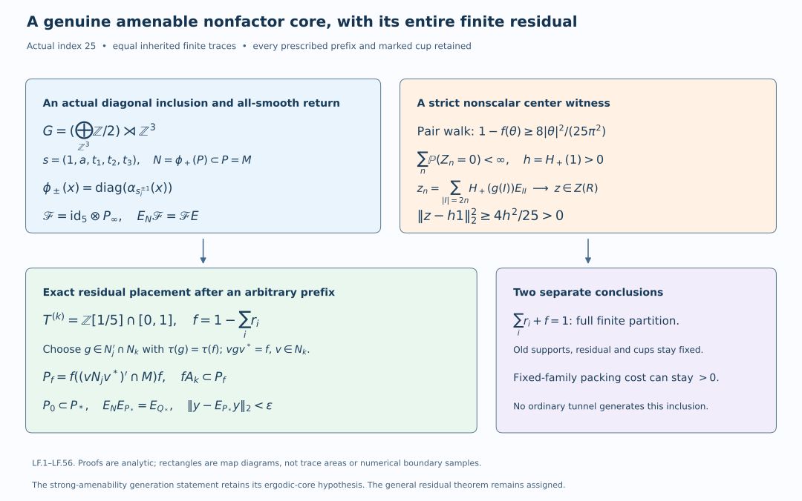

Figure LF.1. The upper panels retain the actual finite-index representation and strict nonscalar-center estimate. The lower panels give the exact scalar trace fiber and physical placement of the original residual, followed by the separate packing and generation obstructions. No area encodes a canonical trace, and the harmonic witness is an analytic proof rather than a numerical sample. Proofs: LF.1–LF.56 and the compatible-core argument LF.17. Human context: Popa (1994), §2.3.3(b), Example3.1.3(b), and Theorem4.4.1(1). [Reproducible figure and finite exact checks](figures/nonfactor-core-and-residual-v11.py).

## A quantitative obstruction to a common stage after a fixed prefix

**Theorem CF.1.** Use the actual amenable index-25 inclusion and ordinary tunnel of LF.1–LF.17. Prescribe its prefix through \(N_1\). There is a finite set of 625 physical unitaries \(Y\subset M\) and a constant \(c>0\) such that every actual finite continuation of this prefix, at every length \(m\geq1\), obeys

\[
\max_{u\in Y}\|u-E_{(N_m^{\mathcal T})'\cap M}(u)\|_2
\ \geq c=\frac{\sqrt2\,h_+}{5}.
\tag{CF.1}
\]

Nevertheless there is a full finite whole-tunnel square, retaining this prefix, whose target errors on the same \(Y\) are below \(h_+/10\). Its individual supported blocks cannot all be contained, as the same physical operators, in a single relative-commutant stage of any continuation of this prefix. Thus plain all-smooth amenability does not imply unrestricted common-stage alignment of a selected full family. This is a finite, quantitative obstruction; it does not require asking one tunnel to generate all of \(M\).

### The center witness retains its first finite conditional expectation

Let \(F=\operatorname{Mat}_{25}\otimes1\subset M\) be the full matrix factor on the first two \(Q\)-coordinates of LF.4, and write
\(A_1=N_1'\cap M=D_2^+\subset F\), by LF.12–LF.15. The witness \(z\) constructed in LF.39–LF.41 satisfies

\[
\begin{gathered}
z=z^*\in Z(R),\quad\|z\|\leq1,\quad\tau(z)=h_+>0,\\
E_{A_1}(z)=z_1,\qquad
\|z_1-h_+1\|_2^2\geq4h_+^2/25.
\end{gathered}
\tag{CF.2}
\]

The conditional expectation identity follows from the bounded central martingale: every later \(z_n\) has expectation \(z_1\), and conditional expectation is \(L^2\)-continuous.

Take any finite continuation \(\mathcal T\) of the same prescribed prefix. Extend it arbitrarily to an ordinary infinite tunnel; one-step existence 4.4 permits this. The compatible finite alignment proved in LF.17 can be started at the unchanged prefix \(N_1\). Every later correcting unitary lies in an already aligned predecessor contained in \(N_1\), and therefore fixes \(A_1\) pointwise. The resulting trace-preserving normal core isomorphism
\(\theta:R\to R_{\mathcal T}\) is the identity on \(A_1\). It does not assert that an infinite product of these unitaries converges.

Put \(z_{\mathcal T}=\theta(z)\). Trace pairing with every \(a\in A_1\) gives
\(\tau(a^*z_{\mathcal T})=\tau(a^*z)\); hence

\[
\begin{gathered}
z_{\mathcal T}=z_{\mathcal T}^*\in Z(R_{\mathcal T}),\quad
\|z_{\mathcal T}\|\leq1,\quad\tau(z_{\mathcal T})=h_+,\\
E_{A_1}(z_{\mathcal T})=z_1.
\end{gathered}
\tag{CF.3}
\]

This fixes a nonzero amount of variance before the continuation is chosen.
For \(x_{\mathcal T}=E_F(z_{\mathcal T})\), nested trace expectations imply
\(E_{A_1}(x_{\mathcal T})=z_1\), so

\[
\|x_{\mathcal T}-h_+1\|_2^2
\geq\|z_1-h_+1\|_2^2
\geq4h_+^2/25.
\tag{CF.4}
\]

### A fixed matrix twirl detects that variance in every continuation

On \(\mathbb C^{25}\) with coordinates \(e_j\), indices taken modulo 25, put
\(Se_j=e_{j+1}\), \(De_j=\exp(2\pi i j/25)e_j\), and

\[
Y=\{S^aD^b\otimes1:0\leq a,b<25\}.
\tag{CF.5}
\]

There are 625 unitaries. Direct matrix-entry summation first kills off-diagonal entries by the \(D\)-average and then averages the diagonal by the \(S\)-average. Thus
\(625^{-1}\sum_{u\in Y}u^*xu=\tau(x)1\) for \(x\in F\). Expanding the squared Hilbert norms for self-adjoint \(x\) gives

\[
\frac1{625}\sum_{u\in Y}\|[u,x]\|_2^2
=2\bigl(\|x\|_2^2-|\tau(x)|^2\bigr).
\tag{CF.6}
\]

The expectation \(E_F\) is \(F\)-bimodular and contractive in \(L^2\).
Consequently CF.4–CF.6 show

\[
\frac1{625}\sum_{u\in Y}\|[u,z_{\mathcal T}]\|_2^2
\geq\frac1{625}\sum_{u\in Y}\|[u,x_{\mathcal T}]\|_2^2
\geq\frac{8h_+^2}{25}.
\tag{CF.7}
\]

The relative commutant \(D_{\mathcal T,m}=(N_m^{\mathcal T})'\cap M\) is contained in \(R_{\mathcal T}\). The element \(z_{\mathcal T}\) commutes with all of it, including \(E_{D_{\mathcal T,m}}(u)\). Left and right multiplication by \(z_{\mathcal T}\) have \(L^2\)-norm at most one. Therefore

\[
\begin{aligned}
\|[u,z_{\mathcal T}]\|_2
&=\|[u-E_{D_{\mathcal T,m}}u,z_{\mathcal T}]\|_2\\
&\leq2\|u-E_{D_{\mathcal T,m}}u\|_2.
\end{aligned}
\tag{CF.8}
\]

Combining CF.7 and CF.8 gives
\(625^{-1}\sum_{u\in Y}\|u-E_{D_{\mathcal T,m}}u\|_2^2
\geq2h_+^2/25\), which proves CF.1. The arbitrary extension was used only to produce a central witness; the estimate applies to the original finite continuation at its specified length.

### The exact correction for a selected full family

Apply the unconditional full-partition result LF.15 to the same prefix, the same physical set \(Y\), and error \(h_+/10\). It gives a finite full square \(Q_*\subset P_*\), individual actual whole-inclusion continuations for all cells, both expectation orders, and
\(\|u-E_{P_*}u\|_2<h_+/10\) for every \(u\in Y\).
If \(P_*\subset D_{\mathcal T,m}\) for any continuation of the fixed prefix, best approximation would give
\[
\|u-E_{D_{\mathcal T,m}}u\|_2
\leq\|u-E_{P_*}u\|_2<h_+/10,
\tag{CF.9}
\]
contradicting CF.1. In particular retaining each of its old full blocks physically inside a common stage is impossible.

There is also a strict lower bound for approximate retention. Write \(a_u=E_{P_*}u\). If elements \(b_u\in D_{\mathcal T,m}\) retained these candidates with \(\|a_u-b_u\|_2<\eta\), then
\(\|u-E_{D_{\mathcal T,m}}u\|_2<h_+/10+\eta\).
CF.1 rules this out whenever
\(\eta\leq(\sqrt2/5-1/10)h_+\). Thus an arbitrarily cheap movement of the old candidates cannot restore common-stage alignment in this example.

The source's stronger common-stage approximation in §4.4 assumes an **ergodic core** and begins with supports in actual terminal **factors**. CF.1 concerns plain amenability and a full family of whole-relative-commutant supports; it does not refute that stronger statement. For this actual nonfactor example the full finite partition LF.15 remains valid, whereas the common-stage step after this prefix is false. An unrestricted proof must respect those distinct conclusions rather than add common-stage containment as a hidden intermediate requirement.

**Proof links.** [4.4–4.5, Going up and down the Jones tower](towers-and-tunnels.md), [46.6, A finite index can leave a boundary in the tunnel](nongenerating-tunnels-and-boundary.md), and LF.11, LF.15 and LF.17 above supply actual continuation existence, compatible finite core maps, the center witness and the full square. Matrix twirling and the quantitative bound CF.2–CF.9 are proved here. Human context: Sorin Popa, *Classification of amenable subfactors of type II*, Acta Mathematica 172 (1994), 163–255, [DOI 10.1007/BF02392646](https://doi.org/10.1007/BF02392646), §4.4, printed pp.220–222.

## A nonuniform Jones residual that requires support reselection

An actual amenable inclusion can have a finite whole-stage near-cover whose remaining physical projection admits no finite whole-stage partition. The obstruction persists when its trace is arbitrarily small, and when an arbitrary ordinary Jones prefix and all its cup operators are prescribed. Consequently, completing the general finite approximation cannot require retention of every previously selected support. In the example below, finite rank cuts give a complete replacement family and a quantitative approximation of the same physical targets. The two inherited finite traces are computed separately throughout.

The actual inclusion is the weighted balanced-word construction in [A generating tunnel with incompatible reflected traces](weighted-spin-tunnel.md), Lemma47.1, Proposition47.2 and Theorem47.4. Its amenability for every smooth expected representation is [General tail supports and controlled tunnels](general-tail-supports-and-controlled-tunnels.md), TheoremV9.5. The local corner isomorphisms, stabilization, cyclic averaging and finite-basis return in that proof apply to every \(0<p<1\), including irrational parameters. We use those complete proofs, rather than infer amenability from hyperfiniteness or generation. Finite marked tunnel alignment is 57.3; the general retained-prefix near-cover is 76.4; finite projection placement is 78.1–78.2; finite capacity cuts and their normal central limit are 80.1–80.4.

### The actual tunnel and its two finite traces

Choose a transcendental real number \(p\in(1/2,2/3)\), and put \(q=1-p\). Such parameters exist because the algebraic numbers are countable. Let

\[
 C_n=\operatorname{span}\{E_{uv}:|u|=|v|\}
     =\bigoplus_{r=0}^n\operatorname{Mat}_{\binom nr},
 \qquad \tau(E_{uu})=p^{n-r}q^r \quad(|u|=r).
 \tag{RF.1}
\]

The embeddings append an identity spin. Their trace restriction follows from \(p+q=1\). Let \(M=(\bigcup_n C_n)''\) in this inherited tracial representation, and write

\[
 H_a=(\bigcup_n1_2^{\otimes a}\otimes C_n)'',\qquad
 N=H_1,\qquad N_k=H_{k+1}.
 \tag{RF.2}
\]

The balanced-word proofs show that these are hyperfinite II₁ factors; \(N\subset M\) has index \(d=(pq)^{-1}\); and the shifted rank-one cups

\[
 |\sqrt q\,01+\sqrt p\,10\rangle
 \langle\sqrt q\,01+\sqrt p\,10|
 \tag{RF.3}
\]

on adjacent sites make RF.2 an ordinary Jones tunnel. Each cup has scalar lower expectation \(pq\,1\). The entire relative commutant is \(H_a'\cap M=C_a\), and every shifted relative-commutant union generates its physical tail factor. In particular the smaller core after \(N_k\) is exactly \(N_k\), a factor.

These are actual relative commutants of the index-\((pq)^{-1}\) inclusion, not a factor representation of an abstract path algebra. The two finite traces need not agree. Every minimal projection \(e\) in the charge-\(r\) block of \(C_n\) compresses \(H_n\subset M\) to an identity inclusion: a fixed initial word leaves precisely the balanced tail algebra. Its local index is therefore one. The actual local module formula2.4, with index \(d^n\), gives the normalized dual trace

\[
 \tau(e)=p^{n-r}q^r,
 \qquad \rho_n(e)=\frac1{d^n\tau(e)}=q^{n-r}p^r.
 \tag{RF.4}
\]

Both systems normalize because there are \(\binom nr\) words of charge \(r\). Both restrict under the actual Pascal embeddings: the two extension weights add to the earlier weight. We retain \(\rho_n\) as a normalized finite-module dual trace, distinct from the ambient normal trace \(\tau\) on \(M\). No normal extension of this specified dual trace to the inherited completion is asserted.

After a canonical prefix through \(N_k\), the smaller finite algebra at ordinary level \(k+n\) is

\[
 C_{k+n}^{(k)}=N_{k+n}'\cap N_k
              =1_2^{\otimes(k+1)}\otimes C_n.
 \tag{RF.5}
\]

Its physical and normalized dual minimal weights are exactly RF.4. For any prescribed actual finite prefix, finite marked alignment57.3 sends this canonical prefix to the prescribed one, including its cup operators. Conjugate a continuation of RF.2 by that finite aligning unitary. This produces a continuation of the prescribed prefix whose smaller core is the prescribed \(N_k\). No limiting unitary or normal extension of a reflection map is needed. In the formulas below the shifted algebras are understood through this fixed finite alignment when the prefix is prescribed.

### No finite family can fill the unchanged residual

**Lemma RF.1 — every finite origin has a positive endpoint polynomial.** Every projection with an actual whole-inclusion finite smaller-relative-commutant origin has physical trace \(H(p)\), where

\[
 H(x)=\sum_{r=0}^n h_r x^{n-r}(1-x)^r\in\mathbb Z[x],
 \quad 0\leq h_r\leq\binom nr,
 \quad H(1)=h_0\in\{0,1\}.
 \tag{RF.6}
\]

This includes every finite origin after the prescribed prefix, with the same formula for its smaller factor \(N_k\). In particular any finite sum of such trace polynomials has nonnegative value at \(x=1\).

**Proof.** RF.1 and RF.5 give the formula by taking integer matrix ranks in each full block. The charge-zero block has size one, giving the final assertion. A different finite continuation has the same inherited finite trace set by marked finite tunnel alignment57.3, inside the appropriate physical smaller factor. Thus its trace is represented by a polynomial of the displayed form. At depth zero the polynomial is a constant zero or one, which is also included. The last assertion follows by adding the nonnegative endpoint ranks. Evaluation at \(x=1\) is a polynomial calculation; it does not claim that the physical parameter \(p=1\) defines an allowed inclusion. \(\square\)

**Theorem RF.2 — an actual finite-family residual obstruction.** Fix any prescribed ordinary prefix through \(N_k\), an integer \(n\geq1\), and an integer \(m\geq2\) such that \(mp^n<1\). There are \(m\) physically orthogonal projections \(r_i\in N_k\), each with a whole finite origin after that prefix, such that

\[
 \tau(r_i)=p^n,
 \qquad f=1-\sum_{i=1}^m r_i,
 \qquad \tau(f)=1-mp^n>0.
 \tag{RF.7}
\]

There is no finite orthogonal family \(s_a\leq f\), summing to \(f\), whose members all have whole-inclusion finite smaller-relative-commutant origins. This remains impossible even if each new member uses its own unrestricted actual finite continuation. Thus allowing several new residual cells does not remove this obstruction.

**Proof.** The all-zero path projection \(g_n=1^{\otimes(k+1)}\otimes E_{0^n,0^n}\in C_{k+n}^{(k)}\) has trace \(p^n\). The physical II₁ factor \(N_k\) has \(m\) mutually orthogonal projections of that trace, since \(mp^n<1\). Equal-trace factor comparison, including comparison of the complements, gives \(U_i\in\mathcal U(N_k)\) with \(r_i=U_ig_nU_i^*\). Conjugate only the continuation for the \(i\)-th cell by \(U_i\). All earlier factors are preserved as algebras, every earlier cup is fixed as an operator, and \(r_i\) belongs to that continuation's whole finite smaller relative commutant. Every element of \(A_k=N_k'\cap M\) is fixed pointwise by \(U_i\).

If the claimed residual partition existed, LemmaRF.1 would represent the traces of its finitely many cells by integer polynomials \(H_a\) with \(H_a(1)\geq0\). Physical additivity would give

\[
 \sum_aH_a(p)=1-mp^n.
 \tag{RF.8}
\]

Transcendence of \(p\) means that an integer polynomial vanishing at \(p\) is the zero polynomial. Hence RF.8 is the polynomial identity \(\sum_aH_a(x)=1-mx^n\). At \(x=1\) its left side is nonnegative and its right side is \(1-m<0\), a contradiction. The proof did not require a common finite stage, a common continuation, or a prescribed rank class for the new cells. \(\square\)

**Corollary RF.3 — arbitrarily small genuine near-cover residuals.** For every \(\theta>0\), a finite whole-stage near-cover satisfying the exact retained-prefix square identities of76.4 can have \(0<\tau(f)<\theta\) and the impossibility in TheoremRF.2.

**Proof.** Choose \(n\) with \(p^n<\min(\theta,1/2)\), and set \(m=\lfloor p^{-n}\rfloor\). Since \(p\) is transcendental, \(p^{-n}\notin\mathbb Z\); thus \(m\geq2\) and

\[
 0<1-mp^n<p^n<\theta.
 \tag{RF.9}
\]

Use the physical supports and their individual continuations from TheoremRF.2. Put \(j=k+n\), \(A_k=N_k'\cap M\), \(B_k=N_k'\cap N\), and

\[
 \begin{aligned}
 P_0&=\bigoplus_i r_iU_i(N_j'\cap M)U_i^*r_i\ \oplus\ fA_k,\\
 Q_0&=\bigoplus_i r_iU_i(N_j'\cap N)U_i^*r_i\ \oplus\ fB_k,\\
 D_0&=\bigoplus_i r_iU_i(N_j'\cap N_k)U_i^*r_i\ \oplus\mathbb Cf.
 \end{aligned}
 \tag{RF.10}
\]

The sums are finite-dimensional unital direct sums with physically orthogonal units. Actual finite-stage expectation and bimodularity give \(E_N(P_0)=Q_0\) and \(E_{N_k}(P_0)=D_0\); on the residual use \(E_N(A_k)=B_k\) and \(E_{N_k}(A_k)=\mathbb C1\). Trace pairing and Hilbert-space adjoints give all three commuting-square identities76.25. Each \(U_i\in N_k\) fixes \(A_k\), so \(A_k\subset P_0\), \(B_k\subset Q_0\); the earlier cups are retained. For the target set \(Y=\{1\}\), approximation is exact and all local commutator and compression errors are zero. The selected support sum has trace above \(1-\theta\).

For the additional commuting matrix algebra in76.4, the unit-\(r_i\) factor \(r_iU_iN_jU_i^*\) commutes with its full supported block, and \(fN_kf\) commutes with \(fA_k\). Choose unital \(\operatorname{Mat}_2\) units in these factors and sum corresponding units. This is a unital \(\operatorname{Mat}_2\subset N_k\) commuting with \(P_0\). Thus RF.10 supplies all the near-cover properties in76.4, while TheoremRF.2 prevents a full finite repair wholly within its unchanged residual. \(\square\)

The corollary constructs witnesses for the near-cover conclusion. It does not claim that every possible selection in76.4 fails. The unrestricted finite-partition theorem permits a different finite family.

### A complete corrected family after small physical cuts

**Theorem RF.4 — the marked full partition in this actual model.** For the inclusion RF.2, any prescribed ordinary prefix through \(N_k\), finite \(Y\subset M\), and \(\varepsilon>0\) admit unital finite-dimensional \(D_*\subset Q_*\subset P_*\subset M\), with \(D_*\subset N_k\), \(Q_*\subset N\), a finite full orthogonal support partition, and

\[
 \begin{gathered}
 A_k\subset P_*,\quad B_k\subset Q_*,\quad
 \|y-E_{P_*}y\|_2<\varepsilon\quad(y\in Y),\\
 E_NE_{P_*}=E_{P_*}E_N=E_{Q_*},\\
 E_{N_k}E_{P_*}=E_{P_*}E_{N_k}=E_{D_*},\\
 E_{N_k}E_{Q_*}=E_{Q_*}E_{N_k}=E_{D_*}.
 \end{gathered}
 \tag{RF.11}
\]

Every supported triple is the full relative-commutant triple of an actual whole finite continuation after the original prefix. The factors in that prefix and its cup operators are retained exactly. The physical targets remain fixed. The old selected supports may be cut.

More quantitatively, let a finite near-cover \(D_0\subset Q_0\subset P_0\) of76.4 already be selected, with supports \(r_i\in N_k\), residual \(f=1-\sum_i r_i\), and respective finite continuations. For every \(\eta>0\) there is such a completion with \(r_i'\leq r_i\), residual \(f_*=f+\sum_i(r_i-r_i')\), and total physical cut trace less than \(\eta\). At the chosen finite stage its actual cut cost \(\Delta\) gives, for **every** \(y\in M\),

\[
 \|y-E_{P_*}y\|_2
 \leq\|y-E_{P_0}y\|_2
       +(1+\sqrt2)\|y\|\sqrt\Delta.
 \tag{RF.12}
\]

**Proof of the actual finite selection.** Choose the continuation of the prescribed prefix constructed after RF.5. Its smaller core is the physical factor \(N_k\). Set

\[
 A_J=N_J'\cap M,\quad B_J=N_J'\cap N,\quad
 C_J=N_J'\cap N_k.
 \tag{RF.13}
\]

For each old selected cell, finite marked alignment after the fixed prefix gives \(U_i\in\mathcal U(N_k)\) mapping a canonical continuation to its given finite continuation. Put \(g_i=U_i^*r_iU_i\), and regard the finitely many \(g_i\) as elements of one sufficiently late canonical \(C_J\). Extend the old individual continuations by \(U_iN_lU_i^*\), retaining their previously selected finite segments.

In each block of \(C_J\), let \(h_{i\ell}\) be the rank of \(g_i\), \(c_\ell\) its unit rank, and \(\omega_\ell\) its physical minimal weight. The actual minimum removed physical trace is

\[
 \Delta_J=\sum_\ell\omega_\ell
                  (\sum_i h_{i\ell}-c_\ell)_+.
 \tag{RF.14}
\]

The complete normal averaging proof80.1–80.3 applies to the increasing **actual** algebras \(C_J\subset N_k\). Their union generates \(N_k\), so their normal center-valued trace is scalar. Consequently

\[
 \Delta_J\downarrow
 (\sum_i\tau(g_i)-1)_+=0,
 \tag{RF.15}
\]

because the physical \(r_i\) are orthogonal. This invokes factoriality proved for this weighted model; it does not infer factoriality from amenability in general.

At a sufficiently late finite \(J\), remove exactly the excess dimensions in each block, choosing \(g_i'\leq g_i\) there. The retained ranks have mutually orthogonal representatives \(q_i\in C_J\); choose them on disjoint diagonal coordinate sets. Then

\[
 \begin{gathered}
 q_0=1-\sum_iq_i\in C_J,\quad
 r_i'=U_ig_i'U_i^*\leq r_i,\\
 d_i=r_i-r_i',\quad
 \sum_i\tau(d_i)=\Delta_J,\\
 f_*=f+\sum_i d_i,\qquad \tau(f_*)=\tau(q_0).
 \end{gathered}
 \tag{RF.16}
\]

Factor comparison in \(N_k\) gives \(v\in\mathcal U(N_k)\) with \(vq_0v^*=f_*\). Use its conjugated canonical continuation for just this residual block. The full rows are

\[
 \begin{aligned}
 P_*&=\bigoplus_i r_i'U_iA_JU_i^*r_i'\ \oplus\ f_*vA_Jv^*f_*,\\
 Q_*&=\bigoplus_i r_i'U_iB_JU_i^*r_i'\ \oplus\ f_*vB_Jv^*f_*,\\
 D_*&=\bigoplus_i r_i'U_iC_JU_i^*r_i'\ \oplus\ f_*vC_Jv^*f_*.
 \end{aligned}
 \tag{RF.17}
\]

Omit zero supports. The physical units sum to one. Actual finite-stage expectation, equivariance under \(U_i,v\in N_k\), and support bimodularity prove \(E_N(P_*)=Q_*\) and \(E_{N_k}(P_*)=D_*\). Trace pairing and adjoints prove RF.11. Every unitary used lies in \(N_k\); it fixes \(A_k\) pointwise and every earlier cup. Summing all supported compressions recovers \(A_k\) and \(B_k\). The initial factors are retained as algebras; pointwise fixation of the whole physical \(N_k\) is not asserted.

**Proof of the physical-target estimate.** Fix \(y\in M\), write \(a=E_{P_0}y\), and put \(R=\|y\|\). Then \(\|a\|\leq R\). Its old residual component is \(fc\) for \(c\in A_k\) of norm at most \(R\). If \(f\ne0\), multiplication \(c\mapsto fc\) is an injective *-homomorphism: \(E_{N_k}(c^*c)=\tau(c^*c)1\) gives \(\tau(fc^*c)=\tau(f)\tau(c^*c)\), so its kernel is zero. An injective *-homomorphism preserves norm. If \(f=0\), take \(c=0\).

Set \(a_i=r_i a r_i\). Since the old finite stages were extended, \(r_i'a_ir_i'\) belongs to the \(i\)-th new full block. Also \(f_*c\in f_*vA_Jv^*f_*\). Therefore

\[
 b=\sum_i r_i'a_i r_i'+f_*c\in P_*,\qquad
 a-b=\sum_i(a_i-r_i'a_ir_i'-d_i c).
 \tag{RF.18}
\]

The latter summands have orthogonal old supports. For \(e=r_i'\), \(d=d_i\),

\[
 a_i-ea_ie=da_i+ea_id,\qquad
 \|a_i-ea_ie\|_2^2\leq2R^2\tau(d),\qquad
 \|dc\|_2\leq R\sqrt{\tau(d)}.
 \tag{RF.19}
\]

The first two terms have orthogonal left supports, and each squared norm is at most \(R^2\tau(d)\). The triangle inequality in the Hilbert direct sum of the old supports yields \(\|a-b\|_2\leq(1+\sqrt2)R\sqrt{\Delta_J}\). Best approximation by \(E_{P_*}\) and triangle inequality give RF.12. This estimates the original \(y\); no target has been conjugated with a tunnel.

To obtain the unconditional finite approximation, apply76.4 with error \(<\varepsilon/2\), justified by the actual all-smooth amenability proofV9.5 and higher heredity76.3. Let \(R_Y=\max(1,\max_{y\in Y}\|y\|)\). By RF.15 choose finite \(J\) with \(\Delta_J<\eta\) and \((1+\sqrt2)R_Y\sqrt{\Delta_J}<\varepsilon/2\). RF.17–RF.19 prove the asserted full partition and all errors. If all old selected supports are to remain nonzero, also take \(\Delta_J<\min_i\tau(r_i)\). \(\square\)

The new residual contains the entire original physical \(f\), but may also contain cut pieces of earlier supports. TheoremRF.2 proves why this alteration cannot generally be omitted. Whole support origins and every finite dual trace are transported through actual continued/conjugated Jones triples; RF.4 never replaces the dual weights by the physical weights. Its norm estimate uses the physical trace \(\tau\), as the finite approximation theorem requires.

### Explicit costs for both traces in the obstructing family

For the \(m\) copies of \(g_n\) in RF.7, at length \(J\geq n\) after the prefix the unit capacity and each copy's ranks are

\[
 c_{Jr}=\binom Jr,\qquad h_{Jr}=\binom{J-n}{r}.
 \tag{RF.20}
\]

A binomial coefficient beyond its allowed range is zero. Appending the last \(J-n\) spins proves this formula. Cutting exactly the excess \(e_{Jr}=(m h_{Jr}-c_{Jr})_+\) gives the two actual losses

\[
 \begin{aligned}
 \Delta_J^\tau&=\sum_{r=0}^Jp^{J-r}q^r e_{Jr},\\
 \Delta_J^\rho&=\sum_{r=0}^Jq^{J-r}p^r e_{Jr}.
 \end{aligned}
 \tag{RF.21}
\]

These are distinct evaluations of the same removed integer dimensions. The canonical complement certificate has exact trace values

\[
 \tau(q_0)=1-mp^n+\Delta_J^\tau,\qquad
 \rho_J(q_0)=1-mq^n+\Delta_J^\rho.
 \tag{RF.22}
\]

The physical placement \(vq_0v^*=f_*\) preserves the first value. The actual finite dual trace of its new conjugated continuation is the second value, by conjugation equivariance of the finite module trace. There was no whole-stage dual certificate for the original \(f\); none is silently assigned to it. On every retained old cell, extension preserves both previous finite traces and its cut removes exactly the corresponding weights in RF.21.

**Proposition RF.5 — finite bounds on the two losses.** Put \(a=m^{-1/n}\), \(\delta_\tau=a-p>0\), and \(\delta_\rho=a-q>0\). Then

\[
 0<\Delta_J^\tau\leq\frac{(m-1)pq}{J\delta_\tau^2},\qquad
 0<\Delta_J^\rho\leq\frac{(m-1)pq}{J\delta_\rho^2}.
 \tag{RF.23}
\]

Thus in this obstructing family the lost mass can be made arbitrarily small for both actual trace systems, while preserving the earlier marks and controlling every physical-target error by RF.12.

**Proof.** \(mp^n<1\) gives \(a>p\). Since \(p>1/2\), \(q<p\), so \(a>q\) also. For any \(r\leq J-n\),

\[
 \frac{h_{Jr}}{c_{Jr}}
 =\frac{(J-r)(J-r-1)\cdots(J-r-n+1)}{J(J-1)\cdots(J-n+1)}
 \leq(1-r/J)^n.
 \tag{RF.24}
\]

Each factor is at most \(1-r/J\). If \(r>J-n\), the ratio is zero and the same bound remains valid. A positive excess requires \(1-r/J>a\). Under the physical block masses \(\binom Jr p^{J-r}q^r\), the random variable \(r\) is binomial with mean \(Jq\) and variance \(Jpq\). On the excess event, \(r/J<1-a=q-\delta_\tau\). The excess fraction \((m h_{Jr}/c_{Jr}-1)_+\) is at most \(m-1\). Chebyshev's inequality, proved by integrating \((r/J-q)^2\geq\delta_\tau^2\) on that event, gives the first upper bound. Under the dual block masses the mean is \(Jp\); the same event is \(r/J<1-a=p-\delta_\rho\), yielding the second bound. At \(r=0\), \(h_{J0}=c_{J0}=1\), so \(e_{J0}=m-1\). Hence the physical loss is at least \((m-1)p^J>0\) and the dual loss at least \((m-1)q^J>0\) at every finite stage. \(\square\)

For a specified extra physical tolerance \(\zeta>0\) on targets of norm at most \(R>0\), RF.12 and RF.23 show that it suffices to choose a finite integer

\[
 J\geq n,\qquad
 J>\frac{(1+\sqrt2)^2R^2(m-1)pq}{\zeta^2\delta_\tau^2}.
 \tag{RF.25}
\]

An additional dual-loss budget \(\beta>0\) is satisfied by also taking \(J>(m-1)pq/(\beta\delta_\rho^2)\). These are genuine finite choices. No limit projection is substituted for the required finite complement.

For \(n=2,m=2,J=4\), the integer table is

| Charge \(r\) | 0 | 1 | 2 | 3 | 4 |
|---|---:|---:|---:|---:|---:|
| Unit capacities \(c_{4r}\) | 1 | 4 | 6 | 4 | 1 |
| Two-copy ranks \(2h_{4r}\) | 2 | 4 | 2 | 0 | 0 |
| Removed ranks \(e_{4r}\) | 1 | 0 | 0 | 0 | 0 |
| Complement ranks | 0 | 0 | 4 | 4 | 1 |

It gives \(\Delta_4^\tau=p^4\), \(\Delta_4^\rho=q^4\), and

\[
 \tau(q_0)=4p^2q^2+4pq^3+q^4=1-2p^2+p^4.
 \tag{RF.26}
\]

The original residual polynomial \(1-2x^2\) has value \(-1\) at one. The corrected complement polynomial in RF.26 has value zero there and has the displayed valid ranks. For greater accuracy choose RF.25, rather than claim that this single finite table proves convergence.

**Human mathematical context.** Sorin Popa, [*Classification of amenable subfactors of type II*](https://doi.org/10.1007/BF02392646), Acta Mathematica 172 (1994), 163–255, §4.4 and Theorem4.4.1, printed pp.220–222. The finite theorem permits an individual continuation on every supported piece; it does not require preservation of a preselected residual. The weighted model and its all-smooth amenability are proved in the linked readings.

**Further proof links.** [57.3, Actual supported local approximation](actual-supported-local-approximation.md), [76.3–76.4, Whole relative-commutant blocks](whole-relative-commutant-blocks.md), [78.1–78.2, Exact trace certificates close the finite-depth residual](trace-certificates-and-exact-finite-partitions.md), and [80.1–80.4, Central capacity and small cuts of whole-tunnel supports](central-capacity-and-small-support-cuts.md) supply the finite marked alignment, higher-factor heredity, trace placement and rank-cut normal limit used above.

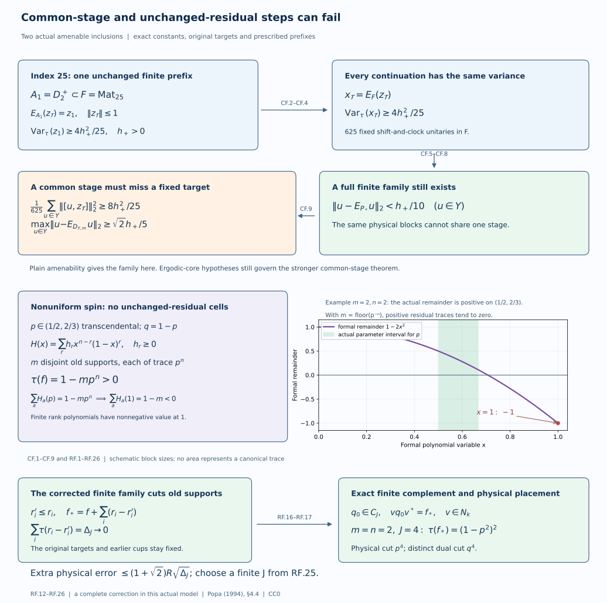

Figure CF–RF.1. Top: the same first finite conditional expectation of the transported center witness forces the lower error bound for 625 fixed physical targets. Middle: the formal polynomial variable is distinct from the transcendental physical parameter; the negative endpoint excludes every finite sum of candidate rank polynomials. Bottom: the actual physical cuts enlarge the residual, a finite valid rank certificate is placed there, and the original targets retain the stated error bound. All block sizes are schematic; no area represents a canonical trace. Proofs: CF.1–CF.9 and RF.1–RF.26. Human context: Popa (1994), §4.4, cited above. [Reproducible diagram source](figures/prefix-and-residual-obstructions-v12.py).

## A finite smooth representation selected by one compatible state

The state-dependent construction below produces a genuine finite tracial smooth representation and an exact completely positive return to the original expected pair. It works for singular original states and retains the physical inclusion at every finite Jones stage. At a true original cost minimizer, however, the minimum of the transported original cost is unchanged. Thus this construction does not prove the unrestricted existence of an original joint-balanced hypertrace. The last section identifies the exact bounded test that remains unproved.

### The original data

Let \(N\subset M\) be the original proper finite-index II₁ inclusion, with its physical normalized trace \(\tau\) and index \(d\). Fix the original ordinary tunnel, its actual core \(S\subset R\), and
\[
 e=e_R^M,\qquad A=\langle N,e\rangle\subset B=\langle M,e\rangle,
 \qquad E=E_A:B\longrightarrow A.
 \tag{TR12.1}
\]
The canonical expectation is normal and faithful, satisfies \(E|_M=E_N\), and has the finite common partial basis \((a_i)\subset M\). Thus
\[
 x=\sum_i a_iE(a_i^*x),\quad
 E_N(a_i^*a_j)=\delta_{ij}f_i,\quad
 a_if_i=a_i,\quad \sum_i a_i a_i^*=d1,
 \qquad E(x)\ge d^{-1}x\quad(x\ge0).
 \tag{TR12.2}
\]
These are the exact finite-row conclusions of [61.1–61.2](smooth-representations-and-tower-compression.md), including their complete matrix proof. Smoothness is retained in its original all-stage sense: \(N'\cap M_j\) commutes with \(A\) in the represented stage \(B_j\), for every finite \(j\).

Keep both original canonical semifinite traces on \(A,B\), their original full-corner center identification \(\iota\), and the original finite tracial expectations
\[
 U=Z(S),\quad V=Z(R),\quad D_0=U\vee V,
 \qquad Q=E_U|_{D_0},\quad P_0=E_V|_{D_0}.
\]
For an identity-containing common basis, let
\[
 g=\sum_i a_i^*a_i,\quad z=E_{N'\cap M}(g),\quad
 w=d^{-1}E_{D_0}(g),\quad \ell=d^{-1}E_{D_0}(z),
 \qquad \mathfrak a=\iota\bigl(dQ(|w-\ell|)\bigr)\in Z(A)_+.
 \tag{TR12.3}
\]
Here \(w,\ell\) are bounded and bounded away from zero. These are the original objects of V9.1–V9.2, not costs recomputed using a new trace.

Let \(\psi\) be any original compatible hypertrace:
\[
 \psi E=\psi,\qquad \psi|_M=\tau,\qquad
 \psi(mx)=\psi(xm)\quad(m\in M,\ x\in B).
 \tag{TR12.4}
\]
The original amenability assumption supplies such a state in this smooth representation. Its restrictions to the original represented centers may be singular. AS.2 proves that \(D=\iota(D_0)\) also belongs to its centralizer.

### The support lies in the smaller enveloping algebra

We use \(A^{**},B^{**}\) as enveloping von Neumann algebras of the underlying C*-algebras, with their canonical inclusion. The inclusion \(A^{**}\subset B^{**}\) is faithful: bounded functionals on \(A\) extend to \(B\) by Hahn–Banach, so the adjoint restriction is surjective and the double-adjoint inclusion is injective. The expectation extends to the normal expectation \(E^{**}:B^{**}\to A^{**}\). Its bimodularity and positive lower bound in (TR12.2) extend by weak-star approximation and the weak-star closedness of the positive cone. In particular \(E^{**}\) is faithful.

The state \(\psi\) has its normal extension \(\widetilde\psi\) to \(B^{**}\), and \(\widetilde\psi E^{**}=\widetilde\psi\). This extension is normal on the enveloping algebra; it need not be normal on the original \(B\).

**Lemma TR12.1.** The support of \(\widetilde\psi\) is exactly the support \(q\in A^{**}\) of its restriction to \(A^{**}\). Moreover \(q\) commutes with the physical \(M\) and with the original \(D\). The state is faithful on \(qB^{**}q\).

**Proof.** Since \(\widetilde\psi(q)=1\), its support in \(B^{**}\) is at most \(q\). If \(x\in(qB^{**}q)_+\) and \(\widetilde\psi(x)=0\), then
\[
 E^{**}(x)\in(qA^{**}q)_+,\qquad
 \widetilde\psi(E^{**}(x))=0.
\]
The restriction is faithful on its support corner, so \(E^{**}(x)=0\). The lower bound \(E^{**}(x)\ge d^{-1}x\) gives \(x=0\). Thus the full state is faithful on this corner and its full support is \(q\).

Every unitary of the original state centralizer leaves \(\psi\) invariant by conjugation. Its conjugation invariance extends normally to \(B^{**}\); uniqueness of the support gives \(uqu^*=q\). The physical \(M\) and the original \(D\) are in this centralizer, so their unitaries commute with \(q\). Every element of a unital C*-algebra is a linear combination of its unitaries, giving the asserted commutations. \(\square\)

Put
\[
 \mathcal B=qB^{**}q,\quad \mathcal A=qA^{**}q,
 \qquad E^q=E^{**}|_{\mathcal B},\qquad
 \phi=\widetilde\psi|_{\mathcal B},\qquad j(m)=qm=mq.
 \tag{TR12.5}
\]
Both corners have unit \(q\). The map \(j:M\to\mathcal B\) is an actual unital *-homomorphism, faithful because \(\phi(j(m)^*j(m))=\tau(m^*m)\). It is normal. Indeed, if \(0\le m_\lambda\uparrow m\), then the positive difference between \(j(m)\) and \(\sup_\lambda j(m_\lambda)\) has zero \(\phi\)-value by normality of \(\tau\) and \(\phi\), and therefore is zero by faithfulness of \(\phi\). The restriction to \(N\) is normal and faithful as well. Further,
\[
 E^q(j(m))=j(E_N(m)),\qquad
 x=\sum_i j(a_i)E^q(j(a_i)^*x)\quad(x\in\mathcal B).
 \tag{TR12.6}
\]
The latter formula follows by extending (TR12.2) normally and using \([q,a_i]=0\). Thus this is a normal faithful nondegenerate expected representation of the original physical pair. Compression \(T\mapsto qTq\) on all of \(B\) is a UCP map into this new corner. Its multiplicativity on physical \(M\) follows from the displayed commutation; no multiplicativity on the entire \(B\) is asserted.

### Passing to the faithful-state centralizer

For a faithful normal state \(\phi\) on \(\mathcal B\), define its centralizer by the bounded equations
\[
 \mathcal V_\psi=\{x\in\mathcal B:
       \phi(xy)=\phi(yx)\text{ for every }y\in\mathcal B\},
 \qquad \mathcal U_\psi=\mathcal A\cap\mathcal V_\psi.
 \tag{TR12.7}
\]
The centralizer is a von Neumann algebra: its equations are ultraweakly closed, and successive cyclicity proves product closure; taking adjoints proves star closure. The restriction \(\tau_\psi=\phi|_{\mathcal V_\psi}\) is a faithful normal tracial state. Physical \(j(M)\) and \(qDq\) lie in this centralizer. For example, the original bounded centralizer equations extend normally to \(B^{**}\) before restricting to the support corner.

**Lemma TR12.2.** \(E^q\) maps \(\mathcal V_\psi\) into \(\mathcal U_\psi\). Its restriction
\[
 E_\psi:\mathcal V_\psi\longrightarrow\mathcal U_\psi
 \tag{TR12.8}
\]
is a normal faithful \(\tau_\psi\)-preserving conditional expectation. Also \(\mathcal U_\psi\) is the centralizer of \(\phi|_{\mathcal A}\) inside \(\mathcal A\).

**Proof.** For \(x\in\mathcal V_\psi\) and \(y\in\mathcal B\), compatibility and bimodularity give
\[
 \phi(E^q(x)y)
 =\phi(E^q(x)E^q(y))
 =\phi(xE^q(y))
 =\phi(E^q(y)x)
 =\phi(yE^q(x)).
\]
Thus \(E^q(x)\in\mathcal A\cap\mathcal V_\psi\). The remaining expectation properties are inherited from \(E^q\). If \(u\in\mathcal A\) centralizes the restricted state, then for every \(y\in\mathcal B\),
\[
 \phi(uy)=\phi(uE^q(y))=\phi(E^q(y)u)=\phi(yu).
\]
Hence it centralizes the full state. The converse is immediate. \(\square\)

The physical basis \(j(a_i)\) is in \(\mathcal V_\psi\). For \(x\in\mathcal V_\psi\), each \(E^q(j(a_i)^*x)\) is in \(\mathcal U_\psi\). Consequently (TR12.6) is a finite spanning formula for \(\mathcal V_\psi\) over \(\mathcal U_\psi\). This proves nondegeneracy of
\[
 \mathcal U_\psi\subset_{E_\psi}\mathcal V_\psi,
 \qquad j(N)\subset j(M).
 \tag{TR12.9}
\]
This representation is finite tracial without any assumption that \(\psi\) was normal on the original represented centers.

### Smoothness at every finite physical tower stage

**Theorem TR12.3.** The expected representation (TR12.9) is smooth at every finite Jones stage. Its physical embeddings \(M_j\to(\mathcal V_\psi)_j\) are actual faithful normal *-homomorphisms, preserve the original physical traces, expectations and marked Jones projections, and have the original scalar index normalization \(d\).

**Proof.** We give the comparison of towers explicitly. Use the common physical partial basis at a given stage and write its support matrix as \(p=\operatorname{diag}(f_i)\). The original represented next stage is
\[
 p\operatorname{Mat}_{t_0}(A)p,
 \qquad L(x)_{ij}=E(a_i^*xa_j),
 \tag{TR12.10}
\]
with its marked Jones projection and dual expectation given by 61.2. Its enveloping algebra is the corresponding corner of \(\operatorname{Mat}_{t_0}(A^{**})\): this follows from the finite matrix units and the faithful double-adjoint inclusions of the supported corners. Since \(q\in A^{**}\) commutes with \(a_i,f_i\),
\[
 L^{**}(q)_{ij}
 =E^{**}(a_i^*qa_j)
 =qE_N(a_i^*a_j)
 =\delta_{ij}qf_i.
 \tag{TR12.11}
\]
Thus the next support corner is exactly
\[
 p\operatorname{Mat}_{t_0}(qA^{**}q)p,
\]
the finite matrix construction of \(\mathcal A\subset_{E^q}\mathcal B\). For \(x\in qB^{**}q\), its entries are \(E^q(j(a_i)^*xj(a_j))\), so the comparison is an actual identity of these concrete finite matrix models. The represented Jones projection commutes with \(q\), since it commutes with the represented smaller algebra. The next common basis \(\sqrt d\,a_i e_A\) therefore also commutes with \(q\). Repeat (TR12.11) using this next physical basis. Induction identifies every finite support-corner stage with the corner of the original enveloping represented stage, retains every marked cup and dual expectation, and retains the normalization \(d\).

Now include \(\mathcal U_\psi\subset\mathcal A\), \(\mathcal V_\psi\subset\mathcal B\). At the first matrix stage the inclusion is the entrywise faithful normal inclusion
\[
 p\operatorname{Mat}_{t_0}(\mathcal U_\psi)p
 \subset p\operatorname{Mat}_{t_0}(\mathcal A)p.
\]
All multiplication, Jones projection and dual expectation formulas use the same finite physical row. The subsequent bases \(\sqrt d\,j(a_i)e_{E_\psi}\), and their iterates, are likewise the same physical marked rows. Iteration therefore embeds every finite tower of (TR12.9) faithfully and normally into the corresponding tower of the support-corner pair.

The physical next stage is the identical matrix model with \(N\) in place of the represented smaller algebra. Entrywise application of the already faithful normal embedding of \(N\) gives its faithful normal *-embedding. At the next step use the faithful normal embedding of \(M\); continue recursively. This proves normal faithfulness at every physical stage without assuming that the original inclusion \(B\to B^{**}\) is normal. The restricted dual expectations are the original finite row formulas, and the physical marked cups have weight \(d^{-1}\).

The finite tracial tower normalization can also be checked on its spanning words. If \(\tau_j\) is the preceding trace and \(e_j\) its marked cup, the next trace is \(\tau_j\circ E_{j+1}\), with value \(d^{-1}\tau_j(yx)\) at \(xe_jy\). For two such words, cyclicity reduces to
\[
 \tau_j(txE_j(yz))
 =\tau_j(E_j(tx)E_j(yz))
 =\tau_j(yzE_j(tx)).
\]
This is trace adjointness for the preceding tracial expectation. The finite spanning identity of 61.2 gives traciality on the whole next stage. Normality and faithfulness follow from the normal faithful preceding trace and dual expectation, and \(E_{j+1}(1)=1\) gives normalization. Restriction to the physical Jones words is therefore the original normalized physical tower trace, at every stage. This retains both physical traces used to compare relative commutants, including the normalized dual trace, rather than identifying them.

Finally take \(c\in N'\cap M_j\). Original smoothness gives commutation with \(A\) in \(B_j\). Fixed multiplication and normality extend that identity to commutation with the canonical image of \(A^{**}\) in the enveloping stage. In particular \([c,q]=0\), and \(qcq\) commutes with \(qA^{**}q\). Under the concrete tower identifications just proved, its physical image therefore commutes with \(\mathcal U_\psi\). This is the required smoothness at this \(j\). Since the argument applies at every finite \(j\), it proves the full original smoothness condition. \(\square\)

### A normal return constructed by bounded right multiplication

The following argument supplies a return map on the full original \(B\). It does not require a modular averaging theorem.

**Lemma TR12.4.** There is a normal UCP conditional expectation
\[
 \Gamma_\psi:\mathcal B\longrightarrow\mathcal V_\psi
\]
which preserves \(\phi\), maps \(\mathcal A\) into \(\mathcal U_\psi\), and satisfies
\[
 E_\psi\Gamma_\psi=\Gamma_\psi E^q.
 \tag{TR12.12}
\]

**Proof.** Take the GNS Hilbert space of the faithful normal state \(\phi\), with dense vectors \(x\Omega\). The left representation \(\pi_\phi\) is faithful and normal: its coefficients on dense vectors are \(x\mapsto\phi(y^*xy)\), which are normal; polarization and norm approximation give normal coefficients on every vector. Faithfulness follows by testing at \(\Omega\).

For \(v\in\mathcal V_\psi\), define bounded right multiplication by
\[
 \rho(v)(x\Omega)=xv\Omega.
\]
Its squared norm satisfies
\[
 \|xv\Omega\|^2
 =\phi(v^*x^*xv)=\phi(x^*xvv^*)
 \le \|v\|^2\phi(x^*x).
 \tag{TR12.13}
\]
The last order estimate is legitimate even though \(x^*x\) need not commute with \(vv^*\): for any positive centralizer element \(h\), cyclicity of \(h^{1/2}\) gives \(\phi(yh)=\phi(h^{1/2}yh^{1/2})\ge0\) for \(y\ge0\). Apply this to \(\|v\|^21-vv^*\). The same cyclicity gives \(\rho(v)^*=\rho(v^*)\). Thus \(\rho\) is a bounded *-anti-representation and commutes with the whole left action.

Let \(H_0=\overline{\mathcal V_\psi\Omega}\), and let \(p_0\) project onto it. This is exactly \(L^2(\mathcal V_\psi,\tau_\psi)\). It reduces all \(\rho(v)\), so \(p_0\) commutes with the right action. Consequently
\[
 K(x)=p_0\pi_\phi(x)p_0|_{H_0}
\]
commutes with right \(\mathcal V_\psi\). The complete finite tracial commutation theorem M10.1, including its arbitrary-Hilbert-space proof, identifies this commutant with left \(\mathcal V_\psi\). Hence \(K(x)=L_{\Gamma_\psi(x)}\) for a unique bounded \(\Gamma_\psi(x)\in\mathcal V_\psi\).

Compression is normal and UCP, and the faithful normal left *-isomorphism has a normal inverse, as proved in M10.1. Thus \(\Gamma_\psi\) is normal and UCP. It fixes \(\mathcal V_\psi\), is bimodular over that algebra, and preserves \(\phi\), since \(\Omega\in H_0\). In particular
\[
 \phi(v^*\Gamma_\psi(x))=\phi(v^*x)
 \quad(v\in\mathcal V_\psi).
 \tag{TR12.14}
\]

For \(y\in\mathcal A\), test against \(v\in\mathcal V_\psi\). Compatibility, bimodularity, (TR12.14) and the finite tracial expectation pairing give
\[
 \begin{aligned}
 \phi(v^*\Gamma_\psi(y))
 &=\phi(v^*y)=\phi(E^q(v^*)y)\\
 &=\phi(E^q(v^*)\Gamma_\psi(y))
 =\phi(v^*E_\psi(\Gamma_\psi(y))).
 \end{aligned}
\]
Faithfulness of the finite trace makes \(\Gamma_\psi(y)=E_\psi(\Gamma_\psi(y))\); hence this element lies in \(\mathcal U_\psi\). For arbitrary \(x\in\mathcal B\), both sides of (TR12.12) are now in \(\mathcal U_\psi\). Testing against \(u\in\mathcal U_\psi\) gives, on both sides, the common value
\[
 \phi(u^*E^q(x))=\phi(u^*x).
\]
The faithful finite trace on \(\mathcal U_\psi\) separates these elements. This proves (TR12.12). \(\square\)

The commutation theorem just used is [M10.1 of *Finite traces and Jones projections*](finite-traces-and-jones-projections.md). Its bounded-vector proof gives both the commutant identity and the normality of its inverse; no semifinite or modular version is being assumed.

**Theorem TR12.5 — exact original-state return.** Define
\[
 \Lambda_\psi:B\longrightarrow\mathcal V_\psi,
 \qquad \Lambda_\psi(T)=\Gamma_\psi(qTq).
 \tag{TR12.15}
\]
This map is UCP, satisfies
\[
 \begin{gathered}
 \Lambda_\psi|_M=j,\quad
 \Lambda_\psi(mTn)=j(m)\Lambda_\psi(T)j(n),\\
 E_\psi\Lambda_\psi=\Lambda_\psi E,\qquad
 \tau_\psi\Lambda_\psi=\psi,
 \qquad m,n\in M,\ T\in B,
 \end{gathered}
 \tag{TR12.16}
\]
and every compatible physical hypertrace \(\eta\) on (TR12.9) returns to an original compatible physical hypertrace \(\eta\Lambda_\psi\) on \(B\). If \(\psi\) kills the original Jones ideal \(J_e\), then \(\Lambda_\psi(J_e)=0\) and every returned state kills that same ideal.

**Proof.** Corner compression has target unit \(q\) and is UCP. The previous lemma gives the UCP second map. The physical \(j(M)\) is in the centralizer, so \(\Gamma_\psi\) fixes it; commutation of \(q\) with \(M\) and centralizer bimodularity give the first two identities. Alternatively they follow from the multiplicative domain of a UCP map agreeing with a *-homomorphism on \(M\). Equation (TR12.12) and \(q\in A^{**}\) give
\[
 E_\psi\Lambda_\psi(T)
 =\Gamma_\psi(E^{**}(qTq))
 =\Gamma_\psi(qE(T)q).
\]
State preservation and the support identity give the trace equation. The three original conditions for the returned state follow directly from (TR12.16) and \(\eta|_{j(M)}=\tau\circ j^{-1}\).

If \(x\in J_e\), then \(x^*x,xx^*\in J_e\), so their original state values vanish. On the faithful support corner,
\[
 \phi(qx^*xq)=\psi(x^*x)=0,
 \qquad \phi(qxx^*q)=\psi(xx^*)=0.
\]
Faithfulness gives \(xq=qx=0\), hence \(\Lambda_\psi(x)=0\). This is the whole original norm-closed ideal, without replacing it by a smaller collection of cup tests. \(\square\)

The first map in (TR12.15) can be singular as a map from the original \(B\). The expectation \(\Gamma_\psi\) on the support representation is normal, and all physical *-representations are normal by TR12.3. These are the precise normality assertions required by the amenability quantifier.

### The transported minimum and the exact strategy correction

For original center labels,
\[
 j_\psi(t)=q\iota(t)q=\Lambda_\psi(\iota(t)),\qquad t\in D_0.
 \tag{TR12.17}
\]
Because \(q\) commutes with \(D\), this is a unital *-homomorphism on the original abelian joint algebra. Its images of \(U\) and \(V\) lie in \(Z(\mathcal U_\psi)\) and \(Z(\mathcal V_\psi)\), respectively. It need not be faithful on the original centers. The original \(\mathfrak a\) is transported as the fixed positive central element \(\Lambda_\psi(\mathfrak a)\); neither original canonical trace is replaced by \(\tau_\psi\) in its definition.

**Theorem TR12.6 — a true minimum is preserved.** Let \(\psi_0\) minimize the original cost \(\sigma(\mathfrak a)\) over the full original compatible hypertrace space, and put \(m=\psi_0(\mathfrak a)\). Then
\[
 \min_{\eta\in\mathcal K_{\psi_0}}
       \eta(\Lambda_{\psi_0}(\mathfrak a))=m,
 \tag{TR12.18}
\]
where \(\mathcal K_{\psi_0}\) is the compatible physical hypertrace space of the finite smooth representation (TR12.9). Its faithful normal trace \(\tau_{\psi_0}\) attains this minimum. The same statement holds if the original minimum was taken in the original Jones-ideal-annihilating face and \(\psi_0\) belongs to that face.

**Proof.** Every \(\eta\in\mathcal K_{\psi_0}\) returns by TR12.5 to a state in the original compatible space. Its transported cost therefore is at least \(m\). In the ideal-face case, the whole ideal is killed by \(\Lambda_{\psi_0}\), so that lower bound still applies. Conversely \(\tau_{\psi_0}\) is a compatible physical hypertrace of the new pair, since it is tracial, its expectation preserves it, and its physical restriction is \(\tau\). Equation (TR12.16) makes its transported cost exactly \(m\). This proves both the minimum and attainment. \(\square\)

Consequently applying the full all-smooth amenability hypothesis to this particular finite representation supplies no cost descent at a true original minimizer. Its normal trace already supplies a compatible hypertrace and retains exactly the old value. This is an exact correction to a singular-state tracialization route, not a counterexample to the assigned unrestricted state theorem.

There is a concrete expectation mismatch. On
\[
 \mathscr D=j_\psi(D_0)'',\quad
 \mathscr U=j_\psi(U)'',\quad
 \mathscr V=j_\psi(V)'',\quad
 \alpha=\tau_\psi|_{\mathscr D},\quad \theta=\ell/w,
\]
AS.6 applies through the isometric identification of the cyclic center spaces. Original bounded functions denote their images here. The inherited original \(Q\) preserves \(\alpha\); the inherited original \(P_0\) preserves \(\gamma=\theta\alpha\). The \(\alpha\)-preserving expectation onto \(\mathscr V\) is
\[
 P_\alpha(t)=P_0(\theta^{-1}t),\qquad
 P_0(\theta^{-1})=1.
 \tag{TR12.19}
\]
This formula retains the original \(P_0\). It does not identify it with the new trace expectation. In particular the construction leaves the fixed original bounded test
\[
 \begin{aligned}
 &\tau_\psi\bigl(j_\psi(P_0(\log\theta))
                   -j_\psi(\log\theta)\bigr)\\
 &\hspace{2em}=\alpha((\theta-1)\log\theta)
 =\nu(b_{\log})\ge0
 \end{aligned}
 \tag{TR12.20}
\]
at its original value. The logarithm is bounded because the original ratio has positive finite bounds. A new trace-preserving expectation has zero trace difference on this test; the original \(P_0\) has the difference in (TR12.20). Normality of \(\tau_\psi\) in the new representation cannot equate those two maps or their two values.

The original canonical semifinite trace gives \(\operatorname{Tr}(e)=1\). In the Jones-ideal branch, (TR12.15) instead gives \(\Lambda_\psi(e)=0\). Thus the new finite trace is not a transported version of the original canonical trace. Both original trace normalizations remain in (TR12.3), and the return tests against that fixed original cost. This prevents applying a theorem about a newly computed normal-center cost to the transported original cost without an additional comparison.

### The unrestricted target remains unproved

The completed construction is the normal faithful finite smooth representation, its all-stage marked tower comparison, and its exact original-compatible UCP pullback. The completed correction is the preservation of a true original minimum, including the singular Jones-ideal face. The construction therefore cannot by itself exclude a positive original order separator.

The still assigned outcome is an actual state \(\varphi\) on the original \(B\) with \(\varphi E=\varphi\), \(\varphi|_M=\tau\), \(M\)-centrality and \(\varphi\iota=\varphi\iota P_0\), or a genuine counterexample satisfying the full all-smooth amenability hypothesis. Nothing above proves that outcome. In this attempted route the exact unproved step is a cost descent for the transported original \(\Lambda_\psi(\mathfrak a)\), or a new valid all-smooth representation that excludes a positive original minimum. At a minimizer, (TR12.18) shows why a further application of amenability to the already constructed finite pair cannot supply that descent. Equation (TR12.20) records its finite bounded boundary; it is not substituted for the assigned theorem.

The original \(P_0\), physical trace, two canonical traces, unrestricted singular restrictions, arbitrary finite depth, original Jones ideal and original tunnel remain in the statement. No extremality, factor-core, finite-depth, central-normality or ambient separability hypothesis is introduced. Simultaneous small original \(J_h\) and physical errors still depend on the missing original joint state through V8.9.

Figure TR12.1. Every arrow has its actual source and target. Only the physical embeddings are asserted to be normal *-homomorphisms; the original full-algebra return is UCP. The finite matrix tower comparison is TR12.10–TR12.11 at every stage. The right panel records the original expectation mismatch and the preserved minimum, with the still unproved unrestricted state stated explicitly. Areas are schematic and encode no trace masses. [Editable drawing source](figures/finite-smooth-return-v13.py).

### Human context and exact internal proofs

Sorin Popa, *Classification of amenable subfactors of type II*, Acta Mathematica **172** (1994), 163–255, [DOI 10.1007/BF02392646](https://doi.org/10.1007/BF02392646), §2.3, pp.195–197, gives the full finite-stage smoothness condition; §2.4, pp.198–200, uses normal physical bands in enveloping representations. Definition 3.1.1 and Proposition 3.2.2, pp.203–205, give the all-smooth compatible-hypertrace and expectation formulations. Theorem 4.2.2, pp.213–214, supplies the original finite-projection and central-rounding context. The state-support, bounded-right-action compression and transported-minimum arguments are proved above.

The exact internal providers used are 61.1–61.2 for every finite matrix tower and index bound, M10.1 for finite tracial commutation and normal inverse, AS.2 for the original joint-center centralizer, AS.6 for the original-versus-new center expectations, AS.1 for existence of a true minimizer, and V9.1–V9.2/V8.9 for the original cost and joint-state equivalence.

The finite tower provider is [61.1–61.2, Smooth representations and compression onto the tracial tower](smooth-representations-and-tower-compression.md). The exact supporting center arguments are [AS.1–AS.2 and AS.6, Selecting a compatible hypertrace](selecting-a-compatible-hypertrace.md); the finite tracial commutation theorem is linked above. These providers retain their complete stated hypotheses.

## A weighted lamplighter inclusion with nonfactor cores and nonzero joint cost

We construct an actual separable hyperfinite II₁ inclusion which is nonextremal, is amenable for every smooth expected representation, and has nonfactor ordinary cores. Its original positive joint-cost operator is nonzero. This last assertion concerns the physical operator and its faithful inherited trace. It does not say that every compatible hypertrace has positive cost; a singular state can annihilate a nonzero positive operator. The existence of an annihilating compatible hypertrace remains the exact state question at the end.

The construction retains ordinary Jones triples and their actual cups. Its finite relative commutants and both traces are computed before passing to either core. In particular, the nonfactor completion below is proved to be the core of the constructed factor inclusion, rather than an AF model proposed as an inclusion.

### WM.1. A trace-scaling action and its five labels

Let \(G=(\bigoplus_{v\in\mathbb Z^3}\mathbb Z/2)\rtimes\mathbb Z^3\), with multiplication
\((c,v)(d,w)=(c+\operatorname{shift}_v d,v+w)\). Put \(a=(1_{\{0\}},0)\), \(t_j=(0,e_j)\), and let \(z\) generate an additional central copy of \(\mathbb Z\). Use

\[
s_0=1,\quad s_1=az,\quad s_2=t_1,\quad s_3=t_2,\quad s_4=t_3.
\tag{WM.1}
\]

Their group \(H\subset G\times\mathbb Z\) consists exactly of
\((c,v,n)\) with \(n\equiv\sum_xc(x)\pmod2\). Indeed conjugates of \(az\) toggle any specified lamp and add one to \(n\), and \((az)^2=z^2\). These operations and the translations realize every element satisfying the parity condition. Thus \(H\) is an actual index-two subgroup, not a free group substituted for its relations.

Fix \(1<\lambda\le2\), to be specified exactly in WM.8. There is a normal automorphism \(\theta\) of the hyperfinite II∞ factor \(T\) scaling its faithful semifinite trace by \(\lambda\). Here is the construction required for that assertion. In \(T=\mathcal R\bar\otimes B(\ell^2)\), choose finite projections \(e,f\) of traces \(1,\lambda\). The complete hyperfinite-corner proof HC4–HC8 identifies their normalized corners. Partition \(1_T\) into countably many orthogonal projections of trace \(1\), and separately into projections of trace \(\lambda\); finite projection comparison provides matrix units for both partitions. Extending the corner isomorphism entrywise between these two infinite matrix decompositions gives a normal onto *-isomorphism \(T\to T\). It scales the trace by \(\lambda\) on positive finite matrix corners, hence everywhere by normality. Its powers define the required \(\mathbb Z\)-action.

Set

\[
\mathcal P=Q\bar\otimes B\bar\otimes T,
\quad Q=\bar\bigotimes_{r\ge1}(\operatorname{Mat}_5,\operatorname{tr}_5),
\quad B=\bar\bigotimes_{g\in G}(\operatorname{Mat}_2,\operatorname{tr}_2).
\tag{WM.2}
\]

Use the product semifinite trace. The action \(\alpha_{(g,n)}\) fixes \(Q\), translates the \(B\)-coordinate at \(h\) to that at \(gh\), and acts as \(\theta^n\) on \(T\). It is an actual action, with trace character

\[
\chi(g,n)=\lambda^n,\qquad
\nu_i=\chi(s_i),\quad
(\nu_0,\ldots,\nu_4)=(1,\lambda,1,1,1).
\tag{WM.3}
\]

It is faithful as a kernel modulo inner automorphisms. A nonzero \(n\) scales the trace and cannot be inner. For \(n=0,g\ne1\), compress a putative implementing unitary by a finite projection in \(T\), which the action fixes, and apply the finite-coordinate Bernoulli outerness argument LF.5 in that finite corner. A fresh trace-zero coordinate has displacement norm \(\sqrt2\), contradicting a sufficiently accurate local approximation. Consequently an intertwiner between two endpoint automorphisms is zero unless their \(H\)-labels agree, and is scalar when they do. Its polar decomposition proves this, since both modulus supports commute with a factor.

Write

\[
S_+=4+\lambda,\quad S_-=4+\lambda^{-1},\quad
w_i^+=\nu_i/S_+,\quad w_i^-=\nu_i^{-1}/S_-,\quad
d=S_+S_-=17+4(\lambda+\lambda^{-1})>25.
\tag{WM.4}
\]

Every \(w_i^+w_i^-=1/d\). We preserve these physical weights throughout; normalized counting weights are not substituted.

### WM.2. Stable Jones triples with actual weighted cups

Peeling the first fixed \(Q\)-coordinate identifies \(\mathcal P=\operatorname{Mat}_5\bar\otimes\mathcal P\), compatibly with the action. Define

\[
\phi_\epsilon(x)=\sum_i E_{ii}\otimes\alpha_{s_i^\epsilon}(x),
\quad \epsilon\in\{+,-\}.
\tag{WM.5}
\]

The trace scales of these normal factor embeddings are \(S_\epsilon/5\). Their normal trace-preserving expectations, expressed on the input coefficient algebra, are

\[
\phi_\epsilon^{-1} E_\epsilon([x_{ij}])
=\sum_i w_i^\epsilon\alpha_{s_i^{-\epsilon}}(x_{ii}).
\tag{WM.6}
\]

This formula is positive, unital, bimodular, faithful, and preserves the semifinite trace. For either sign the cup in the first two coordinates is

\[
p_\epsilon=\left|\sum_i\sqrt{w_i^{-\epsilon}}\,ii\right\rangle
\left\langle\sum_i\sqrt{w_i^{-\epsilon}}\,ii\right|.
\tag{WM.7}
\]

The triple \(\phi_\epsilon\phi_{-\epsilon}(\mathcal P)\subset\phi_\epsilon(\mathcal P)\subset\mathcal P\) is its actual basic construction. Equal cup indices cancel \(s_i^\epsilon s_i^{-\epsilon}\), giving commutation with the lower factor and its full corner. Compression of a middle element is the weighted diagonal sum with weights \(w_i^{-\epsilon}\), exactly its lower expectation. Equation WM.6 gives \(E_\epsilon(p_\epsilon)=d^{-1}1\). Multiplying the cup on its second coordinate by matrix units gives

\[
(1\otimes E_{ab})p_\epsilon(1\otimes E_{cd})
=\sqrt{w_b^{-\epsilon}w_c^{-\epsilon}}\,E_{bc}\otimes E_{ad}.
\tag{WM.8}
\]

All coefficients are strictly positive. These products give both full matrix coordinates; the middle diagonal automorphisms are onto and supply all tail coefficients. Thus the middle factor and the cup generate the whole upper factor. These are compression, generation and Markov normalization checks, not an index-only recognition. Faithfulness of the Jones representation follows from the common full corner, or the finite right-ideal proof in 4.2–4.5 after common finite compression.

Put \(\sigma_j=(-1)^{j+1}\), \(\Phi_0=\mathrm{id}\), \(\Phi_r=\phi_{\sigma_1}\cdots\phi_{\sigma_r}\), and \(\mathcal L_r=\Phi_r(\mathcal P)\). This is a stable marked ordinary tunnel. Its \(j\)-th cup is \(\Phi_j(p_{\sigma_{j+1}})\), commuting with \(\mathcal L_{j+2}\).

### WM.3. A coherent actual II₁ tunnel from the stable one

We do not choose a finite projection in an unjustified infinite intersection. Choose a finite \(e\in\mathcal P\) with trace one and set \(h_1=\phi_+(e)\). The actual physical pair is

\[
N=h_1\mathcal L_1h_1\subset M=h_1\mathcal L_0h_1,
\qquad \tau=\operatorname{Tr}(\cdot)/\operatorname{Tr}(h_1).
\tag{WM.9}
\]

Both are separable hyperfinite II₁ factors: they are finite corners of the explicitly hyperfinite II∞ factors. At each \(r\), choose \(h_r\in\mathcal L_r\) of the same finite semifinite trace as \(h_1\). Such projections exist by the finite trace range in each II∞ factor. Choose a unitary \(v_r\in\mathcal L_r\) with \(v_rh_rv_r^*=h_{r+1}\), completing comparison on the two infinite complements. Set \(U_1=1\), \(U_{r+1}=U_rv_r^*\). For \(j\le r\) define

\[
L_j=U_rh_r\mathcal L_jh_rU_r^*.
\tag{WM.10}
\]

This definition is independent of \(r\ge j\): \(v_r\in\mathcal L_r\subset\mathcal L_j\) normalizes \(\mathcal L_j\) and carries \(h_r\) to \(h_{r+1}\). It also gives \(U_rh_rU_r^*=h_1\). The cups for a triple \(j,j+1,j+2\) are defined at \(r\ge j+2\) by the same compression and conjugation. Later \(v_r\) commutes with those cups, so their physical operators are independent of \(r\).

The same finite projection lies in the lowest factor of each compressed triple. Common compression of the verified stable triple gives the actual finite-factor Jones triple, with unchanged scalar expectation \(1/d\), compression and full spanning identity. Hence \(L_0=M,L_1=N,L_2,\ldots\) is an actual ordinary II₁ tunnel, every adjacent index is \(d\), and every defining cup has physical trace \(1/d\). There is no infinite product of the \(U_r\).

The initial physical commutant is \(C=N'\cap M=\bigoplus_{i=0}^4\mathbb Cp_i\), where \(p_i=h_1(E_{ii}\otimes1)\). Its physical weights are \(\tau(p_i)=w_i^+\). Each \(Np_i=p_iMp_i\) is an identity corner inclusion. The factor local-module formula gives

\[
[M:N]=\sum_i1/w_i^+=d,\quad
\rho_C(p_i)=\frac1{d w_i^+}=w_i^-,\quad
k_C=\sum_i\frac{p_i}{d(w_i^+)^2}.
\tag{WM.11}
\]

Thus this is genuinely nonextremal. In particular
\(k_C=c_0(1-p_1)+c_1p_1\), where
\(c_0=S_+/S_-\), \(c_1=c_0/\lambda^2<c_0\). These are interior densities for this five-corner inclusion; the two-corner endpoint-rigidity assertion V9.3 has not been invoked.

### WM.4. Entire finite relative commutants, with compatible embeddings

For a word \(I=(i_1,\ldots,i_n)\), set \(g(I)=s_{i_1}s_{i_2}^{-1}\cdots s_{i_n}^{\sigma_n}\). In the stable matrix coordinates,

\[
\mathcal L_n'\cap\mathcal P
=\operatorname{span}\{E_{IJ}\otimes1:g(I)=g(J)\}=:D_n^+.
\tag{WM.12}
\]

The complete intertwiner proof in WM.1 proves both inclusions. Define \(D_n^-\) with initial sign minus. Equal labels give full matrix blocks, one per endpoint. Identity embeddings append a label literally.

The full-corner relative-commutant argument 75.11 also works in this semifinite setting, with a countable frame. For \(A=\mathcal L_n\) and its full finite projection \(h_r\), choose \(v_l\in A\) with \(v_l^*v_l\le h_r\), orthogonal range projections and strong sum \(\sum_l v_lv_l^*=1\). For \(x\in(h_rAh_r)'\cap h_r\mathcal P h_r\), the strong block-diagonal sum \(X=\sum_l v_lxv_l^*\) has norm at most \(\|x\|\). Its matrix coefficients commute with those of \(A\), because \(v_l^*av_m\in h_rAh_r\); thus \(X\in A'\cap\mathcal P\). Compression gives \(h_rXh_r=x\), using \(\sum_lh_rv_lv_l^*h_r=h_r\) and commutation with \(h_rAh_r\). Conversely any element of \(A'\cap\mathcal P\) is recovered by the same sum. Hence compression is a normal onto *-isomorphism and identifies \(L_n'\cap M\) with \(D_n^+\) in WM.10. It is compatible with every earlier finite stage: \(v_r\in\mathcal L_r\) commutes with \(D_r^+\), so replacing \(r\) by \(r+1\) sends \(h_rx\) to \(h_{r+1}x\) without changing the physical image. Thus these are compatible actual finite algebra maps, including every old cup.

The trace of a minimal word projection is

\[
\tau(q_I)=\frac{\chi(g(I))}{\prod_{l=1}^n S_{\sigma_l}}.
\tag{WM.13}
\]

To verify it, choose \(r\ge n\) and write \(h_r=\Phi_r(e_r)\). Each tail word after length \(n\) contributes \(\chi(g(I))\chi(g(\text{tail}))\operatorname{Tr}(e_r)/5^r\). Summing the tail gives \(\chi(g(I))\prod_{l=n+1}^rS_{\sigma_l}\operatorname{Tr}(e_r)/5^r\); dividing by the total trace of \(h_r\) gives WM.13. Every block has one such common weight, and appending labels restricts these weights exactly.

The normalized finite-module dual weight is

\[
\rho(q_I)=\frac{1}{d^n\tau(q_I)}
=\frac{\chi(g(I))^{-1}}{\prod_{l=1}^n S_{-\sigma_l}}.
\tag{WM.14}
\]

The compressed endpoint automorphism is onto its corner, so its local index is one, which is the exact input to 2.4. Both masses sum to one by expanding the products \(S_\pm\). On length \(2m\), a charge with central grade \(r\) has weights \(\lambda^r/d^m\) and \(\lambda^{-r}/d^m\), respectively. Its density is \(\lambda^{-2r}\). These are actual finite module traces, not either canonical semifinite core trace.

For \(N_k=L_{k+1}\), the finite algebras \(N_j'\cap N_k\) are the corresponding opposite-phase suffix algebras of length \(j-k\). The same full-corner argument and WM.13–WM.14 compute them. Thus any prescribed finite prefix is retained throughout the construction. Finite marked alignment gives the same finite invariant and compatible inherited-trace core for any other ordinary tunnel, as in LF.17.

### WM.5. Every smooth representation, including its return to the finite pair

Let \(\mathcal U\subset_E\mathcal V\) be any normal faithful nondegenerate smooth expected representation of WM.9, with \(E|_M=E_N\). Stabilize with \(B(\ell^2)\). Its finite represented stages are the original stages tensored with \(B(\ell^2)\), by the complete finite basis construction 61.2, so smoothness and nondegeneracy are retained.

The stabilized physical pair is isomorphic to the uncompressed stable diagonal pair, with coefficient algebra \(\mathcal P\bar\otimes B(\ell^2)\) and action \(\alpha\otimes\mathrm{id}\). To justify the return: in the stable smaller factor, the projections \(h_1\otimes1\) and \(1\otimes1\) are equivalent infinite projections of full central support. A physical partial isometry in that smaller factor identifies their corners. Its common compression on both factors transports the expected pair and all its finite basic constructions; no extension of that isomorphism to an arbitrary ambient algebra is assumed. We merely reidentify the physical embedded pair in the stabilized representation by this normal expected-pair isomorphism. Call its coefficient factor \(P\), and continue to denote its actual action by \(\alpha\).

In this stable representation the projections \(E_{ii}\otimes1\) commute with the represented smaller algebra, by stage-zero smoothness. Nondegeneracy and the identity physical corners give exactly
\(p_i\mathcal V^\infty p_i=\mathcal U^\infty p_i\). The map from \(\mathcal U^\infty\) into each corner is faithful, since \(E(p_i)=w_i^+1\). Matrix units identify \(\mathcal V^\infty=\operatorname{Mat}_5(W)\), and

\[
\mathcal U^\infty=\{\operatorname{diag}(\beta_i(x)):x\in W\},
\quad \beta_i\in\operatorname{Aut}(W),\quad \beta_i|_P=\alpha_{s_i},
\quad E_{\rm base}(X)=\sum_iw_i^+\beta_i^{-1}(X_{ii}).
\tag{WM.15}
\]

Off-diagonal entries have zero expectation, and each diagonal corner has the displayed weight. The normal closed-range argument and faithfulness are the same corner calculations as LF.19–LF.22, with their positive weights retained.

The finite matrix basic construction can be checked without a trace on \(W\). A right basis is \(u_{ab}=(w_b^+)^{-1/2}E_{ab}\); its expected inner products are identities and its reconstruction row is exact. The next-stage coefficient map is
\(L(X)_{(a,b),(c,d)}=\delta_{bd}\beta_b^{-1}(X_{ac})\), the cup coefficient vector is \(\delta_{ab}\sqrt{w_a^+}\), and the dual expectation has opposite weights \(w_b^-=1/(d w_b^+)\). Iterate, alternating the weights and the automorphisms. The row proves normality, faithfulness and spanning, exactly as in 61.2. On the physical coefficient algebra it is the original stable tower, and hence the amplified physical finite tower already identified above.

If two alternating endpoint words agree in \(H\), the scalar matrix unit between their coordinates lies in the physical higher relative commutant, by WM.1. Smoothness forces the same matrix unit to commute with represented \(W\), so the two \(\beta\) words agree. Any group relator can be written with alternating signs by inserting the identity label. Therefore the \(\beta_i\) extend to an actual action \(\beta:H\to\operatorname{Aut}(W)\), restricting to \(\alpha\) on \(P\). This proves the group relations in the arbitrary representation; they are not assumed from its initial diagonal form.

There is a UCP projection \(\Gamma_0:W\to P\). Compress the hyperfinite II∞ factor \(P\) by a finite matrix unit, use the complete full-matrix approximation and normal state extension of HC6–HC8 and 61.5 to obtain the finite-corner projection, and extend it entrywise over the physical infinite matrix units. Finite compressions give a common norm bound and complete positivity. It fixes every element of \(P\), including the infinite matrix coefficients; it need not be normal. This is the explicit finite-corner and entrywise construction of V9.5.

For completeness, \(H\) has concrete right Følner sets

\[
F_L=\{(c,v,n):\operatorname{supp}c\subset[-L,L]^3, v\in[-L,L]^3, |n|\le L, n\equiv\sum c\pmod2\}.
\tag{WM.16}
\]

Right translation by \(t_j\) has boundary ratio \(2/(2L+1)\). Right translation by \(az\) toggles at \(v\) and shifts \(n\) by one; exactly the two extreme \(n\)-faces contribute, giving the same ratio. Counting the two lamp parities equally proves this even when the interval has unequal numbers of even and odd integers. Inverses have the same ratios; fixed words follow by the triangle inequality.

Average \(\alpha_g^{-1}\Gamma_0\beta_g\) over \(F_L\), and take a point-ultraweak cluster in the product of target unit balls. Each map is UCP and fixes \(P\), and the boundary ratios give
\(\Gamma\beta_g=\alpha_g\Gamma\) for every \(g\in H\). This is valid in type II∞ and uses no tracial state there. Applying \(\Gamma\) to the five matrix entries gives a UCP projection onto physical \(M^\infty\), mapping \(\mathcal U^\infty\) into \(N^\infty\). Formula WM.15 proves expectation compatibility on all entries. Restricting to the original physical rank-one amplification corner gives

\[
F:\mathcal V\to M,\quad F|_M=\mathrm{id},\quad
F(\mathcal U)\subset N,\quad E_NF=FE.
\tag{WM.17}
\]

The final identity also follows from the finite physical basis row 61.1, so it does not depend on normality of \(F\). Thus \(\tau F\) is an \(M\)-central, expectation-compatible state with exactly the original physical marginal. The construction began with an arbitrary smooth representation, with no finiteness or separability assumption on its represented algebras. This proves the full quantifier of amenability.

### WM.6. A uniform transient-walk estimate

The physical path weights in WM.13 give independent alternating choices \(w^+,w^-\). At pair boundaries their projected \(\mathbb Z^3\) increment is \(Y-Y'\), with zero masses \((1+\lambda)/S_+\) and \((1+\lambda^{-1})/S_-\), and each positive unit step of mass \(1/S_+\), respectively \(1/S_-\). Its Fourier multiplier is

\[
f_\lambda(\theta)=
\frac{1+\lambda+\sum_j e^{i\theta_j}}{4+\lambda}
\overline{\frac{1+\lambda^{-1}+\sum_j e^{i\theta_j}}{4+\lambda^{-1}}}.
\tag{WM.18}
\]

For \(1\le\lambda\le2\), the first zero mass is at least \(2/5\), and each unit mass at least \(1/6\). Keeping just those cross terms gives
\(1-|\psi_+(\theta)|^2\ge(2/15)\sum_j(1-\cos\theta_j)\). Consequently

\[
1-|f_\lambda(\theta)|\ge\frac{2}{15\pi^2}|\theta|^2
\ge\frac1{75}|\theta|^2.
\tag{WM.19}
\]

The same estimate applies in the opposite phase. Its two projected increments are \(-Y^-+Y^+\), rather than \(Y^+-Y^-\) in temporal order; these independent sums have the same law and the same multiplier \(f_\lambda\). For \(\lambda>1\), both phases have drift \((S_+^{-1}-S_-^{-1})(1,1,1)\); the absolute Fourier bound above is unchanged. Fourier expansion, the geometric series, and a radial Gaussian integral give, for every \(J\ge1\),

\[
\sup_{\lambda\in[1,2],\,x}\sum_{n\ge J}\mathbb P_\lambda(Z_n=x)
\le\frac{75^{3/2}}{4\pi^{3/2}\sqrt J}
<\frac{32}{\sqrt J}.
\tag{WM.20}
\]

Indeed the absolute integral tail is bounded by
\((2\pi)^{-3}\int e^{-J|\theta|^2/75}\,75|\theta|^{-2}d\theta\), extended to \(\mathbb R^3\). This yields the displayed constant; \(\pi>3\) suffices for the last inequality. All exchanges are dominated by an integrable multiple of \(|\theta|^{-2}\). For a finite spatial set, hitting probabilities tend to zero when its starting point tends to infinity: finitely many early bounded increments cannot reach it, and WM.20 controls the remaining probabilities uniformly.

At a raw intermediate step, a visit to zero requires the pair position to lie in \(\{0,-e_1,-e_2,-e_3\}\), or its sign-reversed set in the other phase. Hence the raw walk visits each specified site only finitely often almost surely. Its final lamp configuration is well-defined pointwise. The central coordinate of \(H\) does not affect this assertion.

### WM.7. Actual central harmonic witnesses

Let \(H_\pm^\lambda(g)\) be the expected final sign of the lamp at the spatial origin, starting at the group element \(g\) with first phase \(\pm\). They are bounded by one. The Markov property gives

\[
H_+^\lambda(g)=\sum_iw_i^+H_-^\lambda(gs_i),\qquad
H_-^\lambda(g)=\sum_iw_i^-H_+^\lambda(gs_i^{-1}).
\tag{WM.21}
\]

Their pair versions are the corresponding harmonic identities. Starting with \(s_1=az\) flips only the initial origin bit; the central \(z\)-coordinate has no effect on future lamps. Thus
\(H_-^\lambda(s_1)=-H_-^\lambda(1)\).

In the actual finite algebra \(D_{2n}^+\), put the value \(H_+^\lambda(g(I))\) on every diagonal word projection. These are uniformly bounded self-adjoint central elements. Harmonicity and WM.13 show that expectations of later elements onto earlier ones equal the earlier element. Their squared \(L^2\) increments telescope as in LF.40, so they converge strongly and in \(L^2\) to \(z\in Z(R)\), where \(R=(\bigcup_n L_n'\cap M)''\). Define \(S=(\bigcup_{n\ge1}L_n'\cap N)''=N\cap R\). The opposite-phase construction yields its own center witness. These are actual core limits by the compatible maps of WM.4.

Write \(h_\pm(\lambda)=H_\pm^\lambda(1)\). At \(\lambda=1\), conditioning on the projected path makes the identity/toggle choices independent fair bits. Therefore \(h_\pm(1)\) is the probability that no zero displacement occurs at zero, which is strictly positive by the escaping-path argument LF.37. Negating all translations identifies the two phases at \(\lambda=1\), so their values agree; a common strict bound is sufficient below.

For any \(\lambda\), the raw-step lamp sign at time \(2J\) differs in expectation from its final value by at most twice the probability of a later visit to zero. The eight possible pair-position tests and WM.20 bound this uniformly by \(512/\sqrt J\). Each finite-time expectation is a finite sum of products of the weights and is continuous in \(\lambda\). This proves continuity of both \(h_\pm\) at one, with a counted uniform tail, rather than an inference from sampled walks.

### WM.8. One exact rational choice of parameter

The following extremely conservative constants eliminate an unspecified parameter choice. Set

\[
J_0=257^2,\quad L=J_0+2,\quad
b=\tfrac12 25^{-L},\quad
J=\left\lceil(4096/b)^2\right\rceil,\quad
\lambda=1+\frac{b}{16J}.
\tag{WM.22}
\]

These are definite positive rational/integer values, with \(1<\lambda<2\). At the unweighted parameter, prescribe \(L\) pairs \((t_1,t_2^{-1})\), or their opposite-phase counterparts. Their probability is \(25^{-L}\), they never toggle at zero, and their final position lies beyond every location reachable in \(J_0\) pairs from the four test sites. WM.20 bounds the subsequent hitting probability of those four sites by \(128/257<1/2\). Thus \(h_\pm(1)\ge b\).

On \([1,2]\), the total variation Lipschitz constant of each five-label weight vector is at most \(1/2\): differentiating their four common weights and their single exceptional weight gives total absolute derivative at most \(8/25<1\). Coupling \(2J\) raw choices bounds the difference of their finite sign expectations by \(2J|\lambda-1|\). Each of the two infinite-time errors is at most \(512/\sqrt J\le b/8\). Our specified parameter therefore gives

\[
h_\pm(\lambda)\ge b-2(b/8)-b/8=5b/8>b/2>0.
\tag{WM.23}
\]

The constants may also be written without a ceiling: \(L=66051\), \(J=2^{26}25^{132102}\), and \(\lambda=1+2^{-31}25^{-198153}\). Indeed \(4096/b=8192\,25^L\) is already an integer. These exact expressions refer to the proved member of the family; finite numerical checks at other rational parameters do not replace its harmonic positivity argument.

The size of these constants has no mathematical significance. They give a fully specified actual rational trace character with a rigorous strict sign bound.

At this parameter, the larger center witness satisfies

\[
\tau(z)=h_+(\lambda)>0,\qquad
\tau(p_1z)=-w_1^+h_-(\lambda)<0.
\tag{WM.24}
\]

The second equation tests the first-label conditional expectation in WM.21. The opposite phase proves nonscalar center for \(S\) as well. For every prescribed predecessor, its smaller suffix core has one of these two phase witnesses. Thus the actual physical predecessors are factors, while their ordinary core closures are nonfactor. Compatible finite marked isomorphisms transport these core centers to any other ordinary tunnel; no generating ordinary tunnel exists for this inclusion.

### WM.9. The actual core commutant and its center probabilities

Write \(U=Z(S)\), \(V=Z(R)\), and \(C_0=S'\cap R\). In the finite word coordinates the smaller algebra is \(1_5\otimes D_n^-\) inside \(D_{n+1}^+\). Its commutant consists of diagonal first labels \(i\) and scalars on each full suffix endpoint block: an off-diagonal first-label entry commuting with a suffix block would require \(s_i g=s_j g\), hence \(i=j\). Expectations and bounded \(L^2\) limits therefore give the whole commutant

\[
C_0=\bigoplus_{i=0}^4 p_i U,
\qquad p_iRp_i=Sp_i.
\tag{WM.25}
\]

There are no omitted off-diagonal intertwiners. Compression onto \(p_i\) identifies \(S\) faithfully with that corner, since \(E_S(p_i)=w_i^+1\).

Every \(p_i\) has full central support in \(R\). Write \(p\) for the first actual cup. It is full centrally in \(R\), because its expectation onto \(Z(R)\) is its scalar trace \(1/d\): pair the center against the unital cup factor, which is a factor, and use trace uniqueness. The operators \(v_i=(w_i^-)^{-1/2}p_i p\) satisfy \(v_i^*v_i=p\) and \(v_iv_i^*=(w_i^-)^{-1}p_i p p_i\le p_i\). Thus each \(p_i\) contains a projection equivalent to \(p\) and is full centrally. In fact, writing \(r_i=E_V(p_i)\), the equivalence of this subprojection to the cup and center-valued cyclicity give

\[
r_i\ge1/d>0,\qquad \sum_i r_i=1.
\tag{WM.26}
\]

The full-corner center theorem now gives normal *-isomorphisms

\[
\vartheta_i:V\longrightarrow U,
\qquad rp_i=\vartheta_i(r)p_i\quad(r\in V).
\tag{WM.27}
\]

They describe actual center labels; they are not maps inferred from a scalar index. Their inherited measures satisfy

\[
\tau_U(\vartheta_i(r))
=\frac1{w_i^+}\tau_V(r_i r).
\tag{WM.28}
\]

These equations, together with WM.12–WM.13 and the bounded trace expectations defining \(r_i\), determine the center probabilities in the actual tracial completion. In particular \(r_1\ne w_1^+1\): WM.24 gives

\[
\left|\tau_V((r_1-w_1^+)z)\right|
=w_1^+\bigl(h_+(\lambda)+h_-(\lambda)\bigr)>0.
\tag{WM.29}
\]

Thus its first-label likelihood on the larger center is genuinely nonconstant.

### WM.10. Both core traces and the exact normal dual density

The canonical pair is \(A=\langle N,e_R^M\rangle\subset B=\langle M,e_R^M\rangle\), with full corner \(e=e_R^M\). By the complete core square proof 52.1–52.2,
\(eAe=Se\), \(eBe=Re\), and the canonical scalar traces have
\(\operatorname{Tr}_A(e)=\operatorname{Tr}_B(e)=1\),
\(\operatorname{Tr}_B|_A=\operatorname{Tr}_A\). Their actual smaller and larger center measures are \(\tau_U\) and \(\tau_V\) under their separate full-corner lifts. For finite canonical projections \(q\), their generalized traces are the respective \(L^1\) densities of \(\operatorname{Tr}(q\,\cdot)\) relative to these measures. Neither scalar trace is an ordinary Hilbert trace on \(L^2(M)\).

The normalized right-\(S\) module trace on \(C_0\) has density

\[
k_0=\sum_i p_i\frac{\vartheta_i(r_i^{-1})}{d w_i^+}.
\tag{WM.30}
\]

The dual functional uses the projection given by **right multiplication** in the right-\(S\) module. To fix this convention explicitly, take the common partial orthonormal basis \(a_j\), with supports \(f_j\in K_1\subset S\), from 52.1 and 68.1. The coordinate unitary and normalized matrix functional are

\[
\begin{gathered}
\mathcal W:L^2(R)\longrightarrow\bigoplus_j f_jL^2(S),\qquad
\mathcal W\widehat x=(\widehat{E_S(a_j^*x)})_j,\\
R_c\widehat x=\widehat{xc},\qquad
(R_c)_{jk}=E_S(a_j^*a_kc),\qquad
\rho_0(c)=d^{-1}\operatorname{Tr}_{\rm mat}(R_c)=d^{-1}\tau(gc),
\quad g=\sum_j a_j^*a_j .
\end{gathered}
\tag{WM.30a}
\]

Here \(c\in C_0\), so \(R_c\) commutes with right \(S\). The common matrix trace has total mass \(\sum_j\tau(f_j)=d\). In particular \(R_{p_i}\) has range \(L^2(R)p_i\), which is the module whose dimension we need. Left multiplication by \(p_i\) has a different range and gives its physical mass instead.

Let \(\eta_i:S\to p_iRp_i\), \(\eta_i(s)=sp_i\), be WM.25's normal corner isomorphism. Its normalized corner trace obeys \(\tau(\eta_i(s))=w_i^+\tau_S(s)\). The unital II₁ cup factor excludes finite type-I central summands of \(R\): such a summand would give it a nonzero normal representation in finite matrices, impossible by choosing more than the matrix size many nonzero orthogonal projections in the factor. Thus the finite \(R\) is of type II, and its center-valued projection comparison and halving apply.

Choose an integer \(m\ge d\) and partition \(1_R\) into equivalent projections \(e_l\) of normalized center trace \(1/m\). Since \(r_i\ge1/d\), center comparison supplies \(t_l\in Rp_i\) with \(t_lt_l^*=e_l\), \(t_l^*t_l=f_l^{(i)}\le p_i\). The initial projections need not be orthogonal. Their range projections sum to one. The actual right-\(S\) coordinate unitary is

\[
\begin{aligned}
L^2(R)p_i&\longrightarrow
 \bigoplus_l \eta_i^{-1}(f_l^{(i)})L^2(S),\\
\widehat\xi&\longmapsto
 \bigl(\sqrt{w_i^+}\,
 \widehat{\eta_i^{-1}(t_l^*\xi)}\bigr)_l,\\
(\widehat{\zeta_l})_l&\longmapsto
 (w_i^+)^{-1/2}\sum_l t_l\eta_i(\zeta_l).
\end{aligned}
\tag{WM.30b}
\]

For bounded supported vectors, the norm identity is the normalized corner-trace identity and \(\sum_l t_lt_l^*=1\). The displayed inverse follows from \(t_l^*t_a=0\) for \(l\ne a\), since their range projections are orthogonal. Density extends both maps to the Hilbert modules.

The normalized center trace on \(p_iRp_i\), expressed back in \(V\), is \(r_i^{-1}E_V(\,\cdot\,)\). Equivalence of the initial and range projections shows that their total initial center trace is \(r_i^{-1}\), because the range traces sum to one. Hence the center-valued right-\(S\) dimension and the dual mass are

\[
\Delta_i=\vartheta_i(r_i^{-1}),\qquad
\rho_0(p_i u)=d^{-1}\tau_U(\Delta_i u)
\quad(u\in U).
\tag{WM.30c}
\]

The physical trace of \(p_i u\) is \(w_i^+\tau_U(u)\). Dividing these two functionals proves WM.30 with its exact right-module normalization. Pairing WM.28 with \(r_i^{-1}\) also gives \(\tau_U(\Delta_i)=1/w_i^+\), so its scalar dual mass is \(1/(d w_i^+)=w_i^-\). Neither the physical measure nor a center label has been changed.

The common bounded cup basis 52.1 identifies the total right-\(S\) dimension with \(d\); its support sum has smaller central expectation \(d1\), by trace uniqueness on the cup factor. Thus

\[
\sum_i\vartheta_i(r_i^{-1})=d1_U,\quad
E_U(k_0)=E_V(k_0)=1,\quad E_C(k_0)=k_C.
\tag{WM.31}
\]

For the larger marginal, use WM.30 and \(\sum_i1/(d w_i^+)=1\). For the restriction to \(C\), WM.28 gives \(\tau_U(\vartheta_i(r_i^{-1}))=1/w_i^+\), which recovers WM.11. This checks both trace domains and normalizations. The inverses in WM.30 are bounded by WM.26. It is the actual density of 82.1, not a guessed rescaling of finite path weights.

### WM.11. Explicit joint expectations and the original \(w,\ell\)

The actual joint algebra \(D_0=U\vee V\) is a von Neumann subalgebra of \(\bigoplus_i p_iU\): \(u\in U\) has diagonal coordinates \(u\), and \(v\in V\) has coordinates \(\vartheta_i(v)\). C13.8 below proves that this joint algebra equals the entire five-branch commutant in this actual model. For \(t=\sum_i p_i t_i\in D_0\), its two original trace-preserving expectations are exactly

\[
Q(t)=\sum_iw_i^+t_i\in U,\qquad
P_0(t)=\sum_i r_i\vartheta_i^{-1}(t_i)\in V.
\tag{WM.32}
\]

Trace pairing with \(U\) and \(V\), using WM.28, proves both formulas. Their ranges fix the corresponding centers, so these are the normal expectations with the original inherited measures.

Let \(E_{D_0}^{C_0}\) denote the trace-preserving expectation in this actual finite abelian algebra. For any common identity-containing basis as in 68.1, the original labels of V9.1 are basis-independent and equal

\[
\begin{aligned}
w&=E_{D_0}^{C_0}\left(\sum_i p_i\frac{\vartheta_i(r_i^{-1})}{d w_i^+}\right),\\
\ell&=E_{D_0}^{C_0}\left(\sum_i p_i\frac1{d(w_i^+)^2}\right),\\
\mathfrak a&=\iota\bigl(d Q(|w-\ell|)\bigr).
\end{aligned}
\tag{WM.33}
\]

This follows from 82.1–82.5: \(w=E_{D_0}(k_0)\), \(\ell=E_{D_0}(k_C)\). The full-corner lift \(\iota:D_0\to Z(A)\vee Z(B)\) preserves the actual corner label and its measure. In particular the smaller lift has not been replaced by arbitrary right multiplication.

These formulas compute the required joint objects through the intrinsic normal center probabilities \(r_i\), whose exact AF conditional expectations and nonconstancy were proved above. They do not replace the centers by an abstract abelian transition model.

### WM.12. Strictly positive original operator cost

Since \(P_0w=1\) and \(P_0\ell=c_0+(c_1-c_0)r_1\), and the physical weighted mean of \(k_C\) is one,

\[
P_0(w-\ell)=(c_0-c_1)(r_1-w_1^+).
\tag{WM.34}
\]

The larger center witness in WM.29 has norm at most one. Contractivity of normal expectations and trace duality give the strict quantitative bound

\[
\begin{aligned}
\tau\bigl(dQ(|w-\ell|)\bigr)
&=d\|w-\ell\|_1\\
&\ge d(c_0-c_1)w_1^+
       (h_+(\lambda)+h_-(\lambda))\\
&>d(c_0-c_1)w_1^+ b>0.
\end{aligned}
\tag{WM.35}
\]

Thus \(w\ne\ell\), and the original lifted positive operator \(\mathfrak a\) is nonzero. This refutes an unrestricted deduction of **operator** joint balance \(w=\ell\), or of equality of the original normal modified core and ambient expectations, from all-smooth amenability. It also proves that the class is outside the previously delivered scalar, endpoint and generating-core zero-cost cases.

It does not refute existence of a state with \(\varphi(\mathfrak a)=0\). WM.35 excludes a faithful normal joint restriction. E14.8–E14.12 below prove that every original compatible joint restriction in this actual model is purely singular, excluding nonfaithful normal restrictions as well. The remaining state question is therefore singular.

### WM.13. Exact state identities and the remaining finite boundary

For every available compatible \(M\)-central state on the actual canonical \(B\), with physical marginal \(\tau\), put \(\alpha(t)=\varphi(\iota(t))\). The checked actual basis-transfer argument V9.1/JB.1 gives on this very \(D_0\)

\[
\alpha=\alpha Q,\quad
\alpha P_0=\alpha((\ell/w)\,\cdot),\quad
\|\alpha-\alpha P_0\|=\alpha(|1-\ell/w|),
\quad \varphi(\mathfrak a)=d\alpha(|w-\ell|).
\tag{WM.36}
\]

The bounds \(d^{-1}\le w\le b_d/d\) remain those of 68.2, and the two original trace measures have not changed. Full amenability supplies at least one such compatible state through the smooth core representation. It does not prescribe its restriction to this joint algebra.

The **unproved actual state implication** in this model is now precise: construct a compatible \(M\)-central state among those supplied by WM.17 whose restriction \(\alpha\) annihilates the specific nonzero positive function in WM.33, equivalently satisfies \(\alpha=\alpha P_0\). WM.35 rules out asserting the normal operator identity to accomplish it. WM.36 alone permits positive discrepancy, and merely averaging a commutative model would not construct an actual compatible physical state. Conversely WM.35 is not a lower bound for all such possibly singular states.

If that state is constructed, V8.9 supplies simultaneous arbitrarily small original \(J_h\) and physical centrality, and JB.1 gives the original finite physical budget before limiting. No such construction or universal positive state lower bound is proved here. The unrestricted general corner return, full original residual/prefix theorem, and the strong-amenability generating equivalence remain at their full original scope. Plain amenability alone cannot imply generation for this model, because the actual core centers above survive every ordinary tunnel.

### Mathematical sources and exact earlier proofs

Sorin Popa, *Classification of amenable subfactors of type II*, Acta Mathematica 172 (1994), 163–255, [DOI 10.1007/BF02392646](https://doi.org/10.1007/BF02392646), §2.3.3(b), Definition 3.1.1 and Example 3.1.3(b), is the human context for group kernels and the all-smooth quantifier. The stable trace-scaling return, weighted ordinary tower, actual finite/core identification and joint calculations are proved above.

The exact existing proof inputs are [HC2–HC8](hyperfinite-corners-and-diagonal-indices.md) for the hyperfinite corners and trace range; [4.2–4.5](towers-and-tunnels.md) and [75.11](general-corners-and-piecewise-commuting-squares.md) for actual Jones recognition and full common corners; [2.4](module-dimension-and-local-index.md) for finite local dual traces; [52.1–52.2](canonical-core-traces-and-integer-rounding.md) for the common basis, canonical traces and full centers; [61.1–61.2 and 61.5](smooth-representations-and-tower-compression.md) for expected matrix stages, finite compatibility and normal extension; [68.1–68.3](core-central-transition-bounds.md) and [82.1–82.5](finite-cup-densities-and-positive-cost.md) for the intrinsic density and transfer; and LF.1–LF.42, V9.5, V8.9, JB.1 and BC4.1–BC4.24 in [the current general-tail lesson](general-tail-supports-and-controlled-tunnels.md). PG1–PG26 in [Lesson 65](finite-shifted-comparisons-without-coherence.md) supplies the distinct generating index-ten comparison example, which is not used as this nonfactor model. General spectral calculus, normal expectations, trace comparison, matrix corners and standard-module trace facts retain those providers' precise programme scope.

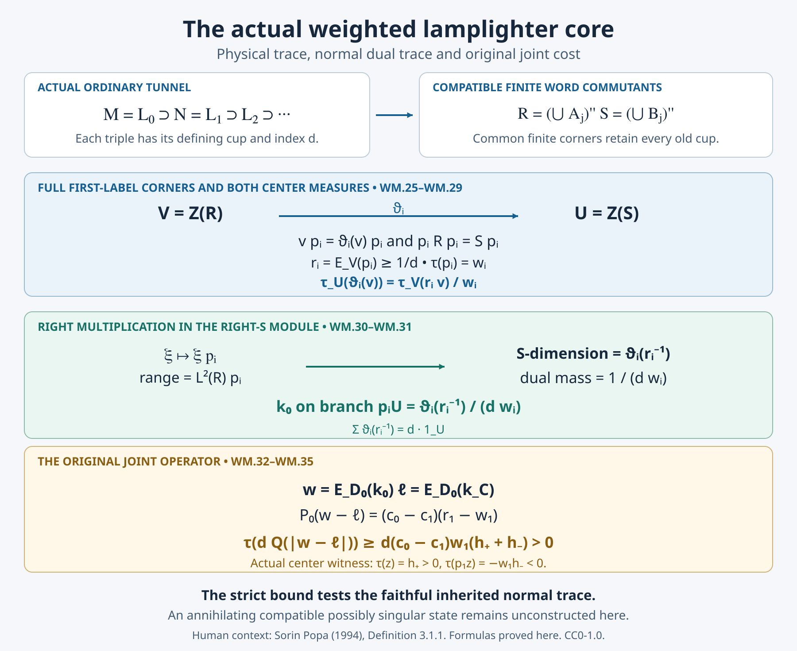

Figure WM.1. The physical finite commutants are \(A_j=L_j'\cap M\) and \(B_j=L_j'\cap N\), with their compatible common-corner embeddings. The diagram writes \(w_i=w_i^+\). The center maps preserve the corner labels and have the displayed inherited measure densities. The right-\(S\) module uses \(R_{p_i}\) with range \(L^2(R)p_i\), and its coordinate unitary includes the factor \(\sqrt{w_i^+}\) in WM.30b. The strict final bound tests the physical normal trace; it is not a lower bound for every compatible state. Shapes are schematic and encode no trace masses. Proofs: WM.1–WM.36 and WM.30a–WM.30c. Human context: Popa (1994), cited above. [Reproducible diagram source](figures/weighted-nonfactor-joint-cost-v13.py).

## The actual weighted lamplighter center and its original compatible states

The weighted model WM.1–WM.36 has a definite parameter \(1<\lambda<2\). This chapter keeps that parameter, its physical inclusion \(N\subset M\), the two canonical traces, and the original expectation \(P_0\). It proves that its joint center separates all five actual branches. It constructs an original compatible physical state for every invariant state of the actual coefficient center, and computes the original discrepancy and cost of every compatible physical state. In particular, every such state has a small explicit cost bound at the specified parameter. Neither a state of cost zero nor a positive lower bound for all compatible states is established.

### C13.1. Actual lamp unitaries in both core centers

Use the actual finite algebras, embeddings and physical word traces of WM.12–WM.13. Set
\[
U=Z(S),\quad V=Z(R),\quad
w_i=w_i^+,\quad
S_+=4+\lambda,\quad S_-=4+\lambda^{-1},\quad d=S_+S_-.
\tag{C13.1}
\]
The five labels have projected lamplighter coordinates
\[
(c_0,v_0)=(0,0),\quad(c_1,v_1)=(\delta_0,0),\quad
(c_{j+1},v_{j+1})=(0,e_j)\quad(1\le j\le3).
\tag{C13.2}
\]
The central integer coordinate of \(H\) is retained in every actual endpoint block. It does not affect the lamp observable used in this proof.

For each site \(x\in\mathbb Z^3\), let \(H_{\pm,x}(g)\) be the conditional expected final lamp sign at \(x\), with initial endpoint \(g\) and first phase \(\pm\). Transience WM.20 ensures that this final sign exists. Put the values of \(H_{\pm,x}\) on the actual endpoint blocks at the appropriate even finite levels. These are central, self-adjoint contractions. The two harmonic identities WM.21 show, with the original word weights, that normal expectations of later levels onto earlier levels give the earlier element.

These martingales have actual strong and \(L^2\) limits
\[
Z_x^+\in V,\qquad Z_x^-\in U,\qquad
(Z_x^\pm)^* =Z_x^\pm,\qquad (Z_x^\pm)^2=1.
\tag{C13.3}
\]
Here the last identity requires more than bounded martingale convergence. The diagonal word algebras identify, with their original faithful trace, with cylinder functions of the actual independent alternating label coordinates. The conditional expectation of the final sign given the complete prefix is exactly the endpoint harmonic function, since the unused coordinates have the original suffix law. Final signs are measurable in all these coordinates: at a fixed site the finite lamp signs eventually stabilize. Cylinder conditional expectations therefore converge in \(L^2\) to that sign. One can prove this directly by first approximating its indicator by a cylinder event, and using \(L^2\) contractivity of conditional expectations. The actual core martingale has the same diagonal \(L^2\) limit. Its square is consequently one. For uniformly bounded elements \(L^2\) convergence implies strong convergence on bounded vectors, then on the entire standard Hilbert space by density. At any fixed finite stage all later martingale terms commute with that stage, so their strong limit is central. This proves C13.3 inside the actual two cores, rather than only on an auxiliary probability space.

Condition on the first actual branch projection \(p_i\). Group multiplication sends a suffix lamp configuration \(\eta\) to \(c_i+\eta(\,\cdot-v_i)\), with addition modulo two. Conditional expectations on longer finite prefixes, followed by the strong limits just proved, give
\[
Z_x^+p_i=(-1)^{c_i(x)}Z_{x-v_i}^-p_i
\quad(x\in\mathbb Z^3,\ 0\le i\le4).
\tag{C13.4}
\]
The normalized trace on \(p_iU\) is precisely \(\tau_U\), since \(\tau(p_i u)=w_i\tau_U(u)\). Thus all five branch tests in C13.4 use the same actual suffix law.

The minus-first pair displacement is \(-Y^-+Y^+\). Its scalar multiplier is \(\psi_+\overline{\psi_-}\), the same as in the plus-first phase. Thus the absolute bound WM.19 and its transience estimate apply in both phases. The pair drift, in either phase, is
\[
\kappa=\left(\frac1{S_+}-\frac1{S_-}\right)(1,1,1)\ne0.
\tag{C13.5}
\]

### C13.2. The joint center contains every branch

The actual suffix final configuration has the following two properties with probability one under its inherited trace:

1. On every affine lattice line parallel to an \(e_j\) or an \(e_j-e_k\), it has only finitely many lit sites.
2. It has infinitely many lit sites in \(\mathbb Z^3\).

For the first assertion, pair increments are independent bounded vectors with mean C13.5. Their normalized sum converges almost surely to \(\kappa\). An elementary proof uses Chebyshev's inequality at times \(n=k^2\), the summability of \(k^{-2}\), and the bounded increment estimate to fill the gaps between successive squares. The vector \(\kappa\) is parallel to none of the listed line directions. Infinitely many positions on any one fixed affine line would give a subsequence whose normalized positions approach the direction subspace of that line, contradicting C13.5. Intermediate raw positions differ from pair positions by a bounded vector, so the same conclusion holds for the raw walk. Countably many affine lattice lines may be considered simultaneously. Every lit site was visited by the raw walk.

For the second assertion, raw zero displacements occur infinitely often, by independence and a positive lower bound on their probabilities. Every site is visited only finitely often by WM.20, so these displacements occur at infinitely many distinct sites. Condition on the entire projected raw path. At each zero displacement, the unresolved choice between the identity and the toggle is an independent bit, of probability \(\lambda/(1+\lambda)\) or \(1/(1+\lambda)\). Both probabilities lie in \([1/3,2/3]\). At a site with at least one zero displacement, the final parity therefore has lit probability in \([1/3,2/3]\): the absolute product of its parity biases is at most \(1/3\). Different sites use disjoint collections of bits and are conditionally independent. Infinitely many such sites are consequently lit, with conditional probability one. This gives assertion 2 under the actual trace.

For a configuration with these properties, the five transforms
\[
T_i\eta=c_i+\eta(\,\cdot-v_i)
\tag{C13.6}
\]
are pairwise different. Equality of two pure translation transforms would make \(\eta\) periodic on lines in one of the listed directions. Finite support on each such line then forces \(\eta\) to vanish everywhere, contradicting assertion 2. The toggle and identity differ at the origin. Equality of the toggle transform and one translation transform gives a difference equation with exactly one toggle on one line in the translation direction. Summing that equation modulo two on a sufficiently large finite interval of that line makes its left side zero, because the configuration has finite support there, while its right side is one. This is impossible. These arguments cover every pair of the five transforms.

All observables \(Z_x^+\) and \(Z_y^-\) commute. In the actual abelian von Neumann algebra \(D_0=U\vee V\), define the countable equality projection
\[
f_i=\bigwedge_{x\in\mathbb Z^3}
1_{\{0\}}\!\left(Z_x^+-(-1)^{c_i(x)}Z_{x-v_i}^-\right).
\tag{C13.7}
\]
C13.4 gives \(f_ip_i=p_i\). On branch \(j\ne i\), its joint equality event is \(T_i\eta=T_j\eta\), just proved to have zero suffix trace. Thus \(\tau(f_ip_j)=0\), and faithfulness gives \(f_ip_j=0\). Since \(\sum_jp_j=1\), it follows that
\[
f_i=p_i,\qquad
D_0=U\vee V=\bigoplus_{i=0}^4p_iU=C_0.
\tag{C13.8}
\]
This is an equality of the actual core algebras. It is not an identification of their inherited measures: those still satisfy the distinct formula WM.28.

For clarity, the full-corner joint lift sends these recovered projections to the original physical branch projections in \(B\). Indeed, a physical \(p_i\) commutes with \(N\) and with \(e_R^M\), because \(p_i\in R\); hence it commutes with \(A=\langle N,e_R^M\rangle\). Both lifted centers commute with \(A\). Their branch relations C13.4 hold after compression by \(e_R^M\). Compression is faithful on \(A'\cap B\): if \(X\) commutes with \(A\) and \(eXe=0\), a countable full-corner frame \(\sum_k a_ke a_k^*=1\), \(a_k\in A\), with strong sum, gives \(Xa_ke=a_kXe=0\), and then \(X=0\). Thus the lifted equality tests recover the physical \(p_i\) as well. This prevents a replacement of the smaller center lift by an unrelated right action.

### C13.3. The actual coefficient center and prescribed physical return

Apply the actual normal stable matrix form WM.15 to the canonical smooth pair \(A\subset B\). Its coefficient algebra is \(W\), with physical factor \(P\subset W\), and actual action \(\beta:H\to\operatorname{Aut}(W)\) extending the physical \(\alpha\). The represented larger and smaller algebras are
\[
\operatorname{Mat}_5(W),\qquad
\{\operatorname{diag}(\beta_i(x)):x\in W\}.
\tag{C13.9}
\]
All finite physical tower levels are the levels proved in WM.15, using its actual basis, cup and opposite weights. No additional change of representation, support or expectation is made here.

Put \(Z=Z(W)\). The normal full-corner identifications give two normal *-isomorphisms
\[
\zeta_U:U\longrightarrow Z,\quad
\zeta_V:V\longrightarrow Z,\qquad
\zeta_U\vartheta_i(v)=\beta_i^{-1}\zeta_V(v).
\tag{C13.10}
\]
The larger center is represented by \(\operatorname{diag}(\zeta_V(v))\); the smaller one by \(\operatorname{diag}(\beta_i\zeta_U(u))\). C13.10 follows by restricting these central elements to the original physical branch. Since C13.8 recovers all branches, the entire original joint lift has the exact matrix form
\[
\iota(t)=\operatorname{diag}\bigl(\beta_i\zeta_U(t_i)\bigr),
\qquad t=\sum_i p_i t_i,\quad t_i\in U.
\tag{C13.11}
\]
These are actual normal center identifications and the original lift. Their two scalar trace measures are not identified with one another.

We next prove a useful strengthening of the physical return: every \(H\)-invariant state \(\omega\) on this actual \(Z\), including a singular one, can be prescribed as the center restriction of a physical equivariant projection
\[
\Gamma_\omega:W\longrightarrow P,\qquad
\Gamma_\omega|_P=\mathrm{id},\quad
\Gamma_\omega\beta_g=\alpha_g\Gamma_\omega,\quad
\Gamma_\omega(z)=\omega(z)1.
\tag{C13.12}
\]

Here are the extension details. Choose a finite physical matrix-unit corner \(e\) of \(P\). Its factor \(P_e\) is hyperfinite II\(_1\), and \(e\) has full central support in \(W\); compression identifies \(Z(W)\) with \(Z(W_e)\). Choose increasing full matrix subfactors \(P_n\subset P_e\), with strongly dense union. Write \(Q_n=P_n'\cap P_e\), again a finite factor. In \(Q_n\vee Z(W_e)\), finite convex averages of conjugations by unitaries in \(Q_n\) send each finite sum \(\sum_j q_jz_j\) in norm to \(\sum_j\tau(q_j)z_j\). Simultaneous norm averaging follows from the finite-factor case of 81.2, applied successively to the finitely many coefficients. The averages are completely positive on every matrix level. They therefore define a well-defined unital completely positive scalar-coefficient map on this norm-closed algebra. Compose with \(\omega\), and extend the resulting state by the positive Hahn–Banach state extension to \(P_n'\cap W_e\). It agrees with \(\tau\) on \(Q_n\) and with \(\omega\) on \(Z(W_e)\).

Taking this state on each complementary matrix coefficient gives a UCP map \(G_n:W_e\to P_n\). On \(P_e\) it is exactly the trace expectation onto \(P_n\); on a central \(z\) it is \(\omega(z)e\). A point-ultraweak cluster \(G:W_e\to P_e\) fixes every element of \(P_e\), since these trace expectations converge boundedly in \(L^2\) and ultraweakly to the identity. It retains the prescribed center values. Extend \(G\) entrywise over the actual countable physical infinite matrix units. Finite compressions have a common norm bound and are completely positive; their compatible entries determine a bounded element of \(P\). This gives a UCP map \(\Gamma_0:W\to P\) fixing \(P\), with \(\Gamma_0(z)=\omega(z)1\). Normality of the state extensions or of \(\Gamma_0\) is not required.

Finally average \(\alpha_g^{-1}\Gamma_0\beta_g\) over the concrete right Følner sets WM.16. Since \(\omega\) is invariant, every summand has the prescribed center restriction. A point-ultraweak cluster is equivariant by the counted right boundary ratios, fixes \(P\), and has that same restriction. This proves C13.12. There is no use of a scalar tracial state on a II\(_\infty\) algebra.

Applying \(\Gamma_\omega\) entrywise in C13.9 and compressing by the original physical finite corner yields the actual map
\[
F_\omega:B\longrightarrow M,\qquad
F_\omega|_M=\mathrm{id},\quad E_NF_\omega=F_\omega E_A.
\tag{C13.13}
\]
Indeed, the original expected diagonal formula is
\(\sum_iw_i\beta_i^{-1}(X_{ii})\); equivariance turns it into its physical formula with \(\alpha_i^{-1}\). Off-diagonal entries have zero expectation. The full common matrix basis is the original basis at every finite tower level, as in WM.15. Compressing by the original physical corner preserves the displayed identity. Thus \(\psi_\omega=\tau F_\omega\) is an original \(E_A\)-compatible \(M\)-central state on \(B\), with exactly physical marginal \(\tau\).

Conversely, every original compatible \(M\)-central state \(\psi\) gives such a center state \(\omega\). To see the return without imposing normality on \(\psi\), for \(T\ge0\) define the bounded positive form \(\langle T x,y\rangle_\psi=\psi(y^*Tx)\) on \(L^2(M,\tau)\). Centrality implies the bound by \(\|T\|\|x\|_2\|y\|_2\) and shows that the associated operator commutes with right multiplication by \(M\). The finite tracial commutation theorem M10.1 supplies \(F(T)\in M_+\), with \(0\le F(T)\le\|T\|1\) and \(\tau(mF(T))=\psi(mT)\). Uniqueness of this trace pairing extends \(F\) linearly and gives \(M\)-bimodularity. Positivity and bimodularity prove complete positivity: for a positive matrix \([T_{jk}]\) and \(a_j\in M\), its compressed quadratic expression is \(F(\sum_{jk}a_j^*T_{jk}a_k)\ge0\). It fixes \(M\) and satisfies \(\psi=\tau F\). For \(a\in A\), compatibility and the original identity \(E_A|_M=E_N\) give \(\tau(mF(a))=\psi(E_N(m)a)=\tau(E_N(m)F(a))\) for every \(m\in M\), so \(F(a)\in N\). Pairing \(F(E_A(T))\) and \(E_NF(T)\) against every \(n\in N\) now proves \(E_NF=FE_A\).

Its bounded entrywise stabilization fixes the entire physical matrix factor. Matrix-unit bimodularity then makes it \(\operatorname{Mat}_5(\Gamma)\) in C13.9. Mapping the represented smaller algebra into the physical smaller algebra gives \(\Gamma\beta_i=\alpha_i\Gamma\), using \(\beta_0=\alpha_0=\mathrm{id}\). The already established finite-level relators extend this to all of \(H\). For \(z\in Z\), physical \(P\)-bimodularity forces \(\Gamma(z)\in P'\cap P=\mathbb C1\); write it as \(\omega(z)1\). Equivariance makes \(\omega\) invariant. This proves both the necessary original-state restriction and its realization for every invariant \(\omega\).

### C13.4. Exact original likelihood, discrepancy and cost

Let \(r_i=E_V(p_i)\), as in WM.26, and put
\[
R_i=\zeta_V(r_i)\in Z,\qquad
R_i\ge1/d>0,\quad \sum_iR_i=1.
\tag{C13.14}
\]
The inverse is bounded; hence all functions below belong to the actual von Neumann center \(Z\), even when tested by a singular state.

For any original compatible state \(\psi\), let \(\omega\) be its invariant coefficient-center state. The physical finite diagonal corner has traces \(w_i\), not equal weights. C13.11 and invariance give, for its original joint restriction \(\alpha=\psi\iota\),
\[
\alpha\left(\sum_i p_it_i\right)
=\sum_iw_i\omega(\zeta_U(t_i)).
\tag{C13.15}
\]
Retain exactly WM.32: \(P_0(t)=\sum_i r_i\vartheta_i^{-1}(t_i)\).
C13.10 therefore gives
\[
\alpha P_0(t)=
\sum_i\omega\bigl(\beta_i^{-1}(R_i)\zeta_U(t_i)\bigr).
\tag{C13.16}
\]
The norm of the difference on the direct sum C13.8 is the sum of the norms of the five component functionals. A central self-adjoint multiplier \(h\) against any positive functional has norm its value on \(|h|\), by its spectral sign. Invariance transports each term back to \(Z\). Thus the exact original discrepancy is
\[
\|\alpha-\alpha P_0\|
=\sum_i\omega\bigl(|R_i-w_i|\bigr).
\tag{C13.17}
\]

Since \(D_0=C_0\), the conditional expectation in WM.33 is the identity. Consequently its original positive cost, before lifting, is
\[
b=dQ(|w-\ell|)
=\sum_i\left|\vartheta_i(r_i^{-1})-\frac1{w_i}\right|\in U.
\tag{C13.18}
\]
The original physical cost \(\mathfrak a=\iota(b)\) of every original compatible state is therefore
\[
C_\omega:=\psi(\mathfrak a)
=\sum_i\omega\left(\left|R_i^{-1}-\frac1{w_i}\right|\right).
\tag{C13.19}
\]
Neither C13.17 nor C13.19 uses a modified expectation depending on \(\alpha\). Both are the original \(P_0\) and the cost of the original two canonical traces. C13.19 also agrees directly with the exact transfer formula \(d\alpha(|w-\ell|)\), since the \(w_i\) in C13.15 cancel its branch denominators.

The result makes no normality assumption and applies to every original compatible state, including any such state annihilating the original Jones ideal. E14.8–E14.12 below prove that their center restrictions in this actual model are all purely singular. E14.12 below proves pure center singularity in this actual model, so the existing complete SC.2–SC.3 applies. E14.12a consequently gives annihilation of the entire original Jones ideal for every compatible state and every prescribed-center return. No ideal or singular branch was discarded in deriving the necessary formulas.

### C13.5. A universal bound at the fixed actual parameter

The pointwise dimension identity WM.31 is essential. Transporting it through \(\zeta_U\), applying the invariant \(\omega\), and using C13.10 gives
\[
\sum_i\omega(R_i^{-1})=d=\sum_iw_i^{-1}.
\tag{C13.20}
\]
This is an identity of values for every invariant state, not a replacement of either original trace by a joint normal trace.

The bounded scalar identity
\[
r^{-1}-w^{-1}+(r-w)w^{-2}
=\frac{(r-w)^2}{w^2r}
\]
holds by functional calculus at \(r=R_i\). Summing and using C13.20 yields
\[
\begin{aligned}
h_\omega&:=\sum_i\omega\left(\frac{(R_i-w_i)^2}{w_i^2R_i}\right)
=K\epsilon_\omega,\\
K&=S_+^2(1-\lambda^{-2})>0,\qquad
\epsilon_\omega=w_1-\omega(R_1)\ge0.
\end{aligned}
\tag{C13.21}
\]
Indeed the four other weights equal \(1/S_+\), whereas \(w_1=\lambda/S_+\); using \(\sum_i(\omega(R_i)-w_i)=0\) gives the displayed equality. Positivity proves its sign.

Let \(t=\omega(R_1)>0\). The positive functional Cauchy–Schwarz inequality gives \(\omega(R_i^{-1})\ge1/\omega(R_i)\). Another scalar Cauchy–Schwarz inequality on the other four terms gives
\[
\frac1t+\frac{16}{1-t}\le d.
\]
The roots of its quadratic equality are
\[
w_1^-=\frac1{4\lambda+1}
\le\omega(R_1)\le\frac{\lambda}{4+\lambda}=w_1.
\tag{C13.22}
\]
The upper root also follows from C13.21. The root computation uses the actual \(d=(4+\lambda)(4\lambda+1)/\lambda\).

For the discrepancy \(\Delta_\omega\) in C13.17, \(\sum_i(\omega(R_i)-w_i)=0\) implies \(\Delta_\omega\ge2\epsilon_\omega\). Since \(0<R_i\le1\) and \(w_i\le w_1\), C13.19 gives \(C_\omega\ge\Delta_\omega/w_1\). On the other hand, apply Cauchy–Schwarz to the direct sum of the five positive functionals:
\[
\sum_i\omega\left(\frac{|R_i-w_i|}{w_iR_i}\right)
\le
\left[\sum_i\omega\left(\frac{(R_i-w_i)^2}{w_i^2R_i}\right)\right]^{1/2}
\left[\sum_i\omega(R_i^{-1})\right]^{1/2}.
\]
C13.20–C13.22 prove the exact fixed-model bounds
\[
\frac{2}{w_1}\epsilon_\omega
\le C_\omega
\le\sqrt{dK\epsilon_\omega}
\le\frac{2(4+\lambda)(\lambda^2-1)}{\lambda^{3/2}}.
\tag{C13.23}
\]
For the last expression, direct algebra gives
\[
dK(w_1-w_1^-)
=\frac{4(4+\lambda)^2(\lambda^2-1)^2}{\lambda^3}.
\]
Thus every original compatible state, including every state supplied by the prescribed-center return, has the displayed small upper bound at the fixed rational parameter WM.22. This is a bound in this one actual inclusion. It does not take a limit of changed physical inclusions.

At the fixed actual parameter WM.22, write \(\delta=\lambda-1=2^{-31}25^{-198153}\). Since \(4+\lambda<6\), \(\lambda+1<3\) and \(\lambda^{3/2}>1\), C13.23 gives

\[
0\le\psi(\mathfrak a)<36\delta=\frac{36}{2^{31}25^{198153}}
\qquad\text{for every original compatible state.}
\tag{C13.23a}
\]

This extremely small but fixed upper bound does not establish cost zero or arbitrarily small cost for the same physical inclusion.

There is also an exact consequence useful for locating the attempt boundary:
\[
\psi(\mathfrak a)=0
\quad\Longleftrightarrow\quad
\omega(R_1)=w_1
\quad\Longleftrightarrow\quad
\omega(|R_i-w_i|)=0\ \hbox{for every }i.
\tag{C13.24}
\]
The forward implication follows from the left inequality C13.23. Equality of the moment gives \(h_\omega=0\), and Cauchy–Schwarz gives \(C_\omega=0\). Equivalence with the five deviations follows either from C13.19 and the uniform invertibility C13.14 or from C13.17 and its scalar comparison. This is a proved description of the finite boundary, not a solution of the assigned zero-state problem.

### C13.6. What the construction proves and what remains unproved

The finite construction here is genuine: it starts with the actual \(W\), its actual center and actual finite tower relators, prescribes any invariant center state by an explicit physical UCP return, and preserves the original physical marginal and original \(E_A\). It establishes the full five-branch joint algebra, the exact original-state formulas C13.17 and C13.19, and the universal fixed-parameter estimate C13.23. The positive normal operator cost WM.35 remains nonzero and is consistent with this estimate.

The unproved step is whether an invariant state on this particular actual \(Z(W)\) can attain the upper endpoint \(\omega(R_1)=\lambda/(4+\lambda)\). Invariance alone proves only C13.22; it does not select that endpoint. The invariant-state set is nonempty: average any state on \(Z(W)\) over WM.16 and take a weak-star cluster; its right boundary estimates give invariance. Compactness gives a maximum of the moment on this compact set, but the present argument does not determine its value. If the maximum were strictly smaller than the upper endpoint, C13.23 would give a positive lower bound for every original compatible state. If it equalled that endpoint, the physical return C13.12–C13.13 would construct an original zero-cost state. Neither assertion about that maximum is proved here.

The unrestricted original-state target therefore remains unresolved, even for this fixed weighted example. No logarithmic test, stochastic substitute, changed \(P_\alpha\), faithful normal joint trace, or operator equality is being presented as its resolution.

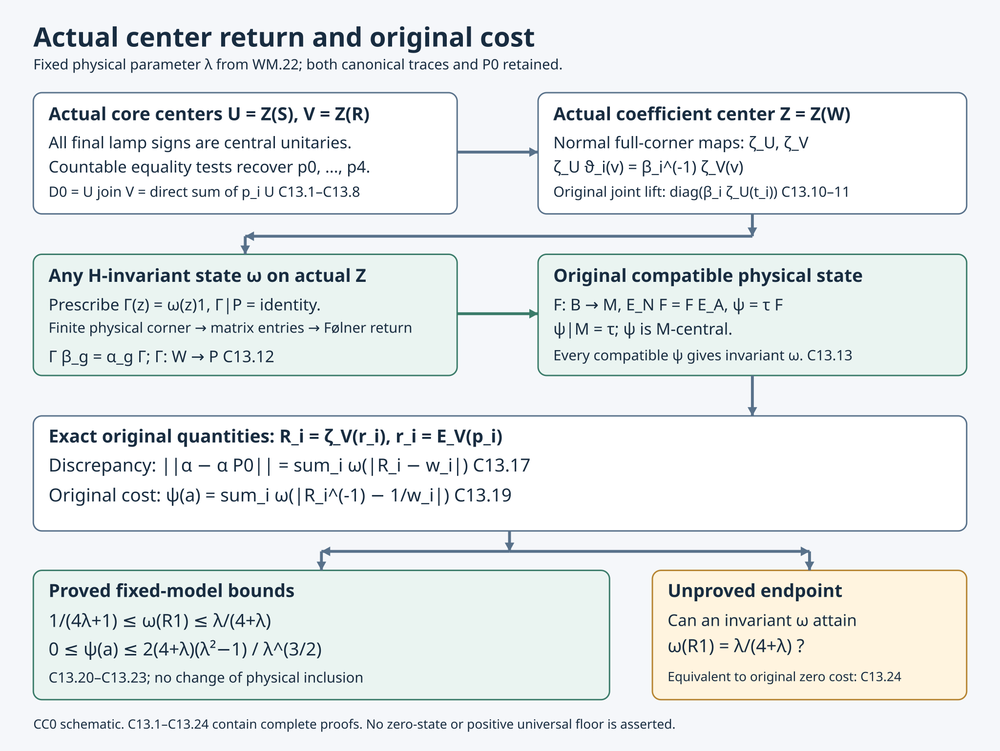

Figure C13. The top arrows are actual full-corner and matrix identifications, proved in C13.1–C13.3. The return uses the physical corner and the original expected diagonal weights. The two bottom formulas are the original quantities C13.17 and C13.19. The shaded endpoint is the precise unproved step of C13.6, rather than a proved zero-state construction. [Reproducible diagram source](figures/actual-center-and-original-cost-v14.py). The diagram writes \(w_i=w_i^+\), \(\vartheta_i\) for the actual corner-center map, and \(a=\mathfrak a\). Boxes and arrows are schematic; their sizes encode no trace masses.

### Mathematical sources

Sorin Popa, *Classification of amenable subfactors of type II*, Acta Mathematica 172 (1994), 163–255, [DOI 10.1007/BF02392646](https://doi.org/10.1007/BF02392646), §2.3 and §3.1–§3.2, provides the human context for smooth representations and amenability. The weighted actual construction, physical trace character and complete finite matrix tower used here are [WM.1–WM.36](general-tail-supports-and-controlled-tunnels.md). This chapter supplies its new branch-separation and prescribed-center return proofs.

The finite-factor norm averaging used in C13.3 is the complete proof 81.2 in [Relative norm averaging and central density](relative-norm-averaging-and-central-density.md). The positive-form return uses the finite tracial commutation proof M10.1 in [Finite traces and Jones projections](finite-traces-and-jones-projections.md). The actual common expected matrix stages and finite tower compatibility are 61.1–61.2 in [Smooth representations and tower compression](smooth-representations-and-tower-compression.md). The two canonical traces, original joint density and bounded transfer retain the exact providers identified and proved in WM.30–WM.36.

## The actual center action: a vanished integer shift and a singular endpoint problem

Keep the fixed rational \(1<\lambda<2\) of WM.22 and the original weighted physical inclusion. The actual center \(Z=Z(W)\), action \(\beta\), probabilities \(R_i\), and physical return are those constructed in C13. This chapter proves three further facts. The central integer generator \(z^2\) acts trivially on the entire actual center. Every invariant center state, and hence every original compatible state's center restriction, is purely singular. The original trace character excludes the lower Jensen endpoint, with an explicit uniform gap. None of these facts proves attainment of the upper endpoint required for original zero cost.

### E14.1. A finite central-noise estimate in the actual weighted tower

Write \(s_0=1,s_1=az,s_{j+1}=t_j\), \(S_+=4+\lambda\), \(S_-=4+\lambda^{-1}\), and \(d=S_+S_-\). Consider four consecutive actual raw labels with phases \(+,-,+,-\). Three particular words have endpoints
\[
\begin{array}{c|c|c}
\text{word}&\text{endpoint in }H&\text{original physical probability}\\ \hline
(0,0,0,0)&1&d^{-2}\\
(1,0,1,0)&z^2&\lambda^2d^{-2}\\
(0,1,0,1)&z^{-2}&\lambda^{-2}d^{-2}.
\end{array}
\tag{E14.1}
\]
These are actual diagonal word projections and their original traces WM.13. Their projected lamplighter endpoints are all the identity. In the opposite phase the three probabilities for endpoints \(1,z^2,z^{-2}\) are the same, with the last two chosen raw words interchanged.

Among \(n\) independent four-label blocks let \(N\) count blocks in these three specified words. Then
\[
N\sim\operatorname{Bin}(n,q),\qquad
q=\frac{1+\lambda^2+\lambda^{-2}}{d^2}\ge\frac1{243}.
\tag{E14.2}
\]
The lower bound follows from \(d\le27\) and \(1+\lambda^2+\lambda^{-2}\ge3\). Condition on which blocks are selected and on every other complete block word. Each selected block then contributes an independent central factor \(z^{2J}\), where \(J=-1,0,1\) has probabilities proportional to \(\lambda^{-2},1,\lambda^2\). Centrality lets these factors be pulled through all other endpoints. Thus their sum supplies genuine independent integer noise to the actual endpoint; no group endpoint or physical weight has been changed.

For \(N=k\), let \(L\) count selected central steps that are \(0\) or \(1\). Conditional on \(L\), their number of \(1\)'s is binomial:
\[
L\sim\operatorname{Bin}(k,r),\quad
r=\frac{1+\lambda^2}{1+\lambda^2+\lambda^{-2}}\ge\frac23,\qquad
p=\frac{\lambda^2}{1+\lambda^2}\in[1/2,4/5].
\tag{E14.3}
\]
The remaining \(k-L\) steps all equal \(-1\). Shifting the total noise by one is therefore, after this conditioning, the shift of \(\operatorname{Bin}(L,p)\) by one.

For a binomial mass function the successive mass ratios decrease, so it is unimodal. Its total variation distance from its shift by one equals its largest atom. For \(L\ge1\), Fourier coefficient extraction and
\[
|1-p+pe^{it}|^L
\le\exp\!\left(-Lp(1-p)(1-\cos t)\right)
\le\exp\!\left(-2Lp(1-p)t^2/\pi^2\right)
\quad(-\pi\le t\le\pi)
\]
bound that atom by
\(\sqrt{\pi}/(2\sqrt{2Lp(1-p)})<2/\sqrt L\).
The last strict inequality uses \(p(1-p)\ge4/25\) and \(\pi<4\). This is a direct finite estimate, requiring no limiting distribution theorem.

Chebyshev's inequality gives
\(\mathbb P(N<qn/2)\le972/n\).
On \(N\ge qn/2\), it gives
\(\mathbb P(L<rN/2\mid N)\le2916/n\).
Outside these exceptional events, \(L\ge n/1458\), so the binomial shift distance is at most \(77/\sqrt n\). Mixing over all conditioned blocks cannot increase total variation. If \(\mu_n^\pm\) denotes the actual endpoint law of \(4n\) raw labels, in either phase, then
\[
\|\mu_n^\pm-\delta_{z^2}*\mu_n^\pm\|_{\mathrm{TV}}
\le\min\left(1,\frac{77}{\sqrt n}+\frac{3888}{n}\right).
\tag{E14.4}
\]
Here total variation is \(\sup_E|\mu(E)-\nu(E)|\); differences of expectations of a bounded function are at most twice its norm times this distance. The same estimate holds after multiplication by any fixed starting endpoint. The central integer coordinate of \(H\) was retained throughout this calculation.

### E14.2. The whole actual coefficient center forgets \(z^2\)

We prove
\[
\beta_{z^2}|_Z=\mathrm{id}_Z.
\tag{E14.5}
\]
It is not enough to check this on the lamp observables alone. Let \(v\) be any bounded element of the actual core center \(V=Z(R)\). At an actual finite word level \(m\), the normal trace expectation of \(v\) is central in the finite algebra. It therefore has a value \(h_m(g)\) on each endpoint block \(g\) at that level, with \(|h_m(g)|\le\|v\|\). The original conditional word traces give, for every possible prefix endpoint \(g\),
\[
h_m(g)=\sum_h\mu_n^\pm(h)\,h_{m+4n}(gh),
\tag{E14.6}
\]
where the phase is the phase of the unused suffix. This is just the normal finite-word expectation identity in the actual tower.

Use the two four-label prefixes \(I=(0,0,0,0)\) and \(J=(1,0,1,0)\), of endpoints \(1\) and \(z^2\). Append any fixed suffix prefix \(K\), with endpoint \(g(K)\). The endpoints \(g(K)\) and \(z^2g(K)\) are both possible at the same actual level \(4+|K|\). Apply E14.6 and E14.4 at that level. The two resulting coefficients differ in absolute value by at most
\[
2\|v\|\left(\frac{77}{\sqrt n}+\frac{3888}{n}\right).
\]
Letting \(n\) tend to infinity proves their equality at every finite suffix level.

For completeness, these coefficient equalities compare actual normal center maps. A fixed prefix word projection \(q_I\) has full central support. This follows by iterating the actual cup comparison proving WM.26; every positive branch weight is retained at each finite level. Its corner \(q_IRq_I\) is the suffix core: at every finite stage its matrix units are exactly the pairs of suffix words with equal endpoints, since the common left prefix cancels. The trace divided by \(\tau(q_I)\) is exactly the original suffix word trace. Taking bounded strong closures gives the same normal corner identification. Compression of \(V\) therefore supplies the normal full-center map into that suffix core.

The finite represented tower WM.15 identifies this map, under the common coefficient-center coordinates, with \(\beta_{g(I)}^{-1}\zeta_V\). This can also be read directly from its matrix entries: the first-prefix coefficient is the alternating \(\beta\)-word, with the identity label contributing \(\beta_0=\mathrm{id}\), and every further cup and coefficient map is the actual one in WM.15. Thus prefix \(I\) gives the identity map and prefix \(J\) gives \(\beta_{z^2}^{-1}\). The coefficient equalities established above show that the normal expectations of their two images onto every finite suffix algebra agree. Faithful \(L^2\) approximation in the suffix core makes the images equal. Since \(\zeta_V\) maps all of \(V\) onto \(Z\), E14.5 follows.

In particular, the entire actual center action factors through
\[
H/\langle z^2\rangle\cong
\left(\bigoplus_{\mathbb Z^3}\mathbb Z/2\right)\rtimes\mathbb Z^3.
\tag{E14.7}
\]
Only this center action has been quotiented. The physical automorphism \(\alpha_{z^2}\) still scales the trace of \(P\) by \(\lambda^2\), and the actual action on \(W\), physical inclusion and finite expected tower have not been quotiented or altered.

### E14.3. Actual lamp flips force purely singular center restrictions

Let \(Z_x^\pm\) be the actual central lamp unitaries C13.3. C13.4 and the identity label give the common actual coefficient-center unitary
\[
L_x=\zeta_V(Z_x^+)=\zeta_U(Z_x^-)\in Z.
\tag{E14.8}
\]
The same branch equations give
\[
\beta_i^{-1}(L_x)=(-1)^{c_i(x)}L_{x-v_i}.
\tag{E14.9}
\]
Conjugating \(\beta_1\) by the actual spatial translations therefore supplies the automorphism flipping any one \(L_x\) and fixing the other lamp unitaries. These automorphisms arise from actual elements \(t_x(az)t_x^{-1}\in H\); they are not newly chosen maps on a commutative model. E14.5 shows that each of these automorphisms squares to the identity on the full \(Z\), as well as on its lamp subalgebra.

If \(\omega\) is any \(H\)-invariant state on the actual \(Z\), every nonempty finite product of distinct lamp unitaries changes sign under one such flip. Hence
\[
\omega\left(\prod_{x\in F}L_x\right)=0
\quad(0<|F|<\infty),\qquad
\omega\left(\prod_{x\in F}\frac{1+\epsilon_xL_x}{2}\right)
=2^{-|F|}
\quad(\epsilon_x\in\{-1,1\}).
\tag{E14.10}
\]
This says that its finite lamp distributions are exactly fair independent bits. It does not assert normality on the von Neumann algebra generated by those bits.

Choose the actual line \(\{ke_1:k\in\mathbb Z\}\), and form the normal spectral projections
\[
F_L=\bigwedge_{|k|>L}\frac{1+L_{ke_1}}2,\qquad
F_L\uparrow1\ \hbox{strongly}.
\tag{E14.11}
\]
The strong supremum is one because C13.2 proves, under the actual faithful core trace, that there are only finitely many lit lamps on this line. The normal full-center maps carry that actual projection identity into \(Z\).

For any finite set of \(m\) sites outside this interval, \(F_L\) is dominated by the projection that all those sites are unlit. E14.10 therefore gives \(0\le\omega(F_L)\le2^{-m}\) for every \(m\), and consequently
\[
\omega(F_L)=0\quad\hbox{for all }L,\qquad \omega(1)=1.
\tag{E14.12}
\]
If a normal positive functional \(\eta\) were dominated by \(\omega\), then \(\eta(F_L)=0\) for all \(L\), and normal monotone continuity would give \(\eta(1)=0\). Thus \(\omega\) has no nonzero normal positive functional below it: it is purely singular.

Every original \(E_A\)-compatible \(M\)-central state with physical marginal \(\tau\) supplies just such an invariant \(\omega\), by C13.3. Its restrictions to the two original centers are therefore purely singular. The same holds on \(D_0=\bigoplus_i p_iU\), using the exact branch weights C13.15: a normal positive functional dominated by the joint restriction would give, on each branch, a normal positive functional dominated by \(w_i\omega\zeta_U\), and hence zero. In particular, no original compatible state can have even a nonfaithful normal joint restriction. This strengthens the faithful-normal exclusion supplied by WM.35.

Conversely, C13.12–C13.13 still return every actual invariant \(\omega\) to an original compatible physical state. Since its prescribed center restriction is now proved singular, that return is necessarily nonnormal on the original center. It remains exactly normal on the physical marginal \(M\), with all physical factor representations and finite Jones levels as before.

The state itself is purely singular on \(B\). Indeed, a nonzero normal positive functional dominated by it would restrict normally to the unital \(Z(B)\), with the same positive value at one, contradicting the center singularity just proved.

The actual compatible-state hypotheses now also give the entire Jones-ideal conclusion. The complete bounded-left-cut and finite-common-basis argument [SC.2–SC.3, Singular hypertraces, the Jones ideal and bounded entropy](singular-hypertraces-jones-ideals-and-entropy.md) applies to exactly the same original \(B\), core projection \(e=e_R^M\), expectation, common basis and physical trace: \(\psi E_A=\psi\), \(M\)-centrality, \(\psi|_M=\tau\), and purely singular restrictions to both represented centers. That proof uses arbitrary coefficients from the actual \(B\), not just physical coefficients from \(M\). Consequently

\[
J_e=\overline{\operatorname{span}(BeB)}^{\|\cdot\|},
\qquad \psi(J_e)=0,\qquad F_\omega(J_e)=0.
\tag{E14.12a}
\]

For the last assertion, if \(x\in J_e\), then \(x^*x\in J_e\), and \(\tau(F_\omega(x^*x))=\psi_\omega(x^*x)=0\). Faithfulness of the original physical \(\tau\) gives \(F_\omega(x^*x)=0\); the UCP Schwarz inequality then gives \(F_\omega(x)^*F_\omega(x)\le F_\omega(x^*x)=0\). This applies to every prescribed-center return in C13.13. The original canonical normalization \(\operatorname{Tr}(e)=1\) and every physical ordinary Jones cup remain unchanged. This is an application of the existing complete ideal proof; no new trace or duplicate provider is introduced.

### E14.4. The original trace character excludes the lower Jensen endpoint

Define the two faithful normal probability measures on the actual coefficient center by
\[
\mu_U=\tau_U\zeta_U^{-1},\qquad
\mu_V=\tau_V\zeta_V^{-1}.
\]
WM.28 and C13.10 give, without identifying these measures,
\[
\mu_U\circ\beta_i^{-1}
=\mu_V\left(\frac{R_i}{w_i}\,\cdot\right),\qquad
\mu_U=\mu_V\left(\frac{R_0}{w_0}\,\cdot\right).
\tag{E14.13}
\]
Both densities are boundedly invertible by WM.26. Thus the actual Radon–Nikodym multiplier for \(\beta_i^{-1}\), relative to \(\mu_U\), is
\[
D_i=\frac{w_0R_i}{w_iR_0}=\frac{R_i}{\nu_iR_0},
\qquad \nu=(1,\lambda,1,1,1).
\tag{E14.14}
\]
This is a consequence of the original two canonical center measures, not an arbitrarily assigned likelihood.

E14.5 implies \(\beta_1^2=\mathrm{id}\) on \(Z\). Applying the normal change-of-variables identity E14.13 twice and using faithfulness gives \(D_1\beta_1(D_1)=1\). Its logarithm is bounded, so every invariant state satisfies \(\omega(\log D_1)=0\). Therefore the exact actual constraint is
\[
\omega(\log R_1)-\omega(\log R_0)=\log\lambda.
\tag{E14.15}
\]
The physical \(\lambda\) is fixed. Its sign here comes from the original trace density, and has not been inverted with the opposite phase.

The next quantitative consequence uses no normality of \(\omega\). Put
\[
w_-=\frac1{4\lambda+1},\quad
w_+=\frac{\lambda}{4+\lambda},\quad
m=\frac{w_-}{d},\quad t=\omega(R_1),\quad a_i=\omega(R_i).
\]
All \(R_i\) and \(a_i\) are at least \(m\); \(\sum_iR_i=\sum_i a_i=1\); and C13.20 gives \(\sum_i\omega(R_i^{-1})=d\). As in C13.22, \(w_-\le t\le w_+\).

Set \(a_*=(1-t)/4\). The exact Jensen budget and its decomposition are
\[
\begin{aligned}
B(t)&=d-\frac1t-\frac{16}{1-t}
     =\frac{d(t-w_-)(w_+-t)}{t(1-t)},\\
v_i&=\omega\left(\frac{(R_i-a_i)^2}{a_i^2R_i}\right)
     =\omega(R_i^{-1})-\frac1{a_i},\\
B(t)&=\sum_i v_i+
       \sum_{i\ne1}\frac{(a_i-a_*)^2}{a_*^2a_i}.
\end{aligned}
\tag{E14.16}
\]
The last identity follows by adding the four reciprocal tangent identities at their common average \(a_*\); their linear terms sum to zero. Every term is nonnegative.

For positive \(s\), \(s-1-\log s\ge0\), and
\[
s-1-\log s\le (s-1)^2/s,
\]
since the difference of the right side and the left side is \(\log s+s^{-1}-1\ge0\). Applying these identities at \(s=R_i/a_i\) gives
\(0\le \log a_i-\omega(\log R_i)\le a_i v_i\).
E14.15 therefore implies
\[
\left|\log(t/a_0)-\log\lambda\right|\le B(t).
\]
Also \(|a_0-a_*|\le\sqrt{B(t)}\) by E14.16, and the logarithm is \(1/m\)-Lipschitz on \([m,1]\). Consequently
\[
\left|\log(t/a_*)-\log\lambda\right|
\le B(t)+\frac{\sqrt{B(t)}}m.
\tag{E14.17}
\]
At \(t=w_-\), the expression \(\log(t/a_*)\) equals \(-\log\lambda\), while the right side vanishes. Thus the lower endpoint is impossible.

Here is an explicit uniform gap. For \(u=t-w_-\), the derivative of \(\log(t/a_*)=\log(4t/(1-t))\) is at most \(2/m\) throughout \([w_-,w_+]\): there \(t\ge m\) and \(1-t\ge4m\). Also E14.16 gives \(B(t)\le du/(4m^2)\). If
\(u\le m^4(\log\lambda)^2/(16d)\), the left side of E14.17 is at least
\[
2\log\lambda-\frac{2u}{m}
\ge\frac{15}{8}\log\lambda,
\]
whereas its right side is at most
\((1/64+1/8)\log\lambda=9\log\lambda/64\).
We used only \(0<m\le1\), \(d\ge1\), and \(0<\log\lambda<1\). This is a contradiction. Every actual invariant center state therefore satisfies the uniform strict bound
\[
\boxed{\quad
\omega(R_1)>
\frac1{4\lambda+1}
+\frac{m^4(\log\lambda)^2}{16d},
\qquad m=\frac1{d(4\lambda+1)}.
\quad}
\tag{E14.18}
\]
This excludes the opposite-weight endpoint and a definite neighborhood of it in the fixed actual model.

The actual stronger bound \(R_i\ge1/d\), proved in WM.26 and retained in C13.14, improves the numerical gap. The proof of E14.16–E14.18 uses only a common lower bound on the five likelihoods and means, \(t\ge m\), \(1-t\ge4m\), \(m\le1\), \(d\ge1\), and \(0<\log\lambda<1\). These hold with \(\widehat m=1/d\): \(w_-\ge1/d\) and \(1-w_+\ge4/d\). Repeating the same displayed estimates with this stronger actual lower bound gives

\[
\omega(R_1)>\frac1{4\lambda+1}+\frac{(\log\lambda)^2}{16d^5}.
\tag{E14.18a}
\]

The fixed physical inclusion and its original trace densities are unchanged.

### E14.5. The upper endpoint remains a singular actual question

The new action constraint is compatible with the desired endpoint. If \(\omega(R_1)=w_+\), C13.21–C13.24 force \(\omega(|R_i-w_i|)=0\) for every \(i\); bounded logarithms then give \(\omega(\log R_1)-\omega(\log R_0)=\log(w_1/w_0)=\log\lambda\), exactly E14.15. Thus E14.15 does not exclude zero cost.

E14.18 separates the lower Jensen root, not the upper one. Pure singularity E14.12 requires a singular state but does not specify its values on the actual likelihood functions \(R_i\). Finite lamp distributions E14.10 alone do not specify these values either: normal spectral limits used to obtain \(R_i\) cannot be passed through an arbitrary singular state. This is a concrete obstruction to replacing the actual likelihoods by their cylinder samples or a fair-bit commutative surrogate.

The precise remaining step is still construction of an actual invariant state on \(Z(W)\) with \(\omega(R_1)=\lambda/(4+\lambda)\), or an actual strict bound below that upper endpoint. Neither is proved here. The existing original physical return would realize the first as a state with original \(P_0\)-balance and zero original cost; a strict upper separation would give a positive universal original-cost lower bound through C13.23. All new facts above retain the original \(\lambda,\tau,E_A,P_0\), and both canonical traces. The whole Jones-ideal conclusion is now supplied by the existing complete provider at its verified hypotheses in E14.12a; the upper cost endpoint is still unproved.

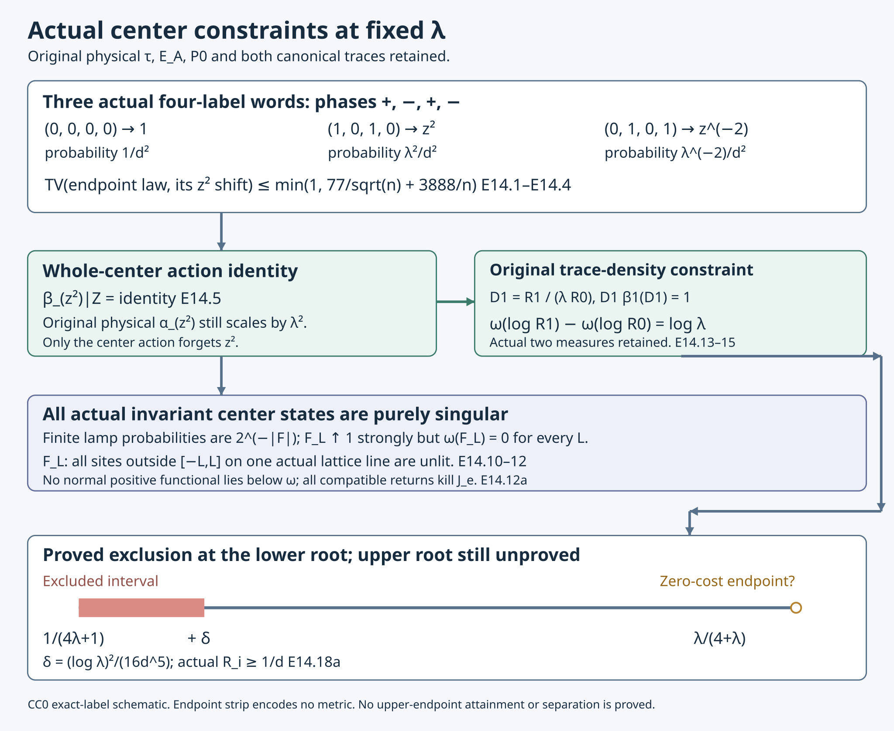

Figure E14. The upper box records the actual four-label words and central-noise estimate E14.1–E14.4. The arrows give the proved whole-center action identity E14.5, the original trace-density identity E14.15, and the singularity mechanism E14.10–E14.12. The endpoint strip is schematic, with no metric encoded: E14.18 removes a strictly positive interval next to the lower root, while the upper root is unproved. Every displayed constant and formula is exact. [Reproducible diagram source](figures/actual-center-action-and-singularity-v15.py). The separated interval in the diagram uses the stronger actual bound E14.18a. The diagram writes \(D1=D_1\), \(R1=R_1\), and \(P0=P_0\); the endpoint strip encodes no metric.

### Mathematical sources

Sorin Popa, *Classification of amenable subfactors of type II*, Acta Mathematica 172 (1994), 163–255, [DOI 10.1007/BF02392646](https://doi.org/10.1007/BF02392646), §2.3 and §3.1–§3.2, provides the context for the actual smooth representation and original physical return. All central-noise, singularity and endpoint estimates are proved above.

The exact physical action, finite tower, word weights, core centers and two trace measures are [WM.1–WM.36](general-tail-supports-and-controlled-tunnels.md). The actual branch recovery, full normal center maps, original compatible-state return, bounded likelihoods and exact dimension identity are [C13.1–C13.24](general-tail-supports-and-controlled-tunnels.md). The normal full common finite tower and cup comparisons retain the complete providers 52.1–52.2 and 61.1–61.2 specified in those chapters. No external theorem about an abstract boundary or substitute abelian action is used.

## A good whole-stage cell need not return approximately to a unital corner stage

Use the actual index-\(25\) inclusion \(N\subset M\) of LF.1–LF.17 in [Lesson 99](general-tail-supports-and-controlled-tunnels.md). In its physical first matrix coordinate write
\[
 e_{ij}=E_{ij}\otimes1,\qquad q_i=e_{ii},\qquad
 A_0=N'\cap M=\bigoplus_{i=0}^4\mathbb Cq_i .
 \tag{MR.1}
\]
The automorphism labels are \(s_0=1,s_1=a,s_2=t_1,s_3=t_2,s_4=t_3\). The factors, their expectations and every ordinary cup are the actual ones of LF.1–LF.4. The all-smooth amenability quantifier is proved in LF.5–LF.8. Neither inherited-trace ordinary core is a factor, by LF.11–LF.12.

**Theorem MR.1.** After every prescribed finite ordinary prefix through \(N_k\), including its physical cups, there is an actual finite near-cover of the form 76.23, a finite set of fixed physical contractions \(Y\subset M\), and numbers \(\varepsilon>0\), \(\varepsilon_0=\varepsilon/8\), such that:

1. All good blocks are full supported whole-inclusion relative-commutant blocks from individual actual continuations of this exact prefix. Their sum with the retained residual rows contains \(A_k=N_k'\cap M\), \(B_k=N_k'\cap N\), and satisfies the two physical expectation rows of 76.25. Every good block has its actual physical and normalized dual trace restrictions.
2. Every \(y\in Y\) belongs to the near-cover algebra \(P_0\), so \(b_y=E_{P_0}(y)=y\) and the old target error is exactly zero. Its residual \(f\in N_k\) can be chosen with \(\tau(f)<\varepsilon^2/16\).
3. One good support \(p\), of trace \(t>0\), has the following obstruction. For **every** actual ordinary finite tunnel of the fixed corner inclusion \(pNp\subset pMp\), of **any** finite length and with **any** choice of continuation, its unital finite relative commutant \(\mathcal L\subset pMp\) satisfies
\[
 \max_{y\in Y}\|y-E_{\mathcal L}(y)\|_2>
 \frac{3\varepsilon}{4}.
 \tag{MR.2}
\]

At zero prefix these are all the actual near-cover hypotheses of GTB.8 and GTB.25, with \(R=1\). No collection of unital corner stages can supply its additional bound GTB.27 for this near-cover. This refutes the proposed universal derivation of that approximate input for **arbitrarily selected** good cells. It does not refute the conditional implication GTB.8, the original full finite conclusions GTB.0–GTB.1, or a construction that reselects the physical supports.

We prove the theorem in seven steps. The distinction between the physical \(M\)-norm and the normalized corner norm is essential:
\[
 \tau_p(x)=\frac{\tau(x)}t,\qquad
 \|x\|_{2,p}=t^{-1/2}\|x\|_2\quad(x\in pMp).
 \tag{MR.3}
\]

### The center witness remembers the first diagonal algebra

**Lemma MR.2.** The central self-adjoint contraction \(z\in Z(R)\) of LF.39–LF.41 satisfies
\[
 \tau(z)=h_+,\qquad
 E_{A_0}(z)=z_0:=\sum_{i=0}^4v_iq_i,\qquad
 v_i=H_-(s_i),
 \tag{MR.4}
\]
where \(h_\pm=H_\pm(1)>0\). In particular
\[
 v_0=h_-,\qquad v_1=-h_-,\qquad
 \|z_0-h_+1\|_2^2\geq
 \frac{2(h_-^2+h_+^2)}5\geq\frac{2h_-^2}5 .
 \tag{MR.5}
\]

**Proof.** Here \(H_\pm(g)\) is the expected eventual sign of the lamp at the fixed spatial origin, when the next raw step has phase \(\pm\), as defined in LF.10. Conditioning on the first uniform label gives the two typed phase identities
\[
 H_+(g)=\frac15\sum_iH_-(gs_i),\qquad
 H_-(g)=\frac15\sum_jH_+(gs_j^{-1}).
 \tag{MR.6}
\]
The terminal lamp exists almost surely by LF.9; its sign is bounded. Thus conditioning is legitimate and uses the original right-multiplication walk. At length two the central martingale element is
\[
 z_1=\sum_{i,j}H_+(s_i s_j^{-1})\,e_{ii}\otimes e_{jj}\otimes1 .
\]
Each word projection has physical trace \(1/25\). Its expectation onto \(A_0\) averages the second coordinate, so the \(q_i\)-coefficient is \(5^{-1}\sum_jH_+(s_i s_j^{-1})=H_-(s_i)\). LF.40 gives \(E_{D_2^+}(z)=z_1\), and \(A_0=D_1^+\subset D_2^+\); composition proves MR.4. LF.10 supplies \(H_-(a)=-h_-\) and the strict positivity of both means. The two terms \(i=0,1\) in the physical variance give
\[
 \frac{(h_--h_+)^2+(-h_--h_+)^2}{5}
 =\frac{2(h_-^2+h_+^2)}5.
\]
The other terms are nonnegative. \(\square\)

**Lemma MR.3 — an actual witness in every corner core.** For every nonzero physical \(p\in N\), and every ordinary tunnel of \(pNp\subset pMp\), its larger inherited-trace core \(R_{\mathcal T}\subset pMp\) has a self-adjoint central contraction \(z_{\mathcal T}\) satisfying
\[
 \tau_p(z_{\mathcal T})=h_+,\qquad
 E_{pA_0}^{pMp}(z_{\mathcal T})=pz_0,\qquad
 \|pz_0-h_+p\|_{2,p}^2\geq 2h_-^2/5.
 \tag{MR.7}
\]
Here \(pA_0=\bigoplus_i\mathbb Cpq_i\) is the **same physical algebra** in every corner tunnel.

**Proof.** Lemma 75.1 constructs an actual whole tunnel retaining \(p\) in every level and in a commuting diffuse factor \(\mathcal D\). Its new core \(R_1\) is normally trace-preservingly isomorphic to \(R\). The finite corrections lie in \(N\), and hence fix \(A_0=N'\cap M\) pointwise. Call this normal map \(\theta:R\to R_1\), and put \(z'=\theta(z)\). It follows by trace pairing against \(A_0\) that \(E_{A_0}(z')=z_0\).

The commuting-factor pairing 75.6 is an exact physical formula:
\[
 \tau(pr)=t\tau(r)\quad(r\in R_1).
 \tag{MR.8}
\]
Consequently \(r\mapsto pr\) is a faithful normal unital *-isomorphism \(R_1\to pR_1\), with unit \(p\), and preserves normalized traces. Theorem 75.3 identifies \(pR_1\) as the actual larger core of the compressed ordinary tunnel, using the compressed cups and the full-corner commutant lifting 75.10–75.11. Thus \(pz'\) is central in this actual core. For \(b\in A_0\),
\[
 \tau_p((pb)^*pz')=\tau(b^*z')
 =\tau(b^*z_0)=\tau_p((pb)^*pz_0).
 \tag{MR.9}
\]
This proves the required physical conditional expectation onto \(pA_0\).

Now take an arbitrary ordinary corner tunnel. By the finite alignment proof of 46.6/LF.17, its core is normally trace-preservingly isomorphic to \(pR_1\) by a map fixing the initial relative commutant
\[
 (pNp)'\cap pMp=pA_0
 \tag{MR.10}
\]
pointwise. MR.10 is the actual full-corner lifting 75.11 at the initial stage. Each correcting unitary lies in the already aligned smaller factor, so commutes with this initial commutant. Compatible maps and inverse maps on finite unions extend via the inherited-trace \(L^2\) isometry; there is no assumed infinite spatial conjugation. Transport \(pz'\) through this map. Normality, centrality, operator norm, trace and MR.9 are preserved, proving the first two claims of MR.7. Formula MR.8 also gives \(\tau_p(pq_i)=1/5\); MR.5 proves the final claim.

For a merely finite corner tunnel, extend it arbitrarily by ordinary one-step existence 4.4 and apply the preceding argument. Its finite relative commutant is contained in that larger core and therefore commutes with the witness. This proves the quantifier for every finite length and every finite continuation. \(\square\)

The scalar trace in MR.8 is not inferred from amenability. It is the commuting physical factor pairing inside the specifically constructed retained tunnel. The inherited core centers have been preserved.

### A uniform gap for a matrix algebra with the fixed diagonals

**Lemma MR.4.** Fix \(p\in N\setminus\{0\}\), and let \(F_p\cong\operatorname{Mat}_5(\mathbb C)\subset pMp\) be any unital matrix algebra with matrix units \(w_{ij}\) whose diagonal projections are exactly \(d_i=pq_i\). Define
\[
 S=\sum_{i=0}^4w_{i+1,i},\qquad
 D=\sum_{i=0}^4\omega^id_i,\qquad
 \omega=e^{2\pi i/5},\qquad
 \mathcal W_p=\{S^aD^b:0\leq a,b<5\},
 \tag{MR.11}
\]
with cyclic indices. Put \(c=h_-/\sqrt5>0\). For every ordinary finite corner tunnel and its larger unital finite relative commutant \(\mathcal L\),
\[
 \max_{u\in\mathcal W_p}\operatorname{dist}_{2,p}(u,\mathcal L)\geq c.
 \tag{MR.12}
\]

**Proof.** The trace of each \(d_i\) is \(1/5\) in the normalized corner, so \(F_p\) has exactly its normalized matrix trace. Averaging the \(25\) Weyl conjugations is the trace expectation \(T\) onto \(F_p'\cap pMp\). In matrix coordinates the clock average kills off-diagonal entries and the shift average makes all five diagonal entries equal. For the self-adjoint witness \(z_{\mathcal T}\) from MR.3, expansion and this averaging give
\[
 \frac1{25}\sum_{u\in\mathcal W_p}
 \|[u,z_{\mathcal T}]\|_{2,p}^2
 =2\|z_{\mathcal T}-T(z_{\mathcal T})\|_{2,p}^2.
 \tag{MR.13}
\]
The trace expectation \(E_{F_p}:pMp\to F_p\) sends \(T(z_{\mathcal T})\in F_p'\) to the scalar \(h_+p\). Applying \(E_{F_p}\), then its expectation onto \(pA_0\subset F_p\), yields
\[
 \|z_{\mathcal T}-T(z_{\mathcal T})\|_{2,p}^2
 \geq\|pz_0-h_+p\|_{2,p}^2
 \geq 2h_-^2/5.
 \tag{MR.14}
\]
If \(v\in\mathcal L\), the witness commutes with \(v\) and has norm at most one. Hence
\[
 \|[u,z_{\mathcal T}]\|_{2,p}
 =\|[u-v,z_{\mathcal T}]\|_{2,p}
 \leq2\|u-v\|_{2,p}.
\]
Take the infimum over \(v\), square, and average. MR.13–MR.14 imply that the mean of these \(25\) squared distances is at least \(h_-^2/5=c^2\). Their maximum is at least \(c^2\), proving MR.12. \(\square\)

This argument allows a different central witness for each continuation. The physical Weyl unitaries are fixed first and never transported.

### Normalize the small support before correcting its matrix units

**Lemma MR.5 — polar correction with its full support cost.** Suppose a nonzero \(p\in N\), of trace \(t\), satisfies
\[
 \|[p,e_{ij}]\|_2<\delta\sqrt t,\qquad
 \operatorname{dist}_2(pe_{ij}p,G)<\delta\sqrt t
 \quad(0\leq i,j<5),
 \tag{MR.15}
\]
where \(G\subset pMp\) is a unital finite-dimensional algebra containing \(pA_0\). There is a unital \(F_p\cong\operatorname{Mat}_5\) with diagonals \(d_i=pq_i\), whose Weyl set satisfies
\[
 \max_{u\in\mathcal W_p}\|u-E_G(u)\|_{2,p}<80\delta.
 \tag{MR.16}
\]

**Proof.** Since \(p\in N\), it commutes with the \(q_i\), and
\(\tau(d_i)=\tau(p)/5\), either by \(E_N(q_i)=1/5\) or by trace pairing. Put
\[
 X_i=pe_{i0}p,\qquad
 a_i=t/5-\tau(X_i^*X_i).
 \tag{MR.17}
\]
Then \(X_i=d_iX_id_0\), \(X_0=d_0\), and
\[
 a_i=\|(1-p)e_{i0}p\|_2^2
 =\|(1-p)e_{0i}p\|_2^2
 =\tfrac12\|[p,e_{i0}]\|_2^2<\delta^2t/2.
 \tag{MR.18}
\]
The equality of the first two deficits follows by cyclicity and
\(\tau(d_i)=\tau(d_0)\); the two off-diagonal parts of the commutator are \(L^2\)-orthogonal.

Take the polar decomposition of \(X_i\). Extend its polar partial isometry across the two kernel projections, whose traces agree, using comparison in the physical factor \(pMp\). This gives \(V_i\) with \(V_i^*V_i=d_0\), \(V_iV_i^*=d_i\), and \(V_0=d_0\). Since \(0\leq|X_i|\leq d_0\),
\[
 \|V_i-X_i\|_2^2
 =\tau(d_0)+\tau(|X_i|^2)-2\tau(|X_i|)
 \leq\tau(d_0)-\tau(|X_i|^2)=a_i.
 \tag{MR.19}
\]
Define \(w_{ij}=V_iV_j^*\). The orthogonal ranges \(d_i\) make these exact matrix units, with unit \(p\) and the required exact diagonals. Their physical errors satisfy
\[
 \begin{aligned}
 \|w_{ij}-X_iX_j^*\|_2&\leq\sqrt{a_i}+\sqrt{a_j},\\
 \|X_iX_j^*-pe_{ij}p\|_2
 &=\|pe_{i0}(p-1)e_{0j}p\|_2\leq\sqrt{a_j},\\
 \operatorname{dist}_{2,p}(w_{ij},G)
 &<(1+3/\sqrt2)\delta<4\delta .
 \end{aligned}
 \tag{MR.20}
\]
The final inequality combines MR.15 with the first two estimates **before** dividing by \(\sqrt t\). In particular no fixed absolute error is asserted to survive a small support.

Here \(D\in pA_0\subset G\) exactly. If \(A=E_G(S)\), then \(A\) is a contraction and
\[
 \|S-A\|_{2,p}
 \leq\sum_i\|w_{i+1,i}-E_G(w_{i+1,i})\|_{2,p}<20\delta .
\]
For \(0\leq a<5\), telescoping products of the two contractions gives
\(\|S^a-A^a\|_{2,p}\leq a\|S-A\|_{2,p}<80\delta\), including zero error at \(a=0\). The elements \(A^aD^b\in G\) are contractions. Best approximation proves MR.16. \(\square\)

### Select an actual good cell, then freeze its physical targets

Fix any prescribed prefix through \(N_k\). Apply higher heredity 76.3 and the actual local theorem 76.2 to the \(25\) physical matrix units \(e_{ij}\), with \(f=1\), support cap \(c_0=1/2\), and
\[
 \delta=c/400,\qquad c=h_-/\sqrt5.
 \tag{MR.21}
\]
The local theorem gives a nonzero \(p\in N_k\), \(t=\tau(p)<1/2\), and a full supported algebra
\[
 G=p((N_h^{\mathrm{old}})'\cap M)p,\qquad
 H=p((N_h^{\mathrm{old}})'\cap N)p.
 \tag{MR.22}
\]
The ordinary realization 76.21 aligns only the new continuation inside \(N_k\), retaining the prescribed factors as algebras and every earlier cup as an operator. The physical matrix units are not conjugated. The exact estimates in 76.4 are the per-cell bounds MR.15, so MR.5 applies. Also \(pA_k\subset G\), and in particular \(pA_0\subset G\).

Construct its \(F_p\) and \(25\) Weyl unitaries once. Freeze the physical contractions
\[
 y_u=E_G^{pMp}(u)\in G,\qquad
 Y=\{y_u:u\in\mathcal W_p\}.
 \tag{MR.23}
\]
The corner expectation is unital with unit \(p\), so \(\|y_u\|\leq1\), and \(p=y_p\in Y\). MR.16–MR.21 give
\[
 \|u-y_u\|_{2,p}<c/5<c/4.
 \tag{MR.24}
\]
For every ordinary corner finite stage \(\mathcal L\), MR.12 selects a \(u\) for which
\[
 \operatorname{dist}_{2,p}(y_u,\mathcal L)
 \geq\operatorname{dist}_{2,p}(u,\mathcal L)-\|u-y_u\|_{2,p}
 >3c/4 .
 \tag{MR.25}
\]
The index \(u\) may depend on \(\mathcal L\); the finite set \(Y\) and all its operators do not.

### Complete the exact near-cover hypotheses

Set
\[
 \varepsilon=c\sqrt t,\qquad
 \varepsilon_0=\varepsilon/8,\qquad
 \theta=\varepsilon^2/16.
 \tag{MR.26}
\]
Run the maximal orthogonal-family argument used in 76.4, **starting with** the good cell \(p,G,H\) of MR.22, now for the frozen target set \(Y\). This initial cell is admissible at every positive local error tolerance: \(py_up=y_u\in G\), and \([p,y_u]=0\), exactly. For each residual \(r\leq1-p\), both \(ry_ur\) and \([ry_ur,r]\) are zero. The actual local theorem therefore extends this initial orthogonal family inside any nonzero residual. The chain-limit and maximality argument of 75.4/76.4 covers one. Taking a finite subfamily that contains \(p\) leaves a residual \(f\in N_k\) with \(\tau(f)<\theta\).

The three rows are the actual 76.23 rows. The main cell uses MR.22 and its higher-row counterpart \(p((N_h^{\mathrm{old}})'\cap N_k)p\). Every other good cell comes from 76.20–76.21; the residual rows are \(fA_k,fB_k,\mathbb Cf\). This is a near-cover of precisely the same construction as 76.4, with one specified admissible first cell. Every target \(y_u\) lies in the main cell, so
\[
 y_u\in P_0,\qquad E_{P_0}(y_u)=y_u,\qquad
 \|y_u-E_{P_0}(y_u)\|_2=0.
 \tag{MR.27}
\]
All other target compressions, including the residual one, are zero.

At \(k=0\) this proves the complete hypotheses GTB.25: \(R=1\), \(\tau(f)<\varepsilon^2/16\), and the strict old error \(0<\varepsilon_0\). For the main cell, every proposed corner stage obeys
\[
 \max_{y\in Y}\|py p-E_{\mathcal L}(py p)\|_2
 >\frac{3c\sqrt t}{4}=\frac{3\varepsilon}{4}.
 \tag{MR.28}
\]
All expectations here are the actual inherited physical \(L^2\) projections. If \(\delta_i(y)\) are valid GTB.27 bounds for any finite collection of corner stages, their sum of squares includes the main-cell squared error. Therefore
\[
 \varepsilon_0+\max_{y\in Y}
       \Bigl(\sum_i\delta_i(y)^2\Bigr)^{1/2}
 >\frac{\varepsilon}{8}+\frac{3\varepsilon}{4}
 =\frac{7\varepsilon}{8}>\frac{\varepsilon}{2}.
 \tag{MR.29}
\]
No lengths, alternative continuations or additional corner stages on the other supports can remove this obstruction. MR.28 is also valid after every higher prescribed prefix, by the same construction. This completes Theorem MR.1. \(\square\)

### Both traces and an actual corrected return

The trace maps used above retain their original meanings. For the first diagonal algebra, \(q_i\) has physical weight \(1/5\). Its local compressed index is one, so formula 2.4 at index \(25\) gives its normalized module-dual weight \(1/(25\cdot(1/5))=1/5\). After the common physical compression by \(p\in N\), the initial corner commutant is the same \(pA_0\), and
\[
 \tau_p(pq_i)=1/5,\qquad
 I_{pq_i}^{\,pNp\subset pMp}=1,\qquad
 \tau^{\mathrm{dual}}_p(pq_i)=1/5.
 \tag{MR.30}
\]
The local index assertion follows directly from the onto endpoint automorphism: the corresponding compression of the diagonal smaller factor fills the entire physical larger corner. Thus both actual initial traces give the same five weights. This is not an assumed trace uniqueness statement for a core.

Equation (LF.16) computes the two finite whole-relative-commutant traces at every depth, and they agree on this actual inclusion. Their restrictions to a supported whole block \(rA_hr\) are the inherited weights, and normalization divides both by their common mass \(\tau(r)\). All finite conjugations used in MR.22 and in the added near-cover cells lie in physical \(N_k\); they preserve both finite traces, all prescribed cups, and the physical target set. The physical corner-core map MR.8 is normalized by \(t\). Its canonical basic-construction trace is the original one: \(e_p=t^{-1}qeq\), \(\operatorname{Tr}(e_p)=1\), and \(\operatorname{Tr}(e_pL_{pr})=\tau(r)=\tau_p(pr)\), by 75.7–75.9. Canonical core dimension functions are not substituted for either finite normalized trace in MR.30.

**Proposition MR.6 — the full finite endpoint for this same near-cover.** The near-cover just constructed has an exact full finite whole-cell return preserving its original good supports, old blocks, residual operator \(f\), prescribed prefix and all physical targets. Its final expectation error on \(Y\) is zero.

**Proof.** Every chosen good support has an actual finite whole origin after the prescribed prefix. The exact physical scalar fibers LF.46–LF.48 therefore give
\(\tau(f)\in\mathbb Z[1/5]\cap[0,1]\). If \(f=0\), the near-cover is already full. If \(f\ne0\), take a finite canonical \(g\in N_j'\cap N_k\) with \(\tau(g)=\tau(f)\). This is an actual scalar finite certificate, rather than a completion-limit approximation. Factor comparison in the physical \(N_k\) gives a unitary \(v\in N_k\) with \(vgv^*=f\). Conjugate only that new finite continuation and its cups. Its prefix factors are retained as algebras, and its old cups are fixed pointwise because \(v\) commutes with \(A_k\).

The residual rows become the full physical algebras
\[
 P_f=f((vN_jv^*)'\cap M)f,\quad
 Q_f=f((vN_jv^*)'\cap N)f,\quad
 D_f=f((vN_jv^*)'\cap N_k)f.
 \tag{MR.31}
\]
They contain \(fA_k,fB_k,\mathbb Cf\), respectively. Replace just those last three near-cover rows, as in LF.49–LF.53. Thus \(P_0\subset P_*\), every support has a full whole finite origin, and
\[
 E_NE_{P_*}=E_{P_*}E_N=E_{Q_*},\qquad
 E_{N_k}E_{P_*}=E_{P_*}E_{N_k}=E_{D_*},\qquad
 E_{N_k}E_{Q_*}=E_{Q_*}E_{N_k}=E_{D_*}.
 \tag{MR.32}
\]
These formulas are trace-pairing identities for the actual physical expectations; no targets are transported. MR.27 and \(P_0\subset P_*\) give \(E_{P_*}(y)=y\) for every frozen \(y\in Y\). The actual finite dual weights remain those computed in LF.16, preserved by the finite \(N_k\)-conjugation. All old blocks, and their two trace restrictions, are unchanged. \(\square\)

The main cell can consequently occur in an exact full family while it cannot be approximated arbitrarily well by a **unital** finite stage of its corner inclusion. The corrected return uses a different whole finite origin for the residual, with individual continuations for different cells. Requiring unital corner-stage return of every selected cell would discard valid full families.

The general reselection problem remains precise: starting with an arbitrary all-smooth amenable finite-index inclusion, construct a new finite whole-cell family preserving the given Jones prefix, both physical expectation rows and the fixed physical targets, while controlling changes of supports and finite scalar trace fibers. Neither MR.1 nor the existing CF/RF obstructions says that every such reselection fails. The exact repair MR.31 uses the proved \(5\)-adic fibers of this particular inclusion; those fibers have not been inferred from general amenability. Normal central overbooking in 80.3/85.7 still requires a new selection or trace-fiber argument in the unrestricted case. The strong-amenability generating obligation keeps its actual ergodic-core hypothesis.

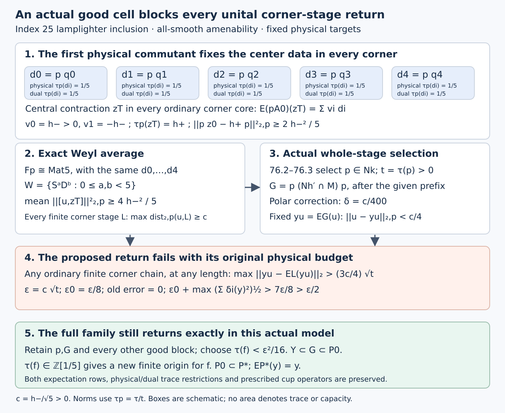

*Figure MR.1. The actual products \(d_i=pq_i\) have physical and module-dual normalized weight \(1/5\), and are fixed by every compatible corner-core map. MR.4–MR.14 give the witness and its uniform Weyl obstruction. MR.15–MR.29 charge the polar cost in the normalized corner, then return to the physical budget \(\varepsilon=c\sqrt t\). MR.31–MR.32 complete the same whole-stage family through its exact residual certificate. Box areas are schematic and encode neither trace nor canonical capacity. [Editable figure source](figures/marked-corner-return-v15.py).*

**Human context.** Sorin Popa, *Classification of amenable subfactors of type II*, Acta Mathematica 172 (1994), 163–255, [DOI 10.1007/BF02392646](https://doi.org/10.1007/BF02392646), §2.3.3(b), Example 3.1.3(b), and Theorem 4.4.1(1). The new quantitative corner-stage obstruction is proved in MR.4–MR.29. Its exact internal providers are LF.1–LF.17, [46.6](nongenerating-tunnels-and-boundary.md), [75.1–75.4](general-corners-and-piecewise-commuting-squares.md), and [76.2–76.4](whole-relative-commutant-blocks.md); the general fixed-family capacity formula is [80.3–80.4](central-capacity-and-small-support-cuts.md).

## Actual translation cocycles and a height-tail return that fails invariance

The original weighted inclusion and parameter WM.22 remain fixed. We use the actual \(Z=Z(W)\), normal action \(\beta\), center measures \(\mu_U,\mu_V\), likelihoods \(R_i\), and physical return of C13–E14. This chapter identifies the possible translation logarithmic means as actual group characters, bounds their total, and constructs singular states by conditioning the original normal center trace on large final-lamp height. The latter states have exact likelihood means different from the zero-cost means. More decisively, every such height-tail limit has a strictly positive actual origin-lamp expectation and therefore fails the required lamp-flip invariance.

This is a complete failed route inside the actual coefficient center. It does not construct an invariant state with zero translation means, or establish a positive lower bound for every original compatible state.

### T15.1. Actual logarithmic means are characters of the spatial group

For \(g\in H\), let \(D_g\) be the normal Radon–Nikodym multiplier defined by
\[
\mu_U\beta_g^{-1}=\mu_U(D_g\,\cdot).
\]
For a generator it is exactly the boundedly invertible original density E14.14. Products and inverses therefore give boundedly invertible \(D_g\) for every fixed \(g\). Normal change of variables and faithfulness give the actual cocycle identity
\[
D_{gh}=D_g\,\beta_g(D_h).
\tag{T15.1}
\]
If \(\omega\) is any actual \(H\)-invariant state on \(Z\), then
\[
\ell_\omega(g)=\omega(\log D_g),\qquad
\ell_\omega(gh)=\ell_\omega(g)+\ell_\omega(h).
\tag{T15.2}
\]
All functions tested here are bounded; no normality of \(\omega\) is used.

E14.5 gives \(\beta_{z^2}|_Z=\mathrm{id}\), and thus \(D_{z^2}=1\). The center action factors through the actual lamplighter group E14.7. Its finite lamp subgroup consists of torsion elements, so every real character vanishes on it. All group relations therefore imply
\[
\ell_\omega(c,v,n)=\sum_{j=1}^3 v_j\ell_j,\qquad
\ell_j=\omega(\log D_{j+1}).
\tag{T15.3}
\]
Here labels \(j+1=2,3,4\) are the physical translations \(t_j\). In particular the lamp label has zero logarithmic mean, as already checked in E14.15. The physical trace character \(\lambda^n\) has not been changed.

Let \(c=\omega(\log R_0)\) and \(s=(\ell_1+\ell_2+\ell_3)/3\). The exact original density gives
\[
\omega(\log R_1)=c+\log\lambda,\qquad
\omega(\log R_{j+1})=c+\ell_j.
\]
Functional Jensen on the original identities \(\sum_iR_i=1\) and \(\sum_i\omega(R_i^{-1})=d\) gives
\[
\begin{aligned}
e^c A(\ell)&\le1,&e^{-c}B(\ell)&\le d,\\
A(\ell)&=1+\lambda+\sum_j e^{\ell_j},\\
B(\ell)&=1+\lambda^{-1}+\sum_j e^{-\ell_j}.
\end{aligned}
\tag{T15.4}
\]
Thus \(A(\ell)B(\ell)\le d\). Arithmetic–geometric mean gives the further lower bound
\[
A(\ell)B(\ell)\ge
(1+\lambda+3e^s)(1+\lambda^{-1}+3e^{-s}).
\]
Subtracting \(d=(4+\lambda)(4+\lambda^{-1})\), the last expression factors as
\[
\frac{3(1+\lambda^{-1})(e^s-1)(e^s-\lambda)}{e^s}.
\]
It follows that every actual invariant mean satisfies
\[
0\le\ell_1+\ell_2+\ell_3\le3\log\lambda.
\tag{T15.5}
\]

Both endpoint implications are exact, but neither endpoint has been constructed. If the sum is zero, equality in the arithmetic–geometric mean forces all \(\ell_j=0\). T15.4 then forces \(c=-\log S_+\). The five Jensen lower bounds for \(\omega(R_i)\) sum to one, so each is equality and \(\omega(R_i)=w_i^+\). The original inverse identity gives equality of each inverse tangent variance, proving \(\omega(|R_i-w_i^+|)=0\). C13.19 gives original zero cost.

If the sum is \(3\log\lambda\), the same argument instead gives
\[
\begin{aligned}
\ell_j&=\log\lambda,&u_0&=\frac1{1+4\lambda},\\
u_i&=\frac{\lambda}{1+4\lambda}\quad(1\le i\le4),\\
\omega(|R_i-u_i|)&=0,\\
\psi_\omega(\mathfrak a)&=6(\lambda-\lambda^{-1})>0.
\end{aligned}
\tag{T15.6}
\]
Here \(\sum_i u_i^{-1}=d\). The last value follows by summing the five actual inverse differences in C13.19: the identity contributes \(3(\lambda-1)\), the lamp \(3(\lambda-1)/\lambda\), and the three translations together \(3(\lambda-\lambda^{-1})\).

The actual set of three logarithmic means is compact and convex, as the continuous affine image of the compact invariant-state set. It is invariant under permutations of the spatial coordinates. Indeed, permutation of labels \(2,3,4\) maps each finite actual endpoint matrix unit to the correspondingly permuted word matrix unit. It preserves endpoint equality, all original weights, cups and inclusions. The trace-preserving maps extend normally to the actual two cores and their coefficient center, conjugating \(\beta_g\) to \(\beta_{\pi g}\) and permuting the \(D_{j+1}\). Averaging an actual invariant state over these six normal center maps gives another actual invariant state with all three means equal to \(s\). This is a genuine symmetry of the finite tower; it introduces no new center model. It does not determine whether \(s=0\) is attained.

### T15.2. An exact geometric final-height tail in the original traces

Let \(L_x\in Z\) be the actual lamp unitaries E14.8, and put \(h(x)=x_1+x_2+x_3\). The final configuration has infinitely many lit lamps, while the actual raw walk has negative height drift. Hence the height of its highest lit lamp is a finite integer almost surely under either original normal center measure. We use only its bounded spectral projections
\[
E_K=1-\bigwedge_{h(x)\ge K}\frac{1+L_x}{2}\in Z.
\tag{T15.7}
\]
They decrease strongly to zero as \(K\) tends to infinity. Every invariant \(\omega\) nevertheless has \(\omega(E_K)=1\): the complementary projection is dominated by the event that any prescribed finite collection in this infinite halfspace is unlit, of value \(2^{-m}\) by E14.10.

Write
\[
A=\frac{1+4\lambda}{4+\lambda}.
\]
At a raw step, the height either stays fixed or increases by one in the plus phase, and stays fixed or decreases by one in the minus phase. The probabilities of zero and nonzero displacement are
\[
a_+=\frac{1+\lambda}{S_+},\ b_+=\frac3{S_+},\qquad
a_-=\frac{1+\lambda^{-1}}{S_-},\ b_-=\frac3{S_-}.
\]
The two functions
\[
F_+(h)=A\lambda^h,\qquad F_-(h)=\lambda^h
\tag{T15.8}
\]
satisfy the exact one-step harmonic identities, since
\(A=a_++\lambda b_+\) and \(1=A(a_-+\lambda^{-1}b_-)\).
Stop the resulting nonnegative martingale at the first hit of height \(K\), from a starting height \(h<K\). That hit occurs in a plus translation step, so the next phase is minus and the stopped value is \(\lambda^K\). Before it occurs the martingale is bounded by \(\lambda^K\). On never hitting, its value tends to zero by the original negative drift. Bounded convergence applied to the finite stopped martingale identities proves
\[
\mathbb P_+(T_K<\infty)=A\lambda^{h-K},\qquad
\mathbb P_-(T_K<\infty)=\lambda^{h-K}.
\tag{T15.9}
\]
This is a calculation with the original raw word probabilities.

At the first hit of height \(K\), no earlier lamp at height at least \(K\) was lit. The probability of ultimately leaving some lit lamp in that halfspace depends only on the next minus phase; translation in the height-zero plane and the earlier lower lamps do not affect it. Denote this probability by \(p>0\). A direct positive event proves the strict sign: from phase minus at height zero choose the identity, then the plus toggle \(az\), then minus \(t_1^{-1}\), and never return to height zero. Its probability is at least
\[
w_0^-w_1^+w_2^-\left(1-\frac A\lambda\right)>0,
\quad
1-\frac A\lambda=\frac{\lambda^2-1}{\lambda(4+\lambda)}.
\tag{T15.10}
\]
The origin lamp then remains lit. The same \(p\) works after every first hit, by independence of the unused actual labels.

The two original normal center measures therefore have the exact tails
\[
\mu_U(E_K)=p\lambda^{-K},\qquad
\mu_V(E_K)=Ap\lambda^{-K}\qquad(K\ge1).
\tag{T15.11}
\]
The two measures remain distinct, as required by their original full-corner traces.

### T15.3. Actual height-conditioned states select different likelihood means

Define states on the actual \(Z\), using the original normal measures,
\[
\begin{aligned}
\eta_K(t)&=\frac{\mu_U(E_Kt)}{\mu_U(E_K)},\\
\rho_K(t)&=\frac{\mu_V(E_Kt)}{\mu_V(E_K)}.
\end{aligned}
\tag{T15.12}
\]
These are genuine normal center states. No change of physical inclusion or parameter is involved.

For \(K\ge2\), the identity and lamp label fix \(E_K\); the translations satisfy \(\beta_{j+1}^{-1}(E_K)=E_{K-1}\). Applying the original trace formula E14.13 and T15.11 gives the exact likelihood moments
\[
\begin{aligned}
\rho_K(R_0)&=\frac1{1+4\lambda}=u_0,\\
\rho_K(R_i)&=\frac{\lambda}{1+4\lambda}=u_i\quad(1\le i\le4).
\end{aligned}
\tag{T15.13}
\]
Every weak-star limit, or limit of Cesàro averages, of these states retains these moments. Its original likelihood deviations satisfy the definite bound
\[
\begin{aligned}
\sum_i\rho(|R_i-w_i^+|)&\ge\sum_i|u_i-w_i^+|\\
&=\frac{6(\lambda^2-1)}{(1+4\lambda)(4+\lambda)}>0.
\end{aligned}
\tag{T15.14}
\]
Thus this actual height-conditioning family cannot supply the desired likelihood values, even before asking for invariance.

For clarity, its exact covariance can also be computed. If a fixed \(g\) has spatial height \(h(g)\), then, for all sufficiently large \(K\), the finite initial lamps of \(g\) do not affect the high halfspace, and
\(\beta_g^{-1}E_K=E_{K-h(g)}\).
Normal change of variables consequently gives
\[
\eta_K\beta_g^{-1}(t)=
\lambda^{-h(g)}\eta_{K+h(g)}(D_gt).
\tag{T15.15}
\]
A joint cluster of the Cesàro averages of \(\eta_K,\rho_K\), starting at \(K=3\), yields actual singular states \(\eta,\rho\) satisfying
\[
\begin{aligned}
\eta\beta_g^{-1}&=\lambda^{-h(g)}\eta(D_g\,\cdot),\\
\eta(D_g)&=\lambda^{h(g)},\\
\eta&=(1+4\lambda)\rho(R_0\,\cdot).
\end{aligned}
\tag{T15.16}
\]
The finite shift of the averaging interval has vanishing boundary. These states are purely singular because they give value one to every \(E_K\), while \(E_K\downarrow0\) strongly.

T15.16 is a conformal covariance identity. It does not make either state invariant, and the expectations of \(D_g\) do not establish the expectations of \(\log D_g\).

There is an exact finite averaging law for \(\rho\). The original identities imply
\(\mu_V=\sum_{ij}w_i^+w_j^-\mu_V\beta_{s_is_j^{-1}}^{-1}\).
Indeed the plus identity follows by summing E14.13. For the minus identity, use \(\mu_V=w_0^+\mu_U(R_0^{-1}\,\cdot)\), \(D_j=R_j/(\nu_jR_0)\), and the inverse normal change of variables from T15.1. For \(t\in Z\) this gives
\[
\sum_jw_j^-\mu_V(\beta_j(t))
=\frac1d\mu_U\left(
\left[\sum_j\beta_j^{-1}(R_j^{-1})\right]t\right)
=\mu_U(t),
\]
by the original pointwise dimension identity WM.31 transported through \(\zeta_U\). Thus \(\mu_U=\sum_jw_j^-\mu_V\beta_j\), and the two identities compose with the displayed group ordering. Apply this stationarity identity to \(E_Kt\), and then T15.11. Taking the Cesàro cluster yields
\[
\rho=\sum_{ij}w_i^+w_j^-\lambda^{h(s_i)-h(s_j)}
\rho\beta_{s_is_j^{-1}}^{-1}.
\tag{T15.17}
\]
The displayed coefficients sum to one, since
\[
\left(\sum_i\nu_i\lambda^{h(s_i)}\right)
\left(\sum_j\nu_j^{-1}\lambda^{-h(s_j)}\right)
=(1+4\lambda)(1+4\lambda^{-1})=d.
\]
This is an auxiliary averaging identity on the actual original center, derived from actual conditioned traces. Its coefficients have not replaced the physical weights, \(E_A\), \(P_0\), or either canonical trace.

### T15.4. Every height-tail limit fails the actual lamp-flip invariance

The failure is stronger than unequal likelihood moments. The origin-lamp expectation of every limit above is strictly positive.

The exact conditional law of the original raw prefix before the first hit of \(K\), given that it hits, is the elementary harmonic change of weights from T15.8:
\[
\begin{aligned}
\widetilde w_i^+
&=\frac{\nu_i\lambda^{h(s_i)}}{1+4\lambda}
 =\frac{(1,\lambda,\lambda,\lambda,\lambda)_i}{1+4\lambda},\\
\widetilde w_i^-
&=\frac{\nu_i^{-1}\lambda^{-h(s_i)}}{1+4\lambda^{-1}}\\
&=\frac{(1,\lambda^{-1},\lambda^{-1},\lambda^{-1},\lambda^{-1})_i}
 {1+4\lambda^{-1}}.
\end{aligned}
\tag{T15.18}
\]
To verify this rather than assume it, multiply each original transition probability by the ratio of its next \(F\)-value to its present \(F\)-value. The factors telescope along any stopped prefix; its final \(F\)-value is the constant \(\lambda^K\). After dividing by T15.9, this gives exactly the conditional original prefix probability. Conditioning instead on \(E_K\) multiplies every first-hit prefix by the same positive suffix probability \(p\), so gives the same prefix law.

These weights are only this exact conditioned-prefix law. They define no new physical inclusion. Their spatial pair drift is positive:
\[
\left(\frac{\lambda}{1+4\lambda}-\frac1{4+\lambda}\right)(1,1,1)
=\frac{\lambda^2-1}{(1+4\lambda)(4+\lambda)}(1,1,1).
\]
Thus the conditioned walk hits every fixed higher level almost surely.

Its Fourier transience bound is the same uniform bound used in WM.19–WM.20. For \(1\le\lambda\le2\), its plus zero mass is at least \(1/3\), and each plus unit mass at least \(1/5\). Keeping their cross terms gives
\(1-|\widetilde\psi_+|^2\ge(2/15)\sum_j(1-\cos\theta_j)\).
The rest of the original Gaussian integral argument therefore gives the same pair tail \(32/\sqrt J\). Both raw phases are transient, and the final origin sign for this conditioned-prefix law exists. Denote its plus-phase expectation by \(\widetilde h_+(\lambda)\).

At \(\lambda=1\) this is the actual unweighted law in WM.8, with \(\widetilde h_+(1)\ge b\). Each of the two five-label vectors in T15.18 has total absolute derivative at most \(8/25\) on \([1,2]\): differentiate their one exceptional entry and four equal entries. Thus the same counted coupling estimate for \(2J\) raw choices bounds its finite origin-sign expectation change by \(2J|\lambda-1|\). Its infinite-time error is at most \(512/\sqrt J\), by the same eight raw-visit tests. At the fixed values of \(b,J,\lambda\) in WM.22 this proves
\[
\widetilde h_+(\lambda)
\ge b-2J|\lambda-1|-2(512/\sqrt J)
\ge5b/8>b/2>0.
\tag{T15.19}
\]
Every constant belongs to the original fixed parameter; no limit of changed physical inclusions is used.

We now relate this value to the actual original height-conditioned states. Before the first hit of \(K\), their prefix has the law T15.18 just proved. As \(K\to\infty\), the origin sign accumulated by that prefix converges in expectation to \(\widetilde h_+(\lambda)\): the positive-drift hitting times tend to infinity, and the fixed origin lamp stabilizes almost surely by transience. Bounded convergence applies.

After the first hit, the position \(x\) has \(h(x)=K\), hence tends uniformly to spatial infinity. The original uniform transience estimate WM.20 gives that the probability of any later visit to the origin tends to zero uniformly over these positions. Explicitly, bounded increments exclude early visits, and the \(32/\sqrt J\) tail controls all remaining pair tests; choose \(J\) increasing below the earliest possible hitting time. Conditioning this suffix on leaving a lit lamp above its starting height increases this bound by at most \(1/p\), which is fixed and finite by T15.10. A later origin toggle therefore changes its conditional sign expectation by a quantity tending to zero.

For an explicit uniform bound, let \(K\ge4\) and \(J_K=\lfloor(K-2)/2\rfloor\). At a post-hit position of height \(K\), each pair changes height by at most one and an intermediate raw visit differs by at most one. No origin visit is therefore possible through the early cutoff \(J_K\), uniformly over all such positions. The eight raw-position tests in WM.20 bound the later visit probability by \(256/\sqrt{J_K}\). Dividing by the fixed suffix-event probability \(p\), and charging at most two for a sign change, gives

\[
\text{conditional post-hit sign error}
\le\min\left(2,\frac{512}{p\sqrt{\lfloor(K-2)/2\rfloor}}\right)
\longrightarrow0.
\tag{T15.19a}
\]

This estimate uses the original minus-phase suffix and its actual positive \(p\). It makes no uniform-in-\(\lambda\) assertion as \(\lambda\) changes.

It follows inside the actual coefficient center that
\[
\begin{aligned}
\lim_{K\to\infty}\rho_K(L_0)&=\widetilde h_+(\lambda)>b/2,\\
\rho(L_0)&=\widetilde h_+(\lambda).
\end{aligned}
\tag{T15.20}
\]
for every height-tail cluster, including every Cesàro cluster. The actual lamp automorphism satisfies \(\beta_1^{-1}(L_0)=-L_0\). An invariant state must give \(L_0\) value zero. Thus every state constructed by this height-tail conditioning fails actual \(H\)-invariance. This proves a complete finite obstruction to this particular construction, rather than asserting an unproved failure of all invariant states.

The minus-starting states \(\eta_K\) have the same obstruction, with the initial phase retained. Their first-hit prefix has the two alternating weights T15.18, now starting with the minus vector. At \(\lambda=1\), WM.22 gives the minus-starting final origin sign at least \(b\). The two vectors have the same derivative bounds, and the uniform transience estimate covers both raw phases. Thus the counted coupling and tail comparison of T15.19 gives \(\widetilde h_-(\lambda)\ge5b/8>b/2\). The first hit is still a plus translation with next phase minus; its conditioned suffix has the same fixed probability \(p\), and the same uniform post-hit origin estimate applies. Consequently

\[
\begin{aligned}
\lim_{K\to\infty}\eta_K(L_0)&=\widetilde h_-(\lambda)>b/2,\\
\eta(L_0)&=\widetilde h_-(\lambda)>b/2.
\end{aligned}
\tag{T15.20a}
\]

This proves the lamp-flip failure for both constructed state families and their Cesàro clusters. It uses each original center measure in its own initial phase, rather than identifying the two measures.

### T15.6. The exact remaining boundary

The actual logarithmic-mean set lies in T15.4–T15.5 and has the actual permutation symmetry proved in T15.1. Zero total mean would produce the required original cost-zero state by the original physical return, and that state would automatically annihilate the entire Jones ideal by E14.12a. These are exact implications, not the claimed construction.

The new concrete construction T15.12–T15.20 instead gives actual singular center states with explicit likelihood moments, conformal covariance, and a finite stationary averaging law. It fails the actual lamp-flip test by a strictly positive amount. Averaging these states over \(H\) can change their likelihood values and logarithmic means; nothing here shows that such averaging preserves T15.13, creates zero translation means, or gives a universal positive separation.

The unresolved step is to construct an actual invariant \(\omega\) with \(\ell_1+\ell_2+\ell_3=0\), or prove a strictly positive lower bound on this sum for every invariant state of this particular \(Z(W)\). No such attainment or separation is established. This chapter does not treat the Jensen enclosure as the assigned unrestricted result. The original upper likelihood endpoint, original \(P_0\)-balance and zero-cost target remain open.

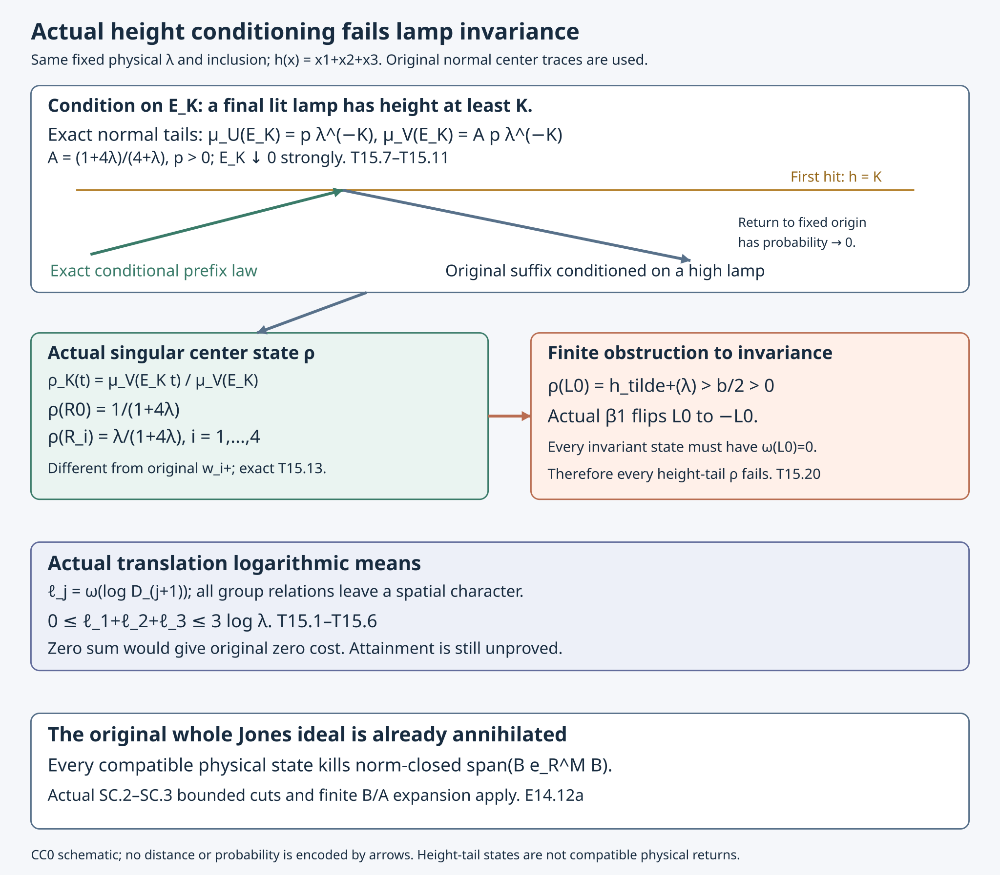

Figure T15. Heights are \(h(x)=x_1+x_2+x_3\). The prefix law and both normal tail measures are exact original conditional trace calculations T15.8–T15.18. The post-hit law is the original suffix conditioned on a high lamp, with probability \(p>0\). The origin-lamp sign in every resulting state is bounded below in T15.19–T15.20, so the required invariant physical return cannot be applied to that state. The logarithmic-mean interval at the bottom is schematic and encodes no metric or endpoint attainment. [Reproducible diagram source](figures/translation-height-obstruction-v16.py). The diagram writes \(L0=L_0\), \(R0=R_0\), and \(w_i+=w_i^+\); its arrows encode no distances or probabilities.

### Mathematical sources

Sorin Popa, *Classification of amenable subfactors of type II*, Acta Mathematica 172 (1994), 163–255, [DOI 10.1007/BF02392646](https://doi.org/10.1007/BF02392646), §2.3 and §3.1–§3.2, provides the context for smooth representations and compatible physical hypertraces.

The exact weighted finite tower, original trace character and parameter constants used here are [WM.1–WM.36](general-tail-supports-and-controlled-tunnels.md). The exact physical center return, original likelihood formulas and dimension identity are [C13.1–C13.24](general-tail-supports-and-controlled-tunnels.md). The actual whole-center action and purely singular restrictions are [E14.1–E14.18](general-tail-supports-and-controlled-tunnels.md). The already delivered whole-ideal conclusion E14.12a uses the complete proofs SC.2–SC.3 in [Singular hypertraces, the Jones ideal and bounded entropy](singular-hypertraces-jones-ideals-and-entropy.md), with their actual bounded-left-cut and finite-expansion hypotheses. All height-tail and cocycle computations are proved above.

## Normalized Radon–Nikodym cocycles need not have a zero-character invariant state

Probability normalization and amenability do not imply the proposed zero-character theorem. The counterexample below has a faithful normal probability, boundedly invertible derivatives for every fixed group element, and exactly the group relations of the weighted model's acting group. Every invariant state has a strictly positive spatial character. This is an actual nonsingular action, not a claimed new subfactor or an identification with the fixed coefficient center \(Z(W)\).

We also prove the abelian assertion and construct a normal affine observable inside the fixed coefficient center. These results isolate the missing operator comparison in the attempted endpoint route. The weighted model's physical parameter, two traces, \(E_A,P_0\), and full action remain the original ones.

### NZ.1. Conventions

Let a group act on a commutative von Neumann algebra by \(\beta_{gh}=\beta_g\beta_h\). For a faithful normal probability \(\mu\), use
\[
\mu\beta_g^{-1}(f)=\mu(D_gf),\qquad
c_g=\log D_g,\qquad
c_{gh}=c_g+\beta_g(c_h).
\tag{NZ.1}
\]
All \(D_g\) below are bounded and boundedly invertible for each fixed \(g\); all \(c_g\) are therefore bounded. For any invariant state \(\omega\), including a singular state, \(\omega(c_g)\) is a real character. The normalization \(\mu(D_g)=1\) follows from applying the change of variables to the identity.

### NZ.2. An explicit probability on a local field

Define \(K=\mathbb F_2((t))\): its elements are Laurent series with finitely many negative powers. Addition is coefficientwise modulo two. The norm of a nonzero series whose first nonzero coefficient has exponent \(r\) is \(2^{-r}\). Put \(\mathcal O=\mathbb F_2[[t]]\).

There is an additive Haar measure \(m\) with \(m(\mathcal O)=1\), constructed by fair independent coefficients on \(\mathcal O\), translation of this probability to each coset, and the increasing union \(K=\bigcup_{n\ge0}t^{-n}\mathcal O\). The measures agree on overlaps because each ball splits into two translates of the next smaller ball. Thus
\[
m(t^{-n}\mathcal O)=2^n,\qquad
m(\{|x|=2^n\})=2^{n-1}\quad(n\ge1).
\tag{NZ.2}
\]
Multiplication by \(t^{-1}\) scales \(m\) by two. This follows first on balls and their translates, which generate the measurable sets, and then by countable additivity.

Set
\[
f(x)=
\begin{cases}
1,&|x|\le1,\\
|x|^{-2},&|x|>1,
\end{cases}
\qquad d\mu=\frac23f\,dm.
\tag{NZ.3}
\]
The shell calculation is exact:
\[
\int_Kf\,dm=1+\sum_{n\ge1}2^{n-1}2^{-2n}
=\frac32,\qquad \mu(\mathcal O)=\frac23.
\tag{NZ.4}
\]
The density is strictly positive. Hence \(\mu\) is a faithful normal probability on \(\mathcal Z=L^\infty(K,m)=L^\infty(K,\mu)\).

### NZ.3. The actual group relations and its nonsingular action

Keep the weighted model's group
\[
H=\{(c,v,n):c\in\bigoplus_{\mathbb Z^3}\mathbb Z/2,\quad
v\in\mathbb Z^3,\quad n\equiv\sum_xc(x)\pmod2\}.
\tag{NZ.5}
\]
The central even integer is retained in \(H\); it will act trivially on \(\mathcal Z\), just as it does on the actual coefficient center. Write \(h(v)=v_1+v_2+v_3\). The map
\[
q(c)=\sum_{v\in\mathbb Z^3}c(v)t^{-h(v)}
\in A:=\mathbb F_2[t,t^{-1}],\qquad
(c,v,n)\cdot x=q(c)+t^{-h(v)}x
\tag{NZ.6}
\]
is an action. Indeed \(q(\operatorname{shift}_v d)=t^{-h(v)}q(d)\), so affine composition gives precisely the semidirect-product multiplication in \(H\). This is a group homomorphism to the affine group, rather than an assignment of unrelated generator transformations.

For the actual labels \(s_0=1,s_1=az,s_{j+1}=t_j\), the transformations are identity, \(x\mapsto x+1\), and \(x\mapsto t^{-1}x\) for each \(j=1,2,3\). All finite lamps have order two on this algebra, translations commute, they conjugate lamps to lamps, and \(z^2\) acts identically. Define the algebra action by
\[
\beta_gF(x)=F(g^{-1}\cdot x).
\tag{NZ.7}
\]
For an affine transformation \(x\mapsto ax+b\), normal change of variables gives
\[
D_g(x)=|a|^{-1}\frac{f(a^{-1}(x-b))}{f(x)}.
\tag{NZ.8}
\]
This is exactly the convention NZ.1. It proves normalization for every \(g\), not only the generators.

Translation by \(1\) preserves \(f\), since it preserves \(\mathcal O\), and preserves the norm outside \(\mathcal O\). Hence \(D_{az}=1\). For the expansion \(T:x\mapsto t^{-1}x\),
\[
D_T(x)=\frac12\frac{f(tx)}{f(x)}
=
\begin{cases}
\frac12,&x\in\mathcal O,\\
2,&x\notin\mathcal O.
\end{cases}
\tag{NZ.9}
\]
For the inverse, \(D_{T^{-1}}\) equals \(2\) on \(t\mathcal O\) and \(1/2\) outside it. Thus the generator derivatives lie between \(1/2\) and \(2\). Fixed words inherit a positive lower bound and a finite upper bound from NZ.1. One may also check translations directly: if \(|b|\le2^r\), \(r\ge0\), their derivative is one outside \(t^{-r}\mathcal O\) and lies between \(2^{-2r}\) and \(2^{2r}\) inside it. No uniform bound over all group elements is asserted or required.

### NZ.4. Every invariant state has the same nonzero character

The group \(H\) is amenable. For example its right Følner sets are the finite sets WM.16: finite lamp supports in a spatial cube, spatial endpoint in that cube, and central integer in an interval with its actual parity condition. Their right generator boundary ratios tend to zero. Averaging \(\mu\beta_g\) over those sets and taking a weak-star cluster supplies an \(H\)-invariant state on \(\mathcal Z\). Thus the assertion about all invariant states is nonvacuous.

For \(B_N=t^{-N}\mathcal O\), any number of pairwise disjoint translates exists using translations by distinct monomials \(t^{-k}\), \(k>N\). These translations belong to the image of conjugate lamps in \(H\). The difference of two such monomials has norm greater than \(2^N\), proving disjointness by the ultrametric inequality. If \(\omega\) is any invariant state, finite additivity and positivity give
\[
r\omega(1_{B_N})\le1\quad\hbox{for every }r\ge1,
\qquad \omega(1_{B_N})=0.
\tag{NZ.10}
\]
In particular NZ.9 implies the exact character values
\[
\omega(\log D_{t_j})=\log2\quad(j=1,2,3),\qquad
\omega(c_{(c,v,n)})=h(v)\log2.
\tag{NZ.11}
\]
The second identity follows from the cocycle, invariance and the actual relations: a real character vanishes on torsion lamps and on \(z^2\). Consequently
\(\sum_j\omega(\log D_{t_j})=3\log2>0\) for every invariant state. There is no zero-character invariant state.

All these states are purely singular. The projections \(1_{B_N}\) increase normally to the identity, while NZ.10 gives value zero to each. A normal positive functional below \(\omega\) is therefore zero. Nevertheless every \(D_g\) has normal integral one. For example NZ.9 gives \( (1/2)(2/3)+2(1/3)=1\).

This counterexample disproves normalization plus amenability as a sufficient principle even with this exact \(H\), its parity relation, and a trivial full-center \(z^2\) action. It does not satisfy or replace the original weighted core's additional two-trace likelihood and inverse-dimension identities. In particular \(\log2>\log\lambda\) for the actual WM.22 parameter, whereas T15.5 bounds each permutation-averaged actual character by \(\log\lambda\). The two actions cannot be identified.

### NZ.5. Why the abelian assertion is valid

Here is a complete statement that explains the single-transformation suggestion. If the acting group is finitely generated abelian, the hypotheses NZ.1 and normalization do imply existence of an invariant state with zero character.

First fix one transformation \(T\). Write
\[
c_{T^n}=\sum_{k=0}^{n-1}\beta_T^k(c_T).
\tag{NZ.12}
\]
Since \(\mu(e^{c_{T^n}})=1\), its essential infimum is at most zero and its essential supremum is at least zero. Choose normal states \(\sigma_n^-\), \(\sigma_n^+\) with
\(\sigma_n^-(c_{T^n}/n)\le1/n\) and
\(\sigma_n^+(c_{T^n}/n)\ge-1/n\); positive-measure near-extremal sets give these states. Their orbit averages have invariance error at most \(2/n\) on the unit ball. Cluster states are \(T\)-invariant and have values of \(c_T\) on opposite sides of zero. A convex combination is \(T\)-invariant with value exactly zero.

For commuting \(g,h\), the cocycle gives
\[
\beta_h(c_g)-c_g=\beta_g(c_h)-c_h.
\tag{NZ.13}
\]
A \(g\)-invariant state therefore retains its value on \(c_g\) when translated by \(h\). Averaging it over a Følner sequence of the full abelian group preserves \(g\)-invariance and the zero value on \(c_g\), and gives a full invariant cluster.

For generators \(T_1,\ldots,T_r\), let \(C\subset\mathbb R^r\) be the compact convex set of vectors \((\omega(c_{T_j}))_j\) from full invariant states. For every integer vector \(n\), the preceding argument applied to \(g=\prod_jT_j^{n_j}\) produces a point of \(C\) with \(n\cdot x=0\). If zero were outside \(C\), strict finite-dimensional separation would give a real separating vector. Approximation by a rational vector preserves strict separation because \(C\) is bounded. Clearing denominators then gives an integer separating vector, a contradiction. Thus \(0\in C\).

For the actual \(H\), NZ.13 is available between translations, but not between a translation and a lamp. More generally the cocycle gives
\[
\beta_h(c_g)=c_{hgh^{-1}}+\beta_{hgh^{-1}}(c_h)-c_h.
\tag{NZ.14}
\]
Invariance only under \(g\) does not cancel the last two terms involving \(hgh^{-1}\). Finite lamp-cube Haar averages do not repair this on the full algebra: moving the cube changes the constrained lamp support, and their total variation boundary need not be small. Agreement on finite lamp cylinders cannot be passed to the full bounded RN functions by a singular state. NZ.11 is a concrete refutation of that proposed extension of the abelian proof.

### NZ.6. A genuine affine observable in the fixed center, and its exact limitation

The fixed WM.22 model has its own normal affine observable. This uses the actual central lamps \(L_x\in Z(W)\), their normal laws in the two original measures, and their action E14.9. Under either normal law the actual raw height walk has negative pair drift. Hence it visits any fixed height only finitely many times, has an upper bound on all its heights, and leaves only finitely many lit lamps in any fixed height plane. These are almost-sure consequences of the original independent bounded increments and their strict negative expectation.

For each integer \(r\), the finite products of \(L_x\) over an increasing exhaustion of the plane \(h(x)=r\) therefore converge almost surely and in bounded \(L^2\) to a central self-adjoint unitary \(C_r\). The normal full-center lamp identification makes this a strong limit in \(Z(W)\). If \(b_r=(1-C_r)/2\), its joint spectrum consists normally of bits with \(b_r=0\) above a finite random height. Thus
\[
X=\sum_{r\in\mathbb Z}b_rt^{-r}\in\mathbb F_2((t))
\]
is a measurable random variable in the original commutative center. Equivalently its spectral map is a normal unital homomorphism from \(L^\infty(K,\nu_U)\) to \(Z(W)\), where \(\nu_U=X_*\mu_U\); it is faithful on this quotient measure algebra. The same normal spectral map is used for \(\mu_V\), with its own pushforward measure.

The finite affine identities survive these bounded normal products. A finite lamp configuration adds \(q(c)\), and a spatial translation acts by multiplication by \(t^{-h(v)}\). Thus this observable has precisely the affine transformation in NZ.6, with both original normal laws. All invariant states on the original full center annihilate its compact-ball spectral projections: the disjoint-translate proof NZ.10 applies to those actual projections. This is a proved singular escape statement inside the actual center.

The two pushforward laws are distinct, with an exact tail calculation that retains the actual parameter. Let \(p'>0\) be the original minus-starting suffix probability that some height-plane parity at height at least zero is odd. The event “minus identity, plus \(az\), minus \(t_1^{-1}\), and no subsequent return to height zero” proves
\[
p'\ge w_0^-w_1^+w_2^-(1-A/\lambda)>0,
\qquad A=\frac{1+4\lambda}{4+\lambda}.
\tag{NZ.15}
\]
There is then exactly one lit lamp at height zero and no other lamp in its height plane; all subsequent lamps lie below it. Before the first hit of height \(K\), all plane parities above or at \(K\) are zero. At the first hit, the next phase is minus, and its unused suffix has probability \(p'\) of leaving a nonzero high parity. The original bounded martingale calculation T15.8–T15.9 therefore gives, for \(K\ge1\),
\[
\nu_U(|X|>2^{K-1})=p'\lambda^{-K},\qquad
\nu_V(|X|>2^{K-1})=Ap'\lambda^{-K}.
\tag{NZ.16}
\]
These are actual normal tails, not a change of physical parameter. Since \(A>1\), they also prove the distinction of the two pushforward measures. Their successive ratio is \(1/\lambda\), whereas the explicit counterexample's normal tail ratio is \(1/2\).

It does not identify the normal pushforward \(\nu_U\) with NZ.3, and does not identify either the full actual \(D_g\) or its logarithm with NZ.8. On the affine spectral subalgebra the normal derivative is only
\[
\overline D_g=E_{\mu_U}(D_g\mid X).
\]
This follows by testing the defining normal RN identity on functions of \(X\). Conditional expectation preserves the original positive bounds, but generally
\(\log\overline D_g\ne E_{\mu_U}(\log D_g\mid X)\).
Moreover an arbitrary singular invariant state need not commute with this normal conditional expectation. Thus compact-ball escape alone gives no character separation for the full original \(D_g\).

The precise remaining actual operator task is to construct an \(H\)-invariant state on the full \(Z(W)\) annihilating the bounded functions \(\log D_{t_j}\), or to bound their original total mean strictly above zero for all such states. Neither the normalization principle, its valid abelian restriction, nor this genuine affine observable performs that task. The original two-trace identities and physical return must still be used; there is no substitution of the local-field action for the actual inclusion.

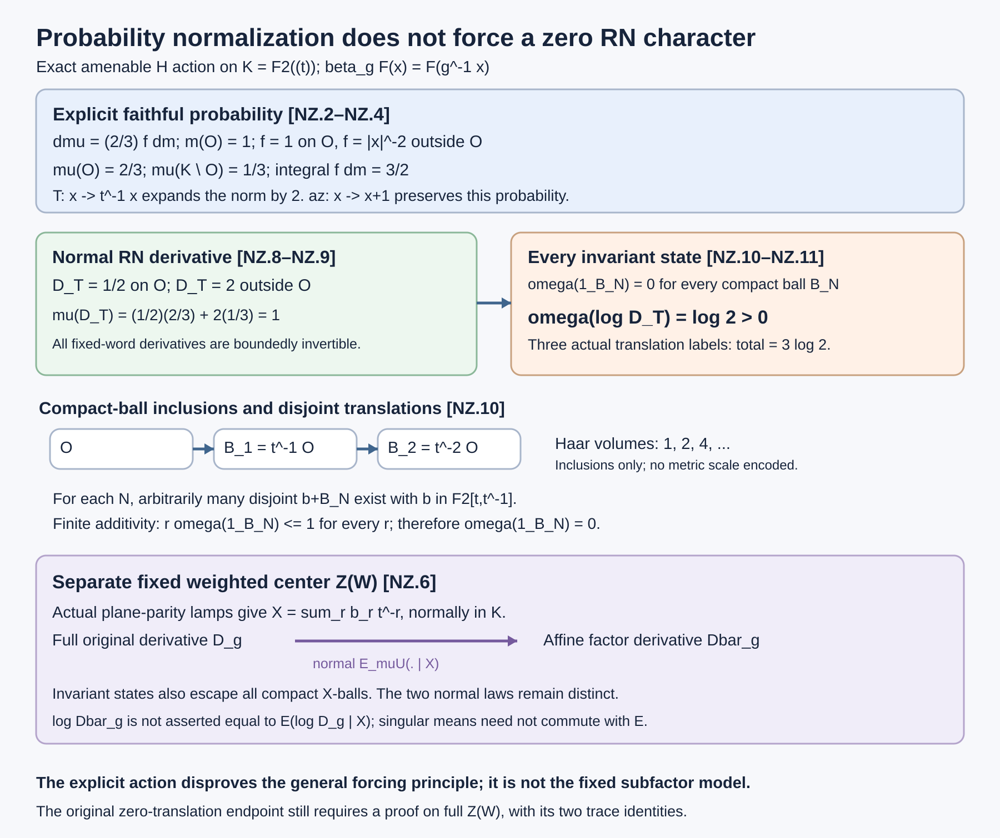

The upper diagram is the explicit nonsingular counterexample NZ.2–NZ.11. Its horizontal ball strip shows inclusions, not a metric scale; each larger ball has twice the additive Haar volume. The lower diagram is the different affine observable inside the original center. The normal conditional-expectation arrow compares derivatives, and supplies no asserted equality of logarithmic state means. [Reproducible diagram source](figures/normalization-obstruction-v17.py).

#### Mathematical context

Sorin Popa, *Classification of amenable subfactors of type II*, Acta Mathematica 172 (1994), 163–255, [DOI 10.1007/BF02392646](https://doi.org/10.1007/BF02392646), provides the context for the original smooth representation and physical return. The weighted tower and exact parameter are WM.1–WM.36; the normal center maps and physical return are C13.1–C13.24; the full center action and two-trace RN formula are E14.1–E14.18; the logarithmic enclosure is T15.1–T15.6. The nonsingular counterexample and the abelian assertion are proved above and require no external theorem identifying a boundary.

## A stationary affine law with a positive invariant likelihood cost

The normalization obstruction remains even after imposing two stationary probability equations, positive likelihoods, and the reciprocal dimension identity. The following complete measurable action has a positive cost for every invariant state. The space is not identified with the ordinary-core center of a finite-index subfactor.

Here \(T:x\mapsto tx\) denotes contraction; it is the inverse of the expansion denoted \(T\) in NZ.9. The RN convention is the same in both sections.

### The field and its normalized additive measure

Let \(K=\mathbb F_2((t))\). An element is a Laurent series \(\sum_{j\ge n}x_jt^j\), with \(x_j\in\{0,1\}\) and finitely many negative indices. Its absolute value is \(2^{-n}\) when its first nonzero index is \(n\). Write \(\mathcal O=\mathbb F_2[[t]]\).

The product measure on the binary coordinates of \(\mathcal O\) gives every specified initial string of \(m\) digits mass \(2^{-m}\). Addition in characteristic two flips specified digits, so this measure is invariant under all translations in \(\mathcal O\). Its extension to \(t^{-n}\mathcal O\), assigning each of the \(2^n\) cosets of \(\mathcal O\) mass one, is consistent as \(n\) increases. It defines a sigma-finite measure \(m\) on \(K\), invariant under every Laurent-polynomial translation and under every element of \(K\) by the same coordinate argument. Thus

\[
m(\mathcal O)=1,\qquad m(tE)=\tfrac12m(E),\qquad
m\{|x|=2^k\}=2^{k-1}\quad(k\ge1).
\tag{AC.1}
\]

The translations needed below are by \(L=\mathbb F_2[t,t^{-1}]\). This is a countable locally finite additive group. Dilation \(T:x\mapsto tx\) normalizes it. The semidirect group \(L\rtimes\mathbb Z\) acts by \(x\mapsto b+t^nx\).

For completeness it is amenable by explicit right Følner sets. Let \(L_R\) be the vector space spanned by \(t^{-R},\ldots,t^R\), and put

\[
\mathcal F_R=\{(b,n):b\in L_R,\ -R\le n\le R\}.
\tag{AC.2}
\]

Right multiplication by \((1,0)\) adds \(t^n\) to \(b\), hence preserves \(\mathcal F_R\) exactly. Right multiplication by \((0,1)\) changes only \(n\), and its symmetric-difference ratio is \(2/(2R+1)\). The inverses have the same ratios; finite words follow by telescoping. This proves amenability of this precise acting group.

### Exact two-phase stationary probabilities

Set \(A=6/7\), \(r=1/8\), and define the positive integrable density

\[
f_U(x)=
\begin{cases}
A,& |x|\le1,\\
A r^k,& |x|=2^k,\quad k\ge1.
\end{cases}
\tag{AC.3}
\]

By AC.1,
\[
\int f_U\,dm=A\left(1+\tfrac12\sum_{k\ge1}(2r)^k\right)
=\frac67\left(1+\frac16\right)=1.
\tag{AC.4}
\]

Addition \(a:x\mapsto x+1\) preserves \(f_U\) pointwise: it preserves \(\mathcal O\) and fixes the absolute value outside \(\mathcal O\). Define

\[
f_V(x)=
\begin{cases}
\tfrac32 f_U(x),&|x|\le\tfrac12,\\
\tfrac58 f_U(x),&|x|\ge1.
\end{cases}
\tag{AC.5}
\]

The two parts of \(\mathcal O\) have mass \(1/2\) each. The integral is therefore
\[
A\left(\frac34+\frac5{16}+\frac5{48}\right)=1.
\tag{AC.6}
\]

Let \(\mu_U=f_Um\), \(\mu_V=f_Vm\), and let \(g_*\mu(E)=\mu(g^{-1}E)\) denote pushforward by an affine map. The exact two stationary equations are

\[
\begin{aligned}
\mu_V&=\tfrac14\mu_U+\tfrac14 a_*\mu_U+\tfrac12 T_*\mu_U,\\
\mu_U&=\tfrac25\mu_V+\tfrac25 a_*\mu_V+\tfrac15 T^{-1}_*\mu_V.
\end{aligned}
\tag{AC.7}
\]

Here \(T_*\mu_U\) has density \(2f_U(x/t)\), while \(T^{-1}_*\mu_V\) has density \(\tfrac12 f_V(tx)\). In the first equation, the density is \(\tfrac12f_U(x)+f_U(x/t)\). If \(|x|\le1/2\) this is \((3/2)A\); on the unit shell it is \((1/2+r)A=(5/8)A\); outside \(\mathcal O\) the same ratio \(1/2+r=5/8\) applies.

For the second equation inside \(\mathcal O\), addition by one interchanges its inner half and unit shell. Thus the two translation terms contribute \((2/5)(3/2+5/8)A=(17/20)A\), and the dilation term contributes \((1/10)(3/2)A=(3/20)A\). Outside \(\mathcal O\), addition by one preserves its shell. At the first shell the dilation goes to the unit shell; at every later shell it goes to the preceding shell. The density equality reduces in either case to

\[
\frac45\frac58r^k+\frac1{10}\frac58r^{k-1}=r^k,
\qquad r=\frac18.
\tag{AC.8}
\]

These computations prove AC.7 on every piece, rather than assuming a stationary density.

### Bounded original-convention derivatives and a nonzero invariant character

Put \((\beta_g f)(x)=f(g^{-1}x)\), so \(\beta_{gh}=\beta_g\beta_h\). Use precisely
\[
\mu_U\beta_g^{-1}=\mu_U(D_g\,\cdot).
\tag{AC.9}
\]

With this convention, \(D_g\) is the density of \(g_*\mu_U\) relative to \(\mu_U\). Addition \(a\) has \(D_a=1\). Dilation has

\[
D_T(x)=\frac{2f_U(x/t)}{f_U(x)}
=
\begin{cases}
2,&|x|\le\tfrac12,\\
\tfrac14,&|x|\ge1.
\end{cases}
\tag{AC.10}
\]

All these derivatives are positive and boundedly invertible, and \(\mu_U(D_g)=1\). Products and inverses supply the same properties for each fixed word, using
\[
D_{gh}=D_g\,\beta_g(D_h).
\tag{AC.11}
\]

Let \(\omega\) be any \(L\rtimes\mathbb Z\)-invariant state of \(L^\infty(K,\mu_U)\), allowing arbitrary singular states. Every compact ball \(t^{-N}\mathcal O\) has arbitrarily many disjoint translates by elements of \(L\): choose Laurent polynomials with distinct principal parts below exponent \(-N\). Translation invariance and finite additivity give \(m_0\,\omega(1_{t^{-N}\mathcal O})\le1\) for every integer \(m_0\), hence

\[
\omega(1_{t^{-N}\mathcal O})=0\quad(N\ge0).
\tag{AC.12}
\]

Consequently AC.10 gives
\[
\omega(\log D_T)=-\log4,\qquad
\omega(\log D_{T^{-1}})=\log4.
\tag{AC.13}
\]

The sign is tied to the stated pushforward and beta convention. Dilation \(T:x\mapsto tx\) has the negative value, and expansion \(T^{-1}\) the positive one. Invariant states exist: for a state \(\omega_0\), average \(\omega_0\beta_g\) over the explicit right Følner sets. Applying \(\beta_h\) replaces \(g\) by \(gh\), so the norm difference is bounded by the right boundary ratio. Weak-star compactness gives an invariant cluster. Thus the nonzero values do not arise from an empty state class.

This also respects the three-dimensional lamplighter relations: map the lamp at \(v\in\mathbb Z^3\) to addition by \(t^{v_1+v_2+v_3}\), and each spatial translation to \(T\). The central \(z^2\) can act identically. This is an equivariant quotient action of those relations, not an identification of the fixed three-dimensional core.

### Exact likelihoods and the reciprocal dimension identity

Use labels \(s_0=1,s_1=a,s_2=T\), scales \(\nu=(1,1,2)\), weights
\[
w^+=(1/4,1/4,1/2),\qquad
w^-=(2/5,2/5,1/5),\qquad d=10.
\tag{AC.14}
\]

Define likelihoods by the original-form two-measure formula
\[
\mu_V(R_i f)=w_i^+\mu_U(\beta_i^{-1}f).
\tag{AC.15}
\]

The explicit densities give
\[
(R_0,R_1,R_2)=
\begin{cases}
(1/6,1/6,2/3),&|x|\le1/2,\\
(2/5,2/5,1/5),&|x|\ge1.
\end{cases}
\tag{AC.16}
\]

In particular \(\sum_iR_i=1\), and every \(R_i\) is bounded below by \(1/6\). The second equation in AC.7 gives the pointwise original-form dimension identity
\[
\sum_i\beta_i^{-1}(R_i^{-1})=10.
\tag{AC.17}
\]

It can also be checked without a measure transformation. If \(|x|\le1/2\), addition by one sends the point to the unit shell, and \(T\) stays in the inner ball. The three inverse values are \(6,5/2,3/2\), summing to ten. On the unit shell they are \(5/2,6,3/2\). If \(|x|>1\), the two first inverses are \(5/2\) and \(5/2\), while \(T\) is still at norm at least one, giving five.

Invariance now implies \(\sum_i\omega(R_i^{-1})=10\). More strongly, AC.12 and AC.16 give the exact value for every invariant state:
\[
\begin{aligned}
(\omega(R_0),\omega(R_1),\omega(R_2))&=(2/5,2/5,1/5),\\
\sum_i\omega(|R_i-w_i^+|)&=3/5,\\
\sum_i\omega(|R_i^{-1}-(w_i^+)^{-1}|)&=6.
\end{aligned}
\tag{AC.18}
\]

Thus normalized RN derivatives, amenability, the two actual stationary measure equations, positive bounded likelihoods and the original-form reciprocal dimension identity still do not force a cost-zero invariant state. This is a genuine measurable group-action counterexample to that forcing principle.

The identities AC.7 and AC.17 are identities of this measurable action. They alone do not identify it with the full ordinary-core center of a subfactor or identify its likelihoods with physical canonical densities. A stationary quotient of a larger center cannot imply a universal cost bound on the larger center. Such an identification needs a separate proof. The fixed WM.22 inclusion retains its original parameter, traces and likelihoods, and its zero-cost invariant-state question remains unproved.

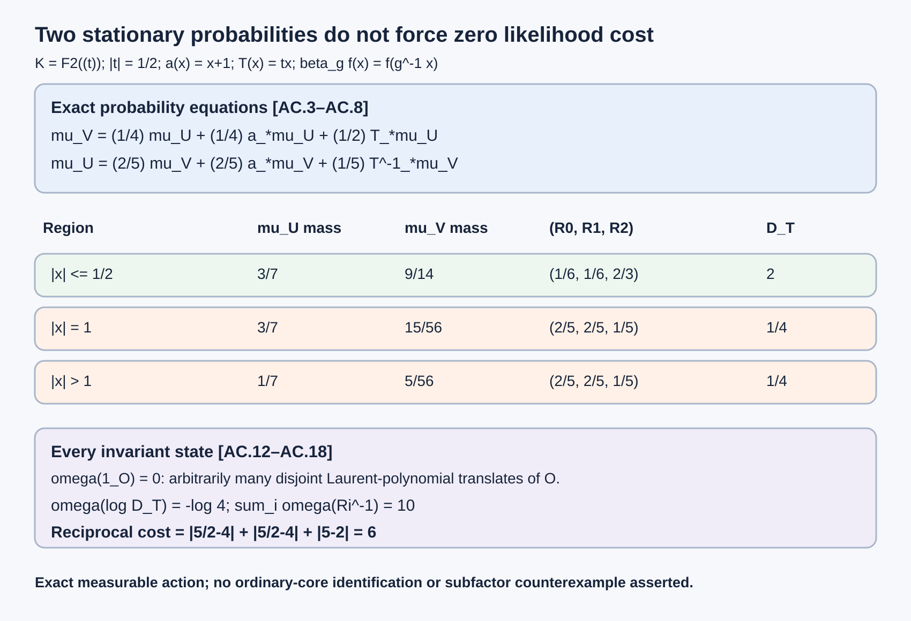

Figure AC. The three regions partition the local field. The probability masses, likelihoods and derivative values are exact AC.3–AC.18; the boxes encode regions rather than metric lengths. Every invariant state gives zero to the unit ball, so its likelihood values are the outer row and its reciprocal cost is exactly six. [Reproducible diagram source](figures/stationary-affine-cost-v17.py).

## Forty-six checks with complete solutions

**Exercise GTB.1 — padding and physical error.** Suppose actual whole-stage cells have \(d=9\), \(\tau(p_1)=2/3\), \(\tau(p_2)=1/3-1/10000\), residual trace \(1/10000\), and old target error below \(1/20\) for targets of norm at most two. Refine both cells by GTB.3 using \(h=3\). Determine the extra discarded mass and prove a strict \(1/10\) target-error bound. Does this make the supports tail-factor projections?

**Solution.** There are \(L=9^3=729\) equal-trace full-corner projections in each relevant tail factor. Their sum is exactly one there, so each realized cell is covered exactly and no extra mass is discarded. Thus GTB.11 gives
\(\|y-c_y\|_2<1/20+2\sqrt{1/10000}=7/100<1/10\).
The original residual remains \(1/10000\). The projections are still whole-stage supports, with the original compressed indices. No tail membership or exact finite origin for that residual has been produced. The traces describe a conditional test of already realized cells, not an existence claim for an arbitrary proposed numerical family.

**Exercise GTB.2 — exact versus controlled retention.** In (GTB.20), can a length-three actual corner tunnel retain all of \(G\) exactly? At that length, give the errors from (GTB.23)–(GTB.24), and prove that every one of the 36 displayed physical matrix-unit targets is approximated strictly within \(1/10\).

**Solution.** Its smaller full stage is \(\operatorname{Mat}_{27}\), for any actual tunnel by finite marked uniqueness. A unital \(\operatorname{Mat}_2\) in it would split 27 into two equal integer ranks, so exact retention is impossible. For \(j=3\), choose \(\tau_F(z)=26/27\), split it into 13 projections of trace \(2/27\), and complete the 26 old corner units with the residual of trace \(1/27\). The two-leg target \(E_{ab}^{(b)}\otimes1\) has error \(1/\sqrt{54}\) in \(D\). Each complete target \(E_{uv}^{(a)}\otimes E_{ab}^{(b)}\) has error \(1/\sqrt{162}<1/10\), since \(162>100\). The specified unitary rotates the tunnel, while these 36 targets are kept fixed. Approximation does not create an exact unital \(M_2\) inside \(M_{27}\).

**Exercise V8.1 — one density, a finite mesh.** Suppose \(L=7\) and \(n=700\). Prove the mesh bound and, if \(J_h\le1/1000\), compute the guaranteed normalized joint defect.

**Solution.** The support trace is at most seven, hence \(\eta\le1/100\). Equation (V8.12) gives \((1/1000+2/100)/(1-1/100)=7/330\). The estimate is for the supplied density; it does not assert that amenability supplied the displayed \(J_h\). A larger \(n\) reduces this same finite density's mesh error.

**Exercise V8.2 — count the actual right coordinates.** Explain the factors \(n\) and \(n^2\), and count the cuts for scalar eigenvalues \(1/4,3/4\), with \(n=4,\theta=1/2\).

**Solution.** The vectors \(\sqrt n\widehat{E_{ab}}\) form an orthonormal basis of \(L^2(M_n,\operatorname{tr}_n)\). A right minimal projection keeps one value of \(b\), leaving \(n\) left coordinates. Its left trace is \(n\operatorname{tr}_n\); summing the \(n\) right projections gives \(n^2\operatorname{tr}_n\). The four thresholds are \(1/8,3/8,5/8,7/8\). Their cut ranks on this two-eigenvalue coordinate example are \(2,1,1,0\), so their average is the original diagonal density. This is a coordinate example, not an asserted ordinary Jones core.

**Exercise V8.3 — a later coefficient is charged.** Take \(d=4\), \(\delta=1/10000\) and \(\chi\le1/10^8\). If each old coefficient defect is below \(1/1000\), bound the corresponding actual final coefficient defect after two deletions.

**Solution.** Equation (V8.30) adds at most \(4\sqrt{4\delta^2+\chi d}=\sqrt2/1250\). Thus the final defect is below \(1/1000+\sqrt2/1250<11/5000\), since \(\sqrt2<3/2\). This test uses a supplied physical-state bound and does not equate old and new coefficients.

**Exercise V9.1 — both traces and endpoint rigidity.** In the actual diagonal inclusion(V9.7), let \(t=1/3\). Compute its index, both projection weights and ambient density. Why is its actual original joint cost zero in every ordinary core? Does unequal physical and dual trace imply positive joint defect?

**Solution.** Here \(s=2/3\), \(d=3+3/2=9/2\), and \(k_C=2c+(1/2)(1-c)\). The inherited weights of \(c,1-c\) are \(1/3,2/3\); their normalized dual weights are \(2/3,1/3\). The actual cup density has those same two eigenvalues, and82.5 gives \(E_C(f)=c\). Equation(V9.3) forces \(f=c\), so \(w=\ell\) and the original cost is the zero operator. Unequal trace weights therefore do not give a positive joint defect in this example. No general full-partition or universal-amenability conclusion follows from this calculation alone.

**Exercise V9.2 — a singular witness and its physical obstruction.** For the abelian model with \(L=4\), compute the mass, twisted residual and absolute ratio test. Explain the cluster state's original joint norm. Test a matching physical extension(V9.15) with \(r=1/2,R_*=2\).

**Solution.** The mass is \(7/3\), the twisted residual is \(4/21\), and the fixed absolute ratio test is \(2/7\). As \(L\to\infty\), the residual tends to zero and the fixed test tends to \(1/3\). Thus the singular cluster has \(\alpha P_0=\ell\alpha\) and original joint norm \(1/3\). These are different statements from zero original joint norm. The stipulated physical extension would require \(\tau(zf)=1/9\le\tau(c_-f)=1/18\), which is false. The abelian example therefore refutes an abelian-only deduction, while this precise physical realization is excluded by the inherited trace.

**Exercise V10.1 — the physical target after a right move.** In (V10.7), take \(m=3\). Find the column count, support trace and density trace. What are the fixed \(s\)-defects before and after the flip? Why does the flip fail to define a map on densities?

**Solution.** Here \(k_m=8\), so there are64 columns, \(\operatorname{Tr}(q_m)=64\), and \(\operatorname{Tr}(h_m)=1\). The fixed defect is zero before the flip and exactly two afterwards, by orthogonality of the two trace64 support projections. Both coisometric rows \(a_m\) and \(s a_m\) have the same initial \(h_m\), but the same right flip sends them to the two orthogonal-support densities, at distance two. Thus the actual row is necessary data. Exact row sums and joint balance do not alone preserve the earlier physical target.

**Exercise V10.2 — one fixed bounded test excludes a stronger approximation class.** Let \(\varphi\) be the cluster state of (V10.12), and let \(\psi\) be the state of any right-sum-one row. Evaluate both at \(T=\rho_D(p)\) and give a lower bound for \(\|\varphi-\psi\|\). Does this refute the existence of a jointly balanced compatible state?

**Solution.** Equations(V10.13)–(V10.14) give values1 and\(1/2\). Since both states have value1 at the identity and \(\|2T-1\|=1\), their difference on \(2T-1\) is1. Hence \(\|\varphi-\psi\|\ge1\), and the fixed \(T\) also excludes weak-star approximation by such rows. This particular \(\varphi\) is itself joint-balanced because both actual core centers are scalar. A different balanced state is supplied by (V10.7)–(V10.8); suitable-state existence is not refuted.

**Exercise IF.1 — the exact return defect.** In the index-eighteen model, condition a compatible original hypertrace on \(c_+\), and then on \(c_-\). Compute each original compatibility defect and each corner index. Can recombining these conditional states decrease the original cost?

**Solution.** The physical traces are \(1/3\) and \(2/3\). IF.8 gives defects \(4/3\) and \(2/3\), respectively. IF.32 gives index four for each compressed pair, while the original index is eighteen. Each conditional state agrees with the old state on \(A\), and hence has exactly its original cost. IF.10 says the original trace-weighted recombination is the old state itself. These maps do not produce a strict cost decrease.

**Exercise IF.2 — interior variance and zero cost.** Use IF.28 to compute the conditional variance in each physical block and its full trace. Explain why these positive numbers do not contradict zero original joint cost.

**Solution.** The variances are \((1/2-1/\sqrt7)(1/2+1/\sqrt7)=3/28\) and \((1/2-5/(4\sqrt7))(1/2+5/(4\sqrt7))=3/112\). Their trace is \((1/3)(3/28)+(2/3)(3/112)=3/56\). The actual core has \(R=M,S=N\), so its centers are scalar and the original joint coordinate is zero. Cup conditional variance is a different inherited-trace quantity and need not vanish.

**Exercise BC3.1 — the original variance test.** Suppose \(\kappa\ne1\). Set \(t=\kappa-1\). Calculate \(P_0t\) and \(P_\kappa t\). Why does a physically fixed operator-balancing UCP map exclude the original cup state as a pullback?

**Solution.** Equation(BC3.3) gives \(P_0t=0\), while \(P_\kappa t=P_0((\kappa-1)^2)=q_\kappa\). Theorem BC3.1 forces \(\Phi(\iota(q_\kappa))=0\). The cup state has value \(\tau((\kappa-1)^2)>0\), by faithfulness of the original trace. Therefore it cannot factor through this map. This excludes the stronger operator-balancing requirement, not the weaker state identity.

**Exercise BC3.2 — balanced cyclic GNS.** Does applying unrestricted amenability to the normal faithful GNS representation of \(\psi_e\) force its returned hypertrace to have the cyclic vector's joint center marginal?

**Solution.** Proposition BC3.3 proves a normal isomorphism of the entire expected pair and a bijection of its compatible physical hypertraces. The vector state is the already existing balanced cup state. Amenability supplies a compatible central state in the represented pair but places no condition equating it with that vector state on the joint center. Its pullback therefore satisfies exactly the original hypertrace requirements; joint balance still needs its own proof.

**Exercise JB.1.** In (JB.1), suppose \(d=6\), \(\|w^{-1}\|\le6\), \(t_0=6\), \(\|b_i\|\le\sqrt6\), \(\sigma(\mathfrak a)\le\eta\), and \(r_i(\sigma)\le\eta/(6\sqrt6)\) for every basis element. Bound the full original joint discrepancy. Does checking each commutator against one fixed operator suffice?

**Solution.** Formula (JB.3) gives
\(\mathcal E_\sigma\le(6/6)\,6\sqrt6\,\eta/(6\sqrt6)=\eta\).
Theorem JB.1 therefore gives
\(\|\alpha_\sigma-\alpha_\sigma P_0\|\le2\eta\).
Each \(r_i\) is a norm on the whole dual of the original \(B\), taking the supremum over every contraction \(T\in B\). One evaluation against a specified operator cannot give the asserted bound.

**Exercise JB.2.** Let \(c\in Z(A)\) be a cost spectral projection with \(\psi(c)=3/4\) and \(c\le1_{[0,\varepsilon]}(\mathfrak a)\). Which conditions of (JB.2) survive exactly, what is its exact distance from \(\psi\), and what physical error bound follows? Is the bound enough to produce arbitrarily small original joint discrepancy?

**Solution.** AS.3 gives exact \(E_A\)-compatibility, \(N\)-centrality and \(\psi_c|_M=\tau_M\), with ideal annihilation retained when present. Formula (JB.10) gives exact state distance \(1/2\), and the conjugation error at any physical unitary is at most \(1\). Its cost is at most \(\varepsilon\), but (JB.11) still includes the finite basis budget. These fixed bounds do not make that budget tend to zero. A vanishing budget must be proved for the actual selected states, or the states must be obtained by another construction. The example introduces no smooth GNS representation or full finite partition.

**Exercise BC4.1.** Take \(m=2\) in the correlated row construction. Compute \(k_m\), the original and repaired row lengths, the two canonical support traces, and the fixed \(u\)-defect before and after the two-term repair. Is the support trace a physical support probability?

**Solution.** Here \(k_m=4\). The lengths are \(4k_m^2=64\) and \(8k_m^2=128\). The original support has canonical trace \(2k_m^2=32\), and the repaired \(P_m\) has canonical trace \(4k_m^2=64\). Their density coefficients are \(1/32\) and \(1/64\), respectively, so each density has canonical trace one. The fixed physical \(u\)-defect is exactly two before repair and zero afterward. Both states still have the exact physical probability trace on \(M\). The support traces are semifinite canonical dimensions, not probabilities or the masses of physical projections in \(M\).

**Exercise BC4.2.** Why does every fixed finite left-\(N\) averaging list fail on the correlated sequence, while \(v_m=X_0X_{m+1}\) succeeds? Explain the order of the target choice and the separate generating-tunnel conclusion.

**Solution.** Each fixed averaging unitary has vanishing defect on \(h_m\), so its finite average differs from \(h_m\) in \(L^1\) by a quantity tending to zero. The original \(u\)-defect is two; the reverse triangle inequality in BC4.3 leaves its limiting value equal to two. The repairing unitary depends on \(m\), swaps \(p_m,1-p_m\), and produces \(P_m/(4k_m^2)\), which commutes with all of \(K_m\). Given the original finite target list, choose \(m\) so that its distances to \(K_m\) are below \(\eta/2\), then construct the finite row and its two-term average. BC4.22 gives the required errors. Corollary BC4.5 separately applies the complete factorial-core providers: every prescribed prefix admits a full support-one local square and a generating continuation. It does not identify \(P_m\) with a physical corner chain.

**Exercise LF.1.** After a prescribed prefix, let two selected physical supports have traces \(7/25\) and \(9/125\), with their individual actual continuations already given. Compute the residual trace, select a finite depth that certifies it, and explain which operators stay fixed during its placement.

**Solution.** The residual trace is
\(1-7/25-9/125=81/125\).
The length-three smaller relative commutant has all projection traces \(h/125\), so a projection of total rank \(81\) gives an exact certificate. Conjugate its continuation by a unitary in the physical \(N_k\) that sends this certificate to the actual residual \(f\). The unitary fixes \(A_k=N_k'\cap M\) pointwise, retains all earlier factor algebras and cups, and does not act on the old selected continuations. Replacing just \(fA_k,fB_k,\mathbb Cf\) by the three full rows in LF.50 contains the old square and preserves the physical targets. Its support partition is exactly one; no residual mass is discarded.

**Exercise LF.2.** In LF.54–LF.56, suppose the central projection has trace \(1/4\). What strict bound follows for the fixed-family limiting packing cost? Does that prevent a full finite partition or allow a generating ordinary tunnel?

**Solution.** LF.55 gives
\(\Delta_\infty>\tau(q)/2=1/8\).
It prevents arbitrarily cheap promotion of these two fixed canonical rank classes. Their physical residual still has a 5-adic trace and therefore has its own exact finite certificate; LF.15 completes the full partition with the old supports unchanged. Generation is a different question. LF.41 gives a nonscalar core center, and LF.17 transports it to every ordinary tunnel, so this inclusion has no generating ordinary tunnel. Plain amenability therefore does not imply generation; the ergodic-core hypothesis in the strong-amenability statement remains necessary.

**Exercise CF.1.** In the actual LF inclusion retain the prefix through \(N_1\) and use the 625 unitaries CF.5. If a full finite square has errors below \(h_+/10\), can its candidates be moved by less than \(h_+/10\) into one common relative-commutant stage of another continuation of this prefix?

**Solution.** Such movement would give common-stage target errors below \(h_+/5\), by the triangle inequality and best approximation. CF.1 forces at least one error to be at least \(\sqrt2 h_+/5>h_+/5\). Therefore that movement is impossible. The complete full square still exists by LF.15; its individual continuations are essential here.

**Exercise CF.2.** Prove CF.6 for a self-adjoint element of \(\operatorname{Mat}_n\), using its \(n^2\) shift-and-clock unitaries and normalized matrix trace. Explain why the test set in CF.5 can be chosen before any continuation.

**Solution.** For each unitary \(u\),
\(\|ux-xu\|_2^2=2\tau(x^2)-2\operatorname{Re}\tau(xu^*xu)\).
The shift-and-clock average sends \(x\) to \(\tau(x)1\); hence its average squared commutator norm is
\(2\tau(x^2)-2|\tau(x)|^2\).
The fixed factor \(F\) contains the prescribed \(A_1\). Every continuation preserves the expectation \(z_1\) by CF.3, so every \(E_F(z_{\mathcal T})\) has the same positive variance lower bound CF.4. The same unitaries of \(F\) therefore work for all continuations.

**Exercise RF.1.** Explain why proving only that the particular signed class \(1-m[g_n]\) never promotes would not prove TheoremRF.2. Where does the proof exclude every other finite representative and every finite subdivision?

**Solution.** A different rank class can have the same ambient trace, as the critical path and lamplighter examples demonstrate. TheoremRF.2 instead writes the trace of every alleged residual cell as its own bounded-rank polynomial. Transcendence turns the equality of the total physical traces into an integer polynomial identity. Its endpoint value is negative on the required remainder and nonnegative on every candidate summand. This rules out all alternative finite ranks and all finite sums, without fixing the alleged cells' classes.

**Exercise RF.2.** For the two-copy length-two family, compute the residual trace interval when \(p\in(1/2,2/3)\), and the new length-four physical trace.

**Solution.** \(1-2p^2\in(1/9,1/2)\). The old residual has no finite whole-stage partition for transcendental \(p\). The length-four cuts remove physical trace \(p^4\), and the new residual has trace \(1-2p^2+p^4=(1-p^2)^2\). Its certificate has ranks \((0,0,4,4,1)\) in capacities \((1,4,6,4,1)\), so every coordinate is valid. The corresponding dual values are obtained by swapping \(p,q\), not by asserting equality of the two traces.

**Exercise RF.3.** Does TheoremRF.2 refute the unrestricted finite-dimensional approximation theorem? Does TheoremRF.4 justify general factoriality or generation from amenability?

**Solution.** The unrestricted theorem permits selection of a new full finite family. TheoremRF.2 refutes the stronger requirement that an arbitrary selected family stay unchanged while finitely many new whole cells partition only its residual. TheoremRF.4 constructs a valid new family by cutting old supports, and accounts for its physical error. Its use of a factorial smaller core is justified by the actual weighted-spin generating tunnel. The all-smooth amenable lamplighter inclusion has nonfactor cores, so the same premise is not available in general. No plain-amenability generating assertion is derived.

**Exercise RF.4.** Why do \(U_i,v\in N_k\) retain the original cups but not necessarily every element of the physical \(N_k\)?

**Solution.** Earlier cups lie in \(A_k=N_k'\cap M\), which commutes with every unitary of \(N_k\). Earlier factor algebras contain \(N_k\), so inner conjugation by such a unitary preserves each as a set. Elements of \(N_k\) itself may be conjugated nontrivially. The targets in RF.12 are the original physical operators and are not conjugated; the estimate includes the changed finite algebras explicitly.

**Exercise TR.1.** Let the original compatible state \(\psi\) be singular on the represented centers and annihilate the entire original norm-closed Jones ideal. In TR12.5, prove that the physical map \(m\mapsto qm\) is a faithful normal *-homomorphism, while the returned canonical cup has value zero. Does the original canonical normalization \(\operatorname{Tr}(e)=1\) change?

**Solution.** The support projection \(q\in A^{**}\) commutes with physical \(M\), so \(m\mapsto qm\) preserves products, adjoints and the target unit \(q\). Its squared faithful-state norm is \(\tau(m^*m)\), proving faithfulness. For an increasing positive net, the difference between its image limit and the supremum of the image net has zero faithful \(\phi\)-value by normality of the physical \(\tau\); it is therefore zero. This proves normality on the physical factor without assuming original-center normality. For \(x\) in the Jones ideal, \(\psi(x^*x)=\psi(xx^*)=0\). Faithfulness on the support corner implies \(xq=qx=0\), so \(\Lambda_\psi(x)=0\), in particular \(\Lambda_\psi(e)=0\). The original canonical trace still has \(\operatorname{Tr}(e)=1\). The finite new trace is the original state after UCP return, not an identification with that canonical trace.

**Exercise TR.2.** For a true original compatible cost minimizer \(\psi_0\), prove that the finite representation TR12.9 has no compatible state with transported original cost smaller than \(m=\psi_0(\mathfrak a)\). Identify a compatible state attaining \(m\), and explain how the same conclusion retains the full Jones-ideal face.

**Solution.** Every compatible new state \(\eta\) pulls back by the actual \(\Lambda_{\psi_0}\) to a compatible original state. Its cost \(\eta(\Lambda_{\psi_0}(\mathfrak a))\) is consequently at least \(m\). The faithful finite trace \(\tau_{\psi_0}\) is compatible, has the original physical marginal, and satisfies \(\tau_{\psi_0}\Lambda_{\psi_0}=\psi_0\); its cost is exactly \(m\). If the original minimizer kills the Jones ideal, TR12.5 gives \(\Lambda_{\psi_0}(J_e)=0\), so every pullback remains in that entire face and the same lower bound and attainment apply. This is a property of the exact constructed return; it does not decide whether the true original minimum is zero.

**Exercise WM.1 — both finite traces, with an explicit rational parameter.**
For the algebraic member \(\lambda=3/2\), compute the physical and dual weights of \(C\), their density, and the scalar coefficient in WM.35. Does the finite calculation prove positive harmonic means at that parameter?

**Solution.** One has \(S_+=11/2\), \(S_-=14/3\), \(d=77/3\). The four ordinary labels have
\(w_i^+=2/11\), \(w_i^-=3/14\); the toggle label has
\(w_1^+=3/11\), \(w_1^-=1/7\). Each list sums to one, and each product equals \(3/77=1/d\). Thus \(c_0=33/28\), \(c_1=11/21\), with physical mean
\[
4\frac2{11}\frac{33}{28}
+\frac3{11}\frac{11}{21}=1,\qquad
d(c_0-c_1)w_1^+=\frac{55}{12}.
\]
The finite formula would give the bound \((55/12)(h_++h_-)\) if those means were positive. Their positivity at \(\lambda=3/2\) is not proved by this calculation. The strict example in WM.35 uses the separately proved exact parameter WM.22.

**Exercise WM.2 — a center lift is not a change of physical measure.**
Show that \(\vartheta_i\) is faithful and determine its measure on a central projection \(v\in V\). Derive a quantitative obstruction to the constant likelihood \(r_1=w_1^+\).

**Solution.** If \(vp_i=0\), then \(v r_i=E_V(vp_i)=0\). Since \(r_i\ge1/d\), \(v=0\). The full corner theorem and the onto map \(\sigma_i\) then give the normal center isomorphism. Its normalized corner trace satisfies
\[
\tau_U(\vartheta_i(v))
=\frac{\tau(vp_i)}{w_i^+}
=\frac{\tau_V(vr_i)}{w_i^+}.
\]
This need not equal \(\tau_V(v)\). By WM.24,
\(\tau_V((r_1-w_1^+)z)=-w_1^+(h_++h_-)\).
Since \(\|z\|\le1\), physical trace duality yields
\(\|r_1-w_1^+\|_1\ge w_1^+(h_++h_-)>w_1^+b>0\).
Thus the obstruction is an actual inherited-trace pairing.

**Exercise WM.3 — the correct module projection.**
Compute the normalized dual mass of \(p_i\) from a finite Morita frame. Explain why using the range of left multiplication by \(p_i\) changes the calculation.

**Solution.** Right multiplication by \(p_i\) has range \(L^2(R)p_i\). In WM.30b this range has right-\(S\) support projections \(\sigma_i^{-1}(f_l^{(i)})\); their normalized center trace sums to \(\vartheta_i(r_i^{-1})\). Its scalar dimension is
\[
\tau_U(\vartheta_i(r_i^{-1}))
=w_i^{-1}\tau_V(r_i r_i^{-1})=w_i^{-1}.
\]
Dividing by the total matrix dimension \(d\) gives
\(\rho_0(p_i)=1/(d w_i^+)=w_i^-\).
Left multiplication by \(p_i\), in contrast, has range \(p_iL^2(R)\). Its unnormalized matrix trace is \(d\tau(p_i)=dw_i^+\), because the common basis gives \(\sum_j a_ja_j^*=d1\). Its normalized mass is \(w_i^+\), the physical trace, rather than \(w_i^-\). This precisely diagnoses the mistaken normalization avoided by WM.30–WM.30c.

**Exercise WM.4 — exactly what nonzero cost rules out.**
Using only WM.32–WM.36, prove \(w\ne\ell\). Explain what this says about a faithful normal joint restriction and why it does not refute the original possibly singular state-existence target.

**Solution.** The expectation of \(w-\ell\) onto \(V\) equals the nonzero function
\((c_0-c_1)(r_1-w_1^+)\), by WM.29 and \(c_0>c_1\). Therefore \(w-\ell\ne0\), and
\(dQ(|w-\ell|)\) is a nonzero positive function with the strict trace bound WM.35. A faithful normal \(\alpha\) has
\(\alpha(|w-\ell|)>0\), so its compatible state cannot have zero cost. A nonfaithful normal or singular state can vanish on a nonzero positive function; this calculation supplies no uniform positive lower bound over those states. The unresolved task is to construct or exclude an **actual compatible** state satisfying \(\alpha=\alpha P_0\), which is equivalent to zero discrepancy in the original identities. An arbitrary state chosen on an abelian surrogate would not establish that compatibility.

**Exercise C13.1 — recover a physical branch.**
Why do the countably many central lamp-sign tests in C13.7 recover the actual \(p_i\), rather than only an abstract event? Check the toggle-versus-translation case.

**Solution.** On \(p_i\), the first-label corner identity C13.4 makes every equality test hold. On another branch \(p_j\), the same tests assert equality of two transforms of the actual suffix final configuration. If a toggle transform equals translation by \(e_k\), the difference equation on the line through the origin is
\[
\eta(ne_k)+\eta((n-1)e_k)=1_{\{n=0\}}\pmod2.
\]
The actual suffix walk has nonzero drift transverse to this line, so its final configuration has finite support there. Summing over an interval containing that support cancels the left side, while the right side is one. Thus this equality event has trace zero. Pure translations are separated by finite support on their difference lines and infinitely many lit sites. The five transforms are therefore pairwise different almost surely. The faithful actual suffix trace gives \(f_i p_j=0\) for \(j\ne i\) and \(f_i p_i=p_i\); since the physical \(p_j\) sum to one, \(f_i=p_i\). The faithful full-corner lift on \(A'\cap B\) retains these same physical projections.

**Exercise C13.2 — prescribed singular center and physical return.**
Let \(\omega\) be an \(H\)-invariant, possibly singular state on the actual coefficient center \(Z(W)\). Which normality assertions are needed to construct its original compatible state? Does the construction automatically annihilate the Jones ideal?

**Solution.** C13.12 constructs a UCP physical projection \(\Gamma_\omega:W\to P\) which fixes \(P\), is equivariant, and has \(\Gamma_\omega(z)=\omega(z)1\). The finite complementary state extensions and the point-ultraweak cluster need not be normal. The physical factor embeddings and finite supported matrix stages remain the actual faithful normal ones of WM.15. Entrywise extension and the original finite physical corner give \(F_\omega:B\to M\), with \(F_\omega|_M=\mathrm{id}\) and \(E_NF_\omega=F_\omega E_A\). Its multiplicative domain gives \(M\)-bimodularity, so \(\psi_\omega=\tau F_\omega\) is \(M\)-central, has physical marginal \(\tau\), and is \(E_A\)-compatible. No assertion identifies its singular center restriction with either original canonical trace. The later pure-singularity result E14.12 supplies the precise hypotheses of the existing SC.2–SC.3. E14.12a therefore proves that this actual return kills the entire original Jones ideal.

**Exercise C13.3 — the two likelihood endpoints.**
For the algebraic parameter \(\lambda=3/2\), compute the endpoints in C13.22, the coefficient \(K\), and the universal bound in C13.23. What does this verify about the separately fixed parameter WM.22?

**Solution.** The displayed formulas give
\[
S_+=\frac{11}{2},\quad S_-=\frac{14}{3},\quad d=\frac{77}{3},\quad
w_1=\frac3{11},\quad w_1^-=\frac17,\quad
K=\frac{605}{36}.
\]
Thus \(0\le\epsilon_\omega\le10/77\), and
\[
\frac{22}{3}\epsilon_\omega\le C_\omega
\le\sqrt{\frac{46585}{108}\epsilon_\omega}
\le\frac{55}{3\sqrt6}.
\]
The last square is \(3025/54=dK(10/77)\). These are exact algebraic checks of the bound, not a computation of the maximizing invariant state. They neither replace the fixed physical parameter WM.22 nor establish harmonic positivity at the sample parameter.

**Exercise C13.4 — maximum moment and the unresolved zero state.**
Let \(m\) be the maximum of \(\omega(R_1)\) over invariant states on the actual \(Z(W)\). Prove the exact dichotomy supplied by C13.23–C13.24 without deciding which branch holds.

**Solution.** The invariant-state set is nonempty by the concrete Følner averages, weak-star compact because invariance is a family of closed bounded linear equations, and its moment is weak-star continuous. Hence \(m\) is attained and \(m\le w_1\). If \(m=w_1\), the attaining state has \(h_\omega=K(w_1-\omega(R_1))=0\); C13.23 forces its original cost to vanish. The physical return C13.12–C13.13 then constructs the actual compatible state. If \(m<w_1\), every original compatible state supplies an invariant state and obeys
\[
\psi(\mathfrak a)\ge \frac{2}{w_1}(w_1-m)>0.
\]
This would be an actual counterexample to the zero-cost assertion. The proved formulas do not determine \(m\). Positive physical normal operator cost alone cannot decide the dichotomy, because the original compatible states may be singular.

**Exercise E14.1 — actual central noise.**
Verify the three four-label words of E14.1 and explain why conditioning on their positions does not replace the physical endpoint distribution by an auxiliary walk.

**Solution.** With \(s_0=1\), \(s_1=az\), \(a^2=1\) and central \(z\), the alternating products of \((0,0,0,0)\), \((1,0,1,0)\), \((0,1,0,1)\) are respectively \(1,(az)^2=z^2,(az)^{-2}=z^{-2}\). Their original word weights are \(d^{-2},\lambda^2d^{-2},\lambda^{-2}d^{-2}\). Independent four-label blocks can be conditioned on the positions having one of these three words and on every other complete block. The remaining selected words still have their conditional original weights. Their endpoints are central, so their factors can be pulled through every unselected endpoint. Mixing the resulting shifted binomial laws returns the original endpoint distribution. Thus E14.4 controls an actual endpoint law, with its central coordinate and physical traces retained.

**Exercise E14.2 — fair cylinders and a singular spectral limit.**
Prove that a state with the finite lamp probabilities E14.10 has no nonzero normal positive functional below it on the actual center. Why does this not compute its original cost?

**Solution.** The actual line has only finitely many lit sites almost surely under the faithful normal core measure. Therefore its normal projections \(F_L\), requiring all sites outside \([-L,L]\) to be unlit, increase strongly to one. For each \(m\), \(F_L\) is dominated by the event that any \(m\) chosen outside sites are unlit. Its state value is at most \(2^{-m}\), hence \(\omega(F_L)=0\). If a normal positive \(\eta\le\omega\) existed, normal monotone continuity would give \(\eta(1)=\lim_L\eta(F_L)=0\). It is therefore zero. The likelihoods \(R_i\) are elements of the full actual von Neumann center, obtained through normal spectral limits. A singular state need not preserve those limits; fair finite lamp probabilities do not determine \(\omega(R_i)\) or the reciprocal cost. For the actual compatible returned states, E14.12a applies the existing complete SC.2–SC.3 and annihilates the entire Jones ideal. Bare singularity without the physical state and representation hypotheses would not suffice.

**Exercise E14.3 — the trace-character sign.**
Derive the logarithmic identity E14.15 from the two original center measures and the actual involution. Compare the two Jensen endpoints.

**Solution.** The original measure identities give
\[
D_1=\frac{w_0R_1}{w_1R_0}=\frac{R_1}{\lambda R_0}.
\]
The proved whole-center identity \(\beta_{z^2}=\mathrm{id}\) implies \(\beta_1^2=\mathrm{id}\) on this center. The Radon–Nikodym chain identity is \(D_1\beta_1(D_1)=1\). Invariance and bounded logarithms give \(2\omega(\log D_1)=0\), hence
\(\omega(\log R_1)-\omega(\log R_0)=\log\lambda\).
At the lower Jensen endpoint all reciprocal Jensen remainders vanish, and the other four means equal \(\lambda/(4\lambda+1)\), whereas the toggle mean is \(1/(4\lambda+1)\). Their logarithmic ratio is \(-\log\lambda\), which is impossible. At the upper endpoint the means are the physical \(w_i\), and the ratio is \(\log(w_1/w_0)=\log\lambda\), consistent with the identity. This comparison excludes the lower root, not the desired upper root.

**Exercise E14.4 — retain the stronger actual lower bound.**
Use the proved \(R_i\ge1/d\) to strengthen the separated interval in E14.18 without changing the inclusion.

**Solution.** Every likelihood and mean is at least \(\widehat m=1/d\). For \(t\in[w_-,w_+]\), \(t\ge\widehat m\) and \(1-t\ge4\widehat m\), so
\[
\left|\frac{d}{dt}\log\frac{4t}{1-t}\right|
\le\frac2{\widehat m},\qquad
B(t)\le\frac{d(t-w_-)}{4\widehat m^2}.
\]
The same reciprocal-variance and logarithm argument of E14.16–E14.17 uses only these bounds. If \(u=t-w_-\le\widehat m^4(\log\lambda)^2/(16d)\), its left side is at least \(15\log\lambda/8\), while its right side is at most \(9\log\lambda/64\), a contradiction. Thus
\[
\omega(R_1)>
\frac1{4\lambda+1}+\frac{(\log\lambda)^2}{16d^5}.
\]
All constants belong to the one fixed actual model. This positive separation next to the lower root does not bound the maximum strictly below the upper root and supplies no zero-cost state.

**Exercise MR.1 — recover the normalized polar cost.** Let \(p\in N\setminus\{0\}\), \(t=\tau(p)\), and suppose all \(25\) matrix units obey MR.15. Explain why the five corrected diagonal projections have normalized trace \(1/5\), why the polar errors vanish with \(\delta\) even when \(t\) is arbitrarily small, and why the Weyl target error is less than \(c/4\) at \(\delta=c/400\).

**Solution.** Since \(q_i\in N'\cap M\) and \(p\in N\), the products \(d_i=pq_i\) are exact orthogonal projections with sum \(p\). Bimodularity and \(E_N(q_i)=1/5\) give
\[
 \tau(d_i)=\tau(pE_N(q_i))=t/5,\qquad
 \tau_p(d_i)=1/5.
 \tag{MRE.1}
\]
Thus equal-trace comparison extends the polar partial isometry of \(X_i=pe_{i0}p\) to \(V_i:d_0\to d_i\). Its deficit is
\[
 a_i=\frac12\|[p,e_{i0}]\|_2^2<\delta^2t/2,
 \qquad
 \|V_i-X_i\|_2\leq\sqrt{a_i}<\delta\sqrt{t/2}.
 \tag{MRE.2}
\]
The exact matrix units \(w_{ij}=V_iV_j^*\) satisfy
\[
 \|w_{ij}-pe_{ij}p\|_2
 \leq\sqrt{a_i}+2\sqrt{a_j}
 <3\delta\sqrt{t/2}.
 \tag{MRE.3}
\]
After division by \(\sqrt t\), the cost is bounded by \(3\delta/\sqrt2\), with no factor \(t^{-1/2}\) left. Adding the normalized local approximation cost \(\delta\) gives a distance less than \(4\delta\) for each corrected matrix unit.

For the five-term shift \(S\), its expectation \(A=E_G(S)\) is a contraction and \(\|S-A\|_{2,p}<20\delta\). The clock \(D\) belongs to \(G\) exactly. For \(0\leq a,b<5\),
\[
 \operatorname{dist}_{2,p}(S^aD^b,G)
 \leq\|S^a-A^a\|_{2,p}
 \leq a\|S-A\|_{2,p}<80\delta=c/5<c/4.
 \tag{MRE.4}
\]
There is no assertion that a uniform absolute \(M\)-error stays small after normalizing a tiny corner. The actual local input already contains the factor \(\sqrt t\). A weighted family estimate alone would require a separate weighted-average selection argument before this calculation.

**Exercise MR.2 — retain all finite continuation quantifiers and the physical budget.** Let \(Y=\{E_G(u):u\in\mathcal W_p\}\), and complete a near-cover containing \(p,G\), with \(\tau(f)<\varepsilon^2/16\), \(\varepsilon=c\sqrt t\), and \(\varepsilon_0=\varepsilon/8\). Show that no finite number of freely chosen ordinary corner chains on its good supports can meet GTB.27. Explain why an exact full whole-cell completion is nevertheless possible here.

**Solution.** Each proposed finite ordinary chain on \(pNp\subset pMp\) extends to an infinite ordinary chain. Its core has the central witness of MR.7, transported by the compatible normal core map fixing \(pA_0\); this holds at every length. The Weyl average forces some \(u\in\mathcal W_p\) to have normalized distance at least \(c\) from its finite relative commutant. Since \(\|u-E_G(u)\|_{2,p}<c/4\), the corresponding fixed \(y\in Y\) has normalized distance greater than \(3c/4\). Converting to the inherited physical norm gives
\[
 \delta_p(y)\geq
 \|y-E_{\mathcal L}(y)\|_2>
 (3c/4)\sqrt t=3\varepsilon/4 .
 \tag{MRE.5}
\]
The target index may depend on the proposed main-cell chain. The maximum over the already fixed finite \(Y\) therefore remains valid for any choices of the other chains, their finite lengths and their number. Their nonnegative squared errors cannot reduce the main-cell term:
\[
 \varepsilon_0+\max_{y\in Y}
 \Bigl(\sum_i\delta_i(y)^2\Bigr)^{1/2}
 >\varepsilon/8+3\varepsilon/4=7\varepsilon/8>\varepsilon/2.
 \tag{MRE.6}
\]
The near-cover itself has zero old error because \(Y\subset G\subset P_0\). It satisfies every unconditional GTB.25 hypothesis; it fails the proposed universal existence of the additional approximate input.

For this actual inclusion, the finite scalar trace fibers are exactly \(\mathbb Z[1/5]\cap[0,1]\) after every prescribed prefix. The selected supports have finite origins, so their residual has an exact finite certificate in that fiber. Comparison in the physical retained factor moves only that new certificate onto the original \(f\). The old blocks and targets are untouched, and MR.31–MR.32 give a full finite whole-cell square with \(E_{P_*}(y)=y\). This is a family of individual whole-inclusion continuations; it does not ask each old good cell to become a unital corner-tunnel stage.

**Exercise 42 — the logarithmic enclosure does not construct an endpoint.** Let \(\omega\) be an invariant state of the actual center, let \(\ell_j=\omega(\log D_{j+1})\), and let \(s=(\ell_1+\ell_2+\ell_3)/3\). Use the two original Jensen bounds to prove \(0\le s\le\log\lambda\). If \(s=0\), prove that the original reciprocal cost vanishes. Explain which existence claim is still required.

**Solution.** Put \(c=\omega(\log R_0)\). The two bounds give

\[
(1+\lambda+\sum_j e^{\ell_j})(1+\lambda^{-1}+\sum_j e^{-\ell_j})
\le d=(4+\lambda)(4+\lambda^{-1}).
\tag{T16E.1}
\]

Arithmetic–geometric mean on each three-term sum bounds the left side below by
\((1+\lambda+3e^s)(1+\lambda^{-1}+3e^{-s})\). Subtracting \(d\) gives

\[
\frac{3(1+\lambda^{-1})(e^s-1)(e^s-\lambda)}{e^s}\le0.
\tag{T16E.2}
\]

Since \(\lambda>1\), this is equivalent to \(0\le s\le\log\lambda\). At \(s=0\), equality holds in both arithmetic–geometric means, so all three \(\ell_j\) are zero. The two original Jensen bounds then force \(c=-\log(4+\lambda)\), and their five lower bounds on \(\omega(R_i)\) sum to one. Thus \(\omega(R_i)=w_i^+\) for every \(i\). Each quantity

\[
\omega\!\left(\frac{(R_i-w_i^+)^2}{(w_i^+)^2R_i}\right)
=\omega(R_i^{-1})-\frac1{w_i^+}\ge0
\tag{T16E.3}
\]

has sum zero by the original reciprocal identity. Positive-functional Cauchy–Schwarz, applied to
\((R_i-w_i^+)/(w_i^+\sqrt{R_i})\) and \(w_i^+\sqrt{R_i}\), gives
\(\omega(|R_i-w_i^+|)=0\). The same inequality with the bounded factor \(R_i^{-1}\) gives
\(\omega(|R_i^{-1}-(w_i^+)^{-1}|)=0\). C13.19 consequently gives zero original cost. The compact invariant-state set is nonempty, but compactness and the enclosure only give a minimum somewhere in the interval. They do not prove that this minimum is zero. One must construct an actual invariant state attaining that endpoint or prove an exact actual separation.

**Exercise 43 — a normal tail calculation and a failed invariant return.** For \(K\ge2\), let
\(\rho_K(t)=\mu_V(E_Kt)/\mu_V(E_K)\), with the actual height-tail projections of T15.7. Compute all five likelihood means from the original two trace tails. Prove that every cluster of these states is singular and cannot be used as the invariant center state in C13's physical return.

**Solution.** The original trace formula is
\(\mu_V(R_i t)=w_i^+\mu_U(\beta_i^{-1}t)\). The identity and lamp labels fix \(E_K\); a translation label sends it to \(E_{K-1}\). T15.11 therefore gives

\[
\rho_K(R_0)=\frac{w_0^+}{A}=\frac1{1+4\lambda},
\qquad
\rho_K(R_i)=\frac{\lambda}{1+4\lambda}\quad(1\le i\le4).
\tag{T16E.4}
\]

The lamp uses \(w_1^+=\lambda/(4+\lambda)\), while each translation uses \(w_i^+=1/(4+\lambda)\) and the extra tail factor \(\lambda\). These are the same actual parameter and both original measures, rather than new physical weights.

For each fixed \(L\), the inequality \(E_K\le E_L\) holds for \(K\ge L\), so every cluster \(\rho\) gives \(\rho(E_L)=1\). The projections \(E_L\) decrease strongly to zero under the original faithful normal center trace. If a normal positive functional \(\xi\le\rho\), then \(\xi(1-E_L)\le\rho(1-E_L)=0\); normality gives \(\xi(1)=0\). Hence \(\rho\) is purely singular.

The exact likelihood deviations satisfy

\[
\sum_i\rho(|R_i-w_i^+|)
\ge\sum_i|\rho(R_i)-w_i^+|
=\frac{6(\lambda^2-1)}{(1+4\lambda)(4+\lambda)}>0.
\tag{T16E.5}
\]

More decisively, T15.18–T15.20 prove
\(\rho(L_0)=\widetilde h_+(\lambda)>b/2\), while the actual lamp flip sends \(L_0\) to \(-L_0\). Invariance would force this expectation to be zero. Thus these actual singular states are not invariant and cannot supply C13's invariant-center input. Their conformal covariance and stationary finite averaging law do not change that conclusion; averaging them over the full group can change the tested likelihoods.

**Exercise 44 — the derivative convention fixes the character sign.** Verify the inverse dilation derivative and the sign in NZ.11.

**Solution.** For \(T^{-1}x=tx\), NZ.8 gives \(D_{T^{-1}}(x)=2f(t^{-1}x)/f(x)\). If \(|x|\le1/2\), both arguments lie in \(\mathcal O\), so this is two. Otherwise expansion crosses or remains outside the unit ball and the density ratio is \(1/4\), giving \(1/2\). It integrates to one because \(\mu(t\mathcal O)=1/3\). Every invariant state annihilates \(1_{t\mathcal O}\), so its logarithmic mean is \(-\log2\), opposite to \(T\). This matches NZ.1 and the actual character convention.

**Exercise 45 — compact escape and the original full derivative.** Does zero on every fixed compact ball imply zero logarithmic mean?

**Solution.** No. In the explicit action it gives the opposite conclusion: \(\log D_T=\log2-2\log2\,1_{\mathcal O}\), so every such state has mean \(\log2\). In the fixed weighted model it proves only an escape property of the actual affine observable \(X\). A conclusion about \(\log D_{t_j}\) requires a comparison with that bounded full-center function. Neither replacing it by a conditional expectation nor passing through a normal spectral limit is valid for an arbitrary singular state.

**Exercise 46 — two stationary laws still permit positive cost.** In AC.3–AC.18, verify both probability normalizations and compute the likelihoods and invariant reciprocal cost.

**Solution.** The unit ball has Haar mass one and each shell \(2^k\) has mass \(2^{k-1}\). Thus the mass of \(\mu_U\) is
\[
\frac67\left(1+\frac12\frac{1/4}{1-1/4}\right)=1.
\]
The \(\mu_V\) mass is \((6/7)(3/4+5/16+5/48)=1\). AC.7 follows from the piecewise densities: on the inner half and unit shell addition by one interchanges the pieces, while outside the unit ball it preserves the shell. The dilation pushforwards have densities \(2f_U(x/t)\) and \(f_V(tx)/2\), so the outer equality is exactly AC.8. Dividing the three summands in the first stationary equation by \(f_V\) gives AC.16. The second equation gives AC.17; its three cases have inverse sums \(6+5/2+3/2\), \(5/2+6+3/2\), and \(5/2+5/2+5\), all ten. Every invariant state annihilates the unit ball by AC.12. Its likelihood vector is therefore \((2/5,2/5,1/5)\), and its reciprocal cost is
\[
|5/2-4|+|5/2-4|+|5-2|=6.
\]
This is a complete counterexample to an implication from the displayed measurable identities. It does not supply the additional identification of the full physical ordinary-core center.

## The remaining general implication

NZ.1–NZ.16 disprove normalization-plus-amenability forcing, prove its abelian restriction, and construct an actual affine observable in the fixed center with both original trace tails. AC.1–AC.18 strengthens the measurable obstruction to include two stationary laws and the reciprocal dimension identity. Neither action is substituted for the original physical core. Normal conditional expectation of its full RN derivative onto the actual observable does not justify an equality of logarithmic means for singular states. The original invariant zero-cost endpoint, simultaneous joint-defect and target-centrality construction, controlled full-family return and every original generating-tunnel obligation remain unproved at their full stated scope.

The general whole-stage near-cover and its fixed operators are established inputs. GTB.2 constructs the correct larger-depth full corner and both trace identifications. GTB.3 makes arbitrarily cheap actual whole-cell refinements, retaining physical operators. GTB.4 proves the exact return map from an **actual constructed corner tunnel** to a whole tail-supported cell. GTB.5 then invokes the already proved OT.1 conversion to obtain a full finite partition if those actual corner chains are supplied.

GTB.6 proves that unrestricted amenability cannot supply those exact corner chains for every already selected finite block: the same rank-two example prevents them at every length. What remains is an unrestricted amenability-derived approximate candidate/corner-chain construction with an explicit physical error budget, a selection of different cells, or another construction proving the original finite full partition with its original residual. Index equality, physical factoriality, core passage, common-corner stability and cup padding do not supply that implication. The stronger sufficient input in GTB.5 is not substituted for the original theorem. V8.1–V8.8 now supply actual finite columns, a prefix-retaining projection and a charged dimension band, with all later common-basis tests controlled. V8.9 identifies the exact joint-state input still required: unrestricted amenability has not yet supplied it. V9.1–V9.20 identify the original state norm, close the scalar-density and endpoint-density branches, and exclude the proposed matching physical realization of the singular abelian witness. They do not settle the unrestricted nonextremal joint state. V10.1–V10.18 now show why an arbitrary right move or a right-sum-one approximation of an arbitrary state does not supply that missing input. The compact balanced-state set retains the original simultaneous target; excluding its finite physical separator from unrestricted all-smooth amenability remains unproved. IF.1–IF.32 and BC3.1–BC3.16 prove why proper physical spectral conditioning, a faithful GNS change of representation, and imposing operator or quotient balance do not close that original state problem. The actual amenable interior-spectrum model has zero cost and positive cup variance. None of these corrections proves the missing general implication. The actual marked corner chains and full residual partition remain unconstructed in the general case; the common-stage and generating conclusions keep their full stated scope. The small-\(K\), singular-state, canonical-cost-zero, above-four expectation and general ergodicity implications remain separate mathematical questions.

JB.1–JB.11 quantify the original joint norm by the original cost and a fixed finite physical basis budget, including for compatible states that have not yet become M-central. BC4.1–BC4.24 prove that one fixed finite smaller-factor averaging list can fail to repair a physical target, and give an explicit two-term repair in an actual all-smooth amenable index-two inclusion. For that separable model, the already proved factorial-core providers give a full support-one square and a generating continuation retaining every prescribed finite prefix. The unrestricted nonfactor-core state, marked corner return, full residual partition and generating obligations still require their general proofs.

LF.1–LF.56 give an actual all-smooth amenable index-25 inclusion with nonfactor ordinary cores. Its exact 5-adic scalar trace fibers complete the full original finite residual at every prescribed prefix, retaining the selected physical blocks and earlier cups. The same inclusion disproves automatic vanishing of the fixed-family central packing cost and automatic generation from plain amenability. The strong-amenability generating equivalence retains its ergodic-core hypothesis. No general nonfactor trace-fiber certificate, common-stage alignment or unrestricted nonextremal joint state is inferred from this completed example.

CF.1–CF.9 now give a quantitative actual obstruction to common-stage alignment after a fixed prefix from plain amenability, despite an exact full finite family for the same targets. The stronger common-stage theorem retains its ergodic-core hypothesis. RF.1–RF.26 show that a selected arbitrarily small residual can admit no finite whole-cell subdivision at all, even with different continuations. For the actual nonuniform model, small physical cuts nevertheless give a complete full family after every prescribed prefix, with separate physical and dual loss bounds. The unrestricted full-family theorem must permit reselection of old supports; a universal unchanged-residual intermediate step is false. The general nonfactor full-family construction, original nonextremal joint state and full corrected strong-amenability programme remain unresolved.

TR12.1–TR12.20 construct a genuine finite tracial smooth representation from any original compatible state, including singular states, and a full original-compatible UCP return. Every physical finite Jones stage and both physical trace normalizations are retained. At a true original minimizer the transported original minimum is unchanged, including in the entire Jones-ideal face. Normality in this new representation does not identify the new trace expectation with the original P0 or the new finite trace with either original canonical trace. The unrestricted original zero-cost hypertrace and simultaneous small-J construction remain to be proved or refuted on their actual full hypotheses.

WM.1–WM.36 now supply an actual nonextremal all-smooth amenable inclusion with nonfactor cores and a strictly nonzero original joint-cost operator. Its ordinary tunnel, every represented finite stage, both physical/dual finite traces, both canonical core traces and the nonfactor right-module density are constructed explicitly. This disproves operator cost-zero as a universal consequence of amenability. It does not refute existence of a compatible possibly singular state annihilating that operator; this actual model and the general unrestricted state remain open. No arbitrary abelian surrogate, changed P0, faithful normal trace restriction or conditional criterion replaces the original simultaneous state/projection target.

C13.1–C13.24 identify the full actual weighted-model joint center, construct an original compatible physical return for every invariant state of the actual coefficient center and prove the converse. They compute the original cost of every compatible state, including singular states, and a universal upper bound at the fixed physical parameter. The missing actual zero-cost state is now the attainment of the upper likelihood endpoint on this specific center. No such attainment or positive universal floor is proved. This finite construction does not replace the unrestricted joint-state, general marked-corner/full residual, or full strong-amenability programme; all retain their original hypotheses and scope.

E14.1–E14.18 and E14.18a prove that the whole actual weighted-model center forgets the central integer shift while the physical trace scaling remains. Every original compatible state has purely singular center restrictions, and the original trace-character logarithm excludes a definite interval next to the lower Jensen root. The existing complete SC.2–SC.3 now gives annihilation of the entire original Jones ideal, as applied in E14.12a. These conclusions do not attain or separate the required upper root. The full unrestricted original state/projection, general marked-corner/full residual and strong-amenability generating obligations remain assigned.

MR.1–MR.32 prove that an arbitrarily selected good whole-stage cell can fail every unital finite corner-stage return, even after any prescribed prefix, with fixed physical targets and all original near-cover hypotheses. This refutes the universal derivation of the additional GTB.27 input for arbitrary selected cells; the conditional GTB.8 implication remains valid. In the same actual inclusion, an exact whole-family residual certificate completes that very family with zero target error, retaining supports, blocks, both traces and all marked cups. The general controlled-reselection/full-family theorem and the original strong-amenability generating scope remain assigned.

T15.1–T15.20 prove actual translation logarithmic-character constraints, both original geometric height tails, and a singular height-conditioned state construction with exact likelihoods and covariance. The construction fails actual lamp-flip invariance by a strictly positive origin-lamp expectation. The logarithmic enclosure and its endpoint implications do not construct the required invariant zero-cost state or prove an actual universal positive separation. E14.12a already supplies the whole Jones-ideal conclusion for every compatible physical state. The general controlled-reselection/full-family, prescribed-prefix projection and full original strong-amenability/generating scope remain assigned.

Human sources: Sorin Popa, *Classification of amenable subfactors of type II*, Acta Mathematica 172 (1994), 163–255, [source paper](https://doi.org/10.1007/BF02392646): §1.3.2, printed p.178; Definitions3.1.1–3.1.2, printed pp.203–204; Theorems4.1.1–4.1.2, printed pp.209–210; §4.4 and Theorem4.4.1, printed pp.220–222. Jan van Neerven, *Functional Analysis*, [arXiv:2112.11166v7](https://arxiv.org/abs/2112.11166v7), Theorems4.7–4.9 and4.50, supplies the human context for Hahn–Banach and dual compactness. The complete programme proofs and independently expressed constructions above retain their stated hypotheses.

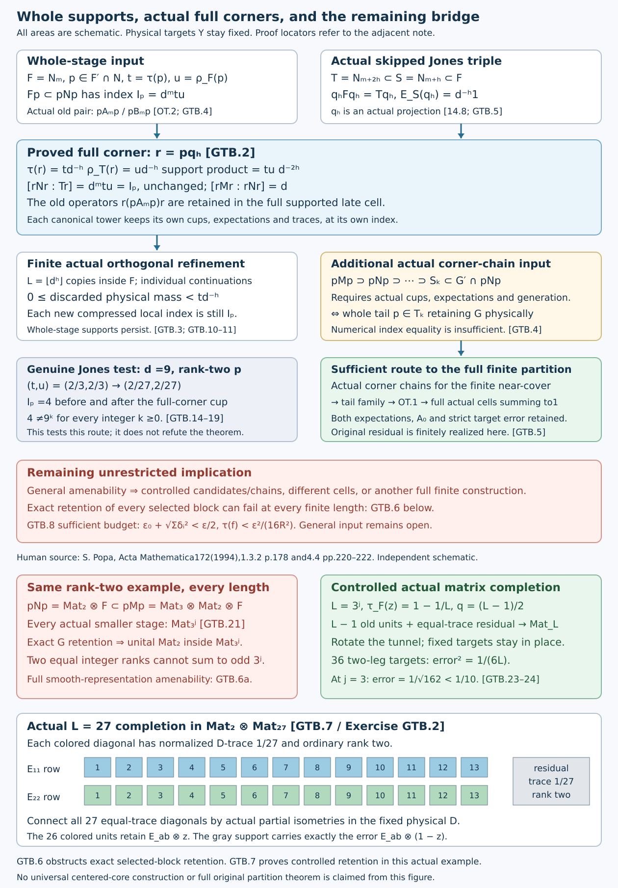

Figure GTB.1. The upper panels show the actual full-corner and skipped-cup maps, both support traces, and the conditional finite return. The lower panels show the same rank-two index-nine example at every depth and the controlled matrix completion at length three. Areas are schematic; the labels state exact traces and ranks. Proofs: GTB.1–GTB.8, including the full smooth-representation argument GTB.6a; Exercises GTB.1–GTB.2. Human context: Popa's §§1.3 and4.4, cited above. On a narrow screen, scroll the figure horizontally or [open the full-size figure](figures/general-tail-support-and-controlled-tunnel-v4.svg). [Editable figure source](figures/general-tail-support-and-controlled-tunnel-v4.py).

Original independently written programme text and SVG: public domain, CC0 1.0.
