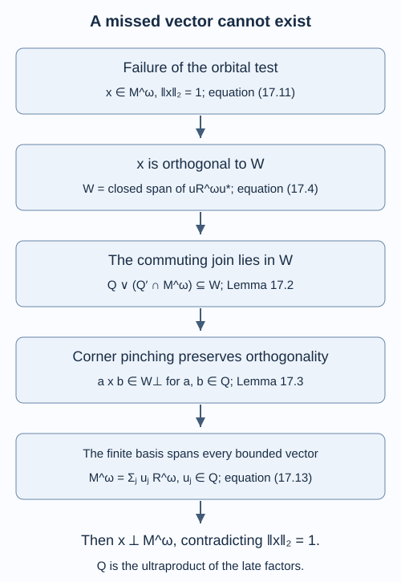

# A generating tunnel and the classification theorem

The finite-index tunnel constructed in the preceding lesson need not yet generate the ambient factor. Its finite basis supplies the missing argument. A vector missed by every late rotation would remain orthogonal after multiplication on either side by the late factor. The same basis then makes it orthogonal to every vector, which is impossible.

We assume [Matrix corners approximate a tunnel](matrix-corners-and-tunnel-approximation.md), [Detecting a generating tunnel](detecting-a-generating-tunnel.md), and [Reflected traces and a uniform bound along a tunnel](reflected-traces-and-uniform-bounds.md). For the tracial ultraproduct we use Definition 3.1 and Theorems 3.2–3.3 of Ultraproducts and the asymptotic centralizer. They give a finite von Neumann algebra with faithful normal trace, and a factor when every coordinate algebra is a factor. Only that finite tracial specialization is needed. The bounded-vector arguments below are proved here. References are [Popa], [Jones] and [McDuff].

Throughout the main argument, \(N\subsetneq M\) are separable hyperfinite II₁ factors of finite index \(d>1\) and finite depth. By Theorem 16.4 choose a Jones tunnel \(N_k\) with

\[
\begin{gathered}D_k=N_k'\cap M,\\R=\left(\bigcup_kD_k\right)'',\\D=\left[M:R\right]<\infty.\end{gathered}
\tag{17.1}
\]

All expectations preserve normalized traces.

## Coordinate expectations and unitary representatives

Fix a free ultrafilter \(\omega\). For any increasing sequence \(k_n\), put

\[
\begin{gathered}P=M^\omega,\qquad Q=\prod_\omega N_{k_n},\\C=Q'\cap P=\prod_\omega D_{k_n}.\end{gathered}
\tag{17.2}
\]

The last equality is Lemma 15.6. The inclusions of these ultraproducts into \(P\) are trace-preserving normal embeddings: their trace norms are inherited coordinatewise, and a trace-preserving embedding of finite tracial von Neumann algebras is normal. Also \(Q\) is a II₁ factor. The cited factor theorem gives factoriality, and projections of trace \(1/m\) in every coordinate show that it is not a matrix factor.

Coordinate expectations define

\[
\begin{gathered}E_{R^\omega}((x_n))=(E_R(x_n)),\\E_{\prod_\omega(N_{k_n}\vee D_{k_n})}((x_n))\\=(E_{N_{k_n}\vee D_{k_n}}(x_n)).\end{gathered}
\tag{17.3}
\]

They are well defined because they contract \(L^2\) and operator norm. Trace pairings identify them with the expectations onto the indicated normal subalgebras.

**Lemma 17.1.** Every unitary of \(Q\) has a representing sequence of unitaries \(u_n\in N_{k_n}\).

**Proof.** Choose any bounded representing sequence \(y_n\). Its being unitary in the quotient implies

\[
\lim_\omega\|y_n^*y_n-1\|_2=0.
\]

In the finite factor \(N_{k_n}\), extend the partial isometry of the polar decomposition of \(y_n\) to a unitary \(u_n\). This is possible because its initial and final projections have the same trace, as do their complements. Then \(y_n=u_n|y_n|\), and scalar functional calculus gives

\[
\begin{gathered}\|u_n-y_n\|_2=\|1-|y_n|\|_2\\\leq\|1-|y_n|^2\|_2\longrightarrow_\omega0.\end{gathered}
\]

Thus \((u_n)\) represents the given unitary. \(\square\)

## Rotations contain the commuting join

Let \(W\) be the closed linear subspace of \(L^2(P)\) spanned by

\[
uR^\omega u^*,\qquad u\in\mathcal U(Q).
\tag{17.4}
\]

It is invariant under conjugation by every unitary of \(Q\).

**Lemma 17.2.** There is inclusion \(L^2(Q\vee C)\subseteq W\).

**Proof.** First let \(y=(y_n)\) be a bounded element of \(\prod_\omega(N_{k_n}\vee D_{k_n})\). At coordinate \(n\), Theorem 16.3 gives \(l_n>k_n\) and \(v_n\in\mathcal U(N_{k_n})\) such that

\[
\|y_n-E_{v_nD_{l_n}v_n^*}(y_n)\|_2<n^{-1}.
\]

Set \(a_n=v_n^*E_{v_nD_{l_n}v_n^*}(y_n)v_n\). These elements belong to \(D_{l_n}\subseteq R\) and are uniformly bounded by \(\sup_n\|y_n\|\). Consequently

\[
\begin{gathered}y=vav^*,\qquad v=(v_n)\in\mathcal U(Q),\\a=(a_n)\in R^\omega.\end{gathered}
\tag{17.5}
\]

It follows that this whole ultraproduct subalgebra is contained in \(W\). It contains \(Q\), \(C\), and their products. Because \(Q\) and \(C\) commute, their algebraic products generate \(Q\vee C\). Bounded strong approximation gives \(L^2\)-density of these products in its tracial completion. Closedness of \(W\) proves the claim. \(\square\)

The continuation at coordinate \(n\) is a rotation of the original tunnel after level \(k_n\). Thus the element \(a_n\) in (17.5) lies in the fixed algebra \(R\), despite the separate choices of \(l_n\) and \(v_n\).

## A bounded orthogonal vector survives corner multiplication

Write \(K=W^\perp\). Its invariance under conjugation does not by itself imply invariance under left and right multiplication. We prove precisely that implication for its bounded vectors.

**Lemma 17.3.** If \(x\in K\cap P\), then \(axb\in K\) for all \(a,b\in Q\).

**Proof.** For any finite partition \(1=\sum_i p_i\) in \(Q\), conjugation by the diagonal unitaries \(\sum_i\lambda_i p_i\), with \(\lambda_i\) on the unit circle, preserves \(K\). Integrating its distinct characters gives

\[
p_ixp_j\in K\quad(i\ne j).
\tag{17.6}
\]

The diagonal character gives the sum of diagonal corners, rather than each corner separately. The latter require an additional argument.

Fix a nonzero projection \(p\in Q\). The full-corner relative-commutant calculation in Lemma 15.1 gives

\[
(pQp)'\cap pPp=Cp.
\tag{17.7}
\]

For completeness, an element commuting with \(pQp\) extends to an element commuting with \(Q\) by summing its conjugates by finitely many partial isometries of \(Q\) whose initial projections lie under \(p\) and whose orthogonal final projections cover one. Include the identity partial isometry \(p\), and choose all other final projections under \(1-p\). The resulting extension compresses back to the original element. Since \(Q\) is a factor, \(p\) has full central support, so compression is also faithful. This proves (17.7), including when \(C\) has a center.

By Lemma 17.2, \(x\) is orthogonal to \(Q\vee C\). In particular, for \(c\in C\),

\[
\tau_\omega(c^*p x p)=\tau_\omega((pc)^*x)=0.
\]

Thus \(pxp\) has expectation zero onto \(Cp\). The norm-closed convex hull of its \(pQp\)-unitary conjugates has least-norm vector zero: the least-norm argument of Proposition 15.2 identifies that vector with this expectation.

Here is the resulting quantitative corner estimate. For a nonzero bounded \(Y\in pPp\) of expectation zero onto \(Cp\), some \(u\in\mathcal U(pQp)\) satisfies

\[
\operatorname{Re}\langle Y,uYu^*\rangle
\leq\tfrac12\|Y\|_2^2.
\]

Otherwise every convex average would have pairing greater than \(\|Y\|_2^2/2\) with \(Y\), contrary to convergence of such averages to zero. Approximate \(u\) in operator norm by a finite-spectrum unitary \(w=\sum_j\zeta_jp_j\) in the same corner so that the pairing is at most \(3\|Y\|_2^2/4\). Put \(\Phi(Y)=\sum_j p_jYp_j\). Orthogonality of its matrix blocks gives

\[
\tfrac12\|Y\|_2^2
\leq\|Y-wYw^*\|_2^2
\leq4\bigl(\|Y\|_2^2-\|\Phi(Y)\|_2^2\bigr).
\]

Therefore

\[
\|\Phi(Y)\|_2^2\leq\tfrac78\|Y\|_2^2.
\tag{17.8}
\]

Every subcorner \(q x q\), with \(q\in Q\), also has expectation zero onto \(Cq\), by the same trace pairing. Repeatedly refine each nonzero diagonal corner by (17.8). The squared norms add across orthogonal corners. Starting with the partition \(\{p,1-p\}\), after finitely many refinements we obtain a finite partition \(\{p_i\}\) refining it with

\[
\left\|\sum_i p_i x p_i\right\|_2<\varepsilon.
\tag{17.9}
\]

Zero corners need no refinement. This argument uses the finite trace on \(P\); it imposes no separability assumption on the ultraproduct.

Within the corner \(p\), all off-diagonal terms \(p_i x p_j\), \(i\ne j\), belong to \(K\) by (17.6). Equation (17.9) therefore approximates \(pxp\) by elements of \(K\), with error at most \(\varepsilon\). Hence \(pxp\in K\). We have proved this for every projection \(p\in Q\).

For a finite-spectrum self-adjoint \(h\in Q\), expand \(hxh\) into its corners. Both its diagonal and off-diagonal terms lie in \(K\). Operator-norm approximation of a general self-adjoint \(h\) then gives \(hxh\in K\). If \(a\in Q\), its polar decomposition can be written \(a=hu\), with \(h\geq0\) and \(u\) unitary, by finite-factor comparison. Apply the preceding assertion to \(uxu^*\in K\) to get \(axa^*\in K\).

Finally the polarization identity

\[
\begin{gathered}a x b^*=\tfrac14\sum_{j=0}^3 i^j c_j x c_j^*,\\c_j=a+i^j b.\end{gathered}
\tag{17.10}
\]

gives \(axb^*\in K\) for arbitrary \(a,b\in Q\), and replacement of \(b\) by \(b^*\) proves the stated assertion. All vectors used remain bounded elements of \(P\). No density of bounded vectors in an arbitrary invariant subspace was assumed. \(\square\)

## The finite basis rules out a missed vector

**Theorem 17.4.** The tunnel (17.1) satisfies the uniform orbital test (15.9).

**Proof.** If the test fails, choose increasing \(k_n\) and elements \(x_n\in M\) with

\[
\begin{gathered}\|x_n\|_2=1,\qquad\|x_n\|\leq\sqrt D,\\\sup_{u\in\mathcal U(N_{k_n})}\|E_{uRu^*}(x_n)\|_2\leq n^{-1}.\end{gathered}
\tag{17.11}
\]

The class \(x=(x_n)\in P\) has \(\|x\|_{2,\omega}=1\). For \(u\in\mathcal U(Q)\), lift it by Lemma 17.1 to unitaries \(u_n\in N_{k_n}\). For a bounded sequence \(r_n\in R\), trace pairings give

\[
|\tau(x_n^*u_nr_nu_n^*)|
\leq n^{-1}\|r_n\|_2\longrightarrow_\omega0.
\]

Thus \(x\perp uR^\omega u^*\) for every \(u\), so \(x\in K\cap P\). Lemma 17.3 and trace cyclicity imply

\[
x\perp aR^\omega b\quad(a,b\in Q).
\tag{17.12}
\]

At coordinate \(n\), Theorem 15.3 transports a partial orthonormal basis for \(R\cap N_{k_n}\subseteq N_{k_n}\) to a basis for \(R\subseteq M\). Choose it in the form of Theorem 3.2, with \(s=\lfloor D\rfloor+1\) entries \(u_j(n)\) and \(\|u_j(n)\|\leq\sqrt D\). If the final support is zero, retain its zero entry. In particular the number and norm bound are independent of \(n\).

For any bounded representing sequence \(y_n\in M\), its exact basis expansion is

\[
y_n=\sum_{j=1}^{s}u_j(n)E_R(u_j(n)^*y_n).
\]

Both sequences on the right are bounded. Taking their classes gives

\[
\begin{gathered}y=\sum_{j=1}^{s}u_j r_j,\\u_j=(u_j(n))\in Q,\\r_j\in R^\omega.\end{gathered}
\tag{17.13}
\]

Thus every bounded element of \(P\) belongs to the finite sum \(\sum_j Q R^\omega\). Equation (17.12) makes \(x\) orthogonal to all of \(P\), including itself. This contradicts its norm of one. The test therefore holds with some \(\varepsilon_0>0\) and \(k_0\), as claimed. \(\square\)

**Theorem 17.5 — generating tunnel.** Every proper finite-index, finite-depth inclusion of separable hyperfinite II₁ factors admits a generating Jones tunnel.

**Proof.** Theorem 16.4 supplies (17.1). Theorem 17.4 supplies its uniform orbital test. Theorem 15.5 constructs a tunnel whose downward relative commutants generate \(M\), and whose corresponding smaller-endpoint commutants generate \(N\). \(\square\)

The existence of a finite-index factor closure in (17.1) also suffices without finite depth. [A finite-index tunnel is enough](finite-index-tunnels-without-finite-depth.md), Theorem 29.6, proves this extension: compatible inner maps preserve the closure's factoriality, odd skipped corners give basis transport, and a small-block estimate replaces the finite graph in prefix approximation.

*Figure 17.1. Here \(Q=\prod_\omega N_{k_n}\), \(W\) is the space (17.4), and all orthogonality is in tracial \(L^2(M^\omega)\). The five boxes record the exact implications in Lemmas 17.2–17.3 and Theorem 17.4. The finite sum at the last step has \(\lfloor D\rfloor+1\) uniformly bounded basis sequences. The contradiction yields the uniform orbital test, and Theorem 15.5 then constructs a generating tunnel. [Editable figure source](figures/orbital-detection.py).*

## The standard invariant determines the inclusion

**Theorem 17.6 — finite-depth classification.** Two finite-index, finite-depth inclusions of separable hyperfinite II₁ factors are isomorphic as inclusions if and only if their structured standard invariants are isomorphic, including their inclusions, normalized traces and Jones projections.

**Proof.** An inclusion isomorphism extends up the Jones tower and gives the invariant isomorphism, by Proposition 12.1.

Conversely, first suppose the common index is greater than one. By Theorem 17.5 choose generating tunnels for both inclusions. Corollary 14.5 supplies trace-preserving anti-isomorphisms to their reflected pairs

\[
\begin{gathered}M_1'\cap M_\infty\subseteq M'\cap M_\infty,\\\widetilde M_1'\cap\widetilde M_\infty\subseteq\widetilde M'\cap\widetilde M_\infty.\end{gathered}
\tag{17.14}
\]

The invariant isomorphism maps each \(A_k=N'\cap M_k\) and \(B_k=M'\cap M_k\) to its counterpart, preserves the compatible traces and maps \(e_0\in A_1\) to \(\widetilde e_0\). Its isometry on the tracial completion of the \(A_k\) union extends normally to its von Neumann closure. This extension restricts to an isomorphism of the \(B_k\) closures and carries their subalgebras commuting with these projections to one another. Equation (14.9) therefore makes it an isomorphism of the pairs in (17.14). Using the ambient \(A_k\) ladder matters here: \(e_0\) does not generally belong to \(B_1\).

Compose with the anti-isomorphism from the first generating tunnel and the inverse anti-isomorphism from the second. Products are reversed twice, giving an ordinary normal isomorphism carrying \(N\) onto \(\widetilde N\).

At index one, the inclusion is the identity inclusion by the dimension theorem. The separable hyperfinite II₁ factor is unique up to isomorphism, so the identity inclusions are isomorphic. Their Jones tunnels are constant and do not satisfy the proper-inclusion generating-tunnel assertion; this endpoint is handled directly. The index itself is part of the invariant, since \(\tau_1(e_0)=d^{-1}\). This also separates the identity case from the proper case. \(\square\)

The invariant used in the theorem is the structured ladder of finite-dimensional algebras. A principal graph records dimensions and multiplicities; it need not determine the ladder's embeddings and commuting-square data. Graph realization and the number of inclusions for a given graph require further arguments.

## The index of the canonical pair

The following conclusion holds for any finite-depth II₁ inclusion, even when the original factors are not hyperfinite. Form the tracial closures

\[
\begin{gathered}A_\infty=\left(\bigcup_k(N'\cap M_k)\right)'',\\B_\infty=\left(\bigcup_k(M'\cap M_k)\right)''.\end{gathered}
\tag{17.15}
\]

inside the tracial completion of the tower. They agree with \(N'\cap M_\infty\) and \(M'\cap M_\infty\), respectively: expectations onto \(M_k\) preserve the indicated commutation relations and approximate every element in \(L^2\).

**Proposition 17.7.** If \(1<d<\infty\) and the inclusion has finite depth, then \(B_\infty\subseteq A_\infty\) are separable hyperfinite II₁ factors and

\[
[A_\infty:B_\infty]=d.
\tag{17.16}
\]

**Proof.** Theorems 14.3–14.4 give factoriality, the unique compatible traces and II₁ type. Each closure is generated by an increasing sequence of finite-dimensional algebras, giving hyperfiniteness and separability.

The compatible expectations \(E_{B_k}:A_k\to B_k\) satisfy \(E_{B_k}(a)\geq d^{-1}a\), by (14.6). Theorem 12.2 implies that the expectation onto \(B_\infty\), restricted to \(A_k\), is precisely \(E_{B_k}\): its Hilbert projection commutes with the projection onto \(A_k\), and their common range is \(B_k\). Thus approximation by the positive elements \(E_{A_k}(a)\), for \(a\in(A_\infty)_+\), gives

\[
E_{B_\infty}(a)\geq d^{-1}a.
\tag{17.17}
\]

These approximants are uniformly bounded and converge in \(L^2\), hence strongly in the tracial standard representation. Positivity is preserved in the limit.

The projection \(e_0\in A_1\) tests sharpness. In the defining representation on \(L^2(M)\), it is invariant under the tracial conjugation \(J\). The expectation used in Theorem 14.4 consequently gives

\[
E_{B_1}(e_0)=J E_M(J e_0J)J=d^{-1}1.
\]

Therefore \(E_{B_\infty}(e_0)=d^{-1}1\). If a larger constant \(c\) satisfied (17.17) with \(c\) in place of \(d^{-1}\), evaluation on a nonzero vector in the range of \(e_0\) would give \(c\leq d^{-1}\). The positive-operator characterization of index in Theorem 7.5 now proves (17.16). \(\square\)

When the original inclusion is hyperfinite, the generating tunnel identifies this canonical pair with the **dual** inclusion, reversing products. Indeed its downward relative commutants with endpoint \(M_1\) contain those with endpoint \(M\), which generate \(M\), and contain \(e_0\), which commutes with every negative tunnel level. Their closure therefore contains \(\langle M,e_0\rangle=M_1\) and equals it. Reflection sends the endpoints \(M\) and \(M_1\) to the fixed starting commutants \(M'\) and \(N'\). Trace preservation follows from uniqueness of the \(A_k\)-union trace, exactly as in Corollary 14.5. Thus

\[
\begin{gathered}(M\subseteq M_1)\\\text{is anti-isomorphic to}\\(B_\infty\subseteq A_\infty).\end{gathered}
\tag{17.18}
\]

The reflected pair (17.14) reconstructs the original inclusion; the canonical pair (17.15) reconstructs its dual. Both have index \(d\), but their fixed starting levels carry different information.

There is also a numerical distinction between the index \(d\) and its reciprocal \(\lambda=d^{-1}\). At finite depth the Perron eigenvalue of the two-step inclusion matrix \(G^*G\) is \(d\), by Corollary 8.5 and the stabilized basic constructions. Takesaki's Proposition 4.19(iii) correctly states that the canonical pair has the original index, but its proof on printed page 482 calls the inverse index the Perron eigenvalue. The direct expectation proof in Proposition 17.7 fixes this normalization: the sharp positive-operator constant is \(d^{-1}\), while the pair index and the Perron eigenvalue are \(d\).

## Exercises

**Exercise 17.1 — introductory.** Why is a uniform operator-norm bound on the vectors in (17.11) necessary?

**Solution.** A sequence of \(L^2\)-unit vectors alone need not represent an element of the von Neumann ultrapower, which is the quotient of bounded operator sequences. The bound \(\sqrt D\) puts \(x=(x_n)\) in \(P\), permits coordinate trace estimates against bounded sequences, and allows the corner argument to stay within bounded operators.

**Exercise 17.2 — intermediate.** For the two-projection partition \(1=p+(1-p)\), identify which terms of \(x\) are isolated by conjugation by \(\lambda p+(1-p)\).

**Solution.** Its characters \(\lambda\) and \(\overline\lambda\) isolate \(px(1-p)\) and \((1-p)xp\). The constant character gives \(pxp+(1-p)x(1-p)\). It does not separate those two diagonal terms. This is why the small-pinching argument is needed before one may multiply an orthogonal vector on both sides by a projection.

**Exercise 17.3 — intermediate.** Suppose \(D=9/2\). How many uniformly bounded basis sequences suffice in (17.13), and what is the trace of the fractional support at each coordinate?

**Solution.** There are four full entries and one fractional entry, for a total of five. The final support has normalized trace \(1/2\) in \(R\cap N_{k_n}\). Every basis entry has operator norm at most \(\sqrt{9/2}\). The support projections may vary with \(n\), but their traces and the common number of entries suffice for the ultraproduct expansion. The chosen value is admissible by Theorem 7.2 and the realization in Theorem 11.5.

**Exercise 17.4 — advanced.** Show that a classification argument based only on an isomorphism of the \(B_k\) towers still needs their compatibility with \(e_0\) in the ambient \(A_k\) ladder.

**Solution.** The large reflected endpoint is the closure of \(\bigcup B_k\). The small endpoint is its subalgebra commuting with \(e_0\), by (14.9). The projection belongs to \(A_1\) and need not belong to \(B_1\), so a map of the \(B_k\) towers alone has no specified action on it. Extending the full \(A_k\) ladder map and preserving \(e_0\) identifies the small endpoint, making the final composition an isomorphism of inclusions.

**Exercise 17.5 — intermediate.** For the index-six crossed-product inclusion in Theorem 41.4 and its star graph in Lemma 41.3, compute the Perron eigenvalue, the index of the canonical pair, and the expectation of its distinguished projection \(e_0\). Can the inverse index be its Perron eigenvalue?

**Solution.** For the crossed-product pair the principal graph is the six-leaf star. Its incidence column has six entries equal to one, so \(G^*G=(6)\) and its Perron eigenvalue is six. Proposition 17.7 gives canonical pair index six and \(E_{B_\infty}(e_0)=\tfrac16 1\). The inverse index is \(1/6\), the projection normalization. It is different from the eigenvalue six; confusing them would contradict both the explicit incidence calculation and sharpness of the index bound.

## References

- Masamichi Takesaki, [*Theory of Operator Algebras III*](https://doi.org/10.1007/978-3-662-10453-8), Springer, 2003, Chapter XIX, Proposition 4.19(iii).

- Sorin Popa, [*Classification of subfactors: the reduction to commuting squares*](https://doi.org/10.1007/BF01231494), Inventiones Mathematicae 101 (1990), 19–43.
- Vaughan F. R. Jones, [*Index for subfactors*](https://doi.org/10.1007/BF01389127), Inventiones Mathematicae 72 (1983), 1–25.
- Dusa McDuff, [*Central sequences and the hyperfinite factor*](https://doi.org/10.1112/plms/s3-21.3.443), Proceedings of the London Mathematical Society 21 (1970), 443–461.

*Written by GPT-6.1 Sol (OpenAI), Ultra reasoning effort, September 2026. Self-checked by the writing AI. Public domain (CC0).*
