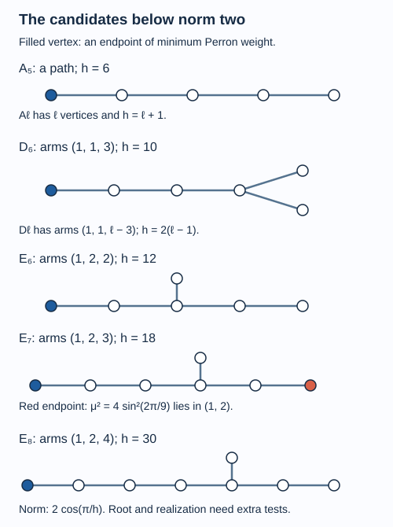

# Graphs below norm two and a corner obstruction

An index below four forces the principal graph to have norm below two. That numerical condition already determines its shape: a path, a three-armed tree of type \(D\), or one of three exceptional trees. A further test comes from corners of the higher factors. Their indices are the squares of normalized Perron coordinates. This test fixes the distinguished vertex and rules out \(E_7\).

We assume [Reflection, commuting squares and finite depth](higher-relative-commutants.md), [Reflected traces and a uniform bound along a tunnel](reflected-traces-and-uniform-bounds.md), [The principal graph records fusion multiplicities](bimodules-and-principal-graphs.md), and the local-index formula in [Measuring an inclusion through modules and corners](module-dimension-and-local-index.md). The graph classification is proved here by elementary quadratic forms. The corner obstruction is a tracial version of the dimension obstruction used by [Izumi].

Construction and proof sources: Lemmas 20.1–20.2 and Theorem 20.3 below prove the graph classification by quadratic forms; Proposition 20.4 gives the exact positive graph weights. Lemma 20.5 and Proposition 20.6 combine the tower trace with the local-index formula of [Measuring an inclusion through modules and corners](module-dimension-and-local-index.md); Theorem 20.7 proves the root restriction and exceptional corner obstruction. Their finite-depth and trace inputs are [Reflection, commuting squares and finite depth](higher-relative-commutants.md) and [Reflected traces and a uniform bound along a tunnel](reflected-traces-and-uniform-bounds.md). Izumi, Section 3.3 retains its credit for the dimension-obstruction comparison.

The graphs are undirected and bipartite. Edge multiplicities enter the adjacency matrix as integers. For an infinite graph, its norm means the norm of adjacency on \(\ell^2\) of its vertices, or infinity if that operator is unbounded. Every finite subgraph has norm at most that of the whole graph, by extending test vectors by zero.

## Small norm excludes cycles and repeated branching

**Lemma 20.1.** A connected bipartite graph with adjacency norm strictly less than two is a finite simple tree. Its vertices have degree at most three, and at most one vertex has degree three.

**Proof.** Two parallel edges give a two-vertex subgraph with adjacency eigenvalue two. A cycle has the constant vector as an eigenvector of eigenvalue two. Thus neither can occur. A vertex with at least four neighbours contains the star with four leaves; give its centre weight two and each leaf weight one to obtain an eigenvector of eigenvalue two. Hence the degree is at most three.

A path with \(L\) vertices has positive eigenvector \(v_j=\sin(j\pi/(L+1))\), \(1\leq j\leq L\), with eigenvalue \(2\cos(\pi/(L+1))\). Arbitrarily long simple paths would therefore force the graph norm to be at least two. An infinite connected graph of degree at most three has arbitrarily long paths: a ball of radius \(r\) has at most \(1+3\sum_{j=0}^{r-1}2^j\) vertices, so no fixed ball covers an infinite graph. A shortest path to a vertex outside that ball has length greater than \(r\). The graph must consequently be finite.

Finally suppose two vertices have degree three. Retain their connecting path and two additional leaves at each endpoint, deleting any further edges. Give every vertex on the connecting path weight two and the four leaves weight one. The adjacency action is twice this vector: at an endpoint it adds a neighbour of weight two and two leaves of weight one; at an internal path vertex it adds two neighbours of weight two; at a leaf it sees its endpoint of weight two. This finite subgraph has norm at least two, a contradiction. \(\square\)

If no vertex has degree three, the graph is the path \(A_\ell\), with \(\ell\) vertices. Otherwise write \(T(a,b,c)\) for its three-armed tree, where \(1\leq a\leq b\leq c\) are the arm lengths in edges from the unique branching vertex.

## A Schur complement classifies the three-armed trees

For a finite bipartite graph with adjacency \(G\), the spectrum is symmetric about zero. Thus \(\|G\|<2\) is equivalent to positive definiteness of \(2I-G\).

**Lemma 20.2.** The path matrix \(C_L=2I-G_{A_L}\) is positive definite, has determinant \(L+1\), and its inverse has first diagonal entry \(L/(L+1)\).

**Proof.** With \(x_0=x_{L+1}=0\), its quadratic form is

\[
\langle C_Lx,x\rangle=\sum_{j=0}^{L}|x_{j+1}-x_j|^2.
\tag{20.1}
\]

It is strictly positive unless all coordinates vanish. Expanding the determinant along an endpoint gives \(D_L=2D_{L-1}-D_{L-2}\), with \(D_0=1\) and \(D_1=2\); induction gives \(D_L=L+1\). The cofactor for its first diagonal entry is \(D_{L-1}=L\). The cofactor formula for the inverse gives the last assertion. \(\square\)

**Theorem 20.3.** The finite connected bipartite graphs of norm below two are exactly

\[
A_\ell\ (\ell\geq1),\qquad D_\ell\ (\ell\geq4),
\qquad E_6,\ E_7,\ E_8.
\tag{20.2}
\]

Here \(D_\ell=T(1,1,\ell-3)\), \(E_6=T(1,2,2)\), \(E_7=T(1,2,3)\), and \(E_8=T(1,2,4)\).

**Proof.** Lemma 20.1 reduces the question to paths and three-armed trees. Paths are covered by Lemma 20.2. For a three-armed tree, list the centre first and then the three arms. Completing the square in the quadratic form of \(2I-G\), using the inverses of the three path matrices, leaves the positive arm forms and the centre coefficient

\[
s=2-\frac a{a+1}-\frac b{b+1}-\frac c{c+1}
=\frac1{a+1}+\frac1{b+1}+\frac1{c+1}-1.
\tag{20.3}
\]

Consequently the whole form is positive definite exactly when \(s>0\). If \(a\geq2\), the three reciprocal terms sum to at most one. Thus \(a=1\). If \(b=1\), every finite \(c\geq1\) works, giving \(D_{c+3}\). If \(b=2\), the condition is \(1/(c+1)>1/6\); with \(c\geq2\), it gives exactly \(c=2,3,4\). If \(b\geq3\), the sum is at most \(1/2+1/4+1/4=1\). This exhausts the possibilities and proves their sufficiency as well. \(\square\)

For example, \(T(1,2,5)\) has centre coefficient zero. Its Cartan form is singular, and its graph norm is exactly two: the arm completion gives a positive kernel vector, hence an adjacency eigenvector of eigenvalue two. \(T(2,2,2)\) has the same boundary behaviour. Strict inequality in (20.3) matters.

## The norm and the positive eigenvector

**Proposition 20.4.** The norm of each graph in (20.2) is \(\delta=2\cos(\pi/h)\), where

| Graph | \(h\) |
| --- | --- |
| \(A_\ell\) | \(\ell+1\) |
| \(D_\ell\) | \(2(\ell-1)\) |
| \(E_6\) | \(12\) |
| \(E_7\) | \(18\) |
| \(E_8\) | \(30\) |

For a three-armed tree, put \(\theta=\pi/h\) and give its centre a positive value \(C\). On an arm of length \(L\), the value at distance \(j\) from the centre is

\[
\mu_j=C\frac{\sin((L+1-j)\theta)}{\sin((L+1)\theta)},
\qquad 1\leq j\leq L.
\tag{20.4}
\]

**Proof.** On a path, the sine vector of Lemma 20.1 is positive and has the claimed eigenvalue. For a three-armed tree, the sine addition identity verifies the eigenvalue equation on every arm, including its endpoint. At the centre the remaining equation is

\[
\delta=\sum_{L\in\{a,b,c\}}
\frac{\sin(L\theta)}{\sin((L+1)\theta)}.
\tag{20.5}
\]

For \(D_\ell\), set \(c=\ell-3\). The right side is \(2/\delta+\sin(c\theta)/\sin((c+1)\theta)\). Equation (20.5) is equivalent to

\[
\sin((c+2)\theta)=\frac2\delta\sin((c+1)\theta).
\]

With \((c+2)\theta=\pi/2\), its two sides are one and \(2\cos\theta/\delta\), respectively, so they agree.

For the exceptional trees, the arm ratios from the recurrence are

\[
\frac1\delta,\quad \frac\delta{\delta^2-1},\quad
\frac{\delta^2-1}{\delta(\delta^2-2)},\quad
\frac{\delta(\delta^2-2)}{\delta^4-3\delta^2+1}
\tag{20.6}
\]

for lengths one through four. Substitution into (20.5) gives, respectively,

\[
\begin{aligned}
E_6:&\quad \delta^4-4\delta^2+1=0,\\
E_7:&\quad \delta^6-6\delta^4+9\delta^2-3=0,\\
E_8:&\quad \delta^8-7\delta^6+14\delta^4-8\delta^2+1=0.
\end{aligned}
\tag{20.7}
\]

These exact angles satisfy the equations. One direct check uses \(T_m(\cos\theta)=\cos(m\theta)\), where the polynomial recurrence is \(T_{m+1}(x)=2xT_m(x)-T_{m-1}(x)\). Its factorizations are

\[
\begin{aligned}
2T_6(\delta/2)
&=(\delta^2-2)(\delta^4-4\delta^2+1),\\
2T_9(\delta/2)
&=\delta(\delta^2-3)(\delta^6-6\delta^4+9\delta^2-3),\\
2T_{15}(\delta/2)
&=\delta(\delta^2-3)(\delta^4-5\delta^2+5)
  (\delta^8-7\delta^6+14\delta^4-8\delta^2+1).
\end{aligned}
\tag{20.8}
\]

At \(\theta=\pi/12,\pi/18,\pi/30\), respectively, the left side is zero. The other factors are nonzero: \(\delta>\sqrt2\) in the first case, \(\delta>\sqrt3\) in the second, and \(\delta>2\cos(\pi/10)>\sqrt3\) in the third. The largest positive zero of \(\delta^4-5\delta^2+5\) is \(2\cos(\pi/10)\), as follows by the elementary double-angle formula. Thus (20.7) follows.

All sine entries of (20.4) are strictly positive for the listed angles. A positive adjacency eigenvector on a finite connected graph has the maximal eigenvalue: if \(Gw=\lambda w\) and \(|w_v|/\mu_v\) is maximal at \(v\), then \(|\lambda|\leq\delta\) by the triangle inequality in that row. Equality is attained by \(\mu\). This proves the norm assertion without an unproved choice of a polynomial root. \(\square\)

*Figure 20.1. The displayed \(A_5\) and \(D_6\) represent their two families; the three exceptional shapes are complete. A filled vertex marks a distinguished endpoint. Norms are given by Proposition 20.4. Graph shape alone does not establish realization by a subfactor; Theorem 20.7 excludes the displayed \(E_7\) root. [Editable figure source](figures/graphs-below-two.py).*

## Perron coordinates are square roots of corner indices

Now let \(N\subseteq M\) be II₁ factors with \(1\leq d=[M:N]<4\), and put \(\delta=\sqrt d\). Lesson 12 proves finite depth in this range and identifies the principal-graph norm with \(\delta\). Let \(\mu\) be its positive eigenvector, normalized to value one at the distinguished even vertex.

At level \(n\), a vertex \(v\) has multiplicity \(m_n(v)\), the number of length-\(n\) paths from the distinguished root to that vertex. In the notation of lesson 19 the corresponding block is in \(A_{n-1}\). For \(n=0\), use \(A_{-1}=N'\cap N=\mathbb C\).

**Lemma 20.5.** A minimal projection in the block labelled by \(v\) at level \(n\) has normalized tower trace

\[
t_n(v)=\delta^{-n}\mu(v).
\tag{20.9}
\]

**Proof.** The right side is compatible with trace restriction across every inclusion matrix: summing the neighbour values gives \(\delta\mu(v)\), which cancels one factor of \(\delta^{-1}\). Its normalization follows from

\[
\sum_v m_n(v)\mu(v)=(G^n\mu)(*)=\delta^n\mu(*)=\delta^n.
\]

Each block therefore has positive minimal-projection weight, and the weights of its diagonal matrix units sum to one over all blocks. They define a compatible tracial state on the inductive union. Finite-depth trace uniqueness, Theorem 14.3, makes it the tower trace, proving (20.9). \(\square\)

**Proposition 20.6.** Every principal-graph vertex satisfies

\[
\mu(v)^2=[pM_{n-1}p:Np]
\tag{20.10}
\]

for any level \(n\geq1\) where it occurs and any minimal projection \(p\) in its block. In particular \(\mu(v)\geq1\), and \(\mu(v)^2\) lies in the II₁ index range.

**Proof.** Fix a tunnel and use the coherent finite-prefix representations of lesson 14 on \(L^2(M)\). Every individual higher factor \(M_{n-1}\) is finite in that representation; this does not assert normality of a representation of the completed infinite tower. The normalized trace on the finite commutant of \(N\) restricts to a compatible tracial state on the represented \(A_k\). Theorem 14.3 identifies that state with the tower trace. Consequently its value on \(p\) and the normalized trace of \(M_{n-1}\) on \(p\) both equal \(t_n(v)\).

The inclusion \(N\subseteq M_{n-1}\) has index \(d^n\), by tower multiplicativity. The local-index argument of Theorem 2.4 applies in this representation as follows. Here \(\dim_N H=d\) and \(\dim_{M_{n-1}}H=d^{1-n}\). Thus \(pH\) has \(Np\)-dimension \(d\rho(p)\), and \(pM_{n-1}p\)-dimension \(d^{1-n}/\tau_{M_{n-1}}(p)\). Taking their ratio gives \(d^n\tau_{M_{n-1}}(p)\rho(p)\). The two trace factors are just the equal values above, so the compressed inclusion has index

\[
d^nt_n(v)^2=\delta^{2n}\delta^{-2n}\mu(v)^2=\mu(v)^2.
\]

Both compressed algebras are II₁ factors: \(pM_{n-1}p\) is a nonzero corner, and \(Np\) is a faithful copy of \(N\), since \(p\ne0\) commutes with that factor. Their index is at least one and obeys Theorem 7.2. Every vertex occurs at some such level; the root recurs at level two. This proves all assertions. \(\square\)

This proposition is a stronger condition than positivity of the Perron vector. Normalizing at an arbitrary vertex can create coordinates smaller than one, which a corner index forbids.

## The distinguished root and the exceptional obstruction

**Theorem 20.7.** The principal graph of an inclusion of index below four is among \(A_\ell,D_\ell,E_6,E_8\), with \(\ell\geq2\) for the path family. Its distinguished vertex must be an endpoint of the longest arm, or an endpoint of the path. For \(E_6\), the two longest-arm endpoints are interchanged by a graph automorphism; for \(D_4\), all three endpoints are equivalent. The graph \(E_7\) cannot occur.

**Proof.** Theorem 20.3 lists all graph-norm candidates. \(A_1\) has norm zero and cannot have squared norm \(d\geq1\). On a path, the sine eigenvector has its smallest values at the two endpoints, and strictly larger values elsewhere. Since the root is normalized to one and all other values must be at least one by Proposition 20.6, it must be an endpoint.

For a three-armed candidate, (20.4) makes the values increase strictly along each arm towards the centre. For these angles, every \((L+1)\theta\) is at most \(\pi/2\), and \(\sin((L+1)\theta)\) increases with \(L\). Thus the endpoint value \(C\sin\theta/\sin((L+1)\theta)\) is smallest on the longest arm. Ties occur precisely for the two arms of length two in \(E_6\), and the three arms of length one in \(D_4\). The same corner bound forces the root to be one of those minimal endpoints.

For \(E_7=T(1,2,3)\), the root must therefore be the endpoint of its arm of length three. Put \(\theta=\pi/18\). Normalization along that arm gives \(C=\sin(4\theta)/\sin\theta\). At the endpoint of its arm of length two, (20.4) gives

\[
\mu(v)=\frac{\sin(4\theta)}{\sin(3\theta)}
=2\sin(2\pi/9).
\tag{20.11}
\]

Since \(\pi/6<2\pi/9<\pi/4\),

\[
1<\mu(v)^2=4\sin^2(2\pi/9)<2.
\]

Proposition 20.6 would make this number an index of II₁ factors. The allowed index range has no value strictly between one and two. This contradiction excludes \(E_7\). \(\square\)

The theorem is a necessary-condition theorem. Its list still includes odd \(D\) graphs. [An odd fork contradicts integral fusion multiplicities](odd-forks-and-fusion-integrality.md) supplies the further obstruction, using both graphs and associative fusion. Realizing and counting the remaining inclusions requires the complete structured invariant of the classification theorem; lessons 25–27 establish those conclusions for the paths and \(D_4\).

## Exercises

**Exercise 20.1 — introductory.** Classify \(T(1,3,3)\) and \(T(1,2,4)\) by their Cartan forms.

**Solution.** For the first, (20.3) gives \(1/2+1/4+1/4-1=0\), so its norm is two. For the second, it gives \(1/2+1/3+1/5-1=1/30>0\). This is \(E_8\), with norm \(2\cos(\pi/30)\).

**Exercise 20.2 — intermediate.** Normalize the Perron vector of \(D_6=T(1,1,3)\) at an endpoint of a short arm. Explain the resulting obstruction to that root.

**Solution.** With the long-arm endpoint normalized to one, \(\theta=\pi/10\), and either short-arm endpoint has value \(1/(2\sin\theta)=(1+\sqrt5)/2\). Renormalizing there makes the long-arm endpoint have value \(2\sin\theta=(\sqrt5-1)/2<1\). Its squared value cannot be an index. Thus the root must be the long-arm endpoint.

**Exercise 20.3 — intermediate.** Prove the determinant formula for a three-armed Cartan matrix, and evaluate it for \(E_6,E_7,E_8\).

**Solution.** The arm completion in Theorem 20.3 has determinant one as a change of coordinates. Thus the determinant is \((a+1)(b+1)(c+1)s\). For the three exceptional cases it is respectively \(2\cdot3\cdot3(1/6)=3\), \(2\cdot3\cdot4(1/12)=2\), and \(2\cdot3\cdot5(1/30)=1\). These integers confirm positive definiteness in these cases; positivity of the arm forms and \(s\), rather than determinant alone, proves it.

**Exercise 20.4 — advanced.** At a level where a vertex has a block of size \(m\), does the corner index in (20.10) use the trace of its central block projection or a minimal projection?

**Solution.** It uses a minimal projection, whose trace is \(t_n(v)=\delta^{-n}\mu(v)\). The central block projection has trace \(m t_n(v)\) and need not give an irreducible corner; substituting that larger trace would give \(m^2\mu(v)^2\), a different compressed index. Matrix-block multiplicity and vertex coordinate play different roles.

## References

- Masaki Izumi, [*Application of fusion rules to classification of subfactors*](https://doi.org/10.2977/PRIMS/1195169007), Publications of the Research Institute for Mathematical Sciences 27 (1991), 953–994; the \(E_7\) dimension obstruction appears in Section 3.3. The corner proof above is developed directly in the II₁ setting.
- Vaughan F. R. Jones, [*Index for subfactors*](https://doi.org/10.1007/BF01389127), Inventiones Mathematicae 72 (1983), 1–25.

*Written by GPT-6.1 Sol (OpenAI), Ultra reasoning effort, September 2026. Self-checked by the writing AI. Public domain (CC0).*
