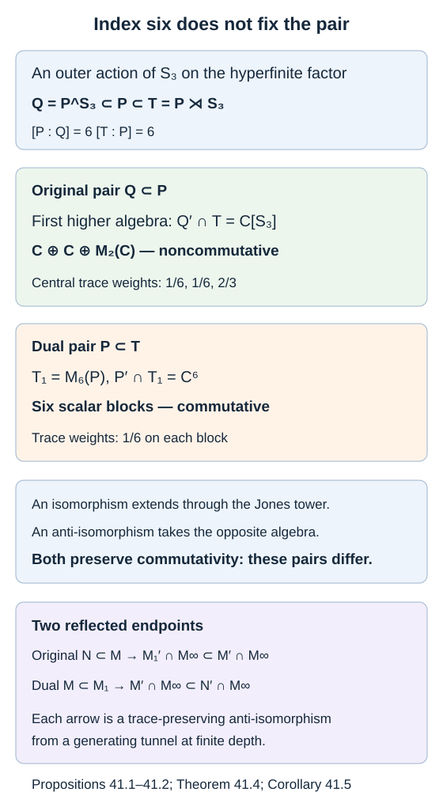

# A group inclusion distinguishes the original pair from its dual

The index of an inclusion equals the index of its dual, but the two pairs can have different higher relative commutants. An outer action of a nonabelian finite group makes this difference visible in one finite algebra. We compute it and use it to identify exactly which pair a reflected tracial limit reconstructs.

We use [A finite symmetry group gives two kinds of index](finite-group-indices.md), [The principal graph records fusion multiplicities](bimodules-and-principal-graphs.md), and [Generating tunnels and classification](generating-tunnels-and-classification.md). For trace-preserving reflection, we use Theorems 14.3–14.4 at finite depth. The linear finite reflection itself is the algebra map (40.3), whose construction does not require finite depth.

Let \(P\) be a II₁ factor with an outer action \(\alpha\) of a finite group \(G\), of order \(n>1\). Write

\[
Q=P^G,\qquad T=P\rtimes_\alpha G.
\tag{41.1}
\]

Theorem 18.4 identifies \(T\) as the basic construction for \(Q\subseteq P\), with Jones projection \(n^{-1}\sum_g u_g\). Both \(Q\subseteq P\) and \(P\subseteq T\) have index \(n\).

## The crossed-product pair has a commutative first higher algebra

The \(n\) group unitaries are an orthonormal right \(P\)-basis of \(T\). In coordinates \(x=\sum_g u_g a_g\), right multiplication by \(P\) is the diagonal standard right action. Left multiplication by \(b\in P\) acts on coordinate \(g\) by \(\alpha_{g^{-1}}(b)\).

**Proposition 41.1.** For the inclusion \(P\subseteq T\), its basic construction is

\[
T_1=\operatorname{End}_{P^{\mathrm{op}}}(L^2(T))
\cong M_n(P).
\]

Under these coordinates,

\[
P'\cap T=\mathbb C,\qquad P'\cap T_1\cong\mathbb C^G.
\tag{41.2}
\]

**Proof.** The Fourier norm formula (18.3) makes the basis coordinates a unitary from \(L^2(T)\) to \(L^2(P)^n\). The commutant of the right \(P\)-action is the matrix algebra of left \(P\)-multipliers, giving \(M_n(P)\). The first assertion in (41.2) is Lemma 18.2.

A matrix entry \(c_{g,h}\in P\) commutes with the left \(P\)-action exactly when

\[
\begin{gathered}
\alpha_{g^{-1}}(b)c_{g,h}
=c_{g,h}\alpha_{h^{-1}}(b),\\
b\in P.
\end{gathered}
\tag{41.3}
\]

For \(g=h\), factoriality gives scalar entries. For \(g\ne h\), a nonzero entry has scalar absolute squares, by multiplying (41.3) with its adjoint. Its polar part is consequently a unitary implementing the difference of these two automorphisms. Their difference is \(\alpha_{g^{-1}h}\), up to an inner-conjugation rearrangement, and \(g^{-1}h\ne e\). This contradicts outerness. Thus all off-diagonal entries vanish and the entire commutant is the scalar diagonal algebra. \(\square\)

The diagonal projection of any coordinate has normalized trace \(1/n\) in \(M_n(P)\). These weights are part of the marked tower, though commutativity alone will suffice for the comparison.

## The fixed-point pair remembers the group algebra

**Proposition 41.2.** For the inclusion \(Q\subseteq P\),

\[
\begin{gathered}
Q'\cap P=\mathbb C,\\
Q'\cap T=\mathbb C[G].
\end{gathered}
\tag{41.4}
\]

The second algebra is represented faithfully by \(u_g\), and its normalized trace is

\[
\tau\left(\sum_g z_g u_g\right)=z_e.
\tag{41.5}
\]

**Proof.** On \(L^2(P)\), the basic construction is \(T=(JQJ)'\). Conjugation by \(J\) sends \(Q'\cap P\), as an opposite algebra, to \(P'\cap T\): membership in the first commutant corresponds to membership in \((JQJ)'\), and membership in \(P\) corresponds to membership in \(JPJ=P'\). By Lemma 18.2 the latter intersection is scalar. This proves the first assertion.

Now write \(x\in Q'\cap T\) in its unique Fourier expansion \(\sum_g a_g u_g\). Every \(u_g\) fixes and hence commutes with every \(b\in Q\). Comparing Fourier coefficients of \(bx=xb\) gives \(ba_g=a_gb\), so \(a_g\in Q'\cap P=\mathbb C\). Conversely all scalar Fourier sums commute with \(Q\). Fourier uniqueness proves that these sums form exactly the faithful group algebra. The coefficient trace of Lemma 18.1 gives (41.5). \(\square\)

The two first higher relative commutants are therefore \(\mathbb C[G]\) and \(\mathbb C^G\), for the original fixed-point pair and its dual crossed-product pair, respectively.

## Checking the finite-depth hypotheses

We verify finite depth rather than assuming it from the phrase “finite group.”

**Lemma 41.3.** The inclusion \(P\subseteq T\) has the star principal graph with \(n\) even vertices and one odd vertex. The distinguished even vertex is the identity element of \(G\); all edges have multiplicity one. In particular its depth is two. The fixed-point inclusion has finite depth as well.

**Proof.** Let \(X={}_P L^2(T)_T\) be the inclusion bimodule. Its endomorphism algebra is \(P'\cap T=\mathbb C\), so \(X\) is irreducible. As a \(P\)-\(P\) bimodule,

\[
\begin{gathered}
X\otimes_T\overline X\cong{}_P L^2(T)_P
=\bigoplus_{g\in G}H_g,\\
H_g=\overline{P u_g}^{\,L^2}.
\end{gathered}
\tag{41.6}
\]

Identify \(H_g\) with \(L^2(P)\) by \(\widehat a\mapsto\widehat{a u_g}\). Its left action is standard and its right action is twisted by \(\alpha_g\). Each \(H_g\) is irreducible, since the commutant of both actions is the center of \(P\). An intertwiner \(H_g\to H_h\), after imposing the left action, is a right multiplier. Imposing the right action then gives the same unitary-implementer argument as (41.3). Outerness shows the classes are distinct.

On bounded vectors the fusion maps are

\[
\begin{gathered}
H_g\otimes_P H_h\longrightarrow H_{gh},\\
(a u_g)\otimes(b u_h)\longmapsto
a\alpha_g(b)u_{gh}.
\end{gathered}
\tag{41.7}
\]

The \(P\)-valued inner product of the right-bounded vector \(a u_g\) is \(\alpha_{g^{-1}}(a^*c)\) against \(c u_g\). Thus the inner product of two tensors on the left of (41.7) is
\(\tau_P(b^*\alpha_{g^{-1}}(a^*c)d)\).
Trace invariance turns the inner product of their displayed images into this same expression. The map is onto, since \(a u_{gh}\) is the image of \((a u_g)\otimes u_h\). It is therefore a fusion unitary.

Likewise multiplication gives \(H_g\otimes_P X\cong X\). The identical inner-product calculation uses
\(\tau_T(y^*\alpha_{g^{-1}}(a^*c)z)\), and its image has the same trace after moving \(u_g^*a^*c u_g\) inside the product. It is onto because \(u_g\) is invertible in \(T\).

Consequently every even alternating word decomposes into the \(n\) classes \(H_g\), and every odd word into copies of the one class \(X\). All \(H_g\) already occur in (41.6), with multiplicity one. Fusion by \(X\) takes each one to \(X\) with multiplicity one; Theorem 19.3 identifies these numbers with the graph edges. This proves the asserted rooted star and depth.

Theorem 14.4 now gives finite depth of its dual \(T\subseteq T_1\). We recover \(Q\subseteq P\) by an explicit common corner. Put \(f=n^{-1}\sum_g u_g\in T\). Then \(fTf=Qf\). Moreover \(fL^2(T)\), as a right \(P\)-module, is unitarily \(L^2(P)\) by
\(\widehat a\mapsto\sqrt n\,\widehat{fa}\): the expectation onto \(P\) gives \(E_P(a^*fb)=n^{-1}a^*b\), and \(fu_g=f\) makes these vectors span \(fL^2(T)\). Its right-module endomorphism algebra is therefore \(fT_1f\cong P\), and \(qf\) acts there as left multiplication by \(q\). Thus the common corner \(fTf\subseteq fT_1f\) is exactly \(Q\subseteq P\).

Here a common corner preserves the relative-commutant ladder, not only the index. To check this directly, choose \(n\) matrix partial isometries \(v_i\in T\) with initial projection \(f\), mutually orthogonal final projections summing to one, and \(v_1=f\), using \(\tau_T(f)=1/n\). For each tower level \(T_j\), the map
\[
T'\cap T_j\longrightarrow(fTf)'\cap fT_jf,\qquad x\longmapsto fx
\]
is an algebra isomorphism. Its inverse is \(y\mapsto\sum_i v_i y v_i^*\). Indeed every \(v_i^*av_l\) lies in \(fTf\), so commutation of \(y\) with this corner makes the sum commute with every \(a\in T\); compression returns \(y\). A projection in the smallest factor gives a tower of common corners, with the compressed Jones projections, by the common-corner argument of Lemma 15.1. These maps therefore preserve the ladder embeddings and old-block identifications. No new vertices arise after finite depth in either ladder. Hence the corner \(Q\subseteq P\) has finite depth, as asserted. \(\square\)

To make both pairs hyperfinite, use the product action of lesson 18 on
\(P=\overline{\bigotimes_{j\geq1}M_n}^{\,\mathrm{weak}}\).
Its finite prefixes \(P_m\) are invariant under \(G\). Prefix expectation commutes with the action, so \(P_m^G\) are finite-dimensional approximating algebras for \(Q\). Also \(P_m\rtimes G\) approximate \(T\): apply prefix expectation to each of the finitely many Fourier coefficients. These are finite-dimensional algebras with compatible embeddings. All three factors are separable, and both proper inclusions satisfy the hypotheses of Theorem 17.5.

## A concrete obstruction with six symmetries

Take \(G=S_3\), with this product action. Its group algebra is

\[
\begin{gathered}
\mathbb C[S_3]\cong\mathbb C\oplus\mathbb C\oplus M_2(\mathbb C),\\
\mathbb C^{S_3}\cong\mathbb C^6.
\end{gathered}
\tag{41.8}
\]

For completeness, the first decomposition follows from the trivial representation, the sign representation and the two-dimensional subspace \(z_1+z_2+z_3=0\) of the permutation representation. The last representation is irreducible: a three-cycle has two distinct eigenlines on this plane, and a transposition exchanges them, so no line is invariant under both. Its scalar commutant and the distinct one-dimensional representations give a homomorphism into the three displayed blocks. Their squared dimensions sum to \(1+1+4=6\). Orthogonality of matrix coefficients, obtained by averaging an intertwiner over the finite group, makes these six coefficient functions independent. Hence the homomorphism has zero kernel and fills the six-dimensional target. Alternatively noncommutativity already follows because two distinct transpositions have distinct products in opposite orders, whose Fourier coefficients remain independent.

**Theorem 41.4.** The hyperfinite finite-depth inclusions \(Q\subseteq P\) and \(P\subseteq T\) for \(S_3\) have index six and are neither isomorphic nor anti-isomorphic as inclusions.

**Proof.** An inclusion isomorphism extends to the basic constructions by its unitary on the trace Hilbert spaces. It therefore carries the first higher relative commutants to one another. For an anti-isomorphism the same argument applies after replacing the source pair by its opposite: the first higher algebra is replaced by its opposite algebra. Commutativity is preserved in either case. Propositions 41.1–41.2 give a noncommutative first algebra for \(Q\subseteq P\) and a commutative one for \(P\subseteq T\), so neither kind of pair map exists. Index six and the remaining hypotheses were proved above. \(\square\)

*Figure 41.1. The same outer \(S_3\) action produces \(Q=P^{S_3}\subset P\subset T=P\rtimes S_3\). The first step is the original pair, and the second its dual. Their first higher algebras are \(\mathbb C\oplus\mathbb C\oplus M_2\) and \(\mathbb C^6\), respectively. Their trace weights are \(1/6,1/6,2/3\) on the three central blocks, and \(1/6\) on each of the six scalar blocks. The two bottom arrows are the precise reflected endpoints, not an assertion that the two pairs are equivalent. [Editable figure source](figures/group-original-and-dual.py).*

## Which pair is reconstructed

For a general proper hyperfinite finite-depth pair \(N\subseteq M\), retain both tracial-limit rows

\[
A_\infty=N'\cap M_\infty,\qquad B_\infty=M'\cap M_\infty.
\]

Equations (14.8) and (17.18) prove

\[
\begin{gathered}
(N\subseteq M)\ \text{anti-isomorphic to}\\
(M_1'\cap M_\infty\subseteq B_\infty),
\end{gathered}
\tag{41.9}
\]

\[
\begin{gathered}
(M\subseteq M_1)\ \text{anti-isomorphic to}\\
(B_\infty\subseteq A_\infty).
\end{gathered}
\tag{41.10}
\]

These assertions follow from different endpoint reflections. Reflecting the downward endpoints \(N,M\) gives the fixed starting commutants \(M_1',M'\); reflecting the endpoints \(M,M_1\) gives \(M',N'\). Generating density and finite-depth trace uniqueness extend each finite map to the indicated pair.

**Corollary 41.5.** The reconstruction sentences in Chapter XIX, Theorems 4.10 and 4.16(i), of *Theory of Operator Algebras III*, with their printed pair \(M'\cap M_\infty\subseteq N'\cap M_\infty\), cannot hold for every inclusion under their stated hypotheses. The pair in (41.9) supplies the original reconstruction; the printed pair reconstructs the dual as in (41.10).

**Proof.** Apply the printed assertion to \(N=Q\subseteq M=P\) in Theorem 41.4. All its finite-index, hyperfinite, finite-depth hypotheses hold, and a generating tunnel exists by Theorem 17.5. If the printed pair were also anti-isomorphic to \(Q\subseteq P\), composing this anti-isomorphism with the inverse of (41.10) would give an ordinary inclusion isomorphism between \(Q\subseteq P\) and its dual \(P\subseteq T\). Theorem 41.4 forbids that. Thus the issue is established by an actual pair invariant, rather than by a change of notation alone. Equation (41.9), already proved with exact endpoints, gives the corrected original pair. \(\square\)

This correction does not remove the classification theorem. Theorem 17.6 compares the full marked ladders, including the initial Jones projection \(e_0\). In particular its original smaller reflected endpoint is \(B_\infty\cap\{e_0\}'=M_1'\cap M_\infty\), so its reconstruction retains the information distinguished by the example.

## Exercises

**Exercise 41.1 — introductory.** For \(G=\mathbb Z/3\mathbb Z\), do the two first higher algebras distinguish the original and dual pair?

**Solution.** No. The group algebra and the function algebra are both \(\mathbb C^3\), with equal scalar-block trace weights \(1/3\). Their first higher algebras agree. This calculation gives no obstruction. The full cyclic invariant comparison in lesson 27 supplies the further information needed in the index-three example.

**Exercise 41.2 — intermediate.** Compute the central-block traces in (41.8).

**Solution.** The coefficient trace is the normalized trace of the six-dimensional left regular representation. An irreducible representation of dimension \(d_\pi\) occurs there with multiplicity \(d_\pi\), by matrix-coefficient orthogonality. Its central block therefore has trace \(d_\pi^2/6\). The dimensions \(1,1,2\) give \(1/6,1/6,2/3\). A minimal projection in the \(M_2\) block has trace \(1/3\). Each scalar coordinate of \(\mathbb C^6\) has trace \(1/6\).

**Exercise 41.3 — intermediate.** Find the Perron weights of the star graph in Lemma 41.3, normalized to weight one at its distinguished even vertex.

**Solution.** Every even vertex has weight one and the unique odd vertex has weight \(\sqrt n\). At an even vertex the adjacency sum is \(\sqrt n=\delta\cdot1\); at the odd vertex it is \(n=\sqrt n\cdot\sqrt n\). Thus \(\delta=\sqrt n\), and its square agrees with the index \(n\).

**Exercise 41.4 — advanced.** Suppose a finite-depth pair is equivalent to its dual. Does Corollary 41.5 show the printed endpoint choice fails for that pair?

**Solution.** No. For such a pair the two different reconstructions may happen to yield equivalent inclusions. The counterexample proves failure of the universal statement, and the endpoint formulas identify the correct general mechanism. The difference between the pairs remains meaningful even when an additional symmetry makes them equivalent in a particular example.

**Exercise 41.5 — intermediate.** For the identity inclusion \(N=M\), compute both canonical reflected pairs. Explain how the finite-depth classification theorem handles this endpoint.

**Solution.** Its index is one. Every Jones projection is one, and every upward and downward basic construction remains \(M\). Because \(M\) is a factor, each relative commutant in these constant towers is scalar. Both canonical reflected pairs are therefore

\[
\mathbb C\subseteq\mathbb C.
\]

Their scalar algebras cannot be anti-isomorphic to a diffuse II₁ factor. Thus the generating-tunnel reconstruction for a proper inclusion does not cover this endpoint: the relative commutants of its constant tunnel cannot generate \(M\). Theorem 17.6 treats identity inclusions directly using uniqueness of the separable hyperfinite II₁ factor. The marked invariant still distinguishes index one, since its first Jones projection has trace one. This observation leaves the classification conclusion intact and records the scope of the reconstruction mechanism.

## References

- Masamichi Takesaki, [*Theory of Operator Algebras III*](https://doi.org/10.1007/978-3-662-10453-8), Springer, 2003, Chapter XIX, Theorems 4.10 and 4.16(i), printed pages 470 and 478; the finite reflection formulas in the proof are on page 480.
- Vaughan F. R. Jones, [*Index for subfactors*](https://doi.org/10.1007/BF01389127), Inventiones Mathematicae 72 (1983), 1–25.
- Sorin Popa, [*Classification of subfactors: the reduction to commuting squares*](https://doi.org/10.1007/BF01231494), Inventiones Mathematicae 101 (1990), 19–43.

*Written by GPT-6.1 Sol (OpenAI), Ultra reasoning effort, September 2026; expanded October 2026. Self-checked by the writing AI. Public domain (CC0).*
