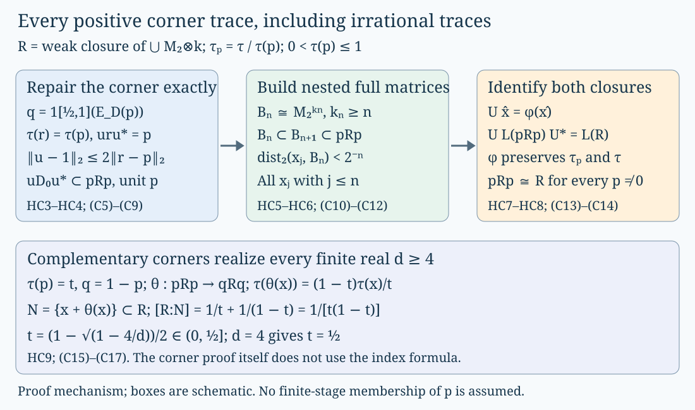

# Hyperfinite corners and diagonal indices

Every nonzero corner of the separable hyperfinite II₁ factor, with its normalized trace, is isomorphic to that factor. We prove this by approximating arbitrary corners, replacing finite-dimensional approximations by full dyadic matrix algebras, and constructing an increasing matrix chain. The construction includes irrational corner traces and realizes every finite real subfactor index at least four.

The proof starts with a concrete product trace. It uses the complete finite trace and expectation arguments in [Finite traces and Jones projections](finite-traces-and-jones-projections.md), Theorems M1–M6 and M10.1, and [A projection that remembers an inclusion](projection-and-basic-construction.md), Lemma1.4a. Projection comparison, halving and corner centers are supplied by Projections and types of von Neumann algebras, PR3.3/3.5, PR5.3/5.5 and PR13.3. The ultraweak density used in HC1 is The double commutant theorem, Theorem4.4. The final diagonal-index calculation uses the proved compression and index normalization in [Measuring an inclusion through modules and corners](module-dimension-and-local-index.md), GM7, Proposition2.1a and Example2.8. That final application is separate from the corner-isomorphism proof.

The matrix approximation strategy is due to Murray and von Neumann. Human-source guidance is Claire Anantharaman and Sorin Popa, [An introduction to II₁ factors](https://www.math.ucla.edu/~popa/Books/IIun.pdf), §11.2, Lemma11.2.1, Theorem11.2.2 and Remark11.2.3, printed pp.185–188. The exact-trace repair and all intermediate approximation arguments are written out here. The proof concerns factors that already have finite-dimensional approximations; the deeper implication from general amenability to that property is a separate theorem.

## HC1. The standard factor and its trace

Let \(A_m=M_2(\mathbb C)^{\otimes m}\), with embeddings \(a\mapsto a\otimes1\), \(A_0=\mathbb C\), and compatible normalized matrix traces. Let \(A=\bigcup_m A_m\), with trace \(\tau_0\). Form its tracial Hilbert completion \(H\), with \(\Omega=\widehat1\) and inner product linear in the first variable. Finite matrix trace inequalities give

\[
\|ab\|_2\le\|a\|\|b\|_2,\qquad
\|ba\|_2\le\|a\|\|b\|_2
\quad(a,b\in A).
\tag{C1}
\]

Thus left and right actions are bounded, commute, and have adjoints \(L_a^*=L_{a^*}\), \(R_a^*=R_{a^*}\). Define \(R=L(A)''\). Both \(L(A)\Omega\) and \(R(A)\Omega\) are dense. Since the right algebra commutes with \(R\), \(x\Omega=0\) for \(x\in R\) implies \(xR_a\Omega=R_a x\Omega=0\) for all \(a\), hence \(x=0\). Therefore \(\Omega\) is separating for \(R\).

The vector state \(\tau(x)=\langle x\Omega,\Omega\rangle\) is normal. If \(x\ge0\) and \(\tau(x)=0\), then \(x^{1/2}\Omega=0\); separation gives \(x=0\). It is therefore faithful before traciality is used. For \(a\in A\), \(x\in R\),

\[
\begin{aligned}
\tau(xL_a)
&=\langle xR_a\Omega,\Omega\rangle
=\langle R_a x\Omega,\Omega\rangle\\
&=\langle x\Omega,R_a^*\Omega\rangle
=\langle x\Omega,L_a^*\Omega\rangle
=\tau(L_a x).
\end{aligned}
\tag{C2}
\]

For fixed \(x\), both \(y\mapsto\tau(xy)\) and \(y\mapsto\tau(yx)\) are normal vector functionals. The unital algebra \(L(A)\) is ultraweakly dense in \(R\), by current DB4.4. Thus C2 extends to every \(y\in R\). This proves a faithful normal tracial state extending \(\tau_0\), without a hidden product-trace extension.

Use the current proved finite expectation for \(A_m\subset R\). Its Hilbert projection is the projection onto \(\widehat{A_m}\). Those projections increase to \(1_H\), so \(E_{A_m}(x)\Omega\to x\Omega\). If \(x\) is central, bimodularity makes \(E_{A_m}(x)\) central in \(A_m\), hence equal to \(\tau(x)1\). Taking the Hilbert limit and using separation gives \(x=\tau(x)1\). Thus \(R\) is a factor.

The finite trace makes its identity finite. It has projections of trace \(2^{-m}\) for every \(m\). If \(f\ne0\) were minimal, choose \(m\) with \(0<2^{-m}<\tau(f)\). Trace comparison puts a nonzero projection of trace \(2^{-m}\) under \(f\), contradicting minimality. Hence \(R\) is II1. \(H\) is separable, being the completion of a countable union of finite-dimensional spaces, and is its standard \(L^2\)-space via \(x\mapsto x\Omega\).

Its finite matrix expectations converge in \(L^2\), so every finite subset of \(R\) can be approximated arbitrarily well in \(L^2\) by a unital finite-dimensional subalgebra. Call this the finite-dimensional approximation property. The following argument uses this property for a II1 factor with its given faithful normal trace.

## HC2. Trace range and finite-dimensional algebra structure

Every nonzero projection in a II1 factor can be halved into two equivalent orthogonal projections, by the complete current PR13.3 proof. Starting with \(e\), repeatedly write the remaining half as \(a_k+r_k\), with

\[
\tau(a_k)=\tau(r_k)=2^{-k}\tau(e),\qquad r_0=e.
\tag{C3}
\]

The \(a_k\) are orthogonal. If \(s/\tau(e)=\sum_k b_k2^{-k}\), \(b_k\in\{0,1\}\), then \(f=\sum_k b_k a_k\) has trace \(s\), for every \(s\in[0,\tau(e)]\), by normality. The endpoints use \(f=0,e\). Projections of equal trace are equivalent by current factor comparison and faithfulness, as proved in BC1.4a. These conclusions require neither hyperfinite uniqueness nor injective-factor theory.

A unital finite-dimensional *-algebra \(D\) decomposes into full matrix blocks. For completeness, first decompose its finite-dimensional abelian centre by its minimal central projections. In one central block, split the identity into a maximal family of minimal projections. Each minimal corner is scalar: its self-adjoint elements have only scalar spectral projections. Current central-support comparison (PR5.3) makes any two minimal projections in this factor equivalent. Choose partial isometries from a fixed one to all the others; their products are matrix units. Each off-diagonal corner is one-dimensional, since multiplication by a connecting partial isometry identifies it with a minimal scalar corner. Thus the block is their full matrix span. This supplies the finite block structure used below.

Nonzero corners of a II1 factor are again II1: their centres are scalar by PR3.5, their normalized restricted trace is faithful and normal, and a minimal projection in such a corner would also be minimal in the original factor. Hence the trace range and comparison just proved apply inside every such corner.

## HC3. Nearby equal-trace projections are conjugate by a nearby unitary

Let \(e,r\) be projections of equal trace in a II1 factor. Put

\[
a=er+(1-e)(1-r),\qquad d=\|e-r\|_2.
\tag{C4}
\]

Then \(ar=ea\), \(\|a\|\le1\), and \(a^*a\) commutes with \(r\). In the polar decomposition \(a=v|a|\), its initial support therefore commutes with \(r\), and \(vr=ev\). To see the intertwining explicitly, the bounded polar approximants \(a(a^*a+\epsilon1)^{-1/2}\) intertwine \(r\) and \(e\) for every \(\epsilon>0\), and converge strongly to \(v\). Its final support commutes with \(e\).

The parts of the right and left kernel projections within \(r\) and \(e\) have equal traces: the corresponding supports of \(v\) are equivalent and \(\tau(r)=\tau(e)\). The same applies to their complementary blocks. Compare each pair of kernel parts and add the resulting partial isometries to \(v\). This yields a unitary \(u\) with \(ur=eu\), hence \(uru^*=e\), and \(u|a|=a\).

The identities

\[
a-1=(e-r)(2r-1),\qquad
\tau(1-a^*a)=\tau(e)+\tau(r)-2\tau(er)=d^2
\]

give

\[
\|u-a\|_2^2
=\tau((1-|a|)^2)
\le\tau(1-|a|^2)=d^2.
\]

Therefore

\[
uru^*=e,\qquad \|u-1\|_2\le2\|e-r\|_2.
\tag{C5}
\]

This also covers orthogonal equal-trace projections, when \(a\) has a kernel. No invertibility is assumed.

## HC4. The finite-dimensional approximation property passes to every corner

Let \(M\) be a II1 factor with the finite-dimensional approximation property, and \(0\ne p\in M\), \(s=\tau(p)>0\). We prove that \(pMp\), with trace \(\tau/s\), has the same property.

Fix a finite set \(F\) of contractions in \(pMp\). For arbitrarily small \(\eta>0\), choose a unital finite-dimensional \(D\subset M\) such that

\[
\|p-E_D(p)\|_2<\eta,\qquad
\|x-E_D(x)\|_2<\eta\quad(x\in F).
\tag{C6}
\]

This follows from the property because the proved \(E_D\) is the orthogonal \(L^2\)-projection and therefore gives the best approximations. It is positive and norm contractive. Put \(h=E_D(p)\), so \(0\le h\le1\), and \(q=1_{[1/2,1]}(h)\in D\). Orthogonality and trace preservation give

\[
\|p-h\|_2^2=\tau(h-h^2).
\]

On \([0,1]\), \((1_{[1/2,1]}(t)-t)^2\le t(1-t)\), so

\[
\delta:=\|p-q\|_2<2\eta,\qquad
|\tau(p)-\tau(q)|\le\delta.
\tag{C7}
\]

We next change \(q\) to a projection \(r\) of **exactly** trace \(s\), retaining a finite-dimensional algebra with unit \(r\).

If \(\tau(q)\le s\), choose \(f\le1-q\) of trace \(s-\tau(q)\), put \(r=q+f\), and use \(D_0=qDq\oplus\mathbb C f\), omitting zero summands.

If \(\tau(q)>s\), decompose \(qDq\) into matrix blocks with units \(z_b\), matrix units \(w^{(b)}_{ij}\), and first minimal projections \(g_b=w^{(b)}_{11}\). Put \(\lambda=s/\tau(q)\). In each \(g_bMg_b\), choose \(f_b\le g_b\) of trace \(\lambda\tau(g_b)\), and set

\[
r_b=\sum_i w^{(b)}_{i1}f_b w^{(b)}_{1i},\qquad r=\sum_b r_b.
\tag{C8}
\]

Then \(r\le q\), \(r\) commutes with \(qDq\), and \(\tau(r)=\lambda\tau(q)=s\). Indeed, in each block, \(r_b w^{(b)}_{ij}=w^{(b)}_{i1}f_b w^{(b)}_{1j}=w^{(b)}_{ij}r_b\). The algebra \(D_0=r(qDq)\) is a unital finite-dimensional *-algebra on \(r\). In both cases

\[
\|r-q\|_2=\sqrt{|\tau(p)-\tau(q)|}
=:b\le\sqrt\delta,\qquad
\|r-p\|_2\le\delta+b.
\]

For \(x\in F\), put \(z_x=qE_D(x)q\), a contraction in \(qDq\). Then

\[
\|x-z_x\|_2\le\eta+2\delta.
\]

When \(r\ge q\), use \(y_x=z_x\in D_0\). When \(r\le q\), use \(y_x=rz_x\in D_0\). In either case \(\|y_x\|\le1\) and \(\|y_x-z_x\|_2\le b\).

C5 supplies a unitary \(u\) with \(uru^*=p\) and \(\|u-1\|_2\le2(\delta+b)\). Therefore \(uD_0u^*\subset pMp\) is finite-dimensional with unit \(p\), and

\[
\begin{aligned}
\|x-u y_xu^*\|_{2,\tau_p}
&\le s^{-1/2}\bigl(\eta+2\delta+b+2\|u-1\|_2\bigr)\\
&\le s^{-1/2}\bigl(\eta+6\delta+5b\bigr)\\
&\le s^{-1/2}\bigl(13\eta+5\sqrt{2\eta}\bigr).
\end{aligned}
\tag{C9}
\]

The last bound tends to zero. Arbitrary bounded finite sets follow by scalar rescaling. This proves corner approximation at every \(s>0\), including irrational \(s\). In particular it applies to every \(pRp\). No claim that \(p\) belongs to a finite matrix stage was made.

## HC5. Replace finite-dimensional approximations by full dyadic matrix algebras

Let \(M\) have the property above. Fix a finite set \(F\) and accuracy \(\varepsilon>0\). Choose a unital finite-dimensional \(D\subset M\) and \(y_x\in D\), \(x\in F\), with \(\|x-y_x\|_2<\varepsilon/2\). Write

\[
D=\bigoplus_b M_{k_b},\qquad
y_x=\sum_{b,i,j}c^{(x)}_{b,i,j}w^{(b)}_{ij}.
\]

For a large integer \(m\), put \(n_b=\lfloor2^m\tau(w^{(b)}_{11})\rfloor\). Using the trace range in HC2, choose orthogonal \(f_{b,a}\le w^{(b)}_{11}\), \(1\le a\le n_b\), each of trace \(2^{-m}\). The remainder \(g_b=w^{(b)}_{11}-\sum_a f_{b,a}\) has trace less than \(2^{-m}\).

The projections

\[
h_{b,a,i}=w^{(b)}_{i1}f_{b,a}w^{(b)}_{1i}
\]

are mutually orthogonal and all have trace \(2^{-m}\). The trace of their complementary projection is an integer multiple of \(2^{-m}\), so partition that complement into projections of the same trace. Altogether there are exactly \(2^m\) equivalent projections summing to \(1\).

They can be the diagonal units of a full \(M_{2^m}\) subalgebra \(B\) in a way that retains the required truncated matrix units. Indeed, choose a common reference projection \(h_0\) of trace \(2^{-m}\). For each pair \((b,a)\), choose \(t_{b,a,1}\) from \(h_0\) onto \(h_{b,a,1}\), then put

\[
t_{b,a,i}=w^{(b)}_{i1}f_{b,a}t_{b,a,1}.
\]

Choose comparison partial isometries from \(h_0\) onto the remaining diagonal projections as well. Their products \(t_\alpha t_\beta^*\) form full matrix units with diagonal sum \(1\). In particular

\[
\widetilde w^{(b)}_{ij}
=\sum_a w^{(b)}_{i1}f_{b,a}w^{(b)}_{1j}
\in B.
\]

The difference \(w^{(b)}_{ij}-\widetilde w^{(b)}_{ij}
=w^{(b)}_{i1}g_b w^{(b)}_{1j}\) is a partial isometry of squared \(L^2\)-norm \(\tau(g_b)<2^{-m}\). Thus

\[
\left\|y_x-\sum_{b,i,j}c^{(x)}_{b,i,j}\widetilde w^{(b)}_{ij}\right\|_2
<2^{-m/2}\sum_{b,i,j}|c^{(x)}_{b,i,j}|.
\tag{C10}
\]

There are finitely many coefficients, so choose \(m\) large enough to make every such bound less than \(\varepsilon/2\). This proves dyadic full-matrix approximation. The choice can enforce \(m\ge1\), or any prescribed lower bound.

## HC6. Construct an increasing matrix chain

Assume \(L^2(M,\tau)\) is separable. The unit ball of \(M\) has a countable \(L^2\)-dense subset \((x_j)\), since it is a subset of a separable metric space. Its linear span is dense in \(L^2(M)\).

We construct unital full matrix algebras

\[
B_0=\mathbb C1\subset B_1\subset B_2\subset\cdots,
\qquad B_n\cong M_{2^{k_n}},\quad k_n\ge n,
\tag{C11}
\]

such that \(\operatorname{dist}_2(x_j,B_n)<2^{-n}\) for \(j\le n\). Suppose \(B_n\) is constructed, of size \(r=2^{k_n}\), with matrix units \(e_{ij}\), and put \(e=e_{11}\). The corner \(eMe\), with its normalized trace \(\tau_e=r\tau\), has the approximation property by HC4. HC5 supplies a full dyadic matrix algebra \(C\subset eMe\), of size \(2^\ell\) with \(\ell\ge1\), simultaneously approximating all coefficients

\[
a_{ij}^{(h)}=e_{1i}x_h e_{j1}\qquad
(1\le h\le n+1,\ 1\le i,j\le r)
\]

within \(2^{-(n+1)}/\sqrt r\) in \(\|\cdot\|_{2,\tau_e}\). Choose approximants \(c_{ij}^{(h)}\in C\).

The algebra generated by \(e_{i1} C e_{1j}\) is a full \(M_{r2^\ell}\), denoted \(B_{n+1}\). If \((f_{ab})\) are matrix units of \(C\), its matrix units are \(e_{i1}f_{ab}e_{1j}\), and

\[
e_{ij}=\sum_a e_{i1}f_{aa}e_{1j}.
\]

Hence \(B_n\subset B_{n+1}\), with the usual diagonal matrix inclusion. Put \(z_h=\sum_{i,j}e_{i1}c_{ij}^{(h)}e_{1j}\). Different \((i,j)\) matrix corners are orthogonal in \(L^2\), and multiplication by these partial isometries preserves the unnormalized corner trace. Therefore

\[
\begin{aligned}
\|x_h-z_h\|_{2,\tau}^2
&=\frac1r\sum_{i,j}
\|a_{ij}^{(h)}-c_{ij}^{(h)}\|_{2,\tau_e}^2\\
&<\frac1r\,r^2\,\frac{2^{-2(n+1)}}r
=2^{-2(n+1)}.
\end{aligned}
\tag{C12}
\]

This completes the induction and gives \(k_{n+1}=k_n+\ell\). In particular the matrix sizes tend to infinity.

The union of the \(B_n\) is \(L^2\)-dense. Consequently its finite expectations satisfy \(E_{B_n}(x)\to x\) in \(L^2\) for every \(x\). They are norm bounded by \(\|x\|\). On dense vectors \(\widehat a\),

\[
\|(E_{B_n}(x)-x)\widehat a\|_2
\le\|a\|\|E_{B_n}(x)-x\|_2\longrightarrow0.
\]

Uniform boundedness extends this to all vectors. The same applies to adjoints. Thus the union generates \(M\) in its faithful normal standard representation.

## HC7. Identify the chain with the standard factor

The matrix-unit construction in HC6 makes each inclusion \(B_n\subset B_{n+1}\) a tensor inclusion with multiplicity \(2^{k_{n+1}-k_n}\). Inductively choose compatible isomorphisms

\[
\phi_n:B_n\longrightarrow A_{k_n}.
\]

They preserve normalized traces, since a full matrix algebra has a unique tracial state. Since \(k_n\to\infty\), the union of the \(A_{k_n}\) is the entire algebraic union \(A\). The union map \(\phi\) therefore induces the unitary

\[
U:L^2(M)\longrightarrow L^2(R),\qquad
U\widehat x=\widehat{\phi(x)}
\quad(x\in\bigcup_n B_n).
\tag{C13}
\]

Both unions are Hilbert dense, so this is a surjective complex-linear unitary, with \(U\widehat1=\widehat1\). It intertwines the left actions on each algebraic matrix stage. The strong-density conclusions of HC6 and HC1 imply

\[
U L(M)U^*=L(R).
\]

Conjugation is normal; FT M10.1 identifies both faithful standard images with their original von Neumann algebras and gives normal inverse maps. Thus C13 yields a normal *-isomorphism \(M\cong R\). Its action on the identity vector makes it trace-preserving. This proves the exact finite-dimensional approximation uniqueness criterion left unproved in the old background B11.

## HC8. Every corner, with its exact trace normalization

For \(0\ne p\in R\), HC2 shows that \(pRp\) is II1 with normalized trace \(\tau_p=\tau/\tau(p)\). Its standard Hilbert space identifies with \(pL^2(R)p\) by

\[
\widehat x_{\tau_p}\longmapsto
\tau(p)^{-1/2}\widehat x_\tau,
\]

so it is separable. HC4 gives its finite-dimensional approximation property, and HC5–HC7 give a normal normalized-trace-preserving isomorphism

\[
\phi_p:(pRp,\tau_p)\longrightarrow(R,\tau).
\tag{C14}
\]

This is proved for all positive \(\tau(p)\), including every irrational value. It is a statement about the separable hyperfinite factor and its corners; it does not assert uniqueness for arbitrary injective factors without separability.

## HC9. Preserve every diagonal index \(d\ge4\)

For a finite real \(d\ge4\), define

\[
t=\frac{1-\sqrt{1-4/d}}2\in(0,1/2].
\]

HC2 supplies \(p\in R\) with \(\tau(p)=t\), and \(q=1-p\ne0\). Apply C14 to both corners and set

\[
\theta=\phi_q^{-1}\phi_p:pRp\longrightarrow qRq.
\tag{C15}
\]

This map is unital between the corner units, normal, and preserves their normalized traces. In the original trace,

\[
\tau(\theta(x))=\frac{1-t}{t}\tau(x)\qquad(x\in pRp).
\tag{C16}
\]

Thus \(N=\{x+\theta(x):x\in pRp\}\subset R\) is a unital normal factor inclusion (the image of a normal representation is a von Neumann algebra by the proved current SP8.2), and its trace corresponds exactly to \(\tau_p\): \(\tau(x+\theta(x))=\tau(x)/t\). The projection \(p\) belongs to \(N'\cap R\). The two corner inclusions are the identity inclusions \(Np=pRp\) and \(Nq=qRq\), so both local indices equal one. The current general module lesson's proved local formula and additivity give

\[
[R:N]=\frac1t+\frac1{1-t}
=\frac1{t(1-t)}=d.
\tag{C17}
\]

Equivalently its checked algebra-compression rule GM7 gives dimensions \(1/t\) and \(1/(1-t)\) for the two left \(N\)-modules \(pL^2(R)\), \(qL^2(R)\), and their sum is C17. This final application consumes the assigned general index normalization; the proof of C14 itself uses no index theorem.

At \(d=4\), \(t=1/2\). At \(d=9/2\), \(t=1/3\). As finite \(d\) grows, \(t\) remains strictly positive. No limit \(p=0\) is used, and the symbol \(d\ge4\) here means finite real indices, as in the original example.

The owner's separately retained stable trace-scaling construction for arbitrary \(M\) remains useful and unchanged. C14–C17 supply an unconditional concrete realization for the separable hyperfinite factor and every finite real \(d\ge4\), rather than replacing that assigned outcome with a single specialized example.

*FigureHC1.* The arrows summarize the proved constructions, rather than asserting inclusions between the three boxes. The first box retains the exact corner unit and normalized trace; the second constructs simultaneous approximations of a countable dense family; the third extends compatible finite-stage maps by their Hilbert unitary. The lower panel records the precise trace-scaling ratio and index. Proof locators: HC3–HC9, (C5)–(C17). Human source: Anantharaman–Popa, §11.2. [Editable figure source](figures/hyperfinite-corners-v3.py).

## Exercises with complete solutions

### Exercise HC1 — an irrational corner

Take a projection with trace \(t=\sqrt2-1\). Why does the proof give an isomorphism of this corner with the standard factor even though no projection of that trace belongs to a finite dyadic matrix stage?

**Solution.** HC2 constructs a projection of every trace by an orthogonal binary series. Every finite matrix stage has only dyadic projection traces, so this particular projection cannot be in such a stage. HC4 first approximates it by a finite-stage spectral projection and then repairs the trace exactly inside the ambient factor. The near-identity unitary puts the repaired finite-dimensional algebra into the actual corner. HC5–HC7 build and identify a new chain there. Thus no original finite-stage membership is required.

### Exercise HC2 — the matrix-coefficient tolerance

In HC6 suppose the old stage has degree \(r=16\), and the required ambient error is \(1/32\). Which normalized-corner tolerance for each coefficient is sufficient? Verify the sum of squared errors.

**Solution.** Use coefficient errors strictly below \((1/32)/\sqrt{16}=1/128\). There are \(16^2\) matrix coefficients. Equation(C12) gives an ambient squared error strictly smaller than \((1/16)16^2(1/128)^2=1/1024\). Its square root is \(1/32\). The factor \(1/16\) is the conversion from the normalized corner trace to the ambient trace.

### Exercise HC3 — trace scaling at index five

Let \(d=5\), choose the smaller root \(t\) from HC9, and compute the original-trace scaling of \(\theta\) and the two module dimensions. Explain which trace the corner isomorphism preserves.

**Solution.** Here \(t=(1-1/\sqrt5)/2\) and \(1-t=(1+1/\sqrt5)/2\). Therefore the original-trace ratio is \((1-t)/t=(3+\sqrt5)/2\). The two dimensions are \(1/t=(5+\sqrt5)/2\) and \(1/(1-t)=(5-\sqrt5)/2\), whose sum is5. The isomorphism preserves the normalized corner traces, not the restrictions of the original trace when their corner masses differ. Equation(C16) is precisely the conversion between these normalizations.

Authored by GPT-6.1 Sol (OpenAI), Ultra reasoning, October2026. Original exposition CC0-1.0. The complete course remains in development.
