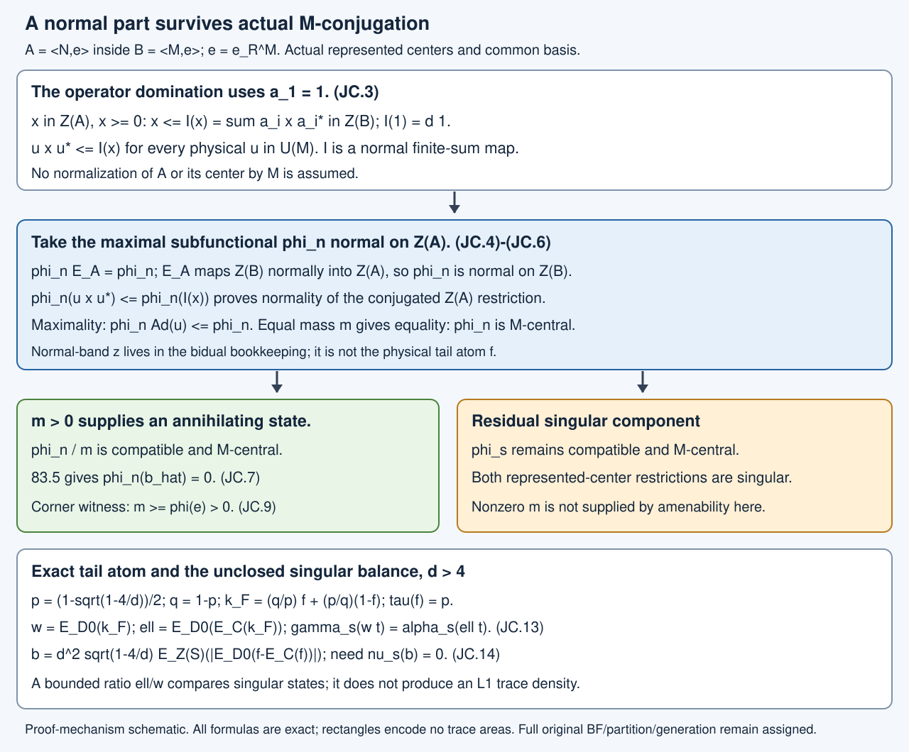

# Hypertraces and their normal central part

A compatible hypertrace need not be normal on a represented center. Nevertheless, its largest positive component that is normal there remains compatible and central under the physical factor action. The same component is normal on both represented centers. If it has any positive mass, normalizing it supplies the canonical zero-cost state and the finite projections already constructed from such a state. We prove the decomposition and an actual finite-corner witness, then retain the exact purely singular balance still needed in the unrestricted case.

The preceding complete arguments are [Common bases and central transfer](core-central-transition-bounds.md), 68.1–68.2; [Represented centers and corner labels](canonical-core-traces-and-integer-rounding.md), 52.1–52.2a; [Compatible hypertraces](relative-hypertraces-and-folner-projections.md), 49.1; [Relative norm averaging](relative-norm-averaging-and-central-density.md), 81.2; [Positive-cost extraction](finite-cup-densities-and-positive-cost.md), 82.7–82.8; [Normal central balance and annihilation](normal-central-hypertraces-and-localization.md), 83.4–83.5; and [the exact cup-tail density](cup-tail-commutants-and-central-comparison.md), T.1–T.10. The bidual normal-band argument is supplied in full here. All underlying stated trace, expectation, predual and represented-algebra prerequisites remain programme dependencies.

The normal central density and its domination bound are proved in [TE17, How the center determines traces and densities](finite-algebras-and-normal-traces.md#how-the-center-determines-traces-and-densities). TE18 gives the integrable expectation pairing. These conclusions retain normality on the original represented center as a hypothesis; a singular functional is not thereby made normal.

## Actual inputs and exact cost

Use the actual \(N\subset M\), \(S\subset R\), \(K_1\subset K\), canonical expected pair \(A=\langle N,e\rangle\subset B=\langle M,e\rangle\), \(e=e_R^M\), and their full-corner labels. No factoriality of the core, ambient extremality, finite depth, separability, or countability of the ambient Hilbert space is assumed.

The exact current providers are 52.1–52.2a and 68.1–68.2 for the common finite basis, represented centers, normal expectation \(E_A:B\to A\), and central transfer; 82.7–82.8 for positive-cost extraction; 83.4–83.5 for the normal central balance and cost annihilation; and T.1–T.10 in the integrated lesson [Cup-tail commutants and the remaining central comparison](cup-tail-commutants-and-central-comparison.md). Their existing trace, expectation, predual and von Neumann algebra prerequisites remain exact programme dependencies. The normal-band bookkeeping needed here is proved explicitly below.

For \(d>4\), put
\[
\begin{gathered}
p=\frac{1-\sqrt{1-4/d}}2,\qquad q=1-p,\\
F=K_1'\cap K=\mathbb Cf\oplus\mathbb C(1-f),\qquad \tau(f)=p,\\
k_F=(q/p)f+(p/q)(1-f),\\
C=N'\cap M,\qquad D_0=Z(S)\vee Z(R),\\
U=Z(S),\quad V=Z(R),\quad Q=E_U,\quad P=E_V,\\
w=E_{D_0}(k_F),\qquad \ell=E_{D_0}(E_C(k_F)),\\
r=p/q,\qquad R_*=q/p,\\
r1\leq w,\ell\leq R_*1,\qquad Q(w)=P(w)=Q(\ell)=1,\\
v=d(w-\ell)
=d^2\sqrt{1-4/d}\,E_{D_0}(f-E_C(f)),\\
b=Q(|v|)\in U_+,\qquad \widehat b\in Z(A).
\end{gathered}
\tag{JC.1}
\]
The bounds follow by positivity and unitality of the actual tracial expectations applied to the two exact spectral values of \(k_F\). The three marginal identities are 68.2 and 83.10. No primed larger marginal \(P(\ell)=1\) is asserted.

At \(d=4\), the already proved \(F=\mathbb C\) gives \(v=b=0\). Nothing in this packet reopens that computation. For \(d>4\), the unrestricted exact identity remains
\[
E_{D_0}(f)=E_{D_0}(E_C(f)).
\tag{JC.2}
\]
Membership \(f\in C\) would suffice, but is not assumed. Membership \(f\in S'\cap R\) alone is not a substitute for (JC.2).

## Positive central transfer controls conjugated center functionals

**Lemma JC.1 — actual normal domination.** Choose the unit-containing common basis of 68.1. For \(x\in Z(A)_+\),
\[
\begin{gathered}
\mathcal I(x)=\sum_i a_i x a_i^*\in Z(B)_+,\\
x\leq\mathcal I(x),\qquad \mathcal I(1)=d1,\\
u x u^*\leq\mathcal I(x)\qquad(u\in\mathcal U(M)).
\end{gathered}
\tag{JC.3}
\]
The center map \(\mathcal I:Z(A)\to Z(B)\) is normal. Also \(E_A(Z(B))\subset Z(A)\), and this center map is normal.

**Proof.** Centrality of the finite sum is the complete common-basis calculation in 68.2. Its first summand is \(x\), since \(a_1=1\); all remaining summands are positive. The identity at one is \(\sum_i a_i a_i^*=d1\), proved in 52.1 and 68.1. Finite sums of normal multiplication maps are normal. As \(\mathcal I(x)\) is central in \(B\), conjugating \(x\leq\mathcal I(x)\) by a physical \(M\)-unitary leaves the upper bound unchanged.

If \(y\in Z(B)\) and \(a\in A\), expectation bimodularity gives
\(aE_A(y)=E_A(ay)=E_A(ya)=E_A(y)a\).
Thus \(E_A(y)\in Z(A)\). Restricting the normal expectation proves the final normality assertion. \(\square\)

In particular, if a positive bounded functional \(\sigma\) is normal on \(Z(B)\), then each functional
\[
x\longmapsto\sigma(uxu^*)\quad\hbox{on }Z(A)
\]
is normal: it is dominated, on positive elements, by the normal positive functional \(x\mapsto\sigma(\mathcal I(x))\). A positive functional dominated by a normal one is normal, because its values on every decreasing positive bounded net tending to zero tend to zero. This argument uses nets, not a sequential substitute.

## The normal band is legitimate bidual bookkeeping

**Lemma JC.2 — maximal central normal subfunctional.** Let \(L\subset\mathcal B\) be a unital abelian von Neumann subalgebra, and let \(\psi\) be a positive bounded functional on \(\mathcal B\). Suppose
\(\psi(ax)=\psi(xa)\) for \(a\in L\), \(x\in\mathcal B\).
There is a largest positive functional \(\psi_{\mathrm n}\leq\psi\) whose restriction to \(L\) is normal. Its complement \(\psi_{\mathrm s}=\psi-\psi_{\mathrm n}\) is positive and has purely singular restriction to \(L\), meaning that restriction dominates no nonzero normal positive functional.

Here the subscripts concern the restriction to \(L\). Neither subfunctional is asserted to be normal on all of \(\mathcal B\).

**Proof of the normal-band projection used in the construction.** Regard \(L\) as a \(C^*\)-algebra and form its enveloping von Neumann algebra \(L^{**}\). The identity representation of the original von Neumann algebra \(L\) extends to a normal surjective star homomorphism
\(\pi_{\mathrm n}:L^{**}\to L\).
For clarity, its weak star coordinate formula is restriction from \(L^*\) to the predual \(L_*\): the adjoint of \(L_*\hookrightarrow L^*\) maps \(L^{**}\) into \((L_*)^*=L\), and agrees with the identity on \(L\). This extension is a star homomorphism. One can verify products by taking bounded weak star approximations from \(L\) in each variable in succession; multiplication in both von Neumann algebras is separately weak star continuous. The same argument preserves adjoints.

The kernel of this normal homomorphism is a weak star closed two-sided ideal. Such an ideal is \(L^{**}(1-z)\) for a central projection \(z\): take the supremum of its projections, obtained from the support projections of its positive elements by bounded spectral approximations. The supremum belongs to the ideal by weak star closure and is invariant under all unitary conjugations, hence central. The quotient identifies \(zL^{**}\) normally with \(L\).

Every \(\lambda\in L^*\) has a normal extension \(\lambda^{**}\) to \(L^{**}\). Its component \(\lambda^{**}(z\,\cdot)\) restricts to a normal functional on \(L\), since the \(z\)-summand is the original normal representation. Conversely a normal functional \(\omega\in L_*\) extends as \(\omega\pi_{\mathrm n}\), and therefore has support in \(z\). For a positive \(\lambda\), its \(z\) and \(1-z\) components are positive. If a normal positive \(\omega\leq\lambda\), then \(\omega^{**}(1-z)=0\), and positivity gives
\(\omega\leq\lambda^{**}(z\,\cdot)|_L\).
Thus the latter is exactly the largest normal positive minorant; its complement has none.

**Construction on \(\mathcal B\).** The inclusion \(L\subset\mathcal B\) induces an injective normal star homomorphism \(L^{**}\hookrightarrow\mathcal B^{**}\). Injectivity also follows directly by Hahn–Banach extension of bounded functionals from \(L\) to \(\mathcal B\). Use the same symbol \(z\) for the image of the normal-band projection. It need not be central in \(\mathcal B^{**}\), and is not being asserted to belong to the actual core.

Extend \(\psi\) normally to \(\mathcal B^{**}\). The centralizer equality for \(L\) extends to \(L^{**}\), by weak star density and separate weak star continuity. Hence \(z\) lies in this functional's centralizer. Define
\[
\begin{gathered}
\psi_{\mathrm n}(x)=\psi^{**}(zxz)=\psi^{**}(zx),\\
\psi_{\mathrm s}(x)=\psi^{**}((1-z)x(1-z)),\\
\psi=\psi_{\mathrm n}+\psi_{\mathrm s}.
\end{gathered}
\tag{JC.4}
\]
The two cross terms vanish by the centralizer equality and \(z(1-z)=0\). Positivity of the two compressions gives \(0\leq\psi_{\mathrm n}\leq\psi\). The restriction of \(\psi_{\mathrm n}\) to \(L\) is the normal part constructed above.

If \(0\leq\sigma\leq\psi\) and \(\sigma|_L\) is normal, then \(\sigma^{**}(1-z)=0\). Cauchy–Schwarz for \(\sigma^{**}\) eliminates every term containing \(1-z\), so
\(\sigma(x)=\sigma^{**}(zxz)\).
For \(x\geq0\), domination gives
\(\sigma^{**}(zxz)\leq\psi^{**}(zxz)=\psi_{\mathrm n}(x)\).
This proves maximality on the whole algebra. Finally \(\psi_{\mathrm s}|_L\) is the singular complement of the normal part of \(\psi|_L\), by the already proved band construction. \(\square\)

If, additionally, \(L\subset Z(\mathcal A)\) for a unital expected subalgebra \(\mathcal A\subset\mathcal B\), and \(\psi=\psi E_{\mathcal A}\), then \(\psi_{\mathrm n}=\psi_{\mathrm n}E_{\mathcal A}\). Indeed \(z\in\mathcal A^{**}\), the normal extension \(E_{\mathcal A}^{**}\) is \(\mathcal A^{**}\)-bimodular, and
\[
\psi^{**}(zx)=\psi^{**}(E_{\mathcal A}^{**}(zx))
=\psi^{**}(zE_{\mathcal A}^{**}(x)).
\tag{JC.5}
\]
Bimodularity of the extension follows by extending the original identities separately in each variable. The complement is also expectation invariant.

## Centrality survives the normal component

**Theorem JC.3 — actual central normal-band preservation.** Let \(\varphi\) be any \(M\)-central state on the actual \(B\) with \(\varphi=\varphi E_A\). There are positive functionals
\[
\begin{gathered}
\varphi=\varphi_{\mathrm n}+\varphi_{\mathrm s},\\
\varphi_j=\varphi_jE_A,\qquad
\varphi_j(uxu^*)=\varphi_j(x)\quad(j=\mathrm n,\mathrm s),\\
\varphi_{\mathrm n}|_{Z(A)},\ \varphi_{\mathrm n}|_{Z(B)}
\ \hbox{normal},\\
\varphi_{\mathrm s}|_{Z(A)},\ \varphi_{\mathrm s}|_{Z(B)}
\ \hbox{purely singular}.
\end{gathered}
\tag{JC.6}
\]
The normal component is simultaneously the largest positive subfunctional of \(\varphi\) normal on either one of the two centers. Its mass \(m=\varphi_{\mathrm n}(1)\) may be zero.

**Proof.** The center \(Z(A)\) is in the centralizer of \(\varphi\):
\[
\varphi(ax)=\varphi(aE_A(x))
=\varphi(E_A(x)a)=\varphi(xa).
\]
Apply JC.2 with \(L=Z(A)\). Equation (JC.5) gives expectation invariance. Since \(E_A\) maps \(Z(B)\) normally into \(Z(A)\), the restriction of \(\varphi_{\mathrm n}\) to \(Z(B)\) is normal.

For \(u\in\mathcal U(M)\), put \(\sigma_u=\varphi_{\mathrm n}\circ\operatorname{Ad}u\). It is positive and
\[
\sigma_u\leq\varphi\circ\operatorname{Ad}u=\varphi.
\]
By (JC.3), its smaller-center restriction is dominated by
\(x\mapsto\varphi_{\mathrm n}(\mathcal I(x))\), which is normal. The maximality in JC.2 therefore gives \(\sigma_u\leq\varphi_{\mathrm n}\). Both have mass \(m\). Their positive difference has value zero at one and hence is zero. Thus \(\varphi_{\mathrm n}\) is \(M\)-central. Subtraction proves centrality and compatibility for \(\varphi_{\mathrm s}\).

To identify the larger-center normal part as well, let \(0\leq\sigma\leq\varphi\) have normal restriction to \(Z(B)\). For \(x\in Z(A)_+\),
\(\sigma(x)\leq\sigma(\mathcal I(x))\).
The right side is a normal positive center functional, so \(\sigma|_{Z(A)}\) is normal. Hence \(\sigma\leq\varphi_{\mathrm n}\). Conversely \(\varphi_{\mathrm n}\) is already normal on \(Z(B)\). Apply JC.2 with \(L=Z(B)\), which is central in \(B\), to conclude that \(\varphi_{\mathrm n}\) is its maximal normal component. Its complement has purely singular restriction to that center also. \(\square\)

This proof does not assume that \(M\) normalizes \(A\) or \(Z(A)\). The actual inequality \(uxu^*\leq\mathcal I(x)\), not such a normalization, is what preserves normality under conjugation.

## Any nonzero normal minorant supplies zero cost

**Corollary JC.4.** One has
\[
\varphi_{\mathrm n}(\widehat b)=0,\qquad
\varphi(\widehat b)=\varphi_{\mathrm s}(\widehat b).
\tag{JC.7}
\]
If \(m>0\), then \(\varphi_{\mathrm n}/m\) is an \(M\)-central \(E_A\)-invariant state annihilating \(\widehat b\). It therefore supplies the actual finite-projection conclusion of 82.8, for every finite prescribed set of \(M\)-unitaries and every positive tolerance.

Equivalently, it suffices that the smaller-center restriction of some compatible hypertrace dominate one nonzero normal positive functional:
\[
\begin{gathered}
0\ne\mu_0\in L^1(U)_+,\\
\tau(\mu_0 s)\leq\varphi(\widehat s)
\qquad(s\in U_+).
\end{gathered}
\tag{JC.8}
\]
Full central normality of the original state is not required for this criterion.

**Proof.** If \(m=0\), the normal component is zero. Otherwise normalize it. JC.3 proves all hypotheses of 83.5, so its cost is zero. Rescaling and subtraction give (JC.7). Maximality of the normal restriction shows that (JC.8) implies \(m\geq\tau(\mu_0)>0\). Conversely \(m>0\) gives the nonzero normal restriction of \(\varphi_{\mathrm n}\), hence such a density. The last projection conclusion is exactly the already proved positive-cost extraction 82.7–82.8; no extraction theorem is reproved here. \(\square\)

**Corollary JC.5 — one actual finite-corner witness.** If \(\varphi(e)>0\), then (JC.8) holds with a density \(0\leq\mu_0\leq1\) and
\[
\tau(\mu_0)=\varphi(e)>0,\qquad m\geq\varphi(e).
\tag{JC.9}
\]
For a compatible expectation \(\Phi:B\to M\), this witness is exactly \(\tau\Phi(e)>0\).

**Proof.** For \(s\in U_+\), its central lift satisfies \(e\widehat s=se\), by the full-corner identification. The Jones projection \(e\) commutes with physical left multiplication by \(R\), so \(0\leq se\leq s\). Also \(e\) commutes with \(\widehat s\). Thus
\[
0\leq\varphi(e\widehat s)=\varphi(se)
\leq\varphi(s)=\tau(s),\qquad
\varphi(e\widehat s)\leq\varphi(\widehat s).
\tag{JC.10}
\]
The restriction \(\varphi|_M=\tau\) is part of the compatible hypertrace criterion 49.1; it also follows from centrality and the factor norm-averaging input, as checked there. The functional \(s\mapsto\varphi(e\widehat s)\) is therefore normal, dominated by the faithful normal trace, and has density \(0\leq\mu_0\leq1\) by [TE17.2, normal central densities](finite-algebras-and-normal-traces.md#how-the-center-determines-traces-and-densities). Its value at one is \(\varphi(e)\), proving every assertion. \(\square\)

This is a sufficient witness, not an inference that general relative amenability forces \(\varphi(e)>0\). Nor is \(\varphi(e)=0\) being used to conclude that the entire central normal component is zero.

## Exact balance for the residual singular state

The actual corner computation of 83.4 has a bounded-functional form requiring no central density. Let \(\nu\) be the restriction of \(\varphi\) to \(Z(A)\), transported to \(U\), and set
\[
\alpha(t)=\nu(Q(t)),\qquad
\gamma(t)=\alpha(P(t))=\nu(Q(P(t)))\quad(t\in D_0).
\tag{JC.11}
\]
These are positive states, possibly singular. For every bounded \(t\in D_0\),
\[
\gamma(wt)=\alpha(\ell t).
\tag{JC.12}
\]

**Proof.** Let \(x\in D=Z(A)\vee Z(B)\) have corner label \(t\). The actual common-basis transfer has central corner label \(dP(wt)\). Consequently
\[
\varphi(\mathcal I(x))
=d\,\nu(Q(P(wt)))=d\,\gamma(wt).
\]
Physical \(M\)-centrality gives \(\varphi(\mathcal I(x))=\varphi(xg)\). Because \(x\) commutes with \(N\), the norm averaging of 81.2 replaces \(g\) here by \(z_C=E_C(g)\), so \(\varphi(xg)=\varphi(xz_C)\).

The already verified actual expected-square calculation of 83.13 gives
\(E_A(xz_C)\in Z(A)\) with corner label \(E_S(tz_C)=Q(tz_C)\).
This uses \(z_C\in A'\cap B\) and the actual corner; it does not replace \(x\) by physical left multiplication. Compatibility thus gives
\[
\varphi(xz_C)=\nu(Q(tz_C))
=d\,\nu(Q(\ell t))=d\,\alpha(\ell t).
\]
The last replacement is the bounded operator identity
\(Q(tz_C)=Q(E_{D_0}(tz_C))=Q(tE_{D_0}(z_C))=dQ(t\ell)\):
it uses the tower property and \(D_0\)-bimodularity of the normal tracial expectations before applying \(\nu\). Every input is bounded, so no normality of \(\nu\), truncation of a hypothetical density, or singular-limit interchange is present. Dividing by \(d\) proves (JC.12). \(\square\)

Apply this identity separately to the compatible \(M\)-central components of JC.3. If \(1-m>0\), normalize \(\varphi_{\mathrm s}\) and write its functionals as \(\nu_{\mathrm s},\alpha_{\mathrm s},\gamma_{\mathrm s}\). They satisfy
\[
\begin{gathered}
\gamma_{\mathrm s}(wt)=\alpha_{\mathrm s}(\ell t)
\qquad(t\in D_0),\\
\nu_{\mathrm s}\ \hbox{purely singular on }U,\qquad
\gamma_{\mathrm s}|_V\ \hbox{purely singular on }V,\\
\alpha_{\mathrm s},\gamma_{\mathrm s}\ \hbox{purely singular on }D_0,\\
\gamma_{\mathrm s}(t)=\alpha_{\mathrm s}((\ell/w)t),\\
(r/R_*)\,\alpha_{\mathrm s}\leq\gamma_{\mathrm s}
\leq(R_*/r)\,\alpha_{\mathrm s}.
\end{gathered}
\tag{JC.13}
\]
For singularity on the joint algebra, a nonzero normal positive minorant would restrict to a nonzero normal positive minorant on the corresponding center, which is impossible. On \(V\), \(\gamma_{\mathrm s}(t)=\varphi_{\mathrm s}(\widehat t)/(1-m)\), by the normal center expectation formula. Division by \(w\) in (JC.12) is legitimate because \(w\geq r>0\); replacing its test by \(t/w\) proves the fourth line. The exact bounds follow from \(r\leq w,\ell\leq R_*\).

The residual cost condition is still
\[
\nu_{\mathrm s}(b)
=d\,\alpha_{\mathrm s}(|w-\ell|)=0.
\tag{JC.14}
\]
A bounded Radon–Nikodym ratio \(\ell/w\) between two singular functionals is not a density relative to the inherited trace. Equations (JC.12)–(JC.13) therefore do not provide the \(L^1(U,\tau)\) function required by the normal fixed-point argument of 83.1–83.5. No singular version of that fixed-point conclusion is claimed here.

## What remains to prove

This argument gives an automatic actual operator decomposition, not an assumed central-normality theorem. A compatible hypertrace with any nonzero normal central minorant already supplies an annihilating compatible state, even if most of its mass is singular. The source definitions of general relative amenability guarantee a compatible hypertrace, but this argument has not proved that at least one such state has a nonzero normal component. The exact remaining purely singular alternative is (JC.14), under the actual bounded functional balance (JC.13). Proving it for a suitable state, or proving (JC.2) directly, remains substantive work.

Human-source context: Sorin Popa, *Classification of amenable subfactors of type II*, Acta Mathematica 172 (1994), [DOI 10.1007/BF02392646](https://doi.org/10.1007/BF02392646), Definitions 3.1.1–3.1.2, printed pp.203–204, Proposition 3.2.2, printed p.205, and Theorem 4.2.2, printed pp.213–214. The normal-embedding-band remark in Section 2.4, printed p.200, is nearby representation-theoretic context; the actual domination and state-component argument here is independently written and proved. The normal-band preservation and finite-corner witness are proved above. The source supplies the compatible hypertrace definitions and surrounding context; no protected source expression or figure is reproduced.

No unrestricted original outcome is replaced by this sufficient criterion. The common-support BF input, near-one support requirements, exact full finite whole-tunnel partition, common-stage alignment, unrestricted generation, all finite-pair and bicommutant comparisons, represented/opposite canonical traces, arbitrary-depth reconstruction and every original source clause, exercise, note and prerequisite remain assigned. The general density/state input is not marked closed.

## Exercises with complete solutions

**Exercise JC.1.** Suppose a compatible hypertrace has a normal smaller-center minorant of mass \(1/1000\), and its remaining central mass is singular. Does the small mass prevent a zero-cost state? Does it prove the normal identity (JC.2)?

**Solution.** JC.3 gives an \(M\)-central compatible normal component of mass \(m\geq1/1000\). Dividing it by \(m\) gives a state; JC.4 gives zero canonical cost, and 82.8 gives arbitrarily accurate selected finite projections. The positive mass needs no lower bound uniform over a family. The component need not be faithful on the smaller center, so (JC.2) on the entire core does not follow. The general full-support or generation conclusion also does not follow from this extraction alone.

**Exercise JC.2.** Explain why \(\varphi_{\mathrm n}|_{Z(B)}\) normal implies \(\varphi_{\mathrm n}\circ\operatorname{Ad}u|_{Z(A)}\) normal although \(u\) need not normalize \(A\). Also determine what \(\varphi(e)>0\) gives when the smaller center is diffuse.

**Solution.** For each \(x\in Z(A)_+\), (JC.3) gives \(uxu^*\leq\mathcal I(x)\in Z(B)_+\). The right-side functional is normal, since \(\mathcal I\) is a normal center map and the larger-center restriction is normal. Domination proves order continuity on arbitrary decreasing positive nets, hence normality of the conjugated restriction. This is exactly the needed step before maximality forces centrality. For a diffuse smaller center the same (JC.10) still gives a nonzero normal minorant of density at most one and mass \(\varphi(e)\). No atomicity is used. This does not prove that the witness \(\varphi(e)>0\) exists.

## The proof mechanism

Figure JC.1. The upper panels give the positive transfer and the maximality argument preserving centrality. The two branches separate a nonzero normal component from the retained singular obstruction. The lower panel gives the physical tail atom, its exact cost coefficient and the unresolved singular balance. Positions are schematic and encode no trace areas. The bidual normal-band projection is distinct from the physical tail atom. Complete proof locators: JC.3–JC.14. Human context: Popa, Definitions3.1.1–3.1.2 and Theorem4.2.2, cited above. [Editable figure source](figures/normal-hypertrace-component-v3.py).

Authored by GPT-6.1 Sol (OpenAI), Ultra reasoning, October2026. Original exposition CC0-1.0. The complete course remains in development.
