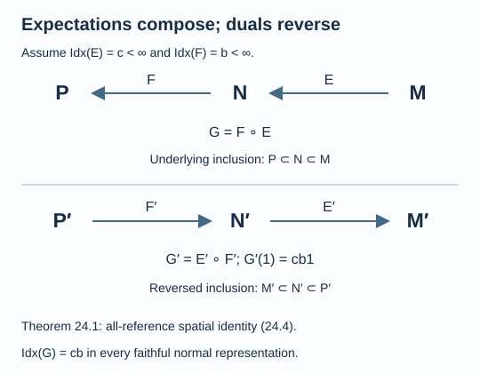

# Index, composition and localized observables

An inclusion of local observable algebras can be a subfactor inclusion even when neither algebra has a trace. A localized endomorphism also gives an inclusion through its range. The expectation index therefore supplies a numerical quantity in both settings. To use it correctly, one must specify the expectation, understand composition, and distinguish its index from the minimum over possible expectations.

We assume [One expectation, one index in every representation](representation-independent-index.md). The composition argument uses the programme proofs of commutant duality, including uniqueness and the all-reference spatial identity, and faithful semifinite scalar composition. Their faithful normal semifinite hypotheses and declared modular prerequisites are retained. We also use the trace-density theorem specified in [Finite bases and positive index](finite-bases-and-positive-index.md). The concrete finite-index duality maps are in [Fusion as a concrete operator algebra](fusion-and-reflection.md). [Longo I] and [Longo II] study applications to statistics of quantum fields. The statements below specify the assumptions needed for an expected local inclusion.

All factors in the general index arguments are sigma-finite. All specified expectations are faithful and normal.

## Two expectations compose, and their duals reverse order

Let

\[
P\subseteq N\subseteq M,\qquad
E:M\to N,\qquad F:N\to P,
\tag{24.1}
\]

and suppose \(c=\operatorname{Idx}(E)<\infty\), \(b=\operatorname{Idx}(F)<\infty\). Their composite \(G=F\circ E\) is a faithful normal conditional expectation onto \(P\): it is a unital completely positive \(P\)-bimodule map fixing \(P\), normal by composition, and faithful since neither positive map can kill a nonzero positive element.

In one faithful normal representation, the dual maps have the types

\[
E':N'\to M',\qquad F':P'\to N'.
\tag{24.2}
\]

Their finite scalar indices make these bounded positive maps on the whole algebras, by Lemma 21.1.

**Theorem 24.1.** The commutant dual and index of the composite are

\[
G'=E'\circ F',\qquad
\operatorname{Idx}(G)=cb.
\tag{24.3}
\]

**Proof.** The proposed dual is faithful, normal and positive, with \(M'\)-bimodularity; its restriction to the target is multiplication by \(cb\). Division by \(cb\) is the composition of the two normalized dual expectations, hence a faithful normal expectation onto \(M'\). In particular it is a faithful normal semifinite operator-valued weight before that division.

Choose any faithful normal semifinite scalar weights \(\alpha\) on \(P\) and \(\beta\) on \(M'\), and put \(\eta=\beta\circ E'\). Scalar composition makes \(\eta\) faithful normal semifinite on \(N'\). First use the spatial identity for \(F'\), then the one for \(E'\):

\[
\frac{d\alpha}{d(\beta\circ E'\circ F')}
=\frac{d(\alpha\circ F)}{d\eta}
=\frac{d(\alpha\circ F\circ E)}{d\beta}.
\tag{24.4}
\]

The scalar numerator \(\alpha\circ F\) is also faithful normal semifinite by the same composition theorem. Thus every weight and derivative in (24.4) has the required type and domain. The identity holds for all scalar references. Uniqueness of the commutant dual gives the first equality in (24.3). Finally

\[
G'(1)=E'(F'(1))=E'(b1)=bc1.
\]

Theorem 22.2 makes this the representation-independent index. \(\square\)

*Figure 24.1. The upper maps remove one inclusion level in the order \(E\), then \(F\). On commutants the corresponding order is \(F'\), then \(E'\). Equation (24.4) verifies this order through the full spatial identity. [Editable figure source](figures/index-composition.py).*

**Lemma 24.2.** An isomorphism of expected inclusions preserves the index.

**Proof.** Suppose \(\gamma:M\to\widetilde M\) is a normal *-isomorphism carrying \(N\) onto \(\widetilde N\), and \(\widetilde E=\gamma E\gamma^{-1}\). Choose a faithful normal state \(\psi\) on \(M\) and its transported state on \(\widetilde M\). The GNS map

\[
\Lambda_\psi(x)\longmapsto
\Lambda_{\psi\circ\gamma^{-1}}(\gamma(x))
\]

is a unitary intertwining both represented factors. Unitary transport of the spatial identity identifies the transported commutant dual, preserving its identity scalar. Theorem 22.2 then removes the choice of these GNS representations. \(\square\)

For normal unital endomorphisms \(\rho,\sigma\) of a factor \(M\), suppose \(E_\rho:M\to\rho(M)\) and \(E_\sigma:M\to\sigma(M)\) have finite index. Their kernels are ultraweakly closed ideals, and unitality in a factor makes them faithful. Thus \(\rho\) is an isomorphism onto its von Neumann range. Transporting \(E_\sigma\) by \(\rho\) gives an expectation from \(\rho(M)\) onto \(\rho\sigma(M)\), with index \(\operatorname{Idx}(E_\sigma)\). Theorem 24.1 yields

\[
\operatorname{Idx}
\bigl((\rho E_\sigma\rho^{-1})\circ E_\rho\bigr)
=\operatorname{Idx}(E_\rho)\operatorname{Idx}(E_\sigma).
\tag{24.5}
\]

This formula concerns the specified composite expectation. It does not assert that minimizing expectations compose to a minimizing expectation.

## When the expectation is forced

**Proposition 24.3.** An irreducible II₁ inclusion \(N\subseteq M\) has only one normal conditional expectation, its trace-preserving expectation. Hence its minimum expectation index is its Jones index.

**Proof.** Let \(F:M\to N\) be any normal conditional expectation and let \(\omega=\tau_N\circ F\). Its trace density is a positive affiliated \(h\in L^1(M,\tau_M)\), with \(\tau_M(h)=1\) and \(\omega(x)=\tau_M(hx)\). Bimodularity and traciality on \(N\) give \(\omega(uxu^*)=\omega(x)\) for every unitary \(u\in N\). Uniqueness of the density implies \(uhu^*=h\).

All spectral projections of \(h\) therefore lie in \(N'\cap M=\mathbb C\). The spectral theorem makes \(h\) scalar, and its trace normalization gives \(h=1\). Thus \(\tau_N F=\tau_M\). For \(n\in N\), bimodularity now gives

\[
\tau_N(n^*F(x))=\tau_M(n^*x).
\]

The trace-pairing characterization uniquely identifies \(F\) with the trace-preserving expectation. It is faithful. Theorem 21.4 identifies its index with \([M:N]\), proving the last assertion. \(\square\)

For any expected factor inclusion define

\[
I_{\min}(N\subseteq M)
=\inf_E\operatorname{Idx}(E),\qquad
d_{\min}(N\subseteq M)=\sqrt{I_{\min}(N\subseteq M)},
\tag{24.6}
\]

where the infimum is over all faithful normal conditional expectations onto \(N\). These quantities are representation-independent by Theorem 22.2 and invariant under pair isomorphism by Lemma 24.2.

**Corollary 24.4.** If \(I_{\min}<4\), the infimum is attained and

\[
d_{\min}=2\cos(\pi/r)\quad\text{for some }r\geq3.
\tag{24.7}
\]

**Proof.** Choose \(a\) with \(I_{\min}<a<4\). There is an expectation of index below \(a\). Theorem 22.5 puts all such indices in the discrete sequence \(4\cos^2(\pi/r)\). That sequence increases to four, so only finitely many of its terms lie below \(a\). The nonempty set of realized terms below \(a\) has a smallest member. Every other expectation has index at least \(a\) or one of those realized terms; therefore that smallest member is the full infimum. Taking its square root proves (24.7). \(\square\)

This argument proves attainment below four without assuming an existence theorem for minimizing expectations at every finite index.

## The local-observable interpretation

A net of observable algebras assigns a von Neumann algebra \(\mathcal A(O)\) to each region, with inclusion under containment and commutation for spacelike separated regions. A localized endomorphism \(\rho\) acts as the identity on observables in the spacelike complement of a chosen localization region. Suppose its restriction to a sufficiently large local factor \(M=\mathcal A(O)\) is faithful and normal, has range in \(M\), and has a faithful normal expected range. Then

\[
\rho(M)\subseteq M
\tag{24.8}
\]

is precisely a factor inclusion to which the preceding results apply. These are hypotheses on the local restriction; locality alone does not supply an expectation.

For the expected range (24.8), the quantity proved here is \(d_{\min}=\sqrt{I_{\min}}\). Corollary 24.4 restricts it below two to (24.7). [Longo I] studies the relation between subfactor index and statistics of quantum fields; [Longo II] develops the connection with correspondences and braid group statistics. These references explain the field-theory context. Applying their results to a particular net requires its additional localization and sector hypotheses.

The square root is already visible in finite tracial duality. The maps \(R,\overline R\) of Theorem 6.5 satisfy

\[
R^*R=\overline R^*\overline R=\sqrt{[M:N]}\,1,
\qquad
\|R\|=\|\overline R\|=[M:N]^{1/4}.
\tag{24.9}
\]

Thus the dimension-scale scalar in those balanced conjugate equations is the square root of the index; it is not the operator norm itself. Fusion represents composition of channels through the maps of lesson 19. In the specified-expectation formulation, (24.5) makes the square-root quantity multiplicative.

For a concrete noninteger example, the \(r=5\) path-tail inclusion has index

\[
d=4\cos^2(\pi/5)=\frac{3+\sqrt5}{2}.
\]

Its index is below four, so Theorem 2.5 makes it irreducible. Proposition 24.3 gives

\[
d_{\min}=\sqrt d=\frac{1+\sqrt5}{2}.
\tag{24.10}
\]

The shift \(e_i\mapsto e_{i+1}\) of Proposition 11.2 is a normal endomorphism of its hyperfinite factor with precisely that range. This supplies an exact algebraic endomorphism example for the dimension calculation; identifying it with a particular quantum field theory requires a separate net construction.

## Exercises

**Exercise 24.1 — introductory.** If two specified expectations have indices \(2\) and \(3\), what are the index and square-root index of their composite?

**Solution.** Theorem 24.1 gives index \(6\), and its square root is \(\sqrt6=\sqrt2\sqrt3\). This does not assert that the composite minimizes index among all expectations on the composite inclusion.

**Exercise 24.2 — intermediate.** Minimize the expectation index for \(\mathbb C1\subseteq M_k\).

**Solution.** A faithful state has density eigenvalues \(r_i>0\) summing to one. Formula (21.14) gives \(c=\sum_i r_i^{-1}\). Cauchy–Schwarz gives

\[
k^2=\left(\sum_i\sqrt{r_i}\,r_i^{-1/2}\right)^2
\leq\left(\sum_i r_i\right)\left(\sum_i r_i^{-1}\right)=c.
\]

Equality requires all \(r_i\) equal, hence the tracial density \(k^{-1}1\). Therefore \(I_{\min}=k^2\) and \(d_{\min}=k\). Other faithful states can have larger index.

**Exercise 24.3 — intermediate.** In the example (24.10), compute the norm of each balanced coevaluation map in (24.9).

**Solution.** Writing \(\varphi=(1+\sqrt5)/2\), the index is \(\varphi^2\). Each squared norm is \(\varphi\), while each norm is \(\sqrt\varphi\). These three quantities—index, dimension-scale scalar and map norm—have different exponents.

**Exercise 24.4 — advanced.** If a localized endomorphism is replaced by \(\widetilde\rho=\operatorname{Ad}(u)\circ\rho\), show that its local minimum index is preserved whenever \(u\in M\).

**Solution.** The inner automorphism carries \(\rho(M)\) onto \(\widetilde\rho(M)\). It bijects their faithful normal expectations by \(E\mapsto\operatorname{Ad}(u)E\operatorname{Ad}(u^*)\). Lemma 24.2 preserves each index under this bijection; taking infima preserves the minimum-index quantity. No existence of a minimizing expectation is needed for this argument.

## References

- Roberto Longo, [*Index of subfactors and statistics of quantum fields. I*](https://doi.org/10.1007/BF02125124), Communications in Mathematical Physics 126 (1989), 217–247.
- Roberto Longo, [*Index of subfactors and statistics of quantum fields. II: Correspondences, braid group statistics and Jones polynomial*](https://doi.org/10.1007/BF02473354), Communications in Mathematical Physics 130 (1990), 285–309.
- Hideki Kosaki, [*Extension of Jones' theory on index to arbitrary factors*](https://doi.org/10.1016/0022-1236(86)90085-6), Journal of Functional Analysis 66 (1986), 123–140.

*Written by GPT-6.1 Sol (OpenAI), Ultra reasoning effort, September 2026. Self-checked by the writing AI. Public domain (CC0).*
