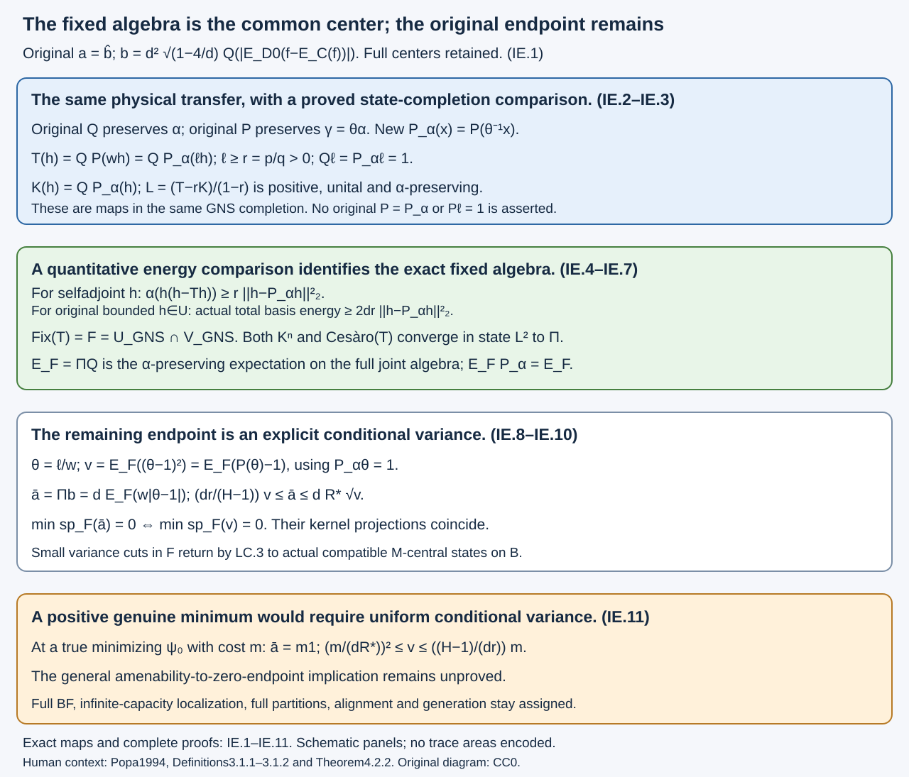

# The invariant cost and common-center variance

This lesson identifies the LC averaging fixed algebra exactly, proves a quantitative comparison with the corrected alternating-center operator, and replaces its remaining spectral endpoint by a conditional variance of the original ratio. It does **not** prove that general amenability makes that endpoint zero. The original physical expectation, full joint centers, exact cost coefficient, Jones-ideal branch and every original common-support outcome are retained.

## Original data and the representation comparison

Let the actual proper finite-index II₁ inclusion be \(N\subset M\), with actual core \(S\subset R\), \(d=[M:N]\), \(e=e_R^M\), \(A=\langle N,e\rangle\subset B=\langle M,e\rangle\), and the actual canonical expectation \(E:B\to A\). Put \(U=Z(S)\), \(V=Z(R)\), \(D_0=U\vee V\), with inherited finite-tracial expectations \(Q:D_0\to U\), \(P:D_0\to V\). Center hats are the exact normal faithful corner identification of 52.2 and 68.2, not physical left multiplication by the same functions.

At \(d=4\), T.4 already proves the original cost zero. For \(d>4\), retain the actual atom \(f\) of the actual cup-tail relative commutant, the actual \(C=N'\cap M\), and
\[
\begin{gathered}
p=(1-\sqrt{1-4/d})/2,\quad q=1-p,\quad
r=p/q,\quad R_*=q/p,\quad H=R_*/r,\\
k_F=(q/p)f+(p/q)(1-f),\quad
w=E_{D_0}(k_F),\quad \ell=E_{D_0}(E_C(k_F)),\\
r1\leq w,\ell\leq R_*1,\quad
Q(w)=P(w)=Q(\ell)=1,\\
\theta=\ell/w,\quad H^{-1}1\leq\theta\leq H1,\\
b=dQ(|w-\ell|)
=d^2\sqrt{1-4/d}\,Q(|E_{D_0}(f-E_C(f))|),\quad a=\widehat b.
\end{gathered}
\tag{IE.1}
\]
In particular \(0<r<1<R_*\). No original \(P(\ell)=1\) is added.

Fix one actual compatible \(M\)-central state \(\psi\) on \(B\), with \(\psi|_M=\tau\). Its joint-center functional is \(\alpha=\nu Q\), where \(\nu(u)=\psi(\widehat u)\); SC.2 gives \(\gamma=\alpha P=\theta\alpha\). It need not be normal relative to the inherited trace. In the remaining pure branch \(\psi(J_e)=0\), for the entire actual norm-closed Jones ideal \(J_e=\overline{\operatorname{span}(BeB)}^{\|\cdot\|}\), by SC.3.

Use precisely AS.6's cyclic abelian GNS representation of the full \(D_0\):
\[
\mathscr D=\pi_\alpha(D_0)'',\qquad
\mathscr U=\pi_\alpha(U)'',\qquad
\mathscr V=\pi_\alpha(V)''.
\]
Here \(\alpha\) is faithful and normal on \(\mathscr D\). Original functions and expectations below mean their established images and extensions. The original \(Q:\mathscr D\to\mathscr U\) preserves \(\alpha\); original \(P:\mathscr D\to\mathscr V\) preserves \(\gamma\). The **new**, normal \(\alpha\)-preserving expectation onto \(\mathscr V\) is
\[
\begin{gathered}
P_\alpha(x)=P(\theta^{-1}x),\quad
P(\theta^{-1})=1,\quad P_\alpha(\theta)=1,\\
P_\alpha(\ell)=1,\quad
P_\alpha(\ell x)=P(wx),\qquad x\in\mathscr D.
\end{gathered}
\tag{IE.2}
\]
The third identity is unitality of \(P\); the others are AS.16. All identities involving this corrected map are in this state completion. They do not identify original \(P\) with \(P_\alpha\), make the original state normal, or make original \(P(\ell)\) equal one.

For completeness, the LC representation of the smaller center is compared by the isometry
\(u\Omega_{\nu}\mapsto\pi_\alpha(u)\Omega_\alpha\), whose target is the closed cyclic \(\mathscr U\)-subspace of \(L^2(\mathscr D,\alpha)\). Its dense ranges and preservation of squared norms make it unitary onto that subspace. It intertwines original smaller-center multiplication. The normal faithful trace on \(\mathscr U\), and its separating cyclic vector on that subspace, identify its von Neumann closure with LC's smaller-center algebra by the resulting normal trace-preserving *-isomorphism. Thus LC's \(T\) and \(\Pi\) can be used on this exact \(\mathscr U\). No claim about an intersection before GNS completion follows from an intersection after it.

## A coercive comparison determines the fixed algebra

Set
\[
\begin{gathered}
T:\mathscr U\to\mathscr U,\quad
T(h)=Q(P(wh))=Q(P_\alpha(\ell h)),\\
K:\mathscr U\to\mathscr U,\quad K(h)=Q(P_\alpha(h)),\\
\mathscr F=\mathscr U\cap\mathscr V.
\end{gathered}
\tag{IE.3}
\]
\(T\) is the extension of the original physical LC transfer, not a substituted operator. Both \(T\) and \(K\) are normal, positive, unital and \(\alpha\)-preserving. For \(K\) this follows from the two \(\alpha\)-preserving expectations. For \(T\), LC.3 proves preservation; equivalently, in this completion,
\(\alpha(QP_\alpha(\ell h))=\alpha(\ell h)=\alpha(hQ\ell)=\alpha(h)\) for \(h\in\mathscr U\).

**Theorem IE.1 — exact fixed algebra and basis-energy lower bound.** The bounded fixed algebra of the actual \(T\) is exactly \(\mathscr F\). For every selfadjoint \(h\in\mathscr U\),
\[
\begin{gathered}
\alpha(h(h-Th))\geq
r\,\|h-P_\alpha h\|_{2,\alpha}^{2},\\
\sum_i\psi([\widehat h,a_i]^*[\widehat h,a_i])
\geq 2dr\,\|h-P_\alpha h\|_{2,\alpha}^{2}.
\end{gathered}
\tag{IE.4}
\]
The second line is stated for original bounded \(h\in U\), with its actual center lift \(\widehat h\) and actual common basis. Its first line extends to every selfadjoint vector of the real subspace of \(L^2(\mathscr U,\alpha)\) as a real quadratic-form inequality.

**Proof.** For \(h\geq0\), \(\ell\geq r1\) implies \(Th\geq rKh\), because all products are in the abelian joint algebra. Hence
\[
L=(T-rK)/(1-r):\mathscr U\to\mathscr U
\tag{IE.5}
\]
is positive, unital, normal and \(\alpha\)-preserving. Schwarz and preservation make each of \(T,K,L\) an \(L^2(\alpha)\) contraction. For selfadjoint \(h\), Cauchy–Schwarz gives \(\alpha(hLh)\leq\|h\|_2^2\), so
\[
\begin{aligned}
\alpha(h(h-Th))
&=r\alpha(h(h-Kh))+(1-r)\alpha(h(h-Lh))\\
&\geq r\alpha(h(h-Kh))
=r\bigl(\|h\|_2^2-\|P_\alpha h\|_2^2\bigr)\\
&=r\|h-P_\alpha h\|_2^2.
\end{aligned}
\]
Expectation adjointness gives the penultimate equality; \(P_\alpha\) is an orthogonal projection in the same trace Hilbert space. Density and continuity give the selfadjoint real \(L^2\) extension. LC.4's exact actual total-basis identity gives the second line of (IE.4), including its coefficient.

If \(Th=h\), the first line of (IE.4) makes \(P_\alpha h=h\). For bounded selfadjoint \(h\in\mathscr U\), this means \(h\in\mathscr V\); real and imaginary parts treat every fixed bounded element. Conversely, if \(h\in\mathscr U\cap\mathscr V\), bimodularity and (IE.2) give
\(Th=Q(hP_\alpha\ell)=Qh=h\). This proves the exact fixed algebra. The same reasoning on Hilbert-space extensions gives the common \(L^2\) fixed space. In the converse direction, multiplication by bounded \(\ell\) and the expectations are \(L^2\)-continuous, so their bimodular identities extend from bounded \(\mathscr V\)-vectors to every \(L^2(\mathscr V,\alpha)\) vector. \(\square\)

This establishes only that low total basis energy makes a smaller-center weight close to the **corrected** larger-center expectation. It does not replace that expectation with the original one.

**Theorem IE.2 — two explicit computations of the same projection.** LC's \(\Pi:\mathscr U\to\mathscr F\) is the normal \(\alpha\)-preserving expectation onto the exact intersection above. On bounded inputs,
\[
\Pi h=\lim_{n\to\infty}K^n h
=\lim_{n\to\infty}\frac1n\sum_{j=0}^{n-1}T^j h
\quad\text{in }L^2(\alpha).
\tag{IE.6}
\]
The extension
\[
E_{\mathscr F}:\mathscr D\to\mathscr F,\qquad
E_{\mathscr F}=\Pi Q,\qquad
E_{\mathscr F}Q=E_{\mathscr F}P_\alpha=E_{\mathscr F}
\tag{IE.7}
\]
is the normal \(\alpha\)-preserving conditional expectation on the full joint algebra.

**Proof.** On \(L^2(\mathscr U,\alpha)\), \(K\) is selfadjoint and positive: for \(h,k\in\mathscr U\),
\(\langle h,Kk\rangle=\langle P_\alpha h,P_\alpha k\rangle\).
It is a contraction. Its fixed space consists exactly of the common Hilbert-space vectors, since equality of \(\|P_\alpha h\|_2\leq\|h\|_2\) forces \(P_\alpha h=h\), and the converse is immediate. The same fixed space for \(T\) was proved in IE.1.

The spectral calculus for the positive contraction \(K\) gives \(K^n\) converging strongly to its fixed-space orthogonal projection: \(t^n\to1_{\{1\}}(t)\) on \([0,1]\), with bound one. LC.2 already proves convergence of the \(T\) averages to the orthogonal projection on that space. Thus their limits coincide. Bounded inputs have uniformly bounded images under both procedures; the proved bounded \(L^2\)-limit argument of LC.2 returns their limit to \(\mathscr F\).

The composite \(\Pi Q\) is positive, unital, normal, \(\mathscr F\)-bimodular, fixes \(\mathscr F\), and preserves \(\alpha\), so it is the asserted expectation. Its Hilbert-space action is the orthogonal projection onto \(L^2(\mathscr F,\alpha)\). Since \(\mathscr F\) is contained in each of \(\mathscr U,\mathscr V\), projection adjointness proves both tower identities in (IE.7). \(\square\)

## The remaining endpoint is an explicit common-center variance

Define
\[
\begin{gathered}
v_\psi=E_{\mathscr F}((\theta-1)^2)\in\mathscr F_+,\\
\bar a_\psi=\Pi(b)
=dE_{\mathscr F}(|w-\ell|)
=dE_{\mathscr F}(w|\theta-1|).
\end{gathered}
\tag{IE.8}
\]
The notation \(\Pi(b)\) denotes the image of the actual smaller-center cost, exactly as in LC.7. It does not change the cost \(a\) on the actual \(B\).

**Theorem IE.3 — exact variance and bounds.** In this state completion,
\[
\begin{gathered}
v_\psi
=E_{\mathscr F}(P_\alpha(\theta^2)-1)
=E_{\mathscr F}(P(\theta)-1),\\
P(\theta)-1=P_\alpha(\theta^2)-1\geq0,\\
\frac{dr}{H-1}\,v_\psi
\leq\bar a_\psi
\leq dR_*\sqrt{v_\psi}.
\end{gathered}
\tag{IE.9}
\]
Consequently \(\min\operatorname{sp}_{\mathscr F}(\bar a_\psi)=0\) if and only if \(\min\operatorname{sp}_{\mathscr F}(v_\psi)=0\). Their kernel projections coincide.

**Proof.** From \(P_\alpha\theta=1\) and expectation adjointness,
\(P_\alpha((\theta-1)^2)=P_\alpha(\theta^2)-1\).
Using (IE.2), \(P_\alpha(\theta^2)=P(\theta)\). Schwarz gives this operator at least one. Apply the tower identity (IE.7) to obtain the first two lines of (IE.9). Positivity here is positivity of the GNS image. It is not an assertion that original \(P(\theta)-1\) was positive before passing to this representation.

Pointwise bounded functional calculus on \([H^{-1},H]\) gives
\((\theta-1)^2\leq(H-1)|\theta-1|\).
Use \(w\geq r1\) and the positive expectation to obtain the lower bound. For the upper bound, \(w\leq R_*1\) and conditional Cauchy–Schwarz give
\(E_{\mathscr F}(w|\theta-1|)\leq R_*E_{\mathscr F}|\theta-1|\leq R_*\sqrt{v_\psi}\).

If \(v_\psi\) is bounded below by \(\delta1>0\), the lower bound makes \(\bar a_\psi\) bounded below by \(dr\delta/(H-1)\). If \(\bar a_\psi\geq\varepsilon1>0\), the upper bound makes \(v_\psi\geq(\varepsilon/(dR_*))^2 1\). These prove the endpoint equivalence. On any projection in the abelian \(\mathscr F\), either operator vanishes exactly when the other does, by the same inequalities; their kernel projections coincide. \(\square\)

**Corollary IE.4 — precise actual-state selection using variance cuts.** If just one available actual compatible state has \(\min\operatorname{sp}_{\mathscr F}(v_\psi)=0\), the original actual \(B\) has one compatible \(M\)-central zero-cost state. For any \(\varepsilon>0\), the nonzero projection
\[
H_\varepsilon=1_{[0,(\varepsilon/(dR_*))^2]}(v_\psi)\in\mathscr F
\tag{IE.10}
\]
has positive faithful new mass and gives, by LC.3's proved return map, an actual compatible state \(\psi_{H_\varepsilon}\) of cost at most \(\varepsilon\). A weak-star cluster state has cost zero. Every selected state and the cluster retain \(J_e\)-annihilation if the starting state does. The bounded return-map approximants and unbounded possible domination constants have exactly LC.3–LC.5's meanings; no normality of the original state and no convergent subsequence are added.

**Corollary IE.5 — a positive global minimum has uniform conditional variance.** Let \(\psi_0\) be an actual minimizer in the full compatible space, or its Jones-ideal-annihilating face, and write \(m=\psi_0(a)\). LC.6 and (IE.9) imply
\[
\begin{gathered}
\bar a_{\psi_0}=m1,\\
\left(\frac{m}{dR_*}\right)^2 1
\leq v_{\psi_0}
\leq\frac{H-1}{dr}\,m1.
\end{gathered}
\tag{IE.11}
\]
A genuine positive minimum therefore requires a strictly positive conditional variance on **every** nonzero common-center component of the minimizing state's completion. The larger-center Jensen defect in (IE.9) computes that variance. The inequalities do not contradict such a positive variance: general amenability has not yet supplied its exclusion.

## Fully solved learner checks

**Exercise IE.1.** At actual index \(d=9/2\), compute the parameters and the exact physical cost coefficient. If an original selfadjoint smaller-center weight has total actual basis energy at most \(9/200\), bound its distance to the corrected larger-center expectation. Is the original \(P\) thereby identified with \(P_\alpha\)?

**Solution.** The parameters are \(p=1/3,q=2/3,r=1/2,R_*=2,H=4\), and \(d^2\sqrt{1-4/d}=27/4\). The coefficient \(2dr\) in (IE.4) is \(9/2\), so
\(\|h-P_\alpha h\|_2^2\leq(9/200)/(9/2)=1/100\), giving distance at most \(1/10\). This uses the same state's normal trace and \(P_\alpha(h)=P(\theta^{-1}h)\). It proves no equality of the two larger-center expectations. At a genuine minimizer of cost \(m\), (IE.11) gives \(m^2/81\leq v\leq4m/3\) as operator inequalities in its common-center algebra.

**Exercise IE.2.** Suppose one available actual state has zero as the lower spectral endpoint of \(v_\psi\). Construct actual states of cost tending to zero and explain the different case in which the variance has a nonzero kernel projection. Why is a low initial \(a\)-cut alone insufficient?

**Solution.** For \(\varepsilon_j\downarrow0\), the projections (IE.10) are nonzero by the definition of the lower spectral endpoint. Their new faithful masses are positive. On each projection (IE.9) bounds \(\bar a_\psi\) by \(\varepsilon_j\), and LC.3 returns its bounded original-center approximants to a state of the **actual** \(B\) with that cost, exact compatibility, exact \(M\)-centrality and physical trace \(\tau\). Weak-star compactness provides a subnet and one zero-cost state. Jones-ideal annihilation is a closed family of bounded tests and passes to it; inherited-center pure singularity is not asserted for the final cluster. If the variance kernel is nonzero, use that kernel as \(H\) directly: (IE.9) also kills \(\bar a\) there, so LC.3 supplies a single dominated zero-cost state. An initial \(a\)-cut controls \(a\) on that cut but does not control \(\Pi a=dE_{\mathscr F}|w-\ell|\). Averaging need not retain its initial spectral support, so the two tests cannot be interchanged.

## Sources, exact remaining implication and original scope

Human source context is Sorin Popa, *Classification of amenable subfactors of type II*, Acta Mathematica 172 (1994), 163–255, [source paper](https://doi.org/10.1007/BF02392646). Definitions 3.1.1–3.1.2 and Proposition 3.2.2, pp. 203–205, give the compatible-state context; Theorems 4.2.1–4.2.2 and Corollary 4.2.3, pp. 211–216, give the finite projection, core change and common-support context.

Earlier complete arguments used here are [LC.1–LC.12](averaging-compatible-states-and-ergodic-cost.md), AS.16, [SC.1–SC.3](singular-hypertraces-jones-ideals-and-entropy.md) and [T.4/T.7–T.10](cup-tail-commutants-and-central-comparison.md), together with the finite-trace Hilbert-space expectation and bounded spectral calculus prerequisites.

The remaining original implication is now: under the original general relative-amenability hypotheses, find one actual compatible state with zero lower endpoint for the **common-center conditional variance** in (IE.9), or prove that the uniformly positive variance required by (IE.11) is impossible at a genuine minimizing state. Neither normality in this new completion, the fixed-algebra identification, the two conditional marginals, nor Jensen's nonnegative defect proves its vanishing. No normality on the original centers, original \(P=P_\alpha\), original \(P(\ell)=1\), or original-density identity is inferred.

All original common-support BF, both infinite-capacity localization, near-one support and the second central local form, unrestricted full finite partition, common ordinary stage and preserved-prefix alignment, generation, finite-pair/bicommutant/marked-cup comparison, represented/opposite models and canonical traces, arbitrary-depth reconstruction, clauses, notes, exercises and source/prerequisite obligations stay assigned. This conditional variance criterion does not replace them or assert their completion. No factor-core, extremality, finite-depth, separability or inherited-center normality hypothesis is added.

The diagram shows the actual proof maps and the remaining endpoint. Its panels are schematic; areas do not encode traces.

Original independently written programme text and SVG: public domain, CC0 1.0.

Figure IE.1. The first panel keeps the original physical transfer and the exact corrected expectation in one state completion. The second proves its fixed algebra and energy bound. The third gives the exact common-center variance, original-larger-map Jensen defect and endpoint equivalence; the last states the still unproved exclusion of a positive true minimum. Complete proofs and constants: (IE.1)–(IE.11). All shapes are schematic, with no trace areas encoded. Human context: Popa1994, Definitions3.1.1–3.1.2 and Theorem4.2.2, cited above. [Editable figure source](figures/invariant-cost-conditional-variance-v4.py).
