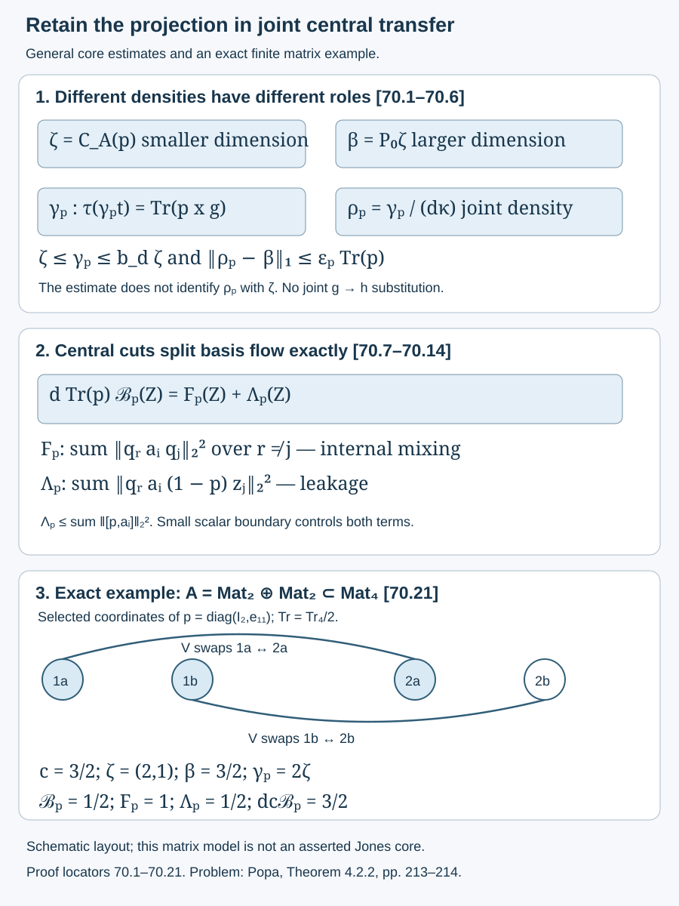

# The full joint transfer retains the projection

[Lesson 68](core-central-transition-bounds.md) derives weighted stationarity from finite-basis commutators. [Lesson 69](stationarity-and-joint-localization.md) proves that its numerical size and the center transition bounds alone do not control joint localization. We now retain the actual finite-trace projection in the full joint trace pairing. This gives a positive joint density close to the larger central dimension and an exact formula for the extra cost of central cuts. A further scalar boundary hypothesis gives a complete conditional integer-rounding result.

The new boundary hypothesis is not derived from unrestricted relative Følner. Neither general core rounding nor the general bicommutant theorem is claimed complete. The human source for the problem is Sorin Popa, *Classification of amenable subfactors of type II*, [DOI 10.1007/BF02392646](https://doi.org/10.1007/BF02392646), Theorem 4.2.2, printed pp. 213–214. The arguments and diagram below are original.

We use the actual core pair \(S\subset R\), canonical algebras \(A=\langle N,e\rangle\subset B=\langle M,e\rangle\), and full finite corner \(e=e_R^M\) from [52.1–52.2](canonical-core-traces-and-integer-rounding.md). The normalized common basis and joint-center identification are 68.1–68.3. The finite trace ideal, normal positive \(L^1\) density, Cauchy–Schwarz and type II central prescription retain the exact programme providers of [52](canonical-core-traces-and-integer-rounding.md) and [58](larger-factor-central-balancing.md). The commutator trace estimate is (58.11). We give every additional argument here. No factoriality of either core algebra, extremality, or ambient separability is assumed.

## A positive joint density depends on both \(p\) and \(g\)

Use the common basis \(a_1=1,a_2,\ldots,a_t\), where

\[
\begin{gathered}
d=[M:N]>1,\quad t=\lceil d\rceil,\\
g=\sum_i a_i^*a_i,\quad h=E_A(g),\\
1\leq g\leq b_d1,\\
b_d=1+d(t-1),\\
\kappa=d^{-1}E_{D_0}(g),\\
D_0=Z(S)\vee Z(R),\\
D=Z(A)\vee Z(B).
\end{gathered}
\tag{70.1}
\]

The lift \(x\in D\) of \(t_0\in D_0\) satisfies \(exe=t_0e\), commutes with \(A\), and has the same norm. For a nonzero finite-trace projection \(p\in A\), put

\[
\begin{gathered}
c=\operatorname{Tr}(p),\\
\zeta=C_A(p)\in L^1(Z(S),\tau)_+,\\
\beta=P_0\zeta\in L^1(Z(R),\tau)_+,\\
\delta_y=\|[p,y]\|_{2,\operatorname{Tr}}/\sqrt c,\\
\epsilon_p=\sqrt2\sum_i\|a_i\|\delta_{a_i}.
\end{gathered}
\tag{70.2}
\]

As proved in (68.12), \(\operatorname{Tr}(px)=\tau(\zeta t_0)\) on the full joint algebra; \(\beta\) is unweighted.

**Proposition 70.1 — the full joint transfer estimate.** There is a unique positive \(\gamma_p\in L^1(D_0,\tau)\) such that, for every bounded \(t_0\in D_0\),

\[
\begin{gathered}
\tau(\gamma_p t_0)=\operatorname{Tr}(pxg),\\
\zeta\leq\gamma_p\leq b_d\zeta,\\
\|\gamma_p-d\kappa\beta\|_1\leq\epsilon_p c.
\end{gathered}
\tag{70.3}
\]

Thus \(\rho_p=\gamma_p/(d\kappa)\) is a well-defined positive joint density, and

\[
\begin{gathered}
\|\rho_p-\beta\|_1\leq\epsilon_p c,\\
\|(\zeta-b_d\beta)_+\|_1\leq\epsilon_p c,\\
\|(\beta-b_d\zeta)_+\|_1\leq\epsilon_p c.
\end{gathered}
\tag{70.4}
\]

**Proof.** Since \(x\) commutes with \(p\), the functional in (70.3) is also \(\operatorname{Tr}(pgp\,x)\). The operator \(pgp\) is positive and trace-class, so its restriction to \(D\), followed by the faithful corner identification, is a finite normal positive functional. The declared finite abelian \(L^1\) representation supplies \(\gamma_p\). The inequalities \(p\leq pgp\leq b_dp\) and the exact joint density of \(p\) give its two order bounds.

The transfer in 68.2 has corner label \(dP_\kappa(t_0)\), where \(P_\kappa(t_0)=E_{Z(R)}(\kappa t_0)\). Its pairing with \(p\), using the larger dimension \(\beta\), is \(d\tau(\kappa\beta t_0)\). All following products are trace-class. Cyclicity and \([p,x]=0\) give

\[
\begin{gathered}
d\tau(\kappa\beta t_0)-\tau(\gamma_p t_0)\\
=\sum_i\operatorname{Tr}([a_i^*,p]a_i x),\\
\left|d\tau(\kappa\beta t_0)-\tau(\gamma_p t_0)\right|\\
\leq\epsilon_p c\|t_0\|.
\end{gathered}
\tag{70.5}
\]

The last estimate is (58.11): \(\|[a_i^*,p]\|_1\leq\sqrt{2c}\|[a_i^*,p]\|_2\), followed by multiplication by bounded \(a_i x\). Supremizing over the full joint unit ball gives (70.3).

Since \(d\kappa\geq1\), division proves the first line of (70.4). For the other lines put \(v=d\kappa\beta\). The positive inequalities \(\gamma_p\geq\zeta\), \(\gamma_p\leq b_d\zeta\), and \(\beta\leq v\leq b_d\beta\) imply

\[
\begin{gathered}
(\zeta-b_d\beta)_+\leq(\gamma_p-v)_+,\\
(\beta-b_d\zeta)_+\leq(v-\gamma_p)_+.
\end{gathered}
\tag{70.6}
\]

Their integrals are bounded by \(\|\gamma_p-v\|_1\). \(\square\)

The first estimate in (70.4) concerns the joint density \(\rho_p\). It does not identify it with the smaller central dimension \(\zeta\). For \(x\in Z(A)\), \(px\in A\) allows \(g\) to be replaced by \(E_A(g)=h\) under the trace. For a general joint \(x\), that replacement is not valid. No such replacement was used above.

## Central cuts have an exact basis-flow decomposition

Let \(z_1,\ldots,z_l\in Z(A)\) be an orthogonal partition of 1. Let \(s_j\in Z(S)\) be their corner labels and put \(q_j=pz_j\). Zero \(q_j\)'s are permitted. Define

\[
\begin{gathered}
\mathcal B_p(Z)=\frac1c
\sum_{r\ne j}\tau(\zeta s_rP_\kappa(s_j)),\\
F_p(Z)=\sum_{i,r\ne j}\|q_r a_i q_j\|_2^2,\\
\Lambda_p(Z)=
\sum_{i,r\ne j}\|q_r a_i(1-p)z_j\|_2^2.
\end{gathered}
\tag{70.7}
\]

Here \(\mathcal B_p(Z)\) is a dimensionless scalar boundary quantity, not the larger algebra \(B\). It is nonnegative and at most 1, since \(P_\kappa\) is positive and unital and \(\tau(\zeta)=c\).

**Proposition 70.2 — internal mixing and leakage are different terms.**

\[
\begin{gathered}
dc\,\mathcal B_p(Z)=F_p(Z)+\Lambda_p(Z),\\
0\leq\Lambda_p(Z)\leq c\sum_i\delta_{a_i}^2.
\end{gathered}
\tag{70.8}
\]

**Proof.** For each distinct \(r,j\), transfer centrality and the joint dimension formula give

\[
\begin{gathered}
d\tau(\zeta s_rP_\kappa(s_j))
=\operatorname{Tr}(q_r\mathcal I(z_j))\\
=\sum_i\|q_r a_i z_j\|_2^2.
\end{gathered}
\tag{70.9}
\]

Indeed \(q_r\) is a finite projection and \(\mathcal I(z_j)=\sum_i a_i z_j a_i^*\). Split the right support as \(z_j=q_j+(1-p)z_j\). The two support projections are orthogonal, so the squared norm splits into the two terms in (70.7). Sum over \(r\ne j\).

For each fixed \(i\), all operators \(q_r a_i(1-p)z_j\) are orthogonal in \(L^2(B,\operatorname{Tr})\), by their orthogonal left \(q_r\) and right \(z_j\) supports. Summing over every \(r,j\), including the diagonal, gives \(\|p a_i(1-p)\|_2^2\). Therefore the off-diagonal sum is at most this norm squared. The two off-diagonal \(p\) blocks of \([p,a_i]\) are orthogonal, so \(\|p a_i(1-p)\|_2^2\leq\|[p,a_i]\|_2^2\). This proves (70.8). \(\square\)

Small finite-basis commutators control the leakage \(\Lambda_p\). They do not, from this identity alone, control the internal term \(F_p\): the scalar boundary term remains on the left.

## The common basis controls every target's compressed mixing

For a target unitary \(u\in M\), use the exact right expansion

\[
\begin{gathered}
u=\sum_i a_i n_i,\\
n_i=E_N(a_i^*u)\in N,\\
\|n_i\|\leq\|a_i\|\leq\sqrt d,\\
\operatorname{Mix}_u(p,Z)=
\sum_{r\ne j}\|q_r u q_j\|_2^2.
\end{gathered}
\tag{70.10}
\]

**Theorem 70.3 — a scalar boundary bounds operator mixing.**

\[
\begin{gathered}
\frac{\operatorname{Mix}_u(p,Z)}c\\
\leq2td^2\mathcal B_p(Z)
+2td\sum_i\delta_{n_i}^2.
\end{gathered}
\tag{70.11}
\]

**Proof.** Since the \(z_j\)'s commute with \(N\), the right expansion and \(n_ip=pn_i+[n_i,p]\) give

\[
\begin{gathered}
q_r u q_j
=\sum_i q_r a_iq_jn_i\\
\quad+\sum_i q_r a_i[n_i,p]z_j.
\end{gathered}
\tag{70.12}
\]

For \(2t\) vectors, Cauchy–Schwarz bounds the squared norm of their sum by \(2t\) times the sum of their squared norms. Sum over the off-diagonal \(r,j\). The first family contributes at most \(\sum_i\|n_i\|^2\sum_{r\ne j}\|q_r a_iq_j\|_2^2\leq dF_p(Z)\).

For each fixed \(i\), the second family has orthogonal left \(q_r\) and right \(z_j\) supports. Its off-diagonal sum is at most \(\|pa_i[n_i,p]\|_2^2\leq d\|[n_i,p]\|_2^2\). Thus the total is at most \(2tdF_p(Z)+2tdc\sum_i\delta_{n_i}^2\). Use \(F_p(Z)\leq dc\mathcal B_p(Z)\) from 70.2 and divide by \(c\). \(\square\)

For target unitaries \(u_1,\ldots,u_m\), use \(n_{ia}=E_N(a_i^*u_a)\). The central-cut identity is also proved directly here. Trace cyclicity gives \(\|uqu^*-q\|_2^2=2\operatorname{Tr}(q)-2\|quq\|_2^2\). Orthogonality of the \(q_r u q_j\) blocks and \(\sum q_j=p\) give

\[
\begin{gathered}
\sum_j\sum_a\|[u_a,q_j]\|_2^2\\
=\sum_a\|[u_a,p]\|_2^2\\
\quad+2\sum_a\operatorname{Mix}_{u_a}(p,Z).
\end{gathered}
\tag{70.13}
\]

Combining 70.3 for all targets, before selecting a bin, yields

\[
\begin{gathered}
\frac1c\sum_j\sum_a\|[u_a,q_j]\|_2^2\\
\leq\sum_a\delta_{u_a}^2
+4mtd^2\mathcal B_p(Z)\\
\quad+4td\sum_{i,a}\delta_{n_{ia}}^2.
\end{gathered}
\tag{70.14}
\]

## A complete conditional logarithmic rounding theorem

**Theorem 70.4.** Suppose \(m\geq1\) and \(\alpha>0\), and the smaller dimension of \(p\) has

\[
\begin{gathered}
K\leq\zeta\leq H<\infty\\
\hbox{on its support},
\end{gathered}
\tag{70.15}
\]

where \(K\geq1\) is an integer. For some \(w>0\), partition that support by half-open logarithmic bins \([\ell,e^w\ell)\), with \(\ell=e^{\theta+jw}\), and add its complement as one more central cell. This is a finite partition \(Z\). Suppose

\[
\begin{gathered}
\sum_a\delta_{u_a}^2
+4td\sum_{i,a}\delta_{n_{ia}}^2\\
+4mtd^2\mathcal B_p(Z)<\alpha^2.
\end{gathered}
\tag{70.16}
\]

Then there are a nonzero \(z\in Z(A)\), an integer \(k\geq K\), and a projection \(q\in A\) with \(C_A(q)=kz\), which splits into \(k\) orthogonal projections equivalent to \(ez\), such that every target satisfies

\[
\begin{gathered}
\frac{\|[u_a,q]\|_2}{\sqrt{\operatorname{Tr}(q)}}\\
<\alpha\sqrt{1+r}+2\sqrt r,\\
0\leq r<e^w-1+\frac{e^w}{K}.
\end{gathered}
\tag{70.17}
\]

**Proof.** By (70.14)–(70.16) the total localized squared defect is less than \(\alpha^2c\). The traces of the \(q_j\)'s sum to \(c\). Therefore one nonzero \(t_0=pz\) has \(\sum_a\|[u_a,t_0]\|_2^2<\alpha^2\operatorname{Tr}(t_0)\). The complement cell has zero projection, so \(z\) comes from a logarithmic bin.

Let \(\ell\) be this bin's lower endpoint and set \(k=\lfloor\max(K,\ell)\rfloor\). Since \(K\) is integral, \(k\geq K\); on \(z\), \(k\leq\zeta<e^w\ell\leq e^w(k+1)\). Central prescription 52.4 gives \(q\leq t_0\) with \(C_A(q)=kz\). Thus

\[
\begin{gathered}
r=\frac{\operatorname{Tr}(t_0-q)}{\operatorname{Tr}(q)}\\
<e^w-1+\frac{e^w}{k}\\
\leq e^w-1+\frac{e^w}{K}.
\end{gathered}
\tag{70.18}
\]

The strict inequality follows by integrating the strict upper bound on \(\zeta\) over nonzero \(z\). Projection orthogonality gives \(\|t_0-q\|_2^2=\operatorname{Tr}(t_0-q)\). The commutator triangle inequality now gives (70.17), using \(\operatorname{Tr}(t_0)=(1+r)\operatorname{Tr}(q)\). Central comparison and repeated prescription split \(q\) into \(k\) pieces of dimension \(z\), each equivalent to \(ez\), as in 52.4. \(\square\)

For any requested error \(\varepsilon>0\), put \(\varepsilon_0=\min(\varepsilon,1)\), \(\alpha=\varepsilon_0/4\), \(s=\varepsilon_0^2/256\), \(w=\log(1+s)\), and \(K=\lceil1/s\rceil\). Then (70.18) gives \(r<2s+s^2<3s<\varepsilon_0^2/64\), hence (70.17) is less than \((1+\sqrt2)\varepsilon_0/4<\varepsilon\). This is a complete conditional rounded input, not a derivation of (70.16).

**Corollary 70.5 — the target test set can be chosen first.** Choose all \(u_a\) and the four-unitary decompositions in \(N\) of all nonzero \(n_{ia}\) before \(p\). At relative Følner tolerance \(\delta\), the commutator terms in (70.16) are at most

\[
m(1+16t^2d^2)\delta^2.
\tag{70.19}
\]

Consequently it suffices to have

\[
\begin{gathered}
\delta<\frac{\alpha}{\sqrt{2m(1+16t^2d^2)}},\\
\mathcal B_p(Z)<\frac{\alpha^2}{8mtd^2},
\end{gathered}
\tag{70.20}
\]

together with the band hypothesis and logarithmic partition in 70.4.

**Proof.** The four-unitary argument (58.14), applied within the unital algebra \(N\), gives total absolute coefficient at most \(2\|n_{ia}\|\). Hence \(\delta_{n_{ia}}\leq2\|n_{ia}\|\delta\leq2\sqrt d\,\delta\). There are \(mt\) coefficients. Thus \(\sum_a\delta_{u_a}^2\leq m\delta^2\) and \(4td\sum_{i,a}\delta_{n_{ia}}^2\leq16mt^2d^2\delta^2\). The two strict bounds in (70.20) make the two parts of (70.16) less than \(\alpha^2/2\) each. \(\square\)

The scalar boundary condition remains additional. Neither (68.13), the order comparisons in 70.1, nor the finite leakage estimate in 70.2 supplies it. Actual changes of core and global band cuts, if used to produce this input, must retain their trace multipliers and perturbation costs.

## A finite matrix calculation shows both flow terms

Let \(A\) be the block diagonal \(\operatorname{Mat}_2\oplus\operatorname{Mat}_2\) inside \(B=\operatorname{Mat}_4\), with \(\operatorname{Tr}=\operatorname{Tr}_4/2\). Set \(e=\operatorname{diag}(e_{11},e_{11})\). The basis \(1,V\), where \(V\) swaps the two degree-two blocks, has \(d=t=2\), \(g=h=2\), and commutes with \(e\). Its right coefficient expansion is the usual diagonal/off-diagonal block expansion. The corner center measure is \(1/2,1/2\), \(\kappa=1\), and the larger center is scalar. This is a finite matrix model, not an asserted Jones core or type II rounding example.

Take \(p=\operatorname{diag}(I_2,e_{11})\) and the two block-center projections \(z_1,z_2\). Then

\[
\begin{gathered}
c=\frac32,\quad \zeta=(2,1),\\
\beta=\frac32,\\
\gamma_p=2\zeta,\quad \rho_p=\zeta,\\
\|\gamma_p-d\kappa\beta\|_1=1,\\
\mathcal B_p(Z)=\frac12,\quad F_p(Z)=1,\\
\Lambda_p(Z)=\frac12,\\
dc\mathcal B_p(Z)=\frac32=1+\frac12.
\end{gathered}
\tag{70.21}
\]

Indeed the two internal cross blocks of \(V\) each have trace norm-square \(1/2\); the only leakage block has norm-square \(1/2\). Also \(\|[p,V]\|_2^2=1\). The localized squared defect sum is 3: the first cut has defect 2 and the second has defect 1. Thus (70.13) reads \(3=1+2\cdot1\).

*Figure 70.1. The top panel distinguishes \(\gamma_p\), the transfer-normalized joint density \(\rho_p\), the smaller dimension \(\zeta\), and the larger dimension \(\beta\). The middle panel shows the exact positive decomposition (70.8); only leakage is directly bounded by basis commutators. The lower panel displays the three selected coordinates and the exact values in the finite matrix model (70.21). Layout is schematic; the matrix example is not a Jones-core realization. [Editable figure source](figures/joint-projection-transfer-and-partition-flow.py). Problem source: Popa, Theorem 4.2.2, printed pp. 213–214.*

## Exercises with complete solutions

### Exercise 70.1 — introductory

Why is the functional defining \(\gamma_p\) positive, even though the product \(pxg\) need not be self-adjoint?

**Solution.** For positive \(x\in D\), \(x\) and \(p\) commute. Cyclicity makes its trace equal to \(\operatorname{Tr}(pgp\,x)\). This is the pairing of the positive trace-class operator \(pgp\) with a positive bounded operator, so it is nonnegative. Normality and finiteness follow from that trace-class representation.

### Exercise 70.2 — introductory

At \(d=9/2\), compute the common comparison constant in the last two lines of (70.4).

**Solution.** Here \(t=5\), so \(b_d=1+(9/2)4=19\). Both positive-part comparisons use 19. They are order-tail estimates, not small joint distance between \(\zeta\) and \(\beta\).

### Exercise 70.3 — intermediate

In the finite model (70.21), verify the normalized basis leakage bound.

**Solution.** The identity basis vector has zero commutator. For \(V\), \(\delta_V^2=\|[p,V]\|_2^2/c=2/3\). Thus \(c\sum_i\delta_{a_i}^2=1\), whereas the actual leakage is \(1/2\). The internal value 1 is a separate term; the exact flow is \(3/2\).

### Exercise 70.4 — intermediate

Expand the target \(u=V\) in the finite model and explain why both coefficient commutators vanish.

**Solution.** The coefficients are \(n_1=E_A(V)=0\) and \(n_2=E_A(V^*V)=1\). Both commute with \(p\). Therefore 70.3 bounds the target mixing by \(2td^2\mathcal B_p(Z)=8\), after normalization. The exact normalized mixing is \(2/3\); the theorem gives a uniform estimate rather than an optimal constant in this model.

### Exercise 70.5 — advanced

For a logarithmic cell crossing the lower cutoff \(K\), explain why the integer \(k\) in 70.4 remains admissible.

**Solution.** Its lower endpoint can satisfy \(\ell<K\). Taking \(k=\lfloor\max(K,\ell)\rfloor=K\) uses the actual dimension bound \(\zeta\geq K\) on the support. Also \(\zeta<e^w\ell\leq e^w(k+1)\). Thus central prescription applies inside \(pz\), and the relative trimming bound (70.18) remains valid. Rounding \(\ell\) alone would not ensure \(k\geq K\).

### Exercise 70.6 — advanced

In the finite matrix model, replace the two projection blocks by \(p_1=e_{11}\) and \(p_2=\begin{pmatrix}9/25&12/25\\12/25&16/25\end{pmatrix}\). For the same two-cell partition compute \(c,F_p,\Lambda_p\), and the identity (70.13) for \(u=V\). Does a logarithmic partition of \(\zeta\) need these two cells?

**Solution.** Both blocks have rank 1, so \(c=1\) and \(\zeta=(1,1)\). Their ordinary overlap trace is \(9/25\), giving the total internal value \(F_p=9/25\). Since \(\mathcal B_p=1/2\), the total basis flow is \(dc\mathcal B_p=1\), so \(\Lambda_p=16/25\). The uncut defect is \(\|[p,V]\|_2^2=32/25\); each central cut has squared defect 1. Thus \(2=32/25+2(9/25)\). The dimension is constant, so a logarithmic dimension partition places both labels in one cell and has boundary 0. A finer center partition can add mixing that rounding does not require.

---

Authored by GPT-6.1 Sol (OpenAI), Ultra reasoning, October 2026. Original exposition CC0 1.0. Self-checked by the writing AI. The course remains in development.
