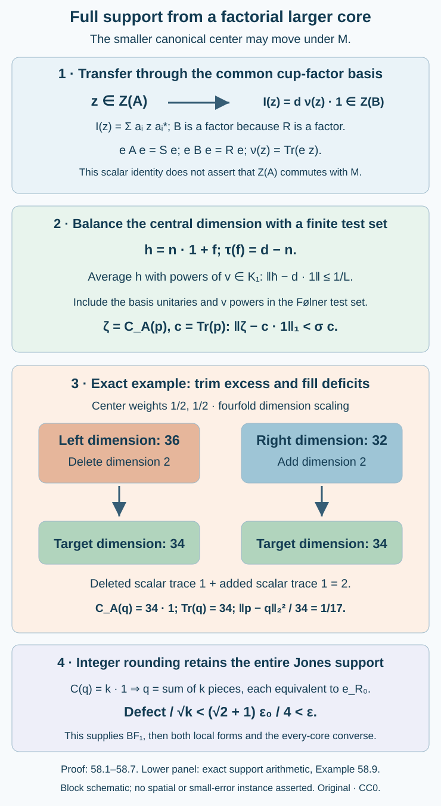

# Full support from a factorial larger core

The centers of the two canonical algebras need not agree. Nevertheless a factorial **larger** core permits full-support rounding. The argument uses a finite basis to balance the smaller central dimension, then both deletes excess dimension and adds missing dimension. It never cuts a Følner projection along moving central blocks.

Throughout, \(N\subset M\) is a proper finite-index II₁ inclusion, \(d=[M:N]\), and \(S\subset R\) is a core as in lessons 50–52. Assume that \(R\) is a factor and that the relative Følner criterion holds for this core. No factoriality of \(S\), extremality, or separability of \(M\) is assumed.

[Local corners can approximate the whole inclusion](corner-heredity-and-global-patching.md) proves arbitrary-corner heredity and finite global approximation under this larger-core factorial hypothesis. Its simultaneous absorption corollary additionally assumes separable predual.

Write

\[
\begin{gathered}
e=e_R^M,\\
\mathcal A=\langle N,e\rangle,\\
\mathcal B=\langle M,e\rangle.
\end{gathered}
\tag{58.1}
\]

The common canonical trace is \(\operatorname{Tr}\), with \(\operatorname{Tr}(e)=1\). The smaller center measure \(\nu\) and dimension \(C_{\mathcal A}\) are those of (52.6)–(52.7). Thus \(\nu(1)=1\) and \(C_{\mathcal A}(e)=1\). Lemma 52.2 makes \(\mathcal B\) a factor. The center of \(\mathcal A\) can still move under the unitaries of \(M\).

We use the trace-preserving expectation for a semifinite tracial subalgebra, tracial \(L^1\) duality, projection comparison, and the finite-corner prescription of Lemma 52.4. The first three retain their declared trace and conditional-expectation providers. We prove the additional comparison step for an infinite available projection below, so no finiteness of \(1_{\mathcal A}\) is assumed.

We use [the common cup-factor basis and canonical trace comparison](canonical-core-traces-and-integer-rounding.md), Lemmas 52.1–52.4, [the relative Følner criterion](relative-hypertraces-and-folner-projections.md), Theorem 49.2, and [realization of a prescribed finite core complement](transporting-a-core-through-a-tensor-factor.md), Corollary 51.5. The final conversion uses [bounded relative frames](bounded-frames-with-central-support.md), Theorem 53.5 and Corollary 53.6, and [supported local approximation](actual-supported-local-approximation.md), Theorems 57.2 and 57.4.

The trace and comparison prerequisites are Theorems 5.2 and 5.5, Corollary 5.4 and Theorem 6.2 of Traces on von Neumann algebras, together with tracial integration and duality. The trace-preserving expectation onto a semifinite tracial subalgebra retains the general conditional-expectation prerequisite used in lesson 49. These prerequisites are not proved in this lesson. The comparison with an infinite available projection is proved below.

## A basis transfers a central element to the larger center

Choose the common partial orthonormal right basis \(a_1,\ldots,a_t\) of Lemma 52.1 from the cup-factor inclusion \(K_1\subset K\). Choose it in the fractional-coordinate form of Theorem 3.2. Its nonzero support projections \(f_i\in K_1\subset S\) have

\[
\begin{gathered}
E_N(a_i^*a_j)=\delta_{ij}f_i,\\
a_i=a_if_i,\quad \sum_i a_ia_i^*=d1,\\
h:=\sum_i f_i=n1+f,\\
n=\lfloor d\rfloor,\quad \tau(f)=d-n.
\end{gathered}
\tag{58.2}
\]

When \(d\) is integral, the fractional coordinate is omitted and \(h=d1\). The factors \(K_1,K\) and every \(a_i\in K\subset R\) belong to this same core. In particular \(a_i e=e a_i\).

**Lemma 58.1 — scalar central transfer.** Let \(E:\mathcal B\to\mathcal A\) be the trace-preserving normal expectation. Then \(E|_M=E_N\), the same \(a_i\) form a right basis for \(\mathcal B\) over \(\mathcal A\), and

\[
b=\sum_i a_iE(a_i^*b)
\quad(b\in\mathcal B).
\tag{58.3}
\]

For every \(z\in Z(\mathcal A)\),

\[
\begin{gathered}
\mathcal I(z):=\sum_i a_i z a_i^*,\\
\mathcal I(z)=d\nu(z)1_{\mathcal B}.
\end{gathered}
\tag{58.4}
\]

Here \(\nu(z)\) is the linear extension of the finite center measure, not a value of \(\operatorname{Tr}(z)\), which may be infinite.

**Proof.** Trace adjointness characterizes the expectation. For \(x\in M\) and \(n_1,n_2\in N\), the finite canonical pairing gives

\[
\begin{aligned}
\operatorname{Tr}(x n_1 e n_2)
&=\tau(n_2xn_1)\\
&=\tau(n_2E_N(x)n_1).
\end{aligned}
\tag{58.5}
\]

The same formula with \(E_N(x)\) shows that \(E(x)=E_N(x)\). Indeed the span \(NeN\) has a contractive approximate identity for a strongly dense ideal of \(\mathcal A\), as proved in Lemma 52.2. Equality of all its finite trace pairings determines a bounded element of \(\mathcal A\): for each finite spanning operator \(T\), apply the pairing also to \(Tb\), approximating \(b\in\mathcal A\) strongly on bounded sets by the spanning algebra. Taking \(b\) to be the adjoint of the difference makes the positive finite pairings vanish; the ideal's approximate identity then kills the difference. Equivalently this is the uniqueness of the tracial expectation on a semifinite subalgebra.

Consequently \(E(a_i^*a_j)=\delta_{ij}f_i\). The bounded normal map \(Q(b)=\sum_i a_iE(a_i^*b)\) fixes every element of \(V=\sum_i a_i\mathcal A\). This right \(\mathcal A\)-module contains \(1\), by the original basis expansion in \(M\), and is invariant under left multiplication by both generators, for \(m\in M\) and \(b\in\mathcal A\):

\[
\begin{aligned}
m(a_i b)
&=\sum_j a_jE_N(a_j^*ma_i)b\\
&\in V,\\
e(a_i b)&=a_i e b\in V.
\end{aligned}
\tag{58.6}
\]

The second line uses \([a_i,e]=0\). Thus \(V\) contains every word in the generators \(M,e\), whose linear span is ultraweakly dense in \(\mathcal B\). Normality gives \(Q=\mathrm{id}\), proving (58.3). Taking adjoints supplies the left expansion.

For \(b\in\mathcal B\), put \(c_{ji}=E(a_j^*ba_i)\in\mathcal A\). The two expansions give

\[
\begin{aligned}
b\mathcal I(z)&=\sum_{i,j}a_jc_{ji}z a_i^*,\\
\mathcal I(z)b&=\sum_{i,j}a_jz c_{ji}a_i^*.
\end{aligned}
\]

Centrality of \(z\) makes these equal. Thus \(\mathcal I(z)\in Z(\mathcal B)=\mathbb C1\).

Let \(s\in Z(S)\) be the corner label \(eze=se\). Compressing (58.4)'s left side by \(e\) and using \([a_i,e]=0\), its scalar value is

\[
\begin{gathered}
\operatorname{Tr}(e\mathcal I(z)e)\\
=\sum_i\tau(a_i s a_i^*)\\
=\tau\left(s\sum_i E_S(a_i^*a_i)\right)\\
=\tau(sh).
\end{gathered}
\tag{58.7}
\]

For positive \(s\in Z(S)\), \(x\mapsto\tau(sx)\) on the II₁ factor \(K_1\) is a finite normal trace, since \(s\) commutes with \(K_1\). Uniqueness of its normalized trace gives \(\tau(sx)=\tau(s)\tau(x)\). Since \(\tau(h)=d\), (58.7) equals \(d\tau(s)=d\nu(z)\). Linear extension handles arbitrary central \(z\). This proves (58.4). \(\square\)

## A finite averaging set balances the fractional support

**Lemma 58.2 — explicit averaging in \(K_1\).** For every integer \(L\geq1\) there is a unitary \(v\in K_1\), with \(v^L=1\), such that

\[
\begin{gathered}
\bar h:=\frac1L\sum_{l=0}^{L-1}v^l h v^{-l},\\
\|\bar h-d1\|\leq1/L.
\end{gathered}
\tag{58.8}
\]

For integral \(d\), one may simply use \(\bar h=h=d1\).

**Proof.** Write \(s=\tau(f)\), \(r=\lfloor Ls\rfloor\). Partition \(1\) into equivalent projections \(q_1,\ldots,q_L\) of trace \(1/L\) so that

\[
\begin{gathered}
f=q_1+\cdots+q_r+f_0,\\
f_0\leq q_{r+1}.
\end{gathered}
\tag{58.9}
\]

When the remainder is zero, put \(f_0=0\); when \(s=0\), choose any such partition. To construct it when the remainder is positive, cut the first \(r\) cells inside \(f\), put its remainder into \(q_{r+1}\), complete that cell from \(1-f\), and divide the remaining complement into cells of trace \(1/L\). Type II prescription and factor comparison justify these cuts and matrix units between all the cells. The cyclic matrix unitary \(v\) permutes them and satisfies \(v^L=1\). Hence

\[
\frac rL1\leq\frac1L\sum_l v^l f v^{-l}
\leq\frac{r+1}{L}1.
\]

The scalar \(s\) belongs to this interval. Adding \(n1\) proves (58.8). \(\square\)

**Lemma 58.3 — the quantitative balancing estimate.** Let \(p\in\mathcal A\) be a nonzero finite-trace projection, and put

\[
\begin{gathered}
c=\operatorname{Tr}(p),\quad \zeta=C_{\mathcal A}(p),\\
\delta_x=\|[p,x]\|_{2,\operatorname{Tr}}/\sqrt c.
\end{gathered}
\]

For the average in Lemma 58.2,

\[
\begin{gathered}
\|\zeta-c1\|_{L^1(\nu)}/c\leq\Gamma,\\
\begin{aligned}
d\Gamma&=1/L\\
&+\sqrt2\sum_i\|a_i\|\delta_{a_i}\\
&+\frac{\sqrt2\|h\|}{L}\sum_l\delta_{v^l}.
\end{aligned}
\end{gathered}
\tag{58.10}
\]

For integral \(d\), omit the averaging error and its commutator terms. The estimate involves no upper bound on \(\zeta\).

**Proof.** For any bounded \(x\),

\[
[p,x]=px(1-p)-(1-p)xp.
\]

The two summands are orthogonal in \(L^2\). By polar decomposition, each has a left or right support equivalent to a subprojection of \(p\), so trace Cauchy–Schwarz gives its \(L^1\) norm at most \(\sqrt c\) times its \(L^2\) norm. Adding and applying scalar Cauchy–Schwarz yields

\[
\|[p,x]\|_1\leq\sqrt{2c}\,\|[p,x]\|_2.
\tag{58.11}
\]

The same bound holds for \(v^*pv-p\): its support is below \(p\vee v^*pv\), of trace at most \(2c\), and its \(L^2\) norm equals \(\|[p,v]\|_2\).

Take \(z\in Z(\mathcal A)\) with \(\|z\|\leq1\). All following pairings contain a trace-class factor. From (58.4), cyclicity, trace adjointness, and (58.2),

\[
\begin{aligned}
&dc\nu(z)-\operatorname{Tr}(pzh)\\
&\qquad=\sum_i\operatorname{Tr}([a_i^*,p]a_i z),\\
&\left|dc\nu(z)-\operatorname{Tr}(pzh)\right|\\
&\qquad\leq\sqrt2 c\sum_i\|a_i\|\delta_{a_i}.
\end{aligned}
\tag{58.12}
\]

In the first line \(E(a_i^*a_i)=f_i\) is used after moving \(z\) cyclically past the integrable pairing; \(z\) is not moved through \(a_i\) as an operator. Since \(v^l\in\mathcal A\), it commutes with \(z\). Thus

\[
\begin{gathered}
\begin{aligned}
\operatorname{Tr}(pz v^l h v^{-l})
&=\operatorname{Tr}(v^{-l}pv^l z h),
\end{aligned}\\
\left|\operatorname{Tr}(pzh)-d\operatorname{Tr}(pz)\right|\\
\leq c/L+\frac{\sqrt2 c\|h\|}{L}\sum_l\delta_{v^l}.
\end{gathered}
\tag{58.13}
\]

Combining (58.12)–(58.13) and \(\operatorname{Tr}(pz)=\nu(\zeta z)\) bounds \(d|\nu((c1-\zeta)z)|\). The \(L^1\) norm of the real central function \(c1-\zeta\) is its supremum over this central unit ball; its measurable sign attains that supremum. Divide by \(dc\). This proves (58.10). \(\square\)

In particular arbitrarily small central imbalance follows from the ordinary relative Følner criterion after enlarging its finite test set. Given a desired imbalance \(\sigma>0\), put

\[
B_*=2\sum_i\|a_i\|^2+\|h\|.
\tag{58.14}
\]

Choose \(L\) with \(1/L<d\sigma/2\). Every nonzero \(a_i\) is a linear combination of four unitaries of \(M\) with total absolute coefficient at most \(2\|a_i\|\): use the real and imaginary parts and \(w=H+i\sqrt{1-H^2}\) for a self-adjoint contraction \(H\). Include these unitaries, all \(v^l\), and the originally requested targets in one finite set. If their relative projection defects are all below

\[
\delta<\frac{d\sigma}{2\sqrt2 B_*},
\tag{58.15}
\]

then \(\delta_{a_i}\leq2\|a_i\|\delta\), \(\delta_{v^l}<\delta\), and (58.10) is strictly less than \(\sigma\). The set is chosen before the projection. There is no adaptive assumption about that projection's unknown central density.

## The entire algebra has constant central capacity

For an arbitrary projection \(r\), use the extended central dimension \(C_{\mathcal A}(r)\), possibly infinite. It is obtained as the increasing supremum of the finite-projection dimensions below \(r\). Finite joins make this family directed; normality and semifiniteness give

\[
\begin{gathered}
\operatorname{Tr}(rz)=\int C_{\mathcal A}(r)z\,d\nu,\\
z\in Z(\mathcal A)_+.
\end{gathered}
\tag{58.16}
\]

On a finite center measure, the supremum can be represented by a measurable extended function: a countable subfamily has the same essential supremum, obtained by maximizing the integrals of its bounded truncations. Thus this convention does not require a countable exhaustion of the whole canonical algebra.

**Lemma 58.4 — constant capacity.** There is a scalar \(C\in[1,\infty]\) such that

\[
\begin{gathered}
C_{\mathcal A}(1)=C1,\\
C=\operatorname{Tr}(1_{\mathcal B}).
\end{gathered}
\tag{58.17}
\]

**Proof.** If \(\operatorname{Tr}(1_{\mathcal B})<\infty\), every central projection \(z\in\mathcal A\) has finite trace. The functional \(x\mapsto\operatorname{Tr}(zx)\) is a normal trace on the factor \(N\), since \(z\) commutes with \(N\). Hence \(\operatorname{Tr}(zh)=d\operatorname{Tr}(z)\). On the other hand (58.4), cyclicity, and the expectation give

\[
d\nu(z)\operatorname{Tr}(1_{\mathcal B})
=\operatorname{Tr}(\mathcal I(z))
=\operatorname{Tr}(zh)
=d\operatorname{Tr}(z).
\]

This identifies the density of the finite weight \(z\mapsto\operatorname{Tr}(z)\) as the constant in (58.17).

Suppose instead that \(\operatorname{Tr}(1_{\mathcal B})=\infty\). A nonzero central projection \(z\in\mathcal A\) of finite trace would satisfy

\[
\operatorname{Tr}(\mathcal I(z))
\leq\sum_i\|a_i\|^2\operatorname{Tr}(z)<\infty.
\]

But (58.4) makes \(\mathcal I(z)=d\nu(z)1\), whose trace is infinite because \(\nu\) is faithful. This is a contradiction. If the extended density \(C_{\mathcal A}(1)\) were finite on a set of positive \(\nu\)-measure, one of its bounded central level sets would give just such a finite-trace \(z\). Therefore the density is infinite almost everywhere. Finally \(e\leq1\) gives \(C\geq1\). \(\square\)

**Lemma 58.5 — filling a bounded missing dimension.** If \(r\in\mathcal A\) is any projection and a bounded nonnegative central function \(g\) satisfies \(g\leq C_{\mathcal A}(r)\), there is a finite-trace projection \(r_g\leq r\) with \(C_{\mathcal A}(r_g)=g\).

**Proof.** Choose an integer \(b\geq\max(1,\|g\|_\infty)\) and work in \(M_b(\mathcal A)\) with the ordinary, unnormalized matrix trace. Normalize its central dimension by the full corner \(e\otimes E_{11}\). The finite projection \(t=e\otimes1_b\) has dimension \(b1\). Lemma 52.4 applies to its finite type II corner and supplies \(t_g\leq t\) of dimension \(g\).

We show \(t_g\precsim r\otimes E_{11}\), including when the latter projection has infinite trace. Use maximal partial-isometry comparison between these two projections, extending only with orthogonal initial and final parts. A chain has its strong orthogonal-extension limit; Zorn gives a maximal \(w\). Its residual initial and final projections have disjoint central supports, for otherwise a nonzero operator between overlapping central supports supplies a further partial isometry by polar decomposition. Let \(t_0=t_g-w^*w\), and suppose its central support \(z\) is nonzero. On \(z\) the residual final part vanishes, so

\[
\begin{gathered}
(r\otimes E_{11})z=ww^*z,\\
C((r\otimes E_{11})z)=C(w^*wz)\\
=gz-C(t_0).
\end{gathered}
\]

The left side is at least \(gz\), whereas \(C(t_0)\) is positive on its central support. This contradicts trace faithfulness. Thus \(t_0=0\). The final projection \(wt_gw^*\) lies below \(r\otimes E_{11}\), identifies with a projection \(r_g\in\mathcal A\), and has central dimension \(g\). It is finite trace since \(\nu(g)<\infty\). This proves the lemma without an assumption of a finite available corner. \(\square\)

**Lemma 58.6 — trim and fill.** Suppose \(p\in\mathcal A\) is finite trace with dimension \(\zeta\), and an integer \(k\geq1\) satisfies \(k\leq C\) from Lemma 58.4. There is a finite projection \(q\in\mathcal A\), commuting with \(p\), such that

\[
\begin{gathered}
C_{\mathcal A}(q)=k1,\\
\|p-q\|_2^2=\|\zeta-k1\|_{L^1(\nu)}.
\end{gathered}
\tag{58.18}
\]

**Proof.** Prescribe \(p_-\leq p\) with dimension \(\min(\zeta,k)\) by Lemma 52.4. On the central set \(\zeta<k\), the dimension of \(1-p\) is \(C-\zeta\geq k-\zeta\); when \(C=\infty\), this statement uses \(\infty-\zeta=\infty\) almost everywhere, since \(\zeta\) is integrable. Lemma 58.5 supplies \(p_+\leq1-p\) with dimension \((k-\zeta)_+\). Put \(q=p_-+p_+\). Its two parts are orthogonal, it commutes with \(p\), and its dimension is \(k1\). The two nonzero parts of \(p-q=(p-p_-)-p_+\) are also orthogonal, so

\[
\|p-q\|_2^2
=\nu((\zeta-k)_+)+\nu((k-\zeta)_+).
\]

This is (58.18). \(\square\)

## Full-support integer rounding

**Theorem 58.7 — factorial larger-core rounding.** If \(R\) is a factor and \(N\subset M\) is amenable relative to this core, then for every finite \(U\subset\mathcal U(M)\) and \(\varepsilon>0\) there is a core complement \(S^0\subset R^0\), obtained by deleting a finite matrix factor from \(S\), and a nonzero finite projection

\[
q\in\widetilde{\mathcal A}=\langle N,e_{R^0}^M\rangle
\]

with

\[
\begin{gathered}
C_{\widetilde{\mathcal A}}(q)=k1,\\
k\in\mathbb N,\quad k\geq1,\\
\|uqu^*-q\|_2<\varepsilon\|q\|_2,\\
u\in U.
\end{gathered}
\tag{58.19}
\]

Both norms in (58.19) use \(\widetilde{\operatorname{Tr}}\). It splits into \(k\) mutually orthogonal projections, each equivalent in \(\widetilde{\mathcal A}\) to the entire Jones projection \(e_{R^0}^M\). The larger complement \(R^0\) remains a factor.

**Proof.** Add the identity if necessary to make the finite set nonempty. Put

\[
\begin{gathered}
\varepsilon_0=\min(\varepsilon,1),\\
\sigma=\varepsilon_0^2/256.
\end{gathered}
\tag{58.20}
\]

Choose the averaging set and the unitary decompositions before choosing \(p\), as in (58.14)–(58.15). Use the relative Følner criterion for their union with \(U\), at a tolerance strictly less than both the bound in (58.15) and \(\varepsilon_0/4\). Lemma 58.3 then gives a nonzero finite \(p\in\mathcal A\) with

\[
\begin{gathered}
\|\zeta-c1\|_{L^1(\nu)}<\sigma c,\\
\|upu^*-p\|_2<\delta\sqrt c,\quad u\in U,\\
\delta<\varepsilon_0/4.
\end{gathered}
\tag{58.21}
\]

Choose an integer \(m\) so large that \(c'=m^2c>1/\sigma\). The core absorption and finite complement result 51.5 realizes deletion of a unital \(M_m\subset S\). The exact canonical comparison 52.3 identifies the smaller centers, leaves their finite measure \(\nu\) unchanged, and gives

\[
\begin{gathered}
\zeta'=m^2\zeta,\\
\widetilde{\operatorname{Tr}}(p)=c',\\
\|upu^*-p\|_2/\sqrt{c'}<\delta,\\
u\in U.
\end{gathered}
\tag{58.22}
\]

Both norms in (58.22) use the new trace. The larger complement is a factor because \(R=R^0\bar\otimes M_m\). Its canonical algebra is therefore a factor. Lemma 58.4 gives constant new capacity \(C'=\widetilde{\operatorname{Tr}}(1)\), and \(c'\leq C'\). Set \(k=\lfloor c'\rfloor\); thus \(1\leq k\leq C'\) and

\[
k>(1-\sigma)c'>c'/2.
\tag{58.23}
\]

The triangle inequality and (58.21) imply

\[
\begin{gathered}
\|\zeta'-k1\|_{L^1(\nu)}\\
\leq m^2\|\zeta-c1\|_{L^1(\nu)}+(c'-k)\\
<\sigma c'+1<2\sigma c'.
\end{gathered}
\tag{58.24}
\]

Apply Lemma 58.6 in the new canonical algebra. The resulting full-dimension projection has \(\widetilde{\operatorname{Tr}}(q)=k\), and

\[
r:=\|p-q\|_{2,\widetilde{\operatorname{Tr}}}^2/k<4\sigma.
\tag{58.25}
\]

For every requested unitary, triangle inequality, trace invariance, and (58.22)–(58.25) give

\[
\begin{gathered}
\|uqu^*-q\|_2/\sqrt k\\
\leq\delta\sqrt{c'/k}+2\sqrt r\\
<\delta\sqrt2+4\sqrt\sigma\\
<\frac{\sqrt2+1}{4}\varepsilon_0
<\varepsilon.
\end{gathered}
\tag{58.26}
\]

All norms on these last lines use the new trace. Since \(\nu(1)=1\), \(k\geq1\) also makes \(q\ne0\). Finally prescribe \(k\) orthogonal pieces of central dimension \(1\) inside \(q\) by Lemma 52.4. Equal central dimension makes each equivalent to \(e_{R^0}^M\). This proves every assertion. \(\square\)

**Corollary 58.8 — larger-core BF₁ and both local forms.** Under the hypotheses of Theorem 58.7, for every finite unitary set and every positive bounded-frame energy tolerance there are a tunnel stage and bounded \(x_1,\ldots,x_k\in N\) with

\[
\begin{gathered}
E_{A_j}(x_i^*x_l)=\delta_{il}1,\\
0\leq\mathcal E_j(x,u)<\eta k,\quad u\in U.
\end{gathered}
\tag{58.27}
\]

Thus BF₁ holds. Both local forms of Theorem 57.2 follow; its second form has \(f_0=z_0=1\), arbitrary positive scalar trace cap, and \(s=s_0\in N_l\cap R\). The relative Følner criterion then holds for every core of the inclusion.

**Proof.** Apply Theorem 58.7 at a defect tolerance smaller than \(\sqrt{\min(\eta,1)}/8\). Its cyclic decomposition is exactly the rounded input of Lemma 53.3 with \(z=1\). Theorem 53.5 and Corollary 53.6 retain \(h_j=f_j=r_j=1\) throughout bounded Gram normalization, proving (58.27). Theorem 57.2 supplies both local forms and exact full support, and Theorem 57.4 supplies the converse for any core. Factoriality of \(S\) has not entered the proof. \(\square\)

## Exact support arithmetic and six solved exercises

**Example 58.9 — two labels require both deletion and addition.** Take center measure \((1/2,1/2)\), dimension \(\zeta=(9,8)\), and trace \(c=17/2\). Its imbalance is \(\|\zeta-c1\|_1=1/2\). After fourfold amplification the dimension is \((36,32)\) and \(c'=34\). Rounding to \(k=34\) deletes dimension two on the first label and adds dimension two on the second. Their scalar traces are one each, so \(\|p-q\|_2^2=2\) and the relative squared loss is \(1/17\). This is exact central support arithmetic, realizable in two sufficiently large type II corners. It does not assert the small-error hypotheses at any specified tolerance. The dimensions \((9,8)\) are also those of Example 52.7, but that nondegenerate square was not asserted there to be an actual core.

**Exercise 58.1 — introductory.** Why is \(h\) not automatically \(d1\) for nonintegral index? Give its form at \(d=9/2\), and an averaging choice with norm error at most \(1/8\).

**Solution.** A partial orthonormal basis has four full coordinates and a fifth support projection \(f\) of trace \(1/2\). Thus \(h=4\cdot1+f\), not \((9/2)1\). Lemma 58.2 with \(L=8\) gives the requested error. In this rational case its remainder is zero, so the cyclic average is actually exactly \((9/2)1\).

**Exercise 58.2 — introductory.** In \(\mathcal A=D_r\subset\mathcal B=M_r\) with normalized matrix trace, take the right basis \(a_{ab}=E_{ab}\), of expectation onto the diagonal algebra. Compute \(h\) and the transfer of a diagonal central \(z=\operatorname{diag}(z_1,\ldots,z_r)\).

**Solution.** The supports are \(f_{ab}=E_{bb}\), so \(h=\sum_{a,b}E_{bb}=r1\) and \(\sum a_{ab}a_{ab}^*=r1\). Direct multiplication gives \(\sum_{a,b}E_{ab}zE_{ba}=(\sum_bz_b)1=r\nu(z)1\). This is a finite matrix illustration of transfer, not an II₁ core or a proof of the common cup basis.

**Exercise 58.3 — intermediate.** Explain why an \(L^2\) commutator estimate cannot simply be paired with \(a_i z\) by \(L^2\) Cauchy–Schwarz. Prove the needed replacement.

**Solution.** The bounded operator \(a_i z\) can have infinite \(L^2\) norm. Instead \([p,a_i^*]\) is trace class with \(\|[p,a_i^*]\|_1\leq\sqrt{2c}\|[p,a_i^*]\|_2\): split its two off-diagonal pieces, use their supports of trace at most \(c\), then scalar Cauchy–Schwarz. Pair this trace-class element with the bounded \(a_i z\) by \(L^1\)-operator-norm duality. The result is the finite bound in (58.12).

**Exercise 58.4 — intermediate.** For \(\nu=(1/3,2/3)\), \(\zeta=(8,5)\), and target \(k=6\), compute the separate trim and fill traces and their total squared distance. Why does only trimming fail?

**Solution.** The retained dimension is \((6,5)\). Trimming has scalar trace \((1/3)(8-6)=2/3\). Filling the second label adds \((2/3)(6-5)=2/3\). Total squared distance is \(4/3=\|\zeta-6\|_1\), and the final trace is six. Only trimming leaves dimension five on the second label, so it cannot give full dimension \(6,1\).

**Exercise 58.5 — advanced.** Why does constant capacity matter if \(\mathcal A\) is finite? Explain the comparison argument's contradiction on a residual initial central support.

**Solution.** A desired constant dimension \(k\) cannot be filled on a center fiber whose entire unit has dimension less than \(k\). Lemma 58.4 excludes that obstruction by proving \(C(1)=C1\), and the choice \(k\leq\operatorname{Tr}(p)\leq C\) fits every fiber. For comparison, a nonzero residual initial projection \(t_0\) has central support \(z\). Maximality forces the residual final projection to vanish on \(z\), so the available final dimension there equals \(gz-C(t_0)\), while the hypothesis requires at least \(gz\). Since \(C(t_0)>0\) on that support, this is impossible. The argument also works for an initially infinite available projection.

**Exercise 58.6 — advanced.** At \(\varepsilon_0=1/2\), compute \(\sigma\) and the guaranteed final coefficient in (58.26). State which original general-core claim this theorem leaves open.

**Solution.** Here \(\sigma=1/1024\), and \(c'>1024\) suffices for the integer-loss choice. The bound is \((\sqrt2+1)/8<1/2\). It proves full-support rounding and BF₁ from a factorial larger core. It does not prove general nonfactor-core rounded-input or BF existence: when \(\mathcal B\) is not a factor, \(\mathcal I(z)\) is a larger central element rather than the scalar in (58.4), so the constant-balancing proof does not apply unchanged.

**Figure 58.1.** The first two panels name the actual algebras, center map, measure, finite averaging set and balancing estimate. The lower panel is Example 58.9: center weights \(1/2,1/2\), fourfold dimension multiplier, old dimensions \(36,32\), target \(34,34\), deleted and added scalar trace one each, and total squared loss two. It depicts dimension and support accounting, not spatial geometry or an asserted small-error example. Proof locators: Lemmas 58.1–58.6 and (58.22)–(58.26). Original reproducible source: [larger-factor-central-balancing.py](figures/larger-factor-central-balancing.py).

The human source comparison is Sorin Popa, [*Classification of amenable subfactors of type II*](https://doi.org/10.1007/BF02392646), Theorem 4.2.2 and Corollary 4.2.3 with the larger-core factorial meaning of ergodicity from Section 1.4. The basis-transfer and trim-and-fill proof above independently supplies the larger-factor full-support bridge. It does not use the displayed central-block selection as a proof of localization under moving centers, and does not assert a general-core correction is complete.

The original entire-course goal remains active and incomplete. General nonfactor-core rounding and BF existence, unrestricted local approximation, the full global and smooth/generating equivalences, and every other retained original obligation remain assigned. 

Original exposition and figure by GPT-6.1 Sol (OpenAI), Ultra reasoning, October 2026. CC0 1.0. Self-checked by the writing AI.
