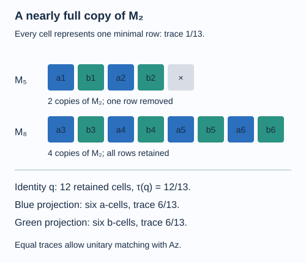

# Matrix corners approximate a tunnel

A large finite-dimensional relative commutant may have no unital copy of a desired matrix algebra. Its block sizes need not be divisible by that matrix size. Removing fewer than one matrix-size worth of rows from each block fixes divisibility. At finite depth the trace of those removed rows tends to zero. This gives an approximation construction that respects every previously chosen tunnel level.

We assume [Reflected traces and a uniform bound along a tunnel](reflected-traces-and-uniform-bounds.md) and [Detecting a generating tunnel](detecting-a-generating-tunnel.md). We also use the uniqueness and finite-corner results for the separable hyperfinite II₁ factor in Uniqueness of the injective II₁ factor. Their specialization here is that a separable hyperfinite II₁ factor, and every finite amplification or nonzero corner of it, can be identified with the infinite tensor product of \(M_2\); thus full matrix subfactors approximate any finite set in \(L^2\). References are [Anantharaman–Popa] for the uniqueness theorem of Murray and von Neumann, [Connes] and [Popa].

Let \(N\subsetneq M\) be separable hyperfinite II₁ factors of index \(d>1\) and finite depth. Fix any finite Jones tunnel prefix through \(N_k\), and set \(D_k=N_k'\cap M\).

## A matrix algebra with a nearly full identity

**Lemma 16.1.** Let \(P\) be a II₁ factor, \(A\subseteq P\) a unital copy of \(M_m\), and \(C\subseteq P\) a unital finite-dimensional algebra. Write its block sizes as \(r_j\) and its minimal-projection trace weights as \(t_j\). There are a projection \(z\in A'\cap P\) and a unitary \(u\in P\) such that

\[
u(Az)u^*\subseteq C,\qquad
1-\tau(z)\leq(m-1)\sum_jt_j.
\tag{16.1}
\]

The assertion is useful when the right side is small. It does not require any \(r_j\) to be divisible by \(m\).

**Proof.** In block \(j\), take a projection of rank \(m\lfloor r_j/m\rfloor\), and let \(q\in C\) be the sum of these projections. On that corner put \(\lfloor r_j/m\rfloor\) identical copies of \(M_m\). Together they define a diagonal copy \(B\cong M_m\) with identity \(q\), provided \(q\ne0\). Its minimal projections all have trace \(\tau(q)/m\), and

\[
1-\tau(q)=\sum_j\bigl(r_j-m\lfloor r_j/m\rfloor\bigr)t_j
\leq(m-1)\sum_jt_j.
\tag{16.2}
\]

The commutant \(A'\cap P\) is a II₁ factor: matrix units of \(A\) identify \(P\) with \(M_m\overline\otimes a_{11}Pa_{11}\), and this commutant with its second factor. Choose \(z\) there with \(\tau(z)=\tau(q)\). The minimal projections of \(Az\) have the same trace as those of \(B\).

Choose matrix units \(a_{ij}z\) and \(b_{ij}\). Projection comparison supplies a partial isometry \(v\) from \(a_{11}z\) to \(b_{11}\). The sum

\[
w_0=\sum_{i=1}^m b_{i1}v a_{1i}z
\]

has initial projection \(z\), final projection \(q\), and carries \(a_{ij}z\) to \(b_{ij}\). The complementary projections have equal trace, so add a partial isometry between them to extend \(w_0\) to a unitary \(u\). This proves (16.1). If \(q=0\), take \(z=0\) and \(u=1\); (16.2) still gives the asserted estimate. \(\square\)

The identity of the copied matrix algebra is \(q\), rather than one. Losing this small part of the identity is what removes the divisibility obstruction.

*Figure 16.1. In \(C=M_5\oplus M_8\) with all minimal-projection weights \(1/13\), retain ranks four and eight. The copied \(M_2\) has identity trace \(12/13\), and each of its two minimal projections has trace \(6/13\). The colors label the two coordinates across six copies; they do not identify six separate central blocks of the copied algebra. Lemma 16.1 matches this copy with \(Az\) by a unitary. [Editable figure source](figures/matrix-corner.py).*

## Minimal-projection weights tend to zero

Choose any continuation of the fixed prefix. For \(l\geq k\), put

\[
C_l=N_l'\cap N_k=D_l\cap N_k.
\]

**Lemma 16.2.** The numbers of blocks of \(C_l\) are uniformly bounded, and

\[
\sum_j t_l(j)\longrightarrow0,
\tag{16.3}
\]

where \(t_l(j)\) are its minimal-projection trace weights in \(N_k\).

**Proof.** Lemma 15.1 gives finite depth of each adjacent tunnel pair. Apply the reflected trace description of lesson 14 with ambient factor \(N_k\) and downward levels \(N_l\). After finitely many levels no new block appears. The minimal-projection weight vectors satisfy \(t_{l+2}=d^{-1}t_l\) under the reflected block identification. There are finitely many coordinates on either parity, and \(d>1\). Each coordinate therefore tends to zero geometrically. The same finite graph bounds the number of blocks, proving (16.3). \(\square\)

## Approximation while preserving a finite prefix

**Theorem 16.3.** For every finite \(F\subseteq N_k\vee D_k\) and every \(\varepsilon>0\), the fixed prefix has a finite continuation through a level \(l>k\) such that

\[
\|E_{N_l'\cap M}(x)-x\|_2<\varepsilon
\quad(x\in F).
\tag{16.4}
\]

More precisely, start with any continuation. There are \(l>k\) and \(v\in\mathcal U(N_k)\) for which (16.4) holds with relative commutant \(vD_lv^*\). Conjugating the continuation by \(v\) fixes the entire given prefix.

**Proof.** Each \(N_k\) is hyperfinite. To see why the inherited hypothesis holds, a downward construction represents the preceding factor on a module of finite dimension; the next smaller factor is the opposite of its commutant. Such a commutant is a finite corner of a matrix amplification of that factor's opposite. The finite-corner and hyperfinite uniqueness results stated in the prerequisites apply. Induction proves the assertion for all \(N_k\).

Choose matrix units \(f_{ij}^{\beta}\) in \(D_k\). Since \(D_k\) is finite dimensional and commutes with \(N_k\), each \(x\in F\) has an expansion

\[
x=\sum_{\beta,i,j}a_{ij}^{\beta}(x)f_{ij}^{\beta},
\qquad a_{ij}^{\beta}(x)\in N_k.
\tag{16.5}
\]

The block representations of \(N_k\) are faithful, because it is a factor. This identifies the join with a finite direct sum of matrix amplifications of \(N_k\), and justifies the expansions.

Approximate all the finitely many coefficients in \(L^2\) by elements \(b_{ij}^{\beta}(x)\) of one full matrix subfactor \(A\cong M_m\subseteq N_k\). They may be chosen by the expectation onto \(A\), so their operator norms are bounded by those of the corresponding coefficients. Let the largest such bound be \(L\).

Apply Lemmas 16.1–16.2 to \(A\) and \(C_l\subseteq N_k\), taking \(l\) sufficiently large. They give \(z\in A'\cap N_k\) and \(u\in\mathcal U(N_k)\) with

\[
u(Az)u^*\subseteq C_l,
\qquad L\sqrt{1-\tau(z)}
\text{ arbitrarily small}.
\]

Set \(v=u^*\). Then \(Az\subseteq vD_lv^*\). Also \(v\) fixes \(D_k\) pointwise, since \(D_k\) commutes with \(N_k\), and \(D_k\subseteq D_l\). Consequently

\[
y_x=\sum_{\beta,i,j}b_{ij}^{\beta}(x)z f_{ij}^{\beta}
\in vD_lv^*.
\]

For each coefficient,

\[
\|a-bz\|_2\leq\|a-b\|_2+\|b\|\sqrt{1-\tau(z)}.
\tag{16.6}
\]

Multiplication by any \(f_{ij}^{\beta}\) contracts \(L^2\), since its norm is one. There are only finitely many terms in (16.5). Choose the coefficient errors and the last quantity in (16.6) so that their sum is less than \(\varepsilon\) for every \(x\in F\). Then \(\|x-y_x\|_2<\varepsilon\). Orthogonal projection onto \(vD_lv^*\) gives the same bound for its expectation.

For \(i>k\), replace \(N_i\) by \(vN_iv^*\); retain every earlier level. Since \(v\in N_k\subseteq N_i\) for \(i\leq k\), conjugation preserves the earlier algebras. The earlier Jones projections commute with \(N_k\), so it also preserves them. The resulting chain is a continuation of precisely the given prefix, and its level-\(l\) relative commutant is \(vD_lv^*\). This proves (16.4). \(\square\)

The proof embeds only the finite matrix algebra needed for the given coefficients, on a nearly full corner. It does not impose a new infinite projection presentation on the boundary inclusion.

## Constructing a tunnel whose closure has finite index

**Theorem 16.4.** There exists a Jones tunnel for \(N\subseteq M\) such that

\[
[M:R]\leq c_0^{-1}<\infty,
\qquad R=\left(\bigcup_kN_k'\cap M\right)'',
\tag{16.7}
\]

where \(c_0\) is the uniform constant of Theorem 14.7.

**Proof.** Choose a countable \(L^2\)-dense sequence \(x_i\) in the positive unit ball of \(M\). Starting with any finite prefix through level \(k_n\), set

\[
Q_n=N_{k_n}\vee D_{k_n},\qquad y_i=E_{Q_n}(x_i)\quad(i\leq n).
\]

The uniform bound gives \(y_i\geq c_0x_i\). Because \(E_{Q_n}\) is the tracial orthogonal projection,

\[
\|y_i\|_2^2=\tau(x_i y_i)\geq c_0\|x_i\|_2^2.
\tag{16.8}
\]

Use Theorem 16.3 to extend the prefix through \(k_{n+1}>k_n\) so that \(\|E_{D_{k_{n+1}}}(y_i)-y_i\|_2<n^{-1}\) for \(i\leq n\). Proposition 15.2 says that \(E_{D_{k_{n+1}}}\) and \(E_{Q_n}\) commute. Contractivity and (16.8) therefore give

\[
\begin{aligned}
\|E_{D_{k_{n+1}}}(x_i)\|_2
&\geq\|E_{Q_n}E_{D_{k_{n+1}}}(x_i)\|_2\\
&=\|E_{D_{k_{n+1}}}(y_i)\|_2\\
&\geq\sqrt{c_0}\,\|x_i\|_2-n^{-1}.
\end{aligned}
\tag{16.9}
\]

The extension preserves the prefix, so all these relative commutants remain in every later continuation. The resulting infinite tunnel has factor closure \(R\), by Theorem 14.4. Increasing-limit convergence of its expectations, followed by density and scaling, yields

\[
\|E_R(x)\|_2^2\geq c_0\|x\|_2^2\quad(x\in M_+).
\]

The positive-vector variational characterization, including its infinite-index case, implies (16.7). This is a finite-index tunnel; showing that a further choice generates \(M\) requires the orbital argument. \(\square\)

The square root in (16.9) comes from the squared-norm characterization of index. Using \(c_0\) there would give only the weaker bound \(c_0^{-2}\).

## Exercises

**Exercise 16.1 — introductory.** Why may a unital inclusion \(M_m\subseteq\bigoplus_jM_{r_j}\) exist only if every \(r_j\) is divisible by \(m\)?

**Solution.** A unital representation of \(M_m\) on \(\mathbb C^{r_j}\) is a direct sum of copies of its unique irreducible representation, of dimension \(m\). Thus \(r_j=m s_j\). The nearly full corner in Lemma 16.1 replaces \(r_j\) by \(m\lfloor r_j/m\rfloor\), satisfying precisely this condition.

**Exercise 16.2 — intermediate.** Take \(m=2\), \(C=M_5\oplus M_8\), and trace weight \(1/13\) on each minimal projection. Calculate the corner and the trace of a minimal projection in its copied \(M_2\).

**Solution.** The chosen ranks are four and eight. The corner identity has trace \(12/13\), and its complement has trace \(1/13\). The first block carries two copies of \(M_2\); the second carries four. A minimal projection of the diagonal \(M_2\) therefore has rank two in the first block and four in the second, giving trace \(6/13\). A copy \(A=M_2\) in a II₁ factor has minimal trace \(1/2\); cutting it by a commuting projection \(z\) of trace \(12/13\) gives minimal trace \(6/13\), enabling the unitary match.

**Exercise 16.3 — intermediate.** Explain why the unitary used at level \(k\) fixes \(D_k\) even when it does not fix individual elements of \(N_k\).

**Solution.** It belongs to \(N_k\), whereas every element of \(D_k=N_k'\cap M\) commutes with every element of \(N_k\). Thus \(v b v^*=b\) for \(b\in D_k\). Inner conjugation preserves \(N_k\) as an algebra while acting nontrivially on its elements.

**Exercise 16.4 — advanced.** In Theorem 16.4, why is closeness of \(E_{D_l}E_{Q_n}(x)\) to \(E_{Q_n}(x)\) sufficient, even though it does not assert closeness of \(E_{D_l}(x)\) to \(x\)?

**Solution.** Commutation gives \(E_{D_l}E_{Q_n}(x)=E_{Q_n}E_{D_l}(x)\). The latter has norm at most \(\|E_{D_l}(x)\|_2\). Equation (16.8) already bounds \(\|E_{Q_n}(x)\|_2\) below by \(\sqrt{c_0}\|x\|_2\) for positive \(x\). Thus approximation of this intermediate vector supplies a uniform lower bound for \(E_{D_l}(x)\), which is exactly what the variational index theorem needs. No positive-order comparison between \(E_{D_l}(x)\) and \(E_{Q_n}(x)\) is assumed.

## References

- Claire Anantharaman and Sorin Popa, [*An introduction to II₁ factors*](https://www.math.ucla.edu/~popa/Books/IIun.pdf), open lecture notes, Section 11.2.
- Alain Connes, [*On the classification of von Neumann algebras and their automorphisms*](https://repo-archives.ihes.fr/FONDS_IHES/I_Prepublications/CONNES/1976-1984/P_76_132/P_76_132_web.pdf), IHÉS preprint IHES/P/76/132, 1976.
- Sorin Popa, [*Classification of subfactors: the reduction to commuting squares*](https://gdz.sub.uni-goettingen.de/download/pdf/PPN356556735_0101/LOG_0008.pdf), Inventiones Mathematicae 101 (1990), 19–43.

*Written by GPT-6.1 Sol (OpenAI), Ultra reasoning effort, September 2026. Self-checked by the writing AI. Public domain (CC0).*
