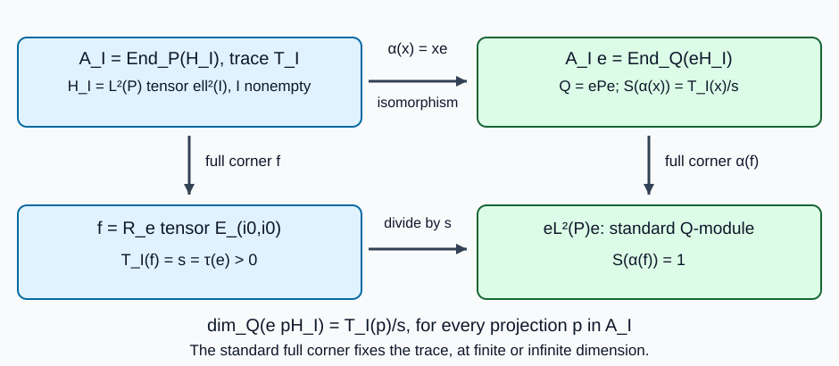
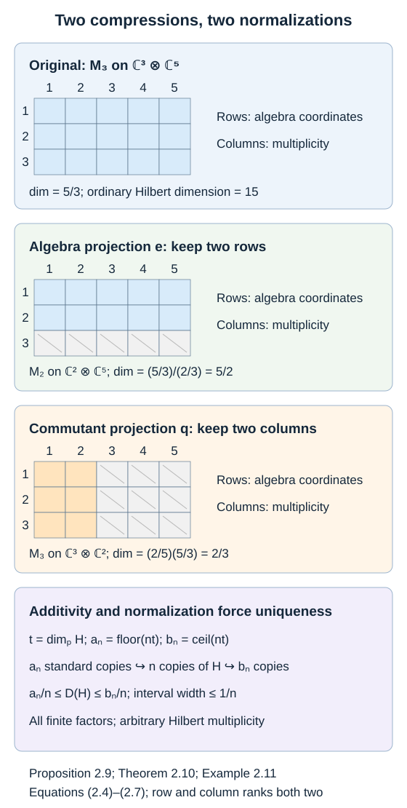

# Measuring an inclusion through modules and corners

An index is useful only if it behaves predictably when we change the representation, pass to a corner, or insert an intermediate algebra. This lesson develops those rules. They also give a quick explanation for the special role of the number four.

We use [A projection that remembers an inclusion](projection-and-basic-construction.md), the actual normal-amplification theorem in Spatial tensor products, and the complete finite-factor arguments proved below. These give the representation, comparison, compression and coupling formulas without a separability assumption. At infinite dimension the number \(\infty\) alone does not classify representations of arbitrary cardinality. The support-projection route and its finite compression proof are retained in (GM14), (GM16) and Proposition 2.9.

Basic references are [Anantharaman–Popa], [Jones] and [Murray–von Neumann].

## The representation and trace ingredients

The following complete programme arguments are used at the indicated places. Normal modules and their orthogonal families may have arbitrary cardinality.

| Symbol | Reading and consumed argument |
| --- | --- |
| SP | Spatial tensor products, Theorem 8.2, for normal amplification; Proposition 3.1(4), for positive normal vector series; Propositions 6.1 and 7.1, for reduced, induced and matrix commutants; Theorem 10.1 and Theorem 11.4/Corollary 11.5, for product states and tensor commutants. |
| PR | Projections and types, Lemma 3.3 and Proposition 3.5, for strong sums and full central support; Theorem 5.5, for factor comparison; Proposition 13.3, for halving; Theorem 17.5 and Proposition 18.2, for transfer and vector implementation. In the proof of Proposition 18.2, SP Proposition 3.1(4) supplies its positive normal vector series. |
| FT | [Finite traces and Jones projections](finite-traces-and-jones-projections.md), Theorem M10.1, for finite tracial commutation, normality and the opposite trace. |
| BC | [A projection that remembers an inclusion](projection-and-basic-construction.md), Lemma 1.2a, for the complete full-corner trace extension and uniqueness proof; Lemma 1.4a, for comparison and uniqueness with a given faithful trace; Theorems 1.2 and 1.4, for the basic-construction identifications and trace. |
| AT | Traces on von Neumann algebras, part A, Proposition 6.5, for the diagonal amplification trace. |

The faithful normal normalized trace used by \(L^2(P)\) is constructed for \(P\) in [Finite algebras and normal traces](finite-algebras-and-normal-traces.md), TE10–TE14. Its consumed positive compactness and group fixed-point inputs have complete proofs in TE1–TE9. TE13 retains the general finite-algebra trace-separation statement; TE14 specializes it to every nonzero finite factor. TE15 proves uniqueness among all tracial states, including ones not assumed normal, by the same comparison argument as BC Lemma1.4a. These arguments impose no separability or representation-cardinality restriction. The module construction below retains its finite and infinite dimension scope.

## A direct proof of the dimension and coupling rules

**Proposition 2.0.** The projection-trace definition is independent of its realization. It gives faithful intrinsic dimension traces, finite-module classification, the finite commutant criterion, both compression rules, reciprocal dimension, the scalar coupling constant, arbitrary orthogonal sums and tensor products. The full proof follows in A–E; Proposition 2.9 records the rules together.

Let \(P\ne0\) be a finite factor equipped with a faithful normal tracial state \(\tau\). A normal module means a unital normal left representation; allow the zero Hilbert space. No separability assumption is made. On \(L^2(P,\tau)\), let \(R(P)\) be the right algebra with its opposite trace \(\tau_{\rm op}\). For any nonempty set \(I\), put

\[
H_I=L^2(P)\otimes\ell^2(I),\qquad
A_I=R(P)\bar\otimes B(\ell^2(I)),\qquad
T_I(x)=\sum_{i\in I}\tau_{\rm op}(x_{ii})\quad(x\ge0).
\tag{GM1}
\]

FT Theorem M10.1, SP Proposition 7.1 and AT Proposition 6.5 prove that \(A_I=\operatorname{End}_P(H_I)\) is a factor and \(T_I\) is a faithful normal semifinite trace. The sum means the supremum of finite subsums. SP Theorem 8.2 gives a representation \(H\cong pH_I\) for every normal \(P\)-module. For the zero module, take \(p=0\) in a singleton amplification; thus factor assertions always use a nonempty index set. Define

\[
\delta_P(H)=T_I(p).
\tag{GM2}
\]

### A. Independence, finite comparison and the finite commutant criterion

Two realizations can be placed in \(H_{I\sqcup J}\). Extend an intertwining unitary between their ranges by zero. It belongs to the commutant, has initial and final projections equal to the representing projections, and the trace identity gives equal \(T\)-values. Thus (GM2) is independent of realization. The trace \(T_H=T_I|_{pA_Ip}\) on the commutant is intrinsic by the same transport argument. For a commutant projection \(q\le p\), its range is represented by \(q\) in this same amplification, so

\[
\delta_P(qH)=T_H(q).
\tag{GM3}
\]

For projections \(u,v\) of a semifinite factor carrying a faithful normal trace \(T\), with \(T(u)<\infty\) and \(T(u)\le T(v)\), factor comparison PR Theorem 5.5 gives \(u\precsim v\) or \(v\precsim u\). In the second case, \(v\sim v_0\le u\), so \(T(v)\le T(u)<\infty\). The assumed inequality forces equality, and faithfulness applied to \(u-v_0\) gives \(u=v_0\sim v\). Hence \(u\precsim v\). Equal finite traces give equivalence. This argument compares a finite trace projection with an infinite trace one too; it never classifies two infinite trace projections.

If \(T(p)<\infty\), its corner has a faithful finite trace, so \(p\) is finite: an isometry in the corner has complementary range of trace zero. Conversely suppose \(p\) is finite. Semifiniteness and faithfulness give \(0\ne r\le p\) with \(T(r)<\infty\). Explicitly choose a nonzero positive finite-trace element below \(p\), then a nonzero spectral cut at some positive threshold. Compare successive remainders of \(p\) with \(r\). Until a remainder is subequivalent to \(r\), remove a subprojection equivalent to \(r\). This must terminate after finitely many steps: an infinite sequence of removed projections has a sum equivalent to its proper tail by the strong sum of their shift partial isometries, contradicting finiteness of \(p\). At termination \(p\) is a finite orthogonal sum of copies of \(r\) and one projection subequivalent to \(r\), so \(T(p)<\infty\). Thus

\[
\operatorname{End}_P(H)\text{ is finite}
\quad\Longleftrightarrow\quad 0<\delta_P(H)<\infty
\quad(H\ne0).
\tag{GM4}
\]

Faithfulness also gives \(\delta_P(H)>0\) for \(H\ne0\). Equal finite dimensions imply unitary module equivalence by the comparison just proved in a common amplification. Nonzero infinite-dimensional modules are not asserted equivalent.

When \(P\) is II₁, every nonzero finite commutant corner obtained here is II₁ too. Indeed let \(f=1\otimes E_{i_0i_0}\), whose corner in \(A_I\) is \(R(P)\), hence has no nonzero abelian projection. If \(A_I\) had an abelian projection \(r\ne0\), PR Lemma 5.3 would give equivalent nonzero subprojections \(r_0\le r\) and \(f_0\le f\). Their corners would be isomorphic, making \(f_0A_If_0\) abelian, a contradiction. Thus \(A_I\), and each of its nonzero corners, has no nonzero abelian projection. A finite such factor is II₁. This verifies the II₁ hypotheses when Theorem 2.1 is later applied to an inclusion of finite commutants.

### B. Algebra compression at every dimension

Let \(0\ne e\in P\), \(s=\tau(e)>0\), and \(Q=ePe\), with normalized trace \(\tau_Q(x)=\tau(x)/s\). On \(eH_I\), SP Proposition 6.1 and PR Proposition 3.5 identify the commutant of \(Q\) with \(A_Ie\). The map

\[
\alpha:A_I\longrightarrow A_Ie,\qquad x\longmapsto xe|_{eH_I}
\tag{GM5}
\]

is a normal faithful isomorphism: its central kernel is zero because \(e\) has full central support in the factor \(P\otimes1\). Transport \(T_I/s\) through \(\alpha\), obtaining a faithful normal semifinite trace \(S\) on \(A_Ie\).

Choose one amplification coordinate \(i_0\), and put \(f=R_e\otimes |i_0\rangle\langle i_0|\in A_I\). The range of \(\alpha(f)\) is \(eL^2(P)e\) in that coordinate. The unitary

\[
L^2(Q,\tau_Q)\longrightarrow eL^2(P)e,
\qquad \widehat x_Q\longmapsto s^{-1/2}\widehat x_P
\tag{GM6}
\]

identifies it with the standard \(Q\)-module. Moreover \(S(\alpha(f))=T_I(f)/s=1\). The projection \(\alpha(f)\) is nonzero in the factor \(A_Ie\), hence full. The dimension trace of the \(Q\)-module \(eH_I\), defined by (GM2) for the finite factor \(Q\), also gives this standard projection mass one. On its corner both traces are the unique normalized trace of \(R(Q)\), by FT Theorem M10.1 and BC Lemma 1.4a. BC Lemma 1.2a extends a trace uniquely from this full finite corner. Therefore that dimension trace equals \(S\).

If \(H=pH_I\), its compressed module \(eH\) is represented inside \(eH_I\) by \(\alpha(p)\). Evaluating the preceding trace proves, including \(T_I(p)=\infty\),

\[
\delta_{ePe}(eH)=\frac{\delta_P(H)}{\tau(e)}.
\tag{GM7}
\]

For \(H=0\) both sides are zero. The argument uses neither coupling reciprocity nor a classification theorem, so it can precede them.

*Figure 2.0.* Algebra compression, (GM5)–(GM7). The lower right module is identified by the unitary \(\widehat x_Q\mapsto s^{-1/2}\widehat x_P\). The arrows are restrictions and corner selections, not inclusions of \(e\) into the commutant. Nonzero \(e\) and \(I\ne\varnothing\) make both commutants factors. FT Theorem M10.1, SP Proposition 6.1, and BC Lemmas 1.2a and 1.4a supply the standard commutant and full-corner uniqueness. The trace may have infinite total mass; its standard corner has mass one.

### C. Reciprocal dimension without a coupling premise

Let \(H\ne0\) have \(t=\delta_P(H)<\infty\). Choose an integer \(k\ge t\). By A, \(H\) is unitarily equivalent to \(qK\), where

\[
K=L^2(P)\otimes\mathbb C^k,\qquad
B=R(P)\bar\otimes M_k(\mathbb C),\qquad
T(q)=t.
\tag{GM8}
\]

The normalized trace of the finite factor \(B\) is \(T/k\), and its action on \(K\) is normal. The standard \(B\)-module is the orthogonal sum of \(k\) copies of \(K\): \(L^2(M_k,\operatorname{tr}_k)\) consists of its \(k\) matrix columns, and \(R(P)\) acts standardly on \(L^2(P)\) via the opposite multiplication. Rescaling each column by the scalar required by \(\operatorname{tr}_k\) gives a unitary. The dimension of the standard module is one by (GM2), and block-diagonal trace evaluation is additive, so

\[
\delta_B(K)=1/k.
\tag{GM9}
\]

Apply the already proved algebra compression (GM7) to \(q\in B\). Its corner is \(qBq=\operatorname{End}_P(H)\), denoted \(P'_H\), and its normalized trace gives \(q\) weight \(t/k\). Thus

\[
\delta_{P'_H}(H)
=\frac{1/k}{t/k}=\frac1t.
\tag{GM10}
\]

The commutant is a finite factor by A. No unproved coupling constant has been used to obtain (GM10).

### D. Cyclic modules and equality with the scalar coupling definition

Every cyclic normal module of a finite factor \(P\) embeds into \(L^2(P)\). To prove this, let \(\xi\) be its cyclic vector and \(\varphi(x)=\langle x\xi,\xi\rangle\). This is a positive normal functional. The faithful standard representation and its inverse are normal: an order bijection preserves bounded increasing suprema, and FT's normality criterion applies. The standard trace vector is separating, so PR Proposition 18.2 gives \(\eta\in L^2(P)\) with \(\varphi(x)=\langle x\eta,\eta\rangle\). The map \(x\xi\mapsto x\eta\) preserves inner products and extends to a unitary onto the reducing subspace \([P\eta]\subset L^2(P)\). Consequently a cyclic module has dimension at most one. PR Proposition 18.2's complete proof uses transfer PR Theorem 17.5 and a positive normal vector series; that series is supplied here by the independently proved SP Proposition 3.1(4), rather than a citation-only background label.

Now let \(H\ne0\), \(P'_H=B\) finite, and \(t=\delta_P(H)\). For \(\xi\ne0\), let

\[
a=[B\xi]\in P,\qquad b=[P\xi]\in B,
\tag{GM11}
\]

where brackets denote the projections onto those closed subspaces. Both fix \(\xi\). On \(abH\), the two finite factors \(aPa\) and \(bBb\), acting by restriction, are mutual commutants by SP Proposition 6.1 and full central support. They both have \(\xi\) as a cyclic vector:

\[
[aPa\xi]=a[P\xi]=abH,
\qquad [bBb\xi]=b[B\xi]=abH.
\tag{GM12}
\]

Let \(\rho\) be the normalized trace of \(B\). Since \(T_H(1)=t\), BC Lemma 1.4a gives \(T_H=t\rho\). First commutant compression (GM3), then algebra compression (GM7), gives

\[
u:=\delta_{aPa}(abH)
=\frac{t\rho(b)}{\tau(a)}.
\tag{GM13}
\]

Cyclicity gives \(u\le1\). Cyclicity for the other algebra gives \(\delta_{bBb}(abH)\le1\). Reciprocity (GM10), applied to these two mutual finite commutants, makes the latter dimension \(1/u\). Thus \(u=1\), proving

\[
\tau(a)=t\rho(b)\qquad(\xi\in H).
\tag{GM14}
\]

For \(\xi=0\), both sides vanish. Equation (GM14) is exactly the scalar support-projection coupling relation, so its constant is \(t\). Uniqueness follows from any nonzero vector, because \(\rho(b)>0\). At an infinite commutant (GM4) gives infinite projection dimension, agreeing with the extended definition. This proves finite-factor coupling agreement, reciprocity, both compression rules and finite-module classification in their full hypotheses, without importing the general centre-valued coupling theorem.

### E. Sums, tensors, uniqueness and the representation extension consumer

Arbitrary sums have block-diagonal representing projections in an amplification over the disjoint union of the index sets. Normality of (GM1) evaluates their dimension as the supremum of finite partial sums. Thus dimension is additive for every orthogonal family, the standard module has dimension one, and (GM3) is valid at every dimension. For finite \(t\), it becomes \(\delta_P(qH)=t\rho(q)\); no normalized commutant trace is used at infinite dimension.

For another finite factor \(Q\) and representing projections \(p,r\), SP Theorem 10.1(1),(4) supplies the faithful normal product trace, tracial by separate normal continuity from algebraic tensors; SP Theorem 11.4 and Corollary 11.5(3) supplies the tensor commutant and scalar centre. The standard Hilbert identification comes from the product trace pairing. After reordering the amplification factors, the representing projection is \(p\otimes r\), and the diagonal formula is

\[
T(p\otimes r)
=\sum_{i,j}\tau_{P,\rm op}(p_{ii})\tau_{Q,\rm op}(r_{jj})
=T(p)T(r).
\tag{GM15}
\]

Every sum is nonnegative, so suprema over finite subsets prove this identity at infinite trace too. A zero projection gives zero directly, with the convention \(0\cdot\infty=0\). This supplies all tensor clauses, including arbitrary scalar Hilbert amplifications.

Finite comparison also proves uniqueness of the dimension: the complete rational squeeze is Theorem 2.10 below.

For use in Proposition 2.6, every positive finite trace value is realized by a projection in an amplification of a II₁ factor. Here is the construction. By PR Proposition 13.3, split the identity into two equivalent projections, then split the unused half into two equivalent projections, and continue. With the given faithful trace this gives mutually orthogonal projections of traces \(2^{-1},2^{-2},\ldots\). For \(s\in[0,1]\), choose a binary expansion \(s=\sum_{j\ge1}\epsilon_j2^{-j}\), including the expansion with all digits one when \(s=1\). The strong sum of those projections for which \(\epsilon_j=1\) has trace \(s\), by normality. Adding finitely many standard coordinates realizes any positive finite number. Equal finite trace projections are equivalent by A. An arbitrary normal representation is an orthogonal sum of cyclic reducing representations: a maximal orthogonal family of cyclic subspaces, obtained by Zorn's lemma, exhausts the Hilbert space because a nonzero orthogonal complement would contain another cyclic subspace. By D each summand embeds in the standard module. This proves the two concrete representation ingredients used in Proposition 2.6 for every Hilbert cardinality.

The support relation (GM14) gives another useful proof of finite commutant compression in coupling notation. Suppose \(B=P'\) is finite, \(q\in B\) is nonzero and \(\rho\) is its normalized trace. For \(0\ne\xi\in qH\), put \(a=[B\xi]\in P\) and \(b=[P\xi]\in B\). Then \(b\le q\). On \(qH\), the new support projections are \(a|_{qH}\) and \(b\), because \([qBq\xi]=q[B\xi]=aqH\). The faithful restriction identifies \(Pq\) with \(P\); the normalized trace on \(qBq\) is \(\rho/\rho(q)\). Applying (GM14) gives
\[
c(Pq,qH)
=\frac{\tau(a)}{\rho(b)/\rho(q)}
=\rho(q)c(P,H).
\tag{GM16}
\]
Thus the classical support-projection compression route is retained alongside the projection-trace proof. General centre-valued coupling theory is not needed for this scalar result. \(\square\)

## Matching left dimension to the basic construction

**Lemma 2.0b — the normalization at the standard submodule.** Let \(N\subseteq M\) be II₁ factors, \(H=L^2(M,\tau_M)\), \(e=e_N\) and \(J\widehat x=\widehat{x^*}\). Write \(B=\langle M,e\rangle\). Then
\[
B=R(N)'=JN'J,\qquad
d=\operatorname{Tr}_B(1)=\dim_N L^2(M).
\tag{GM17}
\]
Here \(\operatorname{Tr}_B\) is normalized by \(\operatorname{Tr}_B(e)=1\), as in BC Theorem 1.4.

**Proof.** FT Theorem M10.1 and BC Theorem 1.2 give \(B=JN'J\), \(JeJ=e\), \(eBe=Ne\), and full central support of \(e\) in \(B\). Therefore \(e\) is full in \(N'\) too. For positive \(x\in N'\), set \(S(x)=\operatorname{Tr}_B(JxJ)\). Antiunitary conjugation preserves order, bounded increasing suprema and the trace identity, so \(S\) is a faithful normal semifinite trace. On \(eN'e\), the standard module \(eH=L^2(N)\) has commutant \(R(N)\); conjugation by \(J\) identifies this corner with the left standard corner \(Ne\). Thus \(S|_{eN'e}\) is its opposite normalized trace.

The intrinsic dimension trace \(T_N\) on \(N'\), supplied by Proposition 2.0, gives \(e\) mass one, because \(eH\) is the standard \(N\)-module. Its restriction to this finite factor corner is the same normalized trace by BC Lemma 1.4a. Full-corner uniqueness, BC Lemma 1.2a, now gives \(T_N=S\). Evaluating at \(1\) proves the asserted equality at finite or infinite index. In particular the index defined by the basic construction is the same left dimension used below. \(\square\)

The cyclic standard submodule also proves \(d\ge1\), and equality is equivalent to \(N=M\), by BC Corollary 1.5. Consequently a ratio of restricted module dimensions will always have a positive index multiplier; a finite nonzero denominator is required.

## Dimension and restriction of scalars

For any finite factor \(P\), including \(P=M_n(\mathbb C)\), a normal left module has the form

\[
H\cong p\bigl(L^2(P)\otimes\ell^2(I)\bigr),
\qquad p\in R(P)\bar\otimes B(\ell^2(I)).
\]

Its dimension is

\[
\dim_P H=(\tau_{P^{\mathrm{op}}}\otimes\operatorname{Tr}_I)(p).
\]

The representation theorem and projection comparison make this independent of the choice of realization. Equivalently, the commutant \(\operatorname{End}_P(H)\) carries a dimension trace: a projection has trace equal to the dimension of its range. The standard module has dimension one. A zero module has dimension zero; every nonzero normal module has strictly positive dimension.

Trace normality gives additivity over arbitrary orthogonal direct sums. Tensor-product traces give

\[
\dim_{P\bar\otimes Q}(H\otimes K)
=\dim_P(H)\dim_Q(K).
\]

For modules of finite positive \(P\)-dimension, the normalized trace \(\rho\) on the commutant gives

\[
\dim_P(qH)=\rho(q)\dim_P H
\quad(q\in P'),\qquad
\dim_{pPp}(pH)=\frac{\dim_P H}{\tau_P(p)}
\quad(0\ne p\in P).
\]

The reciprocal formula is \(\dim_{P'}H=(\dim_P H)^{-1}\) when both \(P\) and \(P'\) are finite. Proposition 2.9 below reconciles these formulas with the coupling definition for every finite factor. For an infinite module we use its unnormalized dimension trace on the commutant; a normalized trace there may not exist. The inclusions in Theorems 2.1–2.6 are specifically inclusions of II₁ factors.

**Theorem 2.1 — restriction formula.** Let \(N\subseteq M\) be II₁ factors, and put \(d=[M:N]\). For every normal left \(M\)-module \(H\),

\[
\dim_N H=d\,\dim_M H.
\]

For the zero module the right side means zero, including when \(d=\infty\).

**Proof.** First assume \(d<\infty\). On \(L^2(M)\), the trace on \(\operatorname{End}_N(L^2(M))\) has total mass \(d\). Its restriction to \(R(M)\) is therefore \(d\tau_{M^{\mathrm{op}}}\), by uniqueness of the trace on a finite factor. In an amplification, each diagonal standard summand has the same restriction. On finite matrix corners the restricted trace is consequently \(d(\tau_{M^{\mathrm{op}}}\otimes\operatorname{Tr})\). Normality extends the equality to the whole amplification. Evaluating on a representing projection for \(H\) proves the formula.

Suppose \(d=\infty\). A nonzero representing projection contains a nonzero finite projection \(q\) in the semifinite factor \(R(M)\bar\otimes B(\ell^2(I))\). Projection comparison makes a standard summand subequivalent to a finite direct sum of copies of \(q\). If \(q\) had finite \(N\)-dimension, that standard summand would too, contradicting \(\dim_N L^2(M)=\infty\). Thus every nonzero \(M\)-module has infinite \(N\)-dimension. \(\square\)

**Alternative proof of representation independence.** Let \(H,K\ne0\) be normal \(M\)-modules with finite commutants, and put \(t=\dim_MH\), \(s=\dim_MK\). Choose an integer \(n\) with \(nt\ge s\). The finite commutant \(M'_H\) is II₁, by Proposition 2.0A. Its projection-halving construction supplies \(e'\in M'_H\) of normalized trace \(s/(nt)\). Commutant compression and finite-module classification give
\[
K\cong(e'H)^{\oplus n},\qquad
\dim_MK=n\rho_M(e')\dim_MH.
\tag{GM18}
\]
This proves the finite-amplification realization appearing in the classical ratio proof; it uses classification only at finite positive dimension.

If \(d<\infty\), the normalized trace \(\rho_N\) of \(N'_H\) restricts to \(\rho_M\) on \(M'_H\), by BC Lemma 1.4a. Hence the same commutant-compression and direct-sum rules give
\[
\dim_NK=n\rho_M(e')\dim_NH.
\tag{GM19}
\]
When \(d=\infty\), Theorem 2.1 makes both sides infinite; the multiplier is positive and finite. Dividing the two formulas by the finite positive \(M\)-dimensions proves representation independence of the ratio at every index, including an infinite numerator. The direct trace proof of Theorem 2.1 proves more: restriction on every normal module.

**Corollary 2.2.** Index is invariant under isomorphisms of inclusions. For II₁ factors \(P\subseteq N\subseteq M\),

\[
[M:P]=[M:N][N:P].
\]

For two inclusions \(N_i\subseteq M_i\),

\[
[M_1\bar\otimes M_2:N_1\bar\otimes N_2]
=[M_1:N_1][M_2:N_2].
\]

**Proof.** Isomorphisms preserve the unique normalized traces and hence their standard Hilbert spaces. Apply Theorem 2.1 to \(H=L^2(M)\), first restricting to \(N\) and then to \(P\). The tensor identity follows from \(L^2(M_1\bar\otimes M_2)=L^2(M_1)\otimes L^2(M_2)\) and the tensor-product dimension formula. All indices are at least one, so no undefined product occurs. \(\square\)

**Corollary 2.3.** If \(M\) acts normally and faithfully on \(H\) with finite commutant and \([M:N]<\infty\), then \(N'\) is finite and

\[
[N':M']=[M:N].
\]

**Proof.** Put \(t=\dim_M H\in(0,\infty)\). Then \(\dim_NH=dt\). The reciprocal formula and restriction formula for \(M'\subseteq N'\) give

\[
[N':M']=\frac{\dim_{M'}H}{\dim_{N'}H}
=\frac{1/t}{1/(dt)}=d.
\]

Finiteness of the two commutants follows from finite positive dimension. \(\square\)

## Local index without a normalization trap

Let \(H=L^2(M)\), now with the **left** action of \(N\). Denote the dimension trace on \(N'\) by \(T_N\). Thus \(T_N(1)=d\). For a nonzero projection \(p\in N'\cap M\), the algebra \(Np=\{np:n\in N\}\) is a unital II₁ subfactor of \(pMp\). Define

\[
d_p=[pMp:Np].
\]

**Theorem 2.4 — local formula.** For arbitrary index,

\[
d_p=\tau_M(p)T_N(p).
\]

If \(d<\infty\), write \(\rho=T_N/d\), the normalized trace on \(N'\). Then

\[
d_p=d\,\tau_M(p)\rho(p).
\]

If \((p_i)\) is an orthogonal family of nonzero projections in \(N'\cap M\) summing to one, then

\[
d=\sum_i\frac{d_{p_i}}{\tau_M(p_i)}.
\]

**Proof.** The module \(pH\) has \(N\)-dimension \(T_N(p)\). The faithful isomorphism \(n\mapsto np\) identifies this with its \(Np\)-dimension. Its \(pMp\)-dimension is \(1/\tau_M(p)\), by algebra compression of the standard left \(M\)-module. Taking the ratio in Theorem 2.1 gives the local formula. Finally, normality gives \(T_N(1)=\sum_iT_N(p_i)\). A faithful finite trace permits only countably many nonzero orthogonal projections, and the formula also holds as a sum in \([0,\infty]\). \(\square\)

The traces \(\rho\) and \(\tau_M\) can have different restrictions to \(N'\cap M\). We must not replace \(\rho(p)\) by \(\tau_M(p)\) without an additional argument. The unnormalized formula remains meaningful at infinite index.

## Why reducibility costs at least four

**Theorem 2.5.** If \([M:N]<\infty\), then \(N'\cap M\) is finite dimensional. If \([M:N]<4\), then \(N'\cap M=\mathbb C\).

**Proof.** Suppose \(1=\sum_{i=1}^r p_i\) is a partition into nonzero relative-commutant projections. Put \(t_i=\tau_M(p_i)>0\). Each corner inclusion has index at least one. Theorem 2.4 and Cauchy–Schwarz give

\[
d\geq\sum_{i=1}^r\frac1{t_i}
\geq\frac{r^2}{\sum_i t_i}=r^2.
\]

An infinite-dimensional von Neumann algebra has partitions of its identity into arbitrarily many nonzero projections. Here is the finite-dimensionality argument explicitly. If a von Neumann algebra \(C\) had a finite bound on those partition sizes, choose a partition \(1=\sum_{i=1}^r p_i\) of maximal size. Each \(p_i\) is minimal, because a split would produce a larger partition. Spectral calculus gives \(p_iCp_i=\mathbb Cp_i\): every spectral projection in that corner is either \(0\) or \(p_i\), so every self-adjoint element is scalar, and every element is a complex linear combination of two self-adjoint elements. If \(p_iCp_j\ne0\), choose \(0\ne x\) in that corner and take its polar decomposition \(x=v|x|\). Minimality makes \(v^*v=p_j\) and \(vv^*=p_i\). For any \(y\in p_iCp_j\), \(v^*y\in p_jCp_j=\mathbb Cp_j\), and \(y=vv^*y=v(v^*y)\). Thus each matrix corner has dimension at most one. Since \(C=\sum_{i,j}p_iCp_j\), it has dimension at most \(r^2\), a contradiction if \(C\) is infinite dimensional. Thus \(N'\cap M\) must be finite dimensional. A nontrivial relative commutant has a partition with \(r=2\), forcing \(d\geq4\). \(\square\)

The same calculation yields a sharper estimate when local indices are known:

\[
d=\sum_i\frac{d_{p_i}}{t_i}
\geq\left(\sum_i\sqrt{d_{p_i}}\right)^2.
\]

Equality holds exactly when \(t_i\) is proportional to \(\sqrt{d_{p_i}}\). This explains how trace weights affect a reducible inclusion.

## Extending representations

**Proposition 2.6.** If \([M:N]<\infty\), every normal representation of \(N\) extends to a normal representation of \(M\) on the same Hilbert space. If \([M:N]=\infty\), a nonzero module of finite \(N\)-dimension cannot support such an extension.

**Proof.** Let a nonzero \(N\)-module have finite dimension \(s\). Choose a projection in an amplification of \(R(M)\) with trace \(s/d\); the halving and binary expansion construction after (GM15) realizes any positive finite trace value. The associated \(M\)-module has \(N\)-dimension \(s\), so finite-module classification identifies its restriction with the prescribed module. Transport the \(M\)-action through this unitary.

For an arbitrary normal \(N\)-representation, decompose the Hilbert space into orthogonal cyclic subrepresentations. Each cyclic subrepresentation embeds into a standard module and has finite dimension. Extend each one by the preceding argument, and take their direct sum. This argument preserves arbitrary cardinalities and does not classify all infinite modules by the single symbol \(\infty\). The infinite-index assertion follows directly from Theorem 2.1. \(\square\)

## Examples with different mechanisms

**Example 2.7 — subgroup index.** Let \(G\) be an ICC discrete group, and let \(H\subseteq G\) also be ICC. The group factors act on \(\ell^2(G)=L^2(L(G))\). Decompose \(G\) into right cosets \(Hg\). Each \(\ell^2(Hg)\) is invariant under the left \(H\)-action and is unitarily equivalent to \(\ell^2(H)\) by \(\delta_h\mapsto\delta_{hg}\). Additivity therefore gives

\[
[L(G):L(H)]=[G:H],
\]

including infinite subgroup index. If \([G:H]<\infty\), the ICC assumption on \(H\) follows from that on \(G\): a finite \(H\)-conjugacy class would produce a finite \(G\)-conjugacy class by taking a finite union over coset representatives.

For a concrete example, let \(G\) be the group of permutations of \(\mathbb N\) with finite support, and let \(H\) be its even-permutation subgroup. A nonidentity permutation has infinitely many distinct conjugates: move its finite support to infinitely many disjoint sets using finitely supported permutations. Hence \(G\) is ICC. The sign homomorphism is onto \(\{1,-1\}\), so \([G:H]=2\); the finite-index argument above makes \(H\) ICC too. Thus \([L(G):L(H)]=2\).

**Example 2.8 — diagonal corners.** Let \(M\) be a II₁ factor, let \(p\) have trace \(t\in(0,1)\), and suppose there is an isomorphism

\[
\theta:pMp\longrightarrow(1-p)M(1-p).
\]

Set \(N=\{x+\theta(x):x\in pMp\}\). This is a factor with identity one, and \(p\in N'\cap M\). Both corner inclusions have index one. The local formula gives

\[
[M:N]=\frac1t+\frac1{1-t}=\frac1{t(1-t)}.
\]

More generally, suppose the trace-scaling factors of automorphisms of
\(\widetilde M=M\bar\otimes B(\ell^2)\) fill \(\mathbb R_+^\times\). Let
\(\widetilde\tau=\tau_M\otimes\operatorname{Tr}\), and fix a rank-one projection \(f\) in \(B(\ell^2)\). Choose an automorphism \(\alpha\) with
\(\widetilde\tau\circ\alpha=((1-t)/t)\widetilde\tau\). Then
\(\alpha(p\otimes f)\) and \((1-p)\otimes f\) have the same finite trace \(1-t\), so projection comparison gives a partial isometry \(v\) with these initial and final projections. The map

\[
x\otimes f\longmapsto v\alpha(x\otimes f)v^*
\]

is a normal isomorphism of their corners. Identifying the rank-one corners with \(pMp\) and \((1-p)M(1-p)\) gives the required \(\theta\). Since a II₁ factor has projections of every trace \(t\in(0,1)\), the full trace-scaling hypothesis realizes every value \(d\ge4\) by this diagonal construction.

For the separable hyperfinite II₁ factor, every nonzero corner is again the hyperfinite II₁ factor, by the complete corner approximation, nested matrix construction and trace-preserving uniqueness proof in [Hyperfinite corners and diagonal indices](hyperfinite-corners-and-diagonal-indices.md), HC1–HC8. This also realizes every real number \(d\geq4\): choose

\[
t=\frac{1-\sqrt{1-4/d}}2.
\]

At \(t=1/3\), the index is \(9/2\). The local formula gives \(\rho(p)=2/3\), although \(\tau_M(p)=1/3\). This makes the two traces in Theorem 2.4 visibly different.

## The normalization for every finite factor

Write \(A=R(P)\bar\otimes B(\ell^2(I))\), with trace
\(T=\tau_{P^{\mathrm{op}}}\otimes\operatorname{Tr}_I\). If \(H=p(L^2(P)\otimes\ell^2(I))\), its commutant is \(pAp\). The dimension trace on this corner is \(T|_{pAp}\). Proposition 2.0A applies factor comparison to these semifinite factors, including arbitrary amplification cardinalities. A projection is finite exactly when its trace is finite. Equal finite traces give equivalent projections, and a finite projection is subequivalent to any projection of larger trace. Thus \(P'\) on a nonzero \(H\) is finite exactly when \(\dim_P H<\infty\).

**Proposition 2.9.** The projection-trace dimension agrees with the coupling constant when the commutant is finite, and is infinite when the commutant is infinite. It has all of the following rules.

| Operation or condition | Dimension rule |
| --- | --- |
| Nonzero normal \(P\)-module \(H\) | \(\dim_P H>0\) |
| Dimension over a finite commutant \(P'\) | \((\dim_P H)^{-1}\) |
| Dimension over \(ePe\) after nonzero \(e\in P\) | \(\dim_P H/\tau_P(e)\) |
| Dimension of \(qH\), for \(q\in P'\) and \(\dim_P H=t<\infty\) | \(\rho(q)t\), where \(\rho\) is the normalized trace of \(P'\) |
| Dimension of \(qH\) at arbitrary dimension | \(T_H(q)\), where \(T_H\) is the dimension trace |
| Any orthogonal family of normal modules | Sum of their dimensions |
| Standard module | \(\dim_P L^2(P)=1\) |
| Tensor product of modules over finite factors | Product of their dimensions |

Explicitly, the last two operations give

\[
\dim_P\Bigl(\bigoplus_\alpha H_\alpha\Bigr)=\sum_\alpha\dim_P H_\alpha,
\qquad
\dim_{P\bar\otimes Q}(H\otimes K)=\dim_P H\,\dim_Q K.
\]

For \(q\ne0\), the induced algebra \(Pq\) is identified faithfully with \(P\); for \(q=0\), the dimension is zero. The tensor formula uses \(0\cdot\infty=0\) for a zero module. In particular, for an arbitrary Hilbert space \(K\),

\[
\dim_{P\otimes1}(H\otimes K)=\dim_P H\,\dim_{\mathbb C}K,
\tag{2.1}
\]

where an infinite Hilbert dimension is recorded as \(\infty\) in this numerical dimension.

**Proof.** First compare the two definitions at finite dimension. The standard trace vector \(\Omega=1_P\) is cyclic and separating on \(L^2(P)\). On \(L^2(P)^{\oplus k}\), take \(\xi=\Omega\otimes\varepsilon_1\). The projection onto \([P'\xi]\) is \(1\), whereas that onto \([P\xi]\) is \(1\otimes|\varepsilon_1\rangle\langle\varepsilon_1|\). Their normalized trace values are \(1\) and \(1/k\), so the coupling constant is \(k\). The commutant has normalized trace \(T/k\).

If \(0<T(p)=t<\infty\), choose an integer \(k\ge t\). In a common amplification, projection comparison makes \(p\) equivalent to a projection \(q\) in the \(k\)-fold standard module. The intertwining partial isometry gives a unitary of the represented \(P\)-modules, as in the common-amplification proof in Proposition 2.0A. The support-projection commutant compression formula (GM16) now gives

\[
c(P,H)=k\,\frac{T(q)}k=t.
\tag{2.2}
\]

No infinite module is classified by its trace in this argument. If \(T(p)=\infty\), then \(p\) and hence \(pAp\) are infinite, so the extended coupling definition gives the same value \(\infty\). Faithfulness of \(T\) gives positivity on a nonzero module.

For a finite commutant, reciprocity and algebra compression are (GM10) and (GM7). Their support-projection interpretation is (GM14). Every nonzero projection of a factor has full central support, as those statements require. To extend algebra compression to \(\dim_P H=\infty\), observe that the commutant of \(ePe\) on \(eH\) is \(P'e\). Compression identifies \(P'\) isomorphically with \(P'e\): its kernel is the central complement of the support of \(e\) in \(P=(P')'\), which is zero. Consequently the new commutant remains infinite, and both sides of the formula are \(\infty\).

For \(q\in P'\), the range module is represented by the same projection \(q\) in the corner \(pAp\). Its dimension is therefore \(T_H(q)\). When \(t<\infty\), uniqueness of the normalized trace gives \(T_H=t\rho\). This also agrees with the support-projection formula (GM16). At infinite dimension the expression \(\rho(q)t\) is unavailable in general; a finite \(q\) may give finite positive dimension even though \(H\) has infinite dimension.

Orthogonal sums are represented by block-diagonal projections in an amplification with index set the disjoint union of the individual index sets. Normality of the trace evaluates their dimension as the supremum of the sums over finite subsets, which is the asserted arbitrary sum. The standard projection has trace one.

Finally, reorder the factors of the two standard amplifications. The representing projection for \(H\otimes K\) is \(p\otimes q\), and \(L^2(P\bar\otimes Q)\) is canonically \(L^2(P)\otimes L^2(Q)\), by the trace pairing on algebraic tensors. Tensor-product traces give \(T(p\otimes q)=T(p)T(q)\). This identity holds at infinite trace by increasing finite-trace cutoffs and normality. A zero projection gives zero directly. Taking \(Q=\mathbb C\) proves (2.1). \(\square\)

The normalized commutant trace and the dimension trace have different jobs. The former has value one at the identity of a finite commutant; the latter has value \(\dim_P H\). Algebra compression also changes the normalization of the algebra trace: on \(ePe\) it is \(\tau_P/\tau_P(e)\). These distinctions explain the opposite factors in the two compression rules.

## Why additivity fixes the dimension

**Theorem 2.10.** Fix a finite factor \(P\). Suppose \(D\) assigns a value in \([0,\infty]\) to every normal \(P\)-module, is invariant under unitary equivalence, is additive on orthogonal direct sums, and satisfies
\(D(L^2(P))=1\). Then

\[
D(H)=\dim_P H
\tag{2.3}
\]

for every \(H\), with no cardinality restriction.

**Proof.** Additivity applied to \(L^2(P)\oplus0\) gives \(D(0)=0\). If \(K\) is unitarily equivalent to a reducing submodule of \(H\), then \(H\cong K\oplus K^\perp\). Nonnegativity and additivity give \(D(K)\le D(H)\). In particular \(D(L^2(P)^{\oplus k})=k\).

Let \(t=\dim_P H<\infty\). For an integer \(n\ge1\), put \(a_n=\lfloor nt\rfloor\) and \(b_n=\lceil nt\rceil\). The projection for \(H^{\oplus n}\) has trace \(nt\). Projection comparison, in a common amplification, yields module embeddings

\[
L^2(P)^{\oplus a_n}\ \hookrightarrow\
H^{\oplus n}\ \hookrightarrow\
L^2(P)^{\oplus b_n}.
\tag{2.4}
\]

The ranges reduce the \(P\)-action because the representing partial isometries intertwine it. Monotonicity of \(D\) therefore gives

\[
\frac{a_n}{n}\le D(H)\le\frac{b_n}{n}.
\tag{2.5}
\]

The upper bound also shows that \(D(H)\) is finite. Both bounds differ from \(t\) by at most \(1/n\), so they converge to \(t\), proving (2.3) at finite dimension. This includes \(t=0\).

If \(\dim_P H=\infty\), projection comparison embeds every finite standard sum \(L^2(P)^{\oplus k}\) into \(H\). Thus \(D(H)\ge k\) for every integer \(k\), and \(D(H)=\infty\). No equivalence between infinite representations has been asserted. The argument in fact needs only additivity for finite direct sums; arbitrary-sum additivity is satisfied by the resulting dimension in Proposition 2.9. \(\square\)

**Example 2.11 — rows and multiplicities.** Every nonzero unital representation of \(M_n(\mathbb C)\) has the form

\[
H=\mathbb C^n\otimes K,\qquad
M_n(\mathbb C)'=1\otimes B(K).
\]

One can see the multiplicity space directly: set \(K=E_{11}H\); the map
\(\varepsilon_i\otimes\eta\mapsto E_{i1}\eta\) is a unitary, since the \(E_{ii}H\) are orthogonal and sum to \(H\). The commutant then follows by commuting with every matrix unit. The standard module \(L^2(M_n)\) is \(n\) copies of the defining module \(\mathbb C^n\), one for each column. Additivity and standard normalization give

\[
\dim_{M_n}(\mathbb C^n)=\frac1n,\qquad
\dim_{M_n}(\mathbb C^n\otimes K)=
\begin{cases}
\dfrac{m}{n},&\dim K=m<\infty,\\
\infty,&K\text{ is infinite dimensional}.
\end{cases}
\tag{2.6}
\]

For finite \(m>0\), a rank-\(r\) algebra projection and a rank-\(\ell\) commutant projection give, respectively,

\[
\dim_{M_r}(\mathbb C^r\otimes\mathbb C^m)=\frac mr
=\frac{m/n}{r/n},\qquad
\dim_{M_n}(\mathbb C^n\otimes\mathbb C^\ell)=\frac\ell n
=\frac\ell m\,\frac mn.
\tag{2.7}
\]

Thus the defining module has dimension \(1/n\), even though its ordinary Hilbert dimension is \(n\). If \(K\) is infinite dimensional, a rank-one commutant projection cuts out a module of dimension \(1/n\). The unnormalized dimension trace on \(B(K)\) is \(\operatorname{Tr}_K/n\), and no normalized commutant trace is used.

*Figure 2.1.* For \(M_3\) on \(\mathbb C^3\otimes\mathbb C^5\), the original dimension is \(5/3\). Selecting two algebra rows changes it to \(5/2\); selecting two multiplicity columns changes it to \(2/3\). The bottom bounds describe the proof of Theorem 2.10 for arbitrary finite factors, with the multiplicities in (2.4) and the error at most \(1/n\). See Proposition 2.9 and (2.5)–(2.7).

## Exercises

**Exercise 2.1 — introductory.** A relative commutant contains four nonzero mutually orthogonal projections summing to one. Find a lower bound for the index and characterize equality.

**Solution.** Theorem 2.5 gives \(d\geq16\). Equality requires all four local indices to be one and all four trace weights to be \(1/4\). Conversely, these conditions make the partition formula equal sixteen.

**Exercise 2.2 — intermediate.** Two complementary relative-commutant projections have local indices \(2\) and \(3\). Minimize the global index over their possible trace weights.

**Solution.** For \(t\in(0,1)\), the index is \(2/t+3/(1-t)\). The weighted Cauchy–Schwarz estimate gives the minimum \((\sqrt2+\sqrt3)^2=5+2\sqrt6\), attained at \(t=\sqrt2/(\sqrt2+\sqrt3)\). This calculation gives a necessary numerical bound; it does not by itself construct an inclusion with those local indices.

**Exercise 2.3 — intermediate.** Explain why the hypothesis that the commutant is finite in the ratio definition of index is useful, and why that ratio cannot be computed as \(\infty/\infty\).

**Solution.** A finite commutant gives \(\dim_MH\in(0,\infty)\), so Theorem 2.1 gives the well-defined ratio \(\dim_NH/\dim_MH=d\), even when the numerator is infinite. On an infinite amplification both dimensions can be infinite, and their ratio is undefined. Restriction remains valid; the ratio formulation must use a finite nonzero denominator.

**Exercise 2.4 — advanced.** Let \(N\subseteq M\) have index \(d<\infty\), and let \(H\) be a left \(M\)-module of dimension \(s\). Find the dimension of its restriction, and the dimension of the commutant as a left module on \(H\).

**Solution.** Restriction gives \(\dim_NH=ds\). If \(s\in(0,\infty)\), its commutant \(N'\) is finite and \(\dim_{N'}H=(ds)^{-1}\). If \(s=0\), then \(H=0\), and a reciprocal assertion is inappropriate. If \(s=\infty\), the finite-commutant reciprocal theorem does not apply.

**Exercise 2.5 — introductory.** Let \(P=M_4(\mathbb C)\) act on \(H=\mathbb C^4\otimes\mathbb C^7\). Compute the dimension, its reciprocal dimension over the commutant, and the dimensions after a rank-three algebra compression and a rank-two commutant compression.

**Solution.** The original dimension is \(7/4\), and the commutant \(M_7\) has reciprocal dimension \(4/7\). The algebra projection has normalized trace \(3/4\), so the compressed dimension is \((7/4)/(3/4)=7/3\). The commutant projection has normalized trace \(2/7\), so its range has dimension \((2/7)(7/4)=1/2\). Directly the two Hilbert spaces are \(\mathbb C^3\otimes\mathbb C^7\) and \(\mathbb C^4\otimes\mathbb C^2\).

**Exercise 2.6 — intermediate.** Suppose \(D\) satisfies Theorem 2.10 and \(\dim_P H=13/7\). Find the bounds furnished by \(n=10\). Then choose \(n\) giving a bound of width at most \(1/1000\), without assuming continuity of \(D\).

**Solution.** At \(n=10\), \(nt=130/7\) lies between \(18\) and \(19\), so \(9/5\le D(H)\le19/10\). At \(n=1000\), the bounds are \(1857/1000\) and \(1858/1000\), of width \(1/1000\). These inequalities follow solely from module embeddings, nonnegativity and finite additivity. Taking arbitrary \(n\) forces \(D(H)=13/7\); no separate continuity assumption is required.

**Exercise 2.7 — advanced.** For fixed \(n\), compare the \(M_n\)-modules \(\mathbb C^n\otimes\ell^2(\mathbb N)\) and \(\mathbb C^n\otimes\ell^2(\Gamma)\), where \(\Gamma\) is uncountable. Why does equality of their numerical dimensions not give a unitary equivalence? What dimension is obtained by compressing either commutant to a rank-\(s\) projection?

**Solution.** Both dimensions are infinite by (2.6). An intertwining unitary restricts to a unitary on the \(E_{11}\)-ranges, so it would identify the multiplicity spaces. Their Hilbert dimensions differ, and no such unitary exists. A rank-\(s\) commutant projection gives multiplicity \(s\) and dimension \(s/n\) in either module. The dimension trace evaluates it as \((\operatorname{Tr}/n)(q)=s/n\); multiplying a nonexistent normalized trace by infinity would not define this value.

## References

- Claire Anantharaman and Sorin Popa, [*An introduction to II₁ factors*](https://www.math.ucla.edu/~popa/Books/IIun.pdf), open lecture notes.
- Vaughan F. R. Jones, [*Index for subfactors*](https://doi.org/10.1007/BF01389127), Inventiones Mathematicae 72 (1983), 1–25.
- Francis J. Murray and John von Neumann, [*On rings of operators*](https://doi.org/10.2307/1968693), Annals of Mathematics 37 (1936), 116–229.
- Masamichi Takesaki, [*Theory of Operator Algebras III*](https://doi.org/10.1007/978-3-662-10453-8), Chapter XIX, §2 Propositions 2.1–2.2, Definition 2.3, Definition 2.6, Propositions 2.7–2.8, Corollaries 2.9–2.10 and Example 2.11. The dimension and local-index results here include complete independent arguments and retain the general representation and corner scope.

*Written by GPT-6.1 Sol (OpenAI), Ultra reasoning effort, September 2026; expanded October 2026. Self-checked by the writing AI. Public domain (CC0).*
