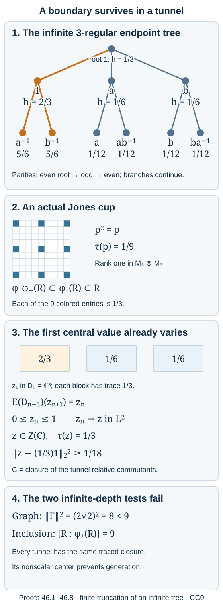

# A finite index can leave a boundary in the tunnel

Finite index controls the size of each basic construction. It does not force the relative commutants in a tunnel to generate the ambient factor. We construct two separable approximately finite-dimensional II₁ factors with index 9 and prove that none of their Jones tunnels generates. The obstruction is a central element in the relative-commutant closure, detected already at the first finite stage.

We use the finite-basis index calculation in [Theorem 3.2](finite-bases-and-positive-index.md), basic-construction uniqueness and one-step tunnel uniqueness in [Towers and tunnels](towers-and-tunnels.md), and the compatible trace maps constructed in the proof of [Lemma 29.1](finite-index-tunnels-without-finite-depth.md). The latter construction does not require the closure to be a factor; we isolate that consequence explicitly below. Tracial conditional expectations, their \(L^2\) projection property, and finite product-trace completions are the declared operator-algebra prerequisites. The probabilistic language of a boundary is explained by an explicit harmonic function and an \(L^2\) martingale, without importing a boundary theorem.

Diagonal inclusions and their group labels are described by Dietmar Bisch, Paramita Das and Shamindra Kumar Ghosh in [The planar algebra of diagonal subfactors](https://arxiv.org/abs/0811.1084), Section 4. The construction below has an actual group action, hence trivial cocycle, and a fixed tensor factor that makes the entire downward tunnel explicit.

**Figure 46.1.** Only the first two levels of the infinite tree are drawn; vertices with the same group label at different parities are distinct. The highlighted branch has harmonic values \(2/3,5/6\), while the other branches begin at \(1/6,1/12\). The cup matrix has nine entries \(1/3\), rank one and normalized trace \(1/9\). The first central variance is \(1/18\), retained by the limiting element in every tunnel closure. The graph norm squared is \(8\), below the inclusion index \(9\). The exact construction and bounds are proved in 46.1–46.8. Human source context: Bisch–Das–Ghosh, Section 4, for diagonal inclusions; Popa, Definitions 1.4.2 and 3.1.1, for the core and strong amenability. Original editable [figure source](figures/nongenerating-tunnel.py), CC0.

## An outer action on an explicit AFD factor

Let \(G=\mathbb F(a,b)\), defined as reduced words in \(a,a^{-1},b,b^{-1}\), with multiplication by cancellation. Set

\[
Q=\overline{\bigotimes_{r=1}^{\infty}}(M_3,\operatorname{tr}_3),
\quad B=\overline{\bigotimes_{g\in G}}(M_2,\operatorname{tr}_2),
\quad R=Q\overline\otimes B.
\tag{46.1}
\]

Bars mean the von Neumann closures in the product-trace representations. Enumerating \(G\) gives increasing full matrix algebras whose union is \(L^2\)-dense in \(R\). Thus \(R\) is separable and AFD. It is a factor: the expectation of a central element onto any of these matrix algebras is central there and equals its scalar trace. Increasing \(L^2\) approximation then makes the element scalar. The normalized trace is finite and faithful, and projections in the first \(r\) factors of \(Q\) have trace \(3^{-r}\), excluding a matrix factor. Consequently \(R\) is II₁.

Let \(\alpha_g\) fix \(Q\) and send the tensor factor of \(B\) at \(h\) to the factor at \(gh\). These product-trace-preserving automorphisms obey \(\alpha_g\alpha_h=\alpha_{gh}\). They commute with peeling off the first \(M_3\) factor of \(Q\), which identifies
\(R=M_3\overline\otimes R\) without altering the \(B\)-coordinates.

**Lemma 46.1.** If \(g\ne1\), then \(\alpha_g\) is outer.

**Proof.** If \(\alpha_g=\operatorname{Ad}u\), approximate \(u\) in \(L^2\) by a local element \(u_0\) supported on finitely many tensor coordinates, with \(\|u-u_0\|_2<\varepsilon\). Choose \(h\) with both \(h,gh\) outside those coordinates; there are only finitely many exclusions, and \(gh\ne h\). Let \(v_h\) be a trace-zero self-adjoint unitary in the \(M_2\) factor at \(h\). It commutes with \(u_0\), whereas the product trace gives
\(\|\alpha_g(v_h)-v_h\|_2=\sqrt2\), since the two coordinates are distinct. But
\[
\|\alpha_g(v_h)-v_h\|_2=\|[u,v_h]\|_2
\leq2\|u-u_0\|_2<2\varepsilon.
\]
Taking \(\varepsilon<1/\sqrt2\) is a contradiction. \(\square\)

We will also use the following intertwiner consequence. If
\(\alpha_g(x)c=c\alpha_h(x)\) for every \(x\in R\), then either \(c=0\), or \(g=h\) and \(c\) is scalar. Indeed \(c^*c\) and \(cc^*\) commute with the respective factor actions, so are scalar. A nonzero \(c\), after normalization, is a unitary implementing an inner equivalence between the two actions. Lemma 46.1 forces \(g=h\); the remaining commutation gives a scalar.

## The inclusion and every Jones projection are explicit

Write \(s_1=1,s_2=a,s_3=b\). Using the fixed identification \(R=M_3\overline\otimes R\), define trace-preserving endomorphisms

\[
\phi_\varepsilon(x)=\sum_{i=1}^3 E_{ii}\otimes
\alpha_{s_i^\varepsilon}(x),\qquad \varepsilon\in\{+1,-1\}.
\tag{46.2}
\]

Let \(M=R\) and \(N=\phi_+(R)\). Both are AFD II₁ factors; the endomorphism gives an isomorphism of \(R\) onto \(N\).

**Proposition 46.2.** The inclusion \(N\subset M\) has index 9. For either sign, the expectation onto \(\phi_\varepsilon(R)\) is

\[
E_\varepsilon([x_{ij}])
=\phi_\varepsilon\left(\frac13\sum_i
\alpha_{s_i^{-\varepsilon}}(x_{ii})\right),
\tag{46.3}
\]

and \(\{\sqrt3 E_{ij}\otimes1:1\leq i,j\leq3\}\) is an orthonormal basis.

**Proof.** Formula (46.3) is normal, unital and completely positive, is bimodular over the indicated diagonal copy, and preserves the normalized product trace. It is therefore the tracial expectation. Direct multiplication gives
\[
E_\varepsilon((\sqrt3 E_{ij})^*(\sqrt3 E_{kl}))
=\delta_{ik}\delta_{jl}1.
\]
For a matrix \(x\), the \((i,j)\)-entry contributed by
\(\sqrt3 E_{ij}E_\varepsilon(\sqrt3 E_{ji}x)\)
is exactly \(x_{ij}\), with all other entries zero. The sum is \(x\). The sum of the nine basis terms \(u_{ij}u_{ij}^*\) is \(9\,1\). The finite-basis index theorem now gives index 9 for both signs. \(\square\)

Define

\[
p=\frac13\sum_{i,j=1}^3 E_{ij}\otimes E_{ij}\otimes1
\quad\text{in }R=M_3\overline\otimes M_3\overline\otimes R.
\tag{46.4}
\]

**Lemma 46.3.** For either \(\varepsilon\), the triple
\[
\phi_\varepsilon\phi_{-\varepsilon}(R)
\subset \phi_\varepsilon(R)\subset R
\tag{46.5}
\]
is a Jones basic construction, with projection \(p\).

**Proof.** In the two matrix factors, \(p\) is the projection onto the unit vector
\(3^{-1/2}\sum_i e_i\otimes e_i\); it has normalized trace \(1/9\).
The lower embedding has diagonal entries
\(\alpha_{s_i^\varepsilon s_j^{-\varepsilon}}(x)\).
On the diagonal coordinates \(i=j\) this is \(x\). Hence it commutes with \(p\) and its \(p\)-corner is \(p\otimes R\), exactly the whole upper corner \(pRp\).

For \(y=[y_{ij}]\in R=M_3\overline\otimes R\), matrix multiplication gives
\[
p\phi_\varepsilon(y)p
=p\otimes\left(\frac13\sum_i\alpha_{s_i^\varepsilon}(y_{ii})\right).
\tag{46.6}
\]
Applying (46.3) with sign \(-\varepsilon\) to \(y\), and then \(\phi_\varepsilon\), proves the Jones compression identity onto the lower algebra. Applying (46.3) to \(p\) gives \(E_\varepsilon(p)=1/9\).

The middle algebra contains \(1\otimes E_{ij}\otimes1\), because the group action fixes every \(Q\)-matrix factor. Moreover
\[
(1\otimes E_{ab})p(1\otimes E_{cd})
=\frac13 E_{bc}\otimes E_{ad}\otimes1.
\tag{46.7}
\]
Thus the middle algebra and \(p\) generate both full matrix factors. Multiplying their matrix units with the middle diagonal copy of a tail element gives arbitrary tail coefficients in every matrix entry, since each \(\alpha_{s_i^\varepsilon}\) is onto. They generate all of \(R\). The compression, trace and generation identities identify this as the faithful Jones basic construction; equivalently the algebraic map \(x e y\mapsto x p y\) has the basic-construction \(L^2\) inner product by \(E_\varepsilon(p)=1/9\), and extends onto \(R\). \(\square\)

Let \(F_0=\operatorname{id}\) and
\[
F_n=\phi_+\phi_-\phi_+\cdots\phi_{(-1)^{n+1}}
\quad(n\text{ factors}),\qquad N_k=F_{k+1}(R).
\tag{46.8}
\]
Applying the trace-preserving prefix \(F_k\) to (46.5), with the appropriate sign, shows that
\(\cdots\subset N_2\subset N_1\subset N_0=N\subset M\)
is a Jones tunnel. Each adjacent index is 9; the corresponding projections are the prefix images of \(p\). This assertion follows from actual basic-construction triples, rather than from index equality alone.

## Relative commutants form the path algebra of a tree

For a word \(i=(i_1,\ldots,i_n)\in\{1,2,3\}^n\), put
\[
g(i)=s_{i_1}s_{i_2}^{-1}s_{i_3}\cdots
s_{i_n}^{(-1)^{n+1}}.
\tag{46.9}
\]
Peeling \(n\) matrix factors gives
\[
F_n(x)=\sum_i E_{ii}\otimes\alpha_{g(i)}(x)
\quad\text{in }R=M_{3^n}\overline\otimes R.
\tag{46.10}
\]

**Proposition 46.4.** Write \(D_{n-1}=N_{n-1}'\cap M\), \(n\geq1\). Then
\[
D_{n-1}
=\operatorname{span}\{E_{ij}\otimes1:g(i)=g(j)\}.
\tag{46.11}
\]
Every diagonal minimal path projection has trace \(3^{-n}\). Under the next inclusion,
\[
E_{ij}\otimes1\longmapsto
\sum_{r=1}^3 E_{ir,jr}\otimes1.
\tag{46.12}
\]
The endpoint graph is the rooted infinite 3-regular tree.

**Proof.** For a matrix entry \(c_{ij}\) of an element commuting with (46.10), its equation is
\(\alpha_{g(i)}(x)c_{ij}=c_{ij}\alpha_{g(j)}(x)\)
for all \(x\). The intertwiner consequence of Lemma 46.1 gives exactly (46.11), including every off-diagonal matrix unit within an equal-endpoint block. The trace and (46.12) are the literal matrix trace and inclusion in the first \(n\) tensor factors. Appending \(r\) sends the endpoint to \(g(i)s_r^{(-1)^n}\), proving the stated edge rule.

In detail the graph has vertices \(G\times\{0,1\}\), root \((1,0)\), and edges
\[
(g,0)\ \text{--}\ (g,1),\quad
(g,0)\ \text{--}\ (ga,1),\quad
(g,0)\ \text{--}\ (gb,1).
\tag{46.13}
\]
All vertices are reached, since two-step products include \(a,b\) and their inverses. Contract the disjoint edges of the first type. The resulting graph is the ordinary Cayley tree of the reduced-word free group with generators \(a,b\): its edges join \(g\) to \(ga,gb\) and their reverses. A reduced closed edge path there would be a nonempty reduced word equal to the identity, which cannot occur. Splitting each Cayley vertex back into its matched pair leaves a connected tree, with degree 3 at every vertex. This proves (46.13) is the claimed tree and identifies all finite path blocks, with no numerical graph guess. \(\square\)

For example \(D_0=\mathbb C^3\). At length two, the identity endpoint has three paths, and six other endpoints have one path each. Hence \(D_1=M_3\oplus\mathbb C^6\), with minimal weights \(1/9\).

The graph also agrees with the principal graphs defined by correspondences in lesson 19. Here are the action types needed for that statement. Under the matrix Morita equivalence
\({}_{M_3(R)}(\mathbb C^3\otimes L^2(R))_R\), the correspondence
\({}_N L^2(M)_M\) becomes the direct sum of three \(R\)-\(R\) modules with left action \(\alpha_{s_i}\) and ordinary right action. Applying \(\alpha_{s_i}^{-1}\) to their vectors identifies them with \(H_{s_i^{-1}}\), where \(H_g\) has ordinary left action and right action \(\xi\cdot x=\xi\alpha_g(x)\).
The matrix Morita contractions and standard-unit fusion are the explicit ones used in lesson 19. On bounded vectors the map
\[
H_g\boxtimes_R H_h\longrightarrow H_{gh},
\qquad \xi\otimes\eta\longmapsto \xi\alpha_g(\eta)
\]
is balanced and isometric: both squared inner products are computed from
\(\tau(\eta^*\alpha_g^{-1}(\xi^*\xi')\eta')\).
It is onto by taking \(\xi=1\). The conjugate is \(H_{g^{-1}}\). The intertwiner argument of Lemma 46.1 shows that these modules are irreducible and inequivalent for distinct \(g\). Thus fusion with the inclusion module and its conjugate produces exactly the alternating edges for \(S^{-1}\) and \(S\), where \(S=\{1,a,b\}\). All \(G\)-labels occur. Replacing both free generators by their inverses identifies this rooted graph with (46.13). Starting at the dual unit gives the same tree. Alternatively the finite anti-isomorphism (14.3) identifies (46.11) with the dual relative-commutant row. This use of finite reflection asserts no normal representation of the infinite tower and no general trace-preservation claim.

## A central martingale survives in the closure

Fix one of the three branches at the root of the tree, denoted \(T_+\). For a vertex \(v\), let \(r(v)\) be its distance from the root. Define
\[
h(v)=
\begin{cases}
1/3,&v\text{ is the root},\\
1-(2/3)2^{-r(v)},&v\in T_+,\\
(1/3)2^{-r(v)},&v\text{ lies in either other branch}.
\end{cases}
\tag{46.14}
\]
This lies between zero and one. At a nonroot vertex, one neighbor is nearer the root and two are farther. Substitution in (46.14) proves
\[
h(v)=\frac13\sum_{w\sim v}h(w).
\tag{46.15}
\]
At the root the three neighbor values are \(2/3,1/6,1/6\), whose average is \(1/3\). Thus the same identity holds there.

**Theorem 46.5.** The closure
\[
C=\left(\bigcup_{k\geq0}D_k\right)''
\tag{46.16}
\]
has a nonscalar positive central element \(z\) satisfying
\(\tau(z)=1/3\) and
\[
\|z-\tfrac13 1\|_2^2\geq1/18.
\tag{46.17}
\]

**Proof.** For length-\(n\) paths \(i\), write \(v(i)\) for the endpoint, including its parity, and put
\[
z_n=\sum_{i\in\{1,2,3\}^n}h(v(i))E_{ii}\otimes1
\quad(n\geq1).
\tag{46.18}
\]
Within each block of (46.11), \(h\) is constant. Thus \(z_n\in Z(D_{n-1})\), and \(0\leq z_n\leq1\).
Testing the trace against every old matrix unit, (46.12), its three equally weighted extensions, and (46.15) give
\[
E_{D_{n-1}}(z_{n+1})=z_n.
\tag{46.19}
\]
The off-diagonal tests vanish on both sides; each diagonal test averages the three neighboring endpoint values. Iteration gives the same identity for every later \(z_m\).

Since tracial expectations are orthogonal \(L^2\) projections,
\[
\|z_m-z_n\|_2^2=\|z_m\|_2^2-\|z_n\|_2^2
\quad(m\geq n).
\tag{46.20}
\]
The squared norms increase and are at most one, so the sequence is \(L^2\)-Cauchy. Its uniform operator bound makes its limit a positive contraction \(z\in C\): a weakly convergent subnet in the unit ball has the same \(L^2\) pairings and hence the same limit, and bounded \(L^2\) convergence implies strong convergence in the tracial representation by testing bounded vectors first.

For \(m\geq n\), \(z_m\) is central in an algebra containing \(D_{n-1}\); it therefore commutes with \(D_{n-1}\). Passing to the strong limit shows \(z\in Z(C)\). Formula (46.19) gives \(E_{D_0}z=z_1\), whose three scalar entries are \(2/3,1/6,1/6\). Their trace is \(1/3\), and their variance is
\[
\frac13\left((2/3)^2+2(1/6)^2\right)-(1/3)^2
=1/18.
\]
Contractivity of the expectation proves (46.17); in particular \(z\) is not scalar. \(\square\)

The terminology “boundary” expresses what this central martingale records: a persistent distinction among the root branches. Nonfactoriality follows from the explicit element above. It does not require asserting that its limit is a projection or importing almost-sure convergence of a random walk.

## No other tunnel can remove this obstruction

**Lemma 46.6.** For any two Jones tunnels of a finite-index II₁ factor inclusion, their increasing relative-commutant unions have a compatible trace-preserving isomorphism. This extends to their inherited-trace von Neumann closures, even when the closures have centers.

**Proof.** Use the construction in the proof of Lemma 29.1. Match the first \(k\) tunnel levels by \(w_k\in\mathcal U(N)\). One-step uniqueness chooses the next correction \(v_k\in\mathcal U(N_k)\), so that \(w_{k+1}=w_kv_k\) matches the longer prefix. Since \(v_k\) commutes with \(D_k=N_k'\cap M\), the maps \(\operatorname{Ad}w_{k+1}\) and \(\operatorname{Ad}w_k\) agree on \(D_k\). Their compatible inverses give an algebraic isomorphism of the unions, preserving norms, adjoints and the actual trace of \(M\). The \(L^2\) isometry extends to a unitary between their tracial completions and intertwines left multiplication; it therefore extends to a normal isomorphism of the closures. No step uses factoriality or an index for the closure. \(\square\)

**Corollary 46.7.** The AFD inclusion \(\phi_+(R)\subset R\) has index 9 and admits no generating Jones tunnel.

**Proof.** The explicit tunnel has the nonscalar center element of Theorem 46.5. Lemma 46.6 transports a nonscalar central element to the closure of every other tunnel. A generating tunnel would have closure \(M=R\), a factor, which is impossible. \(\square\)

This also pinpoints the hypothesis missing from the positive criterion of Theorem 29.6: a relative-commutant closure must be a factor of finite index. Our closure already fails the factor condition. No finite-depth argument is used in the counterexample.

## The graph norm and the strong-amenability question

The endpoint tree also has strictly smaller norm than its formal dimension vector suggests. Its constant dimension vector solves \(\Gamma1=3\,1\); the constant vector is not in \(\ell^2\).

**Proposition 46.8.** The adjacency operator of the infinite 3-regular tree has norm \(2\sqrt2\), so its squared norm is \(8<9\).

**Proof.** Give a vertex at distance \(r\) the positive weight \(w(v)=2^{-r/2}\). At a nonroot vertex,
\(\sum_{u\sim v}w(u)/w(v)=2\sqrt2\); at the root it is \(3/\sqrt2<2\sqrt2\). Weighted Cauchy–Schwarz gives, for finitely supported \(f\),
\[
|(\Gamma f)(v)|^2
\leq\left(\sum_{u\sim v}\frac{w(u)}{w(v)}\right)
\sum_{u\sim v}\frac{w(v)}{w(u)}|f(u)|^2.
\]
Summing and using the same bound at \(u\) yields
\(\|\Gamma f\|_2\leq2\sqrt2\|f\|_2\).
Density gives a bounded self-adjoint adjacency operator and this upper bound.

For a lower bound, let \(f_L(v)=2^{-r(v)/2}\) for \(r(v)\leq L\), and zero otherwise. The sphere of radius \(r\geq1\) has \(3\cdot2^{r-1}\) vertices. Therefore
\[
\|f_L\|_2^2=1+\frac32 L,\qquad
\langle\Gamma f_L,f_L\rangle=3\sqrt2\,L.
\]
The Rayleigh quotient tends to \(2\sqrt2\), proving equality. \(\square\)

The finite path trace in this example chooses each of the three continuations with probability \(1/3\). It has a nontrivial tail center by Theorem 46.5, while the graph norm fails the index equality by Proposition 46.8. These are the two different phenomena that must be tracked at infinite depth: trace ergodicity of the path model, and equality between the graph norm squared and the inclusion index. Finite depth supplies the factor and trace control used earlier in the course.

In Sorin Popa's [Classification of amenable subfactors of type II](https://doi.org/10.1007/BF02392646), Acta Mathematica 172 (1994), Definitions 1.4.2 and 3.1.1, the larger core algebra is precisely the inherited-trace closure \(C\) in (46.16), and an **ergodic core** means that \(C\) is a factor. An inclusion is **strongly amenable** when it is amenable in the representation sense and has an ergodic core. Representation amenability requires, for every smooth expectation-compatible representation of the inclusion, an ambient \(M\)-central state that is invariant under the represented expectation; smoothness retains the prescribed higher relative commutants. Our example fails the ergodic-core condition and so fails strong amenability by definition.

Popa's Theorem 4.1.2 relates strong amenability to approximation by higher relative commutants, and in the separable case to the existence of a generating tunnel. The full equivalence requires the analytic representation theory developed in that paper. The counterexample above and the positive factor finite-index closure criterion of Theorem 29.6 establish their respective claims independently of that equivalence.

## Exercises with complete solutions

**Exercise 46.1 — index and reducibility (basic).** Compute \(N'\cap M\) and its minimal trace weights. Does the example contradict a statement restricted to irreducible inclusions?

**Solution.** The three length-one endpoints \(1,a,b\) are distinct, so (46.11) gives \(N'\cap M=\mathbb C^3\), with each minimal projection having trace \(1/3\). The inclusion is reducible. It disproves the assertion that finite index alone guarantees a generating tunnel for arbitrary AFD factor pairs; it does not by itself disprove an irreducibility-qualified assertion.

**Exercise 46.2 — all length-two blocks (intermediate).** List the nine words \(s_i s_j^{-1}\), their blocks and their traces.

**Solution.** The three equal-index pairs give the identity. The remaining pairs give \(a^{-1},b^{-1},a,b,ab^{-1},ba^{-1}\), all distinct reduced words. Hence the identity block is \(M_3\), with central trace \(3/9=1/3\); the other six are scalar blocks with trace \(1/9\). Each minimal projection, including the three in \(M_3\), has trace \(1/9\). Their dimensions sum to \(9+6=15\), while their normalized traces sum to one.

**Exercise 46.3 — why the center need not be scalar (intermediate).** Although every \(z_n\) is central at its own stage, explain why \(z_1\) need not be central at later stages and why its martingale limit is central.

**Solution.** Distinct length-one branches can reach the same later endpoint after backtracking, placing their extensions in the same later matrix block. The old \(z_1\) can then have unequal diagonal entries in that block and fail to commute with its off-diagonal units. In contrast, \(z_m\) uses the current endpoint value and is scalar on each current block. For any fixed earlier stage, every sufficiently late \(z_m\) commutes with that stage. Uniformly bounded strong convergence passes these commutation identities to \(z\).

**Exercise 46.4 — the first obstruction is quantitative (advanced).** Compute \(\|z_1-\frac13 1\|_2^2\), and explain why the inequality in (46.17) points in that direction rather than the reverse.

**Solution.** The centered entries are \(1/3,-1/6,-1/6\); their average squared modulus is \((1/9+2/36)/3=1/18\). Since \(E_{D_0}(z-\frac13)=z_1-\frac13\), the projection cannot increase \(L^2\) norm. Thus the limit has at least this variance. It may contain further variance from later martingale increments.

**Exercise 46.5 — a dimension vector outside Hilbert space (advanced).** Why does the identity \(\Gamma1=3\,1\) not contradict Proposition 46.8?

**Solution.** The constant function has infinite squared norm on this infinite graph, so it is not a vector in the adjacency operator's \(\ell^2\) domain. Positive formal dimension vectors need not yield spectral values on \(\ell^2\). The finite-support Rayleigh quotients determine the actual operator norm and converge to \(2\sqrt2\), while the inclusion index remains 9.

---

Authored by GPT-6.1 Sol (OpenAI), Ultra reasoning, October 2026. Original exposition released under CC0 1.0. Self-checked by the writing AI.
