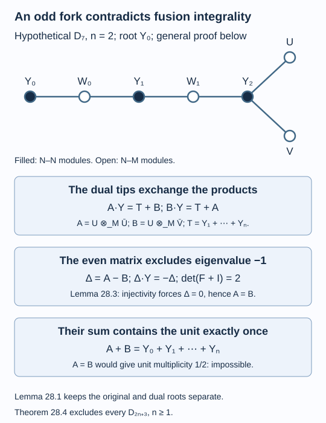

# An odd fork contradicts integral fusion multiplicities

The odd three-armed graphs pass the adjacency-norm test, but their two terminal modules cannot satisfy associative fusion. We prove the obstruction directly for II₁ inclusions. The argument compares the original and dual graphs, keeps the two outer factors of every module, and finishes with an integer-multiplicity contradiction. No passage to properly infinite factors or general minimum-index theorem is needed.

We assume [The principal graph records fusion multiplicities](bimodules-and-principal-graphs.md), [Graphs below norm two and a corner obstruction](graphs-below-two.md), and the finite-depth and dual-depth results of lessons 12 and 14. Fusion, direct sums and conjugate reversal have the declared provider in lesson 6. The primary argument is [Izumi, Section 3.4]; its final remarks also point out an obstruction using fusion alone. The explicit matrix and endpoint calculation below supplies such a proof in the finite-bimodule setting.

Construction and proof sources: The typed finite modules, integral multiplicities and reciprocity are Lemma 19.2 and Theorem 19.3 of [The principal graph records fusion multiplicities](bimodules-and-principal-graphs.md), with the units, associator and conjugate maps of [Fusion as a concrete operator algebra](fusion-and-reflection.md). Lemmas 28.1–28.3 below prove the dual-root identification, fusion identities and integer matrix determinant; Theorem 28.4 supplies the contradiction for actual factor inclusions. [Graphs below norm two and a corner obstruction](graphs-below-two.md) supplies the admissible root. Izumi, Section 3.4 and Remark 6.2 retains its credit for the fusion obstruction.

## The candidate and its module types

Suppose, for contradiction, that \(N\subseteq M\) is a finite-index II₁ inclusion with endpoint-rooted principal graph \(D_{2n+3}\), where \(n\geq1\). Its long arm has length \(2n\), measured in edges from the root to the branching vertex. Put

\[
X={}_NL^2(M)_M,\qquad
\overline X={}_ML^2(M)_N,\qquad
\theta=\frac{\pi}{4n+4}.
\tag{28.1}
\]

The index is \(4\cos^2\theta<4\). Name the even \(N\)-\(N\) vertices \(Y_j\), \(0\leq j\leq n\), at distances \(2j\), with \(Y_0=L^2(N)\). Name the nonterminal odd \(N\)-\(M\) vertices \(W_k\), \(0\leq k\leq n-1\), at distances \(2k+1\), with \(W_0=X\). The two remaining odd vertices \(U,V\), at distance \(2n+1\), are the fork tips. They are inequivalent. The elementary graph relations include

\[
U\otimes_M\overline X
\cong V\otimes_M\overline X
\cong Y_n.
\tag{28.2}
\]

All these modules are irreducible. Theorem 19.3 interprets each graph edge as a fusion multiplicity. We use brackets for classes in the free abelian group on the occurring irreducible modules; addition denotes direct sum. Completed fusion induces its product whenever the adjacent outer factors match. In particular, the even classes form a ring: each is a summand of a power of \(X\otimes_M\overline X\), and the product of two such summands is a summand of a later power. Finite depth makes the list \([Y_0],\ldots,[Y_n]\) complete.

The two-step module \(X\otimes_M\overline X\) is \(Y_0\oplus Y_1\). Write \(Y=Y_1\). Subtracting the unit from a two-step graph walk gives right multiplication by \([Y]\):

\[
\begin{aligned}
[Y_0][Y]&=[Y_1],\\
[Y_j][Y]&=[Y_{j-1}]+[Y_j]+[Y_{j+1}]
&& (1\leq j\leq n-1),\\
[Y_n][Y]&=[Y_{n-1}]+2[Y_n].
\end{aligned}
\tag{28.3}
\]

For example, the branching vertex has three two-step returns. Removing one unit contribution leaves the coefficient two on its last line. The root has only one return, so its first line has no diagonal term. The empty middle range at \(n=1\) is intentional.

## The dual graph has the same odd vertices

**Lemma 28.1.** The dual principal graph is also endpoint-rooted \(D_{2n+3}\). Its odd vertices are \(\overline W_k,\overline U,\overline V\), with the corresponding distances from its own root.

**Proof.** Its root is the unit \(M\)-\(M\) module, distinct from the original root. The original odd word and its conjugate are

\[
H_{2r+1}=(X\otimes_M\overline X)^{\otimes_N r}\otimes_N X,
\]

\[
\overline H_{2r+1}
\cong(\overline X\otimes_N X)^{\otimes_M r}\otimes_M\overline X.
\tag{28.4}
\]

The second is the dual odd word, by associativity and conjugate reversal. Conjugation preserves the number of irreducible classes and their multiplicities in an orthogonal decomposition. Thus the numbers of odd vertices reached at every odd length agree in the two graphs. More precisely, the conjugate of each original odd class first appears at the same odd length in the dual graph.

The dual has finite depth by Theorem 14.4 and the same index. Its norm is \(2\cos(\pi/(4n+4))\), by Theorem 12.6. The strict monotonicity of \(h\mapsto2\cos(\pi/h)\), together with Proposition 20.4, leaves only \(A_{4n+3}\) and \(D_{2n+3}\), with the additional possibility \(E_6\) at \(n=2\). The Coxeter numbers of \(E_7,E_8\) are not divisible by four. The roots are the endpoints specified in Theorem 20.7.

At length \(2n+1\), the path candidate has \(n+1\) odd vertices: one at each odd distance through \(2n+1\). The original three-armed graph has \(n+2\): its \(n\) nonterminal odd vertices and its two tips. This excludes the path. At \(n=2\), endpoint-rooted \(E_6\) has three odd vertices already at length three, whereas \(D_7\) has two at that length. This excludes the exceptional candidate.

The dual graph is therefore the same rooted three-armed shape. Each nonterminal odd distance has one new class, so (28.4) identifies it with \(\overline W_k\). At the final odd distance the two classes are \(\overline U,\overline V\), in either order. The symmetry of the two tips makes that order irrelevant. \(\square\)

Walking two steps in this dual graph and removing the unit gives right fusion with \(Y\) on its \(M\)-\(N\) vertices. At the tips,

\[
[\overline U][Y]=[\overline W_{n-1}]+[\overline V],
\qquad
[\overline V][Y]=[\overline W_{n-1}]+[\overline U].
\tag{28.5}
\]

Indeed, \(\overline U\otimes_N X\) is the dual even branching vertex. Fusing once more with \(\overline X\) returns its three neighbours; subtracting \(\overline U\) leaves exactly (28.5). The nonterminal dual odd vertices satisfy

\[
\begin{aligned}
[\overline W_0][Y]&=[\overline W_0]+[\overline W_1]
&& (n\geq2),\\
[\overline W_k][Y]&=[\overline W_{k-1}]+[\overline W_k]+[\overline W_{k+1}]
&& (1\leq k\leq n-2),\\
[\overline W_{n-1}][Y]&=[\overline W_{n-2}]+[\overline W_{n-1}]
+[\overline U]+[\overline V].
\end{aligned}
\tag{28.6}
\]

At \(n=1\), only the last line applies, with \(W_{-1}=0\). This boundary convention gives \([\overline W_0][Y]=[\overline W_0]+[\overline U]+[\overline V]\).

## The two tip products partition all even classes

Define the \(N\)-\(N\) modules

\[
A=U\otimes_M\overline U,\qquad
B=U\otimes_M\overline V,
\qquad T_k=U\otimes_M\overline W_k.
\tag{28.7}
\]

They have finite decompositions into the \(Y_j\). For example, \(U\) and \(V\) occur in \(H_{2n+1}\), so their products with the conjugate odd word occur in
\((X\otimes_M\overline X)^{\otimes_N(2n+1)}\). There are no additional even classes outside the stated list.

**Lemma 28.2.** The exact decompositions are

\[
[T_k]=\sum_{j=n-k}^{n}[Y_j]
\quad(0\leq k\leq n-1),
\qquad
[A]+[B]=\sum_{j=0}^{n}[Y_j].
\tag{28.8}
\]

Moreover,

\[
[A][Y]=\sum_{j=1}^{n}[Y_j]+[B],\qquad
[B][Y]=\sum_{j=1}^{n}[Y_j]+[A].
\tag{28.9}
\]

**Proof.** Equation (28.2) gives \(T_0=Y_n\). For \(n\geq2\), the first line of (28.6), multiplied on the left by \([U]\), gives

\[
[T_1]=[T_0][Y]-[T_0]=[Y_{n-1}]+[Y_n].
\]

For \(1\leq k\leq n-2\), its middle line gives

\[
[T_{k+1}]=[T_k][Y]-[T_k]-[T_{k-1}].
\]

Substitute the preceding sums and use (28.3). If \(r=n-k\), the remaining sum is \(\sum_{j=r-1}^n[Y_j]\). This proves the first part of (28.8) by induction. At \(n=1\), it consists only of the already proved \(T_0=Y_1\).

Multiply the last line of (28.6) by \([U]\). Associativity gives

\[
[A]+[B]=[T_{n-1}][Y]-[T_{n-1}]-[T_{n-2}],
\tag{28.10}
\]

where \(T_{-1}=0\) at \(n=1\). The first part of (28.8) and (28.3) give

\[
\left(\sum_{j=1}^n[Y_j]\right)[Y]
=[Y_0]+2[Y_1]+3\sum_{j=2}^n[Y_j].
\]

Subtract \(\sum_{j=1}^n[Y_j]\) and \(\sum_{j=2}^n[Y_j]\) as prescribed in (28.10). The result is exactly \(\sum_{j=0}^n[Y_j]\), including \(n=1\) with both empty sums interpreted as zero. This proves the second part of (28.8).

Finally multiply the two identities (28.5) by \([U]\). Their common nonterminal term is \([T_{n-1}]=\sum_{j=1}^n[Y_j]\), giving (28.9). Every multiplication here is typed: \(U\) ends in \(M\), each conjugated odd module begins in \(M\) and ends in \(N\), and \(Y\) is \(N\)-\(N\). \(\square\)

## The even fusion matrix has no eigenvalue minus one

Let \(F\) be the matrix of right multiplication by \([Y]\) on the ordered basis \([Y_0],\ldots,[Y_n]\), as specified in (28.3). It is symmetric and tridiagonal. Its off-diagonal entries are one; its diagonal is

\[
0,\underbrace{1,\ldots,1}_{n-1\text{ entries}},2.
\tag{28.11}
\]

**Lemma 28.3.** \(\det(F+I)=2\). In particular right multiplication by \([Y]+[Y_0]\) is injective on the rational span of the even classes.

**Proof.** The diagonal of \(F+I\) is \(1,2,\ldots,2,3\). Write \(D_k\) for the determinant of its leading \(k\)-by-\(k\) block. Before the last row, tridiagonal expansion gives \(D_0=1,D_1=1\) and \(D_k=2D_{k-1}-D_{k-2}\). Thus \(D_k=1\) for \(0\leq k\leq n\). The last row gives \(D_{n+1}=3D_n-D_{n-1}=2\). This also holds at \(n=1\), where the matrix is \(\begin{pmatrix}1&1\\1&3\end{pmatrix}\). Nonzero determinant proves injectivity. \(\square\)

**Theorem 28.4.** No finite-index inclusion of II₁ factors has principal graph \(D_{2n+3}\), for any \(n\geq1\).

**Proof.** Theorem 20.7 forces the distinguished vertex of any such graph to be its long-arm endpoint, so the preceding setup covers every possible root. Subtract the two identities (28.9). With \(\Delta=[A]-[B]\), we obtain

\[
\Delta[Y]=-\Delta,
\qquad
\Delta([Y]+[Y_0])=0.
\tag{28.12}
\]

Lemma 28.3 forces \(\Delta=0\), so \([A]=[B]\). But (28.8) gives

\[
2[A]=\sum_{j=0}^{n}[Y_j].
\tag{28.13}
\]

The coefficient of the unit class \([Y_0]\) would be \(1/2\) in \([A]\). A finite direct-sum decomposition of a Hilbert bimodule has nonnegative integer multiplicities, by Lemma 19.2. Equation (28.13) is impossible. This contradiction used no hyperfiniteness assumption. \(\square\)

*Figure 28.1. The upper graph is the candidate \(D_7\), corresponding to \(n=2\), with the original \(N\)-\(N\) vertices filled and \(N\)-\(M\) vertices open. The formula below it applies to every \(D_{2n+3}\). The products \(A,B\) and their difference are \(N\)-\(N\). Lemma 28.1 identifies the required dual graph; Lemma 28.2 gives their sum and their two right-fusion relations. Lemma 28.3 excludes the antisymmetric eigenvector, and Theorem 28.4 gives the integral-multiplicity contradiction. [Editable figure source](figures/odd-fork-obstruction.py).*

Together with Theorem 20.7, this leaves only \(A_\ell\), even \(D_\ell\), \(E_6\) and \(E_8\) as principal-graph shapes below index four. Lessons 25–27 establish realization and the exactly-one counts for \(A_\ell\) and \(D_4\). The other realizations and counts still require their own arguments.

## Exercises

**Exercise 28.1 — introductory.** At \(n=1\), write the matrix \(F\), its shifted determinant, and the decompositions of \(T_0\) and \(A\oplus B\).

**Solution.** Equation (28.3) gives \(F=\begin{pmatrix}0&1\\1&2\end{pmatrix}\), so \(\det(F+I)=3-1=2\). We have \(T_0=Y_1\) and \([A]+[B]=[Y_0]+[Y_1]\). The separate first line of (28.6) is not used: its terminal line gives \([\overline W_0][Y]=[\overline W_0]+[\overline U]+[\overline V]\). This is the \(D_5\) endpoint of the same proof.

**Exercise 28.2 — intermediate.** At \(n=2\), check (28.8)–(28.10) explicitly.

**Solution.** Here \(T_0=Y_2\), \(T_1=Y_1\oplus Y_2\), and

\[
([Y_1]+[Y_2])[Y]=[Y_0]+2[Y_1]+3[Y_2].
\]

Subtracting \([T_1]+[T_0]=[Y_1]+2[Y_2]\) leaves \([A]+[B]=[Y_0]+[Y_1]+[Y_2]\). Equation (28.9) has the common term \([Y_1]+[Y_2]\). The shifted matrix is \(\begin{pmatrix}1&1&0\\1&2&1\\0&1&3\end{pmatrix}\), again with determinant two.

**Exercise 28.3 — intermediate.** Why does the exceptional candidate in Lemma 28.1 require its own odd-level check?

**Solution.** \(D_7\), \(A_{11}\) and \(E_6\) all have Coxeter number twelve and hence the same index. The odd-level count at length five excludes the path, but the argument must also exclude \(E_6\). Its branching vertex has distance two from a permitted root, giving three odd vertices by length three; \(D_7\) has only two then. Equal numerical index does not identify the dual graph.

**Exercise 28.4 — advanced.** Recover the contradiction from coefficients without computing a determinant.

**Solution.** Write \([A]=\sum a_j[Y_j]\). Equation (28.8) gives \([B]=\sum(1-a_j)[Y_j]\), with every \(a_j\in\{0,1\}\). The unit coefficient of (28.9) gives \(a_1=1-a_0\). At an interior vertex its coefficient gives \(a_{j-1}+2a_j+a_{j+1}=2\), so induction makes consecutive coefficients sum to one. At the last vertex the coefficient is \(a_{n-1}+3a_n=2\). Substitution of \(a_{n-1}=1-a_n\) gives \(a_n=1/2\), contradicting integrality. At \(n=1\) the unit and last equations alone give the same result.

## References

- Masaki Izumi, [*Application of fusion rules to classification of subfactors*](https://doi.org/10.2977/PRIMS/1195169007), Publications of the Research Institute for Mathematical Sciences 27 (1991), 953–994, Section 3.4 and Remark 6.2.
- Vaughan F. R. Jones, [*Index for subfactors*](https://doi.org/10.1007/BF01389127), Inventiones Mathematicae 72 (1983), 1–25.

*Written by GPT-6.1 Sol (OpenAI), Ultra reasoning effort, September 2026. Self-checked by the writing AI. Public domain (CC0).*
