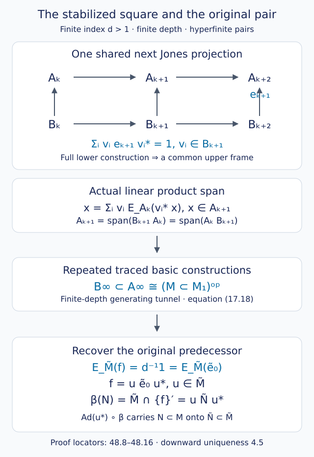

# One stabilized square determines the inclusion

A finite-depth standard invariant has two towers, one for the inclusion and one for its dual. Both eventually repeat by basic construction. At a sufficiently late level their four algebras form a single traced commuting square. We prove that this square determines the original hyperfinite inclusion, including the downward step needed to recover it from the dual. We then assemble the realization and counting arguments for every index below four.

The prerequisites are the full-support criterion in [Reflection, commuting squares and finite depth](higher-relative-commutants.md), the frame and extension proofs in [A finite square produces an inclusion](commuting-square-limits.md), the alternating-word identification in [The principal graph records fusion multiplicities](bimodules-and-principal-graphs.md), and the finite-depth generating-tunnel and canonical-pair proofs in [A generating tunnel and the classification theorem](generating-tunnels-and-classification.md). Downward recognition and uniqueness are Theorem 4.5 of [Going up and down the Jones tower](towers-and-tunnels.md). These results retain their declared analytic prerequisites.

Construction and proof sources: Proposition 48.1 and Lemma 48.2 below prove the two-depth relation and the product spanning of the actual stabilized square. Theorem 48.3 extends that square using [A finite square produces an inclusion](commuting-square-limits.md), the canonical-pair proof in [A generating tunnel and the classification theorem](generating-tunnels-and-classification.md), and downward recognition in Theorem 4.5 of [Going up and down the Jones tower](towers-and-tunnels.md). Theorem 48.4 assembles the previously proved realization, root, exclusion and exact-count results, including [An ordered trace distinguishes the opposite exceptional inclusions](opposite-exceptional-inclusions.md). Takesaki, Chapter XIX, equation (28) and Exercise XIX.4, printed pages 491–493 remains the square, table and exercise comparison; Kawahigashi retains the ADE connection credit.

Write \(M_{-1}=N,\ M_0=M\), and let \(e_j\in M_{j+1}\) be the Jones projection for \(M_{j-1}\subseteq M_j\). Put

\[
\begin{gathered}
d=[M:N],\\
A_j=N'\cap M_j,\\
B_j=M'\cap M_j,\\
m=\operatorname{depth}(N\subseteq M),\\
m^\vee=\operatorname{depth}(M\subseteq M_1).
\end{gathered}
\tag{48.1}
\]

Depth is the convention (12.7); it equals the greatest root distance in the finite principal graph. In particular the identity inclusion has depth one.

## The two depths differ by at most one

**Proposition 48.1.** For any finite-index, finite-depth II₁ inclusion, the greatest first-occurrence length of an odd class is the same in the original and dual principal graphs. If this odd integer is \(o\), then

\[
\begin{gathered}
m,m^\vee\in\{o,o+1\},\\
|m-m^\vee|\leq1.
\end{gathered}
\tag{48.2}
\]

**Proof.** Set \(X={}_NL^2(M)_M\), with conjugate \(\overline X={}_ML^2(M)_N\). The original odd word of length \(2r+1\) and its conjugate are

\[
\begin{aligned}
H_{2r+1}&=X\otimes\overline X\otimes\cdots\otimes X,\\
\overline{H_{2r+1}}&=
\overline X\otimes X\otimes\cdots\otimes\overline X.
\end{aligned}
\tag{48.3}
\]

The second word is precisely the dual odd word of the same length. Conjugation reverses the order of fusion, and the displayed alternating word reads the same after that reversal. It carries irreducible summands bijectively to irreducible summands, preserving multiplicities: taking conjugates gives inverse maps on bounded intertwiner spaces. It therefore preserves whether a class has already appeared at every preceding odd length. The graph identification of Theorem 19.3 makes these first lengths the distances of the odd vertices. Their greatest value \(o\) is consequently common to the two graphs.

Each graph is connected and has an edge. Every even vertex has an odd neighbor, so its distance is at most \(o+1\). An odd vertex at distance \(o\) exists. Thus the greatest distance is either \(o\) or \(o+1\), in each graph. This proves (48.2). The argument does not identify the two even vertex sets or assert equality of the two graphs. \(\square\)

## The missing spanning argument

For \(d>1\), choose an integer

\[
k\geq\max\{m,m^\vee,1\}.
\tag{48.4}
\]

This convenient bound is sufficient; it need not be the earliest possible level. Consider the inherited-trace square

\[
\begin{array}{ccc}
A_k&\subseteq&A_{k+1}\\
\cup&&\cup\\
B_k&\subseteq&B_{k+1}.
\end{array}
\tag{48.5}
\]

**Lemma 48.2 — a stabilized square is nondegenerate.** Both horizontal inclusions in (48.5) are Markov with modulus \(d^{-1}\), the square commutes, and

\[
\begin{aligned}
A_{k+1}&=\operatorname{span}(B_{k+1}A_k)\\
&=\operatorname{span}(A_kB_{k+1}).
\end{aligned}
\tag{48.6}
\]

**Proof.** The full-support persistence of Theorems 12.4–12.5 applies to the original tower and, by Theorem 14.4, to the dual tower. Our choice of \(k\) therefore makes both triples

\[
\begin{gathered}
A_k\subseteq A_{k+1}\subseteq A_{k+2},\\
B_k\subseteq B_{k+1}\subseteq B_{k+2}
\end{gathered}
\tag{48.7}
\]

full basic constructions. Their common projection is \(e=e_{k+1}\). Notice that \(e\in B_{k+2}\), since it commutes with \(M_k\supseteq M\). Its compression implements the expectations onto \(A_k\) and \(B_k\). The inherited trace has \(\tau(e)=d^{-1}\) and the Markov identity in both rows. The finite-dimensional matrix calculation of Theorem 8.4 gives the asserted horizontal Markov moduli. Theorem 12.2 gives commutation of (48.5).

Take the finite frame \(v_1,\ldots,v_t\in B_{k+1}\) for \(B_k\subseteq B_{k+1}\) from Lemma 30.1. The frame identity in its full basic construction says

\[
\sum_i v_i e v_i^*=1
\quad\text{in }B_{k+2},
\tag{48.8}
\]

and hence in \(A_{k+2}\), with the same identity. For \(x\in A_{k+1}\), multiply (48.8) by \(xe\) and compress:

\[
\begin{aligned}
xe&=\sum_i v_i e v_i^*xe\\
&=\sum_i v_i E_{A_k}(v_i^*x)e.
\end{aligned}
\tag{48.9}
\]

The map \(a\mapsto ae\) is injective on \(A_{k+1}\). Indeed the ambient tower expectation gives

\[
E_{M_{k+1}}(aea^*)=d^{-1}aa^*,
\tag{48.10}
\]

so \(ae=0\) implies \(a=0\). Cancel the final \(e\) in (48.9). This proves

\[
x=\sum_i v_i E_{A_k}(v_i^*x),
\tag{48.11}
\]

which is the first span in (48.6). Taking adjoints proves the other span. Thus the conclusion is a linear product span, with an explicit common frame. \(\square\)

The use of the *next* full lower basic construction in (48.8) is essential to this proof. Expectation commutation alone does not give a common spanning frame.

## Extending the square and recovering the predecessor

A traced-square isomorphism means isomorphisms of its four algebras preserving all four embeddings and the specified faithful trace. It contains more information than the four matrix-block lists or the two horizontal inclusion matrices.

**Theorem 48.3 — determination by one square.** Let two proper finite-index, finite-depth inclusions of separable hyperfinite II₁ factors have isomorphic traced squares (48.5), each taken at a level satisfying (48.4). The levels may differ. Then the original inclusions are isomorphic. Moreover the square determines both traced horizontal tails and their later Jones projections.

**Proof.** Lemma 48.2 makes each square nondegenerate and gives a common horizontal Markov modulus. The modulus can be read from the finite inclusion and its trace, so isomorphic squares give the same \(d\).

For a finite traced inclusion, its basic construction is the right-module endomorphism algebra of its larger algebra over its smaller algebra. A trace-preserving inclusion isomorphism induces the unitary on those finite \(L^2\) spaces and carries the projection onto the smaller space to its counterpart. Thus it induces an isomorphism of the basic constructions fixing the given inclusion and marking the next projection.

Proposition 30.3 applies this construction to (48.5): the lower basic construction embeds into the upper one using their common Jones projection. In the actual invariant these are exactly \(B_{k+2}\subseteq A_{k+2}\), by (48.7). Their spans and compression identities fix the embedding. Repeat. Induction extends the square isomorphism to compatible trace-preserving isomorphisms

\[
\begin{gathered}
B_{k+r}\subseteq A_{k+r}\\
\longrightarrow\
\widetilde B_{\widetilde k+r}
\subseteq\widetilde A_{\widetilde k+r},\\
r\geq0,
\end{gathered}
\tag{48.12}
\]

preserving all Jones projections introduced after the starting square.

Omitting finitely many initial levels does not change either increasing union. On their tracial completions (48.12) is an isometry intertwining left multiplication. It extends normally to an isomorphism of the canonical pairs

\[
B_\infty\subseteq A_\infty
\ \cong\
\widetilde B_\infty\subseteq\widetilde A_\infty.
\tag{48.13}
\]

These are hyperfinite II₁ factors by Theorems 14.3–14.4 and Proposition 17.7. For a proper hyperfinite finite-depth inclusion, the generating tunnel and its trace-preserving reflection give (17.18): its canonical pair is anti-isomorphic to its *dual* \(M\subseteq M_1\). Compose those anti-isomorphisms with (48.13). Reversing products twice yields an ordinary trace-preserving isomorphism

\[
\begin{gathered}
\beta:(M\subseteq M_1)\\
\longrightarrow(\widetilde M\subseteq\widetilde M_1).
\end{gathered}
\tag{48.14}
\]

It remains to recover the original predecessor; the starting square did not specify \(e_0\). Put \(f=\beta(e_0)\). Trace-preserving expectations are characterized by trace pairings, so (48.14) intertwines the expectations onto the smaller factors. Hence

\[
E_{\widetilde M}(f)=d^{-1}1
=E_{\widetilde M}(\widetilde e_0).
\tag{48.15}
\]

Apply downward recognition and uniqueness, Theorem 4.5, to \(\widetilde M\subseteq\widetilde M_1\). There is a unitary \(u\in\widetilde M\) with \(f=u\widetilde e_0u^*\). The original and transported predecessors are

\[
\begin{gathered}
N=M\cap\{e_0\}',\\
\widetilde N=\widetilde M\cap\{\widetilde e_0\}',\\
\beta(N)=\widetilde M\cap\{f\}'
=u\widetilde N u^*.
\end{gathered}
\tag{48.16}
\]

Consequently \(\operatorname{Ad}(u^*)\circ\beta\), restricted to \(M\), carries \(N\) onto \(\widetilde N\). This proves the pair isomorphism.

The higher tails were obtained before invoking hyperfiniteness. Hyperfiniteness and finite depth enter the generating-tunnel identification with the dual. The final scalar-expectation argument recovers the predecessor without arbitrarily choosing a forgotten initial projection. \(\square\)

At index one the square is scalar and the original inclusion is the identity inclusion. Uniqueness of the separable hyperfinite II₁ factor handles that case directly. It is not produced as a diffuse limit of the scalar finite square.

*Figure 48.1. All displayed arrows are inclusions. The shared \(e_{k+1}\) belongs to both next algebras and gives (48.8)–(48.11). The traced tails determine the canonical pair; finite-depth hyperfinite reflection identifies it with the opposite of the dual. Equation (48.15), followed by a unitary in \(\widetilde M\), recovers the original predecessor. Lemma 48.2 and Theorem 48.3. [Editable figure source](figures/stabilized-square.py). Compare Takesaki, Chapter XIX, equation (28).*

## The complete list below four

**Theorem 48.4 — rooted graphs and exact counts.** For inclusions of separable hyperfinite II₁ factors of index \(d<4\), the following table is exhaustive. Counts are isomorphism classes of inclusion pairs.

| Principal graph | Depth | Classes |
| --- | --- | --- |
| \(A_n,\ n\geq2\) | \(n-1\) | 1 |
| \(D_{2n},\ n\geq2\) | \(2n-2\) | 1 |
| \(E_6\) | 4 | 2 |
| \(E_8\) | 6 | 2 |

The root is an endpoint of \(A_n\), the long-arm endpoint of \(D_{2n}\), a long-arm endpoint of \(E_6\), and the endpoint of the arm of length four of \(E_8\). The corresponding indices are

\[
\begin{aligned}
d(A_n)&=4\cos^2\!\frac{\pi}{n+1},\\
d(D_{2n})&=4\cos^2\!\frac{\pi}{4n-2},\\
d(E_6)&=4\cos^2(\pi/12)\\
&=2+\sqrt3,\\
d(E_8)&=4\cos^2(\pi/30).
\end{aligned}
\]

The dual principal graph is the same rooted graph in each row. In each exceptional row the two classes are anti-isomorphic and are not isomorphic. For \(D_4\) its three endpoints are equivalent by graph automorphisms.

**Proof.** The index theorem 7.2 puts an index below four at \(4\cos^2(\pi/h)\), \(h\geq3\). Theorem 12.7 makes the inclusion finite depth, and Theorem 2.5 makes it irreducible. Its graph is connected with norm \(\sqrt d<2\), by Theorem 12.6. Theorem 20.3 and Proposition 20.4 give precisely the finite ADE candidates and their norms. Theorem 20.7 supplies the permitted roots and excludes \(E_7\): one of its required vertex dimensions would have square strictly between one and two, contradicting the corner-index theorem. The fusion-integrality obstruction of Theorem 28.4 excludes every odd fork \(D_5,D_7,\ldots\). These exclusions apply to arbitrary finite-index II₁ inclusions, before hyperfiniteness is used. The remaining graphs are exactly the table.

For \(A_n\), Theorems 23.2–23.4 identify both complete traced, marked invariant rows with the Jones-generated path algebras. The actual tail inclusion of Theorem 25.3 has precisely those relative commutants. Corollary 25.4 combines this realization with finite-depth hyperfinite classification and gives exactly one class, including the identity case \(A_2\).

For \(D_{2n}\), Corollary 35.5 constructs the folded path inclusion and proves its actual graph and depth. The complete connection reconstruction of Theorem 37.5 and the tip-flip comparison in Corollary 37.6 identify the structured invariants of arbitrary such inclusions. Corollary 37.6 therefore gives exactly one class. Its dual-graph argument preserves the first occurrences of odd classes, rather than selecting a dual merely by graph norm.

For \(E_6,E_8\), the exact compressions of Proposition 38.3 prove flatness of both the connection and its complex conjugate. Theorem 38.4 realizes both as actual hyperfinite inclusions. Proposition 38.6 gives at most two classes by reconstructing the complete invariant of every such inclusion; it also identifies the dual graph. Proposition 38.5 makes the conjugate constructions opposite. Their intrinsic ordered Jones traces differ by the nonzero cyclotomic elements (39.10), so Theorem 39.5 proves that the two constructions are not isomorphic and exhaust all classes.

The indices are the squared graph norms in Theorem 20.4. The depths are the greatest distances from the stated roots. The preceding realization and comparison proofs identify the duals in every row. Thus existence, necessity, uniqueness or exact exceptional count, opposite relation, indices and roots are all established. \(\square\)

A numerical index can occur in several rows. For example index three has both \(A_5\) and \(D_4\), with different depths. The table's counts are per rooted graph, not per numerical index. The embeddings in a traced square are what distinguish full invariants when the graph alone leaves more than one class.

## The two chapter exercises

Exercise XIX.4(1) is Theorem 6.2, with \(e_N=e_0\): the \(M\)-\(M\) unitary is

\[
\begin{gathered}
x\otimes_{N,\tau_N}y\longmapsto
\sqrt d\,\widehat{xe_0y}
\\
\text{in }L^2(M_1,\tau_1).
\end{gathered}
\tag{48.17}
\]

Its proof compares the complete fusion coefficient form with the normalized tower trace, descends through the full radical, proves density of the image and intertwines both \(M\) actions. The square root is required by the normalized trace; it is present for reducible inclusions too. No finite-depth or hyperfinite assumption enters that exercise.

Exercise XIX.4(2) is the conjugate-correspondence assertion of Proposition 6.7:

\[
\begin{gathered}
\operatorname{End}_{M-N}({}_ML^2(M)_N)\\
=(N'\cap M)^{\mathrm{op}}.
\end{gathered}
\tag{48.18}
\]

Left \(M\)'s commutant is right multiplication by \(M\); commuting also with right \(N\) selects precisely the indicated coefficients. Thus scalar relative commutant is equivalent to irreducibility of this bimodule. The opposite algebra in (48.18) records the reversal of products by right multiplication. The argument even holds without a finite-index hypothesis.

## Exercises

**Exercise 48.1 — introductory.** If the greatest first-occurrence length of an odd class is five, what are the possible two depths? If one depth is odd, which inequality can be sharpened?

**Solution.** Both depths belong to \(\{5,6\}\). More generally an odd depth equals the common odd maximum \(o\), so the other depth is either equal to it or one greater. An even depth equals \(o+1\), so the other is equal to it or one smaller.

**Exercise 48.2 — intermediate.** Explain why cancelling \(e\) in (48.9) is legitimate, although \(e\ne1\).

**Solution.** The difference \(a\) between its two coefficients belongs to \(A_{k+1}\). If \(ae=0\), then \(aea^*=0\); applying the ambient expectation in (48.10) gives \(d^{-1}aa^*=0\), hence \(a=0\). Cancellation here uses faithfulness of this particular right-multiplication map, not invertibility of \(e\).

**Exercise 48.3 — intermediate.** At index \(2+\sqrt3\), count all hyperfinite inclusion classes, and explain why \(D_7\) contributes none.

**Solution.** Strict monotonicity of \(4\cos^2(\pi/h)\) for \(h\geq3\) gives \(h=12\). The graph table of Theorem 20.4 has \(A_{11},D_7,E_6\) at that norm. The odd-fork fusion obstruction excludes \(D_7\). The remaining counts are one for \(A_{11}\) and two for \(E_6\), for a total of three.

**Exercise 48.4 — advanced.** Why is equality of \(\tau(f)\) and \(\tau(\widetilde e_0)\) alone insufficient for the predecessor step in Theorem 48.3? State the condition actually used.

**Solution.** Equal trace gives a unitary conjugacy in the larger factor \(\widetilde M_1\), which need not preserve the smaller factor \(\widetilde M\). Both projections instead have the *full* expectation \(d^{-1}1\) onto \(\widetilde M\), by (48.15). Theorem 4.5 then gives the required conjugating unitary in \(\widetilde M\). Its adjoint action therefore preserves that smaller factor and carries its transported predecessor onto \(\widetilde N\).

**Exercise 48.5 — advanced.** Determine all hyperfinite inclusion classes at index \(4\cos^2(\pi/30)\). Can conjugate exceptional connections be merged merely because the opposite construction preserves index?

**Solution.** The Coxeter-number-thirty candidates are \(A_{29},D_{16},E_8\). They contribute \(1+1+2=4\) classes. The two E8 constructions have conjugate, unequal ordered trace invariants, by Proposition 39.4. Their anti-isomorphism preserves index while reversing the order of selfadjoint factors in that invariant; an isomorphism preserves the order and value. They therefore remain two distinct classes.

## References

- Masamichi Takesaki, *Theory of Operator Algebras III*, Chapter XIX, equation (28), the rooted graph table and Exercise XIX.4.
- Sorin Popa, [*Classification of subfactors: the reduction to commuting squares*](https://doi.org/10.1007/BF01231494), Inventiones Mathematicae 101 (1990), 19–43.
- Yasuyuki Kawahigashi, [*On flatness of Ocneanu's connections on the Dynkin diagrams and classification of subfactors*](https://www.ms.u-tokyo.ac.jp/~yasuyuki/flat.pdf), for the ADE connection classification.

*Written by GPT-6.1 Sol (OpenAI), Ultra reasoning effort, October 2026. Self-checked by the writing AI. Public domain (CC0).*
