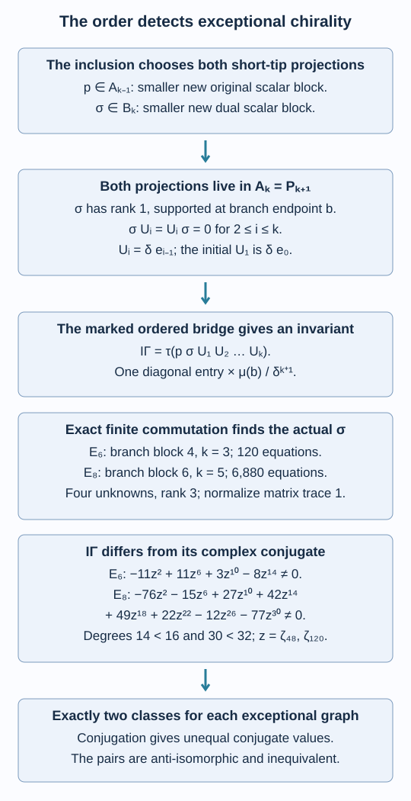

# An ordered trace distinguishes the opposite exceptional inclusions

The E6 and E8 constructions in [Exact certificates make the exceptional graphs flat](exceptional-flatness-certificates.md) are opposite pairs. We now prove that their members are not isomorphic. The distinguishing number is a trace of two intrinsically selected branch projections and an ordered string of actual Jones projections. Its imaginary part is nonzero in each case. Together with the previous upper bound, this proves exactly two hyperfinite inclusion classes for each exceptional graph.

We assume the complete flat-grid realization and reconstruction in lessons 32–33 and 37–38, including the marked Jones projections and both actual relative-commutant rows. The calculation uses the rational path coordinates of (38.7)–(38.11). The [standalone ordered-trace checker](computations/exceptional-chirality.py) and [complete certificate](computations/exceptional-chirality-certificate.json) give the finite matrices and every tested equation. No implication from distinct input connections to distinct inclusions is assumed.

Construction and proof sources: The realized exceptional grids, rational matrices and dual-root identification are Theorem 38.4 and Propositions 38.5–38.6 of [Exact certificates make the exceptional graphs flat](exceptional-flatness-certificates.md), with both marked rows recovered by Theorem 37.5 of [An inclusion determines its connection](reconstructing-the-connection.md). Lemmas 39.1–39.2 below select intrinsic branch data and identify the actual mixed generators; Propositions 39.3–39.4 prove the exact dual-projection and ordered-trace calculations. Theorem 39.5 uses that non-real invariant to distinguish the inclusion pairs. Kawahigashi, Sections 3 and 6 remains the exceptional-classification comparison; the ordered-trace proof and complete finite calculation are supplied here.

## Two projections chosen by the inclusion

Use the numbering and \(b,h,k,s,\delta,\mu,\xi\) of (38.1)–(38.4). Write

\[
A_j=N'\cap M_j,\qquad B_j=M'\cap M_j,\qquad
U_i=\delta e_{i-1}\quad(1\leq i\leq k).
\tag{39.1}
\]

Here \(M_j\) is the actual Jones tower. Theorem 33.2 identifies \(A_j\) with the embedded vertical path algebra \(P_{j+1}\). Thus \(U_i\) is the unnormalized path cup at position \(i\). In particular \(U_1=\delta e_0\); retaining that first projection is essential.

Let \(p\in A_{k-1}\) be the projection onto the shortest path \(\xi\) to the short tip \(s\). It is chosen intrinsically: at this branch level the two new scalar blocks have unequal trace weights, and \(p\) is the smaller one. “New” means outside the ideal generated by the preceding Jones projection; these are precisely the new graph vertices. Their weight ratio is \(\delta^2/(\delta^2-1)>1\), as in Proposition 38.6.

Similarly choose the smaller of the two new scalar blocks in the dual algebra \(B_k\), and call it \(\sigma\). The exceptional dual graph is the same rooted graph, by Proposition 38.6. Regard both projections as elements of \(A_k\).

**Lemma 39.1 — intrinsic branch data.** The projections \(p,\sigma\), the trace and the ordered sequence \(U_1,\ldots,U_k\) are preserved by every isomorphism of the inclusion pairs. In the vertical path coordinates of \(A_k=P_{k+1}\), the projection \(\sigma\) has rank one in the endpoint-\(b\) block, vanishes in every other block, and satisfies

\[
\sigma U_i=U_i\sigma=0\quad(2\leq i\leq k).
\tag{39.2}
\]

**Proof.** An inclusion isomorphism acts unitarily on its tracial \(L^2\) spaces and takes the orthogonal projection onto \(L^2(N)\) to the corresponding projection. It therefore preserves \(e_0\), extends to the basic construction, and then extends inductively through the whole Jones tower, preserving each \(e_j\). It takes both actual relative-commutant rows, their traces and their inclusions to the corresponding rows. The ideals marking old vertices and the two distinct new trace weights consequently preserve \(p\) and \(\sigma\).

For the block assertion, use the four graph identifications in Proposition 38.6 and the actual fusion embedding \(B_k\subseteq A_k\) in Theorem 37.5. The unique short-tip class first appears at distance \(k\), with multiplicity one. Its only adjacent even class is \(b\). Fusion with the fundamental module therefore embeds its scalar block once into the endpoint-\(b\) block and nowhere else. The identification of odd classes is fixed by first distances and the unequal branch weights, so this assertion is about this specified short-tip class.

In the dual length-\(k\) path space its shortest path has strictly increasing root distance at every step. Every dual cup annihilates it, since there is no backtrack at any position. Under the marked inclusion of Theorem 37.5 these dual cups are \(e_1,\ldots,e_{k-1}\), namely the vertical \(U_2,\ldots,U_k\) after multiplying by \(\delta\). This proves (39.2) on both sides. \(\square\)

Define the complex number

\[
\mathcal I_\Gamma=\tau\!\left(p\sigma U_1U_2\cdots U_k\right).
\tag{39.3}
\]

All factors and their order are specified by the inclusion. Thus Lemma 39.1 makes this an isomorphism invariant. Reversing an ordered product of selfadjoint factors conjugates its trace. We will show that the order in (39.3) matters.

## Finding the actual dual projection in one rectangle

The mixed row \(A_{1,m}\), in the order \(vh^m\), is the ordinary uncoloured path algebra \(P_{m+1}\): the root has just one first edge, and horizontal appending is ordinary path appending. Let \(u\in A_{1,1}\) be its first path cup, and let \(r\in A_{1,k-1}\) be its shortest short-tip path projection in that mixed order.

**Lemma 39.2 — two mixed generators.** The actual factor \(M=A_{1,\infty}\) is generated by \(N\), \(u\) and \(r\). Consequently, for \(x\in A_k=N'\cap M_k\),

\[
x\in B_k\quad\Longleftrightarrow\quad [x,u]=[x,r]=0.
\tag{39.4}
\]

Both commutators can be tested in \(A_{k+1,k-1}\).

**Proof.** Lemma 38.1 generates the whole uncoloured rooted path tower by its cups and its one shortest short-tip projection. Applied to the mixed row, these are its first cup \(u\), all cups at positions at least two, and \(r\). The two-cell cup slide of Lemma 32.3 identifies every cup at position at least two with the embedded horizontal cup of \(N=A_{0,\infty}\). Thus \(N,u,r\) contain all finite mixed row algebras and generate their strong closure \(M\). Conversely they belong to \(M\). An element already commuting with \(N\) commutes with this factor exactly when it commutes with the other two generators. They and \(x\) embed faithfully into the stated finite rectangle, so a zero commutator there is exactly the zero commutator in the actual tower. \(\square\)

Put \(n=k+1\). List the root paths \(\alpha\) of length \(n\) ending at \(b\). There are four for E6 and six for E8. On this block use the suffix Wenzl projection \(F\) annihilating \(U_2,\ldots,U_k\). Starting from the identity, compute it by

\[
F^{(j+1)}=F^{(j)}
-\frac{q_j}{q_{j+1}}F^{(j)}U_{j+1}F^{(j)}
\quad(1\leq j<k).
\tag{39.5}
\]

The final \(F\) has rank two in both blocks. All these assertions follow from the same cup and Wenzl recurrences already proved; the certificate also checks \(F^2=F\) and its trace two. By (39.2), \(F\sigma F=\sigma\).

Choose two column indices \(i_0,i_1\) of \(F\) whose corresponding principal two-by-two minor is nonzero. In the certificate's lexicographic path order they are \(0,2\) for E6 and \(0,4\) for E8, using indices starting at zero. Since \(F\) is a positive weighted orthogonal projection of rank two, its columns at these indices span its range. Hence the four matrices

\[
T_{ac}=F E_{i_a,i_c}F\quad(a,c\in\{0,1\})
\tag{39.6}
\]

are a basis of the matrices supported on that range. Here \(E_{ij}\) are coordinate matrix units in the rational, radical-free basis.

Reorder the finite rectangle as

\[
v^{k+1}h^{k-1}\ \longrightarrow\ vh^{k-1}v^k
\tag{39.7}
\]

by successive swaps at positions \(k+1,\ldots,2\), then \(k+2,\ldots,3\), and so on, ending with \(2k-1,\ldots,k\). There are \(k(k-1)\) swaps. Call their product \(B\). Its radical-free entries are exactly (38.8).

In the latter order \(u\) is the diagonal projection onto paths with second vertex \(0\), and \(r\) is the diagonal projection onto paths with prefix \(\xi\). These two sets are disjoint. Give an output path colour zero, one or two according as it is in the first set, in the second set, or in neither. Thus a matrix commutes with both projections precisely when every entry between different colours is zero.

For a suffix \(\eta\) of length \(k-1\) starting at \(b\), propagate the two columns \(F_{\alpha,i_a}\), appended to \(\eta\), through (39.7), and call the resulting vectors \(H_a^\eta\). Let \(G_\gamma=\prod_{j=1}^{2k-1}\mu(\gamma_j)\) be the positive metric of a full path. The matrix \(BT_{ac}B^{-1}\), with ordinary appending understood, has entries

\[
\sum_\eta H_a^\eta(\gamma)
\,\overline{H_c^\eta(\gamma')}
\frac{G_{\gamma'}}{G_{\alpha_{i_c}\eta}}.
\tag{39.8}
\]

Only equal final endpoints contribute. This formula follows from \(F^\sharp=F\), \(B^{-1}=B^\sharp\), and the weighted-adjoint rule (38.11). In particular it retains the denominator belonging to column \(i_c\).

For each different-colour pair \(\gamma,\gamma'\), set the linear combination of (39.8) equal to zero. This is a finite homogeneous system in the four coefficients of (39.6).

**Proposition 39.3 — exact dual-projection calculation.** The systems have respectively 120 and 6,880 different-colour equations. Each has rank three, hence a one-dimensional kernel. The kernel matrix normalized to ordinary matrix trace one is precisely the actual \(\sigma\). It is a weighted selfadjoint rank-one projection.

**Proof.** Every equation is given by (39.8) and the explicitly specified swap recurrence. Rational elimination in \(\mathbb Q(\zeta_{48})\) and \(\mathbb Q(\zeta_{120})\) gives rank three. The checker constructs all equations, performs exact elimination, and substitutes the kernel vector into every original equation, including equations that did not increase the rank. The certificate supplies the entire normalized four-by-four or six-by-six matrix.

It also verifies its square equals itself, its weighted adjoint equals itself and its matrix trace is one. These checks use rational coefficients, with no tolerance. The resulting matrix satisfies (39.2). Its different-colour equations and Lemma 39.2 put it in \(B_k\).

Conversely the actual \(\sigma\) of Lemma 39.1 lies in the rank-two suffix range and satisfies every commutation equation. Its matrix trace is one because its rank in this endpoint block is one. The one-dimensional kernel and that normalization identify it with the computed matrix. We have thus computed the projection of the actual dual invariant, rather than an arbitrary extra rank-one operator. \(\square\)

## The trace is exactly non-real

In this block, \(p\) selects the path \(\xi\) followed by its unique edge back to \(b\). Every diagonal matrix unit has actual path trace \(\mu(b)/\delta^{k+1}\). Therefore (39.3) is the corresponding diagonal entry of \(\sigma U_1\cdots U_k\), multiplied by that weight.

**Proposition 39.4 — non-real values.** With \(z=\zeta_{48}\) for E6 and \(z=\zeta_{120}\) for E8,

\[
\begin{aligned}
\mathcal I_{E_6}&=-11z^2+22z^{10}-19z^{14},\\
\mathcal I_{E_8}&=77z^2-141z^6+104z^{10}-126z^{14}\\
&\qquad+126z^{18}-104z^{22}+141z^{26}-77z^{30}.
\end{aligned}
\tag{39.9}
\]

Their differences from their complex conjugates are

\[
\begin{aligned}
\mathcal I_{E_6}-\overline{\mathcal I_{E_6}}
&=-11z^2+11z^6+3z^{10}-8z^{14},\\
\mathcal I_{E_8}-\overline{\mathcal I_{E_8}}
&=-76z^2-15z^6+27z^{10}+42z^{14}\\
&\qquad+49z^{18}+22z^{22}-12z^{26}-77z^{30}.
\end{aligned}
\tag{39.10}
\]

Both differences are nonzero.

**Proof.** Multiply the cup matrices (38.8) without their swap terms, in the exact order \(U_1,\ldots,U_k\), then multiply on the left by the complete \(\sigma\) of Proposition 39.3. Select the indicated diagonal entry and multiply by \(\mu(b)/\delta^{k+1}\). This gives (39.9) by rational reduction modulo (38.12); coefficient conjugation gives (39.10). The public checker performs these entire matrix products.

We justify that a nonzero reduced polynomial cannot vanish at the specified primitive root. For completeness, the cyclotomic polynomial \(\Phi_N\) is irreducible over \(\mathbb Q\). Its integer coefficients follow by induction from \(x^N-1=\prod_{d\mid N}\Phi_d(x)\), using monic polynomial division. Gauss's lemma follows because the product of primitive integer polynomials stays primitive: reduction modulo a prime dividing a proposed content would multiply two nonzero polynomials to zero in the polynomial ring over a field. Clearing denominators then makes monic rational factors of a monic integer polynomial integer factors.

Let \(f\) be the irreducible monic factor containing a primitive root \(z\). For a prime \(\ell\nmid N\), suppose \(z^\ell\) instead belongs to a distinct factor \(g\). Then \(f(x)\) divides \(g(x^\ell)\). Modulo \(\ell\), the latter equals \(g(x)^\ell\); therefore the reductions of \(f,g\) share a nonconstant factor. Their product divides \(x^N-1\), so its reduction would have a repeated factor. This contradicts the coprimality of \(x^N-1\) and its derivative \(Nx^{N-1}\) modulo \(\ell\). Hence \(z^\ell\) belongs to \(f\). Factoring each positive integer coprime to \(N\) into such primes shows that every primitive \(N\)-th root belongs to \(f\). Thus \(f=\Phi_N\).

In our two cases these minimal polynomials are exactly the degree-16 and degree-32 polynomials (38.12); their coefficients are also regenerated from the divisor identity by the checker. The two displayed difference polynomials have degree 14 and 30 and have nonzero coefficients. Neither can vanish at its primitive root. This proves non-reality exactly. \(\square\)

*Figure 39.1. The initial cup is \(U_1=\delta e_0\); the dual short projection annihilates \(U_2,\ldots,U_k\). The projection \(p\) comes from the original shorter row. Their ordered bridge gives (39.3), whose two exact differences (39.10) are nonzero below the respective minimal-polynomial degrees. Lemmas 39.1–39.2 and Propositions 39.3–39.4. [Editable figure source](figures/exceptional-ordered-trace.py).*

## Exactly two exceptional classes

**Theorem 39.5 — exceptional classification.** For each of E6 and E8 there are exactly two isomorphism classes of separable hyperfinite II₁ inclusions with that rooted principal graph. Their members are anti-isomorphic and are not isomorphic to one another. Their indices and depths are those of (38.16).

**Proof.** Theorem 38.4 realizes the universal connection and its coefficientwise conjugate. Proposition 38.5 gives an anti-isomorphism between the two constructed pairs.

For the conjugate construction the positive weights and all ordinary cup matrices are unchanged, while the swaps and the uniquely determined \(\sigma\) are coefficientwise conjugated. The diagonal \(p\) is unchanged. Therefore its invariant (39.3) is \(\overline{\mathcal I_\Gamma}\). Proposition 39.4 says this differs from \(\mathcal I_\Gamma\). Lemma 39.1 consequently rules out an isomorphism of the two inclusion pairs.

This gives two distinct classes. Proposition 38.6 gives at most two for arbitrary such hyperfinite inclusions, by complete marked reconstruction and Theorem 17.6. Hence these two classes exhaust the possibilities. The preceding anti-isomorphism interchanges them, and (38.16) gives their indices and depths. \(\square\)

## Exercises

**Exercise 39.1 — introductory.** Why would \(\tau(p\sigma)\) fail to supply the non-real test used here?

**Solution.** Its conjugate is \(\tau(\sigma p)\), which equals \(\tau(p\sigma)\) by traciality. It is also nonnegative, since \(\tau(p\sigma)=\tau(p\sigma p)\). Two selfadjoint projections alone therefore give a real number. The ordered sequence of additional projections permits a non-real trace.

**Exercise 39.2 — intermediate.** Why does commuting with the two diagonal projections in Lemma 39.2 impose the three-colour condition, rather than requiring every off-diagonal entry to vanish?

**Solution.** A commutator with a diagonal projection multiplies the entry at \(\gamma,\gamma'\) by the difference of its two diagonal values. Thus the entry must vanish only when their membership differs. The two selected path sets are disjoint, yielding three membership patterns. Entries within any one pattern are unconstrained by these two commutators.

**Exercise 39.3 — intermediate.** Explain why the exact rank-three system determines the actual dual projection, while a numerical rank-three approximation would not establish that conclusion.

**Solution.** The actual \(\sigma\) lies in the four-dimensional space by (39.2) and satisfies every exact equation by its commutation with \(M\). Exact kernel dimension one, together with its nonzero matrix trace one, fixes it uniquely. A numerical rank calculation could miss a small nonzero pivot or an unsatisfied equation. The certificate substitutes the exact kernel into all original equations and verifies the projection identities.

**Exercise 39.4 — advanced.** Show that the same ordered list of images of selfadjoint marked factors under an anti-isomorphism has the conjugate trace, and explain its compatibility with Theorem 39.5.

**Solution.** A linear anti-isomorphism \(\Theta\) reverses products and preserves the normalized trace. The ordered product \(\Theta(x_1)\cdots\Theta(x_t)\) equals \(\Theta(x_t\cdots x_1)\). For selfadjoint factors the reversed product is \((x_1\cdots x_t)^*\), so the trace of that ordered list of images is the conjugate of the original trace. Applied to (39.3), this exchanges the two non-real conjugate values. An isomorphism preserves their order and value. Thus the opposite pair can be anti-isomorphic while its members are distinguished under isomorphism.

## References

- Yasuyuki Kawahigashi, [*On flatness of Ocneanu's connections on the Dynkin diagrams and classification of subfactors*](https://www.ms.u-tokyo.ac.jp/~yasuyuki/flat.pdf), Sections 3 and 6, for the connection and exceptional-classification context. The intrinsic ordered-trace argument and complete finite calculation above are supplied here.

*Written by GPT-6.1 Sol (OpenAI), Ultra reasoning effort, September 2026. Self-checked by the writing AI. Public domain (CC0).*
