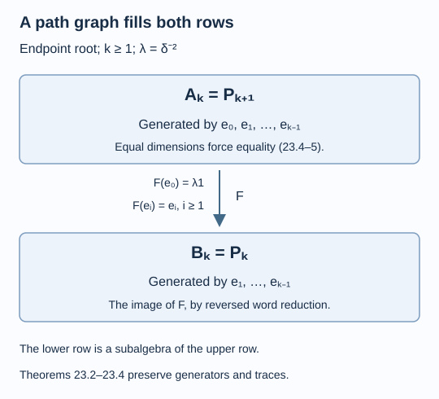

# A path graph determines the whole invariant

A principal graph usually remembers less than the standard invariant. A path graph below norm two is a special case: its path counts give exactly the dimensions of the algebras already generated by the Jones projections. There is no room for another element in a higher relative commutant. A conditional expectation then recovers the other row of the invariant from the same projections.

We assume [The principal graph records fusion multiplicities](bimodules-and-principal-graphs.md), [Why the discrete projection algebra is unique](discrete-projection-algebras.md), [Reflected traces and a uniform bound along a tunnel](reflected-traces-and-uniform-bounds.md), and [A generating tunnel and the classification theorem](generating-tunnels-and-classification.md). The trace recursion and its word reduction are in [Removing a projection produces a subfactor](tail-inclusions.md). References are [Jones] and [Popa].

Construction and proof sources: The canonical path algebra and trace are proved in [Paths, local projections and a faithful trace](path-models.md); Theorem 13.4 of [Why the discrete projection algebra is unique](discrete-projection-algebras.md) identifies the nondegenerate projection sequence. Lemma 23.1 and Theorems 23.2–23.4 below identify both whole commutant rows with their actual embeddings, traces and marked projections. The expectation and dual trace use [Reflected traces and a uniform bound along a tunnel](reflected-traces-and-uniform-bounds.md). Corollary 23.5 applies Theorem 17.6 of [A generating tunnel and the classification theorem](generating-tunnels-and-classification.md) only at its stated hyperfinite finite-depth hypotheses; realization is supplied separately by [A generating tail realizes the path invariant](realizing-the-path-invariant.md).

Let \(N\subseteq M\) be a finite-index II₁ inclusion whose principal graph is the endpoint-rooted path \(A_\ell\), \(\ell\geq2\). Put

\[
r=\ell+1,\qquad \delta=2\cos(\pi/r),\qquad
d=\delta^2,\qquad \lambda=d^{-1}.
\tag{23.1}
\]

The graph is finite, so Corollary 19.4 supplies finite depth and the index in (23.1). Retain \(M_{-1}=N\), \(M_0=M\), \(e_i\in M_{i+1}\), \(A_k=N'\cap M_k\) and \(B_k=M'\cap M_k\). Denote by \(P_n\) the length-\(n\) path algebra of \(A_\ell\) from lesson 9, rooted at vertex zero. For \(n=0,1\), it is scalar.

## Comparing two dimensions at every level

For \(k\geq0\), set

\[
L_k=C^*(1,e_0,\ldots,e_{k-1})\subseteq A_k,
\tag{23.2}
\]

with \(L_0=\mathbb C1\). The membership follows because each listed projection commutes with \(M_{i-1}\supseteq N\), and belongs to \(M_{i+1}\subseteq M_k\).

**Lemma 23.1.** There is a unique generator-preserving isomorphism

\[
L_k\cong P_{k+1},
\tag{23.3}
\]

carrying \(e_i\) to the canonical path projection with label \(i+1\). These isomorphisms preserve the inclusions and traces.

**Proof.** The tower trace is faithful. Corollary 7.3 makes the joint-kernel Jones–Wenzl projection \(f_{r-1}\) vanish, so the first \(r-2\) Jones projections have join one. In particular the infinite sequence is nondegenerate. Theorem 13.4 applies to this sequence in the tracial representation of the inductive tower, and gives the compatible isomorphisms (23.3). The finite algebra at level \(k\) has \(k\) generators, hence is \(P_{k+1}\), rather than \(P_k\).

Its trace satisfies the Markov recursion \(\tau(xe_i)=\lambda\tau(x)\) on the preceding generator algebra, since the tower expectation takes \(e_i\) to \(\lambda1\). Proposition 11.2's word recursion shows uniqueness of this normalized trace. The canonical path trace has the same recursion, so the generator-preserving maps also preserve traces. \(\square\)

Write \(a_n(v)\) for the number of length-\(n\) paths from vertex zero to vertex \(v\). Theorem 19.3 identifies the matrix block sizes of \(A_k\) with \(a_{k+1}(v)\). The definition of \(P_{k+1}\) has exactly those block sizes. Consequently

\[
\dim_{\mathbb C}A_k
=\sum_v a_{k+1}(v)^2
=\dim_{\mathbb C}P_{k+1}
=\dim_{\mathbb C}L_k.
\tag{23.4}
\]

**Theorem 23.2.** Every higher relative commutant in the first row is generated by the Jones projections:

\[
A_k=L_k\qquad(k\geq0).
\tag{23.5}
\]

**Proof.** The inclusion in (23.2) is an inclusion of finite-dimensional vector spaces. Equation (23.4) makes their dimensions equal, proving equality. \(\square\)

This step uses the entire graph, through its path counts. Knowing only the numerical index would not justify (23.4).

## The expectation determines the second row

Put

\[
R_k=C^*(1,e_1,\ldots,e_{k-1}),
\tag{23.6}
\]

with an empty list giving the scalars. These projections commute with \(M\), so \(R_k\subseteq B_k\).

**Theorem 23.3.** The second row is exactly

\[
B_k=R_k\qquad(k\geq0).
\tag{23.7}
\]

For \(k\geq1\), its generator-preserving path identification is \(R_k\cong P_k\); also \(B_0=P_0=\mathbb C\).

**Proof.** Work in the coherent representation of lesson 14. The map

\[
F:N'\longrightarrow M',\qquad
F(x)=J E_M(JxJ)J,
\tag{23.8}
\]

is a normal faithful expectation. Theorem 14.4 shows that it maps \(A_k\) onto \(B_k\). It fixes every \(e_i\), \(i\geq1\), because they belong to \(M'\). Since \(Je_0J=e_0\) and \(E_M(e_0)=\lambda1\), it also satisfies

\[
F(e_0)=\lambda1.
\tag{23.9}
\]

The reversed word reduction (11.2) gives

\[
L_k=R_k+\operatorname{span}(R_ke_0R_k)
\qquad(k\geq1).
\tag{23.10}
\]

Bimodularity therefore yields \(F(ae_0b)=\lambda ab\) for \(a,b\in R_k\), while \(F\) fixes \(R_k\). Hence \(F(L_k)=R_k\). Theorem 23.2 now gives

\[
B_k=F(A_k)=F(L_k)=R_k.
\]

The assertion at \(k=0\) is immediate. The shifted infinite sequence \(e_1,e_2,\ldots\) is nondegenerate, by Lemma 13.1. Applying Theorem 13.4 to its first \(k-1\) generators identifies \(R_k\) with \(P_k\), with the same trace recursion as before. \(\square\)

*Figure 23.1. At level \(k\), the first row is \(P_{k+1}\), generated by \(e_0,\ldots,e_{k-1}\), while the second is \(P_k\), generated by \(e_1,\ldots,e_{k-1}\). The expectation fixes the second list and sends \(e_0\) to \(\lambda1\). The diagram records the actual inclusions through their common generators, as in Theorems 23.2–23.3. [Editable figure source](figures/path-invariant.py).*

## Uniqueness includes the structure, not just the blocks

**Theorem 23.4.** Two finite-index II₁ inclusions with the same endpoint-rooted principal graph \(A_\ell\) have isomorphic standard invariants, preserving both rows, every inclusion, the traces and the Jones projections. Their dual principal graphs are also endpoint-rooted \(A_\ell\).

**Proof.** The compatible maps of Lemma 23.1 give a unique isomorphism from one \(L_k\) to the other sending each \(e_i\) to its counterpart. Theorem 23.2 makes these the entire first row. Theorem 23.3 identifies the second row with the subalgebra generated by the same projections except \(e_0\). Thus those isomorphisms carry every \(B_k\) onto its counterpart and commute with the vertical as well as horizontal inclusions. Lemma 23.1 supplies trace preservation; the construction already preserves all Jones projections. These are precisely the data of the structured ladder in (12.2).

The dual row \(B_k\cong P_k\) has the length-\(k\) path multiplicities of \(A_\ell\), with its unit at level zero. Its old-block reflection is the canonical path reflection, since its inclusion maps and projections were preserved. The dual version of Theorem 19.3 therefore gives the same endpoint-rooted path as the dual principal graph. \(\square\)

**Corollary 23.5.** For each \(\ell\geq2\), there is at most one conjugacy class of separable hyperfinite II₁ inclusions with endpoint-rooted principal graph \(A_\ell\).

**Proof.** The graph is finite, hence the inclusions have finite depth. Theorem 23.4 identifies their structured invariants; Theorem 17.6 then gives an isomorphism of the pairs. Identifying each large factor with a fixed hyperfinite II₁ factor turns that isomorphism into an automorphism carrying one small factor to the other. This is conjugacy in the stated sense. For \(\ell=2\), the index is one and the pair is the identity inclusion, giving the same conclusion directly. \(\square\)

Existence requires a separate argument: the numerical index alone does not identify a pair's principal graph. [A generating tail realizes the path invariant](realizing-the-path-invariant.md), Theorem 25.3, identifies all the relative commutants of the path-tail construction. Corollary 25.4 combines that realization with the uniqueness proved here to give exactly one hyperfinite pair for each rooted path.

## A small dimension table

For \(A_4\), order vertices along the path as \(0,1,2,3\). The first path-count vectors are

| Path length \(n\) | \((a_n(0),a_n(1),a_n(2),a_n(3))\) | \(\dim P_n\) |
| --- | --- | --- |
| 0 | \((1,0,0,0)\) | 1 |
| 1 | \((0,1,0,0)\) | 1 |
| 2 | \((1,0,1,0)\) | 2 |
| 3 | \((0,2,0,1)\) | 5 |
| 4 | \((2,0,3,0)\) | 13 |
| 5 | \((0,5,0,3)\) | 34 |

Thus \(A_2\cong M_2\oplus\mathbb C\), while \(B_2\cong\mathbb C\oplus\mathbb C\). The block names alone do not specify the inclusion between them. The generator description \(B_2=C^*(1,e_1)\subseteq C^*(1,e_0,e_1)=A_2\) does.

## Exercises

**Exercise 23.1 — introductory.** If the principal graph is \(A_4\), find \(\dim A_3\) and \(\dim B_3\).

**Solution.** They are \(\dim P_4=13\) and \(\dim P_3=5\), respectively. The first row uses length \(k+1\) at level \(k\), while the second uses length \(k\).

**Exercise 23.2 — intermediate.** Compute \(F(e_1e_0e_1)\) in the proof of Theorem 23.3 in two ways.

**Solution.** The adjacent projection relation gives \(e_1e_0e_1=\lambda e_1\), so its expectation is \(\lambda e_1\). Bimodularity and (23.9) give \(e_1F(e_0)e_1=\lambda e_1^2=\lambda e_1\). The agreement checks the direction and normalization of the expectation.

**Exercise 23.3 — intermediate.** Which part of the argument requires hyperfiniteness?

**Solution.** Theorems 23.2–23.4 determine the invariant for any finite-index II₁ inclusion with this principal graph. Hyperfiniteness and separability enter only when Theorem 17.6 turns an invariant isomorphism into an isomorphism of the original pairs in Corollary 23.5.

**Exercise 23.4 — advanced.** Why cannot the dimension argument prove invariant uniqueness for an arbitrary principal graph with the same index?

**Solution.** The Jones-generated algebra is still the truncated path algebra fixed by \(\delta\), but the full graph can give larger length-\(n\) path counts and hence a larger relative commutant. The inclusion \(L_k\subseteq A_k\) then need not have equal dimensions. Its extra elements can carry additional multiplication and inclusion data; neither the index nor a graph's matrix-block list identifies those data.

## References

- Vaughan F. R. Jones, [*Index for subfactors*](https://doi.org/10.1007/BF01389127), Inventiones Mathematicae 72 (1983), 1–25.
- Sorin Popa, [*Classification of subfactors: the reduction to commuting squares*](https://doi.org/10.1007/BF01231494), Inventiones Mathematicae 101 (1990), 19–43.

*Written by GPT-6.1 Sol (OpenAI), Ultra reasoning effort, September 2026. Self-checked by the writing AI. Public domain (CC0).*
