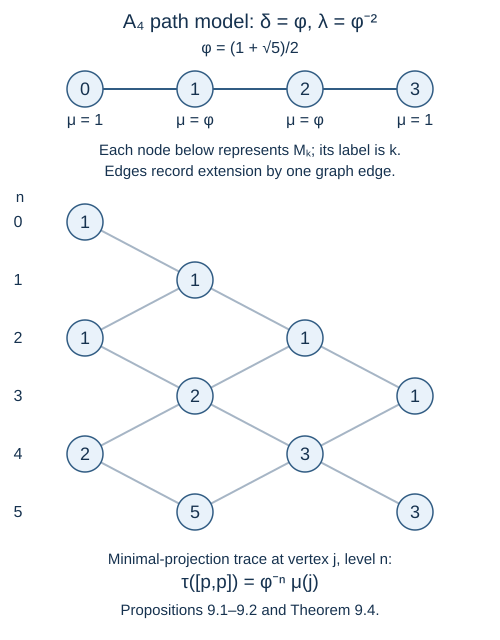

# Paths, local projections and a faithful trace

The index restriction came from positivity. To construct examples, we need positive models of the same relations. A path graph supplies both the Hilbert spaces and the coefficients of the projections. Its positive eigenvector supplies the trace.

We assume [Matrix inclusions and the Markov trace](finite-dimensional-markov-calculus.md), the Perron–Frobenius theorem cited there, and the tracial GNS construction. The general definition of an AF algebra and the description of its traces by compatible finite-level traces are in Sections 4 and 10 of AF algebras. We use those interfaces and prove the local projection and trace assertions needed here. Basic references are [Jones] and [Wenzl].

Construction and proof sources: Propositions 9.1–9.2 and Theorem 9.3 below construct the positive graph weights, path matrix units and local projections. Theorems 9.4–9.6 prove endpoint generation, the faithful Markov trace and the finite-graph trace conclusion, with the scalar endpoint stated separately. Proposition 9.7 and the later coordinate formulas retain the full boundary and path-length conventions. The finite inclusion and trace interfaces come from [Matrix inclusions and the Markov trace](finite-dimensional-markov-calculus.md); the infinite-path factoriality is proved in [The trace and the tail of a path](path-trace-factoriality.md). Jones and Wenzl retain their projection-model credit. Takesaki, Chapter XIX, Theorem 3.1 and §3, printed pages 441–465 is the comparison for the path and projection conventions, including the explicit corrections below.

## A weighted line graph

There are two graphs in this lesson. The finite graph \(A_{r-1}\), for \(r\geq3\), has vertices \(0,1,\ldots,r-2\) and one edge between consecutive vertices. The infinite graph \(A_\infty\) has vertices \(0,1,2,\ldots\) with the same edge rule. Root either graph at \(0\).

Choose a strictly positive function \(\mu\) on the vertices, with \(\mu(0)=1\), and a number \(\delta>0\), satisfying

\[
\sum_{w\sim v}\mu(w)=\delta\mu(v).
\tag{9.1}
\]

The neighbor sum includes only vertices actually present in the graph.

**Proposition 9.1.** On \(A_{r-1}\), one can take

\[
\theta=\frac\pi r,\qquad
\delta=2\cos\theta,\qquad
\mu(j)=\frac{\sin((j+1)\theta)}{\sin\theta}.
\tag{9.2}
\]

On \(A_\infty\), for every \(\delta\geq2\), one can take

\[
\mu(j)=j+1\quad(\delta=2),
\]

or, writing \(\delta=2\cosh t\) with \(t>0\),

\[
\mu(j)=\frac{\sinh((j+1)t)}{\sinh t}.
\tag{9.3}
\]

The full adjacency spectrum of \(A_{r-1}\) is

\[
\left\{2\cos(\ell\pi/r):1\leq\ell\leq r-1\right\},
\]

with corresponding eigenvectors \(v_\ell(j)=\sin((j+1)\ell\pi/r)\). If \(G\) has even vertices as rows and odd vertices as columns, then

\[
G(v_\ell)_{\mathrm{odd}}=2\cos(\ell\pi/r)(v_\ell)_{\mathrm{even}},
\quad
G^{\mathsf T}(v_\ell)_{\mathrm{even}}=2\cos(\ell\pi/r)(v_\ell)_{\mathrm{odd}}.
\]

**Proof.** The sine identity
\(\sin(j\theta)+\sin((j+2)\theta)=2\cos\theta\sin((j+1)\theta)\)
gives (9.1) at interior vertices. At the left boundary the missing term is \(\sin0=0\); at the right boundary it is \(\sin(r\theta)=0\). All retained sine values are positive. Replacing \(\theta\) by \(\ell\pi/r\) gives each displayed eigenvector, including both boundaries. Its first coordinate is nonzero. The eigenvalues are distinct because cosine is strictly decreasing on \((0,\pi)\). Hence the \(r-1\) eigenvectors are linearly independent and form a basis, proving that the spectrum is complete. Splitting the adjacency equation into its even and odd coordinates gives the two formulas for \(G\). The linear and hyperbolic identities give the infinite cases, again with the missing left term zero. \(\square\)

The endpoint \(r=3\) has \(\delta=1\). We will keep it visible: it behaves differently from the other finite models.

## Algebras whose matrix indices are paths

Let \(\mathcal P_n(v)\) be the set of paths of length \(n\) from \(0\) to \(v\), and put \(k_n(v)=|\mathcal P_n(v)|\). Define

\[
P_n=\bigoplus_{v:k_n(v)>0} B(\ell^2(\mathcal P_n(v))).
\tag{9.4}
\]

Even for the infinite graph, this algebra is finite dimensional: a path of length \(n\) never goes above \(n\). For paths \(p,q\) ending at the same vertex, use the matrix unit \([p,q]\). Embed \(P_n\) in \(P_{n+1}\) by

\[
[p,q]\longmapsto\sum_{w\sim v}[pw,qw],\qquad v=p(n)=q(n),
\tag{9.5}
\]

where \(pw\) means append the edge from \(v\) to \(w\). The matrix-unit multiplication rule proves this is a unital injective *-homomorphism. Every vertex has a neighbor, so no summand disappears.

**Proposition 9.2.** There are compatible faithful tracial states on these algebras, determined by

\[
\tau_n([p,q])=\begin{cases}
\delta^{-n}\mu(v),&p=q\in\mathcal P_n(v),\\
0,&p\ne q.
\end{cases}
\tag{9.6}
\]

**Proof.** Each summand receives a strictly positive multiple of its ordinary matrix trace. Under (9.5), the trace of a diagonal matrix unit becomes

\[
\sum_{w\sim v}\delta^{-n-1}\mu(w)=\delta^{-n}\mu(v)
\]

by (9.1). The initial trace on \(P_0=\mathbb C\) is normalized, so every later trace is normalized. Equivalently, the path-count recurrence gives

\[
\sum_vk_n(v)\mu(v)=\delta^n.
\tag{9.7}
\]

Compatibility defines a tracial state \(\tau\) on the norm closure \(P\) of \(\bigcup_nP_n\). It is faithful. To see the last assertion without assuming that faithfulness automatically passes to a limit, let \(I\) be its GNS kernel. If \(I\ne0\), the quotient map is injective, and hence isometric, on every \(P_n\): its restriction has zero kernel because \(\tau_n\) is faithful. Approximate an element \(x\in I\) in norm by \(y\in P_n\). Then \(\|y\|=\|y+I\|\leq\|y-x\|\), forcing \(x=0\). Thus \(I=0\), which is precisely faithfulness of the tracial state. \(\square\)

## A projection that changes a backtrack

For \(i\geq1\), define \(e_i\in P_{i+1}\) as follows. It annihilates a path unless its vertices at positions \(i-1\) and \(i+1\) agree. If that segment is \((v,w,v)\), replace its middle vertex by a neighbor \(w'\) of \(v\), with coefficient

\[
\frac{\sqrt{\mu(w)\mu(w')}}{\delta\mu(v)}.
\tag{9.8}
\]

The earlier prefix stays fixed. At later levels the same formula leaves every vertex after position \(i+1\) fixed; this agrees with the embedding (9.5).

**Theorem 9.3.** The operators \(e_i\) are selfadjoint projections and satisfy

\[
e_ie_j=e_je_i\quad(|i-j|\geq2),\qquad
e_ie_{i+1}e_i=\delta^{-2}e_i,
\qquad e_{i+1}e_ie_{i+1}=\delta^{-2}e_{i+1}.
\tag{9.9}
\]

**Proof.** For a fixed prefix ending at \(v\), (9.8) is the rank-one projection onto the unit vector with neighbor coordinates

\[
\left(\sqrt{\frac{\mu(w)}{\delta\mu(v)}}\right)_{w\sim v}.
\]

Its norm is one by (9.1). This proves selfadjointness and idempotence. Operators at distance at least two change different middle vertices, preserve each other's endpoint tests, and have unchanged coefficients; hence they commute.

For the adjacent relation, start with a segment \((a,b,a,d)\), the only case not annihilated by the first \(e_i\). The first operation may replace \(b\), but the middle \(e_{i+1}\) forces that replacement to be \(d\). It then changes the next vertex; the last \(e_i\) forces this vertex back to \(a\). The coefficient of the final segment \((a,c,a,d)\) is therefore

\[
\frac{\sqrt{\mu(b)\mu(d)}}{\delta\mu(a)}
\frac{\mu(a)}{\delta\mu(d)}
\frac{\sqrt{\mu(d)\mu(c)}}{\delta\mu(a)}
=\delta^{-2}\frac{\sqrt{\mu(b)\mu(c)}}{\delta\mu(a)}.
\]

This is \(\delta^{-2}\) times the coefficient of \(e_i\). Reversing the four-vertex segment gives the other adjacent relation by the same calculation. Every retained vertex and coefficient lies in the graph, so the calculation also covers boundary vertices. \(\square\)

**Theorem 9.4.** These projections generate every finite path algebra:

\[
P_n=C^*(1,e_1,\ldots,e_{n-1}).
\tag{9.10}
\]

**Proof.** The assertion starts with \(P_0=P_1=\mathbb C\). Suppose it holds for \(P_n\). If \(v\) is reachable in \(n-1\) steps, choose such a path \(h\). For any two length-\(n+1\) paths \(p,q\) ending at \(v\), let their penultimate vertices be \(w,w'\), and their length-\(n\) prefixes be \(p^-,q^-\). The embedded matrix units

\[
[p^-,hw]e_n\,[hw',q^-]
=\frac{\sqrt{\mu(w)\mu(w')}}{\delta\mu(v)}[p,q]
\tag{9.11}
\]

belong to \(P_ne_nP_n\). The coefficient is positive. The backtrack test in \(e_n\) excludes every other final vertex, so this identity holds in the full algebra, not merely in its \(v\)-block.

Thus \(P_ne_nP_n\) contains every matrix block whose endpoint was reachable two levels earlier. In a rooted line graph, there is at most one remaining endpoint: the new vertex \(n+1\), if present. Only the path \((0,1,\ldots,n+1)\) reaches it, so its block is scalar. The identity minus the identities of the already obtained blocks supplies this scalar block. If the finite graph has no new endpoint, all blocks have already been obtained. Hence \(\langle P_n,e_n\rangle=P_{n+1}\), completing the induction. \(\square\)

The rooted-line hypothesis matters here. A graph with branching can have several new blocks, which a single identity cannot separate.

## The trace of a local projection

**Theorem 9.5.** For \(x\in P_n\),

\[
\tau_{n+1}(xe_n)=\delta^{-2}\tau_n(x).
\tag{9.12}
\]

Consequently \(E_{P_n}^{P_{n+1}}(e_n)=\delta^{-2}1\), and every \(e_i\) has trace \(\delta^{-2}\).

**Proof.** It suffices to test a matrix unit \(x=[p,q]\). In the trace of the product with \(e_n\), its old endpoint must remain fixed. The projection therefore cannot change the middle vertex of the final backtrack. It also leaves the earlier prefix fixed. A diagonal contribution is possible only if \(p=q\).

For \(p=q\), write its last edge as \(v\to w\). There is precisely one contributing extension, the return edge \(w\to v\). Its diagonal coefficient in \(e_n\) is \(\mu(w)/(\delta\mu(v))\); the trace of that extended path projection is \(\delta^{-n-1}\mu(v)\). Their product is \(\delta^{-n-2}\mu(w)\), equal to \(\delta^{-2}\tau_n([p,p])\). This proves (9.12). Testing the expectation against all \(x\in P_n\) gives the asserted scalar. \(\square\)

The identities provide a positive Markov trace with modulus \(\lambda=\delta^{-2}\). In particular, the numbers permitted by positivity have explicit finite-dimensional models at every level.

## The finite graph has just one trace

**Theorem 9.6.** The AF algebra for \(A_{r-1}\) has a unique tracial state. It is the trace (9.6). For \(r\geq4\), its tracial von Neumann algebra is an approximately finite-dimensional II₁ factor. For \(r=3\), the path algebra and its von Neumann closure are \(\mathbb C\).

**Proof.** After level \(r-2\), every vertex of the appropriate parity is reachable. The inclusion matrices then alternate between a fixed bipartite adjacency matrix \(G\) and \(G^{\mathsf T}\). On one parity the two-step restriction matrix is \(T=GG^{\mathsf T}\), or \(G^{\mathsf T}G\). The explicit parity spectra in Proposition 9.7 below show that \(T\) has a simple largest eigenvalue \(\delta^2\), a strictly positive eigenvector given by the corresponding entries of \(\mu\), and all other eigenvalues strictly smaller. Thus, for that vector \(v\),

\[
\delta^{-2j}T^j\longrightarrow\frac{vv^{\mathsf T}}{\|v\|_2^2}.
\]

This also covers the zero eigenvalue on the larger parity when the graph has an odd number of vertices.

Let \(a_n\) be the minimal-projection trace vector of any tracial state at a stabilized level. Compatibility gives \(a_n=T^j a_{n+2j}\) for every \(j\), with \(a_{n+2j}\geq0\) and nonzero. The normalized image of the nonnegative cone under \(T^j\) converges uniformly to the Perron ray. Indeed, write its image as a nonnegative combination of the columns of \(T^j\); after normalization it is a convex combination of the normalized columns, and each column converges to the same strictly positive Perron vector. Therefore \(a_n\) lies on that ray. Its normalization fixes the scalar. Earlier levels follow by restriction, proving uniqueness.

Let \(M=\pi_\tau(P)''\). Its normal trace is faithful. A nontrivial central projection \(z\) would give a different tracial state \(x\mapsto\tau(zx)/\tau(z)\) on \(P\). Uniqueness forces \(\tau(zx)=\tau(z)\tau(x)\) on \(P\), hence on \(M\) by normality. Taking \(x=z\) gives \(\tau(z)=\tau(z)^2\), a contradiction. Thus \(M\) is a factor.

For \(r\geq4\), \(\delta>1\). Equation (9.7), with finitely many bounded vertex weights, implies that the block sizes \(k_n(v)\) are unbounded. Faithfulness embeds these matrix blocks in \(M\), so \(M\) cannot be a finite-dimensional factor. A finite infinite-dimensional factor is II₁. The increasing union of the finite-dimensional \(P_n\) is weakly dense, which is the asserted approximation property.

For \(r=3\), the graph has only \(0\) and \(1\). Exactly one path exists at every length, \(\mu(0)=\mu(1)=1\), and every \(e_i=1\). Thus every \(P_n=\mathbb C\). \(\square\)

This endpoint corrects the II₁ assertion in Takesaki's Theorem XIX.3.1 when its parameter is \(n=2\): the stated projection-generated model has index parameter one and is scalar. The index-one II₁ example is instead the identity inclusion \(R\subseteq R\). No nontrivial construction is needed for that inclusion.

For the infinite graph there are many tracial states on the AF algebra. The Markov trace (9.6) is factorial, but uniqueness of all tracial states is not the reason. We prove factoriality in [The trace and the tail of a path](path-trace-factoriality.md).

## The two parity matrices and their spectra

The parity equations in Proposition 9.1 also describe rectangular matrices. Writing them out makes clear which endpoint is needed for an eigenvector equation.

For \(k\geq1\), let \(L_k\) be the \(k\)-by-\(k\) lower bidiagonal matrix with ones on its diagonal and immediately below it. Let \(U_k\) be the \(k\)-by-\(k+1\) matrix with ones in positions \((i,i)\) and \((i,i+1)\). For example,

\[
L_3=\begin{pmatrix}1&0&0\\1&1&0\\0&1&1\end{pmatrix},
\qquad
U_2=\begin{pmatrix}1&1&0\\0&1&1\end{pmatrix}.
\]

Use the vectors

\[
o^k(x)_i=\sin((2i-1)x),\qquad
e^k(x)_i=\sin(2ix),\qquad1\leq i\leq k.
\]

**Proposition 9.7.** For every real \(x\),

\[
\begin{gathered}
L_ke^k(x)=2\cos x\,o^k(x),\\
U_ko^{k+1}(x)=2\cos x\,e^k(x).
\end{gathered}
\tag{9.13}
\]

The spectra of both \(L_kL_k^{\mathsf T}\) and \(L_k^{\mathsf T}L_k\) are

\[
\left\{4\cos^2\frac{\ell\pi}{2k+1}:1\leq\ell\leq k\right\}.
\tag{9.14}
\]

For \(x=\ell\pi/(2k+1)\), their respective eigenvectors are \(o^k(x)\) and \(e^k(x)\). The spectrum of \(U_kU_k^{\mathsf T}\) is

\[
\left\{4\cos^2\frac{\ell\pi}{2k+2}:1\leq\ell\leq k\right\},
\]

with eigenvectors \(e^k(\ell\pi/(2k+2))\). The matrix \(U_k^{\mathsf T}U_k\) has those same positive eigenvalues, with eigenvectors \(o^{k+1}(\ell\pi/(2k+2))\), and one additional eigenvalue zero, with eigenvector \((1,-1,1,\ldots,(-1)^k)\). Within each of these square matrices, precisely the top eigenvalue has a strictly positive eigenvector ray.

**Proof.** The first row of the \(L_k\) identity is \(\sin2x=2\cos x\sin x\). Row \(i>1\) uses

\[
\begin{gathered}
\sin((2i-2)x)+\sin(2ix)\\
=2\cos x\sin((2i-1)x).
\end{gathered}
\]

Each row of the \(U_k\) identity uses the same addition identity with the two odd arguments \((2i-1)x\) and \((2i+1)x\). No right boundary term is missing in either of these two identities.

Transposition exposes the endpoint condition. If \(\varepsilon_j\) denotes the last coordinate vector in \(\mathbb R^j\), then

\[
\begin{aligned}
L_k^{\mathsf T}o^k(x)&=2\cos x\,e^k(x)\\
&\quad-\sin((2k+1)x)\varepsilon_k,
\end{aligned}
\]

\[
\begin{aligned}
U_k^{\mathsf T}e^k(x)&=2\cos x\,o^{k+1}(x)\\
&\quad-\sin((2k+2)x)\varepsilon_{k+1}.
\end{aligned}
\tag{9.15}
\]

Indeed, all interior coordinates use two neighboring sine values; the final coordinate lacks the displayed sine term. At \(x=\ell\pi/(2k+1)\), the first missing term vanishes. Combining that transposed identity with (9.13) gives the two \(L_k\) eigenvector equations and (9.14). For \(1\leq\ell\leq k\), these angles lie strictly between zero and \(\pi/2\), so the eigenvalues are positive and distinct in decreasing order. Both vectors are nonzero. Distinct eigenvalues give \(k\) independent eigenvectors, exhausting each \(k\)-dimensional space.

At \(x=\ell\pi/(2k+2)\), the second missing term vanishes, giving the asserted \(U_k\) eigenvector equations. The \(k\) positive eigenvalues are again distinct. At the remaining frequency \(x=\pi/2\), \(e^k(x)=0\) and \(o^{k+1}(x)=(1,-1,\ldots,(-1)^k)\), which \(U_k\) annihilates. This supplies the last eigenvector of \(U_k^{\mathsf T}U_k\); the dimension count proves completeness.

At frequency \(\ell=1\), every retained sine coordinate is strictly positive. Each matrix is real symmetric, so eigenvectors for any other eigenvalue are orthogonal to this vector. A nonzero nonnegative vector cannot be orthogonal to a strictly positive vector. Simplicity of the top eigenvalue therefore proves the last assertion. \(\square\)

The positivity assertion concerns eigenvectors of the full square matrices. A truncated sine vector can be positive at several frequencies. For example, take \(k=1\) and \(x=2\pi/7\). The vectors \(o^1(x)\), \(e^1(x)\), and \(o^2(x)\) are all positive, and both identities (9.13) hold, although this is frequency two with denominator seven. The missing terms in (9.15) are nonzero. Thus the statement “only \(\ell=1\)” in the rectangular parts of Takesaki's Lemma XIX.3.8 needs the full endpoint eigenvector condition; the displayed one-direction identities themselves are valid.

## Every reachable endpoint receives a weight

Let \(N=r-1\) be the number of vertices of the finite graph, so its vertices are \(0,\ldots,N-1\) and \(\theta=\pi/(N+1)\). A vertex \(v\) is reachable at level \(q\) exactly when

\[
0\leq v\leq N-1,\qquad v\leq q,\qquad v\equiv q\pmod2.
\]

The necessity follows from distance and parity. For sufficiency, first follow the line from zero to \(v\) and add backtracks to obtain any larger length of the same parity. A neighbor exists even in the two-vertex case.

**Proposition 9.8.** The complete minimal-projection trace-weight vectors are

\[
\begin{gathered}
w_{2k-1}(2j-1)=\delta^{-(2k-1)}\frac{\sin(2j\theta)}{\sin\theta},\\
1\leq j\leq\min\left(k,\left\lfloor\frac N2\right\rfloor\right).
\end{gathered}
\tag{9.16}
\]

for \(k\geq1\), and

\[
\begin{gathered}
w_{2k}(2j)=\delta^{-2k}\frac{\sin((2j+1)\theta)}{\sin\theta},\\
0\leq j\leq\min\left(k,\left\lfloor\frac{N-1}2\right\rfloor\right).
\end{gathered}
\tag{9.17}
\]

for \(k\geq0\). If the reachable vertices at each level are ordered increasingly, the inclusion matrix has an entry one precisely for adjacent old and new endpoints, and zero otherwise.

**Proof.** The reachable-vertex condition gives the two ranges exactly. Substitution of those vertices into (9.6) gives the weights. Every entry is positive. The path-count recurrence and (9.1) give \(\sum_v k_q(v)w_q(v)=1\) and compatibility, including the first level and both boundaries. An old path ending at \(v\) extends once to each neighbor, which proves the inclusion-matrix assertion. Uniqueness of the compatible normalized trace is Theorem 9.6. \(\square\)

In particular, before the right boundary is reached, the inclusion from level \(2k\) to level \(2k+1\) is \(L_{k+1}\), provided \(2k+1\leq N-1\). The next inclusion is \(U_{k+1}\), provided \(2k+2\leq N-1\). Once every parity vertex is reachable, for \(N=2m\) the even-to-odd matrix is \(L_m\), and its reverse is \(L_m^{\mathsf T}\). For \(N=2m+1\), the even-to-odd matrix is \(U_m^{\mathsf T}\), and its reverse is \(U_m\). These dimensions also determine which product acts on each parity's weight vector.

The ranges printed in Takesaki's Lemma XIX.3.9, equation (25), omit some reachable vertices. For instance, with \(N=4\), level two has both endpoints \(0,2\), and level three has both endpoints \(1,3\). Their weights are all positive. Equations (9.16)–(9.17) retain them. On the stabilized even parity for \(N=2m\), the \(\ell\)-th eigenvector has coordinates \(\sin((2i-1)\ell\pi/(N+1))\). This uniform formula also corrects the later entries of the eigenvectors displayed in equation (30). The trace-uniqueness argument uses the complete positive top vector and the normalized cone convergence proved above.

## A frontier polynomial gives every weight

There is one formula for the finite and infinite line models. To distinguish the path algebra \(P_q\) from a polynomial, use lowercase \(p_j\) and define

\[
\begin{gathered}
p_0(t)=p_1(t)=1,\\
p_{j+1}(t)=p_j(t)-t p_{j-1}(t),\\
j\geq1.
\end{gathered}
\tag{9.18}
\]

Thus \(p_2(t)=1-t\), \(p_3(t)=1-2t\), and \(p_4(t)=1-3t+t^2\). These are the polynomials denoted \(P_j\) in Takesaki's equation XIX.(2.28).

Let \(\Omega_q\) be the set of endpoints reachable from zero in \(q\) steps, and put \(\lambda=\delta^{-2}\). The finite graph has \(\delta=2\cos(\pi/r)\); the infinite graph has any \(\delta\geq2\).

**Proposition 9.9.** The weight of a minimal path projection at endpoint \(v\in\Omega_q\) is

\[
w_q(v)=\lambda^{(q-v)/2}p_v(\lambda).
\tag{9.19}
\]

The exponent is a nonnegative integer. At the two initial scalar levels, \(w_0(0)=w_1(1)=1\). For \(q\geq1\) and \(v\in\Omega_{q-1}\),

\[
w_{q+1}(v)=\lambda w_{q-1}(v).
\tag{9.20}
\]

The set \(\Omega_{q+1}\setminus\Omega_{q-1}\) is either empty or consists only of the new frontier \(q+1\). If that frontier is present, its weight is \(p_{q+1}(\lambda)\). At level two the two weights are \(\lambda,1-\lambda\), whenever both endpoints are present.

Writing \(k_q(v)\) for the block size, the full dimension and trace recursions are

\[
\begin{gathered}
k_q(v)=k_{q-1}(v-1)+k_{q-1}(v+1),\\
q\geq1.
\end{gathered}
\]

\[
\begin{gathered}
w_q(v)=w_{q+1}(v-1)+w_{q+1}(v+1),\\
v\in\Omega_q.
\end{gathered}
\]

\[
\sum_{v\in\Omega_q}k_q(v)w_q(v)=1.
\tag{9.21}
\]

Missing vertices or unreachable endpoints contribute zero. The initial block count is \(k_0(0)=1\), with every other count zero. On a finite graph, formulas (9.19)–(9.21) use only the vertices actually present; there is no frontier beyond \(r-2\).

**Proof.** Put \(a_v=\delta^{-v}\mu(v)\), using the vertex weights of Proposition 9.1. We have \(a_0=a_1=1\), since \(\mu(0)=1\) and the root equation gives \(\mu(1)=\delta\). At each vertex whose successor is present, the neighbor equation gives

\[
\mu(v+1)=\delta\mu(v)-\mu(v-1).
\]

After rescaling, \(a_{v+1}=a_v-\lambda a_{v-1}\). Hence \(a_v=p_v(\lambda)\) for every retained vertex, by induction. Substitution into (9.6) gives

\[
\delta^{-q}\mu(v)
=\delta^{-(q-v)}p_v(\lambda)
=\lambda^{(q-v)/2}p_v(\lambda),
\]

which proves (9.19). Distance and parity give its exponent condition. Holding \(v\) fixed and increasing the length by two proves (9.20). A same-parity vertex newly reachable after two more steps must have distance exactly the new path length, so it is the single possible frontier. At \(v=q+1\), equation (9.19) gives its stated weight.

A length-\(q\) path reaches \(v\) by appending one edge to a path ending at one of its neighbors. This proves the block-count recurrence. The vertex eigenvector equation gives the weight recurrence, with the absent terms zero at either boundary. Finally Proposition 9.2 gives normalization, or one may prove it by induction: insert the count recurrence, interchange the finite neighbor sums, and use the weight recurrence to obtain the preceding level's total mass. Its initial value is one. \(\square\)

For the finite line, the first omitted formal frontier has \(p_{r-1}(\lambda)=0\), because its sine formula contains \(\sin(r\pi/r)\). For the infinite line, every \(p_v(\lambda)>0\), because every \(\mu(v)>0\). Thus the same recursion describes the finite cutoff and the positive infinite frontier without introducing an absent block.

Path length also fixes the generator convention:

\[
\begin{gathered}
P_q=C^*(1,e_1,\ldots,e_{q-1}),\\
q\geq1.
\end{gathered}
\tag{9.22}
\]

Consequently an algebra generated by the first \(m\) canonical projections is \(P_{m+1}\), with endpoints of parity \(m+1\). Its first nonscalar algebra is \(P_2\), generated by \(e_1\), for every model other than the two-vertex scalar endpoint. This is Theorem 9.4. In Takesaki's Theorem XIX.3.18, the drawn scalar levels and the coordinates (34)–(34′) use path length; its proof's list of generators uses their count. Equations (9.19)–(9.22) specify the corresponding levels explicitly.

**Corollary 9.10.** In either the finite or the infinite canonical path model, if \(i_1,\ldots,i_m\) are pairwise distinct positive indices, in any order, then

\[
\tau(e_{i_1}\cdots e_{i_m})=\lambda^m.
\tag{9.23}
\]

The empty product has trace one.

**Proof.** Induct on \(m\). For a nonempty product, choose its largest index \(n\). Cyclicity of the trace moves that factor to the end, without changing the cyclic order of the other factors. Their product \(a\) lies in \(P_n\), since each of its indices is less than \(n\). Theorem 9.5 gives \(\tau(ae_n)=\lambda\tau(a)\). The other indices are still pairwise distinct, so induction gives \(\lambda^m\). All products lie in a finite path algebra, where the trace is already defined and faithful. No factoriality or maximal-abelian assertion is used. \(\square\)

## A small model with irrational coefficients

Take \(r=5\), so \(\delta=\varphi=(1+\sqrt5)/2\), \(\lambda=\varphi^{-2}\), and the four vertex weights are \((1,\varphi,\varphi,1)\). The first block sizes are

*Figure 9.1. The weighted line and its unfolded inclusion diagram. Labels in the lower diagram are matrix sizes, not trace masses. Each edge extends a path by one step; Proposition 9.2 gives the trace of each minimal path projection. The path matrix-unit construction, local projections and Markov trace are proved in Propositions 9.1–9.2 and Theorems 9.3–9.5. The comparison references are [Jones] and [Takesaki], Chapter XIX, §3; coordinates and drawing are authored for this lesson. [Editable figure source](figures/path-levels.py).*

| Level | Reachable vertices and path counts | Algebra |
|---|---|---|
| 0 | \(0:1\) | \(\mathbb C\) |
| 1 | \(1:1\) | \(\mathbb C\) |
| 2 | \(0:1,\ 2:1\) | \(\mathbb C\oplus\mathbb C\) |
| 3 | \(1:2,\ 3:1\) | \(M_2\oplus\mathbb C\) |
| 4 | \(0:2,\ 2:3\) | \(M_2\oplus M_3\) |
| 5 | \(1:5,\ 3:3\) | \(M_5\oplus M_3\) |

In the vertex-\(1\) block at level three, order the paths as \((0,1,0,1)\), \((0,1,2,1)\). Then

\[
e_2=\frac1{\varphi^2}
\begin{pmatrix}1&\sqrt\varphi\\\sqrt\varphi&\varphi\end{pmatrix}.
\]

It is zero in the vertex-\(3\) block. Its ordinary matrix trace is one, because \(1+\varphi=\varphi^2\). The minimal-projection trace in the first block is \(\varphi^{-3}\mu(1)=\varphi^{-2}\), so \(\tau(e_2)=\varphi^{-2}\), as required.

## Exercises

**Exercise 9.1 — introductory.** On \(A_\infty\), find the block sizes at levels two, three and four. For \(\delta=2\), compute their minimal-projection trace weights.

**Solution.** The path counts are \((1,1)\) at endpoints \((0,2)\), \((2,1)\) at \((1,3)\), and \((2,3,1)\) at \((0,2,4)\). The algebras are \(\mathbb C\oplus\mathbb C\), \(M_2\oplus\mathbb C\), and \(M_2\oplus M_3\oplus\mathbb C\). Their minimal-projection weights are \((1/4,3/4)\), \((1/4,1/2)\), and \((1/16,3/16,5/16)\), respectively. Multiplying each weight by its block size gives total mass one.

**Exercise 9.2 — intermediate.** At level three for \(\delta=2\), write both projections in the vertex-\(1\) block using the path order from the example, and verify \(e_1e_2e_1=e_1/4\).

**Solution.** The weights are \(\mu(0)=1,\mu(1)=2,\mu(2)=3\). Thus

\[
e_1=\begin{pmatrix}1&0\\0&0\end{pmatrix},\qquad
e_2=\frac14\begin{pmatrix}1&\sqrt3\\\sqrt3&3\end{pmatrix}.
\]

Both vanish in the vertex-\(3\) block. Sandwiching the second matrix by the first retains only its upper-left entry, giving \(e_1/4\).

**Exercise 9.3 — intermediate.** Why does the scalar frontier block in Theorem 9.4 disappear after the finite graph is fully reached?

**Solution.** An endpoint at level \(n+1\) that was not reachable at level \(n-1\) must be at distance \(n+1\) from the root: parity is already the same, and any smaller distance can be increased by backtracks. The finite graph has no vertex at this distance once \(n+1>r-2\). Thus every block is then obtained from \(P_ne_nP_n\).

**Exercise 9.4 — advanced.** For \(A_3\), determine the algebras at all even levels \(2m\) and odd levels \(2m+1\), and decide the type of the trace closure.

**Solution.** Here \(\delta=\sqrt2\) and \(\mu=(1,\sqrt2,1)\). For \(m\geq1\), the two even endpoint counts are each \(2^{m-1}\), so \(P_{2m}=M_{2^{m-1}}\oplus M_{2^{m-1}}\). The odd endpoint count is \(2^m\), so \(P_{2m+1}=M_{2^m}\). The even weights are both \(2^{-m}\), and the odd weight is \(2^{-m}\). The algebras have unbounded matrix sizes, and Theorem 9.6 gives a II₁ factor. This separates the first nontrivial finite model from the scalar \(A_2\) endpoint.

**Exercise 9.5 — intermediate.** Compute both Gram matrices of \(L_2\) and the spectrum of each, including eigenvectors. Do the same for \(U_2\), identifying its right kernel.

**Solution.** With \(\varphi=(1+\sqrt5)/2\),

\[
L_2L_2^{\mathsf T}=\begin{pmatrix}1&1\\1&2\end{pmatrix},
\qquad
L_2^{\mathsf T}L_2=\begin{pmatrix}2&1\\1&1\end{pmatrix}.
\]

Each characteristic polynomial is \(z^2-3z+1\), with roots \(\varphi^2\) and \(\varphi^{-2}\). The first matrix has corresponding eigenvectors \((1,\varphi)\) and \((\varphi,-1)\); the second has \((\varphi,1)\) and \((1,-\varphi)\). Direct multiplication verifies each equation using \(\varphi^2=\varphi+1\).

For the rectangular matrix,

\[
U_2U_2^{\mathsf T}=\begin{pmatrix}2&1\\1&2\end{pmatrix},
\qquad
U_2^{\mathsf T}U_2=
\begin{pmatrix}1&1&0\\1&2&1\\0&1&1\end{pmatrix}.
\]

The first has eigenvalues \(3,1\), with vectors \((1,1),(1,-1)\). The second has eigenvalues \(3,1,0\), with vectors \((1,2,1),(1,0,-1),(1,-1,1)\). Multiplication verifies all three. The last vector is annihilated by \(U_2\), and its one-dimensional span is the full right kernel because the two rows are independent.

**Exercise 9.6 — advanced.** On the five-vertex line, compute all block sizes and weights at levels two, three and four. Identify the inclusions between these levels and verify trace compatibility at the right boundary.

**Solution.** Here \(\theta=\pi/6\), \(\delta=\sqrt3\), and \(\mu=(1,\sqrt3,2,\sqrt3,1)\). Path counting gives

| Level | Endpoints | Block sizes | Minimal-projection weights |
|---|---|---|---|
| 2 | \(0,2\) | \(1,1\) | \(1/3,2/3\) |
| 3 | \(1,3\) | \(2,1\) | \(1/3,1/3\) |
| 4 | \(0,2,4\) | \(2,3,1\) | \(1/9,2/9,1/9\) |

Thus \(P_2=\mathbb C^2\), \(P_3=M_2\oplus\mathbb C\), and \(P_4=M_2\oplus M_3\oplus\mathbb C\). The inclusions have matrices \(L_2\) and \(U_2\). Their restrictions of the weight vectors are

\[
L_2\binom{1/3}{1/3}=\binom{1/3}{2/3},\qquad
U_2\begin{pmatrix}1/9\\2/9\\1/9\end{pmatrix}=\binom{1/3}{1/3}.
\]

The total trace masses are respectively \(1\), \(2/3+1/3=1\), and \(2/9+6/9+1/9=1\). Level four includes the new right endpoint \(4\), whose scalar block has weight \(1/9\); it cannot be omitted. At the next level, the inclusion is \(U_2^{\mathsf T}\), because endpoint \(5\) is absent. Both odd weights are \(1/9\), and \(U_2^{\mathsf T}(1/9,1/9)^{\mathsf T}=(1/9,2/9,1/9)^{\mathsf T}\), proving compatibility across the boundary.

**Exercise 9.7 — advanced.** At the infinite-line parameter \(\lambda=1/4\), solve the polynomial recursion (9.18). Compute every block size and weight at levels four and five, check their total trace masses, and identify the weights in (9.20).

**Solution.** Induction gives

\[
p_v(1/4)=\frac{v+1}{2^v}.
\]

It starts with one at \(v=0,1\). For the induction step,
\((v+1)/2^v-(1/4)v/2^{v-1}=(v+2)/2^{v+1}\), as required. Equation (9.19) therefore gives \(w_q(v)=(v+1)/2^q\) at every reachable endpoint. Path counting gives

| Level | Endpoints | Block sizes | Minimal-projection weights |
|---|---|---|---|
| 4 | \(0,2,4\) | \(2,3,1\) | \(1/16,3/16,5/16\) |
| 5 | \(1,3,5\) | \(5,4,1\) | \(2/32,4/32,6/32\) |

The total masses are \((2+9+5)/16=1\) and \((10+16+6)/32=1\). At level four, the reused endpoints \(0,2\) have one quarter of their level-two weights \(1/4,3/4\), and the new frontier weight is \(p_4(1/4)=5/16\). At level five, endpoints \(1,3\) have one quarter of their level-three weights \(1/4,1/2\), and the new frontier weight is \(p_5(1/4)=6/32\). These checks include all blocks, rather than treating a block's minimal-projection weight as its total trace mass.

## References

- Vaughan F. R. Jones, [*Index for subfactors*](https://gdz.sub.uni-goettingen.de/download/pdf/PPN356556735_0072/LOG_0007.pdf), Inventiones Mathematicae 72 (1983), 1–25.
- Vaughan F. R. Jones, [*The Jones polynomial for dummies*](https://math.berkeley.edu/~vfr/jonesakl.pdf), lecture notes, 2014, Sections 5–6.
- Hans Wenzl, [*On sequences of projections*](https://mathreports.ca/download/2439/), C. R. Math. Rep. Acad. Sci. Canada 9 (1987), 5–9.
- Masamichi Takesaki, *Theory of Operator Algebras III*, Springer, 2003, Chapter XIX.

*Written by GPT-6.1 Sol (OpenAI), Ultra reasoning effort, September 2026; expanded October 2026. Self-checked by the writing AI. Public domain (CC0).*
