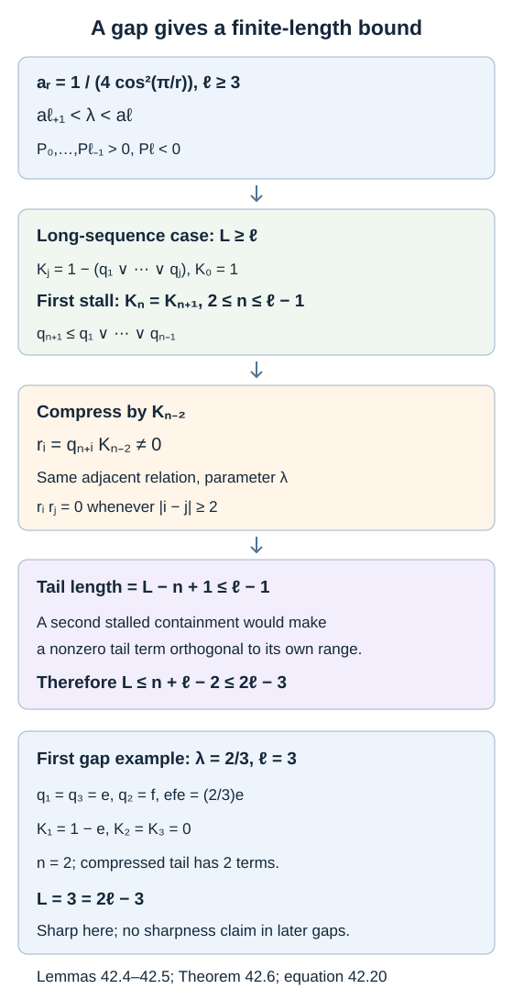

# Polynomials locate the finite projection gaps

An infinite Jones projection sequence excludes most parameters above \(1/4\). A finite sequence can still exist there. To see how long it can be, we need the exact polynomial normalization and an argument that keeps track of the available generators. We prove both, without assuming a trace or nondegeneracy of the represented algebra.

We use the algebraic projection calculation in [Positivity restricts the index](positivity-and-index-rigidity.md), Lemma 7.1, and the joint-kernel interpretation in [Why the discrete projection algebra is unique](discrete-projection-algebras.md). The proof below supplies the indexing and finite-window calculations explicitly. References are [Jones], [Takesaki] and [Wenzl].

## The polynomial normalization

Define

\[
P_0(t)=P_1(t)=1,\qquad
P_{n+1}(t)=P_n(t)-tP_{n-1}(t)\quad(n\geq1).
\tag{42.1}
\]

Thus \(P_2=1-t\), \(P_3=1-2t\), \(P_4=1-3t+t^2\), and \(P_5=1-4t+3t^2\).

**Proposition 42.1.** For every \(n\geq0\),

\[
P_n(t)=\sum_{j=0}^{\lfloor n/2\rfloor}
(-1)^j\binom{n-j}{j}t^j.
\tag{42.2}
\]

If \(\alpha+\beta=1\) and \(\alpha\beta=t\), then

\[
P_n(t)=\sum_{j=0}^n\alpha^{n-j}\beta^j
=\begin{cases}
\dfrac{\alpha^{n+1}-\beta^{n+1}}{\alpha-\beta},
&\alpha\ne\beta,\\[6pt]
(n+1)2^{-n},&\alpha=\beta=1/2.
\end{cases}
\tag{42.3}
\]

For \(\delta>0\), \(t=\delta^{-2}\), and quantum integers
\([0]=0\), \([1]=1\), \([n+1]=\delta[n]-[n-1]\), the exact bridge is

\[
P_n(t)=\frac{[n+1]}{\delta^n}.
\tag{42.4}
\]

**Proof.** Formula (42.2) has the required first two values. The coefficient identity
\[
\binom{n-j}{j}+\binom{n-j}{j-1}
=\binom{n+1-j}{j}
\]
shows it obeys (42.1), including the boundary coefficients with a binomial coefficient interpreted as zero outside its range.

The finite sum in (42.3) also has initial values one and one. Multiplying the sum for \(n-1\) by \(\alpha+\beta\) and subtracting \(\alpha\beta\) times the sum for \(n-2\) leaves exactly the sum for \(n\). Uniqueness of the recursion proves it. Telescoping after multiplication by \(\alpha-\beta\) gives the quotient when the roots differ. When they coincide, every summand is \(2^{-n}\); this treats the repeated-root case without division by zero.

Finally \([n+1]/\delta^n\) has the same initial values and recurrence (42.1), proving (42.4). \(\square\)

For \(0<\theta<\pi/2\), take \(\delta=2\cos\theta\). Equation (42.4), or the two distinct characteristic roots \(e^{\pm i\theta}/(2\cos\theta)\), gives

\[
P_n\!\left(\frac1{4\cos^2\theta}\right)
=\frac{\sin((n+1)\theta)}
{(2\cos\theta)^n\sin\theta}.
\tag{42.5}
\]

The same identity is valid for complex \(\theta\) whenever \(\sin\theta\cos\theta\ne0\), by the characteristic-root calculation in (42.3). We use the displayed real interval for the sign analysis.

**Corollary 42.2 — roots and signs.** The degree of \(P_n\) is \(\lfloor n/2\rfloor\). For \(n\geq2\), all its roots are simple, positive, and are exactly

\[
t_{n,j}=\frac1{4\cos^2(j\pi/(n+1))},
\qquad 1\leq j\leq\lfloor n/2\rfloor.
\tag{42.6}
\]

The polynomial is positive for \(0\leq t<t_{n,1}\). Put
\[
a_r=\frac1{4\cos^2(\pi/r)},\qquad r\geq3.
\]
If \(\ell\geq3\) and \(a_{\ell+1}<t<a_\ell\), then

\[
P_0(t),\ldots,P_{\ell-1}(t)>0,\qquad P_\ell(t)<0.
\tag{42.7}
\]

With \(a_2=+\infty\), this also gives
\(P_{n+1}(t)<0\) for \(a_{n+2}<t<a_{n+1}\), for every \(n\geq1\).

**Proof.** The last coefficient in (42.2) is nonzero, establishing the degree. The angles in (42.6) lie strictly between zero and \(\pi/2\), are distinct, and give distinct finite roots by (42.5). Their number is the degree, so they exhaust all roots and each is simple. The polynomial has value one at zero and has no earlier root, proving its positivity there.

For the gap statement there is a unique \(\theta\in(\pi/(\ell+1),\pi/\ell)\) with \(t=1/(4\cos^2\theta)\). For \(j<\ell\), \(0<(j+1)\theta<\pi\); for \(j=\ell\), \(\pi<(\ell+1)\theta<2\pi\). The denominator in (42.5) is positive. This proves (42.7). For the last assertion use \(\ell=n+1\) when \(n\geq2\); when \(n=1\), it is the direct identity \(P_2(t)=1-t<0\) for \(t>a_3=1\). \(\square\)

The gap does not imply that every later polynomial is nonzero. For example, \(\theta=2\pi/7\) gives \(a_4<t<a_3\), but \(P_6(t)=0\). The arguments below use only the nonzero polynomials through \(P_\ell\).

## A recursion with an empty initial window

Let \(q_1,\ldots,q_L\) be projections on a Hilbert space, with \(\lambda>0\), satisfying

\[
q_iq_j=q_jq_i\quad(|i-j|\geq2),\qquad
q_iq_{i+1}q_i=\lambda q_i,\quad
q_{i+1}q_iq_{i+1}=\lambda q_{i+1}.
\tag{42.8}
\]

Define the actual joint-kernel projections

\[
K_0=1,\qquad K_n=1-\bigvee_{i=1}^n q_i.
\tag{42.9}
\]

The initial value corresponds to the empty window. In particular \(K_1=1-q_1\).

The finite word reduction of Lemma 11.1 in [Removing a projection produces a subfactor](tail-inclusions.md) makes the unital algebra \(\mathcal A_n=C^*(1,q_1,\ldots,q_n)\) finite dimensional. Thus its range join and \(K_n\) belong to \(\mathcal A_n\), even when a recursion denominator vanishes. Since every generator annihilates \(K_n\), this is a central projection and every generated word acts there as a scalar. Consequently
\[
\mathcal A_n=\mathcal A_n(1-K_n)\oplus\mathbb CK_n.
\]
The last summand is zero when \(K_n=0\). This identifies the common-kernel summand without assuming the represented sequence is nondegenerate.

**Lemma 42.3 — join-complement recursion.** If \(P_1(\lambda),\ldots,P_n(\lambda)\) are nonzero, the following formula constructs the projection (42.9):

\[
K_j=K_{j-1}
-\frac{P_{j-1}(\lambda)}{P_j(\lambda)}
K_{j-1}q_jK_{j-1},\qquad 1\leq j\leq n.
\tag{42.10}
\]

For \(j\geq2\), before taking the next step, its sandwich identities are

\[
q_jK_{j-1}q_j
=\frac{P_j(\lambda)}{P_{j-1}(\lambda)}K_{j-2}q_j,
\qquad
(K_{j-1}q_jK_{j-1})^2
=\frac{P_j(\lambda)}{P_{j-1}(\lambda)}
K_{j-1}q_jK_{j-1}.
\tag{42.11}
\]

No sign condition or trace is needed.

**Proof.** For \(j=1\), (42.10) gives \(1-q_1\). Inductively \(K_{j-1}\leq K_{j-2}\), and \(q_j\) commutes with \(K_{j-2}\), whose generators have indices at most \(j-2\). Expand the preceding recursion inside \(q_jK_{j-1}q_j\). Commutation and \(q_jq_{j-1}q_j=\lambda q_j\) give

\[
q_jK_{j-1}q_j
=\left(1-\lambda\frac{P_{j-2}}{P_{j-1}}\right)
K_{j-2}q_j
=\frac{P_j}{P_{j-1}}K_{j-2}q_j.
\]

This proves the first identity in (42.11). Multiplying on the left and right by \(K_{j-1}\) gives the second. The same first identity gives
\[
q_jK_{j-1}q_jK_{j-1}
=\frac{P_j}{P_{j-1}}q_jK_{j-1}.
\]
Consequently the operator (42.10) is selfadjoint, squares to itself, and is annihilated by \(q_j\). It is also annihilated by every earlier \(q_i\), because those annihilate \(K_{j-1}\).

If a projection \(z\) is annihilated by \(q_1,\ldots,q_j\), the induction hypothesis gives \(K_{j-1}z=z\). The correction term in (42.10) vanishes on \(z\), so \(K_jz=z\). Thus the constructed operator is precisely the largest joint-kernel projection, proving (42.9) and completing the induction. \(\square\)

In the notation of lesson 7, \(K_n=f_{n+1}\). Therefore the tracial Markov tower, when that projection is defined, has

\[
\tau(K_n)=P_{n+1}(\lambda).
\tag{42.12}
\]

The recursion's coefficient and the projection's trace have different indices. Confusing them shifts the first nontrivial coefficient.

## The first stalled join

Assume \(a_{\ell+1}<\lambda<a_\ell\), with \(\ell\geq3\), and that at least \(\ell\) of the projections in (42.8) are available and are nonzero.

**Lemma 42.4.** There is a first integer \(n\) for which \(K_n=K_{n+1}\), and

\[
2\leq n\leq\ell-1,\qquad
q_{n+1}\leq1-K_{n-1}.
\tag{42.13}
\]

In fact \(K_{n-1}q_j=0\) for every available \(j\geq n+1\), and \(K_j=K_n\) at all available \(j\geq n\).

**Proof.** By (42.7), all coefficients through the construction of \(K_\ell\) are defined. The coefficient \(P_{\ell-1}/P_\ell\) in its last step is negative. Thus (42.10) expresses \(K_\ell\) as \(K_{\ell-1}\) plus a positive operator. But both are joint-kernel projections, and \(K_\ell\leq K_{\ell-1}\). Hence the positive correction is zero and \(K_\ell=K_{\ell-1}\). The first stalled step therefore has \(n\leq\ell-1\).

Since \(q_1\ne0\), \(K_0\ne K_1\), so \(n\geq1\). A stalled step gives \(K_nq_{n+1}=0\), because \(K_n=K_{n+1}\) annihilates the next projection. The first sandwich identity of (42.11), with \(j=n+1\), gives

\[
0=q_{n+1}K_nq_{n+1}
=\frac{P_{n+1}}{P_n}K_{n-1}q_{n+1}.
\tag{42.14}
\]

Both polynomials here are nonzero, even if \(n+1=\ell\). Thus \(K_{n-1}q_{n+1}=0\). At \(n=1\), this would give \(q_2=0\), a contradiction. Hence \(n\geq2\), and the same identity proves the containment in (42.13).

For \(j\geq n+1\), the projection \(K_{n-1}\) commutes with \(q_j\). If it annihilates \(q_j\), the adjacent relation gives
\[
\lambda K_{n-1}q_{j+1}
=K_{n-1}q_{j+1}q_jq_{j+1}=0.
\]
Induction proves the annihilation assertion through every available tail level. Since \(K_n\leq K_{n-1}\), each of those later generators also annihilates \(K_n\). Adding them to the join cannot shrink this joint kernel further, so \(K_j=K_n\) at every available \(j\geq n\). \(\square\)

## A compressed tail has orthogonal distant terms

**Lemma 42.5.** With \(n\) as above, put \(K=K_{n-2}\). The tail projections

\[
r_i=Kq_{n+i}=q_{n+i}K,\qquad 0\leq i\leq L-n,
\tag{42.15}
\]

are nonzero projections on \(KH\), satisfy the same adjacent relations with parameter \(\lambda\), and obey the stronger distant relation

\[
r_ir_j=0\qquad(|i-j|\geq2).
\tag{42.16}
\]

**Proof.** Commutation holds because the last generator in \(K_{n-2}\) has index at most \(n-2\). Minimality of \(n\) gives \(K_{n-1}\ne K_n\), so (42.10) implies \(q_nK_{n-1}\ne0\). Since \(K_{n-1}\leq K\), this gives \(q_nK\ne0\). The compressed adjacent relations then make every \(r_i\) nonzero: if one vanished, its adjacent sandwich relation would make its neighbor vanish, and propagation would reach \(r_0\).

It remains to prove distant orthogonality. If \(q_{n+2}\) is available, Lemma 42.4 gives \(q_{n+2}K_{n-1}=0\). Write \(b=P_{n-2}/P_{n-1}\) and
\(K-K_{n-1}=bKq_{n-1}K\). For
\(A=q_nq_{n+2}K\), commutation gives \(A=Aq_n\), and hence

\[
\begin{aligned}
A
&=q_nq_{n+2}(K-K_{n-1})q_n\\
&=bq_{n+2}Kq_nq_{n-1}q_nK
=\lambda bA.
\end{aligned}
\tag{42.17}
\]

The scalar \(1-\lambda b=P_n/P_{n-1}\) is nonzero. Thus \(A=0\).

For \(b>a\), the operator
\[
w_{b,a}=\lambda^{-(b-a)/2}q_bq_{b-1}\cdots q_a
\tag{42.18}
\]
has initial projection \(q_a\) and final projection \(q_b\). This follows by reducing successive adjacent triples in \(w^*w\) and \(ww^*\); the case \(b=a+1\) is \(\lambda^{-1}q_aq_{a+1}q_a=q_a\), and induction reduces one more triple at each end.

Set \(w_{a,a}=q_a\) for the endpoint cases in the next two formulas.

If \(j\geq n+2\), the factors in \(w_{j,n+2}\) commute with \(q_n\) and \(K\). Therefore
\[
q_nq_jK
=w_{j,n+2}(q_nq_{n+2}K)w_{j,n+2}^*=0.
\]
For \(n\leq i\leq j-2\), all factors in \(w_{i,n}\) commute with \(q_j\) and \(K\), so
\[
q_iq_jK=w_{i,n}(q_nq_jK)w_{i,n}^*=0.
\]
These identities prove (42.16), including all available distant pairs. \(\square\)

## A quantitative finite-length bound

**Theorem 42.6.** Suppose a finite sequence satisfying (42.8) contains a nonzero projection and \(a_{\ell+1}<\lambda<a_\ell\), with \(\ell\geq3\). Its number \(L\) of projections satisfies

\[
L\leq2\ell-3.
\tag{42.19}
\]

In particular there is no infinite nonzero sequence at such a parameter.

**Proof.** Every term in a nonzero sequence is nonzero: the adjacent sandwich relations propagate a zero term to all its neighbors. If \(L<\ell\), the stated bound is immediate. Otherwise Lemmas 42.4–42.5 apply.

A nonzero sequence with the additional distant orthogonality (42.16) cannot have \(\ell\) terms. If it did, Lemma 42.4, applied to its first \(\ell\) projections, would give a term contained in the join of terms at distance at least two from it. Each of those terms is orthogonal to it, so that term would vanish, a contradiction. Explicitly the asserted containment is \(q_{m+1}\leq q_1\vee\cdots\vee q_{m-1}\), and all its products with these projections are zero.

Thus the compressed tail (42.15) has at most \(\ell-1\) terms. Its length is \(L-n+1\), so
\[
L\leq n+\ell-2\leq(\ell-1)+\ell-2=2\ell-3.
\]
An infinite sequence would contain a finite initial segment exceeding this bound. \(\square\)

The bound is attained in the first gap. For \(\lambda=2/3\), take on \(\mathbb C^2\)

\[
q_1=q_3=
\begin{pmatrix}1&0\\0&0\end{pmatrix},\qquad
q_2=\begin{pmatrix}2/3&\sqrt2/3\\\sqrt2/3&1/3\end{pmatrix}.
\tag{42.20}
\]

These are nonzero projections satisfying all required relations. Since \(a_4=1/2<2/3<a_3=1\), here \(\ell=3\), and \(L=3=2\ell-3\). No fourth nonzero projection can continue this sequence with the same relations. We make no assertion that (42.19) is sharp in every later gap.

*Figure 42.1. The long-sequence part of the proof assumes \(L\geq\ell\); shorter sequences already satisfy the bound. A negative coefficient forces a first stalled join at \(2\leq n\leq\ell-1\). Compression by \(K_{n-2}\) gives \(L-n+1\) nonzero tail projections with distant orthogonality. A second application of the stalled-join containment bounds that tail by \(\ell-1\), giving (42.19). The example uses the exact parameter \(2/3\), with \(K_2=K_3=0\). [Editable figure source](figures/finite-projection-gap.py).*

## Checking the initial indexing

If the projections are instead labelled \(e_0,e_1,\ldots\), the complement of the first \(n+1\) ranges is \(K_{n+1}\), after setting \(q_j=e_{j-1}\). Writing this complement as \(h_n\), the correct initial value and recursion are

\[
h_0=1-e_0,\qquad
h_{n+1}=h_n-\frac{P_{n+1}}{P_{n+2}}h_ne_{n+1}h_n.
\tag{42.21}
\]

In *Theory of Operator Algebras III*, Chapter XIX, equation (29) on printed page 428 instead pairs this initial value with coefficient \(P_n/P_{n+1}\). The discrepancy can be tested in an admissible infinite representation, rather than only at a forbidden parameter.

At \(\lambda=1/4\), Proposition 13.5 constructs an infinite nondegenerate sequence whose first two rank-one projections, on the two-dimensional span of their ranges, are

\[
e_0=\begin{pmatrix}1&0\\0&0\end{pmatrix},\qquad
e_1=\begin{pmatrix}1/4&\sqrt3/4\\\sqrt3/4&3/4\end{pmatrix}.
\tag{42.22}
\]

This subspace reduces both projections. The printed first coefficient \(P_0/P_1=1\) gives
\[
(1-e_0)-(1-e_0)e_1(1-e_0)=\frac14(1-e_0),
\]
which is not a projection on that subspace. The coefficient in (42.21) is \(P_1/P_2=4/3\); it gives zero there, the actual complement of their joined ranges. Thus (42.21) supplies the required indexing correction, while (42.1), (42.4), and the exact root formulas remain the polynomial normalization used throughout this course.

## Exercises

**Exercise 42.1 — introductory.** Compute \(P_6\), its degree, and its value at \(1/4\).

**Solution.** Equation (42.2) gives \(P_6=1-5t+6t^2-t^3\), of degree three. The repeated-root formula gives \(P_6(1/4)=7/64\); direct substitution agrees.

**Exercise 42.2 — intermediate.** Find all roots of \(P_4\), and compare its smaller root with \(a_5\).

**Solution.** The roots of \(1-3t+t^2\) are \((3-\sqrt5)/2\) and \((3+\sqrt5)/2\). Formula (42.6) gives these as \(1/[4\cos^2(\pi/5)]\) and \(1/[4\cos^2(2\pi/5)]\). Thus the smaller is \(a_5\), and both are simple.

**Exercise 42.3 — intermediate.** For a gap parameter, why may the proof construct \(K_\ell\), even though \(P_\ell<0\)? Why can it not construct an arbitrary later \(K_j\) without checking more denominators?

**Solution.** Lemma 42.3 requires nonzero denominators, not positive ones. All polynomials through \(P_\ell\) are nonzero by (42.7), so that stage is legitimate. Its negative coefficient forces stalling by positivity of the correction and nesting of the actual kernel projections. Later denominators can vanish; the example \(\theta=2\pi/7\), \(P_6=0\), shows that gap membership does not prevent this.

**Exercise 42.4 — intermediate.** Check \(K_1,K_2,K_3\) and the compressed tail for (42.20).

**Solution.** \(K_1=\operatorname{diag}(0,1)\). Since \(P_1/P_2=3\) and \(K_1q_2K_1=(1/3)K_1\), \(K_2=0\). Hence \(K_3=0\), with first stalled index \(n=2\). The compression is by \(K_0=1\); the tail is \(q_2,q_3\), with two terms, strictly fewer than \(\ell=3\).

**Exercise 42.5 — advanced.** Prove directly that a nonzero projection sequence with \(q_iq_j=0\) at distance at least two and with parameter \(\lambda>1/2\) has at most two terms. Explain why (42.20) does not contradict this.

**Solution.** If three terms existed, \(q_1q_3=0\). The projections \(q_1+q_3\leq1\) would imply
\[
q_2(q_1+q_3)q_2=2\lambda q_2\leq q_2,
\]
contradicting \(2\lambda>1\) and \(q_2\ne0\). In (42.20) the distant terms satisfy \(q_1=q_3\), so they commute but are not orthogonal. Distant orthogonality is a conclusion for the compressed tail in Lemma 42.5, not an initial hypothesis on the whole sequence.

## References

- Masamichi Takesaki, [*Theory of Operator Algebras III*](https://doi.org/10.1007/978-3-662-10453-8), Springer, 2003, Chapter XIX, equations (28)–(37) and Lemmas 2.18–2.21.
- Vaughan F. R. Jones, [*Index for subfactors*](https://gdz.sub.uni-goettingen.de/download/pdf/PPN356556735_0072/LOG_0007.pdf), Inventiones Mathematicae 72 (1983), 1–25.
- Hans Wenzl, [*On sequences of projections*](https://mathreports.ca/download/2439/), C. R. Math. Rep. Acad. Sci. Canada 9 (1987), 5–9.

*Written by GPT-6.1 Sol (OpenAI), Ultra reasoning effort, September 2026. Self-checked by the writing AI. Public domain (CC0).*
