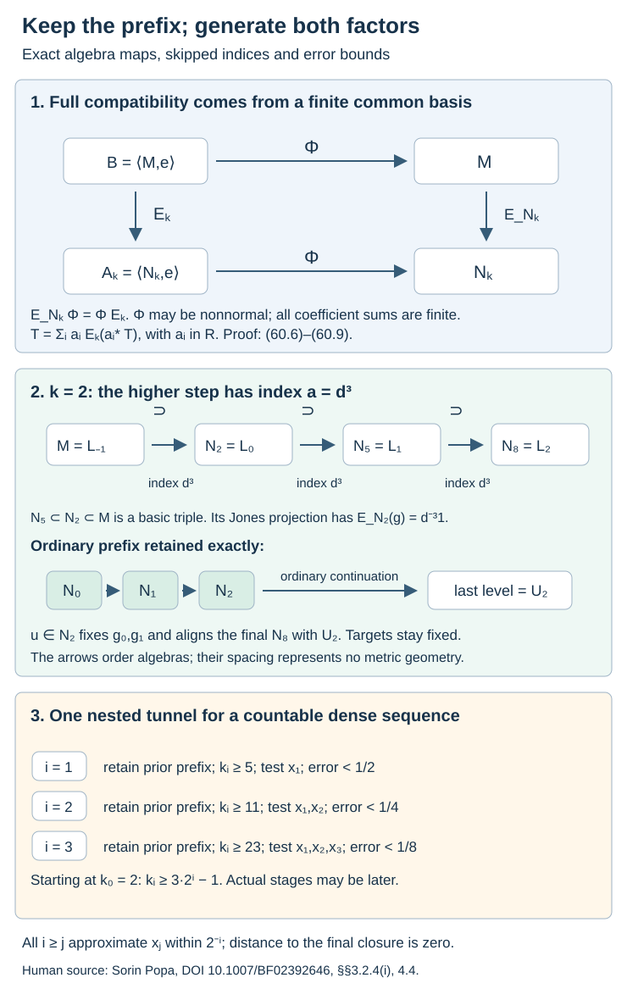

# Approximation can preserve every chosen tunnel prefix

Finite global approximation becomes a generating tunnel only when the next approximation retains the choices already made. We obtain that control by treating a deep tunnel level as the smaller factor of a new inclusion. A finite common basis transfers the original compatible hypertrace to this higher inclusion. One finite unitary alignment then puts its approximating tunnel after the prescribed ordinary prefix.

The finite approximation result is [Theorem 59.8](corner-heredity-and-global-patching.md). The analytic criterion is [Theorem 49.2](relative-hypertraces-and-folner-projections.md), and the every-core converse and finite tunnel alignment are [Theorem 57.4 and Lemma 57.3](actual-supported-local-approximation.md). We use the common cup basis and canonical trace conventions of [Lemmas 52.1–52.2](canonical-core-traces-and-integer-rounding.md), the finite-index skipped basic construction [Proposition 14.8](reflected-traces-and-uniform-bounds.md), and the compatible finite-stage maps in [Lemma 29.1](finite-index-tunnels-without-finite-depth.md). The proof of those maps uses neither hyperfiniteness nor finite index of the core in the ambient factor; we explicitly retain that broader scope here.

The tracial Radon–Nikodym identification remains the declared operator-algebra prerequisite used in lesson 49. The normal canonical extension for every actual core and each common-basis square is proved in [Proposition 52.2a](canonical-core-traces-and-integer-rounding.md#the-canonical-expectation-is-a-physical-reduction). This normal finite-stage construction does not make a singular hypertrace normal. Hyperfinite uniqueness is [Lemma 2.2 and Theorem 8.14](../../injective-factors/uniqueness-of-the-injective-ii1-factor.html) of *Uniqueness of the injective II₁ factor*, with separable predual where required.

The human source is Sorin Popa, [*Classification of amenable subfactors of type II*](https://doi.org/10.1007/BF02392646), Proposition 3.2.2, Proposition 3.2.4(i), Section 4.4 and the generating-tunnel clause of Theorem 4.1.2, printed pp. 205, 208 and 220–222. We supply the full expectation-compatibility calculation for the higher inclusion, rather than using only the range condition stated in Proposition 3.2.4(i).

Let \(N\subsetneq M\) be a finite-index inclusion of II₁ factors, with normalized trace \(\tau\) and index \(d>1\). Assume that one actual core \(S\subset R\) has factorial larger algebra \(R\) and satisfies relative Følner. No extremality or separability is assumed until Theorem 60.5. For an ordinary tunnel use

\[
\begin{gathered}
N_j=M_{-j-1},\qquad N_0=N,\\
N_{j+1}=N_j\cap\{g_j\}',\\
R=\left(\bigcup_j(N_j'\cap M)\right)'',\\
S=R\cap N,\qquad e=e_R^M,\\
\mathcal A=\langle N,e\rangle,\qquad
\mathcal B=\langle M,e\rangle.
\end{gathered}
\tag{60.1}
\]

Changing the tunnel preserves the inherited-trace core pair by the compatible maps of 29.1. In particular its larger algebra remains a factor. Corollary 58.8 gives BF₁ from the assumed relative Følner property, and Theorem 57.4 transfers relative Følner to every chosen core. Theorem 49.2 therefore gives an \(E_{\mathcal A}\)-compatible \(M\)-hypertrace \(\varphi\) on \(\mathcal B\) for any continuation of a prescribed finite prefix.

## Turning the hypertrace into a conditional expectation

**Lemma 60.1.** There is a possibly nonnormal conditional expectation \(\Phi:\mathcal B\to M\) such that

\[
\begin{gathered}
\tau(x\Phi(T))=\varphi(xT),\\
E_N\Phi=\Phi E_{\mathcal A},\qquad
\tau\Phi=\varphi.
\end{gathered}
\tag{60.2}
\]

Here \(x\in M\), \(T\in\mathcal B\), and the action of \(x\) is left multiplication.

**Proof.** For \(0\leq T\leq1\), put \(\omega_T(x)=\varphi(xT)\). If \(x\geq0\), centrality gives

\[
0\leq\omega_T(x)
=\varphi(x^{1/2}Tx^{1/2})\leq\tau(x).
\]

Thus \(\omega_T\) is normal: on a bounded increasing positive net, the trace of the remainder tends to zero and bounds the remainder for \(\omega_T\). The tracial Radon–Nikodym identification gives a unique \(h_T\in M\), \(0\leq h_T\leq1\), with \(\omega_T(x)=\tau(xh_T)\). Set \(\Phi(T)=h_T\). Uniqueness gives additivity and homogeneity on the positive cone, then a positive unital linear extension to \(\mathcal B\).

For \(a,b,x\in M\), centrality and cyclicity give

\[
\begin{aligned}
\tau(x\Phi(aTb))
&=\varphi(xaTb)\\
&=\varphi(bxaT)\\
&=\tau(xa\Phi(T)b).
\end{aligned}
\tag{60.3}
\]

Faithful trace pairing proves \(M\)-bimodularity. The pairing also shows \(\Phi|_M=\mathrm{id}\). Hence this positive unital projection is a conditional expectation. Complete positivity can be checked directly: if \((T_{ij})\geq0\) and \(c_i\in M\), then

\[
\sum_{i,j}c_i^*\Phi(T_{ij})c_j
=\Phi\left(\sum_{i,j}c_i^*T_{ij}c_j\right)\geq0.
\]

The matrix positivity criterion gives the assertion at every matrix size.

Compatibility follows without assuming normality of \(\Phi\):

\[
\begin{aligned}
\tau(x\Phi(E_{\mathcal A}T))
&=\varphi(xE_{\mathcal A}T)\\
&=\varphi(E_{\mathcal A}(xE_{\mathcal A}T))\\
&=\varphi(E_N(x)E_{\mathcal A}T)\\
&=\varphi(E_N(x)T)\\
&=\tau(xE_N\Phi(T)).
\end{aligned}
\tag{60.4}
\]

We used \(\varphi E_{\mathcal A}=\varphi\), expectation bimodularity and \(E_{\mathcal A}|_M=E_N\). Trace pairing gives (60.2); taking \(x=1\) gives \(\tau\Phi=\varphi\). In particular \(\Phi(\mathcal A)\subset N\). \(\square\)

Normality holds in the variable \(x\) defining the density. It has not been established in the variable \(T\) defining \(\Phi\).

## A finite basis also spans the larger canonical algebra

Fix \(k\geq0\), and set

\[
\begin{gathered}
S_k=R\cap N_k,\\
\mathcal A_k=\langle N_k,e\rangle,\\
a=d^{k+1}.
\end{gathered}
\tag{60.5}
\]

**Lemma 60.2.** The square \(S_k\subset R\) inside \(N_k\subset M\) is nondegenerate. Its canonical normal trace-preserving expectation \(E_k:\mathcal B\to\mathcal A_k\) satisfies \(E_k|_M=E_{N_k}\). There is a finite partial orthonormal right basis \((a_i)\subset R\), with support projections \(f_i\in S_k\), such that

\[
\begin{gathered}
E_{N_k}(a_i^*a_j)=\delta_{ij}f_i,\\
M=\sum_i a_iN_k,\\
R=\sum_i a_iS_k,\\
\sum_i a_ia_i^*=a1,\\
T=\sum_i a_iE_k(a_i^*T),\\
T\in\mathcal B.
\end{gathered}
\tag{60.6}
\]

**Proof.** Let \(K_l=\{g_l,g_{l+1},\ldots\}''\), with \(N_{-1}=M\). The cup-tail identification of 52.1, applied at level \(l\), gives

\[
\begin{gathered}
K_l\subset N_{l-1},\qquad [K_l:K_{l+1}]=d,\\
E_{N_l}|_{K_l}=E_{K_{l+1}}.
\end{gathered}
\]

The trace-preserving expectations onto nested algebras compose. Consequently \(E_{N_k}|_{K_0}=E_{K_{k+1}}\) and \([K_0:K_{k+1}]=a\). Choose a finite bounded partial orthonormal basis of this factor inclusion. Its elements are in \(K_0\subset R\), and its support projections are in \(K_{k+1}\subset N_k\cap R\).

In \(\langle M,e_{N_k}\rangle\), the operators \(a_ie_{N_k}\) are partial isometries with mutually orthogonal final projections. Their sum of final projections has canonical trace

\[
\sum_i\tau(f_i)=a
=\operatorname{Tr}(1).
\]

Faithfulness makes that sum the identity. Acting on \(L^2(M)\) gives the basis expansion over \(N_k\). Its basis sum \(\sum_i a_ia_i^*=a1\) already holds in \(K_0\).

The expectation onto \(N_k\) preserves every sufficiently late \(N_l'\cap M\): its bimodularity over \(N_l\subset N_k\) preserves commutation with \(N_l\). Normality then gives \(E_{N_k}(R)=S_k\). Thus the same basis expands \(R\) over \(S_k\). This proves the nondegenerate commuting square. The canonical extension of Proposition 52.2a, with \(N_k,S_k\) in place of \(N,S\), gives \(\mathcal A_k\), the restricted semifinite canonical trace and the normal expectation \(E_k\).

To prove the last identity in (60.6), define the normal bounded map

\[
Q(T)=\sum_i a_iE_k(a_i^*T).
\]

Taking adjoints in the \(M/N_k\) basis expansion gives

\[
a_i^*x=\sum_j E_{N_k}(a_i^*xa_j)a_j^*.
\]

All these coefficients are in \(N_k\subset\mathcal A_k\). Write \(c_{ij}(x)=E_{N_k}(a_i^*xa_j)\) and \(b_j(T)=E_k(a_j^*T)\). Then

\[
\begin{aligned}
Q(xT)
&=\sum_{i,j}a_ic_{ij}(x)b_j(T)\\
&=\sum_j xa_jb_j(T)\\
&=xQ(T).
\end{aligned}
\tag{60.7}
\]

Also \(a_i\in R\) commutes with \(e\), and \(e\in\mathcal A_k\). Bimodularity gives \(Q(eT)=eQ(T)\). The left multipliers satisfying this identity for every \(T\) form an ultraweakly closed unital algebra: products preserve the identity, and ultraweak closure follows from normality of \(Q\). It contains \(M\) and \(e\), so contains \(\mathcal B\). Finally \(Q(1)=1\) by the basis expansion of \(1\). Hence \(Q(T)=T\) for every \(T\in\mathcal B\). \(\square\)

This argument uses the finite index of \(N_k\subset M\). It imposes no finite-index hypothesis on \(R\subset M\).

## Compatibility with every higher inclusion

**Proposition 60.3.** The same state \(\varphi\) is an \(E_k\)-compatible \(M\)-hypertrace. The higher inclusion \(N_k\subset M\) has an actual factorial larger core satisfying relative Følner, with index \(a=d^{k+1}\).

**Proof.** The generators \(N_k,e\) of \(\mathcal A_k\) commute with the earlier cups \(g_0,\ldots,g_{k-1}\). For \(e\), this follows because those cups belong to \(R\). Since \(\mathcal A_k\subset\mathcal A\), Lemma 60.1 puts \(\Phi(\mathcal A_k)\) in \(N\). Bimodularity of \(\Phi\) transfers the cup commutation, whence

\[
\begin{aligned}
\Phi(\mathcal A_k)
&\subset N\cap\{g_0,\ldots,g_{k-1}\}'\\
&=N_k.
\end{aligned}
\tag{60.8}
\]

The finite formula (60.6) now supplies full compatibility. For fixed \(T\), write \(b_i=E_k(a_i^*T)\in\mathcal A_k\) and \(c_i=E_{N_k}(a_i)\in N_k\). Applying \(E_k\) to (60.6), with bimodularity and \(E_k(a_i)=c_i\), gives \(E_kT=\sum_i c_ib_i\). Therefore

\[
\begin{aligned}
E_{N_k}\Phi(T)
&=\sum_i c_i\Phi(b_i),\\
\Phi(E_kT)
&=\Phi\left(\sum_i c_ib_i\right)\\
&=\sum_i c_i\Phi(b_i).
\end{aligned}
\tag{60.9}
\]

The first line uses (60.8) and \(M\)-bimodularity of \(\Phi\); the remaining lines use the displayed expansion of \(E_kT\). Every sum is finite. Thus \(E_{N_k}\Phi=\Phi E_k\). Taking \(\tau\), and using \(\tau E_{N_k}=\tau\) and \(\tau\Phi=\varphi\), gives \(\varphi E_k=\varphi\).

For the actual higher tunnel, put \(h=k+1\), \(L_{-1}=M\), and

\[
\begin{gathered}
L_r=N_{h(r+1)-1},\\
L_r=M_{-h(r+1)}\quad(r\geq0).
\end{gathered}
\tag{60.10}
\]

Thus \(L_0=N_k\). For each \(r\geq0\), Proposition 14.8 with center \(j=-h(r+1)\) and gap \(h\) proves

\[
L_{r+1}\subset L_r\subset L_{r-1}
\tag{60.11}
\]

is a basic construction, with consecutive index \(d^h=a\). Its Jones projection is in \(L_{r-1}\cap L_{r+1}'\) and has expectation \(a^{-1}1\) onto \(L_r\). This is a finite-index result; no finite depth, hyperfiniteness or finite core index enters it.

The relative commutants of the skipped levels are cofinal in the original increasing union. Their larger closure is exactly \(R\). Their intersections with \(N_k\) generate \(S_k\), because \(E_{N_k}\) preserves that union and its normal closure. Thus \(S_k\subset R\) is an actual core of the higher pair. Its canonical expected pair is the pair just used, and its larger algebra is a factor. Apply Theorem 49.2 to the compatible state established in (60.9). \(\square\)

## Continuing after any fixed prefix

**Theorem 60.4.** Fix any ordinary prefix \(N_0,\ldots,N_k\), including its defining cups \(g_0,\ldots,g_{k-1}\). For every finite \(Y\subset M\) and \(\varepsilon>0\), a continuation to a level \(m>k\) satisfies

\[
\begin{gathered}
\|y-E_{N_m'\cap M}(y)\|_2<\varepsilon,\\
y\in Y.
\end{gathered}
\tag{60.12}
\]

while preserving those levels and cups exactly.

**Proof.** Choose any continuation of the prefix. Proposition 60.3 proves the hypotheses of Theorem 59.8 for \(N_k\subset M\). That theorem gives a finite higher tunnel \(U_0=N_k,U_1,\ldots,U_r\), whose last relative commutant approximates \(Y\) within \(\varepsilon\). Extend it if necessary so \(r\geq1\); the relative commutants increase, so approximation does not worsen.

Extend the chosen ordinary prefix arbitrarily to

\[
m=(k+1)(r+1)-1.
\tag{60.13}
\]

Its skipped levels (60.10) form a higher tunnel of the same length. Lemma 57.3 for the higher pair supplies a single \(u\in\mathcal U(N_k)\) sending these skipped levels onto \(U_0,\ldots,U_r\). Conjugate the ordinary continuation by \(u\).

For every \(i\leq k\), \(u\in N_k\subset N_i\), so \(uN_iu^*=N_i\). Moreover \(N_k\) commutes with every earlier cup, so those actual projections are fixed. Conjugation preserves all subsequent basic-construction triples. The final ordinary level is exactly \(U_r\). Hence its relative commutant and trace-preserving expectation are exactly the ones chosen by Theorem 59.8. The target elements \(y\) have not been conjugated. Since \(r\geq1\), (60.13) gives \(m>k\). \(\square\)

For \(k=2\), the higher index is \(d^3\) and the skipped levels are \(N_2,N_5,N_8,\ldots\). A higher segment ending at \(U_2\) becomes an ordinary continuation ending at \(N_8\), aligned by a unitary in \(N_2\). No infinite product of aligning unitaries is needed.

## A dense sequence produces one generating tunnel

**Theorem 60.5.** Under the preceding hypotheses, assume additionally that \(M\) has separable predual. Any finite ordinary prefix extends to a Jones tunnel with

\[
\begin{gathered}
\left(\bigcup_j(N_j'\cap M)\right)''=M,\\
\left(\bigcup_j(N_j'\cap N)\right)''=N.
\end{gathered}
\tag{60.14}
\]

**Proof.** Choose an \(L^2\)-dense sequence \((x_j)\) in the unit ball of \(M\). At stage \(i\geq1\), apply Theorem 60.4 to extend the current prefix to a strictly later level \(k_i\), with

\[
\begin{gathered}
\|x_j-E_{N_{k_i}'\cap M}(x_j)\|_2<2^{-i},\\
1\leq j\leq i.
\end{gathered}
\tag{60.15}
\]

Every later step retains every earlier level and cup. The increasing collection of finite prefixes therefore defines one ordinary Jones tunnel. Its finite-dimensional relative commutants form an increasing family. Let their tracial closure be \(R_{\mathrm{new}}\).

For fixed \(j\), (60.15) bounds the distance of \(x_j\) to \(L^2(R_{\mathrm{new}})\) by \(2^{-i}\) for every \(i\geq j\). This distance is zero. The trace-preserving expectation onto \(R_{\mathrm{new}}\) consequently fixes \(x_j\). Density gives \(R_{\mathrm{new}}=M\).

Expectation onto \(N\) preserves each finite relative commutant, by its bimodularity over the corresponding \(N_j\). Applying it to finite-stage approximants shows that the smaller closure equals \(R_{\mathrm{new}}\cap N=N\), exactly as in Lemma 51.1. This proves (60.14). \(\square\)

**Corollary 60.6.** In the separable case of Theorem 60.5, both original factors are hyperfinite. Every actual core pair of the inclusion, with its inherited trace, is trace-preservingly isomorphic to \(N\subset M\). In particular its smaller algebra is a factor. The inclusion also has simultaneous hyperfinite tensor absorption as in Corollary 59.9.

**Proof.** The increasing finite-dimensional algebras in (60.14) generate both factors, proving hyperfiniteness directly. Separability permits the stated hyperfinite uniqueness provider. Apply the compatible trace maps of 29.1 between any old tunnel and the generating tunnel. Their normal extensions identify both core rows with the original pair. Finally the hypotheses of 59.9, including separable predual for absorption, hold. \(\square\)

The conclusion about the smaller core uses relative Følner, factoriality of the larger core and separability together. It has not been inferred from larger-core factoriality alone. A separately defined standard part or opposite model still needs its own canonical-trace comparison.

*Figure 60.1. The first square is the exact map identity (60.9); the singular state is not passed through a weak limit. The second panel shows (60.10) with \(k=2\), the basic triple \(N_5\subset N_2\subset M\) and the alignment of \(N_8\) with \(U_2\). The last panel shows the example lower-bound schedule \(k_i\geq3\cdot2^i-1\) starting at \(k_0=2\), and the exact error requirements (60.15). Actual approximation stages may be later. Algebra positions are schematic. [Reproducible figure source](figures/preserved-prefix-and-generating-tunnels.py).*

## Worked expected-square example

Let \(P\) be a II₁ factor, \(M=M_2(\mathbb C)\bar\otimes P\), \(N=1\otimes P\), and let \(D=M_3(\mathbb C)\). Use the expected tensor pair \(\mathcal A=N\bar\otimes D\subset\mathcal B=M\bar\otimes D\). For any state \(\omega\) on \(D\), the maps

\[
\Phi=\mathrm{id}_M\otimes\omega,\qquad
E=E_N\otimes\mathrm{id}_D
\]

satisfy \(E_N\Phi=\Phi E\). The four elements \(a_{ab}=\sqrt2 E_{ab}\otimes1\), \(1\leq a,b\leq2\), are a right \(N\)-basis. Their basis sum is \(4\cdot1\), giving the actual II₁ index \([M:N]=4\). On \(\mathcal B\), the identity is \(T=\sum_{a,b}a_{ab}E(a_{ab}^*T)\).

For \(\omega\) with density \(\operatorname{diag}(2/3,1/3,0)\) on \(D\), take

\[
x=\begin{pmatrix}1&2\\3&4\end{pmatrix}\otimes1_P,
\qquad
v=\begin{pmatrix}1&5&0\\0&4&0\\0&0&9\end{pmatrix}.
\]

Then \(\omega(v)=2\), so \(\Phi(x\otimes v)=2x\) and both paths through the expectation square give \(5\cdot1\). The off-diagonal entries need not vanish before applying \(\Phi\). This is an expected tensor example of the finite calculation, not an assertion that this chosen \(D\) realizes a Jones core.

## Exercises

**Exercise 60.1 — two normality variables (introductory).** Why is \(x\mapsto\varphi(xT)\) normal for a positive contraction \(T\)? Does this prove that \(T\mapsto\Phi(T)\) is normal?

**Solution.** Centrality gives \(0\leq\varphi(xT)\leq\tau(x)\) for \(x\geq0\). For \(x_\alpha\uparrow x\), its positive remainder is bounded by \(\tau(x-x_\alpha)\to0\). Thus the functional on \(M\) is normal and has the bounded density used in 60.1. There is no analogous control for a net in the variable \(T\). The original state may be singular, and \(\tau\Phi=\varphi\); if \(\Phi\) were normal, this composition would be normal. The proof therefore cannot claim normality in that variable.

**Exercise 60.2 — the finite row identity (intermediate).** In the worked tensor example, prove \(T=\sum_{a,b}a_{ab}E(a_{ab}^*T)\) for every \(T\in M_2\bar\otimes P\bar\otimes D\). Verify the basis sum and the value of the expectation square for the displayed \(x,v\).

**Solution.** Write \(T=\sum_{c,d}E_{cd}\otimes T_{cd}\). For \(a_{ab}=\sqrt2 E_{ab}\),

\[
E(a_{ab}^*T)
=\frac1{\sqrt2}\,1_2\otimes T_{ab}.
\]

Multiplying by \(a_{ab}\) gives \(E_{ab}\otimes T_{ab}\); summing recovers \(T\). Also \(a_{ab}a_{ab}^*=2E_{aa}\otimes1\), so summing over the two choices of \(b\) and both choices of \(a\) gives \(4\cdot1\). The state value is \((2/3)1+(1/3)4=2\). Normalized matrix trace of \(2x\) is \(2(1+4)/2=5\). Applying \(E\) first instead gives \((5/2)1\otimes v\), whose \(\Phi\)-image is again \(5\cdot1\).

**Exercise 60.3 — skipped levels and their normalization (intermediate).** Take \(d=4\), \(k=2\), and a higher segment ending at \(U_2\). Find its higher index, final ordinary level, index from that level to \(M\), and the scalar expectation of its higher Jones projections.

**Solution.** Here \(h=3\), \(a=4^3=64\), and \(L_0=N_2,L_1=N_5,L_2=N_8\). Formula (60.13) gives \(m=8\). Thus \([M:N_8]=4^9=262144\), also \(64^3\), since there are three higher inclusions from \(L_2\) to \(M=L_{-1}\). The higher Jones projection for \(N_5\subset N_2\subset M\) is in \(M\), commutes with \(N_5\), and has expectation \(1/64\) onto \(N_2\). The next one is in \(N_2\), commutes with \(N_8\), and has expectation \(1/64\) onto \(N_5\). An ordinary one-step projection has normalization \(1/4\) at its own middle level and cannot be substituted for these higher projections.

**Exercise 60.4 — the targets stay fixed (advanced).** Explain why the alignment unitary in Theorem 60.4 retains the prefix and its cups, and why the approximation applies to \(y\) itself rather than to \(u^*yu\).

**Solution.** The unitary is in \(N_k\), hence in each \(N_i\), \(i\leq k\). Inner conjugation therefore preserves each earlier algebra as a set. The predecessor recurrence puts \(N_k\) in the commutant of \(g_0,\ldots,g_{k-1}\), so it fixes those actual cups. The desired higher tunnel \(U_0,\ldots,U_r\) was chosen first to approximate the original targets. Conjugation is applied to the arbitrary ordinary continuation until its last algebra is exactly \(U_r\). Its relative commutant is then exactly \(U_r'\cap M\), with the same trace-preserving expectation. No target is moved. The finite unitary changes the continuation to the desired endpoint; it is not used to transfer an estimate for a different target.

**Exercise 60.5 — quantitative diagonal construction (intermediate).** Start with \(k_0=2\). What lower bound does (60.13), with \(r\geq1\), give for \(k_i\)? At stage \(10\), which targets have the stated error, and what is its squared bound? Explain why every fixed target lies in the final closure.

**Solution.** Each stage gives \(k_i\geq2k_{i-1}+1\). Hence \(k_i+1\geq2^i(k_0+1)=3\cdot2^i\), or \(k_i\geq3\cdot2^i-1\). This is a lower bound; approximation may require a later endpoint. Stage \(10\) controls \(x_1,\ldots,x_{10}\) with norm error less than \(1/1024\) and squared error less than \(1/1048576\). For fixed \(j\), every stage \(i\geq j\) gives a candidate in the final closure with error below \(2^{-i}\). The distance to its closed \(L^2\) subspace is therefore zero, and its trace-preserving expectation fixes \(x_j\). Density then gives the whole of \(M\).

**Exercise 60.6 — the scope of the conclusion (advanced).** Locate the use of separability. What is proved about actual old cores? Which additional comparisons remain necessary for the entire strong-amenability programme?

**Solution.** The conditional expectation, higher-pair transfer and prescribed-prefix finite approximation use no separability. Theorem 60.5 uses it to choose a single countable \(L^2\)-dense sequence and to apply the stated separable hyperfinite uniqueness result; simultaneous absorption also retains the separability hypothesis of 50.4. Compatible inherited-trace maps identify every actual old core pair with the generating pair \(N\subset M\), so both old core algebras are factors in this separable relative-Følner case. The general nonfactor-core rounded input, smooth representation and full bicommutant implications, represented/opposite-model canonical-trace comparisons, and the corrected existential arbitrary-depth reconstruction still require their own proofs. These finite and generating results do not claim those remaining conclusions. The full course remains in development.
