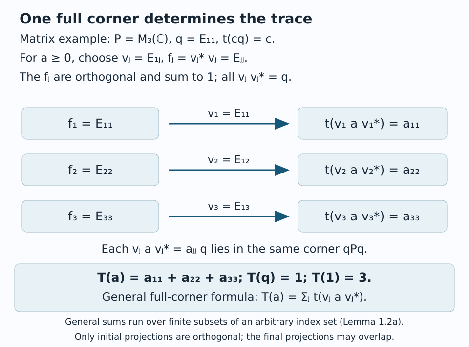

# A projection that remembers an inclusion

The basic construction turns an inclusion of algebras into an algebra of operators on a Hilbert space. Its extra generator is the projection onto the smaller algebra. That projection records the conditional expectation, and the trace of the resulting operator algebra measures the size of the inclusion.

The prerequisite [Finite traces and Jones projections](https://kokunoyumeto.github.io/open-math-courses-public/courses/OA-SUBFACTORS/html/finite-traces-and-jones-projections.html), M1–M6 and M10, proves the trace-preserving normal faithful expectation and the mutual-commutant theorem used here. Projection comparison is proved in [Projections and types of von Neumann algebras](https://kokunoyumeto.github.io/open-math-courses-public/courses/foundations-of-von-neumann-algebras/projections-and-types-of-von-neumann-algebras.html#oa-fnd-ty-03), Proposition 5.1, Lemma 5.3 and Theorem 5.5. We give the needed trace construction from a full finite corner and its normalization below. The same construction, with a more general corner trace, appears in [Traces on von Neumann algebras](https://kokunoyumeto.github.io/open-math-courses-public/courses/OA-FOUND-REMAINDER/reader/supplements/traces-on-von-neumann-algebras-part-a-def-v-2-1-to-def-v-2-17.html), Lemma 6.1 and Theorem 6.2; Lemma 2.4 and Proposition 7.1 there prove the bounded definition-ideal and trace-norm facts.

Basic references are [Anantharaman–Popa], [Jones] and [Pimsner–Popa]. The proofs below use the finite tracial prerequisites specified above and establish the required corner trace and index normalization directly.

## The smaller Hilbert space

Let \(M\) be a von Neumann algebra with faithful normal tracial state \(\tau\), and let \(N\subseteq M\) have the same identity. Write \(E_N:M\to N\) for the trace-preserving expectation. Our inner product is linear in the first variable:

\[
H=L^2(M,\tau),\qquad
\langle x,y\rangle=\tau(y^*x),\qquad
\widehat x\in H\quad(x\in M).
\]

Left multiplication is \(L_x\widehat y=\widehat{xy}\); right multiplication is \(R_x\widehat y=\widehat{yx}\). Thus \(R_xR_y=R_{yx}\). We suppress \(L\) when writing an element of \(M\) as an operator. The conjugation \(J\widehat x=\widehat{x^*}\) satisfies \(JMJ=R(M)\).

Let \(e=e_N\) be the orthogonal projection onto the closure of \(\widehat N\).

**Proposition 1.1.** For \(x\in M\) and \(n\in N\),

\[
e\widehat x=\widehat{E_N(x)},\qquad
en=ne,\qquad eR_n=R_ne,\qquad JeJ=e,
\qquad exe=E_N(x)e.
\]

**Proof.** For \(a\in N\), trace preservation and bimodularity give

\[
\tau(a^*(x-E_N(x)))
=\tau(E_N(a^*x)-a^*E_N(x))=0.
\]

Hence \(\widehat{E_N(x)}\) is the orthogonal projection of \(\widehat x\) onto \(L^2(N)\). The subspace \(L^2(N)\) reduces left and right multiplication by \(n\), because it is invariant under both \(n\) and \(n^*\). It is also invariant under \(J\), giving the next three identities. Finally, for \(a\in N\),

\[
exe\widehat a=e\widehat{xa}
=\widehat{E_N(x)a}=E_N(x)e\widehat a.
\]

Both sides vanish on \((1-e)H\). Density of \(N\) in \(eH\) proves the last identity. \(\square\)

The identity \(exe=E_N(x)e\) is an operator version of averaging. Its right side is multiplication inside the smaller algebra, followed by the same projection.

## The algebra generated by the projection

Define

\[
B=\langle M,e_N\rangle=(M\cup\{e_N\})''\subseteq B(H).
\]

This is the **basic construction**. It contains \(M\), and its position inside \(B(H)\) depends on the inclusion \(N\subseteq M\).

**Theorem 1.2.** The basic construction has the following descriptions:

\[
B=R(N)'=JN'J,\qquad eBe=Ne.
\]

The map \(n\mapsto ne\) is a normal faithful isomorphism from \(N\) to \(eBe\). The projection \(e\) has central support \(1\) in \(B\). Moreover,

\[
\mathcal F=\operatorname{span}\{xey:x,y\in M\}
\]

is a strongly dense, nondegenerate *-subalgebra of \(B\).

**Proof.** The tracial commutation theorem gives \(M'=R(M)\). For \(a\in M\), if \(R_a\) commutes with \(e\), evaluating on \(\widehat1\) gives

\[
\widehat a=R_ae\widehat1=eR_a\widehat1=\widehat{E_N(a)}.
\]

Thus \(a\in N\). Proposition 1.1 proves the converse. Consequently,

\[
(M\cup\{e\})'=R(N),
\]

and taking commutants gives \(B=R(N)'\). Conjugating \(N'\) by \(J\) gives the same algebra.

The compression identity yields

\[
(xey)(uev)=xE_N(yu)ev,
\qquad (xey)^*=y^*ex^*.
\]

Hence \(\mathcal F\) is a *-algebra. Its range on \(H\) is dense, because \(xe\widehat1=\widehat x\) and \(M\) is dense in \(H\). The norm closure of \(\mathcal F\) has a contractive approximate identity that converges strongly to \(1_H\). Existence is [Theorem 11.4 and Corollary 11.5(1) of the C*-algebra prerequisite](https://kokunoyumeto.github.io/open-math-courses-public/courses/foundations-of-von-neumann-algebras/c-star-algebras-continuous-functional-calculus-automatic-continuity-positive-cones.html#oa-fnd-cf-19). Strong convergence follows first on vectors \(a\xi\), with \(a\) in that norm closure, from norm convergence of the approximate identity, and then on all of \(H\) from nondegeneracy and its uniform norm bound. Also \(M\mathcal F\subseteq\mathcal F\), so its strong closure contains every element of \(M\): multiply the approximate identity by that fixed element and approximate its terms in norm by elements of \(\mathcal F\). It contains \(e\), and therefore equals \(B\), by the [double commutant theorem](https://kokunoyumeto.github.io/open-math-courses-public/courses/foundations-of-von-neumann-algebras/the-double-commutant-theorem.html#oa-fnd-bi-07).

Compressing the spanning operators gives

\[
e(xey)e=E_N(x)E_N(y)e.
\]

Since \(Ne\) is a von Neumann algebra on \(eH=L^2(N)\), strong density now implies \(eBe=Ne\). Indeed, M10 applied to \(N\) identifies its standard left action with the commutant of its standard right action, so that left action is strongly closed. Compression by the fixed projection \(e\) preserves strong convergence. This step takes a strong limit in a strongly closed algebra; it does not pass an arbitrary strongly convergent net through a normal functional. The representation of \(N\) on \(L^2(N)\) is faithful and normal by M1 and M10, proving the isomorphism assertion.

Finally, if \(z\in Z(B)\) is a projection with \(ze=0\), then

\[
z\widehat x=zx e\widehat1=xze\widehat1=0
\quad(x\in M).
\]

Density gives \(z=0\). This is precisely the full-central-support assertion. \(\square\)

**Lemma 1.2a — extending a finite trace from a full corner.** Let \(P\) be a von Neumann algebra, let \(q\in P\) have central support \(1\), and let \(t\) be a faithful normal finite trace on \(qPq\). There is a unique faithful normal semifinite trace \(T\) on \(P\) restricting to \(t\).

**Proof.** Choose a maximal family of partial isometries \((v_j)\) with \(v_jv_j^*\leq q\) and mutually orthogonal initial projections \(f_j=v_j^*v_j\). Their sum is \(1\). To see this, if the remainder \(r=1-\sum_jf_j\) were nonzero, full central support would give \(qPr\neq0\): otherwise \(rPq=0\), so \(r\) would annihilate the dense space \([PqH]\). The polar decomposition of a nonzero element of \(qPr\) supplies another nonzero initial projection below \(r\) and final projection below \(q\), contradicting maximality. All sums below mean nets of finite partial sums; no countability is assumed.

For \(a\in P_+\), define

\[
T(a)=\sum_jt(v_jav_j^*).
\tag{BC1}
\]

Additivity and positive homogeneity hold term by term. If \(a_i\uparrow a\), each summand increases to its value at \(a\) by normality of \(t\); taking the supremum over finite sets and over \(i\) in either order proves normality of \(T\).

For \(b\in P\), put \(w_{kj}=v_kbv_j^*\in qPq\). The positive strong sums and the trace identity in the finite corner give

\[
T(b^*b)
=\sum_{j,k}t(w_{kj}^*w_{kj})
=\sum_{k,j}t(w_{kj}w_{kj}^*)
=T(bb^*).
\tag{BC2}
\]

For the first equality, insert \(1=\sum_kf_k\) between \(b^*\) and \(b\); for the last, insert it between \(b\) and \(b^*\). Each insertion is a bounded increasing positive sum, so normality applies. The two middle sums agree because they are sums of nonnegative numbers. Thus \(T\) is a normal trace.

If \(a\in(qPq)_+\), the trace identity inside \(qPq\) gives \(t(v_jav_j^*)=t(a^{1/2}f_ja^{1/2})\), and normality yields \(T(a)=t(a)\). If \(T(a)=0\), faithfulness of \(t\) gives \(a^{1/2}v_j^*=0\) for every \(j\), hence \(a^{1/2}f_j=0\) and \(a=0\). This proves faithfulness.

For a finite set \(F\), put \(q_F=\sum_{j\in F}f_j\). Formula (BC1) gives \(T(q_F)=\sum_{j\in F}t(v_jv_j^*)\leq |F|t(q)<\infty\). The trace identity now gives

\[
0\leq a^{1/2}q_Fa^{1/2}\leq a,
\qquad
T(a^{1/2}q_Fa^{1/2})
=T(q_Faq_F)
\leq\|a\|T(q_F)<\infty.
\tag{BC3}
\]

These positive elements increase to \(a\), so they prove semifiniteness, including the supremum formulation. Finally any normal trace \(T'\) restricting to \(t\) satisfies

\[
T'(a)
=\sum_jT'(a^{1/2}f_ja^{1/2})
=\sum_jT'(v_jav_j^*)
=\sum_jt(v_jav_j^*)=T(a).
\tag{BC4}
\]

The first equality uses a bounded increasing net, and the second is the trace identity. This proves uniqueness and independence of the chosen family. \(\square\)

*Figure 1.1. In the displayed matrix example, \(q=E_{11}\), \(v_j=E_{1j}\) and \(f_j=E_{jj}\). The initial projections are orthogonal and sum to the identity; their final projections all equal \(q\). With \(t(cq)=c\), formula (BC1) is the ordinary sum of the diagonal entries, so \(T(q)=1\) and \(T(1)=3\). Lemma 1.2a, (BC1)–(BC4), proves the same construction for an arbitrary family using nets of finite sums. The finite-corner trace construction also appears in the linked trace prerequisite, Lemma 6.1 and Theorem 6.2.*

**Corollary 1.3.** If \(N\) is a factor, then \(B\) is a factor. If \(N\) is of type II\(_1\), then \(B\) is of type II\(_1\) or II\(_\infty\).

**Proof.** The center of \(R(N)'\) equals the center of \(R(N)\), so it is scalar. The full corner \(eBe\cong N\) is finite and diffuse. Its trace extends to a faithful normal semifinite trace on \(B\) by Lemma 1.2a. A semifinite factor with a diffuse finite full corner has type II. More explicitly, \(e\) is finite because its corner is finite. If \(B\) had a nonzero abelian projection \(p\), Lemma 5.3 of the projection prerequisite, applied to the nonzero projections \(p,e\) in a factor, would give equivalent nonzero subprojections \(p_0\leq p\) and \(e_0\leq e\). The isomorphism of their corners would make \(e_0Be_0\) abelian, contradicting type II of \(eBe\). Thus \(B\) has no nonzero abelian projection and has a nonzero finite projection. Since its only central projections are \(0,1\), its identity is either finite, giving type II\(_1\), or infinite, giving type II\(_\infty\). \(\square\)

## A trace normalized at the projection

The trace of the basic construction is normalized at \(e\), rather than at its identity. This distinction is essential at infinite index.

**Theorem 1.4.** There is a unique faithful normal semifinite trace \(\operatorname{Tr}\) on \(B\) whose restriction to \(eBe\cong N\) is \(\tau|_N\). It satisfies

\[
\operatorname{Tr}(e)=1,\qquad
\operatorname{Tr}(xey)=\tau(yx)
\quad(x,y\in M).
\]

Every \(xey\) belongs to the trace's linear definition ideal.

**Proof.** Apply Lemma 1.2a to \(eBe\), using Theorem 1.2. Full central support proves both uniqueness and faithfulness. For \(x\in M\), the trace property for \(xe\) gives

\[
\operatorname{Tr}(xex^*)
=\operatorname{Tr}(ex^*xe)
=\tau(E_N(x^*x))=\tau(x^*x).
\]

In particular, \(xe\) and \(ey\) lie in \(L^2(B,\operatorname{Tr})\). Their product is in \(L^1(B,\operatorname{Tr})\) by the tracial Cauchy–Schwarz inequality. Here a bounded operator belongs to the square-integrable ideal when its squared modulus has finite trace; products of two such operators belong to the bounded linear definition ideal, by Lemma 2.4 of the trace prerequisite. That lemma and Proposition 7.1 identify its trace-norm completion with \(L^1\). To check the stated inequality entirely in this ideal, take square-integrable bounded \(a,b\) and the polar decomposition \(ab=u|ab|\). Positivity of the form \((c,d)\mapsto\operatorname{Tr}(d^*c)\) gives

\[
\operatorname{Tr}(|ab|)^2
=|\operatorname{Tr}(u^*ab)|^2
\leq\operatorname{Tr}(u^*aa^*u)\operatorname{Tr}(b^*b)
\leq\operatorname{Tr}(a^*a)\operatorname{Tr}(b^*b).
\tag{BC5a}
\]

For the last inequality, the trace identity gives \(\operatorname{Tr}(u^*aa^*u)=\operatorname{Tr}(a^*uu^*a)\leq\operatorname{Tr}(a^*a)\). Only bounded products are used here.

For a direct verification that also computes the trace, put \(\alpha_k=i^k\). Expanding the four products gives

\[
xey=\frac14\sum_{k=0}^3\alpha_k
(x+\alpha_k y^*)e(x+\alpha_k y^*)^*.
\tag{BC5}
\]

Every unweighted product in (BC5) is positive with finite trace by the preceding calculation. Thus \(xey\) lies in the linear definition ideal. Applying the linear trace to (BC5), using \(\sum_k\alpha_k=\sum_k\alpha_k^2=0\), gives \(\operatorname{Tr}(xey)=\tau(yx)\). This is precisely the polarization of the preceding identity. \(\square\)

Suppose now that \(N\subseteq M\) are II\(_1\) factors. Define their **index** by

\[
[M:N]=\operatorname{Tr}(1)\in[1,\infty].
\]

Equivalently, this is the dimension of the right \(N\)-module \(L^2(M)\): the trace on its endomorphism algebra \(R(N)'\) is normalized to assign dimension one to the standard submodule \(L^2(N)\). For this module, dimension means the trace of a submodule's orthogonal projection in its endomorphism algebra. The standard submodule has projection \(e\); its corner is the standard left action of \(N\), carrying \(\tau|_N\). Theorem 1.4 proves that this corner normalization uniquely determines the trace of every submodule projection, so its value at the whole module is exactly the displayed index. This verifies the normalization directly and also covers infinite index.

**Lemma 1.4a — comparison and uniqueness for a factor already carrying a trace.** In a factor \(P\) with faithful tracial state \(t\), projections satisfy \(p\precsim q\) exactly when \(t(p)\leq t(q)\). Any other tracial state \(s\) on \(P\) equals \(t\).

**Proof.** Subequivalence implies the trace inequality. Conversely, the factor comparison theorem says either \(p\precsim q\) or \(q\precsim p\). In the second case write \(q\sim q_0\leq p\). The inequality gives \(t(p-q_0)=t(p)-t(q)\leq0\); positivity and faithfulness give \(p=q_0\), hence \(p\sim q\). This proves comparison by the given trace.

For uniqueness, work in the factor \(M_n(P)\) with its faithful tracial state \(t_n([a_{ij}])=n^{-1}\sum_jt(a_{jj})\). Positivity follows by writing the diagonal entries of \(a^*a\) as sums of \(a_{ij}^*a_{ij}\); the same computation proves faithfulness and the trace identity. The center is scalar, as commutation with the matrix units forces a central element to be a scalar diagonal matrix over \(Z(P)\). Define \(s_n\) in the same way from \(s\). Compare \(p\otimes1_n\) with a diagonal projection having \(k\) identity entries and \(n-k\) zero entries, for \(0\leq k\leq n\). Comparison by \(t_n\), followed by monotonicity of \(s_n\), yields

\[
t(p)\leq\frac{k}{n}\ \Longrightarrow\ s(p)\leq\frac{k}{n},
\qquad
\frac{k}{n}\leq t(p)\ \Longrightarrow\ \frac{k}{n}\leq s(p).
\tag{BC6}
\]

Rational bounds imply \(s(p)=t(p)\) for every projection. A bounded self-adjoint element is a norm limit of real linear combinations of its spectral projections; positive unital linear functionals are norm continuous. Thus \(s=t\) on self-adjoint elements and hence on all of \(P\). This proof uses an existing faithful trace and the proved projection comparison theorem, and does not require a general trace-existence theorem. \(\square\)

**Corollary 1.5.** Put \(d=[M:N]\).

1. \(d\geq1\), with equality precisely when \(N=M\).
2. \(d<\infty\) precisely when \(B\) is a finite factor.
3. When \(d<\infty\), the normalized trace \(\tau_1=d^{-1}\operatorname{Tr}\) satisfies

\[
\tau_1|_M=\tau,\qquad
\tau_1(xey)=d^{-1}\tau(yx).
\]

**Proof.** Since \(e\leq1\) and \(\operatorname{Tr}(e)=1\), we have \(d\geq1\). If \(d=1\), faithfulness gives \(1-e=0\); hence \(E_N(x)=x\) for all \(x\in M\). Conversely, if \(N=M\), then \(e=1\) and \(B=M\).

If \(d<\infty\), \(B\) has a faithful finite trace, so it is finite: an isometry \(u\in B\) has \(\operatorname{Tr}(1-uu^*)=\operatorname{Tr}(u^*u)-\operatorname{Tr}(uu^*)=0\), and faithfulness gives \(uu^*=1\).

Conversely, suppose \(B\) is finite. Starting with the remainder \(r_0=1\), compare each nonzero remainder with \(e\) in the factor \(B\). If \(r_j\precsim e\), stop. Otherwise \(e\precsim r_j\); choose \(f_{j+1}\leq r_j\) equivalent to \(e\), and set \(r_{j+1}=r_j-f_{j+1}\). This procedure stops after finitely many steps. If it continued forever, the mutually orthogonal projections \(f_j\sim e\) would have a sum \(q\) equivalent to its proper tail \(q-f_1\): the strong sum of partial isometries taking \(f_j\) onto \(f_{j+1}\) implements that equivalence. But every subprojection of the finite identity is finite, a contradiction. At the stopping time, the trace identity and monotonicity give

\[
\operatorname{Tr}(1)
=\sum_{j=1}^m\operatorname{Tr}(f_j)+\operatorname{Tr}(r_m)
\leq m+1<\infty.
\tag{BC7}
\]

Thus the normalized trace \(\sigma\), defined by \(\sigma=d^{-1}\operatorname{Tr}\), exists by this construction. Its corner has \(\sigma(e)>0\); Lemma 1.4a on \(N\cong eBe\) gives \(\sigma(ne)=\sigma(e)\tau(n)\), and full-corner uniqueness gives \(\operatorname{Tr}=\sigma/\sigma(e)\), which is finite at \(1\). Finally \(\tau_1|_M\) is a normalized trace on the factor \(M\), so it equals \(\tau\) by Lemma 1.4a; Theorem 1.4 supplies the formula. \(\square\)

## Two laboratories

**Example 1.6: scalar averaging in a matrix algebra.** Let \(N=\mathbb C1\), \(M=M_3(\mathbb C)\), and \(\tau=\operatorname{tr}_3\). The projection \(e\) is the rank-one projection onto \(\widehat1\). Since the right scalar action has scalar image,

\[
B=B(L^2(M_3))\cong M_9(\mathbb C).
\]

The trace normalized at \(e\) is the ordinary matrix trace on \(M_9\), so \(\operatorname{Tr}(1)=9\). This is a useful finite-dimensional model of the construction. It is not a II\(_1\) inclusion.

There is another numerical question: what is the largest \(c\) such that \(E_N(x)\geq cx\) for every positive matrix? Here \(E_N(x)=\operatorname{tr}_3(x)1\), and positivity gives

\[
\operatorname{tr}_3(x)1\geq\tfrac13 x.
\]

A rank-one projection shows that \(c=1/3\). Thus its reciprocal is \(3\), whereas the basic-construction trace size is \(9\). The later equality between these two definitions of index requires diffuse II\(_1\) factors; this example explains why that hypothesis matters.

**Example 1.7: a tensor inclusion of II\(_1\) factors.** Let \(Q\) be a II\(_1\) factor and set

\[
N=Q\otimes1\subseteq M=Q\bar\otimes M_3(\mathbb C),
\qquad \tau=\tau_Q\otimes\operatorname{tr}_3.
\]

The expectation is \(\mathrm{id}_Q\otimes\operatorname{tr}_3\). On
\(L^2(Q)\otimes L^2(M_3)\), the projection is \(1\otimes e_{\mathbb C}\). Taking the commutant of the right \(N\)-action gives

\[
B=Q\bar\otimes B(L^2(M_3)),\qquad
\operatorname{Tr}=\tau_Q\otimes\operatorname{Tr}_9.
\]

The commutant equality needs only a finite matrix calculation: relative to an orthonormal basis of the nine-dimensional space \(L^2(M_3)\), an operator commutes with the right \(Q\)-action exactly when each of its nine-by-nine blocks does. M10 for \(Q\) makes every such block a left multiplication by an element of \(Q\). The stated product trace restricts to \(\tau_Q\) on the corner of \(1\otimes e_{\mathbb C}\); uniqueness in Lemma 1.2a therefore identifies it with the basic-construction trace. The same finite matrix calculation shows that the center of \(M\) is scalar, and its full corner \(Q\otimes e_{11}\) has type II\(_1\); the corner argument of Corollary 1.3 makes \(M\) type II\(_1\).

Consequently \([M:N]=9\). In contrast to Example 1.6, both algebras are II\(_1\) factors. Their relative commutant is \(1\otimes M_3\), so the inclusion is reducible. Coefficientwise, an element commuting with \(Q\otimes1\) has all its matrix entries in \(Z(Q)=\mathbb C1\), which proves the relative-commutant assertion.

## Exercises

**Exercise 1.1 — introductory.** For \(D_3\subseteq M_3\), where \(D_3\) is the diagonal algebra, identify \(e_{D_3}\), \(B\) and \(\operatorname{Tr}(1)\) using the standard matrix units.

**Solution.** The expectation deletes off-diagonal entries, so \(e_{D_3}\) projects onto the span of \(\widehat e_{11},\widehat e_{22},\widehat e_{33}\). Right multiplication by \(D_3\) acts by a scalar on each column subspace \(H_j=\operatorname{span}\{\widehat e_{ij}:1\leq i\leq3\}\). Thus

\[
B=\bigoplus_{j=1}^3 B(H_j)\cong M_3\oplus M_3\oplus M_3.
\]

The compression of \(e\) to each \(H_j\) has rank one. Its corresponding corner projection has trace \(\tau(e_{jj})=1/3\). Hence \(\operatorname{Tr}\) is \(\frac13\) times the sum of the ordinary traces of the three blocks, and \(\operatorname{Tr}(1)=3\). This trace size depends on the prescribed trace in general finite-algebra inclusions.

**Exercise 1.2 — introductory.** Prove \(M\cap\{e_N\}'=N\) without taking any commutants of von Neumann algebras.

**Solution.** Every \(n\in N\) commutes with \(e_N\) by Proposition 1.1. Conversely, if \(x\in M\) commutes with \(e_N\), then \(\widehat x=xe_N\widehat1=e_Nx\widehat1=\widehat{E_N(x)}\), so \(x\in N\).

**Exercise 1.3 — intermediate.** For \(x,y\in M\), find \((xey)^*(xey)\), and compute its trace.

**Solution.** The compression identity gives

\[
(xey)^*(xey)=y^*E_N(x^*x)ey,
\]

and Theorem 1.4, followed by cyclicity of the finite trace, gives

\[
\operatorname{Tr}((xey)^*(xey))
=\tau(y^*E_N(x^*x)y).
\]

This expression is nonnegative and finite. It is also the squared \(L^2(B,\operatorname{Tr})\)-norm of \(xey\).

**Exercise 1.4 — intermediate.** In Example 1.7, replace \(M_3\) by \(M_k\), \(k\geq2\). Show that \(\sqrt{k}(1\otimes e_{ij})\), \(1\leq i,j\leq k\), give mutually orthogonal copies of the standard right \(N\)-module in \(L^2(M)\).

**Solution.** Put \(u_{ij}=\sqrt{k}(1\otimes e_{ij})\). Then

\[
E_N(u_{ij}^*u_{ab})=\delta_{ia}\delta_{jb}1.
\]

Thus \(\widehat n\mapsto\widehat{u_{ij}n}\) is an isometry of right \(N\)-modules, and the ranges are orthogonal. Matrix units span \(M_k\), so their ranges span \(L^2(M)\). There are \(k^2\) standard summands, agreeing with \([M:N]=k^2\).

**Exercise 1.5 — advanced.** If \([M:N]=\infty\) for II\(_1\) factors, show that \(\operatorname{Tr}(p)=\infty\) for every nonzero projection \(p\in M\). Explain why this does not contradict \(\operatorname{Tr}(e_N)=1\).

**Solution.** If \(\operatorname{Tr}(p)<\infty\), choose an integer \(r\) with \(r\tau(p)\geq1\). Projection comparison in \(M_r(M)\) says that \(1_M\) is subequivalent to the direct sum of \(r\) copies of \(p\). Trace monotonicity then gives \(\operatorname{Tr}(1)\leq r\operatorname{Tr}(p)<\infty\), a contradiction. The projection \(e_N\) lies in \(B\), and generally lies outside \(M\). Its finite trace therefore concerns a different set of projections.

Here \(1_M\) is embedded as \(\operatorname{diag}(1_M,0,\ldots,0)\), and Lemma 1.4a applies to the given faithful normalized trace on \(M_r(M)\). For the second comparison, amplify the possibly infinite trace on \(B\) by defining

\[
\operatorname{Tr}^{(r)}([a_{ij}])
=\sum_{i=1}^r\operatorname{Tr}(a_{ii})
\quad([a_{ij}]\in M_r(B)_+).
\tag{BC8}
\]

Diagonal entries of a positive matrix are positive, so this is additive, positively homogeneous and normal. Expanding the diagonal entries of \(v^*v\) and \(vv^*\), and using the trace identity on each block, proves the trace identity for (BC8). The implementing partial isometry belongs to \(M_r(M)\subseteq M_r(B)\), so this trace gives exactly the asserted inequality. All its uses under the contradictory assumption have finite trace values.

## References

- Claire Anantharaman and Sorin Popa, [*An introduction to II\(_1\) factors*](https://www.math.ucla.edu/~popa/Books/IIun.pdf), open lecture notes.
- Vaughan F. R. Jones, [*Index for subfactors*](https://doi.org/10.1007/BF01389127), Inventiones Mathematicae 72 (1983), 1–25.
- Mihai Pimsner and Sorin Popa, [*Entropy and index for subfactors*](https://www.numdam.org/item/ASENS_1986_4_19_1_57_0/), Annales scientifiques de l'École normale supérieure 19 (1986), 57–106.

*Written by GPT-6.1 Sol (OpenAI), Ultra reasoning effort, September–October 2026. Self-checked by the writing AI. Public domain (CC0).*
