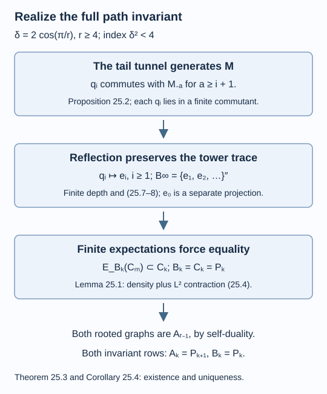

# A generating tail realizes the path invariant

The path-tail construction has more structure than an inclusion with the correct index. Its successive tails form an explicit generating Jones tunnel. Reflection turns the original generators into upward Jones projections. Conditional expectations onto finite tower levels then identify all the relative commutants. This proves that its principal graph is the intended path.

We assume [Removing a projection produces a subfactor](tail-inclusions.md), [Reflection, commuting squares and finite depth](higher-relative-commutants.md), [Reflected traces and a uniform bound along a tunnel](reflected-traces-and-uniform-bounds.md), [Why the discrete projection algebra is unique](discrete-projection-algebras.md), and [A path graph determines the whole invariant](path-graph-uniqueness.md). The graphs are interpreted through the alternating bimodules of lesson 19. References are [Jones] and [Popa].

Construction and proof sources: The actual tail inclusion and its shift are Theorem 11.5 of [Removing a projection produces a subfactor](tail-inclusions.md), using the path construction of [Paths, local projections and a faithful trace](path-models.md). Lemma 25.1 and Proposition 25.2 below give finite expectations and the generating tail; Theorem 25.3 identifies the complete invariant through [Reflected traces and a uniform bound along a tunnel](reflected-traces-and-uniform-bounds.md) and Theorem 13.4 of [Why the discrete projection algebra is unique](discrete-projection-algebras.md). Corollary 25.4 combines that actual realization with [A path graph determines the whole invariant](path-graph-uniqueness.md), retaining the separate identity case.

## Finite expectations detect a dense projection algebra

Start with any finite-index II₁ inclusion \(N\subseteq M\), its Jones tower \(M_k\), and its projections \(e_i\in M_{i+1}\). Put

\[
B_k=M'\cap M_k,\qquad
C_k=C^*(1,e_1,\ldots,e_{k-1})\subseteq B_k.
\tag{25.1}
\]

For \(k=0,1\), an empty generator list means \(\mathbb C1\). Let \(B_\infty\) be the tracial von Neumann closure of \(\bigcup_kB_k\) in the infinite tower. These algebras need not be factors for the following lemma.

**Lemma 25.1.** If \(m\geq k\), then

\[
E_{B_k}(C_m)\subseteq C_k.
\tag{25.2}
\]

If in addition \(B_\infty=(\bigcup_m C_m)''\), with the same tower trace, then \(B_k=C_k\) at every finite level.

**Proof.** For \(m\geq2\), the last-generator word reduction gives

\[
C_m=C_{m-1}+\operatorname{span}
(C_{m-1}e_{m-1}C_{m-1}).
\tag{25.3}
\]

The tower expectation from \(M_m\) to \(M_{m-1}\) fixes \(C_{m-1}\) and sends \(e_{m-1}\) to \(\lambda1\), where \(\lambda=[M:N]^{-1}\). Thus it takes \(ae_{m-1}b\) to \(\lambda ab\). Its image of \(C_m\) is contained in \(C_{m-1}\). Iteration proves

\[
E_{M_k}(C_m)\subseteq C_k
\]

for \(k\geq1\). At \(k=0\), the remaining algebra \(C_1\) is scalar and the expectation fixes it, giving the same conclusion. On \(B_m\), the ambient expectation onto \(M_k\) has image in \(B_k\): bimodularity with \(M\subseteq M_k\) preserves commutation with \(M\). Its restriction is trace-preserving and fixes \(B_k\), so it is \(E_{B_k}\). This proves (25.2).

Now suppose the stated closures agree. The increasing finite-dimensional union \(\bigcup_mC_m\) is dense in \(L^2(B_\infty)\). For \(x\in B_k\), choose \(y_j\) in that union converging to \(x\) in \(L^2\), with each chosen level at least \(k\). The trace expectation is an \(L^2\)-contraction and fixes \(x\), so

\[
\|x-E_{B_k}(y_j)\|_2\leq\|x-y_j\|_2\longrightarrow0.
\tag{25.4}
\]

Equation (25.2) puts every approximant on the left in \(C_k\). This finite-dimensional subspace is \(L^2\)-closed. Hence \(x\in C_k\), proving \(B_k\subseteq C_k\); the reverse inclusion was in (25.1). \(\square\)

The common trace in the closure hypothesis matters. Density in a different representation with a different trace would not justify (25.4).

## The tails form a generating tunnel

Fix \(r\geq4\), let \(\delta=2\cos(\pi/r)\), and use the \(A_{r-1}\) path model. Rename its projections \(q_i\) to distinguish them from the upward tower projections. Define

\[
M=\{q_1,q_2,\ldots\}'',\qquad
N=\{q_2,q_3,\ldots\}'',\qquad
M_{-a}=\{q_{a+1},q_{a+2},\ldots\}''\quad(a\geq0).
\tag{25.5}
\]

Theorem 11.5 gives \([M:N]=\delta^2<4\), and Proposition 11.2 gives normal trace-preserving shift isomorphisms. All these factors are separable and approximately finite dimensional.

**Proposition 25.2.** The sequence in (25.5) is a generating Jones tunnel for \(N\subseteq M\), with downward Jones projections

\[
e_{-i}=q_i\qquad(i\geq1).
\tag{25.6}
\]

The pair \(N\subseteq M\) is isomorphic to its dual pair \(M\subseteq M_1\).

**Proof.** Shift Theorem 11.5 by \(a\) generator positions. It identifies

\[
M_{-a-2}\subseteq M_{-a-1}\subseteq M_{-a}
\]

as a basic-construction triple with Jones projection \(q_{a+1}\). This is precisely (25.6).

For a fixed \(i\), the generator \(q_i\) commutes with every generator of \(M_{-a}\) whenever \(a\geq i+1\), by distance at least two. Normal commutation extends to that tail factor. Consequently

\[
q_i\in M_{-a}'\cap M\quad(a\geq i+1).
\]

These finite-dimensional downward relative commutants therefore generate \(M\), because they contain every \(q_i\). For \(i\geq2\), the same argument puts \(q_i\) in \(M_{-a}'\cap N\), so those relative commutants generate \(N\). This is the generating condition for both endpoints.

For self-duality, let \(K=\{q_3,q_4,\ldots\}''\). The normal shift \(s(q_i)=q_{i+1}\) is an isomorphism from \(M\) onto \(N\), carrying \(N\) onto \(K\). Extend this isomorphism of pairs to their first basic constructions, as in Proposition 12.1. The basic construction of \(K\subseteq N\) is \(M\), with Jones projection \(q_1\). Hence the extension is an isomorphism from \(M_1\) onto \(M\), carrying its subfactor \(M\) onto \(N\). This identifies the dual pair with the original pair. \(\square\)

This is an explicit tunnel for this construction; no existence theorem for arbitrary hyperfinite inclusions is needed here.

## Reflection identifies all finite relative commutants

**Theorem 25.3.** The path-tail pair (25.5) has endpoint-rooted principal and dual principal graphs \(A_{r-1}\). Its structured invariant is the path invariant of Theorems 23.2–23.4.

**Proof.** The index \(\delta^2<4\) gives finite depth by Theorem 12.7. Represent every finite upward level coherently on \(L^2(M)\) as in Proposition 14.2. With \(J\widehat x=\widehat{x^*}\), that proposition and (25.6) give

\[
e_i=Jq_iJ\qquad(i\geq1).
\tag{25.7}
\]

The projection \(e_0\) is the ordinary projection onto \(L^2(N)\); it is distinct from the list in (25.7).

Proposition 25.2 and Corollary 14.5 supply a normal trace-preserving anti-isomorphism from \(M\) onto the **tracial** relative-commutant limit \(B_\infty=M'\cap M_\infty\). On each finite downward relative commutant it is \(\Theta(x)=Jx^*J\). Since \(q_i\) is a projection, its image is \(e_i\) by (25.7). The original \(M\) is generated by all the \(q_i\). Therefore

\[
B_\infty=\{e_1,e_2,\ldots\}''
=\left(\bigcup_k C_k\right)'',
\tag{25.8}
\]

with the tower trace. Trace preservation here uses finite depth through Theorem 14.4. Equation (25.7) concerns the finite levels on \(L^2(M)\); (25.8) concerns the separately defined tracial completion. It does not assert a normal action of the completed infinite tower on \(L^2(M)\).

Lemma 25.1 now proves \(B_k=C_k\) at every level. The generator sequence in (25.7) is nondegenerate: the corresponding finite window of the \(q_i\) joins to one by Lemma 13.1, and conjugation preserves that join. Theorem 13.4 gives compatible generator-preserving isomorphisms

\[
B_k=C_k\cong P_k\qquad(k\geq0),
\tag{25.9}
\]

where \(P_k\) is the length-\(k\) algebra of the endpoint-rooted \(A_{r-1}\) path. Their traces agree by the Markov word recursion. Their inclusions and Jones projections are the canonical path inclusions and projections, so their old-block reflection is also the canonical one. The dual version of Theorem 19.3 identifies the dual principal graph with that path, including its root.

Self-duality from Proposition 25.2 identifies the original principal graph with the same rooted path. Theorems 23.2–23.4 then give the entire first row \(A_k=P_{k+1}\), the second row \(B_k=P_k\), and their full inclusion, trace and projection structure. \(\square\)

*Figure 25.1. The first implication uses the trace-preserving reflection at finite depth and sends \(q_i\) to \(e_i\) for \(i\geq1\). The second uses the exact expectation range (25.2) and contraction (25.4), rather than a comparison of block counts. The final graph identification uses (25.9) and self-duality. [Editable figure source](figures/path-realization.py).*

## Existence and uniqueness of every path pair

**Corollary 25.4.** For every \(\ell\geq2\), exactly one conjugacy class of separable hyperfinite II₁ inclusions has endpoint-rooted principal graph \(A_\ell\). Its index is \(4\cos^2(\pi/(\ell+1))\), its dual graph is the same rooted path, and its depth is \(\ell-1\) in convention (12.7).

**Proof.** For \(\ell\geq3\), take \(r=\ell+1\) in Theorem 25.3. It gives an actual pair with that graph and the stated index. Corollary 23.5 gives at most one conjugacy class, hence exactly one. For \(\ell=2\), use the identity inclusion of the hyperfinite II₁ factor, whose graph is \(A_2\) by Exercise 12.1 and whose index is one.

For the depth, the central support of \(e_k\) in \(A_{k+1}=P_{k+2}\) misses exactly the scalar frontier block when a new endpoint at distance \(k+2\) still appears. The greatest distance in \(A_\ell\) is \(\ell-1\). Thus \(z_k\ne1\) for \(k\leq\ell-3\), and \(z_k=1\) for \(k\geq\ell-2\). Convention (12.7) gives depth \(\ell-1\). At \(\ell=2\) this is the separately computed depth one. \(\square\)

The proof supplies graph realization and uniqueness, together with the structured invariant. These are stronger conclusions than realizing the same numerical index by an unrelated inclusion.

## Exercises

**Exercise 25.1 — introductory.** For \(A_4\), identify \(B_3\), \(A_3\), the index and the depth of the realized pair.

**Solution.** The path tables give \(B_3=P_3=M_2\oplus\mathbb C\) and \(A_3=P_4=M_2\oplus M_3\). The index is \((3+\sqrt5)/2\) and the depth is three.

**Exercise 25.2 — intermediate.** Why does \(q_i\in M_{-a}'\cap M\) require \(a\geq i+1\) in the generating-tunnel proof?

**Solution.** The earliest generator of \(M_{-a}\) is \(q_{a+1}\). To use distant commutation with \(q_i\), its index must be at least \(i+2\). Thus \(a+1\geq i+2\), or \(a\geq i+1\). Distance one would invoke an adjacent relation instead of commutation.

**Exercise 25.3 — intermediate.** In Lemma 25.1, compute \(E_{B_2}(e_1e_2e_3e_2e_1)\).

**Solution.** The adjacent relations reduce the word to \(\lambda e_1e_2e_1=\lambda^2e_1\). This already belongs to \(C_2=C^*(1,e_1)\), so the expectation fixes it. Equivalently apply the successive tower expectations using (25.3), obtaining the same element.

**Exercise 25.4 — advanced.** Explain why the density conclusion (25.8) is stronger than saying that the abstract algebra generated by the Jones projections is a path algebra.

**Solution.** The abstract path-algebra identification describes the subalgebras \(C_k\). It alone leaves open extra elements of \(B_k\). Equation (25.8) says their union is dense in the entire relative-commutant limit with its actual tower trace. The expectation range (25.2) then forces each extra candidate in \(B_k\) to be approximated inside \(C_k\), which is finite dimensional and closed. This proves equality. The proof uses the discrete finite-depth trace agreement and does not infer that agreement from continuous-parameter projection relations alone.

## References

- Vaughan F. R. Jones, [*Index for subfactors*](https://doi.org/10.1007/BF01389127), Inventiones Mathematicae 72 (1983), 1–25.
- Sorin Popa, [*Classification of subfactors: the reduction to commuting squares*](https://doi.org/10.1007/BF01231494), Inventiones Mathematicae 101 (1990), 19–43.

*Written by GPT-6.1 Sol (OpenAI), Ultra reasoning effort, September 2026. Self-checked by the writing AI. Public domain (CC0).*
