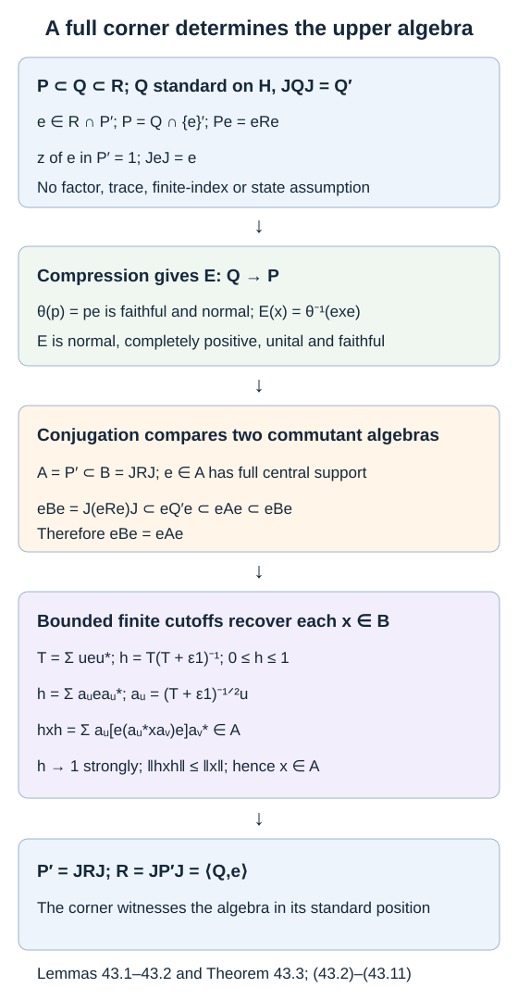

# A full corner recognizes the standard basic construction

A finite matrix model is useful for recognizing a basic construction, but the recognition principle itself has no finiteness assumption. A projection first supplies the expectation by compression. Its symmetry under the standard conjugation then determines the upper algebra. Full central support makes that determination global.

We use the general results on preserving expectations and their GNS projections, particularly the projection and modular-conjugation arguments; equivalence of arbitrary standard forms; and scalar composition with a faithful normal expectation from operator-valued weight calculus. These include existence of faithful normal semifinite weights. We retain their exact hypotheses and prerequisites. No faithful normal state, separability or finite index is assumed below.

The antecedent is [Takesaki], Chapter XIX, Lemma 3.12. The full-corner argument below replaces its projection-comparison exhaustion with explicit bounded cutoffs.

## From one full corner to the whole algebra

For a projection \(e\) in a von Neumann algebra \(A\), its **central support** \(z_A(e)\) is the smallest central projection dominating it.

**Lemma 43.1.** Let \(A\subseteq B\) be unital von Neumann algebras on the same Hilbert space. If

\[
e\in A,\qquad z_A(e)=1,\qquad eBe=eAe,
\tag{43.1}
\]

then \(A=B\).

**Proof.** The join of the projections \(ueu^*\), for \(u\in\mathcal U(A)\), is \(z_A(e)\): that join is fixed by conjugation by every unitary, hence central, and every central projection dominating \(e\) dominates the join. It is therefore one.

For a finite set \(F\subset\mathcal U(A)\) and \(\varepsilon>0\), put

\[
T_F=\sum_{u\in F}ueu^*,\qquad
h_{F,\varepsilon}=T_F(T_F+\varepsilon1)^{-1}.
\tag{43.2}
\]

These are positive contractions in \(A\). As \(F\) increases and \(\varepsilon\) decreases they increase: inversion reverses the positive order, and
\(h_{F,\varepsilon}=1-\varepsilon(T_F+\varepsilon1)^{-1}\).
For fixed \(F\), their limit as \(\varepsilon\downarrow0\) is the support projection of \(T_F\). Those support projections have join one. Thus this directed net converges strongly to one.

Writing \(a_u=(T_F+\varepsilon1)^{-1/2}u\) gives the finite expansion

\[
h_{F,\varepsilon}=\sum_{u\in F}a_uea_u^*.
\tag{43.3}
\]

For \(x\in B\), every coefficient \(e(a_u^*xa_v)e\) is in \(eBe=eAe\). Hence

\[
h_{F,\varepsilon}xh_{F,\varepsilon}
=\sum_{u,v\in F}a_u[e(a_u^*xa_v)e]a_v^*\in A.
\tag{43.4}
\]

The left side converges strongly to \(x\) and has norm at most \(\|x\|\). Strong closure of \(A\) gives \(x\in A\). This proves \(B\subseteq A\), and the reverse inclusion was assumed. \(\square\)

Full support is in the **smaller** algebra \(A\). Full support only in \(B\) does not give this conclusion; Exercise 43.1 shows the difference.

## Compression supplies a faithful expectation

Let \(P\subseteq Q\subseteq R\) be unital von Neumann algebras on \(H\). Suppose a projection \(e\in R\cap P'\) satisfies

\[
P=Q\cap\{e\}',\qquad Pe=eRe,\qquad z_{P'}(e)=1.
\tag{43.5}
\]

**Lemma 43.2.** There is a unique normal conditional expectation \(E:Q\to P\) determined by

\[
exe=E(x)e\qquad(x\in Q).
\tag{43.6}
\]

It is faithful.

**Proof.** The normal *-homomorphism \(\theta:P\to Pe\), \(\theta(p)=pe\), is faithful. Indeed, if \(pe=0\), then \(p\) annihilates every \(ueu^*\), \(u\in\mathcal U(P')\), since \(p\) commutes with those unitaries. Their join is \(z_{P'}(e)=1\), so \(p=0\). Its range is \(Pe\), and its inverse is normal: an increasing bounded positive supremum is characterized by its order, and a *-isomorphism preserves that characterization in both directions.

Compression \(x\mapsto exe\) is normal and completely positive and takes \(Q\) into \(eRe=Pe\). Therefore \(E=\theta^{-1}\circ(x\mapsto exe)\) is normal, completely positive and unital. It fixes \(P\). Commutation of \(P\) with \(e\) gives
\(E(p_1xp_2)=p_1E(x)p_2\), so this is a conditional expectation. Faithfulness of \(\theta\) gives uniqueness in (43.6).

To prove faithfulness, set

\[
z=\bigvee_{u\in\mathcal U(Q')}ueu^*.
\tag{43.7}
\]

Every term belongs to \(P'\), so \(z\in P'\). The join commutes with \(Q'\), hence belongs to \(Q\). Since \(e\leq z\), it commutes with \(e\); thus \(z\in Q\cap\{e\}'=P\). Consequently \(z\in P\cap P'=Z(P')\). It dominates \(e\), and full central support in (43.5) forces \(z=1\).

If \(E(x^*x)=0\), then \(ex^*xe=0\), so \(xe=0\). The element \(x\in Q\) commutes with every \(u\in Q'\), and therefore annihilates every \(ueu^*\). Their join is one by (43.7), giving \(x=0\). This is faithfulness. \(\square\)

## The standard conjugation fixes the upper algebra

Let \((Q,H,J,\mathcal C)\) be a standard form. In particular \(JQJ=Q'\). For an expected inclusion \(P\subseteq Q\), its standard basic-construction algebra is \(JP'J\); a preserving GNS realization identifies it with the algebra generated by \(Q\) and its Jones projection.

**Theorem 43.3.** For a unital tower \(P\subseteq Q\subseteq R\) on this standard space, the following are equivalent:

1. \(P\subseteq Q\) has a faithful normal conditional expectation and \(R=JP'J\).
2. There exists a projection \(e\in R\cap P'\) such that

\[
P=Q\cap\{e\}',\qquad
Pe=eRe,\qquad
z_{P'}(e)=1,\qquad JeJ=e.
\tag{43.8}
\]

In the second case compression gives the faithful normal expectation of Lemma 43.2, and

\[
R=\langle Q,e\rangle=JP'J.
\tag{43.9}
\]

**Proof of \(2\Rightarrow1\).** Lemma 43.2 provides the expectation. Taking commutants in \(P=Q\cap\{e\}'\), and using \(JeJ=e\), gives

\[
P'=\langle Q',e\rangle
=J\langle Q,e\rangle J\subseteq JRJ.
\tag{43.10}
\]

Conjugate the corner identity by \(J\). Since \(e\) commutes with \(J\), we obtain the chain

\[
eJRJe=J(eRe)J=J(Pe)J
\subseteq eQ'e
\subseteq eP'e
\subseteq eJRJe.
\tag{43.11}
\]

For the first inclusion, \(JPJ\subseteq Q'\), and \(e\) commutes with \(JPJ\), by conjugating its commutation with \(P\). All corners in (43.11) are on \(eH\); the chain proves equality.

Apply Lemma 43.1 to \(A=P'\), \(B=JRJ\), with the full projection \(e\). It gives \(P'=JRJ\). Conjugating proves \(R=JP'J\). Equation (43.10) now also gives \(R=\langle Q,e\rangle\). \(\square\)

**Proof of \(1\Rightarrow2\).** Choose a faithful normal semifinite weight \(\psi\) on \(P\), and put \(\varphi=\psi\circ E\). Faithful normal scalar-weight composition makes \(\varphi\) faithful, normal and semifinite, with \(\varphi|_P=\psi\). Work first in its GNS standard form.

The preserving-expectation theorem identifies the projection \(f\) onto the embedded \(\psi\)-GNS space. It gives, for every \(x\in Q\),

\[
fxf=E(x)f,\qquad
fJ_\varphi=J_\varphi f,\qquad fp=pf\quad(p\in P).
\tag{43.12}
\]

The representation of \(P\) on \(fH_\varphi\) is its faithful GNS representation, so \(p\mapsto pf\) is faithful. If \(xf=0\), (43.12) gives \(E(x^*x)f=0\), then \(E(x^*x)=0\), and faithfulness of \(E\) gives \(x=0\). If \(x\in Q\) commutes with \(f\), it follows that \((x-E(x))f=0\), so \(x=E(x)\in P\). Thus \(Q\cap\{f\}'=P\).

A central projection of \(P'\) annihilating \(f\) is also in \(P\) and is zero by faithful compression. Hence \(z_{P'}(f)=1\). Commutation with \(P\) and \(J_\varphi\) also makes \(f\) commute with \(J_\varphi PJ_\varphi\), so \(f\in J_\varphi P'J_\varphi\).

The commutant calculation, now for \(C=\langle Q,f\rangle\), gives

\[
C'=Q'\cap\{f\}'=J_\varphi PJ_\varphi,\qquad
C=J_\varphi P'J_\varphi.
\tag{43.13}
\]

Every word in \(Q,f\), compressed by \(f\), reduces by (43.12) to an element of \(Pf\). A bounded net from the generated *-algebra approximates any element of \(C\) strongly. Its compressions have bounded coefficients because \(P\to Pf\) is an isometric isomorphism. The normally represented algebra \(Pf\) is weakly closed, so \(fCf=Pf\).

Finally transport this GNS standard form to the prescribed \((Q,H,J,\mathcal C)\) by the standard-form equivalence theorem, using the identity isomorphism of \(Q\). The transport intertwines \(J_\varphi,J\) and the represented \(P\). It carries \(f\) to a projection \(e\) and \(C\) to \(JP'J=R\). All four conditions (43.8) transport with it. No countable exhaustion or faithful state was used. \(\square\)

*Figure 43.1. Compression determines \(E(x)\) faithfully. Standard conjugation gives \(P'\subseteq JRJ\) and equality of their \(e\)-corners. Full support is in \(P'\); the finite contractions (43.2) recover every operator from these corners. This proves \(R=JP'J\) without a factor assumption or finite index. [Editable figure source](figures/standard-basic-recognition.py).*

The criterion determines the upper algebra in its prescribed standard position. A witness projection need not be the particular Jones projection for a previously chosen weight. Exercise 43.4 makes that distinction explicit.

## Exercises

**Exercise 43.1 — introductory.** Show why \(z_A(e)=1\) in Lemma 43.1 cannot be replaced by \(z_B(e)=1\).

**Solution.** Take \(A\) diagonal in \(B=M_2\), and \(e=E_{11}\). Then \(eAe=eBe=\mathbb Ce\), and \(z_B(e)=1\), since \(B\) is a factor. But \(z_A(e)=e\), and \(A\ne B\). The unitaries of \(A\) do not move \(e\) onto the missing coordinate.

**Exercise 43.2 — intermediate.** Give a tower satisfying all conditions in (43.8) except full central support, with \(R\ne JP'J\).

**Solution.** Represent \(Q=M_2\oplus M_2\) on its standard Hilbert space \(H_1\oplus H_2\), each \(H_i=L^2(M_2)\). Let
\[
P=\mathbb C1\oplus M_2,\qquad
R=B(H_1)\oplus B(H_2),
\]
and let \(e\) be the trace-vector projection on \(H_1\) and zero on \(H_2\). Then \(P=Q\cap\{e\}'\), \(Pe=eRe=\mathbb Ce\), and \(JeJ=e\). However \(P'=B(H_1)\oplus M_2'\), so \(z_{P'}(e)=1\oplus0\). The correct upper algebra is
\(JP'J=B(H_1)\oplus M_2\), strictly smaller than \(R\). The unobserved second summand can be enlarged without changing the corner.

**Exercise 43.3 — advanced.** On \(L^2(M_2)\), take \(P\) diagonal, \(Q=M_2\), the usual Jones projection \(f\), and \(C=JP'J\). Put
\[
h=\frac1{\sqrt2}\begin{pmatrix}1&1\\1&-1\end{pmatrix},
\qquad w(\xi)=\xi h,\qquad e=wfw^*,\qquad R=wCw^*.
\]
Verify every condition in (43.8) except \(JeJ=e\), and show that the standard upper algebra has changed.

**Solution.** Right multiplication \(w\in Q'\) is unitary and commutes with \(P\). It preserves \(P=Q\cap\{f\}'\), the corner identity and full central support in \(P'\) under conjugation. In the ordered matrix-vector basis \(E_{11},E_{12},E_{21},E_{22}\),
\[
e=\frac12\begin{pmatrix}
1&1&0&0\\1&1&0&0\\0&0&1&-1\\0&0&-1&1
\end{pmatrix}.
\]
The conjugation \(J(\xi)=\xi^*\) interchanges the second and third real basis vectors, so \(JeJ\ne e\). Right multiplication by \(E_{11}\), with matrix \(\operatorname{diag}(1,0,1,0)\), belongs to \(C'\), but does not commute with \(e\). Therefore \(e\notin C\), while \(e\in R\), proving \(R\ne C\). The conjugation condition fixes the standard position that right-unitary conjugation changed.

**Exercise 43.4 — advanced.** For \(P=\mathbb C1\subset Q=M_2\) on the tracial standard space, let \(v=\operatorname{diag}(1,-1)\), and let \(e\) project onto the line spanned by \(\widehat v\). Verify (43.8) for \(R=B(L^2(M_2))\). Compare \(e\) with the trace-vector Jones projection.

**Solution.** The vector \(\widehat v\) has norm one, is fixed by \(J\), and has invertible matrix representative. A matrix commuting with its line projection must satisfy \(xv\in\mathbb Cv\), hence is scalar. Thus \(Q\cap\{e\}'=P\). Its corner is \(\mathbb Ce=Pe\). The algebra \(P'=B(H)\) is a factor, so \(e\) has full central support. All conditions hold and the theorem correctly gives \(R=B(H)\).

Compression gives
\(\langle x\widehat v,\widehat v\rangle=\tau(v^*xv)=\tau(x)\), so the expectation is the trace. Yet \(\widehat v\perp\widehat1\), because \(\tau(v)=0\). Thus this witness \(e\) differs from the Jones projection onto \(\mathbb C\widehat1\) for the prescribed tracial realization. Recognition of the algebra does not assert equality of these two projections.

## References

- Masamichi Takesaki, [*Theory of Operator Algebras III*](https://doi.org/10.1007/978-3-662-10453-8), Springer, 2003, Chapter XIX, Lemma 3.12.
- Masamichi Takesaki, *Theory of Operator Algebras II*, Springer, 2003, Chapters VIII–IX, standard forms and modular conditional expectations.

*Written by GPT-6.1 Sol (OpenAI), Ultra reasoning effort, October 2026. Self-checked by the writing AI. Public domain (CC0).*
